# Part 25 - ONTAP Eventing, Logs, EMS, Audit, Service Processor, and Evidence Sources

> **Section goal:** Learn what each ONTAP evidence source observes, how to build a trustworthy UTC timeline, and how to turn events, audit records, jobs, health state, out-of-band hardware logs, traces, dumps, performance archives, and support bundles into a bounded diagnosis and escalation. By the end, Arti should be able to separate signal from noise, preserve privacy, and state what evidence can and cannot prove.

Covers index item **25** and maps directly to job-description responsibilities for customer-data generation and analysis, risk/stability reporting, service reviews, major incidents, support-experience improvement, preventative recommendations, evidence quality, and escalation packages.

Exact **Event Management System (EMS)** severities, fields, event names/catalog entries, notification destinations, audit records, system-health monitors, job history, log locations/retention, Service Processor (SP) or Baseboard Management Controller (BMC) behavior, packet traces, performance archives, core/dump collection, commands, REST resources, and support bundles vary by ONTAP release and platform. Use current official documentation and NetApp Support guidance; never invent event semantics or low-level collection procedures.

> **Evidence and experience boundary:** Every system, event, timestamp, log, trace, and diagnosis below is synthetic. Arti's factual strengths are Microsoft enterprise escalation, CRITSIT timelines, Windows/Azure/network evidence, analytics, customer communication, and Product/Engineering collaboration. She does **not** claim production ONTAP EMS, SP/BMC, core, packet trace, performance archive, or support-bundle collection experience.

---

## 1. Evidence is a set of camera angles

### Plain-English deep-dive: no single camera records the whole incident

EMS is the storage operating system's event camera. Audit is the access-control camera showing administrative requests. Job history is the delivery tracker. The SP/BMC is a separate building-security camera that can remain available when the main office is down. Packet capture sees messages at one network point. Performance archives show resource behavior over intervals. Core dumps preserve failure state for specialists. **Why it matters:** agreement among independent angles raises confidence; one source alone rarely proves end-to-end root cause.

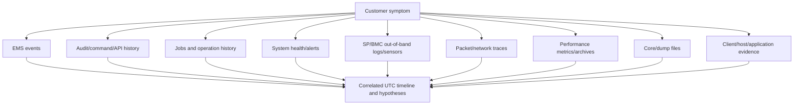

### Evidence-source matrix

| Source | Primary field of view | Strong use | Cannot prove alone |
|---|---|---|---|
| EMS | ONTAP-detected events/conditions | What ONTAP reported, when, on which node/object | User impact or root cause |
| Audit | Administrative commands/API requests and outcomes under current audit | Who requested what through which interface | Why the human intended it or every internal effect |
| Job history | Asynchronous operation state/progress/result | Whether accepted work completed or failed | Application outcome |
| System health | Monitored subsystem alerts/state | Current/recorded health finding and affected resource | Complete cluster/application health |
| SP/BMC | Out-of-band platform sensors, power, hardware/console context | Hardware state when ONTAP is unavailable | File/LUN/application semantics |
| Packet trace | Visible network packets at one point | Handshake, loss, reset, protocol timing | Traffic outside capture point or unencrypted internal cause |
| Performance archive | Time-series counters and workload/resource behavior | Baselines, saturation and correlated intervals | Causation from correlation alone |
| Core/dump | Process/kernel failure state | Specialist crash analysis | Normal operation, full history or customer impact |
| AutoSupport | Packaged support/telemetry message | Support context and broader evidence collection | One real-time log or guaranteed complete history |

---

## 2. EMS: Event Management System

The **Event Management System (EMS)** records named ONTAP events with severity, source/object context, message text/parameters, sequence/time information, and documented descriptions/corrective actions where available. Exact fields and event catalog behavior are release-sensitive.

### Plain-English deep-dive: alarm code plus operating manual

An EMS message is like a building alarm containing a code, severity, origin, time, and parameters. The **event catalog** is the operating manual explaining what that code means and what response is documented. The alarm does not prove how many customers were affected or whether the condition caused another symptom. **Why it matters:** use the exact message name and current catalog, not a paraphrased screenshot.

### Severity orientation

Current ONTAP documentation commonly presents severities such as **emergency**, **alert**, **error**, **notice**, **informational**, and **debug**. The exact labels/filter behavior and meaning must come from the current release.

| Severity orientation | Plain meaning | TAM action |
|---|---|---|
| Emergency | Extremely severe condition requiring immediate attention | Confirm scope/impact, engage incident/Support path, preserve evidence |
| Alert | Significant condition requiring prompt action | Validate applicability and urgency; assign owner/checkpoint |
| Error | Fault/error detected; impact varies | Correlate with resource state and customer symptom |
| Notice | Normal but significant condition or state change | Determine whether expected change or relevant precursor |
| Informational | Routine operational information | Useful timeline/context; usually not an alert by itself |
| Debug | Detailed diagnostic information where enabled/available | High volume/specialist use; collection can have overhead/privacy implications |

Severity is vendor event severity, not customer business priority. A notice for a planned takeover can be high business relevance; an error on an unused object can have low immediate impact.

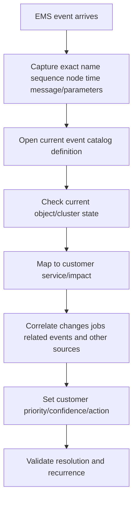

### Event fields to preserve

- Exact event/message name and sequence/identifier where exposed.
- Severity as recorded, not manually upgraded/downgraded.
- Node, subsystem, SVM, volume, disk, port, or other object parameters.
- Raw timestamp, timezone/UTC conversion and clock status.
- Message text and structured parameters.
- Catalog description, cause and corrective action for exact release.
- Repetition count/rate and first/last occurrence.
- Notification destination/action and acknowledgement/handling where applicable.

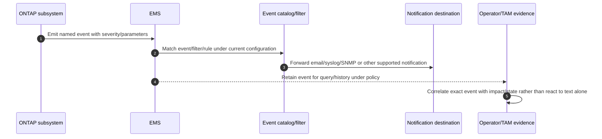

---

## 3. Event catalog, messages, and corrective action

The EMS event catalog documents event definitions for a release. Event names can be stable for long periods, but severity, parameters, description, corrective action, applicability, or deprecation can change.

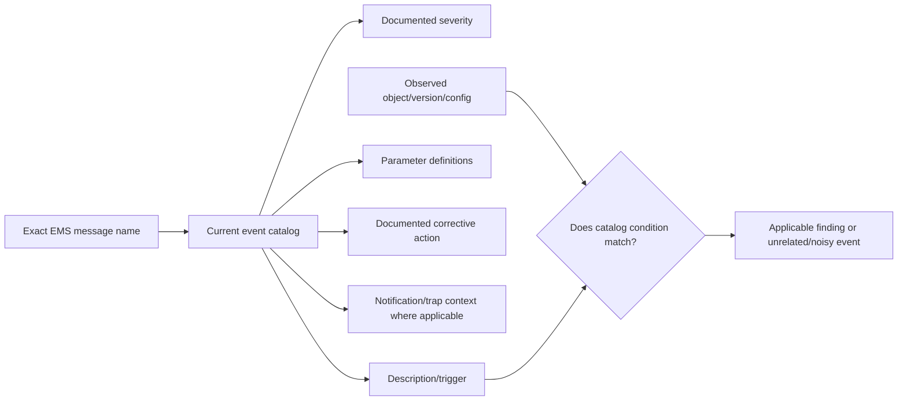

### Message interpretation checklist

1. Is this exact message name from the affected release?
2. Which parameter identifies the object or path?
3. Is it the first event, a consequence, or recovery notification?
4. Did a planned change intentionally trigger it?
5. Is the condition current or historical?
6. Does the documented corrective action require customer admin, NetApp Support, hardware service, network, host, or application owner?
7. What completion evidence closes the event and the customer risk?

Do not search a generic web snippet and apply another release's corrective action. Do not suppress an event because it is repetitive before understanding why it repeats.

---

## 4. Event destinations, filters, and notifications

ONTAP can route selected events to supported destinations such as email, syslog and SNMP-related receivers under current configuration. Exact destination types, filters/rules, formatting, security and commands change by release.

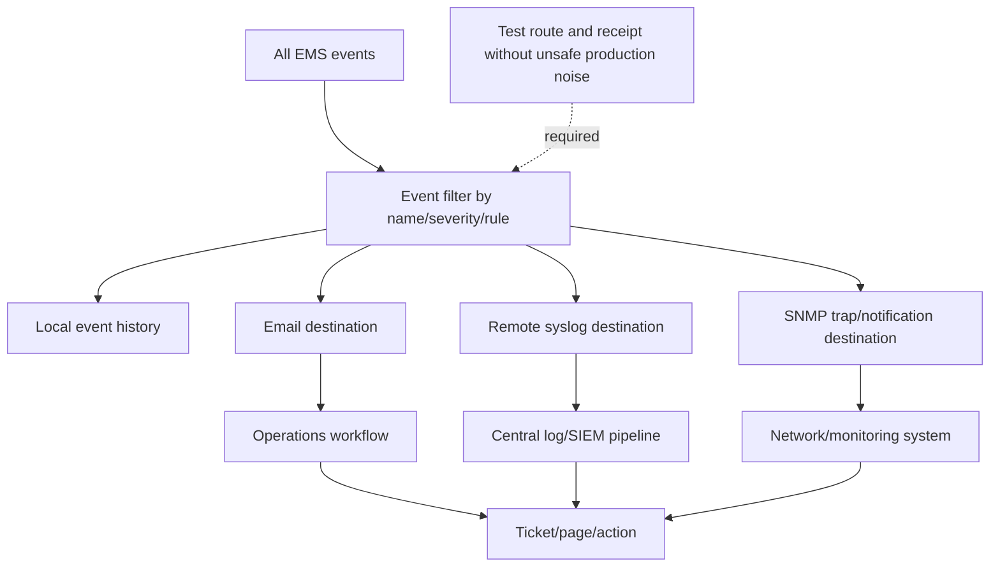

### Notification design questions

- Which event names/severities generate page, ticket, email, dashboard, or archive only?
- Is the destination reachable through the correct management LIF/route/DNS/time/certificate context?
- Are transport security, sender identity, SNMP version, syslog/TLS and secrets configured under policy?
- Does the receiving system deduplicate, rate-limit, preserve raw parameters and correlate recovery events?
- Who owns each route and what happens when the destination is down?
- Is there a test event/current documented validation procedure?

### Alert lifecycle

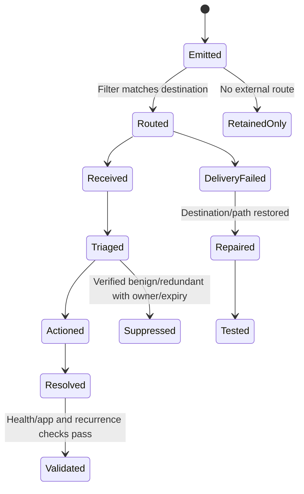

An event is not managed merely because a ticket was created. Closure requires technical and business validation.

---

## 5. Noisy versus actionable alerts

### Plain-English deep-dive: smoke detector, burnt toast, and a real fire

A detector can be functioning correctly while firing repeatedly from burnt toast. Removing its battery stops noise but removes protection. Improve the sensor placement/rule or the process producing smoke. **Why it matters:** suppression without cause, owner, scope, expiry and alternative detection creates a blind spot.

### Actionability framework

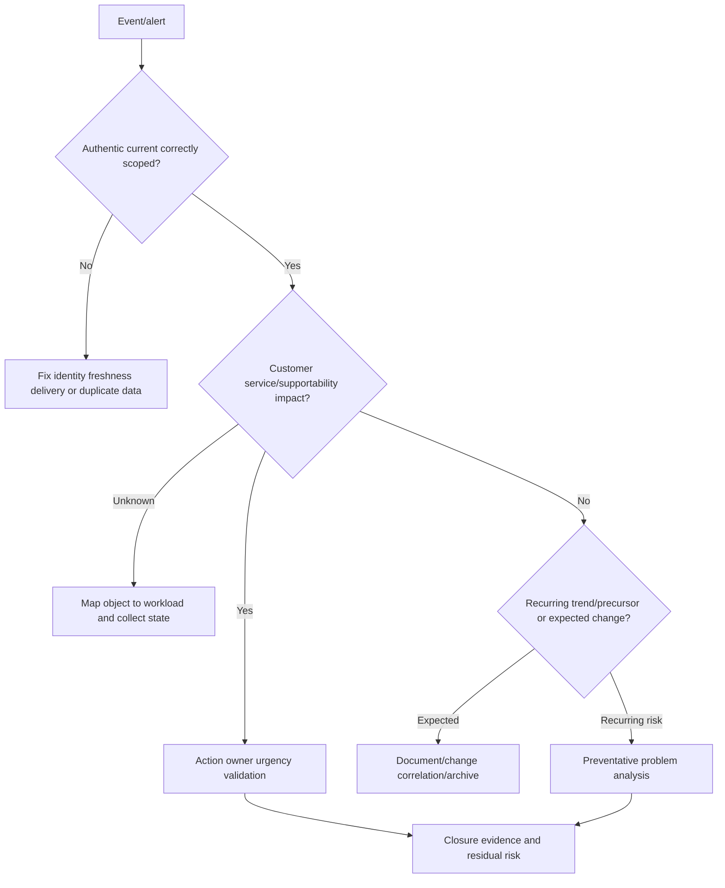

### Noise patterns

| Pattern | Risk | Better action |
|---|---|---|
| Same event floods every minute | Important new events can be hidden | Find repeated trigger, rate and recovery state; fix cause/filter carefully |
| Parent fault creates many child alerts | Duplicate tickets fragment ownership | Correlate topology/timeline and retain one primary incident with child evidence |
| Recovery event missing | Alert stays open or appears chronic | Validate notification route and current state; do not assume recovery |
| Planned change pages operators | Alert fatigue | Maintenance/change-aware handling with bounded suppression and audit |
| Informational event escalated as outage | Wastes response and customer trust | Separate event severity from business impact |
| Error suppressed as `known` forever | Residual risk becomes invisible | Owner, rationale, expiry, monitoring and accepted-risk review |

### TAM recommendation fields for alert hygiene

Event name/version, population, first/last/rate, affected service, false/true-positive evidence, primary/secondary relationship, owner, route, action, suppression scope/expiry, alternative detection, validation, and residual risk.

---

## 6. Audit logs and administrative history

Audit records capture supported administrative activity such as CLI commands and API requests through management interfaces, with identity, scope, time, operation, and outcome fields according to current ONTAP configuration. Audit is evidence of a request; it is not the same as an EMS event or a completed job.

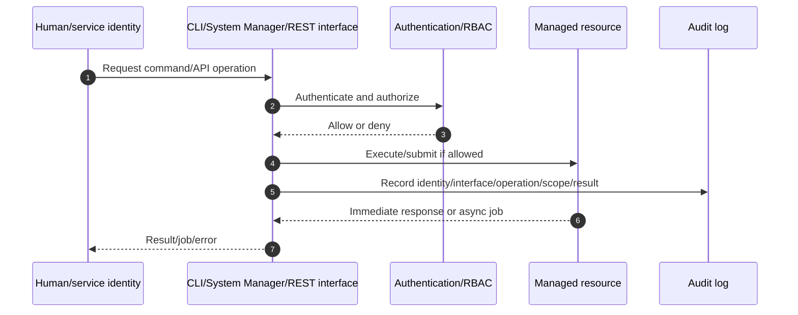

### Audit questions

| Question | Evidence |
|---|---|
| Who initiated the change? | Authenticated identity/service account; beware shared accounts |
| Through which interface/source? | CLI, HTTP/API/System Manager, source address/session where exposed |
| What was requested? | Command/API operation and target, redacted safely |
| Was it authorized/accepted? | RBAC/result/status |
| Did it complete? | Job/resource/event and postcondition, not audit request alone |
| Was it approved? | External customer change/decision record; ONTAP cannot prove business approval by itself |

### Audit correlation

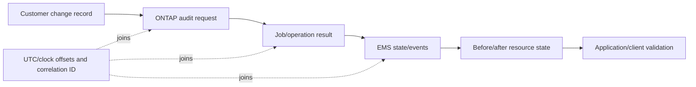

Shared administrator accounts destroy attribution. Service accounts need code/version/job/change correlation to identify the actual automation run.

---

## 7. Jobs, operation history, and state transitions

Part 24 introduced asynchronous jobs. In incident analysis, job history answers whether a move, create, delete, upgrade, replication, or other operation queued, ran, failed, was cancelled, or completed.

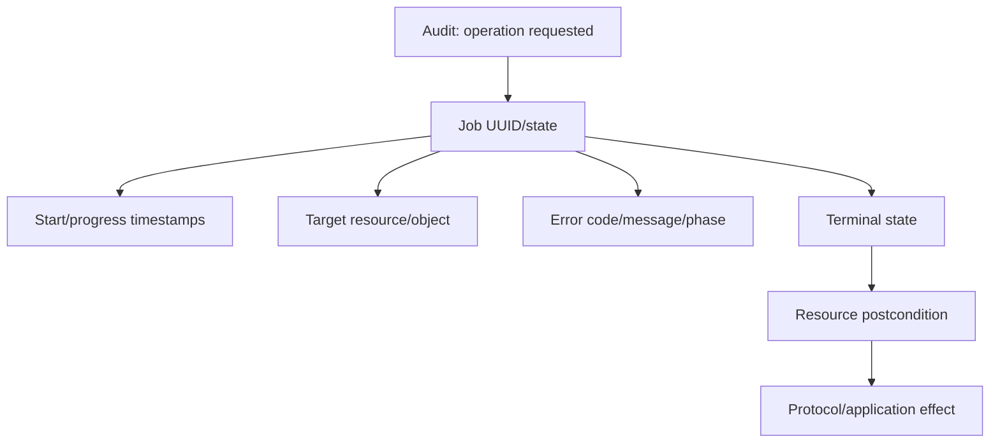

### Job evidence pitfalls

- Old completed job is mistaken for current operation.
- Client timeout is treated as job failure.
- `Success` is treated as application success.
- Job error text is copied without phase/target/current state.
- Retry creates another job and obscures the first.
- Retention expired before incident review.

Capture job UUID, operation, target stable ID, initiator, start/end, state/progress, error, dependencies, events and postcondition.

---

## 8. System health, alerts, and monitoring state

ONTAP system-health features monitor selected subsystems/resources and report health alerts/status under release-specific monitors. A health alert is a structured finding, not a complete root cause.

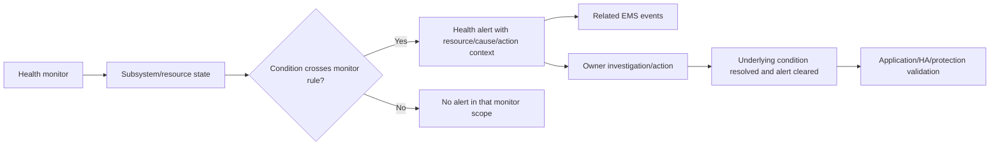

### What `healthy` does not prove

- Every client path and application works.
- Every protocol is authorized/configured correctly.
- No latent hardware or performance problem exists.
- Backups/restores meet RPO/RTO.
- No security exposure exists outside monitored rules.
- Events/telemetry are fresh and complete.

Use health status as one source, with monitor scope/version and current resource evidence.

---

## 9. SP/BMC and out-of-band hardware evidence

The **Service Processor (SP)** or **Baseboard Management Controller (BMC)** is an out-of-band management controller used for platform monitoring/management even when ONTAP is unavailable, under exact platform capability. Terminology and interfaces vary by hardware generation.

### Plain-English deep-dive: emergency building panel outside the main office

The SP/BMC is an emergency panel with its own management path, sensors, event history and console access. It can report power, temperature or boot state when the main ONTAP office is offline. It does not understand the user's file operation. **Why it matters:** an independent out-of-band view can disambiguate OS failure from power/hardware state, but it creates a highly privileged security boundary.

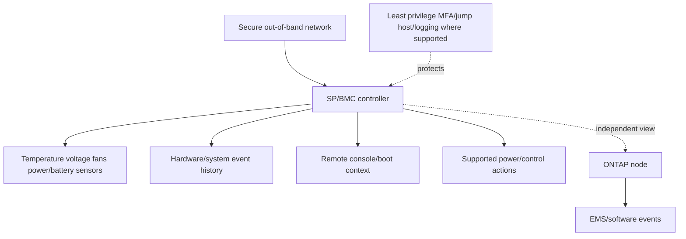

### SP/BMC evidence

- Platform/node/serial identity and SP/BMC firmware/version.
- Management network reachability and clock/timezone.
- Power supply, fan, temperature, voltage, battery/NVRAM-related sensor status where exposed.
- Boot/reset/power/watchdog/console events.
- Hardware-assisted takeover signals where applicable.
- Administrative logins/actions.

Never power-cycle, reset, update firmware or clear SP/BMC logs merely to test an alert without current platform procedure, HA/application impact review and Support ownership.

---

## 10. AutoSupport is distinct and deferred

**AutoSupport** creates and sends structured support messages containing system configuration, status, events and diagnostic information according to configuration, trigger/schedule, transport, privacy, entitlement and destination. It is not identical to EMS, a support bundle, or a continuous log stream.

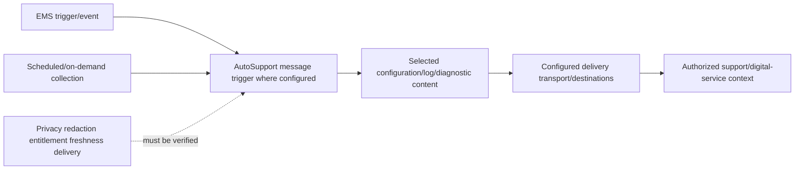

Part 47 covers AutoSupport architecture, delivery, privacy and troubleshooting. In this Part remember:

- EMS says an event occurred; AutoSupport may package related context.
- An AutoSupport delivery failure does not erase local EMS evidence but creates support visibility risk.
- A successful message does not prove every desired log/time window was included.
- Never invent access to customer AutoSupport or Active IQ/Digital Advisor data.

---

## 11. Core files, dumps, panic evidence, and crash context

A **core file** or **dump** captures selected memory/process/system state after a failure so qualified specialists can analyze code paths and state. Exact dump types, triggers, locations, collection/upload and retention are release/platform specific.

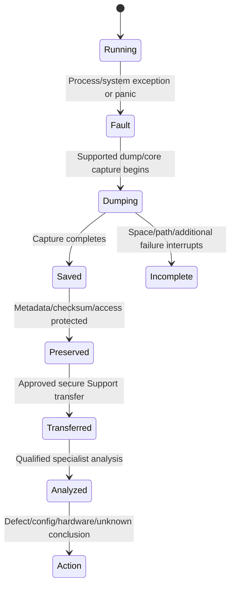

### Dump handling

- Preserve exact node/release/build, failure/panic string, dump identity, creation time, completeness and available space.
- Do not open or distribute customer dumps casually; memory can contain credentials, keys, file data, network content and personal information.
- Use approved encrypted transfer and least privilege.
- Do not delete old dumps until Support confirms they are irrelevant and capacity risk is managed.
- A dump can reveal the failure context but may not contain the earlier trigger; correlate preceding EMS, audit, jobs, hardware and workload.

---

## 12. Packet traces and network evidence

A packet trace records traffic visible at a selected interface/path. Collection can consume CPU/storage, expose data and miss traffic due to offload, encryption, asymmetric paths or filter errors. Exact ONTAP packet-trace commands and capabilities are version-sensitive and must follow current documentation/Support guidance.

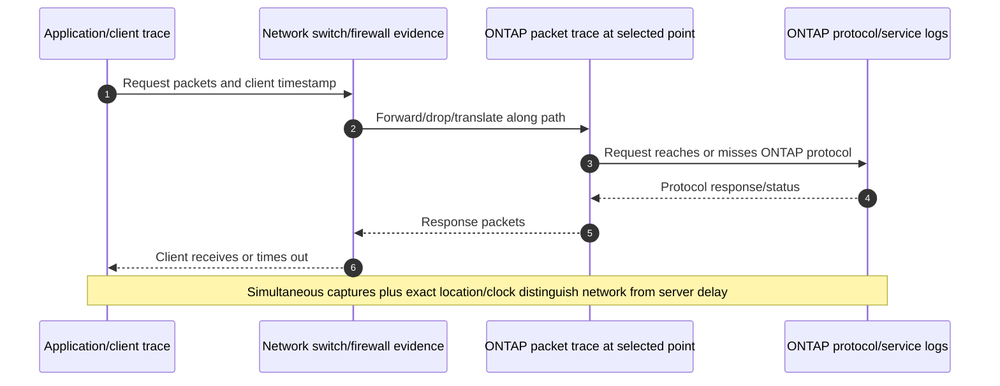

### Trace plan

| Field | Requirement |
|---|---|
| Question | Exact flow/operation/hypothesis the trace can disconfirm |
| Scope | Client/server IP/port/protocol/LIF/interface and time window |
| Safety | Authorization, filter, duration, file-size/ring/stop limits |
| Privacy | Encryption, payload/identity exposure, retention/access/transfer |
| Clock | UTC source/offset/precision at every capture/log |
| Limitations | Offload, dropped capture packets, asymmetric/multichannel paths, encryption |
| Correlation | TCP tuple plus RPC XID/SMB MessageId/iSCSI task/FC exchange/application ID |

Do not capture `all traffic` indefinitely on a production data path.

---

## 13. Performance archives and support bundles

A **performance archive** is retained time-series performance evidence under a particular collection scope/interval. A **support bundle** is a packaged collection of logs/configuration/diagnostics for a support case or analysis. Exact names/content/retention are tool/product specific.

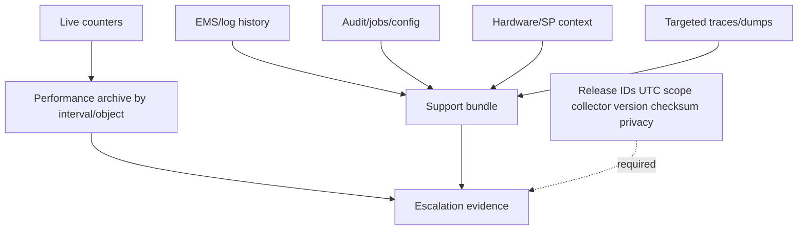

### Performance archive caveats

- Sampling interval can hide microbursts.
- Retention can expire before a quarterly review.
- Averages can hide tails and affected clients.
- Object names/ownership can change during volume/LIF moves.
- Counter definitions and archives can differ by release/tool.
- A gap can mean collector failure, not zero activity.

### Support-bundle caveats

- Content can be large and sensitive.
- Bundle creation can have resource/capacity impact.
- A bundle time window may miss the incident.
- A successful bundle upload does not prove Support received every needed external client/network artifact.
- Preserve a manifest and secure transfer reference, not only `logs sent`.

---

## 14. Time, clocks, timezone, and timeline construction

### Plain-English deep-dive: line up every camera clock before replay

One camera says 10:00 UTC, another says 15:30 local time, and a third clock is seven seconds fast. Sorting the displayed strings can reverse cause and effect. Preserve raw timestamps, document timezone/offset and estimate clock error before creating a normalized UTC column. **Why it matters:** precision cannot be manufactured after the fact.

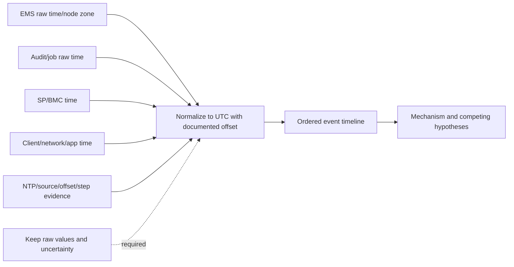

### Timeline schema

| Field | Purpose |
|---|---|
| Raw timestamp/timezone/source | Preserve original evidence |
| Normalized UTC | Compare sources |
| Clock offset/precision/confidence | Prevent false ordering |
| Source/node/object/event ID | Trace provenance |
| Observation | What source directly records |
| Interpretation | What it may mean, separate from fact |
| Business impact | User/service effect at that time |
| Action/owner/result | Incident progression |
| Evidence link/checksum | Reproducibility and integrity |

### Correlation workflow

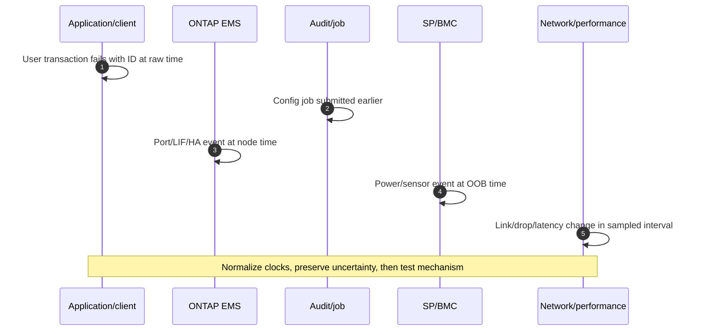

Matching timestamps are correlation. Root cause also needs a plausible mechanism, scope, sequence and evidence that challenges alternatives.

---

## 15. Evidence preservation, privacy, and chain of custody

**Evidence preservation** keeps relevant data authentic, complete enough, traceable and accessible to authorized reviewers. A formal legal **chain of custody** may have stricter customer requirements; the TAM analyst should follow customer/legal/security policy rather than inventing a forensic process.

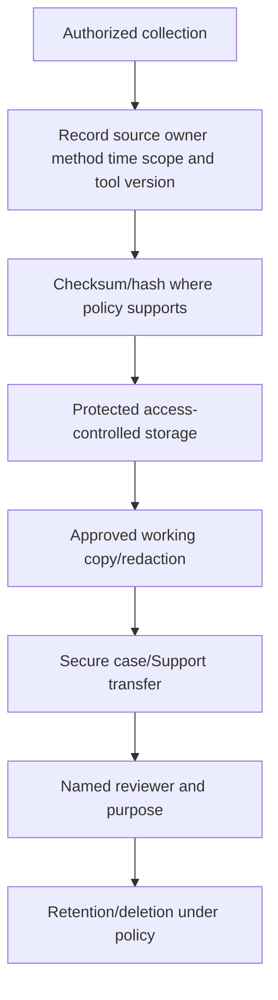

### Privacy checklist

- Minimize collection to the stated technical question.
- Identify customer content, filenames, IPs, usernames/SIDs/UIDs, tokens, keys, certificates, memory, packet payload and regulatory data.
- Redact reports, not source evidence, according to approved process; preserve the protected original.
- Encrypt in transit/at rest and restrict access by case/role.
- Record consent/authorization, destination, retention and deletion.
- Never paste customer dumps/logs into unapproved public or AI services.

### Integrity caveats

- A checksum proves the file did not change relative to that checksum; it does not prove collection completeness or truth.
- A copied screenshot lacks raw searchable fields and can be edited.
- Log rotation and event retention can create gaps.
- Clearing counters/logs destroys baseline and attribution.
- Compression/packaging can change file metadata; retain manifest and original where required.

---

## 16. Troubleshooting workflow and common failures

### Evidence-first workflow

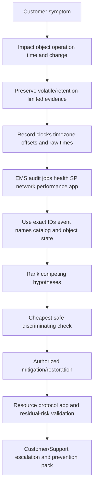

### Common failures

| Mistake | Why it fails | Better behavior |
|---|---|---|
| Treating highest severity as root cause | Severe event can be consequence | Find earliest mechanism and object state |
| Copying message text without event name | Cannot map exact catalog/release | Preserve exact name/parameters/sequence |
| Looking only after incident | Retention/volatile evidence is lost | Collect bounded evidence early |
| Clearing logs/counters to remove alarm | Destroys trend and cause evidence | Preserve first; clear only by current procedure/need |
| Audit request equals completed change | Async job/resource can fail later | Join audit -> job -> state -> app |
| SP event equals ONTAP cause | Hardware event can be consequence or separate | Correlate console/sensors/EMS/time |
| One packet trace proves no loss | Wrong point/filter/offload/asymmetry can miss | Simultaneous points and device counters |
| Average performance proves no spike | Sampling hides tails/microbursts | Use distribution/high-resolution evidence where available |
| Uploading `all logs` | Privacy, time and review burden increase | Question-led collection plus manifest |
| Permanent broad suppression | Creates blind spot | Scope/owner/expiry/alternative detection/accepted risk |

### Support boundaries

- Normal read-only events/audit/jobs/health collection follows customer authorization and current docs.
- Packet traces, performance archives, dumps, core files and broad bundles can add load or sensitive data; coordinate with Support/security.
- SP/BMC power/reset/firmware and hardware actions require platform procedures and change authority.
- AutoSupport detail belongs to Part 47 and authorized entitlement/privacy context.
- Low-level dump interpretation and internal event repair belong to NetApp Support/Engineering.

---

## 17. TAM discovery, recommendations, and JD Mapping

### Discovery questions

1. Which business service, application operation, object/node/SVM, impact, SLO, RPO/RTO and exact time window matter?
2. Which ONTAP/platform release and clock/timezone/NTP state applies to every source?
3. What exact EMS names/severities/parameters/catalog entries and recovery events exist?
4. Which event filters/destinations/routes received or missed notifications?
5. Which identity/interface/audit request, job UUID/state and resource before/after correspond to changes?
6. Which system-health monitor/alert/resource and current state exists?
7. Which SP/BMC sensor/power/boot/console/login events align, and what is its clock?
8. Which client/host/network/packet/performance/archive evidence can identify the request and path?
9. Which core/dump/support bundle/AutoSupport context exists, and what authorization/privacy/retention applies?
10. Which evidence is missing, stale, rotated, partial, access-gated or contradictory?
11. What is the cheapest safe test that can disconfirm the leading cause?
12. Who owns restoration, root cause, Support transfer, customer communication, prevention and residual risk?

### Recommendation model

```mermaid
flowchart TD
    Q[Define customer question/impact] --> E[Collect exact scoped evidence sources]
    E --> T[Normalize time and preserve provenance/privacy]
    T --> C[Correlate event audit job health hardware network performance app]
    C --> H[Rank mechanisms and confidence]
    H --> A[Owner-led action/restoration]
    A --> V[Validate state/app and recurrence]
    V --> P[Prevention alert hygiene and escalation pack]
    P --> R[Residual risk and review date]
```

### Recommendation patterns

| Finding | Risk | Bounded recommendation | Validation |
|---|---|---|---|
| Critical EMS event never reaches operations | Material conditions can go unnoticed | Repair/test current event filter/destination/route with security and monitoring owners | Test event receipt, ticket ownership and recovery route |
| Alert storm is one parent fault plus children | Operators can miss new signals and duplicate work | Correlate parent/child topology; dedupe downstream, fix root trigger, retain raw events | Reduced noise without missed distinct fault |
| Shared admin account made change | Attribution and least privilege are weak | Introduce named/scoped identities and correlation/change IDs | Audit positive/negative tests and credential removal |
| SP clock differs by minutes | Incident sequence/hardware correlation can be wrong | Restore approved time configuration and document historical offset | Stable source/offset and corrected timeline confidence |
| Performance archives expire before review | Recurring issue cannot be analyzed | Align retention/export with incident and service-review horizon under privacy/capacity policy | Retrieve representative history at next review |

### JD Mapping

| JD responsibility | Part 25 contribution | Arti's factual bridge and gap |
|---|---|---|
| Generate/analyze/report customer data | Builds source schema, UTC timeline, QA and provenance | Analytics/Power BI/SQL/support data strengths transfer |
| Risk/stability | Separates actionable events, hardware, jobs, paths and performance | CRITSIT triage/evidence method transfers |
| Support experience | Creates complete escalation pack and avoids repeated discovery | Microsoft Product/Engineering packages are strong evidence |
| Service reviews | Trends events, notification gaps, jobs, health and prevention actions | Business-review communication transfers |
| Preventative remediation | Alert hygiene, retention, clock, access and monitoring actions | Backlog/action tracking transfers |
| Security/privacy | Evidence minimization, redaction, access and secure transfer | Enterprise data-handling discipline transfers |
| Storage depth | EMS/SP/dump/trace/perf evidence map | Conceptual; no production ONTAP collection/interpretation claim |

---

## 18. Fully synthetic scenario: Alpine Health node reset

> **Synthetic case:** Alpine Health, all events, clocks, systems and findings below are fictional. It is not a NetApp customer incident, internal process or Arti production ONTAP work.

### Environment and symptom

- One node resets during a backup window; HA partner takes over.
- SMB application pauses for 28 seconds, then recovers.
- Operations receives 140 alerts but no page for the first hardware warning.
- The SP/BMC clock is 94 seconds slow.
- A configuration automation changed an event filter earlier that day.

```mermaid
flowchart TB
    APP[SMB application] --> DATA[Data LIF/node A]
    DATA --> HA[HA pair A/B]
    SP[SP/BMC node A] --> HW[Power/sensor/reset events]
    EMS[ONTAP EMS] --> FILTER[Modified event filter]
    FILTER --> SIEM[Syslog/SIEM]
    AUTO[Automation identity] --> AUDIT[Audit + filter-change job]
    BACKUP[Backup workload] --> PERF[Performance archive]
    HA --> APP
```

### Raw timeline

| Raw time/source | Event | Limitation |
|---|---|---|
| 01:58:00 UTC audit | Automation submits EMS-filter modification | Request, not yet proof of resulting config |
| 01:58:03 UTC job | Filter modification succeeds | Must inspect before/after rule |
| 02:14:26 SP local | Voltage/sensor warning | SP clock later measured 94 seconds slow |
| 02:16:00 UTC application | SMB operations pause | User impact start |
| 02:16:01 UTC EMS node A | Reset/panic-related event sequence | Exact earliest software event still needs catalog/support analysis |
| 02:16:02 UTC HA events | Partner takeover starts | Recovery mechanism |
| 02:16:07 UTC SIEM | Large child-alert burst arrives | First hardware warning not routed due filter |
| 02:16:28 UTC application | Transaction succeeds | Measured 28-second pause |

After correcting the SP offset, its warning aligns near 02:16 UTC, not 02:14:26 UTC. Preserve both raw and normalized times.

### Evidence correlation

```mermaid
sequenceDiagram
    autonumber
    participant AUD as Audit/job
    participant SP as SP/BMC raw time
    participant EMS as ONTAP EMS
    participant HA as HA state
    participant APP as SMB app
    AUD->>AUD: Event-filter change completes
    SP->>SP: Sensor warning with -94s clock offset
    EMS->>EMS: Node reset/panic event sequence
    HA->>HA: Partner takeover and LIF/protocol recovery
    APP->>APP: 28-second transaction pause
    Note over AUD,APP: Filter explains missed page; sensor/reset mechanism still needs Support analysis
```

### Competing hypotheses

| Hypothesis | Evidence for | Missing/disconfirming evidence |
|---|---|---|
| Filter change caused node reset | Same day | Filter affects notifications, not shown hardware reset mechanism |
| Filter change caused missed page | Before/after rule and destination omission | Validate routing/test event |
| Hardware voltage condition caused reset | Corrected SP warning aligns | Need platform sensor history, EMS/dump and Support analysis |
| Backup load caused reset | Overlaps window | Performance archive not saturated; mechanism not shown |
| HA failed | App paused | Takeover completed and app recovered; measure against SLO instead |

### Fault tree

```mermaid
flowchart TD
    TOP[Node reset + missed page + alert storm] --> SPLIT[Separate failure notification and recovery]
    SPLIT --> FAIL[Node reset cause]
    SPLIT --> NOTIFY[Notification design]
    SPLIT --> RECOV[HA/application recovery]
    FAIL --> CLOCK[Normalize SP EMS dump and app clocks]
    CLOCK --> HWQ[Correlate sensor power console EMS/core and Support]
    NOTIFY --> AUD[Audit/job/filter before-after]
    AUD --> TEST[Repair/test route and dedupe parent/child]
    RECOV --> HAQ[Takeover LIF SMB handle/app timeline]
    HAQ --> SLO[Compare 28s pause with approved objective]
    HWQ --> PACK[Escalation pack]
    TEST --> PACK
    SLO --> PACK
```

### Recommendations

1. NetApp Support and hardware owners should analyze the exact SP sensor, EMS sequence and dump; do not claim voltage root cause until mechanism is confirmed.
2. Restore least-privilege event-filter configuration from approved desired state and test emergency/alert/error delivery, recovery notifications and destination failure.
3. Deduplicate child alerts downstream while retaining raw EMS and one parent incident; add owner and expiry to any suppression.
4. Synchronize/monitor SP/BMC and ONTAP clocks, preserving historical offset in the incident timeline.
5. Validate HA, SMB session/handle and application transaction recovery; record the 28-second measured pause and residual risk.

### Customer-facing summary

> "Three issues are distinct. The node reset remains under hardware/software analysis; a corrected SP sensor warning aligns with the reset but does not yet prove cause. The earlier automation change did not cause the reset in current evidence, but it removed the first warning from the paging route and allowed a later child-alert storm. HA restored service with a measured 28-second application pause. We recommend Support-led reset analysis, corrected/tested alert routing, clock monitoring and an end-to-end recovery review."

---

## 19. Arti's support/analytics/evidence bridge

```mermaid
flowchart LR
    CRIT[Microsoft CRITSIT production work] --> TL[Impact timeline owners cadence and restoration]
    ETW[Windows/Azure/network logs and traces] --> CORR[Multi-source clock/ID correlation]
    PG[Product/Engineering escalation] --> PACK[Reproducible evidence exact ask and secure transfer]
    BI[Excel Power BI SQL analytics] --> TREND[Alert trends duplicates gaps and action tracking]
    TL --> ONTAP[ONTAP evidence synthetic reasoning]
    CORR --> ONTAP
    PACK --> ONTAP
    TREND --> ONTAP
    ONTAP --> LAB[Authorized collection and NetApp SME review]
```

| Factual strength | Transfer | Explicit gap |
|---|---|---|
| CRITSIT/enterprise support | Impact-first triage, one timeline, communication and closure | No ONTAP EMS/SP/core production diagnosis |
| Windows/Azure/network traces | Source scope, timestamps, packet/log limitations | No ONTAP packet/performance archive collection |
| Product/Engineering collaboration | Complete secure escalation packages | No NetApp internal tools/process claim |
| Analytics/business reviews | Event trends, alert hygiene, data quality and preventative actions | No direct AutoSupport/Digital Advisor access |

### Honest answer

> "I can explain what EMS, audit, jobs, system health, SP/BMC, packet traces, performance archives, dumps and support bundles each observe; normalize a UTC timeline; and build a privacy-safe escalation pack. My direct production evidence is Microsoft support and cross-source troubleshooting, not ONTAP evidence collection. I would use current official commands/fields, customer authorization, NetApp Support and secure handling, and I would defer AutoSupport details to the dedicated Part."

---

## 20. Whiteboard drills and paper lab

### Whiteboard drills

1. **Cameras:** Map EMS, audit, jobs, health, SP, packet, performance, dump and app fields of view.
2. **EMS:** Exact name -> catalog -> object state -> impact -> action -> validation.
3. **Severity:** Event severity versus business priority.
4. **Audit:** Request -> RBAC -> job -> resource -> application.
5. **SP:** Out-of-band hardware evidence, not file-service truth.
6. **Clock:** Preserve raw, document offset, normalize UTC without fake precision.
7. **Noise:** Parent fault/child events; fix cause before suppression.
8. **Privacy:** Minimize, protect original, redact working copy, secure transfer/retention.

### Paper lab scenario

A fictional cluster produces intermittent port, disk, HA and capacity events. A service account changed notification filters; SIEM clocks use local time; SP clocks drift; packet captures contain SMB names; performance archives retain seven days while reviews are monthly; one core file consumes space; AutoSupport delivery is intermittent.

### Tasks

1. Inventory every evidence source, owner, scope, retention, clock, sensitivity and access.
2. Build EMS event-name/severity/parameter/catalog table and separate recovery events.
3. Map filters/destinations/email/syslog/SNMP/tickets and test routes.
4. Join audit, job, resource state and customer change records.
5. Map health monitor/alert/current resource state.
6. Normalize SP/ONTAP/client/network/SIEM clocks while preserving raw times.
7. Create parent/child/noisy/actionable alert model with suppression expiry.
8. Design bounded simultaneous packet capture with privacy controls.
9. Assess performance archive interval/retention against incident/review need.
10. Create core/dump manifest and secure Support transfer plan.
11. Distinguish AutoSupport message/delivery from local logs and defer detailed fix to Part 47.
12. Build complete escalation pack, missing-evidence register and confidence labels.
13. Write alert-hygiene and evidence-retention recommendations.
14. Present executive and technical narratives.

```mermaid
flowchart LR
    INV[Inventory sources/clocks/privacy] --> EMSM[Decode EMS/catalog/routes]
    EMSM --> JOIN[Join audit/jobs/health/SP/app/network/perf]
    JOIN --> TIME[Normalize UTC and preserve uncertainty]
    TIME --> HYP[Rank mechanisms/noise/actionability]
    HYP --> PACK[Build secure escalation pack]
    PACK --> REC[Recommend monitoring/evidence improvements]
```

### Lab pass criteria

- [ ] Every source has an explicit field of view and limitation.
- [ ] EMS severity is not customer priority.
- [ ] Exact event name/catalog/release/parameters are captured.
- [ ] Audit request, async job, resource and application outcome are separate.
- [ ] SP/BMC clock/security/action boundaries are explicit.
- [ ] AutoSupport is distinguished and deferred to Part 47.
- [ ] Traces/dumps/archives/bundles include load/privacy/retention caveats.
- [ ] Raw timestamps and normalized UTC coexist with confidence.
- [ ] Suppression has owner/scope/expiry/alternative detection.
- [ ] No synthetic evidence becomes production ONTAP experience.

---

## 21. Self-test

1. Define EMS and compare it with audit, jobs, health, SP/BMC and AutoSupport.
2. Explain common EMS severity labels and why they are not business priority.
3. List every event field and current-catalog check.
4. Draw event filter/destination/notification/ticket flow.
5. Design noisy-versus-actionable triage and safe suppression.
6. Trace administrative request from audit through job/resource/app outcome.
7. Explain system-health monitor scope and `healthy` limitations.
8. Define SP/BMC and list hardware/out-of-band/security evidence.
9. Explain why AutoSupport is distinct and deferred.
10. Define core/dump and safe specialist handling.
11. Design packet-trace scope, filters, clocks, privacy and simultaneous points.
12. Explain performance archive and support-bundle content/retention limits.
13. Build raw/UTC timeline with offset and uncertainty.
14. Design evidence preservation, checksum, access, redaction, transfer and deletion.
15. Apply the evidence-first workflow and common-failure table.
16. Build the complete escalation pack and missing-evidence register.
17. Ask TAM discovery questions and write a bounded recommendation.
18. Recreate Alpine's reset, missed page, clock and HA findings separately.
19. Complete all whiteboard drills, paper lab and Q1-Q8 aloud.
20. State Arti's strengths and ONTAP evidence production gap precisely.

---

## 22. Official Source Anchors

**Date checked: 2026-08-24.** These official public sources anchor broad ONTAP event, audit, health, SP/BMC and evidence concepts. Exact event names/severities/parameters, filters/destinations, retention, audit formats, health monitors, job resources, SP/BMC interfaces, dump/trace/performance commands and support bundles vary by ONTAP release/platform. Use current release/platform docs and NetApp Support; never invent internal evidence procedures.

| Topic | Official public source | Bounded use and currency note |
|---|---|---|
| Event/performance/health monitoring | [ONTAP event, performance and health monitoring](https://docs.netapp.com/us-en/ontap/event-performance-monitoring/) | Current monitoring family entry point. |
| EMS overview | [ONTAP EMS configuration](https://docs.netapp.com/us-en/ontap/error-messages/) | Current event configuration, filters/destinations and event-catalog context; select exact release. |
| EMS event catalog | [ONTAP EMS reference](https://docs.netapp.com/us-en/ontap-ems/) | Exact event names, severity, descriptions, parameters and corrective actions by reference version. |
| Audit logging | [ONTAP audit logging](https://docs.netapp.com/us-en/ontap/system-admin/ontap-implements-audit-logging-concept.html) | Current CLI/HTTP/ONTAPI audit concepts; exact format/retention/config release-sensitive. |
| Jobs | [ONTAP REST API jobs](https://docs.netapp.com/us-en/ontap-automation/workflows/wf_jobs_get_job.html) | Structured asynchronous job monitoring example; endpoint fields vary by API release. |
| System health | [ONTAP system health monitoring](https://docs.netapp.com/us-en/ontap/system-admin/system-health-monitoring-concept.html) | Current health-monitor/alert concepts and scope. |
| SP/BMC management | [ONTAP Service Processor management](https://docs.netapp.com/us-en/ontap/system-admin/sp-bmc-network-config-concept.html) | Broad SP/BMC out-of-band concepts; exact platform/firmware/actions require hardware docs. |
| Hardware systems | [ONTAP hardware systems](https://docs.netapp.com/us-en/ontap-systems/) | Platform-specific sensors, BMC/SP, service, FRU and hardware procedures. |
| Packet tracing | [ONTAP network management](https://docs.netapp.com/us-en/ontap/network-management/) | Network/packet evidence entry point; exact collection commands require current docs/Support. |
| Performance management | [ONTAP performance administration](https://docs.netapp.com/us-en/ontap-performance-admin/) | Current performance monitoring context; archives/counters detailed in later Parts. |
| AutoSupport | [What ONTAP AutoSupport is](https://docs.netapp.com/us-en/ontap/system-admin/manage-autosupport-concept.html) | Distinction only here; complete architecture/privacy/troubleshooting deferred to Part 47. |
| Support | [NetApp Support Site](https://mysupport.netapp.com/) | Entitlement-dependent cases, secure uploads, diagnostics, knowledge and procedures. |

### Source-use discipline

- Record exact ONTAP/platform/reference version for every event, field, command and evidence source.
- Preserve exact EMS name/severity/parameters/sequence/raw time and use the matching event catalog.
- Join audit -> job -> resource -> protocol/application; never stop at request acceptance.
- Record SP/BMC firmware, clock and secure OOB identity; do not perform power actions from a conceptual guide.
- Coordinate traces/dumps/archives/bundles with Support and privacy/security owners.
- Keep AutoSupport claims bounded and use Part 47 for content/delivery/privacy details.

---

## Likely Interview Questions

### Q1. What is EMS, and how do you interpret an ONTAP event?

> **Model answer:** "EMS is ONTAP's Event Management System. It records named events with severity, source/object parameters, message, sequence/time and catalog definitions/corrective actions under the release. I preserve the exact message name and raw fields, open the matching current catalog, verify current object state and map it to customer impact. I then correlate earlier/recovery events, audit, jobs, hardware, performance and client evidence. Event severity is not automatically business priority or root cause."

**Follow-up depth:** Work an error that is a consequence of an earlier hardware notice and define closure evidence.

### Q2. How would you design EMS notifications without creating alert fatigue?

> **Model answer:** "I classify exact event names/severities by customer impact and response need, route pages versus tickets versus archive to supported email/syslog/SNMP destinations, and test delivery, ownership and recovery events. I deduplicate parent/child alerts downstream and fix repetitive causes. Any suppression has scope, rationale, owner, expiry, alternative detection and accepted residual risk. I preserve raw events so hygiene does not erase evidence."

**Follow-up depth:** Handle a planned maintenance event, an alert storm, a destination outage and a missing recovery notification.

### Q3. How do audit logs and jobs help prove what changed?

> **Model answer:** "Audit can show the authenticated identity, interface, command/API request, target and result under current configuration. That proves a request/authorization stage, not completion or business approval. I join it to the asynchronous job UUID/state/error, the before/after resource, EMS events and application validation, plus the customer's change record. Shared accounts weaken attribution, so service runs need correlation IDs and code/version records."

**Follow-up depth:** Reconstruct a timed-out API change that completed after the client disconnected.

### Q4. What is the role of system health and SP/BMC evidence?

> **Model answer:** "System-health monitors provide structured alerts for selected ONTAP subsystem/resource conditions; healthy means no alert in that monitor scope, not that every application is healthy. The SP or BMC is an out-of-band hardware controller with platform sensors, power/boot/console and event context that can remain available when ONTAP is down. I correlate both with EMS and application evidence, protect OOB access and never power/reset/clear logs without current procedure."

**Follow-up depth:** Explain a temperature/power event, clock mismatch, hardware-assisted takeover signal and why SP cannot diagnose file permissions.

### Q5. How do packet traces, performance archives, and core files differ?

> **Model answer:** "A packet trace captures visible network traffic at a selected point and time. A performance archive retains sampled workload/resource counters over intervals. A core/dump preserves process or system failure state for specialist crash analysis. Traces can miss paths/offload/encrypted content, archives can hide tails and expire, and dumps can miss the earlier trigger and contain sensitive memory. I collect only what answers a defined hypothesis under Support/privacy guidance and correlate all three."

**Follow-up depth:** Design a simultaneous trace and explain manifest, clock, load, privacy and secure-transfer controls.

### Q6. How do you build a reliable multi-source incident timeline?

> **Model answer:** "I preserve every raw timestamp, timezone, source and object ID, record NTP/source/offset/step evidence and normalize a separate UTC field with precision/confidence. I use one request, event, job or hardware marker to join application, client, network, EMS, audit, job, SP and performance sources. Matching time is correlation; I still require a mechanism, expected sequence, scope and disconfirming evidence before calling root cause."

**Follow-up depth:** Correct a 94-second SP offset without overwriting raw evidence or inventing millisecond precision.

### Q7. What should a strong NetApp escalation evidence pack contain?

> **Model answer:** "It includes business impact and timeline; exact cluster/node/SVM/object/platform/release; EMS names/catalog/parameters; audit/change/job/resource history; health and HA state; SP/hardware/environment; client/network/protocol and performance evidence; dump/trace/bundle manifests; clocks and data-quality gaps; actions tried and results; privacy/secure-transfer reference; competing hypotheses; and one exact specialist ask. I label access gaps and avoid bulk unscoped log collection."

**Follow-up depth:** Adapt the pack for a node reset, intermittent latency and missed alert route.

### Q8. How does your Microsoft background transfer, and what remains a gap?

> **Model answer:** "My CRITSIT and Product/Engineering work gives me production experience with impact-first triage, multi-source logs/traces, clock-aligned timelines, evidence preservation, secure escalation, customer updates and prevention tracking. Analytics helps with alert trends and gaps. I have not collected or interpreted ONTAP EMS, SP/BMC, cores or performance archives in production. I would use current official commands/fields, customer authorization, NetApp Support and secure handling and never claim gated evidence I cannot access."

**Follow-up depth:** Give one factual Microsoft escalation and state which ONTAP event, hardware and support-tool facts remain unproven.

---

## 30-Second Memory Hooks

- **Evidence sources:** Different cameras, different fields of view.
- **EMS:** Named ONTAP event plus severity, parameters, time and catalog.
- **Severity:** Vendor condition level, not customer business priority.
- **Catalog:** Exact release's alarm manual and corrective action.
- **Notification:** Filter -> destination -> ticket/page -> owner -> proof.
- **Noise:** Fix burnt toast; do not remove the detector battery.
- **Audit:** Who requested what; **job:** whether work ran; **postcondition:** what changed.
- **Health:** Monitored subsystem state, not whole-service truth.
- **SP/BMC:** Out-of-band hardware panel, not file/LUN semantics.
- **AutoSupport:** Packaged support message, distinct and deferred to Part 47.
- **Core/dump:** Failure-state evidence for specialists; highly sensitive.
- **Packet trace:** One network camera angle with filter/offload/encryption limits.
- **Performance archive:** Time-series context; sampling and retention matter.
- **Timeline:** Preserve raw, normalize UTC, record offset and uncertainty.
- **Privacy:** Minimize, protect original, redact copy, secure transfer/retention.
- **Arti's bridge:** CRITSIT evidence craft transfers; ONTAP production collection does not.

---

## Completion Checklist

- [ ] Define and compare EMS, event catalog, audit, jobs, health, SP/BMC, AutoSupport, traces, archives, dumps and bundles.
- [ ] Explain every EMS field/severity and business-priority distinction.
- [ ] Decode exact event name through current catalog/object/customer impact.
- [ ] Design/test event filters, email/syslog/SNMP destinations and operational routes.
- [ ] Separate noisy/duplicate/parent-child events and govern suppression.
- [ ] Correlate audit request, RBAC, async job, resource and application outcome.
- [ ] Explain system-health scope and healthy-status limitations.
- [ ] Map SP/BMC sensors/power/boot/console/security/clock evidence and action boundaries.
- [ ] Distinguish AutoSupport and defer detailed delivery/privacy to Part 47.
- [ ] Handle core/dump files with exact identity, completeness, privacy and Support transfer.
- [ ] Design bounded packet captures with filters, points, clocks, privacy and limitations.
- [ ] Explain performance archive/support-bundle intervals, retention and manifests.
- [ ] Build raw plus normalized UTC timeline with offset/precision/confidence.
- [ ] Preserve evidence with provenance, integrity, access, redaction, transfer and retention controls.
- [ ] Apply the evidence-first workflow, common mistakes and Support boundaries.
- [ ] Ask TAM discovery questions and write a bounded recommendation.
- [ ] Recreate Alpine's reset, notification, clock and recovery workstreams.
- [ ] Complete all whiteboard drills, paper lab, self-test and Q1-Q8 aloud.
- [ ] State Arti's strengths and ONTAP evidence production gap precisely.
- [ ] Recheck exact ONTAP/platform/event-reference docs, fields, retention, tools and Support guidance before customer use.

---

*Next suggested section:* [Part 26 - Hardware Anatomy, Shelves, Cabling, Ports, FRUs, and Environmentals](Part-26-netapp-hardware-shelves-cabling-frus.md)