# Part 26 - Hardware Anatomy, Shelves, Cabling, Ports, FRUs, and Environmentals

> **Section goal:** Learn to identify a NetApp hardware topology safely from chassis and controllers through slots, adapters, ports, shelves, I/O modules, drives, cables, power, cooling, batteries, sensors, LEDs, and out-of-band management. By the end, you should be able to map physical failure domains, collect replacement-ready evidence, and recommend the next owner/action without inventing model specifications or performing unsupported hardware work.

Covers index item **26** and maps directly to job-description responsibilities for install-base accuracy, storage/infrastructure depth, risk and stability analysis, lifecycle planning, customer-specific recommendations, service reviews, incident escalation, supportability, and cross-functional coordination.

Exact chassis layout, controller count, slot/card compatibility, onboard/expansion ports, shelf/I/O module (IOM) type, SAS or NVMe cabling, stack/loop/HA/cluster-port rules, drive/carrier, field/customer replaceability, LED meaning, power/cooling/battery thresholds, service procedure, firmware, and limits vary by platform generation and ONTAP release. Verify the exact platform in **Hardware Universe (HWU)**, current hardware-system documentation, **Interoperability Matrix Tool (IMT)** where applicable, labels/serials, and NetApp Support instructions. This Part contains no hard model specifications.

> **Evidence and experience boundary:** Every rack, serial, cable, alert, failure, and replacement below is synthetic. Your factual strengths are enterprise escalation, Azure/VM/networking, hardware-adjacent evidence collection, analytics, and customer communication. You do **not** claim production NetApp racking, cabling, FRU/CRU replacement, controller/shelf service, or environmental remediation experience.

---

## 1. Controller, node, chassis, and HA pair

### Plain-English deep-dive: worker, office, building shell, and paired office

- A **controller** is the processing hardware running ONTAP and handling storage/network work.
- A **node** is the controller plus its ONTAP cluster identity, owned resources, ports, and operating context.
- A **chassis** is the physical enclosure that can contain one or more controllers and shared components depending on model.
- An **HA pair** is two compatible partner nodes designed for supported takeover/giveback.

**Analogy:** A worker operates an office; the office has an organizational identity; the building shell can house two offices and shared utilities; a partner office can take over defined work. **Why it matters:** two nodes in one chassis can share backplane, power/cooling or service events even when logically redundant.

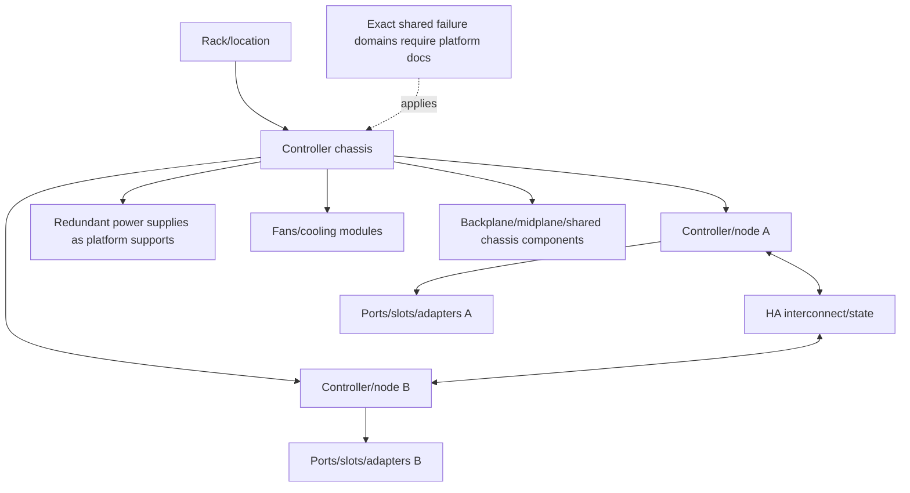

### Identity table

| Identity | Purpose | Common trap |
|---|---|---|
| Cluster/node name/UUID/system ID | Logical ONTAP membership/ownership | Treating friendly name as physical serial |
| Chassis serial | Physical enclosure identity | Assuming it identifies each controller/module |
| Controller/module serial/part number | Replaceable assembly identity where documented | Ordering by visually similar part |
| Slot/port label | Physical location/connector | Label meaning differs by model/orientation |
| Asset/rack/U position | Customer install-base location | Can drift after moves without reconciliation |

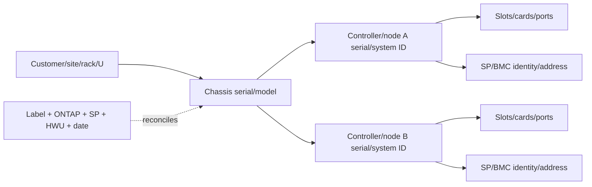

Never order/replace a controller, power supply, IOM, adapter or drive from a cluster name alone.

---

## 2. Onboard ports, slots, adapters, and expansion cards

An **onboard port** is integrated into the controller/platform board. An **expansion adapter/card** occupies a supported slot and adds ports or functions. Slot/card/port support depends on model, slot priority/rules, ONTAP/firmware and HA symmetry.

### Plain-English deep-dive: built-in doors and installed loading docks

Onboard ports are doors built into the building. Expansion cards are loading docks installed in numbered bays. A dock can fit physically but still violate structural, power, airflow, lane or paired-building rules. **Why it matters:** connector shape is not supportability.

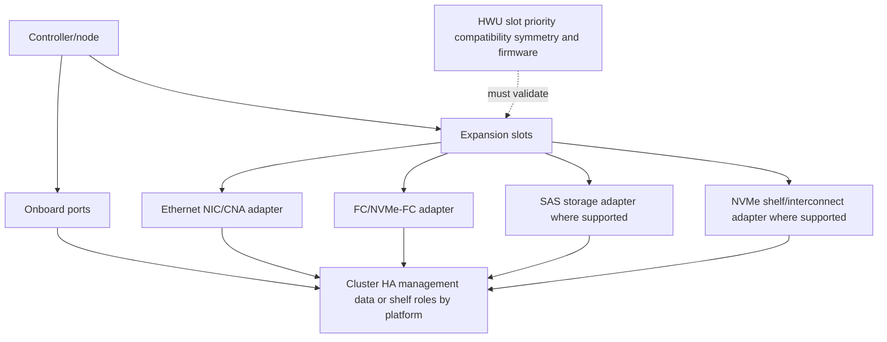

### Adapter inventory

| Field | Why it matters |
|---|---|
| Controller/node and slot | Exact physical owner/location |
| Adapter model/part/serial | Compatibility/replacement identity |
| Firmware | Supportability and defect applicability |
| Port count/type/speed capability | Physical connectivity, not negotiated operation alone |
| Current port role/config | Cluster/data/shelf/target/initiator/management use |
| Peer-node symmetry | HA/platform support can require matching configuration |
| Cable/optic/transceiver | End-to-end media compatibility |
| Link/counter/WWPN/MAC | Runtime identity and health |

### Onboard versus expansion comparison

| Dimension | Onboard | Expansion |
|---|---|---|
| Physical replacement | Often tied to controller/system board procedure | Card/adapter may be separately replaceable under model procedure |
| Slot rule | Fixed platform design | Exact supported slot and priority required |
| Upgrade flexibility | Limited to platform | Can add supported capabilities, subject to space/power/HA rules |
| Failure scope | Can require controller FRU service | May isolate to adapter, but port/path/application impact remains |

---

## 3. Port roles: HA, cluster, data, management, and storage

The same connector family can serve different roles only where the platform and ONTAP support it. Record physical port label, logical role, current configuration, peer, cable and upstream device.

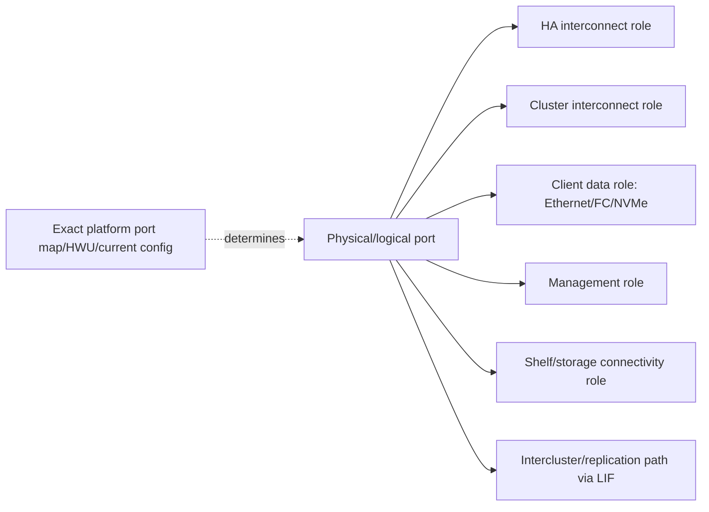

### Role distinctions

| Role | Carries | Failure implication |
|---|---|---|
| HA interconnect | Partner HA state/write-intent traffic under design | Can degrade failover/write-protection posture; exact response release-specific |
| Cluster interconnect | Private all-node coordination/internal data traffic | Packet loss can affect cluster membership/data access paths |
| Data Ethernet | NFS/SMB/iSCSI/NVMe-TCP/S3 as supported | Client/session/path impact |
| FC/NVMe-FC target | SAN frames/commands | Host MPIO path impact |
| Management | Cluster/node administration | Management loss does not automatically mean data loss |
| Shelf/SAS/NVMe storage | Controller-to-media path | Device/shelf visibility/redundancy impact |
| SP/BMC management | Out-of-band hardware management | Separate high-privilege path |

### Port map evidence

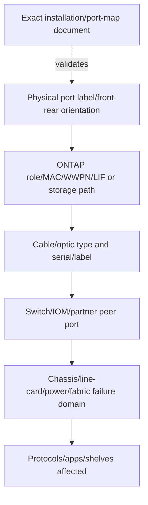

Do not repurpose a port based on connector type or another model's diagram.

---

## 4. Shelves, IOMs, drives, and carriers

A **drive shelf** is an enclosure holding drives/SSDs, power/cooling and one or more **I/O modules (IOMs)** that connect the shelf to controllers and other shelves under a supported topology. A **drive carrier** mechanically/electrically fits media into a shelf bay and may include identity/LED/airflow features.

### Plain-English deep-dive: warehouse rack, aisle controllers, packages, and trays

The shelf is a warehouse rack. IOMs are aisle controllers providing paths into the rack. Drives are packages; carriers are the exact trays connecting them to the rack. A package with the right capacity but wrong approved tray/interface/firmware is not interchangeable. **Why it matters:** every shelf, IOM, bay, drive and cable has identity and path dependencies.

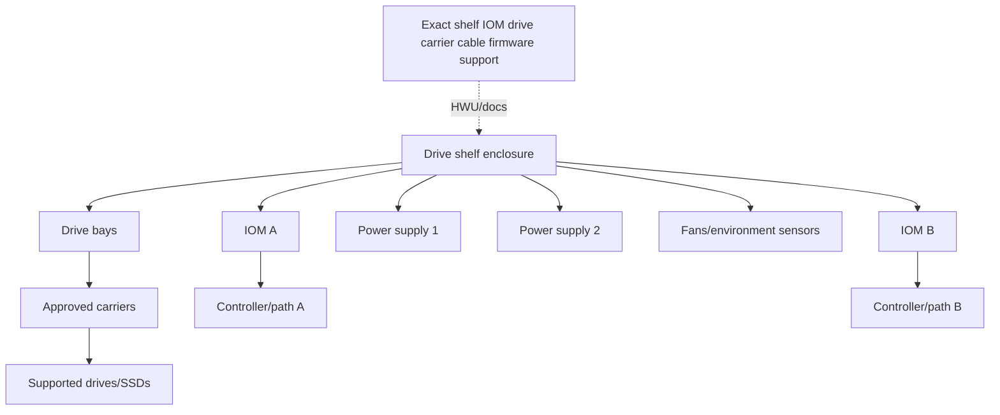

### Shelf identity

- Shelf model/family, serial and shelf ID where applicable.
- Rack/U/location and HA pair/controller ownership context.
- IOM model/serial/firmware, A/B position and port labels.
- PSU/fan/module part/serial/status.
- Drive bay, serial, model, capacity, firmware, carrier and ONTAP disk/partition identity.
- Cable from-to port labels, type, length/part and path/fabric.

### Carrier caution

Do not transplant arbitrary drives into visually compatible carriers or mix unsupported carrier/media combinations. Qualification includes firmware, encryption/FIPS/SED attributes, interface, sector format, shelf/platform and service rules.

---

## 5. SAS shelf connectivity

**Serial Attached SCSI (SAS)** shelf designs use SAS paths among controller storage ports, shelf IOMs and sometimes additional shelves. Terms such as **stack**, **loop**, **square**, **multipath HA**, and port-letter conventions appear in platform generations. Their exact meaning, limits and cable order are model/document specific.

### Safe conceptual SAS topology

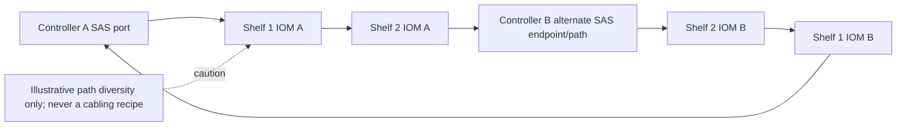

The diagram only shows the goal of redundant controller-to-shelf access. It does **not** prescribe port order, shelf count, square/triangle/loop/stack layout, cable type or hot-add procedure.

### Plain-English deep-dive: map the roads, never copy a remembered route

A SAS stack/loop is a documented road network among controllers and shelf IOM ports. Small changes in platform, shelf family or port naming can change the legal route. **Why it matters:** a cable placed in a plausible connector can remove path redundancy, isolate shelves or create unsupported topology.

### SAS evidence

| Evidence | Question |
|---|---|
| Controller storage port state | Which path/adapter/slot originates? |
| IOM A/B ports and IDs | Which shelf side and upstream/downstream peer? |
| Shelf path count | Does each controller have documented redundant paths? |
| Cable part/type/length | Is it qualified and appropriate? |
| Error/reset/link counters | Physical/path instability or old event? |
| ACP/in-band management where applicable | Which shelf-management method/firmware applies? |
| Current platform cabling diagram | What exact topology is supported? |

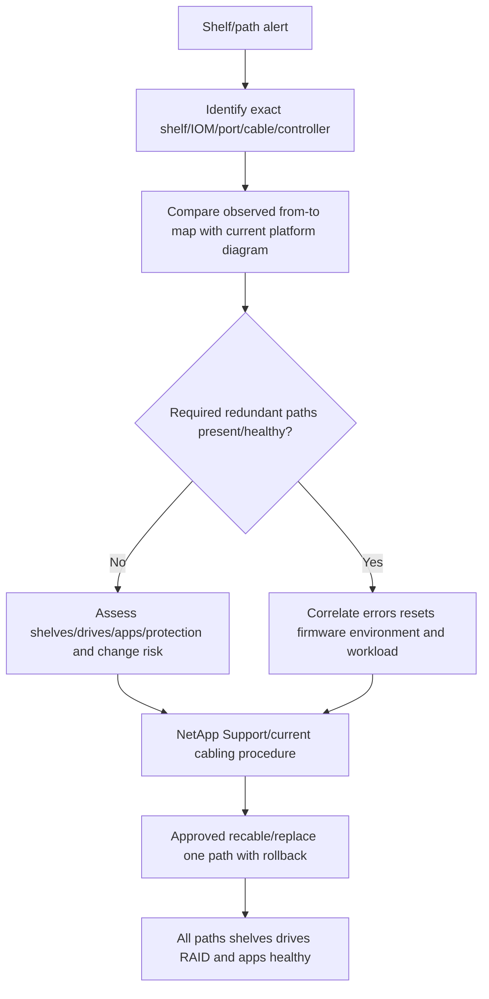

---

## 6. NVMe shelf connectivity

Supported all-flash platforms can use NVMe-connected shelves and platform-specific high-speed links/adapters/IOMs. The logical goals resemble redundant shelf paths, but NVMe shelf hardware, cabling, topology, discovery, firmware and service procedures are not SAS procedures.

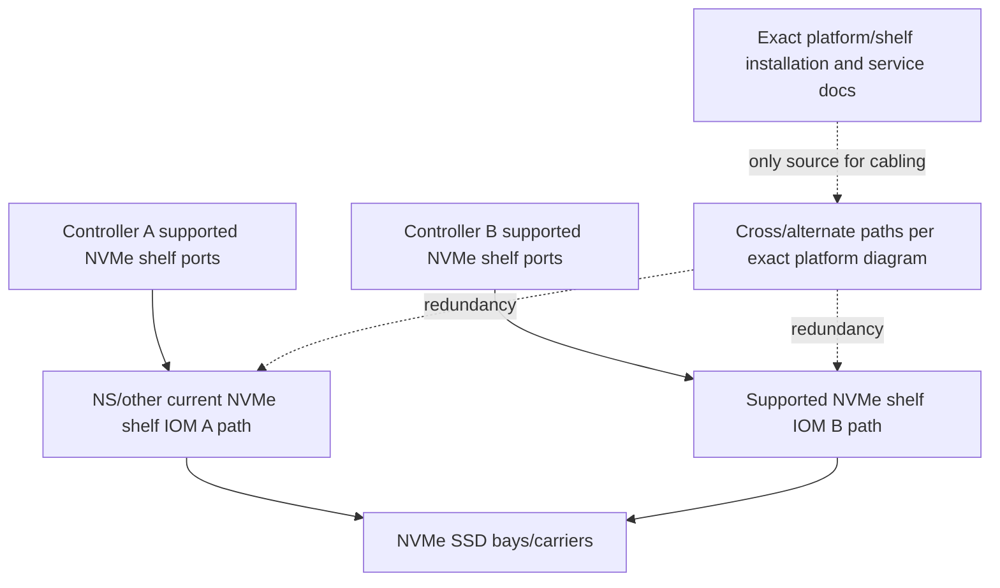

### SAS versus NVMe shelf orientation

| Dimension | SAS shelf | NVMe shelf |
|---|---|---|
| Protocol/link | SAS architecture | Platform-specific NVMe shelf connectivity |
| Modules | SAS IOM family | NVMe shelf IOM/module family |
| Cabling terms | Stack/loop/port conventions by platform | Platform-specific cable/port/topology conventions |
| Media | Supported SAS/SATA-oriented drives where qualified | Supported NVMe SSDs where qualified |
| Service | Exact SAS shelf procedure | Exact NVMe shelf procedure; never transpose |

Record exact model and use the matching document. `NS224-like` or any remembered family name is not enough to cable a current platform.

---

## 7. Multipath cabling and physical failure domains

Multipath shelf cabling is designed so one controller port, cable, IOM or path failure does not remove all access to the shelf under the supported topology. Redundancy requires independent components and verified behavior.

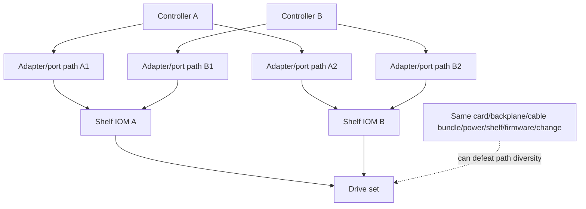

### Failure-domain checklist

| Domain | Questions |
|---|---|
| Controller | Separate HA nodes and supported partner access? |
| Adapter/slot | Do paths share one card, slot bus or controller FRU? |
| Cable | Separate cable, connector, routing, strain and label? |
| IOM | A/B modules healthy and correctly connected? |
| Shelf | One enclosure/backplane remains a common shelf failure domain? |
| Power | Each PSU fed from independent supported circuits/PDU? |
| Cooling | Shared rack/room cooling and blocked airflow? |
| Firmware/config | One defect/change can affect both paths? |
| Operations | Can one mislabeled cable or script disable all paths? |

### Path test sequence

```mermaid
sequenceDiagram
    autonumber
    participant O as Authorized operator/Support
    participant A as Path A
    participant B as Path B
    participant S as Shelf/IOM/drives
    participant APP as Application/ONTAP health
    O->>APP: Baseline shelf paths RAID workload and alerts
    O->>A: Inject/document one approved path failure
    A--xS: Path unavailable
    B->>S: Continue supported access
    S-->>APP: No device loss; bounded performance change
    O->>A: Restore/replace under procedure
    A->>S: Path rediscovered/healthy
    O->>APP: Validate both paths firmware counters RAID and application
```

Do not unplug a production shelf cable to `test redundancy` without exact topology, path health, RAID state, workload, Support/change ownership and rollback.

---

## 8. FRU and CRU concepts

A **Field-Replaceable Unit (FRU)** is a component serviced in the field by an authorized technician under product procedure. A **Customer-Replaceable Unit (CRU)** is a component the customer may replace under the exact support contract, platform procedure and conditions. Vendors and documents can classify components differently by platform.

### Plain-English deep-dive: qualified mechanic versus owner-service item

A car has parts an owner may replace and parts requiring a qualified mechanic. The label depends on model, warranty and safety procedure, not how easy the part looks to remove. **Why it matters:** unsupported replacement can create data loss, injury, warranty/support problems or hidden misconfiguration.

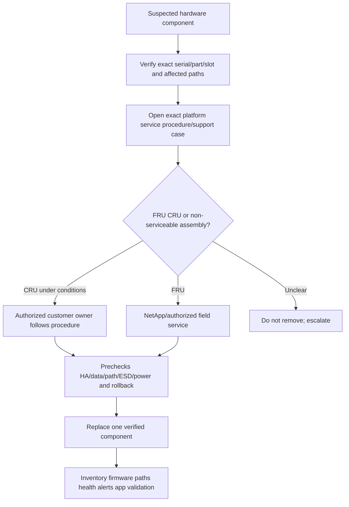

### Candidate FRU/CRU categories

Depending on platform, serviceable items can include controller modules, adapters, DIMMs, boot media, NVRAM/NVMEM/battery assemblies, power supplies, fans, IOMs, drives/carriers, optics/cables and chassis/backplane assemblies. This list is orientation only; never assign replaceability from it.

### Replacement evidence

- Support case/RMA and exact approved part number/revision.
- Affected node/chassis/shelf/slot/serial and LED/event/counter evidence.
- HA/cluster/quorum, storage paths, RAID/spare/rebuild and application state.
- ESD, power, cable labels, lifting/thermal and maintenance requirements.
- Firmware/compatibility and post-replacement update steps.
- Removed-part handling, encryption/data-bearing status and return/sanitize chain.

---

## 9. Power, cooling, fans, PSUs, batteries, and sensors

Hardware availability depends on supported environmental conditions and redundant power/cooling. Exact voltage, current, thermal, altitude, acoustic, power-draw, battery-life and sensor thresholds are platform/site-specific and belong in HWU/install documentation.

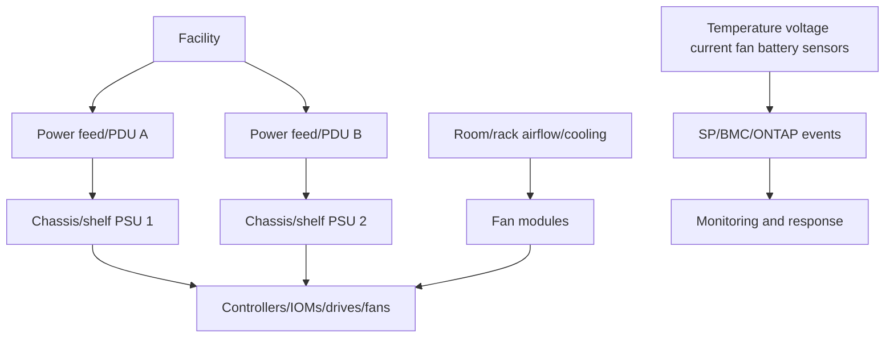

### Components

| Component | Purpose | Failure concern |
|---|---|---|
| Power supply unit (PSU) | Converts/provides power to chassis/shelf | Remaining PSU/feed capacity and true circuit independence |
| Fan/cooling module | Moves air through supported path | Thermal rise, throttling/shutdown, adjacent fan load |
| Battery/capacitor/NVRAM protection | Supports protected volatile/nonvolatile state by platform design | Write-protection/HA posture and replacement lifecycle |
| Temperature sensor | Reports thermal state at location | Sensor fault versus real airflow/room issue |
| Voltage/current sensor | Reports power rail/input state | PSU, feed, connector, board or sensor issue |
| Ambient/rack environment | Supplies inlet air and power conditions | Blocked airflow, hot aisle recirculation, dust, PDU/circuit overload |

### Environmental alert workflow

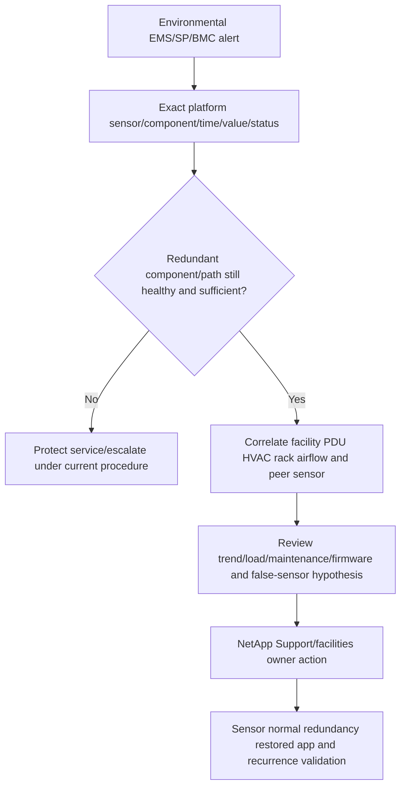

Never cover a failed fan, bypass a sensor, move power feeds, or power-cycle to clear an alert without exact procedure and capacity/safety assessment.

---

## 10. Serial numbers, part numbers, labels, and asset identity

### Identity hierarchy

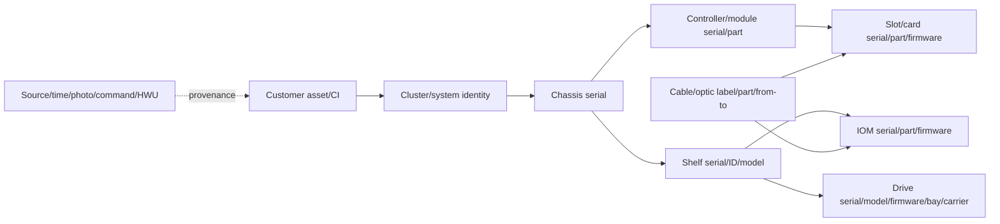

### Serial versus part number

- **Serial number** identifies one manufactured instance.
- **Part number** identifies a component design/orderable/service part, often with revisions.
- **Model** names a product family/variant.
- **Revision** can affect compatibility even when base part looks similar.
- **Asset tag** is customer inventory identity, not vendor service identity.

Photograph labels only under customer policy; images can expose serials, barcodes, network labels and site data. Reconcile label, ONTAP, SP/BMC, Support and asset records rather than trusting one source blindly.

---

## 11. LEDs: useful evidence, not the whole diagnosis

LEDs can indicate power, attention/fault, activity, link, port speed/status, shelf ID, drive state or service location according to exact component documentation. Color/blink meaning is not universal.

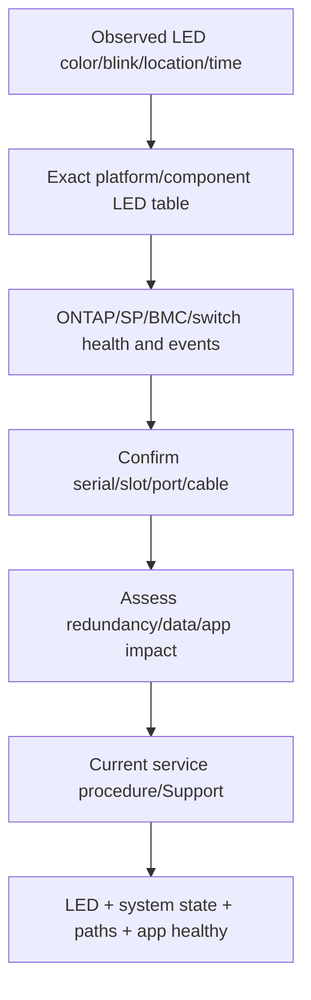

### LED evidence rules

- Record exact front/rear orientation, bay/port/module and time.
- Take approved photo/video without exposing unrelated customer data.
- Check whether locate/attention LED was manually activated.
- Correlate with software identity; do not pull `the amber drive` without serial/bay confirmation.
- LEDs can fail or lag; software can also misidentify after cabling/label drift.
- Use LED plus event/counter/path/serial evidence.

---

## 12. SP/BMC in hardware service

Part 25 introduced the SP/BMC as out-of-band evidence. In hardware work it supports remote inventory, sensor/event/console visibility and authorized control even if ONTAP is unavailable. Exact API/commands and replaceability vary.

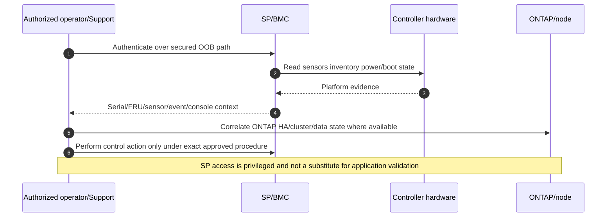

### SP/BMC security

- Isolated/controlled management network and firewall.
- Unique named/role-scoped identities and credential rotation.
- MFA/jump host/certificate controls where supported by environment.
- Current firmware and supported cryptographic settings.
- Audit of logins/power/console actions.
- Break-glass process and offboarding.

---

## 13. Cabling and port maps

A **port map** ties each physical connector to logical role, cable, peer and failure domain. A **cabling map** adds shelf/switch/rack path and labels. The diagram must be model-specific and versioned.

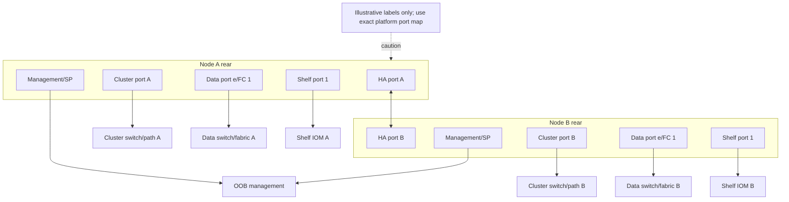

### Cabling-map fields

| Field | Example orientation |
|---|---|
| From | Rack/U, chassis serial, node, slot, port label |
| Cable | Customer label, vendor part/type/length, optic/transceiver |
| To | Switch/fabric/IOM/partner port with serial/chassis/slot |
| Role | HA, cluster, data protocol, management, shelf path |
| Logical config | VLAN/LIF/MAC/WWPN/shelf stack/path |
| Failure domain | Power/chassis/line-card/conduit/site/change |
| Evidence | Photo/LLDP/FDB/login/path/output/time/reviewer |

### Reconciliation sequence

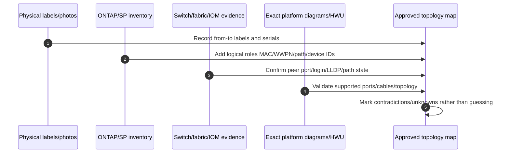

---

## 14. Hardware failures and troubleshooting

### Unified hardware fault tree

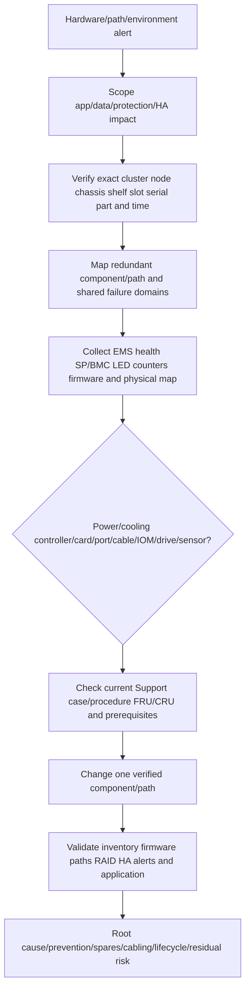

### Symptom matrix

| Symptom | Competing causes | Discriminating evidence |
|---|---|---|
| Shelf missing | Both paths/cables/IOMs/controller port/power/shelf ID/firmware | From-to map, path state, IOM/PSU LEDs/events, peer view |
| One shelf path down | Cable/port/IOM/adapter/firmware | Both ends, alternate path, error counters, controlled swap under Support |
| Drive fault LED | Media, carrier, bay/backplane, path, stale locate LED | Serial/bay/ONTAP/SP/shelf state, errors and path |
| PSU alert | PSU, feed/PDU, cord, input voltage, sensor | Both PSU/feed state, facility/PDU logs, SP trend |
| High temperature | HVAC/rack airflow/fan/blocked vent/load/sensor | Neighbor sensors, inlet/room, fan status, trend and physical inspection |
| Controller reset | Power/board/adapter/memory/firmware/thermal/software | SP console/sensors, EMS/core, parts, power, Support analysis |
| Link errors | Optic/cable/port/card/peer/speed/contamination | Both-end counters, optical levels, serials and controlled component isolation |
| Battery warning | Age/health/charger/sensor/firmware | Exact platform battery status/events and Support procedure |

### Common misconceptions

| Misconception | Correction |
|---|---|
| `Two controllers means two chassis` | Some HA pairs share a chassis/backplane; verify model. |
| `Two PSUs means two power sources` | Both cords may feed one PDU/circuit. |
| `Port up means path redundant` | Upstream, IOM, alternate controller, VLAN/fabric and application remain. |
| `SAS and NVMe shelf cabling are interchangeable` | Hardware/protocol/topology/procedure differ. |
| `Stack/loop order is universal` | Use exact current platform/shelf cabling document. |
| `Amber LED means pull component now` | Confirm exact LED meaning, serial, state, redundancy and procedure. |
| `FRU looks customer replaceable` | Replaceability is model/contract/procedure specific. |
| `Same capacity drive is compatible` | Model, firmware, interface, encryption, carrier and qualification matter. |
| `SP reset is harmless` | It affects OOB visibility and can be a platform-controlled action. |
| `Environment alert is storage software` | Facility power/cooling can be causal and cross-vendor. |

---

## 15. Replacement planning and support boundaries

### Replacement lifecycle

```mermaid
stateDiagram-v2
    [*] --> Alerted
    Alerted --> Identified: Exact serial/slot/part/path verified
    Identified --> SupportValidated: Diagnosis/RMA/procedure approved
    SupportValidated --> ChangeReady: HA/RAID/path/app/power/ESD prerequisites pass
    ChangeReady --> Removed: One approved component removed
    Removed --> Installed: Correct replacement seated/cabled
    Installed --> FirmwareChecked
    FirmwareChecked --> Rediscovered
    Rediscovered --> Validated: Paths/health/RAID/app normal
    Identified --> Stop: Identity/redundancy/procedure unclear
    ChangeReady --> Stop: New fault or precheck failure
```

### Pre-replacement checklist

- Exact RMA/part/serial/slot and FRU/CRU classification.
- Platform/ONTAP/firmware/HWU compatibility and service document.
- Current HA, quorum, node, shelf paths, RAID/spares/rebuild and local-tier health.
- Application criticality, workload, maintenance, communication and rollback/stop.
- Cable labels/photos, ESD, power, lifting, airflow and safety.
- Data-bearing/encrypted component handling and secure return.

### Post-replacement checklist

- Replacement serial/part/revision/firmware and asset/install-base update.
- Correct slot, cable peers, negotiated links, WWPN/MAC/device identity.
- Both paths/IOMs/PSUs/fans/sensors and LEDs healthy.
- RAID reconstruction/resync complete and spares replenished.
- HA/cluster/LIF/protocol/application and performance validation.
- EMS/health/SP alerts closed with no recurrence.
- Support case/change record and residual risk closed.

### Boundaries

- TAM/Technical Analyst: topology, evidence, impact, risk, recommendation, owner and follow-through.
- Customer data center/storage owner: physical access/change approval and environment.
- NetApp Support/field service: product diagnosis, RMA, FRU procedure and technical authority under entitlement.
- Facilities: power, PDU, HVAC, rack, grounding and environmental remediation.
- Network/fabric teams: optics/cables/switch ports/VLAN/zoning and path validation.
- Application/host owners: workload pause, multipath/session and transaction validation.

---

## 16. Evidence and escalation pack

### Evidence map

```mermaid
flowchart LR
    APP[Application/protocol impact] --> ONTAP[ONTAP node HA RAID shelf/disk/path state]
    ONTAP --> EMS[EMS/system health/jobs]
    EMS --> SP[SP/BMC sensors/console/events]
    SP --> PHYS[Labels LEDs photos cables power airflow]
    PHYS --> PEER[Switch/fabric/IOM/facility peer evidence]
    PEER --> DOC[HWU exact platform install/service docs]
    DOC --> SUPPORT[Support case/RMA/procedure]
    TIME[UTC/raw clocks and changes] --> CORR[Correlated hardware-to-app timeline]
    APP --> CORR
    ONTAP --> CORR
    EMS --> CORR
    SP --> CORR
    PHYS --> CORR
```

### Minimum escalation pack

- Business service/application/protocol impact, SLO/RPO/RTO, severity, maintenance state and UTC timeline.
- Customer/site/rack/U, cluster/node/HA identities, platform/model, chassis/controller serials and ONTAP version.
- Exact suspect component type, part/serial/revision/firmware, slot/bay/port/IOM/PSU/fan/battery/sensor identity.
- Physical and logical port/cabling map: from-to labels, cable/optic part/type/length, peers, roles and failure domains.
- Shelf model/serial/ID, IOM A/B identities/firmware/ports, drive bays/carriers/serials/roles/partitions and both controller paths.
- EMS/system-health/job/audit and SP/BMC sensor/power/boot/console events with raw clocks.
- LEDs/photos under privacy policy; switch/fabric/path counters and facility PDU/HVAC evidence.
- HA/quorum, NVRAM mirror, RAID/group/plex/local-tier/spare/rebuild/resync and app/path state.
- Exact current HWU/IMT/install/service document and Support/RMA reference; identify access gaps.
- Actions tried/results/rollback, components not touched, competing hypotheses, exact owner/ask and decision deadline.

---

## 17. TAM discovery, recommendations, and JD Mapping

### Discovery questions

1. Which business application/protocol/data, criticality, SLO, RPO/RTO and change/freeze depend on the hardware?
2. Which site/rack/U/chassis/controller/node/HA pair/platform/ONTAP identity and lifecycle exist?
3. Which onboard/expansion cards, slots, ports, MACs/WWPNs, firmware, roles and peer paths exist?
4. Which shelves/IOMs/drives/carriers/partitions/RAID/local tiers and ownership exist?
5. Is shelf connectivity SAS, NVMe or another exact platform design, and which current cabling diagram applies?
6. Which controller/card/cable/IOM/power/cooling/chassis/site failures are independent versus shared?
7. Which FRU/CRU classification, RMA, part/revision, field service and safety procedure apply?
8. Which PSU/fan/battery/sensor/environment alerts and facility evidence exist?
9. Which serial/part/asset/label/LED/ONTAP/SP/HWU records disagree?
10. Which exact HWU/IMT/platform/firmware/lifecycle/support rules apply?
11. What normal, path-loss, component-loss, failover, rebuild and application tests validate action?
12. Who owns physical access, Support, facilities, network/fabric, storage, application and risk?

### Recommendation model

```mermaid
flowchart TD
    SCOPE[Scope app impact and exact hardware identity] --> TOPO[Map chassis controller ports shelves cables power/cooling]
    TOPO --> RED[Assess redundant paths/components and shared fate]
    RED --> EVID[Correlate ONTAP EMS SP LED peer facility evidence]
    EVID --> SUP[Validate HWU platform docs FRU/CRU Support/RMA]
    SUP --> SAFE[Prechecks change safety stop/rollback and owner]
    SAFE --> ACT[One approved replacement/recable/environment action]
    ACT --> VALID[Inventory firmware paths RAID HA app and alerts]
    VALID --> REC[Prevention spares lifecycle residual risk]
```

### Recommendation patterns

| Finding | Risk | Bounded recommendation | Validation |
|---|---|---|---|
| Two shelf paths share one adapter card | Card failure removes both logical paths | Evaluate exact HWU-supported independent adapter/port topology | Approved single-card/path failure test and all drives visible |
| Dual PSUs feed one PDU | One PDU/circuit defeats power redundancy | Facilities/customer should diversify feeds per platform/site standards | Documented A/B feeds and controlled power-path test |
| Shelf cable map differs from platform diagram | Unsupported/fragile topology or hidden single path | Preserve current state and use Support-guided staged recable | Both controllers/IOM paths, RAID and app healthy |
| Repeated temperature alerts correlate with blocked rack exhaust | Thermal shutdown/component-life risk | Facilities restore airflow; Support validates hardware/sensors | Stable inlet/sensors/fans under representative load |
| Install base lacks module/drive serial/firmware | Wrong RMA/bug/lifecycle analysis | Reconcile label, ONTAP, SP and HWU into governed asset record | Sample/exception audit and owner/date |

### JD Mapping

| JD responsibility | Part 26 contribution | Your factual bridge and gap |
|---|---|---|
| Install-base accuracy | Serial/part/slot/path/firmware/rack relationship and reconciliation | Data-quality/analytics skills transfer |
| Storage depth | Controllers, cards, shelves, IOMs, media, SAS/NVMe paths and environmentals | Conceptual; no production NetApp physical service |
| Risk/stability | Identifies common power/path/cooling/chassis/change fate | critical situation and network failure-domain method transfers |
| Lifecycle/upgrade advice | HWU/platform/firmware/FRU/lifecycle evidence and replacement plan | Advisory method transfers; exact hardware access gap explicit |
| Support experience | Builds replacement-ready escalation pack and avoids wrong-part/action | Product/Engineering evidence discipline transfers |
| Service reviews | Reports hardware health, spares, environmental risks and actions | Analytics/business reviews transfer |
| Cross-functional work | Coordinates Support, facilities, network/fabric, storage and app owners | Enterprise incident coordination is a strength |

---

## 18. Fully synthetic scenario: Fabrikam shelf path and thermal alert

> **Synthetic case:** Fabrikam, all racks, components, labels, events and outcomes below are fictional. It is not a NetApp cabling/replacement procedure or documented production work.

### Environment

- Two-node HA pair in one controller chassis.
- Two external shelves with dual IOMs and redundant paths.
- Both shelf A-side paths were accidentally routed through one expansion adapter during a previous change.
- Both shelf PSUs connect to one PDU despite separate cords.
- Rack exhaust is partially blocked after new equipment installation.
- One shelf IOM reports intermittent link resets and high temperature.

```mermaid
flowchart TB
    CH[HA controller chassis] --> A[Node A]
    CH --> B[Node B]
    A --> CARD[One expansion storage adapter]
    B --> CARD2[Node B storage adapter]
    CARD --> S1A[Shelf 1 IOM A]
    CARD --> S2A[Shelf 2 IOM A]
    CARD2 --> S1B[Shelf 1 IOM B]
    CARD2 --> S2B[Shelf 2 IOM B]
    S1A --> PDU[Shared PDU]
    S1B --> PDU
    HVAC[Blocked rack exhaust] --> TEMP[High temperature sensors]
    TEMP --> S1A
```

### Evidence

| Evidence | Observation | Bounded interpretation |
|---|---|---|
| ONTAP shelf paths | Both A-side shelf paths map to one card | Shared adapter failure domain, not necessarily current outage |
| IOM events | Link resets on shelf 1 IOM A | Cable/port/IOM/card/thermal/firmware candidates |
| SP/BMC/shelf sensors | Temperature rises after rack change | Airflow mechanism plausible; exact sensor/cause needs facilities/Support |
| LEDs | IOM attention LED intermittently lit | Confirms attention, not failed module by itself |
| Cable labels | Two labels conflict with actual peers | Install-base/cabling-map quality gap |
| Power | Both PSU cords terminate on same PDU | Dual PSU does not cover PDU failure |
| RAID/app | All RAID groups healthy; no app errors yet | Risk is preventative; no outage claim |

### Competing hypotheses

| Hypothesis | Evidence for | Disconfirming check |
|---|---|---|
| IOM hardware is failing | Attention/link reset | Compare temperature, cable/port/card counters and controlled Support isolation |
| Cable/connector issue | Link resets and label drift | Both-end physical evidence and approved cable replacement test |
| Adapter fault | Shared card and resets | Other card ports/counters/firmware; path-specific behavior |
| Thermal condition drives resets | Time correlation with blocked exhaust | Restore airflow, trend sensors/resets without touching IOM first |
| Firmware defect | IOM/card version unknown | Current Support advisory/firmware applicability |

### Fault tree

```mermaid
flowchart TD
    TOP[IOM reset + high temp + hidden common fate] --> SAFE[Confirm both remaining paths RAID HA and app state]
    SAFE --> AIR{Facilities airflow abnormal?}
    AIR -->|Yes| FIXAIR[Restore airflow and monitor temp/reset]
    AIR -->|No| LINK[Compare cable port IOM card firmware evidence]
    FIXAIR --> RES{Resets continue?}
    RES -->|No| THERM[Thermal mechanism supported; still inspect hardware]
    RES -->|Yes| LINK
    LINK --> SUPPORT[Support-guided one-component isolation/RMA]
    SUPPORT --> MAP[Correct supported path/cable topology]
    MAP --> POWER[Diversify PDU feeds with facilities]
    POWER --> VALID[Validate paths sensors RAID HA app and inventory]
```

### Recommendations

1. Facilities should restore supported rack airflow first and trend exact sensors/link resets; this is reversible and tests the thermal hypothesis.
2. NetApp Support should review IOM/card/cable/firmware evidence before authorizing replacement; LED alone is insufficient.
3. Storage owners should redesign shelf paths according to the exact platform diagram so one adapter loss does not remove both A-side paths; use a staged Support-approved recable.
4. Facilities should place redundant PSU feeds on independent supported PDUs/circuits and document the electrical map.
5. Reconcile cable labels, serials, slots, parts, firmware and peers in the install base, then test one path/component loss with representative workload.

### Customer-facing summary

> "No application or RAID impact is present yet, but three preventative risks are verified: both A-side shelf paths share one adapter, both PSU cords share one PDU, and the temperature rise aligns with blocked rack exhaust. The intermittent IOM reset could be thermal, cable, adapter, firmware or IOM hardware; the attention LED does not isolate it. We recommend restoring airflow, Support-led component diagnosis, exact-diagram recabling, independent power feeds and a fully reconciled topology before failure testing."

---

## 19. Your support/Azure/network/analytics bridge

```mermaid
flowchart LR
    CRIT[Enterprise critical-situation production work] --> IMP[Impact safety owner timeline and escalation]
    NET[Windows/Azure networking] --> PATH[Ports cables peers redundancy and common fate]
    VM[VM/infrastructure foundation] --> LAYER[Logical versus physical resource mapping]
    BI[Excel Power BI/analytics] --> INV[Install-base reconciliation trends and risks]
    IMP --> HW[NetApp hardware synthetic reasoning]
    PATH --> HW
    LAYER --> HW
    INV --> HW
    HW --> FIELD[Authorized Support/field-service shadowing and lab]
```

| Factual strength | Transfer | Explicit gap |
|---|---|---|
| Critical situation/enterprise escalation | Safety, evidence, exact owner/ask, customer cadence | No NetApp FRU/CRU replacement authority |
| Azure/Windows networking | Port/path/peer/failure-domain reasoning | No SAS/NVMe shelf cabling experience |
| VM/infrastructure concepts | Logical identity versus physical chassis/card/path | No ONTAP hardware service experience |
| Analytics/install-base discipline | Serial/part/firmware/topology reconciliation and trends | No HWU/gated customer tool production use |

### Honest answer

> "I can identify the hardware layers, map controllers, chassis, adapters, ports, shelves, IOMs, drives, cables, power/cooling and SP/BMC evidence, and reason about SAS/NVMe path redundancy and FRU/CRU boundaries. My production background is enterprise support and infrastructure troubleshooting, not NetApp hardware service. I would never cable or replace from memory; I would use exact serials, HWU, platform documentation, authorized Support/field service and customer change approval."

---

## 20. Whiteboard drills

1. **Enclosure:** Draw chassis, two controllers, shared components and HA relationship.
2. **Ports:** Separate onboard/expansion, slot/card and HA/cluster/data/mgmt/shelf roles.
3. **Shelf:** Draw IOM A/B, PSU A/B, fans/sensors, bays/carriers/drives.
4. **SAS/NVMe:** Explain conceptual path redundancy and why diagrams are not recipes.
5. **Common fate:** Find shared card, PDU, chassis, IOM, cable bundle and operator change.
6. **FRU/CRU:** Identity -> procedure -> classification -> precheck -> replace -> validate.
7. **LED:** Exact documented meaning plus serial/system evidence; never `pull amber`.
8. **Escalation:** Produce replacement-ready evidence without touching hardware.

---

## 21. Paper lab: hardware topology and replacement-readiness pack

No production access is required. Use synthetic labels and public hardware docs.

### Scenario

A six-node cluster spans three racks. It has mixed onboard/expansion adapters, Ethernet/FC data fabrics, cluster switches, external SAS and NVMe shelves, two PDU pairs, SP/BMC networks, and 180 drives. Inventory omits 20 cable peers, six firmware values and four serials. One fan and one shelf path alert are active.

### Tasks

1. Reconcile cluster/node/system/chassis/controller/rack/U/SP identities.
2. Build slot/card/port/firmware/role/MAC/WWPN inventory for every node.
3. Map cluster, HA, data, management and shelf paths physically/logically.
4. Map every shelf/IOM/PSU/fan/bay/carrier/drive/partition identity.
5. Separate exact SAS and NVMe shelf documentation/topologies.
6. Identify at least 15 shared failure domains across card/cable/IOM/shelf/power/cooling/site/change.
7. Build cable from-to/part/label/peer/role/evidence contradictions.
8. Map facility PDU/circuit/HVAC and environmental sensors.
9. Use exact docs to classify synthetic FRU/CRU/field-service ownership without doing replacement.
10. Inject one port, card, cable, IOM, shelf PSU, fan, drive, controller and PDU failure.
11. Define pre/post replacement, RAID/rebuild/HA/app validation and stop criteria.
12. Build HWU/IMT/platform-doc/support evidence and access gaps.
13. Write hardware-risk and install-base-hygiene recommendations.
14. Present executive and technical summaries.

```mermaid
flowchart LR
    ID[Reconcile serials/parts/rack/slots] --> PORT[Map ports/cables/peers/roles]
    PORT --> SHELF[Map shelves/IOMs/drives/power/cooling]
    SHELF --> FAIL[Identify/inject failure domains]
    FAIL --> DOC[Validate HWU/platform/FRU/CRU/support]
    DOC --> PLAN[Pre/post replacement and stop criteria]
    PLAN --> REC[Risk and install-base recommendations]
```

### Lab pass criteria

- [ ] Node/controller/chassis/HA identities and shared components are explicit.
- [ ] Onboard/slot/card/port/role are not conflated.
- [ ] Shelf/IOM/drive/carrier/power/fan/sensor identities are complete.
- [ ] SAS/NVMe/stack/loop terminology is used only with exact current docs.
- [ ] Multipath claims name every shared failure domain.
- [ ] FRU/CRU classification and actions remain procedure/contract specific.
- [ ] Serial/part/revision/asset/label evidence is reconciled.
- [ ] LED meaning is corroborated with authoritative state.
- [ ] Replacement validation ends with paths, RAID, HA and application.
- [ ] No synthetic work is presented as production NetApp hardware service.

---

## 22. Self-test

1. Define controller, node, chassis and HA pair and name shared failure domains.
2. Distinguish platform/chassis/controller/system/cluster identities.
3. Define onboard port, expansion slot/card/adapter and slot support rules.
4. Map HA, cluster, data, management, intercluster and shelf port roles.
5. Define shelf, IOM, drive, carrier, bay, PSU, fan and sensor.
6. Build exact shelf/drive/cable identity inventory.
7. Explain SAS shelf multipath and current-doc-only stack/loop terminology.
8. Explain NVMe shelf connectivity and why SAS procedures do not apply.
9. Identify adapter/cable/IOM/shelf/power/cooling/change common fate.
10. Design an approved single-path test with prerequisites and app validation.
11. Define FRU and CRU and explain why visual ease is irrelevant.
12. Build pre/post replacement and data-bearing-part handling.
13. Explain PSUs, fans, batteries/capacitors and environmental sensors.
14. Map SP/BMC evidence, security and hardware-service role.
15. Distinguish serial, part, model, revision and asset tag.
16. Interpret LEDs only through exact docs and corroborating evidence.
17. Build a model-specific cabling/port map and reconcile contradictions.
18. Apply the hardware fault tree, symptom matrix and common misconceptions.
19. Build the minimum escalation pack and TAM recommendation.
20. Recreate Fabrikam's thermal, IOM, shared-adapter and PDU findings.
21. Complete all whiteboard drills, paper lab and Q1-Q8 aloud.
22. State your strengths and NetApp hardware production gap precisely.

---

## 23. Official Source Anchors

**Date checked: 2026-08-24.** These official public sources anchor broad NetApp hardware concepts. Exact platforms, chassis, controllers, slots/cards/ports, shelves/IOMs/drives/carriers, SAS/NVMe cabling, stack/loop rules, FRU/CRU classification, LEDs, power/cooling/sensors, firmware, part numbers and service procedures change by model/generation. Use exact HWU and platform documents plus NetApp Support; never invent specifications or cable from this chapter's diagrams.

| Topic | Official public source | Bounded use and currency note |
|---|---|---|
| ONTAP hardware systems | [NetApp ONTAP hardware systems](https://docs.netapp.com/us-en/ontap-systems/) | Select exact platform installation, cabling, upgrade and service documentation. |
| Hardware Universe | [NetApp Hardware Universe](https://hwu.netapp.com/) | Official, potentially gated exact platforms, slots/cards, ports, shelves, drives, cables, limits and rules. |
| Platform installation/cabling | [ONTAP hardware systems documentation](https://docs.netapp.com/us-en/ontap-systems/) | Choose the exact AFF/ASA/FAS/other current platform and its installation/port/cabling workflow. |
| Platform maintenance | [ONTAP component replacement reference](https://docs.netapp.com/us-en/ontap-systems/fru-reference/index.html) | Current links to model-specific FRU procedures; service ownership remains platform/contract specific. |
| Drive shelves | [Drive shelves for ONTAP hardware systems](https://docs.netapp.com/us-en/ontap-systems/drive-shelves/index.html) | Current NS224, NX224 and SAS shelf navigation; select the exact shelf/module/platform. |
| NVMe shelves | [Drive shelves for ONTAP hardware systems](https://docs.netapp.com/us-en/ontap-systems/drive-shelves/index.html) | Select the current NS224/NX224 family and exact platform-specific cable/hot-add/service workflow. |
| SAS shelf cabling | [Drive shelves for ONTAP hardware systems](https://docs.netapp.com/us-en/ontap-systems/drive-shelves/index.html) | Navigate to the exact SAS shelf and platform topology; never use a generic remembered loop. |
| SP/BMC | [ONTAP SP/BMC administration](https://docs.netapp.com/us-en/ontap/system-admin/sp-bmc-network-config-concept.html) | Broad OOB network context; hardware actions require platform docs/Support. |
| Environmental health | [Display ONTAP environmental information](https://docs.netapp.com/us-en/ontap/system-admin/display-environment-task.html) | Current sensor/status orientation; thresholds/actions are platform specific. |
| Disks/local tiers | [ONTAP disks and local tiers](https://docs.netapp.com/us-en/ontap/disks-aggregates/) | Maps physical media/ownership/RAID context; replacement stays hardware/Support specific. |
| Interoperability | [NetApp IMT](https://imt.netapp.com/) | Official, potentially gated host/adapter/switch/protocol/storage support. |
| Support | [NetApp Support Site](https://mysupport.netapp.com/) | Entitlement-dependent cases, RMA, firmware, advisories, secure transfer and service procedures. |

### Source-use discipline

- Record exact model, serial, part/revision, slot/bay/port, firmware, peer cable and date.
- Use HWU and the exact platform/shelf document; do not transpose diagrams between generations.
- Treat stack/loop/square/multipath terms as document-specific, never universal recipes.
- Confirm FRU/CRU/service ownership and RMA before removal or replacement.
- Validate power/cooling/LED/sensor meaning from exact hardware documentation and facility evidence.
- Preserve HA/RAID/path/application state and follow one-component staged service procedures.

---

## Likely Interview Questions

### Q1. Explain controller, node, chassis and HA pair in hardware terms.

> **Model answer:** "A controller is the processing hardware running ONTAP; a node is that controller's cluster identity, ports and owned resources. A chassis is the physical enclosure and may contain one or more controllers plus shared backplane, power or cooling components depending on model. Two compatible partner nodes form an HA pair. I verify the exact platform because two logical nodes can share one chassis and failure domains; HA is not automatically physical or site independence."

**Follow-up depth:** Draw a dual-controller chassis and identify controller-specific versus shared components and serials.

### Q2. How do you inventory adapters, slots and ports safely?

> **Model answer:** "I map node/controller, onboard versus expansion, slot, adapter model/part/serial/firmware, each physical port label, MAC/WWPN, configured role, cable/optic and exact peer. I then validate slot priority, card compatibility, HA symmetry, port role and limits in current HWU/platform docs. A connector fitting physically or a link coming up does not prove supported configuration or end-to-end path."

**Follow-up depth:** Build a port map for cluster, HA, data, management and shelf roles and identify one shared-card failure.

### Q3. What are shelves, IOMs, drives and carriers?

> **Model answer:** "A shelf is the enclosure holding drives/SSDs, power/cooling and I/O modules. IOM A/B provide supported controller/shelf paths. Drives sit in qualified carriers in numbered bays. I record shelf/IOM/drive/carrier serial/model/firmware/bay and every cable path. Similar capacity or connector is not compatibility; exact platform, shelf, media, encryption, carrier, firmware and HWU rules decide."

**Follow-up depth:** Map one drive serial through bay/carrier/IOM paths to ONTAP disk/partition/RAID/application.

### Q4. Compare SAS and NVMe shelf cabling and explain multipath.

> **Model answer:** "SAS shelves use supported SAS controller/IOM paths and model-specific stack/loop/port conventions. NVMe shelves use their own supported high-speed adapters, IOMs and platform topology. Both aim for redundant controller-to-media access, but hardware, protocol, cables and procedures differ. Multipath is credible only when I map independent controllers, adapters, cables, IOMs and power and prove one-path loss under the exact platform procedure."

**Follow-up depth:** Explain why the conceptual diagrams are not cabling recipes and name every current-document check.

### Q5. What is the difference between a FRU and a CRU?

> **Model answer:** "A FRU is serviced in the field by an authorized technician; a CRU may be replaced by the customer under the exact platform procedure, support agreement and conditions. The classification varies by model and component and is not determined by how easy it looks to remove. I verify RMA/part/serial, redundancy, HA/RAID/path state, ESD/power/safety, data-bearing handling and post-validation before action."

**Follow-up depth:** Build prechecks and postchecks for a PSU, drive, IOM and controller without assuming who performs them.

### Q6. How do power, cooling and environmental alerts affect storage risk?

> **Model answer:** "Redundant PSUs help only if each feed and remaining supply can carry load; fans and airflow keep components within documented conditions; batteries/capacitors protect platform state; sensors report temperature, voltage, current and component health. I correlate exact SP/BMC/EMS sensor, peer components, facility PDU/HVAC and workload trend. I do not bypass sensors or power-cycle to clear an alert. Facilities and Support own their respective remediation."

**Follow-up depth:** Diagnose two PSUs on one PDU and a thermal alert with intermittent IOM resets.

### Q7. What evidence would you collect before replacing a suspected hardware component?

> **Model answer:** "I collect business impact and timeline; cluster/node/chassis/shelf/component serial/part/revision/slot; ONTAP/firmware; port/cable/peer map; EMS/health/SP sensors/console; LEDs and approved photos; both-end path/counters; HA/quorum/RAID/spare/rebuild state; exact HWU/platform procedure; Support/RMA and FRU/CRU owner. I preserve alternatives and change only one verified component, then validate inventory, firmware, paths, protection, alerts and application."

**Follow-up depth:** Explain why `amber LED` and `same-size spare` are insufficient and how to protect data-bearing returns.

### Q8. How does your background transfer, and what remains a gap?

> **Model answer:** "My prior critical-situation work gives me safe incident ownership, exact evidence, cross-team coordination and customer communication. Azure/Windows networking helps with ports, peers and failure domains; analytics helps reconcile serials, firmware and topology. I have not cabled or serviced NetApp hardware in production. I would never replace or recable from memory; I would use exact HWU/platform docs, NetApp Support/field service and customer change authority."

**Follow-up depth:** Give one factual infrastructure escalation and state which NetApp platform, FRU, cabling and firmware facts it cannot prove.

---

## 30-Second Memory Hooks

- **Controller:** Processing hardware; **node:** controller plus ONTAP identity/resources.
- **Chassis:** Physical shell; two nodes can share hardware fate.
- **Onboard:** Built-in port; **expansion:** card in an exact supported slot.
- **Port role:** Connector shape does not choose HA, cluster, data, management or shelf use.
- **Shelf:** Enclosure; **IOM:** path module; **carrier:** qualified drive tray.
- **SAS versus NVMe:** Different hardware/topologies/procedures; never transpose.
- **Multipath:** Independent controllers/cards/cables/IOMs plus a tested surviving path.
- **Stack/loop:** Current model-document terminology, not a memorized recipe.
- **FRU/CRU:** Who may replace comes from model, contract and procedure.
- **Two PSUs:** Not redundant if both cords share one PDU.
- **Environmental:** Power + cooling + airflow + sensors + facility owner.
- **Serial versus part:** One instance versus component design/order identity.
- **LED:** Clue requiring exact documentation and software/serial corroboration.
- **SP/BMC:** Privileged out-of-band hardware panel.
- **Replacement:** Identify -> Support/procedure -> precheck -> one change -> full validation.
- **Your bridge:** Incident/path/inventory rigor transfers; physical NetApp service does not.

---

## Completion Checklist

- [ ] Define controller, node, chassis, HA pair and shared platform failure domains.
- [ ] Reconcile cluster/system/chassis/controller/SP/asset/rack identities.
- [ ] Distinguish onboard ports, slots, adapters/cards and exact HWU placement/symmetry rules.
- [ ] Map HA, cluster, data, management, intercluster and shelf port roles.
- [ ] Define shelves, IOMs, drives, carriers, bays, PSUs, fans and sensors.
- [ ] Build complete shelf/drive/cable/firmware identity and peer map.
- [ ] Explain SAS connectivity and current-doc-only stack/loop/cable rules.
- [ ] Explain NVMe shelf connectivity and why SAS procedures do not transfer.
- [ ] Validate multipath across controller, adapter, cable, IOM, shelf and power domains.
- [ ] Define FRU/CRU and preserve Support/contract/safety boundaries.
- [ ] Explain power, cooling, fans, batteries/capacitors, sensors and facility dependencies.
- [ ] Distinguish serial, part, model, revision and asset tag.
- [ ] Interpret LEDs only with exact documentation and corroborating evidence.
- [ ] Secure/use SP/BMC for hardware evidence without unsupported actions.
- [ ] Build/reconcile versioned port and cabling maps.
- [ ] Apply fault tree, symptom matrix, replacement lifecycle and common misconceptions.
- [ ] Build minimum escalation pack and TAM recommendation.
- [ ] Recreate Fabrikam's thermal, link, shared-adapter and PDU risks.
- [ ] Complete all whiteboard drills, paper lab, self-test and Q1-Q8 aloud.
- [ ] State your strengths and NetApp hardware production gap precisely.
- [ ] Recheck exact platform/shelf docs, HWU, IMT, firmware, FRU/CRU, environmental and Support procedure before customer use.

---

*Next suggested section:* [Part 27 - ONTAP NAS Architecture and Unified Namespace](Part-27-ontap-nas-architecture.md)