# Part 27 - ONTAP NAS Architecture and Unified Namespace

> **Section goal:** Build an end-to-end mental model of ONTAP Network-Attached Storage (NAS): how a storage virtual machine, protocol server, data LIF, network and name services, SVM root volume, FlexVol volumes, junctions, shares or exports, identities, and file permissions cooperate to serve one client request. By the end, you should be able to discover a NAS environment, trace NFS and SMB data/control paths, explain mobility and availability, separate permission layers, troubleshoot common failures, and make a version-honest customer recommendation.

Covers index item **27** and maps directly to job-description responsibilities for customer-environment discovery, storage/network depth, risk and stability analysis, customer-specific recommendations, supportability, operational service reviews, evidence quality, and cross-functional escalation.

**Version caveat:** Exact features, fields, commands, limits, and supported combinations must be verified against current official documentation and authorized evidence for the customer's release and configuration.

Exact ONTAP NAS protocol versions, SVM server options, LIF service policies, failover policies, DNS and name-service behavior, export/share fields, namespace/referral behavior, load distribution, volume-move behavior, multiprotocol rules, commands, limits, and nondisruptive-operation claims vary by ONTAP release, platform, client, and configuration. A **current-doc check** means reopening the current official documentation for the exact release and configuration. Verify the **Interoperability Matrix Tool (IMT)**, **Hardware Universe (HWU)** where hardware facts matter, application/client guidance, and authorized customer evidence.

> **No-production-NetApp boundary:** You do not claim production NetApp or ONTAP NAS experience. Every SVM, address, path, customer, incident, metric, and recommendation below is synthetic. Your factual experience is enterprise support, SharePoint/OneDrive data services, Active Directory, Windows/Azure networking, critical-situation ownership, analytics, and customer communication. The explicit non-claim is: **you have not configured, administered, migrated, or troubleshot an ONTAP NFS/SMB production service, data LIF, junction namespace, export, share, or multiprotocol identity mapping.**

---

## 1. NAS, SVMs, and the service boundary

**Network-Attached Storage (NAS)** serves named files and directories over a network. In ONTAP, a data-serving **storage virtual machine (SVM)**, historically called a `vserver`, is the logical service and administrative boundary that owns the protocol servers, logical interfaces, namespace, volumes, identity configuration, and policies used by its clients.

### Plain-English deep-dive: a managed office suite

Think of the cluster as an office building and an SVM as one managed suite:

- The **NFS server** or **SMB server** is the reception team that speaks a client's file protocol.
- A **data LIF** is a published telephone number and network entrance.
- The **SVM root volume** is the entrance hallway.
- **FlexVol volumes** are rooms connected to that hallway through junctions.
- **Exports** and **shares** are controlled doors.
- Identity and file permissions are the visitor badge and room key.

**Why it matters:** a healthy cluster does not prove that this SVM's server, entrance, hallway, identity source, or target room works.

```mermaid
flowchart TB
    CLIENTS[Linux and Windows clients] --> NAME[DNS and service names]
    NAME --> LIFS[NAS data LIFs]
    LIFS --> SVM[Data SVM]
    SVM --> NFS[NFS server]
    SVM --> SMB[SMB/CIFS server]
    SVM --> ROOT[SVM root volume]
    ROOT --> J1[/engineering junction]
    ROOT --> J2[/finance junction]
    J1 --> V1[FlexVol engineering]
    J2 --> V2[FlexVol finance]
    NFS --> POLICY[Exports identity and file permissions]
    SMB --> POLICY
    POLICY --> V1
    POLICY --> V2
    CLUSTER[Cluster nodes local tiers and HA] -.hosts shared resources.-> SVM
```

### Essential vocabulary

| Term | Plain meaning | Analogy | Why it matters |
|---|---|---|---|
| **NAS** | Network file service presenting names and directories | Remote library | The server owns the shared file-system namespace |
| **SVM** | Logical ONTAP data-service/administrative boundary | Tenant office suite | Scopes protocols, LIFs, namespace, data and delegated administration |
| **NAS server** | NFS or SMB service running in an SVM | Reception desk speaking one language | Its settings and external dependencies control connection behavior |
| **Data LIF** | Logical network identity used by clients | Published phone number | Its home/current location and reachable network path affect availability |
| **FlexVol** | Flexible logical volume drawing blocks from a local tier | Room in the suite | Holds files, directories, qtrees, LUNs and Snapshot references |
| **Junction** | Namespace attachment of a volume at a path | Doorway from hallway to room | It connects a logical path; it does not copy data |
| **Share** | SMB-published entry to a namespace path | Named Windows doorway | Share policy and file ACL both affect access |
| **Export policy** | NFS rules controlling client/security access to a volume/path | Guest-list rules | Passing export policy does not bypass file permissions |

### SVM service inventory

| Discovery field | Customer question | Evidence caveat |
|---|---|---|
| SVM UUID/name/state | Which tenant/service owns the workload? | Friendly name alone is not a stable join key |
| Allowed/configured protocols | Which file services are intended? | Enabled does not prove serving or supported client access |
| NFS/SMB server identity | Which server options/domain/service name apply? | Exact fields are release-sensitive |
| Data LIFs and service policies | Which addresses can serve NAS? | LIF `up` does not prove end-to-end reachability |
| Root/data volumes and junctions | How does the namespace map to physical placement? | Online volume without a usable path can remain inaccessible |
| Name services and identity | Where do users/groups/hosts resolve? | Cached or partial lookup can differ from source of truth |

---

## 2. Data, control, and management paths

The **data path** carries file operations. The **control path** creates the conditions for those operations: DNS, routing, authentication, identity mapping, export/share evaluation, locks, referrals, and protocol sessions. The **management path** configures and observes the service.

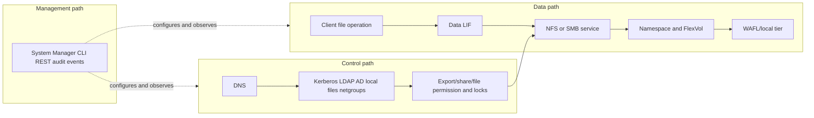

### Control-path dependencies

| Dependency | NFS relevance | SMB relevance | Failure symptom |
|---|---|---|---|
| DNS | Server lookup, client-name export rules, Kerberos/LDAP | Service name, AD domain controller and SPN lookup | Wrong endpoint, mount/session/auth failure |
| Routing/firewall | Client, directory, KDC and server paths | Client, DC/KDC, DNS and server paths | Timeout or asymmetric partial reachability |
| Time | Kerberos and evidence correlation | Kerberos, certificates and evidence correlation | Authentication failure or false timeline |
| LDAP/NIS/local files | UID/GID/groups/netgroups | Multiprotocol Unix identity and mappings | Access denied or wrong identity |
| Active Directory | Kerberos/multiprotocol mapping where designed | Domain join, machine account, users/groups, Kerberos/NTLM | Session setup/domain trust failure |
| Certificates/keys | LDAP TLS/Kerberos or management as configured | LDAP TLS, management, selected integrations | Trust or secure-channel error |

### Plain-English deep-dive: three roads, three health claims

The delivery truck can reach the warehouse while the badge office is down, so an existing session may behave differently from a new login. The operations office can be reachable while the loading dock is blocked. **Memory hook:** data moves the file, control grants and coordinates the file, management changes and observes the service.

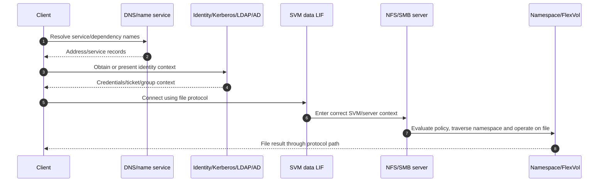

---

## 3. Data LIFs, networking, DNS, and name services

A NAS data LIF has a logical identity, service policy, home node/port, current node/port, and an IPspace/broadcast-domain context. Its network path includes the ONTAP port or interface group, VLAN, switch, subnet, route, firewall, DNS, and client source path.

### LIF and network map

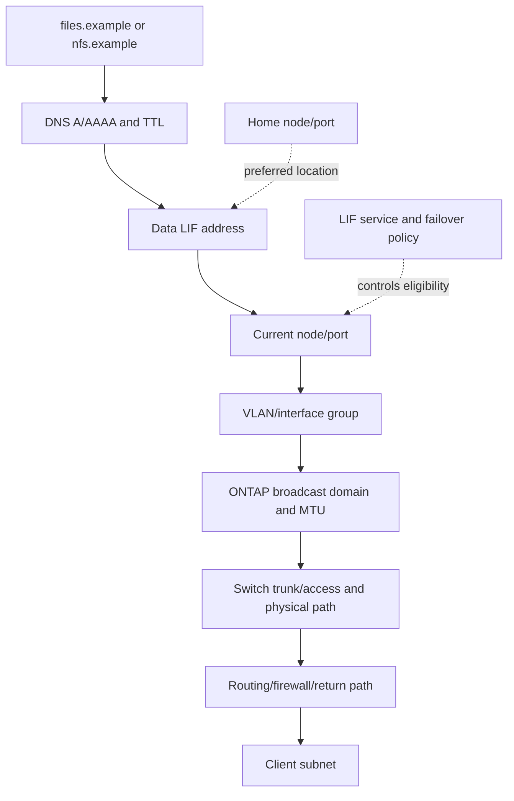

### Network evidence table

| Layer | Evidence to collect | What it cannot prove alone |
|---|---|---|
| DNS | Exact query/type/resolver/answer/TTL and client selection | Transport, protocol or permission success |
| LIF | SVM, address, home/current port, service policy, admin/oper state | Upstream VLAN/route/firewall correctness |
| ONTAP network | Port/VLAN/ifgrp/IPspace/broadcast domain/MTU/route | Actual switch and return-path behavior |
| Switch/router/firewall | VLAN operational state, MAC/ARP/ND, route, policy, counters | NFS/SMB authorization or file existence |
| Client | Source IP, route, DNS cache, TCP session and protocol status | Server-side object or identity correctness |

### Name-service chain

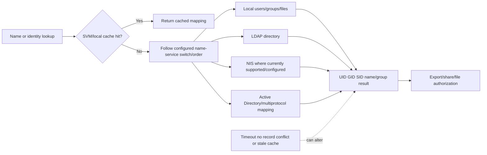

**Version honesty:** exact name-service order, caching, DNS load-balancing, LIF DNS integration, and command fields must be verified for the running ONTAP release. Do not prescribe a command or timeout from memory.

---

## 4. Unified namespace: root volume, junctions, and FlexVol placement

The ONTAP NAS namespace lets clients traverse a stable logical path even when mounted FlexVol volumes reside on different nodes or local tiers. The SVM root volume anchors `/`; each data volume is mounted at a junction path.

### Plain-English deep-dive: hallway, doorways, and rooms

The root volume is the hallway map. A junction such as `/projects` is a doorway. The data FlexVol is the room behind it. A volume move can relocate the room's foundation while the doorway sign remains `/projects`. **Why it matters:** namespace, network, and physical placement are independent dimensions that must all be discovered.

```mermaid
flowchart TB
    ROOT[/ SVM root volume] --> J1[/projects]
    ROOT --> J2[/home]
    ROOT --> J3[/finance]
    J1 --> VP[FlexVol projects on local tier A]
    J2 --> VH[FlexVol home on local tier B]
    J3 --> VF[FlexVol finance on local tier C]
    VP --> P1[/projects/design/current]
    VH --> P2[/home/user1]
    VF --> P3[/finance/reports]
    PARENT[Parent traversal/export/share permissions] -.must permit path.-> ROOT
```

### Namespace objects and risks

| Object | Purpose | Common failure |
|---|---|---|
| SVM root volume | Namespace top and parent traversal | Root unavailable/full/unprotected or restrictive policy blocks children |
| Junction path | Mounts a volume into the tree | Missing, wrong, nested unexpectedly, or policy boundary misunderstood |
| FlexVol | Holds data and metadata | Offline/full/moved or performance/protection issue |
| NFS export | Publishes and controls client access | Rule/client/security mismatch |
| SMB share | Maps a name to namespace path | Wrong path/share property/permission |
| Referral concept | Directs client to another location under supported protocol behavior | Referred name/path/auth/network unavailable |

### Namespace traversal sequence

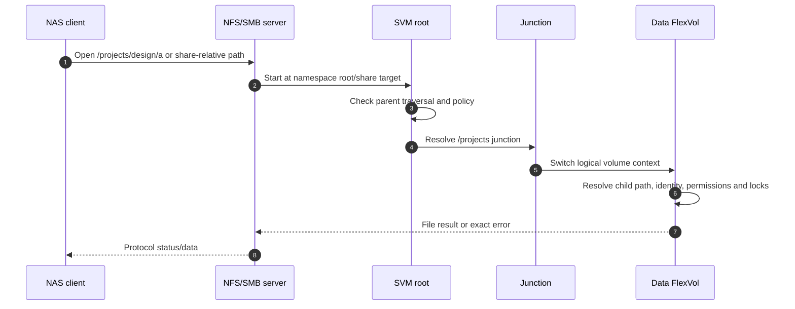

### SVM root versus node root

The SVM root volume anchors a tenant's NAS namespace. A node root volume contains ONTAP system state in a node root aggregate. They have different owners and recovery purposes. Confusing them can turn a namespace issue into an unsafe platform action.

---

## 5. NFS end-to-end data and control paths

For NFS, the client resolves the server, negotiates or selects an NFS version/security flavor, traverses the SVM namespace, passes export-policy checks, maps identity, checks file permissions and state, and performs file operations.

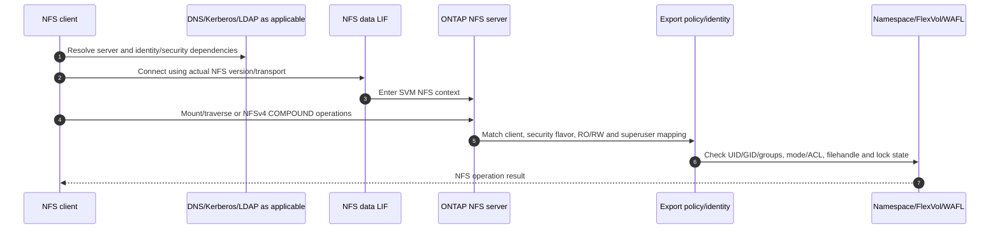

### NFS authorization layers

1. Correct SVM, NFS server, version, LIF and transport.
2. Namespace/export path exists and is mounted at the expected junction.
3. Export rule matches the actual client source/name/netgroup and security flavor.
4. Read-only/read-write and superuser mapping permit the operation.
5. UID/GID/groups or Kerberos principal map as designed.
6. File/directory mode or ACL and lock/state permit access.

Passing one gate does not imply the next. A successful mount can still produce a file access denial.

---

## 6. SMB end-to-end data and control paths

For SMB, the client resolves the service name, reaches the data LIF, negotiates a dialect, authenticates to the SVM's domain-joined SMB server, connects to a share, and opens a path under share and file permissions.

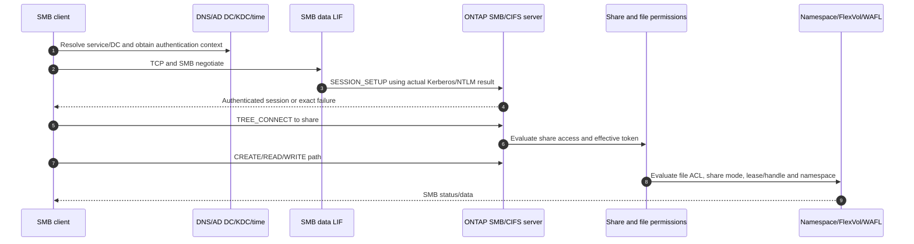

### SMB server dependencies

| Dependency | Purpose | Evidence |
|---|---|---|
| DNS | Service/SPN and domain-controller discovery | Query, answer, TTL, selected DC and address family |
| NTP/time | Kerberos and event correlation | Source, offset, reach and ticket validity |
| AD site/DC | Domain join, machine account, KDC/directory | Site, selected DC, trust/secure-channel logs |
| Machine account/SPN | Server identity for domain/Kerberos | Account status, SPN uniqueness/ownership and ticket error |
| User/group token | Authorization input | User/group SIDs and authentication time |
| Share path/properties | Publishes namespace location and behavior | Share-to-junction map and effective properties |

**Terminology:** ONTAP documentation and commands often use `CIFS` for the SMB server. In customer explanations, say SMB and recognize CIFS as the product/configuration term; do not imply modern SMB is the obsolete SMB1 dialect.

---

## 7. Permissions and identity layers

### Plain-English deep-dive: invitation, badge, room key, and occupied desk

- Export/share admission is the invitation.
- Authentication and identity mapping create the badge.
- File mode/ACL is the room key.
- Locks, leases, delegations, or SMB share modes say whether the desk is currently available.

An invitation alone cannot open the room. A valid room key cannot help if the user entered through the wrong tenant or the desk is locked.

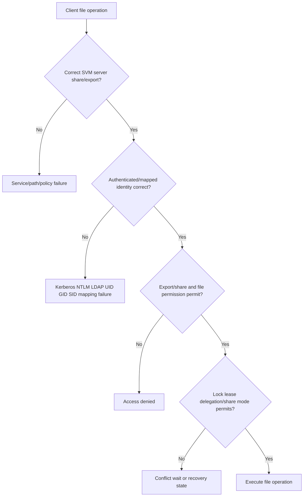

### Multiprotocol identity

An SVM can serve the same data through NFS and SMB when the exact configuration supports it. That does not make Unix and Windows identities equivalent automatically.

| Identity element | NFS orientation | SMB orientation | Multiprotocol question |
|---|---|---|---|
| Primary identity | UID/GID or Kerberos principal | SID/token from domain/local identity | How does ONTAP map between Windows and Unix forms? |
| Groups | Numeric supplementary groups/directory | Group SIDs/token | Are memberships current and unambiguous? |
| File security | Mode bits/NFS ACL orientation | NTFS-style ACL/security descriptor orientation | Which security style/effective rules govern this object? |
| Name services | LDAP/NIS/local/Kerberos | AD DS/DNS/Kerberos/NTLM orientation | What lookup order, cache and default mapping apply? |
| Unmapped identity | Anonymous/nobody/default behavior | Unknown/orphaned SID or denied access | Could fallback grant or deny unexpectedly? |

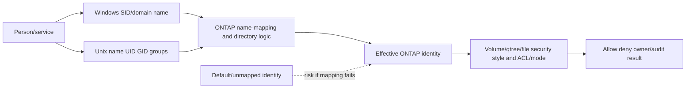

Do not solve multiprotocol access with permissive ACLs, duplicate UIDs, broad anonymous mapping, or ad hoc bidirectional rules. Capture exact input, rule/order, output identity, security style and expected access.

---

## 8. Client paths, referrals, and load distribution

ONTAP can expose several NAS data LIFs and supported namespace-location mechanisms. Load distribution does not happen merely because several IP addresses exist. DNS answer order, client connection reuse, protocol sessions, mounts, referrals, LIF placement, node ownership, hashing, and application behavior determine where work lands.

### Load-distribution model

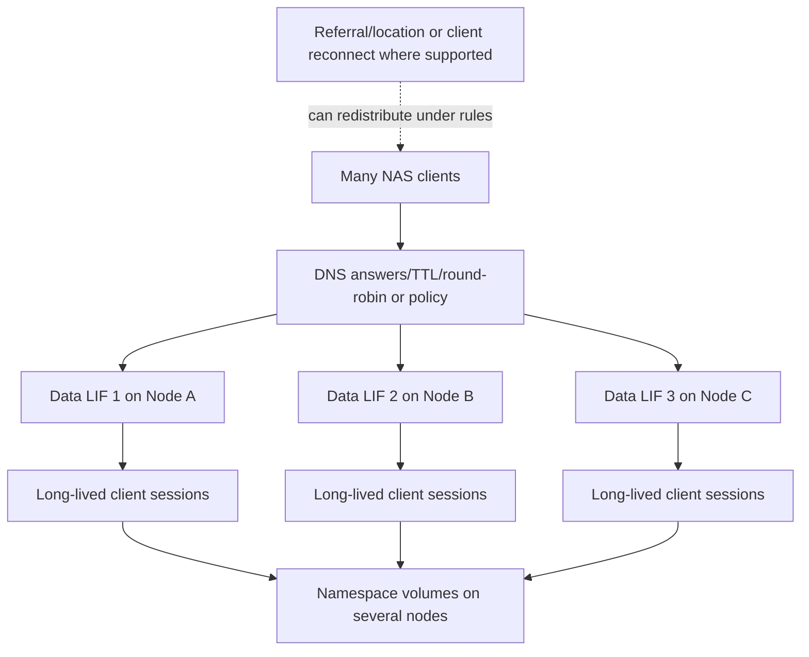

### Distribution questions

- Does the application open one long-lived connection, many connections, or one per client?
- Which DNS answer did each client cache, and for how long?
- Are LIFs distributed across nodes, ports, switches, and failure-state capacity?
- Does the protocol/version support a referral or location mechanism, and is it actually active?
- Is traffic entering one node for volumes physically placed on another, creating cluster traffic?
- Are load and latency measured per client, LIF, node, SVM, volume, operation, and time?

**Non-claim:** no universal ONTAP NAS load-balancing algorithm, DNS behavior, referral trigger, or per-LIF client limit is asserted here. Verify current release and client behavior.

---

## 9. LIF mobility, volume moves, and data locality

LIF movement changes where a network identity is hosted. A volume move changes where a FlexVol's blocks are placed. They are separate operations.

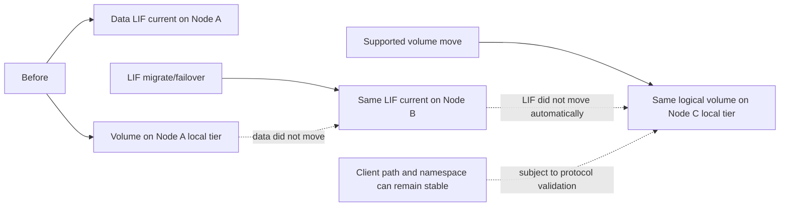

### Mobility comparison

| Mechanism | Changes | Does not automatically change | Required proof |
|---|---|---|---|
| LIF migration | Current hosting port/node | Volume/local-tier placement | Client operation, ARP/ND, route, session and load |
| LIF failover | Current hosting after eligible fault | Data placement or every protocol state | Named failure and client/application recovery |
| Volume move | Physical data placement/local tier | DNS, share/export, LIF or client mount | Namespace continuity, performance, protection and cutover |
| Takeover/giveback | Temporary HA servicing/ownership state | Permanent volume placement or every LIF | HA plus protocol/application recovery |

### Locality orientation

It can be valid for a NAS request to enter Node B through a LIF while the volume resides on Node A. The cluster architecture handles access, but the path consumes inter-node and serving-node resources. Call it a performance issue only when object-aligned evidence shows that this path constrains the customer SLO.

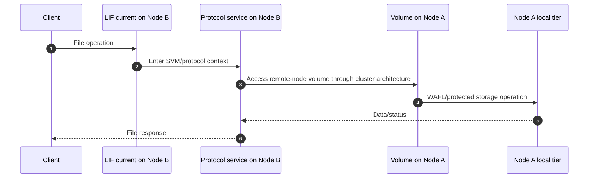

---

## 10. Availability and NAS evidence

NAS availability combines cluster/HA health, port/LIF path availability, protocol server state, namespace/root/junction health, identity dependencies, client recovery, and application behavior.

### Availability stack

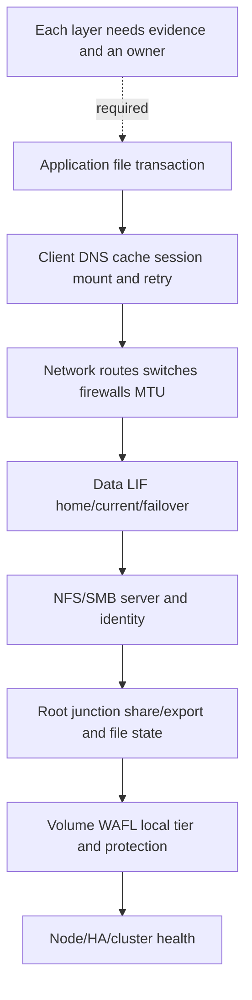

### Evidence by layer

| Layer | Minimum evidence | Customer question |
|---|---|---|
| Application/client | Exact operation/error, path, user, client, timestamp, retry/pause | What did the user fail to do? |
| Protocol | NFS version/status/filehandle/state or SMB dialect/command/status/IDs | At which file-protocol stage did it fail? |
| Identity | UID/GID/groups, SID/token, SPN/ticket, mapping result and source | Who did ONTAP think the caller was? |
| Network/LIF | DNS, source/destination, home/current, VLAN/route/firewall/counters | Did the request reach the intended SVM entrance and return? |
| Namespace/policy | Root/junction/share/export/rule/ACL/lock | Did the logical path and authorization resolve? |
| Storage | Volume/node/local tier, capacity, performance, protection and events | Did the server-side object serve the request? |
| HA/change | Takeover, LIF/volume move, upgrade, jobs and audit | What changed and what recovery was expected? |

### Supportability record

Record the client OS/build/kernel, NFS/SMB version and features, network adapters/drivers where material, identity and application dependencies, ONTAP release/platform, SVM configuration, and exact dated IMT result/notes. Use HWU for relevant platform/port facts. If IMT/HWU or customer telemetry is inaccessible, label the conclusion `not verified`; do not invent a result.

---

## 11. Discovery, risk, and recommendation engineering

### Customer discovery questions

1. Which business service, users, files, paths, applications, SLO, RPO/RTO, peaks and change windows depend on NAS?
2. Which cluster, HA pair, SVM, protocol servers, data LIFs, IPspaces, routes, DNS names, root/data volumes and local tiers serve them?
3. Which NFS versions/security flavors or SMB dialect/features are actually negotiated?
4. How do exports/shares map to junctions, volumes, qtrees and business owners?
5. Which AD/LDAP/NIS/Kerberos/DNS/time, UID/GID/SID/name-mapping and cache dependencies exist?
6. Which share/export/file permissions, security styles, locks/leases/delegations/handles and audit policies apply?
7. How are clients distributed across LIFs/nodes, and which inter-node paths or hotspots exist?
8. Which LIF, switch, node, volume-move, takeover, referral and application-recovery tests have passed?
9. Which telemetry is current, missing, contradictory, access-gated or sampled too coarsely?
10. Which exact current docs, IMT/HWU evidence, application guidance and Support cases govern the recommendation?

### Risk register fields

| Field | Required content |
|---|---|
| Evidence | Exact object, source, time, release and observation |
| Context | Business path, user population, SLO and change horizon |
| Mechanism | How the condition can create impact; alternatives still open |
| Priority | Impact, likelihood, urgency, confidence and dependency |
| Recommendation | Specific owner-led action with prerequisites/options |
| Validation | Positive, negative, failure and application tests |
| Residual risk | What remains even after action |

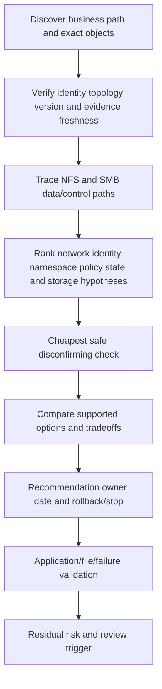

### Recommendation patterns

| Finding | Risk | Bounded recommendation | Validation |
|---|---|---|---|
| NAS LIF failover target lacks required VLAN | Port/node loss makes stable address unreachable | Correct full failover path under network/storage ownership; do not mask by reverting only | Switch/port failure, DNS/ARP/ND, NFS/SMB operation and app pause |
| SVM root traversal policy differs from child export | Healthy data volume appears inaccessible | Align parent traversal/export design with least privilege | Positive/negative traversal and child file operations |
| Clients concentrate on one LIF/node | Tail latency and failure-state overload may develop | Validate DNS/session behavior and redistribute using current supported design | Per-client/LIF/node/volume p99 at normal and failure load |
| Multiprotocol mapping falls to default identity | Wrong access or audit attribution | Correct authoritative identities and deterministic mapping; remove unsafe fallback | Expected allow/deny across NFS/SMB and audit identity |
| Volume moved but LIF stayed remote for all traffic | Inter-node resource use may increase | Prove SLO impact before changing placement; compare supported LIF/volume options | Object-aligned before/after path and app performance |

### JD Mapping

| JD responsibility | Part 27 contribution | Your factual bridge and gap |
|---|---|---|
| Understand the customer environment | Maps client, DNS/network, SVM, LIF, protocol server, namespace, identity, volume and storage ownership | SharePoint/OneDrive and Azure dependency mapping transfers; ONTAP NAS operation is unproven |
| Storage and networking depth | Explains NFS/SMB data/control paths, unified namespace, LIF mobility and multiprotocol identity | Conceptual and synthetic only; no production ONTAP configuration claim |
| Mitigate risk and improve stability | Finds failed NAS paths, permission layers, client concentration, remote-node locality and HA recovery gaps | critical-situation hypothesis and evidence discipline transfers |
| Analyze and report customer data | Requires per-client/LIF/node/volume evidence, timelines, confidence and supportability records | Analytics, Excel and Power BI strengths transfer |
| Provide tailored recommendations | Connects evidence and customer context to owner-led path, identity, namespace or placement actions | Advisory communication transfers; exact action needs current docs and SMEs |
| Conduct operational service reviews | Converts availability, capacity, performance, access and test evidence into decisions and tracked actions | Business-review experience is a strength |
| Improve escalation quality | Supplies a complete client-to-storage evidence chain and precise cross-team ask | Product/Engineering collaboration transfers; no NetApp internal access claim |

---

## 12. Common failure modes and troubleshooting decision tree

### Common failures

| Symptom | Competing causes | Discriminating evidence |
|---|---|---|
| Name resolves but connection fails | Wrong address family, route, firewall, LIF current path, listener | Actual selected address, both-end transport and LIF/server state |
| NFS mount/path fails | Version/port, export rule, root traversal, junction, filehandle, identity | Exact NFS operation/status and selected export rule |
| SMB share unavailable | DNS/SPN/domain, dialect/session, share path, LIF, server state | SMB last-successful stage and exact status |
| Access denied | Export/share gate, UID/GID/SID mapping, ACL/mode, root mapping, token cache | Effective identity and gate-by-gate result |
| Stale path/handle | Restore/recreate/move, cached referral/filehandle, namespace change | Old/new object identities and change timeline |
| Slow directory/listing | File count, metadata, identity lookup, client cache, network/server/node/local tier | Per-operation latency and aligned dependency counters |
| Failover causes outage | Missing VLAN/route, no eligible LIF target, client/session recovery, partner capacity | LIF movement plus client protocol/application timeline |
| One protocol works, another fails | Different LIF, identity, policy, path or server state | Separate NFS and SMB request paths; no common-cause assumption |

### Troubleshooting tree

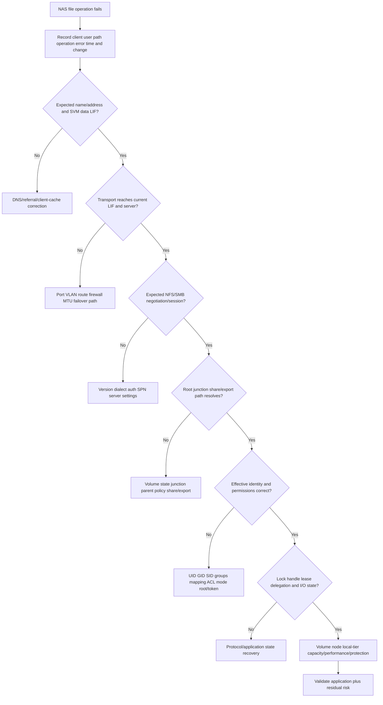

### Support boundaries

- The TAM/Technical Analyst scopes impact, maps dependencies, validates evidence, writes risk/recommendation logic, and tracks owners/outcomes.
- Customer NAS, AD/identity, network, application, security and change owners control their systems and production decisions.
- NetApp Support owns qualifying product diagnosis and support procedures under entitlement.
- Do not change export/share permissions, LIF failover, junctions, name mapping, root volumes, volume placement, or diagnostic settings from this conceptual guide.

---

## 13. Fully synthetic scenario: Aster Health unified namespace failure

> **Synthetic case:** Aster Health, every address, SVM, user, event, observation and outcome below is fictional. It does not represent a NetApp customer, internal process, tool result, or your production work.

### Environment

- SVM `clinical-files` serves SMB and NFS from one unified namespace.
- `/clinical` is a junction to a FlexVol on Node A; `/research` is on Node C.
- SMB clients use `files.aster.example`; Linux clients use `nfs.aster.example`.
- Four NAS data LIFs span Nodes A and B through two switches.
- Active Directory supplies Windows identity; LDAP supplies Unix identity; explicit mappings join selected users.
- A planned volume move relocates `clinical_data` from Node A to Node C.
- During later switch maintenance, one SMB LIF fails from Node A to Node B.

```mermaid
flowchart TB
    WIN[Windows clinical clients] --> DNS1[files.aster.example]
    LINUX[Linux research clients] --> DNS2[nfs.aster.example]
    DNS1 --> L1[SMB data LIF]
    DNS2 --> L2[NFS data LIF]
    L1 --> SVM[SVM clinical-files]
    L2 --> SVM
    SVM --> ROOT[SVM root]
    ROOT --> JC[/clinical junction]
    ROOT --> JR[/research junction]
    JC --> VC[clinical_data moved to Node C]
    JR --> VR[research_data on Node C]
    AD[AD/Kerberos/SID] --> MAP[Multiprotocol name mapping]
    LDAP[LDAP UID/GID] --> MAP
    MAP --> SVM
    SW[Switch A/B paths] --> L1
    SW --> L2
```

### Symptoms and timeline

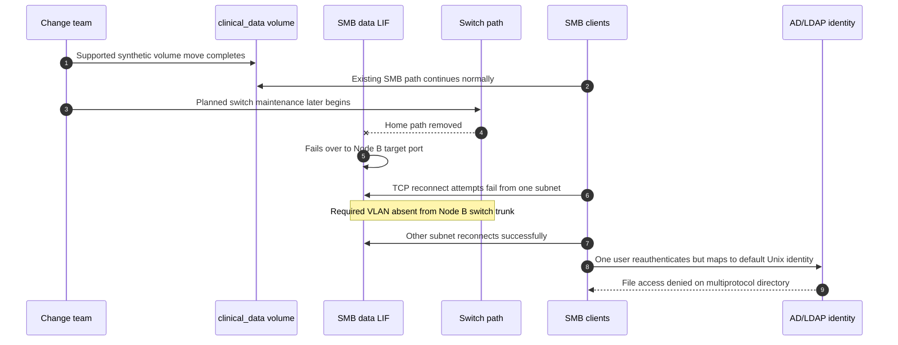

### Evidence and bounded findings

| Evidence | Observation | Bounded conclusion |
|---|---|---|
| Volume move job/namespace | Move completed; junction/path unchanged; other clients access data | The move is not the leading outage mechanism |
| LIF state | LIF is current on Node B and operational in ONTAP | Logical movement succeeded; upstream path remains unproved |
| Switch evidence | Clinical VLAN missing only on Node B trunk for affected subnet path | Strong network failover-path mechanism |
| SMB trace | TCP fails before SMB negotiate for affected subnet | Authentication/share/storage are not reached for those clients |
| Other subnet | SMB reconnect and file I/O succeed through moved LIF | SVM/server/volume remain broadly available |
| Identity case | SMB auth succeeds; mapping output becomes default Unix identity after LDAP group rename | Separate multiprotocol authorization mechanism |
| NFS | Research NFS remains healthy | Different LIF/path/identity chain; does not clear SMB issue |

### Competing hypotheses

| Hypothesis | Evidence for | Disconfirming check |
|---|---|---|
| Volume move broke the namespace | Timing is recent | Confirm junction/object identity and successful clients after move |
| SMB server failed | SMB users report outage | Verify last protocol stage; affected clients never reach negotiate |
| Node B LIF is unhealthy | LIF moved there | Verify ONTAP state plus successful clients on another subnet |
| Failover VLAN path is missing | Path-specific/subnet-specific failure | Switch operational VLAN and both-end capture |
| AD authentication failed for denied user | User gets access denied | SESSION_SETUP success and effective mapping/ACL evidence |
| Identity mapping failed | Default Unix identity appears | Compare mapping input/rule/output and authoritative LDAP data |

### Decision tree

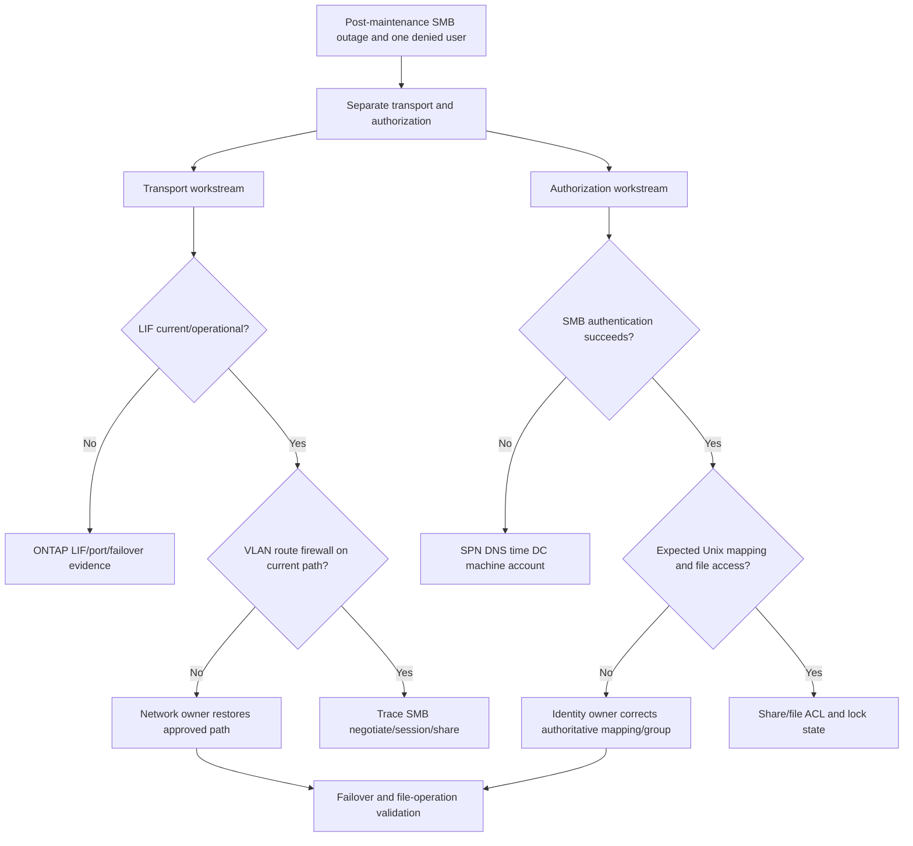

### Recommendations

1. **Network path:** restore the approved clinical VLAN on the Node B failover trunk and audit every eligible NAS LIF target for VLAN, MTU, route, firewall, and physical independence.
2. **Failover validation:** repeat a switch-path failure with representative SMB open/read/write and application timing; retain current/home LIF, switch and packet evidence.
3. **Identity:** update the authoritative LDAP/group and explicit mapping design so the user resolves deterministically; test expected allow and deny from both protocols.
4. **Evidence quality:** keep the volume move, network failure, and identity change as separate timeline events; do not combine them without a shared mechanism.
5. **Residual risk:** successful tests cover the named subnet, client versions, identities and failure. Future switch, DNS, directory or application changes can reintroduce exposure.

### Customer-facing summary

> "The volume move preserved the junction and data access. The later outage occurs after the SMB LIF moves to Node B, where the required VLAN is missing for one subnet; those clients fail before SMB negotiation. A separate user authenticates successfully but maps to a default Unix identity after an LDAP group change, causing file authorization failure. We recommend repairing and testing the failover path, correcting the authoritative identity mapping, and keeping the two mechanisms separate in the action register."

---

## 14. Your factual transfer and honest interview positioning

```mermaid
flowchart LR
    SPO[SharePoint/OneDrive production support] --> PATH[Namespace permission and user-operation reasoning]
    AD[Windows/AD production context] --> ID[SID group token DNS Kerberos dependencies]
    AZ[Azure/VM/networking] --> NET[Logical identity routes failover and shared fate]
    CRIT[Critical-situation escalation] --> EVID[Impact timeline hypotheses and owner coordination]
    BI[Excel/Power BI/SQL/Python] --> ANALYZE[Trend evidence and service-review story]
    PATH --> NAS[ONTAP NAS synthetic method]
    ID --> NAS
    NET --> NAS
    EVID --> NAS
    ANALYZE --> NAS
    NAS --> FUTURE[Authorized lab shadowing and SME-reviewed work]
```

| Factual strength | Transferable skill | Boundary to state |
|---|---|---|
| SharePoint/OneDrive support | Separate path, identity, permission, cache and service behavior | These are not ONTAP shares/exports or WAFL administration |
| Active Directory/Windows networking | DNS, Kerberos, users/groups, route and firewall dependencies | No ONTAP SMB domain-join or LIF configuration claim |
| Critical situation/Product collaboration | Scope, evidence, safe restoration, exact escalation ask | No NetApp internal process or customer-tool access claim |
| Analytics/business reviews | Data quality, trends, risk, owners and executive narrative | No production ONTAP counter or capacity result claim |

### Honest answer

> "I understand ONTAP NAS architecture from the SVM and NAS server through data LIFs, DNS/name services, the SVM root and junction namespace, shares or exports, identity/permission layers, FlexVol placement, LIF mobility, volume moves, and NFS/SMB request paths. My production experience is Microsoft data services, AD, networking, escalations and analytics, not ONTAP NAS administration. I would validate the exact release, IMT/HWU and client/application support, collect authorized read-only evidence, and work with NetApp, network, identity and application owners before a change."

---

## 15. Whiteboard drills and paper lab

### Whiteboard drills

1. **SVM suite:** Draw SVM, NFS/SMB servers, LIFs, root, junctions and FlexVols.
2. **Three paths:** Separate data, control and management paths.
3. **Network:** Draw DNS -> LIF -> port/VLAN -> switch -> route/firewall -> client.
4. **Namespace:** Draw root -> parent traversal -> junction -> volume -> file.
5. **NFS:** Trace version/security -> export -> identity -> permission -> filehandle/lock.
6. **SMB:** Trace name/SPN -> negotiate -> session -> share -> file ACL/handle.
7. **Mobility:** Explain LIF movement, volume move and takeover as different objects.
8. **Multiprotocol:** Map SID/name to UID/GID and show unsafe default fallback.
9. **Availability:** Name one failure and proof at each NAS layer.
10. **TAM:** Convert one finding into evidence, risk, action, owner, proof and residual risk.

### Paper lab scenario

A fictional six-node cluster hosts three NAS SVMs, 18 data LIFs, NFSv3/v4.1 and SMB clients, AD and LDAP, 40 junctions, 55 FlexVols, mixed security styles, four DNS views, two switch pairs and planned volume moves. Existing diagrams omit home/current LIFs, parent export rules, effective identity mappings and client failover evidence.

### Tasks

1. Inventory every SVM, server, protocol version, LIF, root/data volume, junction, share/export and owner.
2. Draw data, control and management paths for one NFS and one SMB client.
3. Reconcile ports, VLANs, interface groups, broadcast domains, routes, DNS and failover groups.
4. Map the root namespace and detect missing, nested or inaccessible junctions.
5. Build export/share/file-permission gate tables and expected allow/deny tests.
6. Reconcile UID/GID/groups, SID/token, name-mapping rules, security style and caches.
7. Map client/session distribution by LIF/node and identify inter-node data paths.
8. Model LIF migration, port/switch failure, node takeover, volume move and client recovery separately.
9. Inject DNS, LDAP, AD, route, VLAN, root-volume, junction, permission, lock and capacity failures.
10. Build one evidence timeline for each fault without changing state.
11. Validate exact client/server/ONTAP support in current docs/IMT; use HWU for relevant ports/platform facts.
12. Write three recommendations with options, owners, tests and residual risk.
13. Produce a technical appendix and a two-minute service-review narrative.
14. Label every statement production, transferable, synthetic, conceptual, access-gated or verify-current.

```mermaid
flowchart LR
    INV[Inventory SVM servers LIFs namespace] --> PATHS[Map NFS/SMB control and data paths]
    PATHS --> ID[Reconcile identities and permissions]
    ID --> MOB[Model LIF/volume/HA mobility]
    MOB --> FAIL[Inject failures and collect evidence]
    FAIL --> SUP[Validate current docs IMT/HWU]
    SUP --> REC[Write TAM recommendations and review]
```

### Lab pass criteria

- [ ] SVM, data LIF, server, root, junction, FlexVol and local tier remain distinct.
- [ ] NFS and SMB paths include DNS, identity and exact authorization layers.
- [ ] Home/current LIF and volume placement are independent facts.
- [ ] Load distribution is measured from clients/sessions, not inferred from IP count.
- [ ] Multiprotocol identity has deterministic mappings and negative tests.
- [ ] Each failover test ends with an application file operation and residual-risk statement.
- [ ] Commands, hard limits and support combinations remain verify-current.
- [ ] No synthetic exercise becomes a production-NetApp claim.

---

## 16. Self-test

1. Define NAS, SVM, NAS server, data LIF, FlexVol, root volume, junction, share and export policy.
2. Draw the complete ONTAP NAS architecture from client to local tier.
3. Distinguish data, control and management paths and their owners.
4. Explain LIF home/current ports, service policy and end-to-end reachability.
5. Draw the DNS/name-service and identity lookup chain.
6. Trace the SVM root/junction/FlexVol namespace and parent traversal.
7. Walk an NFS request through version, export, identity, permission and state.
8. Walk an SMB request through DNS/SPN, negotiation, authentication, share and file ACL.
9. Explain export/share permission versus file permission.
10. Explain UID/GID/SID mappings and security-style risk in multiprotocol access.
11. Explain why multiple LIFs do not guarantee balanced clients.
12. Compare LIF movement, volume move and HA takeover.
13. Explain valid inter-node NAS data paths and when locality becomes a hypothesis.
14. Build the complete availability/evidence stack.
15. Apply the troubleshooting tree to path, access, stale-handle, lock and performance symptoms.
16. Recreate Aster Health's separate VLAN and identity mechanisms.
17. Build a supportability record with current docs, IMT, HWU and access caveats.
18. Write a seven-part TAM recommendation.
19. Complete all whiteboard drills and the paper lab.
20. Deliver the honest production-gap statement naturally.

---

## 17. Official Source Anchors

**Date checked: 2026-08-24.** These official public sources anchor broad ONTAP NAS architecture. Exact server options, protocol versions, service policies, DNS/name-service fields, namespace/referral behavior, export/share settings, mobility, limits, commands and support combinations are release-sensitive. Re-open the exact current ONTAP/client/application documentation. IMT and HWU can be authentication- or entitlement-dependent; record access gaps instead of inventing results.

| Topic | Official public source | Bounded use and currency note |
|---|---|---|
| NAS management | [ONTAP NAS management](https://docs.netapp.com/us-en/ontap/nas-management/) | Current NAS overview and navigation; select exact release/topic. |
| SVMs and storage virtualization | [ONTAP storage virtualization](https://docs.netapp.com/us-en/ontap/concepts/storage-virtualization-concept.html) | Broad SVM/LIF/volume abstraction; exact protocol combinations are release-specific. |
| Namespaces and junctions | [ONTAP namespaces and junction points](https://docs.netapp.com/us-en/ontap/concepts/namespaces-junction-points-concept.html) | Broad root/junction/unified-namespace orientation. |
| Network/LIF management | [ONTAP network management](https://docs.netapp.com/us-en/ontap/network-management/) | Current ports, LIF service policies, IPspaces, broadcast domains, routes and failover entry point. |
| NAS path failover | [Configure NAS path failover](https://docs.netapp.com/us-en/ontap/networking/set_up_nas_path_failover_98_and_later_cli.html) | Release-sensitive workflow; not a command recipe for this Part. |
| NFS configuration | [ONTAP NFS configuration](https://docs.netapp.com/us-en/ontap/nfs-config/) | NFS server, SVM and export prerequisites; detailed operations continue in Part 28. |
| NFS administration | [ONTAP NFS administration](https://docs.netapp.com/us-en/ontap/nfs-admin/) | Export, identity, Kerberos, locks and operations by exact release. |
| SMB configuration | [ONTAP SMB configuration](https://docs.netapp.com/us-en/ontap/smb-config/) | SMB server/domain/share prerequisites; detailed operations continue in Part 29. |
| SMB administration | [ONTAP SMB administration](https://docs.netapp.com/us-en/ontap/smb-admin/) | Shares, identity, sessions, security and continuity by exact release. |
| Multiprotocol name mapping | [ONTAP multiprotocol name mapping](https://docs.netapp.com/us-en/ontap/nfs-admin/name-mapping-concept.html) | Broad mapping orientation; exact rule order/default behavior must be checked. |
| Volumes and moves | [ONTAP volume administration](https://docs.netapp.com/us-en/ontap/volumes/) | FlexVol, placement, volume move, capacity and policy entry point. |
| Interoperability | [NetApp Interoperability Matrix Tool](https://imt.netapp.com/) | Official, potentially gated exact client/protocol/storage solution result and notes. |
| Hardware facts | [NetApp Hardware Universe](https://hwu.netapp.com/) | Official, potentially gated platform/port/component/limit facts; not a NAS policy source. |
| Support | [NetApp Support Site](https://mysupport.netapp.com/) | Entitlement-dependent cases, knowledge, advisories and procedures. |

### Source-use discipline

- Record cluster/platform/ONTAP release, SVM/LIF/volume stable identity, client version and check date.
- Use the exact release's effective service policy, route, export/share and name-service fields.
- Treat DNS, directory and protocol caches as time-scoped evidence, not permanent truth.
- Validate client distribution and inter-node locality with measured sessions/operations.
- Save exact IMT result and notes; use HWU only for relevant hardware facts.
- Never invent gated customer state, NetApp internal workflow, hard limit or command output.

---

## Likely Interview Questions

### Q1. What components make up an ONTAP NAS service?

> **Model answer:** "A data SVM owns the NFS or SMB server, NAS data LIFs, routing and name-service context, root and data FlexVol volumes, unified namespace and junctions, shares or export policies, and identity/security configuration. Clients reach a LIF through DNS and the network, negotiate the protocol, traverse the namespace, pass service and file authorization, and access WAFL data on a local tier. Cluster/HA resources host the service but do not replace SVM-level evidence."

### Q2. How does the ONTAP unified namespace work?

> **Model answer:** "The SVM root volume anchors the top of the NAS path tree. Data FlexVol volumes are attached at junction paths such as `/projects`. The client traverses parent directories and policies, crosses the junction and then resolves the file in the mounted volume. A junction is a logical attachment, not a copy. A volume can move between local tiers while the namespace path remains stable, subject to supported operation and validation."

### Q3. Trace an NFS and an SMB request through ONTAP.

> **Model answer:** "For NFS, the client resolves the server, uses an actual NFS version/security flavor, reaches a data LIF, traverses the namespace, passes export client/security/RO-RW/superuser rules, maps UID/GID or Kerberos identity, checks file permission/state and performs the operation. For SMB, DNS and AD/Kerberos dependencies lead to negotiate and session setup, then tree connect to a share, CREATE/open under share and file ACLs, and read/write by handle. Both end at the SVM's volume/WAFL path, but their control states differ."

### Q4. What is the difference between share/export access and file permission?

> **Model answer:** "A share or export decides whether the client/session may enter the service path and under which broad rules. The file system then evaluates the effective identity against the file or directory's mode/ACL and current lock/share state. Mount or tree-connect success therefore does not prove read/write access. I capture the exact protocol stage, selected policy rule, effective identity and object security instead of broadening permissions."

### Q5. How do multiple data LIFs distribute load and survive failures?

> **Model answer:** "Multiple LIFs provide endpoints, but distribution depends on DNS answers and TTLs, client connection/mount behavior, referrals where supported, session longevity and application concurrency. Each LIF also needs valid home/current ports, service/failover policy, VLAN, route, firewall and failure-state node capacity. I measure sessions and operations per client/LIF/node and test a named port or switch failure; I do not infer balance or resilience from IP count."

### Q6. How do LIF mobility and volume moves differ?

> **Model answer:** "LIF migration or failover changes where a network identity is hosted; the data volume does not move with it. A volume move changes the FlexVol's physical local-tier placement while its junction/share/export can remain stable; the LIF does not move automatically. Takeover is another mechanism that temporarily changes HA servicing. I track home/current LIF, volume/local-tier placement and client path independently and validate application behavior."

### Q7. How would you troubleshoot a NAS outage or access denial?

> **Model answer:** "I capture client, user, path, operation, exact error, time and change, then follow the last successful stage: DNS/address, network/current LIF, NFS/SMB negotiation/session, root/junction/share/export, effective identity and permission, lock/handle state, then volume/node/local-tier service. I keep coincident symptoms separate until a mechanism joins them, use the cheapest safe disconfirming check, and write an owner, validation and residual-risk plan."

### Q8. How does your prior background transfer, and what remains a gap?

> **Model answer:** "My SharePoint/OneDrive, Active Directory, Windows/Azure networking and critical-situation work gives me production experience with namespaces, permissions, identity, DNS, dependency mapping, evidence and customer communication. Those methods transfer strongly to ONTAP NAS reasoning. I have not administered ONTAP NFS/SMB servers, data LIFs, junctions, exports, shares or multiprotocol mappings in production. I would use current docs, authorized evidence, IMT/HWU and NetApp/network/identity specialists for real changes."

---

## 30-Second Memory Hooks

- **NAS:** Clients ask for named files; the server owns the shared file system.
- **SVM:** Tenant/service suite containing protocol, LIF, namespace and identity.
- **Data LIF:** Stable phone number with home and current desks.
- **Three paths:** Data carries files; control grants/coordin­ates; management changes/observes.
- **Root volume:** Namespace entrance hall.
- **Junction:** Doorway attaching a FlexVol to a path.
- **Export/share:** Invitation; **file ACL/mode:** room key.
- **NFS path:** Version -> export -> identity -> permission -> state -> file.
- **SMB path:** Name/SPN -> negotiate -> session -> share -> ACL -> handle.
- **Multiprotocol:** Same person needs deterministic SID-to-UID/GID meaning.
- **Load distribution:** Count sessions and operations, not LIFs.
- **LIF move:** Network location changes; **volume move:** data placement changes.
- **Locality:** Inter-node access is valid until evidence shows an SLO cost.
- **Availability:** LIF + network + server + identity + namespace + storage + client recovery.
- **Your bridge:** enterprise namespace/identity rigor transfers; ONTAP production operation does not.

---

## Completion Checklist

- [ ] Define every SVM, NAS server, LIF, namespace, volume, junction, share/export and identity term.
- [ ] Draw the complete client-to-SVM-to-WAFL NAS architecture.
- [ ] Separate data, control and management paths and evidence.
- [ ] Map LIF home/current/service/failover state through every network hop.
- [ ] Trace DNS and name-service lookups with cache/failure caveats.
- [ ] Draw root/junction/FlexVol namespace and parent traversal.
- [ ] Trace complete NFS and SMB request paths.
- [ ] Separate service admission, authentication, file permission and lock/handle state.
- [ ] Explain multiprotocol identity and test deterministic allow/deny behavior.
- [ ] Measure client/session load distribution and inter-node locality.
- [ ] Distinguish LIF migration/failover, volume move and takeover.
- [ ] Build the availability/evidence map and supportability record.
- [ ] Ask all discovery questions and write a seven-part recommendation.
- [ ] Apply the common-failure table and troubleshooting tree.
- [ ] Recreate Aster Health without combining unrelated mechanisms.
- [ ] Complete all whiteboard drills, paper lab, self-test and Q1-Q8 aloud.
- [ ] State the No-production-NetApp boundary and exact non-claim accurately.
- [ ] Recheck current ONTAP/client/application docs, IMT/HWU and Support guidance before real use.

---

*Next suggested section:* [Part 28 - ONTAP NFS Configuration, Security, and Operations](Part-28-ontap-nfs-configuration-security.md)