# Part 28 - ONTAP NFS Configuration, Security, and Operations

> **Section goal:** Learn how an ONTAP SVM becomes a usable and secure NFS service: server/version settings, network and name-service prerequisites, namespace and junctions, export-policy evaluation, identities, AUTH_SYS or Kerberos security, NFSv4 domains, sessions, locks, leases, delegations, and pNFS orientation. By the end, you should be able to discover current state safely, explain access decisions, troubleshoot mounts and file operations, and write a customer-specific recommendation without guessing commands or support combinations.

Covers index item **28** and maps directly to job-description responsibilities for customer-environment discovery, storage and protocol depth, security/supportability analysis, service stability, proactive risk recommendations, operational reviews, and high-quality escalation evidence.

**Version caveat:** Exact features, fields, commands, limits, and supported combinations must be verified against current official documentation and authorized evidence for the customer's release, client, and configuration.

Exact NFS versions/minor versions, server options/defaults, export-rule fields/order, client-match syntax, Kerberos features, NFSv4 identity-domain behavior, name services, name mapping, locks/leases/delegations, pNFS layouts, session fields, ports, commands, limits, and host support vary by ONTAP release, client OS/kernel, configuration, and application. A **current-doc check** means reopening current official documentation for the exact release, client, and configuration. Verify the **Interoperability Matrix Tool (IMT)**, application/client guidance, and authorized system evidence. Hardware Universe (HWU) is relevant only when platform/port facts matter; it does not define export policy or host interoperability.

> **No-production-NetApp boundary:** You do not claim production NetApp or ONTAP NFS experience. Every SVM, export, identity, packet, command output, customer, and incident below is synthetic. Your factual experience is enterprise support, SharePoint/OneDrive data services, Windows/Azure networking, Active Directory, identity/permissions, critical-situation ownership, analytics, and customer communication. The explicit non-claim is: **you have not configured or operated an ONTAP NFS server, export policy, Kerberos realm, NFSv4 identity domain, pNFS layout, lock recovery, or production Linux NFS mount.**

---

## 1. ONTAP NFS service architecture

**Network File System (NFS)** lets a client ask a remote server to operate on named files and directories. ONTAP runs an NFS server inside a data SVM. The SVM also supplies data LIFs, routes, DNS/name services, a root/junction namespace, FlexVol volumes, export policies, identity mapping, and server-side file-system behavior.

### Plain-English deep-dive: a guarded remote library

The NFS server is a library. The data LIF is its network entrance. The export policy is the guest list. UID/GID or Kerberos identifies the visitor. File mode/ACL is the book-room key. A filehandle is the library's opaque catalog ticket for one object. Locks and leases reserve coordinated use. **Why it matters:** network reachability, export admission, identity, file authorization, and state are separate gates.

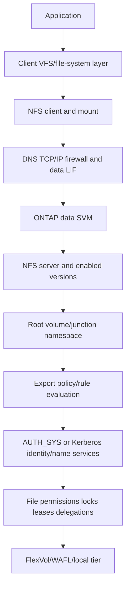

### Core terms

| Term | Plain meaning | Analogy | Why it matters |
|---|---|---|---|
| **NFS server** | SVM service processing NFS requests | Remote librarian | Version/security/server settings govern behavior |
| **Export policy** | Ordered set of rules controlling access to a volume | Guest-list booklet | Every exported volume has an applicable policy context |
| **Export rule** | One match and permission decision inside a policy | One guest-list line | Client, protocol, security and RO/RW/superuser fields interact |
| **Security flavor** | Authentication/protection method accepted for an operation | Type of identity badge | AUTH_SYS and Kerberos options have different trust/protection |
| **Filehandle** | Opaque server reference to a file-system object | Catalog ticket | Stale handles are object-reference problems, not generic packet loss |
| **Stateid** | NFSv4 reference to open/lock/delegation state | Reservation number | Recovery and operations can depend on valid state |
| **Lease** | Time-bounded NFSv4 state relationship | Renewable reservation | Server/client recovery must preserve or reclaim state correctly |
| **pNFS** | NFSv4.1 architecture allowing layouts for data-server access | Librarian gives a map to several collection rooms | Client/server/layout/network support must all be verified |

---

## 2. NFS versions and SVM configuration dependencies

An ONTAP NFS server can support selected NFS versions according to the exact release and configuration. Record the version actually negotiated by the client, not just what the server allows or the mount configuration requests.

### Version orientation

| Dimension | NFSv3 | NFSv4.0 | NFSv4.1 |
|---|---|---|---|
| Core state | File operations commonly described as stateless; auxiliary locking still has state | Integrated opens, locks, leases and delegations | Adds sessions/sequence slots and pNFS architecture |
| Namespace | Export/MOUNT model | Unified pseudo-root style namespace/referrals | Continues v4 namespace and referrals |
| Services/ports | NFS plus rpcbind/MOUNT/NLM/status dependencies can apply | Main NFS service commonly TCP 2049 | Main service commonly TCP 2049; pNFS adds data paths |
| Security | AUTH_SYS/RPCSEC_GSS support by implementation | Integrated security framework | Same framework with v4.1 state/session behavior |
| Operational risk | Auxiliary services/firewall and lock recovery | Identity-domain, lease and reclaim issues | Session/layout/data-server path issues |

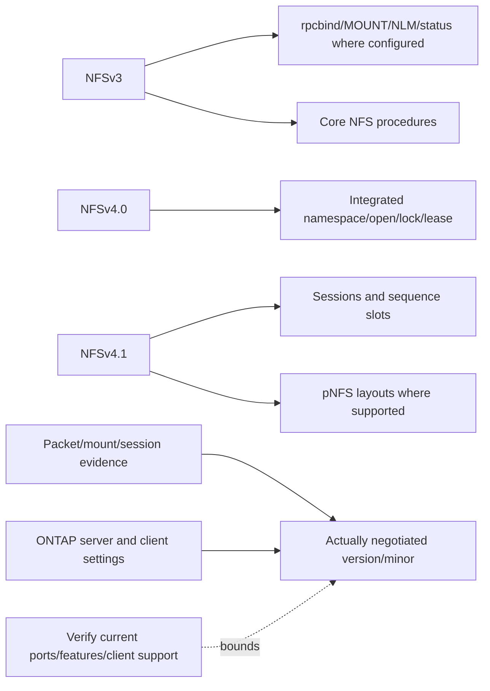

### SVM dependency map

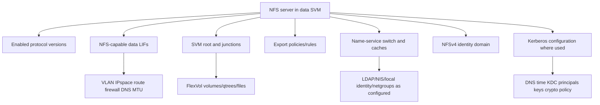

### Configuration lifecycle

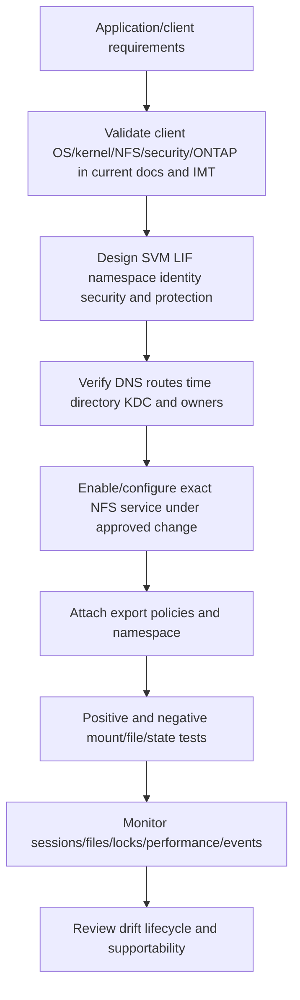

### Version-sensitive server settings

Examples include enabled versions/minors, TCP/UDP support where applicable, v4 identity domain, Kerberos, delegation/pNFS behavior, mount-root-only style controls, numeric-id handling, auxiliary service ports, and protocol limits. This chapter does not prescribe values. Use current documentation and application requirements; changing a server option can affect many clients at once.

---

## 3. Export policies and ordered rule evaluation

An export policy contains rules. ONTAP evaluates a request against the policy attached to the relevant volume/path using the exact release's rule-order and matching semantics. The first applicable rule commonly determines access; confirm current documentation rather than relying on memory.

### Plain-English deep-dive: ordered security screening

An export policy is an airport security queue. The first rule that matches the traveler determines which badge types and actions are accepted. A broad rule placed before a narrow rule can capture traffic unexpectedly. Passing airport security still does not open a locked office: file permissions remain. **Why it matters:** rule order, match scope and actual client identity are evidence, not formatting details.

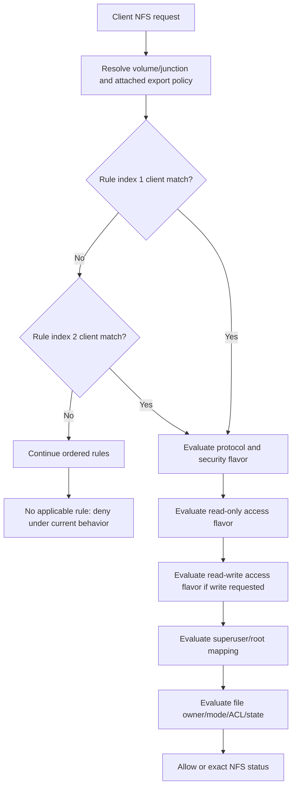

### Rule dimensions

| Dimension | Question | Failure/risk |
|---|---|---|
| Index/order | Which rule is evaluated first? | Broad earlier rule shadows intended narrow rule |
| Client match | IP/prefix, hostname, netgroup or supported pattern? | Wrong source, DNS, stale netgroup or syntax mismatch |
| Protocol | Which NFS protocol/version is admitted? | Client fallback/upgrade changes selected rule behavior |
| RO security flavors | Which flavors can read? | AUTH_SYS read unexpectedly allowed/denied |
| RW security flavors | Which flavors can write? | Mount works but writes fail |
| Superuser security | Is UID 0/root preserved, mapped or denied? | Root-squash-like behavior surprises application |
| Anonymous/default user | What identity receives mapped/unknown requests? | Excess privilege or unexplained denial |

### Client matching

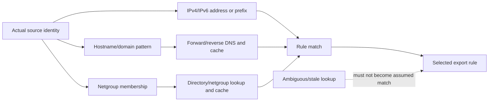

Hostname matching introduces DNS perspective and cache dependencies. Netgroups introduce directory availability, schema, membership and cache dependencies. Address-based matches reduce those dependencies but require accurate network lifecycle governance. No form is universally best.

### Parent and child policy

A client traversing the SVM root and one or more junctions can encounter policies on parent and child volumes. A permissive child policy cannot compensate for parent traversal denial. Capture the exact failed operation and namespace point.

```mermaid
flowchart LR
    ROOT[/ root volume policy] --> J[/projects junction]
    J --> CHILD[projects volume policy]
    CHILD --> DIR[/projects/team directory permissions]
    CLIENT[Client traversal] --> ROOT
    ROOT --> G1{Parent rule permits traversal?}
    G1 -->|No| DENY[Path inaccessible]
    G1 -->|Yes| G2{Child export and file access permit?}
    G2 -->|Yes| OK[File operation]
    G2 -->|No| DENY2[Child access denied]
```

---

## 4. UID, GID, name services, and name mapping

With common AUTH_SYS use, the client sends numeric **User Identifier (UID)**, primary **Group Identifier (GID)** and supplementary groups. ONTAP interprets those numbers using export and file-security rules. A number is not cryptographic proof of a person.

### Identity path

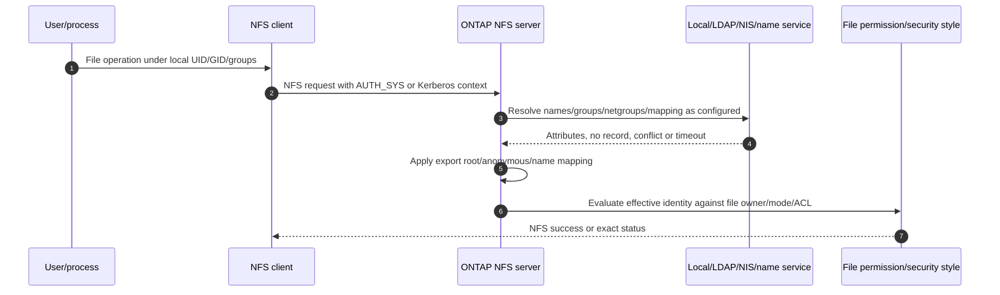

### Identity risks

| Condition | Risk | Evidence |
|---|---|---|
| Same username, different UID | Wrong owner/access | Client/server/directory numeric identity |
| Same UID reused for another person | Unauthorized access/audit confusion | Authoritative lifecycle and file owner history |
| Missing supplementary group | Expected access denied | Effective groups in request/server lookup/cache |
| Group list truncation/limit behavior | Some memberships absent | Exact client credential and ONTAP release behavior |
| Directory replicas disagree | Intermittent result | Selected replica, query result, replication and cache time |
| Name mapping defaults to nobody/anonymous | Denial or broad fallback | Mapping rule/input/output and export anonymous identity |
| Multiprotocol SID/UID mapping conflict | NFS and SMB see different owner | Security style, mapping rules, AD/LDAP authoritative records |

### Name-service switch orientation

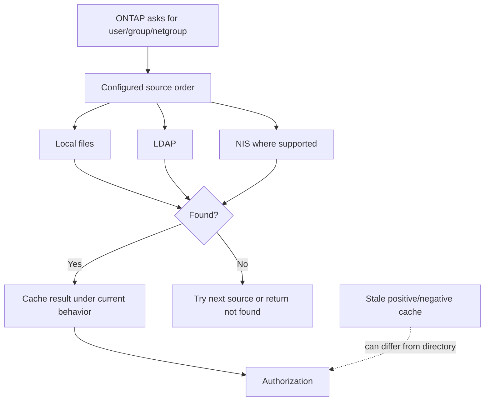

**Security rule:** do not resolve an access incident by making directories world-writable, reusing UIDs, broadening the export to all clients, or mapping unknown users to a privileged account.

---

## 5. AUTH_SYS and Kerberos security options

### AUTH_SYS

AUTH_SYS transports client-asserted numeric identity information. Trust is largely placed in the allowed client and surrounding security design. It can be appropriate in controlled supported environments, but it does not provide strong per-user cryptographic identity or privacy by itself.

### Kerberos/RPCSEC_GSS

Kerberos uses tickets and service keys. NFS commonly labels security options:

| Label | Conceptual protection | Verify-current caveat |
|---|---|---|
| `krb5` | Authentication | Exact per-message properties and implementation support |
| `krb5i` | Authentication plus integrity | Algorithms, overhead and client/server support |
| `krb5p` | Authentication, integrity and privacy | Encryption scope, CPU/performance and support |

### Plain-English deep-dive: signed badge versus self-written number

AUTH_SYS resembles writing an employee number on a form from an approved office. Kerberos resembles a time-limited badge signed by a trusted security desk for the named NFS service. `krb5i` adds tamper evidence; `krb5p` also conceals protected contents. **Why it matters:** stronger identity adds DNS, time, principal, key, KDC, crypto and mapping dependencies.

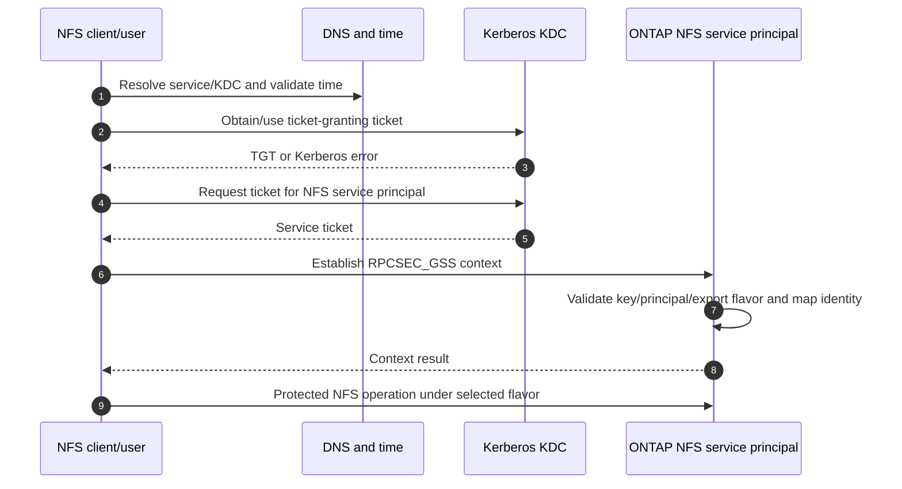

### Kerberos dependencies and evidence

- Exact service name, canonicalization behavior and IP/name used by the client.
- NFS service principal ownership, uniqueness, key version/keytab state and supported crypto.
- Realm/trust and selected KDC/domain controller.
- Client, KDC and ONTAP time sources/offsets.
- Ticket cache, service ticket and error code.
- Export rule accepting the intended Kerberos flavor.
- Mapping from Kerberos principal to Unix identity and file permission.

Kerberos authentication success does not prove export or file authorization. Do not downgrade to AUTH_SYS as a permanent shortcut without security/application ownership and risk review.

---

## 6. NFSv4 identity domain

NFSv4 can represent owner/group identities in name-at-domain form. The client and server need compatible identity-domain interpretation and mapping to local/numeric identities. Exact ONTAP options and client behavior vary.

### Plain-English deep-dive: the same name needs the same directory suffix

Imagine two companies both have an employee called `sam`, so badges read `sam@engineering.example` and `sam@research.example`. Removing or changing the suffix can identify the wrong person or no person. The NFSv4 domain gives owner/group names a namespace; the client and server still need authoritative mappings to local UID/GID values. **Why it matters:** a file can be reachable while ownership displays as an unmapped identity or authorization fails.

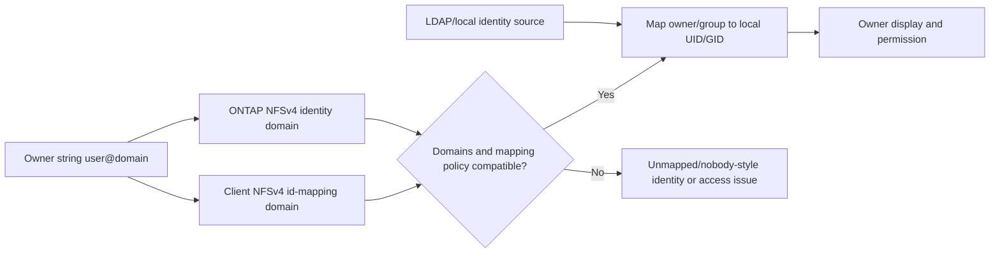

### Domain-mismatch symptoms

- Owners display as nobody/unknown or unexpected numeric identities.
- File creation gets an unexpected owner.
- Access differs between NFSv3 and NFSv4 clients.
- ACL/owner changes fail despite transport/export access.
- Only clients with one id-mapping configuration fail.

Capture client configuration, actual NFS minor version, owner/group strings, ONTAP NFSv4 domain, directory result, mapping logs/cache and file security. Do not make domains match by changing production-wide settings without impact analysis.

---

## 7. Mounts, sessions, files, locks, leases, and delegations

### NFSv3 operational state

NFSv3 core operations do not use NFSv4 open/session state, but mounts, client caches, TCP, Network Lock Manager (NLM), status monitoring and applications still maintain state. `Stateless` does not mean `nothing to recover`.

### NFSv4 state

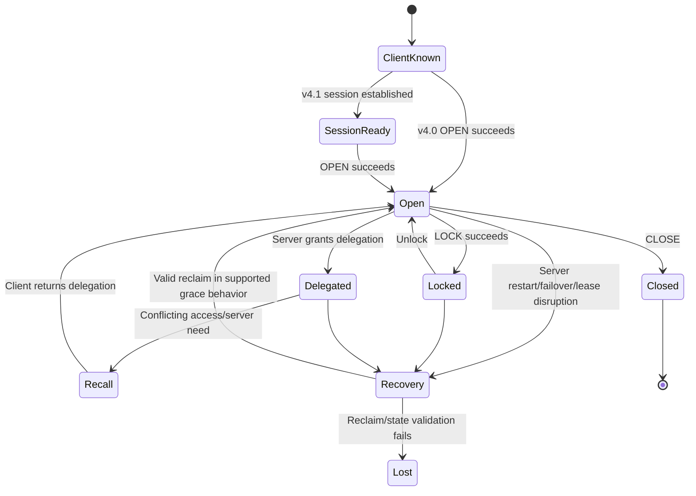

### Operational objects

| Object/view | Meaning | Troubleshooting use |
|---|---|---|
| Mount | Client's attachment of remote namespace | Version/options/path/security and current use |
| Client/session | NFSv4 client/session state or server-observed client | Scope reconnect/recovery issues |
| Open file | Server/client state for opened object | Identify workload and owner before disruption |
| Lock | Byte-range/file coordination state | Identify owner/range/conflict/reclaim |
| Lease | Time basis for NFSv4 state | Explain expiry/recovery windows |
| Delegation | Server-granted caching authority | Diagnose recall/coherency/recovery |
| Filehandle | Opaque object reference | Diagnose stale reference after restore/recreate/change |

### Lock recovery sequence

```mermaid
sequenceDiagram
    autonumber
    participant C as NFS client/application
    participant S as ONTAP NFS server
    participant H as HA/recovery event
    C->>S: OPEN and LOCK; receive stateids
    C->>S: Normal file operations under lease
    H--xS: Server/node transition
    S->>S: Enter supported recovery/grace behavior
    C->>S: Reconnect and reclaim eligible open/lock state
    S-->>C: Reclaim success or exact NFS error
    C->>C: Application validates lock and transaction behavior
```

Do not clear locks or restart NFS merely because a file appears busy. Confirm the owning application/process, client identity, range/state, cluster membership where relevant, and supported recovery path.

---

## 8. pNFS orientation

**Parallel NFS (pNFS)** is part of the NFSv4.1 architecture. A metadata server can give the client a layout describing eligible data-server access, allowing parallel/direct data operations under protocol state.

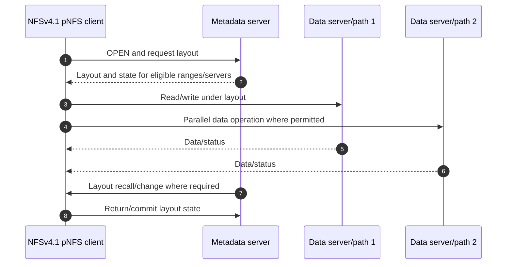

### pNFS caveats

- NFSv4.1 alone does not prove pNFS is enabled or used.
- Client, ONTAP release, layout type, LIFs/data-server paths, identity/security and application must be supported.
- Metadata path success does not prove every data path.
- Every returned address needs DNS/routing/firewall/MTU and failure-state validation.
- Layout recall, retry, state recovery and client behavior affect availability.

Treat pNFS as `verify current documentation and negotiated runtime evidence`, not a default performance recommendation.

---

## 9. Safe operational discovery and conceptual read-only examples

Start with read-only discovery. The examples below are deliberately conceptual. Exact command families, fields, filters, privilege, REST resources and output vary by release; use current `?` help/manual pages and official APIs. They are not copy/paste production instructions.

```text
CONCEPTUAL ONLY - verify current ONTAP release, privilege, fields and scope
<nfs-server-command-family> show -vserver <svm> -fields <documented-version-and-security-fields>
<export-policy-command-family> show -vserver <svm>
<export-rule-command-family> show -vserver <svm> -policyname <policy> -instance
<name-service-command-family> show -vserver <svm>
<network-interface-command-family> show -vserver <svm> -fields <documented-home-current-service-fields>
<volume-command-family> show -vserver <svm> -fields <documented-junction-policy-state-fields>
<nfs-operational-command-family> show -vserver <svm> -fields <documented-client-session-lock-fields>
```

### Read-only-first sequence

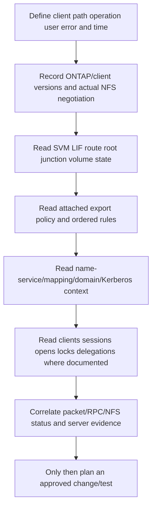

### Evidence record for any command/API output

- Cluster/SVM/object stable identity and ONTAP release.
- Full redacted command/request, privilege and scope.
- UTC timestamp, timezone/clock state and collector identity.
- Field definitions from the matching release documentation.
- Raw output protected under customer policy.
- Unknown, null, missing, stale and access-denied fields retained explicitly.

---

## 10. Security and hardening orientation

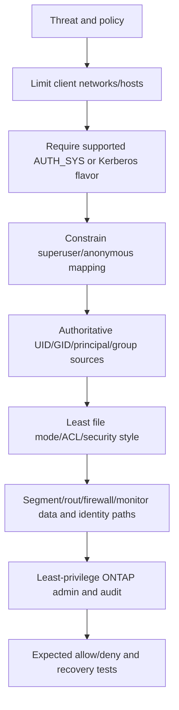

### Security checklist

- Narrow export client matches and document why each exists.
- Use the security flavor required by policy and supported workload.
- Avoid broad root/superuser access; test mapped-root behavior explicitly.
- Protect LDAP/Kerberos traffic and service keys under current supported guidance.
- Govern UID/GID lifecycle, netgroups, replicas, caches and mapping defaults.
- Separate NFS data access from ONTAP administration; use RBAC and audit.
- Protect packet traces because AUTH_SYS identity, names and file data can be visible.
- Review old protocol versions and insecure fallback against current client/application needs.
- Record accepted risk, owner, expiry and compensating controls for exceptions.

Security can increase dependencies and CPU/network work. Measure representative performance; do not weaken authentication or privacy merely to improve an unrepresentative benchmark.

---

## 11. Failure modes and troubleshooting decision tree

### Common failure modes

| Symptom | Candidate causes | Cheapest discriminating evidence |
|---|---|---|
| Server name not found | DNS/suffix/resolver/view/cache | Exact query and selected address |
| TCP/RPC timeout | Route/firewall/port/LIF/MTU/listener | Both-end packet flow and LIF/server state |
| NFSv3 mount fails, v4 works | Auxiliary service/port/export/version differences | Actual RPC program/port and protocol status |
| Mount succeeds, read fails | Parent/child rule, UID/GID, file mode/ACL, security flavor | Selected rule plus exact operation identity/status |
| Root cannot write | Superuser mapping/anonymous UID/file permission | Rule flavor and effective server identity |
| Owner displays nobody | NFSv4 domain/name mapping/directory/cache mismatch | Owner string, domains and authoritative mapping |
| Stale filehandle | Restore/recreate/delete/junction/volume identity change | Exact stale status and object/change history |
| Lock persists/fails after HA | Owner still active, reclaim/lease/grace/stateid issue | Lock owner/range/state and recovery timeline |
| v4.1 metadata works, data slow/fails | pNFS layout/data path or ordinary storage/network path | Layout evidence and per-path request arrival |
| Slow directory operations | File count, metadata, identity lookup, cache, server/storage contention | Per-operation latency plus identity/server counters |

### Unified decision tree

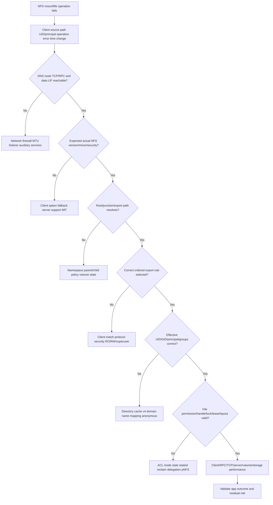

### Evidence correlation

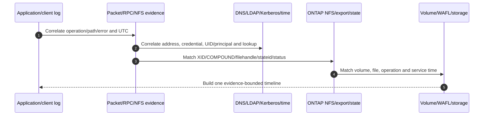

### Support boundaries

- Preserve exact status and state before remounting, restarting, clearing locks or changing export rules.
- Export-policy, Kerberos, NFS server, namespace and identity changes require customer authority and rollback/testing.
- Low-level state repair, suspected defects and unsafe HA recovery belong with NetApp Support and client/application specialists.
- A TAM recommendation can prioritize and coordinate; it does not confer production change authority.

---

## 12. TAM discovery, evidence, recommendations, and JD Mapping

### Discovery questions

1. Which application, client groups, paths/files, operation mix, SLO, RPO/RTO and change windows use NFS?
2. Which SVM, NFS server versions/options, LIFs, routes, namespace/junctions, volumes/qtrees and protection serve them?
3. Which actual NFS version/minor, transport, mount options, security flavor and fallback are observed?
4. Which export policy/rule index/client match/protocol/RO/RW/superuser/anonymous settings apply to each path?
5. Which UID/GID/groups, LDAP/NIS/local/netgroup, name-service order/cache and multiprotocol mappings exist?
6. Which Kerberos realm/KDC/service principal/key/DNS/time/crypto and NFSv4 identity domain apply?
7. Which file mode/ACL/security style, open/lock/lease/delegation/filehandle/session and pNFS state apply?
8. Which client, network, ONTAP, volume and application telemetry can be correlated to one operation?
9. Which exact current client/application docs, ONTAP docs, IMT result/notes and access gaps govern supportability?
10. Who owns client, identity, network, NFS, application, security, change and residual-risk decisions?

### Minimum escalation pack

- Business impact, client/path/file/operation, exact error/status, scope and UTC timeline.
- Client OS/kernel/build, NFS client, negotiated version/minor, mount/effective options, security flavor, cache/retry/timeouts and changes.
- Source IP/interface, DNS answer, route/firewall/MTU/TCP/RPC path and capture limitations.
- SVM/NFS server release/options, data LIF, root/junction/volume/qtree and export policy/rule selected.
- UID/GID/effective groups, file owner/mode/ACL/security style, LDAP/NIS/local/netgroup lookup/cache and mapping output.
- Kerberos principal/ticket/KDC/key/time/crypto evidence without exposing secrets; NFSv4 identity-domain evidence.
- XID/COMPOUND/operation/filehandle/stateid/session/sequence/lock/delegation/layout and exact status.
- ONTAP client/session/open-file/lock views where documented, protocol/volume/node/storage timing and events.
- Exact dated official/IMT support evidence, unknowns, actions tried/results, rollback, competing hypotheses and specialist ask.

### Recommendation model

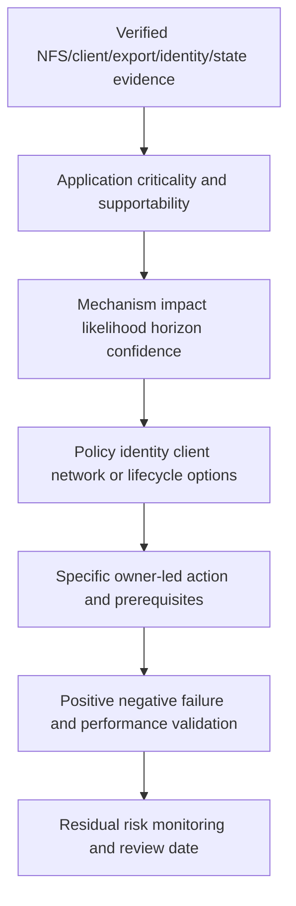

### Recommendation patterns

| Finding | Risk | Bounded recommendation | Validation |
|---|---|---|---|
| Broad AUTH_SYS RW rule precedes Kerberos-only rule | Clients can write with weaker identity than intended | Redesign ordered rules under security/NFS ownership after client inventory | Intended Kerberos allow; AUTH_SYS denial; no app regression |
| LDAP replicas disagree on group | Intermittent access/audit inconsistency | Repair directory replication/cache and define authoritative source | Same effective groups across replicas/clients and file tests |
| v4 owner domain mismatch | Wrong owner display/access | Align supported client/ONTAP id-mapping domains after impact review | Create/read/chown-style supported app tests and owner evidence |
| Lock reclaim fails after takeover | Application can lose coordination | Correlate lease/grace/client identity/state and engage Support/client owner | Controlled failover with lock/application validation |
| pNFS data path lacks firewall route | Metadata succeeds but data operations fail | Correct every supported layout-returned path or disable only under current design review | Layout plus all data-server paths and failure tests |

### JD Mapping

| JD responsibility | Part 28 contribution | Your factual bridge and gap |
|---|---|---|
| Understand customer environment | Maps client/network/SVM/export/identity/file/state dependencies | M365/AD/network mapping transfers; ONTAP NFS operation unproven |
| Storage depth | Covers versions, policies, identity, Kerberos, v4 state and pNFS | Conceptual/synthetic only |
| Risk/stability | Finds broad export, identity drift, stale handles, lock recovery and path risk | critical-situation hypothesis method transfers |
| Supportability | Requires exact client/kernel/security/ONTAP IMT evidence | No customer IMT/gated result claimed |
| Recommendations | Connects exact gate/status to owner, test and residual risk | Advisory/escalation skills transfer |
| Service review | Reports security posture, client lifecycle, failures, actions and tests | Analytics/business-review strength |
| Escalation | Supplies request/state/identity/path evidence and exact ask | Product/Engineering evidence discipline transfers |

---

## 13. Fully synthetic scenario: Bluewater Engineering NFS access and locks

> **Synthetic case:** Bluewater Engineering, every client, UID, rule, event, result and recommendation below is fictional. It is not a NetApp customer, internal workflow, tool result, or your production work.

### Environment

- SVM `eng-nfs` serves NFSv3 and NFSv4.1.
- `/engineering` is a junction to `eng_data`.
- Legacy build hosts use AUTH_SYS; newer hosts use `krb5i`.
- LDAP supplies Unix identities and netgroups.
- Export policy rules are intended to give legacy hosts read-only and Kerberos hosts read-write access.
- A planned HA takeover occurs during a lock-heavy build.

```mermaid
flowchart TB
    LEG[Legacy AUTH_SYS build clients] --> LIF[NFS data LIFs]
    NEW[Kerberos NFSv4.1 clients] --> LIF
    LIF --> SVM[SVM eng-nfs]
    SVM --> ROOT[SVM root]
    ROOT --> J[/engineering junction]
    J --> VOL[eng_data FlexVol]
    POLICY[Ordered export policy] --> VOL
    LDAP[LDAP UID/GID/groups/netgroups] --> POLICY
    KDC[DNS time KDC service principal] --> NEW
    LOCKS[NFSv4 opens/locks/leases] --> VOL
```

### Timeline

```mermaid
sequenceDiagram
    autonumber
    participant L as Legacy AUTH_SYS client
    participant K as Kerberos v4.1 client
    participant S as ONTAP NFS server
    participant D as LDAP/netgroup replicas
    participant H as HA event
    L->>S: Mount and write attempt
    S-->>L: Write succeeds unexpectedly
    K->>S: OPEN/LOCK build file
    S-->>K: Lock granted
    H--xS: Planned takeover transition
    K->>S: Reconnect/reclaim state
    S-->>K: Reclaim error for one client identity
    S->>D: Netgroup/group lookup for affected clients
    D-->>S: Replicas return different membership
```

### Evidence

| Evidence | Observation | Bounded conclusion |
|---|---|---|
| Export policy | Broad first rule matches engineering subnet and allows AUTH_SYS RW | Explains unexpected legacy write; intended later rule is shadowed |
| Packet/NFS status | Legacy write is accepted under AUTH_SYS, not Kerberos | Security-path evidence, not a file-system defect |
| File ACL/mode | Legacy UID has write under file mode | Both export and file gates permit the write |
| Kerberos | Ticket/context healthy before takeover | Weakens initial authentication hypothesis |
| Recovery trace | One v4.1 client reconnects with changed client identity and reclaim fails | Client identity/recovery mechanism candidate |
| LDAP/netgroup | Two replicas disagree after recent membership change | Separate policy/mapping consistency risk |
| Storage | Volume/WAFL latency and capacity normal | Weakens storage-performance cause |

### Competing hypotheses

| Hypothesis | Evidence for | Disconfirming check |
|---|---|---|
| Export rule order permits weak write | Exact first rule match/flavor | Simulate/evaluate intended clients against ordered rules |
| File ACL alone caused weak write | File mode permits UID | Show export also permits; both controls are required |
| Kerberos outage caused lock loss | Event follows takeover | Ticket/context healthy; inspect stateid/client identity/reclaim status |
| Server lost every lock | One build fails | Compare all clients/locks and successful reclaims |
| LDAP inconsistency caused lock reclaim | Replicas disagree | Lock reclaim state may not depend on that group; correlate exact operation |

### Decision tree

```mermaid
flowchart TD
    TOP[Unexpected legacy write plus one lock-reclaim failure] --> SPLIT[Separate authorization and state recovery]
    SPLIT --> AUTH[Authorization]
    SPLIT --> STATE[State recovery]
    AUTH --> RULE{Which first export rule matched?}
    RULE --> BROAD[Correct ordered rule design after client inventory]
    BROAD --> FILE{Does file permission also allow?}
    FILE --> ACL[Align least file mode/ACL]
    STATE --> IDENT{Same NFSv4 client/session identity after HA?}
    IDENT -->|No| CLIENT[Client/Support recovery analysis]
    IDENT -->|Yes| RECLAIM[Lease grace stateid server/client logs]
    CLIENT --> TEST[Controlled takeover with locks]
    RECLAIM --> TEST
    ACL --> TEST2[AUTH_SYS deny and Kerberos allow tests]
```

### Recommendations

1. Inventory every legacy and Kerberos client, then reorder/narrow the export rules so AUTH_SYS legacy access is read-only and the intended Kerberos flavor is required for writes. Preserve rollback and application test coverage.
2. Align file mode/ACL with the same least-privilege intent; export security cannot compensate for a broadly writable file forever.
3. Repair LDAP replica/netgroup consistency and clear/refresh caches only through current supported procedures after preserving evidence.
4. Investigate the changed NFSv4 client identity and reclaim status with the client owner and NetApp Support before clearing locks or restarting the service.
5. Repeat a planned takeover with active opens/locks, expected allow/deny clients, application build validation and measured recovery time.

### Customer-facing summary

> "Two mechanisms are present. A broad earlier export rule permits AUTH_SYS read-write for the legacy subnet, and the file mode also allows the UID, so the weaker write path is real. Separately, one NFSv4.1 client changes recovery identity during takeover and fails lock reclaim; other clients recover. LDAP replica disagreement is an additional identity risk but is not yet the lock root cause. We recommend least-privilege rule/ACL correction, directory consistency repair, and a client/Support-led lock-recovery test."

---

## 14. Your factual transfer and honest positioning

```mermaid
flowchart LR
    ID[Microsoft AD/permissions production work] --> METHOD[Identity gates groups caches and least privilege]
    NET[Windows/Azure networking] --> PATH[DNS route firewall TCP and evidence]
    DATA[SharePoint/OneDrive] --> NS[Namespace access concurrent-user and data-service reasoning]
    CRIT[Critical-situation escalation] --> RCA[Scope timeline hypotheses safe action and communication]
    BI[Analytics/business reviews] --> TAM[Risk trends actions and customer narrative]
    METHOD --> NFS[ONTAP NFS synthetic method]
    PATH --> NFS
    NS --> NFS
    RCA --> NFS
    TAM --> NFS
    NFS --> LAB[Future authorized NFS lab and SME review]
```

| Factual strength | Transfer | Explicit gap |
|---|---|---|
| AD/permissions support | Identity, groups, cache, least privilege and audit reasoning | Unix UID/GID/LDAP/NIS/Kerberos NFS administration unproven |
| Windows/Azure networking | DNS, routes, ports, MTU and packet correlation | No production NFS client/server packet diagnosis |
| M365 data services | User operation, path, concurrent access and recovery expectations | NFS filehandle/lease/delegation behavior remains learned |
| Critical situation/Product work | Evidence preservation, exact ask and stakeholder cadence | No NetApp internal NFS debugging/process claim |

### Honest answer

> "I understand how ONTAP NFS configuration and operations fit together: SVM dependencies, actual protocol version, export-rule evaluation, UID/GID and name services, AUTH_SYS versus Kerberos, NFSv4 domains, filehandles, locks, leases, sessions, delegations and pNFS orientation. My production experience is enterprise identity, networking, data-service support and escalations, not ONTAP NFS administration. I would verify current client and ONTAP support, use authorized read-only evidence and IMT, and work with Linux, identity, application and NetApp specialists before changes."

---

## 15. Whiteboard drills and paper lab

### Whiteboard drills

1. **Stack:** Application -> VFS -> NFS client -> network -> SVM server -> export -> identity -> file.
2. **Versions:** v3 auxiliary state/services versus v4 opens/leases and v4.1 sessions/pNFS.
3. **Rule order:** Client -> first match -> security -> RO/RW -> superuser -> file permission.
4. **Identity:** UID/GID/groups are numeric claims; map source and cache.
5. **Kerberos:** DNS + time + KDC + service principal/key + export flavor + Unix mapping.
6. **v4 domain:** `user@domain` must map consistently.
7. **State:** open -> lock/delegation -> HA event -> grace/reclaim -> app validation.
8. **pNFS:** Metadata layout plus every data path.
9. **Write:** TCP ACK -> NFS result -> COMMIT/flush -> application transaction are distinct.
10. **TAM:** Evidence -> context -> risk -> owner action -> validation -> residual risk.

### Paper lab scenario

A fictional four-node cluster serves NFSv3, v4.0 and v4.1 from two SVMs to 120 Linux clients. Some clients use AUTH_SYS, some `krb5i`, LDAP has three replicas, netgroups are used for exports, pNFS is proposed, and a lock-heavy application must survive node maintenance. Rules contain broad subnet entries, duplicate indexes in a source spreadsheet, and unknown current client versions.

### Tasks

1. Inventory SVM/server versions/options, LIFs/routes, namespaces, volumes and policies.
2. Capture actual client versions/security/mount options and supportability evidence.
3. Reconstruct ordered policy evaluation for 12 representative clients.
4. Test RO, RW, superuser and anonymous outcomes plus file permissions.
5. Reconcile UID/GID/groups/netgroups across clients, replicas and caches.
6. Draw Kerberos realms/KDCs/principals/keys/DNS/time/crypto and failure tests.
7. Compare client and ONTAP NFSv4 domains and owner strings.
8. Map sessions, opens, locks, leases, delegations and takeover reclaim.
9. Design pNFS metadata/data paths only if current client/server support validates it.
10. Build conceptual read-only discovery using current help/API docs; no guessed commands.
11. Inject mount, access, root, stale-handle, lock, pNFS path and latency failures.
12. Build an evidence pack for one failure from application to WAFL.
13. Write security, availability and lifecycle recommendations.
14. Deliver an executive summary and technical defense with the production boundary.

```mermaid
flowchart LR
    INV[Inventory versions clients SVM namespace] --> RULES[Evaluate ordered export rules]
    RULES --> IDENT[Reconcile identity/Kerberos/v4 domains]
    IDENT --> STATE[Map mounts sessions files locks pNFS]
    STATE --> FAULT[Inject and troubleshoot failures]
    FAULT --> SUPPORT[Validate docs IMT and Support boundaries]
    SUPPORT --> REC[Write customer recommendations]
```

### Lab pass criteria

- [ ] Actual negotiated NFS version/security replaces intended configuration assumptions.
- [ ] Rule order/client match/protocol/RO-RW/superuser/file gates are separate.
- [ ] UID/GID/group/name-service evidence is authoritative and time-scoped.
- [ ] Kerberos and NFSv4 identity-domain dependencies are complete.
- [ ] Lock/lease/delegation recovery ends with application validation.
- [ ] pNFS is not claimed active without layout/runtime evidence.
- [ ] Operational commands remain conceptual/read-only and verify-current.
- [ ] No synthetic or lab result is called production NetApp experience.

---

## 16. Self-test

1. Define ONTAP NFS server, export policy/rule, security flavor, filehandle, stateid, lease, delegation and pNFS.
2. Compare NFSv3, v4.0 and v4.1 and state all auxiliary/session caveats.
3. Draw the SVM NFS dependency map and configuration lifecycle.
4. Explain ordered export-rule evaluation and parent/child policies.
5. Compare IP, hostname and netgroup client matching.
6. Trace RO, RW, protocol, security and superuser evaluation.
7. Explain UID/GID/supplementary groups and AUTH_SYS trust limits.
8. Draw name-service source order, caches and replica inconsistency.
9. Compare AUTH_SYS, krb5, krb5i and krb5p conceptually.
10. Draw Kerberos DNS/time/KDC/principal/key/mapping dependencies.
11. Explain NFSv4 identity-domain mismatch and nobody-style owners.
12. Draw NFSv4 open/lock/lease/delegation/recovery state.
13. Explain NFSv3 locking/state without calling everything stateless.
14. Draw pNFS metadata/layout/data-server paths and caveats.
15. Explain conceptual read-only discovery and evidence provenance.
16. Apply the security checklist and fault tree.
17. Recreate Bluewater's separate rule-order and lock-recovery findings.
18. Build the escalation pack and seven-part recommendation.
19. Complete all whiteboard drills and paper lab.
20. Deliver the No-production-NetApp boundary accurately.

---

## 17. Official Source Anchors

**Date checked: 2026-08-24.** These official public sources anchor ONTAP NFS concepts. Exact options, rules, identity, Kerberos, NFSv4 domains, locks, pNFS, operational views, commands, ports and limits are release/client sensitive. Re-open exact current ONTAP and client documentation and save dated IMT evidence. Do not infer hardware facts or NFS support from HWU; use it only when a platform/port question actually applies.

| Topic | Official public source | Bounded use and currency note |
|---|---|---|
| NFS configuration | [ONTAP NFS configuration](https://docs.netapp.com/us-en/ontap/nfs-config/) | Current SVM/server/client access setup entry point; select exact release. |
| NFS administration | [ONTAP NFS administration](https://docs.netapp.com/us-en/ontap/nfs-admin/) | Current server, exports, identity, Kerberos, locks and operations. |
| Export policies | [Manage NFS access using export policies](https://docs.netapp.com/us-en/ontap/nfs-admin/manage-access-concept.html) | Broad rule-evaluation concept; exact fields/order/defaults require release page/manuals. |
| Export-rule client matching | [ONTAP NFS export-rule management](https://docs.netapp.com/us-en/ontap/nfs-admin/) | Use current client-match/netgroup/DNS and policy procedures. |
| Name services | [ONTAP name-service configuration](https://docs.netapp.com/us-en/ontap/nfs-config/name-service-concept.html) | LDAP/NIS/local and lookup prerequisites by release. |
| LDAP | [ONTAP LDAP services](https://docs.netapp.com/us-en/ontap/nfs-admin/ldap-concept.html) | Schema, clients, TLS and lookup context; exact support/config must be verified. |
| Kerberos NFS | [ONTAP NFS Kerberos configuration](https://docs.netapp.com/us-en/ontap/nfs-config/kerberos-config-concept.html) | Current prerequisites and supported workflow; no secrets or commands inferred here. |
| NFSv4 administration | [ONTAP NFSv4 administration](https://docs.netapp.com/us-en/ontap/nfs-admin/nfsv4-concept.html) | Identity domain, state and protocol context; select exact release/minor. |
| NFSv4.1/pNFS | [ONTAP NFSv4.1 and pNFS administration](https://docs.netapp.com/us-en/ontap/nfs-admin/) | Verify actual ONTAP/client/layout support and runtime use. |
| NFS standards | [RFC 1813 - NFSv3](https://www.rfc-editor.org/rfc/rfc1813), [RFC 7530 - NFSv4.0](https://www.rfc-editor.org/rfc/rfc7530), [RFC 8881 - NFSv4.1](https://www.rfc-editor.org/rfc/rfc8881) | Protocol standards; check status/errata and implementation support. |
| RPCSEC_GSS/Kerberos | [RFC 2203 - RPCSEC_GSS](https://www.rfc-editor.org/rfc/rfc2203), [RFC 4120 - Kerberos V5](https://www.rfc-editor.org/rfc/rfc4120) | Standards orientation; product/client security support is exact-version specific. |
| SAN/NAS interoperability | [NetApp Interoperability Matrix Tool](https://imt.netapp.com/) | Official, potentially gated exact client/protocol/security/storage result, notes and date. |
| Host/client guidance | [NetApp ONTAP SAN/NAS host documentation](https://docs.netapp.com/us-en/ontap/) | Navigate to exact client/application documentation; public entry point is not a support result. |
| Hardware facts | [NetApp Hardware Universe](https://hwu.netapp.com/) | Potentially gated; use only for exact platform/port facts, not NFS policy. |
| Support | [NetApp Support Site](https://mysupport.netapp.com/) | Entitlement-dependent cases, knowledge, advisories and diagnostics. |

### Source-use discipline

- Record exact ONTAP/client OS/kernel, NFS version/minor, security flavor and date.
- Use current manual/API/help for exact commands, fields and privilege; examples here are placeholders.
- Preserve ordered policy/rule output and the actual client source/security request.
- Record identity source/replica/cache, NFSv4 domain, principal and effective UID/GID without exposing secrets.
- Capture exact NFS status/state before remount/restart/lock clearing changes evidence.
- Save IMT result/notes/date; mark inaccessible or unlisted combinations explicitly.

---

## Likely Interview Questions

### Q1. How do you configure and validate an ONTAP NFS service conceptually?

> **Model answer:** "I begin with the application/client requirement and verify the exact OS/kernel, NFS version/security and ONTAP combination. I map the data SVM, NFS-capable LIFs/routes, root/junction namespace, volumes, name services, NFSv4 domain and Kerberos dependencies. I configure only through the current approved workflow, attach ordered export policies, then test expected allow and deny, read/write/root behavior, locks, failover, performance and recovery. Read-only discovery and evidence precede change."

### Q2. How are ONTAP export rules evaluated?

> **Model answer:** "The request resolves to a volume and its export policy. ONTAP evaluates rules in the exact documented order and selects the applicable client match, then checks protocol, security flavor, read-only/read-write and superuser mapping. The resulting effective identity still faces file mode/ACL and state checks. I capture the actual source client, selected rule and exact operation rather than assuming a later narrow rule applied."

### Q3. Why can an NFS mount succeed while file access fails?

> **Model answer:** "Mount or namespace traversal proves only earlier gates. A later operation can fail because the selected rule permits read but not write, the security flavor differs, root is mapped, UID/GID or supplementary groups differ, NFSv4 domain mapping fails, the file mode/ACL denies access, or a lock conflicts. I identify the exact NFS operation/status and effective identity at each gate."

### Q4. Compare AUTH_SYS and Kerberos for NFS.

> **Model answer:** "AUTH_SYS commonly carries client-asserted numeric UID/GID/groups and relies heavily on trusted clients and network/export controls. Kerberos uses time-limited tickets for the named NFS service through RPCSEC_GSS; common labels are krb5 authentication, krb5i integrity and krb5p privacy. Kerberos adds DNS, time, KDC, service principal/key, crypto, export-flavor and Unix mapping dependencies. I choose from policy/application support, not convenience."

### Q5. What is the NFSv4 identity domain, and what fails when it differs?

> **Model answer:** "NFSv4 can carry owner/group names in user-at-domain form. Client and ONTAP domain/mapping configuration must translate those names consistently to local UID/GID identities. A mismatch can produce nobody/unknown owners, wrong ownership or access differences between v3 and v4. I compare actual owner strings, both domains, authoritative directory records, cache and actual negotiated version before changing settings."

### Q6. Explain NFS locks, leases, delegations and recovery.

> **Model answer:** "NFSv4 creates open and lock state identified by stateids under a renewable lease. A delegation grants a client caching authority that the server can recall. After restart, failover or isolation, eligible clients reconnect and reclaim state during supported grace behavior. I correlate client identity, session/sequence, stateid, lock owner/range, lease, recall and exact error, then validate the application's coordination. A TCP reconnect alone is not lock recovery."

### Q7. What is pNFS, and how would you prove it is working?

> **Model answer:** "pNFS is an NFSv4.1 architecture where a metadata server gives a client a layout for direct/parallel access to data servers. I prove it with current client/ONTAP/IMT support, actual v4.1 negotiation, layout operations/state and observed data-server paths. I validate DNS, security, route/firewall/MTU, failure and recall/recovery for every path. A v4.1 mount or metadata success alone does not prove pNFS use."

### Q8. How does your background transfer, and what remains a gap?

> **Model answer:** "My prior identity, permissions, DNS/network, data-service and critical-situation work gives me strong gate-by-gate access analysis, evidence correlation and customer communication. Those methods transfer to NFS export, identity and state troubleshooting. I have not configured ONTAP NFS, Linux mounts, Kerberos NFS, locks or pNFS in production. I would use current docs, authorized read-only evidence, IMT and Linux/identity/NetApp specialists for real work."

---

## 30-Second Memory Hooks

- **NFS server:** SVM librarian serving remote file operations.
- **v3:** Core stateless orientation plus auxiliary mount/lock state.
- **v4.0:** Integrated namespace, opens, locks, leases and security.
- **v4.1:** Sessions/sequence slots and pNFS architecture.
- **Export policy:** Ordered security screening; first applicable rule matters.
- **Client match:** IP is direct; hostname adds DNS; netgroup adds directory/cache.
- **Mount is not access:** Export admission precedes identity/file/state checks.
- **AUTH_SYS:** Client supplies numeric identity under trust policy.
- **Kerberos:** DNS + time + KDC + principal/key + export flavor + mapping.
- **Root mapping:** Client UID 0 can become anonymous/unprivileged.
- **v4 domain:** `user@domain` must map consistently.
- **Filehandle:** Opaque object ticket; stale means old reference fails.
- **Stateid:** Reservation reference for open/lock/delegation state.
- **Lease:** Renewable state relationship; **grace:** reclaim window.
- **pNFS:** Metadata layout plus every data path.
- **Read-only first:** Discover, correlate, then change.
- **Your bridge:** Identity/evidence method transfers; ONTAP NFS production work does not.

---

## Completion Checklist

- [ ] Define all NFS/SVM/export/identity/state terms before use.
- [ ] Compare v3, v4.0 and v4.1 accurately and record actual negotiation.
- [ ] Map every SVM configuration dependency and supportability gate.
- [ ] Reconstruct ordered export-rule evaluation with actual client/security evidence.
- [ ] Separate parent traversal, export access, identity, file permission and lock state.
- [ ] Reconcile UID/GID/groups, name-service source order, replicas and caches.
- [ ] Compare AUTH_SYS and Kerberos options with security/performance caveats.
- [ ] Validate Kerberos DNS/time/KDC/principal/key/mapping dependencies.
- [ ] Explain and test NFSv4 identity-domain behavior.
- [ ] Trace mounts, sessions, opens, locks, leases, delegations and reclaim.
- [ ] Explain pNFS only with current support and runtime-layout evidence.
- [ ] Use conceptual/read-only command examples only after current help/manual validation.
- [ ] Apply security controls, fault tree and evidence correlation.
- [ ] Ask the full discovery set and build the escalation pack.
- [ ] Recreate Bluewater without merging authorization and recovery mechanisms.
- [ ] Complete whiteboard drills, paper lab, self-test and Q1-Q8 aloud.
- [ ] State the No-production-NetApp boundary and exact non-claim accurately.
- [ ] Recheck current ONTAP/client docs, IMT/HWU and Support guidance before customer use.

---

*Next suggested section:* [Part 29 - ONTAP SMB Configuration, Active Directory, and Operations](Part-29-ontap-smb-active-directory.md)