# Part 29 - ONTAP SMB Configuration, Active Directory, and Operations

> **Section goal:** Learn how an ONTAP data SVM becomes a secure, supportable SMB file service: network and DNS/time prerequisites, Active Directory domain join and machine identity, domain-controller/site selection, Kerberos/NTLM orientation, shares and NTFS-style file permissions, local/domain identities, name mapping, home directories, sessions/open files, auditing, Multichannel, continuously available shares, durable/persistent handles, and Witness-assisted recovery. By the end, Arti should be able to discover current state, locate the failed SMB stage, protect role boundaries, and make a customer-specific recommendation.

Covers index item **29** and maps directly to job-description responsibilities for customer-environment discovery, storage/Windows/identity depth, supportability, security and stability analysis, proactive recommendations, service reviews, and escalation quality.

**Version caveat:** Exact features, fields, commands, limits, and supported combinations must be verified against current Microsoft and NetApp documentation and authorized evidence for the customer's releases and configuration.

Exact SMB dialects/features, CIFS-server fields, domain-join prerequisites, DNS/site/DC selection, Service Principal Names (SPNs), Kerberos/NTLM policy, shares, home-directory behavior, local users/groups, name mapping, auditing, continuously available (CA) shares, durable/persistent handles, Witness, Multichannel, commands, limits, and supported applications vary by ONTAP release, Windows/client/application version, domain policy, network, and configuration. A **current-doc check** means reopening current official Microsoft and NetApp documentation for the exact releases and configuration. Verify the **Interoperability Matrix Tool (IMT)**, application guidance, and authorized evidence. Use **Hardware Universe (HWU)** only for relevant platform/port facts, not SMB policy.

> **No-production-NetApp boundary:** Arti does not claim production NetApp or ONTAP SMB experience. Every domain, account, SVM, share, session, path, customer, event, and result below is synthetic. Her factual strengths are Microsoft enterprise support, SharePoint/OneDrive, Windows, Active Directory, Microsoft 365, Azure networking, permissions, CRITSIT ownership, analytics, and customer communication. The explicit non-claim is: **she has not joined an ONTAP SMB server to a production AD domain, managed its machine account/SPNs, created ONTAP shares/home directories, configured CA properties/Multichannel/Witness, or administered ONTAP SMB sessions, open files, auditing, or name mapping.**

---

## 1. ONTAP SMB architecture

**Server Message Block (SMB)** is a stateful file-sharing protocol. ONTAP often calls the SVM's SMB service a **CIFS server** in documentation, interfaces, and commands. CIFS is historical product terminology here; it does not mean that modern clients use the obsolete SMB1 dialect.

### Plain-English deep-dive: building, badge, department, and file ticket

The data LIF is the building entrance. SMB NEGOTIATE chooses the language. SESSION_SETUP validates a badge. TREE_CONNECT enters a named department, the share. CREATE obtains a ticket for a file. READ/WRITE uses that ticket. Leases permit safe client caching; durable or persistent handles can preserve a reservation through supported interruptions. **Why it matters:** transport, authentication, share access, file authorization, state and storage are separate stages.

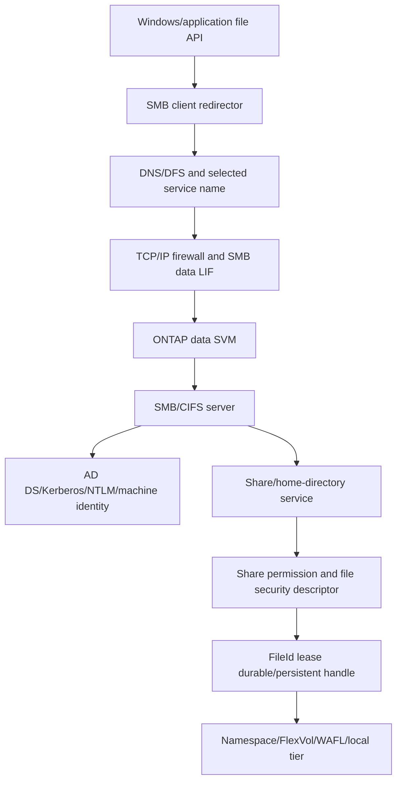

### Core vocabulary

| Term | Plain meaning | Analogy | Why it matters |
|---|---|---|---|
| **Dialect** | Negotiated SMB protocol version/capabilities | Agreed language | Security, continuity and performance features depend on it |
| **Session** | Authenticated SMB security context | Validated badge | Carries user/group identity and keys |
| **Tree connection** | Session connection to one share | Entry into a department | Share access is distinct from file access |
| **FileId/handle** | Server reference to an opened object | File ticket | I/O and continuity depend on its state |
| **Credit** | SMB outstanding-work flow-control unit | Work tokens | Credit use can constrain concurrency but is not a tuning recipe |
| **Lease/oplock** | Client caching right the server can break | Temporary desk reservation | Affects coherency and performance |
| **Durable handle** | Handle reconnect capability after supported connection loss | Reservation held during dropped call | Does not guarantee server failover survival |
| **Persistent handle** | Handle intended for supported CA failover scenarios | Reservation preserved across service desk move | Requires exact share, app, client and server support |
| **Witness** | Protocol notifying registered clients of resource changes | Proactive desk-relocation alert | Helps recovery but does not prove application continuity |

### SMB state hierarchy

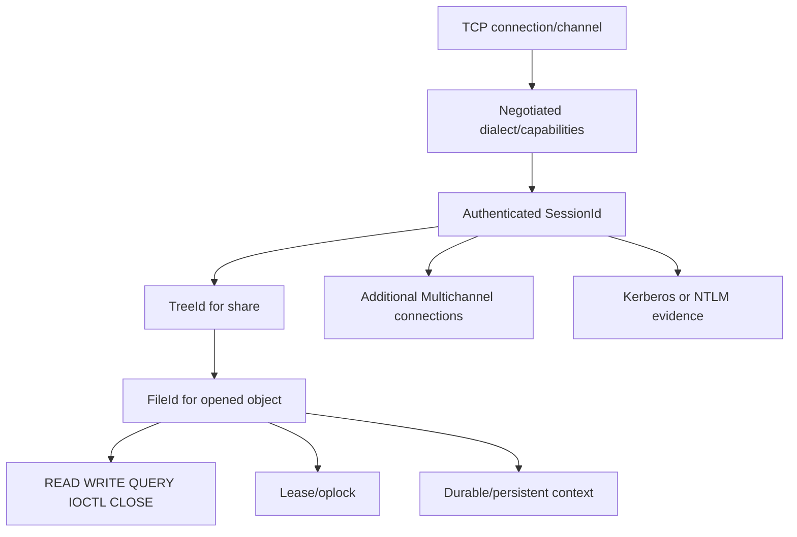

---

## 2. Active Directory domain-join dependencies

**Active Directory Domain Services (AD DS)** provides domains, users, groups, computers, service identities, policy and Kerberos. Joining an ONTAP SMB server creates/uses a machine account and service identity in a customer-controlled domain/organizational-unit context under the current supported workflow.

### Plain-English deep-dive: registering a branch office

Joining a domain is like registering a new branch office with the company's identity authority. DNS finds the correct registry office. Time keeps signed badges valid. The machine account is the branch's legal identity. SPNs state which services it may answer for. Domain controllers (DCs), sites and replication determine which office sees current records. **Why it matters:** a working data LIF is not enough to create or sustain domain trust.

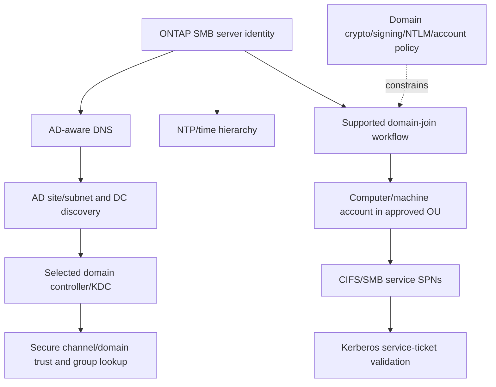

### Join prerequisites

| Dependency | Required question | Evidence |
|---|---|---|
| SVM network | Can the correct SVM LIF/route reach DNS/DC/KDC? | Source context, route, firewall and packet/log evidence |
| DNS | Are domain/DC/site/service records correct from the SVM view? | Exact queries/answers/TTL and selected addresses |
| Time | Are SVM, DC/KDC and clients synchronized under policy? | Source, offset, reach and clock events |
| AD site/subnet | Which site and DC should this SVM use? | AD subnet/site mapping and selected DC |
| Join identity | Who is authorized to create/use machine account? | Approved account, delegated rights and audit; never expose password |
| Machine account | Does it exist in the intended OU and remain healthy? | Object identity/status/attributes and secure-channel evidence |
| SPNs | Are required names unique and owned correctly? | Exact SPN query/ownership and Kerberos error |
| Policy/crypto | Are dialect, signing, encryption, Kerberos types and NTLM policy compatible? | Effective domain/client/server policy and current support |

### Domain-join lifecycle

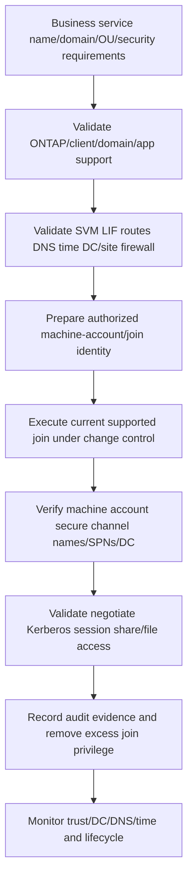

This is an architecture workflow, not a click/command recipe. Exact creation versus reuse of a computer object, organizational-unit syntax, permissions, commands and rollback must come from the running release and customer AD process.

---

## 3. DNS, sites, domain controllers, machine accounts, and SPNs

### AD site and DC selection

AD sites commonly map IP subnets to physical/network locations so clients and services can find appropriate domain controllers. Missing or wrong subnet-to-site mapping can select a remote DC, create authentication latency, or change failover behavior.

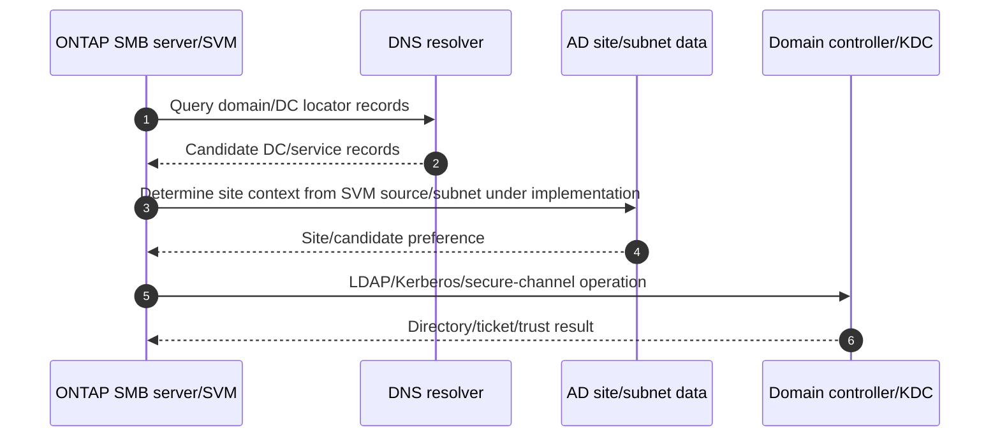

### Machine account orientation

The ONTAP SMB server's domain computer account supports secure-channel and service identity. Account disablement, deletion/recreation, password/key mismatch, replication lag, wrong OU permissions, duplicate service name or stale DNS can cause trust/authentication failures.

### SPN orientation

**Service Principal Name (SPN)** identifies a service instance to Kerberos. A client connecting to `files.example.com` requests a ticket for an SMB/CIFS service identity based on the name and Microsoft rules. The SPN must be correct and unique on the intended machine/service account.

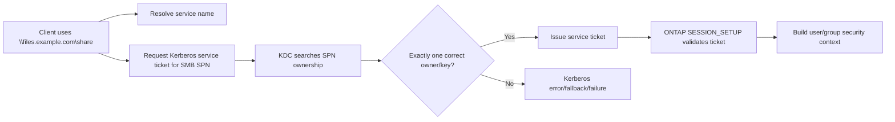

### DNS and alias caveats

- The exact name clients use matters for DNS and Kerberos.
- An alias/load-balanced/DFS name may require deliberate SPN design.
- Connecting by IP can change normal hostname-based Kerberos behavior.
- Long-lived sessions can outlive DNS record changes.
- A DNS success from an administrator workstation does not prove the SVM's resolver view or a client's selected address family.

---

## 4. Kerberos and NTLM orientation

Kerberos is the intended domain authentication path for many SMB environments. **NT LAN Manager (NTLM)** is a challenge-response family that can be used under policy/compatibility conditions but has different security/service-identity properties and is increasingly restricted.

### Kerberos sequence

```mermaid
sequenceDiagram
    autonumber
    participant C as Domain user/client
    participant D as DNS and time
    participant K as AD KDC
    participant S as ONTAP SMB service/SPN
    C->>D: Resolve service and DC; verify time
    C->>K: Obtain/use ticket-granting ticket
    K-->>C: TGT or error
    C->>K: Request SMB service ticket for used name/SPN
    K-->>C: Service ticket or Kerberos error
    C->>S: SMB SESSION_SETUP with auth token
    S->>S: Validate service key/ticket and build token
    S-->>C: SessionId or exact authentication status
```

### NTLM fallback decision

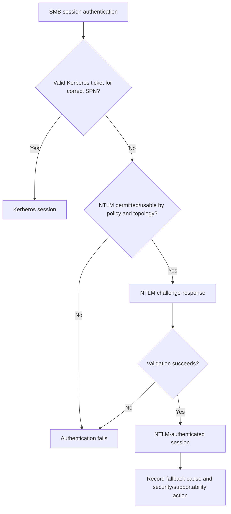

### Evidence distinctions

| Question | Evidence |
|---|---|
| Which mechanism was used? | Client/server/DC security logs and SMB SESSION_SETUP token/mechanism |
| Why did Kerberos fail? | Exact service name/SPN/ticket error, DNS/time/trust/key evidence |
| Was NTLM allowed? | Effective domain/client/server policy and validation path |
| Did authentication grant file access? | Session success followed by TREE_CONNECT/CREATE and permission result |

Do not celebrate NTLM fallback as root-cause resolution. Do not disable signing/encryption or map by IP permanently to make a test pass.

---

## 5. Shares and share properties

An SMB share publishes a named entry point to an SVM namespace path. A share is not the FlexVol itself; many shares can point into one volume, and a share path can cross a junction if the design permits.

```mermaid
flowchart TB
    SERVER[SMB server name] --> S1[Share finance]
    SERVER --> S2[Share projects]
    SERVER --> S3[Hidden/admin or application share where supported]
    S1 --> P1[/finance junction/path]
    S2 --> P2[/engineering/projects path]
    P1 --> V1[Finance FlexVol/qtree/directory]
    P2 --> V2[Engineering FlexVol]
    PROP[Share properties/ACL/offline/CA/encryption as configured] -.governs.-> S1
    PROP -.governs.-> S2
```

### Share configuration questions

- What exact namespace path, junction, qtree/directory and volume does the share expose?
- Which share ACL permits which SIDs/rights?
- Which share properties are set, and are they supported for the workload?
- Is encryption/signing required by policy/share/server/client?
- Is the share intended for general files, home directories, Hyper-V/SQL-like CA workloads, or another exact application?
- Which namespace/volume move, Snapshot, backup and restore rules apply?

### Share failure stages

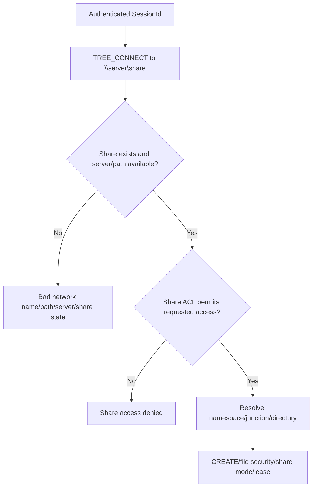

---

## 6. Share permission versus NTFS-style file permission

### Plain-English deep-dive: building entry versus room key

The share ACL is permission to enter the building through one door. The file security descriptor is the key to a room or cabinet. The user's authenticated token carries identity and group SIDs. SMB CREATE asks for specific rights and compatible sharing. **Why it matters:** broad share permission does not override a restrictive file ACL, and file permission cannot be reached if share access is denied.

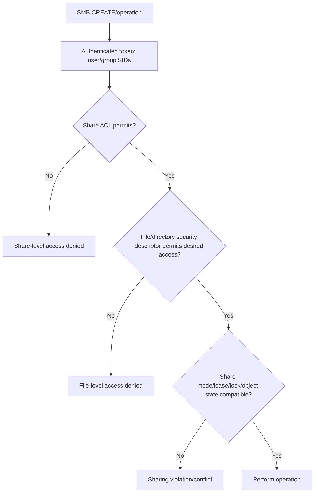

### File-security vocabulary

| Term | Meaning | Troubleshooting implication |
|---|---|---|
| **Security descriptor** | Owner/group, discretionary ACL and audit ACL information | Exact object security source |
| **ACL** | Ordered Access Control Entries (ACEs) | Effective result depends on token, inheritance and algorithm |
| **ACE** | Allow/deny/audit entry for one SID and rights | Display names can hide stale/orphaned SIDs |
| **Inheritance** | Parent entries propagate under flags | Move/create can change effective access |
| **Desired access** | Rights requested by CREATE/open | User may have read but request write/delete |
| **Share access mode** | How an open allows other opens to share read/write/delete | `File in use` can be a sharing conflict, not ACL denial |

### Effective-access evidence

- Exact SMB command and NTSTATUS.
- Session user SID and full group token at authentication time.
- Share ACL and requested share rights.
- File/directory owner, explicit/inherited ACEs and security style.
- CREATE desired access, share access, disposition/options and lease/oplock state.
- Name mapping/effective Unix identity if multiprotocol data is involved.

Never grant `Everyone: Full Control` at both layers as a diagnostic shortcut. Test one expected-allow and one expected-deny identity.

---

## 7. Local/domain users and groups, name mapping, and home directories

### Local and domain identities

ONTAP SMB can use domain identities and, in supported contexts, local users/groups scoped to the SVM. Exact use, precedence, password policy, authentication restrictions and supported workloads are release-sensitive.

| Identity | Appropriate question | Risk |
|---|---|---|
| Domain user/group | Is AD the authoritative source and token current? | Replication, trust, SPN, stale token or disabled account |
| Local SVM user/group | Why is local identity needed and who governs it? | Orphaned/bypass account and inconsistent policy |
| Service account | Which application, SPN, rights, rotation and owner? | Excess privilege or outage after unmanaged rotation |
| Built-in/well-known SID | What exact documented purpose? | Assuming name/rights without current docs |

### Multiprotocol name mapping

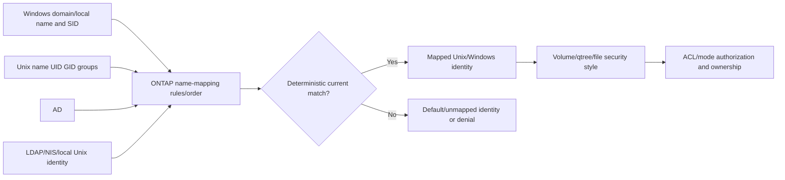

Capture input identity, mapping direction, exact rule/order, output identity, authoritative directory records, cache and file security style. Avoid ambiguous bidirectional patterns or privileged defaults.

### Home directories

An SMB home-directory feature can map a user to a personal directory/share path using supported share patterns and directory-search paths. Exact variables, share creation behavior, access, naming and limits are release-sensitive.

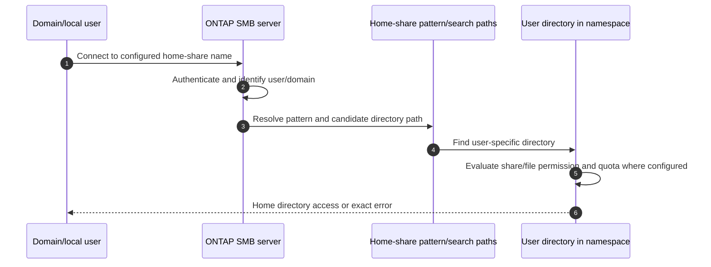

Home directories add dependencies on username/domain normalization, directory existence, path/search order, permissions, quotas, name mapping and lifecycle/offboarding. Do not present them as ordinary static shares without current evidence.

---

## 8. Continuously available shares and handle continuity

A **continuously available (CA) share** advertises behavior intended for supported workloads that can use persistent handles and transparent failover. A **durable handle** usually helps reconnect after transport interruption; a **persistent handle** is designed for broader CA failover under exact support.

### Plain-English deep-dive: holding a reservation through different disruptions

A durable handle is like a hotel keeping your room reservation while a phone call drops. A persistent handle is like keeping it while the front desk itself moves to a partner building during an approved continuity event. A CA share is the hotel operating model that supports that move for qualified guests and workflows. **Why it matters:** none of these labels proves the application tolerated the pause, retried safely, or preserved transaction consistency.

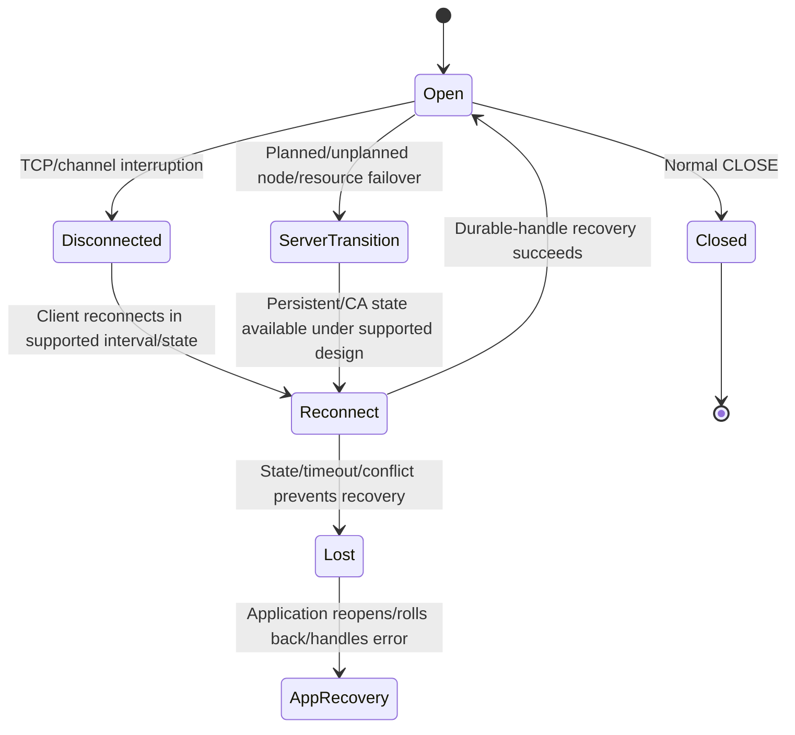

### CA supportability questions

- Which client OS/build, application and SMB dialect support the workflow?
- Is the share property and backing-volume/cluster design supported for that application?
- Did CREATE actually request/receive durable or persistent context?
- What state is preserved across the exact node/LIF/storage transition?
- Are signing/encryption, Witness, Multichannel and network paths compatible?
- What in-flight operation/replay semantics and application retry behavior apply?
- What application pause/error and data consistency were measured?

Do not mark every general-purpose file share CA. Current NetApp documentation has workload-specific SMB nondisruptive-operation guidance; validate the exact application and IMT solution.

---

## 9. Witness and SMB Multichannel

### Witness

The SMB Witness protocol can notify registered clients when a clustered SMB resource changes availability, allowing a client to reconnect to a suitable address without waiting only for transport timeout.

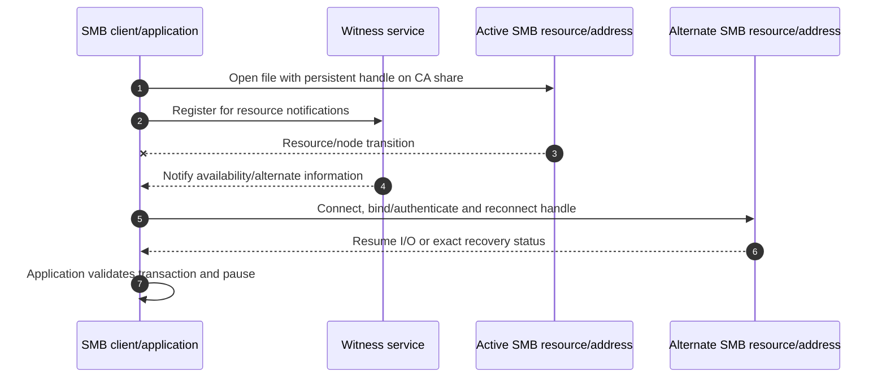

### SMB Multichannel

SMB Multichannel can bind multiple network connections to one SMB session when client/server capabilities and eligible interfaces allow it.

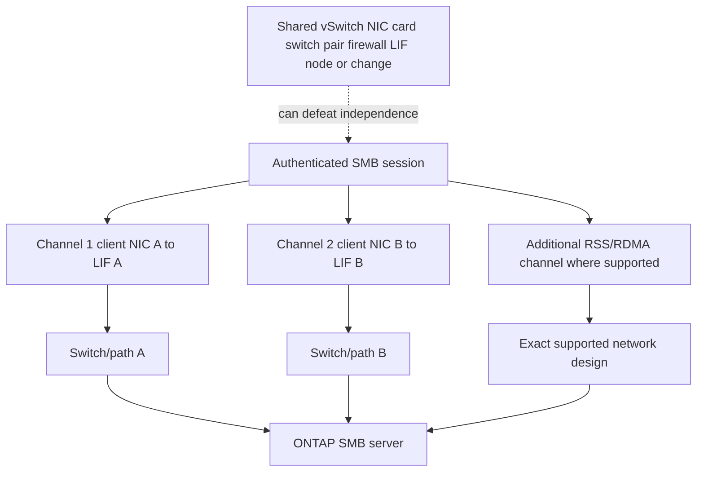

### Multichannel evidence

- Negotiated SMB dialect/capability and server/client interface information.
- Channel connection tuples, session binding, local/remote addresses and speeds.
- RSS/Receive Side Scaling or Remote Direct Memory Access (RDMA) state where used.
- NIC/driver/firmware, VLAN/route/firewall/MTU and physical path.
- Per-channel bytes, latency, failures and recovery.
- Signing/encryption consistency and application behavior.

Multichannel and Link Aggregation Control Protocol (LACP) operate at different layers. Multiple channels do not guarantee physical independence or multiply one application's throughput automatically.

---

## 10. Sessions, open files, locks, and auditing

Operational views help answer who is connected, through which address/channel, under which identity, to which share/file, with which locks and how much activity. Exact ONTAP commands/REST resources/fields vary by release.

### Operational relationship map

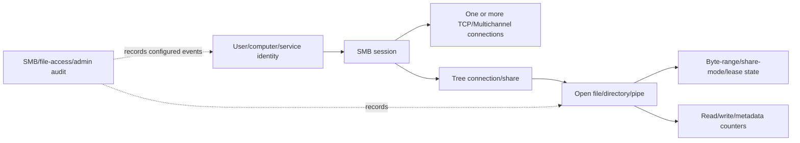

### Session/open-file evidence

| Evidence | Customer question | Caveat |
|---|---|---|
| Session identity | Who authenticated and by which mechanism? | Existing token may not include recent group changes |
| Client address/computer | Which path and endpoint? | NAT/Multichannel can produce several addresses |
| Dialect/signing/encryption | Which protocol/security state? | Server support does not prove this session negotiated it |
| Share/tree | Which published path? | File may cross junction/another volume |
| Open file/FileId | Which object and rights? | Name can change; stable IDs/state/time matter |
| Lock/share mode/lease | Why is another open blocked? | Application coordination owns many conflicts |
| Counters/time | Is issue active, historical or sampled? | Cumulative values need deltas/reset context |

### Auditing

SMB/file-access auditing can record configured success/failure access events according to SVM/file security and audit policy. ONTAP administrative audit is a separate evidence stream. Exact event types, destination/format, staging, consolidation, retention, capacity and security vary.

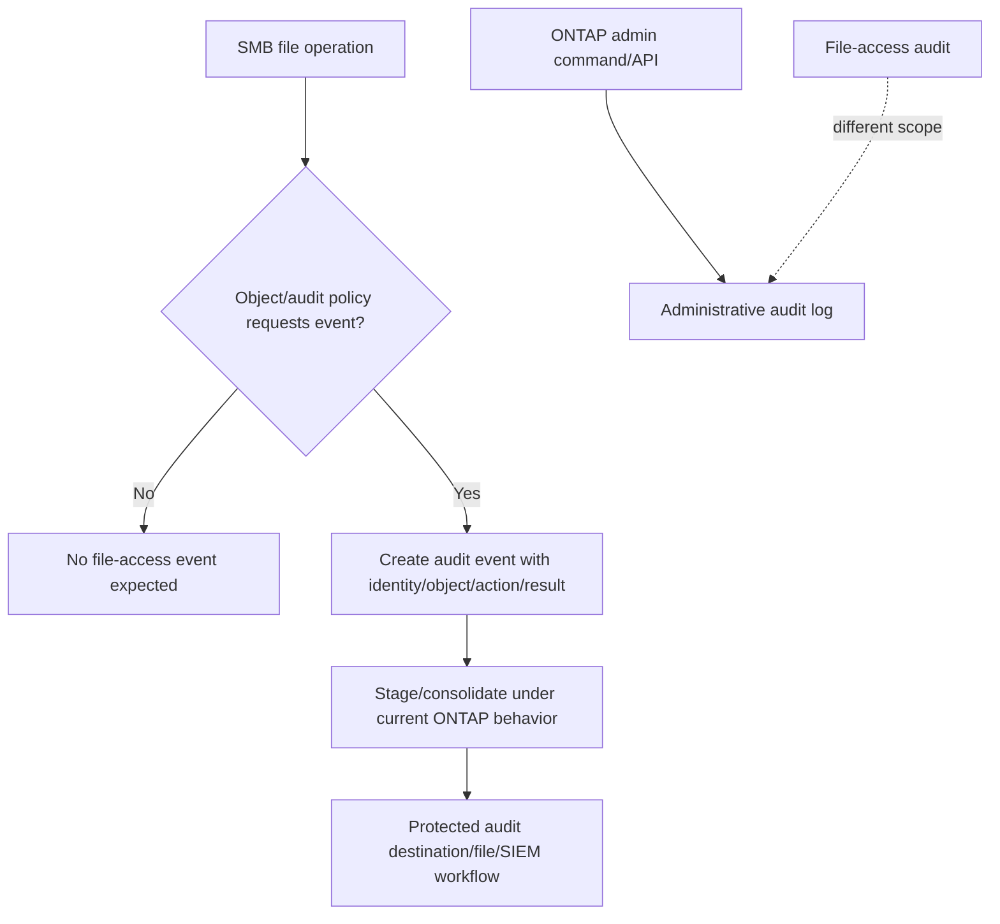

Audit absence does not prove no access when policy, SACL, collection, retention, time or delivery is incomplete. Audit records can contain sensitive names and paths; apply least privilege and retention policy.

### Conceptual read-only examples

```text
CONCEPTUAL ONLY - verify current ONTAP release, privilege, fields and scope
<smb-server-command-family> show -vserver <svm> -fields <documented-domain-auth-fields>
<smb-share-command-family> show -vserver <svm> -fields <documented-path-property-fields>
<smb-session-command-family> show -vserver <svm> -fields <documented-client-auth-dialect-fields>
<smb-connection-command-family> show -vserver <svm> -fields <documented-channel-fields>
<smb-open-file-command-family> show -vserver <svm> -fields <documented-file-lock-fields>
<audit-command-family> show -vserver <svm> -fields <documented-audit-fields>
```

Never terminate a session, close a file, break a lock, leave/rejoin a domain, or alter audit policy from a conceptual guide. Identify the application/business owner and use current approved procedures.

---

## 11. Security, performance, and availability

### Security architecture

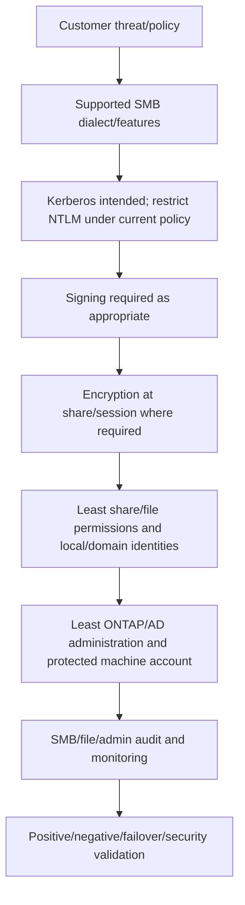

### Signing and encryption

- SMB signing protects message integrity/authenticity under negotiated keys.
- SMB encryption protects SMB payload confidentiality and integrity between endpoints.
- Requirements can come from client, server, share, dialect and domain/local policy.
- CPU/performance impact varies by algorithms, hardware, workload and release.
- Encryption reduces packet-level SMB visibility; rely on endpoint state/logs/counters and authorized methods.

### Performance decomposition

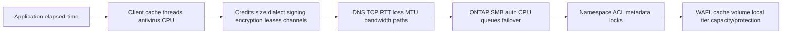

### Availability evidence

| Layer | Failure to test | Completion evidence |
|---|---|---|
| Client/channel | NIC/path loss | Remaining channel, session/handle and app I/O |
| Network/LIF | Switch/port/VLAN/route loss | LIF/path recovery and SMB reconnect |
| AD/DNS/time | DC/resolver/source failure | New Kerberos session and group lookup |
| SMB resource | Node/LIF transition | Witness, persistent handle and app pause/data outcome |
| Namespace/volume | Move/protection/recovery | Share path and file consistency |
| Application | In-flight transaction | Vendor-supported recovery and user operation |

`Transparent` or `continuously available` is a measured, scoped outcome, not a zero-interruption guarantee.

---

## 12. Failure modes and troubleshooting decision trees

### Connection and authentication

```mermaid
flowchart TD
    START[SMB path fails] --> NAME{Expected DNS/DFS name and address selected?}
    NAME -->|No| DNS[DNS referral cache family and service name]
    NAME -->|Yes| TCP{TCP reaches current SMB data LIF?}
    TCP -->|No| NET[Route firewall VLAN MTU listener/LIF path]
    TCP -->|Yes| NEG{NEGOTIATE succeeds with expected dialect/security?}
    NEG -->|No| DIA[Dialect signing encryption capability/policy]
    NEG -->|Yes| AUTH{SESSION_SETUP succeeds?}
    AUTH -->|No| K[DNS SPN time DC/site trust machine account Kerberos/NTLM policy]
    AUTH -->|Yes| TREE{TREE_CONNECT succeeds?}
    TREE -->|No| SHARE[Share name/path/share ACL/DFS target]
    TREE -->|Yes| FILE[Proceed to file-operation tree]
```

### File operation and continuity

```mermaid
flowchart TD
    FILE[CREATE READ WRITE or CLOSE fails] --> STATUS[Capture command/status MessageId SessionId TreeId FileId]
    STATUS --> ACCESS{Access/sharing status?}
    ACCESS -->|Yes| ACL[Token share ACL file ACL desired/share access lease]
    ACCESS -->|No| PERF{Slow timeout or disconnect?}
    PERF -->|Slow| LAT[Credits channels network server metadata storage]
    PERF -->|Disconnect| CONT[Durable/persistent CA Witness Multichannel failover]
    PERF -->|Other| OBJ[Path object server/application state]
    CONT --> RECON{Session/handle reconnect succeeds?}
    RECON -->|No| STATE[Timeout support server state app retry/replay]
    RECON -->|Yes| VALID[Validate in-flight operation and data/app outcome]
```

### Common failure table

| Symptom | Candidate cause | High-value evidence |
|---|---|---|
| Domain join fails | SVM route/DNS/time/site/DC/rights/machine object/policy | Exact failed stage and AD/ONTAP logs |
| Trust breaks later | Machine account/key/replication/DC reach/time | Secure-channel and object evidence |
| Kerberos expected, NTLM used | Name/SPN/DNS/time/trust/ticket/crypto | Actual mechanism and ticket error |
| Credential prompt | Auth failure, wrong name, cached credential, policy | SESSION_SETUP status and identity path |
| Access denied | Tree versus CREATE, token, share ACL, file ACL, mapping | Exact command/status and effective token |
| File in use | Share mode, lease/oplock, process/handle/backup scanner | CREATE fields and open/lock owner |
| Slow file copy | Client, credits/channels, signing/encryption, TCP/server/storage | Per-command/channel p99 and layer counters |
| Failover pause | Witness/channel/path/handle/app timeout | Protocol and application recovery timeline |
| Home directory missing | Pattern/search path/user normalization/permission/quota | Resolved home path and exact gate |
| Audit gap | SACL/policy/staging/retention/time/delivery | Expected audit path and data cutoff |

### Support boundaries

- AD owners govern domains, sites, DCs, DNS, SPNs, machine accounts, policies and authoritative identities.
- Network/security owners govern routes, firewalls, MTU and path controls.
- Application/Windows owners govern client behavior, handles, transactions and maintenance tolerance.
- NetApp Support and storage owners govern ONTAP SMB product procedures and defects.
- The TAM analyst organizes evidence, risk, communication and action tracking; does not close handles, rejoin domains or change CA properties without authority.

---

## 13. TAM discovery, evidence, recommendations, and JD Mapping

### Discovery questions

1. Which business service, users, application, UNC/DFS paths, SLO, RPO/RTO and change windows use SMB?
2. Which cluster/SVM/SMB server names, LIFs, routes, namespaces, junctions, volumes and shares serve them?
3. Which client OS/build, application, actual SMB dialect/capabilities, signing/encryption and Multichannel state are supported?
4. Which AD domain/forest/trust, site/subnet, DC/KDC, DNS, NTP, machine account, OU and SPNs apply?
5. Which authentication mechanism, user/computer/service identity, token/group SIDs and NTLM restrictions apply?
6. Which share ACL, file security descriptor, desired/share access, local/domain users/groups and name mappings govern access?
7. Which home-directory patterns/search paths, quotas and offboarding rules exist?
8. Which sessions/connections/channels/open files/locks/leases/durable/persistent handles and Witness registrations exist?
9. Which audit policies/SACLs, destinations, retention, gaps and privacy controls apply?
10. Which exact Microsoft/NetApp docs, IMT result/notes, application guidance and access gaps govern supportability?

### Minimum escalation pack

- Business impact, client/user/computer, service/DFS/UNC/share/path/file, operation/status, scope and UTC timeline.
- Client OS/build/application, selected DNS address, route/firewall/MTU/TCP/channel path and packet limitations.
- SMB dialect/negotiate capabilities, signing/encryption, MessageId, SessionId, TreeId, FileId, credits and command/status.
- AD domain/site/DC/KDC, DNS queries, time, machine account, secure channel, SPN ownership, ticket/mechanism/error and effective policy.
- User/group token SIDs, local/domain identity, share ACL, file ACL/inheritance, desired/share access and name-mapping result.
- Share path/properties, home-directory pattern/path, namespace/junction/volume and security style.
- Sessions/connections/Multichannel/RSS/RDMA, open files/locks/leases, durable/persistent handle, CA/Witness/failover state.
- SMB/file-access/admin audit configuration/events/gaps, data cutoff and privacy handling.
- ONTAP/platform/client/app versions, current official/IMT evidence, unknowns, actions/results, rollback and exact specialist ask.

### Recommendation model

```mermaid
flowchart TD
    EVID[Verified SMB AD network access state and storage evidence] --> CONTEXT[Application criticality and supportability]
    CONTEXT --> RISK[Mechanism impact likelihood urgency confidence]
    RISK --> OPTIONS[AD network share ACL continuity or lifecycle options]
    OPTIONS --> ACTION[Owner prerequisites date rollback/stop]
    ACTION --> TEST[Auth allow/deny performance failover and app validation]
    TEST --> RESID[Residual risk monitoring and review]
```

### Recommendation patterns

| Finding | Risk | Bounded recommendation | Validation |
|---|---|---|---|
| Service alias lacks unique correct SPN and falls back to NTLM | Weaker/unavailable auth as policy tightens | Correct DNS/SPN ownership under AD/SMB change control | Kerberos ticket/session and no unintended NTLM |
| CA share used by unsupported general application | Failover semantics can be misread or harmful | Validate exact app/client/ONTAP support and redesign property/use | Controlled transition and app data-consistency test |
| One Multichannel path lacks failover VLAN/firewall rule | Path loss reduces throughput or breaks recovery | Correct every channel path and physical independence | Channel loss, session/handle and application I/O |
| Share broad, file ACL complex with stale groups | Access/audit drift | Reconcile token and least ACLs; avoid broad emergency grants | Expected allow/deny and audit result |
| Audit retention ends before service review | Security/support evidence unavailable | Align file/admin audit scope and protected retention with policy | Retrieve complete representative period and verify privacy |

### JD Mapping

| JD responsibility | Part 29 contribution | Arti's factual bridge and gap |
|---|---|---|
| Understand environment | Maps client/network/AD/SMB/SVM/share/file/storage dependencies | Strong Microsoft transfer; ONTAP SMB operation unproven |
| Storage depth | Covers SMB state, shares, permissions, handles, CA/Witness/Multichannel | Conceptual/synthetic only |
| Risk/stability | Finds trust, SPN/fallback, ACL, path and continuity risks | CRITSIT/identity method transfers |
| Supportability | Requires exact Windows/app/NIC/feature/ONTAP IMT evidence | No customer IMT/gated result claimed |
| Recommendations | Connects exact SMB stage/status to owner/test/residual risk | Advisory/escalation strength |
| Service review | Reports auth/security, access, continuity, audit and actions | Business-review/analytics strength |
| Escalation | Supplies SMB IDs/status, AD, path, handle and storage timeline | Product/Engineering evidence discipline transfers |

---

## 14. Fully synthetic scenario: Wingtip Legal SMB continuity and identity

> **Synthetic case:** Wingtip Legal, every domain, account, SVM, path, event and outcome below is fictional. It is not a NetApp customer, internal process, tool result, or Arti's production work.

### Environment

- SVM `legal-files` is joined to `corp.example` and serves `\\legal.corp.example\cases`.
- The share is intended to be CA for a supported case-management application.
- Clients negotiate SMB 3.1.1 with signing and share encryption.
- Two data LIFs and Multichannel paths cross separate access switches but one firewall policy domain.
- AD has two sites; the SVM subnet is missing from site mapping.
- A planned node takeover occurs after a recent service-alias change.

```mermaid
flowchart TB
    USERS[Legal users/application] --> NAME[legal.corp.example]
    NAME --> DFS[Optional namespace/service alias]
    DFS --> CH[SMB Multichannel connections]
    CH --> L1[Data LIF A/switch A]
    CH --> L2[Data LIF B/switch B]
    L1 --> FW[Shared firewall policy/state]
    L2 --> FW
    FW --> SVM[SVM legal-files/CA share]
    SVM --> VOL[Cases FlexVol]
    DNS[AD DNS/sites/DCs/time] --> SVM
    SPN[Machine account/SPNs] --> SVM
```

### Timeline

```mermaid
sequenceDiagram
    autonumber
    participant C as Case application/client
    participant AD as DNS/KDC/DC
    participant S as ONTAP SMB service
    participant W as Witness
    participant N as Network paths
    C->>AD: Resolve new alias and request SMB service ticket
    AD-->>C: Duplicate-SPN Kerberos error; NTLM fallback permitted
    C->>S: NTLM SESSION_SETUP and persistent-handle CREATE
    S-->>C: Session/handle established
    S--xC: Planned node transition
    W-->>C: Witness notification
    C->>N: Reconnect channels to alternate addresses
    N--xS: Channel 2 blocked by stale firewall destination policy
    C->>S: Channel 1 reconnects persistent handle
    C->>C: Application waits 28 seconds after protocol recovery
```

### Evidence

| Evidence | Observation | Bounded conclusion |
|---|---|---|
| DNS/SPN/KDC | Alias resolves, but SPN exists on two accounts | Explains Kerberos failure/fallback; DNS itself is not failed |
| AD site | SVM subnet absent, remote DC selected | Latency/resilience risk; not the duplicate-SPN root cause |
| SMB session | NTLM mechanism observed; dialect/signing/encryption succeed | File service works through weaker/unintended auth path |
| Share/handle | CA property present; persistent handle granted/reconnected | Protocol continuity works for this handle |
| Witness | Notification arrives promptly | Witness is not the delay source |
| Multichannel | One alternate channel blocked at firewall; one succeeds | Partial path-support gap |
| Application | Protocol reconnect at 6 seconds; app resumes at 34 seconds | Application retry contributes 28 seconds |
| Access case | One new user gets CREATE access denied; token lacks recently assigned group SID | Separate authorization/token freshness mechanism |

### Competing hypotheses

| Hypothesis | Evidence for | Disconfirming check |
|---|---|---|
| DNS caused Kerberos failure | Alias changed | DNS answer correct; inspect duplicate SPN/ticket error |
| Remote DC caused duplicate-SPN error | Wrong site exists | Any consistent DC sees duplicate after replication; compare DC views |
| Witness caused 34-second pause | Pause during failover | Notification and handle recovery occur earlier |
| ONTAP lost persistent handle | App pauses | Handle reconnect succeeds; compare protocol/app times |
| One path failure caused all access denied | Channel blocked | New user's session/tree work; CREATE token lacks group SID |

### Decision tree

```mermaid
flowchart TD
    TOP[NTLM fallback failover pause and one access denial] --> SPLIT[Three workstreams]
    SPLIT --> AUTH[Authentication]
    SPLIT --> CONT[Continuity]
    SPLIT --> ACL[Authorization]
    AUTH --> SPN{Unique correct SPN on machine/service account?}
    SPN -->|No| FIXSPN[AD/SMB owners correct and validate Kerberos]
    CONT --> PH{Witness and persistent handle recover?}
    PH -->|Yes| APP[Measure app retry and every channel path]
    APP --> FW[Correct stale firewall rule and test path loss]
    PH -->|No| STATE[Handle/share/client/server support analysis]
    ACL --> TOKEN{Required group SID in current token?}
    TOKEN -->|No| REAUTH[Correct authoritative group and obtain new token/session]
    TOKEN -->|Yes| FILE[Share/file ACL desired access/share mode]
    FIXSPN --> TEST[Kerberos/auth regression]
    FW --> TEST2[Failover/app regression]
    REAUTH --> TEST3[Expected allow/deny/audit]
```

### Recommendations

1. AD/SMB owners should remove duplicate alias SPN ownership and validate the machine/service account, DNS and Kerberos ticket path before NTLM restrictions create an outage.
2. AD owners should map the SVM subnet to the intended site and validate local/alternate DC selection and replication separately.
3. Network/security owners should correct the stale policy for every Multichannel/failover LIF and test each path independently.
4. Application owner should review the 28-second post-handle-recovery wait and confirm supported retry/transaction behavior.
5. Identity/file owners should validate the new user's authoritative group, refresh authentication through approved behavior, and test share/file access without broad ACL changes.

### Customer-facing summary

> "Three mechanisms are present. The new alias has duplicate SPN ownership, so clients fall back from Kerberos to NTLM. During takeover, Witness and the persistent handle recover, but one Multichannel path is blocked and the application waits another 28 seconds after protocol recovery. The user's access denial is separate: the current token lacks the newly assigned group SID. We recommend independent AD/SPN, network-path, application-retry and token/ACL actions followed by an end-to-end Kerberos, failover and authorization test."

---

## 15. Arti's factual transfer and honest positioning

```mermaid
flowchart LR
    MS[Microsoft Windows/AD production support] --> AUTH[DNS Kerberos SPN token group permission evidence]
    SPO[SharePoint/OneDrive] --> DATA[Shared-data namespace access and user impact]
    AZ[Azure/networking] --> PATH[Routes firewalls multiple paths and shared fate]
    CRIT[CRITSIT/Product escalation] --> INCIDENT[Timeline hypotheses safe action and communication]
    BI[Analytics/business reviews] --> TAM[Trends risks actions and executive narrative]
    AUTH --> SMB[ONTAP SMB synthetic method]
    DATA --> SMB
    PATH --> SMB
    INCIDENT --> SMB
    TAM --> SMB
    SMB --> LAB[Future authorized ONTAP SMB lab and SME review]
```

| Factual strength | Transfer | Explicit gap |
|---|---|---|
| Windows/AD support | Kerberos, DNS, SPN, token, group and ACL reasoning | No ONTAP domain join/machine account administration |
| SharePoint/OneDrive | Shared-data paths, permissions, concurrent access and customer impact | Not ONTAP shares/CA handles/Witness operation |
| Azure networking | Multi-path, firewall, DNS and failover dependencies | No production ONTAP LIF/Multichannel design |
| CRITSIT/analytics | Evidence timelines, decision support and service-review narrative | No NetApp internal tool/process claim |

### Honest answer

> "SMB and AD align strongly with my Microsoft background. I understand the ONTAP architecture and evidence path from domain prerequisites and machine/SPN identity through dialect negotiation, Kerberos or NTLM, share and file permissions, local/domain identities, name mapping, home directories, sessions/open files, auditing, Multichannel, CA shares, handles and Witness. I have not administered those ONTAP features in production, so I would use current Microsoft/NetApp documentation, authorized read-only evidence, IMT and AD/network/application/NetApp specialists for real changes."

---

## 16. Whiteboard drills and paper lab

### Whiteboard drills

1. **SMB state:** TCP -> NEGOTIATE -> SESSION_SETUP -> TREE_CONNECT -> CREATE -> I/O -> CLOSE.
2. **Domain join:** SVM route -> DNS/time -> site/DC -> machine account -> SPNs -> Kerberos.
3. **Identity:** User, computer, service account, SID, group token and local/domain boundary.
4. **Permissions:** Share ACL -> file ACL -> desired/share access -> lease/lock.
5. **Home directories:** User -> pattern/search path -> directory -> ACL/quota.
6. **Continuity:** Durable versus persistent handle, CA share and application support.
7. **Witness:** Notification -> channel/session -> handle -> application recovery.
8. **Multichannel:** Several connections, one session; prove physical independence.
9. **Operations:** Session -> connection -> tree -> open file -> lock -> audit.
10. **TAM:** Separate authentication, authorization, path, protocol and application mechanisms.

### Paper lab scenario

A fictional global legal firm has two SMB SVMs, three AD sites, six DCs, DNS aliases, 30 shares, 4,000 users, home directories, multiprotocol data, CA application shares, Multichannel, Witness, signing/encryption, and file auditing. Existing documentation omits SPN ownership, SVM subnet/site mapping, effective share/file permissions, open-file owners, channel paths and current IMT support.

### Tasks

1. Inventory SVM/server names, LIFs/routes, shares/paths/volumes, clients/apps and owners.
2. Validate DNS, time, sites/DCs, domain trust, machine accounts, OUs and SPNs.
3. Capture actual SMB dialect, capabilities, signing/encryption and auth mechanism.
4. Build share/file effective-access matrices with allow/deny tests.
5. Reconcile local/domain users/groups, tokens, name mapping and security styles.
6. Map home-directory patterns, search paths, directories, quotas and offboarding.
7. Inventory sessions/connections/channels/open files/locks and safe owner contacts.
8. Map CA shares, durable/persistent handles, Witness and application support.
9. Inject DNS, DC, machine-account, SPN, token, share, ACL, lock, channel, node and audit failures.
10. Build application/protocol recovery timelines for member, switch and node loss.
11. Validate exact Windows/app/NIC/driver/ONTAP support through current docs/IMT.
12. Build file-access/admin audit scope, retention, privacy and evidence checks.
13. Write authentication, authorization, continuity and audit recommendations.
14. Present executive and technical narratives with the exact production boundary.

```mermaid
flowchart LR
    INV[Inventory SMB/AD/share/client state] --> DOMAIN[Validate DNS time site DC machine SPN]
    DOMAIN --> ACCESS[Trace auth share/file access and mappings]
    ACCESS --> CONT[Map sessions handles channels Witness failover]
    CONT --> AUDIT[Validate audit/evidence/privacy]
    AUDIT --> FAULT[Inject and troubleshoot failures]
    FAULT --> SUP[Validate current docs/IMT]
    SUP --> REC[Write TAM recommendations]
```

### Lab pass criteria

- [ ] Actual SMB state and auth mechanism replace intended labels.
- [ ] Domain-join dependencies include SVM routing, DNS, time, site/DC, machine account and SPNs.
- [ ] Share permission, file ACL and sharing/lease state remain separate.
- [ ] Local/domain identities and multiprotocol mappings are deterministic and audited.
- [ ] CA/Witness/Multichannel claims are application- and version-supported.
- [ ] Protocol recovery timing is separate from application recovery.
- [ ] Sessions/open files are not terminated without owners and approved procedure.
- [ ] No synthetic/lab result is called production ONTAP experience.

---

## 17. Self-test

1. Define SMB/CIFS server, dialect, session, tree, FileId, credit, lease, durable/persistent handle and Witness.
2. Draw ONTAP SMB architecture and the state hierarchy.
3. Map domain-join prerequisites and lifecycle without invented commands.
4. Explain DNS, AD sites, DC/KDC selection, time and secure-channel dependencies.
5. Define machine account and SPN and diagnose alias/duplicate ownership.
6. Draw Kerberos SESSION_SETUP and NTLM fallback decision.
7. Trace share-to-junction/volume mapping and share properties.
8. Separate share ACL, file ACL, desired access and sharing/lease conflict.
9. Explain local/domain users/groups and token freshness.
10. Draw multiprotocol name mapping and security-style evaluation.
11. Explain home-directory pattern/search-path/access dependencies.
12. Compare CA shares, durable handles and persistent handles.
13. Draw Witness notification and application recovery.
14. Explain Multichannel, RSS/RDMA orientation and common fate.
15. Map sessions, connections, open files, locks and audit evidence.
16. Apply security/performance/availability models and both fault trees.
17. Recreate Wingtip's separate SPN, path, application and token mechanisms.
18. Build the escalation pack and seven-part recommendation.
19. Complete all whiteboard drills and paper lab.
20. Deliver the No-production-NetApp boundary accurately.

---

## 18. Official Source Anchors

**Date checked: 2026-08-24.** These official public sources anchor ONTAP SMB and Microsoft protocol/AD concepts. Exact join workflows, dialects, policies, shares, home directories, local accounts, mapping, auditing, CA/Witness/Multichannel behavior, commands, limits and support are release/application sensitive. Re-open exact current sources and save dated IMT evidence. Do not infer SMB policy from HWU.

| Topic | Official public source | Bounded use and currency note |
|---|---|---|
| ONTAP SMB configuration | [ONTAP SMB configuration](https://docs.netapp.com/us-en/ontap/smb-config/) | Current SVM/domain/share setup prerequisites and workflow; select exact release. |
| ONTAP SMB administration | [ONTAP SMB administration](https://docs.netapp.com/us-en/ontap/smb-admin/) | Current server, identity, shares, sessions, auditing and operations. |
| AD prerequisites | [Requirements for configuring SMB with ONTAP](https://docs.netapp.com/us-en/ontap/smb-config/requirements-create-share-concept.html) | Verify current page/release; DNS/time/domain rights and fields can evolve. |
| SMB server/domain management | [Manage ONTAP SMB servers](https://docs.netapp.com/us-en/ontap/smb-admin/) | Machine account/domain/DC/trust operations under current guidance. |
| SMB shares/home directories | [Manage ONTAP SMB shares](https://docs.netapp.com/us-en/ontap/smb-admin/) | Share properties, home directories and access; exact behavior is release-sensitive. |
| SMB sessions/open files | [Monitor ONTAP SMB sessions and open files](https://docs.netapp.com/us-en/ontap/smb-admin/) | Operational concepts; exact commands/fields require current manuals. |
| SMB auditing | [ONTAP SMB and NFS file-access auditing](https://docs.netapp.com/us-en/ontap/nas-audit/) | Audit policy, events and operations; privacy/retention remain customer governed. |
| SMB CA workloads | [ONTAP SMB nondisruptive operations for Hyper-V and SQL](https://docs.netapp.com/us-en/ontap/smb-hyper-v-sql/) | Workload-specific guidance; never generalize to every SMB app/share. |
| SMB protocol | [MS-SMB2](https://learn.microsoft.com/en-us/openspecs/windows_protocols/ms-smb2/) | Official Microsoft SMB 2/3 protocol revisions; implementation support must be verified. |
| SMB overview/security | [Microsoft SMB overview](https://learn.microsoft.com/en-us/windows-server/storage/file-server/smb-overview), [SMB security](https://learn.microsoft.com/en-us/windows-server/storage/file-server/smb-security) | Current Windows guidance for dialects/signing/encryption/auth. |
| SMB Multichannel | [Microsoft SMB Multichannel](https://learn.microsoft.com/en-us/windows-server/storage/file-server/manage-smb-multichannel) | Client/server/NIC/RSS/RDMA guidance; third-party support requires IMT/docs. |
| Witness | [MS-SWN - Service Witness Protocol](https://learn.microsoft.com/en-us/openspecs/windows_protocols/ms-swn/) | Protocol behavior; deployment support remains exact-version specific. |
| Active Directory/Kerberos/NTLM | [MS-ADTS](https://learn.microsoft.com/en-us/openspecs/windows_protocols/ms-adts/), [MS-KILE](https://learn.microsoft.com/en-us/openspecs/windows_protocols/ms-kile/), [MS-NLMP](https://learn.microsoft.com/en-us/openspecs/windows_protocols/ms-nlmp/) | Official specifications; current Windows policy/deprecation guidance also required. |
| Interoperability | [NetApp Interoperability Matrix Tool](https://imt.netapp.com/) | Official, potentially gated exact Windows/app/NIC/SMB/ONTAP result, notes and date. |
| Hardware facts | [NetApp Hardware Universe](https://hwu.netapp.com/) | Use only for relevant platform/port facts, not SMB feature policy. |
| Support | [NetApp Support Site](https://mysupport.netapp.com/) | Entitlement-dependent cases, knowledge, advisories and diagnostics. |

### Source-use discipline

- Record exact ONTAP/client/application/SMB dialect/features, AD domain/site/DC and date.
- Preserve actual DNS name, SPN owner, auth mechanism, ticket/status and effective token.
- Treat machine account/domain rejoin and SPN changes as high-impact identity changes with rollback.
- Record share/file security and CREATE requested rights before changing ACLs.
- Capture sessions/handles/channels/failover state before terminating or restarting anything.
- Save exact IMT result/notes/date; mark inaccessible/unlisted support clearly.

---

## Likely Interview Questions

### Q1. How would you configure and validate an ONTAP SMB server conceptually?

> **Model answer:** "I start with the application/client and validate the exact Windows, SMB feature and ONTAP support. I map the SVM data LIF/route, AD-aware DNS, time, site/DC, domain/OU, authorized join identity, machine account and service names/SPNs. I use the current supported join workflow, then validate secure channel, Kerberos session, share path/properties, share and file permissions, signing/encryption, positive/negative file access, auditing and any required failover behavior."

### Q2. Why do DNS, sites, DCs, machine accounts and SPNs matter?

> **Model answer:** "DNS lets the SVM find the domain and clients find the SMB service; site/subnet mapping influences appropriate DC selection. The machine account is the SMB server's domain identity and secure-channel basis. SPNs map the service name to the correct account/key for Kerberos. Wrong DNS/site data can add latency or failover risk; disabled or mismatched machine accounts break trust; duplicate/wrong SPNs break Kerberos or trigger fallback."

### Q3. How do Kerberos and NTLM differ for ONTAP SMB?

> **Model answer:** "Kerberos gives the client a time-limited service ticket for the SMB SPN, which ONTAP validates during SESSION_SETUP before building a user/group context. NTLM is a challenge-response family that may be used only when policy/topology permits and has different security properties. I prove the actual mechanism from logs/SMB evidence, fix DNS/SPN/time/trust causes, and do not treat NTLM fallback as the desired steady state."

### Q4. How do share and file permissions produce effective access?

> **Model answer:** "The authenticated session token contains user and group SIDs. TREE_CONNECT evaluates share access. CREATE and later operations evaluate the file security descriptor, inheritance, requested rights and share mode/lease state. The result is constrained by every gate. I capture the exact command/status, token, share ACL, file ACL and CREATE rights and test one expected allow and deny instead of granting broad access."

### Q5. What are local users/groups, name mapping and home directories used for?

> **Model answer:** "Domain identities are normally authoritative in a domain service; supported SVM-local identities can serve bounded local needs but require governance. Multiprotocol name mapping translates Windows SID/name and Unix UID/GID identities according to ordered rules and security style. Home-directory shares resolve a user-specific path through configured patterns/search paths. Each adds lifecycle, cache, permission and audit risks, so I require deterministic mappings and offboarding."

### Q6. Compare durable handles, persistent handles and CA shares.

> **Model answer:** "A durable handle can reconnect after a supported transient connection loss. A persistent handle is designed to preserve state through broader server/resource failover in a supported continuously available share design. CA is a share/application architecture, not just one property. I validate client/app/dialect/ONTAP support, actual CREATE contexts, Witness/network paths, in-flight operation handling, application pause and data consistency."

### Q7. How do Witness and SMB Multichannel improve availability?

> **Model answer:** "Witness can notify registered clients that a clustered SMB resource moved, reducing reliance on transport timeout. Multichannel binds multiple network connections to one SMB session, potentially adding throughput and path resilience. Neither proves application continuity or physical independence. I map every channel/LIF/switch/firewall, measure notification and handle recovery, and validate the application's transaction through each named failure."

### Q8. How does your Microsoft background transfer, and what remains a gap?

> **Model answer:** "My Windows, AD, SharePoint/OneDrive, permissions, DNS/network and CRITSIT experience directly supports SMB identity, access and evidence reasoning. I understand the ONTAP-specific architecture and would validate it carefully. I have not joined/administered an ONTAP SMB server, shares, CA handles, Witness, Multichannel, sessions or auditing in production. I would use current Microsoft/NetApp docs, authorized evidence, IMT and AD/network/application/NetApp specialists."

---

## 30-Second Memory Hooks

- **SMB state:** Negotiate -> session -> tree -> file handle -> I/O.
- **CIFS server:** ONTAP term for modern SMB service, not proof of SMB1.
- **Domain join:** SVM route + DNS + time + site/DC + machine account + policy.
- **Machine account:** SMB server's domain identity.
- **SPN:** Unique service-name-to-account/key registration for Kerberos.
- **Kerberos:** DNS + time + KDC + SPN/key + trust.
- **NTLM fallback:** Different/weaker path that can hide Kerberos defects.
- **Share ACL:** Building entry; **file ACL:** room key.
- **CREATE:** Open/create plus desired and sharing rights.
- **Token:** User/group SIDs fixed at authentication time.
- **Name mapping:** Deterministic SID/name <-> UID/GID translation.
- **Home directory:** User-specific share/path resolution plus permission/quota.
- **Durable:** Reconnect after line loss; **persistent:** supported CA failover state.
- **Witness:** Proactive resource-move notification.
- **Multichannel:** Several connections bound to one session.
- **Audit:** File access and admin activity are different evidence streams.
- **Arti's bridge:** Microsoft SMB/AD reasoning is strong; ONTAP SMB production operation is unclaimed.

---

## Completion Checklist

- [ ] Define SMB/CIFS server and all protocol/state terms.
- [ ] Draw the ONTAP SMB architecture and state hierarchy.
- [ ] Map all domain-join network/DNS/time/site/DC/account/SPN prerequisites.
- [ ] Explain machine-account and secure-channel lifecycle without invented commands.
- [ ] Trace Kerberos and identify actual NTLM fallback from evidence.
- [ ] Map shares to namespace/junction/volume and exact properties.
- [ ] Separate share ACL, file ACL, desired access and share/lease conflict.
- [ ] Govern local/domain users/groups and deterministic name mapping.
- [ ] Explain home-directory patterns, paths, permissions, quotas and offboarding.
- [ ] Validate CA applications, durable/persistent handles and Witness.
- [ ] Map Multichannel paths, RSS/RDMA orientation and common fate.
- [ ] Use sessions/open files/locks/audit as read-only evidence before action.
- [ ] Apply security, performance, availability and both troubleshooting trees.
- [ ] Ask all discovery questions and build the escalation pack.
- [ ] Recreate Wingtip without merging SPN, path, app and token mechanisms.
- [ ] Complete whiteboard drills, paper lab, self-test and Q1-Q8 aloud.
- [ ] State the No-production-NetApp boundary and exact non-claim accurately.
- [ ] Recheck current Microsoft/NetApp docs, IMT/HWU and Support guidance before customer use.

---

*Next suggested section:* [Part 30 - ONTAP SAN Architecture, LUNs, igroups, and Multipathing](Part-30-ontap-san-luns-igroups-multipathing.md)