# Part 30 - ONTAP SAN Architecture, LUNs, igroups, and Multipathing

> **Section goal:** Learn how ONTAP presents block storage safely from a SAN-enabled SVM through target LIFs/ports, initiator identities, igroups, mappings, LUN IDs and stable device identity to host multipathing, volume managers, file systems, databases and clustered applications. By the end, Arti should be able to discover ownership, reason about space/alignment/paths/reservations/snapshots, prevent destructive mistakes, troubleshoot by stage, and make an evidence-based customer recommendation.

Covers index item **30** and maps directly to job-description responsibilities for customer-environment discovery, SAN/storage depth, stability and risk analysis, supportability, customer recommendations, upgrade/change planning, service reviews, and escalation evidence.

**Version caveat:** Exact LUN, igroup, mapping, space, ALUA, MPIO, reservation, host-utility, command, limit, and supported-combination behavior must be verified for the customer's releases and configuration.

Exact SAN protocols, target LIF/port behavior, LUN types and provisioning, igroup fields, LUN ID rules, host utilities, Asymmetric Logical Unit Access (ALUA), Multipath I/O (MPIO) policies, space guarantees/reclamation, alignment, SCSI reservations, snapshot/application consistency, expansion/deletion workflows, commands, limits, and supported combinations vary by ONTAP release, platform, host OS/hypervisor/application, adapter, driver/firmware, fabric/network, and configuration. Verify current official documentation, **Interoperability Matrix Tool (IMT)** results/notes, **Hardware Universe (HWU)** for relevant hardware facts, host/application guidance, and authorized evidence.

> **No-production-NetApp boundary:** Arti does not claim production NetApp or ONTAP SAN experience. Every SVM, LUN, initiator, path, reservation, host, customer and result below is synthetic. Her factual experience is Microsoft enterprise support, Azure/virtual machines, Windows networking, storage fundamentals, CRITSIT ownership, analytics and customer communication. The explicit non-claim is: **she has not provisioned or deleted a production ONTAP LUN, managed igroups/maps, configured host utilities/MPIO/ALUA, expanded a host filesystem, cleared SCSI reservations, or restored an application from an ONTAP SAN snapshot.**

---

## 1. SAN architecture and split ownership

A **Storage Area Network (SAN)** presents block-addressable devices to hosts. ONTAP owns storage presentation, protection and backing allocation. The host, hypervisor, database or cluster normally owns the partition table, volume manager, file system and application data structures above the LUN.

### Plain-English deep-dive: renting a blank warehouse unit

ONTAP rents the host a numbered, protected warehouse unit. The target controls which tenant can reach it and how it is backed. The tenant decides shelving, labels, inventory and whether several people may coordinate access. The building owner must not rewrite the tenant's inventory ledger, and the tenant must not assume the unit is physically dedicated. **Why it matters:** healthy ONTAP blocks do not prove a healthy host filesystem, and a storage-side restore beneath a mounted filesystem can corrupt state.

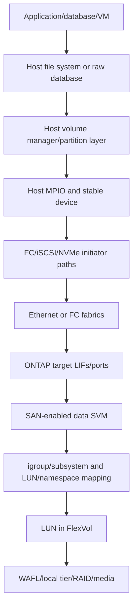

### Ownership matrix

| Layer | Primary owner | Safe question |
|---|---|---|
| Application/database | Application owner | What is committed, quiesced, clustered and recoverable? |
| File system/volume manager | Host/hypervisor/cluster owner | Is the device mounted, shared, healthy, aligned and resizable? |
| MPIO/host utilities | Host plus storage-vendor guidance | Are paths merged, supported and policy-correct? |
| Fabric/network | SAN/network owner | Are paths independent, zoned/routed, loss-free and supportable? |
| Target service/mapping | ONTAP/SAN owner | Does the exact initiator see the intended device? |
| LUN/FlexVol/local tier | ONTAP/storage owner | Is space, protection, performance and lifecycle healthy? |
| Business risk/change | Customer authority | Who can approve outage, restore, expansion or deletion? |

### Data, control, and management planes

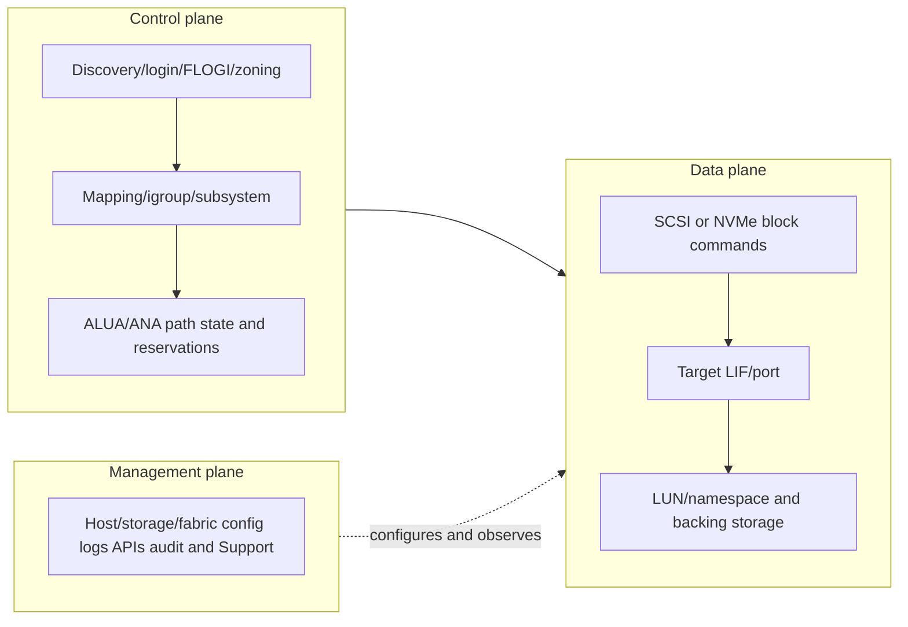

---

## 2. SAN SVMs, services, target LIFs, and ports

A SAN-enabled data SVM owns protocol services, target identities, data LIFs/ports, LUNs or namespaces, access objects and mappings. iSCSI/NVMe-TCP use IP data LIFs; FC/NVMe-FC use target-port WWPN identities. Exact supported protocols and mobility differ by release/platform.

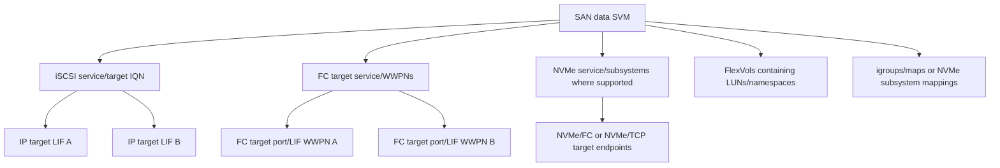

### Target identity inventory

| Protocol | Host identity | ONTAP target identity/path | Presentation object |
|---|---|---|---|
| iSCSI | Initiator IQN | Target IQN plus portal IP/port | SCSI LUN |
| FC | Initiator WWPN | Target WWPN/fabric path | SCSI LUN |
| NVMe/FC | Host NQN plus initiator WWPN | Subsystem NQN plus target WWPN | NVMe namespace |
| NVMe/TCP | Host NQN plus host IP | Subsystem NQN plus IP/port | NVMe namespace |

### Path design

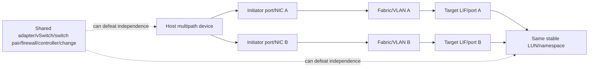

For SAN, do not assume NAS-style LIF failover. Hosts are normally designed with multiple target paths and MPIO/ALUA or ANA behavior. Verify protocol/release specifics in Parts 31 and current docs.

---

## 3. LUNs: logical blocks backed by FlexVol storage

A **Logical Unit Number (LUN)** identifies a SCSI logical unit in target context; operationally, people also call the whole presented block device a LUN. In ONTAP, a LUN is a file-like object in a volume and is presented as a block address space to authorized hosts.

### LUN hierarchy

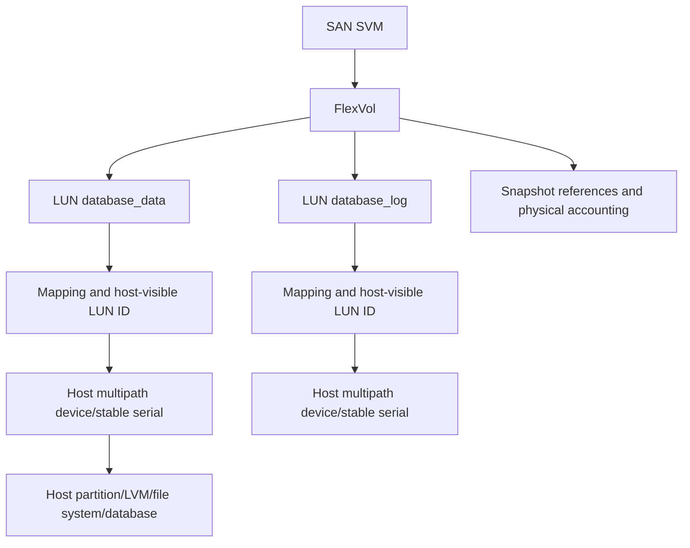

### LUN discovery fields

| Field | Why it matters |
|---|---|
| Stable LUN UUID/serial/device identifier | Correlates all paths and prevents wrong-device action |
| SVM/volume/path/name | Maps presentation to ONTAP storage object |
| Logical size | Host-visible address space |
| Physical/space-reserved state | Capacity and overwrite/reclamation behavior |
| OS/type metadata | Host compatibility hint; exact field behavior is release-sensitive |
| Mapped/unmapped state | Whether authorized initiators can see it |
| Host-visible LUN ID | Address number in mapping context, not stable device identity |
| Snapshot/clone/protection dependencies | Restore, deletion, capacity and lifecycle risk |

### Plain-English deep-dive: name, address number, and serial number

The ONTAP LUN path is a warehouse record name. The host-visible LUN ID is the unit number painted on one entrance. The stable device identifier is the vehicle identification number. A different host can see the same device under another LUN ID, while all paths must merge by stable identity. **Why it matters:** never format, delete, map or restore based on a friendly name or LUN ID alone.

---

## 4. Provisioning lifecycle, space, and alignment

### Safe lifecycle

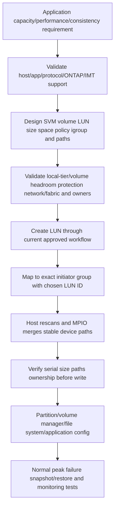

This is an ownership sequence, not a command recipe. Exact ONTAP and host steps, types, defaults and order must be taken from the current release and application documentation.

### Space layers

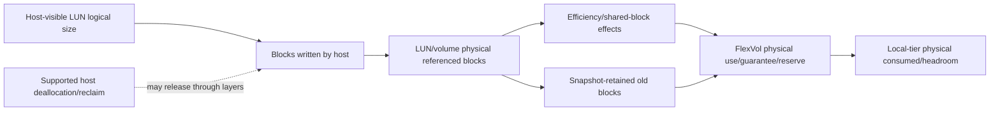

### Thin provisioning and overcommit

- A thin LUN can present more logical space than is physically consumed now.
- Volume and local-tier headroom still govern future writes, snapshots, metadata, moves and failure work.
- Host deletion does not prove immediate ONTAP physical reclaim; every layer must support and propagate deallocation.
- A space-reserved/guaranteed design can change overwrite and capacity behavior, but exact semantics are release-sensitive.
- Track LUN logical, host allocated/free, volume physical/logical, snapshots, guarantees/reserves and local-tier available capacity separately.

### Alignment

**Alignment** means host partitions, filesystem/database units and I/O start/size boundaries fit relevant lower units. Modern platforms commonly handle standard alignment when current supported tools are used; never diagnose misalignment from a workload label alone.

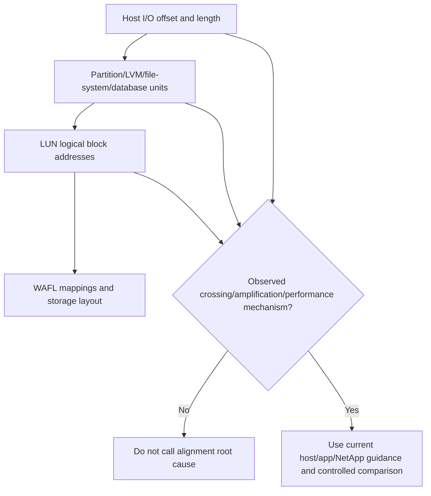

Do not prescribe offsets or block sizes from memory. Record actual device logical/physical sector reports, partition start, filesystem allocation unit, database page, I/O distributions and measured effect.

---

## 5. Initiators, igroups, mappings, and LUN IDs

An **initiator** is a host-side protocol identity. An ONTAP **igroup** groups SCSI initiator identities for LUN mapping. Exact igroup OS/type, protocol and nested/member behavior vary by release.

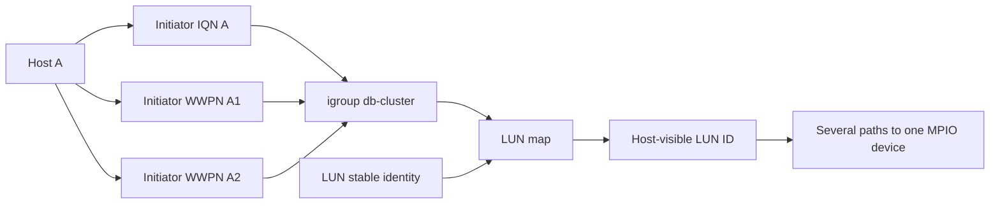

### Identity governance

| Risk | Example | Control |
|---|---|---|
| Duplicate initiator identity | Cloned IQN/WWPN record | Generate/govern unique host identities and audit mappings |
| Stale member | Decommissioned host remains in igroup | Owner-approved lifecycle cleanup after proving no dependency |
| Wrong host type metadata | Generic/inaccurate igroup setting | Use current host utilities/IMT guidance |
| Overbroad group | Unrelated hosts see same LUN | Least-privilege grouping and positive/negative discovery tests |
| LUN ID collision/inconsistency | Host/cluster expects different mapping | Current application/host guidance and stable-ID verification |
| Missing path identity | One HBA/NIC WWPN/IQN omitted | End-to-end path inventory and per-fabric tests |

### Mapping sequence

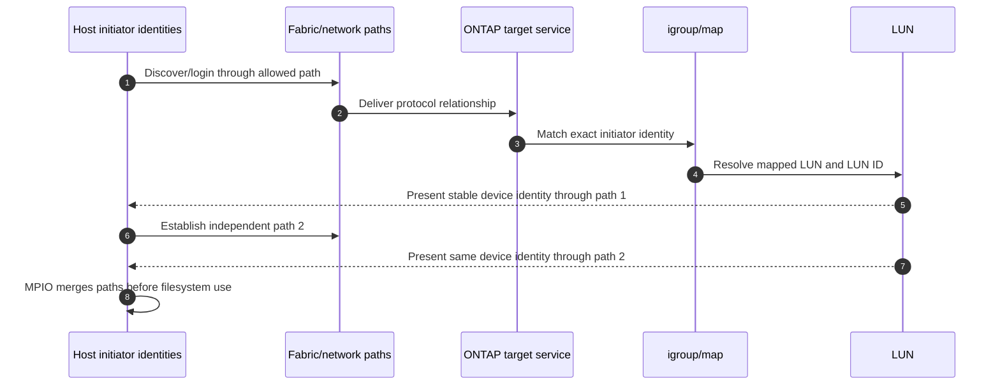

Discovery/target login, zoning/network access, igroup membership, mapping and host filesystem access are separate gates.

---

## 6. Host utilities and supported host integration

NetApp Host Utilities and host-specific guidance can configure/report supported settings and assist with device identity, multipathing, timeout and SAN integration for specific operating systems/protocols. Exact utility name/version/features and automatic changes vary.

### Host integration map

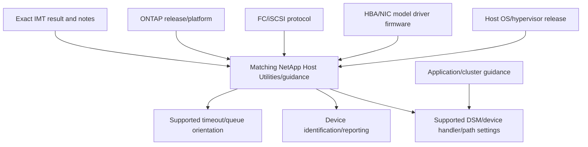

### Host-utility discipline

- Select the exact OS and utility version documented for the solution.
- Read release notes and record what the utility changes versus reports.
- Preserve before/after settings and reboot requirements.
- Confirm clustered/application requirements separately.
- Do not run a utility or copy recommended settings from another OS/release blindly.
- Save IMT evidence and every applicable note; `installed` does not prove configured correctly.

---

## 7. ALUA and MPIO path states

**Multipath I/O (MPIO)** correlates multiple host-to-target paths into one logical block device. **Asymmetric Logical Unit Access (ALUA)** lets a SCSI target report target-port-group access characteristics so a host can choose paths according to the storage architecture.

### Plain-English deep-dive: route signs to the same warehouse

Several roads reach one warehouse. Some are direct, some cross an internal bridge, some are standby, and some are closed. ALUA publishes route signs; MPIO is the host navigator. The signs do not move the warehouse or duplicate its inventory. **Why it matters:** using every path equally can be wrong, and one visible path is not resilient.

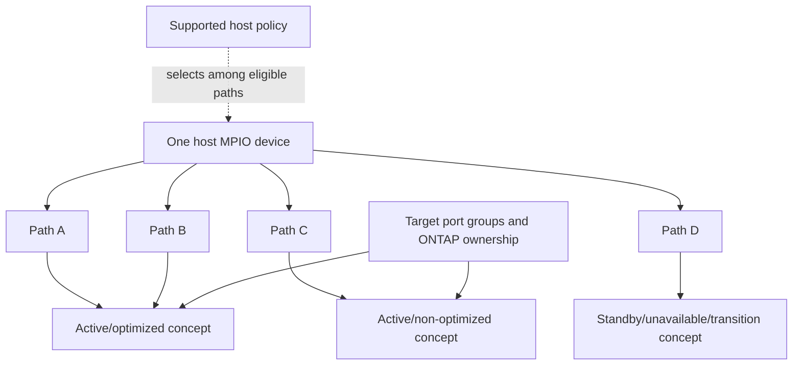

### Path policy orientation

| Policy concept | Purpose | Caveat |
|---|---|---|
| Failover-only | One preferred path until failure | Can underuse paths but may match exact support |
| Round robin | Rotate work among eligible paths | Must be ALUA-aware and vendor-supported |
| Least queue/blocks | Choose based on host-observed load | Algorithm/scope differ; target architecture still matters |
| Fixed/preferred | Favor a configured path | Stale preference can create imbalance/indirect traffic |

### Path failure sequence

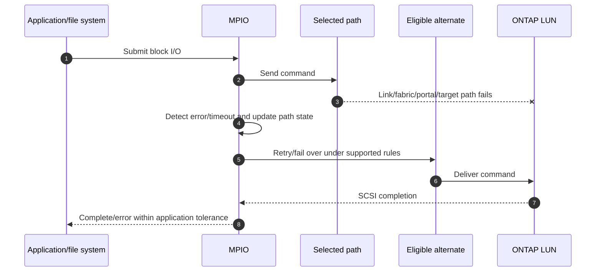

Timeouts that are too long delay failover; values that are too short can cause false path failure. Use exact host/application/NetApp guidance, not universal numbers.

---

## 8. Host filesystems, volume managers, clusters, and reservations

### Host stack

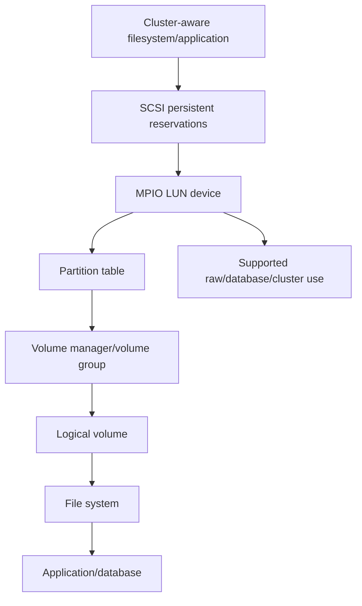

### Multi-host safety

Ordinary filesystems are not safe for simultaneous read/write mounting on several hosts unless a supported cluster-aware filesystem/application coordinates metadata and fencing. Storage presentation to several initiators is not permission to mount from all of them.

### SCSI persistent reservations

**Persistent Reservations (PRs)** let cooperating hosts register keys and establish access rules on one SCSI logical unit. Clusters use reservations/preemption as fencing controls.

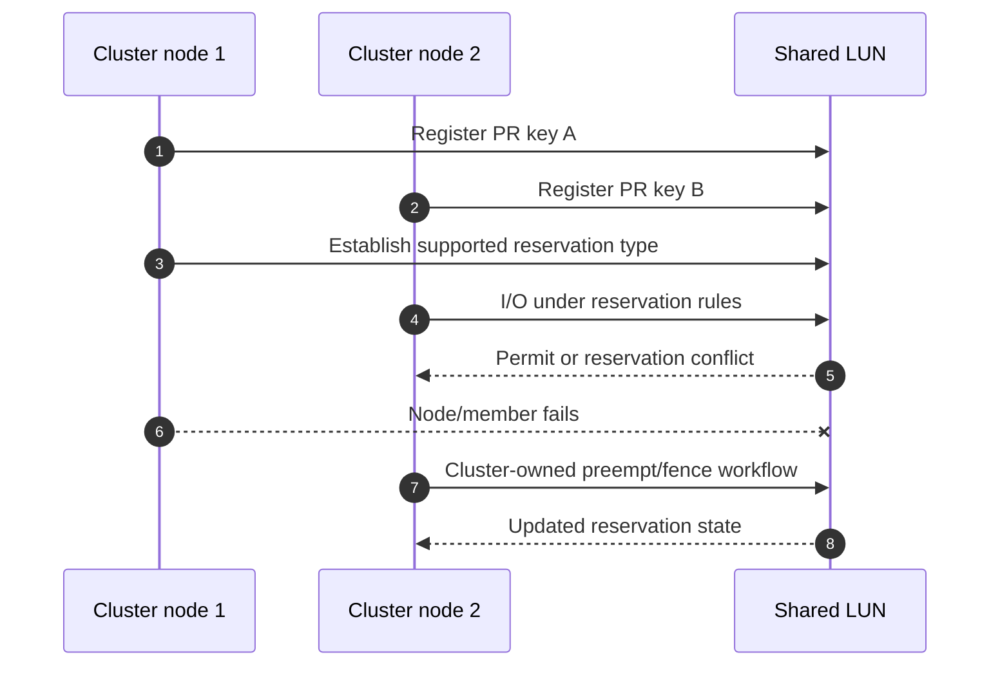

Do not clear a reservation because a LUN appears busy. First prove cluster membership/quorum, failed-node fencing, application ownership and current vendor procedure. Reservation conflict can be the safety system working.

---

## 9. Snapshots, clones, and application consistency

An ONTAP Snapshot captures volume block mappings at a point in time. For SAN, ONTAP sees block changes inside LUN files; it does not automatically know whether host caches, filesystems, databases or several LUNs form a consistent application transaction.

### Plain-English deep-dive: photograph the warehouse, not the tenant's ledger

A storage snapshot photographs all boxes in selected rooms. It may resemble a sudden power-loss point, but the tenant can still have an unfinished ledger entry on a desk or related boxes in another room. Application consistency requires the tenant to pause/flush and identify the complete room set. **Why it matters:** a fast snapshot is not automatically a usable database recovery point.

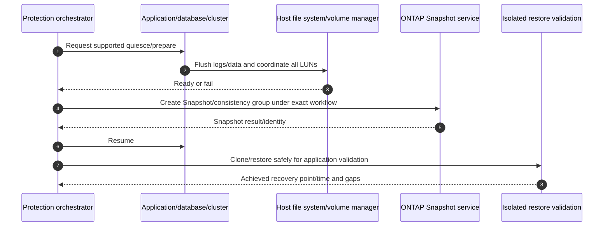

### Snapshot/clone risks

- Crash-consistent point may require filesystem/database recovery.
- Related LUNs in different volumes need supported coordination.
- Host cache may contain acknowledged application state not represented as expected without proper flush semantics.
- Restoring a LUN under a mounted host filesystem can create stale cache/metadata and corruption.
- Cloned LUNs can carry duplicate filesystem/volume signatures, reservation state or application identity.
- Snapshot retention consumes physical capacity as blocks change.

Detailed Snapshot/clone mechanics belong in Part 35; here the SAN rule is **coordinate ownership and prove restore at the application layer**.

---

## 10. Expansion, unmapping, and deletion hazards

### Expansion sequence

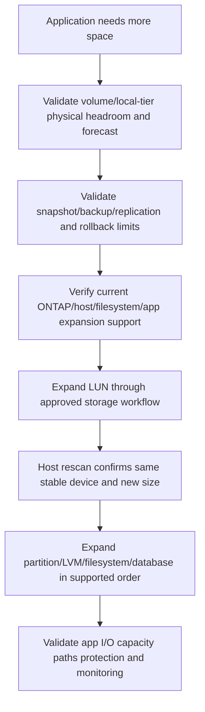

Growing a LUN does not grow the host filesystem automatically. Shrinking a LUN can truncate host data and may be unsupported even when an upper filesystem reports free space. Never shrink from a generic guide.

### Unmap/delete lifecycle

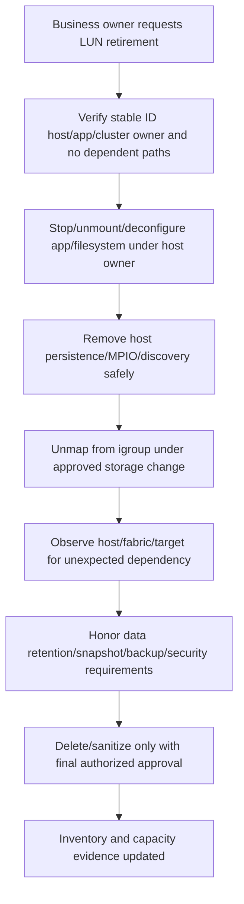

### Destructive hazards

| Action | Hazard | Required safeguard |
|---|---|---|
| Format a new device | Wrong LUN/data destruction | Stable serial/path/owner verification by two evidence sources |
| Unmap active LUN | I/O errors, filesystem corruption, cluster failure | Host/app quiesce and dependency proof |
| Delete LUN | Irreversible loss and snapshot/replication impact | Retention/backup/owner approval and exact stable ID |
| Restore in place | Host stale cache/signature/reservation and newer-data loss | Offline/isolated validated recovery workflow |
| Clone and present | Duplicate signatures/IDs/reservations | Isolated host, current clone workflow and identity change plan |
| Expand wrong layer/order | No space gained or metadata damage | Storage-to-host ordered runbook and app checks |
| Shrink | Truncation/data loss | Current explicit support only; otherwise redesign/migrate |

---

## 11. Safe operational discovery and evidence

Use read-only discovery before change. Examples are conceptual placeholders, not production commands; verify the exact ONTAP release, privilege, manual/API fields and customer authorization.

```text
CONCEPTUAL ONLY - verify current release, privilege, fields and scope
<san-service-command-family> show -vserver <svm> -fields <documented-protocol-fields>
<network-interface-or-fc-port-family> show -vserver <svm> -fields <documented-target-fields>
<lun-command-family> show -vserver <svm> -fields <documented-uuid-size-space-map-fields>
<igroup-command-family> show -vserver <svm> -fields <documented-initiator-os-type-fields>
<lun-map-command-family> show -vserver <svm> -fields <documented-lun-id-fields>
<san-path-status-family> show -vserver <svm> -fields <documented-target-port-state-fields>
```

### Read-only discovery flow

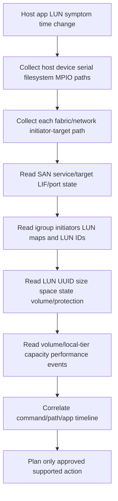

### Evidence schema

- Stable host, initiator, target and LUN identifiers.
- Exact protocol, path, host OS/hypervisor, adapter, driver/firmware, MPIO/utility and ONTAP release.
- Host device size, partition/LVM/filesystem/application/cluster owner and mount state.
- Every path's initiator port, switch/VLAN/fabric, target port/LIF, ALUA state, counters and failure domain.
- LUN path/UUID/serial/size/space state, igroup/map/LUN ID, volume/local tier/protection.
- Raw timestamps/timezones, counter definitions, logs/events, command/API provenance and data cutoff.

---

## 12. Performance, capacity, security, and availability

### Queue path

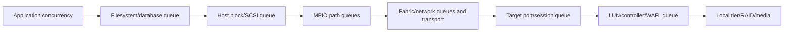

### Performance evidence

| Layer | Measures |
|---|---|
| Application | Transaction latency, timeout, concurrency, commit/recovery |
| Filesystem/database | Queue/cache/flush/lock and device latency |
| Host block/MPIO | I/O type/size, outstanding, per-path latency/errors/state |
| Fabric/network | Utilization, loss/CRC/credits/queue, RTT/MTU and failures |
| Target/LUN | Operations, size, latency, queue, path/ALUA and controller state |
| Volume/local tier | Workload, capacity, Snapshot, efficiency, RAID/media contention |

### Security controls

- Least zoning/network access plus least LUN mapping; one does not replace the other.
- Govern unique IQNs, WWPNs and host NQNs with lifecycle/audit.
- Use CHAP or transport protections only where exact support/policy requires; CHAP is not encryption.
- Protect management credentials, packet/frame traces, reservation keys and customer data.
- Separate cluster/application fencing from manual storage administration.
- Audit map/unmap/create/delete/resize/restore actions and retain stable IDs.

### Availability stack

```mermaid
flowchart TD
    APP[Application transaction] --> HOST[Host FS/cluster/timeout]
    HOST --> MPIO[MPIO device/path state]
    MPIO --> FAB[Adapters/fabrics/networks]
    FAB --> TARGET[ONTAP target ports/LIFs/nodes]
    TARGET --> LUN[LUN/volume/local tier]
    LUN --> HA[ONTAP HA/protection]
    EACH[Each layer needs an owner and failure test] -.required.-> APP
```

Two paths to one target node improve path resilience but do not protect node, backing data, application or site. Test the named failure and application effect.

---

## 13. Failure modes and troubleshooting decision trees

### Discovery/presentation tree

```mermaid
flowchart TD
    START[Host cannot use expected LUN] --> PATH{Initiator reaches target path/login?}
    PATH -->|No| FAB[Adapter VLAN/route/zoning/switch/optic/portal/target service]
    PATH -->|Yes| ID{Exact initiator identity in intended igroup?}
    ID -->|No| IG[IQN/WWPN lifecycle and igroup membership]
    ID -->|Yes| MAP{LUN mapped with expected stable identity/LUN ID?}
    MAP -->|No| LM[LUN state/map/igroup/SVM]
    MAP -->|Yes| MPIO{Host merges every path into one device?}
    MPIO -->|No| HP[Host utilities DSM/device handler ALUA driver/IMT]
    MPIO -->|Yes| OWN{Host sees correct size/signature and owner?}
    OWN -->|No| SCAN[Rescan/identity/resize/clone/restore investigation]
    OWN -->|Yes| FS[Filesystem/database/application layer]
```

### Path/performance tree

```mermaid
flowchart TD
    IO[SAN I/O slow/failing] --> SCOPE[Host LUN command path workload time change]
    SCOPE --> ONE{One path or all paths?}
    ONE -->|One| P[Adapter/fabric/portal/target state/ALUA/MTU]
    ONE -->|All| A[Host common queue/controller/LUN/backing/app]
    P --> FAIL{MPIO detects and uses eligible alternate?}
    FAIL -->|No| CFG[Policy/driver/timeout/identity/support/common fate]
    FAIL -->|Yes| APP{Application remains within tolerance?}
    APP -->|No| BUDGET[Retry/timeout/queue and transaction recovery budget]
    APP -->|Yes| FB[Validate stable failback and normal state]
    A --> CORR[Correlate host command target and storage service]
    CORR --> TEST[One safe discriminating test]
```

### Common failure table

| Symptom | Candidate causes | High-value evidence |
|---|---|---|
| Target visible, no LUN | Missing/wrong igroup/map/SVM/LUN state | Exact initiator identity and map |
| Duplicate devices | MPIO/host utility/driver/stable-ID mismatch | Device serials and path correlation |
| One path down | HBA/NIC, switch/VLAN/zoning, target port/LIF, ALUA | End-to-end per-path map/counters |
| Reservation conflict | Cluster membership/fencing/reservation state | Keys/type/owner and cluster logs |
| Volume free, write fails | LUN/host filesystem/local-tier/snapshot/metadata capacity | Layered space accounting |
| Expanded LUN, host unchanged | Rescan/partition/LVM/filesystem stage missing | Same stable device and size at each layer |
| Snapshot restore gives corrupt app | No quiesce/multi-LUN coordination or mounted restore | App/log/fs/snapshot timeline |
| High latency | Host queue, fabric loss/credits, ALUA policy, target/backing | One command traced end to end |

### Support boundaries

- Never format, unmap, delete, restore, shrink, clone-present, clear reservations or alter MPIO from this conceptual guide.
- Host/app/cluster owners control filesystems, reservations, quiesce and application tests.
- Fabric/network owners control zoning, VLANs, switches and path changes.
- ONTAP/NetApp Support owners control product procedures and LUN/storage changes.
- TAM analysis supplies verified topology, risk, recommendation, communication and action closure.

---

## 14. TAM discovery, evidence, recommendations, and JD Mapping

### Discovery questions

1. Which business application, host/cluster, LUN/namespace, SLO, RPO/RTO, change window and data owner apply?
2. Which SAN SVM/services, target LIFs/ports/nodes, protocols and backing volumes/local tiers serve it?
3. Which initiator IQNs/WWPNs/NQNs, adapters/drivers/firmware and fabrics/networks form every path?
4. Which igroup/subsystem, map, LUN ID, stable device ID, LUN size/type/space state and host ownership exist?
5. Which host utilities, DSM/device handler, MPIO policy, ALUA/ANA states, queues/timeouts and IMT notes apply?
6. Which partition/LVM/filesystem/database/cluster/reservation/boot configuration owns the device?
7. Which logical/physical/snapshot/reclaim/guarantee/reserve/local-tier capacity views and growth apply?
8. Which snapshot/clone/replication/backup consistency group and restore test exist?
9. Which normal/peak/path/port/node/controller/restore/upgrade tests passed, with what application result?
10. Which exact current official docs, IMT/HWU evidence, access gaps and Support case govern the action?

### Minimum escalation pack

- Business/application impact, host/cluster, device/LUN, operation/error, SLO and UTC timeline.
- Host OS/hypervisor, filesystem/database/cluster owner, mount state, partition/LVM, reservations and timeouts.
- Initiator identities, HBA/NIC/driver/firmware, host utilities, MPIO/DSM policy, stable device ID and per-path state/errors.
- Fabric/network A/B topology, switches/VLANs/routes/zoning/ports/optics/MTU/counters and common fate.
- SVM/protocol/target identities, target LIFs/ports/nodes, ALUA target-port groups and events.
- LUN UUID/path/serial/size/type/space state, volume, map/igroup/LUN ID and Snapshot/clone/protection dependencies.
- Volume/local-tier capacity/performance/RAID/media/HA evidence and recent moves/restores/expansions.
- Exact current docs, IMT result/notes/date, HWU facts, unknowns, actions/results/rollback and specialist ask.

### Recommendation model

```mermaid
flowchart TD
    EVID[Verified host path mapping LUN storage and app evidence] --> CONTEXT[Business criticality and supportability]
    CONTEXT --> RISK[Mechanism impact likelihood urgency confidence]
    RISK --> OPTIONS[Host fabric mapping capacity/protection options]
    OPTIONS --> ACTION[Owner prerequisites date and stop/rollback]
    ACTION --> TEST[Normal failure restore and app validation]
    TEST --> RESID[Residual risk monitoring and review]
```

### Recommendation patterns

| Finding | Risk | Bounded recommendation | Validation |
|---|---|---|---|
| Host sees duplicate devices after driver change | Filesystem may use unmerged paths and fail inconsistently | Restore exact IMT/host-utility-supported MPIO and verify stable ID | One device, all paths, failure test and app I/O |
| LUN thin growth crosses local-tier lead time | Host writes/snapshots/protection can exhaust backing | Build layered forecast and funded expansion/move/onboarding plan | Post-action physical headroom and app writes |
| Two paths share one virtual switch/NIC | One host fault removes all storage access | Evaluate supported independent host/fabric design | Named adapter/vSwitch/path failure |
| Snapshots taken without database coordination | Restore may be crash-consistent but miss app RPO | Use supported app/multi-LUN orchestration and isolated restore test | Transaction-level achieved RPO/RTO |
| Stale initiators remain in broad igroup | Decommissioned hosts retain LUN authorization | Owner-approved least-privilege cleanup after dependency proof | Expected hosts see LUN; retired host denied |

### JD Mapping

| JD responsibility | Part 30 contribution | Arti's factual bridge and gap |
|---|---|---|
| Understand customer environment | Maps app/host/MPIO/fabric/target/LUN/backing ownership | Azure/VM/network method transfers; ONTAP SAN operation unproven |
| Storage depth | Covers LUNs, igroups/maps, space, ALUA/MPIO, reservations and consistency | Conceptual/synthetic only |
| Risk/stability | Finds duplicate devices, path common fate, capacity and destructive hazards | CRITSIT safety method transfers |
| Supportability | Requires exact host/adapter/driver/firmware/fabric/ONTAP IMT evidence | No customer/gated result claimed |
| Recommendations | Connects split ownership to safe owner/test/residual risk | Advisory/escalation strength |
| Service review | Reports paths, capacity, protection, support gaps and actions | Analytics/business-review strength |
| Escalation | Supplies stable IDs and command/path/app timeline | Product/Engineering evidence discipline transfers |

---

## 15. Fully synthetic scenario: Contoso Payments duplicate devices and capacity

> **Synthetic case:** Contoso Payments, every host, LUN, path, metric and outcome below is fictional. It is not a NetApp customer, internal process, tool result, or Arti's production work.

### Environment

- A two-node database cluster uses FC through Fabric A/B.
- Each node has two HBA ports and four paths to one database LUN.
- The LUN is in `db_vol` on a SAN SVM and mapped to a cluster igroup.
- A host-driver upgrade occurs before month-end.
- The LUN is thin; snapshots are taken without documented database coordination.
- The host requests expansion while the local tier approaches its planning threshold.

```mermaid
flowchart TB
    DB[Payment database cluster] --> FS[Cluster-aware application/filesystem]
    FS --> MPIO[Host MPIO]
    MPIO --> HA1[HBA A1]
    MPIO --> HB1[HBA B1]
    HA1 --> FA[Fabric A]
    HB1 --> FB[Fabric B]
    FA --> TA[Target port A]
    FB --> TB[Target port B]
    TA --> LUN[payments_data LUN]
    TB --> LUN
    LUN --> VOL[db_vol with snapshots]
    VOL --> LT[Local tier near action threshold]
    IG[Cluster igroup/WWPN mappings] --> LUN
```

### Timeline

```mermaid
sequenceDiagram
    autonumber
    participant CH as Change team
    participant H as Database host/MPIO
    participant F as FC fabrics
    participant O as ONTAP SAN/LUN
    participant DB as Database
    CH->>H: Driver upgrade/reboot
    H->>F: Rediscover four paths
    F->>O: Same LUN presented on all paths
    H->>H: Two paths merge; two appear as duplicate device view
    DB->>H: Month-end writes experience retry/latency
    CH->>O: Request LUN expansion
    O->>O: Capacity review finds local-tier lead-time risk
    DB->>O: Snapshot occurs without app quiesce evidence
```

### Evidence

| Evidence | Observation | Bounded conclusion |
|---|---|---|
| ONTAP mapping | Same stable LUN serial/UUID is presented on all four paths | Mapping is not duplicating capacity |
| Host | Two paths not merged after unsupported/mismatched driver/DSM state | Leading duplicate-device mechanism |
| IMT record | Saved result predates driver upgrade; current combination unverified | Supportability gap, not proof of defect |
| FC | Fabrics/target ports healthy; no CRC/credit issue in interval | Weakens fabric cause |
| Database | Retries align with unmerged paths; app p99 rises | Host mechanism affects app, but exact command trace needed |
| Capacity | Host/LUN free exists; local tier forecast crosses action horizon with planned growth | Expansion can worsen physical risk |
| Snapshot | Point exists; no quiesce/multi-LUN evidence | Crash-consistent at best until verified |
| Reservations | Cluster PR state healthy | Do not clear reservations |

### Competing hypotheses

| Hypothesis | Evidence for | Disconfirming check |
|---|---|---|
| ONTAP mapped two different LUNs | Host sees duplicates | Compare stable serial/UUID and LBA/size across paths |
| Host MPIO integration broke | Driver changed; paths fail to merge | Restore current supported utility/driver/config in controlled test |
| FC fabric caused duplicates | FC paths are involved | Fabrics deliver same stable identity; no errors |
| More LUN space fixes database latency | Host asks expansion | Separate capacity from host path retries and app waits |
| Snapshot guarantees database restore | Snapshot succeeds | Isolated database recovery and transaction validation |

### Decision tree

```mermaid
flowchart TD
    TOP[Duplicate devices latency expansion request] --> ID{Do device views share one stable LUN ID?}
    ID -->|No| MAP[Stop and investigate wrong mapping/device]
    ID -->|Yes| MPIO{Exact host utility driver DSM and IMT supported?}
    MPIO -->|No| HOST[Restore validated host integration before filesystem action]
    MPIO -->|Yes| PATH[Inspect path state/ALUA and command errors]
    TOP --> CAP{Physical local-tier headroom supports expansion?}
    CAP -->|No| PLAN[Capacity option/lead-time decision]
    CAP -->|Yes| EXP[Approved storage-to-host expansion sequence]
    TOP --> CONS{Application-consistent protection proved?}
    CONS -->|No| TEST[Quiesced multi-LUN isolated restore]
    HOST --> VALID[One MPIO device/path failure/app validation]
    PLAN --> VALID
    TEST --> VALID
```

### Recommendations

1. Freeze formatting, remapping and filesystem changes until stable LUN identities and ownership are independently confirmed.
2. Host/SAN owners should validate the exact current driver/firmware/host-utility/MPIO/ONTAP combination in IMT and restore supported path merging in a controlled window.
3. Capacity owners should model the requested expansion, snapshots and growth against physical local-tier headroom and action lead time before changing the LUN.
4. Database/protection owners should design supported quiesce/multi-LUN coordination and prove an isolated transaction-level restore.
5. Repeat one Fabric A/B path loss with cluster reservations, application writes and failback monitored; do not clear PR state.

### Customer-facing summary

> "ONTAP presents the same stable LUN on all four paths; the host stopped merging two paths after a driver change, so the duplicate view is a host-integration issue until current IMT evidence says otherwise. Expanding the LUN would not resolve that latency and could move the local tier further inside its capacity lead time. The current snapshots also lack application-consistency evidence. We recommend restoring supported MPIO first, making a separate capacity decision, and proving a coordinated database restore."

---

## 16. Arti's factual transfer and honest positioning

```mermaid
flowchart LR
    AZ[Azure/VM production context] --> LAYER[Guest host network storage ownership layers]
    WIN[Windows networking/support] --> MPIO[Device paths drivers timeouts evidence]
    CRIT[CRITSIT escalation] --> SAFE[Impact stable identity stop destructive action]
    BI[Analytics/business reviews] --> CAP[Capacity/performance trends and recommendations]
    ENG[Product/Engineering collaboration] --> PACK[Reproducible escalation and exact ask]
    LAYER --> SAN[ONTAP SAN synthetic method]
    MPIO --> SAN
    SAFE --> SAN
    CAP --> SAN
    PACK --> SAN
    SAN --> LAB[Future authorized SAN lab and SME review]
```

| Factual strength | Transfer | Explicit gap |
|---|---|---|
| Azure/VM | Layered host/virtual/storage ownership | No production ONTAP LUN provisioning |
| Windows/network support | Drivers, paths, identity and evidence discipline | No host-utility/MPIO/ALUA configuration claim |
| CRITSIT | Stop unsafe action, preserve identity, coordinate owners | No reservation/cluster recovery authority |
| Analytics | Capacity/performance data quality and service review | No ONTAP SAN counter/tool production use |

### Honest answer

> "I understand ONTAP SAN architecture from SAN SVMs and target endpoints through initiator identities, igroups, maps, LUN IDs, stable device identity, host utilities, MPIO/ALUA, host filesystems, reservations, space/alignment and application-consistent protection. My production experience is Microsoft support, Azure/VM/networking and analytics, not ONTAP SAN administration. I would verify exact IMT/HWU and application guidance, use authorized read-only evidence and work with host, fabric, application and NetApp specialists before any mapping or destructive action."

---

## 17. Whiteboard drills and paper lab

### Whiteboard drills

1. **Split ownership:** ONTAP blocks versus host filesystem/database.
2. **Stack:** App -> FS/LVM -> MPIO -> initiator -> fabric -> target -> LUN -> WAFL.
3. **Identity:** IQN/WWPN/NQN -> igroup/subsystem -> map -> LUN ID -> stable serial.
4. **Space:** Host logical/free -> LUN written -> Snapshot -> volume -> local tier.
5. **ALUA:** Route signs; MPIO selects eligible paths.
6. **Reservations:** Cluster safety/fencing state, not a nuisance lock.
7. **Snapshot:** Storage blocks require app/multi-LUN coordination.
8. **Expansion:** LUN -> rescan -> partition/LVM -> filesystem/app.
9. **Retirement:** Quiesce -> host removal -> unmap -> retention -> delete.
10. **TAM:** Evidence, owner, supportability, test and residual risk.

### Paper lab scenario

A fictional eight-host virtualization/database estate uses FC and iSCSI from two SAN SVMs, 36 LUNs, 12 igroups, two fabrics and two IP storage VLANs. Host utilities and drivers vary, some paths are non-optimized, one cluster uses PRs, snapshots are uncoordinated, thin LUNs are overcommitted and several retired hosts remain mapped.

### Tasks

1. Inventory apps/hosts/clusters/filesystems, initiators, target paths, LUNs and owners.
2. Build stable-ID mappings from every path to one host device and ONTAP object.
3. Validate exact OS/HBA/NIC/driver/firmware/utility/MPIO/protocol/ONTAP IMT evidence.
4. Map igroup members, LUN maps/IDs and expected positive/negative visibility.
5. Reconcile LUN/host/volume/local-tier logical/physical/snapshot/reclaim capacity.
6. Audit partition/filesystem/database alignment using measured evidence, not assumed offsets.
7. Map ALUA states/policies and inject member/fabric/target/node failures.
8. Reconstruct PR keys/types and cluster-owned recovery boundaries.
9. Design app/multi-LUN quiesce, Snapshot and isolated restore tests.
10. Model safe expansions and retirement/deletion workflows with stop gates.
11. Inject target-visible/no-LUN, duplicate-device, path-flap, capacity and restore failures.
12. Build complete escalation packs with exact stable IDs and timelines.
13. Write path, capacity, mapping and protection recommendations.
14. Present executive and technical versions with the production boundary.

```mermaid
flowchart LR
    INV[Inventory owners identities paths LUNs] --> SUPPORT[Validate docs IMT/HWU/host utilities]
    SUPPORT --> MAP[Reconcile igroups maps stable device IDs]
    MAP --> PATH[Validate MPIO ALUA and failures]
    PATH --> SPACE[Reconcile capacity alignment and expansion]
    SPACE --> PROT[Validate snapshots reservations and restore]
    PROT --> RISK[Model retirement/destructive hazards]
    RISK --> REC[Write TAM recommendations]
```

### Lab pass criteria

- [ ] ONTAP and host ownership are explicit at every layer.
- [ ] Stable device identity, not name/LUN ID, governs destructive safety.
- [ ] Discovery, mapping, MPIO and filesystem access are separate gates.
- [ ] ALUA/path policy and host utilities are exact-version supported.
- [ ] Space and alignment claims use observed data and current docs.
- [ ] Reservations remain cluster/application-owned.
- [ ] Snapshot/restore claims end with application validation.
- [ ] Expansion/deletion follows owner-approved staged workflows.
- [ ] No synthetic/lab work is called production ONTAP SAN experience.

---

## 18. Self-test

1. Define SAN SVM, target LIF/port, LUN, initiator, igroup, map, LUN ID and stable device ID.
2. Draw data/control/management planes and split ownership.
3. Trace protocol-specific host/target identities to a LUN.
4. Explain LUN-in-FlexVol architecture and discovery fields.
5. Draw safe provisioning from requirements through host/app validation.
6. Reconcile logical/physical/thin/snapshot/reclaim capacity.
7. Explain alignment without prescribing unverified offsets.
8. Govern initiator identities, igroups, maps and LUN IDs.
9. Explain Host Utilities and exact IMT/version discipline.
10. Define MPIO, ALUA, target-port groups and path policy concepts.
11. Draw path failure and timeout/application interaction.
12. Map host partitions, volume managers, filesystems and raw/cluster use.
13. Explain PRs and why manual clearing is dangerous.
14. Draw application-consistent SAN snapshot/restore.
15. Explain expansion, shrink, unmap, delete, clone and restore hazards.
16. Apply both fault trees and common-failure table.
17. Recreate Contoso's host-integration, capacity and consistency workstreams.
18. Build escalation pack and seven-part recommendation.
19. Complete all whiteboard drills and paper lab.
20. Deliver the No-production-NetApp boundary accurately.

---

## 19. Official Source Anchors

**Date checked: 2026-08-24.** These official public sources anchor ONTAP SAN architecture. Exact LUN types/space behavior, igroup/maps/LUN IDs, Host Utilities, ALUA/MPIO, reservations, snapshots, commands, limits and procedures are release/host/application sensitive. Re-open exact current docs, IMT and HWU and preserve authorized evidence. Never turn conceptual examples into a production runbook.

| Topic | Official public source | Bounded use and currency note |
|---|---|---|
| ONTAP SAN management | [ONTAP SAN storage management](https://docs.netapp.com/us-en/ontap/san-management/) | Current LUN, igroup, host, protocol and operations entry point. |
| SAN configuration | [ONTAP SAN configuration](https://docs.netapp.com/us-en/ontap/san-config/) | Current FC/iSCSI architecture/prerequisites; protocol lifecycle continues in Part 31. |
| LUN administration | [Manage ONTAP LUNs](https://docs.netapp.com/us-en/ontap/san-admin/) | LUN create/map/resize/delete/snapshot context; select exact release/task. |
| igroups and mappings | [ONTAP initiator groups and LUN mapping](https://docs.netapp.com/us-en/ontap/san-admin/) | Exact fields/types/rules require current docs/manuals. |
| Host Utilities | [NetApp Host Utilities](https://docs.netapp.com/us-en/ontap-sanhost/) | Select exact host OS/release/protocol/utility and follow IMT notes. |
| Windows MPIO | [Microsoft MPIO overview](https://learn.microsoft.com/en-us/windows-server/storage/mpio/mpio-overview) | Official Windows orientation; DSM/policy/support remain vendor-specific. |
| Linux multipath | [Red Hat device mapper multipath documentation](https://docs.redhat.com/en/documentation/red_hat_enterprise_linux/) | Select exact RHEL release and NetApp guidance. |
| SCSI standards | [INCITS T10](https://www.t10.org/) | Normative standards can require access; implementation/support exact-version specific. |
| Snapshots/protection | [ONTAP data protection and disaster recovery](https://docs.netapp.com/us-en/ontap/data-protection-disaster-recovery/) | Storage snapshot context; app consistency and clones detailed in Part 35. |
| Volume space | [ONTAP volume administration](https://docs.netapp.com/us-en/ontap/volumes/) | Guarantees/reserves/thin/snapshot/reclaim context; exact behavior release-sensitive. |
| Interoperability | [NetApp Interoperability Matrix Tool](https://imt.netapp.com/) | Official, potentially gated exact host/adapter/driver/firmware/protocol/multipath/storage result and notes. |
| Hardware facts | [NetApp Hardware Universe](https://hwu.netapp.com/) | Official, potentially gated platform/adapter/port/limit facts. |
| Support | [NetApp Support Site](https://mysupport.netapp.com/) | Entitlement-dependent cases, knowledge, advisories and procedures. |

### Source-use discipline

- Record exact host/app/cluster, initiator/target/LUN stable IDs, ONTAP release and date.
- Save every applicable IMT note; one component's support does not prove the solution.
- Use current Host Utilities/OS guidance for MPIO/ALUA/timeouts/queues.
- Preserve device IDs, map and host mount/reservation state before any storage action.
- Treat snapshot/clone/restore/resize/delete as cross-owner changes with app validation.
- Mark inaccessible IMT/HWU/customer evidence as unverified; never fabricate results.

---

## Likely Interview Questions

### Q1. Explain ONTAP SAN architecture and split ownership.

> **Model answer:** "A SAN-enabled SVM exposes target LIFs or FC/NVMe ports and maps block objects to authorized initiators. The host reaches the target through independent fabrics/networks, MPIO merges paths by stable device identity, and ONTAP serves the LUN from a FlexVol/local tier. ONTAP owns presentation, backing, protection and storage state; the host/hypervisor/database owns partitions, volume manager, filesystem, reservations and application consistency."

### Q2. What are igroups, LUN mappings and LUN IDs?

> **Model answer:** "An igroup collects exact SCSI initiator identities such as IQNs or WWPNs under current host/protocol metadata. A LUN mapping authorizes that group to one LUN and assigns a host-visible LUN ID. The LUN ID is an address in that mapping context, not the device's stable identity. I verify initiators, igroup type, map, LUN UUID/serial and every path before the host writes or any destructive action."

### Q3. How do Host Utilities, MPIO and ALUA work together?

> **Model answer:** "The exact NetApp Host Utilities/guidance helps align a supported OS/protocol/adapter combination and identify/report devices. MPIO merges paths into one device and applies a vendor-supported selection/failover policy. ALUA reports target-port-group access characteristics such as optimized or non-optimized concepts. I validate OS, utility, DSM/device handler, driver/firmware, path states/policy and IMT notes as one solution."

### Q4. How do you reason about LUN space and alignment?

> **Model answer:** "I separate host-visible logical size, blocks written, LUN/volume physical references, snapshots, efficiency, guarantees/reserves and local-tier headroom. Thin provisioning is a promise, not capacity. For alignment I record actual sector sizes, partition starts, filesystem/database units and I/O distributions and require an observed mechanism before calling it a problem. I do not prescribe offsets or block sizes from memory."

### Q5. What happens during an MPIO path failure?

> **Model answer:** "The host sends I/O on an eligible path. When that path fails, its stack detects an error/timeout, updates path state and retries or redirects through another supported eligible path according to policy and ALUA. Recovery must complete before filesystem/application timeouts, and reservations/cluster state must remain correct. I measure every path's failure domain, detection, app pause/error, failback and normal state."

### Q6. Why are SCSI reservations important?

> **Model answer:** "Persistent reservations let cooperating cluster nodes register keys and enforce access types to a shared LUN, providing a fencing mechanism. A reservation conflict can mean an uncoordinated node is correctly blocked. Clearing it without cluster membership, quorum/fencing and application ownership evidence can allow split-brain writes. I preserve keys/type/state and use the cluster/vendor-supported recovery procedure."

### Q7. How do you snapshot, expand or retire a LUN safely?

> **Model answer:** "For snapshots I coordinate the application, host filesystem and all related LUNs, then prove an isolated restore. For expansion I validate physical headroom/support, grow the LUN, rescan the same stable device, and expand partition/LVM/filesystem/app in supported order. For retirement I quiesce/unmount, remove host dependencies, unmap, observe, honor retention, then delete only with final owner approval. Shrink and mounted restore are high-risk and never assumed supported."

### Q8. How does your background transfer, and what remains a gap?

> **Model answer:** "My Azure/VM, Windows networking, storage fundamentals, CRITSIT and analytics work gives me layered ownership, stable-identity, path, evidence and risk discipline. I understand ONTAP SAN architecture but have not provisioned LUNs, managed igroups, MPIO/ALUA, reservations or SAN restores in production. I would use current docs, authorized read-only evidence, exact IMT/HWU and host/fabric/app/NetApp specialists before changes."

---

## 30-Second Memory Hooks

- **SAN:** ONTAP serves blocks; host/application owns the upper layout.
- **SAN SVM:** Target services, paths, access objects and LUNs/namespaces.
- **LUN:** Block device backed inside a FlexVol.
- **Stable ID:** Device VIN; **LUN ID:** entrance number; **name:** inventory label.
- **igroup:** Least group of exact initiator identities.
- **Mapping:** Which initiator group may see which LUN.
- **Host Utilities:** Exact OS/protocol integration guidance, version-matched.
- **MPIO:** Many paths, one logical device.
- **ALUA:** Target route signs for path characteristics.
- **Thin:** Logical promise; monitor physical volume/local-tier headroom.
- **Alignment:** Measure actual units/effect; never diagnose by folklore.
- **PR:** Cluster registration/reservation/fencing safety state.
- **Snapshot:** Storage block point; application consistency needs coordination.
- **Expansion:** Storage first, then rescan and upper layers in supported order.
- **Retirement:** Quiesce -> remove host use -> unmap -> retain -> delete.
- **Split ownership:** Every change needs the owner above and below the LUN.
- **Arti's bridge:** Host/path/evidence rigor transfers; ONTAP SAN production operation does not.

---

## Completion Checklist

- [ ] Define SAN/SVM/target/LUN/initiator/igroup/map/LUN ID/stable ID terms.
- [ ] Draw split ownership and data/control/management planes.
- [ ] Map every protocol target identity and independent path.
- [ ] Explain LUN-in-FlexVol architecture and fields.
- [ ] Follow the provisioning lifecycle with current-doc gates.
- [ ] Reconcile thin/logical/physical/snapshot/reclaim capacity.
- [ ] Evaluate alignment only from observed current evidence.
- [ ] Govern initiator identities, igroups and least mappings.
- [ ] Match Host Utilities, MPIO/ALUA and IMT support exactly.
- [ ] Trace path failure, failback and application timeout.
- [ ] Map host filesystem/LVM/database/cluster ownership.
- [ ] Preserve persistent reservations and cluster fencing boundaries.
- [ ] Prove SAN snapshot/restore at application level.
- [ ] Apply safe expansion and retirement/deletion gates.
- [ ] Use conceptual/read-only discovery before action.
- [ ] Apply both fault trees and build the escalation pack.
- [ ] Recreate Contoso without mixing host, capacity and consistency mechanisms.
- [ ] Complete whiteboard drills, paper lab, self-test and Q1-Q8 aloud.
- [ ] State the No-production-NetApp boundary and exact non-claim accurately.
- [ ] Recheck current docs, IMT/HWU, host/app guidance and Support procedure before customer use.

---

*Next suggested section:* [Part 31 - ONTAP iSCSI, Fibre Channel, and NVMe Configuration](Part-31-ontap-iscsi-fc-nvme-configuration.md)