# Part 31 - ONTAP iSCSI, Fibre Channel, and NVMe Configuration

> **Section goal:** Learn the configuration and validation lifecycle for ONTAP iSCSI, Fibre Channel (FC), NVMe/FC, and NVMe/TCP without turning conceptual knowledge into an unsafe recipe. By the end, you should be able to map prerequisites, identities, services, portals/ports, zoning, subsystems, namespaces, host configuration, multipathing, security, performance, end-to-end tests, evidence, supportability, and ownership for a new deployment or failed path.

Covers index item **31** and maps directly to job-description responsibilities for SAN/storage depth, customer-environment discovery, supportability validation, risk mitigation, implementation readiness, customer recommendations, service reviews, and escalation quality.

**Version caveat:** Exact iSCSI, FC, NVMe, host, multipath, command, field, feature, and supported-combination behavior must be verified for the customer's releases, platforms, fabrics, applications, and configuration.

Exact ONTAP protocol support, service enablement, LIF/port behavior, target discovery, iSCSI login keys/CHAP, FC port roles/logins/zoning, port sets, NVMe transports/subsystems/namespaces/NQNs, host utilities, MPIO/ALUA/ANA, security, queues/timeouts, commands, limits, and upgrade paths vary by ONTAP release/platform, host OS/hypervisor/application, adapter, driver/firmware, switch, and topology. Verify current official documentation, **Interoperability Matrix Tool (IMT)** results and every note, **Hardware Universe (HWU)** for exact ports/adapters/platform rules, host/application guidance, and authorized evidence. This Part contains no unverified production steps.

> **No-production-NetApp boundary:** You do not claim production NetApp or ONTAP SAN deployment experience. Every target, portal, WWPN, NQN, namespace, host, fabric, customer, command output, and result below is synthetic. Your factual experience is enterprise support, Azure/virtual machines, Windows networking, storage fundamentals, critical-situation ownership, analytics and customer communication. The explicit non-claim is: **you have not enabled an ONTAP iSCSI/FC/NVMe service, configured production target LIFs/ports or port sets, created an NVMe subsystem/namespace, zoned FC fabrics, stored CHAP secrets, or qualified a host through NetApp IMT in production.**

---

## 1. One block outcome, three transport lifecycles

iSCSI, FC, NVMe/FC, and NVMe/TCP can all present block-addressable storage, but their identities, discovery, transport state, security and evidence differ.

### Plain-English deep-dive: same warehouse, different road systems

The application needs a numbered warehouse unit. iSCSI reaches it by TCP/IP street address and IQN. FC uses a private airport fabric, WWPN passports and zoning. NVMe uses NQN identities, subsystems, controllers, queues and namespaces and can travel over FC or TCP. **Why it matters:** a host seeing a LUN over FC does not prove iSCSI or NVMe is configured, and working Ethernet does not prove FC zoning.

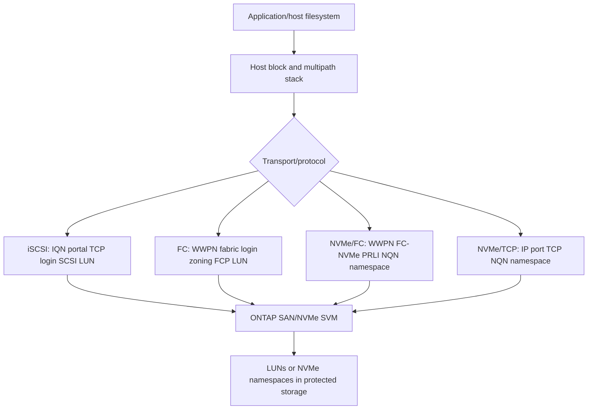

### Comparison

| Dimension | iSCSI | FC/FCP | NVMe/FC | NVMe/TCP |
|---|---|---|---|---|
| Host identity | Initiator IQN | Initiator WWPN | Host NQN plus WWPN | Host NQN plus IP context |
| Target identity | Target IQN and portal IP/port | Target WWPN | Subsystem NQN plus target WWPN | Subsystem NQN plus IP/port |
| Discovery/login | Static/SendTargets and iSCSI login | FLOGI/Name Server/PLOGI/FCP PRLI | FC login plus FC-NVMe PRLI/association | IP discovery/connect plus TCP/NVMe state |
| Fabric policy | VLAN/route/firewall | Zoning/VSAN/fabric | Zoning plus NVMe FC-4 visibility | VLAN/route/firewall |
| Object | SCSI LUN | SCSI LUN | NVMe namespace | NVMe namespace |
| Multipath state | MPIO/ALUA | MPIO/ALUA | NVMe multipath/ANA | NVMe multipath/ANA |
| Security orientation | IQN mapping, CHAP, network controls, supported encryption | Zoning plus mapping; management/security controls | Zoning plus subsystem/host NQN mapping | IP controls plus exact supported NVMe security |

---

## 2. Shared deployment and validation lifecycle

A protocol configuration is complete only when the application can use the intended block device under normal, degraded, recovery and supported lifecycle conditions.

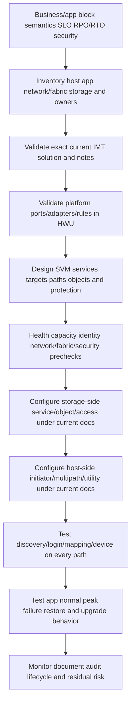

### Required gates

| Gate | Pass evidence | Stop condition |
|---|---|---|
| Application | Vendor supports storage model/version/consistency | Required certification absent or unclear |
| IMT | Exact host OS, protocol, adapter, driver, firmware, multipath, ONTAP solution and notes | Unlisted/unsupported component |
| HWU | Exact platform port/adapter/speed/topology support | Port/slot/topology mismatch |
| Health/capacity | Cluster/HA/local-tier/volume/path headroom healthy | Degraded protection or insufficient capacity |
| Security | Identities, secrets, zoning/network, admin and audit approved | Shared/default credentials or policy conflict |
| Ownership | Storage, host, fabric/network, app, protection and change owners named | No owner for filesystem/cluster/risk |
| Test | Representative normal/failure/restore criteria approved | No safe environment or rollback/stop plan |

### Evidence chain

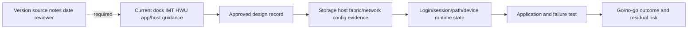

---

## 3. iSCSI service, portals, IQNs, discovery, and login

**Internet Small Computer Systems Interface (iSCSI)** carries SCSI commands in iSCSI Protocol Data Units (PDUs) over TCP/IP. ONTAP provides an SVM-scoped iSCSI target service and IP target portals through suitable data LIFs.

### Plain-English deep-dive: registered business, entrance, and phone call

The target IQN is the warehouse company's registered name. A portal is one street entrance with an IP address and TCP port. A session is the business relationship between initiator and target IQNs; a connection is one phone line. Discovery finds the business/entrances; login establishes the relationship; mapping grants the warehouse unit. **Why it matters:** a reachable portal or discovered target does not prove login, LUN authorization or MPIO.

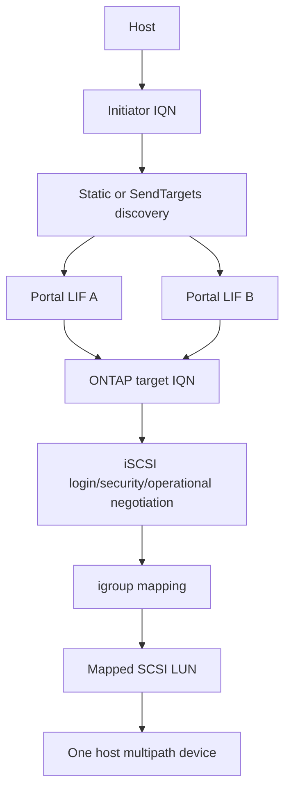

### Discovery and login sequence

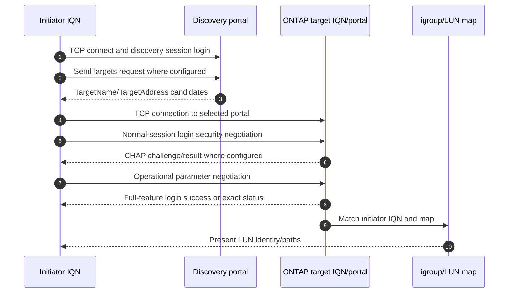

### iSCSI prerequisites

- Unique governed initiator and target IQNs.
- NFS/SMB-independent SAN SVM/iSCSI service state.
- Target LIFs on supported ports/VLANs/IPspaces/subnets with correct routes/firewalls/MTU.
- Independent host NIC/vSwitch/switch/target paths according to the validated design.
- CHAP identities/secrets where required, protected in host, automation, recovery and ONTAP contexts.
- Least igroup/LUN mapping and stable device identity.
- Supported host utility, MPIO/ALUA policy, queue/timeout and application configuration.

### CHAP orientation

```mermaid
sequenceDiagram
    autonumber
    participant I as Initiator CHAP identity/secret
    participant T as ONTAP target stored CHAP config
    I->>T: Login requests configured CHAP method
    T-->>I: Algorithm identifier and random challenge
    I->>I: Compute response from challenge and secret
    I->>T: CHAP name and response
    T->>T: Compute/compare expected response
    T-->>I: Success/failure; mutual CHAP adds reverse proof if supported
    Note over I,T: CHAP authenticates; it does not encrypt SCSI payload
```

No secret value belongs in logs, screenshots, code, shell history, a study artifact or an escalation pack.

---

## 4. iSCSI network design and validation

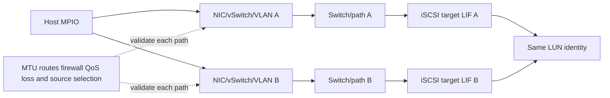

### Network checks

| Check | Evidence | Warning |
|---|---|---|
| Address/subnet/route | Actual source and return path | Management-context ping can use another route |
| VLAN/switch | Operational state, not config only | Link/LACP up can coexist with missing VLAN |
| Firewall | Exact original tuple/state/rule | TCP 3260 reachability is not iSCSI login |
| MTU/PMTUD | Every virtual/physical/failover hop | Small discovery can work while large data stalls |
| LACP/hash | Per-flow/member distribution | One TCP flow commonly uses one member |
| QoS/PFC | Queue/drop/pause/application evidence | Do not enable lossless features independently |
| Failure domains | NIC, switch, firewall, target node, power, change | Two IPs can share one failure |

### iSCSI validation ladder

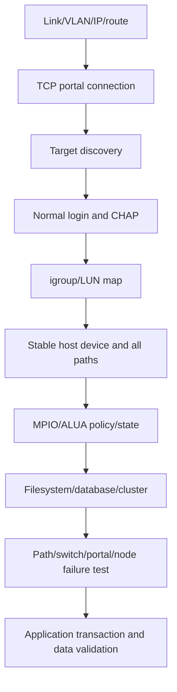

---

## 5. FC target ports, WWPNs, zoning, and fabric login

**Fibre Channel (FC)** uses WWPN identities, fabric services, zoning and FCP to carry SCSI commands. ONTAP target FC ports/LIFs register in each fabric; hosts need correct initiator WWPNs, zoning, target mapping and MPIO.

### Plain-English deep-dive: passports, airport gates, and permission lists

The host and storage target ports have WWPN passports. FLOGI checks into the airport and receives a temporary FC ID. The fabric Name Server is the flight directory. Zoning is the approved contact list. PLOGI/PRLI establish endpoint/protocol relationships. LUN mapping is the room key after arrival. **Why it matters:** physical link, fabric login, zoning, protocol login and LUN mapping are distinct stages.

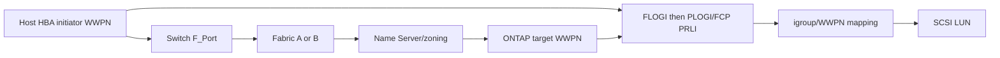

### FC login sequence

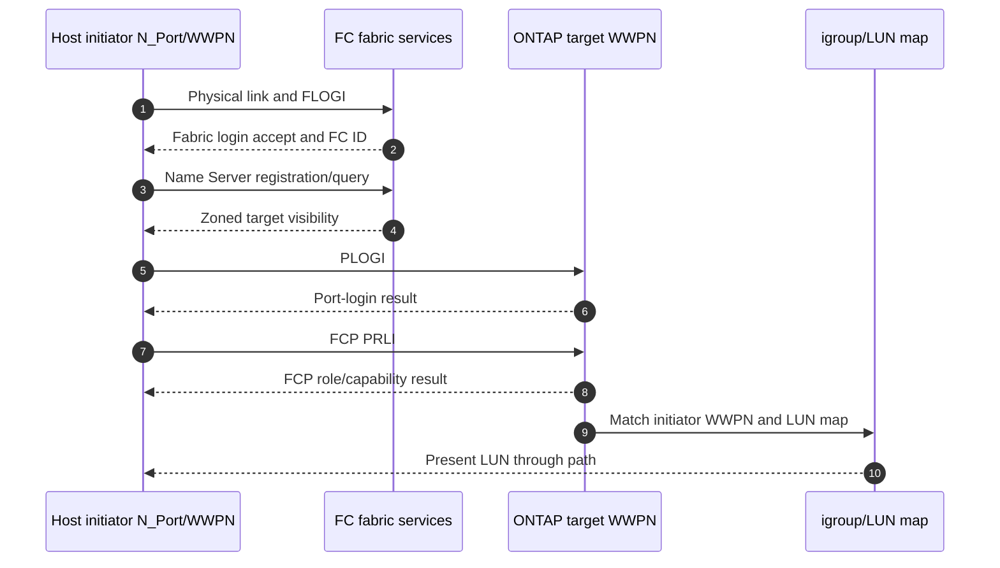

### Zoning inputs and controls

| Input | Required evidence |
|---|---|
| Host HBA port WWPN | Physical/NPIV source, host owner, adapter/driver/firmware |
| Target WWPN | SVM/port/node/fabric identity and current service state |
| Fabric/VSAN | Switch/domain/software/license/topology and owner |
| Alias/zone | Source-of-truth mapping and least initiator-target members |
| Active zoneset/config | What is operational now, not only proposed |
| LUN mapping | Separate igroup authorization after zoning |

Single-initiator zoning is a common isolation principle, but exact smart/peer-zone and scale guidance is switch/storage/vendor specific. Do not invent zone members or activate a fabric configuration from this guide.

---

## 6. FC path and physical validation

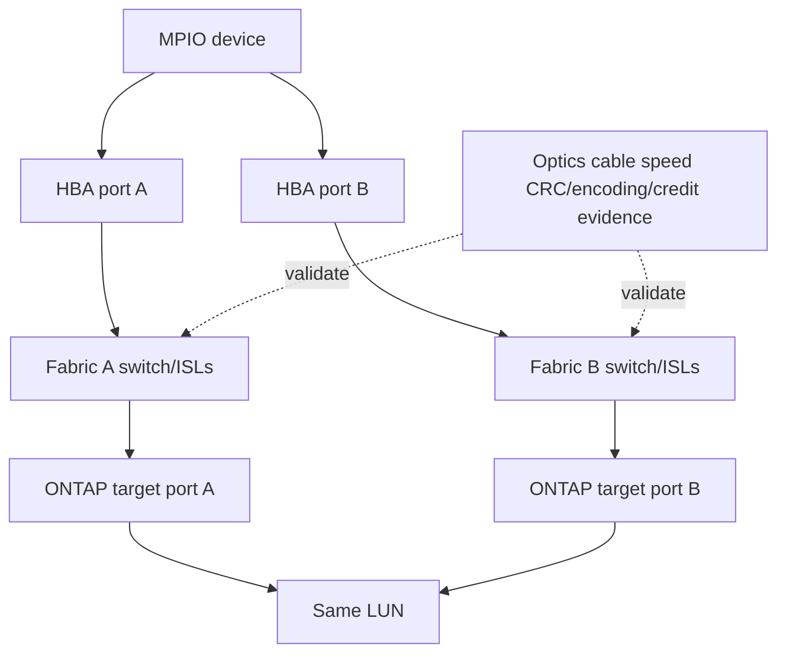

### FC evidence

- Operational port type/state, negotiated speed and attached WWPN.
- FLOGI/login database, FC ID, Name Server registration and FC-4 type.
- Active zoning/aliases and both fabrics.
- PLOGI/PRLI stage/status, RSCN timeline and target visibility.
- Optic Tx/Rx levels under exact vendor thresholds, CRC/encoding/loss-of-sync/reset counters and deltas.
- Buffer-credit wait, slow-drain, oversubscription/ISL and target/host queue evidence.
- MPIO/ALUA device and application behavior during each path/fabric failure.

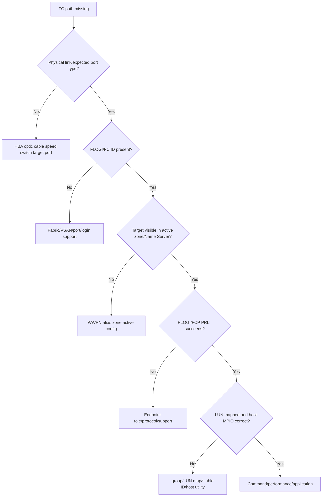

---

## 7. NVMe subsystems, namespaces, NQNs, and queues

**NVMe over Fabrics (NVMe-oF)** extends the NVMe host/controller/queue model over transports such as FC and TCP. ONTAP uses supported NVMe services, subsystems and namespaces. A **host NQN** identifies the host; a **subsystem NQN** identifies the storage subsystem; a subsystem maps permitted hosts to namespaces.

### Plain-English deep-dive: express service with named customers and queue pairs

The subsystem is an express warehouse service. NQNs are registered customer/provider names. A namespace is the numbered unit. Submission queues hold orders; completion queues return results. The FC or TCP transport carries those queue commands. **Why it matters:** queue count does not create performance by itself, and a visible subsystem does not grant namespace access.

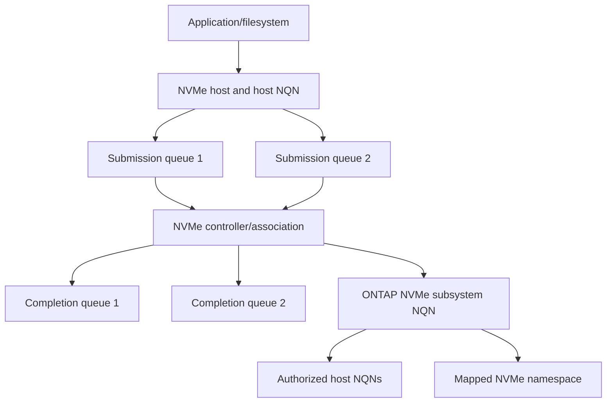

### Object distinctions

| Object | Meaning | Common mistake |
|---|---|---|
| Host NQN | Persistent host identity | Confusing with hostname/IP/WWPN |
| Subsystem NQN | NVMe storage service identity | Confusing with one target port |
| Controller | Host's interface/association to subsystem | Treating as physical controller only |
| Namespace | Block-addressable storage object | Calling it a file share/LUN ID without context |
| Namespace ID | Controller-context address | Treating it as the only stable identity |
| SQ/CQ | Submission/completion queue pair | Assuming more queues always improve latency |
| ANA | Asymmetric Namespace Access path characteristics | Mechanically mapping ALUA labels without host guidance |

---

## 8. NVMe/FC and NVMe/TCP lifecycles

### NVMe/FC

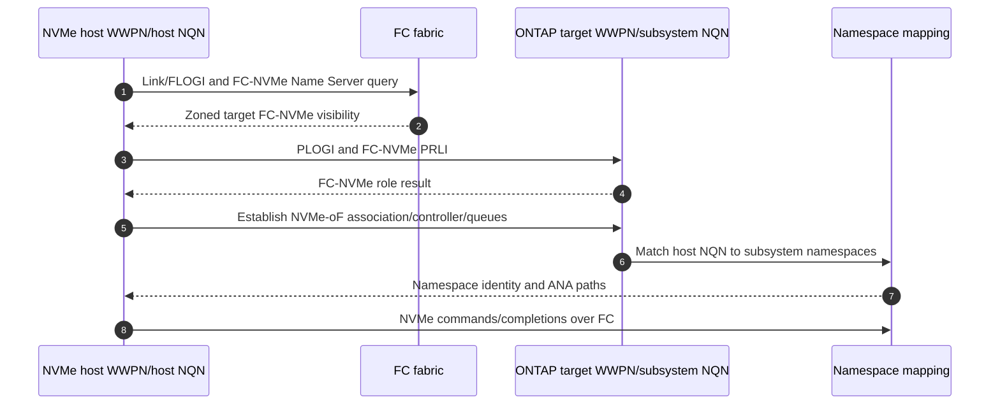

FCP visibility/zoning does not prove FC-NVMe Name Server registration or PRLI. Validate FC-4 type and host/storage support separately.

### NVMe/TCP

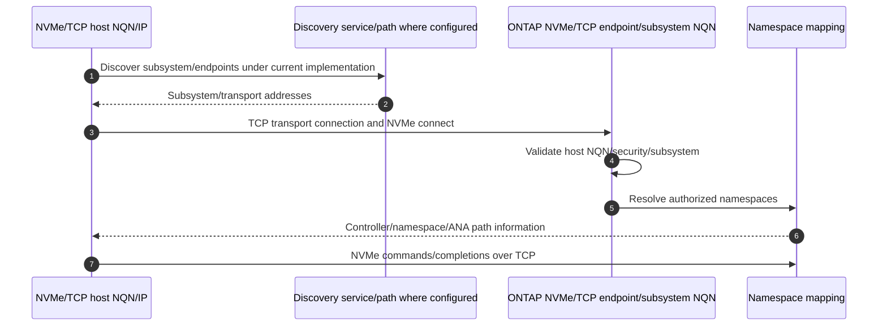

### Transport comparison

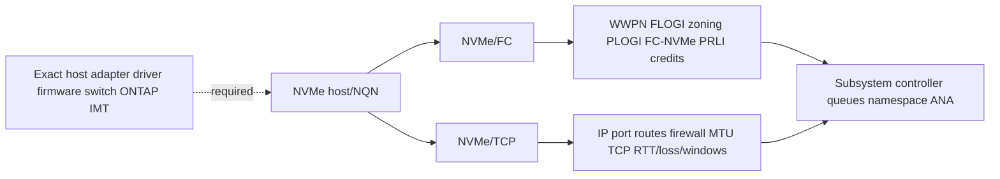

No universal claim is made that one transport is faster, simpler, more secure or more available. Measure workload, CPU/offload, network/fabric, paths, queues, security and failure behavior.

---

## 9. Port sets and target-path scoping orientation

ONTAP **port sets** are a SAN concept used in some SCSI LUN mapping designs to restrict which target ports/LIFs an initiator group can use for mapped LUN access. Exact protocol applicability, support, creation rules, relationship to selective LUN mapping and recommended use can change by release and platform.

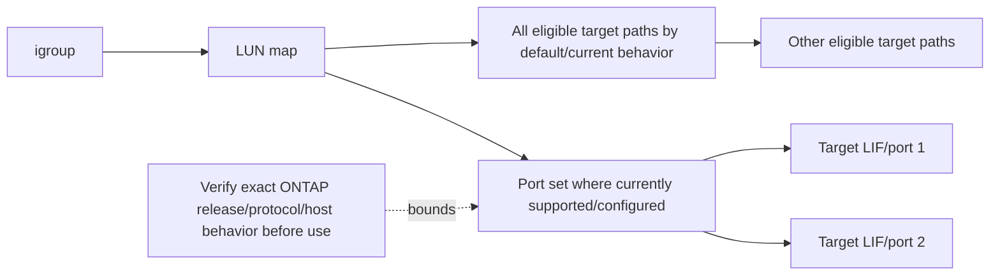

Port sets can reduce exposed target paths but can also remove redundancy or create asymmetric host views if designed incorrectly. Do not use them as a generic security or performance fix. Validate the complete MPIO topology, both fabrics/networks, host expectations, failover and current ONTAP guidance.

NVMe subsystem host/namespace mapping is a different access model; do not assume SCSI port-set semantics apply.

---

## 10. Host-side configuration, MPIO, ALUA, and ANA

Storage-side configuration is only half the solution. Host-side work includes supported initiator/HBA/NIC drivers/firmware, protocol service, Host Utilities, device handler/DSM, discovery, stable device identification, multipath policy, queues/timeouts, partitions/filesystems/database and application recovery.

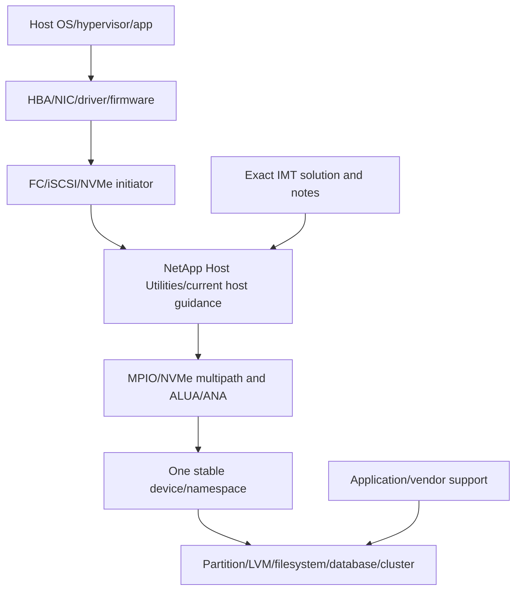

### Host-side checklist

- Record exact OS/kernel/hypervisor/application version.
- Record adapter model, slot, driver, firmware, option ROM/boot firmware where relevant.
- Install/use the exact supported Host Utilities/guidance and document changes/reboot.
- Confirm MPIO/DSM/device-handler/NVMe multipath policy and ALUA/ANA state.
- Verify all paths map to one stable device and intended target nodes/fabrics.
- Keep queue/timeout defaults/settings aligned with current host/app/NetApp guidance.
- Confirm clustered filesystems/PRs/fencing where multi-host access exists.
- Validate filesystem/database/application and protection after path changes.

### Path-state validation

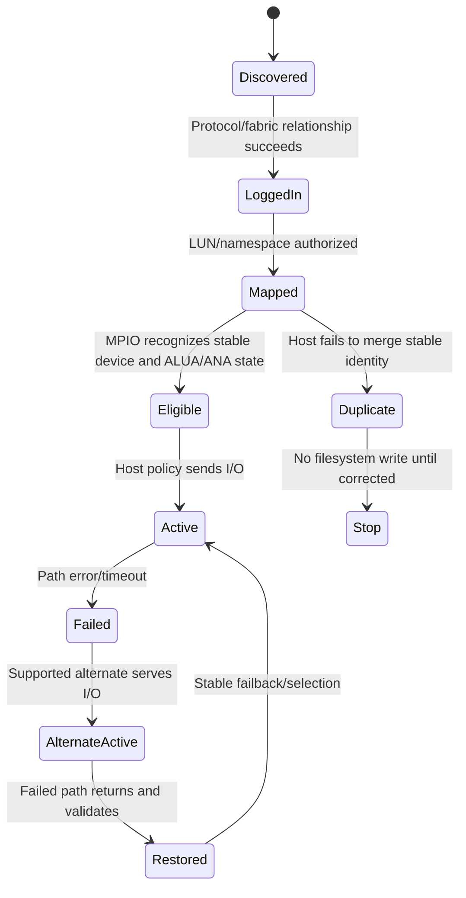

---

## 11. Security, performance, and operational evidence

### Security model

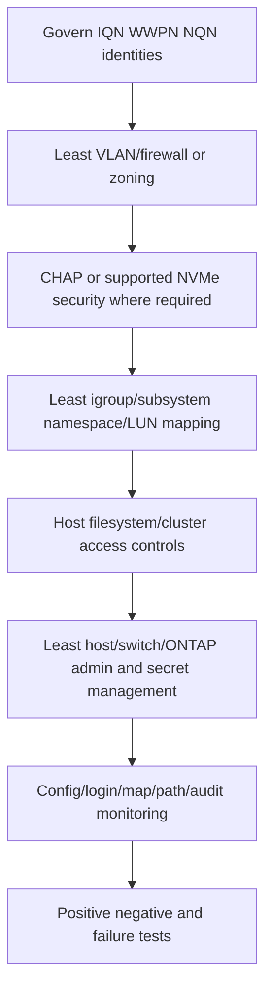

### Security caveats

- Zoning and VLAN segmentation are not encryption.
- CHAP authenticates shared-secret knowledge; it does not encrypt payload.
- TCP provides reliable bytes, not confidentiality.
- FC isolation is not a substitute for management-plane security and least mapping.
- NVMe security capabilities differ by transport/client/ONTAP release; verify exact current support.
- Packet/frame captures can contain customer data and authentication exchanges.

### Performance evidence

```mermaid
flowchart LR
    APP[App latency/concurrency] --> HOST[Host CPU queues/filesystem]
    HOST --> MP[MPIO/NVMe path queues/policy]
    MP --> TRANS[FC credits/errors or TCP RTT/loss/windows]
    TRANS --> TARGET[Target port/session/controller queues]
    TARGET --> OBJ[LUN/namespace/volume/WAFL]
    OBJ --> MEDIA[Local tier/RAID/media/capacity]
```

| Protocol | Performance-specific evidence |
|---|---|
| iSCSI | TCP RTT/loss/retransmission/window, PDU/session, MTU, NIC/vSwitch/switch queue |
| FC/FCP | CRC/encoding/link resets, BB-credit wait/slow drain, ISL/port/HBA queues |
| NVMe/FC | FC-NVMe login/association, queue/ANA, FC fabric credits/errors and host CPU |
| NVMe/TCP | NVMe/TCP connection/queue/ANA plus TCP/Ethernet/IP evidence |

More queues, paths or links do not guarantee higher application performance. Find the current bottleneck and test the full throughput-latency/error curve in normal and degraded states.

---

## 12. End-to-end validation matrix

```mermaid
flowchart TD
    T1[1 Identity and supportability] --> T2[2 Service/link/discovery]
    T2 --> T3[3 Login/FC relationship/connect]
    T3 --> T4[4 Map LUN/namespace]
    T4 --> T5[5 Stable host device and multipath state]
    T5 --> T6[6 Read/write and app correctness]
    T6 --> T7[7 Peak performance and capacity]
    T7 --> T8[8 Path/switch/port/node failure]
    T8 --> T9[9 Snapshot/restore and recovery]
    T9 --> T10[10 Upgrade/reboot/boot lifecycle]
    T10 --> T11[11 Normal-state and residual-risk proof]
```

### Protocol test matrix

| Test stage | iSCSI | FC/FCP | NVMe/FC | NVMe/TCP |
|---|---|---|---|---|
| Link/service | IP/VLAN/route/portal | HBA/switch/target link | FC link and FC-NVMe support | IP/VLAN/route/endpoint |
| Discovery | Static/SendTargets | Name Server/zoning | FC-NVMe Name Server | NVMe discovery path where used |
| Relationship | TCP/iSCSI login/CHAP | FLOGI/PLOGI/FCP PRLI | FLOGI/PLOGI/FC-NVMe PRLI/association | TCP/NVMe connect |
| Authorization | IQN/igroup/LUN map | WWPN/igroup/LUN map | Host NQN/subsystem/namespace | Host NQN/subsystem/namespace |
| Multipath | MPIO/ALUA | MPIO/ALUA | NVMe/ANA | NVMe/ANA |
| Failure | NIC/VLAN/switch/portal/node | HBA/fabric/ISL/target/node | HBA/fabric/target/controller | NIC/route/switch/endpoint/controller |
| Application | Filesystem/database/cluster transaction | Same | Same | Same |

### Acceptance criteria

- Expected device/namespace appears once with stable identity and every intended path.
- Unexpected hosts cannot discover/use mapped data.
- Representative reads/writes and application transactions meet correctness/SLO.
- One path/fabric/switch/target transition stays inside approved pause/error tolerance.
- Restored paths become stable without oscillation or unsupported policy.
- Snapshots/backups restore application state to measured RPO/RTO.
- Reboot/upgrade/maintenance returns to supported normal state.

---

## 13. Safe operational discovery and no-unverified-steps rule

Examples are conceptual, read-only placeholders. Verify exact ONTAP release, privilege, command/API schema and scope through current help/manuals before use.

```text
CONCEPTUAL ONLY - not a production recipe
<protocol-service-family> show -vserver <svm> -fields <documented-service-fields>
<target-lif-or-port-family> show -vserver <svm> -fields <documented-address-wwpn-state-fields>
<iscsi-session-family> show -vserver <svm> -fields <documented-iqn-portal-session-fields>
<fc-login-family> show -vserver <svm> -fields <documented-wwpn-fabric-login-fields>
<nvme-subsystem-family> show -vserver <svm> -fields <documented-nqn-host-namespace-fields>
<lun-or-namespace-family> show -vserver <svm> -fields <documented-stable-id-map-fields>
```

### No-unverified-steps decision

```mermaid
flowchart TD
    STEP[Proposed configuration/change step] --> DOC{Exact current official procedure?}
    DOC -->|No| STOP[Stop; identify owner/source/Support path]
    DOC -->|Yes| SUP{Exact IMT/HWU/app support and notes pass?}
    SUP -->|No| STOP
    SUP -->|Yes| PRE{Health capacity identity and rollback prechecks pass?}
    PRE -->|No| STOP
    PRE -->|Yes| OWNER{Authorized owner/change window?}
    OWNER -->|No| STOP
    OWNER -->|Yes| TEST[Stage/canary/execute and validate]
```

If a guide, blog, old runbook or remembered command conflicts with current official guidance, stop and resolve the discrepancy. Do not blend partial procedures across releases.

---

## 14. Failure modes and troubleshooting trees

### iSCSI tree

```mermaid
flowchart TD
    I[Expected iSCSI LUN/path missing] --> TCP{Portal TCP reachable on correct path?}
    TCP -->|No| NET[IP VLAN route firewall MTU target LIF]
    TCP -->|Yes| DISC{Expected target IQN/portal discovered?}
    DISC -->|No| DS[Discovery config/advertised address/stale entry]
    DISC -->|Yes| LOGIN{Normal login succeeds?}
    LOGIN -->|No| LOG[Stage/status IQNs CHAP parameters target state]
    LOGIN -->|Yes| MAP{IQN in igroup and LUN mapped?}
    MAP -->|No| M[igroup/map/LUN state]
    MAP -->|Yes| DEV[Host utility/MPIO/ALUA/stable device]
```

### FC/NVMe tree

```mermaid
flowchart TD
    F[FC or NVMe/FC path missing] --> LINK{Link/FLOGI/FC ID present?}
    LINK -->|No| PHY[HBA/optic/cable/switch/target port/VSAN]
    LINK -->|Yes| VIS{Expected FC-4 target visible through active zoning?}
    VIS -->|No| ZONE[WWPN alias/zone/Name Server/FCP vs FC-NVMe type]
    VIS -->|Yes| PRLI{PLOGI and correct PRLI succeed?}
    PRLI -->|No| ROLE[Endpoint protocol role/support/config]
    PRLI -->|Yes| OBJ{LUN/namespace authorization exists?}
    OBJ -->|No| ACCESS[igroup map or host-NQN subsystem mapping]
    OBJ -->|Yes| MP[MPIO/ANA/ALUA/device and app]
```

### NVMe/TCP tree

```mermaid
flowchart TD
    N[NVMe/TCP namespace/path missing] --> IP{Endpoint route/firewall/MTU/TCP works?}
    IP -->|No| NET[Host/VLAN/route/security/target LIF/port]
    IP -->|Yes| DISC{Subsystem endpoint discovered/configured?}
    DISC -->|No| D[Discovery service/config/address]
    DISC -->|Yes| CON{NVMe connect/controller succeeds?}
    CON -->|No| C[NQN/security/transport/version/target state]
    CON -->|Yes| MAP{Host NQN authorized to namespace?}
    MAP -->|No| S[Subsystem host/namespace mapping]
    MAP -->|Yes| ANA[ANA/multipath/queue/stable namespace/app]
```

### Common failures

| Failure | Unsafe assumption | Better evidence |
|---|---|---|
| iSCSI discovery works | LUN must be visible | Normal login, igroup/map and host device |
| FCP LUN works | NVMe/FC should work | FC-NVMe visibility/PRLI, NQN/subsystem mapping |
| All links up | Paths are independent/usable | End-to-end state and failure tests |
| CHAP succeeds | Data is encrypted/authorized to all LUNs | Mapping and separate transport security |
| Zone active | Correct target protocol/object accessible | Name Server, PRLI and mapping |
| More queues/paths | More app performance | Throughput-latency/error and bottleneck evidence |
| Port set reduces paths | Security/performance improves | Exact support, redundancy and host view test |
| One IMT screenshot | Solution is current forever | Exact query/notes/date and change revalidation |

---

## 15. TAM discovery, evidence, recommendations, and JD Mapping

### Discovery questions

1. Which application/host/cluster, data, protocol, SLO, RPO/RTO, security and change window are in scope?
2. Which ONTAP platform/release/SVM/services, target LIFs/ports/nodes and LUNs/namespaces serve it?
3. Which iSCSI IQNs/portals/discovery/login/CHAP, FC WWPNs/fabrics/zones/logins, or NVMe NQNs/subsystems/controllers/queues apply?
4. Which host OS/hypervisor, adapter, driver/firmware, Host Utilities, MPIO/ALUA/ANA, queue/timeouts and app guidance apply?
5. Which VLANs/routes/firewalls/MTUs/switches or FC VSANs/ISLs/optics/credits form every path?
6. Which igroups/maps/LUN IDs or subsystem host/namespace mappings and port-set behavior exist?
7. Which exact IMT solution/notes/date, HWU port/adapter facts and release/app docs pass or remain unverified?
8. Which capacity/protection/snapshot/backup/restore and failure-state headroom exist?
9. Which normal, peak, path, switch, port, node, restore, reboot and upgrade tests passed?
10. Who owns each storage, host, fabric/network, security, app, change and residual-risk decision?

### Minimum evidence pack

- Business/app/host/object/operation/error/impact and UTC timeline.
- Exact host OS/app/adapter/driver/firmware/Host Utilities/multipath and stable device identities.
- Every initiator-to-target path, switch/VLAN/route/zoning/MTU/optic/counter/common-fate detail.
- iSCSI discovery/login/CHAP/session/PDU; FC link/FLOGI/zoning/PLOGI/PRLI; NVMe discovery/connect/NQN/controller/queue/ANA state as applicable.
- SVM service, target LIF/port/node, igroup/map/LUN or subsystem/host/namespace and port-set evidence.
- LUN/namespace/volume/local-tier capacity/performance/protection/HA/events.
- Exact current official docs, IMT result and all notes/date, HWU facts, unknowns, actions/rollback and specialist ask.

### Recommendation model

```mermaid
flowchart TD
    EVID[Verified app host protocol path storage and support evidence] --> CONTEXT[Criticality security lifecycle and skills]
    CONTEXT --> RISK[Mechanism impact likelihood horizon confidence]
    RISK --> OPTIONS[Protocol host path security capacity options]
    OPTIONS --> ACTION[Owner prerequisites date rollback/stop]
    ACTION --> TEST[End-to-end normal failure restore upgrade validation]
    TEST --> RESID[Residual risk monitoring and review]
```

### Recommendation patterns

| Finding | Risk | Bounded recommendation | Validation |
|---|---|---|---|
| iSCSI path B advertises unreachable portal | MPIO path exists on paper but fails under loss | Correct supported portal/network design and discovery data | Both paths, large I/O, switch/portal failure |
| FC zones permit all hosts/all targets | Blast radius and accidental mapping exposure | Move to current vendor-approved least zoning in staged change | Expected logins/paths; prohibited visibility absent |
| NVMe/FC host has FCP zone but no FC-NVMe PRLI | Namespace path unavailable | Validate FC-NVMe host/storage/IMT and correct FC-4 zoning/roles | FC-NVMe association, namespace and ANA paths |
| Mixed host utility/driver versions | Path behavior/support differs across fleet | Standardize to exact approved solution with staged hosts | Per-host path/failure/app regression |
| Proposed port set removes node/fabric diversity | Restriction creates single point of failure | Redesign only under current supported use and host view | Named path/node/fabric loss with app I/O |

### JD Mapping

| JD responsibility | Part 31 contribution | Your factual bridge and gap |
|---|---|---|
| Understand environment | Maps protocol-specific host/network/fabric/target/object paths | Azure/network method transfers; ONTAP config unproven |
| Storage depth | Covers iSCSI, FC, NVMe identities/services and lifecycles | Conceptual/synthetic only |
| Risk/stability | Finds path, auth, zoning, mapping, support and failure gaps | critical-situation method transfers |
| Supportability | Makes IMT/HWU/app/current-doc gates mandatory | No customer/gated production result claimed |
| Recommendations | Requires owner-led no-unverified-step validation | Advisory/escalation strength |
| Service review | Reports path tests, lifecycle/security/performance and actions | Analytics/business-review strength |
| Escalation | Supplies protocol-stage identities/status and exact ask | Product/Engineering evidence discipline transfers |

---

## 16. Fully synthetic scenario: Fabrikam Analytics mixed-protocol rollout

> **Synthetic case:** Fabrikam Analytics, every host, identity, fabric, path, result and recommendation below is fictional. It is not a NetApp customer, internal workflow, IMT result, or your production work.

### Environment

- Existing Windows database hosts use FC/FCP.
- New Linux analytics hosts are proposed for NVMe/FC.
- A disaster-recovery test host uses iSCSI over two VLANs.
- One SAN SVM has FC and iSCSI services; a separate NVMe SVM/subsystem is proposed.
- The team copied old zones and host settings from an FCP-only runbook.
- The saved IMT evidence predates host kernel/HBA firmware changes.

```mermaid
flowchart TB
    WIN[Windows FCP hosts] --> FA[Fabric A]
    WIN --> FB[Fabric B]
    LINUX[Linux NVMe/FC hosts] --> FA
    LINUX --> FB
    DR[DR iSCSI host] --> VA[VLAN A]
    DR --> VB[VLAN B]
    FA --> FCT[ONTAP FCP target ports]
    FB --> FCT
    FA --> NVT[ONTAP NVMe/FC target ports/subsystem]
    FB --> NVT
    VA --> ISCSI[iSCSI target LIFs]
    VB --> ISCSI
    FCT --> LUNS[FCP LUNs]
    NVT --> NS[NVMe namespace]
    ISCSI --> DRLUN[DR test LUN]
```

### Timeline/evidence

```mermaid
sequenceDiagram
    autonumber
    participant H as Linux NVMe host
    participant F as Fabric B
    participant S as ONTAP NVMe subsystem
    participant D as DR iSCSI host
    participant P as iSCSI portals
    H->>F: FLOGI/PLOGI succeeds using old FCP zone membership
    H->>S: FC-NVMe discovery/PRLI absent on Fabric B
    S-->>H: No namespace path on B
    D->>P: SendTargets discovery through VLAN A
    P-->>D: Advertises portal B address
    D->>P: Login to portal B fails due missing route/MTU path
    Note over H,P: Two separate configuration defects; no shared storage failure proved
```

### Evidence

| Evidence | Observation | Bounded conclusion |
|---|---|---|
| Existing FCP hosts | FCP logins/LUNs healthy on both fabrics | Physical FC fabric broadly works for FCP |
| NVMe host Fabric A | FC-NVMe PRLI, association and namespace succeed | Host/subsystem mapping works on A |
| NVMe host Fabric B | WWPN link/FLOGI/PLOGI exists, FC-NVMe visibility/PRLI absent | FCP-oriented zone/config does not establish NVMe/FC path |
| iSCSI discovery | Portal B returned | Discovery works; advertised path usability unproved |
| iSCSI path B | Route/MTU mismatch blocks normal login/large data | Alternate network path defect |
| Host versions | Kernel/HBA firmware differ from saved IMT record | Must revalidate exact current solution |
| Storage objects | LUNs/namespace healthy from working paths | Weakens backing-storage failure hypothesis |

### Competing hypotheses

| Hypothesis | Evidence for | Disconfirming check |
|---|---|---|
| Fabric B physical failure | NVMe path missing | FLOGI/PLOGI and FCP work; inspect FC-NVMe FC-4 visibility |
| NVMe namespace not mapped | Host misses one path | Namespace visible on A; inspect subsystem mapping versus B transport stage |
| iSCSI CHAP failure | Login fails on B | TCP/route/MTU fails before CHAP stage |
| ONTAP controller overload | Two protocols show issues | Working paths/object service normal; defects are path-specific |
| Current solution supported | Old IMT screenshot exists | Re-run exact current query and read notes |

### Decision tree

```mermaid
flowchart TD
    TOP[Missing NVMe path and failed iSCSI path] --> SPLIT[Separate transport lifecycles]
    SPLIT --> FC[NVMe/FC Fabric B]
    SPLIT --> IP[iSCSI VLAN B]
    FC --> FLOGI{Link/FLOGI/PLOGI present?}
    FLOGI -->|Yes| FC4{FC-NVMe Name Server/PRLI present?}
    FC4 -->|No| Z[Validate current NVMe/FC support/zoning/target roles]
    FC4 -->|Yes| NQN[Subsystem NQN/host NQN/namespace/ANA]
    IP --> TCP{Route/firewall/MTU/portal TCP works?}
    TCP -->|No| NET[Correct complete IP path before CHAP/login]
    TCP -->|Yes| LOGIN[CHAP/normal login/igroup/map/MPIO]
    Z --> IMT[Refresh exact IMT/HWU/app evidence]
    NET --> IMT
    IMT --> TEST[Both fabrics/VLANs path failure and app validation]
```

### Recommendations

1. Stop using the FCP-only runbook as NVMe/FC evidence; validate the current Linux kernel/HBA/firmware/ONTAP NVMe/FC IMT solution and configure FC-NVMe visibility/roles through the exact approved workflow.
2. Network/storage owners should correct iSCSI VLAN B routing/MTU/firewall path before evaluating CHAP or mapping; validate discovery and large data separately.
3. Refresh every saved IMT/HWU record after host firmware/kernel changes and attach all notes to the change record.
4. Test FCP, NVMe/FC and iSCSI independently under member/fabric/VLAN/target-node failures, then validate the intended application/DR transaction.
5. Maintain separate evidence/action rows; one healthy storage object does not turn protocol path defects into one root cause.

### Customer-facing summary

> "The FCP estate is healthy, but its zone pattern does not prove NVMe/FC. On Fabric B the Linux host completes basic FC login yet never establishes FC-NVMe visibility/PRLI, while Fabric A succeeds. The iSCSI issue is separate: discovery advertises portal B, but its route/MTU path fails before CHAP. The saved interoperability evidence is stale after kernel/firmware changes. We recommend exact current IMT revalidation, protocol-specific path corrections and separate failure/application tests."

---

## 17. Your factual transfer and honest positioning

```mermaid
flowchart LR
    AZ[Azure/VM production context] --> STACK[Host network identity and layered ownership]
    WIN[Windows networking/support] --> IP[TCP routes firewalls drivers and evidence]
    CRIT[Critical situation/Product escalation] --> SAFE[Impact hypotheses safe stop and exact ask]
    BI[Analytics/business reviews] --> REVIEW[Path/support/lifecycle trends and actions]
    STACK --> SAN[Mixed-protocol synthetic method]
    IP --> SAN
    SAFE --> SAN
    REVIEW --> SAN
    SAN --> LAB[Future authorized protocol labs and SME review]
```

| Factual strength | Transfer | Explicit gap |
|---|---|---|
| Azure/VM/networking | Host/virtual/network/storage dependency maps | No ONTAP SAN service enablement |
| Windows support | TCP, drivers, identity, failover evidence | No FC zoning or NVMe host config claim |
| Critical situation/Product work | Scope, competing hypotheses, safety and escalation | No internal NetApp workflow/tool access claim |
| Analytics/reviews | Fleet version/support/path-test reporting | No production IMT/HWU result ownership |

### Honest answer

> "I understand the separate ONTAP configuration lifecycles for iSCSI, FC/FCP, NVMe/FC and NVMe/TCP, including IQNs/portals/CHAP, WWPNs/zoning/fabric login, NQNs/subsystems/namespaces/queues, host utilities, MPIO/ALUA/ANA, security, performance and end-to-end tests. My production experience is enterprise support, Azure/VM/networking and analytics, not NetApp SAN deployment. I would require exact current docs, IMT/HWU, authorized evidence and host/fabric/app/NetApp specialists before any implementation."

---

## 18. Whiteboard drills and paper lab

### Whiteboard drills

1. **Four paths:** iSCSI, FCP, NVMe/FC and NVMe/TCP to one block outcome.
2. **iSCSI:** IQN -> portal -> discovery -> login/CHAP -> igroup/map -> LUN.
3. **FC:** WWPN -> link/FLOGI -> Name Server/zone -> PLOGI/PRLI -> map -> LUN.
4. **NVMe:** Host NQN -> subsystem NQN -> controller/queues -> namespace.
5. **Transports:** FC credits/logins versus TCP routes/windows/retransmission.
6. **Port sets:** Path restriction can remove resilience; verify-current use only.
7. **Host:** Utility/driver/firmware -> MPIO/ANA/ALUA -> stable device -> app.
8. **Security:** Network/zoning + protocol auth + object mapping + admin controls.
9. **Validation:** Link -> relationship -> authorization -> device -> app -> failure -> restore.
10. **Honesty:** No current source/IMT/owner means stop, not improvise.

### Paper lab scenario

A fictional six-host estate deploys FCP, iSCSI, NVMe/FC and NVMe/TCP across two ONTAP clusters, four SAN SVMs, two FC fabrics, four Ethernet VLANs, mixed adapters/drivers/firmware, Host Utilities and applications. Existing plans contain copied commands, stale IMT screenshots, broad zones, shared CHAP secrets, incomplete NQN mappings, unknown port-set use and no failure tests.

### Tasks

1. Separate applications/data objects by required protocol and ownership.
2. Inventory all host/adapter/driver/firmware/switch/ONTAP/app versions.
3. Build exact IMT queries/notes and HWU port/adapter/topology records.
4. Map iSCSI IQNs/portals/discovery/login/CHAP/igroup/LUN paths.
5. Map FC WWPNs/FLOGI/Name Server/zones/PLOGI/PRLI/maps.
6. Map NVMe host/subsystem NQNs, transports, associations, queues, namespaces and ANA.
7. Audit port sets only against current supported use and path resilience.
8. Standardize host utility/multipath settings through exact current guidance.
9. Build security controls for identities, secrets, zoning/network, mappings and admin.
10. Characterize workload/queue/transport performance by protocol.
11. Inject adapter, switch, fabric/VLAN, target-port, node and path failures.
12. Test application data, snapshots/restores, reboot/upgrade and normal-state return.
13. Build separate troubleshooting/evidence packs for each protocol.
14. Write prioritized supportability and deployment recommendations.

```mermaid
flowchart LR
    INV[Inventory apps hosts protocols versions] --> VALIDATE[Current docs IMT HWU gates]
    VALIDATE --> MAP[Map identities services paths objects]
    MAP --> HOST[Validate host utilities and multipath]
    HOST --> SEC[Validate security and least access]
    SEC --> PERF[Measure performance/queues]
    PERF --> FAIL[Run staged failures/recovery]
    FAIL --> REC[Recommend and record residual risk]
```

### Lab pass criteria

- [ ] Protocol identities, discovery, login, mapping and objects remain distinct.
- [ ] FCP success is never used as NVMe/FC proof.
- [ ] iSCSI discovery is never used as path/login/LUN proof.
- [ ] NVMe namespace visibility requires host NQN/subsystem mapping and runtime state.
- [ ] Port-set behavior is current-doc bounded and failure-tested.
- [ ] Host Utilities/multipath settings match exact IMT notes.
- [ ] Security secrets are never exposed and no protocol is called encrypted without proof.
- [ ] Every test ends in an application outcome and normal-state check.
- [ ] No unverified command or synthetic result is called production guidance/evidence.

---

## 19. Self-test

1. Compare iSCSI, FCP, NVMe/FC and NVMe/TCP identities, transports and objects.
2. Draw the shared deployment lifecycle and mandatory gates.
3. Explain exact IMT/HWU/application evidence and stop conditions.
4. Trace iSCSI service, portal, IQN, discovery, login, CHAP, map and MPIO.
5. Map every iSCSI VLAN/route/firewall/MTU/failure dependency.
6. Trace FC target port, WWPN, FLOGI, zoning, PLOGI, FCP PRLI and map.
7. Interpret physical FC errors versus credit congestion.
8. Define NVMe host/subsystem/controller/queues/namespace/NQN/ANA.
9. Trace NVMe/FC and NVMe/TCP lifecycles separately.
10. Explain port sets only as current-release scoped path restrictions.
11. Build the complete host utility/MPIO/ALUA/ANA checklist.
12. Explain protocol-specific security and encryption caveats.
13. Map performance evidence and queue stacks by protocol.
14. Execute the end-to-end validation matrix on paper.
15. Apply all three troubleshooting trees.
16. Recreate Fabrikam's separate NVMe/FC and iSCSI path failures.
17. Build the minimum evidence pack and seven-part recommendation.
18. Complete all whiteboard drills and paper lab.
19. Explain the no-unverified-steps rule.
20. Deliver the No-production-NetApp boundary accurately.

---

## 20. Official Source Anchors

**Date checked: 2026-08-24.** These official public sources anchor ONTAP iSCSI, FC and NVMe configuration concepts. Exact supported transports, target endpoints, discovery, login, CHAP, zoning, port sets, NQNs, subsystems, namespaces, host utilities, MPIO/ALUA/ANA, security, commands and limits are release/platform/host/application sensitive. Re-open exact current docs, IMT/HWU and vendor guidance; no sequence here is an executable production runbook.

| Topic | Official public source | Bounded use and currency note |
|---|---|---|
| ONTAP SAN configuration | [ONTAP SAN configuration](https://docs.netapp.com/us-en/ontap/san-config/) | Current FC/iSCSI prerequisites/workflows; select exact release. |
| iSCSI configuration | [ONTAP iSCSI configuration](https://docs.netapp.com/us-en/ontap/san-config/iscsi-config-concept.html) | Current SVM/target/LIF/host setup orientation; exact steps require release docs. |
| FC configuration | [ONTAP FC configuration](https://docs.netapp.com/us-en/ontap/san-config/fc-config-concept.html) | Current target ports/zoning/host prerequisites; switch vendor guidance also required. |
| ONTAP SAN administration | [ONTAP SAN administration](https://docs.netapp.com/us-en/ontap/san-admin/) | LUNs, igroups, mappings, port sets and operations by exact release. |
| NVMe configuration | [ONTAP NVMe configuration](https://docs.netapp.com/us-en/ontap/san-admin/nvme-config-concept.html) | Current transport/subsystem/namespace guidance; host support exact-version sensitive. |
| Host Utilities | [NetApp Host Utilities](https://docs.netapp.com/us-en/ontap-sanhost/) | Select exact OS/protocol/release/utility and follow IMT notes. |
| IMT | [NetApp Interoperability Matrix Tool](https://imt.netapp.com/) | Official, potentially gated exact solution result, every note and date. |
| HWU | [NetApp Hardware Universe](https://hwu.netapp.com/) | Official, potentially gated exact platform/slot/adapter/port/speed/topology facts. |
| iSCSI standard | [RFC 7143 - iSCSI](https://www.rfc-editor.org/rfc/rfc7143) | Protocol standard; exact implementation features/security require host/target validation. |
| CHAP | [RFC 1994 - CHAP](https://www.rfc-editor.org/rfc/rfc1994) | Base challenge-response; iSCSI use and current algorithm policy require exact guidance. |
| FC standards | [INCITS T11](https://standards.incits.org/apps/group_public/workgroup.php?wg_abbrev=t11) | Normative standards/revisions can require access; switch/HBA implementations vary. |
| NVMe specifications | [NVM Express Specifications](https://nvmexpress.org/specifications/) | Select current Base/Fabrics/FC/TCP specs; implementation/support can differ. |
| Windows MPIO | [Microsoft MPIO overview](https://learn.microsoft.com/en-us/windows-server/storage/mpio/mpio-overview) | Exact DSM/policy/support remains vendor/version specific. |
| Linux multipath/NVMe | [Red Hat storage documentation](https://docs.redhat.com/en/documentation/red_hat_enterprise_linux/) | Select exact RHEL release and NetApp/IMT guidance. |
| Support | [NetApp Support Site](https://mysupport.netapp.com/) | Entitlement-dependent cases, knowledge, advisories and procedures. |

### Source-use discipline

- Record exact host/app, adapter/driver/firmware, switch, protocol, ONTAP/platform and date.
- Save the complete IMT solution and all notes; revalidate after any component change.
- Use HWU for exact port/adapter/slot/speed/topology facts, not host settings.
- Treat FCP and NVMe/FC as separate FC-4 support/configuration paths.
- Protect CHAP and other secrets; never include them in evidence packs.
- Use current host utilities/vendor procedures; stop when support or ownership is unclear.

---

## Likely Interview Questions

### Q1. How would you plan an ONTAP SAN protocol deployment?

> **Model answer:** "I start with the application block semantics, SLO/RPO/RTO/security and ownership. I inventory exact host/app/adapter/driver/firmware/switch/storage versions, validate the complete IMT solution and notes, use HWU for target hardware facts, and design independent paths, SVM services, identities, objects and protection. I configure only through current approved procedures, validate host utilities/multipath, then test discovery, authorization, stable device, application, path/node failure, restore and upgrade."

### Q2. Walk through iSCSI discovery and login on ONTAP.

> **Model answer:** "The host's initiator IQN reaches an ONTAP target portal LIF over a validated IP path. Static or SendTargets discovery supplies target IQN/portal candidates; a normal TCP connection then enters iSCSI security and operational login, including CHAP if configured, and reaches full-feature phase. ONTAP matches the initiator to an igroup/LUN map. The host then merges all presentations by stable device identity using supported MPIO/ALUA."

### Q3. Walk through an FC host-to-LUN path.

> **Model answer:** "The HBA initiator WWPN links to an FC switch F_Port, completes FLOGI and receives an FC ID. Name Server and active zoning expose the target WWPN. The endpoints complete PLOGI and FCP PRLI. ONTAP separately maps the initiator WWPN/igroup to a LUN. Host Utilities and MPIO merge paths into one stable device. I validate both fabrics, physical errors/credits, target-port state and application failure behavior."

### Q4. How do NVMe/FC and NVMe/TCP differ?

> **Model answer:** "Both use host/subsystem NQNs, controllers, queues, namespaces and ANA. NVMe/FC uses FC links, WWPNs, FLOGI, zoning, PLOGI, FC-NVMe PRLI and credit-controlled frames. NVMe/TCP uses IP endpoints, routes/firewalls/MTU and TCP connection/retransmission behavior before NVMe connect. I validate each transport independently; FCP success does not prove NVMe/FC and an open TCP port does not prove namespace authorization."

### Q5. What is a port set, and when would you use one?

> **Model answer:** "A port set is an ONTAP SCSI SAN concept that can restrict a mapped igroup/LUN to selected target ports or LIFs under supported releases/configurations. I would use it only for a documented current requirement because it can remove paths, create asymmetric host views or reduce node/fabric resilience. I validate protocol applicability, IMT/host expectations, every path and named failures. NVMe subsystem mapping is a separate model."

### Q6. How do Host Utilities and multipathing fit deployment validation?

> **Model answer:** "I select the exact Host Utilities or host guidance for the OS/protocol/ONTAP solution and read what it reports or changes. I validate adapter driver/firmware, DSM/device handler, MPIO or NVMe multipath policy, ALUA/ANA states, stable device identity, queue/timeouts and every path against IMT notes. Success means one correct device, expected paths and application behavior through a controlled failure, not merely that a utility is installed."

### Q7. What is your end-to-end test before declaring a SAN service ready?

> **Model answer:** "I prove support/identity, link/service, protocol relationship, least object authorization, stable host device and multipath state. I run representative read/write/application correctness, peak performance/capacity, each adapter/switch/fabric/target-node failure, path restoration, application-consistent backup/restore, reboot/upgrade and normal-state checks. I record measured pause/errors, owner, evidence and residual risk."

### Q8. How does your background transfer, and what remains a gap?

> **Model answer:** "My prior support, Azure/VM/networking, critical situation and analytics work gives me layered dependency, identity, path, evidence and customer-risk discipline. I understand iSCSI, FC and NVMe configuration architecture but have not enabled ONTAP services, zoned production fabrics, managed CHAP, created NVMe subsystems or qualified a NetApp production host. I would require current docs, IMT/HWU, authorized evidence and host/fabric/app/NetApp specialists."

---

## 30-Second Memory Hooks

- **One outcome, different roads:** SCSI LUN or NVMe namespace through distinct transports.
- **Deployment:** Requirements -> IMT/HWU -> design -> storage -> host -> path -> app tests.
- **iSCSI:** IQN + portal + discovery + login/CHAP + igroup/map.
- **CHAP:** Authentication, not encryption; protect every secret copy.
- **FC:** WWPN -> FLOGI -> Name Server/zone -> PLOGI/PRLI -> map.
- **FCP is not NVMe/FC:** Different FC-4 visibility and PRLI.
- **NVMe:** Host NQN -> subsystem NQN -> controller/queues -> namespace.
- **NVMe/FC:** FC login/credits; **NVMe/TCP:** IP/TCP route/retransmission.
- **Port set:** Current-doc SCSI path restriction; can reduce resilience.
- **Host Utilities:** Exact version guidance, not a universal tuning tool.
- **MPIO/ALUA/ANA:** One device, supported eligible paths and target route signs.
- **Security:** Fabric/network gate + protocol auth + least mapping + admin controls.
- **Performance:** More paths/queues are useful only when the workload uses them safely.
- **Readiness:** Ends with app, failure, restore and lifecycle tests.
- **No unverified steps:** Missing current procedure/support/owner means stop.
- **Your bridge:** Network/evidence rigor transfers; NetApp SAN deployment remains unclaimed.

---

## Completion Checklist

- [ ] Compare iSCSI, FCP, NVMe/FC and NVMe/TCP identities/transports/objects.
- [ ] Apply shared deployment lifecycle and every stop gate.
- [ ] Validate exact current IMT/HWU/application/host evidence.
- [ ] Trace iSCSI service, portals, IQNs, discovery, login, CHAP and maps.
- [ ] Validate every iSCSI network/failure path.
- [ ] Trace FC ports, WWPNs, FLOGI, zoning, PLOGI/PRLI and maps.
- [ ] Separate physical FC errors from credit congestion.
- [ ] Define NVMe NQNs, subsystem, controller, queues, namespaces and ANA.
- [ ] Trace NVMe/FC and NVMe/TCP independently.
- [ ] Use port sets only under exact current documented support.
- [ ] Validate host utilities, MPIO/ALUA/ANA and stable devices.
- [ ] Apply least security and secret-handling controls.
- [ ] Characterize protocol-specific performance and queues.
- [ ] Complete the end-to-end readiness/failure/restore/upgrade matrix.
- [ ] Use conceptual read-only discovery and no-unverified-steps rule.
- [ ] Apply all troubleshooting trees and build the evidence pack.
- [ ] Recreate Fabrikam without merging NVMe/FC and iSCSI defects.
- [ ] Complete whiteboard drills, paper lab, self-test and Q1-Q8 aloud.
- [ ] State the No-production-NetApp boundary and exact non-claim accurately.
- [ ] Recheck current docs, IMT/HWU and Support guidance before customer use.

---

*Next suggested section:* [Part 32 - FlexGroup, FlexCache, Qtrees, Quotas, and Large-Scale File Workloads](Part-32-flexgroup-flexcache-qtrees-quotas.md)