# Part 32 - FlexGroup, FlexCache, Qtrees, Quotas, and Large-Scale File Workloads

> **Section goal:** Learn how ONTAP handles large-scale NAS workloads through FlexGroup scale-out volumes, FlexCache distributed caching, qtree administrative subdivisions, and user/group/tree quota accounting. By the end, you should be able to explain constituents and placement, membership and rebalance concepts, cache origin/coherency/write modes, quota policy/rule/reporting behavior, large-file-count risks, protection/mobility tradeoffs, and a safe evidence-led troubleshooting or recommendation plan.

Covers index item **32** and maps directly to job-description responsibilities for storage/NAS depth, customer-environment discovery, capacity and performance analysis, risk mitigation, strategic workload advice, supportability, operational reviews, and escalation quality.

**Version caveat:** Exact feature behavior, limits, commands, and supported combinations must be verified against current official documentation and authorized evidence for the customer's release, platform, workload, and configuration.

Exact FlexGroup constituent counts/layout, supported platforms/tiers, size/file/qtree/snapshot/protection/move limits, automatic placement, expansion, rebalance behavior, FlexCache origin/cache topology, write modes, coherency, disconnected behavior, licensing, qtree/security-style behavior, quota types/targets/rules/thresholds/scanning/reporting, commands, and limits vary by ONTAP release, platform, feature, workload, and configuration. A **current-doc check** means reopening current official documentation for the exact release and configuration. Verify **Interoperability Matrix Tool (IMT)** where client/application combinations matter, **Hardware Universe (HWU)** for relevant platform/capacity facts, application guidance, and authorized evidence. This Part gives no memorized hard limit or unverified write-mode procedure.

> **No-production-NetApp boundary:** You do not claim production NetApp or ONTAP scale-out NAS experience. Every FlexGroup, constituent, cache, quota, file count, customer, metric, and result below is synthetic. Your factual experience is enterprise support, SharePoint/OneDrive data services, Azure/VM/networking, permissions, critical-situation ownership, analytics and customer communication. The explicit non-claim is: **you have not created or expanded a production FlexGroup, run a FlexGroup rebalance, deployed FlexCache or a write-back mode, created ONTAP qtrees/quota policies, initialized/resized quotas, or operated a high-file-count ONTAP namespace.**

---

## 1. Four tools for four different jobs

### Plain-English deep-dive: campus, branch library, departments, and budgets

- A **FlexGroup** is one campus presented as one address, with several constituent buildings holding content.
- A **FlexCache** is a branch library that caches content from an origin library closer to readers.
- A **qtree** is a department area inside a volume, useful for policy, security style and quota scope.
- A **quota** is the accounting/enforcement budget for a user, group or qtree tree.

**Why it matters:** adding a qtree does not add physical capacity; adding cache does not create an independent source of truth; and a larger FlexGroup does not automatically fix a metadata, network, client or application bottleneck.

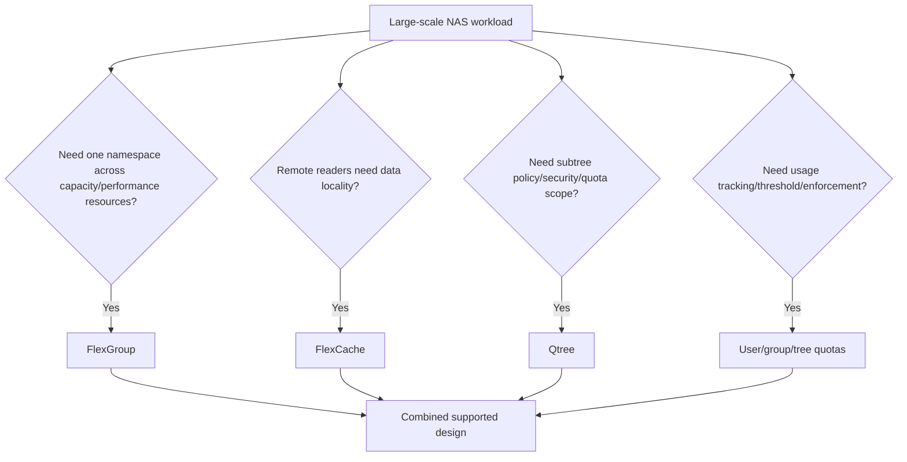

### Comparison

| Object | Main job | Client view | Source of truth |
|---|---|---|---|
| FlexVol | One flexible volume on one local tier | NAS path/volume | That FlexVol |
| FlexGroup | One scale-out volume composed of constituents | One logical namespace/path | FlexGroup across constituents |
| FlexCache | Caches origin data closer to consumers | Cache namespace/path | Origin relationship under exact mode/coherency |
| Qtree | Logical subtree/admin boundary inside a volume | Directory-like path | Parent volume data |
| Quota | Tracks/enforces usage by target | Usually invisible until warning/limit | Quota policy/accounting state |

---

## 2. FlexGroup architecture and constituents

A **FlexGroup volume** is a scale-out NAS volume composed of multiple **constituent volumes** distributed across eligible cluster resources. Clients see one volume/namespace; ONTAP places files and manages the constituent details under its architecture.

### Plain-English deep-dive: one hotel, many wings

Guests book one hotel address. The hotel assigns each new room reservation to a suitable wing. A guest's room remains in that wing even though the lobby is unified. More wings can increase total room and service capacity, but elevators, reception, roads and one overcrowded wing can still matter. **Why it matters:** the FlexGroup is the management/client object; constituents explain physical capacity/performance/failure distribution.

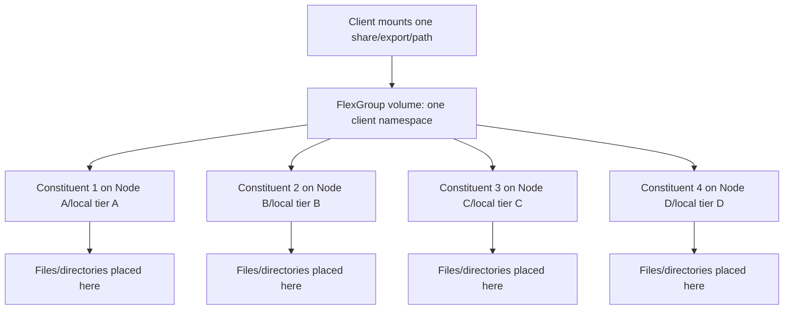

### Architecture terms

| Term | Plain meaning | Evidence question |
|---|---|---|
| FlexGroup | Top-level scale-out volume | Which SVM/path/policies/workloads use it? |
| Constituent | Internal FlexVol-like member of FlexGroup | Which node/local tier, capacity and health? |
| Placement | ONTAP decision for new file/directory data among constituents | Is distribution healthy for current release/workload? |
| Membership | Constituent set forming the FlexGroup | What changed, when and under which supported workflow? |
| Expansion | Adds eligible constituent capacity/resources | Does target capacity/performance/protection support it? |
| Rebalance | Supported redistribution capability/process under current docs | Which data/workload is eligible and what impact/limits apply? |

### Physical-to-logical map

```mermaid
flowchart LR
    PATH[/engineering/projects] --> FG[FlexGroup engineering]
    FG --> DIR[Directory/file namespace]
    DIR --> FILEA[File A]
    DIR --> FILEB[File B]
    FILEA --> CA[Constituent A]
    FILEB --> CB[Constituent B]
    CA --> LTA[Local tier/node A]
    CB --> LTB[Local tier/node B]
    SNAP[FlexGroup Snapshot/protection policy] -.applies under current behavior.-> FG
```

Constituents are not separate client shares to manage independently unless current documentation explicitly defines an operational task. Avoid direct constituent actions from generic FlexVol habits.

---

## 3. Placement, scale, membership, expansion, and rebalance

ONTAP automatically places new content across constituents according to the running release's FlexGroup algorithms and available resources. Placement is not a simple round-robin promise and existing content does not necessarily redistribute merely because capacity was added.

### Placement lifecycle

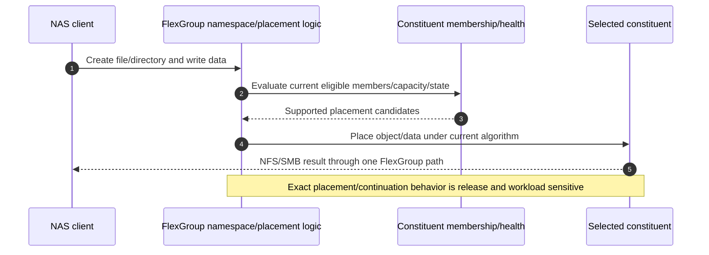

### Growth lifecycle

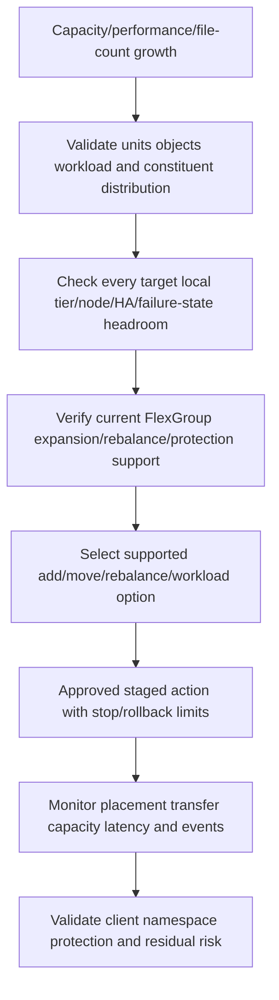

### Expansion questions

- Is the current FlexGroup layout supported for the target ONTAP release and platform?
- Which nodes/local tiers/failure domains receive new constituents?
- Do destination local tiers have capacity, performance, Snapshot/protection and failure-state headroom?
- Does expansion preserve or improve balance, or add capacity only to a subset?
- Which client/application/protection operations overlap with the change?
- What exact limits and prerequisites apply **today**? Record source/date rather than a number from memory.

### Rebalance orientation

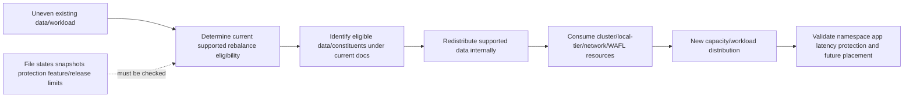

Rebalance is not a universal repair for a hot file, one busy client, directory lock contention, full local tier, or external network bottleneck. State the exact imbalance and mechanism first.

### Placement evidence

| Evidence | Can support | Cannot prove alone |
|---|---|---|
| Constituent physical use | Capacity distribution | File-operation latency cause |
| Files/inodes by constituent | Object-count distribution | Workload intensity or client impact |
| Per-constituent workload | Hot member/path candidate | Whether application can be rebalanced safely |
| Node/local-tier metrics | Shared-resource contention | FlexGroup placement as root cause without correlation |
| New-file distribution | Current placement behavior | Historical content balance or future guarantee |

---

## 4. FlexGroup namespace, files, qtrees, and limits

FlexGroup presents a single namespace. Files/directories can be distributed internally while clients use normal NFS/SMB semantics supported for that release. Some FlexVol features have different FlexGroup support, limits or operational behavior.

```mermaid
flowchart TB
    ROOT[FlexGroup root] --> D1[/team-a]
    ROOT --> D2[/team-b]
    ROOT --> D3[/archive]
    D1 --> F1[Millions of small files]
    D2 --> F2[Large design files]
    D3 --> F3[Cold project data]
    D1 --> QT1[Qtree if currently supported/used]
    D2 --> QT2[Qtree if currently supported/used]
    LIMIT[Current release volume/file/qtree/snapshot/security/protection limits] -.bounds.-> ROOT
```

### Verify-current limit categories

- Maximum and recommended FlexGroup/constituent scale and supported topology.
- Volume/constituent size and member-expansion behavior.
- File/inode counts, maximum file size and directory characteristics.
- Qtree count/features and security styles.
- Snapshot, clone, replication, backup, antivirus/scanner and NDMP-like workflow support.
- Volume move, aggregate relocation, constituent placement and upgrade behavior.
- NFS/SMB/multiprotocol and application/client support.

No hard number in this Part is a design limit. Record exact ONTAP release, object type, feature, page/tool, date and applicable notes.

---

## 5. FlexCache origin and cache architecture

**FlexCache** creates a cache volume associated with an **origin volume**. It places frequently accessed data closer to clients and can reduce distance/latency or origin/network load for suitable workloads. The origin remains the authoritative relationship according to the exact supported mode.

### Plain-English deep-dive: branch library and central archive

The origin is the central archive. FlexCache is a branch library that stores nearby copies of requested books. Readers get a local copy when valid; the branch coordinates changes and invalidation with the origin. If the link breaks, what remains readable/writable depends on the exact supported mode and state. **Why it matters:** cache locality is not an independent backup or automatically safe disconnected writer.

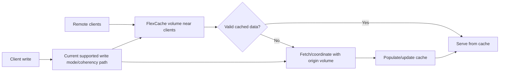

### Origin/cache relationship

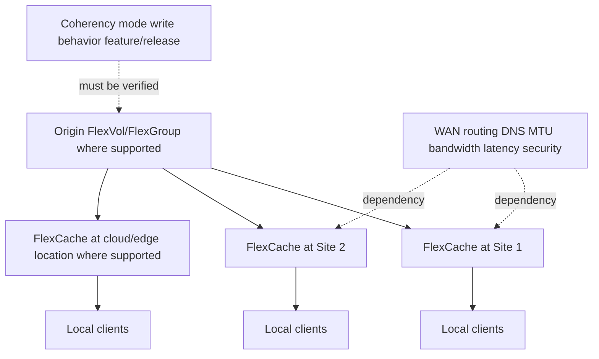

### FlexCache terminology

| Term | Plain meaning | Risk question |
|---|---|---|
| Origin | Authoritative source volume/relationship | Is it available, protected and sized for aggregate demand? |
| Cache volume | Local cached representation | Which clients, site, capacity and failure domain? |
| Cache hit | Valid content served locally | What operation/population defines hit? |
| Cache miss | Content fetched/coordinated with origin | Is WAN/origin latency controlling? |
| Coherency | Rules keeping clients from using invalid versions | What happens on write, recall/invalidation or disconnect? |
| Write mode | Supported path for writes under exact release/config | Is write-back or origin-directed behavior supported here? |

---

## 6. FlexCache coherency and write modes

Traditional FlexCache designs and newer ONTAP releases can differ in how writes are handled. Official documentation can describe origin-directed/write-around-like behavior and, in eligible newer configurations, write-back capabilities. Availability, protocol, workload, consistency, disconnected behavior, licensing and operational procedures are version-sensitive.

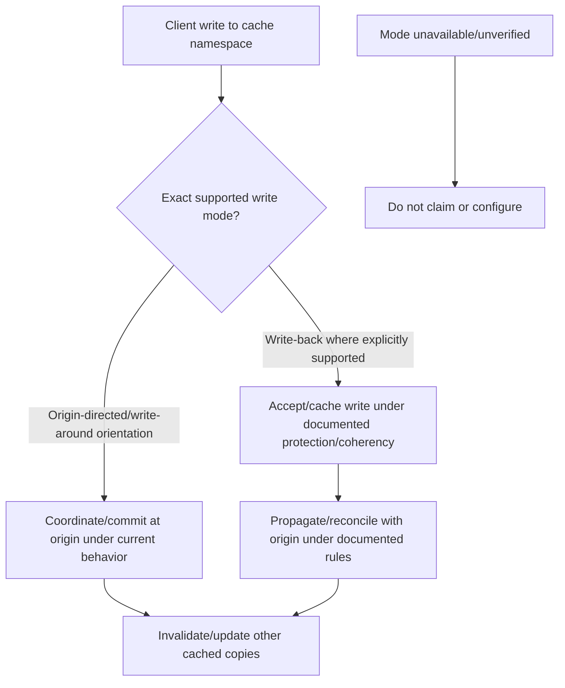

### Coherency sequence

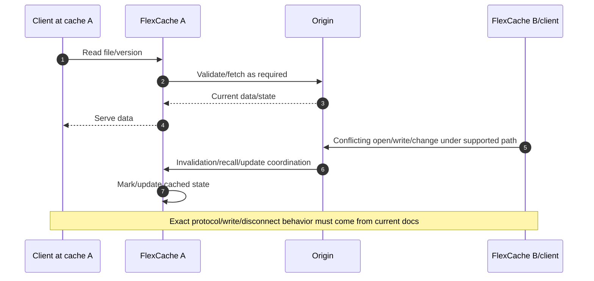

### Write-mode questions

1. Which ONTAP release and origin/cache volume types support the intended mode?
2. Which NFS/SMB versions and applications are supported?
3. What acknowledgment/durability and origin-propagation contract applies?
4. What happens during WAN/origin/cache-node failure or disconnection?
5. How are conflicts, locks, leases, permissions and multiprotocol identities handled?
6. Which capacity, Snapshot, protection and recovery controls cover unpropagated or cached data?
7. What monitoring proves backlog/coherency/health and what is the stop threshold?

Do not enable or recommend write-back from the phrase alone. Use the exact current feature guide, release notes, IMT/application support and a failure/recovery lab.

---

## 7. FlexCache performance, capacity, and availability

### Read path

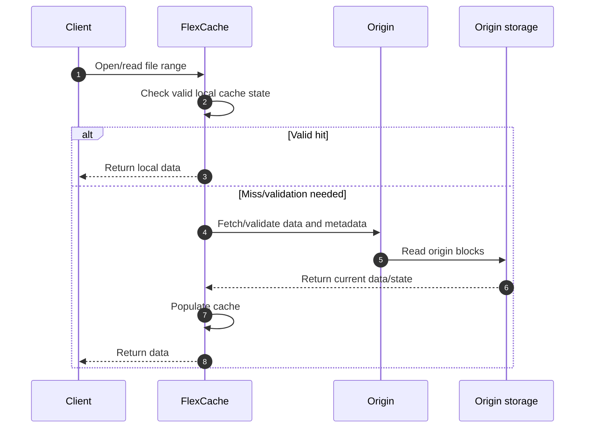

### Performance evidence

| Metric | Question | Caveat |
|---|---|---|
| Hit/miss ratio | Which eligible operation population? | High hit does not prove metadata/write performance |
| Hit latency | Does local path meet SLO? | Client/cache node/network can still dominate |
| Miss/origin latency | Is WAN/origin service controlling? | First access differs from warm-cache behavior |
| Origin load | Did cache reduce or amplify origin demand? | Many caches and validations can add work |
| Cache capacity/eviction | Does working set fit and remain useful? | Churn can reduce benefit |
| Write propagation/backlog | Is current mode healthy? | Exact field/meaning is release-sensitive |

### Failure domains

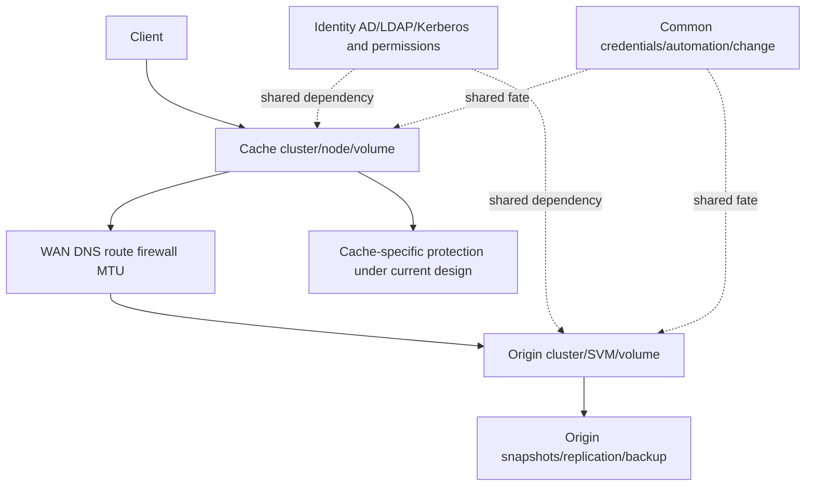

A cache outage, origin outage and WAN partition have different behaviors. Test them separately with current supported write/read modes and application expectations.

---

## 8. Qtrees: administrative subtrees inside a volume

A **qtree** is a logical subtree inside a FlexVol or supported FlexGroup context. It can be a quota target and can have security-style or export/share relationships under exact ONTAP behavior. It does not reserve separate local-tier devices or guarantee performance isolation.

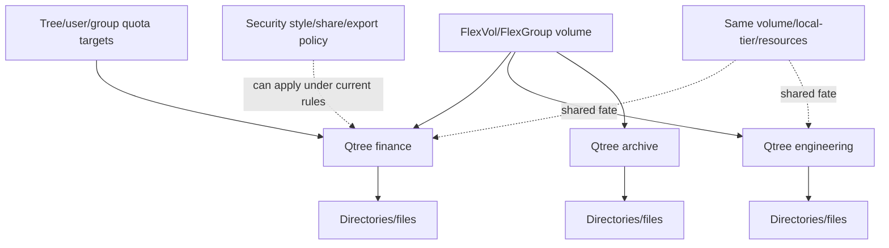

### Qtree questions

- Why is a qtree needed: quota target, administrative delegation, security style, share/export boundary or reporting?
- Which volume/FlexGroup and namespace path contains it?
- Which NFS export/SMB share/file security and multiprotocol mapping apply?
- Which user/group/tree quota rules apply directly or through inheritance/derived behavior?
- Does the application support moving data into/out of the qtree and changing identifiers?
- What current qtree count/feature/protection/move limits apply?

Moving or renaming qtrees/data can change quota targets, paths, security inheritance, client handles, backup jobs and application assumptions. Use current procedures and tests.

---

## 9. Quota architecture: user, group, and tree

ONTAP quotas can track and, under configured rules, limit resource usage. Common targets are users, groups and qtrees (tree quotas). Exact policy/rule fields, target naming, inheritance/derived quotas, files-versus-space accounting, threshold behavior and activation workflows vary.

### Plain-English deep-dive: meters, warning lines, and circuit breakers

A quota system is a utility meter. A soft threshold is a warning line; a hard limit is a circuit breaker that can reject further allocation. A tree quota meters one department, a user quota one person, and a group quota a team. **Why it matters:** quotas manage logical policy usage, not physical local-tier capacity, and a rejected write can be quota enforcement even when the volume has free space.

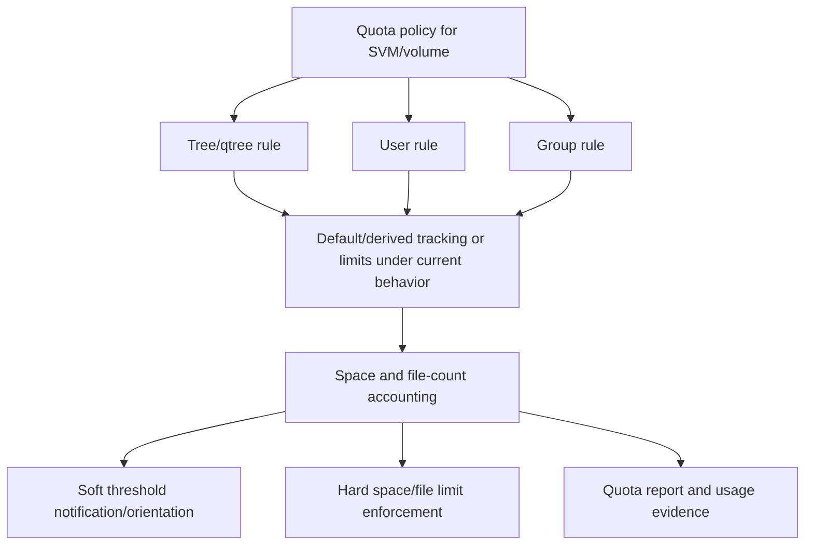

### Quota types

| Target | Tracks/limits | Identity dependency | Common use |
|---|---|---|---|
| Tree/qtree | All files attributed to a qtree tree | Qtree identity/path | Department/project boundary |
| User | Files/space charged to a UID/user identity | Unix/Windows mapping and ownership | Personal usage control |
| Group | Files/space charged to group rules | Group identity/membership/ownership semantics | Team accounting where supported |
| Default rule | Broad rule producing derived targets under current behavior | Consistent identity and rule scope | Avoid one explicit rule per user/group |

### Accounting path

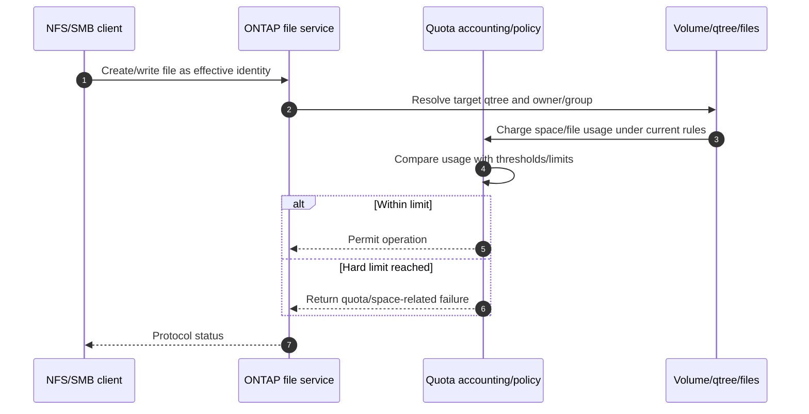

### Soft and hard orientation

- **Hard limit:** enforcement boundary; new allocation/file creation can fail when reached under exact semantics.
- **Soft limit/threshold:** warning or management threshold; behavior/notifications depend on current implementation.
- **Disk/space limit:** usage bytes/blocks under quota accounting.
- **File limit:** number of files charged to target.
- **Grace period:** common filesystem concept but exact ONTAP quota support/semantics must be verified; never assume.

---

## 10. Quota policies, rules, activation, resize, and reporting

Quota rules are stored in a policy associated with the SVM/volume context. Enabling or changing quota enforcement can require an initialization/on operation or a supported resize/update workflow. Exact terms/commands and online behavior are release-sensitive.

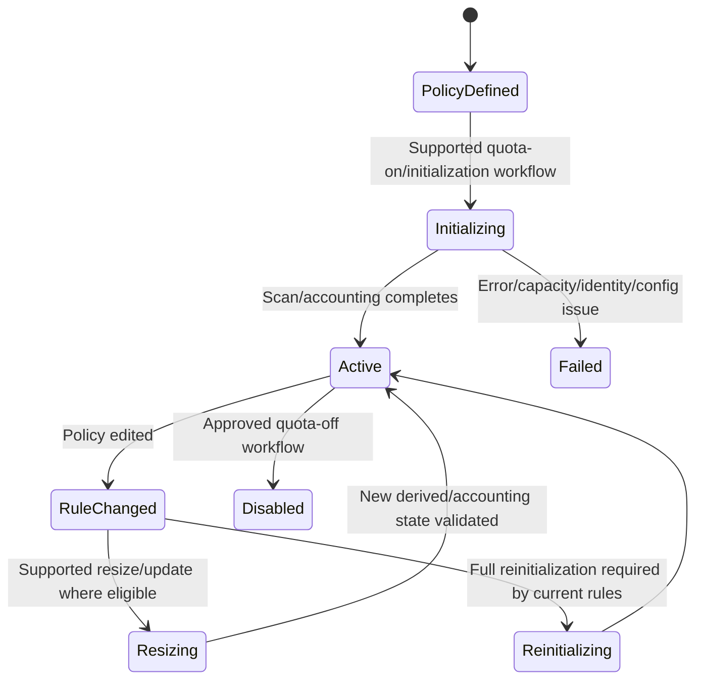

### Reporting fields

| Field | Question |
|---|---|
| Volume/qtree target | Which tree/accounting boundary? |
| Quota type | Tree, user, group, default/derived? |
| Target identity | UID/GID/SID/name and mapping source? |
| Used space/files | Current charged amount and timestamp? |
| Hard/soft thresholds | Which configured or derived limit? |
| Status/initialization | Is accounting active, scanning, stale, failed or disabled? |
| Rule origin | Explicit or derived from default? |

### Quota evidence flow

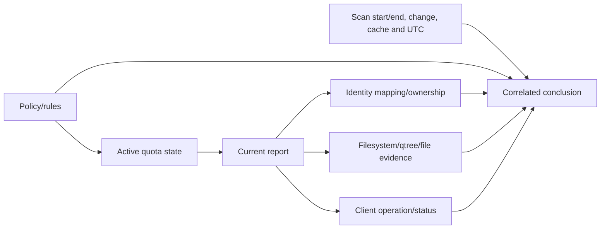

Do not delete/recreate quota rules or disable quotas to clear a client error before preserving the active report, rule/derived origin, identity, exact operation and business policy.

---

## 11. Large-scale file workloads

Large-scale NAS design is driven by more than bytes. Characterize file count, size distribution, directory shape, operation mix, concurrency, namespace scans, working set, change rate, retention, identity, locks and recovery.

### Workload fingerprint

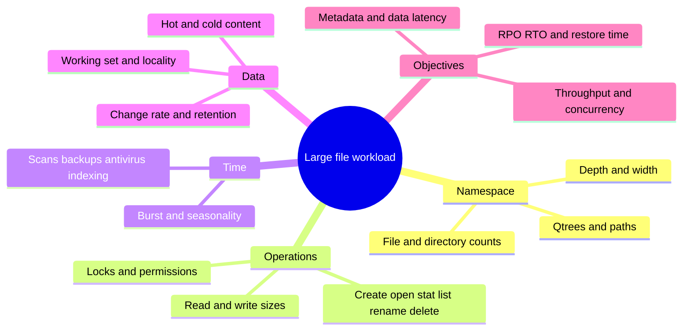

### Small files versus large files

| Workload | Primary risks | Misleading metric |
|---|---|---|
| Millions/billions of small files | Metadata CPU/cache, directory lookup, inode/file limit, scans, backup/restore time | Total throughput or average file size |
| Large sequential files | Sustained path throughput, capacity/retention, parallel streams | Tiny-I/O IOPS |
| Mixed collaborative tree | Locks, permissions, rename/open, client caches and hot directories | Aggregate volume latency |
| Software builds | High create/stat/delete concurrency and small files | Capacity alone |
| Media/AI corpus | Large namespace plus read throughput, cache locality and lifecycle | One warm-cache benchmark |

### End-to-end large-scale path

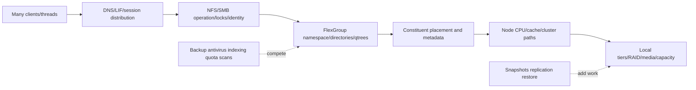

### File-count and restore risk

- Byte capacity can be low while inode/file-object capacity approaches a current limit.
- Backup and restore elapsed time can be dominated by namespace enumeration.
- Quota initialization/recalculation can scan substantial metadata.
- Directory hotspots and serialized application operations can limit performance despite distributed constituents.
- Protection support and transfer behavior can differ by feature/release and scale.

Use current official limits and representative full-scale tests; no universal `files per directory` or `files per FlexGroup` number is safe from memory.

---

## 12. Protection, moves, upgrades, and lifecycle

```mermaid
flowchart TD
    DATA[FlexGroup/FlexCache/qtree/quota workload] --> SNAP[Snapshot policy and capacity]
    DATA --> REPL[Replication/backup relationship]
    DATA --> RESTORE[File/volume/application recovery]
    DATA --> MOVE[Constituent/volume/cache/origin mobility under support]
    DATA --> UPGRADE[ONTAP/client/app lifecycle]
    SNAP --> TEST[Current feature support and recovery tests]
    REPL --> TEST
    RESTORE --> TEST
    MOVE --> TEST
    UPGRADE --> TEST
```

### Protection questions

- Does the current ONTAP release support the intended Snapshot, replication, backup, clone and retention features for this volume type/scale?
- Is protection relationship-aware at FlexGroup level rather than treating constituents independently?
- What changed-block/file-count/transfer concurrency and destination capacity affect RPO?
- Can individual files, qtrees or full namespace be restored under required RTO?
- How are FlexCache origin/cache data and any supported write mode protected/recovered?
- Do quotas/security styles/identity mappings remain correct after restore?

### Move/upgrade cautions

- FlexGroup members, layout, expansion/rebalance and moves have feature/release constraints.
- FlexCache origin/cache relationship and write behavior can constrain upgrades or outages.
- Qtree path/security/quota identity can change during data migration.
- Client NFS/SMB versions and applications must remain supported after upgrade.
- Test failure/recovery and performance at representative namespace scale, not only a small pilot.

---

## 13. Safe operational discovery

Examples are conceptual read-only placeholders; verify exact ONTAP release, privilege, help/manual/API fields and authorization.

```text
CONCEPTUAL ONLY - not production commands
<flexgroup-command-family> show -vserver <svm> -fields <documented-membership-capacity-state-fields>
<constituent-or-workload-family> show -fields <documented-node-tier-files-performance-fields>
<flexcache-command-family> show -fields <documented-origin-cache-mode-health-fields>
<qtree-command-family> show -vserver <svm> -volume <volume> -fields <documented-path-security-fields>
<quota-policy-rule-family> show -vserver <svm> -volume <volume>
<quota-report-family> show -vserver <svm> -volume <volume> -fields <documented-target-usage-limit-fields>
```

### Discovery sequence

```mermaid
flowchart TD
    SCOPE[Business workload path operation symptom time] --> TYPE[FlexGroup FlexCache qtree quota objects]
    TYPE --> TOPO[Map SVM LIF namespace origin/cache constituents nodes/tiers]
    TOPO --> POLICY[Read protection security quota/cache policies and current state]
    POLICY --> WORK[Measure file counts distribution operations capacity and latency]
    WORK --> DEP[Map clients identity WAN scans backups moves upgrades]
    DEP --> SUP[Validate exact current docs IMT/HWU limits/features]
    SUP --> HYP[Rank placement cache quota identity path and storage hypotheses]
    HYP --> PLAN[Approved test/action only]
```

### Evidence quality

- Use FlexGroup/cache/qtree/quota stable identities, not display names alone.
- Record constituent/node/local-tier mapping and ONTAP/platform release.
- Preserve raw byte/file counts, unit definitions, timestamps and scan/report state.
- Segment client operation type, LIF/node/constituent, cache hit/miss and background work.
- Record quota rule versus active derived/report state and identity source.
- Label every current limit/feature with official source/date and access status.

---

## 14. Failure modes and troubleshooting decision tree

### Common failure modes

| Symptom | Candidate causes | Discriminating evidence |
|---|---|---|
| FlexGroup low space despite free cluster capacity | One/more constituents/local tiers, snapshots, placement, unsupported layout | Per-constituent/local-tier physical accounting |
| New files unevenly placed | Eligibility/capacity/health/current algorithm/workload | New-create distribution plus current docs |
| Existing data remains imbalanced after expansion | Expansion does not automatically redistribute; rebalance eligibility | Before/after membership and supported rebalance evidence |
| One hot file/directory slow | Single-object/client/path/lock/metadata bottleneck | Per-operation/object/client/node evidence |
| FlexCache miss latency high | WAN/origin/service/cache capacity/coherency | Hit/miss split and origin request timing |
| FlexCache stale/conflict concern | Coherency/write mode/disconnect/lock/application | Exact mode, state, version and operation history |
| Quota exceeded but volume free | User/group/tree hard limit or stale accounting | Exact protocol error, report/rule/target identity |
| Wrong user quota charged | UID/GID/SID mapping/ownership/security style | File owner, effective identity and derived quota |
| Quota initialization slow | Large file count/metadata scan/contention | Scan state, operation rate and client impact |
| Restore misses RTO | Namespace/file count, protection transfer, identity/quota reconstruction | Timed file/app restore at scale |

### Unified troubleshooting tree

```mermaid
flowchart TD
    START[Large-scale NAS symptom] --> SCOPE[Client path op identity object time change]
    SCOPE --> ACCESS{Protocol/name/identity/permission works?}
    ACCESS -->|No| NAS[Use NFS/SMB path and identity trees]
    ACCESS -->|Yes| TYPE{Primary symptom}
    TYPE -->|Capacity/placement| FG[FlexGroup membership constituent local-tier snapshots growth]
    TYPE -->|Remote/cache| FC[FlexCache hit/miss origin WAN mode coherency]
    TYPE -->|Quota| Q[Policy rule active report target identity hard/soft]
    TYPE -->|Performance| PERF[File size/count op/lock client LIF node constituent storage scans]
    TYPE -->|Recovery| PROT[Snapshot replication backup restore feature/scale]
    FG --> SUP[Check exact release limits and supported options]
    FC --> SUP
    Q --> SUP
    PERF --> SUP
    PROT --> SUP
    SUP --> TEST[Cheapest safe discriminating test]
    TEST --> VALID[App outcome and residual risk]
```

### Support boundaries

- Do not run constituent-level moves, rebalance, FlexCache write-mode changes, quota initialization/off or mass qtree changes from this conceptual guide.
- Application/data owners define namespace, retention, ownership and quota policy.
- Network/identity owners govern WAN, DNS, AD/LDAP and client access.
- NetApp Support/storage owners govern exact ONTAP procedures, defects and feature constraints.
- TAM analysis governs evidence quality, risk narrative, recommendation adoption and outcome tracking within role.

---

## 15. TAM discovery, recommendations, and JD Mapping

### Discovery questions

1. Which business service, clients, application, namespace, file count/size/operations, SLO, RPO/RTO and growth use these features?
2. Which SVM/LIF/NFS/SMB paths, FlexGroup/constituents/nodes/local tiers and current membership/layout apply?
3. Which expansion/rebalance/move/protection/upgrade capabilities and exact verify-current limits apply?
4. Which FlexCache origin/cache sites, WAN paths, protocols, coherency and write mode are active and supported?
5. Which qtrees, paths, security styles, shares/exports, owners and administrative purposes exist?
6. Which quota policy/rules/default/derived user/group/tree targets, hard/soft space/file thresholds and active/report state exist?
7. Which identities/UIDs/GIDs/SIDs/groups/mappings determine file ownership and quota charging?
8. Which scans, antivirus, indexers, backup, Snapshot, replication, moves and quota initialization overlap?
9. Which exact current ONTAP/client/app docs, IMT/HWU facts, Support cases and access gaps govern the design?
10. Who owns capacity, quota, identity, cache/origin, protection, change and residual-risk decisions?

### Minimum evidence pack

- Business/app/client/path/operation/impact/SLO and UTC timeline.
- SVM/LIF/protocol/namespace, FlexGroup stable identity, constituents, nodes/local tiers, capacity/file/workload distribution and events.
- FlexCache origin/cache relationship, mode, health, hit/miss, WAN/origin timing, coherency/write evidence and release.
- Qtree identity/path/security style/share/export and file ownership.
- Quota policy/rules, target identity/type, explicit/derived origin, active state, used space/files, limits/thresholds and scan timeline.
- Client/identity/network/performance/protection/background-work evidence.
- Exact current official docs/IMT/HWU/limits/features/date, unknowns, actions/results, rollback and specialist ask.

### Recommendation model

```mermaid
flowchart TD
    EVID[Verified namespace placement cache quota and workload evidence] --> CONTEXT[Business scale SLO recovery and support]
    CONTEXT --> RISK[Mechanism impact likelihood horizon confidence]
    RISK --> OPTIONS[Expand rebalance cache qtree quota app/path options]
    OPTIONS --> ACTION[Owner prerequisites date stop/rollback]
    ACTION --> TEST[Scale failure quota coherency restore and app validation]
    TEST --> RESID[Residual risk monitoring and review]
```

### Recommendation patterns

| Finding | Risk | Bounded recommendation | Validation |
|---|---|---|---|
| One constituent/local tier nears action threshold | New writes/placement/protection can fail before total FlexGroup fills | Validate supported expansion/rebalance/capacity options now | Per-member headroom, new placement and app writes |
| Remote read workload has low cache reuse | FlexCache cost/complexity may not improve SLO | Pilot representative working set and compare origin/network/app | Hit/miss, p99, origin load and cost |
| Write-back proposed without exact support | Consistency/recovery exposure | Stop until exact release/app/mode/failure behavior is validated | Disconnect/origin/cache failure and transaction recovery |
| Default user quota maps shared service UID | Unrelated users share one budget/audit identity | Correct authoritative identities/mapping or policy design | Correct charging and allow/limit tests |
| Restore test uses 1,000 files for a 100-million-file tree | RTO evidence is not representative | Run staged scale-representative enumeration/restore | Timed app/file recovery and bottleneck evidence |

### JD Mapping

| JD responsibility | Part 32 contribution | Your factual bridge and gap |
|---|---|---|
| Understand environment | Maps large namespace, placement, cache, quota, identity and owners | M365 data-service method transfers; ONTAP operation unproven |
| Storage depth | Covers FlexGroup/FlexCache/qtrees/quotas at safe depth | Conceptual/synthetic only |
| Capacity/performance | Uses file/object/operation distributions and constituent/cache evidence | Analytics strength transfers |
| Risk/stability | Finds imbalance, coherency, quota, identity and recovery risks | critical-situation method transfers |
| Supportability | Requires exact feature/limit/client/ONTAP current evidence | No gated/customer result claimed |
| Recommendations | Compares workload/operational tradeoffs and validation | Advisory strength |
| Service review | Reports scale, growth, performance, quota and protection actions | Business-review strength |

---

## 16. Fully synthetic scenario: Northwind Engineering scale and quota incident

> **Synthetic case:** Northwind Engineering, every namespace, file count, cache, quota and result below is fictional. It is not a NetApp customer, internal process, benchmark, tool result, or your production work.

### Environment

- One engineering FlexGroup spans four nodes/eight synthetic constituents.
- 85 million small and medium files are distributed across project qtrees.
- A remote design office reads through a FlexCache volume.
- User default quotas and tree quotas limit project use.
- A recent expansion adds constituents on Node D.
- A quota policy change and full backup scan overlap the next business peak.

```mermaid
flowchart TB
    CLIENTS[Local engineering clients] --> FG[Engineering FlexGroup]
    REMOTE[Remote design clients] --> FC[FlexCache]
    FC --> FG
    FG --> C1[Constituents Node A]
    FG --> C2[Constituents Node B]
    FG --> C3[Constituents Node C]
    FG --> C4[New constituents Node D]
    FG --> QA[Qtree Project A]
    FG --> QB[Qtree Project B]
    QUOTA[Default user + tree quotas] --> QA
    QUOTA --> QB
    BACKUP[Full namespace backup scan] -.metadata load.-> FG
```

### Timeline

```mermaid
sequenceDiagram
    autonumber
    participant CH as Change team
    participant FG as FlexGroup
    participant Q as Quota engine
    participant B as Backup scanner
    participant C as Clients/FlexCache
    CH->>FG: Supported synthetic expansion adds new constituents
    FG->>FG: New files begin using expanded membership
    CH->>Q: Quota policy changes require supported accounting update
    Q->>FG: Scan/recalculate metadata
    B->>FG: Full namespace scan starts concurrently
    C->>FG: Peak create/stat/open workload arrives
    FG-->>C: Metadata p99 rises; some creates hit a user quota
    C->>C: Remote cache hit ratio falls after new project working set
```

### Evidence

| Evidence | Observation | Bounded conclusion |
|---|---|---|
| Membership | New constituents healthy and receive new files | Expansion works; existing files need not redistribute automatically |
| Capacity | One old constituent's local tier is near action threshold | Total FlexGroup free space hides local risk |
| Workload | Metadata p99 rises during quota and backup scans | Concurrent scans are candidates; not proof of placement defect |
| Quota | A shared service account owns files for several users and reaches a default user hard limit | Explains selected create failures and mischarging |
| Tree quota | Project qtree remains below its limit | Tree capacity is not the failed gate |
| FlexCache | Hit ratio drops when active working set shifts; miss latency follows WAN/origin | Explains remote read regression candidate |
| Rebalance | No current eligibility/procedure evidence collected | Do not prescribe rebalance from imbalance alone |

### Competing hypotheses

| Hypothesis | Evidence for | Disconfirming check |
|---|---|---|
| Expansion failed | One old member remains full-ish | New-file placement on new members succeeds |
| Rebalance fixes metadata p99 | Existing distribution uneven | Separate scans/locks/client/op path and test before rebalance |
| FlexCache is broken | Remote latency rises | Segment hit versus miss and new working set |
| Volume is full | Creates fail | Exact quota status shows user hard limit for shared UID |
| Project tree quota is too low | Project involved | Tree report below limit; user/default derived target is enforcing |

### Decision tree

```mermaid
flowchart TD
    TOP[Metadata latency create failures remote slowdown] --> SPLIT[Three workstreams]
    SPLIT --> PERF[Metadata performance]
    SPLIT --> QUOTA[Quota creates]
    SPLIT --> CACHE[Remote cache]
    PERF --> OVER{Quota scan and backup overlap?}
    OVER -->|Yes| TEST[Controlled schedule separation and per-op evidence]
    OVER -->|No| PLACE[Directory/lock/client/node/constituent analysis]
    QUOTA --> TARGET{Which exact active quota target enforced?}
    TARGET --> UID[Shared UID/default-derived user quota]
    UID --> IDFIX[Correct app identity/policy with owner]
    CACHE --> HIT{Hit or miss latency?}
    HIT -->|Miss| WAN[Working set WAN/origin service analysis]
    HIT -->|Hit| LOCAL[Cache-node/client/local path analysis]
    TEST --> VALID[Scale/app validation]
    IDFIX --> VALID
    WAN --> VALID
```

### Recommendations

1. Start a constituent/local-tier capacity action for the old member's failure domain; do not rely on aggregate FlexGroup free space.
2. Separate backup and quota scan/update activity in a controlled comparison before attributing metadata p99 to FlexGroup placement or initiating rebalance.
3. Replace the shared service-account ownership model or redesign quota targeting with application/identity owners; validate correct user/tree charging and expected failures.
4. Recharacterize the remote working set and FlexCache hit/miss paths before changing cache size/mode; include WAN/origin capacity and cost.
5. Verify current expansion/rebalance/FlexCache/quota/protection limits and operations for the exact ONTAP release before any change.

### Customer-facing summary

> "Expansion is healthy for new placement, but one older constituent's local tier remains near its action threshold; total FlexGroup free space hides that local risk. The metadata tail overlaps two large scans, while the create failures are an enforcing default user quota charged to a shared service UID, not a full volume or project-tree quota. Remote latency is concentrated in cache misses after the working set changed. We recommend separate capacity, scan-scheduling, identity/quota and cache-locality actions, with rebalance considered only after current eligibility and mechanism are proved."

---

## 17. Your factual transfer and honest positioning

```mermaid
flowchart LR
    SPO[SharePoint/OneDrive production work] --> NS[Large shared namespace permissions sync and user impact]
    AZ[Azure/networking] --> DIST[Remote sites latency paths and shared services]
    BI[Analytics Excel Power BI SQL Python] --> SCALE[File/capacity/performance distributions and forecasts]
    CRIT[Critical situation/Product escalation] --> SAFE[Evidence hypotheses owner action and communication]
    NS --> ONTAP[Scale-out NAS synthetic method]
    DIST --> ONTAP
    SCALE --> ONTAP
    SAFE --> ONTAP
    ONTAP --> LAB[Future authorized FlexGroup/cache/quota lab and SME review]
```

| Factual strength | Transfer | Explicit gap |
|---|---|---|
| SharePoint/OneDrive | Large shared namespace, permissions and user-operation reasoning | Not FlexGroup placement or FlexCache coherency experience |
| Azure/networking | Remote path, DNS, latency and shared-fate analysis | No production origin/cache deployment |
| Analytics | File-count/capacity/performance/forecast and quota reporting | No ONTAP scale counter/limit production use |
| Critical situation | Separate symptoms, safe action and escalation evidence | No rebalance/quota operation authority |

### Honest answer

> "I understand FlexGroup as one scale-out namespace across constituents, FlexCache as a distributed cache with origin/coherency and version-specific write behavior, qtrees as administrative subtrees, and quotas as user/group/tree accounting and enforcement. My production experience is Microsoft data services, networking, analytics and escalations, not ONTAP scale-out NAS administration. I would verify exact current limits/features, use authorized read-only evidence and work with application, identity, network and NetApp specialists before changes."

---

## 18. Whiteboard drills and paper lab

### Whiteboard drills

1. **Four jobs:** FlexGroup scale, FlexCache locality, qtree subdivision, quota budget.
2. **FlexGroup:** One namespace -> constituents -> nodes/local tiers.
3. **Placement:** New object eligibility is not a round-robin promise.
4. **Expansion/rebalance:** Added capacity versus redistributed existing data.
5. **FlexCache:** Hit/miss -> origin; explain coherency and failure modes.
6. **Write modes:** Say `verify current` before any behavior claim.
7. **Qtree:** Path/admin/quota/security boundary, not physical isolation.
8. **Quota:** Policy -> explicit/default/derived target -> accounting -> threshold/limit.
9. **Large files:** File count and metadata can dominate bytes.
10. **TAM:** Local constituent risk can hide under healthy top-level totals.

### Paper lab scenario

A fictional global engineering company has two FlexGroups, four FlexCaches, 200 qtrees, mixed NFS/SMB access, 300 million files, user/group/tree quotas, daily snapshots, replication, backup scanners, antivirus and three remote sites. Existing documents contain old hard limits, unclear write mode, stale quota rules and no scale-representative restore test.

### Tasks

1. Inventory SVMs/LIFs/clients, FlexGroups, constituents, nodes/local tiers and protection.
2. Characterize file counts/sizes/directories/operations/working sets/growth/retention.
3. Validate every current feature/limit through exact release docs/IMT/HWU.
4. Map placement, capacity and workload distribution per constituent.
5. Design supported expansion/rebalance evaluation without executing it.
6. Map FlexCache origins/sites/WANs/hit-miss/coherency/write modes/failures.
7. Inventory qtree paths/security styles/shares/exports/owners.
8. Reconcile quota policies/rules/default/derived user/group/tree targets and identities.
9. Inject hard/soft/file/space quota, identity mapping and scan failures.
10. Model backup/antivirus/quota-scan concurrency and metadata p99.
11. Test cache, WAN, origin, node, local-tier and site failures on paper.
12. Design file/qtree/volume/application restore at representative scale.
13. Write capacity, cache, quota and protection recommendations.
14. Present executive and technical narratives with the production boundary.

```mermaid
flowchart LR
    INV[Inventory scale/cache/qtree/quota objects] --> PROFILE[Profile files operations working set growth]
    PROFILE --> VERIFY[Verify current features limits and support]
    VERIFY --> DIST[Analyze placement/cache/quota identity]
    DIST --> FAIL[Test failures scans and recovery]
    FAIL --> REC[Write owner-led recommendations]
```

### Lab pass criteria

- [ ] FlexGroup and constituents remain top-level versus internal objects.
- [ ] Expansion and rebalance are not conflated.
- [ ] FlexCache is not called an independent copy/backup.
- [ ] Write mode/coherency/disconnected claims cite current exact docs.
- [ ] Qtrees do not imply physical/performance isolation.
- [ ] Quota rule, active report, identity and enforcement are separate evidence.
- [ ] File count/metadata/restore scale accompany byte capacity.
- [ ] No old hard limit or synthetic result is presented as current production fact.

---

## 19. Self-test

1. Define FlexGroup, constituent, placement, membership, expansion and rebalance.
2. Draw one namespace across nodes/local tiers and explain client abstraction.
3. Explain why new placement is not a universal round-robin rule.
4. Build expansion/rebalance evidence and current-limit checks.
5. Define FlexCache, origin, cache, hit, miss, coherency and write mode.
6. Draw read/coherency paths and origin/WAN/cache failures.
7. Explain why write-back requires exact current support and recovery tests.
8. Define qtree and list admin/security/quota/path uses and limits.
9. Define user/group/tree/default/derived quotas.
10. Explain hard versus soft space/file thresholds without assumed grace behavior.
11. Draw quota policy initialization/resize/report lifecycle.
12. Diagnose quota exceeded while volume remains free.
13. Build a large-file-workload fingerprint beyond bytes.
14. Explain file-count, scan, backup and restore risks.
15. Map protection/move/upgrade supportability questions.
16. Apply the unified fault tree and evidence pack.
17. Recreate Northwind's capacity, scan, quota and cache findings separately.
18. Build seven-part TAM recommendations.
19. Complete all whiteboard drills and paper lab.
20. Deliver the No-production-NetApp boundary accurately.

---

## 20. Official Source Anchors

**Date checked: 2026-08-24.** These official public sources anchor FlexGroup, FlexCache, qtree and quota concepts. Exact scale limits, placement, expansion, rebalance, feature support, write modes, coherency, quota rules/activation/reporting, commands and limits are release/platform sensitive. Re-open exact current pages and release notes; save dated IMT/HWU evidence where applicable. Do not reuse a limit or write-mode statement from memory.

| Topic | Official public source | Bounded use and currency note |
|---|---|---|
| FlexGroup management | [ONTAP FlexGroup volume management](https://docs.netapp.com/us-en/ontap/flexgroup/) | Current architecture, create/expand/manage/protect and troubleshooting; select exact release. |
| FlexGroup best practices/limits | [ONTAP FlexGroup documentation](https://docs.netapp.com/us-en/ontap/flexgroup/) | Use current release pages and notes; no hard values are copied here. |
| FlexGroup rebalance | [ONTAP FlexGroup volume rebalancing](https://docs.netapp.com/us-en/ontap/flexgroup/) | Exact eligibility/behavior/procedure is release-sensitive. |
| FlexCache management | [ONTAP FlexCache volume management](https://docs.netapp.com/us-en/ontap/flexcache/) | Current origin/cache, coherency, write behavior, monitoring and supported topologies. |
| FlexCache write-back | [ONTAP FlexCache write-back documentation](https://docs.netapp.com/us-en/ontap/flexcache/) | Verify exact release/licensing/protocol/workload/limitations; no procedure inferred here. |
| Qtrees | [ONTAP qtree management](https://docs.netapp.com/us-en/ontap/volumes/qtrees-partition-your-volumes-concept.html) | Current qtree purpose/security/quota context; exact FlexGroup support/limits require release docs. |
| Quotas | [ONTAP quota management](https://docs.netapp.com/us-en/ontap/volumes/quotas-concept.html) | Current user/group/tree policies/rules/activation/reporting and concepts. |
| Quota rules/reports | [ONTAP quota rules and reports](https://docs.netapp.com/us-en/ontap/volumes/quotas-work-concept.html) | Exact default/derived, resize/initialization and fields are release-sensitive. |
| Volume/file limits | [ONTAP volume administration](https://docs.netapp.com/us-en/ontap/volumes/) | Navigate to exact object/release limits; never use a memorized number. |
| NAS management | [ONTAP NAS management](https://docs.netapp.com/us-en/ontap/nas-management/) | NFS/SMB namespace/identity/security dependencies. |
| Protection | [ONTAP data protection and disaster recovery](https://docs.netapp.com/us-en/ontap/data-protection-disaster-recovery/) | Snapshot/replication/restore context; exact FlexGroup/FlexCache support must be checked. |
| Interoperability | [NetApp IMT](https://imt.netapp.com/) | Potentially gated client/application/protocol/storage support and notes. |
| Hardware facts | [NetApp HWU](https://hwu.netapp.com/) | Potentially gated platform/capacity/component facts; not quota policy. |
| Support | [NetApp Support Site](https://mysupport.netapp.com/) | Entitlement-dependent cases, knowledge, advisories and procedures. |

### Source-use discipline

- Record exact ONTAP/platform, volume/cache/qtree/quota identity, feature and date.
- Treat top-level and constituent metrics as separate scopes; preserve both.
- Cite exact current page for every limit, expansion/rebalance or write-mode claim.
- Record cache origin/mode/health and WAN/application evidence before change.
- Preserve quota rules, active report, identity and scan state before policy action.
- Mark IMT/HWU/customer access gaps; never invent a result.

---

## Likely Interview Questions

### Q1. What is a FlexGroup and how does it scale?

> **Model answer:** "A FlexGroup is one scale-out NAS volume composed of internal constituent volumes distributed across eligible cluster nodes/local tiers. Clients see one namespace while ONTAP places new files/data among constituents under release-specific logic. Scaling can add constituents/resources through supported expansion, but existing data does not automatically redistribute. I validate per-constituent capacity/workload, current limits, protection and application behavior."

### Q2. What is FlexGroup rebalancing, and when would you consider it?

> **Model answer:** "Rebalancing is a supported, release-specific capability for redistributing eligible existing FlexGroup data to improve an identified imbalance. I first prove whether the issue is capacity/data distribution rather than a hot file, directory lock, client/LIF, scan, node or local-tier bottleneck. I then verify eligibility/limits, resource impact, protection and rollback/stop conditions and validate namespace and application performance."

### Q3. What is FlexCache and how does coherency work conceptually?

> **Model answer:** "FlexCache creates a cache volume related to an origin so clients can read frequently used data closer to them. A valid hit is served locally; a miss or validation reaches the origin. ONTAP coordinates invalidation/recall and writes according to the exact supported mode. The cache is not an independent source of truth or backup. I map WAN/origin/cache/identity failures and prove hit/miss and application behavior."

### Q4. What should you say about FlexCache write modes?

> **Model answer:** "Only what current documentation for the exact ONTAP release, origin/cache types, protocol and application supports. Traditional origin-directed behavior and newer write-back capabilities can have different acknowledgment, coherency, propagation, disconnected and recovery semantics. I would never enable or promise write-back from memory; I require IMT/app validation and WAN, origin, cache-node and transaction recovery tests."

### Q5. What is a qtree, and what does it not provide?

> **Model answer:** "A qtree is a logical subtree inside a supported volume. It can provide a quota target, administrative/path boundary and security-style/share/export context. It does not reserve separate disks, guarantee performance or create an independent backup/failure domain. I map its parent volume, path, identity/security, quota rules and current feature/limit support before using it."

### Q6. How do ONTAP quotas work conceptually?

> **Model answer:** "A quota policy contains user, group and tree/qtree rules, including default rules that can create derived targets under current behavior. Active quota accounting charges file count and space by effective identity/tree and compares usage with soft thresholds or hard enforcement limits. I distinguish configured rules from active reports, validate UID/GID/SID mapping and scan state, and capture the exact client error before changing policy."

### Q7. How would you design for a very large file namespace?

> **Model answer:** "I characterize file count and size distributions, directory width/depth, create/open/stat/list/rename/delete/lock mix, concurrency, working set, scans, growth, retention and recovery objectives. I map client/LIF/session distribution, FlexGroup constituents/nodes/local tiers, quotas, cache, protection and identity. I verify current limits and test metadata p99, capacity, path/node failure and scale-representative backup/restore rather than size by bytes alone."

### Q8. How does your background transfer, and what remains a gap?

> **Model answer:** "My SharePoint/OneDrive, Azure/networking, analytics and critical-situation experience gives me large-namespace, identity, remote-path, data-quality and customer-risk reasoning. I understand FlexGroup, FlexCache, qtrees and quotas conceptually but have not administered them in production. I would use current docs, authorized evidence, IMT/HWU and application/identity/network/NetApp specialists before expansion, rebalance, cache-mode or quota changes."

---

## 30-Second Memory Hooks

- **FlexGroup:** One campus address, many constituent buildings.
- **Constituent:** Internal placement/capacity member, not a client share.
- **Placement:** Current ONTAP eligibility logic, not promised round robin.
- **Expansion:** Add supported members; existing data need not move.
- **Rebalance:** Redistribute eligible existing data only after proving imbalance.
- **FlexCache:** Branch library; origin remains authoritative under exact mode.
- **Hit/miss:** Local valid copy versus origin/WAN path.
- **Coherency:** Keep cache versions and locks consistent under current rules.
- **Write mode:** Verify exact release/app behavior; never infer.
- **Qtree:** Administrative subtree, not physical isolation.
- **Quota:** Meter and circuit breaker, not capacity creation.
- **Tree/user/group:** Department/person/team accounting targets.
- **Rule versus report:** Intended policy versus active charged state.
- **Hard versus soft:** Enforcement boundary versus warning orientation.
- **Large namespace:** File count and metadata can dominate bytes.
- **Scale recovery:** Test representative file enumeration and app restore.
- **Your bridge:** Large-data/evidence reasoning transfers; ONTAP scale operations do not.

---

## Completion Checklist

- [ ] Distinguish FlexGroup, FlexCache, qtree and quota jobs.
- [ ] Draw FlexGroup/constituent/node/local-tier architecture.
- [ ] Explain placement without round-robin or hard-limit claims.
- [ ] Separate expansion from rebalance and validate current eligibility.
- [ ] Map FlexGroup namespace/features/protection/moves and exact limits.
- [ ] Draw FlexCache origin/cache/hit/miss/coherency paths.
- [ ] State write modes only from exact current docs and app support.
- [ ] Test cache, WAN, origin and disconnected/failure behavior.
- [ ] Define qtree uses and shared physical/performance fate.
- [ ] Define user/group/tree/default/derived quotas.
- [ ] Separate rules, active accounting, reports, scans and enforcement.
- [ ] Explain hard/soft space/file threshold orientation without assumed grace.
- [ ] Build a file-count/metadata/workload/recovery profile beyond bytes.
- [ ] Validate protection, move and upgrade behavior at representative scale.
- [ ] Use read-only discovery, evidence quality and current sources.
- [ ] Apply fault tree and build escalation pack/recommendations.
- [ ] Recreate Northwind's four separate workstreams.
- [ ] Complete whiteboard drills, paper lab, self-test and Q1-Q8 aloud.
- [ ] State the No-production-NetApp boundary and exact non-claim accurately.
- [ ] Recheck current docs, IMT/HWU and Support guidance before customer use.

---

*Next suggested section:* [Part 33 - ONTAP S3 and Object Storage Concepts](Part-33-ontap-s3-object-storage.md)