# Part 33 - ONTAP S3 and Object Storage Concepts

> **Section goal:** Learn S3 object storage from the application request to ONTAP: buckets, objects, keys, endpoints, HTTP/TLS, access and secret keys, users/groups/policies, versioning/lifecycle where currently supported, consistency, auditing, capacity/performance/protection, multiprotocol boundaries, and broad positioning versus StorageGRID. By the end, Arti should be able to discover an ONTAP S3 service, trace one request, identify the failed gate, evaluate workload fit, and write a safe customer-specific recommendation.

Covers index item **33** and maps directly to job-description responsibilities for customer-environment discovery, file/block/object storage depth, security and risk analysis, supportability, strategic recommendations, operational reviews, evidence quality, and escalation.

**Version caveat:** Exact S3 features, policies, commands, limits, and supported application behavior must be verified against current official documentation and authorized evidence for the customer's release and configuration.

Exact ONTAP S3 versions/features, endpoint forms, certificates, signature/authentication behavior, SVM/bucket limits, policies, users/groups, access-key handling, versioning, lifecycle management, auditing, object-lock/immutability, multiprotocol NAS access, consistency, protection, commands, and supported applications vary by ONTAP release, platform, configuration, and client SDK. Verify current official documentation, application/SDK guidance, **Interoperability Matrix Tool (IMT)** where applicable, **Hardware Universe (HWU)** for relevant platform facts, release notes, and authorized evidence. This Part states no hard limit or unsupported feature promise.

> **No-production-NetApp boundary:** Arti does not claim production NetApp or ONTAP S3 experience. Every endpoint, bucket, object, key, policy, credential, customer, request and result below is synthetic. Her factual strengths are Microsoft enterprise support, SharePoint/OneDrive data services, Azure, networking, identity/permissions, CRITSIT ownership, analytics and customer communication. The explicit non-claim is: **she has not enabled a production ONTAP S3 server, created buckets/users/groups/policies, managed S3 access keys/certificates, configured versioning/lifecycle/multiprotocol access, or administered object auditing/protection in ONTAP.**

---

## 1. Object storage from zero

**Object storage** manages each payload as an object with an identifier and metadata, normally through an application programming interface (API). S3 is a widely used object API model in which applications address buckets and keys through HTTP requests.

### Plain-English deep-dive: parcel warehouse instead of filing cabinet

A file system is a cabinet where users navigate folders and open files. Object storage is a parcel warehouse: the application sends a tracking key, credentials, metadata and an operation such as put or get. The service validates the request and stores/retrieves the object as a unit. **Why it matters:** a key that contains slashes can look like a path but does not automatically provide POSIX/SMB directory, rename, lock or random-write semantics.

| Term | Plain meaning | Analogy | Why it matters |
|---|---|---|---|
| **Object** | Payload plus service-managed identity/metadata | Parcel plus label | Unit of S3 operations |
| **Bucket** | Named administrative container for objects/policy | Governed warehouse zone | Scope for endpoint, access, versioning and lifecycle |
| **Key** | Application-supplied object name within a bucket | Tracking/catalog code | Not automatically a traditional path |
| **Metadata** | Descriptive/system/user attributes | Handling label | Drives content interpretation/governance |
| **Endpoint** | Network service address accepting S3 API requests | Warehouse service desk | DNS, TLS, route and certificate dependencies |
| **S3 client/SDK** | Application/library that creates signed requests | Shipping application | Version/signing/retry behavior affects outcomes |
| **HTTP method** | Request action such as GET, PUT, HEAD or DELETE | Retrieve, place, inspect or remove parcel | Method/status/body define the operation stage |

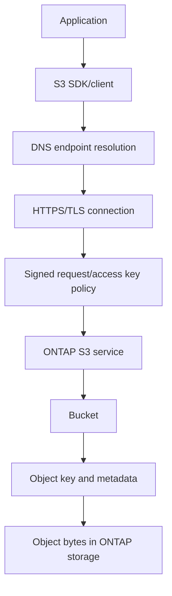

### Object identity

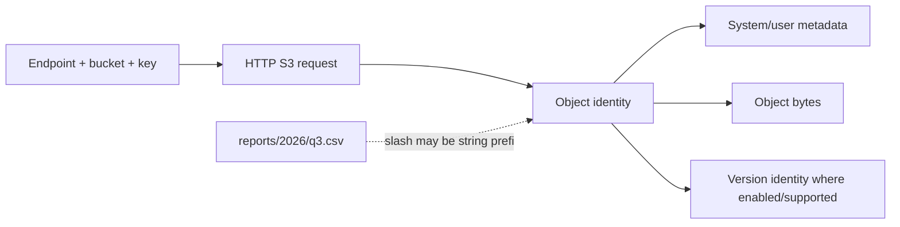

---

## 2. File, block, and object semantics

### Request comparison

| Dimension | File/NAS | Block/SAN | Object/S3 |
|---|---|---|---|
| Caller addresses | Path/file and byte range | Device/LBA range | Endpoint, bucket, key, object operation |
| Provider owns | Shared filesystem namespace/locks | Presented block object; host owns upper layout | Object namespace, metadata and API behavior |
| Common update | Open/write range/rename | Block write | PUT/replacement/multipart operation as supported |
| Sharing coordination | File locks/leases/delegations | Host cluster/application | Application/API semantics; not ordinary file locks |
| Client access | Mounted/share path | Disk-like device | HTTPS/API calls |
| Strong fit | Shared user/application files | Host-controlled FS/database | Cloud-native apps, archives, artifacts, data lakes/backups where supported |

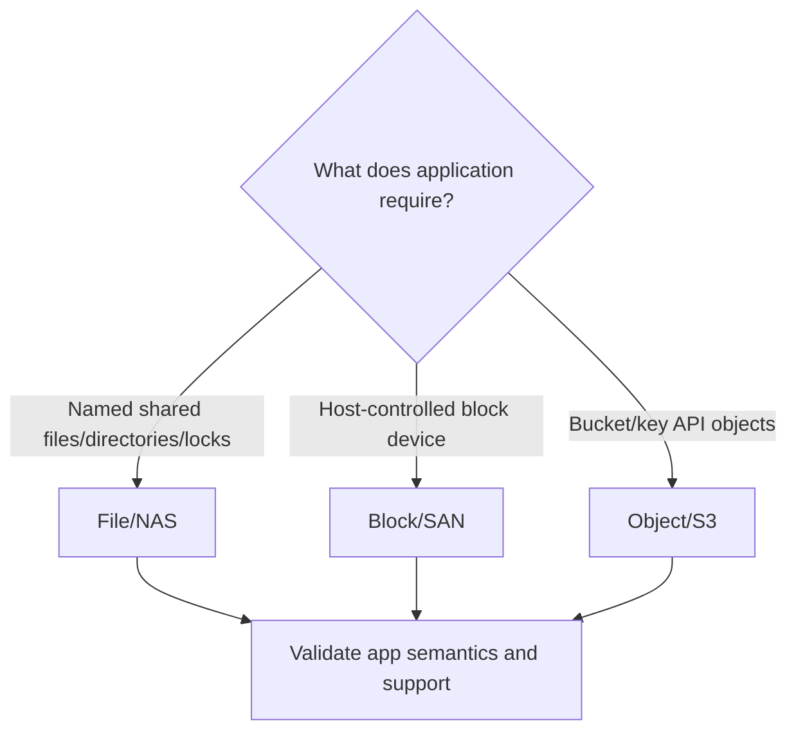

### Plain-English deep-dive: similar names do not create equivalent operations

`project/a.bin` can be a file path or an object key. A filesystem can update bytes in place, rename atomically under its rules and coordinate file locks. An S3 application commonly writes or replaces an object through API operations and lists prefixes. **Why it matters:** mounting, file locking, partial updates, hard links, ACL inheritance and application certification cannot be assumed from a slash-shaped key.

### Semantic discovery questions

- Does the application require POSIX, SMB/NTFS-style, NFS or S3 API semantics?
- Does it update whole objects or byte ranges, and what is the expected atomicity?
- Does it require directory rename, file locks, append, random write, sparse files or memory mapping?
- How are listing/prefix operations used?
- What consistency and concurrency behavior does the application require?
- Is the application's S3 implementation/SDK certified or tested with the exact ONTAP release?

---

## 3. ONTAP S3 positioning and SVM/bucket architecture

ONTAP S3 provides S3-compatible object access within eligible ONTAP deployments/releases. It is one ONTAP data-service option, not a claim of feature parity with every public-cloud S3 service or with StorageGRID.

### Architecture

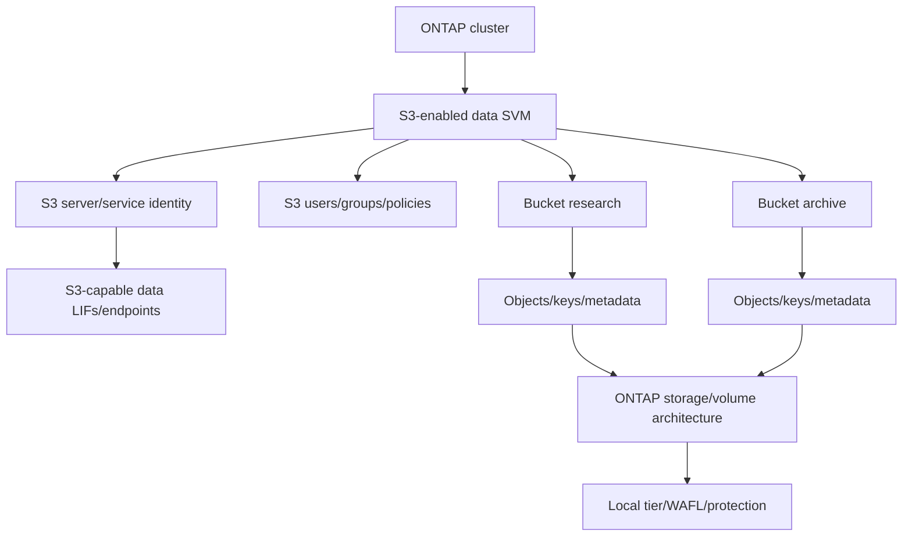

### SVM and endpoint scope

| Element | Question | Evidence caveat |
|---|---|---|
| SVM | Which tenant/data service owns S3? | Logical separation is not physical isolation |
| S3 server | Which names/certificates/configuration apply? | Enabled does not prove usable endpoint |
| LIF/endpoint | Which IPs, names, ports and service policies? | LIF up does not prove DNS/TLS/policy/application |
| Bucket | Which owner, capacity, policy, version/lifecycle state? | Bucket free/usage can differ from physical capacity |
| User/group/policy | Which operations/resources/conditions are allowed? | Credentials and policy both matter |
| Backing storage | Which node/local tier/protection/failure domain? | Object service availability is end-to-end |

### ONTAP S3 request path

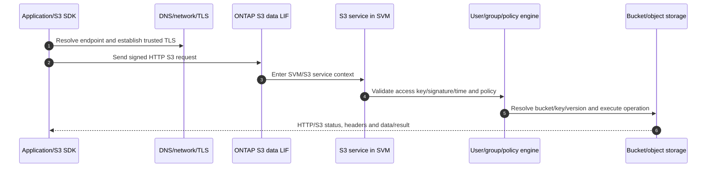

### Positioning questions

- Is the workload primarily ONTAP-adjacent object access, unified data governance, FabricPool target use, backup integration, or a general object application?
- Which S3 API operations/features does the application require?
- What object count/size/operation rate/throughput/latency and growth exist?
- What site/tenant/security/protection/lifecycle scale is required?
- Would StorageGRID or a cloud/object service provide a better object-first operating model?

---

## 4. Endpoints, HTTP, DNS, and TLS

An S3 endpoint is reached through a service name/address and HTTP, usually protected by TLS/HTTPS under policy. Exact URL style, port, virtual-host/path-style support and certificate requirements vary.

### Network and TLS path

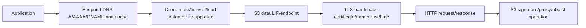

### TLS sequence

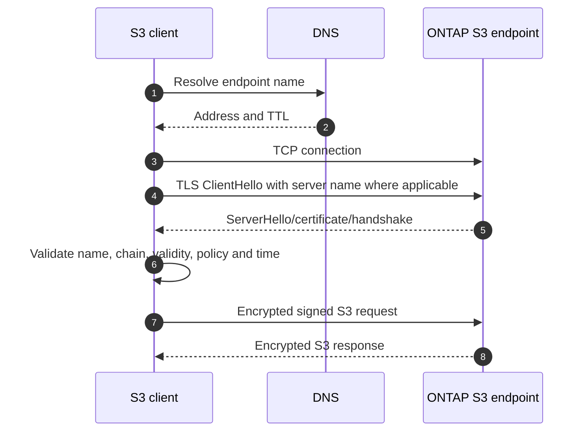

### Endpoint evidence

| Stage | Evidence | What success does not prove |
|---|---|---|
| DNS | Exact name/type/resolver/answer/TTL/selected address | Route/TLS/S3 health |
| TCP | Five-tuple/handshake/RTT | TLS, auth or bucket access |
| TLS | Version/cipher/cert/name/trust/time/alert | S3 signature or policy access |
| HTTP | Method/path/headers/status/request ID | Application correctness or durable protection |
| S3 | Error code/bucket/key/version/user/policy | Business outcome without app validation |

Do not disable certificate validation or use an IP endpoint as a permanent fix. A proxy/load balancer must be explicitly supported for S3 semantics, request size, signing, TLS and failover.

---

## 5. S3 requests, signing, access keys, and time

An S3 client commonly signs requests using an **access key ID** and corresponding **secret access key**. The access key identifies the credential; the secret proves possession through a signature and must never be transmitted or logged as plaintext.

### Plain-English deep-dive: account number plus private signing stamp

The access key ID is like an account number printed on a form. The secret key is a private signing stamp kept in a safe. The application creates a signature over canonical request details and time. ONTAP finds the account, computes the expected signature and compares it. **Why it matters:** a visible key ID is not enough to authenticate, and a leaked secret can authorize requests within the user's policy.

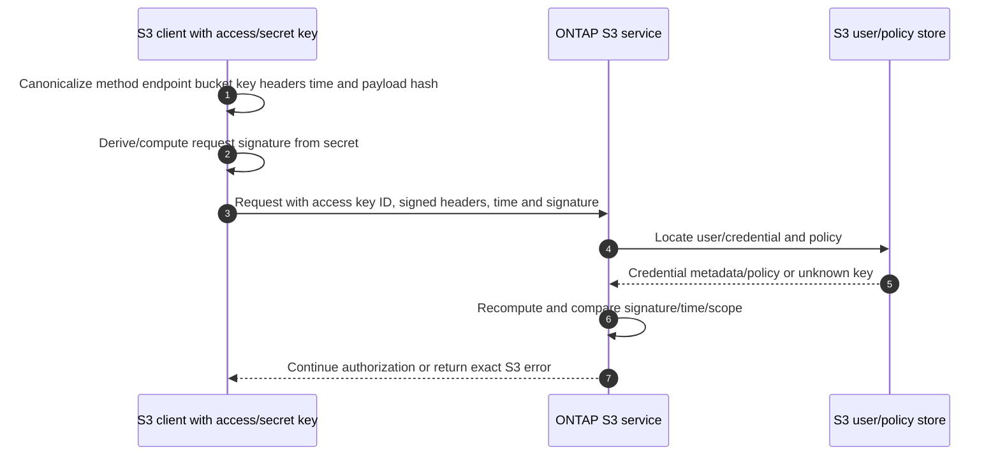

### Credential controls

- Unique credentials per application/service identity where supported and operationally feasible.
- Secret storage in an approved vault or protected injection mechanism, not code, URLs, logs or screenshots.
- Rotation, revocation, owner, expiry/review and break-glass procedures.
- Least policy and bucket scope.
- Clock synchronization because signed requests can be time-sensitive.
- Audit correlation through access key ID/user/request ID without exposing secret.
- Separate development/test/production credentials and endpoints.

### Signature failures

| Symptom | Candidate cause |
|---|---|
| Unknown access key | Wrong/revoked key ID, wrong endpoint/SVM or stale deployment secret |
| Signature mismatch | Wrong secret, canonicalization/headers/path encoding, proxy rewrite, SDK bug |
| Request time/skew error | Client/server time or long queue/replay |
| Access denied after valid signature | User/group/bucket policy or operation/resource mismatch |
| TLS failure before signing | Certificate/name/trust/crypto path; S3 auth not reached |

Never request a customer's secret key in a case note or chat. Validate by controlled rotation/test or endpoint logs that do not disclose the secret.

---

## 6. Users, groups, and policies

ONTAP S3 access commonly uses S3 users, groups and policies under exact release behavior. A policy describes permitted or denied actions on resources under supported conditions. Policy syntax/evaluation and available actions/resources must be verified against current documentation.

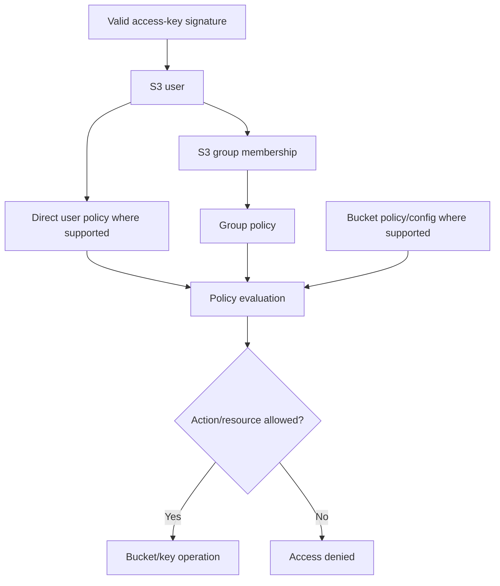

### Policy dimensions

| Dimension | Question |
|---|---|
| Principal/user/group | Which credential identity is evaluated? |
| Action | GET, PUT, LIST, DELETE or exact supported operation? |
| Resource | Which bucket/key/prefix/resource form? |
| Effect | Allow or deny under current evaluation semantics? |
| Condition | Which source/time/TLS or other supported conditions? |
| Scope/order | How do direct/group/bucket policies combine? |

### Least-privilege examples

- Read-only analytics user for one bucket/prefix-like key scope where supported.
- Ingest service allowed to put/list but not delete production objects.
- Lifecycle/backup service with explicit bounded actions.
- Administrator separate from application data credentials.

Do not copy public-cloud IAM policy examples blindly into ONTAP S3. Use only actions, resources, condition keys and syntax documented for the exact release.

---

## 7. Buckets, objects, keys, metadata, and request operations

### Operation flow

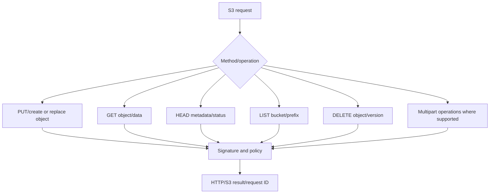

### Object fields

| Field | Why it matters |
|---|---|
| Bucket/key | Exact resource identity; preserve encoding/case |
| Version ID where supported/enabled | Distinguishes object generations |
| ETag/checksum metadata | Integrity/change orientation; semantics can differ by operation |
| Content length/type | Payload size and interpretation |
| User metadata/tags where supported | Application/lifecycle/governance inputs |
| Last-modified/time | Object history and cache/application behavior |
| Request ID/error code | Correlates client and server evidence |

### Multipart orientation

Large-object clients can upload parts and complete them into one object under supported S3 multipart semantics. Incomplete multipart uploads can consume capacity until aborted/expired under applicable controls.

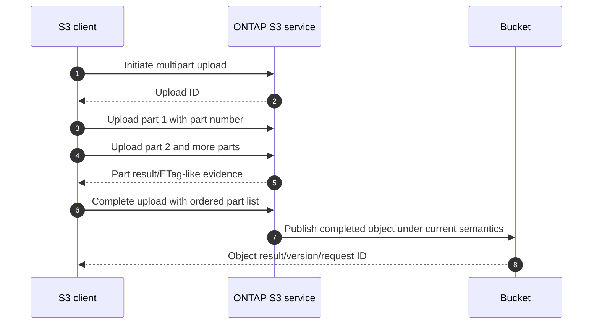

Do not infer checksum semantics or optimal part size from a generic example. Use the exact SDK/application/ONTAP documentation and representative testing.

---

## 8. Versioning and lifecycle where currently supported

**Versioning** retains distinct object versions under a bucket's supported configuration. **Lifecycle management** applies supported time/state rules to objects or versions, such as expiration or transitions where documented. Feature availability and semantics vary by ONTAP release.

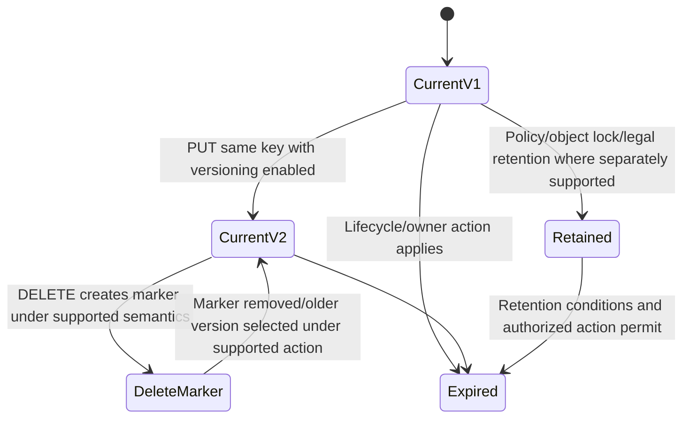

### Versioning questions

- Is bucket versioning supported and enabled for this exact release/configuration?
- How are unversioned, enabled, suspended and delete-marker states represented?
- How are GET/DELETE/list requests scoped to current or explicit versions?
- How much physical capacity and metadata do versions consume under workload change?
- Which backup/replication/lifecycle/immutability behaviors apply?

### Lifecycle decision

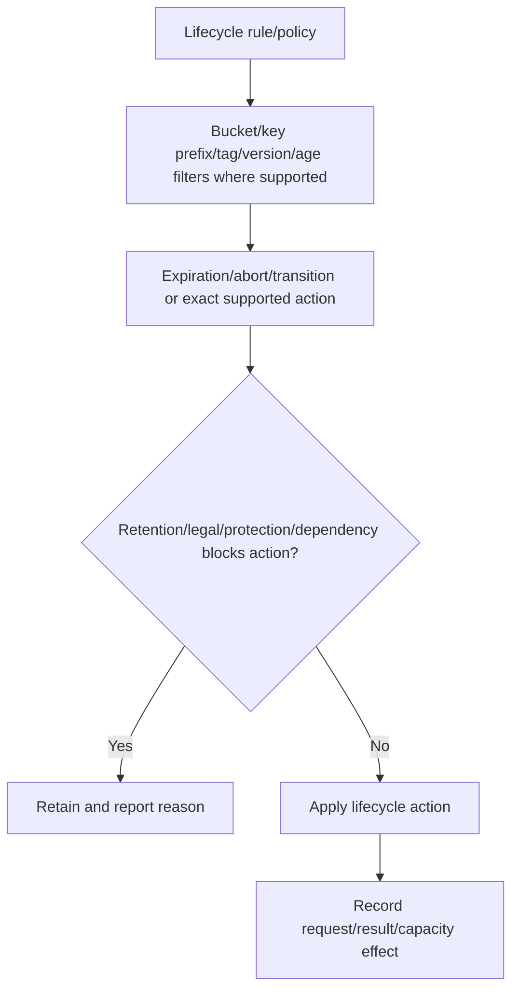

Do not enable expiration to clear a capacity alert without data owner, legal/retention, backup and recovery approval. A lifecycle rule can destroy data/history by design.

---

## 9. Consistency, concurrency, and application correctness

**Consistency** asks what readers/listings observe after successful object operations and concurrent changes. S3 consistency behavior is product/release specific; use current ONTAP documentation and application tests. Do not import a public-cloud service's current guarantees into ONTAP.

### Plain-English deep-dive: one parcel label, competing replacement requests

Two applications can PUT the same key nearly together. The object service defines which version/current object is visible and how listing behaves; the application must use version IDs, conditional requests or its own coordination where supported. There is no ordinary SMB/NFS byte-range lock protecting the key. **Why it matters:** successful API calls can still create an application-level lost-update race.

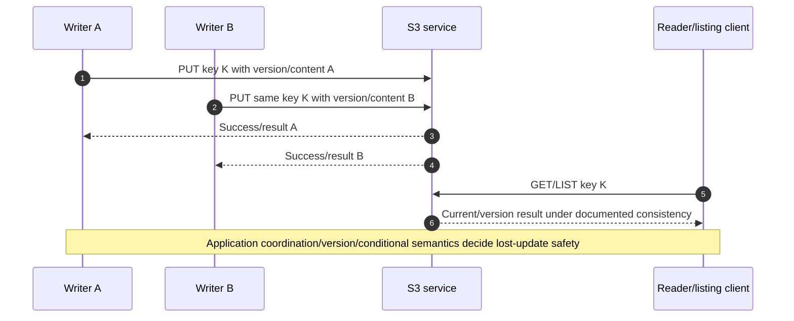

### Correctness questions

- Does the application require read-after-write, list consistency, conditional update or version-aware reads?
- Can writers safely replace the same key concurrently?
- Does a successful PUT mean the application also committed its database/catalog record?
- How does retry after timeout avoid duplicate/unintended multipart or object versions?
- What checksum/ETag semantics are expected and actually documented?
- How does delete/version/lifecycle interact with references outside object storage?

S3 durability/availability does not prove application metadata/catalog correctness.

---

## 10. Auditing, logging, and evidence

ONTAP S3 can expose service/audit/event evidence according to release/configuration. Administrative audit, S3 access auditing/logging, EMS/system health, network/TLS logs and application SDK logs are different sources.

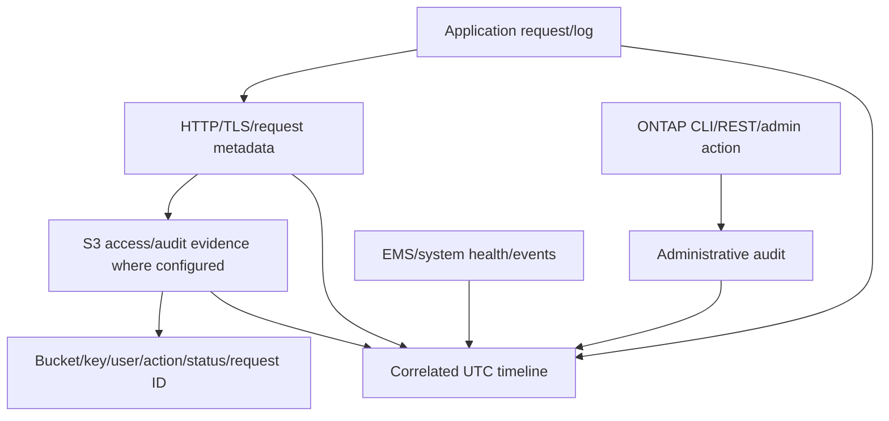

### Evidence fields

- Application transaction and SDK version/retry behavior.
- Endpoint DNS/address, TLS certificate/version, HTTP method/resource/headers/status.
- Request ID/correlation, bucket/key/version, object size/checksum metadata.
- Access key ID/user/group/policy result without secret key.
- Client source/path, proxy/load balancer/firewall and time.
- SVM/S3 server/LIF/bucket/storage/node/volume state and performance.
- Administrative change, lifecycle/versioning/policy action and audit record.

### Audit caveats

- No event can mean no configured audit/SACL/logging, retention expiry, delivery failure or wrong query scope.
- Object names/metadata can be sensitive.
- Signed requests, tokens and headers can expose credential material; redact safely.
- Clock differences can invert request/change order.
- A successful API status is not proof of downstream application consumption or backup.

---

## 11. Multiprotocol S3/NAS access caveats

Some ONTAP releases/configurations can support multiprotocol access patterns between S3 and NAS for eligible data. Exact requirements, object/file mapping, metadata, naming, permissions, ACLs, locking, write behavior and restrictions are version-sensitive.

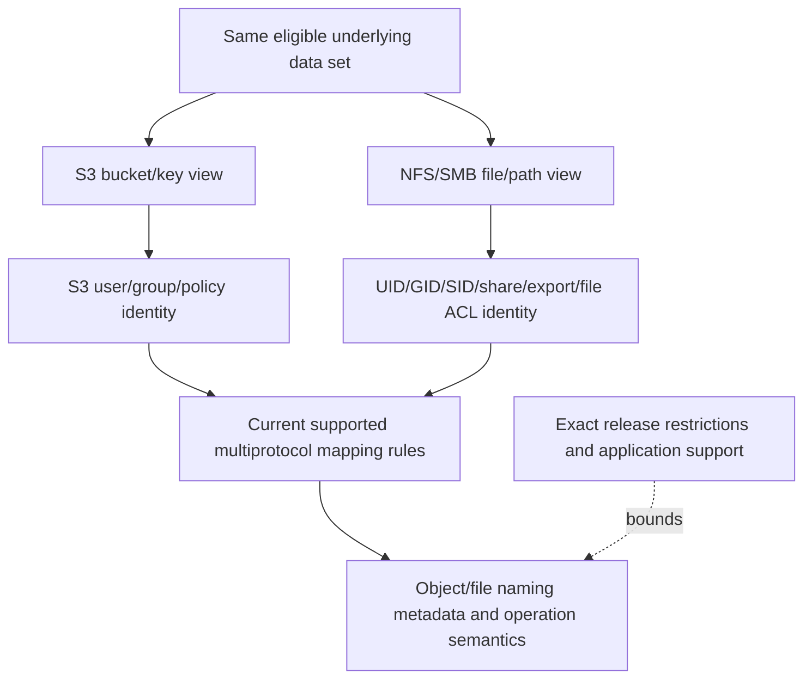

### Multiprotocol risks

| Risk | Example question |
|---|---|
| Naming | How do object keys map to file paths and unsupported names? |
| Metadata | Which S3 metadata survives NAS changes and vice versa? |
| Permissions | How do S3 policies relate to file ACL/mode/security style? |
| Concurrency | What if S3 replaces while SMB/NFS has an open/lock? |
| Consistency | When do clients on each protocol observe changes? |
| Operations | Are rename, partial write, delete/version and directories equivalent? |
| Protection | Can one protocol bypass expected retention/immutability controls? |

Do not expose the same data over S3 and NAS merely because the feature exists. Require an application compatibility matrix and positive/negative/concurrent/recovery tests.

---

## 12. Performance, capacity, protection, and availability

### Workload fingerprint

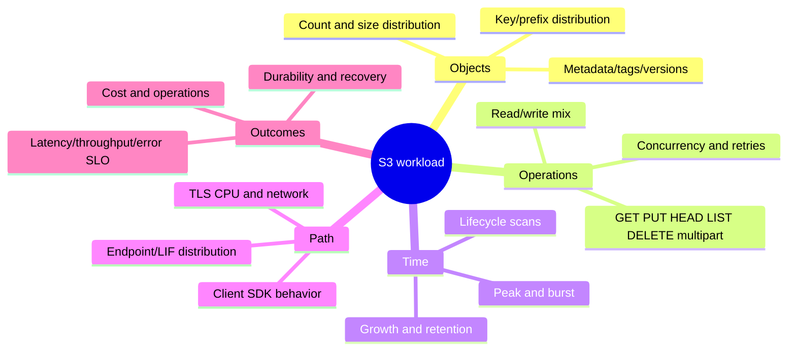

### Performance path

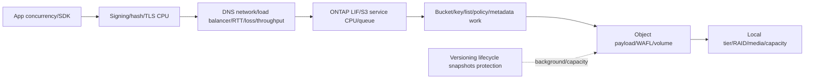

### Performance questions

- Object-size distribution, not average only.
- Operation rate/mix, listing/prefix pattern and multipart concurrency.
- Client connection pooling, retries, timeouts and SDK threads.
- TLS/signing/checksum CPU at client and ONTAP.
- Network bandwidth/RTT/loss/MTU and endpoint/LIF distribution.
- Bucket/object metadata and backing volume/local-tier resources.
- Versioning/lifecycle/protection/background operation overlap.

### Capacity ladder

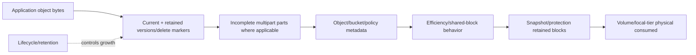

Object count, metadata, versions and incomplete uploads can grow physical use even when active payload looks stable. Reconcile logical current objects, versions, multipart, metadata, snapshots, efficiency and physical headroom.

### Protection and recovery

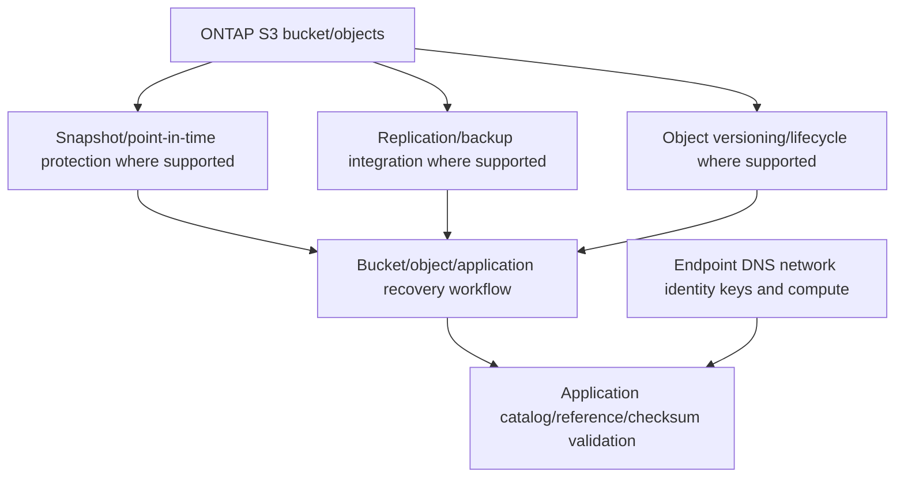

Test bucket/object selection, credentials, versions, metadata, checksums, application catalogs and measured RPO/RTO. A snapshot or object version is not an independent backup by itself.

---

## 13. ONTAP S3 versus StorageGRID at broad level

**StorageGRID** is NetApp's dedicated object-storage family. ONTAP S3 is an object service within eligible ONTAP architecture. Both can expose S3-compatible behavior, but their scale, architecture, placement, protection, management and use cases differ.

```mermaid
flowchart TD
    NEED[Object workload] --> ONTAP[ONTAP S3 candidate]
    NEED --> SG[StorageGRID candidate]
    ONTAP --> O1[ONTAP SVM/bucket plus unified ONTAP operations]
    SG --> S1[Object-first grid/sites/nodes/placement architecture]
    O1 --> COMPARE[Compare exact current API features scale performance protection security operations]
    S1 --> COMPARE
    COMPARE --> PILOT[Representative workload/failure/recovery pilot]
```

### Broad comparison

| Dimension | ONTAP S3 | StorageGRID |
|---|---|---|
| Foundation | ONTAP data-management/storage architecture | Dedicated object/grid architecture |
| First question | Does object access fit an ONTAP-centric workload/estate? | Does an object-first, multi-node/site placement model fit? |
| Scale/limits | Exact ONTAP release/platform/bucket limits | Exact StorageGRID release/node/grid limits |
| Protection | ONTAP-specific volume/Snapshot/replication options | StorageGRID placement/ILM/replication/erasure concepts |
| Management | ONTAP interfaces/operations | StorageGRID interfaces/operations |
| Multiprotocol | Eligible ONTAP S3/NAS options where supported | Object service; do not assume ONTAP NAS semantics |
| Decision | Workload, existing estate, operations, protection, scale, cost | Same neutral criteria |

Do not call ONTAP S3 `small StorageGRID` or StorageGRID `an S3 tier for ONTAP` without defining the exact architecture. FabricPool object-tier relationships are separate and covered in Part 34.

---

## 14. Safe operational discovery

The examples are conceptual read-only placeholders. Verify the exact ONTAP release, privilege, current help/manual/API schema and authorization.

```text
CONCEPTUAL ONLY - not production commands
<s3-server-command-family> show -vserver <svm> -fields <documented-endpoint-cert-state-fields>
<s3-bucket-command-family> show -vserver <svm> -fields <documented-capacity-version-lifecycle-fields>
<s3-user-or-group-family> show -vserver <svm> -fields <documented-identity-policy-fields>
<s3-policy-command-family> show -vserver <svm> -fields <documented-action-resource-fields>
<s3-audit-or-event-family> show -vserver <svm> -fields <documented-status-fields>
```

### Read-only discovery flow

```mermaid
flowchart TD
    SCOPE[App endpoint bucket key method error time change] --> PATH[DNS route firewall TLS/LIF]
    PATH --> SERVER[SVM/S3 server/endpoints/certificates]
    SERVER --> AUTH[User/access-key ID/group/policies without secret]
    AUTH --> BUCKET[Bucket/version/lifecycle/capacity/protection]
    BUCKET --> RUNTIME[Request ID/status/object metadata/audit/events]
    RUNTIME --> PERF[SDK network service volume/local-tier timing]
    PERF --> SUP[Validate exact docs/app/IMT/HWU support]
    SUP --> PLAN[Approved test/action only]
```

### Evidence controls

- Never display or store secret access keys.
- Redact authorization headers, session tokens, object contents and sensitive keys/metadata.
- Record endpoint/bucket/object/user stable identities, release and UTC.
- Preserve full HTTP/S3 error and request ID without changing the service first.
- Record audit/log enablement, data cutoff, retention and missing evidence.

---

## 15. Failure modes and troubleshooting decision tree

### Common failure modes

| Symptom | Candidate causes | Discriminating evidence |
|---|---|---|
| Endpoint name fails | DNS/view/cache/record | Exact query/answer/selected address |
| TLS fails | Name/chain/time/crypto/client/proxy | TLS alert/certificate and endpoint logs |
| Signature mismatch | Secret, canonicalization, encoded key, proxy/header/time | Canonical request metadata and server error without secret |
| Access denied | User/group/bucket policy/action/resource | Valid signature plus policy evaluation |
| Bucket/key not found | Wrong endpoint/SVM/bucket/key/case/version | Exact resource and request status |
| LIST slow | Key/prefix/object count/client paging/server metadata | Request pattern/page timing and service counters |
| PUT timeout | Client/TLS/network/service/storage/multipart | Request arrival, bytes, queue and object result |
| Capacity grows after deletes | Versions/delete markers/multipart/snapshots/lifecycle | Layered object/version/physical accounting |
| Multiprotocol conflict | Naming/ACL/lock/consistency/write semantics | Concurrent S3/NAS operation timeline |
| Restore succeeds but app fails | Missing catalog/metadata/version/key/credentials | Application-level object validation |

### Troubleshooting tree

```mermaid
flowchart TD
    START[S3 request fails/slow] --> SCOPE[Client SDK endpoint method bucket key error time change]
    SCOPE --> DNS{Expected endpoint/address?}
    DNS -->|No| D[DNS/cache/endpoint configuration]
    DNS -->|Yes| TLS{TCP/TLS trusted and compatible?}
    TLS -->|No| T[Route/firewall/cert/name/time/crypto/proxy]
    TLS -->|Yes| SIG{Signature/access key/time valid?}
    SIG -->|No| A[Credential/canonicalization/header/clock]
    SIG -->|Yes| POL{User/group/bucket policy permits action/resource?}
    POL -->|No| P[Least policy evaluation]
    POL -->|Yes| OBJ{Bucket/key/version/operation state valid?}
    OBJ -->|No| O[Resource/version/lifecycle/multipart/consistency]
    OBJ -->|Yes| PERF[SDK network S3 service metadata volume/storage]
    PERF --> VALID[Application and residual-risk validation]
```

### Support boundaries

- Application owners control SDK behavior, object naming/catalogs and business correctness.
- Network/security owners control DNS, TLS trust, firewalls/proxies and secrets governance.
- Data/security owners approve policies, versioning/lifecycle/deletion/retention and audit.
- NetApp Support/storage owners control ONTAP S3 procedures and product defects.
- The TAM analyst organizes evidence, risk, options, owners and validation; never requests secrets or deletes versions to clear capacity.

---

## 16. TAM discovery, recommendations, and JD Mapping

### Discovery questions

1. Which business application/data, endpoint/buckets, criticality, SLO, RPO/RTO, retention and growth use S3?
2. Which ONTAP cluster/platform/release/SVM/S3 server/LIFs/certificates/volumes/local tiers serve them?
3. Which client SDK/version, endpoint style, HTTP methods, TLS/security/signature behavior and retries apply?
4. Which S3 users/groups/access-key IDs/policies/bucket policies and secret lifecycle govern access?
5. Which object counts/sizes/metadata/tags/key/prefix/list/multipart/version patterns exist?
6. Which versioning/lifecycle/object-lock/immutability features are actually supported and enabled?
7. Is multiprotocol NAS access involved, and how do naming/identity/permissions/locks/consistency map?
8. Which capacity/performance/protection/audit/background operations and failure domains apply?
9. Which exact current ONTAP/app/SDK docs, IMT/HWU evidence and StorageGRID/cloud alternatives apply?
10. Who owns app, credentials, network, bucket/policy, data retention, protection, change and residual risk?

### Minimum escalation pack

- Business/app impact, client/SDK, endpoint/bucket/key/version/method, exact error/request ID and UTC timeline.
- DNS/address/route/firewall/load-balancer/proxy/TLS certificate/version/name/time evidence.
- SVM/S3 server/LIF/ONTAP/platform state and current official support.
- Access-key ID/user/group/policy evaluation without secret/authorization-header disclosure.
- Object size/metadata/version/multipart/lifecycle state, bucket capacity and operation result.
- App retries/concurrency, HTTP/S3 timing, ONTAP service/volume/local-tier performance and events.
- Audit/admin/change/protection/restore evidence, gaps and data cutoff.
- Exact current docs/IMT/HWU/app guidance/date, actions/results/rollback and specialist ask.

### Recommendation model

```mermaid
flowchart TD
    EVID[Verified app request identity policy object and storage evidence] --> CONTEXT[Business semantics security scale recovery]
    CONTEXT --> RISK[Mechanism impact likelihood horizon confidence]
    RISK --> OPTIONS[App endpoint policy lifecycle capacity platform options]
    OPTIONS --> ACTION[Owner prerequisites date stop/rollback]
    ACTION --> TEST[Allow/deny performance failure and restore validation]
    TEST --> RESID[Residual risk monitoring and review]
```

### Recommendation patterns

| Finding | Risk | Bounded recommendation | Validation |
|---|---|---|---|
| Shared access key across apps | One leak/revocation has broad blast radius | Create unique least identities and vault/rotate under supported workflow | Expected allow/deny, audit and old-key rejection |
| Lifecycle expiration planned without version/catalog review | Required objects/history can be destroyed | Obtain data/legal/app approval and simulate scoped rule | Version-aware recovery and app reference validation |
| LIST-heavy app uses broad prefix over millions of objects | Metadata/paging latency misses SLO | Redesign key/list pattern or scale option with app owner after test | Representative list/get p99 and correctness |
| Multiprotocol proposed for unsupported file semantics | Application corruption/visibility risk | Keep separate or use only current supported semantic subset | Concurrent S3/NAS app tests and recovery |
| Object-first multi-site scale exceeds ONTAP fit | Capacity/operations/protection horizon risk | Compare StorageGRID/cloud/object options neutrally | Current feature/scale/cost/failure/recovery pilot |

### JD Mapping

| JD responsibility | Part 33 contribution | Arti's factual bridge and gap |
|---|---|---|
| Understand environment | Maps app/SDK/network/S3/SVM/bucket/storage ownership | Azure/data-service method transfers; ONTAP S3 operation unproven |
| Storage depth | Covers object semantics, identity/policies, lifecycle and multiprotocol | Conceptual/synthetic only |
| Risk/stability | Finds secret, policy, TLS, lifecycle, capacity and recovery risks | CRITSIT/security method transfers |
| Supportability | Requires exact app/SDK/ONTAP feature evidence | No customer/gated result claimed |
| Strategic advice | Positions ONTAP S3 versus StorageGRID broadly | Neutral discovery/analytics transfer |
| Service review | Reports workload, security, capacity, protection and actions | Business-review strength |
| Escalation | Supplies request/policy/object/path/storage evidence | Product/Engineering discipline transfers |

---

## 17. Fully synthetic scenario: Fabrikam Media object access and capacity

> **Synthetic case:** Fabrikam Media, every endpoint, bucket, key, credential, metric and result below is fictional. It is not a NetApp customer, benchmark, internal process, tool result, or Arti's production work.

### Environment

- An ONTAP S3 SVM serves `media.objects.example`.
- `ingest` and `published` buckets hold media assets and derivatives.
- Three applications share one access key due a rushed pilot.
- Versioning is enabled in the synthetic scenario; a lifecycle rule is proposed.
- A media catalog database stores bucket/key/version references.
- An SMB team proposes multiprotocol access to edit objects as files.

```mermaid
flowchart TB
    INGEST[Ingest application] --> END[media.objects.example]
    TRANSCODE[Transcode application] --> END
    PORTAL[Publishing portal] --> END
    END --> SVM[ONTAP S3 SVM]
    SVM --> B1[ingest bucket]
    SVM --> B2[published bucket]
    B1 --> VER[Object versions/multipart]
    B2 --> OBJ[Published objects]
    CAT[Catalog DB bucket/key/version references] --> OBJ
    KEY[Shared access key] --> INGEST
    KEY --> TRANSCODE
    KEY --> PORTAL
    SMB[Proposed SMB access] -.multiprotocol caveat.-> B1
```

### Timeline

```mermaid
sequenceDiagram
    autonumber
    participant A as Transcode app
    participant P as Proxy/TLS path
    participant S as ONTAP S3
    participant B as Bucket/version state
    participant C as Catalog DB
    A->>P: Signed PUT with encoded key and metadata
    P->>P: Rewrites a signed header unexpectedly
    P->>S: Forward modified request
    S-->>A: Signature mismatch/request ID
    A->>S: Retry direct path succeeds and creates new version
    A-->>C: Catalog update times out
    C->>C: Still references old version
    B->>B: Old versions and incomplete multipart data grow
```

### Evidence

| Evidence | Observation | Bounded conclusion |
|---|---|---|
| TLS | Certificate/name/trust succeed | Authentication stage is reached |
| Failed request | Signature mismatch only through proxy; signed header changes | Proxy canonicalization path causes first failure candidate |
| Direct retry | PUT succeeds with new version/request ID | ONTAP S3 service and credential work on direct path |
| Catalog | Database remains on old version after app timeout | Object success and application commit are separate |
| Capacity | Old versions plus incomplete multipart grow; active current bytes stable | Delete/current-object view understates physical growth |
| Credentials | Three apps share key | Attribution/revocation blast radius |
| Multiprotocol proposal | Editor requires random writes/rename/locks | Semantic fit unproved and likely mismatched |

### Competing hypotheses

| Hypothesis | Evidence for | Disconfirming check |
|---|---|---|
| Secret key is wrong | Signature mismatch | Same key succeeds direct; compare canonical request path without exposing secret |
| ONTAP S3 unavailable | PUT failed | Direct retry and other requests succeed |
| Proxy changes signed request | Failure path-specific/header difference | Controlled supported proxy bypass/comparison |
| Current object is wrong | Catalog reads old data | Explicit object/version exists; catalog update failed |
| Bucket is full from active data | Physical growth alert | Current bytes stable; versions/multipart/snapshots need accounting |
| SMB access will simplify edits | Same data desired | Application needs file semantics; verify current multiprotocol support/behavior |

### Decision tree

```mermaid
flowchart TD
    TOP[Signature errors stale catalog capacity growth] --> SPLIT[Three workstreams]
    SPLIT --> SIG[Signature path]
    SPLIT --> APP[Application consistency]
    SPLIT --> CAP[Capacity]
    SIG --> PATH{Only through proxy?}
    PATH -->|Yes| PROXY[Validate supported header/TLS behavior or remove from path]
    PATH -->|No| CRED[Credential/time/canonicalization SDK]
    APP --> VER{Catalog references explicit object version?}
    VER -->|No| FIXAPP[Version-aware idempotent app transaction/reconciliation]
    VER -->|Yes| READ[Validate object/checksum and app logic]
    CAP --> DRIVER{Versions/multipart/snapshots/metadata?}
    DRIVER --> POLICY[Owner-approved lifecycle/abort/capacity plan]
    PROXY --> TEST[End-to-end app request tests]
    FIXAPP --> TEST
    POLICY --> TEST
```

### Recommendations

1. Network/security/application owners should validate whether the proxy is supported for the signed S3 request path and stop header rewriting or use an approved architecture; never expose the secret to debug it.
2. Application owner should make the catalog update version-aware and idempotent, reconcile orphan/new versions after timeouts and validate object checksum/business state.
3. Replace the shared access key with separate least-privilege application identities and audited vault/rotation ownership.
4. Build a capacity ladder for current objects, versions, delete markers, incomplete multipart, metadata, snapshots and local-tier headroom before lifecycle deletion.
5. Reject or pilot multiprotocol editing only against exact current ONTAP and application semantics; random-write/rename/lock expectations must be proved.

### Customer-facing summary

> "The failed PUTs are path-specific: TLS succeeds, but the proxy changes a signed header and ONTAP correctly reports a signature mismatch; the same credential succeeds directly. That successful retry creates a new object version, while the catalog update fails, so the application still references the old version. Capacity growth is driven by retained versions and incomplete multipart data, not current-object bytes alone. We recommend separate proxy, application consistency, credential and lifecycle/capacity actions."

---

## 18. Arti's factual transfer and honest positioning

```mermaid
flowchart LR
    AZ[Azure/cloud production context] --> API[Endpoints DNS TLS identity shared responsibility]
    SPO[SharePoint/OneDrive] --> DATA[Data naming metadata permissions versions user impact]
    CRIT[CRITSIT/Product escalation] --> EVID[Request IDs timelines hypotheses and exact ask]
    BI[Analytics/Power BI/SQL/Python] --> SCALE[Object/capacity/performance/security trends]
    API --> S3[ONTAP S3 synthetic method]
    DATA --> S3
    EVID --> S3
    SCALE --> S3
    S3 --> LAB[Future authorized S3 lab and SME review]
```

| Factual strength | Transfer | Explicit gap |
|---|---|---|
| Azure/cloud | DNS/TLS/API identity and shared-responsibility reasoning | No ONTAP S3 endpoint/admin production work |
| SharePoint/OneDrive | Names, metadata, permissions, versions and customer impact | File service is not S3 semantics |
| CRITSIT/Product | Correlation IDs, evidence and safe customer communication | No NetApp internal object-debugging access |
| Analytics | Object size/count/operations/capacity trend analysis | No production ONTAP S3 counters/limits claim |

### Honest answer

> "I understand ONTAP S3 from endpoint/DNS/TLS and signed requests through users/groups/policies, buckets/objects/keys/versions/lifecycle, consistency, auditing, multiprotocol caveats, performance/capacity/protection and broad StorageGRID positioning. My production experience is Microsoft data services, Azure, networking, identity, escalations and analytics, not ONTAP S3 administration. I would use current docs, authorized evidence, application SDK guidance and NetApp specialists before changes."

---

## 19. Whiteboard drills and paper lab

### Whiteboard drills

1. **Object:** Endpoint -> bucket -> key -> metadata/payload/version.
2. **Semantics:** File path versus LBA versus S3 bucket/key.
3. **ONTAP:** SVM -> S3 server/LIF -> user/policy -> bucket -> storage.
4. **Security:** TLS -> access-key signature -> policy -> object operation.
5. **Credential:** Access key ID identifies; secret signs and never appears.
6. **Policy:** Principal/action/resource/effect/condition using exact supported syntax.
7. **Version/lifecycle:** PUT version -> delete marker -> retention/expiry.
8. **Consistency:** Object success versus external application catalog commit.
9. **Multiprotocol:** Same data does not make object and file operations equivalent.
10. **Platform choice:** ONTAP S3 versus StorageGRID by workload/operations, not slogan.

### Paper lab scenario

A fictional research company has 40 million objects across six ONTAP S3 buckets, four SDK versions, TLS endpoints, 12 application identities, versioning, proposed lifecycle expiration, incomplete multipart uploads, a database catalog, a backup workflow and proposed NAS multiprotocol access. Documentation contains cloud-S3 policy examples and no current ONTAP feature matrix.

### Tasks

1. Inventory endpoints/SVMs/LIFs/certificates/buckets/volumes/apps/owners.
2. Characterize object count/size/key/list/method/concurrency/retry/growth patterns.
3. Validate exact ONTAP/SDK/application operations and current feature support.
4. Map DNS/TLS/proxy/load-balancer/firewall and failure paths.
5. Rotate synthetic credentials into per-app vault-owned least identities.
6. Build user/group/policy allow/deny tests from ONTAP-supported syntax only.
7. Reconcile current versions/delete markers/multipart/metadata/physical capacity.
8. Simulate lifecycle rules with legal/data/catalog/backup owners.
9. Test concurrent writers, retry/idempotency and catalog reconciliation.
10. Validate file/object multiprotocol semantics only if exact support exists.
11. Build S3/admin/audit/EMS/app evidence and privacy controls.
12. Test endpoint/LIF/node/network/object/restore failures at representative scale.
13. Compare ONTAP S3, StorageGRID, cloud and status-quo options neutrally.
14. Write security, capacity, application and platform recommendations.

```mermaid
flowchart LR
    INV[Inventory apps endpoints identities buckets] --> PROFILE[Profile objects/operations/growth]
    PROFILE --> SUPPORT[Validate current docs/features/SDK]
    SUPPORT --> SEC[Validate TLS credentials policies audit]
    SEC --> STATE[Validate versions lifecycle consistency capacity]
    STATE --> FAIL[Test failures recovery and multiprotocol]
    FAIL --> COMPARE[Compare object-platform options]
    COMPARE --> REC[Write TAM recommendations]
```

### Lab pass criteria

- [ ] File and object semantics remain distinct.
- [ ] Secrets never appear in files/logs/screenshots.
- [ ] Policy syntax/actions/resources are exact-release supported.
- [ ] Versioning/lifecycle/immutability claims are current-doc bounded.
- [ ] Object operation and application catalog commit are separate.
- [ ] Capacity includes versions/multipart/metadata/snapshots.
- [ ] Multiprotocol access receives semantic/concurrency/security tests.
- [ ] ONTAP S3 and StorageGRID are compared broadly without hard claims.
- [ ] No synthetic/lab work is called production ONTAP S3 experience.

---

## 20. Self-test

1. Define object, bucket, key, metadata, endpoint, SDK and HTTP method.
2. Compare file, block and object semantics and ownership.
3. Draw ONTAP S3 SVM/server/LIF/user/bucket/storage architecture.
4. Trace endpoint DNS, TCP, TLS, HTTP and S3 stages.
5. Explain access/secret keys and signed-request/time dependencies.
6. Draw user/group/direct/bucket policy evaluation.
7. Trace GET/PUT/HEAD/LIST/DELETE/multipart operations.
8. Explain versioning/delete markers and lifecycle only where supported.
9. Explain S3 consistency and concurrent-writer/application catalog risks.
10. Build S3, admin, EMS, network and app audit/evidence correlation.
11. Explain multiprotocol naming/permission/locking/consistency caveats.
12. Build object workload/performance/capacity/protection profiles.
13. Compare ONTAP S3 and StorageGRID at broad level.
14. Use conceptual read-only discovery without secrets.
15. Apply the troubleshooting tree and common failure table.
16. Recreate Fabrikam's proxy, app, credential and capacity findings separately.
17. Build the escalation pack and seven-part recommendation.
18. Complete whiteboard drills and paper lab.
19. State all current-doc/IMT/HWU/access caveats.
20. Deliver the No-production-NetApp boundary accurately.

---

## 21. Official Source Anchors

**Date checked: 2026-08-24.** These official public sources anchor ONTAP S3 and object concepts. Exact S3 API features, endpoints, certificates, signing, policies, users/groups, versioning/lifecycle, auditing, multiprotocol access, consistency, protection, commands and limits are release/application sensitive. Re-open exact current docs and release notes; save dated support evidence and mark gated access rather than inventing behavior.

| Topic | Official public source | Bounded use and currency note |
|---|---|---|
| ONTAP S3 configuration | [ONTAP S3 configuration](https://docs.netapp.com/us-en/ontap/s3-config/) | Current SVM/server/bucket/user/policy setup entry point; select exact release. |
| ONTAP S3 management | [ONTAP S3 management](https://docs.netapp.com/us-en/ontap/s3-multiprotocol/) | Current operations/multiprotocol entry point; page organization can evolve. |
| ONTAP S3 users/groups/policies | [ONTAP S3 configuration](https://docs.netapp.com/us-en/ontap/s3-config/) | Use exact supported policy grammar/actions/resources and release docs. |
| ONTAP S3 versioning/lifecycle | [ONTAP S3 object storage management](https://docs.netapp.com/us-en/ontap/s3-config/) | Verify exact feature availability and semantics for the release. |
| ONTAP S3 auditing | [ONTAP auditing and security](https://docs.netapp.com/us-en/ontap/) | Navigate to exact S3/NAS/admin audit topic and release. |
| ONTAP S3 multiprotocol | [ONTAP S3 multiprotocol access](https://docs.netapp.com/us-en/ontap/s3-multiprotocol/) | Exact NAS/S3 mapping, restrictions and supported workflows are release-sensitive. |
| S3 API model | [Amazon S3 API Reference](https://docs.aws.amazon.com/AmazonS3/latest/API/Welcome.html) | Official API origin/reference; ONTAP implements a documented compatible subset/behavior, not automatic parity. |
| HTTP semantics | [RFC 9110 - HTTP Semantics](https://www.rfc-editor.org/rfc/rfc9110) | HTTP foundation; S3 signing/API behavior comes from exact service docs. |
| TLS 1.3 | [RFC 8446 - TLS 1.3](https://www.rfc-editor.org/rfc/rfc8446) | Protocol standard; ONTAP/client supported versions/ciphers/certs are exact-release specific. |
| StorageGRID | [StorageGRID documentation](https://docs.netapp.com/us-en/storagegrid/) | Dedicated object architecture; select exact release for ILM, security, scale and operations. |
| ONTAP protection | [ONTAP data protection and disaster recovery](https://docs.netapp.com/us-en/ontap/data-protection-disaster-recovery/) | Validate exact S3 bucket/volume protection and restore support. |
| IMT | [NetApp Interoperability Matrix Tool](https://imt.netapp.com/) | Potentially gated exact client/application/protocol/storage support where applicable. |
| HWU | [NetApp Hardware Universe](https://hwu.netapp.com/) | Potentially gated platform/capacity facts; not S3 policy/API source. |
| Support | [NetApp Support Site](https://mysupport.netapp.com/) | Entitlement-dependent cases, advisories, knowledge and procedures. |

### Source-use discipline

- Record exact ONTAP/platform, SVM/server/endpoint/bucket/app/SDK and date.
- Use only actions/policies/version/lifecycle/multiprotocol features documented for that release.
- Preserve request IDs/status and canonical request metadata without secret/authorization disclosure.
- Reconcile object current/version/multipart/metadata/physical capacity scopes.
- Treat AWS/cloud S3 documentation as API context, not ONTAP feature parity.
- Mark IMT/HWU/customer/access gaps explicitly; never fabricate a result.

---

## Likely Interview Questions

### Q1. What is object storage, and how does it differ from file and block?

> **Model answer:** "Object storage lets an application use an API to address an object by endpoint, bucket and key with metadata. A file service exposes paths/directories/locks and byte-oriented file operations; block storage exposes a host-owned LBA device. An object key may contain slashes but is not automatically a POSIX/SMB path. I choose by application semantics, support, workload, security, protection and operating model, not performance slogans."

### Q2. Describe ONTAP S3 architecture and a request flow.

> **Model answer:** "An S3-enabled data SVM provides a server identity, suitable data LIFs/endpoints, S3 users/groups/policies and buckets backed by ONTAP storage. The client resolves the endpoint, validates TLS, sends a signed HTTP request, ONTAP validates access-key/signature/time and policy, resolves bucket/key/version and returns an S3/HTTP result. I correlate request ID, identity, object and volume/storage evidence separately."

### Q3. How do access and secret keys and S3 policies work?

> **Model answer:** "The access key ID identifies an S3 credential; the secret key privately signs canonical request details and must never be exposed. ONTAP validates signature/time and then evaluates the user's direct/group/bucket policy as currently supported for the requested action/resource/conditions. A valid signature is authentication, not authorization. I use unique least app identities, vaulted rotation and expected allow/deny/audit tests."

### Q4. How do versioning and lifecycle affect risk and capacity?

> **Model answer:** "Where the exact ONTAP release supports them, versioning retains generations/delete-marker state and lifecycle applies documented actions such as expiration to selected objects/versions. They can improve recovery/governance but add object/metadata/physical consumption and can deliberately delete history. I verify current semantics, reconcile versions/multipart/snapshots and obtain app/data/legal/backup approval before lifecycle actions."

### Q5. What consistency questions matter for an S3 application?

> **Model answer:** "I verify the exact ONTAP release's read-after-write, overwrite/delete/list and conditional/version behavior rather than import cloud guarantees. I ask how concurrent writers avoid lost updates, how retries after timeout stay idempotent, and how object success coordinates with an external database/catalog. A successful PUT and durable object do not prove the application transaction committed."

### Q6. What are the risks of ONTAP S3 multiprotocol NAS access?

> **Model answer:** "Object keys and file paths, metadata, identities, S3 policies versus ACL/modes, partial writes/rename, locks, versioning/delete and visibility can differ. I use multiprotocol only for the exact supported semantic subset and application. I map identity/security style and run positive/negative, concurrent-write, failure and recovery tests. Feature existence does not make file and object APIs interchangeable."

### Q7. When would you consider StorageGRID instead of ONTAP S3?

> **Model answer:** "ONTAP S3 is an ONTAP-integrated object service; StorageGRID is a dedicated object/grid platform with its own site/node/placement/ILM operations. I compare exact current API features, object count/size/operation pattern, scale, sites, protection, lifecycle/immutability, management skills, support and economics. I do not call either universally larger or better; a representative failure/recovery pilot decides fit."

### Q8. How does your background transfer, and what remains a gap?

> **Model answer:** "My Azure/cloud, SharePoint/OneDrive, identity/network, CRITSIT and analytics work gives me API endpoint, TLS, metadata/version, permissions, evidence and customer-risk discipline. I understand ONTAP S3 architecture but have not administered S3 servers, buckets, keys, policies, lifecycle, multiprotocol or auditing in production. I would use current docs, authorized evidence, SDK/app guidance and NetApp specialists before changes."

---

## 30-Second Memory Hooks

- **Object:** Payload + key + metadata through an API.
- **Bucket:** Governed object container and policy scope.
- **Key:** Tracking name; slash does not guarantee directories.
- **Endpoint:** DNS + route + TLS + HTTP + S3 service.
- **Access key ID:** Credential identity; **secret:** private signing material.
- **Signature:** Canonical request + time + secret; never expose the secret.
- **Policy:** Principal/action/resource/effect/condition, exact release only.
- **PUT success:** Object operation, not external app/catalog commit.
- **Versioning:** Retained generations can improve recovery and consume capacity.
- **Lifecycle:** Automated governance that can deliberately delete data/history.
- **Multipart:** Parts plus completion; incomplete uploads can consume space.
- **Consistency:** Verify ONTAP behavior and app concurrency/retry design.
- **Audit:** Request ID, user, bucket/key, action/status plus admin/event evidence.
- **Multiprotocol:** Same data, different semantics; prove compatibility.
- **ONTAP S3:** ONTAP-integrated object service.
- **StorageGRID:** Dedicated object/grid architecture.
- **Arti's bridge:** Cloud/data/evidence rigor transfers; ONTAP S3 operation does not.

---

## Completion Checklist

- [ ] Define object, bucket, key, endpoint, metadata and SDK from zero.
- [ ] Compare file/block/object semantics and ownership.
- [ ] Draw ONTAP S3 SVM/server/LIF/user/bucket/storage architecture.
- [ ] Trace DNS/TLS/HTTP/signature/policy/object operation stages.
- [ ] Protect access/secret keys and implement least identity lifecycle conceptually.
- [ ] Use only exact-release supported user/group/policy grammar and actions.
- [ ] Trace object/multipart operations and request IDs.
- [ ] Bound versioning/lifecycle/retention claims to current docs.
- [ ] Explain consistency, concurrent writer, retry and app-catalog risks.
- [ ] Build audit/evidence/privacy controls without exposing secrets.
- [ ] Test multiprotocol naming, permissions, locks and consistency.
- [ ] Characterize S3 operation/object/performance/capacity workload.
- [ ] Prove protection/recovery at object and application levels.
- [ ] Compare ONTAP S3 and StorageGRID broadly and neutrally.
- [ ] Use conceptual read-only discovery and apply the fault tree.
- [ ] Recreate Fabrikam's separate proxy, app, credential and capacity mechanisms.
- [ ] Build escalation pack and seven-part recommendation.
- [ ] Complete whiteboard drills, paper lab, self-test and Q1-Q8 aloud.
- [ ] State the No-production-NetApp boundary and exact non-claim accurately.
- [ ] Recheck current docs, IMT/HWU and Support guidance before customer use.

---

*Next suggested section:* [Part 34 - Storage Efficiency: Thin Provisioning, Deduplication, Compression, Compaction, and FabricPool](Part-34-storage-efficiency-fabricpool.md)