# Part 34 - Storage Efficiency: Thin Provisioning, Deduplication, Compression, Compaction, and FabricPool

> **Section goal:** Learn how ONTAP represents more logical data with less local physical capacity and how FabricPool can move eligible cold blocks between a local performance tier and an object capacity tier. By the end, Arti should be able to reconcile guarantees, reserves, thin provisioning, autosize/autodelete, deduplication, compression, compaction, logical/physical/effective reports, tiering policies, cooling/scans/recalls, cloud/object dependencies and costs, then write a safe customer recommendation without double-counting savings or hiding performance/protection risk.

Covers index item **34** and maps directly to job-description responsibilities for capacity/performance analytics, storage depth, strategic planning, customer-specific risk mitigation, supportability, service reviews, preventative recommendations, and executive communication.

**Version caveat:** Exact efficiency, reporting, automation, FabricPool, provider, command, limit, and protection behavior must be verified against current official documentation and authorized evidence for the customer's release, platform, provider, workload, and configuration.

Exact ONTAP efficiency defaults, eligibility, inline/background ordering, data-reduction algorithms, compaction, reporting fields, guarantees/reserves, autosize/autodelete, FabricPool platforms/object stores, tiering policies, cooling periods, scans, inactive-data reporting, recalls, cloud/provider costs, snapshot/protection behavior, commands, licenses, limits, and support vary by ONTAP release, platform, volume type, workload, object provider and configuration. Verify current official documentation, **Interoperability Matrix Tool (IMT)** where ecosystem support applies, **Hardware Universe (HWU)** for exact platform/capacity facts, cloud/object-provider documentation, application guidance, and authorized evidence. No hard threshold, ratio or supported combination is asserted without a verify-current label.

> **No-production-NetApp boundary:** Arti does not claim production NetApp or ONTAP efficiency/FabricPool experience. Every volume, ratio, tier, object store, cost, customer and result below is synthetic. Her factual strengths are Microsoft enterprise support, Azure/cloud/networking, SharePoint/OneDrive data services, analytics, Excel/Power BI/SQL/Python, CRITSIT ownership and customer communication. The explicit non-claim is: **she has not enabled or tuned production ONTAP deduplication/compression/compaction, changed guarantees/reserves/autosize/autodelete, attached an object capacity tier, selected a FabricPool tiering policy/cooling period, run a tiering scan, or operated recalls in production.**

---

## 1. Efficiency is layered accounting, not free capacity

Storage efficiency changes how logical data is represented physically. It does not change the business meaning of the data, remove the need for headroom, or guarantee that future data reduces at the same ratio.

### Plain-English deep-dive: floor plan, occupied rooms, vacuum bags, shared copies, and offsite storage

- **Thin provisioning** advertises room before every room is physically reserved.
- **Deduplication** lets identical items share one stored representation.
- **Compression** packs an item's information into fewer bits.
- **Compaction** packs small compressed units efficiently into physical blocks under ONTAP's implementation.
- **FabricPool** moves eligible cold boxes from the local building to a supported object warehouse.

**Why it matters:** each technique changes a different accounting layer. Adding their percentages or treating remote bytes as deleted creates a false capacity story.

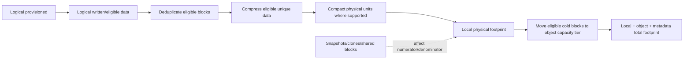

### Core terms

| Term | Plain meaning | Key question |
|---|---|---|
| Logical provisioned | Address space promised upward | Is it written or only thin/unallocated? |
| Logical used/written | Data represented at a logical layer | Does it include snapshots, zeros, clones or remote blocks? |
| Physical used | Storage consumed in a stated location/scope | Local only or local plus object tier? |
| Effective capacity | Derived logical capacity from physical plus efficiency | Measured, assumed, guaranteed or marketing? |
| Savings ratio | Logical/eligible bytes divided by physical bytes | What exact numerator/denominator/time? |
| Headroom | Capacity held for growth/failure/change/uncertainty | Which risk and lead time require it? |

---

## 2. Capacity ladder and reporting definitions

### Capacity ladder

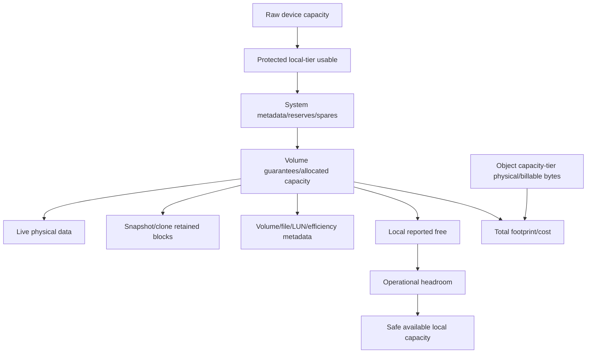

### Plain-English deep-dive: the denominator decides the story

One report can say `2:1 local efficiency` by dividing logical data by local physical bytes after some blocks were tiered away. Another can include object-tier bytes and report a lower total-footprint ratio. Both can be mathematically correct but answer different questions. **Why it matters:** every ratio needs scope, time, inclusion and purpose before it drives a purchase or risk decision.

### Reporting views

| View | Includes | Excludes/ambiguity to resolve |
|---|---|---|
| Host/file logical | Application/filesystem logical data | Snapshots, lower metadata, thin unwritten behavior |
| Volume logical used | ONTAP logical reporting | Exact zeros/clones/snapshot/tier treatment |
| Volume physical used | Blocks referenced in local/object scope | Guarantee/reserve and shared allocation semantics |
| Local-tier used/free | Local protected physical capacity | Remote object bytes and provider bill |
| Object-tier usage | Tiered object-store footprint | Local metadata/hot blocks and operations/egress cost |
| Effective ratio | Derived logical-to-physical relationship | Scope often differs across tools/features |

### Evidence schema

- Raw bytes and declared TB/TiB units.
- Cluster/SVM/volume/local tier/object store stable identities.
- Live, Snapshot, clone, metadata, guarantee/reserve and remote-tier scopes.
- Efficiency features/status/eligibility and ONTAP release.
- Timestamp/data cutoff and counter/report definitions.
- Workload/retention/tiering changes and data-quality gaps.

---

## 3. Thin provisioning and overcommit

**Thin provisioning** presents logical capacity without reserving equal physical space immediately. **Overcommit** occurs when logical promises exceed current physical backing available for their growth.

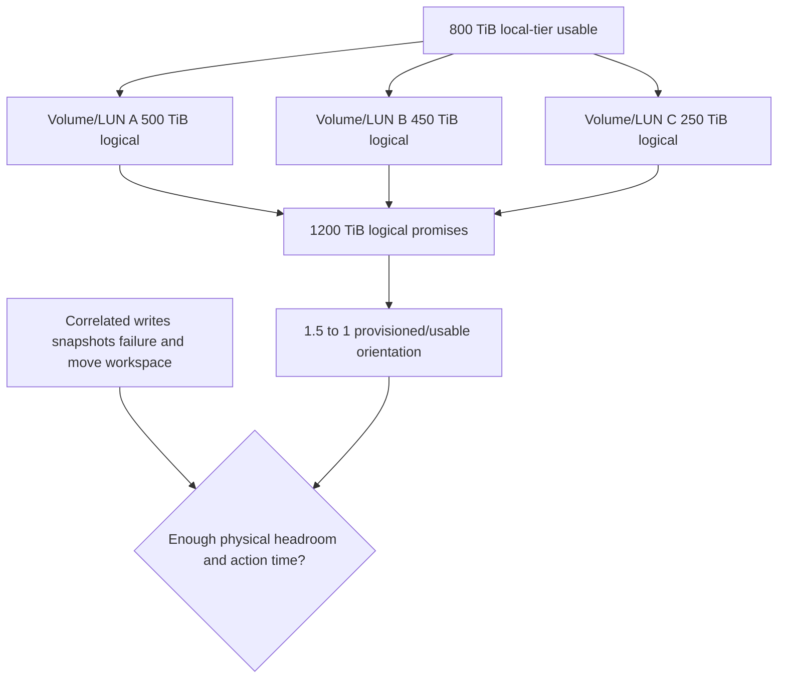

For this synthetic example:

$$
\text{provisioned overcommit}=\frac{1200\ \text{TiB}}{800\ \text{TiB}}=1.5:1
$$

This is not an efficiency ratio and does not mean 400 TiB of data already exists.

### Thin layers

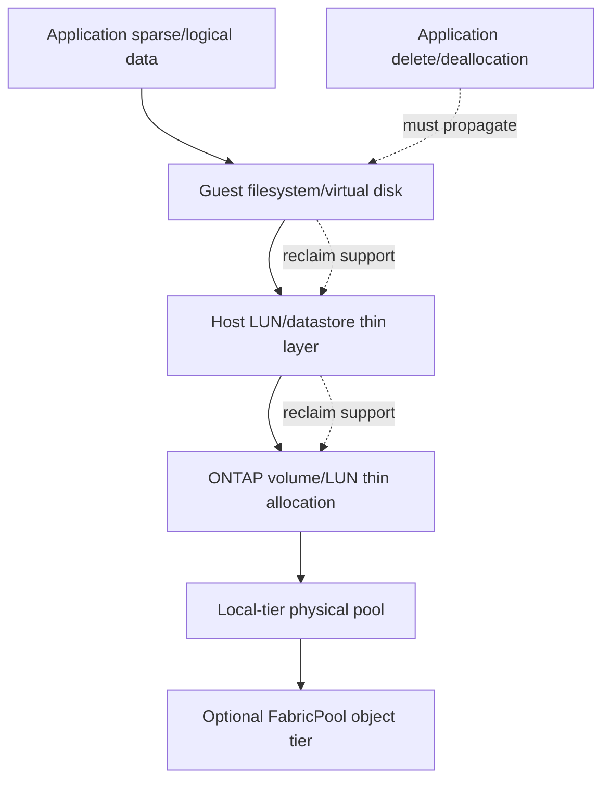

### Overcommit risk questions

1. Which layers are thin and which promise/guarantee capacity?
2. What is written logical versus physical consumed now?
3. Can snapshots, clones, backup, replication, moves or recalls grow together?
4. Do host deallocation/reclaim commands propagate through every supported layer?
5. Which workloads are correlated at month-end, migration or incident recovery?
6. What is the operational action threshold and change/procurement lead time?
7. What exact technical behavior occurs at quota, volume, local-tier or object-tier exhaustion?

Thin provisioning improves utilization only when evidence, forecasting, ownership and response are reliable.

---

## 4. Guarantees, reserves, autosize, and autodelete

A **space guarantee** reserves lower-layer capacity under a supported policy. A **reserve** withholds capacity for a purpose. **Autosize** changes a volume's logical boundary automatically within configured limits. **Autodelete** removes eligible objects, often Snapshot copies, under policy to recover space.

### Relationship map

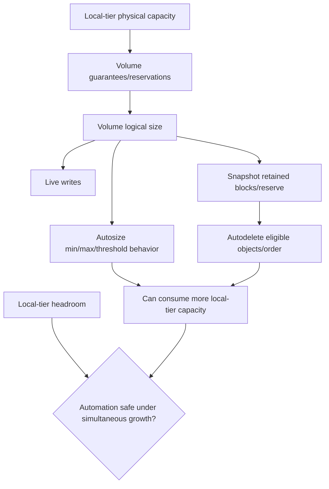

### Plain-English deep-dive: moving walls and spending emergency supplies

Autosize moves an apartment wall into shared building space; it does not construct a larger building. Autodelete throws away approved stored history to free room. A guarantee reserves space so a tenant has stronger claim to it; removing it makes the space look free but changes protection. **Why it matters:** automation can postpone a visible alert while worsening aggregate-level or recovery risk.

### Automation interactions

| Feature | Benefit | Risk |
|---|---|---|
| Guarantee/reserve | Protects named overwrite/system/recovery need | Lower apparent free/efficiency; wrong removal creates risk |
| Autosize grow | Prevents volume boundary from blocking writes | Many volumes can consume local tier together |
| Autosize shrink | Can return unused logical boundary where supported | Host/app/snapshot constraints and oscillation |
| Autodelete | Frees eligible Snapshot/object space | Removes recovery points or dependencies |
| FabricPool tiering | Frees local data blocks | Adds object/network/cost/recall dependence |

### Decision sequence

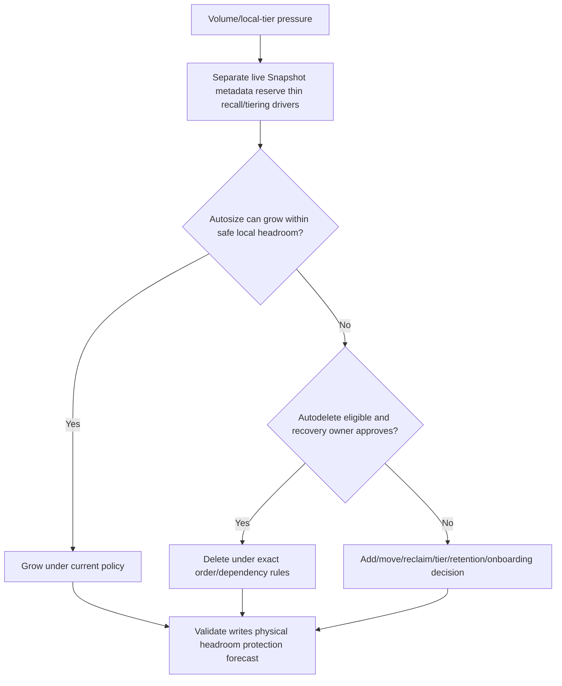

No automatic behavior should be configured without owner, min/max/threshold, alert, audit, stop condition, protection impact and failure test.

---

## 5. Deduplication

**Deduplication** avoids storing multiple eligible identical block/chunk representations by sharing one physical representation under ONTAP's supported implementation.

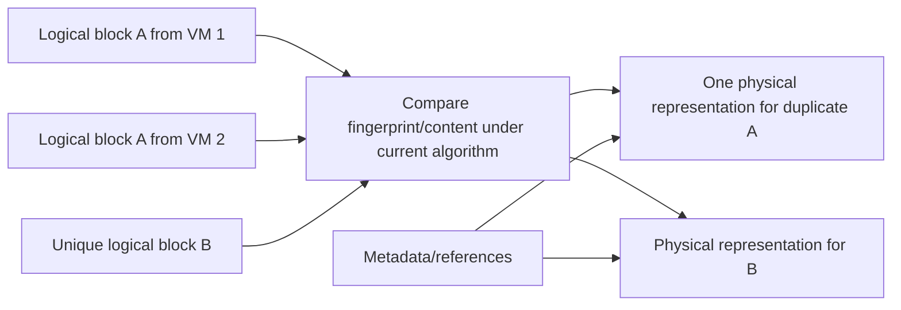

### Inline and background orientation

- **Inline deduplication** evaluates eligible data in the write path under current release behavior.
- **Background/postprocess deduplication** examines eligible existing data later under a schedule/policy.
- Exact scope, fingerprints, granularity, ordering, cross-volume behavior, metadata, defaults and eligibility vary.

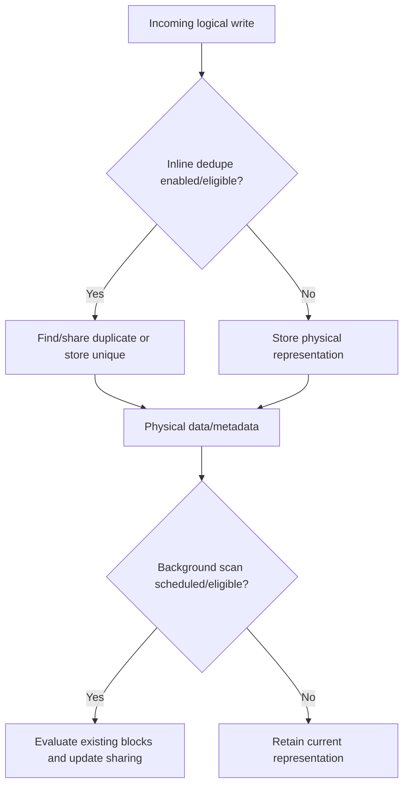

### Dedupe questions

- What data is eligible and within which scope?
- Is content already encrypted/compressed/unique?
- What measured logical/physical bytes and sharing metadata produce the ratio?
- What CPU/memory/WAFL/CP/background cost appears under representative load?
- How do snapshots/clones, overwrite/change rate, volume moves and tiering interact?
- Does application/vendor support impose restrictions?

Do not promise a ratio from `VM`, `database`, or `backup` labels. Measure comparable real content and include uncertainty.

---

## 6. Compression and compaction

**Compression** represents eligible data with fewer bits. **Compaction** in ONTAP efficiency can pack smaller compressed units more efficiently into physical blocks. Exact algorithms, inline/background behavior, eligibility, block organization, defaults and performance vary by release/platform/volume type.

### Compression flow

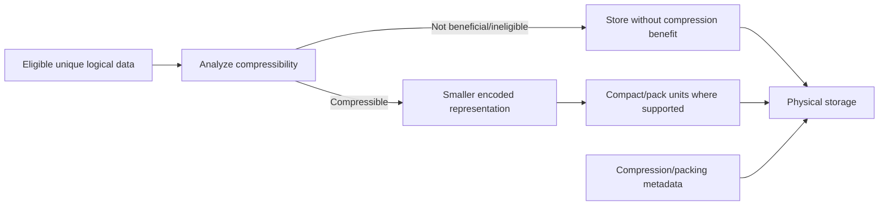

### Workload behavior

| Data | Likely opportunity orientation | Required proof |
|---|---|---|
| Text/logs/VM repeated patterns | Can compress/dedupe well | Measured eligible physical result |
| JPEG/video/precompressed archives | Often limited compression | Actual sample; no universal zero benefit claim |
| Application-encrypted data | Pattern reduction often limited | App pipeline and measured result |
| Databases | Data/page patterns vary; application/support matter | Representative workload/performance/restore test |
| Rapidly changing unique data | Savings can be low/short-lived | Ratio trend through retention cycles |

### Plain-English deep-dive: compression saves luggage space but costs packing work

Vacuum-packing clothes reduces suitcase space, but packing/unpacking uses time and tools. If items are already vacuum-packed or randomly encrypted, little space remains to save. Compaction arranges several small packed items into suitcase compartments efficiently. **Why it matters:** capacity savings and CPU/latency effects must both be measured; a higher ratio is not automatically a better customer outcome.

### Inline/background caveat

Do not assume deduplication, compression and compaction run in one fixed sequence for every ONTAP release/volume/workload. Use the exact current documentation and observed counters. Architecture diagrams here show conceptual transformations, not internal implementation order.

---

## 7. Savings ratios and double-counting

A simple efficiency ratio is:

$$
E=\frac{\text{eligible logical bytes represented}}{\text{physical bytes consumed}}
$$

For 1,000 TiB logical represented by 500 TiB physical:

$$
E=\frac{1000}{500}=2:1
$$

The simple savings fraction is:

$$
1-\frac{1}{E}=1-\frac{1}{2}=50\%
$$

### Sequential reductions do not add

If dedupe reduces 1,000 TiB to 700 TiB, and compression reduces the remaining 700 TiB to 490 TiB:

$$
\text{combined ratio}=\frac{1000}{490}\approx2.041:1
$$

$$
\text{combined savings}=1-(1-0.30)(1-0.30)=51\%
$$

It is not $30\%+30\%=60\%$.

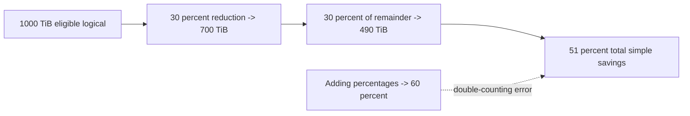

### Ratio scope tree

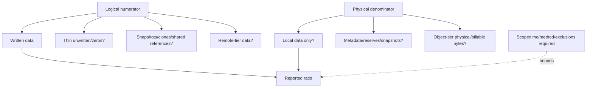

### Common double-counting errors

| Error | Correction |
|---|---|
| Add dedupe/compression/compaction savings | Use actual before/after physical bytes or multiplicative math |
| Count thin provisioned but unwritten as saved | Separate provisioned, written and physical |
| Count clone logical size as independent physical data | Report shared references and unique changes |
| Exclude object-tier bytes but call ratio total | Label local efficiency and total-footprint efficiency separately |
| Ignore Snapshot/metadata/reserves | Reconcile whole volume/local-tier footprint |
| Apply current ratio to all future data | Use measured low/base/high scenarios by workload |

---

## 8. Workload and performance effects

Efficiency can save storage and I/O while consuming CPU, memory, metadata and background processing. FabricPool can free local capacity while adding network/object latency and cost for cold-data access.

### Performance path

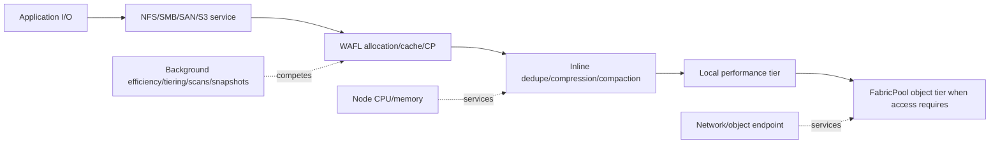

### Evidence by workload

| Workload | Efficiency/performance question |
|---|---|
| Small random database writes | Commit p99, CPU/CP/space, database support and cache behavior |
| VM images | Duplicate patterns, clone/snapshot scope, boot storm and hot working set |
| Compressed media | Low reduction, large throughput, tiering/recall and retention |
| Backup data | Already reduced/encrypted, sequential flow, retention and restore |
| File shares | File count/metadata plus mixed data compressibility and inactive data |
| SAN LUNs | Host reclaim, Snapshot overwrite, application consistency and latency |

### Performance rule

Do not disable an efficiency feature because CPU is high or enable it because free capacity is low without proving mechanism, support, expected physical benefit, application SLO and recovery impact. Measure p50/p95/p99, throughput, CPU/service centers, CP, background work, physical capacity and workload change together.

---

## 9. FabricPool architecture

**FabricPool** is ONTAP's supported tiering technology that combines a local **performance tier** with an object **capacity tier**. Eligible cold blocks can be tiered according to a volume policy and current ONTAP rules while metadata and hot data remain local as designed.

### Plain-English deep-dive: local shelves plus an object warehouse

The performance tier is the nearby storeroom for active items. The capacity tier is a distant object warehouse for colder boxes. ONTAP keeps the catalog and decides which boxes are eligible to move. When someone requests a cold box, it can be fetched over the network. **Why it matters:** local free space improves, but total data still exists and now depends on the object service, network, security, latency and bill.

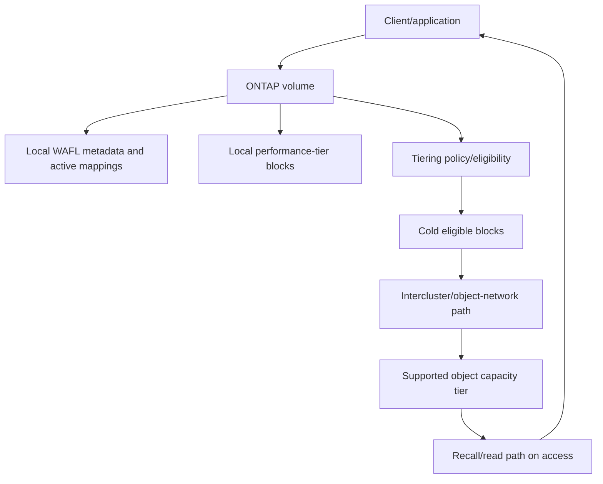

### FabricPool components

| Component | Purpose | Risk question |
|---|---|---|
| Performance tier | Local ONTAP local tier/aggregate | Enough hot/failure/recall/change headroom? |
| Capacity tier | Supported object store | Availability, capacity, credentials, certificate, cost and lifecycle? |
| Intercluster LIF/path | Carries tiering/object traffic | Route/firewall/DNS/MTU/bandwidth and independent failure? |
| Object-store configuration | Defines endpoint/provider/bucket/container identity | Is it exact supported target and securely governed? |
| Tiering policy | Determines eligible data class/behavior | Does it fit workload/protection/recovery? |
| Cooling/inactive-data logic | Determines cold eligibility over time | Is period/reporting accurate for this workload? |
| Tiering scan | Evaluates/tiers eligible blocks under current behavior | Resource impact and completion/backlog? |

---

## 10. FabricPool tiering policies

ONTAP documentation defines tiering policies such as `snapshot-only`, `auto`, `all`, and `none` in relevant releases, plus additional behavior/options depending on current version. Their exact eligibility, cooling, recall and change semantics must be checked.

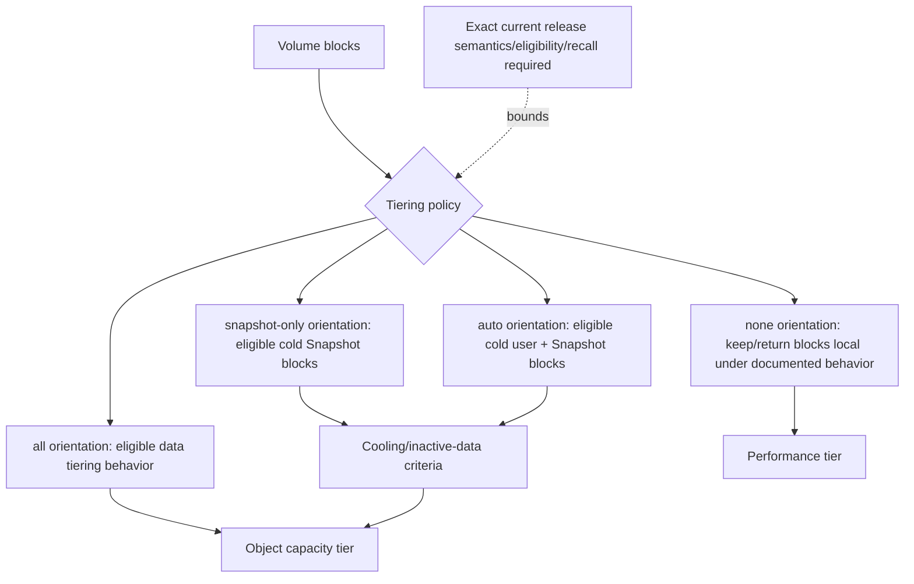

### Policy decision questions

1. Which volume type/workload and ONTAP release support the policy?
2. Which blocks are eligible: active filesystem, Snapshot, data-protection destination, all/none or another documented class?
3. Which cooling period/default/min/max semantics apply?
4. What recall behavior applies on read/write, policy change, restore, move, backup or failover?
5. Does the application tolerate first-access latency and network/object outages?
6. How do snapshots, replication, backup and DR use tiered blocks?
7. What object operations, retrieval, egress and storage costs follow?

Do not choose `all` because it sounds most space-efficient or `none` because it sounds safest. Map the exact workload and recovery/cost contract.

---

## 11. Cooling, inactive-data reporting, scans, and tiering

**Cooling** is the process/period by which eligible blocks become cold according to current ONTAP logic. **Inactive Data Reporting (IDR)** can estimate/report inactive data under supported configurations. A **tiering scan** identifies and moves eligible blocks according to policy.

### State model

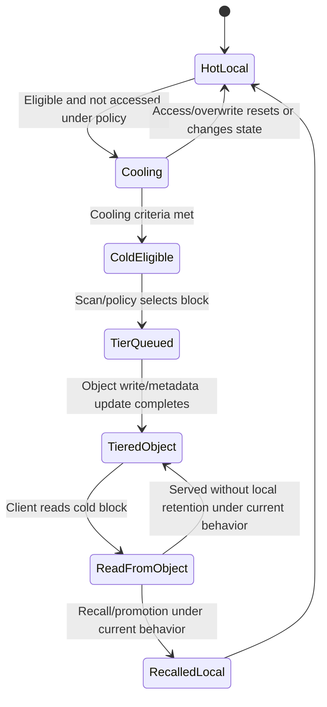

### Tiering scan flow

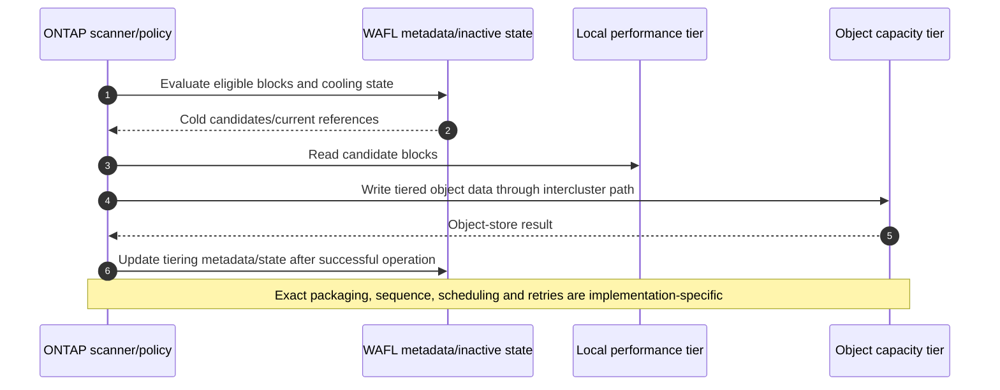

### Reporting caveats

- Inactive/cold estimates are not guaranteed tiered bytes.
- Cooling age can reset/change after access or overwrite.
- Tiering throughput depends on network, object store, scanner, workload and throttling/priority behavior.
- Data reduction/local physical accounting can change apparent cold percentage.
- A scan backlog can be symptom or expected workload; use current field definitions.
- Do not force a scan or shorten cooling from this conceptual guide.

---

## 12. Recall and read paths

Access to tiered blocks can be served from the capacity tier and may recall/promote data according to policy and request behavior. Exact read-ahead, caching, promotion and write handling vary.

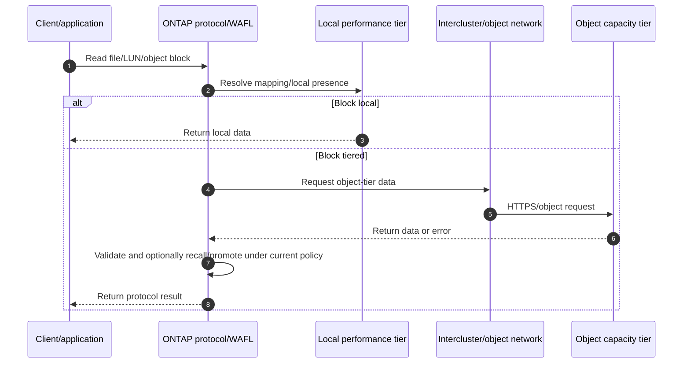

### Recall performance questions

- Is the symptom first access to cold data or repeated access?
- How much data is recalled/read, in what request sizes and concurrency?
- What are object endpoint RTT/throughput/error/rate-limit behavior?
- Are intercluster LIFs/routes/firewalls/MTU/DNS/certificates healthy?
- Is local headroom available for recalls or writes?
- Are backup, restore, replication or scans causing bulk object reads?
- Does application timeout/retry amplify the load?

### Recall storm

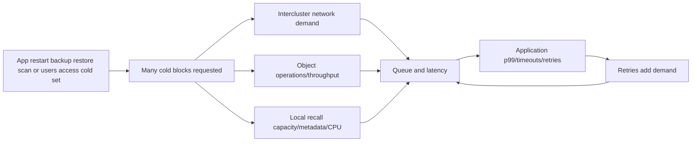

Do not call tiering the root cause because tiered bytes exist. Prove that the affected request is cold/tiered and that object/network/service time explains the application delay.

---

## 13. Network, object-store, security, and cloud-cost dependencies

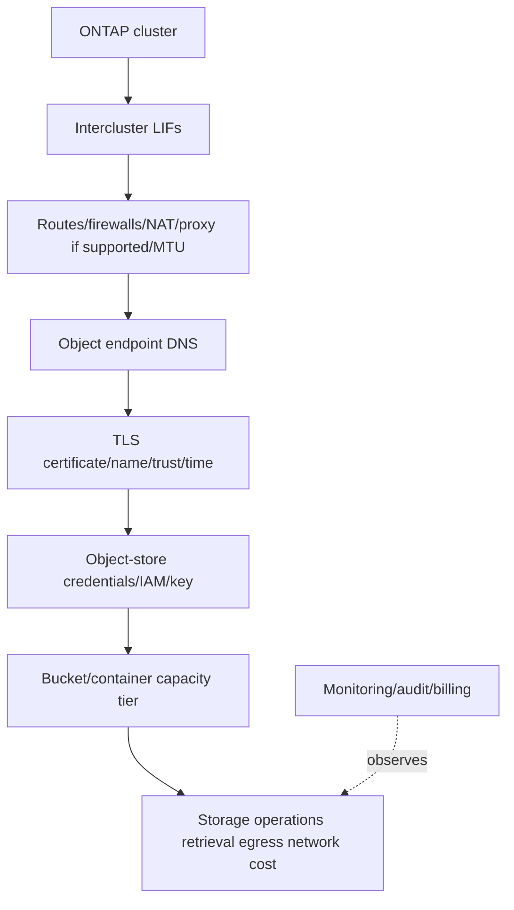

### Security controls

- Use a supported object target and exact current certificate/trust configuration.
- Protect object-store credentials/keys in approved secret management; never log them.
- Apply least object bucket/container permissions and separate administration.
- Segment and monitor intercluster/object paths; data-tier traffic is not generic management traffic.
- Audit capacity-tier configuration, policy changes, credential rotation and failures.
- Validate encryption at rest/in transit and key ownership under exact product/provider model.

### Cost model

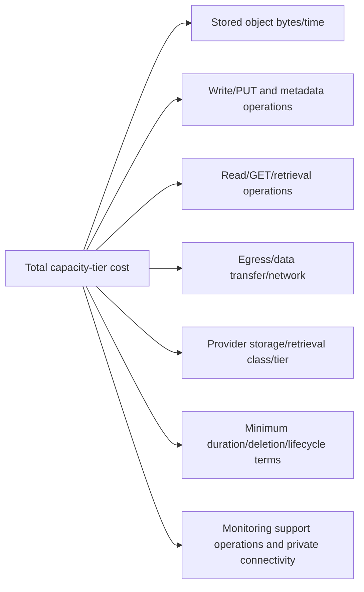

Cloud/object pricing and terms change. Do not put invented rates in a TAM recommendation. Request current provider billing dimensions and model low/base/high access/tiering scenarios.

---

## 14. Snapshots, protection, backup, and DR effects

Snapshots can retain cold blocks and interact with tiering eligibility/policy. Replication, backup, restore, FlexClone and DR can read tiered data, transfer references/blocks, or require object-tier access under exact supported behavior.

```mermaid
flowchart TD
    VOL[Volume with local/tiered blocks] --> SNAP[Snapshots retain point-in-time references]
    VOL --> REPL[Replication/protection relationship]
    VOL --> BACKUP[Backup/restore workflow]
    VOL --> CLONE[Clone/test workflow]
    SNAP --> OBJ[Capacity-tier dependencies]
    REPL --> OBJ
    BACKUP --> OBJ
    CLONE --> OBJ
    OBJ --> RECOVERY[Recovery requires endpoint/network/auth/data health]
    RECOVERY --> APP[Application RPO/RTO validation]
```

### Protection questions

- Are tiered blocks included/transferred/referenced in the selected protection workflow?
- Can destination/DR access the required object tier independently?
- What object credentials, DNS, certificates and network survive primary-site loss?
- How does restore/clone/volume move affect recalls and local headroom?
- Does Snapshot retention increase capacity-tier footprint and provider cost?
- Has application recovery from a cold/tiered point met RPO/RTO?

FabricPool is capacity placement, not backup, replication, immutability or cyber recovery. An object capacity tier is not automatically an independent recovery copy.

---

## 15. Capacity and recommendation analytics

### Local versus total footprint example

Synthetic values:

- Logical represented: 1,200 TiB.
- Local physical: 400 TiB.
- Object-tier physical: 300 TiB.

Local-only ratio:

$$
E_{local}=\frac{1200}{400}=3:1
$$

Total-footprint ratio:

$$
E_{total}=\frac{1200}{400+300}\approx1.714:1
$$

Both ratios can be valid if labeled. Neither includes provider request/egress cost automatically.

```mermaid
flowchart TD
    LOG[1200 TiB logical] --> LOCAL[400 TiB local physical]
    LOG --> REMOTE[300 TiB object physical]
    LOCAL --> LR[Local ratio 3 to 1]
    LOCAL --> TOTAL[700 TiB total physical]
    REMOTE --> TOTAL
    TOTAL --> TR[Total ratio about 1.714 to 1]
    BILL[Object operations/egress/support cost] -.not represented by capacity ratio.-> TR
```

### Forecast bridge

```mermaid
flowchart LR
    INGEST[New logical ingest] --> REDUCE[Measured data reduction]
    REDUCE --> LOCALG[Local hot/new physical growth]
    LOCALG --> COOL[Cooling/eligible bytes]
    COOL --> TIERED[Object-tier growth]
    ACCESS[Recalls/rewrites] --> LOCALG
    SNAP[Snapshot retention/change] --> LOCALG
    SNAP --> TIERED
    LOCALG --> THRESH[Local threshold date]
    TIERED --> COST[Capacity-tier/cost forecast]
```

### Recommendation criteria

- Current local headroom/action lead time.
- Measured low/base/high reduction, cooling, tiering and recall patterns.
- Application p99/throughput and cold-access tolerance.
- Object availability, capacity, support, security, latency and cost.
- Protection/restore/DR behavior.
- Lifecycle, operational skills and contract/provider horizon.

---

## 16. Safe operational discovery

Examples are conceptual read-only placeholders. Verify exact ONTAP release, privilege, current help/manual/API fields and customer authorization.

```text
CONCEPTUAL ONLY - not production commands
<volume-efficiency-command-family> show -vserver <svm> -volume <volume> -fields <documented-status-ratio-fields>
<volume-space-command-family> show -vserver <svm> -volume <volume> -fields <documented-logical-physical-snapshot-fields>
<aggregate-local-tier-command-family> show-space -fields <documented-used-free-tier-fields>
<fabricpool-object-store-family> show -fields <documented-endpoint-state-fields>
<fabricpool-tiering-family> show -vserver <svm> -volume <volume> -fields <documented-policy-cooling-inactive-fields>
<network-intercluster-family> show -fields <documented-route-lif-service-fields>
```

### Discovery sequence

```mermaid
flowchart TD
    SCOPE[Business workload volume capacity/performance symptom] --> SPACE[Reconcile raw usable logical physical snapshot metadata reserves]
    SPACE --> EFF[Read exact efficiency eligibility/status/ratios]
    EFF --> TIER[Read local/object usage policy cooling/inactive/scan/recall]
    TIER --> PATH[Map intercluster DNS route TLS credentials object health/cost]
    PATH --> WORK[Correlate app I/O p99 CPU CP background protection]
    WORK --> SUP[Validate current docs IMT HWU provider support]
    SUP --> HYP[Rank capacity efficiency tier path cost and app hypotheses]
    HYP --> PLAN[Approved action/test only]
```

### Evidence controls

- Preserve raw counters/bytes and report definitions before policy changes.
- Record local and object tiers separately and together.
- Capture policy, cooling/inactive/scanner/recall state with release/date.
- Never expose object credentials, authorization headers or customer object names unnecessarily.
- Identify access-gated provider billing/support evidence as unverified.

---

## 17. Failure modes and troubleshooting decision tree

### Common failure modes

| Symptom | Candidate causes | Discriminating evidence |
|---|---|---|
| Reported savings drop | Data mix/change, snapshots, encrypted/compressed data, scope/report change | Reproducible numerator/denominator by workload/time |
| Local tier fills despite high ratio | Live/snapshot/metadata/guarantee/recall/growth | Full local capacity ladder |
| Host shows free, ONTAP grows | Reclaim not propagated, snapshots retain blocks | Host->LUN->volume deallocation evidence |
| CPU/latency rises after efficiency change | Workload, inline/background work, other bottleneck | Before/after p99/CPU/CP/physical benefit |
| Tiering not occurring | Policy, cooling, eligibility, scan, object/network errors | Exact volume/tiering/object state |
| Cold read is slow | Object RTT/throughput, network, recall storm, app retries | Request maps to tiered block and path timeline |
| Object store unavailable | DNS/TLS/credential/provider/network | Endpoint path/error and ONTAP object-store state |
| Cloud bill spikes | GET/PUT, recall, egress, class/minimum duration, backup/restore | Provider billing dimensions and workload events |
| Restore misses RTO | Tiered-data retrieval/network/object/app sequence | Timed cold-data recovery path |
| Autodelete removes needed recovery point | Policy/order/owner gap | Audit, Snapshot dependency and recovery impact |

### Troubleshooting tree

```mermaid
flowchart TD
    START[Efficiency/tiering/capacity/performance issue] --> SCOPE[App volume local tier policy time change]
    SCOPE --> REPORT{Units/scope/numerator/denominator comparable?}
    REPORT -->|No| QA[Fix reporting/reconciliation before action]
    REPORT -->|Yes| KIND{Primary symptom}
    KIND -->|Low space| CAP[Live Snapshot metadata guarantee reserve recall growth]
    KIND -->|Savings| SAV[Eligibility data mix dedupe compression compaction state]
    KIND -->|Tiering| TIER[Policy cooling scan object-store path]
    KIND -->|Latency| PERF[App op local/tiered path CPU CP background queues]
    KIND -->|Cost| COST[Stored bytes ops retrieval egress/provider terms]
    KIND -->|Recovery| REC[Snapshot/protection/object/network/app RPO/RTO]
    CAP --> SUP[Check exact current support/options]
    SAV --> SUP
    TIER --> SUP
    PERF --> SUP
    COST --> SUP
    REC --> SUP
    SUP --> TEST[Cheapest safe discriminating test]
    TEST --> VALID[App/capacity/protection/residual-risk validation]
```

### Support boundaries

- Do not change efficiency, guarantees/reserves, autosize/autodelete, tier policy/cooling/scans, object-store credentials or recall behavior from this conceptual guide.
- Application/data/protection owners approve data, retention, recovery and performance tradeoffs.
- Network/cloud/security owners govern object endpoints, credentials, routing, certificates and costs.
- NetApp Support/storage owners govern exact ONTAP procedures and defects.
- TAM analysis governs evidence quality, options, risk, communication and action follow-through within role.

---

## 18. TAM discovery, recommendations, and JD Mapping

### Discovery questions

1. Which business service/workload, volume/LUN/files, SLO, RPO/RTO, retention, growth and change horizon are in scope?
2. What are raw/protected usable/provisioned/written logical/local physical/object physical/Snapshot/metadata/reserve/free/available values and units?
3. Which guarantees, fractional/Snapshot reserves, autosize/autodelete and thin layers apply?
4. Which dedupe/compression/compaction features are eligible, inline/background, measured and supportable?
5. What exact numerator/denominator/scope/time produces every reported ratio/savings value?
6. Which FabricPool performance tier, object target, intercluster LIFs/routes/DNS/TLS/credentials and provider terms apply?
7. Which tiering policy, cooling/inactive-data/report/scan/recall behavior is active and supported?
8. Which app working set, hot/cold access, object/network latency, recalls and background operations affect performance?
9. How do snapshots/clones/replication/backup/restore/DR and object-tier availability/cost interact?
10. Which current ONTAP/provider docs, IMT/HWU evidence, Support cases, owners and access gaps govern action?

### Minimum evidence pack

- Business/app/volume/object scope, impact/SLO, time/change and owner.
- Cluster/platform/ONTAP/SVM/volume/local-tier identities and physical/logical capacity ladder.
- Efficiency feature eligibility/status, inline/background evidence, exact ratios/definitions and trend.
- Guarantee/reserve/autosize/autodelete policy, audit, thresholds and dependencies.
- FabricPool object-store identity/status, intercluster LIF/network/DNS/TLS/credential state without secrets.
- Tiering policy/cooling/IDR/scan/local/object usage/recall and app request timing.
- Provider capacity/operation/retrieval/egress/billing/support evidence and data cutoff.
- Snapshot/protection/backup/restore/DR tests and application RPO/RTO.
- Exact current docs/IMT/HWU/provider evidence, unknowns, actions/results/rollback and specialist ask.

### Recommendation model

```mermaid
flowchart TD
    EVID[Verified capacity efficiency tier workload cost and protection evidence] --> CONTEXT[Business SLO recovery horizon and support]
    CONTEXT --> RISK[Mechanism impact likelihood urgency confidence]
    RISK --> OPTIONS[Reclaim policy efficiency tier capacity app options]
    OPTIONS --> ACTION[Owner prerequisites date stop/rollback]
    ACTION --> TEST[Capacity p99 object failure cost and restore validation]
    TEST --> RESID[Residual risk monitoring and review]
```

### Recommendation patterns

| Finding | Risk | Bounded recommendation | Validation |
|---|---|---|---|
| Effective ratio counts unwritten thin capacity | Forecast overstates real savings | Recalculate with written eligible logical and full physical scope | Reproducible ratio table/peer review |
| Autosize maxima exceed local-tier safe capacity | Correlated growth can exhaust pool | Model simultaneous growth and cap/alert/fund action under current docs | Threshold rehearsal and sustained headroom |
| `auto` policy tiers active working set causing recalls | App p99/object cost rises | Measure hot/cold access and compare policy/cooling/capacity options | App p99, local/object usage and cost before/after |
| Object path shares primary-site DNS/credentials | DR restore can fail with site/control loss | Design/test supported independent recovery dependencies | Cold-data DR transaction within RPO/RTO |
| Compression proposed for encrypted media | Low savings plus processing/change risk | Pilot representative data; choose capacity/tiering option from measured benefit | Physical savings, p99 and support evidence |

### JD Mapping

| JD responsibility | Part 34 contribution | Arti's factual bridge and gap |
|---|---|---|
| Analyze/report data | Reconciles capacity/ratios/tiering/cost and prevents double-counting | Strong analytics transfer; ONTAP tools unproven |
| Strategic planning | Connects headroom, lead time, tiering, provider cost and recovery | MBA/cloud/advisory transfer |
| Storage depth | Covers thin/dedupe/compression/compaction/FabricPool | Conceptual/synthetic only |
| Risk/stability | Finds overcommit, automation, recall, object/path and recovery risks | CRITSIT method transfers |
| Supportability | Requires exact ONTAP/platform/object/provider evidence | No gated/customer result claimed |
| Recommendations | Compares measured options with owners/tests/residual risk | Advisory/business-review strength |
| Escalation | Supplies capacity/workload/object-path/protection evidence | Product/Engineering discipline transfers |

---

## 19. Fully synthetic scenario: Contoso Imaging efficiency and recall storm

> **Synthetic case:** Contoso Imaging, every ratio, tier, cost, event and result below is fictional. It is not a NetApp customer, benchmark, internal workflow, provider bill, tool result, or Arti's production work.

### Environment

- A 1 PiB synthetic local tier serves image repositories and VM workloads.
- Volumes use thin provisioning, dedupe/compression/compaction and FabricPool.
- Image data is already compressed; VM images reduce well.
- `auto` tiering is configured in the synthetic scenario.
- Snapshots retain 30 days; monthly restore tests read a large cold image set.
- The object capacity tier is in a cloud account with egress/retrieval costs.

```mermaid
flowchart TB
    USERS[Imaging users/VM workloads] --> V1[Images volume]
    USERS --> V2[VM volume]
    V1 --> E1[Low reduction/precompressed]
    V2 --> E2[High dedupe/compression]
    E1 --> LOCAL[Local performance tier]
    E2 --> LOCAL
    LOCAL --> AUTO[auto tiering policy]
    AUTO --> OBJ[Cloud object capacity tier]
    SNAP[30-day snapshots] --> LOCAL
    RESTORE[Monthly cold restore test] --> OBJ
    OBJ --> COST[Storage/GET/retrieval/egress cost]
```

### Reported capacity

| View | Synthetic value | Caveat |
|---|---:|---|
| Logical represented | 1,400 TiB | Includes current written logical; exact snapshot/clone scope documented separately |
| Local physical | 420 TiB | Excludes object-tier physical |
| Object-tier physical | 350 TiB | Provider-billable scope needs verification |
| Reported local ratio | 3.33:1 | $1400/420$, but not total-footprint ratio |
| Total-footprint ratio | 1.82:1 | $1400/(420+350)$ approximately |
| Local free | 110 TiB | Must preserve failure/recall/upgrade headroom |

### Timeline

```mermaid
sequenceDiagram
    autonumber
    participant R as Restore application
    participant O as ONTAP/FabricPool
    participant N as Intercluster network
    participant C as Cloud object tier
    participant U as Users
    R->>O: Start monthly restore/read of cold image set
    O->>N: Issue many object reads/recalls
    N->>C: Concurrent GET/retrieval operations
    C-->>O: Data with variable latency/rate
    U->>O: Normal reads/writes continue
    O-->>U: p99 rises; app retries add demand
    C->>C: Provider operations/egress cost spikes
```

### Evidence

| Evidence | Observation | Bounded conclusion |
|---|---|---|
| Ratios | Local-only ratio excludes 350 TiB object footprint | 3.33:1 is mislabeled as total efficiency |
| Workload | VM data reduces strongly; images weakly due to precompression | Fleet ratio hides workload differences |
| Recall | Restore request maps to tiered image blocks; object/network time dominates first access | FabricPool path contributes to restore p99 |
| User impact | Retries and shared resources amplify queue during recall | App behavior and shared path also matter |
| Cost | GET/retrieval/egress dimensions rise during restore | Capacity ratio omits operating cost |
| Snapshots | Retained changed blocks extend local/object footprint | Deleting them would change recovery policy |
| Object availability | Endpoint/DNS/TLS healthy but one provider rate limit appears | Service is reachable; throughput/cost policy constrains |

### Competing hypotheses

| Hypothesis | Evidence for | Disconfirming check |
|---|---|---|
| Efficiency ratio is 3.33:1 overall | Dashboard shows it | Include object bytes and label scope |
| Compression should improve image volume | Space pressure exists | Representative precompressed data shows low benefit |
| FabricPool is always slow | Restore p99 rises | Compare local/hot read and tiered first/repeat read |
| Network alone caused recall delay | Object traffic uses network | Separate RTT/bandwidth from provider rate/service and ONTAP queue |
| Delete snapshots to fix local space | Snapshots consume space | Quantify RPO/retention/dependencies and alternative capacity |

### Decision tree

```mermaid
flowchart TD
    TOP[Misleading ratio recall p99 and cost spike] --> RATIO{Local or total footprint?}
    RATIO --> FIXR[Recalculate labeled local/total/workload ratios]
    TOP --> PERF{Affected blocks proven tiered?}
    PERF -->|Yes| PATH[Segment network object ONTAP and app retry time]
    PERF -->|No| LOCAL[Analyze local app/storage path]
    TOP --> COST{Provider billing dimensions match recall event?}
    COST -->|Yes| MODEL[Low/base/high restore/access cost scenarios]
    TOP --> REC{Snapshots/retention can change?}
    REC -->|Only with owner approval| OPTIONS[Add local headroom/policy/cooling/schedule/protection options]
    FIXR --> VALID[App capacity cost and restore validation]
    PATH --> VALID
    MODEL --> VALID
    OPTIONS --> VALID
```

### Recommendations

1. Replace the unlabeled 3.33:1 claim with separate local and total-footprint ratios and workload-specific savings; include object operations/egress cost separately.
2. Do not expect meaningful new compression from precompressed image data without a representative pilot; preserve the stronger VM efficiency segment separately.
3. Characterize the restore working set and schedule/parallelism, then compare local headroom, policy/cooling and provider/network options against measured RTO and cost.
4. Preserve Snapshot retention until the protection owner approves a recovery tradeoff; compare add/move/tier/policy options instead of emergency deletion.
5. Test object endpoint rate/failure, intercluster path, cold restore and user workload together, including retry controls and normal-state recovery.

### Customer-facing summary

> "The reported 3.33:1 ratio is local-only; including the object-tier footprint gives about 1.82:1 before provider operations and egress. VM data reduces well, but the precompressed image workload does not. The monthly restore reads proven tiered blocks and drives object/network/provider demand, while application retries amplify p99 and cost. We recommend corrected accounting, workload-specific efficiency assumptions, a cold-restore/RTO/cost test and owner-approved capacity/tiering options without deleting recovery points."

---

## 20. Arti's factual transfer and honest positioning

```mermaid
flowchart LR
    BI[Excel Power BI SQL Python MBA analytics] --> MODEL[Capacity ratios forecasts scenarios and cost]
    AZ[Azure/cloud/networking] --> CLOUD[Object endpoints IAM DNS TLS egress shared responsibility]
    SPO[SharePoint/OneDrive] --> DATA[Data growth retention versions and customer impact]
    CRIT[CRITSIT/Product escalation] --> SAFE[Evidence hypotheses risk owners and communication]
    MODEL --> EFF[ONTAP efficiency synthetic method]
    CLOUD --> EFF
    DATA --> EFF
    SAFE --> EFF
    EFF --> LAB[Future authorized efficiency/FabricPool lab and SME review]
```

| Factual strength | Transfer | Explicit gap |
|---|---|---|
| Analytics/MBA | Unit QA, ratios, double-counting, forecasts, decisions | No ONTAP efficiency tool production use |
| Azure/cloud | DNS/TLS/object/IAM/cost/shared responsibility | No FabricPool capacity-tier deployment |
| M365 data services | Retention/versions/data growth/user outcome | Not ONTAP Snapshot/tiering administration |
| CRITSIT/Product | Safe evidence and cross-owner escalation | No NetApp internal procedure/access claim |

### Honest answer

> "I understand ONTAP efficiency as layered accounting across thin provisioning, guarantees/reserves, autosize/autodelete, dedupe, compression, compaction and FabricPool. I can reconcile local and total footprint, model cooling/tiering/recall/network/object/cost and protection risks, and avoid double-counting. My production experience is Microsoft support, Azure/cloud and analytics, not ONTAP efficiency or FabricPool operation. I would use current docs, authorized evidence, IMT/HWU/provider sources and NetApp specialists before changes."

---

## 21. Whiteboard drills and paper lab

### Whiteboard drills

1. **Capacity ladder:** Raw -> usable -> guarantee/reserve -> live/snapshot/meta -> free/headroom.
2. **Efficiency:** Provisioned -> written -> dedupe -> compression -> compaction -> physical.
3. **Thin:** Logical promises versus physical growth/overcommit.
4. **Automation:** Autosize moves wall; autodelete spends recovery history.
5. **Ratios:** Define numerator/denominator and multiply reductions, never add.
6. **FabricPool:** Local performance tier -> intercluster path -> object capacity tier.
7. **Policies:** Explain snapshot-only/auto/all/none only as verify-current orientations.
8. **Cooling:** Hot -> cooling -> eligible -> tiered -> read/recall.
9. **Recall:** Object/network/ONTAP/app retry/cost path.
10. **Protection:** Tiering is placement, not backup or DR.

### Paper lab scenario

A fictional estate has eight local tiers, 60 volumes, thin LUNs, autosize/autodelete, mixed dedupe/compression/compaction, three FabricPool object stores, four tiering policies, snapshots/replication/backups and provider bills. Reports mix TB/TiB, local/total ratios, thin unwritten capacity and object bytes; no cold-restore test exists.

### Tasks

1. Reconcile raw bytes and all local/logical/physical/remote capacity layers.
2. Inventory guarantees, reserves, autosize/autodelete policies/owners/audit.
3. Segment eligible data and measured dedupe/compression/compaction by workload.
4. Recalculate savings ratios and identify every double-counted input.
5. Map local/object efficiency and total footprint separately.
6. Inventory FabricPool object stores, credentials, intercluster LIFs, DNS/TLS/network/provider support.
7. Map tiering policy, cooling, IDR, scan/backlog, local/object usage and recalls.
8. Characterize working sets, cold access, recall storms and app timeouts.
9. Model provider stored bytes, operations, retrieval, egress and support costs without invented prices.
10. Inject DNS/TLS/credential/network/provider/rate-limit/local-headroom failures.
11. Test snapshots, replication, backup, cold restore and DR dependency paths.
12. Build low/base/high local capacity, object growth, cost and RTO scenarios.
13. Write capacity, efficiency, tiering and protection recommendations.
14. Present executive and technical narratives with the production boundary.

```mermaid
flowchart LR
    QA[Reconcile units/scopes/capacity] --> EFF[Validate workload efficiency/ratios]
    EFF --> TIER[Map FabricPool policy/path/object/cost]
    TIER --> PERF[Test cooling recall and app performance]
    PERF --> PROT[Test protection/cold restore/DR]
    PROT --> MODEL[Forecast local/object/cost scenarios]
    MODEL --> REC[Write owner-led recommendations]
```

### Lab pass criteria

- [ ] Logical, local physical, object physical and total footprint stay separate.
- [ ] Thin provisioning is not counted as data reduction.
- [ ] Dedupe/compression/compaction percentages are not added.
- [ ] Autosize/autodelete include local-tier and protection risk.
- [ ] FabricPool policy/cooling/recall semantics cite exact current docs.
- [ ] Object path/security/provider cost/failure dependencies are complete.
- [ ] Snapshot/protection/restore behavior is tested with cold data.
- [ ] No hard ratio, threshold, price, limit or support combination is invented.
- [ ] No synthetic/lab result is called production ONTAP experience.

---

## 22. Self-test

1. Define logical/provisioned/written/physical/effective/headroom capacity.
2. Draw the full local and object capacity ladder.
3. Explain thin provisioning/overcommit and reclaim across layers.
4. Explain guarantees/reserves/autosize/autodelete relationships.
5. Define inline/background dedupe at version-sensitive depth.
6. Define compression/compaction and workload effects.
7. Calculate efficiency ratio and savings fraction.
8. Combine sequential reductions without double-counting.
9. Reconcile local-only and total-footprint ratios.
10. Build workload/performance evidence for efficiency decisions.
11. Define FabricPool performance/capacity tier, object store and intercluster path.
12. Explain tiering policies only as verify-current orientations.
13. Draw cooling/IDR/scan/tier state and caveats.
14. Trace local versus tiered reads and recall storms.
15. Map DNS/TLS/credentials/provider/cost dependencies.
16. Explain Snapshot/protection/backup/DR effects and why tiering is not backup.
17. Apply the troubleshooting tree and evidence pack.
18. Recreate Contoso's ratio, workload, recall, cost and protection workstreams.
19. Build seven-part recommendations and complete the paper lab.
20. Deliver the No-production-NetApp boundary accurately.

---

## 23. Official Source Anchors

**Date checked: 2026-08-24.** These official public sources anchor ONTAP efficiency and FabricPool concepts. Exact defaults, eligibility, inline/background behavior, reporting, ratios, guarantees/reserves, automation, policies, cooling, scans, recalls, object targets, licensing, commands, limits and protection are release/platform/provider sensitive. Re-open exact current docs, IMT/HWU and provider terms; do not reuse remembered values.

| Topic | Official public source | Bounded use and currency note |
|---|---|---|
| Storage efficiency overview | [ONTAP storage efficiency overview](https://docs.netapp.com/us-en/ontap/volumes/storage-efficiency-overview.html) | Current dedupe/compression/compaction concepts; select exact release/volume type. |
| Thin provisioning/space | [ONTAP volume administration](https://docs.netapp.com/us-en/ontap/volumes/) | Current guarantees, reserves, logical-space, autosize/autodelete and capacity. |
| Deduplication | [ONTAP deduplication management](https://docs.netapp.com/us-en/ontap/volumes/) | Navigate to exact release inline/background eligibility/operation/reporting. |
| Compression/compaction | [ONTAP compression and compaction](https://docs.netapp.com/us-en/ontap/volumes/) | Exact algorithms/defaults/eligibility/performance release-sensitive. |
| FabricPool management | [ONTAP FabricPool management](https://docs.netapp.com/us-en/ontap/fabricpool/) | Current object-store, policy, cooling, monitoring, recall, protection and operations. |
| FabricPool tiering policies | [ONTAP FabricPool tiering policies](https://docs.netapp.com/us-en/ontap/fabricpool/tiering-policies-concept.html) | Verify exact release semantics and additional options/defaults. |
| FabricPool object stores | [Set up object stores for FabricPool](https://docs.netapp.com/us-en/ontap/fabricpool/) | Exact supported providers/endpoints/certificates/licensing/network requirements. |
| Inactive Data Reporting | [ONTAP inactive data reporting](https://docs.netapp.com/us-en/ontap/fabricpool/) | Exact fields/enablement/interpretation release-sensitive. |
| Snapshot/protection | [ONTAP data protection and disaster recovery](https://docs.netapp.com/us-en/ontap/data-protection-disaster-recovery/) | Validate tiered-data behavior for each workflow. |
| Performance | [ONTAP performance management](https://docs.netapp.com/us-en/ontap-performance-admin/) | Current monitoring/counter context; exact counters in Parts 43-46. |
| IMT | [NetApp Interoperability Matrix Tool](https://imt.netapp.com/) | Potentially gated ecosystem support and notes where applicable. |
| HWU | [NetApp Hardware Universe](https://hwu.netapp.com/) | Potentially gated exact platform/capacity/component facts. |
| Provider documentation | [AWS S3](https://docs.aws.amazon.com/s3/), [Azure Blob Storage](https://learn.microsoft.com/en-us/azure/storage/blobs/), [Google Cloud Storage](https://cloud.google.com/storage/docs) | Verify current provider region/class/cost/security/availability/API terms for the exact supported target. |
| Support | [NetApp Support Site](https://mysupport.netapp.com/) | Entitlement-dependent cases, advisories, knowledge and procedures. |

### Source-use discipline

- Record exact ONTAP/platform/volume/local tier/object target/provider/policy and date.
- Reproduce ratio numerator/denominator/scope/time instead of copying dashboards.
- Treat thin provisioned, snapshot/clone shared, local and object-tier bytes separately.
- Cite exact current tiering policy/cooling/recall/provider behavior.
- Protect object credentials and provider/customer data.
- Mark IMT/HWU/provider/billing/customer access gaps explicitly; never fabricate results or prices.

---

## Likely Interview Questions

### Q1. Explain thin provisioning and its relationship to guarantees and reserves.

> **Model answer:** "Thin provisioning presents logical capacity and allocates physical blocks as data is written under policy. A guarantee reserves lower-layer capacity under the exact ONTAP behavior, while reserves protect named overwrite/Snapshot/system needs. Volume free can coexist with low local-tier headroom. I map every thin layer, snapshots, reclaim, correlated growth and action lead time; removing a guarantee or enlarging a volume does not create physical capacity."

### Q2. Compare deduplication, compression, and compaction.

> **Model answer:** "Deduplication shares/removes eligible duplicate representations. Compression encodes eligible unique data with fewer bits. Compaction packs small compressed units efficiently under ONTAP's implementation. Inline/background eligibility, sequence, defaults and workload effects are release-sensitive. I use measured logical/physical bytes and application p99/CPU/CP evidence rather than promise a ratio or fixed internal order."

### Q3. How do you interpret a data-reduction ratio without double-counting?

> **Model answer:** "I define written eligible logical numerator, physical denominator, local versus total scope, snapshots/clones/zeros/thin/metadata/object tier and timestamp. A 2:1 ratio means 50% simple savings, not 200%. Sequential 30% dedupe then 30% compression yields 51%, not 60%. I report workload segments and low/base/high future ratios because data mix changes."

### Q4. How do autosize and autodelete affect risk?

> **Model answer:** "Autosize changes a volume boundary within min/max/threshold rules but consumes shared local-tier capacity; many volumes can grow together. Autodelete removes eligible objects such as Snapshots in a configured order and can spend recovery history. I verify current semantics, model simultaneous growth, require data/protection owners, audit and stop conditions, and validate physical headroom, writes and recoverability."

### Q5. Explain FabricPool and its tiering policies.

> **Model answer:** "FabricPool combines a local performance tier with a supported object capacity tier. Volume policies such as snapshot-only, auto, all and none are orientation labels whose exact current eligibility, cooling and recall behavior must be verified. ONTAP keeps required metadata/local state and tiers eligible cold blocks over intercluster/object paths. Policy choice follows working set, SLO, local headroom, protection, network/object availability and cost."

### Q6. What happens when an application reads tiered data?

> **Model answer:** "ONTAP resolves the block mapping. If local, it serves the performance tier. If tiered, it requests data from the object target through intercluster LIFs, routing, DNS, TLS and credentials, validates it, serves the request and may recall/promote it under current policy. I correlate the exact tiered request, object/network/ONTAP time, local headroom, concurrency and application retry before attributing latency."

### Q7. How do FabricPool, snapshots, backup, and DR interact?

> **Model answer:** "FabricPool changes block placement; it is not a backup or independent copy. Snapshots can retain tiered blocks; replication, backup, clone, restore and DR may need object-tier data and dependencies under exact support. I verify whether the recovery environment has endpoint, network, DNS, certificate, credential and capacity access and run a cold-data application restore to measure RPO/RTO and cost."

### Q8. How does your background transfer, and what remains a gap?

> **Model answer:** "My analytics/MBA, Azure/cloud/networking, M365 data and CRITSIT experience gives me capacity reconciliation, ratio/forecast, object-path/cost, retention and customer-risk discipline. I understand ONTAP efficiency/FabricPool architecture but have not configured these features in production. I would use current docs, authorized evidence, IMT/HWU/provider sources and NetApp/application/network/protection specialists before changes."

---

## 30-Second Memory Hooks

- **Efficiency:** Logical representation changes; business data and risk remain.
- **Thin:** Promise now, allocate as written; monitor correlated growth.
- **Guarantee/reserve:** Capacity withheld for a defined safety purpose.
- **Autosize:** Move the wall; no new building capacity.
- **Autodelete:** Free space by spending eligible recovery history.
- **Dedupe:** Share duplicates.
- **Compression:** Encode fewer bits.
- **Compaction:** Pack compressed units efficiently under exact ONTAP behavior.
- **Ratio:** Declare numerator, denominator, local/total scope and time.
- **Sequential savings:** Multiply remaining fractions; never add percentages.
- **FabricPool:** Local performance tier + supported object capacity tier.
- **Cooling:** Hot -> inactive -> eligible, under current policy.
- **Scan:** Find/move eligible cold blocks; report is not guarantee.
- **Recall:** Cold read adds object/network path and possible local promotion.
- **Local ratio:** Can improve when bytes move remote; total footprint tells another story.
- **Cloud cost:** Stored bytes + operations + retrieval + egress + service/operations.
- **Tiering is not backup:** Recovery still needs copies, dependencies and tests.
- **Arti's bridge:** Analytics/cloud rigor transfers; ONTAP efficiency operation does not.

---

## Completion Checklist

- [ ] Define every capacity/efficiency/tiering term with scope.
- [ ] Build raw-to-available local plus object-total capacity ladder.
- [ ] Explain thin provisioning/overcommit and reclaim propagation.
- [ ] Map guarantees/reserves/autosize/autodelete and protection risk.
- [ ] Explain dedupe inline/background only at current-doc-safe depth.
- [ ] Explain compression/compaction/workload/performance caveats.
- [ ] Calculate ratios/savings and eliminate double-counting.
- [ ] Segment efficiency by workload and measure p99/CPU/CP/physical benefit.
- [ ] Draw FabricPool performance/object tiers and dependencies.
- [ ] Explain policies only as verify-current orientations.
- [ ] Trace cooling/IDR/scan/tiering and caveats.
- [ ] Trace local/tiered reads and recall storms.
- [ ] Map object network/security/provider/cost dependencies.
- [ ] Validate Snapshot/protection/backup/DR and cold recovery.
- [ ] Reconcile local and total footprint and build low/base/high scenarios.
- [ ] Use conceptual read-only discovery and fault tree.
- [ ] Recreate Contoso's ratio, workload, recall, cost and protection findings.
- [ ] Build escalation pack and seven-part recommendation.
- [ ] Complete whiteboard drills, paper lab, self-test and Q1-Q8 aloud.
- [ ] State the No-production-NetApp boundary and exact non-claim accurately.
- [ ] Recheck current docs, IMT/HWU/provider and Support guidance before customer use.

---

*Next suggested section:* [Part 35 - Snapshot Copies, Consistency, Restore, and Clone Concepts](Part-35-snapshots-restores-clones.md)