# Part 35 - Snapshot Copies, Consistency, Restore, and Clone Concepts

> **Section goal:** Understand what an ONTAP snapshot preserves, what crash consistency and application consistency do and do not guarantee, how policies and retained blocks affect space, and how to choose among file, LUN, volume, and clone-based recovery. By the end, Arti should be able to discover recovery points, expose dependencies, plan and validate a restore without treating a local snapshot as an independent backup.

Covers index item **35** and maps directly to job-description responsibilities for storage depth, customer discovery, risk mitigation, supportability analysis, strategic recommendations, operational reviews, evidence quality, and high-pressure recovery communication.

**Version caveat:** Exact snapshot types, policy fields, schedules, labels, limits, reserve behavior, autodelete order, consistency-group features, file/LUN/volume restore, FlexClone behavior, licensing, commands, and protection interactions must be verified against current official documentation and authorized evidence for the customer's ONTAP release, platform, volume type, protocol, application, and configuration.

This Part deliberately gives no universal retention count, reserve percentage, timeout, hard limit, performance guarantee, application-consistency promise, or executable production procedure. Values shown are synthetic teaching inputs. A **current-doc check** reopens the exact current ONTAP, application, SnapCenter or integration, Interoperability Matrix Tool (IMT), Hardware Universe (HWU), and support documentation before customer use.

> **No-production-NetApp boundary:** Arti does not claim production NetApp or ONTAP snapshot, restore, or FlexClone experience. Every cluster, volume, LUN, policy, recovery point, customer, timeline, and outcome below is synthetic. Her factual strengths are Microsoft enterprise support, SharePoint/OneDrive data recovery and version concepts, Azure, Windows, Active Directory, networking, analytics, CRITSIT ownership, and customer communication. The explicit non-claim is: **she has not configured production ONTAP snapshot policies or reserves, coordinated application snapshots with ONTAP, restored a production file/LUN/volume, rolled back a production volume, created or split a production FlexClone, or validated a NetApp customer recovery.**

---

## 1. Snapshot vocabulary from zero

An **ONTAP snapshot** is a read-only point-in-time image of a volume. It records a stable set of block references rather than making an immediate second full copy of every byte.

### Plain-English deep-dive: a catalog photograph, not a second warehouse

Imagine a warehouse catalog that records which shelf holds every item at 10:00. The photograph is fast because the boxes stay where they are. If tomorrow's workers replace a box, the old box must remain while the 10:00 catalog still points to it. **Why it matters:** snapshot creation can be space-efficient, but retained old blocks grow with change, and the image shares the volume's storage and failure domain.

| Term | Plain meaning | Analogy | Why it matters |
|---|---|---|---|
| **Active file system** | Current writable volume state | Today's editable document | New writes and deletes happen here |
| **Snapshot** | Read-only point-in-time volume image | Saved catalog photograph | Supplies a recovery point, not a separate copy |
| **Block reference** | Metadata that identifies stored data | Catalog shelf pointer | Shared blocks need not be copied immediately |
| **Changed block** | Data written differently after the snapshot | Replaced warehouse box | Old referenced data must remain |
| **Recovery point** | Candidate time/state to recover | Bookmark | Its usability requires validation |
| **Retention** | How long/how many points policy keeps | Record-keeping calendar | Drives recoverability and capacity |
| **Restore** | Copy or re-present selected prior data | Retrieve an old document | Scope determines blast radius |
| **Rollback** | Return a broad current object to earlier state | Replace today's binder with an old binder | Can discard newer valid work |
| **Clone** | Writable copy sharing unchanged blocks initially | Editable branch from a saved version | Useful for test/recovery with dependencies |

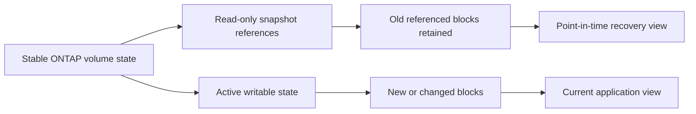

### Snapshot is not four other things

| Snapshot is not automatically... | Missing property |
|---|---|
| Backup | Independent failure/security/administrative domain and tested catalog |
| Replication | Another system/site copy and transfer policy |
| Archive | Long-term governance, media/lifecycle, and retrieval design |
| Application-consistent recovery | Application flush/quiesce/log coordination and verified restart |

---

## 2. Safe conceptual mechanics

At a safe architecture level, ONTAP creates a stable point-in-time set of volume block mappings. Unchanged blocks can be referenced by both active state and snapshots. When active data changes, new data is written elsewhere under WAFL's architecture while the snapshot continues referencing prior blocks.

```mermaid
sequenceDiagram
    autonumber
    participant A as Application/host
    participant O as ONTAP/WAFL
    participant S as Snapshot metadata
    participant D as Stored blocks
    A->>O: Write current data
    O->>D: Persist data through current ONTAP write path
    O->>S: Capture point-in-time volume mappings
    A->>O: Overwrite or delete later
    O->>D: Write new state; retain old referenced blocks
    S->>D: Continue to reference prior state
    Note over O,D: Internal implementation details and ordering are release-specific
```

### What snapshot creation establishes

- A storage-level point in time for the scoped volume or supported consistency group.
- A read-only recovery image under exact ONTAP behavior.
- No automatic proof that application buffers were flushed or that an external catalog committed.
- No second copy if the referenced blocks remain on the same storage.
- No guarantee that credentials, DNS, compute, keys, or runbooks needed for recovery survive.

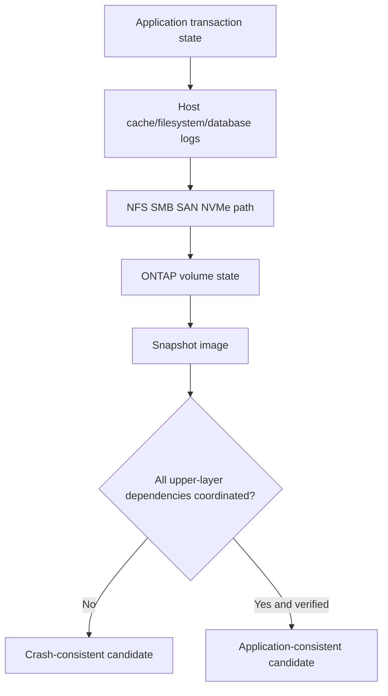

---

## 3. Crash consistency, storage consistency, and application consistency

**Crash consistency** means recovered storage resembles the state after an abrupt power loss: completed storage writes are present according to the stack's guarantees, while in-memory or partially coordinated application work may need log replay or may be incomplete. **Application consistency** means the application participated so related data is captured in a restartable, transactionally meaningful state under its documented method.

### Plain-English deep-dive: a photograph during business versus after closing the books

A crash-consistent snapshot is a photograph taken instantly while accountants are working. The ledger may be recoverable using its journal, but some papers are still on desks. An application-consistent snapshot asks the accountants to finish or pause a transaction, place papers in the ledger, then takes the photograph. **Why it matters:** storage can capture a precise instant without understanding database transactions, distributed services, or external queues.

| Level | What is coordinated | Typical recovery work | Proof required |
|---|---|---|---|
| Storage/volume point in time | ONTAP mappings for scoped volume | File-system or application recovery may run | Snapshot identity and readable data |
| Crash-consistent | Storage state like sudden stop | Journal/log replay; app checks | Successful application restart and transactions |
| Application-consistent | App flush/freeze/quiesce plus storage capture | Usually less replay; still validate | Integration logs and business transaction tests |
| Multi-application/business consistent | All dependent apps/catalogs/queues coordinated | Orchestrated recovery | End-to-end business workflow test |

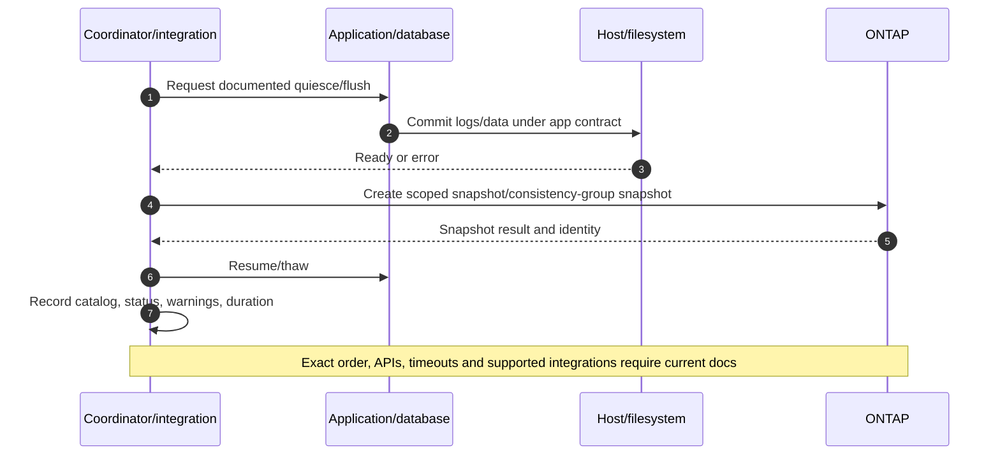

### Consistency groups

An ONTAP **consistency group** manages a collection of volumes as one application-oriented unit. Current documentation describes simultaneous crash-consistent or application-consistent snapshots and a brief I/O fence for group snapshot creation. Exact feature availability, hierarchy, interfaces, protocols, latency effects, protection, and release support must be checked.

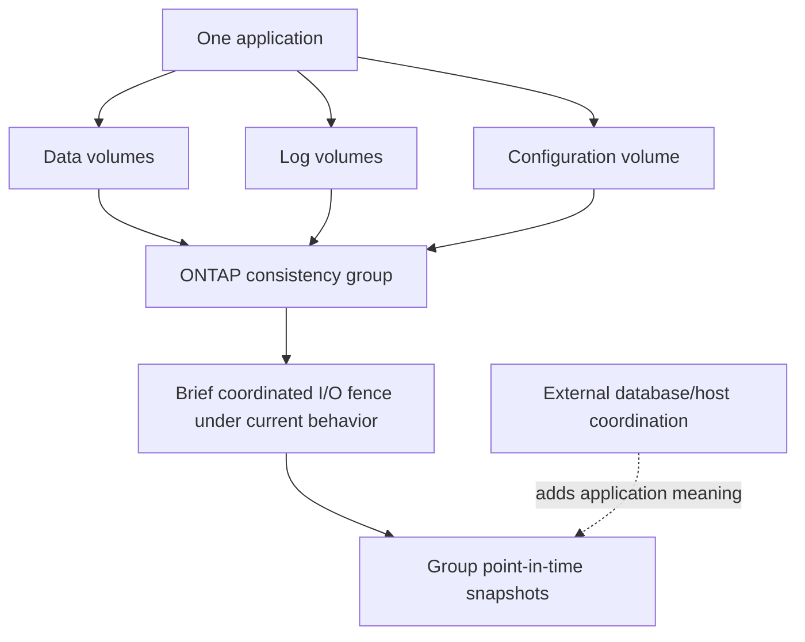

Creating a consistency group does not itself prove the application was quiesced, and creating one does not automatically enable every local or remote protection feature.

---

## 4. Policies, schedules, labels, and retention

A **snapshot policy** connects one or more schedules to retention behavior and, where applicable, labels used by protection workflows. A **schedule** says when to attempt creation. A **label** classifies a snapshot so a SnapMirror policy rule can select it. **Retention** says what to keep under exact policy behavior.

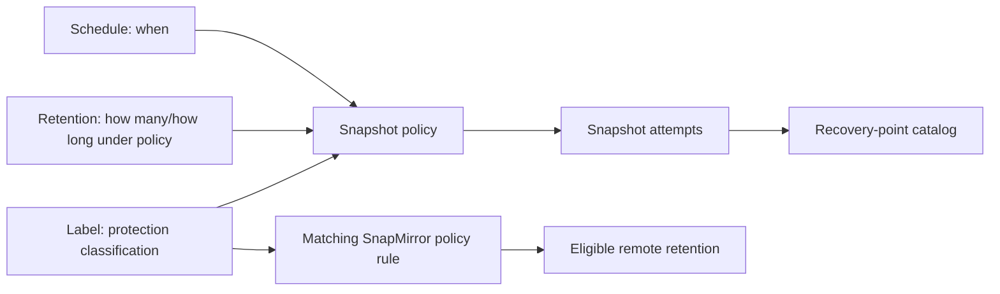

### Policy design questions

1. What business recovery-point objective (RPO) and retention obligation exist?
2. How often does meaningful application state change?
3. Which points need application coordination rather than storage-only capture?
4. Which labels must match remote replication rules?
5. What happens after a failed scheduled creation or missed application quiesce?
6. Which snapshots are policy-created, user-created, integration-created, or replication-created?
7. Which points are protected from ordinary deletion, and by what current feature?
8. Who reviews age, count, space, failures, and restore-test evidence?

### Retention is a coverage curve

```mermaid
timeline
    title Synthetic recovery coverage
    08:00 : Frequent operational point
    12:00 : Frequent operational point
    18:00 : Daily labeled point
    Day 7 : Weekly labeled point
    Month 1 : Monthly labeled point
    Later : Independent archive if required
```

Do not infer that a schedule ran successfully because it exists. Catalog the actual snapshot name, timestamp, source, label, state, age, scope, application result, replication result, and restore-test status.

---

## 5. Snapshot reserve and space interactions

The **snapshot reserve** sets aside volume space for snapshots under current ONTAP behavior. It is not a hard separate container: when snapshot consumption exceeds its reserve, space interactions can affect the active file system. Change rate, not snapshot count alone, is the primary driver of retained-block growth.

### Plain-English deep-dive: reserved archive shelves can overflow into the workroom

The records room has shelves reserved for old binders. If many pages change, old binders fill those shelves and can overflow into the workroom. Deleting today's binder does not free its pages while old catalogs still require them. **Why it matters:** an administrator can delete active files and see less free-space recovery than expected; emergency snapshot deletion can also destroy recovery points or clone/replication dependencies.

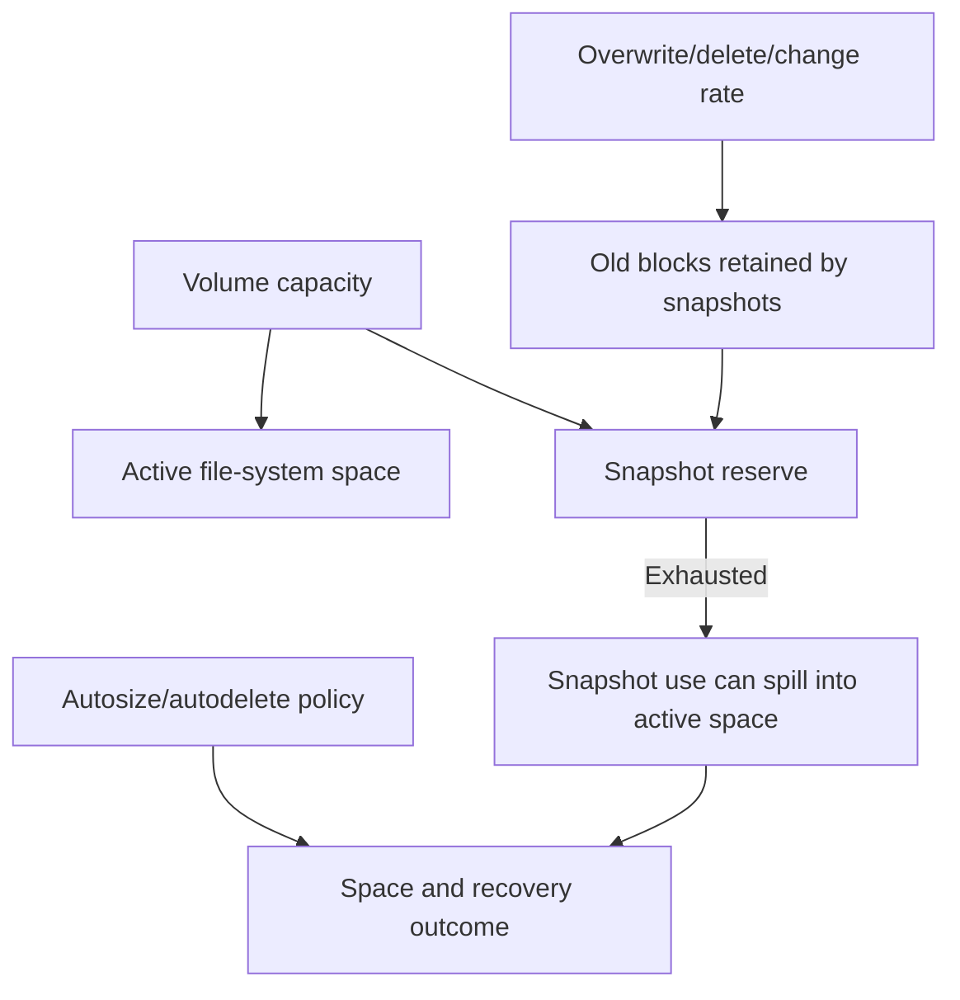

### Space drivers

| Driver | Effect | Evidence |
|---|---|---|
| High overwrite/delete rate | More old blocks retained | Change-rate trend by workload |
| Longer retention | References live longer | Actual age/count and policy |
| Large deletion after snapshot | Deleted blocks remain referenced | Snapshot delta/space timeline |
| FlexClone dependency | Base blocks remain shared | Parent/base snapshot/clone graph |
| Replication labels | Points may be required remotely | Policy rules/common snapshots |
| Reserve exhaustion | Consumption can affect active space | Reserve used, volume free, physical headroom |
| Autodelete | May remove eligible recovery points | Exact trigger/order/audit/dependency |

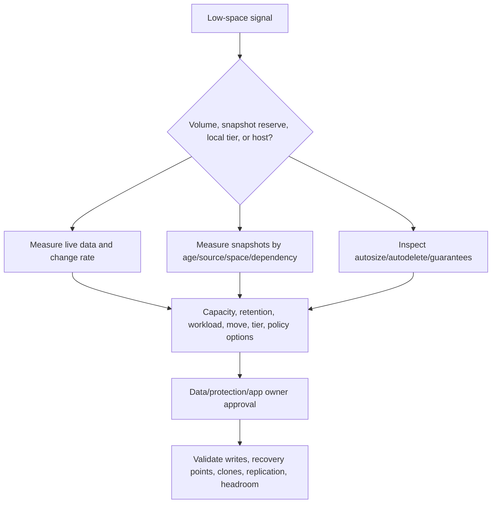

Never delete snapshots solely because one appears large. Snapshot size views are scoped accounting; determine which changed blocks, dependencies, and restore commitments the point represents.

---

## 6. Recovery catalog and discovery

A trustworthy recovery catalog connects a business service to actual recoverable points and every dependency needed to use them.

| Catalog field | Required question |
|---|---|
| Business service/application | What user transaction depends on this data? |
| Cluster/SVM/volume/LUN/file | What exact object is captured? |
| Snapshot identity/time/source | Which point, time zone, creator, and policy? |
| Consistency status | Storage, crash, application, or unknown? |
| Application evidence | Did quiesce/flush/resume succeed without warnings? |
| Label/replication | Was it selected and transferred remotely? |
| Dependency | Clone, common snapshot, legal retention, catalog, key? |
| Capacity | Snapshot/reserve/volume/local-tier headroom and change rate? |
| Restore test | What scope was restored, when, and which transaction passed? |
| Owner/expiry | Who decides retention and deletion? |

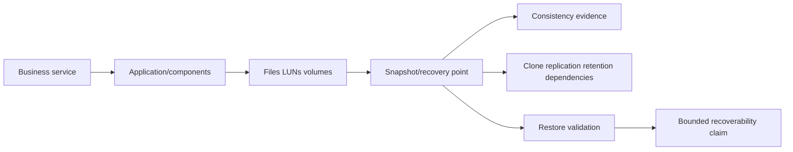

### Read-only discovery sequence

Examples are conceptual placeholders, not production commands. Verify exact current help, privilege, API schema, authorization, and support procedure.

```text
CONCEPTUAL ONLY - not production commands
<volume-family> show -fields <documented-size-space-policy-fields>
<snapshot-policy-family> show -fields <documented-schedule-label-retention-fields>
<snapshot-family> show -fields <documented-identity-time-size-state-fields>
<consistency-group-family> show -fields <documented-members-policy-state-fields>
<clone-family> show -fields <documented-parent-base-space-dependency-fields>
<protection-family> show -fields <documented-relationship-common-snapshot-fields>
```

---

## 7. Choose the smallest safe restore scope

Recovery scope should match the damaged object. A file restore is narrower than a LUN restore; a full-volume rollback affects all current contents in the volume. A clone can provide an isolated writable recovery workspace before overwriting production.

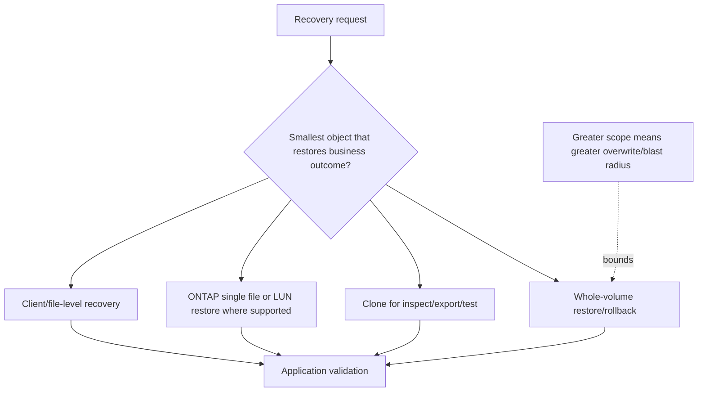

### Scope comparison

| Method | Best fit | Main hazard | Validation |
|---|---|---|---|
| Client-visible file recovery | Known file/version; NAS path supports it | Permissions, streams, open files, app catalog | Hash/metadata plus app open/use |
| ONTAP file restore | Specific file to original/alternate path where supported | Replace/collision/path semantics | File identity, ACL/metadata, app transaction |
| LUN restore | Specific LUN recovery under documented workflow | Host cache, signatures, mappings, reservations, filesystem | Offline/isolated host and app checks |
| FlexClone | Inspection, test, alternate recovery | Shared-block parent/base and access/security | Isolated mount, app consistency, cleanup plan |
| Volume restore | Broad corruption/deletion across volume | Newer valid data and protection relationships | Full app/dependency transaction suite |

### Restore workflow

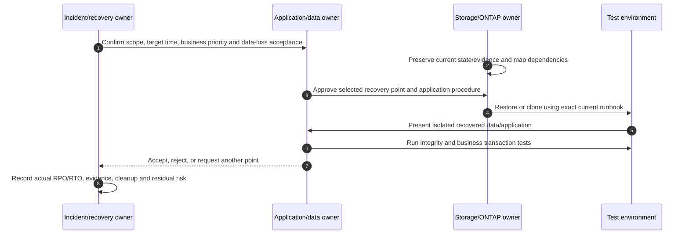

---

## 8. Volume rollback hazards

A full-volume restore can replace current active content with the snapshot's earlier state. It can invalidate newer data, application logs, external database references, replication relationships, clone assumptions, and user sessions.

### Plain-English deep-dive: restoring the whole shared drive rewinds everyone

If one spreadsheet is corrupt, replacing the entire department drive with yesterday's version also removes every valid file created today. The storage operation may be fast while business reconciliation takes hours. **Why it matters:** technical restore speed is not the same as recovery time objective (RTO), and “successful” storage rollback can still leave an unusable application.

### Pre-rollback gates

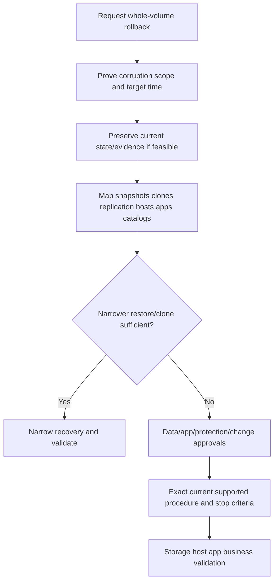

Required questions include active writers, host caches, open files, database logs, LUN presentation, replication common points, snapshots newer than target, external catalogs, encryption keys, identity/DNS, and the disposition of current state.

---

## 9. FlexClone concepts and dependencies

A **FlexClone volume** is a writable point-in-time copy that initially shares unchanged data blocks with its parent and base snapshot. Exact FlexVol/FlexGroup, read-write/data-protection, file/LUN clone, split, SnapLock, MetroCluster, FabricPool, license, and version behavior must be checked.

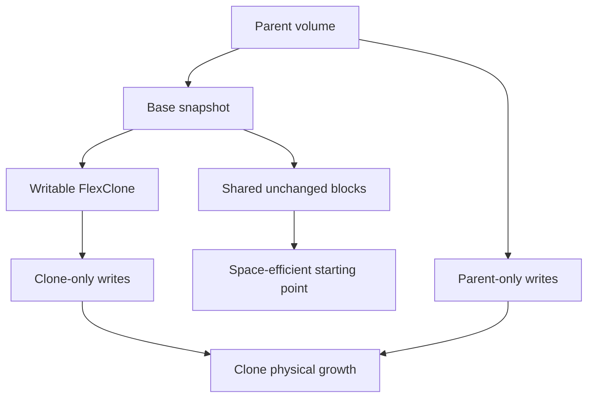

### Dependency graph

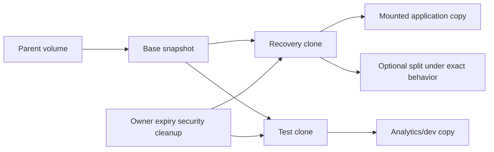

### Clone controls

- Record parent, base snapshot, creation purpose, owner, expiry, access path, data classification, and cleanup.
- Forecast unique writes and parent changes; a small initial footprint is not a fixed size.
- Isolate network identities, host signatures, domain membership, databases, schedulers, email, and external integrations.
- Never connect a cloned application to production queues or users without an approved isolation design.
- Verify whether deleting or splitting parent/base objects is permitted and what space/protection effect follows.
- Treat clone data as production-sensitive if its source is production-sensitive.

---

## 10. Snapshot, clone, replication, and backup dependencies

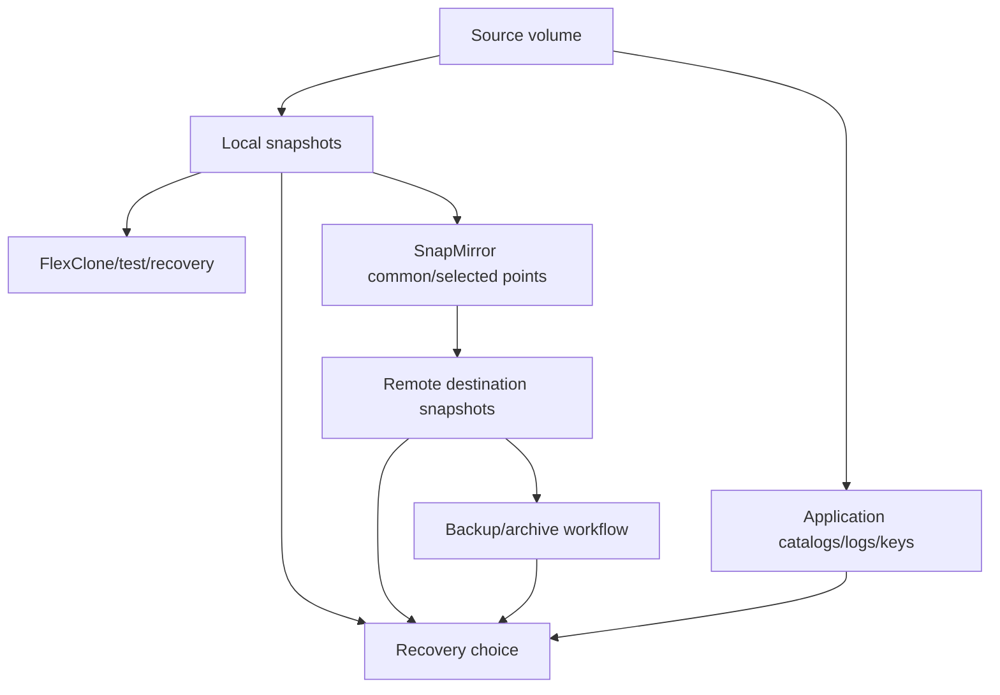

### Dependency hazards

| Action | Hidden dependency to check |
|---|---|
| Delete snapshot | Clone base, SnapMirror common point, legal/retention, unresolved incident |
| Roll back volume | Replication state, newer snapshots, application/catalog timeline |
| Restore LUN | Host mappings, signatures, reservations, multipathing, filesystem cache |
| Create clone | Capacity growth, identity isolation, parent/base retention |
| Split clone | Exact platform/volume behavior and physical capacity |
| Change policy | Label matching, remote retention, missed coverage, autodelete |

**Snapshot is not backup:** local snapshots share administration, storage, and often site. A backup design needs independent recovery copies, catalog, credentials, retention/immutability as required, and tested restore paths. Part 37 expands this distinction.

---

## 11. Restore validation and recoverability evidence

Recovery is proven only when the intended business outcome works from the selected point.

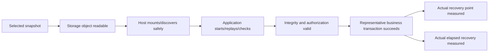

### Validation ladder

1. Snapshot exists, is valid under current evidence, and matches intended UTC/local time.
2. Restored bytes/metadata are readable and scoped correctly.
3. Host/filesystem/LUN state is coherent and safely presented.
4. Application recovery/log replay completes without ignored errors.
5. Application objects, catalogs, permissions, and keys align.
6. A representative create/read/update/delete or business transaction succeeds.
7. Protection resumes and a new valid recovery point is created where approved.
8. Actual data loss and elapsed time are compared with RPO/RTO; gaps become actions.

---

## 12. Failure modes and troubleshooting decision tree

| Symptom | Candidate causes | Discriminating evidence |
|---|---|---|
| Expected snapshot missing | Schedule/policy disabled, creation failure, wrong scope/time, autodelete | Policy, job/event, audit and catalog timeline |
| Snapshot exists but app fails | Crash-only state, failed quiesce, missing log/catalog/dependency | Integration and app recovery logs |
| Space does not free after delete | Other snapshots/clones reference blocks, reporting delay/scope | Reference/dependency and capacity ladder |
| Volume fills despite reserve | Change rate, reserve spill, active growth, clone/replication effects | Reserve/volume/local-tier time series |
| File restored but unusable | Wrong version/path, ACL/stream/metadata, app catalog mismatch | File metadata/hash and app transaction |
| LUN restore causes host issue | Cached device, duplicate signature, mapping/reservation/path state | Isolated host/storage mapping evidence |
| Rollback breaks replication | Common-snapshot/relationship state changed | Relationship state and current official procedure |
| Clone unexpectedly grows | Unique writes, parent change, snapshots, workload | Shared versus unique physical trend |
| Restore misses RTO | Discovery/approval, large scope, app replay, dependencies | Stage-by-stage timed timeline |

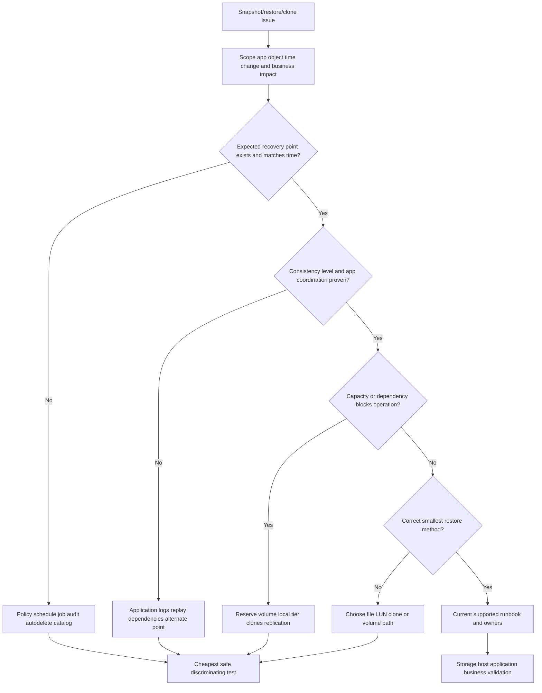

### Supportability and escalation boundary

- Do not delete recovery points, roll back volumes, overwrite files/LUNs, split clones, alter reserves/autodelete, or disrupt applications from this chapter.
- Storage/NetApp Support owns exact ONTAP procedures and defect evaluation.
- Application/database owners own quiesce, log replay, integrity, and business acceptance.
- Host/SAN/NAS owners own presentation, cache, identity, path, and filesystem safety.
- Protection/security/legal owners approve retention, deletion, evidence preservation, and independent copies.
- The TAM analyst assembles evidence, risk, options, owners, dates, validation, and residual risk without claiming command authority.

---

## 13. TAM discovery, evidence, risk, and recommendations

### Discovery questions

1. Which business service, application components, hosts, files/LUNs/volumes, owners, RPO, RTO, and retention obligations are in scope?
2. Which ONTAP release/platform/SVM/volume/protocol/consistency-group architecture holds the data?
3. Which snapshot policies, schedules, labels, counts/ages, creators, failures, and actual points exist?
4. Which points are storage-, crash-, or application-consistent, and what proves quiesce/flush/resume?
5. What are active, snapshot, reserve, volume, local-tier, clone, and protection space trends?
6. Which clones, SnapMirror common points, legal controls, catalogs, keys, or applications depend on each point?
7. Which smallest restore method meets the outcome, and what current documentation supports it?
8. When was each file/LUN/volume/application restore tested, and what business transaction passed?
9. What current state must be preserved before recovery and who accepts newer-data loss?
10. Which gaps require NetApp Support, application, host, security, legal, or network specialists?

### Minimum evidence pack

- Business impact, exact affected data, target point, RPO/RTO, owners, approvals, and UTC timeline.
- Cluster/SVM/volume/LUN/file/consistency-group identities and ONTAP/platform/protocol versions.
- Snapshot policy/schedule/label/source/state/time/age/space plus job/event/audit evidence.
- Application coordinator, flush/quiesce/resume and recovery-log evidence.
- Reserve/volume/local-tier capacity, change rate, autosize/autodelete and clone graph.
- SnapMirror/backup/common-snapshot/retention/legal dependencies.
- Proposed scope, current official procedure, prerequisites, stop/rollback/forward-recovery plan.
- Storage, host, application, data-integrity and business validation with actual RPO/RTO.

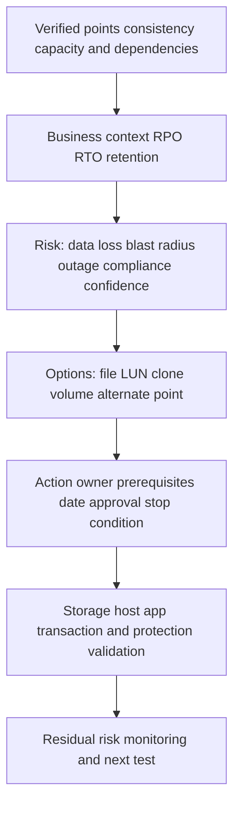

### Recommendation patterns

| Finding | Risk | Bounded recommendation | Proof |
|---|---|---|---|
| Local snapshots called backup | Shared failure/admin domain leaves no independent recovery | Add independent protected copy and catalog under current support | Isolated restore test |
| Database spans volumes with uncoordinated policies | Cross-volume point may not restart coherently | Use documented app coordination/consistency-group design after support validation | Database recovery and transaction test |
| Reserve spill threatens writes | High change plus retention consumes active space | Model change/retention/capacity options; do not delete blindly | Sustained headroom and intact coverage |
| One file damaged; rollback proposed | Broad valid-data loss | Restore to alternate path or clone first | File/app validation before replacement |
| Old clones lack owners | Capacity/security/deletion dependencies grow | Inventory owner/base/data class/expiry and approved cleanup | Dependency-free cleanup and capacity trend |

### JD Mapping

| JD responsibility | Part 35 contribution | Arti's factual bridge and gap |
|---|---|---|
| Understand customer environment | Maps app-to-volume recovery dependencies | M365 data-service reasoning transfers; ONTAP operation unproven |
| Analyze and report risk | Builds recovery catalog, capacity and test evidence | Analytics/Power BI discipline transfers |
| Strategic best practice | Aligns RPO/RTO, retention, consistency and independent copies | Advisory background transfers |
| Stability/risk mitigation | Chooses narrow recovery and exposes rollback hazards | CRITSIT restoration focus transfers |
| Supportability | Requires exact current ONTAP/app/tool evidence | No IMT/customer/tool result claimed |
| Customer communication | Separates snapshot existence from recoverability | Executive update strength transfers |
| Escalation | Produces exact point, timeline, dependency, and validation pack | Product-group collaboration transfers |

---

## 14. Fully synthetic scenario: Northwind Claims database recovery

> **Synthetic case:** Northwind Claims, every system, point, policy, metric, timeline, and outcome below is fictional. It is not a NetApp customer, benchmark, internal workflow, tool result, or Arti's production work.

### Environment and incident

- A claims application stores database data on `claims_data`, logs on `claims_log`, and documents on `claims_docs`.
- Independent volume policies run at different minutes; no documented application coordinator exists.
- A local snapshot from 10:00 is proposed after accidental deletion at 10:17.
- A reporting clone depends on the 10:00 data-volume snapshot.
- SnapMirror replication exists, but labels and update status have not been reconciled.
- The business needs one deleted claim set, not a whole-volume rewind.

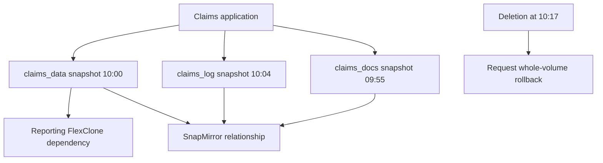

### Timeline and evidence

```mermaid
sequenceDiagram
    autonumber
    participant U as User/application
    participant D as Database volumes
    participant O as ONTAP snapshots
    participant R as Recovery team
    O->>D: Document volume point at 09:55
    O->>D: Data volume point at 10:00
    O->>D: Log volume point at 10:04
    U->>D: Continue valid transactions
    U->>D: Delete claim set at 10:17
    R->>O: Propose all-volume rollback
    O-->>R: Times differ; app consistency unknown; clone dependency exists
```

| Evidence | Observation | Bounded conclusion |
|---|---|---|
| Snapshot times | Three volumes differ by nine minutes | No coherent multi-volume point is proved |
| App logs | No quiesce/flush record | Application consistency is unknown |
| Scope | One claim set deleted | Whole-volume rollback is disproportionate |
| Clone graph | Reporting clone uses data snapshot | Deletion/cleanup has dependency risk |
| Replication | Relationship exists; label/status not verified | Remote recoverability cannot be claimed |
| Current activity | Valid claims entered after 10:00 | Rollback would remove good data |

### Competing hypotheses

| Hypothesis | Evidence for | Disconfirming check |
|---|---|---|
| 10:00 is application-consistent | Snapshot exists | Find coordinator/app flush evidence and aligned volumes |
| Full rollback is fastest recovery | Storage operation can be broad | Measure reconciliation and valid-data loss |
| Snapshot deletion frees expected space | Snapshot appears large | Map clone/other snapshot references |
| Remote copy is safe | SnapMirror configured | Verify relationship status, lag, labels, point, restore test |
| File-level recovery is enough | Documents may be recoverable | Verify database/catalog transaction dependencies |

### Decision

```mermaid
flowchart TD
    INC[Deleted claim set] --> PRES[Preserve current state and audit]
    PRES --> MAP[Map DB log document and external catalog records]
    MAP --> NARROW{Can selected records/files be recovered to isolation?}
    NARROW -->|Yes| CL[Create approved clone/alternate restore]
    NARROW -->|No| APPREC[Use database-supported point/log recovery plan]
    CL --> TEST[Validate claim IDs attachments permissions and transaction]
    APPREC --> TEST
    TEST --> MERGE[Owner-approved merge/forward recovery]
    MERGE --> PROTECT[Validate new point replication and residual gap]
```

### Recommendations

1. Reject an immediate whole-volume rollback because it would discard valid post-10:00 work and the three snapshots are not a proven application-consistent set.
2. Preserve current state and audit evidence; use an approved isolated clone or alternate-path restore to inspect the smallest recoverable claim objects.
3. Have the database/application owner reconcile data, logs, document metadata, and claim IDs and approve a forward-recovery/merge method.
4. Map the reporting clone and SnapMirror common/selected snapshot dependencies before any snapshot deletion or relationship action.
5. Design a current-supported application-coordinated or consistency-group policy, align labels with remote retention, and test a complete claim transaction restore.

### Customer-facing summary

> "A 10:00 storage snapshot exists, but the data, log, and document volumes were captured at different times and there is no application-quiesce evidence. A full rollback would also remove valid claims created after 10:00. We recommend preserving current state, recovering the smallest claim set into isolation, validating database and document references with the application owner, and then building an application-coordinated policy plus a tested remote restore."

---

## 15. Arti's factual transfer and honest positioning

```mermaid
flowchart LR
    M365[SharePoint/OneDrive versions and recovery] --> SCOPE[Recovery-point and user-impact reasoning]
    CRIT[CRITSIT ownership] --> INC[Preserve restore communicate validate]
    AZ[Azure/Windows/networking] --> DEP[Host identity DNS key and app dependencies]
    BI[Excel Power BI SQL Python] --> CAT[Recovery catalog change/space/test trends]
    SCOPE --> METHOD[ONTAP conceptual method]
    INC --> METHOD
    DEP --> METHOD
    CAT --> METHOD
    METHOD --> LAB[Future authorized lab/SME validation]
```

### Honest interview answer

> "I understand an ONTAP snapshot as a read-only point-in-time volume image that shares unchanged blocks, so change rate and retention drive space. I separate crash consistency from application coordination, choose the smallest safe file, LUN, clone, or volume recovery scope, map clone and replication dependencies, and validate through a business transaction. My production experience is Microsoft enterprise support and data-service recovery, not ONTAP snapshot or restore administration. I would use current documentation, authorized evidence, application runbooks, and NetApp specialists before any change."

---

## 16. Whiteboard drills, paper lab, and self-test

### Whiteboard drills

1. Draw active mappings, snapshot references, changed blocks, and retained old blocks.
2. Explain storage, crash, application, and business consistency.
3. Draw policy -> schedule -> snapshot -> label -> SnapMirror rule.
4. Draw reserve, spill, active space, and local-tier headroom.
5. Draw app -> volumes -> consistency group -> external coordinator.
6. Rank file, LUN, clone, and volume restore by blast radius.
7. Draw parent -> base snapshot -> clone -> unique writes.
8. Prove why snapshot is not backup.

### Paper lab

A fictional hospital has 80 volumes, six databases spanning multiple volumes, NAS files, 40 LUNs, eight policies, local snapshots, SnapMirror, backup, 23 clones, mixed labels, reserve pressure, and no complete recovery catalog. One database has corruption and executives request the newest snapshot.

Tasks:

1. Build the app/host/file/LUN/volume/consistency-group ownership map.
2. Inventory actual snapshots by source, time, age, label, state, and policy.
3. Classify each point as storage-, crash-, application-consistent, or unknown with evidence.
4. Reconcile active/snapshot/reserve/volume/local-tier/clone capacity and change rate.
5. Map every clone, common snapshot, replication, retention, legal, and catalog dependency.
6. Select the smallest safe recovery scope and an alternate point.
7. Preserve current state and define approvals, stop criteria, and escalation boundaries.
8. Simulate missing snapshot, failed quiesce, reserve spill, clone growth, and stale remote point.
9. Restore into isolation on paper; validate storage, host, application, integrity, identity, and business transaction.
10. Measure actual synthetic RPO/RTO and identify the longest stage.
11. Write five recommendations with owner, date, proof, and residual risk.
12. Present the No-production-NetApp boundary accurately.

```mermaid
flowchart LR
    INV[Inventory scope and points] --> CONS[Classify consistency]
    CONS --> CAP[Reconcile capacity/dependencies]
    CAP --> SELECT[Select narrow recovery]
    SELECT --> SIM[Simulate failures]
    SIM --> VALID[Validate full business outcome]
    VALID --> REC[Write recommendations]
```

### Lab pass checklist

- [ ] No snapshot is called an independent backup.
- [ ] Every point has scope, time zone, source, label, consistency, and owner.
- [ ] Change rate, reserve, volume, local-tier, clone, and replication space are reconciled.
- [ ] Application consistency requires positive coordination evidence.
- [ ] The smallest safe restore scope is selected before rollback.
- [ ] Current state and newer valid data are preserved/accounted for.
- [ ] Clone/base/common-snapshot/legal dependencies are mapped.
- [ ] Validation reaches a representative business transaction.
- [ ] No hard limit, percentage, command, or guarantee is reused without current verification.
- [ ] Synthetic work is not presented as production ONTAP experience.

### Self-test

1. Define active file system, snapshot, changed block, recovery point, restore, rollback, and clone.
2. Explain safe ONTAP snapshot mechanics without inventing internals.
3. Separate storage, crash, application, and business consistency.
4. Explain consistency groups and external application coordination.
5. Connect schedules, policies, labels, retention, and actual catalog evidence.
6. Explain snapshot reserve, change rate, spill, autodelete, and deletion behavior.
7. Build a recovery catalog and dependency graph.
8. Compare client file, ONTAP file/LUN, clone, and volume recovery.
9. List full-volume rollback hazards and pre-gates.
10. Explain FlexClone shared and unique blocks, parent/base dependencies, and growth.
11. Explain snapshot/clone/SnapMirror/backup interactions.
12. Validate storage through business outcome and calculate actual RPO/RTO conceptually.
13. Apply the troubleshooting tree to a missing or unusable point.
14. Build discovery, evidence, risk, recommendation, owner, validation, and residual-risk fields.
15. Recreate Northwind's competing hypotheses and narrow recovery decision.
16. State Arti's factual transfer and explicit gap without inflation.

---

## 17. Official Source Anchors

**Date checked: 2026-08-24.** These official public sources anchor ONTAP snapshot, consistency-group, restore, and FlexClone concepts. Exact limits, defaults, labels, policies, application integration, reserve/autodelete behavior, restore semantics, clone features, commands, licensing, and protection interactions are release/platform/application sensitive. Re-open the exact current pages and authorized support evidence before use.

| Topic | Official public source | Bounded use and currency note |
|---|---|---|
| Local snapshots | [Learn about managing local ONTAP snapshots](https://docs.netapp.com/us-en/ontap/data-protection/manage-local-snapshot-copies-concept.html) | Read-only point-in-time volume image, current snapshot categories; verify release limits |
| Snapshot policies | [Configure custom ONTAP snapshot policies](https://docs.netapp.com/us-en/ontap/data-protection/configure-custom-snapshot-policies-concept.html) | Current schedule/policy/label workflow; exact fields vary |
| Snapshot reserve | [Learn about managing the ONTAP snapshot reserve](https://docs.netapp.com/us-en/ontap/data-protection/manage-snapshot-copy-reserve-concept.html) | Pointer/changed-block and reserve-spill concepts; no percentage reused as universal design |
| NAS file recovery | [Restore a file from a snapshot on an NFS or SMB client](https://docs.netapp.com/us-en/ontap/data-protection/snapshot-copies-work-concept.html) | Client-visible recovery path; permissions/application caveats remain |
| File/LUN restore | [Restore a single file from an ONTAP snapshot](https://docs.netapp.com/us-en/ontap/data-protection/restore-single-file-snapshot-task.html) | Current single-file/LUN workflow and caveats; verify protocol/release |
| Volume restore | [Restore the contents of a volume from an ONTAP snapshot](https://docs.netapp.com/us-en/ontap/data-protection/restore-contents-volume-snapshot-task.html) | Broad restore and SnapMirror interaction warning; use exact runbook |
| Consistency groups | [Learn about ONTAP consistency groups](https://docs.netapp.com/us-en/ontap/consistency-groups/index.html) | Multi-volume grouping, fencing, protection, version matrix |
| FlexClone volumes | [Learn about ONTAP FlexClone volumes](https://docs.netapp.com/us-en/ontap/volumes/flexclone-efficient-copies-concept.html) | Writable shared-block copy and broad clone types; exact support varies |
| Create/split/space | [Create an ONTAP FlexClone volume](https://docs.netapp.com/us-en/ontap/volumes/create-flexclone-task.html) | Current dependencies/licensing/version caveats; not a production procedure here |
| Application-aware protection | [SnapCenter documentation](https://docs.netapp.com/us-en/snapcenter/) | Verify exact plug-in, application, host, ONTAP, consistency and restore support |
| Data protection | [ONTAP data protection and disaster recovery](https://docs.netapp.com/us-en/ontap/data-protection-disaster-recovery/) | Official protection navigation and relationship context |
| Supportability | [NetApp Interoperability Matrix Tool](https://imt.netapp.com/) | Potentially gated exact ecosystem combinations and notes |
| Platform facts | [NetApp Hardware Universe](https://hwu.netapp.com/) | Potentially gated platform facts; not application-consistency proof |
| Support | [NetApp Support Site](https://mysupport.netapp.com/) | Entitlement-dependent procedures, defects, cases, and knowledge |

### Source-use discipline

- Record exact ONTAP/platform/SVM/volume/protocol/application/integration and date.
- Cite the exact policy, schedule, label, retention, consistency, and recovery scope.
- Preserve timestamps, time zones, job/audit/integration results, and missing evidence.
- Do not convert a documented maximum/default into a customer recommendation.
- Do not expose customer data, snapshot names, paths, LUN identities, or credentials unnecessarily.
- Mark IMT/HWU/Support/customer access gaps explicitly; never fabricate a result.

---

## Likely Interview Questions

### Q1. What is an ONTAP snapshot, and why is it space-efficient?

> **Model answer:** "It is a read-only point-in-time image of a volume. At a safe conceptual level, it records stable block mappings and shares unchanged blocks with the active state; later changes require old referenced blocks to remain. Creation therefore need not copy the full volume, but change rate and retention consume space. It remains in the storage failure and administrative domain, so it is not automatically a backup."

### Q2. Compare crash consistency and application consistency.

> **Model answer:** "Crash consistency resembles recovery after abrupt power loss: persisted writes are present, but journals or logs may replay and in-memory transactions may be absent. Application consistency adds documented flush, freeze, quiesce, or coordinator steps across the application's data. A consistency-group snapshot can coordinate volume timing, but application meaning still needs positive integration evidence and a restart/transaction test."

### Q3. How do schedules, policies, labels, and retention fit together?

> **Model answer:** "A schedule defines when snapshot creation is attempted; a snapshot policy combines schedules and retention behavior; a label classifies a point for matching protection rules such as SnapMirror; retention determines coverage. I verify actual created points, failures, labels, age, replication, consistency and tests rather than infer success from configured policy."

### Q4. Why can snapshots consume space after files are deleted?

> **Model answer:** "A snapshot still references the old blocks, so deleting the active file removes the current reference but cannot free blocks needed by retained snapshots or clones. Change rate drives consumption; reserve overflow can affect active space. I reconcile active, snapshot, reserve, volume, local-tier, clone and replication scopes before retention or deletion actions."

### Q5. How do you choose among file, LUN, clone, and volume restore?

> **Model answer:** "I choose the smallest scope that restores the business outcome. A file restore is narrow; a LUN requires host/device safety; a clone supports isolated inspection and application testing; a volume restore broadly rewinds current content. I preserve current state, map dependencies, obtain data/app approvals, follow exact current procedures, and validate through a representative transaction."

### Q6. What is FlexClone, and what risks must be managed?

> **Model answer:** "A FlexClone volume is a writable point-in-time copy that initially shares unchanged blocks with its parent and base snapshot. Unique writes and parent changes grow physical use. I track parent/base dependencies, capacity, identity/network isolation, data classification, owner/expiry, protection and cleanup, and verify exact split and feature support before action."

### Q7. What makes a snapshot restore test credible?

> **Model answer:** "It selects a known point, measures actual RPO and elapsed RTO, restores the intended scope in a safe environment, validates storage and host access, completes application recovery/log replay, checks integrity/permissions/catalogs/keys, and runs a representative business transaction. It also confirms protection resumes and records failures, owners, evidence and residual risk."

### Q8. How does your background transfer, and what remains a gap?

> **Model answer:** "Microsoft support, SharePoint/OneDrive recovery concepts, Azure/Windows dependencies, CRITSIT ownership and analytics give me scope, evidence, restoration, communication and catalog discipline. I understand ONTAP snapshot/restore/clone architecture conceptually but have not operated it in production. I would use current docs, authorized evidence, application runbooks and NetApp specialists before changes."

---

## 30-Second Memory Hooks

- **Snapshot:** Read-only point-in-time map, not an automatic second copy.
- **Changed block:** New state is written; old referenced state stays.
- **Crash consistency:** Power-loss-like image; logs may replay.
- **Application consistency:** The application closes its books before the picture.
- **Consistency group:** Coordinate the volume set; app meaning still needs proof.
- **Schedule:** When to try; **policy:** what rule set; **label:** which protection class.
- **Retention:** Coverage versus change-rate capacity.
- **Reserve:** Reserved shelves can overflow into the workroom.
- **Catalog:** A recovery point without identity, consistency, owner, and test is only a candidate.
- **Restore scope:** File before LUN before clone/volume when the outcome allows.
- **Rollback:** Rewinds good data too.
- **FlexClone:** Writable branch sharing its base until changes diverge.
- **Dependency:** Never delete a base/common point before mapping consumers.
- **Validation:** Bytes -> host -> application -> business transaction.
- **Snapshot is not backup:** Independence, catalog, retention, and tests are separate requirements.
- **Arti's bridge:** Recovery discipline transfers; production ONTAP operation does not.

---

## Completion Checklist

- [ ] Define snapshot mechanics at safe ONTAP conceptual depth.
- [ ] Separate storage, crash, application, and business consistency.
- [ ] Explain consistency-group and application-coordination boundaries.
- [ ] Map schedules, policies, labels, retention, and actual catalog evidence.
- [ ] Reconcile reserve, spill, change rate, active/volume/local-tier space.
- [ ] Build a complete recovery catalog and dependency graph.
- [ ] Compare file, LUN, clone, and volume recovery scopes.
- [ ] Gate full-volume rollback against newer data and dependencies.
- [ ] Explain FlexClone sharing, growth, parent/base, split, security, and cleanup caveats.
- [ ] Map snapshot, clone, replication, backup, legal, and catalog interactions.
- [ ] Validate storage through a representative business transaction and actual RPO/RTO.
- [ ] Apply the troubleshooting tree and support boundaries.
- [ ] Build discovery, evidence, risk, recommendation, owner, proof, and residual-risk fields.
- [ ] Recreate Northwind's synthetic analysis without calling it customer work.
- [ ] Complete the paper lab and self-test.
- [ ] Answer Q1-Q8 aloud and state Arti's exact production boundary.
- [ ] Recheck current docs, IMT/HWU, application guidance, and Support before customer use.

---

*Next suggested section:* [Part 36 - SnapMirror Replication Architecture and Policies](Part-36-snapmirror-replication-policies.md)