# Part 36 - SnapMirror Replication Architecture and Policies

> **Section goal:** Learn how SnapMirror connects a defined source and destination through peering, intercluster networking, snapshots, policy, and transfer state. By the end, you should be able to distinguish asynchronous, Sync, and StrictSync behavior; interpret relationship state/status/lag; reason safely about baseline, update, break, resync, reverse resync, deletion, fan-out, and cascade; and separate replication freshness from failover and application recovery readiness.

Covers index item **36** and maps directly to job-description responsibilities for storage depth, customer-environment discovery, risk analysis, supportability, strategic planning, preventative recommendations, operational service reviews, escalation quality, and high-pressure communication.

**Version caveat:** Exact SnapMirror relationship types, XDP/DP handling, policies, rules, labels, schedules, states, statuses, lag fields, limits, throttling, encryption, ports, initialization/update/resync behavior, synchronous modes, supported workloads, topology, commands, and compatibility must be verified against current official documentation and authorized evidence for the exact source/destination ONTAP releases, platforms, volume/SVM types, protocols, applications, and configuration.

This Part states no hard latency, bandwidth, peer, relationship, retention, RPO/RTO, transfer-time, or platform limit. It provides no executable production runbook. Any named default policy or state is an orientation from public documentation checked on the date below; inspect the actual policy and exact current release before use.

> **No-production-NetApp boundary:** You do not claim production NetApp or SnapMirror experience. Every cluster, SVM, LIF, relationship, transfer, policy, lag, incident, and recovery result below is synthetic. Your factual strengths are enterprise support, Azure/networking, SharePoint/OneDrive synchronization concepts, critical-situation ownership, analytics, stakeholder coordination, and customer communication. The explicit non-claim is: **you have not peered production ONTAP clusters/SVMs, configured intercluster LIFs, created or initialized SnapMirror relationships, changed policies/throttles, broken or resynchronized a production mirror, performed reverse resync/failback, or validated production NetApp DR.**

---

## 1. Replication vocabulary from zero

**Replication** copies selected data state from one storage object to another according to a relationship and policy. **SnapMirror** is ONTAP data-protection technology that uses point-in-time state and incremental transfers for supported replication and disaster-recovery designs.

### Plain-English deep-dive: a governed courier route, not teleportation

The source office prepares approved record batches. A trusted courier route carries them to a destination archive according to a timetable and retention card. The destination's latest received batch can lag behind current work. Opening the archive for business is a separate continuity process. **Why it matters:** relationship health, transfer success, data freshness, destination writability, application consistency, and failover readiness answer different questions.

| Term | Plain meaning | Analogy | Why it matters |
|---|---|---|---|
| **Source** | Authoritative sending volume/SVM in current direction | Publishing office | Defines current change stream |
| **Destination** | Receiving protection object | Secondary archive | Normally governed as a protection target until changed |
| **Relationship** | Stored source-destination replication contract | Courier account | Has type, policy, state, status, and history |
| **Baseline** | Initial transfer establishing destination state | First full shipment | Capacity/network/time intensive |
| **Incremental update** | Later transfer of changes/selected snapshots | Delta shipment | Supports periodic freshness |
| **Common snapshot** | Shared recovery point known to both ends | Last mutually signed manifest | Enables incremental resync/update paths |
| **Policy** | Rules for replication mode/content/retention | Shipping and retention contract | More important than a policy name alone |
| **Schedule** | When asynchronous transfer is attempted | Courier pickup calendar | Does not prove completion |
| **Lag** | Time-oriented freshness indicator under exact field semantics | Age of last delivered batch | Not identical to transfer duration or RPO |
| **Quiesce** | Stop/pause future transfers under documented behavior | Pause pickups | Does not necessarily make destination writable |
| **Break** | Change a protection destination so it can serve writes under workflow | Open archive for operations | Changes direction/state and recovery obligations |
| **Resync** | Reestablish replication from a common point under chosen direction | Reconcile ledgers | Can discard destination data newer than common point |

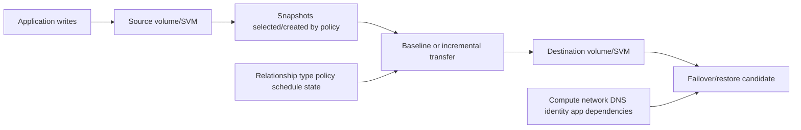

### Replication is not automatic recovery

| Evidence | Proves | Does not prove |
|---|---|---|
| Relationship exists | Configuration object exists | Transfer or recovery works |
| Transfer succeeded | A transfer completed | App-consistent point or current RPO |
| Lag is low | Destination freshness by field definition | Client failover path is ready |
| Destination has data | Protected bytes exist | Writable, mounted, authorized, or application-valid |
| Break completed | Destination role/state changed | Users can reach a coherent business service |

---

## 2. Architecture: clusters, SVMs, volumes, and peers

Before supported intercluster SnapMirror replication, the source and destination clusters and relevant storage virtual machines (SVMs) are peered. Cluster peering establishes trusted cluster communication; SVM peering authorizes a data-service relationship between SVMs.

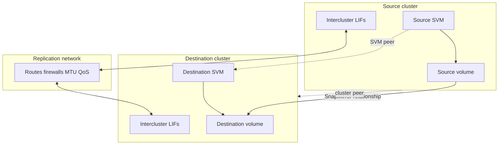

### Peer layers

| Layer | Purpose | Evidence question |
|---|---|---|
| Cluster identity/peer | Trusted cluster-to-cluster control | Correct UUID/name, availability, authentication, encryption? |
| SVM peer | Authorizes source/destination SVM relationship | Correct applications/permissions/state? |
| Volume/SVM relationship | Defines exact protected objects and policy | Correct direction, type, policy, schedule? |
| Intercluster network | Carries replication communication | Every required LIF path reachable and redundant? |

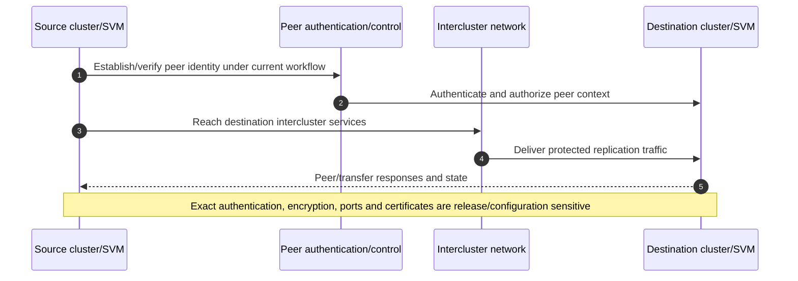

---

## 3. Intercluster LIF, network, DNS, certificate, and security concepts

An **intercluster logical interface (LIF)** is an ONTAP network endpoint used for cluster peering and replication traffic under its service policy. Current peering prerequisites require the documented connectivity pattern among intercluster LIFs; exact ports, IPspace, routing, firewall, encryption, failover, and shared/dedicated-port rules must be verified.

### Plain-English deep-dive: every loading dock needs a valid route

Each node has a courier loading dock. A green dock light only proves the dock is open; the route, firewall, return path, MTU, authentication, and remote dock must also work. DNS and certificates may matter to management or integrated workflows, but the exact replication path must be observed rather than assumed. **Why it matters:** one successful ping or one LIF does not prove all required peer paths, throughput, failover, or secure operation.

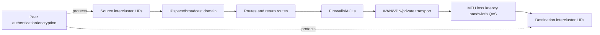

### Network evidence

- Source/destination node, port, LIF, IPspace, broadcast domain, service policy, address, route, failover target, and operational state.
- Pairwise required reachability, return path, firewall decisions, transport encryption, and peer status.
- Latency, loss, retransmission, throughput, congestion, QoS/policing, MTU, and competing traffic over the affected period.
- DNS/certificate/time dependencies for System Manager, automation, external orchestration, or named endpoints where actually used.
- Security ownership, key/authentication lifecycle, least administration, segmentation, and audit.

Do not publish remembered port lists or cipher requirements. Link the dated exact peering prerequisite page in the evidence pack.

---

## 4. Baseline and incremental update

Initialization establishes a baseline according to the relationship policy. Later updates transfer policy-selected new state using shared/common point-in-time lineage where supported.

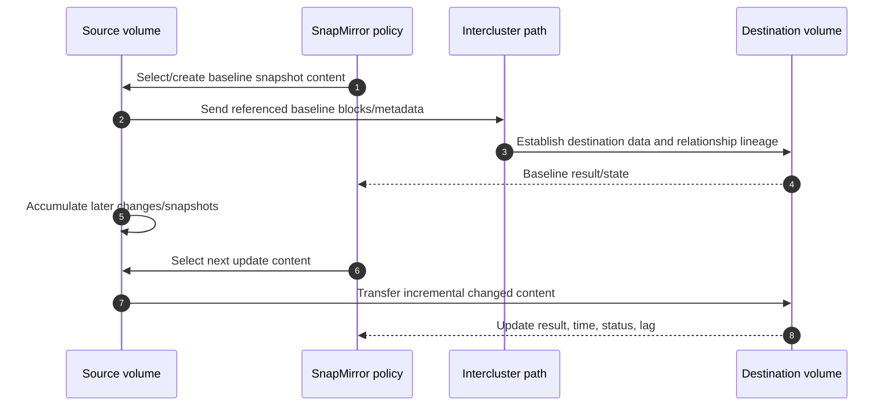

### Baseline planning

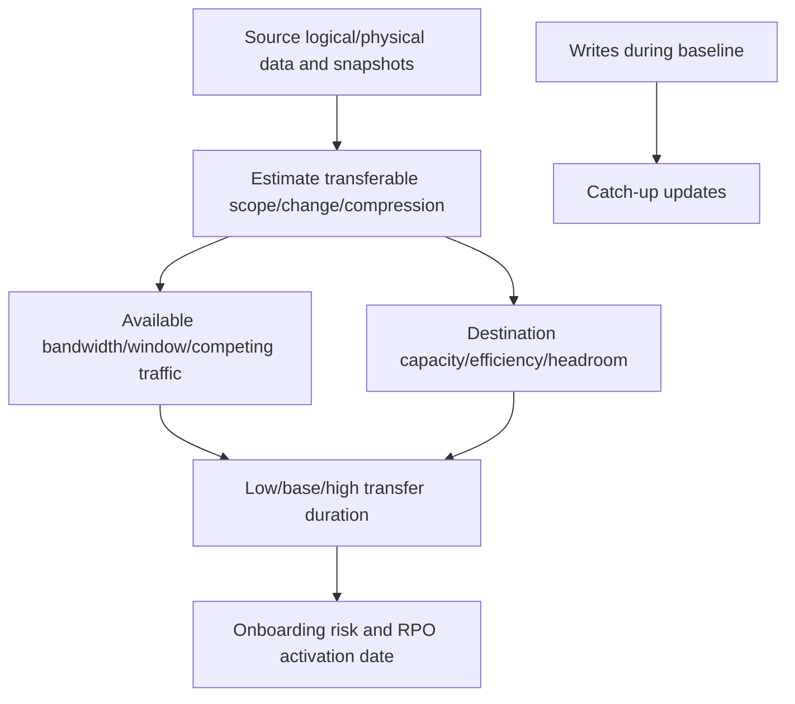

A newly created relationship is not protected until initialization and required follow-up validation complete. Baseline duration depends on actual data, change rate, network, source/destination resources, policy, topology, efficiency, and current product behavior.

### Incremental update questions

- Which common snapshot/lineage supports the transfer?
- Does policy create a point, mirror all/current points, or select labels?
- What schedule is configured and what was the last successful completion?
- Did change rate exceed available transfer service over successive intervals?
- Is destination capacity sufficient for incoming, retained, and recovery work?
- Are snapshots/labels missing, expired, or retained differently than assumed?

---

## 5. Policies, rules, labels, schedules, and XDP terminology

Modern ONTAP public documentation commonly shows volume relationships as type **XDP**, the version-flexible replication engine/type used for asynchronous mirror, vault, and unified policies. Legacy **DP-type** behavior has deprecation/conversion history and exceptions. Never infer protection intent from `XDP` alone: inspect policy type and rules.

### Plain-English deep-dive: XDP is the vehicle type; policy is the manifest

Knowing a truck is an XDP-capable vehicle does not tell you whether it carries the newest mirror, daily vault records, or both. The policy and its rules define the cargo and retention. **Why it matters:** two XDP relationships can deliver materially different recovery coverage.

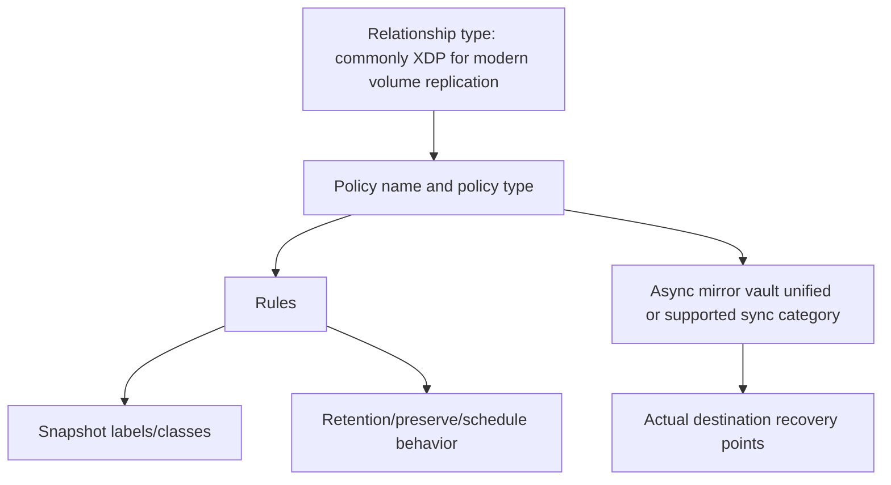

### Policy categories at current-doc-safe level

| Category | Broad intent | Critical verification |
|---|---|---|
| Asynchronous mirror | Periodic latest/mirror recovery state | Exact policy content, schedule, lag, retention |
| Vault | Retain selected labeled recovery points | Label match, keep/preserve, destination capacity |
| Unified mirror-vault | Latest DR state plus selected retained points | Baseline/update rules and destination-local protection |
| Sync | Synchronous volume replication; primary I/O can continue when replication cannot complete under documented mode behavior | Workload/platform/version, `InSync`/`OutofSync`, RPO during fault |
| StrictSync | Synchronous volume replication that fails/stops primary I/O when secondary completion cannot be maintained under documented behavior | Business availability versus data-loss tradeoff |

Do not conflate volume SnapMirror synchronous with **SnapMirror active sync**, which has its own consistency-group, mediator, host-access, automated-failover, topology, and version documentation.

### Label selection

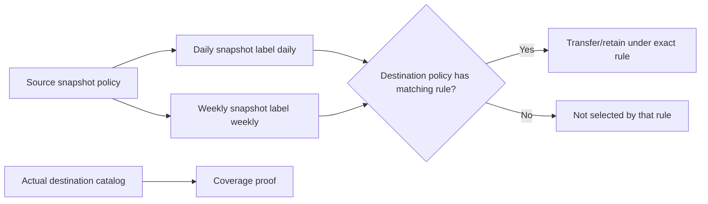

---

## 6. Asynchronous, Sync, and StrictSync behavior

### Asynchronous orientation

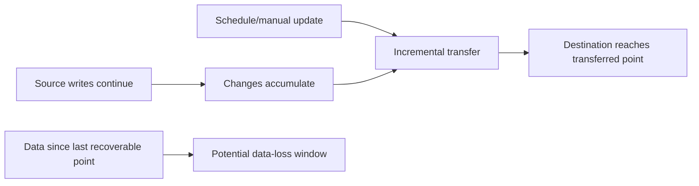

Asynchronous replication deliberately allows time between source change and destination receipt. The achievable RPO is a measured result of point creation, schedule, queueing, transfer completion, and application consistency, not simply the schedule interval.

### Sync versus StrictSync orientation

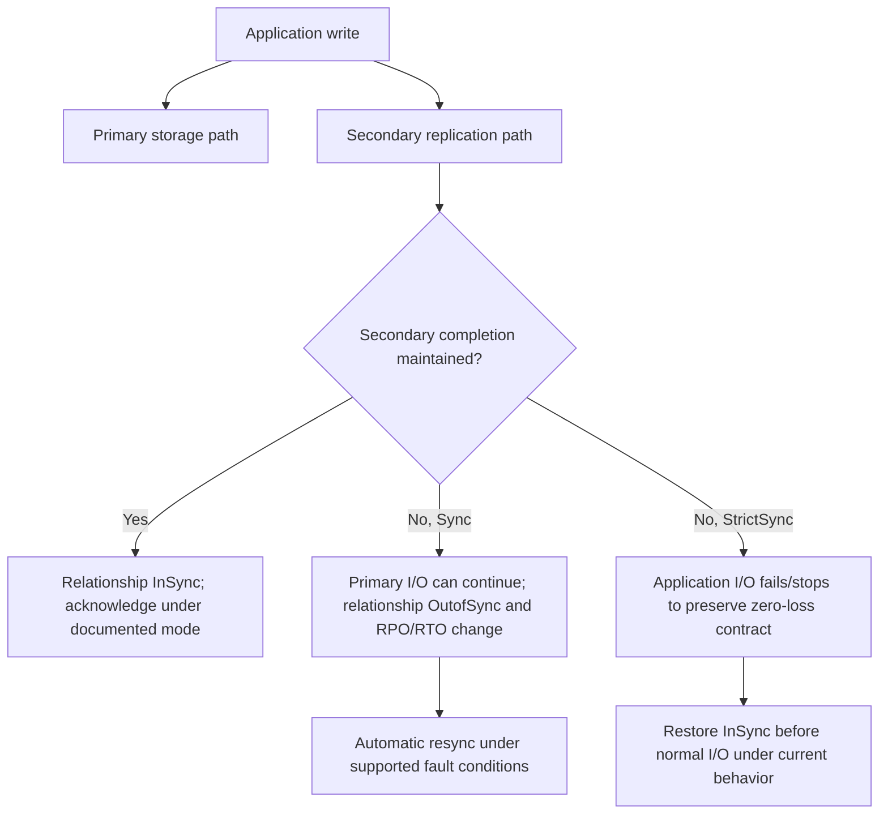

### Tradeoff table

| Question | Asynchronous | Sync | StrictSync |
|---|---|---|---|
| Data transfer timing | Scheduled/manual periodic | Synchronous during healthy state | Synchronous during healthy state |
| Replication-path failure | Source generally continues; lag grows | Primary can continue under documented mode; protection becomes out of sync | Primary I/O is disrupted/failed under documented mode |
| Main tradeoff | Data-loss window versus distance/cost | Availability can continue while zero-loss condition is temporarily lost | Zero-loss posture can sacrifice application availability |
| Evidence | Last successful point, lag, transfer backlog | `InSync`/`OutofSync`, app I/O, auto-resync | Same plus observed I/O disruption and recovery |

Never promise “zero RPO” without exact mode, healthy state, application semantics, supported topology, failure behavior, and tested recovery. Do not promise RTO from storage replication alone.

---

## 7. Relationship state, status, lag, and transfer evidence

**Relationship state** describes lifecycle/role posture, while **relationship status** and transfer fields describe current operational condition under exact ONTAP schema. Field names and values vary by release/interface.

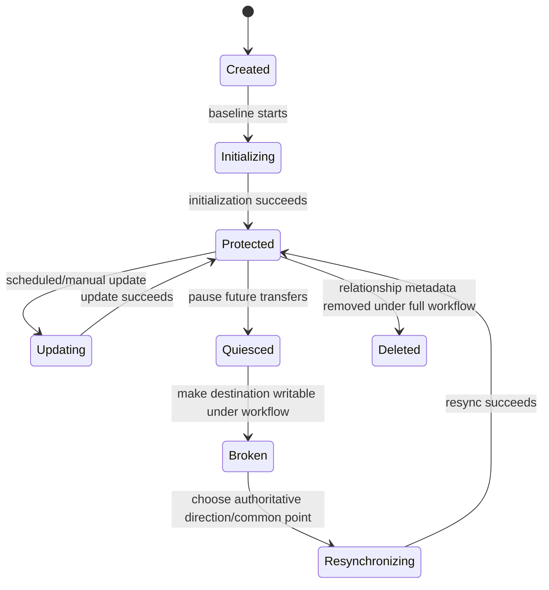

This is a teaching state model, not a literal complete ONTAP state table.

### Freshness evidence

| Field/evidence | Question |
|---|---|
| Relationship type/policy | What protection contract is intended? |
| State/status/healthy | Is lifecycle and current operation as expected? |
| Last transfer start/end/result | What actually happened and when? |
| Last transferred snapshot | Which point is recoverable? |
| Lag | What exact timestamp/definition produces it? |
| Transfer bytes/rate/progress | Is current work moving or stalled? |
| Unhealthy reason/error | Which layer rejected or delayed work? |
| Destination snapshots/capacity | Did expected policy points arrive and fit? |

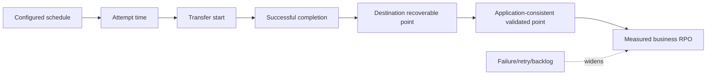

Lag can be low while the wrong label or crash-only point is replicated. It can be high after an intentional quiesce. Interpret it with policy, point identity, business objective, and state.

---

## 8. Bandwidth, capacity, throttling, and competing work

Replication consumes source read/metadata work, network capacity, destination write/metadata/capacity, and operational windows. **Throttling** limits transfer resource use under supported scope; it does not create bandwidth or guarantee completion.

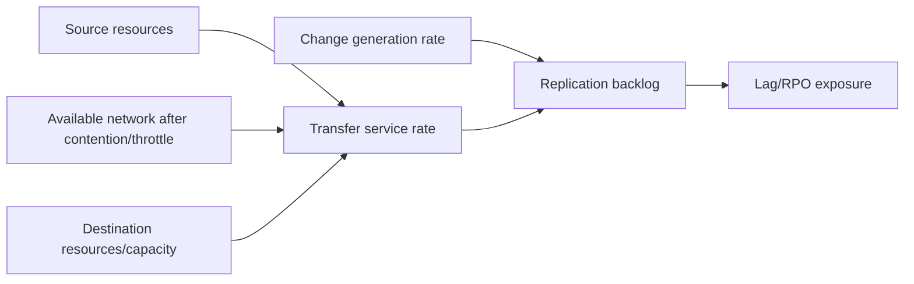

For a stable backlog over a chosen interval, long-run service must at least keep pace with generated transfer demand, with headroom for bursts and outages:

$$
\text{available transfer service} > \text{change generated} + \text{recovery catch-up demand}
$$

This is planning intuition, not a product guarantee.

### Capacity scope

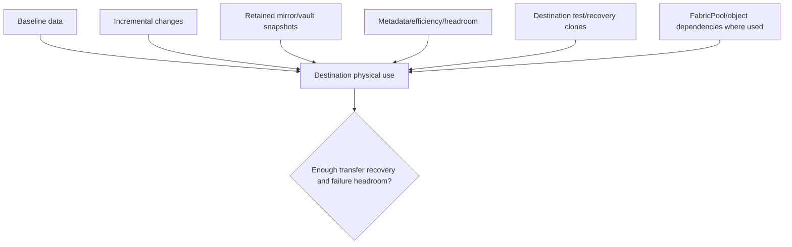

Throttle decisions require business RPO, app performance, transfer backlog, network contention, maintenance windows, and current global/per-relationship support. A tighter throttle can protect foreground work while worsening lag.

---

## 9. Lifecycle operations and their intent

### Operation map

| Operation | Broad purpose | Primary hazard |
|---|---|---|
| Initialize | Establish baseline/lineage | Network/capacity/time and false “protected” assumption before success |
| Update | Send selected latest changes/points | Missing common snapshot, policy/label mismatch, backlog |
| Quiesce | Pause future transfers under current behavior | Lag grows; not the same as break |
| Break | Make destination writable for recovery/test under workflow | Two writable histories/divergence |
| Resync | Reestablish relationship in selected direction | Data newer than chosen common point can be discarded |
| Reverse resync | Reverse authoritative direction for DR/failback workflow | Wrong-side overwrite/data loss |
| Delete | Remove destination relationship metadata | Source metadata/snapshots can remain |
| Release | Remove source relationship information under exact options | SnapMirror-created point cleanup and future incremental lineage |

### Plain-English deep-dive: resync chooses which ledger wins

After both offices have changed records, resync is not a harmless reconnect. It chooses a direction and common manifest, then reconciles one side to the other; unique changes on the losing side may be removed. **Why it matters:** source/destination labels are historical names, not proof of current authority after failover.

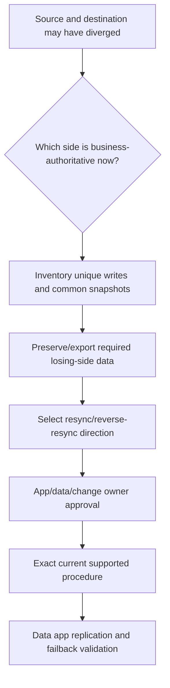

### Planned failover/failback concept

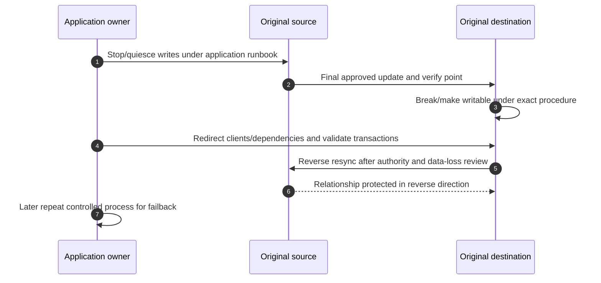

Failover means serving from the destination. Restore means copying selected prior data. Resync means reestablishing replication lineage. They are not synonyms.

---

## 10. Fan-out, cascade, and fan-in orientation

Current public documentation describes supported fan-out and cascade combinations, with release-specific synchronous restrictions and long-term-retention placement rules. Use the exact page for the actual release and topology.

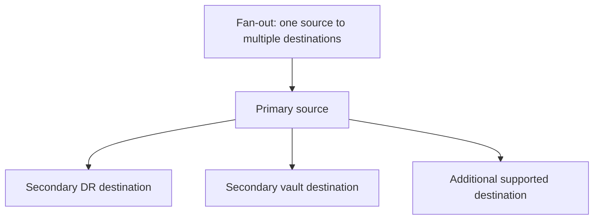

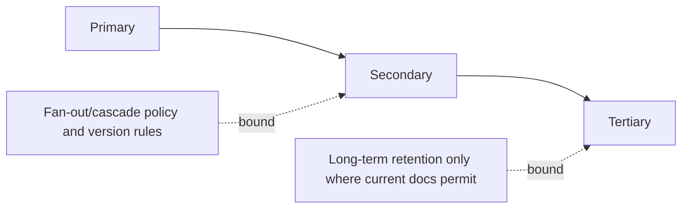

### Topology risks

- One source's change/read work and network compete across fan-out legs.
- Each destination can have different policy, lag, retention, capacity, and recovery purpose.
- A cascade's tertiary freshness includes upstream plus downstream schedule/transfer delay.
- Middle-node loss can affect downstream update paths and resync design.
- Common snapshots and resync time become more complex after failover.
- Synchronous fan-out/cascade combinations have exact current restrictions; never generalize.
- **Fan-in** means multiple sources protect to distinct destination volumes on a shared secondary; it is not many writers into one volume.

---

## 11. RPO, failover, restore, and recovery readiness

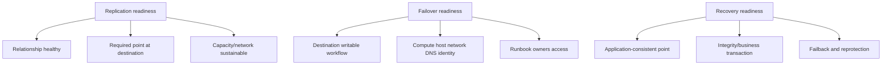

### RPO calculation orientation

If a validated destination recovery point represents 10:00 and disaster stops source writes at 10:17, the candidate data-loss interval is 17 minutes. A five-minute schedule does not make the actual RPO five minutes if transfers failed, queued, or captured unusable application state.

### Recovery proof

- Destination point and application-consistency identity.
- Controlled break/test clone or documented failover test where supported.
- Host/NAS/SAN path, DNS, identity, secrets, keys, and application configuration.
- Measured application start/replay and representative transaction.
- Actual RPO/RTO and unresolved reconciliation.
- Reverse protection and failback plan.

---

## 12. Safe discovery and evidence

Conceptual read-only placeholders only; verify current command/API fields, privilege, authorization, and support procedure.

```text
CONCEPTUAL ONLY - not production commands
<cluster-peer-family> show -fields <documented-identity-state-encryption-fields>
<svm-peer-family> show -fields <documented-source-destination-state-fields>
<intercluster-lif-family> show -fields <documented-service-ipspace-route-failover-fields>
<snapmirror-family> show -fields <documented-type-policy-state-status-lag-transfer-fields>
<snapmirror-policy-family> show -fields <documented-type-rule-label-keep-fields>
<snapshot-family> show -fields <documented-common-label-time-state-fields>
```

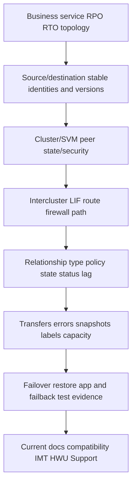

Preserve raw timestamps/UTC, full errors, transfer/job IDs, source/destination direction, data cutoff, and gaps. Redact addresses, credentials, customer names, volume names, and topology as required.

---

## 13. Failure modes and troubleshooting decision tree

| Symptom | Candidate causes | Discriminating evidence |
|---|---|---|
| Peer unavailable | LIF/path/firewall/route/auth/encryption/version | Peer and all required intercluster path tests |
| Initialize stalls/fails | Capacity, network, source/destination load, policy, compatibility | Transfer progress/error plus layer metrics |
| Lag grows | Missed schedule, change burst, throttle, loss/congestion, destination bottleneck | Change versus service/backlog timeline |
| Expected snapshot absent | Label/rule/policy mismatch, creation failure, retention | Source/destination point catalogs and rules |
| Update lacks common point | Snapshot deletion/retention/divergence/move | Common snapshot inventory and audit |
| Sync is OutofSync | Network/storage/failover fault or operator action | Mode, status, I/O behavior, reason, timeline |
| Destination full | Retention, snapshots, efficiency, clone, growth/headroom | Destination capacity ladder |
| Break succeeds but app unavailable | DNS/network/host/identity/key/app config missing | End-to-end failover stages |
| Resync threatens data | Wrong authority/direction or unique destination writes | Divergence/common-point comparison |
| Delete incomplete | Destination delete without source release or protected points | Both-end relationship metadata/audit |

```mermaid
flowchart TD
    START[SnapMirror unhealthy stale or recovery fails] --> SCOPE[Relationship direction policy time change business impact]
    SCOPE --> PEER{Cluster/SVM peers healthy and compatible?}
    PEER -->|No| P[Identity auth encryption version]
    PEER -->|Yes| NET{All required intercluster paths healthy?}
    NET -->|No| N[LIF route firewall MTU loss bandwidth]
    NET -->|Yes| STATE{Lifecycle state/status expected?}
    STATE -->|No| ST[Initialize quiesce break resync/delete context]
    STATE -->|Yes| POLICY{Policy labels common points correct?}
    POLICY -->|No| PO[Rules snapshots retention]
    POLICY -->|Yes| PERF{Backlog capacity or service bottleneck?}
    PERF -->|Yes| B[Source network throttle destination capacity]
    PERF -->|No| REC[App failover restore dependencies]
    P --> TEST[Cheapest safe discriminating test]
    N --> TEST
    ST --> TEST
    PO --> TEST
    B --> TEST
    REC --> TEST
    TEST --> VALID[Point app RPO RTO and reprotection validation]
```

### Support boundaries

- Do not initialize, update, throttle, quiesce, break, resync, reverse-resync, delete, release, or alter peering from this chapter.
- NetApp/storage owners control exact ONTAP actions and Support engagement.
- Network/security owners control intercluster routing, firewall, segmentation, authentication, encryption, and captures.
- Application/host owners control write quiesce, paths, identity, validation, and data authority.
- Protection/business owners accept RPO/RTO, retention, failover, data-loss, and failback risk.
- TAM analysis controls evidence quality, recommendation framing, owner tracking, and communication within role.

---

## 14. TAM discovery, supportability, risk, and recommendations

### Discovery questions

1. Which business services, data objects, source/destination roles, sites, RPO/RTO, retention, and failover owners exist?
2. What exact clusters/platforms/ONTAP releases/SVMs/volumes/protocols/applications form every relationship?
3. Are cluster/SVM peers correctly identified, authenticated, encrypted, healthy, and currently compatible?
4. Do all required intercluster LIFs/routes/firewalls/MTUs/paths work with sufficient resilience and service?
5. What are relationship type, policy type/rules/labels/schedule, state/status/healthy reason, lag, and transfer history?
6. Which baseline/common snapshots and destination points exist, and which are app-consistent and tested?
7. Are source change, network, throttle, destination capacity/efficiency, and recovery headroom sustainable?
8. Which fan-out/cascade legs, upstream dependencies, synchronous restrictions, and LTR rules apply?
9. What exact failover, restore, resync, reverse-protection, and failback procedures have been tested?
10. Which current docs, compatibility matrix, IMT/HWU, Support, application, network, and security evidence is missing?

### Minimum evidence pack

- Business/service/app/data scope, RPO/RTO/retention, topology, owners, UTC timeline, and change.
- Source/destination cluster UUID/name, platform, ONTAP, SVM/volume/CG, protocol and role.
- Cluster/SVM peer identity/state/security plus intercluster LIF/IPspace/route/firewall/path evidence.
- Relationship type/policy/rules/labels/schedule/state/status/lag/health and exact field definitions.
- Baseline/update/transfer jobs, errors, bytes, duration, retries, common/destination snapshots.
- Source change/workload, network service/throttle, destination capacity/efficiency/headroom.
- Fan-out/cascade map, app consistency, failover/restore/reprotection/failback test evidence.
- Current official compatibility/docs/IMT/HWU/Support evidence, gaps, actions, results, and exact specialist ask.

```mermaid
flowchart TD
    E[Verified peer path relationship policy transfer recovery evidence] --> C[Business RPO RTO retention and constraints]
    C --> R[Risk mechanism impact likelihood urgency confidence]
    R --> O[Network capacity policy topology recovery options]
    O --> A[Owner prerequisites date maintenance stop/rollback]
    A --> V[Transfer point app failover failback validation]
    V --> RR[Residual risk monitoring and review]
```

### Recommendation patterns

| Finding | Risk | Bounded recommendation | Validation |
|---|---|---|---|
| Five-minute schedule but 47-minute measured point age | RPO report is false | Fix failed/backlogged transfer cause and report actual validated point age | Sustained completion and app-point evidence |
| XDP relationship assumed to retain daily points | Policy has no matching daily rule | Align source labels/destination rules after retention/capacity review | Destination catalog across cycles |
| One intercluster path carries all legs | Single failure/contention domain | Validate current-supported path redundancy/segmentation/capacity | Failure and catch-up test |
| Break plan omits DNS/host identity | Destination writable but service unavailable | Complete app/network/identity/key runbook and test | Business transaction within measured RTO |
| Resync direction chosen from old names | New destination writes could be lost | Establish business authority/common point and preserve unique data first | Reconciled data and protected reverse direction |

### JD Mapping

| JD responsibility | Part 36 contribution | Your factual bridge and gap |
|---|---|---|
| Understand environment | Maps source/destination/peer/network/app dependencies | Azure/networking method transfers |
| Analyze/report data | Interprets policy/state/status/lag/transfers/capacity | Analytics strength transfers |
| Strategic planning | Connects topology, bandwidth, RPO/RTO, failover/failback | Advisory/critical-situation planning transfers |
| Risk/stability | Finds stale points, path, capacity, resync and split-history risks | Incident discipline transfers |
| Supportability | Requires exact version/topology/policy evidence | No gated/customer result claimed |
| Customer reviews | Converts fleet relationships into action/owner/proof | Business-review experience transfers |
| Escalation | Supplies both-end, path, transfer, policy and recovery evidence | Product collaboration transfers; ONTAP operation unproven |

---

## 15. Fully synthetic scenario: Fabrikam Research lag and failed DR test

> **Synthetic case:** Fabrikam Research, every cluster, metric, policy, timeline, and result below is fictional. It is not a NetApp customer, internal workflow, benchmark, tool result, or your production work.

### Environment

- Primary volume `research_prod` fans out asynchronously to DR and vault destinations.
- A cascade sends the DR destination to a tertiary test site.
- The dashboard says the relationship is healthy, but the last application-validated point is old.
- A new backup job shares the WAN, and a throttle was tightened after daytime complaints.
- Daily source snapshots exist, but the vault policy rule expects a different label.
- A DR test breaks the destination; DNS, database secrets, and a license service remain primary-only.

```mermaid
flowchart TB
    P[Primary research_prod] --> DR[DR destination]
    P --> V[Vault destination]
    DR --> T[Tertiary cascade]
    WAN[Shared WAN] --> DR
    WAN --> V
    WAN --> T
    B[New backup traffic] --> WAN
    APP[App dependencies DNS secrets license] -.not replicated with volume data.-> DR
```

### Timeline

```mermaid
sequenceDiagram
    autonumber
    participant S as Source
    participant W as Shared WAN
    participant D as DR destination
    participant A as Application team
    S->>D: Normal updates complete
    W->>W: Backup workload added
    S->>S: Replication throttle tightened
    S->>D: Updates queue; lag grows
    A->>D: Begin DR test and break destination
    D-->>A: Storage writable
    A->>A: DNS/secrets/license unavailable; app fails
    A->>S: Request immediate reverse resync without authority review
```

### Evidence and hypotheses

| Evidence | Observation | Bounded conclusion |
|---|---|---|
| Transfer history | Completion time exceeds schedule after backup launch | Service deficit/backlog is credible |
| Network | Contention rises on shared WAN | Network contributes; source/destination still need checks |
| Throttle | Lower transfer allowance overlaps growth | Protection policy worsens catch-up |
| Labels | `daily` points do not match vault rule's actual label | Expected retained points are absent |
| DR break | Destination writable | Storage transition worked |
| Application | DNS/secrets/license remain primary-only | Failover readiness failed outside data transfer |
| Authority | No writes intentionally allowed at DR after failed app start | Direction still must be verified before resync |

```mermaid
flowchart TD
    ISSUE[Lag missing vault points failed app DR] --> W1[Transfer service workstream]
    ISSUE --> W2[Policy/label workstream]
    ISSUE --> W3[Application continuity workstream]
    W1 --> CAP[Change vs throttle/WAN/source/destination service]
    W2 --> MATCH[Source labels vs destination rules/catalog]
    W3 --> DEP[DNS secrets license host network]
    CAP --> PLAN[Owner-approved remediation]
    MATCH --> PLAN
    DEP --> PLAN
    PLAN --> TEST[Update retention app transaction and reprotection test]
```

### Recommendations

1. Report actual last successful and application-validated point age, not the configured schedule or generic healthy flag.
2. Correlate source change, throttle, WAN contention, and destination service; reserve a tested transfer/catch-up envelope without promising a fixed rate.
3. Correct source label/destination policy-rule alignment only after retention and destination-capacity review, then observe multiple cycles.
4. Add DNS, secrets, license, host/network, identity, and application-start steps to the DR runbook and test a representative research transaction.
5. Before resync, prove which side is authoritative, inventory any destination writes/common snapshots, preserve required data, and follow the exact current supported direction.

### Customer-facing summary

> "The configured schedule did not deliver the reported recovery point: after backup traffic and tighter throttling, transfers took longer than the interval and backlog accumulated. The vault also missed daily points because labels and policy rules did not match. Breaking the DR destination made storage writable, but DNS, secrets, and licensing were not recoverable there. We recommend separate transfer-capacity, policy, and application-runbook actions, followed by a measured failover and reprotection test."

---

## 16. Your factual transfer and honest positioning

```mermaid
flowchart LR
    OD[OneDrive/SharePoint sync concepts] --> DELTA[Baseline delta backlog conflict intuition]
    AZ[Azure/networking] --> PATH[Routes firewalls DNS identity bandwidth security]
    CRIT[Critical situation] --> DR[Authority restoration workstreams communication]
    BI[Analytics] --> TREND[Lag change rate transfer capacity and action trends]
    DELTA --> SM[SnapMirror conceptual method]
    PATH --> SM
    DR --> SM
    TREND --> SM
    SM --> LAB[Future authorized lab and NetApp review]
```

> **Honest interview answer:** "I understand SnapMirror as a relationship among source, destination, peering, intercluster paths, snapshots and policy. I can distinguish baseline from incremental updates, XDP type from policy intent, asynchronous from Sync and StrictSync failure behavior, and replication freshness from failover readiness. My production experience is enterprise support, sync services, Azure/networking and incident leadership, not ONTAP SnapMirror administration. I would verify current compatibility, documentation and authorized evidence and use NetApp/application/network owners before any lifecycle action."

---

## 17. Whiteboard drills, paper lab, and self-test

### Whiteboard drills

1. Source -> snapshot/policy -> intercluster path -> destination -> application recovery.
2. Cluster peer versus SVM peer versus relationship.
3. Baseline, common snapshot, incremental update, and lag.
4. XDP relationship type versus mirror/vault/unified policy intent.
5. Asynchronous versus Sync versus StrictSync failure behavior.
6. State/status/transfer timeline versus actual business RPO.
7. Initialize/update/quiesce/break/resync/reverse/delete/release.
8. Fan-out and cascade with cumulative lag.
9. Change generation versus transfer service and throttle.
10. Replication readiness versus failover/recovery readiness.

### Paper lab

A fictional enterprise has four clusters, 140 relationships, mixed volume/SVM/consistency-group scopes, async and synchronous categories, 12 policies, inconsistent labels, two WANs, three cascades, fan-out, destination capacity alerts, broken relationships, and no complete DR test record.

Tasks:

1. Inventory source/destination identities, versions, roles, apps, RPO/RTO, and owners.
2. Map cluster/SVM peers and every required intercluster LIF/network/security path.
3. Classify relationship type, policy type/rules/labels/schedule, topology, and compatibility.
4. Reconstruct baseline/common-point/update history and actual validated point age.
5. Compare change generation with source/network/throttle/destination service.
6. Reconcile destination active/snapshot/vault/clone/efficiency/headroom capacity.
7. Simulate peer, path, label, common-point, capacity, and sync `OutofSync` failures.
8. Map each fan-out/cascade dependency and cumulative recovery point.
9. For one broken pair, identify authority, unique writes, common point, and safe resync direction on paper.
10. Test app dependencies, break/failover, transaction, reverse protection, and failback conceptually.
11. Write recommendations with evidence, risk, action, owner, date, proof, and residual risk.
12. State every verify-current and production-experience boundary.

```mermaid
flowchart LR
    INV[Inventory relationships] --> PEER[Validate peers and paths]
    PEER --> POL[Validate type policy labels]
    POL --> PERF[Analyze transfers lag capacity]
    PERF --> FAIL[Simulate failures and authority]
    FAIL --> DR[Test app failover/reprotection]
    DR --> REC[Write recommendations]
```

### Lab pass checklist

- [ ] XDP is not treated as complete protection intent.
- [ ] Schedules are not reported as actual RPO.
- [ ] State, status, lag, last point, and transfer result stay distinct.
- [ ] All required peer and intercluster paths are evaluated securely.
- [ ] Async, Sync, and StrictSync are described only at current-doc-safe depth.
- [ ] Fan-out/cascade support and LTR placement are exact-release verified.
- [ ] Resync direction follows proven business authority and data preservation.
- [ ] Destination capacity and application dependencies are included.
- [ ] Failover, restore, resync, and failback remain distinct.
- [ ] No synthetic result is called production SnapMirror work.

### Self-test

1. Define source, destination, relationship, baseline, incremental, common snapshot, state, status, and lag.
2. Draw cluster peer, SVM peer, intercluster LIF, and relationship layers.
3. Build network/security/DNS/certificate evidence without inventing requirements.
4. Explain baseline and incremental transfer with common lineage.
5. Explain policy, rules, labels, schedules, retention, and XDP.
6. Compare asynchronous, Sync, and StrictSync failure behavior.
7. Interpret relationship state/status/lag/transfer history and actual RPO.
8. Model source change, throttle, network service, backlog, and destination capacity.
9. Explain each lifecycle operation and its data-loss risk.
10. Distinguish resync from reverse resync and prove authority.
11. Explain fan-out, cascade, fan-in, and cumulative freshness.
12. Separate replication, failover, restore, app recovery, reprotection, and failback.
13. Apply the troubleshooting tree and escalation boundary.
14. Recreate Fabrikam's three independent workstreams.
15. Complete paper lab and recommendations.
16. Deliver your honest answer without production inflation.

---

## 18. Official Source Anchors

**Date checked: 2026-08-24.** These official public sources anchor current SnapMirror and peering concepts. Exact modes, policies, defaults, fields, compatibility, limits, ports, ciphers, topology, lifecycle operations, workloads, and commands change by release/platform/configuration. Re-open exact current pages, IMT/HWU, application guidance, and Support evidence; do not reuse remembered values.

| Topic | Official public source | Bounded use and currency note |
|---|---|---|
| SnapMirror async | [Learn about ONTAP SnapMirror asynchronous disaster recovery](https://docs.netapp.com/us-en/ontap/data-protection/snapmirror-disaster-recovery-concept.html) | Source/destination, baseline/update, mirror policy orientation |
| SnapMirror sync | [Learn about ONTAP SnapMirror synchronous disaster recovery](https://docs.netapp.com/us-en/ontap/data-protection/snapmirror-synchronous-disaster-recovery-basics-concept.html) | Sync/StrictSync and `InSync`/`OutofSync`; verify release/workload matrix |
| Default policies | [Default ONTAP data protection policies](https://docs.netapp.com/us-en/ontap/data-protection/default-protection-policies-concept.html) | Current names/categories only; inspect actual policy |
| Unified replication | [Learn about ONTAP SnapMirror unified replication](https://docs.netapp.com/us-en/ontap/data-protection/snapmirror-unified-replication-concept.html) | Mirror-vault baseline/update/rule concepts |
| XDP relationship creation | [Create an ONTAP SnapMirror replication relationship](https://docs.netapp.com/us-en/ontap/data-protection/create-replication-relationship-task.html) | XDP/legacy DP history and prerequisites; not a runbook here |
| Peering | [Learn about ONTAP cluster and SVM peering](https://docs.netapp.com/us-en/ontap/peering/index.html) | Peer layers and current navigation |
| Peering prerequisites | [ONTAP peering prerequisites](https://docs.netapp.com/us-en/ontap/peering/prerequisites-cluster-peering-reference.html) | Exact current connectivity/port/security requirements; reopen before use |
| Intercluster LIFs | [Configure ONTAP intercluster LIFs](https://docs.netapp.com/us-en/ontap/peering/configure-intercluster-lifs-share-data-ports-task.html) | LIF/service/failover orientation; use exact shared/dedicated/IPspace page |
| Compatibility | [Compatible ONTAP versions for SnapMirror relationships](https://docs.netapp.com/us-en/ontap/data-protection/compatible-ontap-versions-snapmirror-concept.html) | Dated source/destination matrices by relationship category |
| Fan-out/cascade | [Learn about ONTAP data protection fan-out and cascade deployments](https://docs.netapp.com/us-en/ontap/data-protection/supported-deployment-config-concept.html) | Current topology categories, synchronous and LTR caveats |
| Update/resync | [Update a SnapMirror relationship manually](https://docs.netapp.com/us-en/ontap/data-protection/update-replication-relationship-manual-task.html), [Resynchronize a SnapMirror relationship](https://docs.netapp.com/us-en/ontap/data-protection/resynchronize-relationship-task.html) | Common-point and resync/reverse orientation; exact procedure only |
| Delete/release | [Delete an ONTAP SnapMirror volume replication relationship](https://docs.netapp.com/us-en/ontap/data-protection/delete-volume-replication-relationship-task.html) | Both-end metadata distinction and snapshot caveat |
| Throttling | [Use SnapMirror global throttling](https://docs.netapp.com/us-en/ontap/data-protection/snapmirror-global-throttling-concept.html) | Verify exact release/scope/interactions |
| IMT/HWU | [NetApp Interoperability Matrix Tool](https://imt.netapp.com/), [NetApp Hardware Universe](https://hwu.netapp.com/) | Potentially gated ecosystem/platform evidence |
| Support | [NetApp Support Site](https://mysupport.netapp.com/) | Entitlement-dependent procedures, bugs, cases, and recovery guidance |

### Source-use discipline

- Record both cluster UUIDs/names, ONTAP/platforms, SVMs/volumes, relationship direction/type/policy, and date.
- Save exact policy rules, labels, states/statuses, field definitions, snapshots, transfer results, and UTC times.
- Use current compatibility and topology pages; never infer support from protocol similarity.
- Do not expose peer secrets, credentials, customer addresses, names, or unredacted topology.
- Treat internal/gated/customer evidence as unknown until authorized access exists.

---

## Likely Interview Questions

### Q1. Explain SnapMirror architecture from source to destination.

> **Model answer:** "A defined source volume or SVM is protected to a destination through a SnapMirror relationship. Source and destination clusters and relevant SVMs are peered; intercluster LIFs and network/security paths carry transfers. The relationship type and policy determine mode, selected snapshots, rules, labels and retention. I validate both-end identities, peer/path health, transfer history, destination points and application recovery separately."

### Q2. What are baseline and incremental transfers?

> **Model answer:** "Initialization establishes the baseline and relationship lineage using policy-defined source state. Later updates send changed, policy-selected state using a common snapshot/lineage where supported. A baseline can be large, and ongoing change during it creates catch-up demand. I model source change, path service, destination capacity, transfer completion and actual validated recovery-point age."

### Q3. What does XDP mean, and why is it insufficient to describe protection?

> **Model answer:** "XDP is the modern version-flexible relationship type commonly used for volume mirror, vault and unified replication. It does not tell me the recovery contract. I inspect policy type, rules, labels, schedule, retention and actual destination catalog. Legacy DP has release-specific deprecation/conversion history and exceptions, so I use current compatibility documentation rather than memory."

### Q4. Compare asynchronous, Sync, and StrictSync SnapMirror.

> **Model answer:** "Asynchronous replication transfers periodically, so measured destination point age defines the data-loss window. In SnapMirror Sync mode, healthy writes are synchronously replicated, but primary I/O can continue if the relationship becomes out of sync, changing the zero-loss posture. StrictSync disrupts/fails primary I/O when secondary completion cannot be maintained. Exact workload, release, topology and status support must be verified."

### Q5. How do you diagnose growing lag?

> **Model answer:** "I first verify lag's field definition and last recoverable point. Then I compare change generation with source read/CPU, schedule/queue, throttle, intercluster loss/latency/bandwidth/contention, destination write/capacity/efficiency, and competing fan-out/cascade work. I correlate transfer errors and backlog over time, fix the constrained service or policy, and prove sustained completion plus application-valid RPO."

### Q6. What is dangerous about resync and reverse resync?

> **Model answer:** "After break or divergence, names such as source and destination may no longer identify business authority. Resync chooses a direction/common point and can remove newer unique data on the receiving side. I inventory writes and common snapshots, preserve needed losing-side data, obtain application/data approval, use the exact current procedure, and validate application data, relationship direction and failback."

### Q7. How do fan-out and cascade affect design?

> **Model answer:** "Fan-out protects one source to multiple distinct destinations; cascade protects through a secondary to a tertiary. Each leg has separate policy, lag, capacity and failure domains, while cascades accumulate upstream/downstream delay. Synchronous combinations and long-term-retention placement have exact release rules. I map all legs, common points, bandwidth, resync and recovery paths using current docs."

### Q8. How does your experience transfer, and what remains a gap?

> **Model answer:** "OneDrive/SharePoint sync gives me baseline/delta/backlog intuition; Azure/networking gives me path/security dependencies; critical situation and analytics give me authority, timeline, risk and communication discipline. I understand SnapMirror architecture but have not configured or operated it in production. I would verify current docs, compatibility, authorized evidence and specialist runbooks before lifecycle actions."

---

## 30-Second Memory Hooks

- **SnapMirror:** Governed source-to-destination replication, not teleportation.
- **Peer:** Trusted cluster/SVM permission before data movement.
- **Intercluster LIF:** Replication loading dock; every required route must work.
- **Baseline:** First lineage-establishing shipment.
- **Incremental:** Changes since a common point under policy.
- **XDP:** Vehicle type; policy is the cargo manifest.
- **Rule/label:** Matching classifications decide selected recovery points.
- **Schedule:** Attempt time, not guaranteed completion or RPO.
- **Lag:** Interpret with field definition and actual destination point.
- **Async:** Periodic freshness window.
- **Sync:** Can continue primary I/O when out of sync; protection posture changes.
- **StrictSync:** Protect zero-loss posture by disrupting I/O when remote completion fails.
- **Throttle:** Protects shared resources but can grow lag.
- **Break:** Make destination writable; creates divergence risk.
- **Resync:** Choose which ledger wins.
- **Fan-out:** One source, several destinations.
- **Cascade:** Primary -> secondary -> tertiary; delays/dependencies accumulate.
- **Recovery:** Replication + app/network/identity/runbook + test.
- **Your bridge:** Sync/network/incident method transfers; ONTAP operation does not.

---

## Completion Checklist

- [ ] Define all relationship, transfer, point, policy, and lifecycle terms.
- [ ] Draw cluster/SVM peers, intercluster paths, and source/destination objects.
- [ ] Include network, DNS/certificate where used, authentication, encryption, and audit concepts.
- [ ] Explain baseline, common snapshots, incremental updates, and capacity/catch-up.
- [ ] Separate XDP type from policy/rule/label/schedule intent.
- [ ] Compare asynchronous, Sync, and StrictSync only at current-doc-safe depth.
- [ ] Interpret state, status, health, lag, point identity, and transfer history separately.
- [ ] Model source change, throttle, path service, backlog, destination capacity, and RPO.
- [ ] Explain initialize/update/quiesce/break/resync/reverse/delete/release hazards.
- [ ] Map fan-out, fan-in, cascade, LTR, and synchronous topology caveats.
- [ ] Separate replication, failover, restore, recovery, reprotection, and failback.
- [ ] Apply discovery, supportability, troubleshooting, escalation, and recommendation models.
- [ ] Recreate Fabrikam's transfer, policy, and application workstreams.
- [ ] Complete paper lab and self-test; answer Q1-Q8 aloud.
- [ ] State the No-production-NetApp boundary and explicit non-claim accurately.
- [ ] Recheck current docs, compatibility, IMT/HWU, app guidance, and Support before customer use.

---

*Next suggested section:* [Part 37 - Backup, Archive, BlueXP Data Protection, and Ecosystem Integration](Part-37-backup-archive-bluexp-integration.md)