# Part 37 - Backup, Archive, BlueXP Data Protection, and Ecosystem Integration

> **Section goal:** Build a defensible backup and archive model from workload to recovery outcome, including independent copies, control/catalog/data planes, application coordination, object targets, credentials, encryption, immutability, retention, monitoring, ownership, cost, and restore testing. By the end, Arti should be able to discuss the current NetApp Console and NetApp Backup and Recovery context without making stale BlueXP naming or feature promises, and evaluate ecosystem integrations by evidence rather than logo compatibility.

Covers index item **37** and maps directly to job-description responsibilities for customer discovery, storage and cloud depth, risk mitigation, supportability, strategic planning, analytics, service reviews, cross-functional ownership, and executive communication.

**Version caveat and naming caveat:** As of the source check below, current public documentation uses **NetApp Console** for the management experience and **NetApp Backup and Recovery** for the data-protection service. Older documentation, URLs, screenshots, customer language, and integrations may say **BlueXP** or **BlueXP backup and recovery**. Exact service names, deployment modes, agents, workloads, targets, policies, retention, immutability, DataLock/ransomware options, encryption, restore methods, costs, licenses, regions, APIs, and limits change. A **current-doc check** verifies the exact current page, release notes, tenant/organization mode, source workload, target, provider, and contract.

This Part gives no universal 3-2-1 design, air-gap claim, cost, retention, restore time, durability, immutability, or support guarantee. It contains no production commands. Named products and patterns are architectural orientation only; current support requires official NetApp, application, hypervisor/container, cloud-provider, Interoperability Matrix Tool (IMT), Hardware Universe (HWU), and entitlement evidence where applicable.

> **No-production-NetApp boundary:** Arti does not claim production NetApp Console, BlueXP, NetApp Backup and Recovery, SnapCenter, NDMP, tape, or ONTAP backup administration. Every organization, agent, object target, policy, credential, backup, cost, incident, and restore result below is synthetic. Her factual strengths are Microsoft enterprise support, Azure/cloud, SharePoint/OneDrive data protection concepts, networking, identity, CRITSIT ownership, analytics, and customer communication. The explicit non-claim is: **she has not activated a production NetApp backup service, deployed a Console agent, registered production systems/object targets, configured DataLock/immutability/retention, integrated SnapCenter or a third-party backup application, operated NDMP/tape, or restored a NetApp customer workload.**

---

## 1. Backup, snapshot, replication, and archive are different jobs

**Backup** creates and catalogs recovery copies so data can be restored after loss, corruption, error, or attack. **Archive** preserves selected records for long-term retention/retrieval, often for business or legal reasons. A local snapshot and a replica can be inputs to protection, but neither automatically supplies backup independence or archival governance.

### Plain-English deep-dive: bookmarks, photocopies, safety deposit boxes, and records vaults

- A **snapshot** is a bookmark in the same book.
- **Replication** sends a current or selected photocopy to another office.
- A **backup** stores governed recovery copies with a catalog and restore process.
- An **archive** keeps designated records for a long retention purpose and retrieval expectation.

**Why it matters:** copying corruption or attacker-driven deletion quickly can make replication current but not useful; retaining every operational copy forever can make an expensive, unsearchable “archive.”

| Capability | Primary purpose | Typical independence | Core proof |
|---|---|---|---|
| Snapshot | Fast local point-in-time recovery | Often same storage/admin domain | Readable point and app test |
| Replication | Secondary copy/DR freshness | Another system/site, possibly shared control | Relationship, point, failover test |
| Backup | Recover selected data/workloads | Separate target/security/control as designed | Catalog plus restore transaction |
| Archive | Long-term record retention/retrieval | Media/security/lifecycle selected by governance | Retention, search, retrieval, disposition |

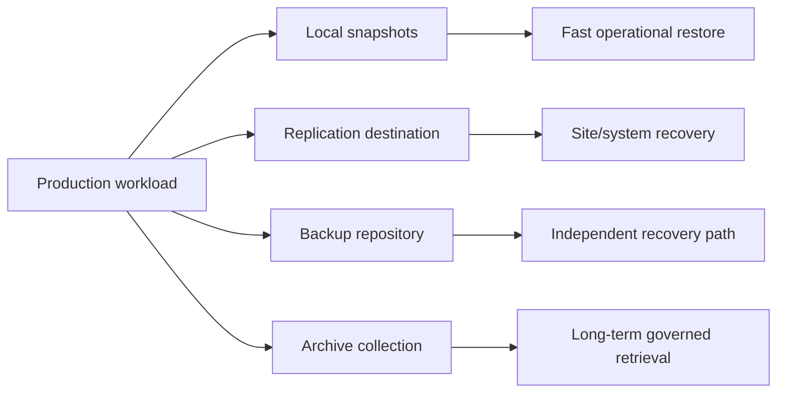

---

## 2. Recovery objectives and protection policy

A protection policy translates business data value into point frequency, retention, copy location, consistency, security, cost, and validation.

| Term | Plain meaning | Policy question |
|---|---|---|
| **RPO** | Maximum acceptable data-loss interval | Which validated point satisfies it? |
| **RTO** | Maximum acceptable recovery duration | Which end-to-end stages consume it? |
| **Retention** | How long/how many copies remain | Operational, legal, and cost basis? |
| **Consistency** | Whether point can restart coherently | Crash or application coordinated? |
| **Recovery scope** | File, folder, volume, VM, database, application | What smallest scope is needed? |
| **Recovery tier** | Service/media class used for restore | Online, colder object, archive, tape? |
| **Disposition** | Approved deletion at lifecycle end | Hold, exception, audit, and owner? |

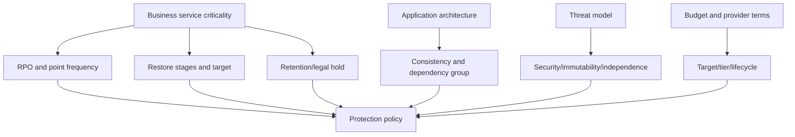

A policy configuration is not proof that every job ran or every copy is restorable.

---

## 3. The 3-2-1-1-0 orientation

The **3-2-1-1-0** phrase is a planning mnemonic, not a universal standard or product guarantee:

- **3**: maintain three data instances in the chosen count model.
- **2**: use two meaningfully different storage/media or failure approaches.
- **1**: keep at least one copy off the primary site/domain.
- **1**: keep one offline, isolated, or immutable copy under a clearly defined threat model.
- **0**: aim for zero unresolved errors through monitoring and verified restores.

### Plain-English deep-dive: count failure domains, not icons

Three console entries can still rely on one administrator, identity provider, cloud account, encryption key, network, or region. A copy marked immutable may be unreachable if its catalog and keys share the compromised control plane. **Why it matters:** the mnemonic starts discovery; a dependency graph proves resilience.

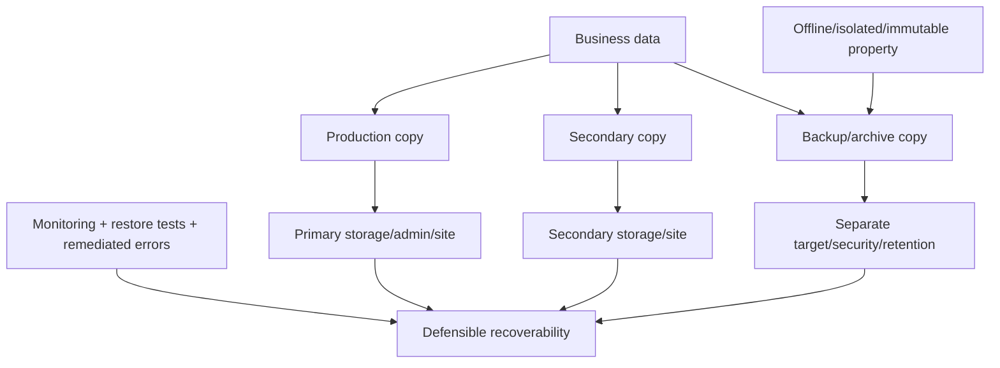

### Air-gap nuance

| Label | What must be defined |
|---|---|
| Physical offline | Media not network-connected; handling/custody/retrieval still matter |
| Logical isolation | Network/IAM/control separation; paths may reopen for jobs/restores |
| Immutability | Which actor/action cannot alter data, for how long, under what exception |
| Different account/tenant | Which identities, billing, keys, recovery admins, and federation remain shared |
| “Air gapped” appliance/service | Exact vendor architecture and management/update paths; never infer from marketing term |

No online object repository is called a true physical air gap merely because it uses another bucket or region.

---

## 4. Control, catalog, and data planes

The **control plane** defines policies and orchestrates jobs. The **catalog plane** records protected objects, versions, indexes, and restore metadata. The **data plane** carries and stores backup payloads.

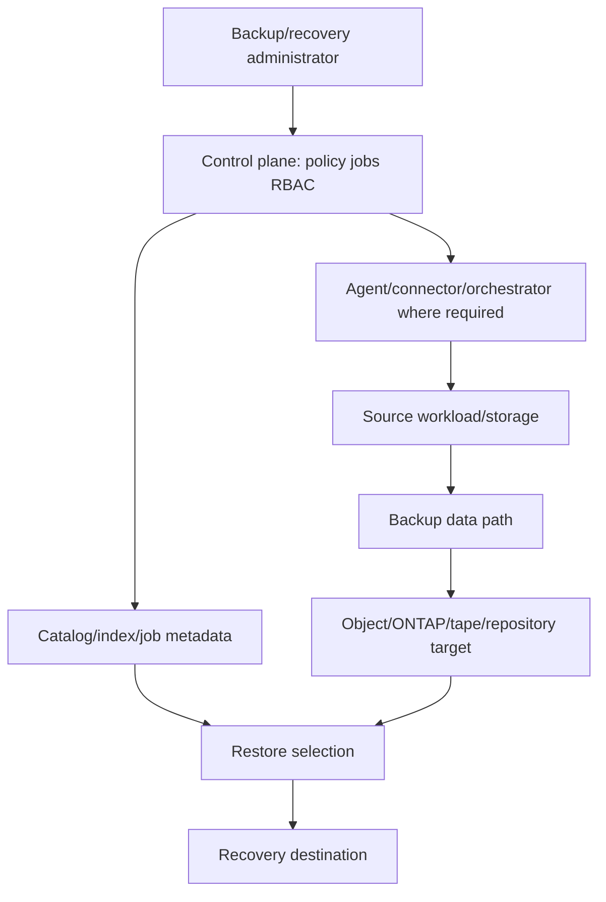

### Plane failure table

| Plane | Failure example | Recovery question |
|---|---|---|
| Control | SaaS/agent unavailable or account compromised | Can protected data still be discovered and restored safely? |
| Catalog | Index/database missing or stale | Can copies be reconstructed/imported and searched? |
| Data | Objects/tape/replica unavailable or corrupt | Is another independent copy usable? |
| Identity/key | IAM, secret, certificate, or key unavailable | Who can decrypt and authorize recovery? |
| Application | Database/catalog/VM/container dependencies missing | Can the business service restart coherently? |

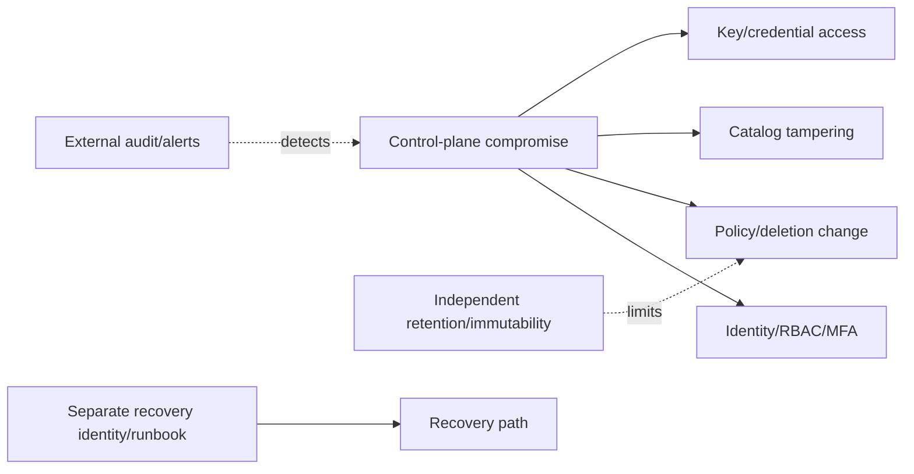

---

## 5. Current NetApp Console and naming context

As of 2026-08-24 public docs, **NetApp Console** is the management experience. It can operate as a software-as-a-service (SaaS) application or in documented restricted/private modes, with mode-specific feature availability. **Console agents** are software components that provide connectivity/orchestration for capabilities requiring access to environments and APIs. **NetApp Backup and Recovery** is a data service surfaced through the Console.

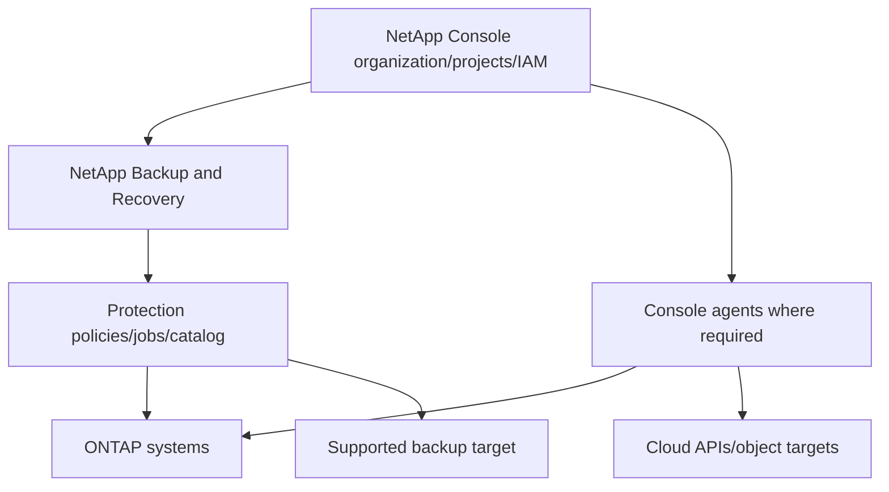

### Naming currency

| Wording encountered | Safe interpretation |
|---|---|
| NetApp Console | Current public management-plane name at check date |
| NetApp Backup and Recovery | Current public data-service name at check date |
| BlueXP | Prior branding/historical customer/search/URL context; verify current equivalent |
| Connector | Prior term may map to current **Console agent** language; verify exact doc and release |
| Working environment | Prior UI term; current docs may say **system**; do not assume a one-to-one UI field |

Never claim that every feature works in every Console mode, region, source, target, or workload. Read the current workload-specific prerequisites and limitations.

---

## 6. NetApp Backup and Recovery architecture at broad level

Current public documentation describes workflows that can combine local snapshots, replication to secondary storage, and backup to supported object storage for eligible workloads. It also documents workload-specific protection for ONTAP volumes and other workloads. Exact current support is not generalized here.

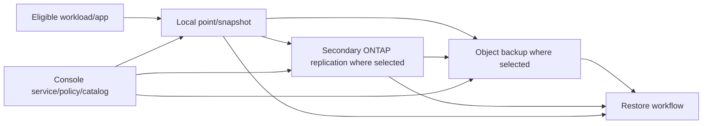

### Plain-English deep-dive: one dashboard can orchestrate several protection mechanisms

The Console is like an airport operations board: it can schedule and display flights, but aircraft, runways, fuel, passports, and destinations remain separate systems with their own failure modes. **Why it matters:** a green dashboard should be traced to source snapshots, replication points, object data, catalog entries, credentials, job results, and a tested destination.

### Workload-specific questions

- What is the protected unit: volume, database, VM/datastore, container application, or another documented workload?
- Which local, replication, and object stages are actually selected?
- Which application-aware component or workflow provides consistency?
- Which Console deployment mode and agent path apply?
- Which source/target combinations and restore scopes are current-supported?
- Which licenses, subscriptions, cloud services, marketplace terms, and provider resources apply?

---

## 7. Application-aware backup and ecosystem integration

An **application-aware** backup coordinates application state and storage recovery points through a supported integration. Ecosystem integrations may involve SnapCenter, hypervisor plug-ins, database agents, Kubernetes controllers/CSI tooling, backup applications, or NDMP data-management applications.

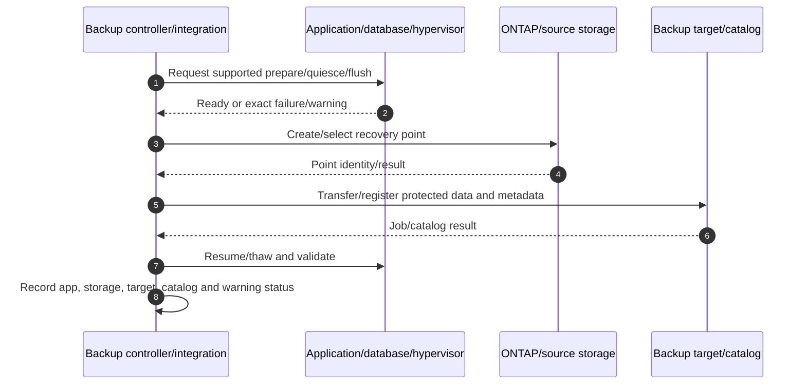

### Integration contract

| Boundary | Owner/evidence |
|---|---|
| Application consistency | App vendor/integration plug-in versions, logs, support matrix |
| Storage snapshot/replication | ONTAP objects, policy, jobs, current docs |
| Backup transport/catalog | Backup product/controller/agent logs and database |
| Target repository | Object/ONTAP/tape provider, IAM, retention, capacity, health |
| Restore destination | Host/hypervisor/Kubernetes/network/identity/application support |

“Integrated with ONTAP” does not establish support for every protocol, app version, feature, topology, or restore scope. Preserve a dated exact combination and notes.

---

## 8. Object targets, credentials, encryption, immutability, and retention

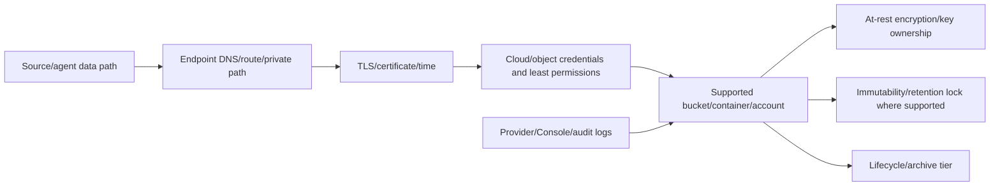

### Security questions

1. Which account/subscription/project, bucket/container, region, and owner hold data?
2. Which identities can write, read, delete, change retention, change keys, or alter lifecycle?
3. Are credentials short-lived/role-based or long-lived, and how are they stored/rotated?
4. Which data path is encrypted in transit and which keys encrypt at rest?
5. Who controls keys, and can keys be recovered after account/site compromise?
6. Is immutability governance/compliance mode, object lock, DataLock, SnapLock, or another exact mechanism?
7. Can privileged administrators shorten retention, delete the account, remove keys, or alter policy?
8. How are failed jobs, deletion attempts, policy changes, and restore access audited externally?

### Immutability is a contract with scope

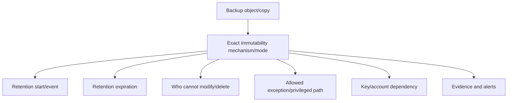

Encryption prevents unauthorized plaintext access under its threat model; it does not by itself prevent deletion. Immutability prevents defined modification/deletion under its rules; it does not guarantee clean data, available keys, or successful application recovery.

---

## 9. Archive and tape orientation

Archive design optimizes retention, integrity, search, retrieval, custody, legal hold, disposition, and cost over long horizons. ONTAP documentation also describes SnapMirror vault retention and NDMP-based tape workflows with dump/SMTape engines; exact support, engines, media, applications, versions, and restore behavior must be verified.

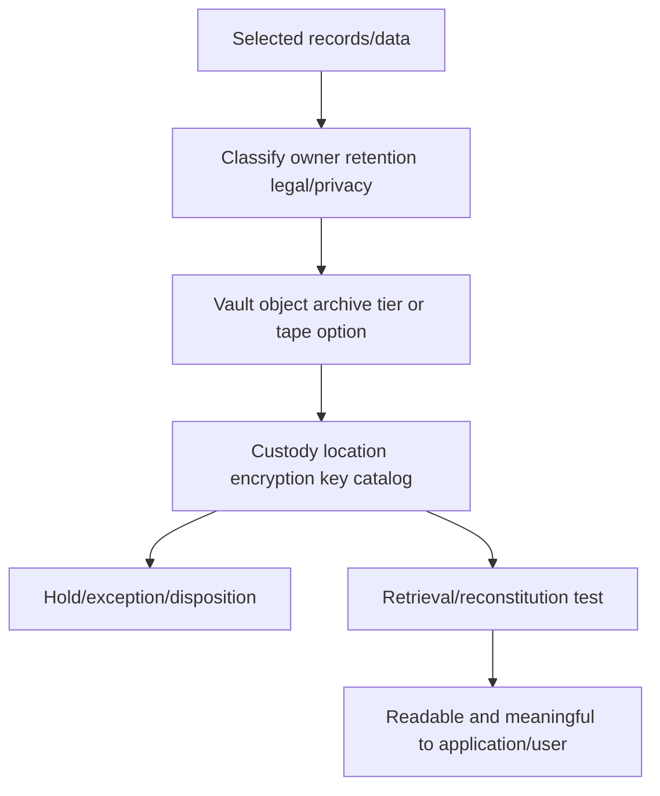

### Backup versus archive

| Dimension | Backup | Archive |
|---|---|---|
| Primary trigger | Recovery from loss/corruption | Long-term record/business retention |
| Selection | Broad recoverable workload state | Governed record classes |
| Access | Restore under incidents/tests | Search/retrieve under business/legal need |
| Retention | Operational/cyber/recovery windows | Often longer legal/business schedule |
| Disposal | Backup expiry | Controlled records disposition/hold |
| Success | Recovery works within target | Correct record retrieved with integrity/custody |

Do not call a cold object tier or tape cartridge an archive until metadata, catalog, ownership, retention, hold, retrieval, media/key lifecycle, and disposition are designed.

---

## 10. Monitoring, ownership, and evidence

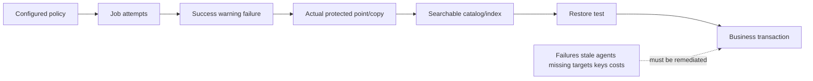

### Ownership model

| Area | Accountable role question |
|---|---|
| Business/RPO/RTO | Who accepts data loss/outage and funds protection? |
| Application consistency | Who owns flush/quiesce/log recovery? |
| ONTAP/source | Who owns source health, points, capacity, and access? |
| Console/service | Who owns organization/project/RBAC/agents/policies/jobs? |
| Object/cloud | Who owns account, bucket, IAM, network, key, retention, bill? |
| Backup platform/integration | Who owns catalog, plug-ins, support, upgrades? |
| Security/legal | Who owns immutability, evidence, holds, incident constraints? |
| Recovery | Who declares event, selects point, validates, and closes? |

### Evidence pack

- Business service, data class, workload/app/version, owner, RPO/RTO/retention/hold.
- Source system/release, protected object, point policy, application-consistency logs.
- Console organization/project/mode, service version/release context, agent identity/version/health/connectivity.
- Protection policy stages, jobs, warnings/errors, actual points/copies, catalog/index status.
- Target account/bucket/region/class/capacity, credentials without secrets, encryption/key and immutability/retention state.
- Network/DNS/TLS/provider service, cost/billing dimensions, lifecycle/archive tier.
- Restore selection, destination, timed stages, integrity, application transaction, actual RPO/RTO.
- Current docs/support matrix/contracts, gaps, actions, owner/date, validation, residual risk.

---

## 11. Cost and egress

Backup economics include more than stored capacity. Provider and service charges change; use current billing and contracts, never invented prices.

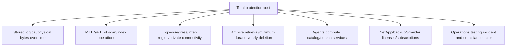

### Cost-risk balance

- Aggressive lifecycle to colder tiers can reduce standing cost but increase retrieval delay and fees.
- Longer retention increases stored versions and governance value but also cost and attack/eDiscovery surface.
- Search/index features can provision provider resources or scanning cost under current service behavior.
- Cross-region/account restores can incur egress and require new service quotas/permissions.
- A cheaper design that cannot meet tested RTO is not cost-effective.
- A cyber restore that scans or moves data may create exceptional egress/compute demand.

Model low/base/high growth, change, retention, operations, retrieval frequency, disaster restore, and exit/migration scenarios.

---

## 12. Restore workflow and testing

### Plain-English deep-dive: a backup succeeds only when the business can use it

A sealed moving box with a barcode is not useful if the inventory database is missing, the key is lost, the destination has no space, or the application rejects the contents. **Why it matters:** job success and object existence are intermediate evidence; restore and business validation are the outcome.

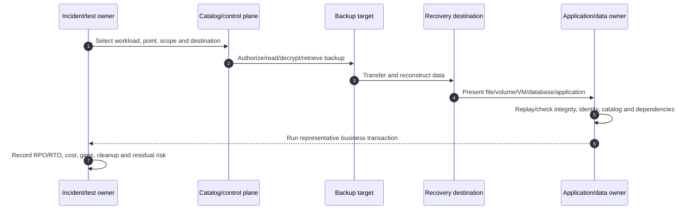

### Test matrix

| Test | Failure injected | Required evidence |
|---|---|---|
| File/folder | Deleted/renamed item | Correct content, metadata, permissions, app use |
| Volume | Lost source volume | New target volume, host/app validation |
| Database | Corruption at known time | Logs/catalog consistency and transactions |
| VM/application | Site/host loss | Compute/network/DNS/identity plus data |
| Object/archive | Cold/archived point | Retrieval delay/cost, key, checksum, app readability |
| Cyber | Primary identities/control unavailable | Separate recovery identity, clean point, evidence preservation |
| Catalog loss | Index/control unavailable | Documented re-discovery/import/rebuild capability where supported |

Do not run destructive/failure tests in production without authorization and exact runbooks.

---

## 13. Ecosystem integration patterns, not promises

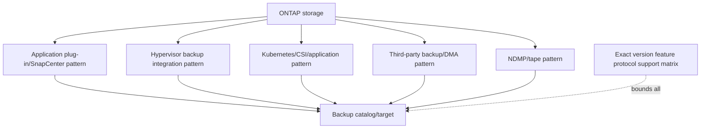

### Integration evaluation checklist

1. Exact source workload, protocol, ONTAP, app/hypervisor/Kubernetes, plug-in/agent, and backup-product versions.
2. Supported snapshot/consistency, backup, restore, clone, log, and granular-recovery operations.
3. Credential/RBAC/service-account and certificate/TLS model.
4. Data path, proxies/media servers/agents, network ports, and performance effects.
5. Catalog ownership, retention, immutability, target, and key dependencies.
6. Upgrade order, lifecycle, deprecations, and support boundaries among vendors.
7. Positive, negative, failover, catalog-loss, and application restore tests.
8. Exact escalation owner and minimum evidence for each layer.

Avoid statements such as “Vendor X supports ONTAP” without the precise solution combination and dated source.

---

## 14. Failure modes and troubleshooting decision tree

| Symptom | Candidate causes | Discriminating evidence |
|---|---|---|
| Workload not discovered | Agent path, permissions, source version, project scope | Agent/service/source discovery logs |
| Snapshot succeeds, object backup fails | Target IAM, DNS/TLS, capacity, provider/service | Stage-specific job and provider audit |
| Backup job green, point missing | Wrong workload/policy/catalog scope or stale UI | Actual source/target point identities |
| Application restore fails | Crash-only point, plug-in warning, missing logs/catalog/dependency | App/integration and recovery logs |
| Cannot delete expired data | Retention lock/legal hold/lifecycle behavior | Exact object/version retention state |
| Copy deleted by attacker | Shared identity/control plane, mutable target/key deletion | IAM/audit/retention architecture |
| Restore is slow | Archive retrieval, egress, agent/network, reconstruction, app replay | Timed stage breakdown |
| Cost spike | Retention growth, operations/search, retrieval/egress, orphaned copies | Provider billing dimensions and event timeline |
| Catalog unavailable | Control/metadata/database dependency | Supported recovery/import/rebuild procedure |
| “Air gap” fails | Shared federation/admin/key/network path | Dependency and threat-model test |

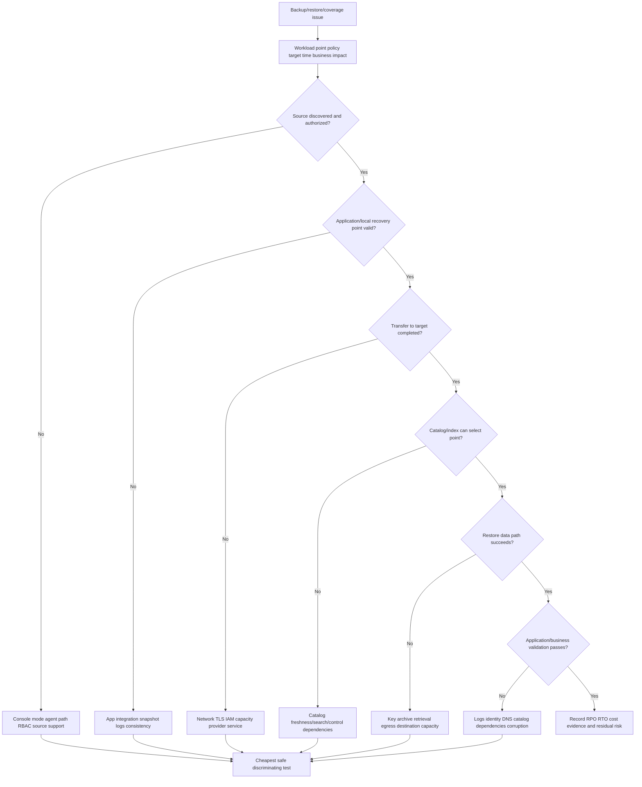

### Support boundaries

- Do not activate services, deploy agents, change policies/retention/immutability, rotate keys, delete buckets/copies, or start production restores from this guide.
- Application owners govern consistency and acceptance.
- NetApp/storage/backup vendors govern exact supported procedures and product defects.
- Cloud/security teams govern accounts, IAM, keys, network, immutability, logs, and billing.
- Legal/records owners govern retention, holds, archives, and disposition.
- TAM analysis governs evidence, risk, options, ownership, communication, and follow-through.

---

## 15. TAM discovery, supportability, risk, and recommendations

### Discovery questions

1. Which business services/workloads/data classes, owners, RPO/RTO, retention, legal holds, and threat scenarios apply?
2. Which snapshots, replicas, backups, archives, offline/logically isolated/immutable copies exist, and which failure domains remain shared?
3. Which current NetApp Console organization/project/mode, agents, NetApp Backup and Recovery workload, policy, and jobs apply?
4. Which source systems/versions/protocols/apps/integrations and target accounts/regions/classes are exact-supported?
5. Which control, catalog, data, identity, key, network, provider, and destination dependencies exist?
6. How are application consistency, labels, point identity, catalog registration, and job warnings proved?
7. Which actors can change policy, retention, immutability, account, object, key, or audit configuration?
8. What are capacity, operation, retrieval, egress, search/index, license, and labor costs?
9. Which file/volume/database/VM/application/cyber restores were tested, and what actual RPO/RTO/business outcome resulted?
10. Which current docs, release notes, IMT/HWU, provider, contract, or support evidence is missing?

### Recommendation model

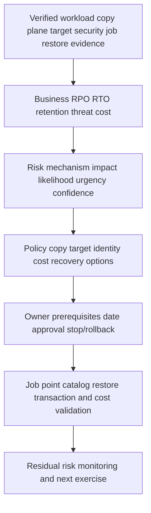

### Recommendation patterns

| Finding | Risk | Bounded recommendation | Validation |
|---|---|---|---|
| Three copies share one cloud admin/key | One compromise can erase/decrypt all | Separate recovery administration/key/control under current supported design | Access-loss/deletion simulation and restore |
| Policy green but database quiesce warns | Point may not restart coherently | Fix exact integration/support issue and retest app recovery | Database transactions and logs |
| Archive tier selected without RTO test | Retrieval delay/fees miss business need | Run representative cold restore and compare tier options | Timed retrieval/app test and current bill |
| “Air gap” is always-online mutable bucket | Ransomware/admin path reaches copy | Define threat model and add supported immutability/isolation/offline option | Denied mutation plus separate-identity recovery |
| Third-party integration lacks version evidence | Unsupported restore during incident | Validate exact matrix/notes and upgrade/lifecycle ownership | Dated evidence and negative/positive restore |

### JD Mapping

| JD responsibility | Part 37 contribution | Arti's factual bridge and gap |
|---|---|---|
| Understand environment | Maps workload through control/catalog/data/target/recovery | Azure/M365 architecture transfer |
| Analyze/report data | Tracks jobs, coverage, retention, cost, tests, RPO/RTO | Analytics strength transfers |
| Strategic planning | Designs layered copies, lifecycle, ownership and tests | Advisory/MBA transfer |
| Risk/stability | Exposes shared control, mutable copies, app/catalog/key gaps | CRITSIT/security method transfers |
| Supportability | Requires exact workload/integration/source/target evidence | No gated/customer result claimed |
| Service reviews | Turns protection evidence into actions and residual risk | Review/leadership experience transfers |
| Cross-functional work | Coordinates app/storage/cloud/security/legal/vendors | Product-group coordination transfers |

---

## 16. Fully synthetic scenario: Contoso Legal backup and archive gap

> **Synthetic case:** Contoso Legal, every workload, account, backup, metric, bill, incident, and result below is fictional. It is not a NetApp customer, benchmark, internal process, tool result, or Arti's production work.

### Environment

- ONTAP file volumes and a SQL matter database are protected through local snapshots and object backups.
- Historical runbooks still say BlueXP; the current team uses NetApp Console and two Console agents.
- Production, backup objects, catalog, and encryption keys share one cloud subscription and privileged group.
- A colder archive class starts after 30 days in the synthetic policy.
- Legal hold metadata exists in a separate records system but is not reconciled to backup expiry.
- Dashboard jobs are mostly green; no full matter restore was completed this year.

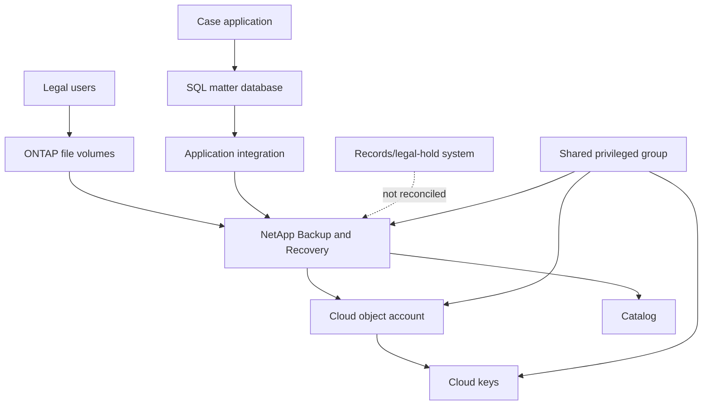

### Incident timeline

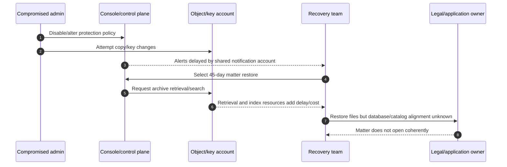

### Findings

| Evidence | Observation | Bounded conclusion |
|---|---|---|
| Naming/runbook | Old BlueXP terms do not match current Console roles/UI | Operational delay; verify current docs |
| Identity | Same group controls policy, objects, keys, and alerts | Control blast radius is broad |
| Immutability | No exact mechanism/mode/retention evidence | “Immutable backup” claim is unproved |
| Archive | 45-day point needs cold retrieval/search | RTO and exceptional cost untested |
| App consistency | File and SQL points not linked to one matter transaction | App-coherent recovery unproved |
| Legal hold | Records system and backup expiration differ | Compliance/disposition conflict |
| Tests | File-only restore passed; full matter failed | Backup bytes exist, business recovery does not |

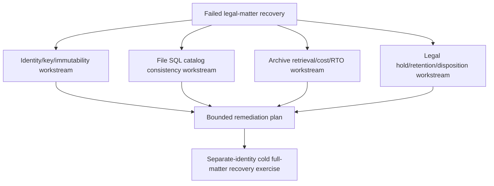

### Recommendations

1. Update runbooks to current NetApp Console/service/agent terminology while preserving old names as search aliases and recording version/date.
2. Separate backup/recovery administration, object/key control, and external alerting under a current-supported least-privilege/break-glass design.
3. Verify and document the exact immutability/retention mechanism and who can alter/delete account, data, keys, or policy; do not label it air-gapped without a threat-model test.
4. Reconcile legal-hold records with backup/archive retention and disposition under legal ownership.
5. Run a cold full-matter restore that links files, SQL, application catalog, identity, and a representative matter transaction; record retrieval time, egress/resources, actual RPO/RTO, and residual risk.

### Customer-facing summary

> "Most backup jobs completed, but recoverability is not yet proved. One privileged group controls policy, objects, keys, and alerts; the exact immutability claim is undocumented; legal holds do not reconcile to expiry; and the cold restore returned files without a coherent SQL/application matter. We recommend separate recovery control, documented retention/immutability, legal reconciliation, and a timed full-matter restore using current NetApp Console procedures."

---

## 17. Arti's factual transfer and honest positioning

```mermaid
flowchart LR
    AZ[Azure cloud identity networking cost] --> OBJ[Object target IAM key egress shared responsibility]
    M365[SharePoint/OneDrive versions retention] --> GOV[Recovery scope catalog retention user outcome]
    CRIT[CRITSIT] --> REC[Restore workstreams evidence communication]
    BI[Analytics/MBA] --> KPI[Coverage failures aging cost and test dashboards]
    OBJ --> METHOD[NetApp backup conceptual method]
    GOV --> METHOD
    REC --> METHOD
    KPI --> METHOD
    METHOD --> LAB[Future authorized service lab/SME review]
```

> **Honest interview answer:** "I separate snapshots, replication, backup, and archive, then map control, catalog, data, identity/key, target, and application planes. I understand the current public naming as NetApp Console and NetApp Backup and Recovery, with BlueXP as historical context, and I evaluate 3-2-1-1-0, immutability, air-gap, cost, and integrations by tested evidence. My production background is Microsoft support and Azure/M365, not NetApp backup operations. I would verify current workload/target support and use authorized specialists before changes."

---

## 18. Whiteboard drills, paper lab, and self-test

### Whiteboard drills

1. Snapshot versus replication versus backup versus archive.
2. RPO/RTO/retention/consistency/recovery-scope policy.
3. 3-2-1-1-0 as a failure-domain checklist.
4. Physical offline versus logical isolation versus immutability.
5. Control, catalog, data, identity/key, and application planes.
6. NetApp Console -> agent -> source/target -> Backup and Recovery.
7. Application coordinator -> storage point -> target/catalog -> restore.
8. Object target DNS/TLS/IAM/key/retention/audit path.
9. Backup cost dimensions and cold retrieval.
10. Job success -> actual copy -> catalog -> restore -> business transaction.

### Paper lab

A fictional company has ONTAP volumes, SQL, VMware, Kubernetes, three Console agents, two object providers, StorageGRID, a third-party backup platform, NDMP/tape, mixed BlueXP/Console runbooks, 40 policies, 12 accounts, archive tiers, legal holds, shared keys, and incomplete restore evidence.

Tasks:

1. Inventory workloads, data classes, owners, RPO/RTO, retention, holds, and threat scenarios.
2. Map snapshots, replicas, backups, archives, and each failure/security domain.
3. Normalize current versus historical product/agent/UI names with dated sources.
4. Draw control/catalog/data/identity/key/network/target/application dependencies.
5. Validate exact source, target, integration, version, protocol, and restore support.
6. Reconcile configured policies, job attempts, actual copies, catalog, warnings, and tests.
7. Test shared-account compromise, agent loss, catalog loss, key loss, target outage, and archive retrieval.
8. Model low/base/high capacity, operations, retrieval, egress, license, and labor cost.
9. Reconcile legal hold, immutability, retention expiry, and disposition ownership.
10. Plan file, volume, database, VM/application, and cyber-recovery tests.
11. Measure synthetic actual RPO/RTO/cost and run a business transaction.
12. Write seven-part recommendations and a customer-facing summary.

```mermaid
flowchart LR
    INV[Inventory workload/objectives] --> MAP[Map copies/planes/dependencies]
    MAP --> SUP[Validate current support/naming]
    SUP --> EVID[Reconcile jobs copies catalog]
    EVID --> FAIL[Inject identity target key catalog failures]
    FAIL --> REST[Run cold/app/cyber restores]
    REST --> REC[Recommend and track residual risk]
```

### Lab pass checklist

- [ ] Snapshot, replication, backup, and archive remain distinct.
- [ ] 3-2-1-1-0 is an orientation, not a guarantee.
- [ ] Air-gap/immutability claims name exact threat model and exception paths.
- [ ] Current NetApp Console and NetApp Backup and Recovery names are used with BlueXP historical context.
- [ ] Control, catalog, data, identity/key, and application planes are tested separately.
- [ ] Application consistency and ecosystem support have dated exact evidence.
- [ ] Costs include operations, retrieval, egress, search/index, license, and labor.
- [ ] Legal hold, retention, immutability, archive, and disposition owners align.
- [ ] Restore validation reaches a representative business transaction.
- [ ] No synthetic/lab result is called production NetApp experience.

### Self-test

1. Define backup/archive and compare with snapshot/replication.
2. Build a policy from RPO/RTO/retention/consistency/scope/threat/cost.
3. Explain 3-2-1-1-0 without calling it a standard or guarantee.
4. Distinguish physical air gap, logical isolation, and immutability.
5. Draw control/catalog/data/identity/key/application planes.
6. Explain current NetApp Console, agent, and Backup and Recovery naming.
7. Draw broad ONTAP local/secondary/object protection paths.
8. Explain application-aware integration and exact support evidence.
9. Trace object target credentials/encryption/key/immutability/retention/audit.
10. Compare backup and archive governance plus NDMP/tape orientation.
11. Build ownership, monitoring, evidence, and cost models.
12. Run the end-to-end restore and test matrix on paper.
13. Apply ecosystem evaluation and troubleshooting trees.
14. Recreate Contoso Legal's four workstreams.
15. Complete paper lab and Q1-Q8 aloud.
16. State Arti's transfer and gap accurately.

---

## 19. Official Source Anchors

**Date checked: 2026-08-24.** These official public sources anchor current naming and broad architecture. Exact workloads, targets, regions, deployment modes, agents, policies, immutability, restore paths, costs, licensing, NDMP/tape, and integration support change. Re-open current workload-specific prerequisites, limitations, release notes, provider terms, IMT/HWU, and Support evidence.

| Topic | Official public source | Bounded use and currency note |
|---|---|---|
| NetApp Console | [Learn about NetApp Console](https://docs.netapp.com/us-en/console-setup-admin/concept-overview.html) | Current Console, deployment modes, agents, IAM, service context |
| Backup service | [Learn about NetApp Backup and Recovery](https://docs.netapp.com/us-en/data-services-backup-recovery/concept-backup-to-cloud.html) | Current service/workload/target/cost overview; verify exact source/target |
| Backup docs | [NetApp Backup and Recovery documentation](https://docs.netapp.com/us-en/data-services-backup-recovery/) | Current workload-specific prerequisites, policies, jobs, restore, limitations |
| ONTAP restore | [ONTAP data restore options in NetApp Backup and Recovery](https://docs.netapp.com/us-en/data-services-backup-recovery/prev-ontap-restore.html) | Current snapshot/replica/object restore orientation; page path may retain legacy prefix |
| SnapCenter | [SnapCenter documentation](https://docs.netapp.com/us-en/snapcenter/) | Exact application plug-in/host/storage backup and restore support |
| SnapMirror vault | [Learn about vault archiving using ONTAP SnapMirror technology](https://docs.netapp.com/us-en/ontap/data-protection/vault-archive-snapmirror-technology-concept.html) | Vault policy/label/retention orientation; archive governance remains broader |
| ONTAP tape | [Learn about tape backup of ONTAP FlexVol volumes](https://docs.netapp.com/us-en/ontap/tape-backup/) | Current dump/SMTape/NDMP orientation; verify app/media/volume support |
| NDMP | [Learn about ONTAP NDMP configuration](https://docs.netapp.com/us-en/ontap/ndmp/) | Current SVM/node scope and third-party DMA prerequisites |
| Storage security | [NIST SP 800-209 - Security Guidelines for Storage Infrastructure](https://csrc.nist.gov/pubs/sp/800/209/final) | Vendor-neutral storage protection, access, encryption, audit, configuration context |
| Cyber recovery | [NIST SP 800-184 - Guide for Cybersecurity Event Recovery](https://csrc.nist.gov/pubs/sp/800/184/final) | Recovery planning, prioritization, realistic scenarios, metrics |
| CISA ransomware | [CISA StopRansomware](https://www.cisa.gov/stopransomware) | Re-open current official guidance; site URLs/content can move |
| Cloud providers | [AWS S3](https://docs.aws.amazon.com/s3/), [Azure Blob Storage](https://learn.microsoft.com/en-us/azure/storage/blobs/), [Google Cloud Storage](https://cloud.google.com/storage/docs) | Current IAM/object lock/encryption/lifecycle/price/region terms for exact target |
| IMT/HWU | [NetApp Interoperability Matrix Tool](https://imt.netapp.com/), [NetApp Hardware Universe](https://hwu.netapp.com/) | Potentially gated exact ecosystem/platform evidence where relevant |
| Support | [NetApp Support Site](https://mysupport.netapp.com/) | Entitlement-dependent procedures, advisories, defects, cases, and knowledge |

### Source-use discipline

- Record current and legacy name, source URL, page date, Console mode, service/workload, agent, and organization/project.
- Capture exact source/target/integration versions and support notes; never generalize from a product logo.
- Protect credentials, object names, keys, customer data, account IDs, and topology.
- Reconcile configured policy, actual point, object/catalog evidence, and restore outcome.
- Use current provider billing/security/retention terms and customer contracts; never invent price or durability.
- Mark access-gated and unknown evidence explicitly.

---

## Likely Interview Questions

### Q1. Compare snapshot, replication, backup, and archive.

> **Model answer:** "A snapshot is a local point-in-time image; replication sends selected state to another system; backup creates cataloged recovery copies in a deliberately independent design; archive preserves governed records for long-term retrieval and disposition. They can be layered, but none implies the others. I prove failure domains, consistency, retention, catalog, security, and restore outcome."

### Q2. How do you use the 3-2-1-1-0 rule responsibly?

> **Model answer:** "I treat it as a planning mnemonic, not a standard or guarantee: three instances, two approaches, one offsite, one offline/isolated/immutable, and zero unresolved errors through testing. I then map real storage, site, account, identity, key, network, catalog and admin failure domains. Three icons under one compromised control plane are not three independent protections."

### Q3. What are control, catalog, and data planes in backup?

> **Model answer:** "The control plane holds policy, RBAC and job orchestration; the catalog records workloads, points and restore metadata; the data plane moves/stores payload. Identity/key and application planes cut across them. I test loss or compromise of each separately because intact backup objects may still be unusable without catalog, keys, recovery identity or application dependencies."

### Q4. What is the current BlueXP naming context?

> **Model answer:** "At the 2026-08-24 public-doc check, the management experience is NetApp Console, its connectivity components are Console agents, and the service is NetApp Backup and Recovery. BlueXP remains historical wording in older documents, URLs and customer vocabulary. I record both for search, but verify the current UI, mode, feature, workload, target and release rather than assume a rename preserves every behavior."

### Q5. What makes an immutable or air-gapped copy credible?

> **Model answer:** "I name the exact mechanism, retention start/end, protected actors/actions, privileged exceptions, account/key deletion paths, network/control dependencies and audit. Physical offline, logical isolation and immutability are different. Immutability does not prove clean data or available keys, and an online bucket is not a physical air gap. I test denied mutation and separate-identity restore."

### Q6. How do you validate an ecosystem backup integration?

> **Model answer:** "I capture exact ONTAP, workload/app, protocol, plug-in/agent, backup product, target and restore versions plus matrix notes. Then I test credentials/TLS, app quiesce, snapshot, transfer, catalog, retention, failure, granular/full restore and business transaction. 'Supports ONTAP' without the combination and scope is not supportability evidence."

### Q7. How do you control cloud backup cost without weakening recovery?

> **Model answer:** "I model stored bytes/time, operations, search/index resources, retrieval class/minimum duration, egress/inter-region transfer, agents/compute, licenses and labor under low/base/high and disaster scenarios. Then I test cold restore against RTO. Lifecycle changes need data/legal/security approval because the cheapest tier can create unacceptable retrieval delay or disposition risk."

### Q8. How does your background transfer, and what remains a gap?

> **Model answer:** "Azure gives me IAM, keys, networking, object and cost discipline; M365 gives me versions, retention and user recovery context; CRITSIT and analytics give me evidence, restore workstreams and reporting. I understand NetApp backup architecture conceptually but have not operated Console, Backup and Recovery, SnapCenter or NDMP in production. I would validate current docs and use authorized specialists before changes."

---

## 30-Second Memory Hooks

- **Snapshot:** Bookmark in the same book.
- **Replication:** Governed copy to another office.
- **Backup:** Cataloged recovery copy with an exercised restore.
- **Archive:** Long-term governed record and disposition.
- **3-2-1-1-0:** Count real failure domains and close restore errors.
- **Air gap:** Define physical, logical, and management paths precisely.
- **Control plane:** Policy and orchestration.
- **Catalog plane:** What exists and how to find it.
- **Data plane:** Where protected bytes move and live.
- **NetApp Console:** Current management name at the check date.
- **BlueXP:** Historical/search context; verify today's equivalent.
- **Console agent:** Connectivity/orchestration component where required.
- **Application-aware:** App closes its books before the point is captured.
- **Encryption:** Confidentiality; not deletion prevention.
- **Immutability:** Defined actors cannot change data for defined time.
- **Archive tier:** Cheap standing storage can mean slower/costlier retrieval.
- **Green job:** Intermediate evidence, not recoverability.
- **Restore:** Catalog -> target -> destination -> application -> transaction.
- **Arti's bridge:** Cloud/recovery rigor transfers; NetApp operation does not.

---

## Completion Checklist

- [ ] Separate snapshot, replication, backup, and archive.
- [ ] Convert RPO/RTO/retention/consistency/threat/cost into policy.
- [ ] Use 3-2-1-1-0 only as an orientation and map actual failure domains.
- [ ] Distinguish physical offline, logical isolation, and immutability.
- [ ] Map control, catalog, data, identity/key, network, and application planes.
- [ ] Use current NetApp Console/Backup and Recovery naming with BlueXP context.
- [ ] Bound every workload, target, mode, agent, feature, and restore claim to current docs.
- [ ] Validate application consistency and ecosystem integrations exactly.
- [ ] Map object IAM, TLS, keys, encryption, immutability, retention, audit, and ownership.
- [ ] Compare backup/archive/vault/tape/NDMP without promises.
- [ ] Monitor policy -> jobs -> copies -> catalog -> restores -> business outcomes.
- [ ] Model storage, operations, search, retrieval, egress, license, and labor costs.
- [ ] Apply restore matrix, troubleshooting tree, support boundaries, and recommendation model.
- [ ] Recreate Contoso Legal's synthetic analysis and complete paper lab.
- [ ] Answer Q1-Q8 aloud and state Arti's production boundary.
- [ ] Recheck current NetApp/provider/app/IMT/HWU/Support evidence before customer use.

---

*Next suggested section:* [Part 38 - MetroCluster, Site Resilience, and Disaster-Recovery Operations](Part-38-metrocluster-site-resilience-dr.md)