# Part 38 - MetroCluster, Site Resilience, and Disaster-Recovery Operations

> **Section goal:** Understand how MetroCluster extends ONTAP resilience across sites, how local high availability differs from site disaster recovery, and how synchronous mirroring, configuration replication, networks/fabrics, switchover, healing, switchback, monitoring, and application dependencies combine. By the end, you should be able to reason safely about planned versus disaster operations, split-brain risk, RPO/RTO, and evidence-driven runbooks without turning this guide into a production procedure.

Covers index item **38** and maps directly to job-description responsibilities for storage depth, customer-environment discovery, technical risk, supportability, strategic planning, high-pressure incident work, preventative recommendations, operational reviews, and cross-functional execution.

**Version caveat:** Exact MetroCluster topology names, supported platforms/switches/adapters/optics/distances, node counts, ONTAP versions, SyncMirror behavior, IP/FC/stretch architecture, mirrored/unmirrored storage, cluster peering, mediator/Tiebreaker capabilities, automatic unplanned switchover, switchover/healing/switchback prerequisites, vetoes, NVFAIL, commands, maintenance, upgrade, and recovery procedures are release- and configuration-sensitive. Verify the exact current MetroCluster documentation, Hardware Universe (HWU), Interoperability Matrix Tool (IMT), switch/vendor guidance, release notes, and NetApp Support procedure.

This Part gives no hard distance, latency, RPO, RTO, detection time, free-space, port, model, or topology limit and no production command sequence. Broad terms such as “zero data loss” describe a design objective under healthy synchronous operation, not a blanket guarantee across every rolling disaster, forced action, application cache, unmirrored object, or lost nonvolatile state.

> **No-production-NetApp boundary:** You do not claim production MetroCluster experience. Every site, cluster, plex, network, failure, timeline, command placeholder, and recovery result below is synthetic. Your factual strengths are enterprise escalation, Azure/site and network dependencies, Windows/AD/DNS, critical-situation ownership, analytics, stakeholder coordination, and customer communication. The explicit non-claim is: **you have not installed, cabled, configured, monitored, upgraded, switched over, healed, switched back, forced, or disaster-recovered a production MetroCluster; configured ONTAP Mediator or MetroCluster Tiebreaker; or validated a NetApp customer's site-resilience design.**

---

## 1. Resilience vocabulary from zero

**MetroCluster** is an ONTAP architecture using two physically separate mirrored clusters so each site protects the other's data and selected storage virtual machine (SVM) configuration. A surviving site can activate mirrored resources after an approved switchover.

### Plain-English deep-dive: two staffed branches with synchronized vaults

Each branch has two local managers who cover for one another: that is local high availability (HA). Each branch also keeps a synchronized vault copy and operating blueprint for the other branch: that is site resilience. If one branch is lost, the other can assume its work through a controlled switchover. **Why it matters:** local node takeover is not the same operation as site switchover, and mirrored data alone does not redirect users, applications, or networks.

| Term | Plain meaning | Analogy | Why it matters |
|---|---|---|---|
| **HA pair** | Two local nodes that protect each other | Two managers at one branch | Handles local controller failure |
| **DR partner** | Corresponding remote node/site role | Partner branch manager | Participates in site recovery |
| **SyncMirror** | Synchronous aggregate mirroring into two plexes | Two synchronized vault ledgers | Protects mirrored storage across failure domains |
| **Plex** | One complete side of a mirrored aggregate | One vault's copy | Both plex health/location matter |
| **Switchover** | Surviving site assumes remote-site storage/SVM service | Branch takes over partner's customers | Site-level role transition |
| **Healing** | Restores storage/controller recovery relationships after switchover under exact workflow | Rebuild/reconcile damaged branch resources | Prepares safe switchback |
| **Switchback** | Return service/ownership to recovered original site | Reopen and return customers | Requires validated readiness |
| **Negotiated switchover** | Planned/coordinated transition with both sites participating | Scheduled branch maintenance | Preferred for tests/maintenance |
| **Forced switchover** | Disaster action when normal coordination is unavailable | Emergency takeover without partner confirmation | Higher stale-data/split-brain risk |
| **Fencing** | Prevents unsafe simultaneous ownership/access | Lock one branch's doors before opening the other | Avoids dual writers |

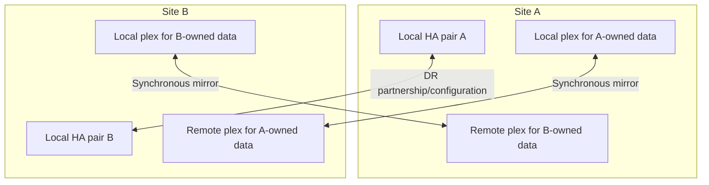

---

## 2. Local HA versus site resilience

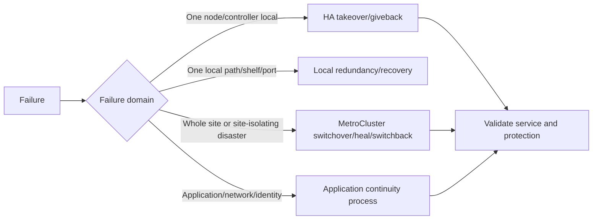

| Dimension | Local HA | MetroCluster site resilience |
|---|---|---|
| Scope | Node/HA pair and local components | Two clusters/sites and mirrored storage/configuration |
| Common transition | Takeover/giveback | Switchover/healing/switchback |
| Storage path | Partner accesses local-owned storage | Surviving site activates remote mirrored plex/resources |
| Network effect | LIF failover within local design | DR SVM/LIF/network/DNS/client path changes under design |
| Main risk | Local partner capacity/path health | Site isolation, stale state, fencing, app/network dependencies |

A local HA event can occur inside a MetroCluster site without a site switchover. Conversely, both local nodes or an entire site can be unavailable, requiring site-level decision logic.

---

## 3. MetroCluster variants at broad level

Current documentation includes **MetroCluster IP**, fabric-attached **MetroCluster FC**, and **stretch MetroCluster** families. Exact supported topology, generation, node count, platform, switches, distance, and transition path must be verified.

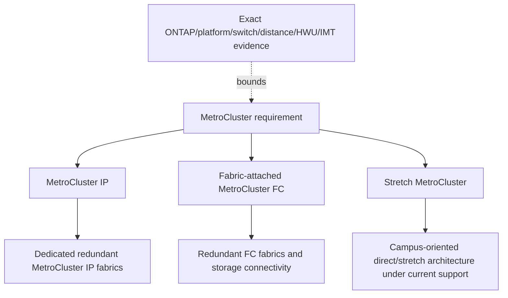

### Broad comparison

| Area | MetroCluster IP | Fabric-attached MetroCluster FC | Stretch MetroCluster |
|---|---|---|---|
| Replication transport | Dedicated MetroCluster IP fabric over supported Ethernet architecture | Supported FC fabric architecture | Supported direct/stretch connectivity |
| Remote storage access concept | Remote storage pools are reached through remote controllers under documented IP behavior | Remote storage connectivity uses FC/SAS fabric architecture under exact design | Topology-specific direct paths |
| Network/fabric evidence | IP switches, VLAN/subnets, ISLs, MetroCluster interfaces, peering | FC switches/fabrics, ISLs, FC-VI/storage paths, peering | Exact direct cabling/distance/platform |
| Main warning | MetroCluster IP fabric is not ordinary cluster-peering/data network | FC zoning/cabling/switch support is exact and complex | Do not infer modern platform/topology support from old diagrams |

### Variant selection criteria

- Customer sites/distance/facilities and failure domains.
- Current platform/ONTAP/switch/adapter/optics/cabling support.
- Existing operational skills and lifecycle horizon.
- Required capacity/performance and future expansion/refresh path.
- Network/fabric ownership, monitoring, maintenance, and diversity.
- Application, protocol, security, backup, and third-site needs.

---

## 4. Synchronous mirroring and configuration replication

MetroCluster uses synchronous data mirroring for mirrored aggregates and replicates relevant SVM configuration across clusters under exact behavior. These are related but distinct planes.

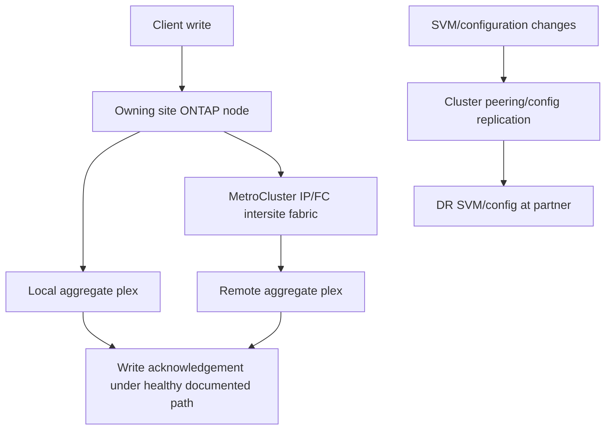

### Plain-English deep-dive: data ledger and operating blueprint

The mirrored plex is the synchronized data ledger. Configuration replication is the operating blueprint telling the partner how the service is arranged. Losing either can complicate recovery: data without usable configuration is hard to serve; configuration without current mirrored data is not the application. **Why it matters:** monitor storage mirroring and configuration replication separately.

### Mirrored and unmirrored storage

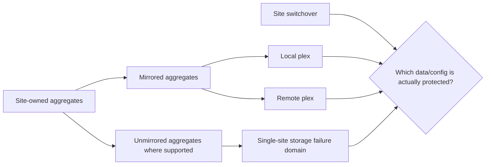

Never report “the cluster is MetroCluster” as proof that every aggregate, volume, SVM, object, or dependency is site-protected. Inventory exact mirrored placement and feature support.

---

## 5. Network and fabric planes

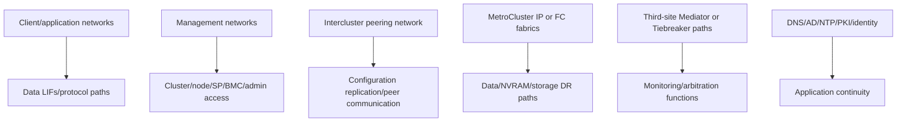

### Failure-domain checklist

- Independent power, cooling, facilities, carrier/path, switch/fabric, and management access.
- Shared conduits, providers, buildings, firmware batches, credentials, DNS, identity, keys, and automation.
- Local HA interconnect, MetroCluster intersite links, cluster peering, client, and out-of-band paths.
- ISL loss versus switch loss versus site loss versus rolling failure.
- Bandwidth/latency/loss/error/headroom and maintenance collision.
- Third-site reachability from both sites without sharing the same failure domain.

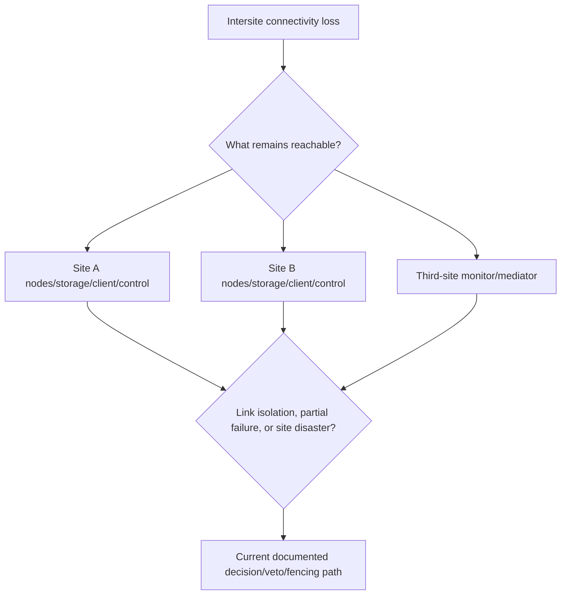

---

## 6. Split brain, quorum intuition, and fencing

**Split brain** is the dangerous condition in which isolated sides could each believe they should serve the same logical data. **Quorum** is a broader distributed-systems decision concept; MetroCluster has product-specific state, connectivity, veto, DR-partner, storage, and optional third-site mechanisms. Do not map generic “majority vote” language onto exact ONTAP behavior.

### Plain-English deep-dive: never open both copies of the same cash drawer

If the communication cable is cut, each branch cannot know whether the other branch is destroyed or merely isolated. Allowing both to accept transactions against the same account creates conflicting ledgers. Fencing and conservative veto logic ensure authority is established before the surviving side serves remote data. **Why it matters:** a forced switchover can be riskier than waiting if the other site might still write or if mirrored state is incomplete.

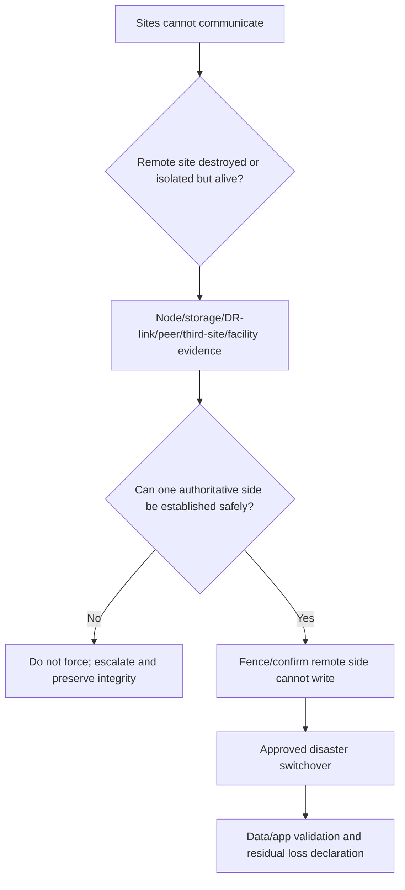

### Forced-action questions

1. Is the disaster site physically destroyed, powered off, isolated, or partially reachable?
2. Can storage, NVRAM state, DR partner links, and mirrored plexes be reached?
3. Could the remote site still serve clients or accept writes?
4. Which data might be unmirrored or have nonvolatile inconsistency?
5. What do current MetroCluster checks, operation history, EMS, mediator/Tiebreaker, and facility evidence show?
6. Which veto exists, and why?
7. Has NetApp Support identified the exact forced procedure for this topology/state?
8. Who accepts potential data loss/application recovery and communicates it?

---

## 7. ONTAP Mediator, MetroCluster Tiebreaker, and “witness” language

Do not use **witness**, **mediator**, and **tiebreaker** as synonyms. Use the exact product and supported role.

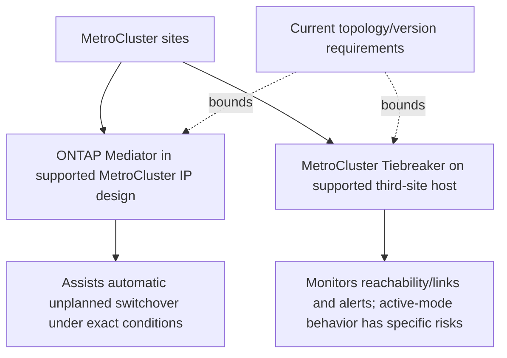

### Careful distinction

| Mechanism | Broad role | Do not assume |
|---|---|---|
| ONTAP Mediator for MetroCluster | Third-site service used in supported MetroCluster IP automatic unplanned switchover design | It is identical to SnapMirror active sync use, supports every topology, or replaces all validation |
| MetroCluster Tiebreaker | Third-site monitoring of clusters/connectivity, event/alert behavior, with separately documented active-mode risks | It is a generic quorum voter or safely forces every disaster transition |
| External monitoring | Health/alert/automation platform | Monitoring proves authority or may initiate switchover safely |

### Third-site design questions

- Exact supported MetroCluster type, ONTAP, Mediator/Tiebreaker release, host OS, and mode.
- Network reachability/security/DNS/time/certificates/credentials from both sites.
- Third-site independence from primary/secondary power, network, identity, and administration.
- Failure behavior if third site or one path is unavailable.
- Alert/automatic-action conditions, vetoes, silent periods, and human escalation.
- Patch, backup, monitoring, access, and lifecycle ownership for the third-site component.

---

## 8. Switchover: planned/negotiated versus disaster/forced

### Plain-English deep-dive: planned handover versus emergency authority

A negotiated switchover is like both branch managers signing a handover while they can compare ledgers and lock the departing counter. A forced switchover is an emergency decision made when one manager cannot answer; before opening the second counter, responders must prove the first cannot still transact and determine whether its final ledger reached the partner. **Why it matters:** “force” bypasses normal coordination, not the need for data authority, fencing, integrity review, and application acceptance.

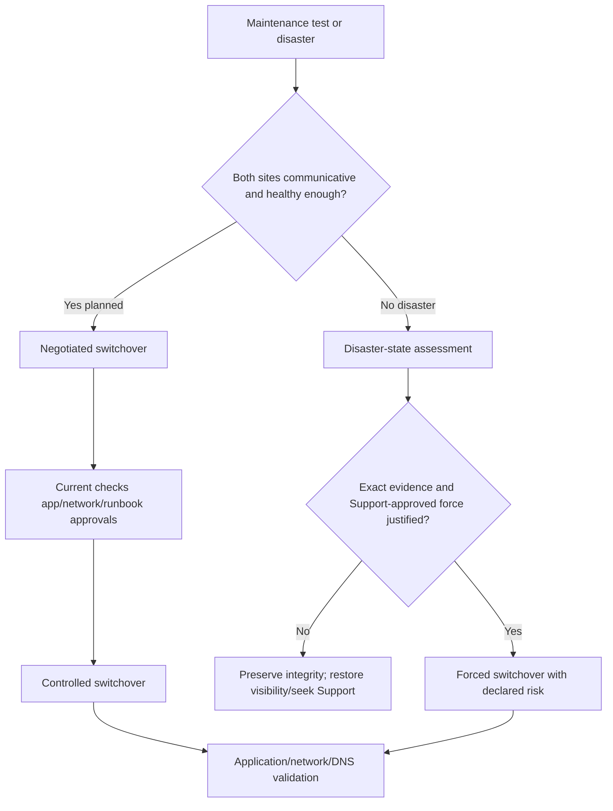

### Negotiated switchover

A planned transition lets both sites coordinate state, checks, ownership, and service movement. It is appropriate for supported maintenance/tests when prerequisites and application plans pass. It is not risk-free: client sessions, protocols, app dependencies, capacity, and network/DNS behavior still need testing.

### Forced switchover

A forced/disaster action is considered only when normal negotiation is unavailable and exact current procedure/evidence shows the surviving site should assume service. Risks include stale/incomplete state, NVFAIL/data validation, surviving remote writers, partial disasters, unmirrored data, lost configuration, and complex recovery.

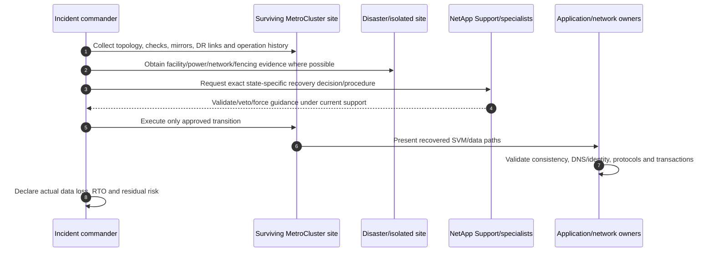

---

## 9. Healing and switchback

Healing restores required storage/controller DR relationships after switchover according to topology and failure state. Switchback returns services to the recovered original site only after repair, synchronization, checks, and application readiness.

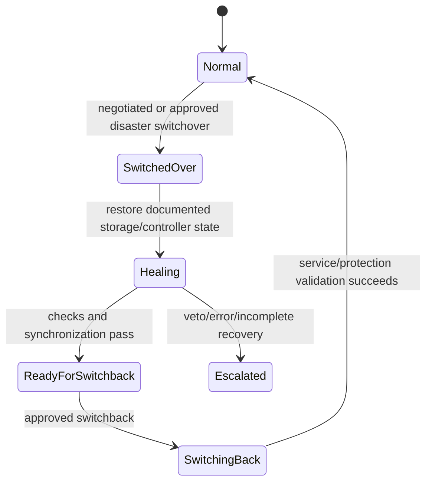

### Switchback gates

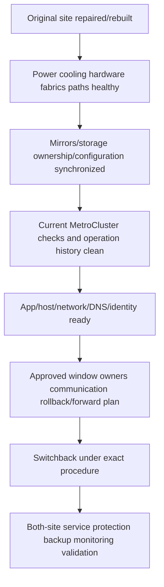

Do not switch back merely because the original controllers boot. Prove full physical, storage, configuration, network, application, backup, and monitoring readiness.

---

## 10. NVFAIL and application integrity

Current MetroCluster documentation describes **NVFAIL** as an ONTAP mechanism that can warn/protect access when nonvolatile-memory inconsistency may compromise file system or database validity. Exact defaults, protocol effects, options, states, and recovery procedures are sensitive and advanced.

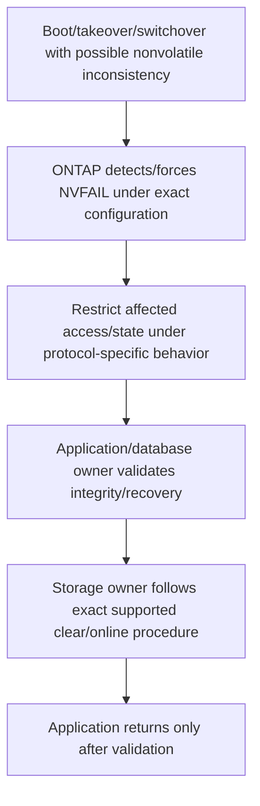

Never clear an NVFAIL-related state merely to restore availability. It is a data-integrity gate requiring exact current documentation, NetApp Support, and application/database recovery ownership.

---

## 11. RPO, RTO, and application continuity

Synchronous mirroring can target zero storage-level data loss while healthy, but customer recovery depends on more layers.

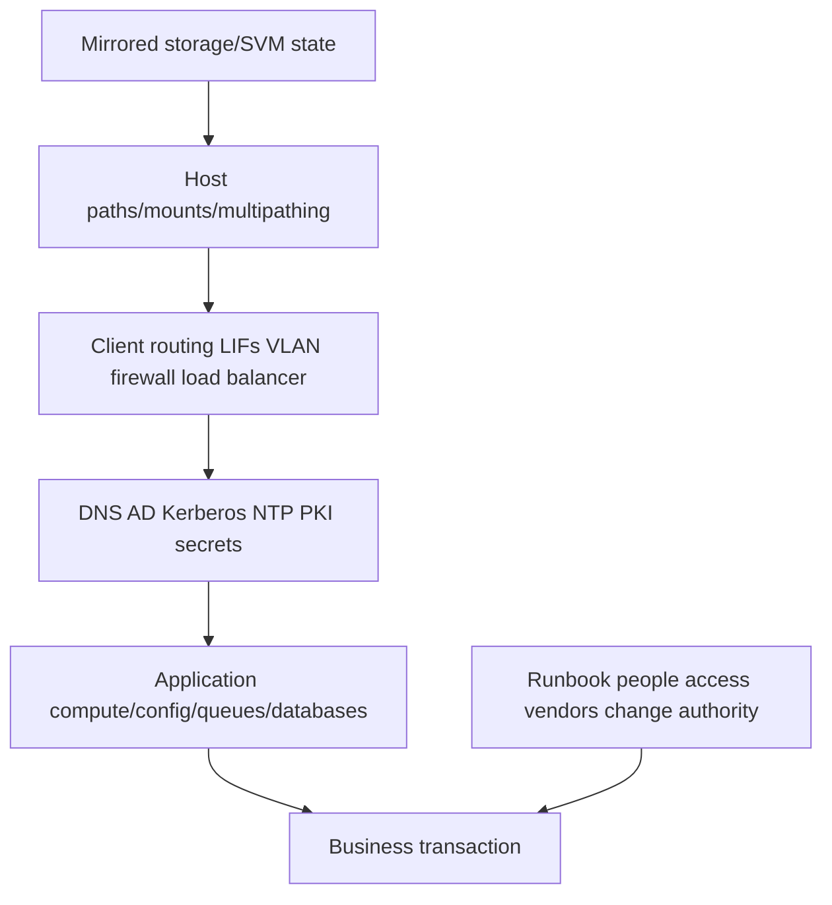

### RPO caveats

- Healthy synchronous mirrored writes do not include application memory not flushed to storage.
- Unmirrored aggregates/data or external databases/queues can have different RPO.
- Forced disaster operations and nonvolatile inconsistency can create data-validation/loss scenarios.
- Backups remain necessary for logical corruption, ransomware, retention, and earlier points.

### RTO stages

1. Detect/classify disaster and establish authority.
2. Obtain access, evidence, approvals, and specialist decision.
3. Switchover/heal as required.
4. Recover network, LIF, host, DNS, identity, keys, compute, and application.
5. Validate data/business transactions.
6. Communicate/operate degraded mode and restore protection.

Measure each stage; a storage transition time is not end-to-end RTO.

---

## 12. Maintenance tests and disaster exercises

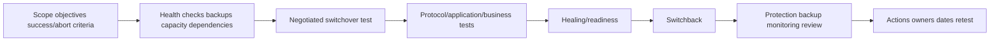

### Test portfolio

| Exercise | Purpose | Boundary |
|---|---|---|
| Tabletop | Validate roles, evidence, decisions, communications | Does not prove technology |
| Component/path failure | Validate redundancy/monitoring | Exact vendor maintenance procedure |
| Negotiated switchover | Validate site service movement | Approved window and current checks |
| Application DR | Validate business transaction and dependencies | Include DNS/identity/host/network |
| Disaster simulation | Practice ambiguity/fencing/Support engagement | Do not force production blindly |
| Cyber recovery | Validate clean point and isolated credentials | MetroCluster is not historical backup |

### Runbook fields

- Exact topology/release/platform/fabric/storage/SVM/app map.
- Business priorities, RPO/RTO, declaration authority, communication tree.
- Read-only health/evidence collection and data cutoff.
- Planned versus disaster decision gates, veto handling, Support contacts.
- App quiesce/start order, network/LIF/DNS/identity/host/secret changes.
- Validation transactions, abort/stop/forward-recovery criteria.
- Healing/switchback prerequisites, backup/reprotection, monitoring.
- Evidence, actual timings, gaps, owners, dates, and retest.

---

## 13. Safe discovery and evidence

Conceptual placeholders only; verify exact current commands/APIs, privilege, authorization, and Support procedure.

```text
CONCEPTUAL ONLY - not production commands
<metrocluster-configuration-family> show -fields <documented-topology-state-fields>
<metrocluster-check-family> run/show <documented-cluster-aggregate-node-lif-config-fields>
<metrocluster-interconnect-family> show -fields <documented-ha-dr-mirror-fields>
<aggregate-family> show -fields <documented-mirror-plex-pool-fields>
<metrocluster-operation-history-family> show -fields <documented-job-result-fields>
<mediator-or-tiebreaker-family> show -fields <documented-reachability-state-fields>
```

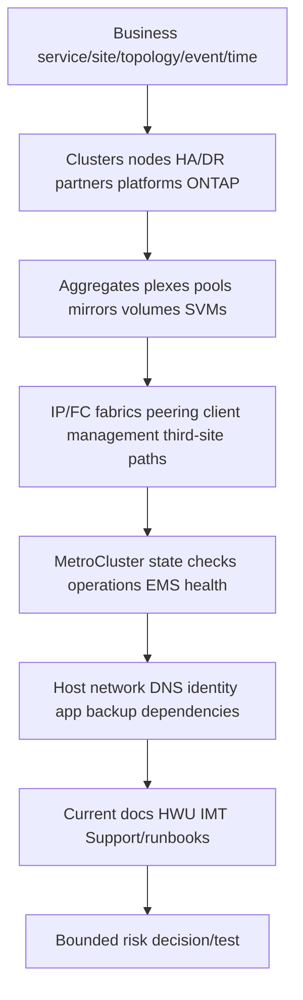

### Minimum disaster evidence pack

- Business impact, affected sites/services, UTC timeline, changes, declaration authority, RPO/RTO.
- Exact MetroCluster type, clusters/nodes/HA and DR partners, ONTAP/platform/switches/fabrics.
- Aggregate/plex/pool/mirroring/storage ownership, unmirrored data, capacity/headroom.
- Interconnect/IP/FC/ISL/peer/client/management/third-site path state and errors.
- Current MetroCluster checks, show/state, operation history, EMS, AutoSupport/case evidence.
- Mediator/Tiebreaker product/version/mode/reachability/alerts/veto evidence.
- Facility/power/cooling/security/fencing confirmation for disaster site.
- SVM/LIF/host/protocol/DNS/AD/NTP/PKI/key/application/backup state.
- Exact current recovery procedure/Support guidance, actions/results, data-integrity/app validation.

---

## 14. Failure modes and troubleshooting decision tree

| Symptom | Candidate causes | Discriminating evidence |
|---|---|---|
| Mirror degraded | Plex/storage path/disk/fabric/node issue | Aggregate/plex/interconnect health |
| Configuration replication unhealthy | Peering/network/config conflict/state | Config replication and peer evidence |
| ISL/fabric errors | Optics/cable/switch/MTU/loss/congestion/provider | End-to-end redundant fabric counters/events |
| Switchover vetoed | Health/state/prerequisite/remote reachability risk | Exact veto and current Support interpretation |
| Site unreachable | Site disaster, management-only loss, intersite isolation | Facility plus multiple independent paths |
| Forced switchover risks stale data | Partial mirroring/nonvolatile loss/remote still alive | Mirror/NVRAM/fencing/authority evidence |
| Data available, app unavailable | Host/LIF/DNS/AD/firewall/key/compute/app order | End-to-end dependency timeline |
| Switchback not ready | Healing/config/mirror/path/app prerequisite incomplete | Current check and readiness evidence |
| NVFAIL blocks access | Possible nonvolatile inconsistency | Exact state, protocol and app integrity workflow |
| DR test meets storage time, misses RTO | Decision/app/network/manual dependencies | Stage-level elapsed timeline |

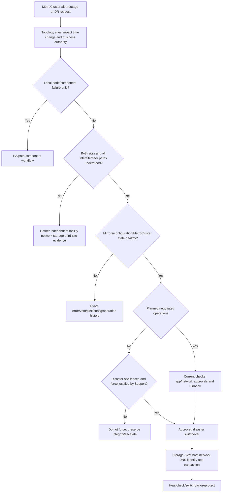

### Support boundaries

- Do not cable, reconfigure, force, clear veto/NVFAIL, switchover, heal, switchback, replace, upgrade, or manipulate mirrors from this guide.
- NetApp Support and authorized MetroCluster/storage specialists own state-specific procedures.
- Network/fabric/facility teams own ISLs, switches, carriers, power, cooling, physical fencing, and independent evidence.
- Application/host/identity teams own consistency, service sequencing, paths, DNS, keys, and business acceptance.
- Incident/change leaders own declaration, authority, communications, approvals, risk acceptance, and action logs.
- TAM analysis assembles evidence, exposes dependencies, frames risk/options, and tracks prevention.

---

## 15. TAM discovery, supportability, risk, and recommendations

### Discovery questions

1. Which business services, sites, applications, owners, RPO/RTO, critical periods, and disaster authorities apply?
2. What exact MetroCluster type, ONTAP/platform/node/HA/DR partner/switch/fabric/distance topology is deployed and supported?
3. Which aggregates/plexes/pools/volumes/SVMs are mirrored or unmirrored, and where are they physically located?
4. How do MetroCluster IP/FC fabrics, cluster peering, client, management, and third-site paths map to independent failure domains?
5. What do current configuration, mirror, interconnect, check, operation-history, EMS, capacity, and lifecycle evidence show?
6. Is ONTAP Mediator or MetroCluster Tiebreaker used; which version/mode/role/paths and automatic/alert behavior are exact-supported?
7. Which negotiated/forced switchover, healing, switchback, veto, fencing, and NVFAIL runbooks apply?
8. Which host/protocol/network/LIF/DNS/AD/NTP/PKI/key/compute/application/backup dependencies must move or survive?
9. When were tabletop, component, negotiated switchover, app transaction, switchback, and cyber-recovery tests completed, with actual timings?
10. Which current HWU/IMT/docs/release-note/Support evidence and owner/action is missing?

### Recommendation model

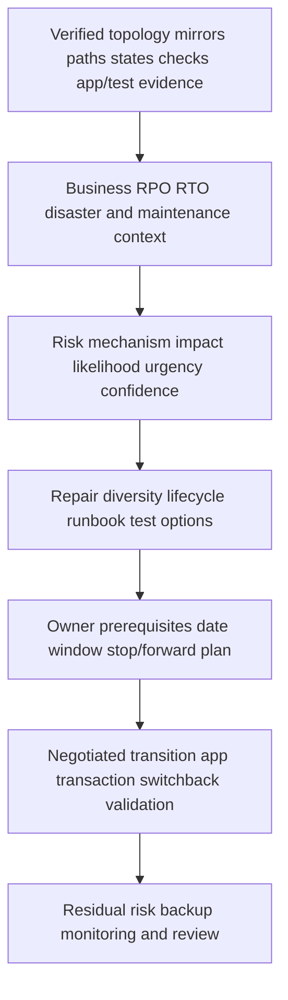

### Recommendation patterns

| Finding | Risk | Bounded recommendation | Validation |
|---|---|---|---|
| “All data protected” but unmirrored aggregate hosts app logs | Site loss breaks application/recovery consistency | Reclassify/move/protect under current-supported design after app review | Site/app recovery test |
| Both fabrics share one carrier/conduit | Single cut isolates sites | Add current-supported physical/provider diversity | Controlled path-failure evidence |
| Tiebreaker called automatic quorum voter | Operators may force unsafe action | Correct role/mode/runbook using exact docs and specialist review | Tabletop with veto/ambiguous partition |
| Negotiated test excludes DNS/AD/keys | Storage passes but app misses RTO | Add full dependency transition and transaction | Timed app switchover/switchback |
| Switchback starts after nodes boot, before mirrors/checks | Data/config/service risk | Enforce repair/heal/check/app gates | Clean checks and full post-validation |

### JD Mapping

| JD responsibility | Part 38 contribution | Your factual bridge and gap |
|---|---|---|
| Understand environment | Maps site/HA/storage/fabric/app failure domains | Azure/networking systems thinking transfers |
| Strategic planning | Connects topology/lifecycle/RPO/RTO/runbooks/tests | Advisory/MBA strength transfers |
| Risk/stability | Exposes split brain, forced action, unmirrored and dependency risks | critical-situation discipline transfers |
| Supportability | Requires exact HWU/IMT/docs/switch/ONTAP evidence | No gated/customer result claimed |
| High pressure | Provides authority/evidence/veto/communication structure | Major-incident experience transfers |
| Service reviews | Reports health, tests, actions, readiness and residual risk | Business-review strength transfers |
| Cross-functional | Coordinates storage/network/facility/app/security/Support | Product-group collaboration transfers |

---

## 16. Fully synthetic scenario: Alpine Health ambiguous site isolation

> **Synthetic case:** Alpine Health, every site, platform, metric, alert, patient system, timeline, and outcome below is fictional. It is not a NetApp customer, internal process, benchmark, tool result, or your production work.

### Environment

- A MetroCluster IP design spans Hospital A and a recovery site.
- A third-site Tiebreaker monitors the configuration; an old runbook incorrectly calls it “the automatic witness.”
- A construction event cuts one carrier path and power telemetry at Hospital A becomes unreliable.
- The surviving site reports intersite connectivity loss; one management path to Hospital A still intermittently responds.
- The electronic health record data is mirrored, but a licensing database is on unmirrored storage.
- DNS, Active Directory, and an application queue primarily reside at Hospital A.

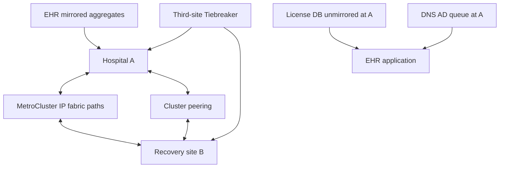

### Timeline

```mermaid
sequenceDiagram
    autonumber
    participant C as Construction/carrier event
    participant A as Hospital A
    participant B as Recovery site
    participant T as Tiebreaker
    participant I as Incident team
    C->>A: Power/network telemetry becomes unstable
    C->>B: One intersite path fails; others become ambiguous
    T->>I: Disaster/connectivity alert under observed conditions
    A-->>I: Intermittent management response remains
    I->>B: Proposal: force switchover immediately
    B-->>I: EHR mirrors appear present; license/DNS/queue dependencies absent
    I->>I: Pause force; establish authority/fencing and seek Support
```

### Evidence and competing hypotheses

| Hypothesis | Evidence for | Disconfirming check |
|---|---|---|
| Hospital A is destroyed | Multiple paths/telemetry failed | Independent facility/power and any node/client reachability |
| Only intersite links are cut | Site may still respond | Local users/storage/node health and facility evidence |
| Tiebreaker authorizes automatic force | Runbook says “witness” | Exact Tiebreaker version/mode/current documentation |
| All application data is mirrored | EHR volumes are mirrored | License DB, queue, identity and external dependencies |
| Zero-RPO means no validation | Synchronous mirrors healthy before event | NVRAM/mirror state, forced action and application logs |
| Storage switchover meets RTO | Data can activate at B | DNS/AD/license/queue/compute start timeline |

```mermaid
flowchart TD
    AMB[Ambiguous site isolation] --> SAFE[Freeze risky automation; preserve evidence]
    SAFE --> AUTH[Facility/network/storage/third-site authority assessment]
    AUTH --> FENCE{Hospital A confirmed unable to write/serve?}
    FENCE -->|No| WAIT[Do not force; isolate/restore visibility/Support]
    FENCE -->|Yes| DATA{Mirrors/nonvolatile state and exact force procedure acceptable?}
    DATA -->|No| REC[Data-integrity recovery path]
    DATA -->|Yes| SW[Approved forced switchover]
    SW --> DEP[Recover DNS AD license queue hosts]
    DEP --> TX[Validate patient transaction]
    TX --> HEAL[Repair heal switchback/reprotect plan]
```

### Recommendations

1. Correct the runbook: document the exact Tiebreaker product/version/mode as monitoring/alert or supported active behavior, and do not call it a generic automatic witness.
2. Require independent facility, site reachability, MetroCluster mirror/interconnect/check, third-site, and fencing evidence plus NetApp Support before any forced switchover in an ambiguous partition.
3. Move or separately protect the licensing database and map DNS/AD/queue/compute dependencies so “EHR protected” means a recoverable application.
4. Diversify intersite/facility telemetry paths and test carrier/conduit failure without assuming redundancy from two logical links.
5. Run a negotiated full-application switchover/heal/switchback exercise with a patient transaction, actual RPO/RTO, backup validation, and unresolved action register.

### Customer-facing summary

> "The alert shows a serious connectivity condition, but intermittent reachability means we cannot safely equate it with a destroyed site or treat Tiebreaker as generic force authority. Before any forced transition, we need independent facility/fencing evidence, current MetroCluster state and Support guidance. The mirrored EHR storage is only part of recovery; licensing, DNS, Active Directory, queues, and compute are also required."

---

## 17. Your factual transfer and honest positioning

```mermaid
flowchart LR
    AZ[Azure/site/network experience] --> FD[Failure domains routes DNS identity dependencies]
    CRIT[Critical-situation ownership] --> CMD[Incident authority workstreams evidence communication]
    M365[M365 business services] --> APP[User transaction and external dependencies]
    BI[Analytics] --> KPI[Health test RPO RTO action trends]
    FD --> MCC[MetroCluster conceptual method]
    CMD --> MCC
    APP --> MCC
    KPI --> MCC
    MCC --> LAB[Future tabletop/lab and MetroCluster specialist review]
```

> **Honest interview answer:** "I understand MetroCluster as two physically separate ONTAP clusters with local HA, synchronous mirrored storage, configuration replication and controlled site transitions. I separate IP/FC/stretch variants, Mediator and Tiebreaker roles, negotiated and forced switchover, healing and switchback, and storage RPO from application RTO. My production experience is enterprise incident and cloud/network dependency work, not MetroCluster operations. I would rely on exact current topology docs, HWU/IMT, authorized evidence and NetApp Support before action."

---

## 18. Whiteboard drills, paper lab, and self-test

### Whiteboard drills

1. Local HA pair versus remote DR partner/site.
2. Two sites, local/remote plexes, and synchronous mirroring.
3. MetroCluster IP versus FC versus stretch at broad level.
4. Data mirror versus configuration-replication plane.
5. Client, management, peer, MetroCluster fabric, and third-site networks.
6. Split brain -> evidence -> authority -> fencing -> transition.
7. ONTAP Mediator versus MetroCluster Tiebreaker.
8. Negotiated versus forced switchover.
9. Switchover -> healing -> readiness -> switchback.
10. Storage availability -> host/network/DNS/identity/app transaction.

### Paper lab

A fictional organization has one MetroCluster IP and one older FC configuration, mixed mirrored/unmirrored aggregates, 30 applications, shared carriers, two third-site monitors, stale runbooks, pending switches/ONTAP upgrades, incomplete checks, and no complete switchback exercise.

Tasks:

1. Inventory exact topology, platforms, ONTAP, HA/DR partners, switches/fabrics, sites, owners, and support evidence.
2. Map aggregate/plex/pool/volume/SVM placement and unmirrored exceptions.
3. Draw MetroCluster, peering, client, management, facility, and third-site failure domains.
4. Verify current Mediator/Tiebreaker versions, modes, roles, paths, alerts/automatic behavior, and ownership.
5. Reconcile checks, mirrors, configuration replication, interconnect, EMS, capacity, and operation history.
6. Map each app's host/protocol/LIF/DNS/AD/NTP/PKI/key/queue/compute/backup dependencies.
7. Tabletop node failure, ISL loss, one switch loss, site isolation, site destruction, rolling disaster, and third-site loss.
8. For ambiguous isolation, write evidence/fencing/Support decision gates and a no-force criterion.
9. Plan negotiated switchover, app transaction, healing, switchback, and post-protection validation.
10. Model actual RPO/RTO stages and unmirrored/external data gaps.
11. Build lifecycle, path-diversity, runbook, test, and owner recommendations.
12. Deliver executive/technical summaries with the production boundary.

```mermaid
flowchart LR
    INV[Inventory topology/storage] --> PATH[Map failure domains]
    PATH --> HEALTH[Reconcile mirrors/checks/third-site]
    HEALTH --> APP[Map app dependencies]
    APP --> TABLE[Tabletop ambiguous and disaster cases]
    TABLE --> TEST[Plan negotiated full-app test]
    TEST --> REC[Write lifecycle/readiness recommendations]
```

### Lab pass checklist

- [ ] Local HA and site switchover remain distinct.
- [ ] IP/FC/stretch facts are broad and exact-version verified.
- [ ] Mirrored and unmirrored data are inventoried separately.
- [ ] Storage mirror and SVM/configuration replication are monitored separately.
- [ ] All client/fabric/peer/management/third-site failure domains are mapped.
- [ ] Generic quorum/witness language does not replace product behavior.
- [ ] Mediator and Tiebreaker are not conflated.
- [ ] Forced switchover requires authority, fencing, integrity evidence and Support.
- [ ] Healing/switchback gates include full app readiness.
- [ ] RPO/RTO reaches business transaction, not storage transition only.
- [ ] Backups/logical-corruption recovery remain required.
- [ ] No synthetic work is called production MetroCluster experience.

### Self-test

1. Define HA pair, DR partner, SyncMirror, plex, switchover, healing, switchback, and fencing.
2. Compare local HA and site resilience.
3. Explain MetroCluster IP, FC, and stretch only at broad current-doc-safe depth.
4. Draw synchronous data and configuration-replication planes.
5. Explain mirrored versus unmirrored storage implications.
6. Map IP/FC fabrics, peering, client, management, and third-site paths.
7. Explain split-brain risk without inventing quorum behavior.
8. Distinguish ONTAP Mediator and MetroCluster Tiebreaker.
9. Compare negotiated and forced switchover decision gates.
10. Explain healing and switchback readiness.
11. Explain NVFAIL as an integrity gate at conceptual depth.
12. Build RPO/RTO/application dependency and runbook models.
13. Apply the troubleshooting and support-boundary tree.
14. Recreate Alpine Health's authority and dependency analysis.
15. Complete paper lab and Q1-Q8 aloud.
16. State your factual bridge and explicit gap.

---

## 19. Official Source Anchors

**Date checked: 2026-08-24.** These official public sources anchor MetroCluster concepts. Exact topology, platforms, switches, distances, interfaces, storage access, Mediator/Tiebreaker, automatic behavior, vetoes, operations, NVFAIL, maintenance, upgrades, and recovery are configuration/release sensitive. Use the exact installation/management/recovery guide and NetApp Support for the actual state.

| Topic | Official public source | Bounded use and currency note |
|---|---|---|
| MetroCluster overview | [ONTAP MetroCluster continuous availability](https://docs.netapp.com/us-en/ontap/concepts/mcc-config-concept.html) | Two mirrored clusters, SyncMirror and broad variant orientation |
| MetroCluster documentation | [ONTAP MetroCluster documentation](https://docs.netapp.com/us-en/ontap-metrocluster/) | Exact install/manage/maintain/upgrade/recover navigation |
| MetroCluster IP | [MetroCluster IP installation overview](https://docs.netapp.com/us-en/ontap-metrocluster/install-ip/) | Current IP topology prerequisites and test workflow |
| IP remote storage/fabric | [Remote storage and MetroCluster IP considerations](https://docs.netapp.com/us-en/ontap-metrocluster/install-ip/concept_considerations_mcip.html) | Controller-mediated remote storage and dedicated IP fabric concepts |
| MetroCluster FC | [Fabric-attached MetroCluster installation overview](https://docs.netapp.com/us-en/ontap-metrocluster/install-fc/) | Current FC preparation/cabling/configuration/test navigation |
| Variant differences | [Differences among MetroCluster configurations](https://docs.netapp.com/us-en/ontap-metrocluster/install-ip/concept_considerations_differences.html) | Exact current architecture comparison; verify selected topology |
| Mediator vs Tiebreaker | [Deciding between ONTAP Mediator and MetroCluster Tiebreaker](https://docs.netapp.com/us-en/ontap-metrocluster/install-ip/concept_considerations_mediator.html) | Product role/mode/topology distinction |
| Tiebreaker | [Overview of MetroCluster Tiebreaker](https://docs.netapp.com/us-en/ontap-metrocluster/tiebreaker/concept_overview_of_the_tiebreaker_software.html) | Monitoring/alerts and current active-mode caveat links |
| Monitoring/checks | [Monitoring the MetroCluster configuration](https://docs.netapp.com/us-en/ontap-metrocluster/manage/concept_monitoring_the_mcc_configuration.html) | Current checks/interconnect/SVM/third-site monitoring orientation |
| Operations | [Perform MetroCluster switchover, healing, and switchback](https://docs.netapp.com/us-en/ontap-metrocluster/manage/) | Exact state-sensitive procedure; never infer steps here |
| Disaster recovery | [Recover from a MetroCluster disaster](https://docs.netapp.com/us-en/ontap-metrocluster/disaster-recovery/) | Exact topology/disaster recovery navigation |
| NVFAIL | [Monitoring and protecting file-system consistency using NVFAIL](https://docs.netapp.com/us-en/ontap-metrocluster/manage/concept_monitoring_and_protecting_database_validity_by_using_nvfail.html) | Integrity concept and app validation; advanced exact procedure |
| HWU/IMT | [NetApp Hardware Universe](https://hwu.netapp.com/), [NetApp Interoperability Matrix Tool](https://imt.netapp.com/) | Exact platform/switch/adapter/optics/version support; potentially gated |
| Contingency planning | [NIST SP 800-34 Rev. 1](https://csrc.nist.gov/pubs/sp/800/34/r1/upd1/final) | Vendor-neutral BIA, contingency planning, testing context |
| Cyber recovery | [NIST SP 800-184](https://csrc.nist.gov/pubs/sp/800/184/final) | Recovery planning, prioritization, realistic test scenarios and metrics |
| Support | [NetApp Support Site](https://mysupport.netapp.com/) | Entitlement-dependent exact recovery, veto, maintenance, defects and cases |

### Source-use discipline

- Record topology, site, cluster/node/HA/DR partner, ONTAP/platform/switch/fabric and date.
- Save current checks, mirror/config/interconnect states, operation history, alerts, and exact veto/error.
- Verify HWU/IMT and the matching installation/maintenance/recovery guide before recommendations.
- Do not reuse distances, timings, limits, ports, free-space guidance, or force options from memory.
- Protect customer topology, management endpoints, credentials, facility/security facts, and health evidence.
- Mark missing/gated evidence explicitly and involve NetApp Support for state-changing/disaster action.

---

## Likely Interview Questions

### Q1. What problem does MetroCluster solve, and how is it different from local HA?

> **Model answer:** "Local HA lets two nodes at one site protect each other through takeover/giveback. MetroCluster links two physically separate ONTAP clusters, synchronously mirrors eligible aggregate data and replicates relevant SVM configuration so the surviving site can take over after a site event. It adds site failure domains and switchover/heal/switchback operations; application/network recovery still remains separate."

### Q2. Compare MetroCluster IP, FC, and stretch at a safe level.

> **Model answer:** "MetroCluster IP uses a supported dedicated redundant Ethernet/IP fabric; fabric-attached MetroCluster FC uses supported FC fabrics and storage connectivity; stretch designs use supported campus-oriented direct topology. Remote-storage access and component requirements differ. I never quote distance, models, switches or limits without exact current ONTAP, HWU, IMT and installation-guide evidence."

### Q3. How does MetroCluster protect data and configuration?

> **Model answer:** "SyncMirror maintains local and remote plexes for mirrored aggregates through the MetroCluster fabric, while cluster peering/configuration replication protects relevant SVM configuration. I verify aggregate/plex mirror health and SVM configuration replication separately and inventory unmirrored aggregates. A system being MetroCluster does not mean every application dependency is protected."

### Q4. What is split brain, and why is a forced switchover dangerous?

> **Model answer:** "In an intersite partition, both sites may be alive but unable to see each other. Letting both serve the same logical data creates conflicting writers. Before force, I require independent site/facility, mirror/nonvolatile, connectivity, third-site, authority and fencing evidence plus exact NetApp Support guidance. Forced recovery can expose stale data or integrity loss, so availability never outranks unknown data authority."

### Q5. Distinguish ONTAP Mediator and MetroCluster Tiebreaker.

> **Model answer:** "They are not generic synonyms. ONTAP Mediator participates in supported MetroCluster IP automatic unplanned switchover designs under exact prerequisites. MetroCluster Tiebreaker runs at a third site to monitor reachability/connectivity and alert, with separately documented active-mode behavior and risks. I verify topology, release, mode, paths, vetoes and ownership."

### Q6. Explain switchover, healing, and switchback.

> **Model answer:** "Switchover lets the surviving site serve the partner's mirrored resources; negotiated switchover coordinates both sites for maintenance/test, while disaster force carries higher risk. Healing restores documented storage/controller relationships after switchover. Switchback returns service only after physical repair, mirror/config synchronization, current checks, app/network readiness, approvals and validation."

### Q7. Why can MetroCluster storage be healthy while the application DR test fails?

> **Model answer:** "The app also needs hosts, protocol paths, LIFs, routing, DNS, AD/Kerberos, NTP, certificates, secrets/keys, compute, queues, external databases, licensing and start order. Some data may be unmirrored. I measure RTO from detection/authority through a representative business transaction, and I retain independent backups for logical corruption and earlier recovery points."

### Q8. How does your background transfer, and what remains a gap?

> **Model answer:** "My Azure/networking and enterprise incident background gives me failure-domain, DNS/identity, evidence, authority, communication and application-dependency discipline. I understand MetroCluster conceptually but have not operated it in production. I would use exact topology documentation, HWU/IMT, authorized evidence, application runbooks and NetApp Support before any switchover or recovery action."

---

## 30-Second Memory Hooks

- **Local HA:** Two managers at one branch.
- **MetroCluster:** Two branches with synchronized vaults and blueprints.
- **DR partner:** Remote site role, not local HA partner.
- **SyncMirror:** Local and remote aggregate plexes.
- **Plex:** One complete mirrored side.
- **Unmirrored:** MetroCluster label does not protect every byte.
- **IP/FC/stretch:** Exact fabric/topology support, never guessed.
- **Configuration replication:** Operating blueprint separate from data ledger.
- **Split brain:** Never open both copies of one cash drawer.
- **Fencing:** Establish one writer before service.
- **Mediator:** Supported automatic-unplanned-switchover role in exact IP design.
- **Tiebreaker:** Third-site monitoring/alert role; mode risks matter.
- **Negotiated:** Planned, coordinated transition.
- **Forced:** Disaster-only integrity decision with Support.
- **Healing:** Restore DR relationships before return.
- **Switchback:** Return only after full readiness.
- **NVFAIL:** Availability pauses until data integrity is checked.
- **RTO:** Detection -> authority -> storage -> network/identity -> app transaction.
- **Backup:** Still required for corruption, attack and historical points.
- **Your bridge:** Incident/dependency rigor transfers; MetroCluster operation does not.

---

## Completion Checklist

- [ ] Define HA/DR partner, SyncMirror, plex, switchover, healing, switchback, and fencing.
- [ ] Separate local HA, site resilience, and application continuity.
- [ ] Compare IP/FC/stretch only at broad, version-aware depth.
- [ ] Map synchronous data and SVM/configuration replication separately.
- [ ] Inventory mirrored/unmirrored storage and physical failure domains.
- [ ] Map MetroCluster, peering, client, management, facility, and third-site paths.
- [ ] Explain split-brain/authority/fencing without inventing quorum mechanics.
- [ ] Distinguish ONTAP Mediator, MetroCluster Tiebreaker, and external monitoring.
- [ ] Compare negotiated and forced switchover with veto/integrity risk.
- [ ] Gate healing/switchback on physical, mirror, check, network, and app readiness.
- [ ] Treat NVFAIL as an advanced integrity gate requiring exact procedure.
- [ ] Measure RPO/RTO through application/business outcome and retain backups.
- [ ] Build runbook/tests, evidence pack, troubleshooting tree, and recommendations.
- [ ] Recreate Alpine Health's synthetic authority/dependency decision.
- [ ] Complete paper lab and answer Q1-Q8 aloud.
- [ ] State the No-production-NetApp boundary accurately and recheck current docs/HWU/IMT/Support.

---

*Next suggested section:* [Part 39 - SnapLock, Immutability, Retention, and Compliance Controls](Part-39-snaplock-immutability-retention.md)