# Part 39 - SnapLock, Immutability, Retention, and Compliance Controls

> **Section goal:** Understand write once, read many (WORM), SnapLock Compliance and Enterprise modes, ComplianceClock, file commitment, retention, legal hold, privileged delete, audit, event-based retention, autocommit, tamperproof snapshot locking, and protection/lifecycle interactions. By the end, Arti should be able to identify irreversible-risk gates, distinguish legal governance from storage configuration, and recommend a controlled evidence-and-test process without promising compliance or ransomware prevention.

Covers index item **39** and maps directly to job-description responsibilities for storage/security depth, customer discovery, technical risk, supportability, strategic planning, compliance-aware recommendations, analytics, service reviews, and cross-functional governance.

**Version caveat:** Exact SnapLock licensing, aggregate/volume model, ComplianceClock initialization/reinitialization/synchronization, Compliance versus Enterprise behavior, commit triggers, retention defaults/ranges/fields, WORM append, autocommit, event-based retention (EBR), Legal Hold, privileged delete, audit logs, volume moves/clones, snapshot locking, SnapMirror/vault/MetroCluster/FabricPool/tape/consistency-group support, commands, limits, and revert/upgrade effects vary by ONTAP release, platform, mode, volume, and topology. Verify exact current official documentation, release notes, Hardware Universe (HWU), Interoperability Matrix Tool (IMT), legal requirements, records policy, and NetApp Support guidance.

This Part gives no legal opinion, regulatory certification, universal retention period, compliance guarantee, immutability guarantee against every actor, ransomware-prevention promise, or executable production procedure. Synthetic durations illustrate reasoning only. Storage controls support a compliance program; legal/compliance counsel and records owners determine obligations.

> **No-production-NetApp boundary:** Arti does not claim production NetApp SnapLock experience. Every SVM, volume, file, clock, hold, retention date, audit event, customer, and outcome below is synthetic. Her factual strengths are Microsoft enterprise support, M365 retention/eDiscovery concepts, identity/permissions, Azure, analytics, CRITSIT ownership, and stakeholder communication. The explicit non-claim is: **she has not initialized a production ComplianceClock; created or operated Compliance/Enterprise SnapLock volumes; committed production files to WORM; configured autocommit/EBR/Legal Hold/privileged delete/audit; locked production snapshots; or validated a customer's regulatory compliance.**

---

## 1. WORM and immutability from zero

**Write once, read many (WORM)** means that after data enters the protected state, defined content cannot be modified and cannot be deleted until its retention conditions allow it. **Immutability** is the broader property that data cannot be changed by specified actors/actions for a specified time under a specified control.

### Plain-English deep-dive: sealed evidence envelope with an expiry label

A writable document becomes a sealed evidence envelope. The seal protects the contents; the expiry label says when ordinary disposal can occur; a legal hold can suspend disposal; the custody log records exceptional actions. **Why it matters:** “immutable” is incomplete unless you know what is sealed, when sealing starts, which clock governs expiry, who can invoke exceptions, and whether the envelope can still be found and read.

| Term | Plain meaning | Analogy | Why it matters |
|---|---|---|---|
| **WORM file** | File committed to protected write-once state | Sealed record envelope | Content/retention rules now apply |
| **Commit** | Transition from writable to WORM state | Apply the seal | Premature/late commit both create risk |
| **Retention period** | Duration after commit | “Keep for seven years” | Policy duration, not calendar timestamp |
| **Retention time** | Absolute expiry time | “Not before 2033-06-01” | Determines when retention requirement ends |
| **ComplianceClock** | SnapLock time source used for retention enforcement | Tamper-resistant courthouse clock | System wall-clock changes should not shorten records |
| **Legal Hold** | Indefinite hold during litigation/investigation until released | Court order: do not destroy | Overrides ordinary expiry for held files |
| **Privileged delete** | Audited Enterprise-mode exception under exact configuration | Authorized evidence destruction exception | Must not be assumed in Compliance mode |
| **Audit log** | Protected record of sensitive SnapLock operations | Chain-of-custody journal | Accountability and investigation evidence |

```mermaid
stateDiagram-v2
    [*] --> Writable
    Writable --> EligibleForAutoCommit: unchanged for configured period
    Writable --> WORM: manual/application commit
    EligibleForAutoCommit --> WORM: scanner commits under current behavior
    WORM --> RetentionExtended: later retention/EBR action
    RetentionExtended --> WORM
    WORM --> LegalHold: supported hold applied
    LegalHold --> WORM: hold released; underlying retention remains
    WORM --> Expired: ComplianceClock reaches retention time
    Expired --> Disposition: owner-approved deletion under exact mode/rules
```

---

## 2. SnapLock Compliance versus Enterprise

Both modes provide WORM retention, but their governance and deletion models differ. **Compliance mode** is the stricter model used for regulated retention where protected files cannot be removed through Enterprise privileged delete. **Enterprise mode** supports organizational governance and, where explicitly configured and audited, privileged deletion of unexpired WORM files.

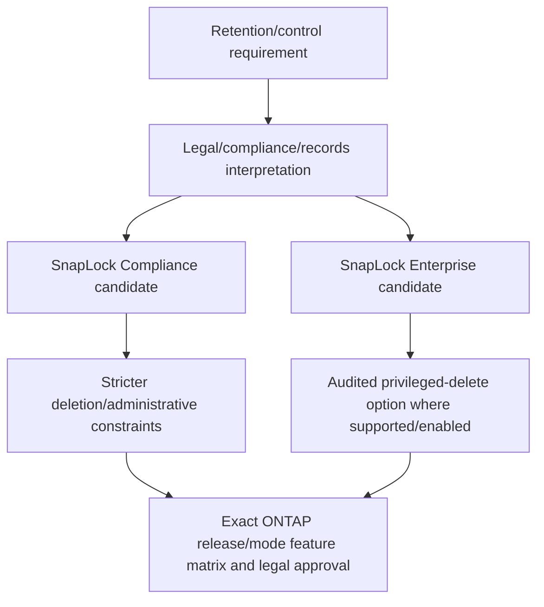

### Broad comparison

| Dimension | Compliance | Enterprise |
|---|---|---|
| Goal orientation | Regulatory/strict WORM retention | Enterprise governance WORM retention |
| Unexpired privileged delete | Not the Enterprise privileged-delete model | Supported only under exact enabled/audited workflow |
| Legal Hold | Current docs describe Compliance-mode WORM legal hold | Do not assume equivalent support |
| Administrative flexibility | Deliberately constrained | More operational exception flexibility |
| Required decision owner | Legal/compliance/records plus storage/security | Records/business/security plus storage |

Do not select mode from a product name or interview mnemonic. Build a requirement-to-control matrix and obtain legal/compliance approval.

---

## 3. ComplianceClock and time governance

SnapLock uses a system and volume **ComplianceClock** to calculate/enforce retention independently of ordinary administrative attempts to move time backward. Initialization and later reinitialization/synchronization capabilities have exact release/platform prerequisites.

### Plain-English deep-dive: courthouse clock, not a laptop clock

If a record must remain sealed until a court date, an administrator should not shorten custody by changing the laptop clock. ComplianceClock is the storage system's protected retention time reference. Initializing it with the wrong real time can create long-lived consequences. **Why it matters:** verify hardware/system time, time zone, NTP trust, node health, feature prerequisites, and change authority before initialization.

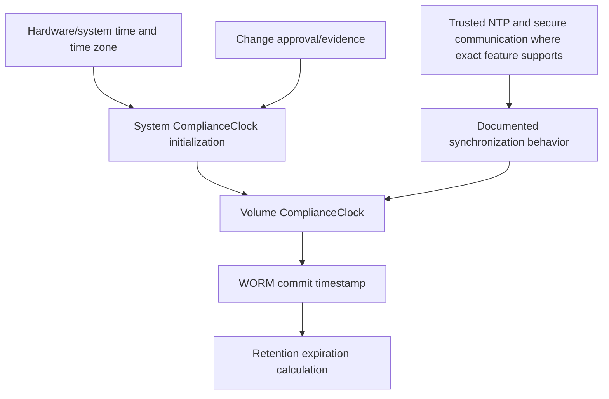

### Clock evidence

- Cluster/node/platform/ONTAP release and SnapLock license state.
- Current system time/time zone/NTP configuration and trustworthy source.
- System and volume ComplianceClock values and initialization history.
- Presence of SnapLock volumes or snapshot locking that constrains reinitialization/revert.
- Audit/change record and approver.
- Differences across source/destination nodes/clusters before replication or recovery.

Never “fix” a suspected ComplianceClock problem by experimenting with system time or advanced commands. Preserve evidence and engage NetApp Support/legal stakeholders.

---

## 4. Retention period, retention time, defaults, and extension

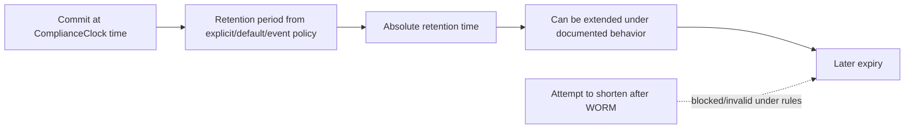

### Retention formula

At conceptual level:

$$
\text{retention time}=\text{WORM commit time}+\text{effective retention period}
$$

For a synthetic record committed on 2026-09-01 with an approved seven-year policy, the intended expiry orientation is 2033-09-01, subject to exact clock/calendar behavior and later holds/extensions.

### Effective-retention inputs

| Input | Risk question |
|---|---|
| Minimum/default/maximum volume settings | Which release defaults apply, and are they legally approved? |
| Explicit file retention | Does application set the intended absolute time correctly? |
| Unspecified retention | What exact release behavior/minimum applies? |
| EBR action | Which event, policy, file scope, and new extension? |
| Legal Hold | Which litigation name/scope/owner/release authority? |
| Replicated/vault retention | Which source/destination mode, label/rule, and clock apply? |
| Snapshot lock expiry | Does retention override keep count and block lifecycle/revert? |

### Irreversibility warning

Once a file is WORM-protected, retention generally can be extended but not shortened under documented behavior. A mistaken long/default/infinite retention can lock data and capacity far beyond business need. A mistaken short/default retention can fail the records obligation. Defaults have changed across releases, so they must never be trusted implicitly.

---

## 5. File commitment, autocommit, and appendable records

Files can be committed manually/application-driven or automatically after remaining unchanged for a configured **autocommit period** under current behavior. WORM appendable files support controlled incremental log-style writing under strict documented semantics.

```mermaid
sequenceDiagram
    autonumber
    participant A as Application/user
    participant F as File on SnapLock volume
    participant S as Autocommit scanner/policy
    participant C as ComplianceClock
    A->>F: Create/write record
    alt Manual/application commit
        A->>F: Trigger documented read-only/commit transition
    else Autocommit configured
        S->>F: Observe unchanged eligibility period
        S->>F: Commit when scanner processes eligible file
    end
    C-->>F: Record commit/retention time under exact semantics
    F-->>A: WORM-protected; later modification/deletion restricted
```

### Plain-English deep-dive: sealing too early versus leaving the envelope open

If autocommit seals a document before the application finishes, later writes fail and the workflow breaks. If the period is too long, records remain mutable after the policy expects protection. Scanner processing also means eligibility and observed commitment can differ in time. **Why it matters:** test real file-open, rename, close, retry, temporary-file, and batch behavior rather than choose a timer from intuition.

### Autocommit/app questions

- How does the application signal “record complete”?
- Does it rewrite/rename temporary files or hold files open?
- Which files should remain appendable and under what exact write semantics?
- What happens when commit makes a retry/metadata operation fail?
- How is commit status observed and reconciled?
- Does backup/antivirus/indexing modify attributes in a way that affects eligibility?
- What volume/file count and scanner workload exist?

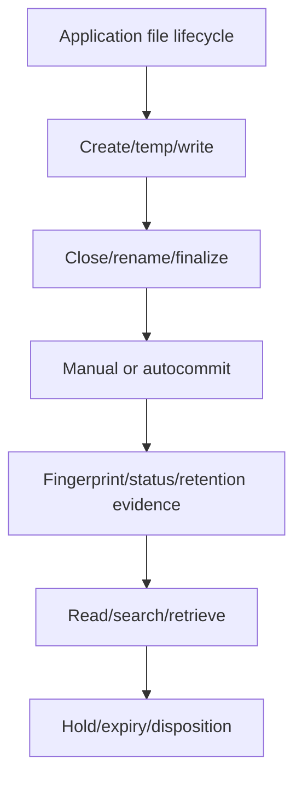

---

## 6. Event-based retention

**Event-based retention (EBR)** applies a retention policy after a business event, such as contract closure or employee departure, under supported ONTAP behavior. It can commit eligible non-WORM files or extend already protected records according to current documentation.

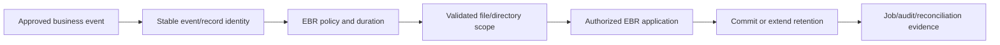

### EBR controls

- Event source system, event definition, effective date, and authoritative owner.
- Idempotency: prevent duplicate/wrong events and prove repeats do not create unintended extensions.
- Record-to-file mapping, missing/orphaned records, and exact path scope.
- Separation of event approval from storage execution.
- Hold interaction and current feature constraints.
- Audit, reconciliation, exception queue, and sample verification.

An event name is not legal authority. The records schedule and event mapping require legal/records approval.

---

## 7. Legal Hold

Current ONTAP documentation describes SnapLock Legal Hold for **Compliance-mode WORM files**, retaining them indefinitely for a named litigation until an authorized release.

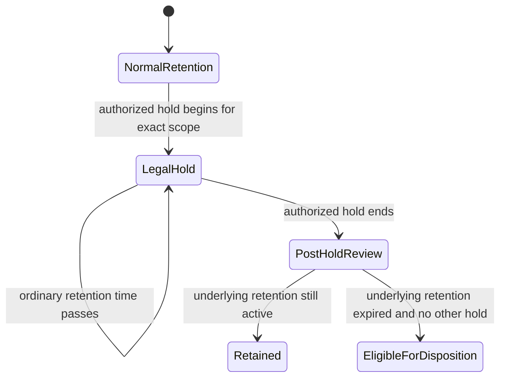

### Legal-hold governance

| Control | Evidence |
|---|---|
| Authority | Counsel/records case owner and approved request |
| Matter identity | Unique litigation/investigation name/ID |
| Scope | Custodians, systems, paths/files, dates, exclusions |
| Start | UTC time, requester, approver, executor, job/result |
| Reconciliation | Expected versus actually held files/errors |
| Release | Counsel authorization and secondary review |
| Post-release | Underlying retention/other holds/disposition result |

Releasing a hold does not necessarily delete a file; ordinary retention and other holds still govern it. A storage administrator does not decide when litigation ends.

---

## 8. Privileged delete and protected audit

Current public documentation describes privileged delete for unexpired WORM files on **SnapLock Enterprise** volumes when explicitly enabled and performed by a SnapLock administrator, with a SnapLock-protected audit log. A permanently-disabled setting is terminal under documented behavior.

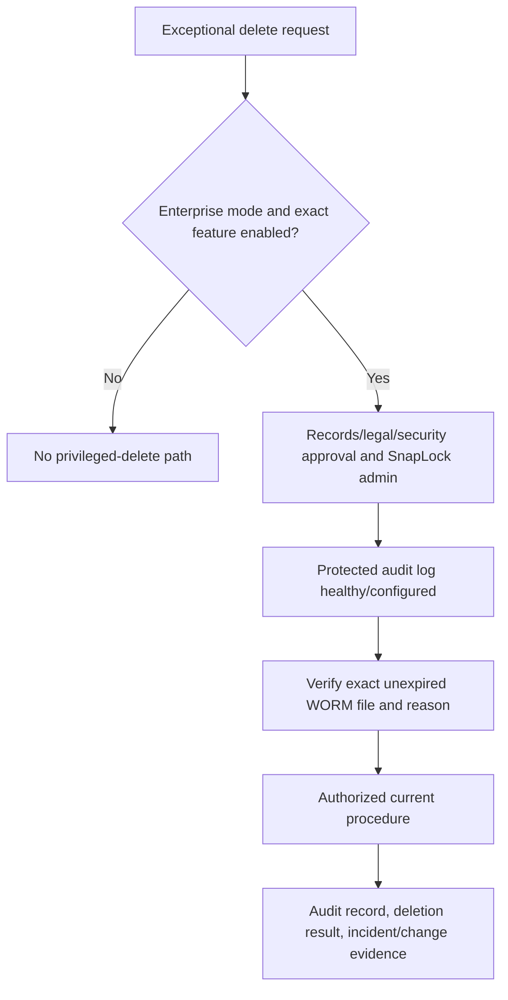

### Plain-English deep-dive: emergency key inside a glass box

Enterprise privileged delete is an emergency key, not normal file administration. The glass box is role separation, approval, secure access, protected audit, alerting, and periodic review. Permanently disabling the key can strengthen governance but is itself irreversible. **Why it matters:** both enabling and permanently disabling require legal, records, security, operations, and recovery analysis.

### Guardrails

- Separate ordinary storage admin, SnapLock admin, records approver, and auditor where feasible.
- Require a ticket/case, business/legal reason, exact file identity/fingerprint, approval, and time window.
- Verify audit volume/log health and retention before exception.
- Alert independently on role creation, privileged-delete state changes, operations, and log changes.
- Periodically review that privileged delete is disabled or permanently disabled according to approved policy.
- Test investigation/reconciliation using synthetic records, never live regulated data casually.

---

## 9. SnapLock-protected audit evidence

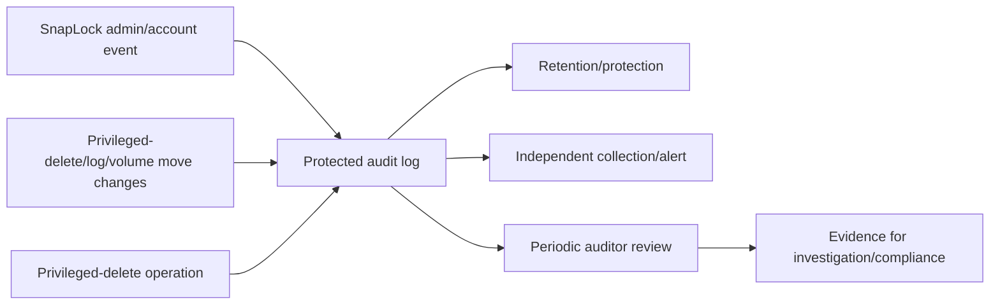

### Audit quality questions

- Is the audit volume/log configured under the exact release/mode prerequisites?
- What events are captured, at what timestamps/time zones, with which identities/objects/results?
- Can the log itself be modified/deleted, and when?
- Is logging capacity monitored so evidence is not lost or operations blocked?
- Are events exported to an independent security information and event management (SIEM) system where approved?
- Are privileged accounts, failed attempts, policy changes, holds, moves, and deletions reconciled?
- Who can view versus administer audit data?

Protected logs strengthen accountability but do not prove that business approval was valid or that all surrounding systems logged correctly.

---

## 10. Tamperproof snapshot locking versus SnapLock WORM files

Current ONTAP releases can support **snapshot locking** on eligible non-SnapLock volumes. It uses ComplianceClock-based expiry to prevent deletion of locked snapshots for their retention period. This is distinct from committing individual files to WORM on SnapLock volumes.

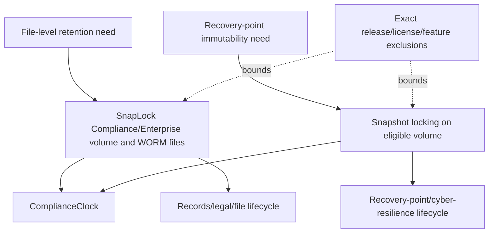

### Important distinctions

| Dimension | SnapLock WORM files | Locked snapshots |
|---|---|---|
| Protected unit | File/record and its retention | Volume point-in-time snapshot |
| Main governance | Records/compliance/enterprise WORM | Tamper-resistant recovery points/cyber resilience |
| Commit | File transitions to WORM | Snapshot assigned locking retention |
| Capacity driver | Retained files/versions/appends | Changed blocks and locked point count/age |
| Restore | File/volume/application workflows | Snapshot/clone/restore under exact restrictions |
| Feature matrix | SnapLock mode-specific | Separate current supported/unsupported matrix |

Current docs list significant snapshot-locking feature restrictions and release additions. Reopen the page for FabricPool, consistency groups, SnapMirror active sync, synchronous/asynchronous SnapMirror, FlexGroup, cloning, tape, and other interactions; do not copy a static list into a production decision.

---

## 11. Capacity, lifecycle, and irreversible risk

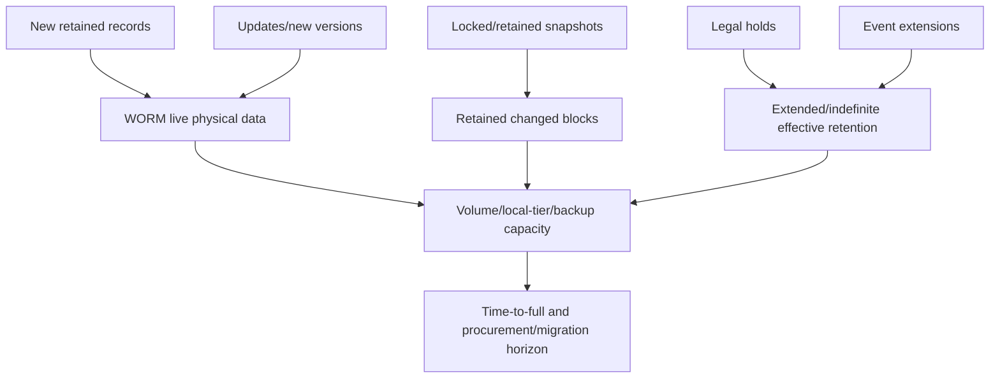

### Capacity model inputs

- Daily ingest by record class and compressibility.
- Version/rewrite/delete behavior before and after WORM commit.
- Minimum/default/maximum and distribution of file retention times.
- Legal-hold population, age, overlap, and unknown release date.
- EBR event volume/extensions and autocommit lag.
- Locked snapshot change rate/retention and keep-count override behavior.
- Replication/vault/backup copies and destination retention.
- Audit-log growth, metadata, headroom, migration/refresh workspace.

### Irreversible-risk register

| Decision | Potential irreversible consequence |
|---|---|
| Wrong long/infinite retention | Capacity cannot be reclaimed on expected schedule |
| Wrong short/default retention | Records may become eligible before obligation ends |
| Premature autocommit | Application can no longer update record |
| Late/no commit | Required record remains mutable |
| Wrong ComplianceClock initialization | Retention calculations can be wrong long-term |
| Permanently disable privileged delete | Emergency exception cannot later be re-enabled |
| Snapshot locking with long retention | Keep count/lifecycle/revert/capacity constrained |
| Release wrong legal hold | Evidence disposition risk |

Every irreversible setting needs two-person review, synthetic test, legal/records approval, explicit rollback impossibility, and capacity/lifecycle modeling.

---

## 12. Replication, backup, restore, and migration interactions

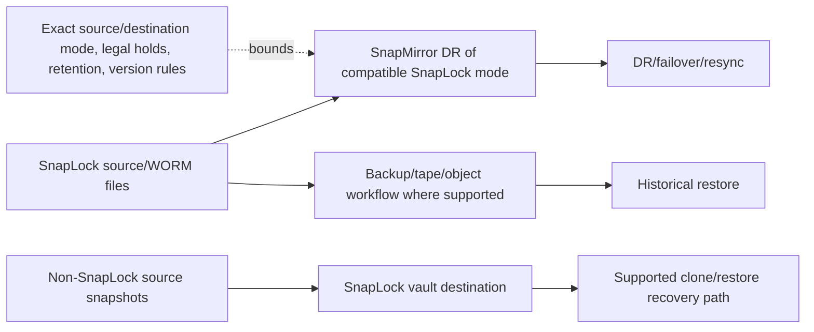

### Protection interactions

- WORM replication requires exact compatible source/destination modes, policy, versions, legal-hold, and resync behavior.
- SnapLock vault can protect replicated snapshots on a destination under exact prerequisites and retention rules.
- Backup/restore must preserve or intentionally transform WORM status according to destination capability and legal requirement.
- A clone can provide recovery access under current behavior, but clone type, data sensitivity, expiry, and retained parent dependencies matter.
- Volume moves, technology refresh, cloud migration, and decommission can be constrained by unexpired data/locked snapshots.
- Encryption keys, catalogs, identities, and application metadata remain separate recovery dependencies.

Do not assume WORM attributes survive every export, copy, backup, restore, migration, or non-WORM destination. Validate exact workflow and legal outcome.

---

## 13. Ransomware benefits and limitations

Immutability can prevent an attacker or mistaken administrator from deleting/modifying protected records or recovery points within its enforced scope. It does not prevent infection, credential theft, data exfiltration, denial of service, corruption before commit, encryption of writable data, or retention of already-corrupt content.

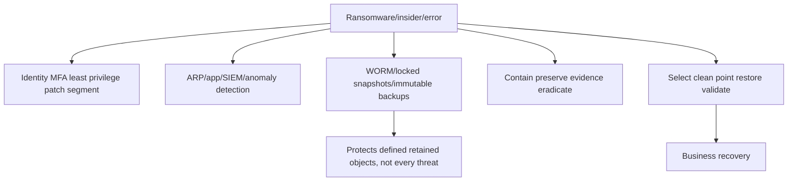

### Clean-point problem

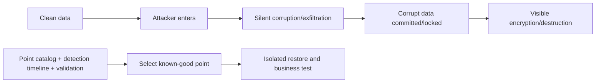

Immutable bad data is still bad data. Layer prevention, detection, protected copies, forensic evidence, and tested recovery; never promise SnapLock prevents ransomware.

---

## 14. Governance and operating model

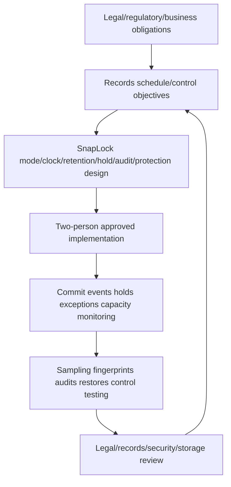

### RACI orientation

| Decision | Accountable owner |
|---|---|
| Legal obligation/hold/release | Legal counsel |
| Record classification/retention/disposition | Records management/business data owner |
| Security model/privileged access/audit | Security/GRC |
| SnapLock design/operation/capacity | Storage/ONTAP owner |
| Application commit/event mapping | Application owner |
| Backup/DR/restore | Protection/recovery owner |
| Supportability/version/lifecycle | Storage architect/vendor Support |
| Risk acceptance | Authorized business/compliance authority |

The TAM analyst coordinates evidence and actions; they do not interpret law or authorize destruction.

---

## 15. Safe discovery and evidence

Conceptual read-only placeholders only; verify exact current commands/APIs, privilege, authorization, privacy, and Support procedure.

```text
CONCEPTUAL ONLY - not production commands
<snaplock-volume-family> show -fields <documented-type-clock-retention-autocommit-privdel-fields>
<file-retention-family> show -fields <documented-path-worm-retention-hold-fields>
<snaplock-audit-family> show -fields <documented-volume-log-retention-health-fields>
<snapshot-family> show -fields <documented-lock-expiry-policy-fields>
<snapmirror-family> show -fields <documented-mode-policy-retention-hold-fields>
```

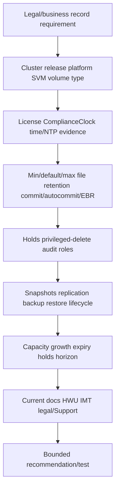

### Evidence controls

- Do not expose regulated record contents or sensitive paths in reports.
- Use stable IDs, hashes/fingerprints where approved, counts, and redacted samples.
- Record UTC and ComplianceClock context separately.
- Preserve raw configuration/audit/job evidence before changes.
- Treat missing legal authority, hold mapping, audit health, or current support as a stop condition.

---

## 16. Failure modes and troubleshooting decision tree

| Symptom | Candidate causes | Discriminating evidence |
|---|---|---|
| File remains writable | Wrong volume/mode, not committed, autocommit eligibility/scanner, app lifecycle | File/volume status and commit timeline |
| App write fails unexpectedly | Premature manual/autocommit, append semantics, read-only/retention state | App/file operation and WORM status |
| File cannot be deleted | Active retention, Legal Hold, snapshot/reference, mode | Effective retention/hold/dependency evidence |
| Privileged delete unavailable | Compliance mode, disabled/permanently disabled, role/audit prerequisite | Mode/config/role/log state |
| Hold results differ from request | Wrong path/scope, missing files, job error, mapping | Expected-to-actual reconciliation |
| Capacity grows beyond plan | Long defaults, holds, EBR, versions, locked snapshots, replicas | Retention population and capacity forecast |
| SnapMirror/resync fails | Mode/version/policy/legal-hold/divergence/retention mismatch | Both-end SnapLock/relationship evidence |
| Upgrade/revert/move blocked | Locked/unexpired objects or feature restriction | Exact current prerequisite/expiry matrix |
| Locked copy is unusable | Corruption before lock, missing app/catalog/key | Clean-point and app restore validation |
| Audit gap | Log not configured/healthy, capacity/retention/query scope | Audit config/log and independent events |

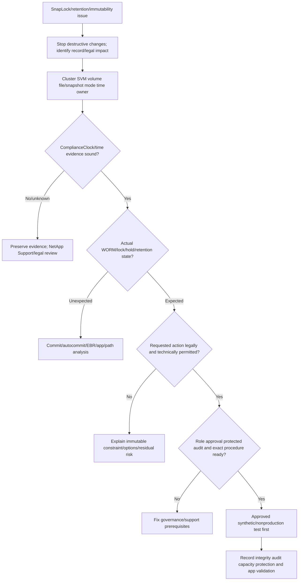

### Support boundaries

- Do not initialize clocks, change retention, commit data, place/release holds, enable/permanently disable privileged delete, delete WORM files, lock snapshots, or alter protection from this guide.
- Legal/records owners define retention, hold, release, exception, and disposition.
- Security controls privileged identities, MFA, audit export, alerts, and investigations.
- Application owners control record completeness and event/commit mapping.
- NetApp/storage/Support owners control exact ONTAP procedures, features, recovery, and defects.
- TAM analysis coordinates evidence, risks, decisions, owners, dates, validation, and residual risk.

---

## 17. TAM discovery, supportability, risk, and recommendations

### Discovery questions

1. Which regulation, contract, policy, record class, owner, retention trigger, duration, hold, disposition, and evidence requirement applies?
2. Which exact cluster/platform/ONTAP/SVM/volume/SnapLock type/file/snapshot architecture implements it?
3. What are system/volume ComplianceClock, system time/time zone/NTP, initialization history, and release-specific constraints?
4. What are minimum/default/maximum/unspecified retention settings, and how are effective file dates calculated/verified?
5. How are records committed: app/manual/autocommit/append; how are completeness and errors reconciled?
6. Which EBR events/sources/mappings/idempotency and Legal Hold matters/scopes/approvals/releases exist?
7. Is Enterprise privileged delete enabled/disabled/permanently disabled; which admins, approvals, audit, and alerts govern it?
8. Which locked snapshots, SnapMirror/vault/backup/restore/clone/move/upgrade/revert interactions are exact-supported?
9. What are ingest/change/version/hold/expiry/audit/snapshot/replica capacity forecasts and lifecycle constraints?
10. Which clean-point restore, integrity/fingerprint, app transaction, audit, legal, HWU/IMT/docs/Support evidence is missing?

### Recommendation model

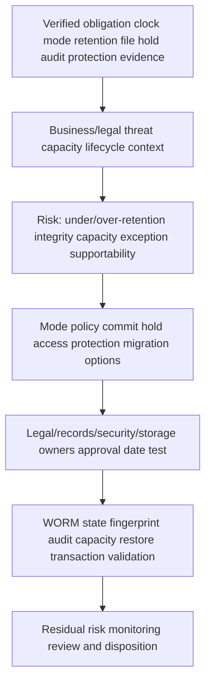

### Recommendation patterns

| Finding | Risk | Bounded recommendation | Validation |
|---|---|---|---|
| Default retention never explicitly approved | Release-specific default causes under/over-retention | Set explicit legally approved min/default/max in synthetic pilot, then controlled change | Sample effective dates and legal sign-off |
| Autocommit precedes app final rename | Production writes fail or incomplete record seals | Align supported app lifecycle/commit method and test retries | Complete record, WORM state, app transaction |
| Enterprise privileged delete enabled broadly | Compromised admin can destroy retained data | Restrict/separate role, protected audit/alerts; evaluate approved permanent disable | Denied unauthorized action and audited exception |
| Holds tracked in spreadsheet only | Files omitted or released incorrectly | Integrate/reconcile matter IDs, scope, results, errors and approvals | Expected/actual hold sample and release test |
| Locked snapshots exceed capacity forecast | Writes/upgrade/migration blocked | Model retention/change/keep override and add capacity/lifecycle actions | Sustained headroom and restore test |

### JD Mapping

| JD responsibility | Part 39 contribution | Arti's factual bridge and gap |
|---|---|---|
| Understand environment | Maps legal record -> app -> file/volume -> protection | M365 retention/eDiscovery concepts transfer |
| Analyze/report data | Retention populations, holds, expiry, capacity, audit trends | Analytics strength transfers |
| Strategic planning | Aligns governance, security, lifecycle, recovery and capacity | MBA/advisory transfer |
| Risk/stability | Exposes irreversible defaults, clocks, privileges and lock growth | CRITSIT/risk discipline transfers |
| Supportability | Requires exact mode/version/feature/topology evidence | No compliance/customer result claimed |
| Service reviews | Reports controls, exceptions, tests, owners and residual risk | Business-review experience transfers |
| Cross-functional | Coordinates legal/records/security/app/storage/Support | Stakeholder leadership transfers |

---

## 18. Fully synthetic scenario: Fabrikam Brokerage retention error

> **Synthetic case:** Fabrikam Brokerage, every regulation, record, file, date, volume, alert, and result below is fictional. It is not legal advice, a NetApp customer, internal process, benchmark, tool result, or Arti's production work.

### Environment

- Trade confirmations are written to a SnapLock Compliance volume.
- Application files are created as temporary names, updated, then renamed when complete.
- An autocommit period was selected without testing the longest batch.
- ComplianceClock was initialized years earlier; documentation lacks the time-validation evidence.
- Employee communication records use Enterprise mode with privileged delete enabled.
- A legal-hold spreadsheet lists 12,000 records; storage reports fewer held files.
- Locked snapshots and extended holds are accelerating capacity consumption.

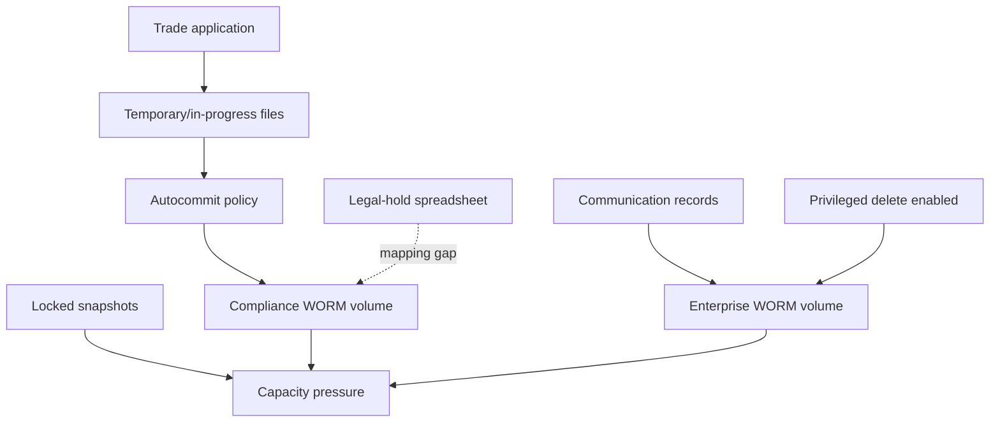

### Incident timeline

```mermaid
sequenceDiagram
    autonumber
    participant A as Trade application
    participant S as SnapLock storage
    participant O as Operations
    participant L as Legal/records
    A->>S: Write long-running temporary trade batch
    S->>S: File becomes eligible/committed under synthetic autocommit timing
    A->>S: Attempt final update/rename
    S-->>A: Write/rename fails due to protected state
    O->>L: Requests privileged delete to rerun batch
    L-->>O: Volume is Compliance; exception is not available
    O->>S: Finds legal-hold count and capacity forecast mismatch
```

### Findings and hypotheses

| Evidence | Observation | Bounded conclusion |
|---|---|---|
| App timeline | Long batch remains unchanged before final update | Autocommit can seal incomplete record |
| Volume mode | Trade files are Compliance | Enterprise privileged delete is not a remedy |
| Clock record | Current value visible, initialization validation absent | Clock defect not proved; evidence/governance gap exists |
| Hold counts | Spreadsheet exceeds successful storage scope | Some expected files may not be held or mapping is wrong |
| Capacity | Holds and locked snapshots extend expiry/change blocks | Forecast omitted effective retention |
| Enterprise admin | Privileged delete enabled for broad role | Separate security risk independent of trade incident |

```mermaid
flowchart TD
    INC[Premature WORM commit plus governance gaps] --> APP[Application/commit workstream]
    INC --> HOLD[Legal-hold reconciliation]
    INC --> SEC[Enterprise privilege/audit review]
    INC --> CAP[Retention/snapshot/capacity forecast]
    APP --> SAFE[Preserve record; use app/legal approved correction record]
    HOLD --> SAFE
    SEC --> PLAN[Controlled remediation]
    CAP --> PLAN
    SAFE --> TEST[Synthetic full lifecycle and retrieval test]
    PLAN --> TEST
```

### Recommendations

1. Do not attempt to alter/delete the Compliance record; application/legal owners should use an approved correction/superseding-record process and preserve incident evidence.
2. Reproduce the longest application file lifecycle synthetically and choose a documented manual/app commit or autocommit policy that protects only finalized records; validate temporary-file/rename/retry behavior.
3. Reconcile legal matter IDs and expected file identities to actual held files, errors, and releases under counsel approval; do not treat spreadsheet count as proof.
4. Review Enterprise privileged-delete role, state, protected audit, MFA, alerts, exception approvals, and whether permanent disable is appropriate, without making that irreversible decision from this incident.
5. Reforecast capacity using effective file retention, holds, EBR, locked-snapshot change, replicas, audit, and migration headroom; pair expansion/lifecycle options with restore tests.

### Customer-facing summary

> "The trade file was committed before the application finished its final update, so the storage control behaved as configured but the application-to-retention design was wrong. Because the volume is Compliance mode, Enterprise privileged delete is not an escape path. Separately, legal-hold counts, Enterprise privileges, and capacity forecasts need reconciliation. We recommend preserving the record, using the approved correction process, testing the real file lifecycle, and remediating governance/capacity controls with legal, records, security, application, and storage owners."

---

## 19. Arti's factual transfer and honest positioning

```mermaid
flowchart LR
    M365[M365 retention/eDiscovery context] --> GOV[Record classes holds custodians evidence]
    IAM[AD/identity/permissions] --> PRIV[Least privilege MFA audit separation]
    CRIT[CRITSIT] --> SAFE[Preserve evidence stop destructive action coordinate owners]
    BI[Analytics] --> CAP[Retention hold expiry capacity and exception trends]
    GOV --> SL[SnapLock conceptual method]
    PRIV --> SL
    SAFE --> SL
    CAP --> SL
    SL --> LAB[Future synthetic lab and legal/NetApp review]
```

> **Honest interview answer:** "I understand SnapLock as WORM enforcement built around Compliance or Enterprise mode, ComplianceClock, commit and retention, with Compliance legal holds and Enterprise audited privileged-delete behavior where supported. I also separate WORM files from snapshot locking and model capacity, replication, backup and lifecycle constraints. My production experience is Microsoft support and retention/eDiscovery concepts, not SnapLock administration or legal compliance. I would require current docs, legal/records approval, authorized evidence and NetApp specialists before changes."

---

## 20. Whiteboard drills, paper lab, and self-test

### Whiteboard drills

1. Writable -> WORM -> extended/hold -> expiry -> disposition.
2. Compliance versus Enterprise decision and deletion model.
3. System/volume ComplianceClock -> commit -> retention time.
4. Minimum/default/maximum/explicit/event/hold retention inputs.
5. App file lifecycle -> manual/autocommit -> verification.
6. Business event -> EBR -> scoped commit/extension -> audit.
7. Legal Hold begin/reconcile/release/underlying retention.
8. Enterprise privileged delete -> role/approval/audit/alert.
9. WORM files versus locked snapshots.
10. Capacity/replication/backup/clean restore lifecycle.

### Paper lab

A fictional regulated enterprise has three ONTAP releases, Compliance and Enterprise volumes, manual/autocommit/append workflows, EBR from HR and contracts, 80 legal matters, privileged-delete accounts, protected audit logs, SnapLock vault, WORM DR, locked snapshots, backups, pending upgrades and a five-year capacity forecast.

Tasks:

1. Map regulation/record class/owner/trigger/retention/hold/disposition to exact storage objects.
2. Inventory mode, release, license, system/volume clocks, initialization and time/NTP evidence.
3. Reconcile min/default/max/unspecified/explicit effective retention by sampled files.
4. Test synthetic manual/autocommit/append app lifecycles and error handling.
5. Trace EBR source events, IDs, mappings, idempotency, jobs, and exceptions.
6. Reconcile expected/actual legal-hold files, overlaps, releases, and underlying retention.
7. Audit SnapLock roles, privileged-delete state, protected logs, MFA, alerts, and approvals.
8. Inventory locked snapshots and exact current feature/upgrade/revert constraints.
9. Map SnapMirror/vault/backup/restore/clone/move/migration and WORM preservation.
10. Forecast ingest, versions, holds, EBR, snapshots, replicas, audit, headroom and expiry.
11. Test clean-point retrieval, fingerprint/integrity, app readability and audit trail.
12. Write legal-owner-approved recommendations with irreversible-action warnings.

```mermaid
flowchart LR
    REQ[Map obligations/records] --> CLOCK[Validate clocks/modes]
    CLOCK --> RET[Reconcile effective retention]
    RET --> APP[Test commit/events/holds]
    APP --> SEC[Audit roles/exceptions/logs]
    SEC --> PROT[Validate locks/replication/backup]
    PROT --> CAP[Forecast lifecycle/capacity]
    CAP --> REC[Recommend/test/review]
```

### Lab pass checklist

- [ ] Legal requirements are owned by counsel/records, not inferred by storage.
- [ ] Compliance and Enterprise are not reduced to “more/less secure.”
- [ ] ComplianceClock initialization/time evidence is treated as irreversible-risk input.
- [ ] Defaults are never used without exact release and explicit approval.
- [ ] Commit timing is tested against real application file lifecycle.
- [ ] EBR and Legal Hold have authoritative events/scopes/reconciliation.
- [ ] Privileged delete is Enterprise-only orientation with protected audit and role separation.
- [ ] WORM files and snapshot locking remain distinct.
- [ ] Capacity includes holds, extensions, locked snapshots, replicas, audit, and migration.
- [ ] Immutability is not called ransomware prevention or clean-data proof.
- [ ] Restore/integrity/application tests and audit evidence pass.
- [ ] No synthetic work is called production SnapLock experience.

### Self-test

1. Define WORM, commit, retention period/time, ComplianceClock, hold, privileged delete, and audit.
2. Compare Compliance and Enterprise at broad current-doc-safe depth.
3. Explain system and volume ComplianceClock governance.
4. Calculate retention time conceptually and explain extension/no-shortening.
5. Explain manual commit, autocommit scanner nuance, and WORM append risks.
6. Build EBR event/mapping/idempotency/reconciliation controls.
7. Explain Compliance Legal Hold and release behavior.
8. Explain Enterprise privileged delete and protected audit prerequisites.
9. Compare file WORM and tamperproof snapshot locking.
10. Build capacity/lifecycle/irreversibility risk models.
11. Map SnapMirror/vault/backup/restore/migration interactions.
12. Explain ransomware benefits, clean-point limitations, and layered controls.
13. Apply discovery/troubleshooting/support boundaries.
14. Recreate Fabrikam Brokerage's four workstreams.
15. Complete paper lab and answer Q1-Q8 aloud.
16. State Arti's factual bridge and gap without claiming compliance.

---

## 21. Official Source Anchors

**Date checked: 2026-08-24.** These official public sources anchor SnapLock concepts. Exact mode, clock, defaults, retention, commit, append, EBR, hold, delete, audit, snapshot locking, replication, backup, restore, move, upgrade/revert and platform behavior are release/configuration sensitive. Re-open the exact current pages and involve legal/records owners and NetApp Support.

| Topic | Official public source | Bounded use and currency note |
|---|---|---|
| SnapLock overview | [Learn about SnapLock](https://docs.netapp.com/us-en/ontap/snaplock/) | Current navigation for Compliance/Enterprise/configuration/management |
| Configuration | [Learn about configuring ONTAP SnapLock](https://docs.netapp.com/us-en/ontap/snaplock/snaplock-config-overview-concept.html) | License/clock/volume sequence orientation; exact release differs |
| ComplianceClock | [Initialize the ONTAP Compliance Clock](https://docs.netapp.com/us-en/ontap/snaplock/initialize-complianceclock-task.html) | Initialization/reinitialization/sync prerequisites; irreversible warning |
| Retention | [Set the ONTAP SnapLock retention time](https://docs.netapp.com/us-en/ontap/snaplock/set-retention-period-task.html) | Period/time/default/extension/EBR behavior; never reuse values as policy |
| File commit/autocommit | [Commit files to WORM using ONTAP SnapLock](https://docs.netapp.com/us-en/ontap/snaplock/commit-files-worm-state-manual-task.html) | Manual/autocommit/append concepts and current prerequisites |
| WORM management | [Manage WORM files with ONTAP SnapLock](https://docs.netapp.com/us-en/ontap/snaplock/manage-worm-files-concept.html) | Current management workflow navigation |
| Legal Hold | [Retain WORM files during litigation using Legal Hold](https://docs.netapp.com/us-en/ontap/snaplock/hold-tamper-proof-files-indefinite-period-task.html) | Compliance-mode legal-hold scope and owner responsibility |
| Privileged delete | [Delete WORM files with ONTAP SnapLock](https://docs.netapp.com/us-en/ontap/snaplock/delete-worm-files-concept.html) | Enterprise-mode exception, roles, audit, terminal disable state |
| Protected audit | [Create an ONTAP SnapLock-protected audit log](https://docs.netapp.com/us-en/ontap/snaplock/create-audit-log-task.html) | Current log events/retention/mode prerequisites |
| Snapshot locking | [Lock an ONTAP snapshot for ransomware protection](https://docs.netapp.com/us-en/ontap/snaplock/snapshot-lock-concept.html) | Non-SnapLock volume snapshot locking, release matrix and restrictions |
| SnapLock vault | [Commit snapshots to WORM on a vault destination](https://docs.netapp.com/us-en/ontap/snaplock/commit-snapshot-copies-worm-concept.html) | Exact vault prerequisites, labels/retention, restore caveats |
| WORM DR | [Mirror WORM files with ONTAP SnapMirror](https://docs.netapp.com/us-en/ontap/snaplock/mirror-worm-files-task.html) | Mode/policy/legal-hold/resync/current-version interactions |
| Storage security | [NIST SP 800-209](https://csrc.nist.gov/pubs/sp/800/209/final) | Vendor-neutral access, encryption, audit, configuration and media protection context |
| HWU/IMT | [NetApp Hardware Universe](https://hwu.netapp.com/), [NetApp Interoperability Matrix Tool](https://imt.netapp.com/) | Potentially gated exact platform/ecosystem evidence where relevant |
| Support | [NetApp Support Site](https://mysupport.netapp.com/) | Entitlement-dependent procedures, defects, recovery and cases |

### Source-use discipline

- Record cluster/node/platform/ONTAP, SVM/volume/SnapLock type, clock, policy, file/snapshot and date.
- Cite exact legal/records requirement separately from product documentation.
- Save effective retention, hold, privilege, audit, replication, capacity and test evidence with UTC/clock context.
- Never copy defaults, limits, dates, feature compatibility, or commands from memory.
- Redact record content, paths, case IDs, custodians, identities, and customer details.
- Treat missing legal approval/current docs/Support evidence as a stop condition.

---

## Likely Interview Questions

### Q1. What is SnapLock, and what does WORM mean?

> **Model answer:** "SnapLock is ONTAP functionality for WORM retention. A file starts writable and, after a defined commit, its content cannot be modified and ordinary deletion is blocked until retention conditions allow it. The ComplianceClock governs retention time. I define the protected unit, commit trigger, period/time, hold, exceptions, audit and recovery; WORM does not itself prove legal compliance or clean data."

### Q2. Compare SnapLock Compliance and Enterprise.

> **Model answer:** "Both support WORM retention, but Compliance is the stricter regulated-retention model and current docs describe Legal Hold for Compliance files. Enterprise supports an explicitly enabled, role-restricted, protected-audit privileged-delete exception for unexpired WORM files. I choose mode only from legal/records requirements and exact current feature evidence, not from a generic security ranking."

### Q3. Why is ComplianceClock important?

> **Model answer:** "It provides the protected time basis for file commit and retention expiry so ordinary system-time changes cannot casually shorten custody. Initialization/reinitialization and NTP synchronization capabilities are release/platform sensitive and can be constrained once SnapLock or locked snapshots exist. I verify time/time zone/NTP and approvals first and escalate any clock anomaly rather than experiment."

### Q4. How do autocommit and event-based retention differ?

> **Model answer:** "Autocommit seals a file after it remains unchanged for a configured period and the scanner processes it; it must match the application's temp/write/rename/close lifecycle. EBR applies an approved retention policy after an authoritative business event, committing eligible files or extending WORM retention under current behavior. Both need exact scope, reconciliation, audit and synthetic failure testing."

### Q5. How do Legal Hold and privileged delete work conceptually?

> **Model answer:** "Legal Hold in current docs retains Compliance-mode WORM files indefinitely for a named matter until counsel authorizes release; underlying retention still matters afterward. Privileged delete is a separate Enterprise-mode exception requiring configured state, SnapLock admin privilege and protected audit. Storage staff do not decide holds, release or destruction; legal/records governance does."

### Q6. Compare WORM files and tamperproof snapshot locking.

> **Model answer:** "SnapLock WORM protects file-level records on Compliance/Enterprise volumes through commit and retention. Snapshot locking protects eligible volume recovery points on supported non-SnapLock volumes for a ComplianceClock-based expiry. Their units, governance, capacity and feature matrices differ. I verify exact release restrictions and do not assume either substitutes for backup or application recovery."

### Q7. How does immutability help against ransomware, and what remains?

> **Model answer:** "It can prevent defined attackers/admins from deleting or changing protected files or snapshots during retention. It does not stop entry, exfiltration, denial of service, corruption before commit, or locking bad data. I layer MFA/least privilege/patching/segmentation, detection, independent immutable copies, evidence preservation and isolated clean-point restore with business validation."

### Q8. How does your background transfer, and what remains a gap?

> **Model answer:** "M365 retention/eDiscovery gives me record-class, hold and custodian context; identity and CRITSIT work gives me privilege, audit and evidence discipline; analytics supports retention/capacity trends. I understand SnapLock conceptually but have not operated it or certified compliance. I would require current docs, legal/records approval, authorized evidence and NetApp specialists before changes."

---

## 30-Second Memory Hooks

- **WORM:** Seal once, read many, dispose only when rules allow.
- **Commit:** The moment the envelope is sealed.
- **Retention period:** How long; **retention time:** exact expiry.
- **ComplianceClock:** Courthouse clock for retention.
- **Compliance:** Stricter regulated-retention posture.
- **Enterprise:** WORM with exact audited privileged-delete option.
- **Legal Hold:** Compliance record stays indefinitely until counsel releases it.
- **Privileged delete:** Emergency key inside an audited glass box.
- **Autocommit:** Seal after unchanged period; test application lifecycle.
- **EBR:** Business event starts/extends retention.
- **Appendable:** Protected historical chunks plus controlled new append area.
- **Audit:** Chain-of-custody evidence, not proof of valid approval.
- **Snapshot locking:** Immutable recovery point, not file-level WORM.
- **Extension:** Usually later is possible; shorter after commit is not.
- **Capacity:** Holds and locked snapshots turn time into physical demand.
- **Replication:** WORM mode/holds/resync must match exact support.
- **Ransomware:** Immutability limits destruction; it does not prevent attack.
- **Arti's bridge:** Retention/evidence rigor transfers; SnapLock/legal certification does not.

---

## Completion Checklist

- [ ] Define WORM, commit, ComplianceClock, retention, hold, privilege, and audit.
- [ ] Compare Compliance and Enterprise without making legal/compliance promises.
- [ ] Treat clock initialization/time validation as irreversible-risk control.
- [ ] Use explicit current-release retention settings, never remembered defaults.
- [ ] Test manual/autocommit/append behavior against real application lifecycle.
- [ ] Govern EBR with authoritative events, mapping, idempotency, and reconciliation.
- [ ] Govern Compliance Legal Hold through counsel/records authority and release evidence.
- [ ] Govern Enterprise privileged delete with role separation, protected audit, alerts, and irreversible-state review.
- [ ] Distinguish WORM files and snapshot locking with exact feature matrices.
- [ ] Model retention/holds/snapshots/replicas/audit/migration capacity and lifecycle.
- [ ] Validate SnapMirror/vault/backup/restore/clone/move interactions.
- [ ] Position immutability as one ransomware-resilience layer, never prevention.
- [ ] Apply discovery, evidence, troubleshooting, support, and recommendation models.
- [ ] Recreate Fabrikam Brokerage's synthetic case and complete paper lab.
- [ ] Answer Q1-Q8 aloud and state the No-production-NetApp boundary.
- [ ] Recheck current docs/HWU/IMT/legal requirements/Support before customer use.

---

*Next suggested section:* [Part 40 - ONTAP Security Baseline: Identity, RBAC, Encryption, Certificates, and Audit](Part-40-ontap-security-rbac-encryption-audit.md)