# Part 40 - ONTAP Security Baseline: Identity, RBAC, Encryption, Certificates, and Audit

> **Section goal:** Build a practical ONTAP security baseline around identity, authentication, authorization, accountability, secure management paths, certificates, encryption in transit and at rest, key management, peering, audit, change control, access review, and break-glass recovery. By the end, Arti should be able to discover control gaps, distinguish prevention from recoverability, and frame a current-supported remediation without assuming every authentication or encryption feature exists on every release/platform.

Covers index item **40** and maps directly to job-description responsibilities for storage/security depth, customer-environment discovery, technical risk, supportability, strategic planning, analytics, preventative recommendations, operational reviews, and escalation quality.

**Version caveat:** Exact ONTAP account scopes, applications, authentication methods, local/Active Directory/LDAP/SAML/OAuth/WebAuthn/TOTP/Duo support, dynamic authorization, just-in-time (JIT) elevation, multi-admin verification (MAV), predefined/custom roles, System Manager/SSH/REST behavior, TLS/FIPS/ciphers, certificate types, NVE/NAE/NSE/FIPS drive support, onboard/external/cloud key managers, KMIP, key scope/recovery/rekey, peering encryption, audit events/formats/forwarding, commands, defaults, limits, and licensing vary by ONTAP release, platform, deployment, protocol, and configuration. Verify exact current official documentation, release notes, HWU, IMT, identity/key-vendor guidance, and Support evidence.

This Part gives no universal cipher, algorithm, password, rotation, session, port, retention, FIPS, compliance, or hardening value and no production command sequence. Named features are concepts only until validated for the exact system. Encryption and MFA reduce defined risks; neither guarantees security or availability.

> **No-production-NetApp boundary:** Arti does not claim production ONTAP security-administration experience. Every account, role, certificate, key manager, finding, customer, and result below is synthetic. Her factual strengths are Microsoft enterprise support, Active Directory/Entra identity concepts, Azure, Windows/networking, SharePoint/OneDrive permissions, CRITSIT ownership, analytics, and customer communication. The explicit non-claim is: **she has not hardened a production ONTAP cluster, configured ONTAP RBAC/MFA/SAML/OAuth/MAV, installed production ONTAP certificates, enabled or rekeyed NVE/NAE/NSE, configured onboard/external KMIP key management, rotated peering secrets, or attested a customer's compliance.**

---

## 1. Security outcomes and vocabulary

A storage security baseline controls **who** can access **which** interface and resource, **how** identity is proved, **what** action is allowed, **how** data and keys are protected, and **what evidence** records the result.

### Plain-English deep-dive: badge, identity check, room key, camera, and safe

- **Identification** names the person or service on the badge.
- **Authentication** checks the badge holder is genuine.
- **Authorization** determines which doors the badge opens.
- **Accountability** records which door/action occurred.
- **Encryption** locks data or a communication channel.

**Why it matters:** a valid badge can still have excessive access; an encrypted connection can still carry a malicious authorized command; a camera cannot prevent an action but supports detection and investigation.

| Term | Plain meaning | Storage example |
|---|---|---|
| **Identity** | User, group, service, system, certificate, or workload principal | `storage-ops` group or API service account |
| **Authentication** | Proof of identity | Password, SSH key, certificate, federated token, MFA combination |
| **Authorization** | Allowed actions/resources | Cluster role, SVM role, command/API scope |
| **RBAC** | Role-based access control | Assign job function permissions rather than full admin |
| **Least privilege** | Only required scope/time/action | Read-only health analyst role |
| **Separation of duties** | Different people approve/execute/review | Requester, MAV approver, auditor |
| **Accountability** | Trace identity/action/time/result | ONTAP administrative audit and external logs |
| **Nonrepudiation orientation** | Evidence strengthens attribution | Unique accounts, signed trust, immutable logs; not absolute proof |

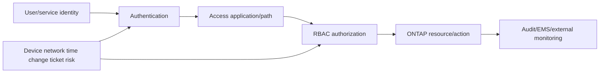

---

## 2. Management-plane attack surface

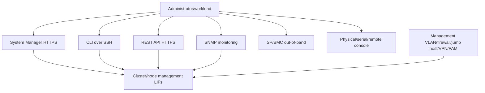

### Surface-reduction questions

- Which interfaces/services are enabled and why?
- Which source networks/hosts may reach each management endpoint?
- Are cluster, node, data, intercluster, and out-of-band networks separated?
- Which roles can use `http`, `ssh`, REST, legacy interfaces, SNMP, console, or other applications?
- Are insecure/deprecated protocols, algorithms, services, and default credentials removed under exact current guidance?
- How are jump hosts, privileged-access management (PAM), endpoint security, session recording, and vendor access governed?
- Does emergency access survive identity/network/control-plane failure?

Do not disable a service simply because it is unused in one inventory snapshot; verify dependencies, support, rollback and recovery first.

---

## 3. Cluster and SVM identity scopes

ONTAP administrative identities can be scoped to the cluster's administrative SVM or to a data SVM. The same human/group can have different login applications, authentication methods, and roles.

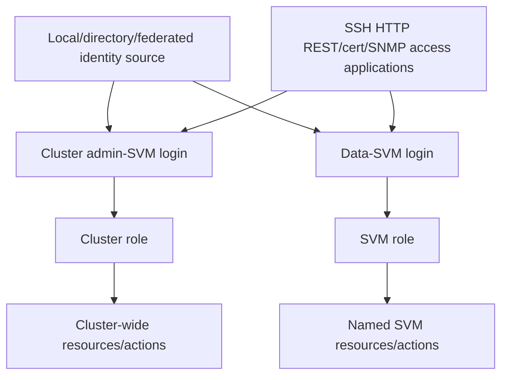

### Identity inventory

| Field | Question |
|---|---|
| Principal | Named human, group, service, certificate subject, token client? |
| Source | Local, AD/domain, LDAP, SAML/OAuth IdP, certificate/SSH key? |
| Scope | Cluster admin SVM or data SVM? |
| Application | SSH, HTTP/System Manager/API, certificate, SNMP, other current-supported method? |
| Authentication | Password/key/cert/token/MFA combination? |
| Role | Predefined/custom; read/create/modify/delete/query scope? |
| Owner/purpose | Who approves and still needs it? |
| Lifecycle | Created, last used, review, expiry/rotation, disable/delete? |

Shared human accounts undermine accountability. Prefer named identities, approved groups, unique credentials/factors, and service accounts with noninteractive bounded access.

---

## 4. Authentication: local, directory, federation, and MFA

ONTAP supports multiple administrative authentication patterns depending on release and interface. Examples in current documentation include local passwords/SSH public keys/certificates, Active Directory or LDAP-backed access, SAML for web services, OAuth 2.0 for supported API authorization, and several MFA approaches. Verify exact release/interface combination.

### Plain-English deep-dive: identity source is not the same as second factor

Active Directory or SAML tells ONTAP which external identity service vouches for a user. MFA says the user must provide more than one independent proof. RBAC then decides permissions. **Why it matters:** “federated” does not automatically mean MFA, and “MFA enabled” for System Manager does not prove SSH, REST, service accounts, or console use the same control.

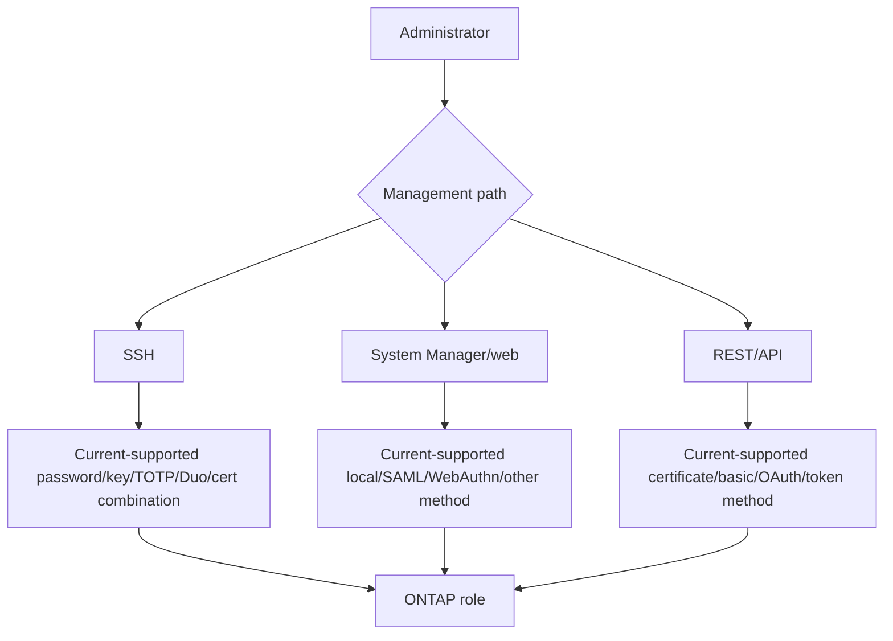

### Authentication design questions

- Which path is covered and which bypass paths remain?
- Is the factor independent, phishing-resistant where required, and recoverable?
- What happens if IdP, directory, DNS, NTP, proxy, certificate, or Duo/service is unavailable?
- Does fail-open/fail-secure behavior meet availability/security needs?
- How are enrollment, reset, revocation, lost devices, leavers, and emergency accounts governed?
- Which local accounts remain and why?
- Is the identity/group-to-role mapping exact and monitored?

### Federated access dependency

```mermaid
sequenceDiagram
    autonumber
    participant U as Administrator/browser or API client
    participant O as ONTAP service
    participant I as IdP/authorization server
    participant P as PKI/DNS/NTP/network
    U->>O: Request access to supported interface
    O->>I: Redirect/validate assertion or token under exact flow
    I->>P: Use DNS/time/certificates/network dependencies
    I-->>O: Authenticated identity/groups/claims
    O->>O: Map identity to ONTAP role and resource
    O-->>U: Allow or deny; audit result
```

SAML has specific System Manager/admin-SVM behavior and lockout recovery prerequisites. OAuth, WebAuthn, group claims, and dynamic authorization have their own current documentation. Never promise a generic “SSO across ONTAP.”

---

## 5. RBAC and least privilege

An ONTAP role grants access to command/API/resource families under its exact rules. A user must have the right authentication **and** login application **and** role.


### Role-design examples

| Persona | Needed outcome | Risk to avoid |
|---|---|---|
| Health analyst | Read inventory/health/events | Accidental change/full admin |
| Backup operator | Run/monitor exact protection tasks | Delete source/security controls |
| SVM administrator | Manage one tenant/service scope | Cluster-wide visibility/control |
| Automation service | Bounded idempotent API operations | Interactive use or wildcard rights |
| Security auditor | Read identities/config/audit | Ability to alter audited settings |
| Break-glass admin | Emergency full recovery | Daily use, unknown custody, no alert |

### Least-privilege test

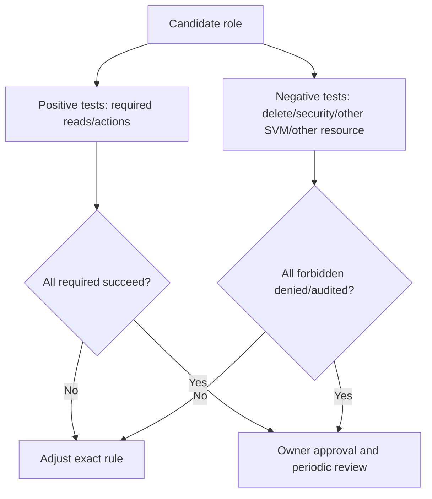

Avoid granting `admin` because a custom role is inconvenient. Also avoid over-fragmenting roles so operations fail during incidents; test realistic workflows and emergency escalation.

---

## 6. Service accounts, automation, and secrets

Service accounts represent software, not humans. They need a named owner, exact API/SSH purpose, noninteractive credential, minimal role, rotation, monitoring, and retirement.

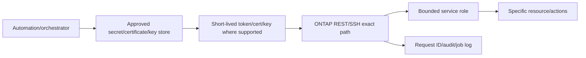

### Service-account controls

- No hardcoded password/token/private key in script, repository, log, ticket, or image.
- Separate dev/test/prod identities and resources.
- Certificate/token/key expiry monitoring and overlapping rotation test.
- Source network/client identity and rate/error monitoring.
- Idempotency, dry-run/read-before-write, job polling, and bounded retries.
- Human interactive login denied where supported/design permits.
- Owner, business service, dependencies, last use, and decommission date.
- Emergency disable that does not destroy recovery access.

---

## 7. Multi-admin verification, JIT, and change control

**Multi-admin verification (MAV)** adds approval for selected protected operations after RBAC permits the requester. **Just-in-time (JIT) elevation**, where supported, limits higher privilege to an approved time/context. **Dynamic authorization**, where supported, can evaluate risk/trust for restricted activity. These are distinct controls.

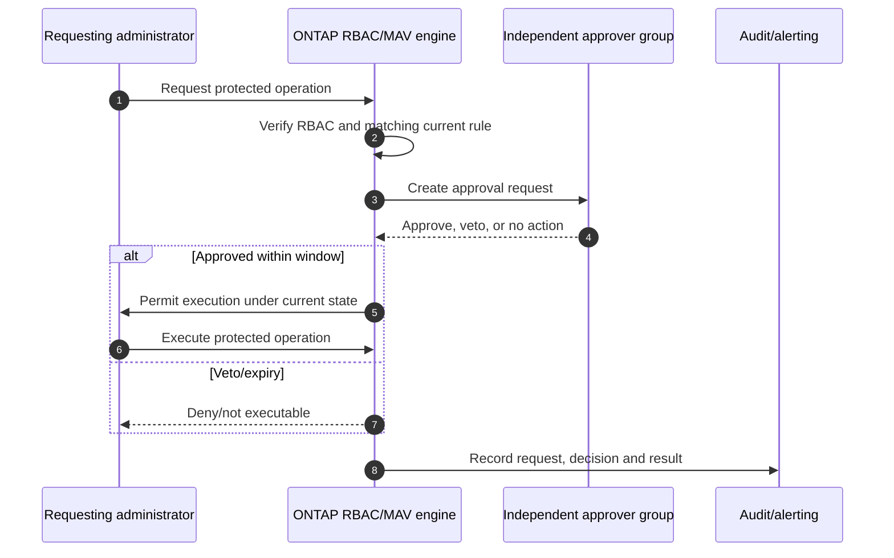

### Plain-English deep-dive: keycard plus two-person safe

RBAC gives the operator a keycard. MAV says certain safes still require a second authorized person. JIT gives a temporary keycard for a defined window. Dynamic authorization adds current risk context. **Why it matters:** none replaces the others, and approval workflow must remain usable during emergencies without becoming self-approval or an undocumented bypass.

### Change controls

- Protect destructive/security/retention/key/log operations selected from exact current capabilities.
- Keep approvers independent, available across time zones, and unable to approve their own request.
- Test expiration, veto, notification failure, unavailable approvers, automation collision, and recovery.
- Record ticket, business reason, peer review, prechecks, stop/rollback/forward plan, result, and validation.
- Never enable MAV without a recovery plan for unavailable approval administrators and current Support guidance.

---

## 8. System Manager, SSH, REST, and web-service security

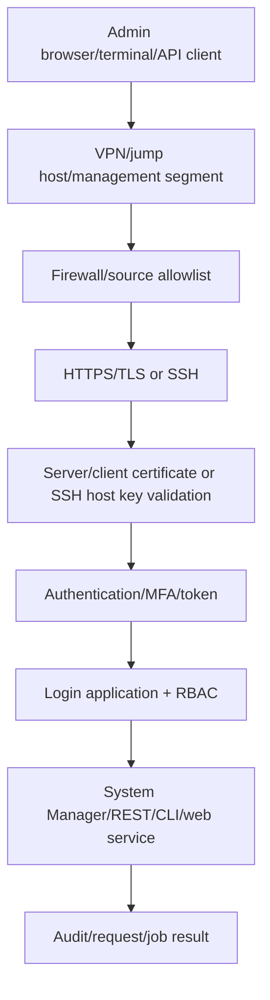

### Interface baseline

| Interface | Baseline questions |
|---|---|
| System Manager | HTTPS only, trusted name/cert, SAML/WebAuthn/current auth, management source restrictions? |
| SSH CLI | Supported algorithms, host-key validation, public key/MFA, no shared keys, session controls? |
| REST API | HTTPS/cert validation, current auth/token method, scoped role, request IDs, pagination/errors, secret handling? |
| Legacy API/web | Still required/supported, isolated, authenticated, migration plan? |
| SNMP | Current secure model, least monitoring view, source restriction, secret/key lifecycle? |
| SP/BMC/console | Separate network/accounts/MFA where supported, logging, break-glass custody? |

Do not suppress certificate or SSH host-key validation to make automation work. Repair trust/name/time/chain configuration.

---

## 9. Certificates and PKI

**Public key infrastructure (PKI)** manages identities and trust using certificates, certification authorities (CAs), keys, validity, revocation, and policy. ONTAP can act as TLS server and client in different workflows; certificate type and SVM scope matter.

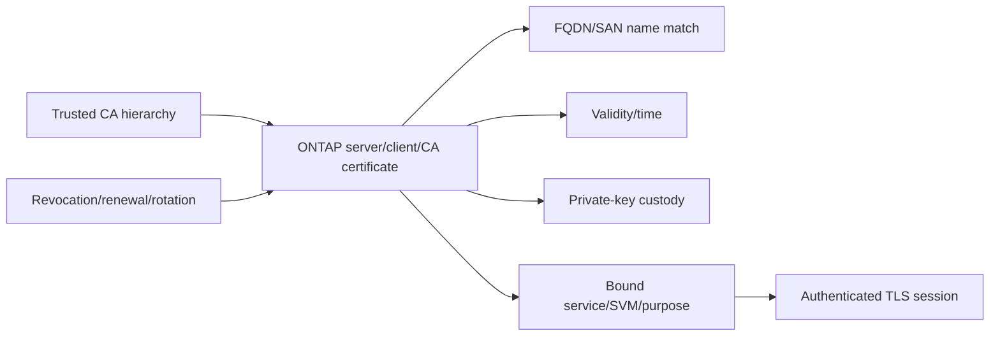

### Certificate inventory fields

- Cluster/SVM, certificate type, subject/SAN/common name, issuer, serial/fingerprint.
- Algorithm/key size/signature under current security policy.
- Not-before/not-after, days to expiry, renewal owner, CA chain, revocation approach.
- Private-key origin/custody/exportability and compromise response.
- Bound service/interface: web, SAML, KMIP, client trust, replication/integration.
- Replacement sequence, overlap, rollback, and dependent clients/IdPs/key managers.

### Certificate rotation

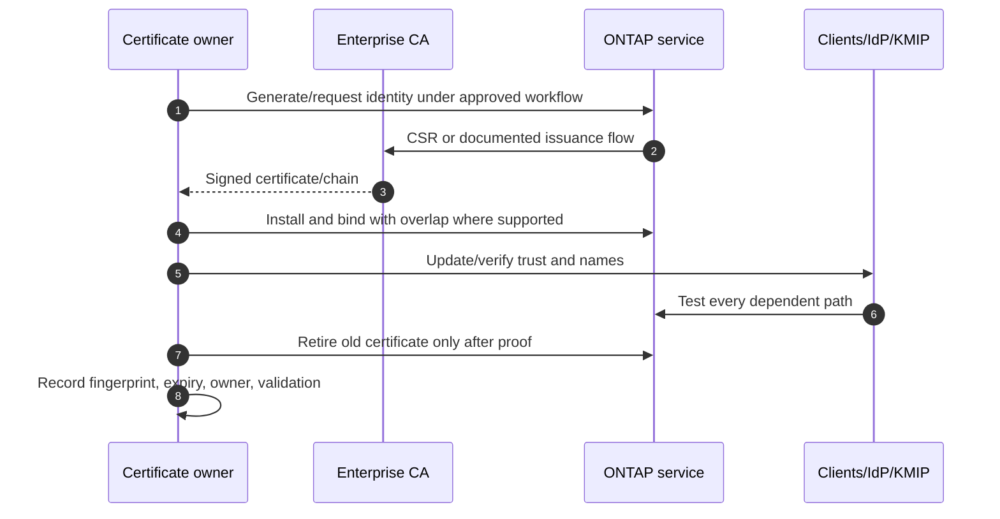

Never rotate a management or key-manager certificate without tested out-of-band recovery and dependency inventory.

---

## 10. Encryption in transit

Encryption in transit protects data/confidentiality/integrity against network observation or modification within the protocol's threat model. Coverage is per path: management HTTPS/SSH, peering, KMIP, client protocols, object/cloud, and vendor integrations can use different controls.

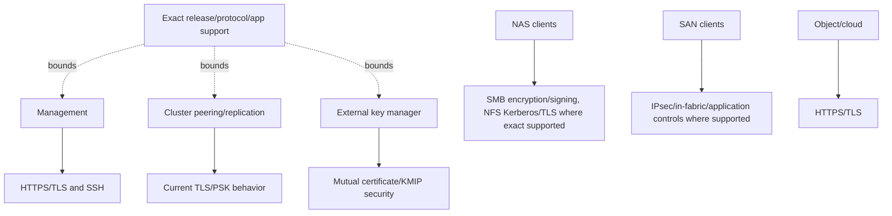

### Transport controls

- Disable obsolete protocol/cipher behavior only through exact current compatibility and change testing.
- Validate server identity and mutual identity where designed.
- Segment management, peering, storage/data, key-management, and out-of-band networks.
- Monitor handshake failures, certificate expiry, downgrade/insecure fallback, and anomalous source.
- Recognize that encryption does not hide endpoints, timing, volume, or authorized malicious actions.

---

## 11. Encryption at rest: NVE, NAE, and NSE

**NetApp Volume Encryption (NVE)** is software encryption at volume scope. **NetApp Aggregate Encryption (NAE)** uses aggregate-level keys for eligible volumes and enables certain aggregate-level efficiency interactions. **NetApp Storage Encryption (NSE)** is hardware-based full-disk encryption using supported self-encrypting drives. Exact key scope and features vary.

### Plain-English deep-dive: locked folders, locked room, and self-locking cabinets

- NVE gives each folder/volume its own lock/key.
- NAE locks eligible folders using the room/aggregate key model.
- NSE uses cabinets/drives that encrypt themselves and open only to an authenticated system.

**Why it matters:** all protect media/data-at-rest threats differently; key loss can make healthy storage unreadable, and hardware encryption may not cover every cache/module or logical copy.

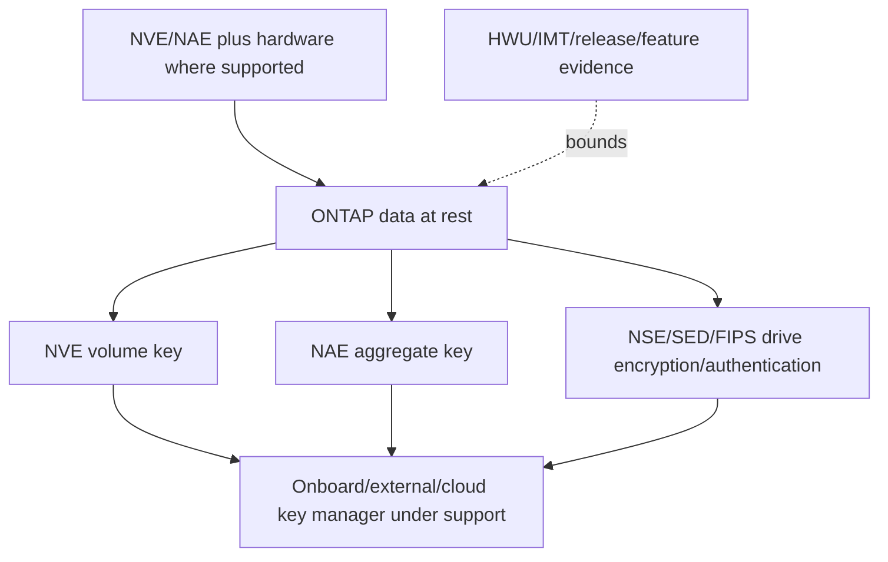

### Comparison

| Control | Scope orientation | Key risk |
|---|---|---|
| NVE | Software encryption per volume | Volume/key state, moves, replication, rekey, root/SnapLock support |
| NAE | Software aggregate-key model | Aggregate key lifecycle, efficiency/features, deletion/rekey limitations |
| NSE/SED/FIPS drives | Hardware media encryption/authentication | Drive/platform mixing/support, authentication keys, cache coverage, sanitize/return workflow |
| Double encryption | Software plus hardware where supported | More layers and more lifecycle/recovery complexity |

Encryption at rest protects lost/stolen/returned media and defined offline access. It does not stop an authenticated administrator/application from reading or deleting mounted data.

---

## 12. Onboard, external, KMIP, and cloud key management

The **Onboard Key Manager (OKM)** stores/serves keys within the ONTAP system's operating model. **External key management** stores key material/authorization in a separate service; traditional integrations can use the **Key Management Interoperability Protocol (KMIP)**, while supported cloud key services can use provider-specific integrations rather than KMIP.

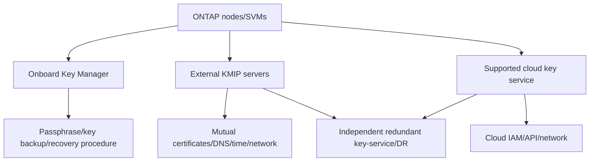

### Key lifecycle

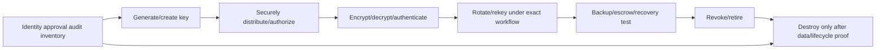

### Key-management questions

- Cluster versus SVM key scope and tenant separation.
- Number/location/diversity/availability of key servers or cloud service.
- Boot-time and disaster-site reachability, DNS, routing, firewall, certificates, time.
- OKM passphrase/key-backup custody, split knowledge, escrow, and recovery.
- Key rotation/rekey performance, clone/snapshot/replication/move/upgrade interactions.
- Loss/revocation/deletion scenarios and “crypto-shredding” authorization.
- Who can administer storage, key service, cloud IAM, PKI, and backups?
- Evidence that encrypted volumes/drives and keys are healthy and recoverable.

Key availability is part of storage availability. “Keys are external” is not resilience if all servers share one site, identity, certificate, or network.

---

## 13. Cluster peering and replication security

Current ONTAP documentation describes TLS/pre-shared-key encryption for supported cluster peering, with defaults and upgrade history varying by release. Peering security includes more than encryption.

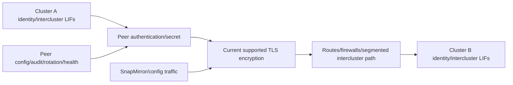

### Peering baseline

- Stable cluster identity and approved peer/SVM relationships.
- Encryption/authentication state verified on both ends, especially legacy-created peers.
- Pre-shared secret or current authentication lifecycle, rotation and custody.
- Intercluster network segmentation, source/destination rules and monitoring.
- Version compatibility and secure-protocol/cipher behavior.
- Peer deletion/change protected through RBAC/MAV and audited.
- DR access to secrets, certificates, routes, and approvers.

---

## 14. Administrative audit, data audit, EMS, and external logs

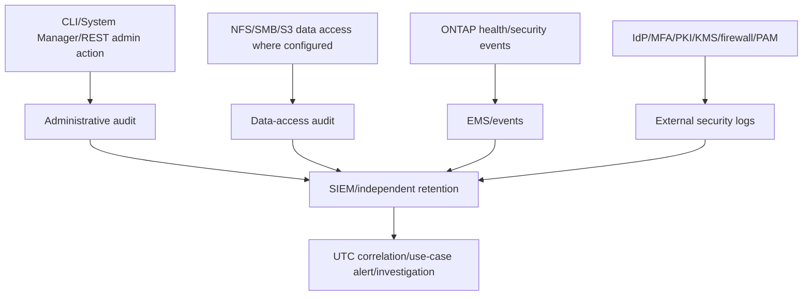

### Accountability evidence

- Unique identity and source; role/application/auth method.
- Request/action/resource/parameters at privacy-safe detail.
- UTC timestamp and synchronized time source.
- Allow/deny/approval/job/result/error.
- Before/after state or configuration snapshot for high-risk change.
- Related ticket, MAV request, IdP event, firewall session, KMS/key event, and backup.
- Retention, integrity, export/delivery health, query scope, and access controls.

No log entry can mean the action never happened, logging was disabled/misconfigured, retention expired, delivery failed, time/query scope is wrong, or a path was not covered. Audit pipelines need health alerts and periodic retrieval tests.

---

## 15. Secure baseline, hardening, and drift

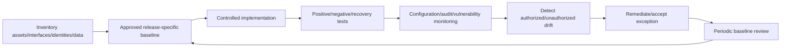

### Baseline domains

1. Supported ONTAP/firmware/platform and secure configuration evidence.
2. Management network segmentation and allowed sources.
3. Minimal services/protocols/interfaces and current TLS/SSH/FIPS policy.
4. Named identities, strong authentication/MFA/federation by path.
5. RBAC, MAV/JIT/dynamic controls, service account/secrets lifecycle.
6. Trusted certificates/PKI and expiry/rotation.
7. In-transit and at-rest encryption coverage plus key recovery.
8. Peer/integration/cloud/key-manager trust and network.
9. Administrative/data/event/external audit and immutable/independent retention.
10. Backups, locked recovery points, break glass, incident and restore tests.

### Framework mapping orientation

| Baseline domain | NIST CSF 2.0 orientation | CIS Controls orientation |
|---|---|---|
| Governance/owners/exceptions | Govern | Governance/service-provider/security program safeguards |
| Inventory/baseline | Identify | Enterprise asset/software/configuration management |
| IAM/RBAC/MFA | Protect | Account/access control management |
| Encryption/keys | Protect | Data protection |
| Audit/monitoring | Detect | Audit-log management/network monitoring |
| Incident/break glass | Respond | Incident-response management |
| Backup/recovery tests | Recover | Data recovery |

This is conceptual mapping, not an audit assertion. Use the exact current framework text and organization profile.

---

## 16. Access reviews and break glass

### Access recertification

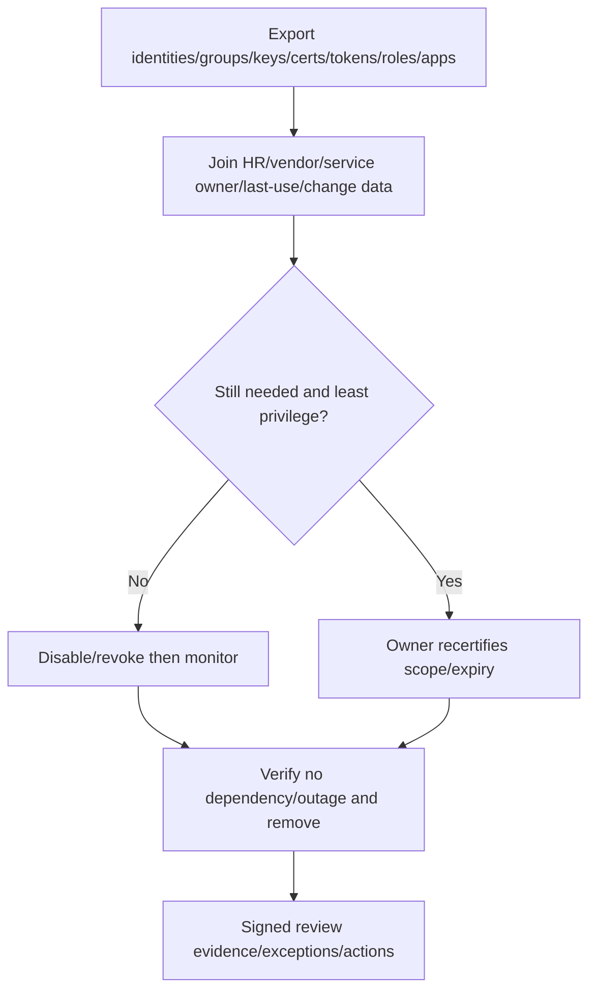

Review dormant accounts, local bypass accounts, group nesting, SSH keys, certificates, tokens, service identities, expired owners, broad roles, vendor access, SP/BMC, and break-glass custody.

### Break-glass design

```mermaid
sequenceDiagram
    autonumber
    participant I as Incident commander
    participant C as Credential custodians/PAM
    participant O as ONTAP/out-of-band path
    participant S as Security/audit
    I->>C: Declare approved emergency and exact need
    C->>C: Dual control/retrieve sealed credential or factor
    C->>O: Use isolated known-good device/path
    O-->>C: Time-bound emergency access
    C->>O: Perform minimum recovery action
    O->>S: Audit/alert/session evidence
    I->>C: Rotate/reseal/revoke and review after incident
```

Break glass must work if SAML/AD/DNS/MFA cloud/network is down, yet must not become the routine bypass. Test it in a controlled environment; alert every use; rotate afterward; keep exact current recovery procedures and Support contacts.

---

## 17. Safe discovery and evidence

Conceptual read-only placeholders only; verify exact current commands/APIs, privilege, authorization, privacy, and Support procedure.

```text
CONCEPTUAL ONLY - not production commands
<security-login-family> show -fields <documented-user-group-application-auth-role-fields>
<security-role-family> show -fields <documented-command-api-access-query-fields>
<web-service-ssh-tls-family> show -fields <documented-service-protocol-policy-fields>
<certificate-family> show -fields <documented-type-subject-issuer-expiry-fingerprint-fields>
<key-manager-family> show -fields <documented-scope-provider-state-key-health-fields>
<volume-aggregate-disk-encryption-family> show -fields <documented-nve-nae-nse-fields>
<cluster-peer-family> show -fields <documented-auth-encryption-state-fields>
<audit-log-forwarding-family> show -fields <documented-destination-delivery-state-fields>
```

```mermaid
flowchart TD
    SCOPE[Business/data/admin/threat scope] --> SURF[Interfaces networks services versions]
    SURF --> IAM[Identities auth methods apps roles MAV/JIT]
    IAM --> PKI[Certificates TLS peer/integration trust]
    PKI --> ENC[NVE NAE NSE key managers/recovery]
    ENC --> AUD[Admin/data/EMS/external audit]
    AUD --> REC[Break glass backups incident/recovery tests]
    REC --> SUP[Current docs HWU IMT vendor/framework/Support]
    SUP --> GAP[Risk-ranked gap/recommendation]
```

### Minimum security evidence pack

- Business/data classifications, threat model, owners, policy/framework, scope/date.
- Cluster/platform/ONTAP/SVM/LIF/network/services/protocols/integrations.
- Identities/groups/accounts/apps/auth methods/MFA/federation/roles/keys/certs/tokens/last use.
- MAV/JIT/dynamic authorization rules, approvers, requests, failures, emergency access.
- TLS/SSH/web/SNMP/peer/current protocol and certificate inventories.
- NVE/NAE/NSE coverage, key scope/provider/server/IAM/cert/network/backup/recovery/rekey health.
- Admin/data/EMS/PAM/IdP/KMS/firewall/SIEM audit and delivery/retention/query tests.
- Baseline drift, exceptions, current advisories, change/access review and break-glass tests.
- Current docs/HWU/IMT/vendor/Support evidence, unknowns, recommendation, owner/date/proof/residual risk.

---

## 18. Failure modes and troubleshooting decision tree

| Symptom | Candidate causes | Discriminating evidence |
|---|---|---|
| Admin cannot log in | Wrong scope/app/auth/role, locked/expired credential, IdP/DNS/time/cert/MFA | Exact path and authentication stage |
| Login succeeds but action denied | RBAC command/API/query scope or MAV/JIT | Role rule and approval request |
| SAML/web lockout | IdP metadata/cert/name/DNS/time/per-node config | IdP/ONTAP status and out-of-band recovery |
| REST automation fails | Auth/token/cert, role, endpoint/schema, secret rotation | HTTP status/request ID/audit without secret |
| Certificate warning/outage | Expiry, chain, name, binding, client trust/time | Full chain/name/bound service |
| Encrypted volume unavailable | Key manager/network/cert/IAM/passphrase/key state | Key-manager and volume/node events |
| “Encrypted” data exposure | Gap in NVE/NAE/NSE/protocol/backup/replica/cache coverage | Object-by-object coverage map |
| Peer not secure/available | Legacy config, PSK mismatch, version/path/TLS | Both-end peer state and current docs |
| Audit events missing | Logging/path/retention/delivery/time/query gap | Source plus SIEM pipeline health |
| Hardening change causes outage | Dependency/compatibility/rollback not tested | Before/after path-specific evidence |

```mermaid
flowchart TD
    START[Security control failure or suspected gap] --> IMPACT[Identity path resource data impact time change]
    IMPACT --> AUTHN{Authentication reached/succeeded?}
    AUTHN -->|No| A[Account scope app credential MFA IdP DNS time cert network]
    AUTHN -->|Yes| AUTHZ{RBAC/MAV/JIT permits exact action?}
    AUTHZ -->|No| R[Role/query/approval/current state]
    AUTHZ -->|Yes| TRUST{TLS SSH certificate peer trust valid?}
    TRUST -->|No| T[Name chain expiry binding algorithm path]
    TRUST -->|Yes| KEY{Encryption/key path healthy?}
    KEY -->|No| K[Key scope server IAM cert network backup/recovery]
    KEY -->|Yes| AUD{Audit/monitoring confirms outcome?}
    AUD -->|No| L[Source config delivery retention time query]
    AUD -->|Yes| APP[Application/protocol/data issue or false assumption]
    A --> SAFE[Use approved break glass only if required]
    R --> TEST[Cheapest safe discriminating test]
    T --> TEST
    K --> TEST
    L --> TEST
    APP --> TEST
    SAFE --> TEST
```

### Support boundaries

- Do not disable services/accounts/MFA/federation, change roles/MAV, rotate certificates/keys, enable encryption, sanitize drives, or alter peers from this guide.
- Security/IAM/PKI/KMS teams own identity, trust, key, monitoring and policy controls.
- Storage/ONTAP/Support owners control exact product procedures and recovery.
- Application/automation owners control service identities, clients, dependencies and testing.
- Compliance/risk owners govern framework mappings and exceptions.
- TAM analysis coordinates evidence, risk, owners, current support, validation and residual risk.

---

## 19. TAM discovery, supportability, risk, and recommendations

### Discovery questions

1. Which business/data classifications, threat actors, policies/frameworks, tenants, critical services, and recovery requirements apply?
2. Which cluster/platform/ONTAP/SVM/LIF/management/out-of-band interfaces and enabled services are in scope?
3. Which named/local/directory/federated human/group/service identities use which applications, auth methods, factors, roles and resources?
4. Which SAML/OAuth/WebAuthn/TOTP/Duo/AD/LDAP/certificate features are exact-supported for each interface/release, and what are their failure modes?
5. Which custom/predefined roles, group mappings, MAV/JIT/dynamic rules, approvers, service accounts, keys and tokens exist?
6. Which TLS/SSH/SNMP/web/peer protocols and certificates/host keys/trust chains are current, expiring, weak, or unused?
7. Which volumes/aggregates/drives/caches/replicas/backups are covered by NVE/NAE/NSE and which key manager/scope/provider serves them?
8. Can key management and break glass survive node/site/IdP/DNS/network/certificate/admin loss, and has recovery been tested?
9. Which administrative/data/EMS/external audit events are generated, delivered, protected, retained, alerted and sampled?
10. Which baseline drift, access review, exceptions, advisories, HWU/IMT/vendor/Support evidence and owners remain?

### Recommendation model

```mermaid
flowchart TD
    E[Verified surface identity role trust encryption key audit recovery evidence] --> C[Business data threat policy and availability context]
    C --> R[Risk mechanism exposure impact likelihood urgency confidence]
    R --> O[Segment auth role cert encryption key audit recovery options]
    O --> A[Owner prerequisites date change stop/rollback]
    A --> V[Allow/deny failover key recovery audit and app validation]
    V --> RR[Residual risk exception monitoring and recertification]
```

### Recommendation patterns

| Finding | Risk | Bounded recommendation | Validation |
|---|---|---|---|
| Shared full-admin local account used daily | Weak attribution and broad credential blast radius | Move routine work to named federated/MFA least roles; retain controlled break glass | Positive/negative access, audit and IdP-loss test |
| API service stores password in script | Secret leak and unrestricted reuse | Use current-supported vaulted cert/token/key and bounded role | Rotation, source restriction and denied excess action |
| Management certificate expires soon | UI/API outage or unsafe bypass | Rotate with CA/name/chain overlap and dependency test | All clients/IdP/API paths trust new cert |
| External KMIP servers share storage site | Site/key outage makes encrypted data unavailable | Add current-supported independent key-service/network/cert recovery | Node/site/key-server failure test |
| Peer created on legacy release lacks verified encryption | Replication/config traffic exposure | Validate both-end current state and enable under approved exact procedure | Encrypted healthy peer and transfer test |
| SIEM receives EMS but not admin audit | Destructive changes have incomplete attribution | Configure/validate source and protected external delivery under current docs | Test action correlated end-to-end |

### JD Mapping

| JD responsibility | Part 40 contribution | Arti's factual bridge and gap |
|---|---|---|
| Understand environment | Maps management, identity, trust, data/key and audit planes | AD/Azure/networking experience transfers |
| Analyze/report data | Access, cert, encryption, key, log, drift and exception inventories | Analytics strength transfers |
| Strategic planning | Builds phased hardening/recovery/access-review roadmap | MBA/advisory transfer |
| Risk/stability | Balances security with IdP/key/cert availability and break glass | CRITSIT discipline transfers |
| Supportability | Requires exact release/HWU/IMT/IdP/KMS evidence | No customer/gated result claimed |
| Service review | Reports risks, owners, validation and residual exceptions | Business-review strength transfers |
| Escalation | Produces path/auth/role/cert/key/audit evidence without secrets | Product collaboration transfers |

---

## 20. Fully synthetic scenario: Northwind Energy access and key outage

> **Synthetic case:** Northwind Energy, every account, certificate, key server, event, customer, and result below is fictional. It is not a NetApp customer, benchmark, internal workflow, tool result, or Arti's production work.

### Environment

- System Manager uses SAML; SSH administrators use local public keys and passwords.
- A shared local `admin` account remains in the password vault and is also used by automation.
- Two external KMIP servers are virtual machines on storage protected by the same cluster.
- The management certificate expires during a planned IdP certificate rotation window.
- Cluster peering originated on an older ONTAP release; encryption state has not been audited.
- EMS reaches the SIEM, but administrative audit delivery is unverified.

```mermaid
flowchart TB
    USERS[Storage admins] --> SAML[SAML System Manager]
    USERS --> SSH[Local SSH]
    AUTO[Automation] --> SHARED[Shared admin password]
    SHARED --> ONTAP[ONTAP cluster]
    SAML --> ONTAP
    SSH --> ONTAP
    ONTAP --> KM1[KMIP VM 1 on same storage]
    ONTAP --> KM2[KMIP VM 2 on same storage]
    ONTAP --> PEER[Legacy-created cluster peer]
    ONTAP --> EMS[EMS to SIEM]
    AUD[Admin audit] -.delivery unknown.-> EMS
```

### Incident timeline

```mermaid
sequenceDiagram
    autonumber
    participant P as PKI/IdP team
    participant O as ONTAP web service
    participant K as KMIP servers
    participant A as Administrators
    participant S as SIEM
    P->>O: Rotate IdP/certificate dependencies in same window
    O-->>A: System Manager SAML/TLS access fails
    A->>O: Use shared local admin account
    O->>K: Node restart requests encryption keys
    K-->>O: KMIP VMs unavailable because their storage depends on O
    A->>S: Seek who changed trust/key settings
    S-->>A: EMS present; administrative action correlation incomplete
```

### Findings

| Evidence | Observation | Bounded conclusion |
|---|---|---|
| Identity | Shared admin used by humans and automation | Attribution and rotation blast radius |
| Federation | SAML dependency and management cert changed together | Correlated lockout risk |
| Break glass | Account works but routine use/no distinct alert | Recovery path exists but governance is weak |
| Key management | Both KMIP VMs depend on same storage/site | Circular availability dependency |
| Peering | Relationship healthy; encryption state unknown | Security claim unproved, not necessarily insecure |
| Audit | EMS received; admin action stream not proven | Investigation gap |

```mermaid
flowchart TD
    INC[Management and key outage] --> ACCESS[Restore approved named/break-glass access]
    INC --> KEY[Recover independent key service/path]
    INC --> PKI[Separate IdP and server certificate workstreams]
    INC --> AUDIT[Preserve/correlate ONTAP IdP PKI KMS PAM logs]
    ACCESS --> STABLE[Stabilize encrypted data/management]
    KEY --> STABLE
    PKI --> STABLE
    AUDIT --> RCA[Root cause and control gaps]
    STABLE --> PLAN[Phased hardening and failure tests]
    RCA --> PLAN
```

### Recommendations

1. Replace shared routine administration with named/group-based current-supported MFA/federated and SSH/API identities using least roles; separate automation into a vaulted service identity.
2. Redesign break-glass as a sealed/dual-controlled, alerting, tested path independent of SAML/AD/DNS where feasible; rotate and review after use.
3. Separate ONTAP server certificate and IdP signing/trust rotations, maintain overlap/rollback, and test each node/client/API path before retiring old trust.
4. Place redundant key services and their PKI/network/recovery outside the protected cluster's circular failure domain, using exact supported KMIP architecture; test node/site/key-server loss.
5. Verify legacy peer encryption on both ends and administrative-audit delivery/retention to SIEM; remediate only through current-supported change plans.

### Customer-facing summary

> "The outage combined three dependencies: SAML/web trust changed in the same window, the shared local account blurred human and automation actions, and both external key servers depended on the storage they unlock. EMS reached the SIEM, but administrative-change correlation was incomplete. We recommend named least-privilege identities, governed break glass, staged certificate rotation, independent key-service recovery, and verified peer/audit controls with failure tests."

---

## 21. Arti's factual transfer and honest positioning

```mermaid
flowchart LR
    AD[Active Directory/Entra/M365 identity] --> IAM[Identity groups MFA federation lifecycle]
    AZ[Azure/networking] --> PKI[Segmentation TLS cert cloud key shared responsibility]
    CRIT[CRITSIT] --> REC[Break glass evidence restoration communication]
    BI[Analytics] --> GOV[Access cert key audit drift dashboards]
    IAM --> ONTAP[ONTAP security conceptual method]
    PKI --> ONTAP
    REC --> ONTAP
    GOV --> ONTAP
    ONTAP --> LAB[Future authorized lab/security specialist review]
```

> **Honest interview answer:** "I use identity-authentication-authorization-accountability as the foundation, then map every System Manager, SSH, REST, peering and key-management path. I understand ONTAP RBAC/MFA/federation/MAV, certificates, NVE/NAE/NSE and onboard/external key management conceptually. My production background is Microsoft identity, cloud, networking and incidents, not ONTAP hardening or encryption operations. I would verify exact release/HWU/IMT/vendor support and use security, PKI, KMS and NetApp specialists before changes."

---

## 22. Whiteboard drills, paper lab, and self-test

### Whiteboard drills

1. Identity -> authentication -> access application -> RBAC -> action -> audit.
2. Cluster versus SVM identity/role scope.
3. Local/directory/federated/MFA by System Manager/SSH/REST path.
4. Job tasks -> least custom role -> allow/deny tests.
5. Service account -> vault -> token/cert/key -> API -> audit.
6. RBAC versus MAV versus JIT/dynamic authorization.
7. CA -> certificate/name/time/key/service -> renewal/revocation.
8. NVE versus NAE versus NSE.
9. ONTAP -> OKM/external KMIP/cloud KMS -> recovery.
10. Admin/data/EMS/external logs -> SIEM -> investigation.
11. Baseline -> verify -> drift -> exception -> recertify.
12. Break-glass declaration -> dual custody -> minimal action -> rotate/review.

### Paper lab

A fictional fleet has 35 ONTAP clusters across releases, local/AD/LDAP/SAML/OAuth/MFA identities, 400 accounts/keys/certs, custom roles, APIs, MAV, NVE/NAE/NSE, OKM and three KMIP vendors, peer relationships, SIEM forwarding, expiring certificates, shared service accounts, acquisitions, and incomplete break-glass tests.

Tasks:

1. Inventory management/out-of-band interfaces, services, networks, sources and versions.
2. Reconcile every identity/group/application/auth method/factor/role/scope/owner/last use.
3. Validate exact support/failure behavior for each MFA/federation/API path.
4. Design positive/negative least-privilege tests and remove shared human/service identities safely.
5. Map MAV/JIT/dynamic controls, approvers, automation, notifications, and recovery.
6. Inventory TLS/SSH/SNMP/peer certificates/keys/protocols and staged rotations.
7. Map NVE/NAE/NSE coverage across volumes/aggregates/drives/caches/replicas/backups.
8. Map OKM/KMIP/cloud-key scope, certificates, IAM, networks, site dependencies, backups and recovery.
9. Correlate admin/data/EMS/IdP/PAM/KMS/firewall audit and test SIEM delivery/retrieval.
10. Compare current release-specific baseline to actual drift and approved exceptions.
11. Test IdP/DNS/cert/KMS/network/approver/SIEM loss and break-glass recovery.
12. Write phased recommendations with blast radius, owners, stop/rollback and proof.

```mermaid
flowchart LR
    SURF[Inventory surfaces] --> IAM[Reconcile identities/RBAC]
    IAM --> TRUST[Validate MFA/certs/peers]
    TRUST --> ENC[Map encryption/keys]
    ENC --> AUD[Correlate audit/drift]
    AUD --> FAIL[Test dependency and break glass]
    FAIL --> REC[Phased recommendations/recertification]
```

### Lab pass checklist

- [ ] Identity, authentication, authorization and accountability stay distinct.
- [ ] Every access interface/path has exact current authentication coverage.
- [ ] Named humans and service accounts are separated and least-privileged.
- [ ] RBAC, MAV, JIT and dynamic authorization are not conflated.
- [ ] Certificate inventory includes name, chain, expiry, key, binding and dependencies.
- [ ] NVE, NAE and NSE coverage/key scope are explicit.
- [ ] OKM/external/cloud key services include independent recovery tests.
- [ ] Peering security is verified on both ends, not inferred from health.
- [ ] Admin/data/EMS/external logs are correlated and delivery-tested.
- [ ] Baseline drift/exceptions/access reviews have owners/dates/proof.
- [ ] Break glass survives identity/network failure but is not routine bypass.
- [ ] No synthetic work is called production ONTAP security experience.

### Self-test

1. Define identity, authentication, authorization, RBAC, least privilege, separation and accountability.
2. Map ONTAP management attack surfaces and segmentation.
3. Explain cluster/SVM/login-application/auth-method/role relationships.
4. Compare local, directory, SAML/OAuth and MFA only at current-doc-safe depth.
5. Design least roles and positive/negative tests.
6. Secure service accounts and automation secrets.
7. Compare RBAC, MAV, JIT and dynamic authorization.
8. Secure System Manager, SSH, REST, SNMP and out-of-band paths.
9. Explain PKI/certificate lifecycle and rotation dependencies.
10. Map encryption in transit per path.
11. Compare NVE, NAE and NSE threat/scope models.
12. Compare OKM, external KMIP and supported cloud key services; test recovery.
13. Secure peers and map administrative/data/event/external audit.
14. Build baseline/drift/access review/break-glass programs.
15. Apply troubleshooting and recreate Northwind Energy's workstreams.
16. Complete paper lab and Q1-Q8 aloud; state Arti's boundary.

---

## 23. Official Source Anchors

**Date checked: 2026-08-24.** These official public sources anchor ONTAP security concepts. Exact authentication, MFA/federation, role, interface, certificate, TLS/FIPS, encryption, key manager, audit, peering, MAV/JIT/dynamic and command behavior are release/platform/configuration sensitive. Re-open exact current pages and preserve dated HWU/IMT/vendor/Support evidence.

| Topic | Official public source | Bounded use and currency note |
|---|---|---|
| Auth/access | [ONTAP authentication and access control](https://docs.netapp.com/us-en/ontap/authentication-access-control/) | Current identity/RBAC/OAuth/SAML/WebAuthn/web/certificate navigation |
| Auth/RBAC worksheets | [Administrator authentication and RBAC worksheets](https://docs.netapp.com/us-en/ontap/authentication/config-worksheets-reference.html) | Current application/auth method/role/cert/domain/SAML fields; exact release only |
| Roles | [Manage ONTAP access-control roles](https://docs.netapp.com/us-en/ontap/authentication/manage-access-control-roles-concept.html) | Predefined/custom role orientation and current JIT links |
| MFA | [Learn about ONTAP multifactor authentication](https://docs.netapp.com/us-en/ontap/authentication/mfa-overview.html) | SSH key/password/TOTP/Duo combinations by release; verify interface |
| Federation | [Configure SAML authentication for remote ONTAP users](https://docs.netapp.com/us-en/ontap/system-admin/configure-saml-authentication-task.html) | Web/admin-SVM/IdP/certificate/dependency/recovery behavior |
| MAV | [Learn about ONTAP multi-admin verification](https://docs.netapp.com/us-en/ontap/multi-admin-verify/) | Approval model/current protected-operation matrix and limitations |
| System Manager | [Use System Manager to access an ONTAP cluster](https://docs.netapp.com/us-en/ontap/system-admin/access-cluster-system-manager-browser-task.html) | HTTPS/management-LIF/certificate orientation |
| SSH | [Enable ONTAP account SSH public key access](https://docs.netapp.com/us-en/ontap/authentication/enable-ssh-public-key-accounts-task.html) | Key/access/algorithm/FIPS release caveats |
| Web services | [Manage ONTAP web services](https://docs.netapp.com/us-en/ontap/system-admin/manage-web-services-concept.html) | Service, encrypted HTTP, access method, role and firewall gates |
| Security/encryption | [ONTAP security and data encryption](https://docs.netapp.com/us-en/ontap/security-encryption/) | Current security/audit/ARP/encryption navigation |
| At-rest encryption | [Learn about ONTAP data at rest encryption](https://docs.netapp.com/us-en/ontap/encryption-at-rest/) | NVE/NSE overview and management navigation |
| NVE/NAE/key managers | [Learn about ONTAP volume and aggregate encryption](https://docs.netapp.com/us-en/ontap/encryption-at-rest/configure-netapp-volume-encryption-concept.html) | NVE/NAE/key-scope/replication/support details; verify current matrix |
| Hardware encryption | [Learn about ONTAP hardware-based encryption](https://docs.netapp.com/us-en/ontap/encryption-at-rest/support-storage-encryption-concept.html) | NSE/SED/FIPS-drive/KMIP/platform caveats |
| Peering encryption | [Enable cluster peering encryption](https://docs.netapp.com/us-en/ontap/peering/enable-cluster-peering-encryption-existing-task.html) | Default/legacy history and both-end current procedure |
| Administrative evidence | [ONTAP Eventing, Logs, EMS, Audit, Service Processor, and Evidence Sources](Part-25-ontap-ems-logs-audit-evidence.md) | Guide-internal evidence model; re-open official links in that Part |
| NIST CSF | [NIST Cybersecurity Framework 2.0](https://www.nist.gov/cyberframework) | Govern/Identify/Protect/Detect/Respond/Recover outcome orientation |
| CIS Controls | [CIS Critical Security Controls v8.1](https://www.cisecurity.org/controls) | Prioritized safeguard orientation; not ONTAP configuration authority |
| NIST storage | [NIST SP 800-209](https://csrc.nist.gov/pubs/sp/800/209/final) | Vendor-neutral storage IAM/encryption/audit/configuration context |
| HWU/IMT/Support | [NetApp Hardware Universe](https://hwu.netapp.com/), [NetApp IMT](https://imt.netapp.com/), [NetApp Support](https://mysupport.netapp.com/) | Exact platform/key-manager/ecosystem/support evidence; potentially gated |

### Source-use discipline

- Record exact cluster/platform/ONTAP/SVM/interface/account/auth/role/cert/encryption/key manager and date.
- Capture configuration and expected allow/deny behavior without secrets/private keys/tokens/passphrases.
- Use exact current certificate fingerprints/expiry and key-manager health, not screenshots alone.
- Validate encryption coverage on source, destination, backup, cache and media independently.
- Treat framework mappings as control orientation, not compliance certification.
- Mark customer/gated/unknown evidence explicitly and never fabricate a result.

---

## Likely Interview Questions

### Q1. Explain identification, authentication, authorization, RBAC, and accountability in ONTAP.

> **Model answer:** "Identity names the user/group/service; authentication proves it through a method supported for the access path; the login application controls how it connects; RBAC authorizes commands/APIs/resources at cluster or SVM scope; audit records the request and result. I use named identities, least roles, expected allow/deny tests, MFA where supported, and independent logging."

### Q2. How would you design ONTAP administrator access?

> **Model answer:** "I inventory System Manager, SSH, REST, SNMP, console and SP/BMC paths and restrict them to management networks/jump hosts. Routine humans use named group/federated or keyed MFA paths and least roles; automation uses separate vaulted service identities; destructive actions can add MAV/JIT where supported. A sealed, alerted break-glass path survives IdP/network failure and is tested."

### Q3. How do SAML/federation and MFA relate?

> **Model answer:** "Federation delegates identity proof to an IdP; MFA requires multiple independent factors; RBAC grants ONTAP permissions. They are separate. I verify each interface because System Manager SAML, SSH TOTP/Duo/key combinations, REST OAuth/cert and console paths differ by release. I map DNS/time/certificate/IdP failure and maintain controlled recovery access."

### Q4. What is multi-admin verification, and how is it different from RBAC?

> **Model answer:** "RBAC decides whether a principal is allowed to request an operation. MAV then requires independent approval for selected protected operations before execution. The requester cannot self-approve under the documented model. I choose current-supported high-risk rules, test veto/expiry/approver outage/automation, preserve audit, and maintain a Support-reviewed recovery plan."

### Q5. Compare NVE, NAE, and NSE.

> **Model answer:** "NVE is software encryption per volume; NAE uses aggregate-level keys for eligible encrypted volumes and certain aggregate efficiency behavior; NSE is hardware full-disk encryption/authentication on supported self-encrypting drives. They have different key scopes, platform/features and recovery. I map all volumes/aggregates/drives/caches/replicas and verify HWU/IMT before claims."

### Q6. Compare onboard and external key management.

> **Model answer:** "OKM is integrated and convenient but shares more system failure/administration context; external KMIP or supported cloud key services can centralize/separate key custody but add DNS/network/certificate/IAM/service availability dependencies. I design redundant independent key paths, split duties, backups/escrow, rotation and tested node/site/key-server recovery. Key availability is storage availability."

### Q7. What makes an ONTAP security baseline sustainable?

> **Model answer:** "It is release-specific, owned and testable: supported software; segmented management; minimal services; named MFA/least access; MAV/JIT where fit; trusted certs; in-transit/at-rest coverage; recoverable keys; secure peers; admin/data/event audit; backups and break glass. I monitor drift, advisories, cert/key expiry, exceptions and access recertification, then validate changes and recovery."

### Q8. How does your background transfer, and what remains a gap?

> **Model answer:** "My AD/Entra, Azure, Windows networking, M365 permissions, CRITSIT and analytics experience gives me identity, TLS, segmentation, evidence, recovery and governance discipline. I understand ONTAP security architecture conceptually but have not configured its RBAC/MFA/MAV/certificates/encryption/key managers in production. I would use current docs/HWU/IMT and security/PKI/KMS/NetApp specialists before changes."

---

## 30-Second Memory Hooks

- **Identity:** Name on the badge.
- **Authentication:** Prove the badge holder.
- **Authorization/RBAC:** Which doors/actions the role permits.
- **Accountability:** Camera and transaction log.
- **Application:** SSH/HTTP/API path is part of login policy.
- **Federation:** External identity source; not automatically MFA.
- **MFA:** More than one independent proof, per interface.
- **Least privilege:** Required task, resource and time only.
- **Service account:** Software identity with vault, owner, scope and expiry.
- **MAV:** RBAC keycard plus second-person safe approval.
- **JIT:** Temporary elevation, not permanent admin.
- **Certificate:** Identity + public key + issuer + validity + purpose.
- **TLS:** Protect the channel and verify the endpoint.
- **NVE:** Volume key.
- **NAE:** Aggregate key model.
- **NSE:** Self-encrypting drive/media layer.
- **OKM:** Keys within ONTAP operating context.
- **External KMIP/cloud KMS:** Separate service, additional dependencies.
- **Key recovery:** Encrypted data without a usable key is unavailable data.
- **Break glass:** Independent, sealed, alerted, minimal and rotated.
- **Arti's bridge:** Microsoft IAM/cloud rigor transfers; ONTAP operation does not.

---

## Completion Checklist

- [ ] Define identity/authentication/authorization/RBAC/accountability.
- [ ] Inventory and segment every management/out-of-band interface/service.
- [ ] Map cluster/SVM scope, application, auth method, role and resource.
- [ ] Verify local/directory/federated/MFA coverage by exact interface/release.
- [ ] Use named humans, separate service accounts and positive/negative least-role tests.
- [ ] Distinguish RBAC, MAV, JIT and dynamic authorization.
- [ ] Secure System Manager/SSH/REST/SNMP/console paths and remove unsafe trust bypasses.
- [ ] Manage PKI certificate names/chains/keys/expiry/bindings/rotation/recovery.
- [ ] Map encryption in transit per management/peer/key/data/object path.
- [ ] Compare NVE/NAE/NSE and validate exact coverage/HWU/IMT.
- [ ] Design OKM/external KMIP/cloud-key lifecycle, duties and recovery tests.
- [ ] Verify both-end peering authentication/encryption and lifecycle.
- [ ] Correlate admin/data/EMS/IdP/PAM/KMS/network logs and delivery health.
- [ ] Operate release-specific baseline/drift/exception/access-review/break-glass cycles.
- [ ] Apply troubleshooting, support boundaries and recommendation logic.
- [ ] Recreate Northwind Energy, complete paper lab, answer Q1-Q8, and state Arti's boundary.

---

*Next suggested section:* [Part 41 - Ransomware Resilience and Autonomous Ransomware Protection](Part-41-ransomware-resilience-arp.md)