# Part 41 - Ransomware Resilience and Autonomous Ransomware Protection

> **Section goal:** Understand ransomware as a full attack-and-recovery problem and place ONTAP Autonomous Ransomware Protection (ARP) inside a layered resilience strategy. By the end, Arti should be able to distinguish original ARP from ARP with artificial intelligence (ARP/AI), interpret learning/evaluation/active states by exact release and workload, triage anomalies without assuming attack or false positive, preserve evidence, contain safely, select a clean recovery point, validate restoration, and communicate residual risk without promising prevention.

Covers index item **41** and maps directly to job-description responsibilities for storage/security depth, customer discovery, risk mitigation, high-pressure incidents, proactive recommendations, supportability, analytics, service reviews, evidence quality, and cross-functional execution.

**Version caveat:** Exact ARP/ARP-AI name, model, automatic-security-update behavior, ONTAP release, platform, FlexVol/FlexGroup/SAN/NAS/hypervisor-volume support, license, default enablement, learning/evaluation/active/paused/disabled state, thresholds, signals, snapshots, retention, alerts, suspect-file views, safe-extension handling, MAV protection, upgrade/revert behavior, commands, limits, and response workflow change by release and workload. Verify the exact current ARP overview, release history, workload-specific page, release notes, HWU/IMT, System Manager/CLI/API schema, and NetApp Support guidance.

Current public documentation checked below describes **ARP/AI as the default model for ONTAP 9.16.1 and later** and the **original ARP model for ONTAP 9.10.1 through 9.15.1**, with volume/workload exceptions across later releases. This is a dated orientation, not a timeless rule. No threshold, learning/evaluation duration, snapshot schedule/retention, detection rate, false-positive rate, response time, or “zero data loss” guarantee is asserted without rechecking the exact current page.

> **No-production-NetApp boundary:** Arti does not claim production NetApp ARP or ransomware-response experience on ONTAP. Every volume, extension, entropy signal, alert, snapshot, customer, timeline, and outcome below is synthetic. Her factual strengths are Microsoft enterprise escalation, security/identity/networking concepts, Azure/M365 incident ownership, data recovery, analytics, stakeholder coordination, and customer communication. The explicit non-claim is: **she has not enabled/tuned production ARP/ARP-AI, transitioned a production volume from learning/evaluation to active, classified a NetApp ARP alert, marked activity normal, paused/disabled protection, cleared suspects, restored an ONTAP ransomware incident, or claimed ARP prevented an attack.**

---

## 1. Ransomware from zero

**Ransomware** is malicious activity that disrupts access to systems/data, often by encrypting or deleting data and demanding payment. Modern extortion can also include data theft, leak threats, destruction, credential theft, and attacks on backups or management planes.

### Plain-English deep-dive: burglary, sabotage, and hostage-taking

An attacker may steal copies of documents, change the locks, shred originals, disable alarms, and destroy spare keys before demanding money. File encryption is only one visible step. **Why it matters:** storage anomaly detection helps at one stage, while identity, patching, segmentation, logging, immutable copies, incident response, and clean recovery address different stages.

| Term | Plain meaning | Why it matters |
|---|---|---|
| **Initial access** | Attacker first enters | Patch, phishing resistance, MFA, exposed-service control |
| **Privilege escalation** | Attacker gains stronger rights | Least privilege, admin separation, monitoring |
| **Lateral movement** | Attacker moves among systems | Segmentation, identity/device controls |
| **Exfiltration** | Data is stolen | Egress monitoring, data protection, legal response |
| **Impact** | Data/services are encrypted, deleted, stopped | ARP signals, immutable recovery, isolation |
| **Persistence** | Attacker retains access | Eradication and credential/key rotation |
| **Clean point** | Recovery state believed free of attacker/corruption | Timeline, scanning, app validation |
| **Residual risk** | Risk remaining after actions | Honest decision/monitoring input |

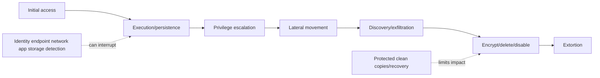

---

## 2. Resilience layers: prevent, detect, contain, recover

No single feature prevents ransomware. A resilient design assumes some controls can fail and limits blast radius while preserving evidence and recovery options.

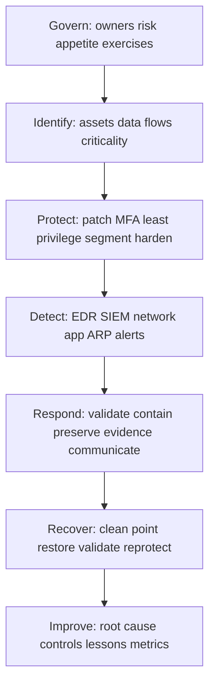

### Layer map

| Layer | Example controls | Failure assumption |
|---|---|---|
| Governance | IR/DR plans, owners, exercises, cyber insurance/legal contacts | Decision delay worsens impact |
| Identity | MFA, PAM, least privilege, MAV, service-account hygiene | Credentials can be stolen |
| Exposure | Patch, hardening, secure config, vulnerability response | Unknown/unpatched exposure exists |
| Network | Segmentation, management isolation, egress controls | One segment can be compromised |
| Endpoint/app | EDR, allowlisting, app logging, safe recovery | Endpoint alerts can be evaded |
| Storage | ARP, snapshots, SnapLock/locks, audit, quotas | Storage sees behavior, not attacker intent |
| Protection | Independent immutable/offline backups, DR | Online replicas can copy corruption |
| Response/recovery | Evidence, containment, clean-room restore | Recovery can reintroduce attacker |

---

## 3. What ONTAP ARP does and does not do

**Autonomous Ransomware Protection** analyzes supported workload behavior in ONTAP and warns/responds to abnormal activity that might indicate ransomware. Current ARP/AI uses a pretrained machine-learning model for supported newer releases/workloads; original ARP uses behavior such as file activity, entropy, and extension patterns with a learning-to-active workflow.

### Plain-English deep-dive: smoke detector, not fireproof building

ARP is a sophisticated smoke detector inside storage. It notices patterns associated with fire and can preserve a nearby recovery point under documented behavior. It cannot stop every ignition, identify the arsonist, guarantee the alarm is genuine, or rebuild the business. **Why it matters:** every alert needs security validation, and absence of an alert never proves absence of compromise.

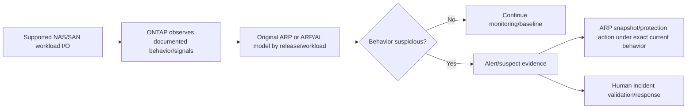

### ARP boundaries

- It observes supported storage workload behavior, not email, endpoint memory, identity-provider logs, or all cloud/SaaS activity.
- It can detect suspicious patterns, not prove malicious intent.
- Legitimate encryption, compression, bulk rename/delete, migration, backup, scientific data, or software deployment can look abnormal.
- Slow/low-and-slow, stolen-admin, exfiltration-only, unsupported protocol/workload, or pre-encrypted data may not create expected signals.
- ARP snapshots are one recovery input, not an independent backup or clean-point guarantee.
- Pausing/disabling/clearing an alert can reduce evidence/protection and requires governed current workflow.

---

## 4. Version and workload model: original ARP versus ARP/AI

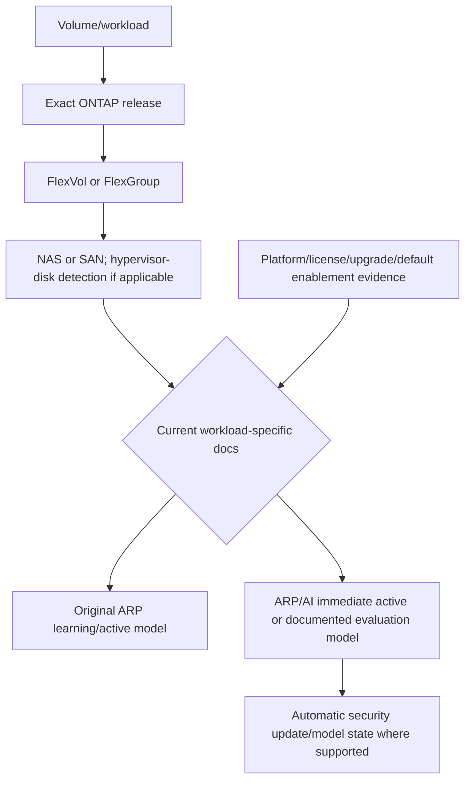

### Dated orientation from current public docs

| Dimension | Original ARP orientation | ARP/AI orientation |
|---|---|---|
| ONTAP family | Current docs map broadly to 9.10.1-9.15.1, plus listed later volume exceptions | Current docs map broadly to 9.16.1+ supported workloads |
| Detection | Learned NAS behavior/signals including activity, entropy, extensions | Pretrained ML/AI model using documented entropy/file behavior |
| Initial mode | Learning before active for supported legacy NAS use | Immediate active for many supported workloads; evaluation exceptions exist |
| Workloads | NAS-focused and release/volume-type bounded | NAS plus later SAN/FlexGroup support by exact release |
| Updates | Detection logic tied to ONTAP release behavior | Automatic security updates where supported/current |

Do not memorize this table as a support matrix. Before an interview or customer review, open **ARP feature availability by release** and the exact original-ARP or ARP/AI page.

---

## 5. Learning, evaluation, active, paused, and disabled states

The exact state names/values and transitions vary. Conceptually:

- **Learning** observes normal behavior before original ARP active detection.
- **Evaluation** can apply to certain ARP/AI workload cases under current documentation.
- **Active/enabled** evaluates live activity and triggers documented alert/protection behavior.
- **Paused** temporarily stops or limits protection under exact behavior while retaining configuration/state as documented.
- **Disabled** removes active protection under exact behavior and can affect learned/model state or snapshots depending on release.

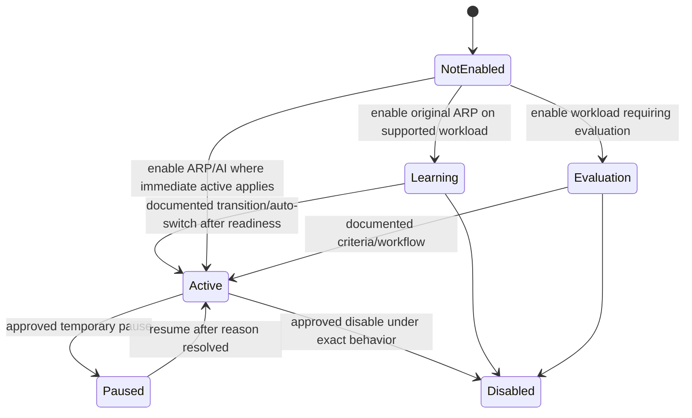

This is a conceptual state model, not a literal CLI/API state list.

### Plain-English deep-dive: trainee, certified guard, and maintenance pause

Legacy learning is a trainee watching normal business before judging anomalies. ARP/AI arrives pretrained for many workloads, but some workload types still need evaluation. Pausing sends the guard off duty temporarily; disabling removes protection. **Why it matters:** leaving legacy ARP in learning indefinitely produces false confidence, while activating without representative behavior or pausing during a risky migration can change detection coverage.

### Transition controls

- Exact release/platform/volume/protocol/model/update/license support.
- Representative business cycles: month-end, backups, migrations, patching, scans, media processing.
- Current anomaly baseline and unresolved events.
- Change owner, security approval, MAV protection where supported/recommended.
- Before/after state, alert/snapshot behavior, monitoring, rollback/forward plan.
- Documentation of expected noisy legitimate workloads and temporary exceptions.

---

## 6. Signals, anomalies, and false positives

**Entropy** is an information-theory measure that can rise when data becomes more random-looking, as with encryption or compression. ARP combines documented signals/model behavior rather than treating one file extension or entropy value as proof.

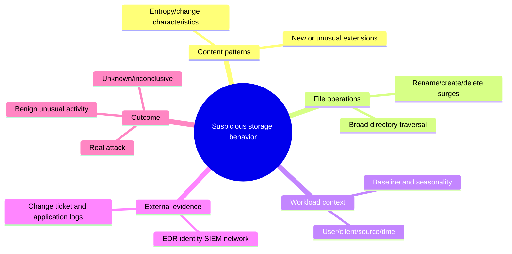

### Legitimate lookalikes

| Activity | Why it can look suspicious | Discriminating evidence |
|---|---|---|
| Backup/archive encryption | High-entropy outputs/new extensions | Approved job/client/path/schedule and unchanged source |
| Software deployment | Many file writes/renames | Signed package/change window/known hosts |
| Data migration | Bulk create/delete/rename | Approved tool/source/destination/counts |
| Media/scientific workload | Naturally compressed/random-looking data | Stable historical workload fingerprint |
| Database maintenance | High change/temporary files | DB job logs, expected files, app owner |
| Malicious encryption | Broad unexpected user/client changes | EDR/identity/network events, ransom artifacts, unauthorized source |

### False-positive discipline

Do not mark an alert normal because users complain or because a backup ran nearby. Prove identity, source/client, path, process, change ticket, app behavior, timeline, file sample, EDR/network evidence, and owner. Conversely, do not declare ransomware from an extension list alone.

---

## 7. Alert-to-evidence correlation

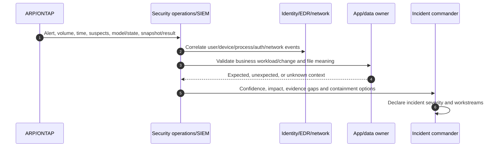

### Minimum ARP alert record

- Cluster/platform/ONTAP, SVM/volume/type/protocol/workload owner.
- ARP versus ARP/AI, mode/state, model/security-update/version context, license.
- Alert/event/EMS/job identifiers, UTC start/end, first/last suspect activity.
- Suspect files/extensions/count/path summaries with privacy-safe sampling.
- Client IP/host/session/user/process where available from NAS/SAN/app/EDR evidence.
- Entropy/file-operation/baseline context under exact documented fields.
- ARP snapshot identity/time/state/expiry and ordinary/locked/replicated/backup points.
- Concurrent change, backup, migration, scan, deployment, incident, and capacity events.

---

## 8. Incident validation decision tree

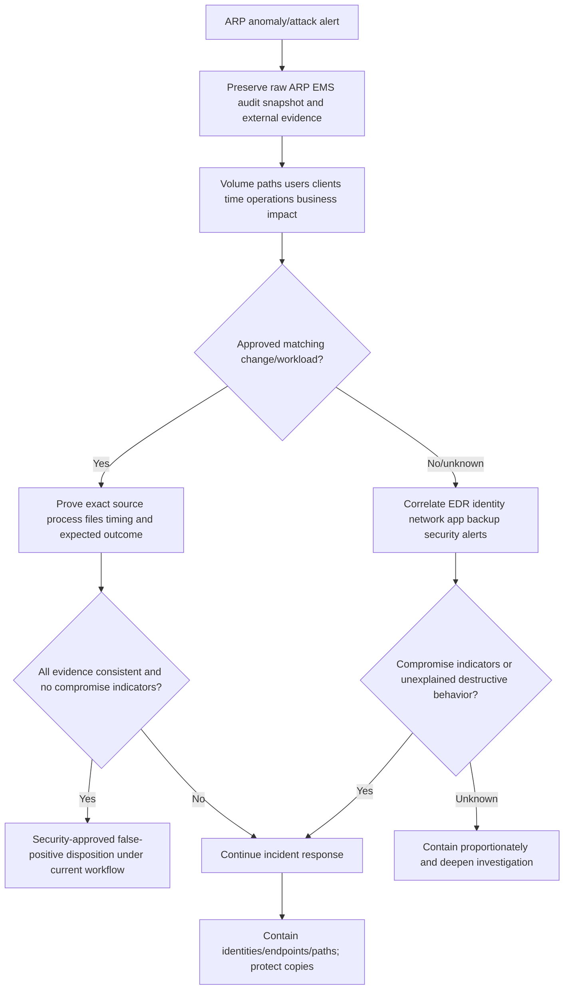

Do not delete suspect files, clear ARP state, or restore over evidence before incident/security owners decide preservation needs.

---

## 9. Containment without destroying evidence

Containment stops spread while preserving recovery and forensic options. Exact actions are incident-specific and owned by the incident commander/security team.

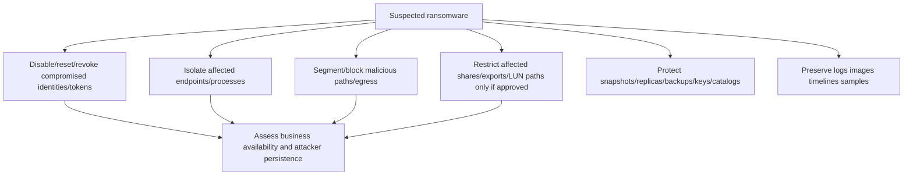

### Containment tradeoffs

- Cutting all storage access may stop damage but halt critical services and volatile evidence collection.
- Breaking replication may prevent corruption propagation but reduce DR protection and complicate authority.
- Disabling an account without preserving tokens/sessions/logs can lose attribution while other credentials persist.
- Powering off hosts can destroy memory evidence but may be required to halt impact.
- Deleting malicious files can remove evidence and leave persistence elsewhere.
- Pausing/disabling ARP during an incident can remove detection/protection; require exact Support/security decision.

Use staged containment with owner, reason, expected effect, evidence, stop condition, and validation.

---

## 10. ARP snapshots, immutability, backup, and DR

ARP can create/retain snapshots under release/model-specific alert behavior. Those points can improve recovery, but they share storage/administrative context unless separately locked/replicated/backed up under supported design.

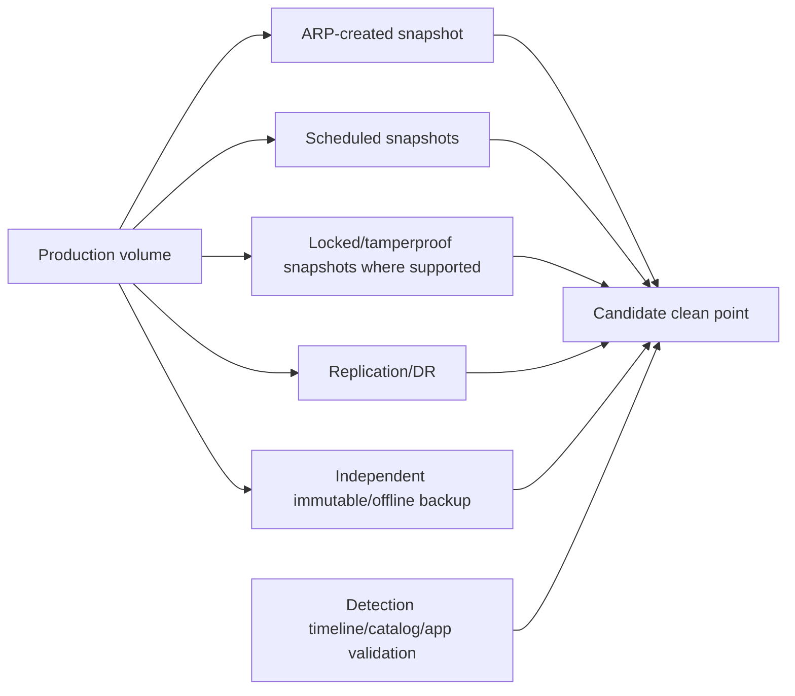

### Protection-layer questions

- Was the ARP snapshot created before, during, or after malicious impact?
- What exact model/release retention/expiry applies and can it be protected from deletion?
- Did replication transfer pre-attack points or copy corruption/deletion?
- Which backups are independent of compromised identity/storage/key/catalog domains?
- Are snapshots/replicas/backups application-consistent?
- Can recovery occur in an isolated environment without production identity/network exposure?
- Does retention provide enough dwell-time coverage?

ARP snapshots do not replace 3-2-1-1-0-oriented protection, SnapLock/locking, or tested backups.

---

## 11. Clean-point selection

### Plain-English deep-dive: last unburned page, not last saved page

The newest backup before visible encryption may already contain attacker tools or silent corruption. A clean point is selected by combining storage points with intrusion, identity, endpoint, application, and exfiltration timelines. **Why it matters:** recovery must go far enough back to remove attacker influence while minimizing valid data loss, then forward-reconcile safe transactions.

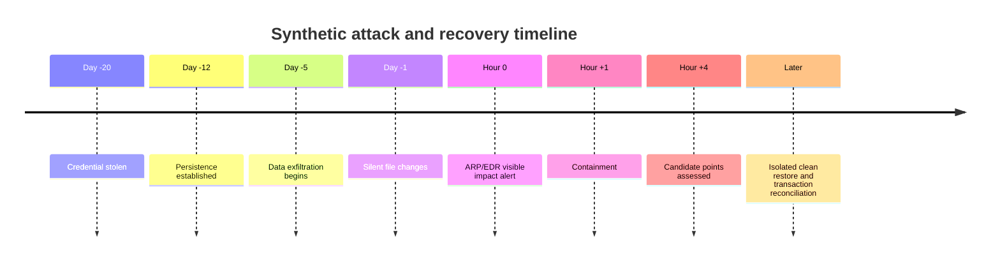

### Clean-point evidence matrix

| Candidate | Data loss | Compromise confidence | App consistency | Independent/immutable | Test result |
|---|---:|---|---|---|---|
| Latest ARP point | Low | Unknown until timeline review | Verify | Local unless layered | Isolated scan/app test |
| Earlier locked point | Higher | Potentially cleaner | Verify | Defined lock scope | Restore/transaction test |
| Remote replica | Depends on replication | May contain propagated corruption | Verify | Separate site, maybe shared admin | Clone/test first |
| Independent backup | Depends on schedule | Stronger domain independence | Verify | Exact immutability/offline | Catalog/key/full app test |

---

## 12. Recovery and validation

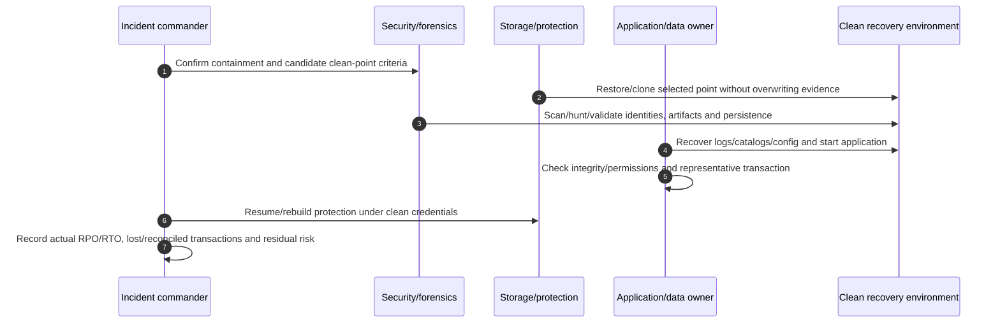

### Recovery gates

1. Incident authority declares containment sufficient for recovery.
2. Known-good infrastructure, admin workstation, identities, certificates, keys, DNS, NTP, network and monitoring exist.
3. Evidence copies are preserved separately.
4. Candidate point is restored into isolation where feasible.
5. Malware/persistence hunting and integrity checks pass.
6. Application logs/catalogs/queues/external dependencies reconcile.
7. Representative business transactions and security monitoring pass.
8. Credentials/keys are rotated as required and least access restored.
9. Snapshots/replication/backup/ARP are re-established and observed.
10. Data loss, uncertainty, notification/legal obligations and residual risk are documented.

---

## 13. ARP operational lifecycle

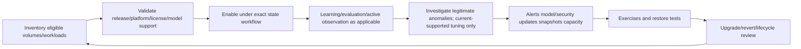

### Operational metrics

- Coverage: eligible/ineligible/active/learning/evaluation/paused/disabled volumes by criticality.
- Currency: ONTAP, model/security-update state, license, last health data.
- Alerts: confirmed malicious, benign, unknown, age, owner, time to acknowledge/contain/disposition.
- Protection: ARP snapshot creation/expiry/capacity, locked/replicated/backup coverage.
- Control: ARP configuration changes, MAV requests, safe-extension/parameter changes, exceptions.
- Recovery: last isolated restore, actual RPO/RTO, clean-point and business-transaction result.

Do not optimize for fewer alerts by broadly marking extensions safe or suppressing signals. Optimize for accurate investigation and recoverability.

---

## 14. Prevention controls around ARP

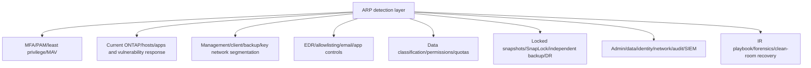

### High-value controls

- Phishing-resistant MFA/PAM for administrators and remote access where applicable.
- Separate storage, backup, key, virtualization and directory administrative identities.
- MAV for high-risk ARP/protection/deletion operations where supported and operationally fit.
- Patch/hardening/vulnerability management for internet-facing and management systems.
- Least NAS/SAN permissions, service accounts, shares/exports/LUN mappings and network paths.
- Immutable/locked recovery points plus independent encrypted offline/logically isolated backups.
- EDR/SIEM/identity/network/app/storage correlation and protected logs.
- Regular ransomware tabletop, containment, clean restore and communications exercises.

---

## 15. Safe discovery and evidence

Conceptual read-only placeholders only; verify exact current commands/APIs, fields, privilege, authorization, privacy, and NetApp Support procedure.

```text
CONCEPTUAL ONLY - not production commands
<anti-ransomware-volume-family> show -fields <documented-model-state-status-update-alert-fields>
<anti-ransomware-event-family> show -fields <documented-event-time-suspect-operation-fields>
<snapshot-family> show -fields <documented-creator-time-expiry-lock-fields>
<audit-ems-family> show -fields <documented-arp-config-alert-result-fields>
<protection-family> show -fields <documented-replica-backup-point-fields>
```

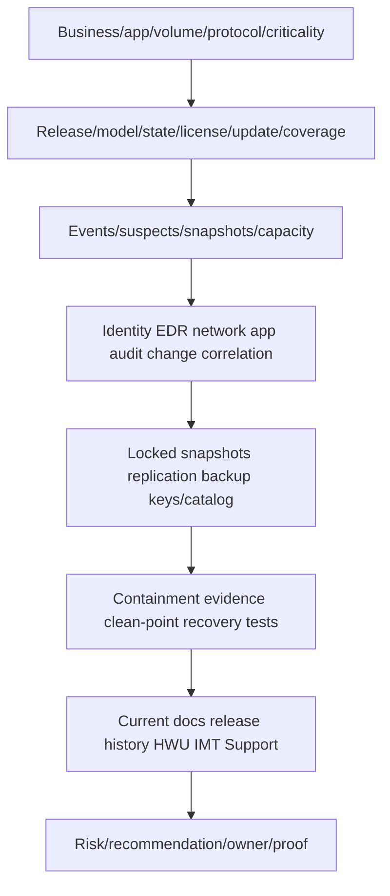

### Privacy and evidence controls

- Suspect paths/file names/content can contain sensitive personal/business data; minimize and redact.
- Preserve raw events, UTC, time sources, model/state and data cutoff before disposition.
- Hash/sample files only under forensic/legal authorization.
- Do not place malware or customer data in general tickets, study artifacts, or unapproved tools.
- Preserve relevant snapshots/logs without exceeding legal/retention authority.
- Record uncertainty and inaccessible evidence instead of filling gaps with assumptions.

---

## 16. Failure modes and troubleshooting decision tree

| Symptom | Candidate causes | Discriminating evidence |
|---|---|---|
| ARP not active | Unsupported release/platform/workload, license, learning/evaluation, paused/disabled | Exact model/state/support evidence |
| Legacy ARP stays learning | Transition not completed, nonrepresentative period, errors/config | State history/current workflow |
| Unexpected alerts | Legitimate encryption/migration/backup/app change or attack | Client/user/process/change plus external telemetry |
| No alert during incident | Unsupported path/workload, evasion/low signal, disabled/stale coverage | Coverage/state/model and attack operation evidence |
| ARP snapshot absent | Model/release trigger behavior, capacity, job/error/state | Current documented behavior and job/events |
| Snapshot fills space | Alert/retention/change rate, ordinary/locked points | Snapshot/capacity timeline |
| Mark-normal/clear action wrong | Incomplete investigation, broad extension assumption | Case evidence and later recurrence |
| Pause/disable creates exposure | Maintenance exception not time-bound/monitored | Change/audit/state and incident window |
| Restore reinfected | Dirty point, persistence, identity/host/network not cleaned | Forensics and clean-room validation |
| Replica/backup unusable | Propagated corruption, shared admin/key/catalog, app inconsistency | Point lineage/dependency/full restore test |

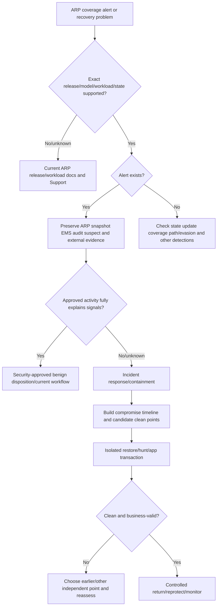

### Support boundaries

- Do not enable/tune/pause/disable ARP, edit safe-extension/parameters, mark normal, clear suspects, delete snapshots, break replication, or restore production from this guide.
- Security/incident command owns incident declaration, evidence, containment, eradication, reporting and return-to-service risk.
- Storage/NetApp Support owns exact ARP state, feature, snapshot and product procedure.
- Endpoint/identity/network/application teams own their evidence and containment.
- Protection/recovery owners preserve copies, catalogs, keys and clean-room restore.
- TAM analysis coordinates facts, risks, owners, communications, prevention actions and residual risk.

---

## 17. TAM discovery, supportability, risk, and recommendations

### Discovery questions

1. Which business services/data/volumes/protocols/clients/owners/criticality/RPO/RTO and ransomware threat scenarios apply?
2. What exact platform/ONTAP/volume type/workload/protocol/license maps to original ARP or ARP/AI and which current release page proves support?
3. What are ARP state/mode, model/security-update currency, learning/evaluation history, coverage exceptions, and change audit?
4. Which anomaly signals, alert/suspect files, ARP snapshots, capacity effects, and false-positive cases exist?
5. How are ARP events correlated with identity, EDR, network, app, NAS/SAN, audit, backup and change records?
6. Which MFA/PAM/least privilege/MAV, segmentation, patch/hardening and service-account controls limit attack/blast radius?
7. Which scheduled/locked/SnapLock/replicated/independent backup points exist, with what identities/keys/catalogs and dwell-time coverage?
8. What incident declaration, evidence, containment, legal/reporting, clean-room and communications runbooks exist?
9. When was a clean-point file/volume/app/cyber restore tested, with actual RPO/RTO and representative transaction?
10. Which current docs/release-history/HWU/IMT/Support, owners/actions, and residual unknowns remain?

### Recommendation model

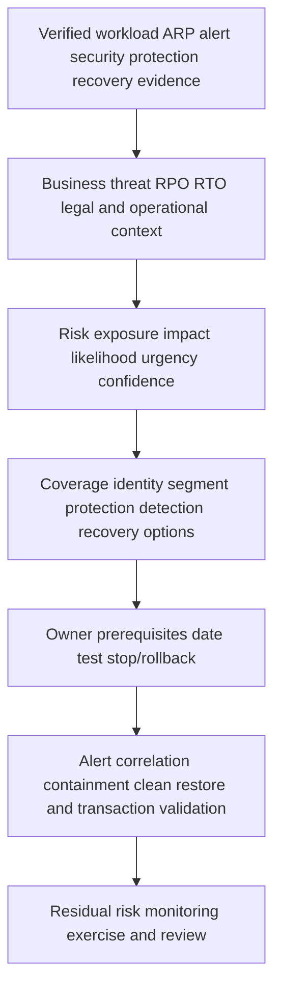

### Recommendation patterns

| Finding | Risk | Bounded recommendation | Validation |
|---|---|---|---|
| Legacy NAS volumes remain in learning | No active anomaly response despite dashboard coverage | Follow exact current readiness/transition workflow after representative cycles and owner review | Active state and approved anomaly exercise |
| ARP/AI security updates stale/unknown | Model coverage may not match expected current protection | Diagnose update/support path without bypass; restore currency monitoring | Documented current update state and alert test |
| Backup encryption job repeatedly marked safe | Broad exception could hide attacker behavior | Remove broad assumption; correlate exact job identity/path and use current-supported narrow handling | Expected job plus simulated unauthorized source |
| ARP snapshots only recovery copy | Same cluster/admin/capacity compromise can remove recovery | Add supported locked/immutable and independent/offline backup layers | Denied deletion and isolated restore |
| DR runbook restores latest pre-alert point | Point may contain dormant attacker | Use compromise timeline/forensics to select and test clean point | Clean-room hunt and business transaction |

### JD Mapping

| JD responsibility | Part 41 contribution | Arti's factual bridge and gap |
|---|---|---|
| Understand environment | Maps threat through identity/endpoint/network/app/storage/recovery | Microsoft cloud/support systems thinking transfers |
| Analyze/report data | Coverage/state/update/alerts/snapshots/cases/recovery metrics | Analytics strength transfers |
| Strategic planning | Builds layered prevent/detect/respond/recover roadmap | Advisory/MBA transfer |
| Risk/stability | Handles false positives, containment, clean point and residual risk | CRITSIT discipline transfers |
| Supportability | Requires exact ARP release/workload/platform evidence | No customer/internal result claimed |
| Service reviews | Reports coverage, exceptions, exercises, actions and readiness | Business-review strength transfers |
| Escalation | Produces privacy-safe ARP plus cross-plane evidence | Product collaboration transfers |

---

## 18. Fully synthetic scenario: Contoso Design suspected encryption

> **Synthetic case:** Contoso Design, every system, model state, extension, event, timestamp, snapshot, and outcome below is fictional. It is not a NetApp customer, benchmark, internal process, tool result, or Arti's production work.

### Environment

- Engineering NAS FlexVols run a current-supported ARP/AI model in the synthetic case.
- An older FlexGroup uses the original ARP model and remains in learning.
- A sanctioned rendering farm produces high-entropy `.renderpkg` files nightly.
- A compromised contractor account begins renaming CAD files from an unmanaged endpoint.
- Backups, scheduled snapshots, ARP snapshots, and an immutable object copy exist.
- The response runbook says “restore latest ARP snapshot” without a clean-point method.

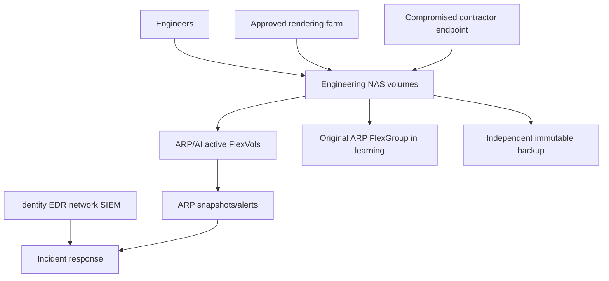

### Timeline

```mermaid
sequenceDiagram
    autonumber
    participant R as Rendering farm
    participant E as Compromised endpoint
    participant A as ARP/AI
    participant S as SOC
    participant B as Backup/recovery
    R->>A: Expected high-entropy package writes
    A-->>S: Historical benign pattern/context
    E->>A: Broad CAD rename/write from contractor identity
    A->>S: New anomaly/suspect alert and snapshot under synthetic behavior
    S->>E: EDR shows unapproved process and token reuse
    S->>B: Preserve all candidate points; do not overwrite evidence
    B-->>S: Latest point may postdate credential theft
```

### Evidence and competing hypotheses

| Hypothesis | Evidence for | Disconfirming check |
|---|---|---|
| Rendering job caused alert | High entropy is normal nightly | Alert paths/user/client/operations differ from rendering farm |
| Contractor activity is malicious | Unmanaged endpoint, broad rename, EDR/token indicators | Validate approved change/tool and file samples |
| All volumes are protected | Dashboard lists ARP | Older FlexGroup remains learning; exact support/state check |
| Latest ARP point is clean | Created near alert | Build credential/persistence/change timeline and isolated scan |
| Replica is safe | Offsite copy exists | Determine transfer time and whether corruption propagated |
| Immutable backup guarantees recovery | Copy cannot be deleted under defined scope | Verify clean point, key/catalog, app and restore test |

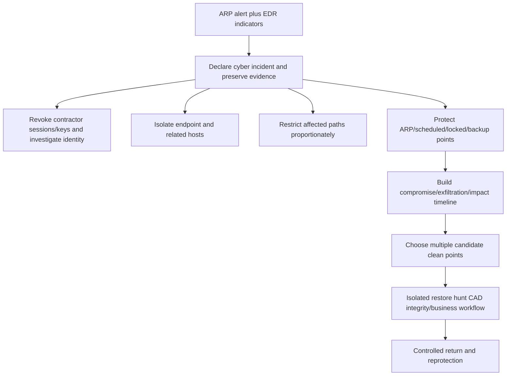

### Recommendations

1. Treat the event as a cyber incident because ARP, EDR, identity, source endpoint and file-operation evidence align; do not mark it normal due to unrelated high-entropy rendering.
2. Preserve ARP/EMS/audit/snapshot evidence, isolate the endpoint, revoke affected sessions/credentials, hunt lateral/exfiltration indicators, and protect independent copies under incident command.
3. Inventory every volume's exact ONTAP/model/type/state; move the eligible legacy learning gap through the current-supported workflow or document unsupported coverage/compensating controls.
4. Replace “latest ARP snapshot” with a clean-point matrix combining credential theft, persistence, exfiltration, file-change, replication and backup timelines.
5. Restore candidate CAD data/application workflow in isolation, validate malware/persistence, file integrity/permissions and a representative design transaction, then rotate credentials/reprotect/monitor and report actual RPO/RTO.

### Customer-facing summary

> "The alert is not explained by the approved rendering workload: the affected paths, contractor identity, unmanaged endpoint, rename behavior and EDR/token evidence are different and mutually reinforcing. We are preserving ARP and external evidence, containing identity/endpoint paths, protecting recovery copies, and selecting a clean point from the full compromise timeline rather than automatically restoring the newest snapshot. One older volume also remains in learning and needs a separate coverage action."

---

## 19. Arti's factual transfer and honest positioning

```mermaid
flowchart LR
    CRIT[Microsoft CRITSIT ownership] --> IR[Incident command evidence workstreams updates]
    IAM[AD/Entra/security concepts] --> ID[Credential containment MFA least privilege]
    AZ[Azure/networking] --> SEG[Segmentation egress endpoint/cloud dependencies]
    M365[M365 data services] --> DATA[Permissions versions recovery user impact]
    BI[Analytics] --> TREND[Coverage alert aging false positives RPO RTO]
    IR --> ARP[ARP conceptual method]
    ID --> ARP
    SEG --> ARP
    DATA --> ARP
    TREND --> ARP
    ARP --> LAB[Future authorized tabletop/lab/NetApp review]
```

> **Honest interview answer:** "I position ARP as a storage detection and protection layer, not prevention. I first identify exact ONTAP release, workload, volume type, original ARP versus ARP/AI, state and model/update currency. Then I correlate anomalies with identity, EDR, network and application evidence, preserve snapshots/logs, contain safely and restore a clean point in isolation. My production background is Microsoft incident and data-service work, not ONTAP ARP operations, so I would use current docs and NetApp/security specialists."

---

## 20. Whiteboard drills, paper lab, and self-test

### Whiteboard drills

1. Access -> privilege -> movement -> exfiltration -> impact -> extortion.
2. Govern/identify/protect/detect/respond/recover/improve loop.
3. Storage I/O -> ARP model -> anomaly -> alert/snapshot -> human IR.
4. Release -> volume type -> NAS/SAN/hypervisor -> original ARP/ARP-AI.
5. Learning/evaluation/active/paused/disabled conceptual states.
6. Signal mindmap: entropy/extensions/operations/context/external evidence.
7. ARP -> SOC -> identity/EDR/network/app correlation.
8. Alert -> preserve -> validate -> contain -> clean-point recovery.
9. ARP/scheduled/locked/replica/backup point comparison.
10. Clean-room restore -> hunt -> app transaction -> reprotection.

### Paper lab

A fictional enterprise has 500 ONTAP volumes across versions, FlexVol/FlexGroup/NAS/SAN/hypervisor workloads, original ARP and ARP/AI states, security-update gaps, 300 alerts, ARP/scheduled/locked snapshots, SnapMirror, object backups, EDR/SIEM/IAM data, migrations, backup encryption and incomplete ransomware exercises.

Tasks:

1. Inventory business criticality, platform/ONTAP/type/protocol/workload/owner/RPO/RTO.
2. Map each volume to exact current ARP model/support/license/state/update documentation.
3. Identify learning/evaluation/paused/disabled/ineligible coverage gaps and owners.
4. Reconcile ARP alerts/suspects/snapshots/capacity with identity/EDR/network/app/change evidence.
5. Build benign, malicious and unknown case dispositions with proof and reviewer.
6. Simulate unsupported workload, stale update, missed alert, false positive, capacity pressure and disabled protection.
7. Tabletop identity/endpoint/network/storage containment while preserving evidence.
8. Map scheduled/ARP/locked/replicated/backup copies, shared domains, keys and catalogs.
9. Build compromise timelines and select multiple candidate clean points.
10. Plan isolated file/volume/application restores, hunting and business transactions.
11. Measure actual synthetic RPO/RTO, alert response, containment and recovery gaps.
12. Write phased prevent/detect/respond/recover recommendations and residual risk.

```mermaid
flowchart LR
    INV[Inventory workloads/models/states] --> GAP[Find coverage/currency gaps]
    GAP --> CORR[Correlate alerts and external evidence]
    CORR --> SIM[Simulate false/missed/real events]
    SIM --> CONT[Tabletop containment/evidence]
    CONT --> CLEAN[Select/test clean points]
    CLEAN --> REC[Recommend/retest/measure]
```

### Lab pass checklist

- [ ] ARP is never described as ransomware prevention or proof of no compromise.
- [ ] Original ARP and ARP/AI support/state are exact-release/workload verified.
- [ ] Learning/evaluation/active/paused/disabled are not generalized across models.
- [ ] Model/security-update and license currency are recorded.
- [ ] Alerts combine storage and external identity/EDR/network/app evidence.
- [ ] False-positive disposition requires proof and security approval.
- [ ] Evidence is preserved before clearing/deleting/restoring.
- [ ] Containment balances spread, evidence and critical availability.
- [ ] ARP snapshots are layered with locked/immutable independent backups.
- [ ] Clean point predates attacker influence, not only visible encryption.
- [ ] Recovery passes forensic, integrity, app and business tests.
- [ ] No synthetic work is called production ARP experience.

### Self-test

1. Explain the ransomware threat chain beyond file encryption.
2. Build the layered governance/prevent/detect/respond/recover model.
3. Explain what ARP does and its observation boundaries.
4. Map original ARP versus ARP/AI by current release/workload docs.
5. Explain learning/evaluation/active/paused/disabled conceptually.
6. Explain entropy/extensions/file operations without single-signal conclusions.
7. Distinguish benign, malicious and unknown activity with evidence.
8. Build the ARP-to-SOC correlation record and incident decision tree.
9. Contain without destroying evidence or recovery options.
10. Compare ARP/scheduled/locked/replica/backup points.
11. Select clean points from compromise and data timelines.
12. Run isolated restore/hunt/app validation and reprotection.
13. Operate coverage/update/alert/recovery metrics and lifecycle.
14. Apply troubleshooting/support boundaries.
15. Recreate Contoso Design and complete paper lab/Q1-Q8.
16. State Arti's factual transfer and gap without prevention claims.

---

## 21. Official Source Anchors

**Date checked: 2026-08-24.** These official public sources anchor ARP and ransomware-resilience concepts. ARP model/workload/release state, automatic updates, evaluation/learning, snapshots, alert handling, tuning, pause/disable, license, upgrade/revert and commands change quickly. Re-open the exact current release/workload documentation before every customer statement.

| Topic | Official public source | Bounded use and currency note |
|---|---|---|
| ARP overview | [Learn about ONTAP Autonomous Ransomware Protection](https://docs.netapp.com/us-en/ontap/anti-ransomware/) | Current original ARP versus ARP/AI model/workload orientation and layered strategy |
| Feature history | [ARP feature availability by ONTAP release](https://docs.netapp.com/us-en/ontap/anti-ransomware/release-history-arp.html) | Current release matrix; reopen rather than memorize |
| ARP/AI | [Learn about ARP/AI](https://docs.netapp.com/us-en/ontap/anti-ransomware/learn-about-arpai.html) | Current pretrained model, updates, workloads, evaluation, alerts/snapshots |
| Original ARP | [Learn about original ARP](https://docs.netapp.com/us-en/ontap/anti-ransomware/learn-about-arp.html) | Current learning/active NAS model and later volume exceptions |
| Attack validation | [Determine whether a ransomware attack is real](https://docs.netapp.com/us-en/ontap/anti-ransomware/determine-ransomware-tips.html) | Current suspect/false-positive investigation guidance |
| Response | [Respond to abnormal ARP activity](https://docs.netapp.com/us-en/ontap/anti-ransomware/respond-abnormal-task.html) | Exact current disposition/action workflow; preserve evidence first |
| Recovery | [Recover data after ARP activity](https://docs.netapp.com/us-en/ontap/anti-ransomware/recover-data-task.html) | Current point/recovery workflow; app/security validation remains required |
| Pause | [Pause ARP or ARP/AI protection](https://docs.netapp.com/us-en/ontap/anti-ransomware/pause-arp.html) | Exact release/state effects and warnings |
| MAV | [ONTAP multi-admin verification](https://docs.netapp.com/us-en/ontap/multi-admin-verify/) | Protect supported ARP/security/destructive operations by current rules |
| Snapshot locking | [Lock ONTAP snapshots for ransomware protection](https://docs.netapp.com/us-en/ontap/snaplock/snapshot-lock-concept.html) | Separate immutable point layer with exact feature restrictions |
| CISA | [CISA StopRansomware](https://www.cisa.gov/stopransomware) | Official preparation, patching, offline encrypted backups, testing and reporting resources |
| NIST ransomware | [NIST IR 8374 Rev. 1](https://csrc.nist.gov/pubs/ir/8374/r1/final) | Current 2026 CSF 2.0 ransomware risk-management community profile |
| Incident response | [NIST SP 800-61 Rev. 3](https://csrc.nist.gov/pubs/sp/800/61/r3/final) | CSF 2.0 incident-response recommendations and considerations |
| Cyber recovery | [NIST SP 800-184](https://csrc.nist.gov/pubs/sp/800/184/final) | Recovery planning, prioritization, scenarios and metrics |
| HWU/IMT/Support | [NetApp Hardware Universe](https://hwu.netapp.com/), [NetApp IMT](https://imt.netapp.com/), [NetApp Support](https://mysupport.netapp.com/) | Exact platform/workload/ecosystem/support evidence; potentially gated |

### Source-use discipline

- Record platform/ONTAP/SVM/volume/type/protocol/workload/ARP model/state/update/license and date.
- Preserve raw alerts, suspect summaries, snapshots, audit, EMS, external correlation and UTC before disposition.
- Cite exact release/workload page for every support/state/snapshot claim.
- Do not publish customer file names/content, identities, IPs, malware samples or topology unnecessarily.
- Treat no alert as no evidence, not proof of safety; treat alert as suspicion, not proof of attack.
- Mark unknown/gated evidence and residual risk explicitly.

---

## Likely Interview Questions

### Q1. What is ransomware resilience, and where does ARP fit?

> **Model answer:** "Ransomware resilience spans governance, asset/data knowledge, patching/MFA/least privilege/segmentation, endpoint/network/app/storage detection, incident response, immutable independent backups and clean recovery. ARP is ONTAP's workload-anomaly detection/protection layer for supported storage workloads. It can warn and create recovery points under exact behavior, but it neither prevents every attack nor proves data is clean."

### Q2. Compare original ARP and ARP/AI.

> **Model answer:** "Current docs map original ARP broadly to older ONTAP NAS workloads and a learning-to-active model. ARP/AI uses a pretrained model for newer supported releases/workloads, is immediately active for many cases, adds later SAN/FlexGroup support and automatic security updates, with evaluation exceptions. I always record exact ONTAP, volume type, protocol, workload, model/state/update and reopen the release matrix."

### Q3. How do you investigate an ARP alert without overreacting?

> **Model answer:** "I preserve ARP/EMS/audit/snapshot evidence, scope volume/paths/time/operations and correlate user/client/process with EDR, IAM, network, app, backup and change records. Legitimate encryption or migrations can look suspicious, but an approved job is not enough without exact source/path/process proof. I classify malicious, benign or unknown through security incident governance."

### Q4. What do learning, evaluation, active, paused and disabled mean?

> **Model answer:** "They are model/release-specific states. Legacy learning observes representative normal behavior before active detection; certain ARP/AI workloads can require evaluation, while many supported ARP/AI workloads activate immediately. Pause/disable reduce protection under exact documented effects. I never generalize transitions or durations; I use current workload docs, change approval, monitoring and MAV where supported."

### Q5. How do ARP snapshots relate to immutable backup and DR?

> **Model answer:** "ARP snapshots are local candidate recovery points created/retained under exact model behavior. They can share cluster/admin/capacity risk and may postdate compromise. I layer scheduled and locked points, SnapMirror/DR and independent immutable/offline backups with separate identities/keys/catalogs. Then I select a clean point from the intrusion timeline and prove it through isolated app recovery."

### Q6. What are safe containment priorities after a credible alert?

> **Model answer:** "Under incident command, preserve evidence and copies, revoke/rotate compromised identities, isolate endpoints, block malicious network/egress paths and restrict affected storage access proportionately. I avoid clearing ARP state, deleting files, overwriting snapshots or breaking replication without evidence/protection review. Every action has an owner, expected effect, stop condition and validation."

### Q7. How do you prove ransomware recovery?

> **Model answer:** "I choose a point that predates attacker influence, restore into known-good isolated infrastructure, scan/hunt persistence, validate integrity/permissions/logs/catalogs/queues, rotate credentials/keys and run a representative business transaction. I measure actual RPO/RTO and reconciliation, re-enable ARP/snapshots/replication/backups, monitor for recurrence and document residual uncertainty."

### Q8. How does your background transfer, and what remains a gap?

> **Model answer:** "My Microsoft CRITSIT, identity/networking, Azure/M365 data and analytics experience gives me incident command, evidence correlation, containment, recovery and communication discipline. I understand ARP architecture conceptually but have not operated or tuned it in production. I would use current release/workload docs and NetApp/security/application specialists and never promise ARP prevents ransomware."

---

## 30-Second Memory Hooks

- **Ransomware:** Entry, privilege, movement, theft, impact, extortion.
- **Resilience:** Assume a layer fails; limit blast radius and recover cleanly.
- **ARP:** Storage smoke detector, not fireproof building.
- **Original ARP:** Legacy supported NAS learning-to-active model.
- **ARP/AI:** Pretrained newer model; exact workload/release still rules.
- **State:** Learning/evaluation/active/paused/disabled must be recorded exactly.
- **Entropy:** Random-looking data signal, not proof of malware.
- **False positive:** Prove the legitimate actor/process/path/time, do not guess.
- **No alert:** Not proof of no compromise.
- **Alert:** Suspicion, not automatic attack verdict.
- **Evidence first:** Preserve events, snapshots, audit and external telemetry.
- **Containment:** Stop spread without destroying evidence or clean copies.
- **ARP snapshot:** Local candidate point, not independent backup.
- **Clean point:** Last unburned page, not merely latest saved page.
- **Recovery:** Isolate, hunt, validate app, transact, reprotect, monitor.
- **Residual risk:** State what remains unknown after recovery.
- **Arti's bridge:** Incident/evidence rigor transfers; production ARP operation does not.

---

## Completion Checklist

- [ ] Explain the full ransomware chain and layered resilience model.
- [ ] Position ARP as detection/protection, never prevention or proof of safety.
- [ ] Verify original ARP versus ARP/AI by exact release/volume/workload/protocol.
- [ ] Record learning/evaluation/active/paused/disabled and model/update/license currency.
- [ ] Interpret entropy/extensions/operations only with workload/external context.
- [ ] Preserve ARP/EMS/audit/snapshot evidence before disposition/action.
- [ ] Correlate identity/EDR/network/app/backup/change evidence.
- [ ] Require proof and security approval for false-positive handling.
- [ ] Contain identities/endpoints/networks/storage while preserving evidence/copies.
- [ ] Layer ARP snapshots with locked/immutable independent backup and DR.
- [ ] Select clean points from compromise/exfiltration/impact timelines.
- [ ] Restore in isolation; hunt, validate integrity/app/business transaction, reprotect.
- [ ] Track coverage, updates, alerts, cases, snapshots, exercises and RPO/RTO.
- [ ] Apply troubleshooting, support boundaries, recommendation and residual-risk models.
- [ ] Recreate Contoso Design, complete paper lab, answer Q1-Q8, and state Arti's boundary.
- [ ] Recheck current ARP/release/HWU/IMT/NIST/CISA/Support guidance before customer use.

---

*Next suggested section:* [Part 42 - Security Advisories, Vulnerability Response, and Compliance Mapping](Part-42-security-advisories-vulnerability-response.md)