# Part 42 - Security Advisories, Vulnerability Response, and Compliance Mapping

> **Section goal:** Turn a public security advisory into a customer-specific, auditable vulnerability decision. By the end, you should be able to distinguish CVE, CVSS, EPSS, known exploitation, exposure, applicability, severity, and customer risk; join advisories to an accurate inventory; choose among fixed release, patch, workaround, mitigation, or compensating control; govern exceptions; validate remediation; communicate uncertainty; and map evidence conceptually to NIST, CIS, and ISO without claiming certification.

Covers index item **42** and maps directly to job-description responsibilities for customer-data analysis, proactive risk mitigation, supportability, lifecycle/upgrade advice, recommendation quality, operational reviews, action tracking, high-pressure communication, and cross-functional execution.

**Version caveat:** Security advisories are living records. CVE descriptions/status, CVSS version/vector/score, EPSS probability/percentile, CISA Known Exploited Vulnerabilities (KEV) status, vendor affected-product tables, investigation status, fixed releases, patches, workarounds, mitigations, acknowledgements, references, publication/update dates, and exploit information can change. NetApp product names/releases/features/configurations and support status also change. Re-open the current NetApp advisory, CVE record, FIRST/NVD/CISA sources, release notes, IMT/HWU, lifecycle pages, and Support guidance at decision and implementation time.

This Part provides no real-customer applicability conclusion, exploit guarantee, universal remediation deadline, maintenance command, internal NetApp process, nonpublic defect detail, or compliance/legal attestation. Every score and asset below is synthetic. Public information can be incomplete; gated/customer evidence must be marked unknown rather than invented.

> **No-production-NetApp boundary:** You do not claim production NetApp advisory remediation or access to NetApp-internal vulnerability systems. Every asset, CVE-like identifier, advisory, exploit signal, risk score, maintenance window, customer, and outcome below is synthetic. Your factual strengths are enterprise support, security incident/escalation coordination, Azure/M365 administration, analytics, Power BI/Excel/SQL/Python, lifecycle communication, and customer reviews. The explicit non-claim is: **you have not performed a production NetApp bug/advisory scrub, queried internal BURTs, determined nonpublic exploitability, selected a production ONTAP fixed release, applied a NetApp security remediation, or certified customer compliance.**

---

## 1. Vulnerability vocabulary from zero

A **vulnerability** is a weakness that can negatively affect confidentiality, integrity, or availability when exploited. A vulnerability-management process identifies relevant weaknesses, determines customer exposure/risk, acts, validates, and records residual risk.

### Plain-English deep-dive: product recall versus your vehicle

A manufacturer recall names a defect and affected model years. The recall severity describes the defect generally. Your risk depends on whether you own the model, installed the affected part, enabled the triggering feature, expose it to an attacker, carry passengers, and can apply the repair. **Why it matters:** a critical advisory can be not applicable to one system, while a medium issue on an internet-facing critical controller can deserve urgent action.

| Term | Plain meaning | What it is not |
|---|---|---|
| **CVE** | Common Vulnerabilities and Exposures identifier/record for a publicly disclosed vulnerability | Severity or proof your system is affected |
| **CNA** | CVE Numbering Authority that assigns/publishes records | Automatically the product vendor/support authority for your exact deployment |
| **Advisory** | Vendor/security publication describing impact, affected products and action | Static forever or complete inventory mapping |
| **CVSS** | Common Vulnerability Scoring System severity characteristics/score | Customer business risk or exploit prediction |
| **EPSS** | Daily model estimating probability a published CVE is exploited in the wild in the next 30 days | Proof of exploitation or asset applicability |
| **CISA KEV** | Catalog of vulnerabilities known to be exploited, under CISA criteria | Complete list of all exploited vulnerabilities |
| **Exploitability** | Conditions/effort needed to exploit | Same as exposure or business impact |
| **Exposure** | Whether an attacker can reach/control the required path/feature | Proof exploitation occurred |
| **Risk** | Likelihood and impact in customer context, with uncertainty | Vendor severity copied into a heatmap |

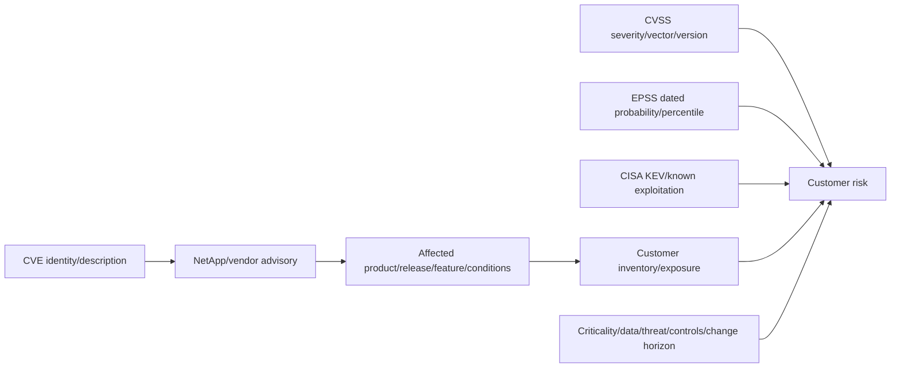

---

## 2. Security advisory anatomy

NetApp's public Security Advisory portal lists advisories with title, CVE, severity/CVSS, publication and update dates, and product filters. Individual advisories can contain status, impact, affected products, remediation, workarounds/mitigations, references, revision history, and support context. Exact fields vary.

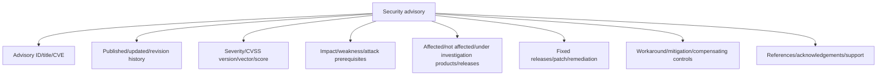

### Advisory reading order

1. Record advisory ID, CVE, URL, publication/update/retrieval date and source authority.
2. Read impact and attack prerequisites before the score.
3. Read affected/not-affected/under-investigation product and release tables precisely.
4. Identify required feature, configuration, protocol, privilege, network, authentication and user interaction.
5. Record fixed releases/patches and whether wording says “first fixed,” “not affected,” or another exact status.
6. Record workaround, mitigation, limitations, side effects, and whether no workaround exists.
7. Read revision history; a later update can change applicability/action.
8. Cross-check release notes/lifecycle/IMT/HWU/application support before recommending a target.

### Plain-English deep-dive: “under investigation” is a real state

If a vendor has not finished evaluating a product, the answer is not “affected” or “safe”; it is **unknown pending vendor update**. **Why it matters:** forcing binary dashboard values hides uncertainty. Unknown assets need an owner, interim controls, monitoring, and a review date.

---

## 3. Affected product, release, feature, configuration, and trigger

An asset is applicable only when the advisory's required conditions match the actual system. Product name alone is rarely enough.

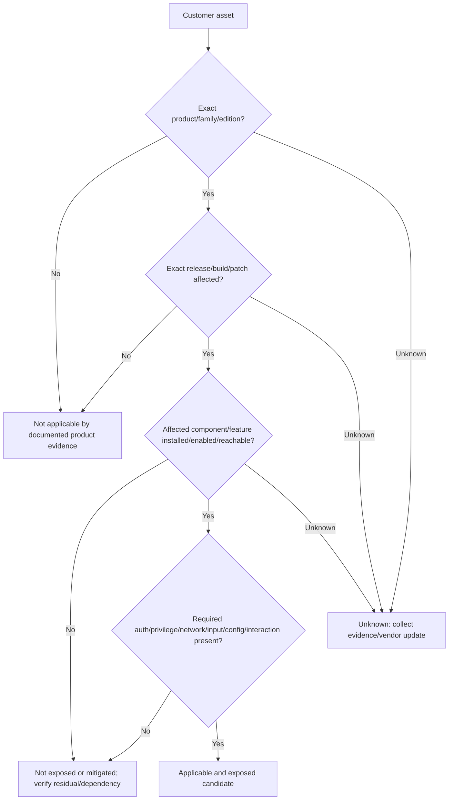

### Applicability fields

| Field | Example question |
|---|---|
| Product/family/SKU | ONTAP, System Manager, service, appliance, cloud offering, plug-in? |
| Release/build/patch | Exact running version and patch, not “9.x”? |
| Component/dependency | Bundled library, kernel, web service, third-party component present? |
| Feature/configuration | Enabled, licensed, initialized, bound, exposed, default changed? |
| Protocol/path | Management HTTPS, SSH, NAS, SAN, S3, peering, KMIP, agent? |
| Attacker position | Remote adjacent local authenticated privileged physical? |
| Trigger/input | Specific request, file, packet, action, workflow or user interaction? |
| Compensating control | Network block, service disabled, feature absent, auth/MFA, allowlist? |
| Evidence quality | Direct config/version, inventory, scan inference, owner statement, unknown? |

Do not infer applicability from the name of a vulnerable open-source component in an SBOM alone. Vendor integration, build options, code reachability, configuration and product advisory matter.

---

## 4. CVE, CVSS, EPSS, KEV, and threat intelligence

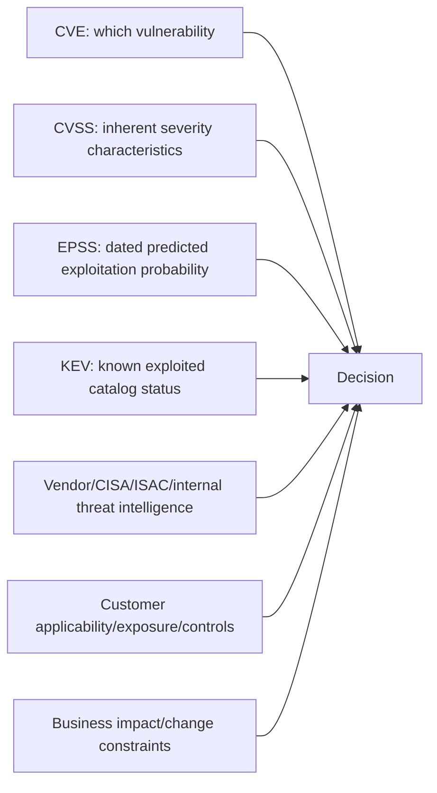

### Comparison

| Signal | Best use | Limitation |
|---|---|---|
| CVE | Common identity/reference | Record can change; no customer applicability |
| CVSS vector/score | Understand attack vector, complexity, privileges, interaction and CIA impact under its version | Severity, not likelihood/business risk |
| EPSS | Prioritize using dated statistical exploitation likelihood/rank | Model uncertainty/daily change; not proof or product exposure |
| CISA KEV | Escalate known-exploitation attention and applicable directives | Absence does not mean unexploited/safe |
| Public exploit/PoC | Understand feasibility/availability | PoC may be unreliable, weaponization/exposure differ |
| Vendor advisory | Product-specific applicability/remediation authority | Can be under investigation/revised |
| Customer telemetry | Detect reachability/attempts/compromise | Missing logs do not prove absence |

### CVSS vector, not score only

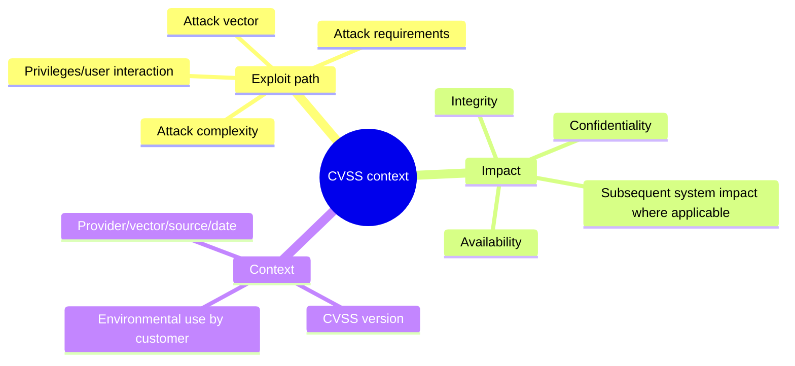

Never average CVSS and EPSS. They answer different questions and use different scales.

---

## 5. Severity versus customer risk

### Plain-English deep-dive: storm category versus your house

CVSS is like the strength of a storm. Customer risk also depends on whether the house lies in its path, has shutters, contains a hospital, and can evacuate safely. **Why it matters:** risk prioritization must preserve vendor severity while adding exposure, criticality, exploitation evidence, compensating controls, change urgency, and confidence.

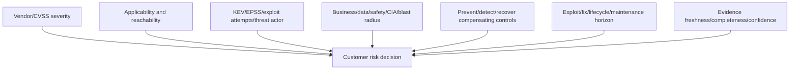

### Risk statement template

> **Because** asset `<identity>` runs `<exact affected release>` with `<feature/path/trigger>` exposed to `<attacker condition>`, exploitation could cause `<technical effect>` and `<business impact>`. `<KEV/EPSS/advisory/telemetry>` changes likelihood to `<bounded rationale>`. Existing `<controls>` reduce but do not remove `<residual risk>`. We recommend `<action>` by `<date/condition>`, owned by `<role>`, validated by `<proof>`. Confidence is `<level>` because `<evidence/gaps>`.

### Conceptual prioritization

Do not use an opaque formula as truth. A transparent qualitative model can consider:

$$
\text{Priority}=f(\text{applicability},\text{exposure},\text{exploitation},\text{impact},\text{controls},\text{urgency},\text{confidence})
$$

Any numeric scoring must document scales, weights, missing-data treatment, overrides and calibration. Critical business impact can override a low model score; “unknown” should not silently become zero.

---

## 6. Inventory and data quality

Vulnerability response fails when the organization cannot map advisories to exact assets.

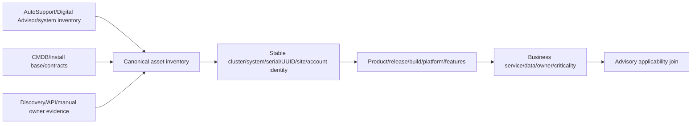

### Minimum asset schema

- Stable asset IDs: serial/system/cluster UUID and customer/site/account ownership.
- Product family/model/platform/edition and exact release/build/patch/firmware.
- SVM/services/features/protocols/licenses/config/exposure and management path.
- Business service/application/data classification/criticality/RPO/RTO.
- Network zone/internet/admin/tenant reachability and authentication controls.
- Support/lifecycle/contract/telemetry freshness/last validation.
- Change calendar/upgrade constraints/owner/technical contact.
- Evidence source, timestamp, confidence, missing fields and reconciliation status.

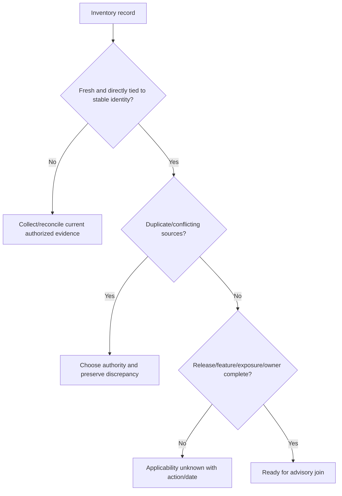

Scanner fingerprints and banners can be wrong or reflect inactive/bundled components. Keep direct product evidence and confidence.

---

## 7. SBOM orientation

A **software bill of materials (SBOM)** is a structured inventory of software components and relationships for a product/build. Formats such as SPDX and CycloneDX can support exchange. An SBOM improves component visibility; it is not a vulnerability verdict.

### Plain-English deep-dive: ingredient list, not allergy diagnosis

An ingredient list says a recipe contains peanuts. It does not say how much, whether they remain after processing, whether the diner is allergic, or whether the dish was eaten. **Why it matters:** an SBOM component/version match is a lead that must be connected to the shipped product build, vulnerable code/configuration/reachability, vendor advisory, and actual deployment.

```mermaid
flowchart LR
    SBOM[SBOM component/name/version/identifier/relationship] --> MATCH[CVE/component match]
    MATCH --> BUILD[Was this component in exact shipped build?]
    BUILD --> REACH[Is vulnerable code/feature reachable/configured?]
    REACH --> VENDOR[Vendor product advisory/status]
    VENDOR --> ASSET[Customer exact product/release/exposure]
    ASSET --> DEC[Applicable/mitigated/not applicable/unknown]
```

### SBOM quality questions

- Which product/build is represented, generated when, by whom, and with what completeness?
- Component name/version/package URL/CPE/hash/supplier and dependency relationship?
- Direct, transitive, bundled, forked, patched/backported, statically linked, optional or unused?
- Can vulnerability-exploitability exchange (VEX) or vendor status explain affected/not-affected reasoning?
- How are SBOM revisions tied to releases and vulnerability feeds?
- Who can access sensitive composition data and how is integrity/provenance protected?

Do not demand or disclose nonpublic SBOM data outside authorized channels. Use vendor advisories as product authority.

---

## 8. Applicability states and false positives

Use more than `open/closed`:

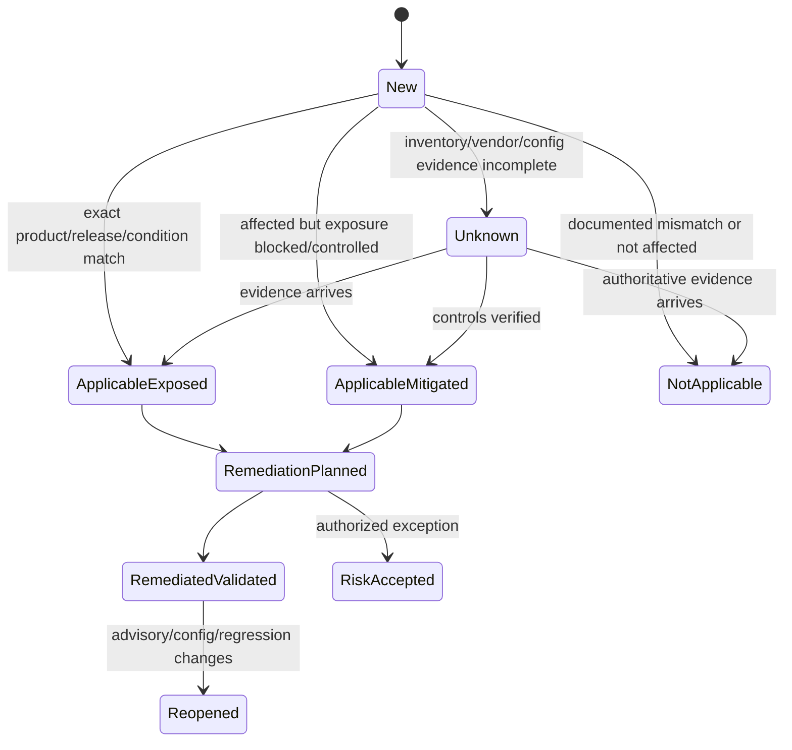

### False-positive patterns

| Pattern | Why wrong | Correct evidence |
|---|---|---|
| Scanner sees library name | Bundled code may be patched/not reachable/not used | Vendor advisory + exact build/component provenance |
| Product family matches | Release/edition/feature differs | Exact affected table and config |
| Port open | Service may not be vulnerable or trigger not reachable | Protocol/service version, auth and request path |
| CVE absent from scanner | Signatures/feed/inventory can miss it | Vendor advisories and direct inventory |
| Upgrade installed | Wrong target/failed node/partial config remains | All nodes/components version and functional tests |
| Workaround configured | Scope/side effects/drift unknown | Direct configuration and negative reachability test |

Not applicable requires reproducible evidence and a review trigger. “False positive” should not be shorthand for inconvenience.

---

## 9. Remediation, workaround, mitigation, and compensating control

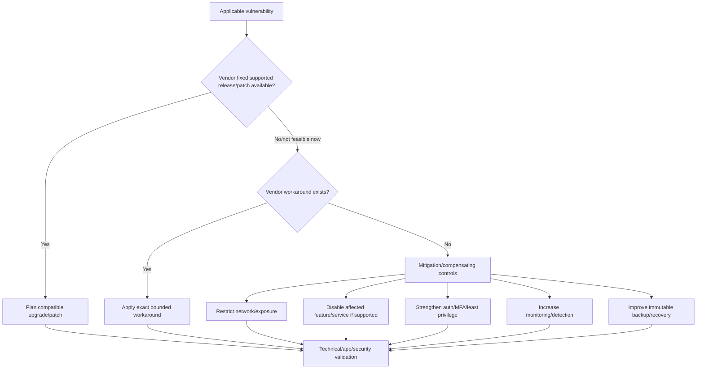

### Precise terms

| Term | Meaning | Caveat |
|---|---|---|
| Fixed release/patch | Vendor code correction in supported artifact | Must fit upgrade path/platform/ecosystem/application |
| Workaround | Vendor-documented alternative that avoids trigger | Can reduce functionality and may be temporary |
| Mitigation | Reduces likelihood/impact/exposure | Vulnerability remains |
| Compensating control | Alternative control meeting risk/control intent when primary control unavailable | Requires evidence and approval; not automatic compliance equivalence |
| Remediation | Removes/corrects vulnerability or affected condition | Must be verified, not inferred from change success |
| Risk acceptance | Authorized decision to retain residual risk for bounded time | Not “do nothing”; needs owner, rationale, expiry and monitoring |

Never invent a configuration workaround. If the advisory says no workaround, use only separately reviewed controls and state the vulnerability remains.

---

## 10. Fixed release and maintenance urgency

A fixed release is not automatically the right target. The target must be supported for hardware and every surrounding dependency and reachable through a supported upgrade path.

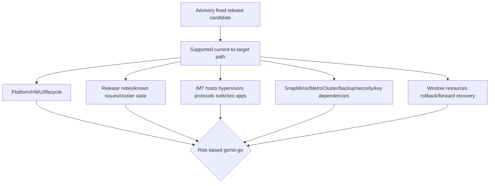

### Urgency dimensions

- KEV/verified active exploitation/credible threat targeting.
- Internet/management/tenant/local exposure and required privileges/interaction.
- Asset/business/safety/data criticality and blast radius.
- Ease of detection and strength of compensating controls.
- Fixed release availability, support/lifecycle, and change lead time.
- Change risk, current instability, blackout periods, and backout/forward recovery.
- Confidence and unknowns.

An emergency change can reduce cyber exposure while creating availability/data-protection risk. Use incident/change governance and compare “risk of changing now” with “risk of waiting.”

---

## 11. Validation after action

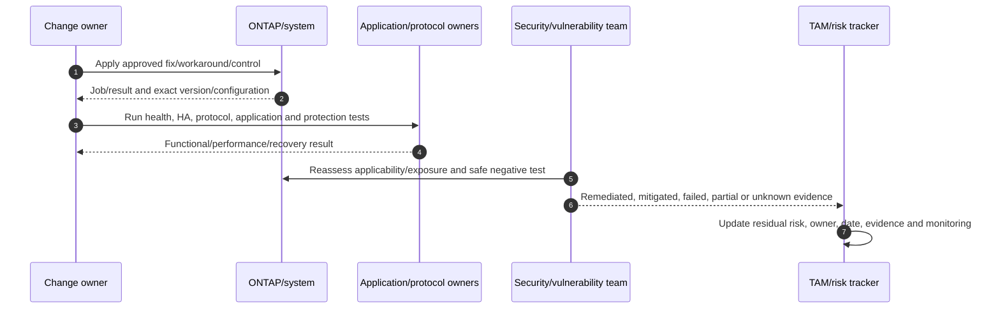

### Validation layers

1. Every intended node/component now has the exact fixed artifact/configuration.
2. Cluster/HA/storage/network/protocol/data-protection/key/security health passes.
3. Application transactions and SLOs pass.
4. The vulnerable feature/path/trigger is removed, fixed, or blocked as designed.
5. Audit/monitoring/scanning sees the new state without relying on one tool.
6. Backups/restore and rollback/forward recovery remain valid.
7. Residual exposure, exceptions, deferred assets, and new advisories are tracked.

“Change completed” is not “risk remediated.”

---

## 12. Exception and risk acceptance

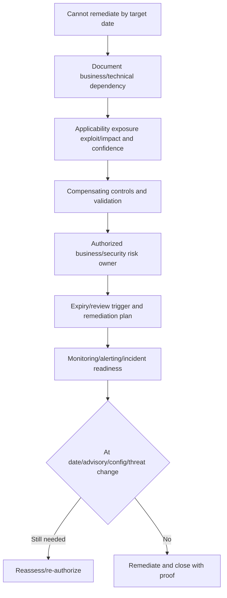

### Minimum exception record

- Asset/service/data/owner and stable IDs.
- Advisory/CVE/version/date and exact applicability/exposure.
- Business/technical reason remediation is blocked.
- Threat/exploitation/severity/impact and uncertainty.
- Compensating controls, evidence, owner and monitoring.
- Risk owner approval, start, expiry, review triggers.
- Planned fixed action/dependencies/milestones.
- Incident/backup/recovery readiness and residual risk.

Exceptions without expiry become invisible permanent exposure.

---

## 13. Communication for technical and executive audiences

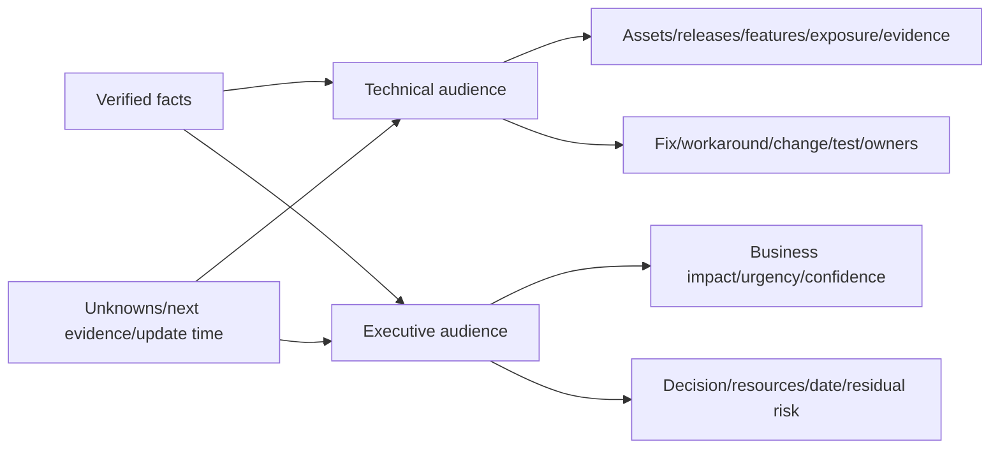

### Executive structure

1. **Bottom line:** what is affected and business significance.
2. **Current exposure:** reachable/mitigated/unknown and exploitation context.
3. **Action:** fixed release/control, owner, date and dependencies.
4. **Decision needed:** outage, funding, risk acceptance, executive escalation.
5. **Confidence/unknowns:** what could change the conclusion and next update.

### Customer-safe wording

- Say “NetApp's public advisory currently lists…” rather than “Engineering guarantees…”.
- Say “Our evidence indicates not exposed because…” rather than “not vulnerable” without product authority.
- Say “No evidence observed in the available logs through `<cutoff>`” rather than “not exploited.”
- Say “Mitigated; vulnerability remains pending fixed release” rather than “closed.”
- Say “Under investigation/unknown” when vendor or inventory evidence is incomplete.

Do not share internal bugs, customer names, nonpublic exploit details, or gated content outside authorization.

---

## 14. Compliance mapping: evidence, not certification

Frameworks organize outcomes/controls. A vulnerability ticket can provide evidence toward them, but one remediation does not prove organization-wide conformity or certification.

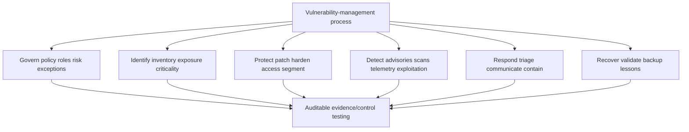

### Conceptual crosswalk

| Vulnerability activity | NIST CSF 2.0 orientation | CIS Controls v8.1 orientation | ISO/IEC 27001 ISMS orientation |
|---|---|---|---|
| Policy/RACI/risk criteria | Govern | Security program/governance | Risk-based ISMS governance |
| Asset/software/SBOM inventory | Identify | Asset/software inventory | Asset and risk context |
| Advisory/scanning/threat feeds | Identify/Detect | Continuous vulnerability management | Vulnerability/threat monitoring controls selected by risk |
| Patch/hardening/access controls | Protect | Secure configuration, access, patch safeguards | Risk-treatment controls/change management |
| Incident/exploitation response | Respond | Incident response | Incident-management process |
| Backup/validation/lessons | Recover | Data recovery | Continuity/improvement evidence |
| Exceptions/evidence/reviews | Govern | Governance/metrics | Risk acceptance, internal audit, continual improvement |

This is an interview-level conceptual mapping. Use licensed/current ISO text, current CIS safeguards, NIST informative references, the organization's statement of applicability/profile, auditors, and GRC owners for formal mapping.

---

## 15. Vulnerability-response operating loop

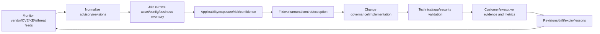

### Process metrics

- Advisory ingestion/update latency and subscription health.
- Inventory coverage/freshness/conflict/unknown rate.
- Applicable exposed/mitigated/unknown/not-applicable by criticality.
- KEV/actively exploited applicable assets and time to control/remediate.
- Mean/percentile age by risk, not only aggregate average.
- Exception count/age/expiry/overdue and control-test health.
- Remediation success/rollback/regression/partial failure.
- Reopen rate after advisory revision or drift.
- Restore/incident readiness for deferred high-risk assets.

Avoid vanity metrics such as “99% closed” when low-value findings dominate and one critical exposed asset remains.

---

## 16. Safe discovery and evidence

Conceptual read-only placeholders only; verify exact current commands/APIs, privilege, authorization, privacy, and Support procedure.

```text
CONCEPTUAL ONLY - not production commands
<system-version-family> show -fields <documented-release-build-patch-fields>
<system-platform-family> show -fields <documented-model-serial-hardware-fields>
<service-feature-family> show -fields <documented-enabled-config-exposure-fields>
<security-audit-family> show -fields <documented-access-change-event-fields>
<protection-health-family> show -fields <documented-snapshot-replica-backup-fields>
```

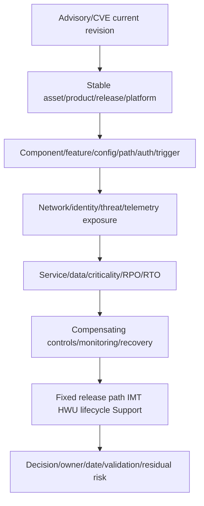

### Evidence hygiene

- Preserve advisory PDF/URL or exported record, revision/update/retrieval date and hash where policy requires.
- Record exact source and distinguish vendor, CVE/NVD, FIRST, CISA, scanner and customer evidence.
- Store raw inventory/config values with timestamps and stable IDs.
- Protect exploit details, customer topology, versions, logs, credentials and gated support data.
- Reproduce not-applicable/mitigated decisions and retain reviewer/expiry.
- Mark scan-only, owner-attested, stale, conflicting and unknown evidence.

---

## 17. Failure modes and troubleshooting decision tree

| Symptom | Candidate causes | Discriminating evidence |
|---|---|---|
| Scanner says affected; advisory says not affected | CPE/component false match, stale feed, wrong product/build | Vendor advisory and exact asset build/component |
| Advisory update changes status | Vendor investigation/revision | Revision history and reprocessed assets |
| Inventory has no matching asset | Stale/duplicate/retired/misowned identifiers | Serial/UUID/site/source reconciliation |
| Fixed release unavailable/unsupported | Platform/lifecycle/path/ecosystem constraint | HWU/IMT/release/lifecycle evidence |
| Workaround breaks service | Dependency/side effect/scope not tested | Before/after app/protocol/config evidence |
| Patch reports success but scan remains | Partial nodes, cache/signature, wrong detection, fix incomplete | Direct version/config plus scanner details |
| KEV absent, exploit seen | KEV is not exhaustive/instantaneous | Credible threat/telemetry/vendor evidence |
| EPSS low but asset high priority | Business impact/exposure/targeted threat | Customer context and expert override |
| Exception expires unnoticed | Ownership/workflow/alert failure | Exception register and review audit |
| “Compliant” after one fix | Framework scope/evidence/control testing incomplete | GRC/audit scope and full control set |

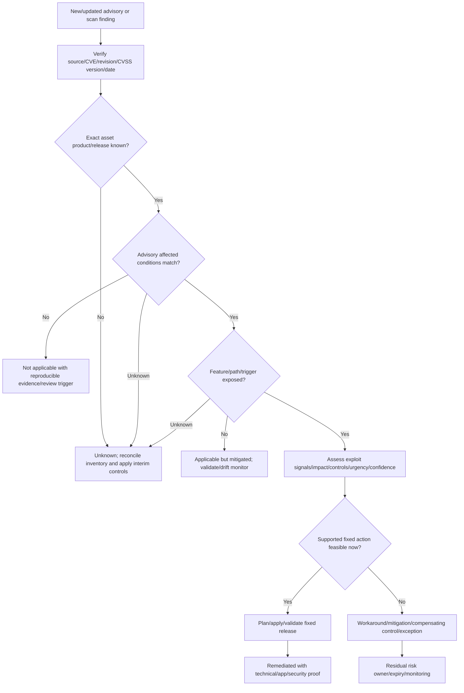

### Support boundaries

- Do not upgrade, patch, disable features, change exposure, run exploit code, or apply workarounds from this guide.
- Product/vendor/NetApp Support owns product-specific applicability and remediation authority.
- Security/vulnerability management owns feed, threat, scoring, scanning and governance.
- Storage/platform/application/network/change owners implement and validate.
- GRC/legal/risk owners govern mappings, obligations, exceptions and acceptance.
- TAM analysis joins evidence, challenges assumptions, communicates customer risk and tracks action without exposing nonpublic information.

---

## 18. TAM discovery, supportability, risk, and recommendations

### Discovery questions

1. Which advisories/CVEs, source/revision dates, CVSS versions/vectors, EPSS dates, KEV/exploitation and vendor statuses are in scope?
2. Which exact product/platform/release/build/patch/component/feature/configuration/trigger does each advisory require?
3. Which stable customer assets/business services/data/owners/criticality/RPO/RTO match, and how fresh/complete is evidence?
4. Which network/tenant/admin/local/physical attacker path, auth/privilege/user interaction and telemetry determine exposure?
5. Which preventative/detective/recovery controls reduce risk, and how were they tested?
6. Which fixed releases/patches/workarounds/mitigations are vendor-supported, and what limitations remain?
7. Which upgrade path/HWU/IMT/host/network/protocol/SnapMirror/MetroCluster/backup/key/app dependencies constrain action?
8. Which assets are applicable exposed, applicable mitigated, not applicable, unknown, remediated, or risk accepted—with confidence?
9. Which change, validation, rollback/forward recovery, communication, exception/expiry, and monitoring evidence exists?
10. Which NIST/CIS/ISO/GRC control outcomes are supported by this evidence, and which formal mapping/audit gaps remain?

### Recommendation model

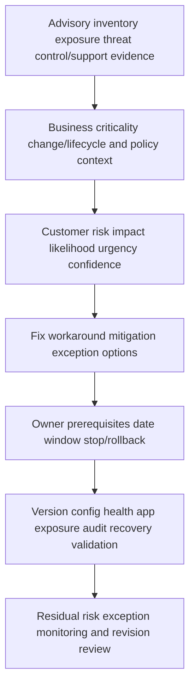

### Recommendation patterns

| Finding | Risk | Bounded recommendation | Validation |
|---|---|---|---|
| Critical CVSS but feature absent/disabled | Scanner-driven emergency change adds outage risk | Record applicable-product but non-exposed condition; monitor drift/advisory updates | Direct config plus negative reachability and peer review |
| Medium severity in KEV on internet-facing management | Active exploitation plus exposure raises customer priority | Restrict exposure immediately and apply supported fix on accelerated change path | External/internal path blocked and fixed version verified |
| Fixed ONTAP target conflicts with host/replication support | Security fix can create unsupported service | Compare supported target/path and bounded interim controls with specialists | IMT/HWU/release/app/DR tests |
| Product status under investigation | Binary decision would mislead | Mark unknown, apply proportionate interim controls, subscribe/review on date | Advisory revision and inventory reprocessing |
| Exception has no expiry/control test | Residual exposure becomes permanent/invisible | Obtain risk owner, expiry, controls, milestones and alerts | Control test and scheduled reassessment |

### JD Mapping

| JD responsibility | Part 42 contribution | Your factual bridge and gap |
|---|---|---|
| Generate/analyze/report customer data | Joins advisories, inventory, config, business and action evidence | Excel/Power BI/SQL/Python strength transfers |
| Strategic/upgrade advice | Converts fixed release into supported dependency-aware plan | Advisory/change experience transfers; ONTAP target unproven |
| Risk/stability | Separates severity/exposure/exploitation/impact/change risk | critical-situation discipline transfers |
| Supportability | Requires current vendor/IMT/HWU/lifecycle/release evidence | No internal NetApp result claimed |
| Remediation adoption | Defines owner/date/dependency/proof/exception/residual risk | Customer-review/action tracking strength |
| High-pressure communication | Gives verified/unknown/decision/update structure | Executive escalation experience transfers |
| Cross-functional execution | Coordinates security/storage/app/network/change/GRC/vendor | Product-group collaboration transfers |

---

## 19. Fully synthetic scenario: Woodgrove Financial advisory response

> **Synthetic case:** Woodgrove Financial, all assets, versions, identifiers, scores, exploit signals, timelines, and outcomes below are fictional. `CVE-2099-4242` and advisory `NTAP-SYNTH-2099-0042` are intentionally non-real placeholders. This is not NetApp/customer/internal evidence or a production recommendation.

### Advisory and estate

- Synthetic advisory: remote management-service vulnerability requiring a specific feature and authenticated low-privilege user.
- Synthetic severity: CVSS marked Critical by the fictional source.
- Synthetic EPSS: moderate and changing; not used as proof.
- Synthetic KEV status: listed after the initial triage.
- Estate: 40 clusters across three release families; seven internet-reachable management paths via a vendor gateway.
- Scanner reports all 40 affected based only on product family.
- Five clusters have the feature enabled; three have exact affected releases; two are under investigation due stale inventory.
- The first fixed release conflicts with one legacy host/replication combination pending IMT review.

```mermaid
flowchart TB
    ADV[Synthetic advisory/CVE] --> SCAN[Scanner flags 40 clusters]
    SCAN --> INV[Inventory/release/config join]
    INV --> F1[32 feature absent/not exposed]
    INV --> F2[3 affected and exposed]
    INV --> F3[3 release affected but feature blocked]
    INV --> F4[2 unknown stale inventory]
    F2 --> GATE[Vendor remote-access gateway]
    FIX[Fixed release candidate] --> COMPAT[IMT/host/replication constraint]
```

### Timeline

```mermaid
sequenceDiagram
    autonumber
    participant V as Vulnerability team
    participant T as TAM analyst
    participant S as Storage/app/network owners
    participant N as NetApp/vendor support sources
    participant E as Executives
    V->>T: Scanner marks 40 assets Critical
    T->>N: Retrieve current advisory/revision/fixed-release evidence
    T->>S: Request exact versions/features/exposure/business context
    S-->>T: Three exposed, three mitigated, two unknown, others mismatch
    V->>T: Synthetic CVE enters KEV after initial review
    T->>E: Escalate three exposed and two unknown; preserve scoped statuses
    S->>S: Restrict gateway path and plan supported fix/compatibility test
    T->>E: Validate remediation/controls and report residual exception
```

### Evidence and conclusions

| Evidence | Observation | Bounded conclusion |
|---|---|---|
| Scanner | Product-family signature flags 40 | Useful lead; overbroad applicability |
| Direct config | 32 lack/disable feature/path | Not exposed under current evidence; monitor drift |
| Exact release/feature | Three match and gateway exposes path | Applicable/exposed/high urgency |
| Network control | Three affected releases blocked from trigger path | Applicable/mitigated, not remediated |
| Inventory | Two records stale/conflicting | Unknown; cannot call safe |
| Synthetic KEV | Known exploitation signal added | Raises urgency for applicable/unknown assets |
| Compatibility | Fixed target unvalidated for one app stack | Change/supportability risk needs bounded interim control |

```mermaid
flowchart TD
    TOP[Three exposed three mitigated two unknown] --> NOW[Immediate: restrict gateway/least access/monitor]
    TOP --> VERIFY[Urgent: reconcile two unknown assets]
    TOP --> FIX[Plan fixed release for affected assets]
    FIX --> SUP[HWU/IMT/release/app/replication checks]
    SUP --> TEST[Lab/pilot/HA/protocol/app/DR/security validation]
    TEST --> ROLL[Phased production change]
    ROLL --> PROOF[Direct versions/config + exposure scan + app result]
    PROOF --> EXC[Time-bound exception for blocked asset if needed]
```

### Recommendations

1. Replace the 40-asset “Critical vulnerable” statement with six explicit states and evidence: 32 currently non-exposed by feature/path, three exposed, three mitigated, two unknown; retain advisory severity separately.
2. Immediately restrict the synthetic vendor-gateway path and strengthen access/monitoring for affected/unknown assets; the later KEV signal increases urgency but does not change not-applicable evidence by itself.
3. Reconcile the two unknown systems using stable identity and direct version/config evidence within an accelerated review window.
4. Validate the fixed target against HWU/IMT/release notes/host/protocol/replication/application dependencies, then pilot and phase the change with HA/DR/backup tests.
5. For any blocked asset, create a time-bound risk exception with validated controls, owner, expiry, milestones, incident/recovery readiness, and advisory-revision triggers.

### Executive summary

> "The scanner's Critical result applies severity to the whole product family, not customer exposure. Direct evidence identifies three exposed clusters, three affected but currently path-blocked clusters, two unknown due stale inventory, and 32 without the required feature/path. The synthetic CVE's new KEV status accelerates the exposed and unknown work. We are restricting the gateway now, reconciling unknowns, validating a supported fixed release across dependencies, and time-bounding any exception."

---

## 20. Your factual transfer and honest positioning

```mermaid
flowchart LR
    MS[enterprise support/escalation] --> ADV[Advisory/defect evidence and customer-safe updates]
    AZ[Azure/M365 administration] --> EXP[Identity network service exposure and compensating controls]
    BI[Excel Power BI SQL Python MBA] --> JOIN[Inventory joins risk aging dashboard QA]
    CRIT[Critical situation] --> URG[Urgency change risk decision communication]
    ADV --> VM[NetApp advisory conceptual method]
    EXP --> VM
    JOIN --> VM
    URG --> VM
    VM --> LAB[Future synthetic scrub/authorized tool/NetApp review]
```

> **Honest interview answer:** "I separate CVE identity, CVSS severity, EPSS probability, KEV exploitation evidence, vendor applicability and customer risk. I join the current NetApp advisory to exact asset/release/feature/exposure/business evidence, keep unknown as a real state, compare fixed release/workaround/controls, and validate the change and residual risk. My production experience is enterprise support and analytics, not NetApp advisory remediation or internal BURTs, so I use public current sources and authorized specialists."

---

## 21. Whiteboard drills, paper lab, and self-test

### Whiteboard drills

1. CVE -> vendor advisory -> affected conditions -> customer inventory -> risk.
2. CVE versus CVSS versus EPSS versus KEV.
3. Product -> release -> feature -> trigger -> exposure decision tree.
4. Severity + exposure + exploitation + impact + controls + confidence.
5. Source inventories -> stable identity -> exact config -> business owner.
6. SBOM -> component match -> build -> reachability -> vendor/product status.
7. New -> applicable/mitigated/not applicable/unknown -> remediated/exception.
8. Fix versus workaround versus mitigation versus compensating control.
9. Fixed target -> path/HWU/IMT/app/protection/change validation.
10. Technical versus executive communication.
11. NIST/CIS/ISO conceptual evidence crosswalk.
12. Monitor -> ingest -> join -> triage -> change -> validate -> review.

### Paper lab

A fictional estate has 1,500 assets, 14 product families, stale/duplicate inventory, NetApp advisories, CVE/NVD/CVSS/EPSS/KEV feeds, scanner results, partial SBOMs, 60 exceptions, mixed lifecycle/support, business criticality, network exposure, IMT/HWU dependencies, and inconsistent closure evidence.

Tasks:

1. Normalize advisory IDs/CVEs/revisions/CVSS version/vector/EPSS date/KEV/vendor status.
2. Reconcile serial/UUID/product/platform/release/site/account/service/owner inventories.
3. Build exact product/release/component/feature/config/trigger applicability rules.
4. Validate scanner/component/SBOM matches against vendor product evidence.
5. Classify each asset applicable exposed, applicable mitigated, not applicable, unknown, remediated, or accepted.
6. Prioritize by exploitation/exposure/impact/controls/urgency/confidence, with expert overrides.
7. Compare fixed release, workaround, mitigation and compensating-control options.
8. Validate target paths against HWU/IMT/lifecycle/host/network/protocol/app/protection/key dependencies.
9. Create change/pilot/rollback-forward/health/app/security/recovery validation plans.
10. Repair exceptions with risk owner, expiry, controls, milestones and monitoring.
11. Produce technical findings, executive summary and NIST/CIS/ISO conceptual evidence mapping.
12. Reprocess an advisory revision and measure reopen/data-quality behavior.

```mermaid
flowchart LR
    FEED[Normalize advisories/signals] --> DATA[Reconcile inventory]
    DATA --> APP[Apply exact applicability]
    APP --> PRI[Prioritize customer risk]
    PRI --> PLAN[Fix/control/exception plan]
    PLAN --> VAL[Validate change/exposure/app]
    VAL --> MAP[Report/map/review revisions]
```

### Lab pass checklist

- [ ] CVE, CVSS, EPSS, KEV, advisory, exposure and risk stay distinct.
- [ ] Advisory revision/source/retrieval dates are recorded.
- [ ] Exact product/release/component/feature/trigger conditions are applied.
- [ ] Inventory uses stable IDs, direct evidence, freshness and confidence.
- [ ] SBOM/scanner matches are leads, not automatic applicability.
- [ ] Unknown is explicit with owner/interim control/review date.
- [ ] Not-applicable and mitigated decisions are reproducible and drift-monitored.
- [ ] No workaround or fixed target is invented or chosen without support checks.
- [ ] Validation proves every component, service, application, exposure and recovery outcome.
- [ ] Exceptions are time-bound, owned, monitored and planned to close.
- [ ] Framework mapping is conceptual evidence, not compliance certification.
- [ ] No synthetic work is called production NetApp advisory experience.

### Self-test

1. Define vulnerability, CVE, CNA, advisory, CVSS, EPSS, KEV, exposure and risk.
2. Read advisory fields/revisions in the correct order.
3. Apply product/release/feature/config/trigger logic.
4. Compare CVSS/EPSS/KEV/vendor/telemetry uses and limits.
5. Build a customer risk statement with confidence/residual risk.
6. Design minimum asset/inventory/data-quality schema.
7. Explain SBOM/VEX/component/reachability/vendor-status orientation.
8. Use complete applicability states and challenge false positives.
9. Compare fix/patch/workaround/mitigation/compensating control/acceptance.
10. Evaluate fixed release and maintenance urgency with dependencies.
11. Validate remediation technically, functionally, securely and recoverably.
12. Govern exception/expiry/monitoring and customer communication.
13. Map vulnerability evidence conceptually to NIST/CIS/ISO.
14. Apply troubleshooting and source/evidence hygiene.
15. Recreate Woodgrove's scoped response and complete paper lab/Q1-Q8.
16. State your factual transfer and nonpublic/internal gap.

---

## 22. Official Source Anchors

**Date checked: 2026-08-24.** These public sources anchor vulnerability-response concepts. Advisory/CVE/CVSS/EPSS/KEV/status/fixed-release information can change after this date. Subscribe to updates and re-open sources at every decision; save the exact revision used.

| Topic | Official public source | Bounded use and currency note |
|---|---|---|
| NetApp advisories | [NetApp Security Advisories](https://security.netapp.com/advisory/) | Product/CVE/severity/published/updated filtering and current individual advisories |
| NetApp product security | [NetApp Product Security](https://security.netapp.com/) | PSIRT advisories, policy, bulletins, resources and reporting entry point |
| NetApp security policy | [NetApp Security Policy](https://security.netapp.com/policy/) | Public vulnerability-reporting/disclosure practices; not an internal-workflow claim |
| CVE | [CVE Program](https://www.cve.org/) | Unique public vulnerability identifiers/records/CNA process |
| NVD | [NIST National Vulnerability Database](https://nvd.nist.gov/vuln) | CVE enrichment/search/status; vendor advisory remains product authority |
| CVSS | [FIRST Common Vulnerability Scoring System](https://www.first.org/cvss/) | Current CVSS v4.0 standard, vector/score/severity and implementation guidance |
| EPSS | [FIRST Exploit Prediction Scoring System](https://www.first.org/epss/) | Daily 30-day exploitation probability/rank model and limitations |
| KEV | [CISA Known Exploited Vulnerabilities Catalog](https://www.cisa.gov/known-exploited-vulnerabilities-catalog) | Known exploitation catalog; URL/content may move, absence is not safety |
| Patch management | [NIST SP 800-40 Rev. 4](https://csrc.nist.gov/pubs/sp/800/40/r4/final) | Enterprise identification/prioritization/acquisition/install/verification planning |
| SSDF | [NIST SP 800-218](https://csrc.nist.gov/pubs/sp/800/218/final) | Secure development/supply-chain/vulnerability-response context |
| SBOM | [CISA SBOM resources](https://www.cisa.gov/sbom), [SPDX](https://spdx.dev/), [CycloneDX](https://cyclonedx.org/) | Component-transparency orientation and formats; not applicability verdict |
| NIST CSF | [NIST Cybersecurity Framework 2.0](https://www.nist.gov/cyberframework) | Govern/Identify/Protect/Detect/Respond/Recover outcomes and mappings |
| CIS | [CIS Critical Security Controls v8.1](https://www.cisecurity.org/controls) | Prioritized safeguards; use exact current safeguards/mappings for formal work |
| ISO | [ISO/IEC 27001:2022](https://www.iso.org/standard/27001) | ISMS risk/governance orientation; full standard/licensed audit scope required |
| NetApp supportability | [NetApp IMT](https://imt.netapp.com/), [Hardware Universe](https://hwu.netapp.com/), [NetApp Support](https://mysupport.netapp.com/) | Exact target ecosystem/platform/support/case evidence; potentially gated |

### Source-use discipline

- Save advisory/CVE/CVSS/EPSS/KEV/vendor status, source, vector/version, revision/retrieval date and update subscription.
- Prefer NetApp's current product-specific affected/fixed status over generic component inference.
- Record direct stable asset/config/exposure/business evidence and confidence.
- Never disclose nonpublic defects, exploit details, customer data/topology, credentials or gated evidence improperly.
- Treat scans/SBOM/EPSS as inputs; require vendor applicability and customer context.
- Reopen and reprocess when advisory, asset, config, threat, support or exception changes.

---

## Likely Interview Questions

### Q1. Compare CVE, CVSS, EPSS, and CISA KEV.

> **Model answer:** "CVE is the common vulnerability identifier/record. CVSS captures severity characteristics and a vector/score under a named version. EPSS is a daily statistical estimate of exploitation probability in the next 30 days. KEV records known exploitation under CISA criteria. None proves a NetApp asset is affected; I still need the current vendor advisory and exact product/release/feature/exposure evidence."

### Q2. How do you determine whether a NetApp advisory applies to a customer?

> **Model answer:** "I freeze the advisory revision/date, then match stable asset identity to exact product, platform, release/build/patch, component, enabled feature, configuration, protocol/path, attacker privileges/interaction and trigger. I classify applicable-exposed, applicable-mitigated, not applicable or unknown with reproducible evidence and confidence. Product-family scanner matches alone are insufficient."

### Q3. Why is CVSS severity not customer risk?

> **Model answer:** "CVSS describes inherent vulnerability severity. Customer risk adds applicability, exposure, KEV/EPSS/threat/telemetry, business/data/safety impact, blast radius, compensating controls, change horizon and evidence confidence. A critical disabled feature can be lower urgency than a medium known-exploited internet-facing management path. I preserve both severity and risk rather than overwrite one."

### Q4. How do SBOMs help vulnerability response, and what are their limits?

> **Model answer:** "An SBOM lists components/versions/relationships for a product build, enabling faster CVE matching. It does not prove vulnerable code shipped, is reachable, configured or affects the customer's release. I verify build provenance, patched/forked dependencies, VEX/vendor status, product advisory and actual deployment. SBOM data also needs integrity, revision and access controls."

### Q5. Compare a fix, workaround, mitigation, compensating control, and risk acceptance.

> **Model answer:** "A fix/patch corrects vendor code; a workaround avoids the trigger through a vendor-documented alternate; a mitigation reduces exposure/impact while the vulnerability remains; a compensating control meets risk/control intent through an alternative; risk acceptance authorizes bounded residual risk. Each needs owner, evidence, validation, limitations, expiry/review and a fixed-action plan."

### Q6. How do you choose and validate a fixed ONTAP release?

> **Model answer:** "I start with the advisory's current fixed status, then validate supported upgrade path, HWU/platform/lifecycle, release notes, IMT hosts/hypervisors/protocols/switches, SnapMirror/MetroCluster/backup/key/application dependencies and change risk. After implementation I verify every node/version, health/HA/protocol/app/protection and the vulnerable path, plus rollback/forward recovery and monitoring."

### Q7. How do you communicate an advisory when information is incomplete?

> **Model answer:** "I state verified affected assets/exposure and business impact, separate vendor severity from customer risk, label unknown products/assets explicitly, describe interim controls and what evidence is pending, name owners/dates/decision needs and give the next update time. I say 'no evidence in available logs through cutoff,' not 'not exploited,' and never invent nonpublic vendor conclusions."

### Q8. How does your background transfer, and what remains a gap?

> **Model answer:** "enterprise support/escalation gives me defect/advisory and customer-safe communication discipline; Azure/M365 gives exposure/control context; Excel/Power BI/SQL/Python supports inventory joins, QA and risk aging. I have not run production NetApp advisory scrubs or internal BURTs. I would use current public advisories, authorized tools/evidence and NetApp/security/application specialists."

---

## 30-Second Memory Hooks

- **CVE:** Which public vulnerability.
- **CVSS:** How severe by standardized characteristics.
- **EPSS:** Dated probability estimate, not proof.
- **KEV:** Known exploited under CISA criteria; absence is not safety.
- **Advisory:** Vendor product applicability and action, revised over time.
- **Applicability:** Product + release + feature + configuration + trigger.
- **Exposure:** Can the required attacker path reach it?
- **Risk:** Severity + exposure + exploitation + business + controls + confidence.
- **Unknown:** A managed state with owner, interim control and review date.
- **SBOM:** Ingredient list, not allergy diagnosis.
- **False positive:** Reproducible mismatch, not an inconvenient alert.
- **Fix:** Correct code/artifact.
- **Workaround:** Avoid trigger by documented alternate.
- **Mitigation:** Reduce risk; vulnerability remains.
- **Compensating control:** Alternative control with evidence/approval.
- **Risk acceptance:** Time-bound authorized residual risk, not neglect.
- **Fixed release:** Must survive path/HWU/IMT/app/protection checks.
- **Validation:** Version + health + app + exposure + recovery proof.
- **Compliance mapping:** Evidence toward outcomes, not certification.
- **Your bridge:** Advisory/analytics rigor transfers; internal NetApp conclusions do not.

---

## Completion Checklist

- [ ] Define CVE/CNA/advisory/CVSS/EPSS/KEV/exploitability/exposure/risk.
- [ ] Capture advisory anatomy, revisions, dates, affected/status/action fields.
- [ ] Apply exact product/release/component/feature/config/trigger logic.
- [ ] Preserve CVSS severity while assessing customer risk and confidence.
- [ ] Build stable, fresh, reconciled asset/business/config inventory.
- [ ] Use SBOM/scanners as leads and vendor advisories as product authority.
- [ ] Use applicable-exposed/mitigated/not-applicable/unknown/remediated/accepted states.
- [ ] Prove false positives and monitor drift/revision triggers.
- [ ] Compare fixed release/patch/workaround/mitigation/compensating control/acceptance precisely.
- [ ] Validate target support through path/HWU/IMT/lifecycle/app/protection/key dependencies.
- [ ] Balance maintenance urgency against change risk with explicit decision authority.
- [ ] Validate every node/config/health/app/exposure/audit/recovery outcome.
- [ ] Govern exceptions with owner, expiry, controls, plan and monitoring.
- [ ] Communicate verified/unknown/decision/next-update information safely.
- [ ] Map evidence conceptually to NIST/CIS/ISO without certification claims.
- [ ] Recreate Woodgrove, complete paper lab, answer Q1-Q8, state your boundary, and recheck sources.

---

*Next suggested section:* [Part 43 - ONTAP Performance Architecture and Counter Interpretation](Part-43-ontap-performance-counters.md)