# Part 43 - ONTAP Performance Architecture and Counter Interpretation

> **Section goal:** Learn how to trace one client request from application to media, choose the correct ONTAP object and metric scope, interpret operations, bytes, latency, utilization, queues, cache, CPU, consistency-point, RAID and network evidence, and challenge a dashboard without inventing causality. By the end, Arti should be able to build an aligned evidence timeline, cross-check it with storage math and Little's Law, rank competing hypotheses, and write a bounded performance recommendation.

Covers index item **43** and maps directly to job-description responsibilities for customer-data generation and analysis, storage expertise, risk mitigation, solution stability, proactive recommendations, operational service reviews, escalation quality, and technical representation of findings.

**Version caveat:** Exact ONTAP performance objects, REST resources, metric availability, read/write/other/total fields, counter names, units, sampling intervals, retention, rollups, histograms, service-center detail, System Manager views, Digital Advisor views, Unified Manager behavior, commands, thresholds, and limits vary by ONTAP release, platform, protocol, feature, and collection tool. Current public REST documentation confirms performance metrics for selected ONTAP objects and protocols in the broad categories **IOPS, latency, and throughput**; it does not make every category or operation split available for every object. Re-open the exact cluster's REST API reference, current performance documentation, release notes, IMT/HWU where relevant, and tool documentation before using a field or conclusion.

A **current-doc check** means reopening those exact release-, object-, protocol-, and tool-specific sources at the time of analysis rather than relying on this guide or remembered behavior.

This Part deliberately gives no universal healthy latency, utilization, queue-depth, CPU, cache-hit, consistency-point, disk-busy, IOPS, or throughput threshold. It gives no production tuning command and no internal counter-name list. Every number below is synthetic teaching data. Replace placeholders only with documented fields from the exact release and authorized customer source.

> **No-production-NetApp boundary:** Arti does not claim production ONTAP performance-analysis or tuning experience. Every customer, workload, counter, dashboard, trace, calculation, test, bottleneck, and result below is synthetic. Her factual strengths are Microsoft enterprise support, CRITSIT ownership, Azure/M365 networking and data-service troubleshooting, an MBA in Business Analytics, and Excel, Power BI, SQL, Python, statistics, evidence correlation, and customer reviews. The explicit non-claim is: **she has not collected or interpreted production ONTAP performance archives, used customer Active IQ/Unified Manager performance data, diagnosed WAFL/CP/cache/disk service centers, changed ONTAP QoS or performance settings, or proved a NetApp customer bottleneck.**

---

## 1. Performance begins with a service request, not a storage graph

**Performance** describes how a system responds to work over time. A customer usually experiences a transaction, file operation, block I/O, or object request. ONTAP observes only the portion that reaches its protocol and storage objects.

### Plain-English deep-dive: a meal's elapsed time versus the kitchen's time

A customer measures the time from ordering to receiving a meal. The kitchen measures preparation after the ticket arrives. The pantry measures ingredient retrieval. A slow meal can come from ordering, queueing, cooking, pantry access, payment, or delivery. **Why it matters:** client latency and ONTAP latency have different start/end points. A healthy ONTAP number cannot clear DNS, authentication, the host, network, application locks, or work that never reached ONTAP.

| Term | Plain meaning | Analogy | Why it matters |
|---|---|---|---|
| **Request** | One defined operation submitted by a consumer | One order ticket | Counts need operation type and scope |
| **Workload** | Pattern of requests over time | Lunch-rush order mix | Names such as `database` do not define behavior |
| **Service-level objective (SLO)** | Measurable target for customer service behavior | Meals delivered within an agreed time | Resource metrics should support a service outcome |
| **Black-box evidence** | Observation from the consumer's outside view | Diner's stopwatch | Best evidence of user-visible symptom |
| **White-box evidence** | Internal counters, logs, and states | Kitchen timers and station queues | Helps locate mechanism but can miss end-to-end impact |
| **Bottleneck** | Resource limiting end-to-end throughput or response for this workload | Narrowest active station | Busy is not necessarily limiting |

```mermaid
flowchart LR
    USER[User or business transaction] --> APP[Application/database/file system]
    APP --> HOST[Host OS/cache/queue/multipath]
    HOST --> NET[Ethernet/FC network or fabric]
    NET --> PROTO[ONTAP protocol endpoint/LIF/target port]
    PROTO --> SVM[SVM/protocol service]
    SVM --> OBJ[Volume/LUN/file/qtree/namespace workload]
    OBJ --> WAFL[WAFL/cache/consistency point]
    WAFL --> LT[Local tier/RAID]
    LT --> MEDIA[SSD/HDD or tiered-object path]
    MEDIA --> RESP[Response returns through every layer]
```

### First scoping statement

> At `<UTC interval>`, `<users/hosts>` performing `<exact operation>` against `<service/object>` observed `<latency/throughput/error symptom>` relative to `<comparable baseline/SLO>`. The request path and clocks are `<confidence>`. ONTAP evidence covers `<defined portion>`; `<unobserved portions>` remain open.

---

## 2. Client-to-media latency path

**Latency** is elapsed time between named start and finish points. End-to-end latency can be decomposed conceptually, but only directly measured components should be reported as measured.

$$
T_{application}=T_{app}+T_{host}+T_{network}+T_{protocol}+T_{ONTAP}+T_{return}
$$

An ONTAP-facing response can itself be reasoned about as:

$$
T_{ONTAP}=T_{queue}+T_{service}+T_{downstream}+T_{coordination}
$$

The second equation is a reasoning model. A tool may not expose each term independently.

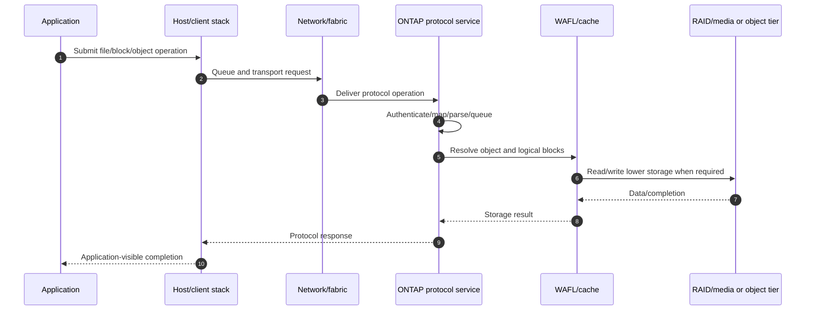

### Service-center model

A **service center** is a conceptual processing station such as protocol, network, CPU, cache, WAFL, RAID, media, or object tier. It helps ask where time or constrained capacity could accumulate. Do not claim a named internal service-center counter unless the exact current tool documents it.

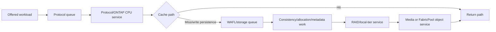

### Completion boundaries

| Boundary | What it supports | What it does not prove |
|---|---|---|
| Application completion | User/app-observed result | Which lower layer consumed time |
| Host I/O completion | Host-observed device/file result | ONTAP internal service split |
| TCP/FC transport progress | Bytes/frames delivered under transport | Storage operation or durability |
| ONTAP protocol completion | Server-side operation completed under protocol semantics | External application transaction success |
| Protected write intent | Accepted write intent protected under exact ONTAP state | Consistency point completed or backup exists |
| Consistency point | Coherent WAFL state written | Database checkpoint or business commit |

---

## 3. ONTAP object hierarchy and metric scope

A performance metric is meaningful only when tied to a stable object, operation population, direction, interval, and unit.

### Plain-English deep-dive: city, district, building, room, and occupant

Cluster metrics describe the city. Node metrics describe one district's resources. SVM metrics describe a tenant service. Volume and LUN metrics describe logical containers. Port metrics describe a doorway. Local-tier and disk metrics describe lower infrastructure. **Why it matters:** a citywide average can hide one overloaded room, while one busy doorway can serve several unrelated occupants.

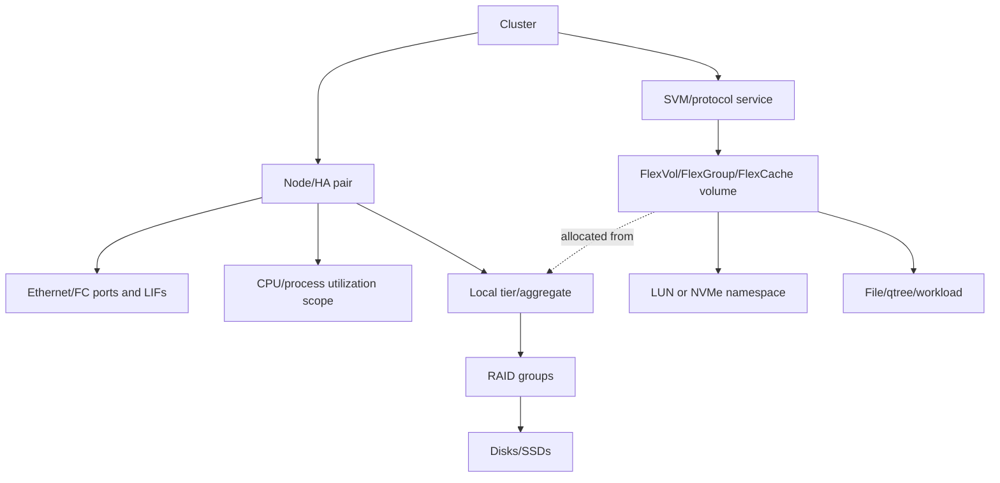

### Object-scope map

| Scope | Useful question | Frequent mistake |
|---|---|---|
| Workload/application | Which transactions and SLO fail? | Treating an app label as an I/O fingerprint |
| SVM/protocol | Is NFS/SMB/FCP/iSCSI/NVMe demand or latency concentrated? | Blaming one volume from aggregate protocol data |
| Volume/FlexGroup/FlexCache | Which logical data container serves work? | Treating it as dedicated hardware |
| LUN/namespace | Which host block workload is affected? | Ignoring host MPIO/filesystem/database ownership |
| LIF/FC/Ethernet port | Which network endpoint/path carries bytes? | Calling high port use a storage bottleneck |
| Node | Which compute/cache/protocol resources are shared? | Using node average to clear one process/core hotspot |
| Local tier/aggregate | Which protected pool serves several volumes? | Assigning one volume as cause from shared latency |
| Disk/SSD | Which media member is busy/erroring? | Ignoring RAID, cache, and workload mapping |
| Cache/WAFL/CP | How do hit/miss, dirty work, metadata, and persistence interact? | Treating activity as a fault without customer impact |

### Current public REST orientation

Current public ONTAP REST documentation describes performance data for selected storage objects/protocols using **IOPS, latency, and throughput**, with read/write/other/total availability depending on the object and release. Examples in that public matrix include cluster, volume, aggregate/local-tier, LUN, NVMe namespace, SVM protocol, Ethernet/FC port, IP/FC interface, qtree statistics, FlexCache volume, and node process-utilization scopes. Always use the exact cluster API reference because availability and schema differ.

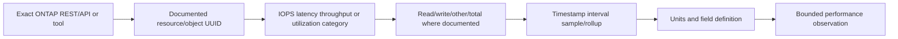

---

## 4. Operations, bytes, latency, utilization, queue, and service time

### Core measurement vocabulary

| Metric | Definition | Required scope |
|---|---|---|
| **IOPS** | Completed input/output operations per second | Object, operation population, interval |
| **Throughput** | Bytes transferred per second | Payload/wire scope, direction, units |
| **Latency/response time** | Time per operation between defined points | Start/end, success/error, distribution |
| **Utilization** | Fraction of named resource capacity/time used | Resource, denominator, interval |
| **Queue depth** | Outstanding/waiting work in a named queue | Queue owner and aggregation |
| **Service time** | Active processing time at a named resource/model | Direct measurement or model assumption |
| **Wait time** | Time before active service/dependency completion | Queue/blocking scope |
| **Concurrency** | Requests active/outstanding at once | Client, workload, path, or object |

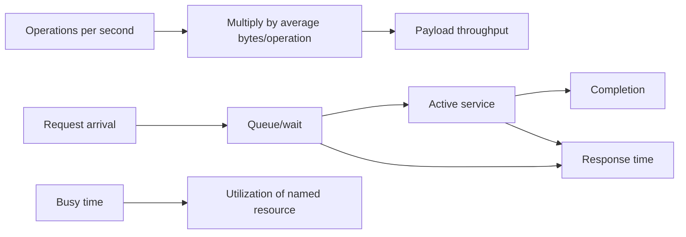

### Worked calculation: IOPS to throughput

A synthetic workload completes 20,000 operations/s at exactly 16 KiB each:

$$
20{,}000\times16\ \text{KiB/s}=320{,}000\ \text{KiB/s}=312.5\ \text{MiB/s}
$$

If 70% are 8 KiB reads and 30% are 32 KiB writes, average size is:

$$
\bar{s}=0.70(8)+0.30(32)=15.2\ \text{KiB}
$$

At 20,000 IOPS:

$$
20{,}000\times15.2\ \text{KiB/s}=296.875\ \text{MiB/s}
$$

The calculation does not include protocol headers, retries, cache behavior, compression, deduplication, parity, metadata, or internal amplification.

### Utilization caveat

For a deliberately simple single-server model with arrival rate $\lambda$ and mean service time $S$:

$$
\rho=\lambda S
$$

If $\lambda=4{,}000$ operations/s and $S=0.2$ ms:

$$
\rho=4{,}000\times0.0002=0.8=80\%
$$

ONTAP is not one M/M/1 server. Parallel resources, caches, batching, priorities, operation classes, and changing service times make this an intuition only.

---

## 5. Counter type: rate, gauge, cumulative, average, and ratio

### Plain-English deep-dive: odometer, speedometer, waiting-room count, and report-card average

An odometer accumulates distance; a speedometer shows a current rate; a waiting-room display shows a gauge; a report card averages a period. Subtracting two speedometer readings is meaningless, while treating an odometer total as a rate is also wrong. **Why it matters:** counter type determines calculation, reset handling, aggregation, and missing-data treatment.

| Counter type | Meaning | Correct handling | Failure mode |
|---|---|---|---|
| Cumulative counter | Total since reset/start | Use deltas over elapsed time | Reset/rollover creates false negative/spike |
| Rate | Work per unit time already calculated | Preserve interval/denominator | Re-derive without knowing rollup |
| Gauge | Current/last sampled state | Aggregate according to question | Average hides peak or state transition |
| Average | Weighted or unweighted mean over a population | Preserve count/weight | Average of averages can be wrong |
| Ratio/percentage | Numerator divided by denominator | Store both raw parts | Ratio changes because denominator changes |
| Histogram/percentile | Distribution summary | Preserve bins/count/method | Percentiles cannot normally be averaged |

### Rate from cumulative values

If a documented cumulative operation counter moves from 1,200,000 to 1,680,000 over 60 seconds:

$$
\text{rate}=\frac{1{,}680{,}000-1{,}200{,}000}{60}=8{,}000\ \text{operations/s}
$$

If the counter reset between samples, this result is invalid. Record uptime/reset identity and reject the interval or apply the documented rollover method.

### Weighted latency aggregation

Two intervals have 1,000 operations at 2 ms and 9,000 operations at 8 ms. The operation-weighted mean is:

$$
\bar{T}=\frac{(1{,}000\times2)+(9{,}000\times8)}{10{,}000}=7.4\ \text{ms}
$$

The unweighted average of interval means is 5 ms and is wrong for the combined operation population.

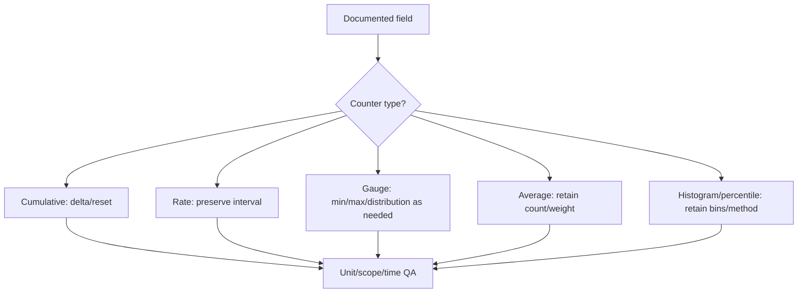

---

## 6. Averages, percentiles, tails, and error populations

An **average** summarizes all observations. A **percentile** reports a value below which a stated fraction falls. The **tail** is the slow end of the distribution. Track successful and failed/timeout operations separately because a fast failure can make the combined average look better.

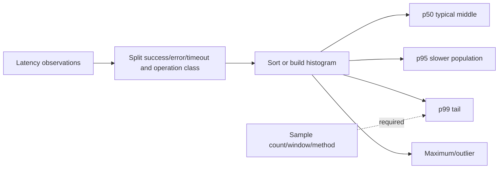

### Worked tail example

Suppose 9,900 requests take 2 ms and 100 take 500 ms:

$$
\bar{T}=\frac{9{,}900(2)+100(500)}{10{,}000}=6.98\ \text{ms}
$$

The average looks modest while 1% of requests take 500 ms. Depending on the percentile definition, p99 lies at the boundary of that slow population. Preserve the actual histogram/algorithm rather than invent a percentile from an average.

### ONTAP/tool boundary

Do not claim ONTAP exposes p95/p99 for a given object merely because another tool shows a percentile. Record whether the source is the client, host, application, ONTAP REST, System Manager, Unified Manager, Digital Advisor, a performance archive, or a derived warehouse. Name the method and sample population.

### Aggregation rules

- Do not average p99 values across nodes or time windows.
- Do not mix reads, writes, and metadata operations when their service paths differ.
- Do not exclude timeouts silently; report them as errors and bounded latency.
- Do not compare a one-minute peak with a one-hour average.
- Do not compare a warm-cache interval with a cold/recall interval without labeling it.

---

## 7. Little's Law as a counter cross-check

For a stable system and the same operation population:

$$
L=\lambda W
$$

where $L$ is average outstanding work, $\lambda$ is completion/arrival rate, and $W$ is average time in the measured system.

### Plain-English deep-dive: customers inside a shop

If a shop completes 120 customers per minute and each spends half a minute inside, about 60 customers are inside on average. **Why it matters:** IOPS and latency imply outstanding work. A mismatch can expose unit, scope, sampling, or non-steady-state errors before it becomes a bottleneck claim.

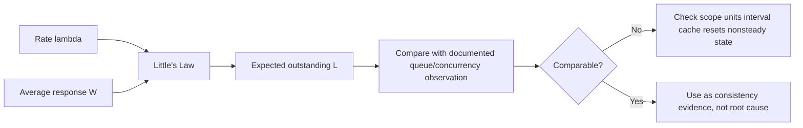

### Worked cross-check

At 12,000 IOPS and 4 ms average response:

$$
L=12{,}000\times0.004=48\ \text{outstanding operations}
$$

At the same 12,000 IOPS and 15 ms:

$$
L=12{,}000\times0.015=180
$$

If the host reports about 185 comparable outstanding requests, the values broadly reconcile. If ONTAP reports 40, possible explanations include different measurement boundaries, queue ownership, cache hits, operation classes, sampling windows, or host wait outside ONTAP.

### Queue/service inference

If response time $W$ and a trustworthy same-scope service time $S$ are documented:

$$
W_q=W-S
$$

With 7 ms response and 2 ms service:

$$
W_q=5\ \text{ms}
$$

Do not manufacture service time by subtracting unrelated host and ONTAP averages.

---

## 8. Sampling, intervals, aggregation, retention, and missing data

**Sampling** observes a metric at selected times or summarizes events within windows. **Aggregation** combines observations. A dashboard often shows rolled-up data rather than every operation.

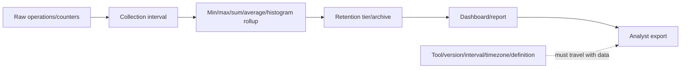

### Sampling risks

| Risk | Example | Control |
|---|---|---|
| Aliasing | Periodic burst occurs between periodic samples | Higher resolution/event-driven comparison |
| Rollup loss | Five-second saturation disappears in hourly mean | Preserve peak/distribution or raw interval |
| Mixed interval | CPU one minute, latency five minutes | Align or state uncertainty |
| Retention change | Old high-resolution data is gone | Record archive tier and cutoff |
| Collector gap | Missing points appear as zero | Use null/quality flag, never impute silently |
| Object move/rename | Name joins old/new object incorrectly | Stable UUID plus effective timestamps |
| Counter reset | Negative delta or false burst | Uptime/reset/sequence QA |

### Missing-data decision tree

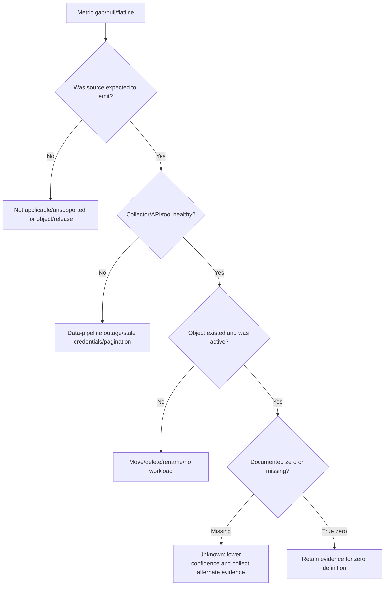

### Data-quality fields

Every exported row should carry: stable object ID, object type, cluster/node/SVM lineage, source/tool/version, field definition, unit, interval start/end, raw timestamp/time zone, collection time, rollup method, sample count where available, null/reset/estimated flag, and data cutoff.

---

## 9. Clock alignment and time zones

Performance correlation can fail when an application logs local time, ONTAP reports UTC, a switch uses another zone, and one host clock steps during the incident.

```mermaid
sequenceDiagram
    autonumber
    participant A as Application log UTC+local zone
    participant H as Host trace clock +18 ms
    participant O as ONTAP metrics UTC
    participant N as Network 60-second buckets
    participant C as Correlation workbook
    A->>C: Raw transaction time/ID
    H->>C: Raw I/O time and measured clock offset
    O->>C: Object interval start/end UTC
    N->>C: Bucket and device clock status
    C->>C: Preserve raw values; normalize separately
    C->>C: Record uncertainty/precision before ordering events
```

### Alignment rules

1. Preserve raw timestamps and source time zones.
2. Record NTP/time source, offset, step/slew, resolution, and collection delay.
3. Normalize a separate UTC value without overwriting raw evidence.
4. Use request IDs, job IDs, protocol IDs, or deliberate marker events where possible.
5. Respect interval precision: a one-minute bucket cannot prove ordering within one millisecond.
6. Record daylight-saving and ambiguous local-time behavior.
7. Treat clock uncertainty as part of confidence, not as a cosmetic cleanup.

### Worked alignment

If a host timestamp is known to run 120 ms ahead of UTC:

$$
t_{UTC}=t_{host}-0.120\ \text{s}
$$

If the offset is only known within $\pm40$ ms, two events 30 ms apart cannot be ordered confidently.

---

## 10. Cache, working set, and locality

ONTAP and the surrounding stack can contain application, database, host, controller, and media caches. A cache hit shortens the lower path; a miss reaches additional resources.

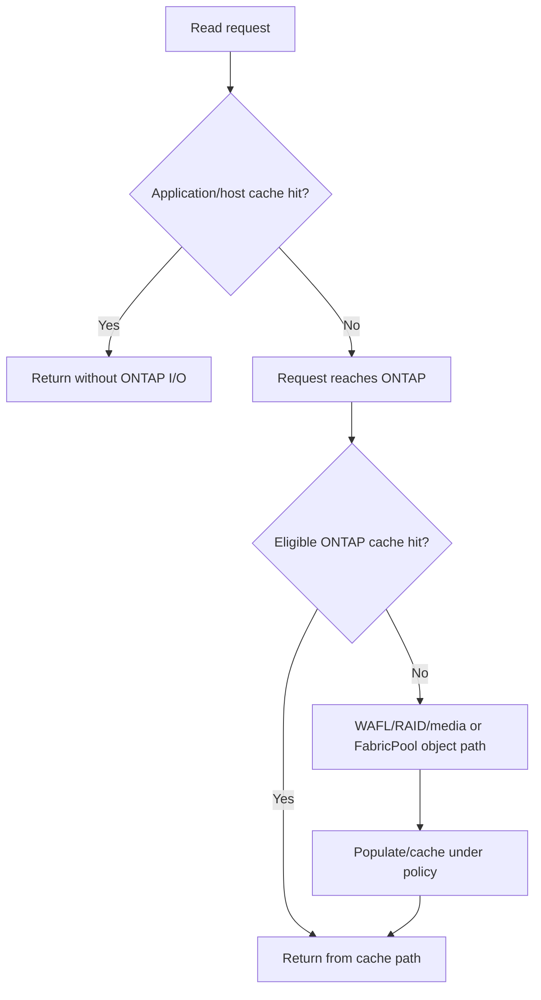

### Hit/miss weighted latency

If 80% of eligible reads hit a 0.3 ms path and 20% miss to a 6 ms path:

$$
T_{avg}=0.8(0.3)+0.2(6)=1.44\ \text{ms}
$$

At 95% hits:

$$
T_{avg}=0.95(0.3)+0.05(6)=0.585\ \text{ms}
$$

Misses can still dominate the tail. A cache-hit ratio needs eligible operation count, read class, working set, time, and hit/miss latency.

### Cache interactions

- Working-set growth can increase misses and lower-tier load abruptly.
- Sequential reads can trigger read-ahead/prefetch behavior; random reads may not.
- Host/app caches can reduce ONTAP IOPS, so lower ONTAP traffic can reflect successful caching rather than reduced business demand.
- Backup/scans can evict useful data or create lower-value reads.
- FabricPool cold reads add object/network service and can trigger recall/promotion under current policy.
- A high cache-hit ratio does not clear CPU, protocol, metadata, network, write, or application-lock bottlenecks.

---

## 11. Writes, consistency points, RAID, and local-tier interactions

Writes can be acknowledged after protected write intent under exact ONTAP/protocol state, while dirty WAFL data is later made coherent on protected storage through a consistency point (CP). Client request shape and lower physical work are not one-to-one.

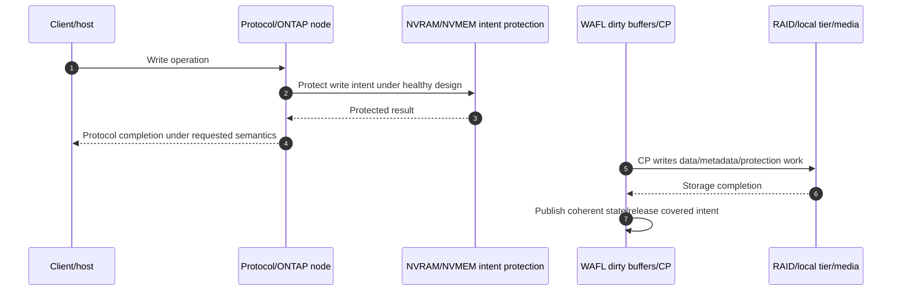

### CP interpretation

CP frequency/duration can change because of offered writes, metadata, allocation, Snapshot/change behavior, capacity pressure, RAID/media service, efficiency work, failover, or other conditions. It can participate in foreground latency, respond to workload, or merely correlate with both.

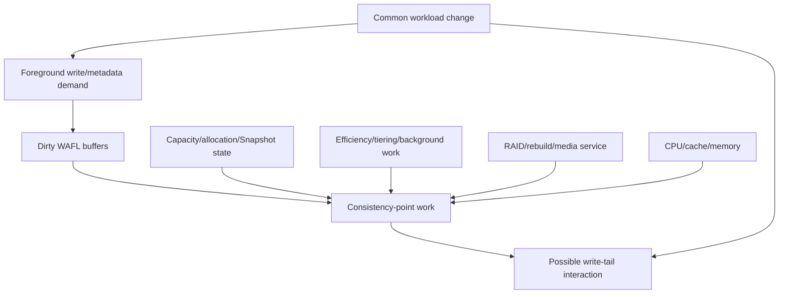

### RAID/local-tier/media interpretation

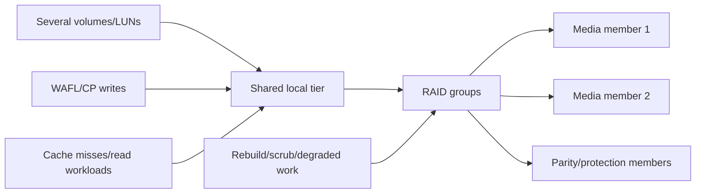

### Evidence questions

- Did foreground latency rise before, with, or after CP/local-tier service?
- Did workload IOPS, size, write mix, metadata, or concurrency change first?
- Is the local tier shared by another volume, rebuild, move, backup, scan, or tiering operation?
- Are one or several media members/path states anomalous?
- Does capacity/Snapshot growth alter allocation/headroom?
- Is node CPU/cache or a protocol path already constrained?

Do not force CP, change RAID behavior, delete Snapshots, or move a volume based on one correlation.

---

## 12. CPU, process utilization, and shared resources

CPU supports protocols, WAFL, checksums, compression/deduplication, encryption, networking, HA, replication, and management. A node average can hide one process, core, or service class, and high CPU can be a result of healthy increased demand.

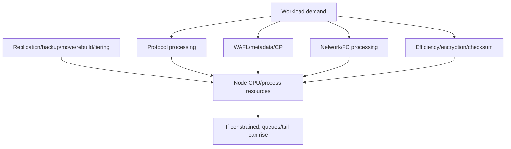

### CPU interpretation checklist

- Node average, process/service utilization, core distribution, and interval.
- Offered IOPS/bytes/metadata/sessions and operation size/mix.
- Protocol, efficiency, encryption, replication, rebuild, move, tiering, and management changes.
- Throughput plateau and queue/latency response as demand increases.
- Partner failure-state load during takeover.
- Comparison to a same-workload baseline, not a generic percentage.

**Bottleneck test:** a resource is a plausible bottleneck when demand reaches its effective service capacity, queue/wait grows, end-to-end output stops improving or errors appear, and a safe discriminating change/test alters the outcome as predicted.

---

## 13. Network, protocol, and path interactions

NAS and SAN use different control state even when they share Ethernet. FC has its own credit-based fabric. Performance attribution must preserve protocol boundaries.

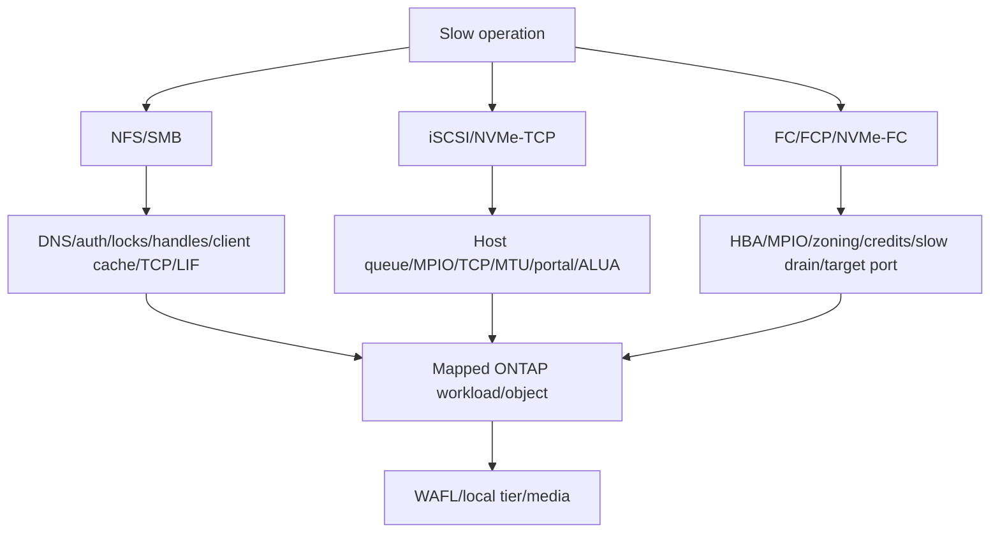

### Protocol evidence table

| Protocol | Client/host evidence | ONTAP evidence | Network/fabric evidence |
|---|---|---|---|
| NFS | Operation/status, mount, cache, locks, filehandle | SVM protocol/workload/volume | TCP RTT/loss/MTU/LIF/path |
| SMB | Command/status/credits/channels/leases/FileId | SMB/SVM/workload/volume | TCP, Multichannel paths, DNS/AD |
| iSCSI | SCSI command, host queue, MPIO/ALUA | iSCSI SVM/LUN/target LIF | TCP, VLAN, MTU, loss, portal |
| FC/FCP | SCSI, HBA queue, MPIO/ALUA | FCP SVM/LUN/target port | Credits, slow drain, CRC, ISL |
| NVMe | Queue/command/ANA/namespace | NVMe SVM/namespace/target | FC-NVMe or TCP path evidence |

### Network throughput cross-check

A 10 Gbit/s link has an ideal decimal byte rate:

$$
\frac{10\ \text{Gbit/s}}{8}=1.25\ \text{GB/s}
$$

Actual payload is lower after headers, acknowledgments, control traffic, loss/retries, hashing, other flows, and endpoint limits. A 500 MiB/s workload does not clear the network: microbursts, one LAG member, packet loss, latency, or one direction can still matter.

---

## 14. Correlation, causation, and the hypothesis tree

### Plain-English deep-dive: umbrellas and rain

Umbrellas and wet roads rise together because rain causes both. Umbrellas do not wet roads. Application demand can similarly raise CPU, IOPS, CP work, local-tier latency, and network throughput together. **Why it matters:** matching graphs identify a common interval; a causal conclusion needs mechanism, ordering, scope, and a discriminating check.

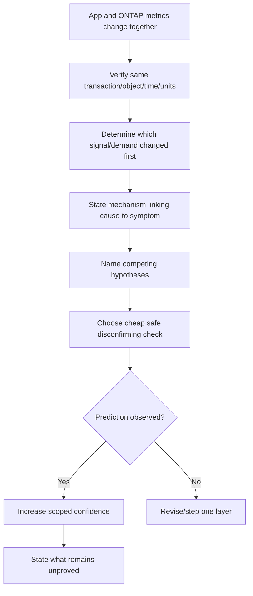

### General performance hypothesis tree

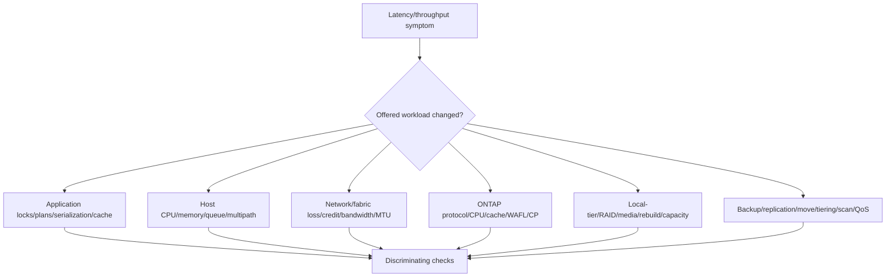

### Causality evidence ladder

| Level | Evidence | Safe wording |
|---:|---|---|
| 0 | One graph is high | Observation only |
| 1 | Two metrics align | Correlated candidate |
| 2 | Stable identity/time and plausible mechanism | Supported hypothesis |
| 3 | Alternative checks weaken competitors | Leading mechanism |
| 4 | Controlled change produces predicted effect and repeats | Strong scoped causal evidence |
| 5 | Product/app specialist confirms defect/mechanism | Root cause within defined scope |

---

## 15. Dashboard evidence, missing context, and honest visualization

A dashboard should connect black-box customer outcome to white-box resource evidence while preserving object, interval, unit, and uncertainty.

```mermaid
flowchart TB
    SLO[Application SLO/transaction] --> TRAFFIC[Traffic: IOPS/bytes/sessions]
    SLO --> LAT[Latency distribution/errors]
    TRAFFIC --> RES[CPU/cache/network/local tier/media]
    LAT --> RES
    RES --> CHG[Changes/background jobs/failures]
    CHG --> HYP[Hypotheses and evidence links]
    HYP --> ACTION[Owner/date/test/residual risk]
```

### Dashboard quality checklist

- Data cutoff, timezone, refresh time, source, cluster/release, and RBAC scope.
- Application/service SLO plus transaction count/errors/timeouts.
- Workload IOPS, throughput, operation size/mix, concurrency, and clients.
- p50/p95/p99 only where the source actually provides/derives them correctly.
- Volume/LUN/SVM/node/LIF/port/local-tier/media object filters using stable IDs.
- CPU/cache/CP/RAID/network/protocol/background context.
- Missing/stale/estimated/reset annotations.
- Change/backup/move/rebuild/tiering/snapshot/incident overlays.
- Evidence links and narrative separating observation, hypothesis, and recommendation.

### Misleading patterns

| Dashboard pattern | Why it misleads | Better view |
|---|---|---|
| Cluster average only | Hides one workload/node/tail | Drill by service/object/client and distribution |
| Dual axes without scale clarity | Creates visual correlation | Separate panels/aligned timestamps/units |
| Red threshold copied globally | Ignores workload/SLO/version | Customer-derived target/current docs |
| Smoothed line only | Hides bursts | Raw/high-resolution plus rollup |
| Missing as zero | Creates false idle period | Null/quality band and pipeline alert |
| Percentile average | Invalid combined distribution | Merge raw/histograms or show separate populations |

---

## 16. Discovery, evidence, risk, recommendations, and JD Mapping

### Discovery questions

1. Which business service, transaction, users/hosts, SLO, RPO/RTO, peak, and complaint define success?
2. Which application/database/filesystem, protocol, client/initiator, network/fabric, SVM/LIF/target, volume/LUN/file/qtree, node, local tier, RAID and media serve it?
3. What are read/write/other mix, I/O size distribution, randomness, concurrency, locality, working set, metadata, burst, seasonality, and foreground/background work?
4. Which sources expose IOPS, throughput, latency, errors, utilization, queue, cache, CPU, CP, RAID/media, and protocol evidence, with what exact definitions?
5. Are object IDs, sampling intervals, timestamps/time zones, resets, nulls, rollups, and retention comparable?
6. What baseline, change, backup, Snapshot, replication, move, rebuild, tiering, failover, or QoS event overlaps?
7. Does Little's Law reconcile same-scope rate, latency, and outstanding work?
8. Which competing app, host, network, protocol, ONTAP CPU/cache/WAFL, local-tier/media, and background hypotheses remain?
9. What is the cheapest safe check that can disconfirm the leading hypothesis without altering production state?
10. Which current docs, REST schema, IMT/HWU, application guidance, Support evidence, owners, and access gaps govern the conclusion?

### Minimum evidence pack

- Business transaction/SLO, exact symptom, scope, UTC interval, baseline, and change timeline.
- Application, host, protocol, network/fabric, SVM/LIF/target, volume/LUN/workload, node/local-tier/RAID/media topology with stable IDs.
- Raw IOPS/throughput/latency/error/concurrency/queue/cache/CPU/CP/local-tier/media metrics with definitions, units, intervals, counts, resets and missing-data flags.
- Client/host/network/protocol logs/traces and ONTAP EMS/jobs/performance archive evidence.
- Workload fingerprint and foreground/background operations.
- Little's Law/throughput/weighted-average cross-checks and contradictions.
- Exact current API/tool/release documentation, collection query, RBAC scope, data cutoff, privacy handling, and unknowns.
- Competing hypotheses, checks, actions tried, result, exact specialist ask, and decision deadline.

### Recommendation model

```mermaid
flowchart TD
    E[Verified SLO workload object metric and timeline evidence] --> C[Business criticality baseline change/support context]
    C --> R[Risk: impact likelihood horizon confidence]
    R --> O[App host network placement QoS/capacity/change options]
    O --> A[Specific owner prerequisites date and stop/rollback]
    A --> V[Controlled test, app outcome and counter validation]
    V --> RR[Residual risk monitoring and review trigger]
```

### Recommendation examples

| Finding | Risk | Bounded recommendation | Validation |
|---|---|---|---|
| App p99 rises while ONTAP average is flat | Tail/upper layer may be hidden | Collect aligned transaction/host/ONTAP distributions and errors | Same transaction IDs and p99/error outcome |
| One LUN's outstanding work rises with same IOPS | Queueing/latency increased | Separate host wait, path, target service and background work before tuning | Little's Law plus per-path/app test |
| Cache hit falls after working-set growth | Lower tier demand and tail may rise | Quantify hit/miss populations; compare supported placement/capacity options | App p99, miss load and cost |
| CP/local-tier latency rises during Snapshot-heavy batch | Workload, capacity and CP interact | Vary one approved overlap factor and inspect headroom/device/CPU | Repeatable app/CP/local-tier response |
| Dashboard gap is displayed as zero | Risk/reporting conclusions are false | Repair collection and label unknown; backfill only from authoritative data | Count/time reconciliation and pipeline alert |

### JD Mapping

| JD responsibility | Part 43 contribution | Arti's factual bridge and gap |
|---|---|---|
| Generate/analyze/report customer data | Object-aware metrics, QA, math, timelines, dashboards | MBA/Excel/Power BI/SQL/Python transfer strongly; no ONTAP production archive claim |
| Storage depth | Client-to-media ONTAP/WAFL/cache/CP/RAID/counter architecture | Conceptual/synthetic only |
| Understand customer environment | Connects app, host, network, protocol, ONTAP and media | Microsoft systems thinking transfers |
| Mitigate risk/stability | Distinguishes tails, saturation, missing data and false causality | CRITSIT evidence discipline transfers |
| Tailored recommendations | Uses evidence/context/risk/options/owner/test/residual risk | Advisory and customer-review strengths |
| Service reviews | Converts metrics into SLO, trend, risk and decisions | Business-review experience transfers |
| Escalation | Produces exact scoped counter/topology/timeline package | Product/Engineering collaboration transfers; NetApp specialist validation remains needed |

---

## 17. Fully synthetic scenario: Meridian Claims month-end latency

> **Synthetic case:** Meridian Claims, all systems, counters, intervals, thresholds, identities, and results below are fictional. It is not a NetApp benchmark, customer telemetry, tuning recommendation, or Arti's production work.

### Environment

- A claims database uses two LUNs: data and log.
- Four FC paths traverse two fabrics to one ONTAP HA pair.
- The LUNs reside in separate FlexVol volumes on one local tier.
- A NAS reporting workload shares the same node/local tier.
- Snapshots and SnapMirror updates begin near month-end close.
- The business SLO is synthetic p99 claim-commit latency below 300 ms.

```mermaid
flowchart TB
    USERS[Claims users] --> APP[Claims application]
    APP --> DB[Database data/log]
    DB --> HOST[Host MPIO/FC]
    HOST --> FABA[Fabric A]
    HOST --> FABB[Fabric B]
    FABA --> LUNS[Data/log LUNs]
    FABB --> LUNS
    LUNS --> VOLS[Two FlexVols]
    VOLS --> LT[Shared local tier]
    NAS[NAS reporting] --> LT
    SNAP[Snapshots] --> VOLS
    SM[SnapMirror update] --> LT
```

### Synthetic observations

| Metric | Baseline | Month-end | Scope |
|---|---:|---:|---|
| Claim transactions/s | 2,000 | 2,900 | Application |
| App p50 | 90 ms | 105 ms | Application |
| App p99 | 220 ms | 1,050 ms | Application |
| Host write IOPS | 14,000 | 23,000 | Both LUNs |
| Host average write response | 2.5 ms | 8 ms | Host device |
| Host average outstanding | 35 | 205 | Host device |
| ONTAP LUN write latency | 2.0 ms | 5.5 ms | Synthetic mapped LUN scope |
| ONTAP LUN IOPS | 14,000 | 23,000 | Synthetic mapped LUN scope |
| Node CPU average | 46% | 76% | Node interval average |
| Cache-hit orientation | 92% | 70% | Synthetic eligible read population |
| Local-tier latency | 1.4 ms | 4.2 ms | Shared lower scope |
| FC physical errors | No new delta | No new delta | Both fabrics |

### Little's Law

Baseline:

$$
L=14{,}000\times0.0025=35
$$

Month-end:

$$
L=23{,}000\times0.008=184
$$

The host reports 205, so the values are close enough to prompt a scope/window reconciliation rather than a claim of counter corruption. The difference can reflect nonsteady bursts, operation mix, or host queues not represented by the average latency.

### Timeline

```mermaid
sequenceDiagram
    autonumber
    participant A as Application
    participant H as Host/FC
    participant O as ONTAP LUN/node
    participant L as Local tier
    participant B as Background jobs
    A->>A: Month-end concurrency rises at 22:00 UTC
    H->>O: Write IOPS/outstanding rise
    B->>L: Snapshot and replication work overlap at 22:05
    O->>L: LUN and local-tier latency rise
    A->>A: p99 breaches SLO; p50 changes modestly
    Note over A,B: Demand leads, but app, host, CPU, cache, CP and shared-tier mechanisms remain open
```

### Competing hypotheses

| Hypothesis | Supporting evidence | Cheap disconfirming check |
|---|---|---|
| Database lock/checkpoint drives app tail | App p99 far exceeds host/ONTAP latency | Correlate database waits and transaction IDs |
| Increased concurrency creates host/storage queueing | IOPS and outstanding rise; Little's Law broadly reconciles | Controlled concurrency sweep in test/approved replay |
| Snapshot/replication overlap adds shared-tier work | Background begins before lower-tier rise | Compare equivalent month-end slice without one overlap in a safe test |
| Cache working-set transition raises lower reads | Hit orientation falls and lower-tier service rises | Segment hit/miss operation populations and active set |
| Node CPU subresource constrains service | Average rises to 76% | Inspect documented process/core/service evidence; average alone insufficient |
| FC path fault | Host waits rise | No physical-error delta; inspect credits/paths and one-command timing |

### Hypothesis tree

```mermaid
flowchart TD
    TOP[Claims p99 1050 ms] --> DB{Database wait/lock/checkpoint?}
    DB --> HOST{Host queue/MPIO/CPU?}
    HOST --> NET{FC credit/path issue?}
    NET --> ONT{ONTAP protocol/CPU/cache/CP?}
    ONT --> LT{Shared local tier/media/capacity?}
    LT --> BG{Snapshot/SnapMirror/NAS overlap?}
    DB --> TEST[Correlate transaction-to-command and vary one safe factor]
    HOST --> TEST
    NET --> TEST
    ONT --> TEST
    LT --> TEST
    BG --> TEST
```

### Risk and recommendations

| Priority | Recommendation | Owner | Validation | Residual risk |
|---:|---|---|---|---|
| 1 | Correlate claim transaction IDs to DB waits, host writes and ONTAP LUN intervals | App/DB/performance owners | One aligned timeline explains p99 components | Instrumentation may miss internal app work |
| 2 | Reproduce representative concurrency/working-set levels in an authorized test | App/host/storage owners | Throughput-latency-error curve and Little's Law | Production month-end can differ |
| 3 | Test Snapshot/replication overlap as one controlled variable; do not reschedule solely from correlation | Protection/storage owners | App p99 and background completion/RPO remain acceptable | Future jobs can overlap differently |
| 4 | Reconcile node CPU process scope, cache hit/miss, CP/local-tier and media evidence with current docs | NetApp/performance owner | Active service mechanism strengthened or rejected | Some internal detail can require Support |
| 5 | Build a month-end dashboard with raw gaps, object IDs, distributions, changes and evidence links | TAM analyst/service owner | Two cycles produce reproducible review evidence | Baseline ages after workload/config changes |

### Customer-facing summary

> "The month-end p99 breach is real. Demand and outstanding work rise first; host and ONTAP latency then increase, while Snapshot/replication overlap, cache behavior, node CPU and the shared local tier are plausible contributors. The database tail is much larger than the storage average, so storage alone is not a complete cause. We recommend a transaction-aligned analysis and controlled one-factor tests before any ONTAP, QoS, scheduling, or placement change."

---

## 18. Arti's analytics, MBA, and Microsoft 365 transfer

```mermaid
flowchart LR
    M365[M365/SharePoint/OneDrive support] --> SCOPE[User operation/dependency and sync evidence]
    CRIT[CRITSIT ownership] --> TIME[Timeline/impact/hypothesis/communication]
    MBA[MBA Business Analytics] --> MODEL[Segmentation/uncertainty/decision framing]
    BI[Excel Power BI SQL Python] --> DATA[QA/joins/distributions/dashboards]
    SCOPE --> ONTAP[ONTAP performance synthetic method]
    TIME --> ONTAP
    MODEL --> ONTAP
    DATA --> ONTAP
    ONTAP --> GAP[Authorized ONTAP tools/lab/SME practice still required]
```

### Transfer and honest gap

| Factual strength | Transfer to Part 43 | Honest gap |
|---|---|---|
| M365 latency/sync/permissions cases | Scope exact user operation and cross-layer dependencies | Does not provide ONTAP object/counter semantics |
| CRITSIT/Product engagement | Align clocks, preserve evidence, rank hypotheses, communicate | No NetApp performance Support workflow claimed |
| MBA/statistics | Weighted averages, distributions, seasonality, uncertainty | No production storage baseline ownership |
| Excel/Power BI/SQL/Python | Clean joins, dashboards, missing-data QA, reproducible math | No customer REST/performance archive access claimed |

### Honest interview answer

> "I start performance analysis with the customer transaction and SLO, then map the exact host, protocol, ONTAP workload object, node, local tier and media path. I verify counter definitions, units, intervals, clocks and missing data; use IOPS-throughput math and Little's Law as cross-checks; and separate correlation from causation with competing hypotheses and safe tests. My production evidence is Microsoft support and analytics, not ONTAP tuning, so I would use current REST/tool documentation, authorized telemetry and NetApp specialists for a real conclusion."

---

## 19. Labs, whiteboard drills, and self-test

### Lab safety boundary

Use synthetic CSV/JSON, paper diagrams, a legitimately authorized lab, or sanitized documented samples. Do not run load, traces, diagnostic commands, QoS changes, Snapshot changes, cache/CP operations, or production experiments from this chapter. Read-only collection still needs authorization, privacy controls, rate limits, and a data-retention plan.

### Lab 1: counter dictionary

Create a table with:

- Source/tool/version/release.
- Resource endpoint/object and stable UUID.
- Metric field/category and counter type.
- Unit, direction, numerator/denominator and operation population.
- Collection/rollup interval, sample count and retention.
- Reset/null/missing behavior.
- What the metric can and cannot prove.

### Lab 2: synthetic service path

Build one NAS and one SAN path and add application, host, network, SVM protocol, LIF/target, volume/LUN, node CPU/cache/CP, local tier/RAID/media and background work. Assign one owner and one evidence source to each stage.

### Lab 3: worked analytics

1. Calculate throughput from read/write IOPS and size distributions.
2. Calculate weighted mean latency from operation counts.
3. Build a latency histogram and derive p50/p95/p99 by a stated method.
4. Apply Little's Law to stable intervals and flag mismatches.
5. Insert a counter reset, collector gap, object move and timezone offset; show QA flags.
6. Compare one-minute, five-minute and hourly aggregation for the same burst.

### Lab 4: hypothesis exercise

Inject synthetic app lock, host queue, FC credit wait, TCP loss, cache transition, CPU saturation, CP/local-tier pressure, rebuild, Snapshot/SnapMirror overlap, and FabricPool cold recall. For each, state prediction, disconfirming evidence, safe test, owner, and residual risk.

```mermaid
flowchart LR
    DICT[Build counter dictionary] --> MAP[Map client-to-media objects]
    MAP --> QA[Inject units/time/reset/missing-data defects]
    QA --> MATH[Throughput/weighted average/Little's Law]
    MATH --> HYP[Competing hypotheses]
    HYP --> TEST[Design safe discriminating tests]
    TEST --> REC[Write TAM recommendation and customer summary]
```

### Lab pass checklist

- [ ] At least one black-box application metric anchors the symptom.
- [ ] Every ONTAP metric has object, field definition, unit, interval and source.
- [ ] REST/tool availability is verified for the exact release/object.
- [ ] Cumulative, rate, gauge, average, ratio and percentile data stay distinct.
- [ ] Weighted averages retain counts; percentiles are not averaged.
- [ ] Little's Law uses same scope and stable interval.
- [ ] Cache, CPU, CP, RAID, network and protocol evidence are contextual, not automatic causes.
- [ ] Missing data remains unknown and clock uncertainty remains visible.
- [ ] At least three competing hypotheses survive the first review.
- [ ] Recommendation includes risk, options, owner, safe test and residual risk.
- [ ] No synthetic work is called production ONTAP analysis.

### Self-test

1. Draw and explain the complete client-to-media request/response path.
2. Define request, workload, SLO, black-box, white-box and bottleneck.
3. Distinguish application, host, ONTAP protocol and storage completion boundaries.
4. Map cluster/node/SVM/protocol/LIF/port/volume/LUN/local-tier/disk/cache/CPU scopes.
5. Define IOPS, throughput, latency, utilization, queue depth, service time, wait and concurrency.
6. Calculate throughput from mixed I/O sizes with correct units.
7. Classify cumulative/rate/gauge/average/ratio/histogram counters.
8. Calculate a weighted latency average and explain why average-of-averages fails.
9. Explain p50/p95/p99/tail/max/error populations and aggregation limits.
10. Apply Little's Law and diagnose a mismatch without naming root cause.
11. Explain sampling, aliasing, rollups, retention, resets and missing data.
12. Normalize clocks while preserving raw timestamps and uncertainty.
13. Explain cache hit/miss, working set, locality and tail behavior.
14. Explain write intent, CP, RAID/local-tier interactions and causal caveats.
15. Explain node CPU evidence without using a universal threshold.
16. Compare NFS/SMB/iSCSI/FC/NVMe path evidence.
17. Build a causality ladder and a six-branch hypothesis tree.
18. Audit a dashboard for misleading averages, axes, gaps and stale data.
19. Recreate Meridian's calculations and recommendations.
20. Deliver Arti's transfer/gap answer and Q1-Q8 aloud.

---

## 20. Official Source Anchors

**Date checked: 2026-08-24.** These public sources anchor the architecture, metrics, statistics, timing, and monitoring concepts. Exact ONTAP fields, resource coverage, releases, dashboards, counter internals, sampling, retention, and tuning remain version/tool/configuration sensitive. Re-open the exact cluster's REST API reference and current product/tool documentation before customer use.

| Topic | Official or credible public source | Bounded use and currency note |
|---|---|---|
| ONTAP performance workflow | [ONTAP performance administration workflow](https://docs.netapp.com/us-en/ontap/performance-admin/identify-resolve-issues-workflow-task.html) | Current workflow/navigation; exact commands and views vary by release |
| REST performance metrics | [Access performance metrics with the ONTAP REST API](https://docs.netapp.com/us-en/ontap-automation/rest/performance_metrics.html) | Official IOPS/latency/throughput categories and object/release matrix; use live API reference |
| REST API reference | [ONTAP REST API reference](https://docs.netapp.com/us-en/ontap-restapi/) | Exact current resources, fields, units, availability, pagination and errors |
| Performance monitoring | [ONTAP event, performance, and health monitoring](https://docs.netapp.com/us-en/ontap/event-performance-monitoring/) | Current System Manager/CLI/Unified Manager/Digital Advisor navigation |
| QoS concepts | [ONTAP QoS throughput guarantees](https://docs.netapp.com/us-en/ontap/performance-admin/guarantee-throughput-qos-task.html) | Current policy-group/floor/ceiling/adaptive concepts; exact support/defaults belong in Part 44 |
| WAFL/CP architecture | [ONTAP storage virtualization concepts](https://docs.netapp.com/us-en/ontap/concepts/storage-virtualization-concept.html) | Broad volume/local-tier/WAFL context; no internal counter inference |
| ONTAP networking | [ONTAP network management](https://docs.netapp.com/us-en/ontap/network-management/) | LIF/port/path context; exact counter fields require release docs |
| FabricPool | [ONTAP FabricPool](https://docs.netapp.com/us-en/ontap/fabricpool/) | Current local/object-tier architecture and path context |
| Digital Advisor | [Digital Advisor documentation](https://docs.netapp.com/us-en/active-iq/) | Public predictive/proactive analytics context; customer data needs entitlement/freshness validation |
| Statistical methods | [NIST/SEMATECH e-Handbook of Statistical Methods](https://www.itl.nist.gov/div898/handbook/) | Distributions, time-series and uncertainty orientation |
| Delay variation/time | [RFC 3393 - IP Packet Delay Variation Metric](https://www.rfc-editor.org/rfc/rfc3393) | Measurement parameters, clocks, sampling and percentile orientation for network delay variation |
| Monitoring principles | [Google SRE - Monitoring Distributed Systems](https://sre.google/sre-book/monitoring-distributed-systems/) | Black/white-box, latency/traffic/errors/saturation, tails and resolution; credible public engineering guidance |
| Storage terminology | [SNIA Dictionary](https://www.snia.org/education/online-dictionary) | Vendor-neutral performance/storage terminology; not ONTAP counter authority |

### Source-use discipline

- Record cluster/platform/ONTAP release, tool/API version, RBAC scope, object UUID, field and date.
- Preserve raw values, units, interval, sample count where available, rollup, reset, null and collection metadata.
- Use application black-box evidence with ONTAP white-box metrics.
- Do not infer percentiles, queues, service centers or thresholds that the source does not expose.
- Do not compare counters across tools until definitions and time windows reconcile.
- Protect customer names, IPs, file/LUN identities, workload details and traces.
- Mark gated, stale, incomplete and unknown evidence explicitly.

---

## Likely Interview Questions

### Q1. How do you trace a performance issue from the client to ONTAP media?

> **Model answer:** "I start with the exact application transaction, users, SLO, time and baseline. I map application/database, host cache/queue/MPIO, network or FC fabric, ONTAP LIF/target and protocol, SVM, volume/LUN/workload, node CPU/cache/WAFL/CP, local tier/RAID and media or FabricPool path. I align identities and clocks and collect black-box and white-box evidence. Each metric can only support its own scope."

### Q2. How do IOPS, throughput, latency, utilization, queue depth, and service time differ?

> **Model answer:** "IOPS counts completed operations per second; throughput counts bytes per second; latency measures elapsed time per operation between defined points. Utilization is the busy fraction of a named resource. Queue depth is outstanding work in a named queue, and service time is active processing time, while response includes wait plus service. I always include object, operation mix, units and interval."

### Q3. How do you interpret averages and percentiles safely?

> **Model answer:** "I preserve operation count and separate read/write/metadata, success/error and time windows. Averages can hide a slow tail; p99 describes a distribution from a defined sample/method, not the next request's probability. I do not average percentiles or unweighted interval means. If ONTAP does not expose a percentile for the object, I use a documented client/tool histogram rather than invent one."

### Q4. How do you use Little's Law in storage analysis?

> **Model answer:** "For a stable same-scope population, average outstanding work equals IOPS times average response time. At 12,000 IOPS and 4 ms, I expect about 48 outstanding operations. I compare that with a documented host or storage queue as a QA check. Mismatch points to scope, units, interval, cache, reset or nonsteady bursts; it does not identify the bottleneck."

### Q5. How do cache and consistency points affect performance interpretation?

> **Model answer:** "A cache hit avoids lower storage work; a working set larger than cache increases misses and can move load into the tail. ONTAP writes can be acknowledged from protected intent before a later WAFL consistency point writes coherent data/metadata to protected storage. CP activity can cause, respond to, or correlate with workload/capacity/media pressure, so I require object-aligned timing and a discriminating test before action."

### Q6. How do you avoid mistaking correlation for causation?

> **Model answer:** "I verify same object, operation, interval, units and clock; determine which signal changed first; state a mechanism; list competing application, host, network, protocol, ONTAP and media hypotheses; and choose the cheapest safe check that predicts a different outcome. Matching graphs create a candidate. Repeated controlled prediction plus specialist/product evidence supports cause."

### Q7. What makes an ONTAP performance dashboard trustworthy?

> **Model answer:** "It shows the customer SLO and errors, workload mix/size/concurrency, object UUID hierarchy, source/tool/release, units, interval, count, rollup, timezone, reset and missing-data state. It lets me drill from service to SVM/volume/LUN/node/port/local tier and overlays changes/background jobs. It separates observations, hypotheses, recommendations and evidence links and never displays missing as zero."

### Q8. How does your background transfer, and what remains a gap?

> **Model answer:** "My Microsoft support and CRITSIT work gives me user-impact scoping, network/application dependency analysis, clock-aligned evidence and escalation discipline. My MBA and Excel, Power BI, SQL, Python and statistics support counter QA, distributions, baselines and communication. I have not analyzed or tuned production ONTAP performance. I would use current API/tool definitions, authorized telemetry and NetApp/application/network specialists."

---

## 30-Second Memory Hooks

- **Start with the transaction:** A storage graph is evidence, not the customer symptom.
- **Field of view:** Client, host, ONTAP and media latencies have different boundaries.
- **Object first:** Cluster -> node/SVM -> port/LIF -> volume/LUN -> local tier -> media.
- **IOPS:** Requests per second; **throughput:** bytes per second; **latency:** time per request.
- **Response:** Wait plus service.
- **Queue depth:** Always ask which queue and operation population.
- **Counter type:** Odometer, speedometer, gauge, average, ratio or histogram.
- **Weighted mean:** Keep operation counts; never average averages blindly.
- **Tail:** p99 can fail while the mean looks calm.
- **Little's Law:** Outstanding = rate x response, only for stable matching scope.
- **Cache:** Hit shortens path; miss often owns the tail.
- **CP:** Makes WAFL state coherent; activity is not automatic root cause.
- **CPU:** High can mean demand; bottleneck needs plateau/queue/outcome mechanism.
- **Protocol:** NFS/SMB/iSCSI/FC/NVMe have different control paths.
- **Clock:** Preserve raw time, normalize separately, state uncertainty.
- **Missing:** Unknown is not zero.
- **Correlation:** Matching graphs start a hypothesis; tests support cause.
- **Arti's bridge:** Analytics and incident rigor transfer; ONTAP production tuning does not.

---

## Completion Checklist

- [ ] Trace the client-to-media path and distinguish every completion boundary.
- [ ] Define all performance terms before using them and explain them with analogies.
- [ ] Map workload, volume, LUN, SVM, node, network/FC, local-tier, disk, cache and CPU scopes.
- [ ] Use only current-documented ONTAP REST/tool fields for the exact release/object.
- [ ] Calculate mixed-size throughput, utilization intuition, weighted latency and rates with units.
- [ ] Separate cumulative/rate/gauge/average/ratio/histogram counter handling.
- [ ] Explain averages, percentiles, tails, errors and aggregation limits.
- [ ] Apply Little's Law only to stable same-scope populations.
- [ ] Handle sampling, aliasing, rollups, retention, resets and missing data.
- [ ] Align raw timestamps/time zones/clocks without inventing precision.
- [ ] Explain cache/working-set/locality and hit/miss tail effects.
- [ ] Explain write intent, CP, RAID/local-tier/media and background interactions.
- [ ] Interpret CPU and utilization without universal thresholds.
- [ ] Correlate NAS/SAN/network/fabric and ONTAP evidence by protocol.
- [ ] Build competing hypotheses and a safe discriminating check before causality.
- [ ] Audit dashboard evidence, scope, gaps, scales, cutoffs and narrative.
- [ ] Complete Meridian calculations/scenario, four labs and 20 self-test questions.
- [ ] Answer Q1-Q8 aloud and state Arti's no-production boundary accurately.
- [ ] Recheck official source currency, live API schema, IMT/HWU and Support before customer use.

---

*Next suggested section:* [Part 44 - Workload Characterization, Baselines, Bottlenecks, and QoS](Part-44-workload-baselines-bottlenecks-qos.md)