# Part 44 - Workload Characterization, Baselines, Bottlenecks, and QoS

> **Section goal:** Learn to describe what a workload actually asks the storage service to do, translate business expectations into measurable service-level objectives, build comparable baselines, identify saturation and noisy-neighbor mechanisms, and use ONTAP Quality of Service concepts only after evidence shows what should be protected or constrained. By the end, you should be able to design representative controlled tests, avoid benchmark traps, compare placement and QoS options, and produce a change-safe recommendation.

Covers index item **44** and maps directly to job-description responsibilities for customer-data analysis, storage expertise, risk mitigation, solution stability, proactive recommendations, operational reviews, workload planning, upgrade/change advice, and cross-functional influence.

**Version caveat:** Exact ONTAP Quality of Service (QoS) policy-group types, workload/object eligibility, shared/non-shared behavior, throughput ceilings/maxima, floors/minima, adaptive QoS, units, size basis, inheritance/templates, bursts, commands, defaults, floors behavior, FabricPool/SnapMirror interactions, limits, System Manager/CLI/REST fields, and platform/release support change over time. Current public ONTAP documentation confirms policy-group, ceiling, floor, and adaptive concepts and publishes release/object support matrices. Re-open the exact release's current QoS overview, policy assignment restrictions, API/CLI reference, IMT/HWU where relevant, and application guidance before recommending or changing any policy.

This Part provides no universal latency SLO, saturation threshold, queue-depth target, benchmark value, QoS setting, floor, ceiling, adaptive ratio, burst, default, or hard limit. All numeric examples are synthetic business/workload calculations, not ONTAP recommendations. Conceptual placeholders such as `<approved ceiling>` must be replaced only by an authorized, current-document-supported design.

> **No-production-NetApp boundary:** You do not claim production ONTAP performance engineering, benchmarking, placement, or QoS experience. Every workload, baseline, policy, threshold, test, customer, bottleneck, and outcome below is synthetic. Your factual strengths are enterprise support, critical-situation ownership, Azure/M365 data-service and networking analysis, an a postgraduate business-analytics qualification, and Excel, Power BI, SQL, Python, statistics, change communication, and customer reviews. The explicit non-claim is: **you have not characterized a production ONTAP workload, set or tuned a production QoS floor/ceiling/adaptive policy, run a NetApp customer benchmark, moved a production workload for performance, or proved a NetApp noisy-neighbor condition.**

---

## 1. A workload fingerprint describes behavior, not the application name

A **workload fingerprint** is a measured description of operations, bytes, concurrency, locality, timing, background work, and service objectives for a defined application/data object.

### Plain-English deep-dive: job title versus a person's actual day

Calling a workload `database`, `file server`, or `backup` is like knowing someone's job title. The fingerprint describes the day: how many tasks arrive, their size, read/write direction, how many happen together, which data is revisited, and when rush hour occurs. **Why it matters:** two databases can need opposite designs, and one application can change fingerprints by time or business process.

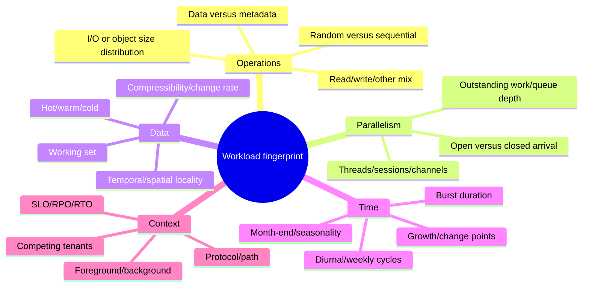

### Fingerprint schema

| Dimension | Minimum evidence | Why average alone fails |
|---|---|---|
| Read/write/other | Counts/rates by operation class | Write persistence and metadata cost differ |
| Size | Distribution/percentiles by class | A few large requests distort mean size |
| Access pattern | Random/sequential and run lengths | Locality and streaming differ |
| Concurrency | Sessions/threads/outstanding over time | Throughput and queueing depend on it |
| Working set | Active unique data by interval | Total capacity does not predict cache |
| Locality | Reuse distance/recency and adjacency | Hot data and prefetch depend on it |
| Time | Peak, burst length, cycle and events | Daily average hides deadline failure |
| Background | Snapshot, backup, replication, scan, rebuild, move, tiering | Shared work changes contention |
| Objective | Transaction SLO, batch deadline, errors, fairness | Max IOPS is not business success |

### Workload identity

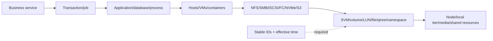

---

## 2. Read/write mix and operation semantics

**Read mix** is the fraction of eligible operations retrieving data. **Write mix** changes data and can require durability, parity, replication, efficiency, allocation, and consistency work. **Other/metadata operations** can include lookup, open, close, list, lock, create, delete, inquiry, and control activity according to protocol/tool definitions.

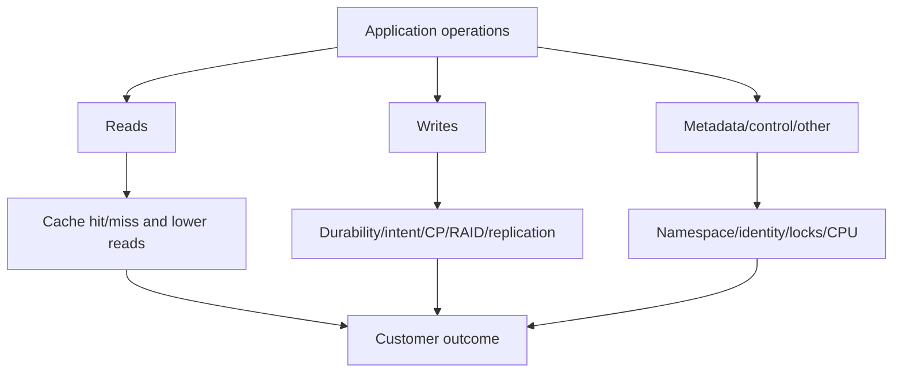

### Worked mix calculation

A synthetic five-minute sample contains 3,600,000 reads, 1,200,000 writes, and 200,000 other operations:

$$
N=3{,}600{,}000+1{,}200{,}000+200{,}000=5{,}000{,}000
$$

$$
\text{read mix}=\frac{3{,}600{,}000}{5{,}000{,}000}=72\%
$$

$$
\text{write mix}=24\%,\qquad \text{other}=4\%
$$

The mix says nothing about sizes, concurrency, latency, cache, metadata complexity, durability, or arrival order.

### Semantics table

| Pattern | Controlling questions | Misleading shortcut |
|---|---|---|
| Read-heavy analytics | Scan size, parallel streams, cache pollution, deadline | `Reads are cheap` |
| Durable log writes | Commit frequency, flush semantics, tail, replication | Average throughput |
| Small-file create/delete | Namespace, identity, metadata, file count | Payload MB/s |
| VM boot storm | Shared read set, cache warmup, random bursts | Steady-state IOPS |
| Backup | Sequentiality, compression, source scan, target/network | `Background means harmless` |
| Mixed OLTP | Random pages, logs, concurrency, lock/plan waits | One read/write percentage |

---

## 3. I/O size distribution and throughput demand

**I/O size** is bytes in one request under a defined layer. Host, protocol, and ONTAP operation sizes can differ because of coalescing, splitting, metadata, retries, compression, or application behavior.

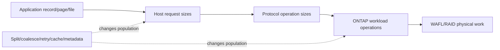

### Worked throughput from a size distribution

Synthetic read classes:

| Class | IOPS | Size | Throughput |
|---|---:|---:|---:|
| Small reads | 18,000 | 8 KiB | 140.625 MiB/s |
| Medium reads | 3,000 | 64 KiB | 187.5 MiB/s |
| Large reads | 300 | 1 MiB | 300 MiB/s |
| **Total** | **21,300** | Mixed | **628.125 MiB/s** |

Calculation:

$$
T=\sum_i IOPS_i\times size_i
$$

$$
T=(18{,}000\times8+3{,}000\times64+300\times1024)\ \text{KiB/s}
=628.125\ \text{MiB/s}
$$

One average size can reproduce aggregate bytes but hide packet rate, CPU, queueing, and tail behavior. Preserve the histogram/classes.

---

## 4. Random, sequential, and locality

**Sequential** operations access neighboring logical addresses in a predictable order. **Random** operations jump among addresses. **Spatial locality** means nearby addresses are reused; **temporal locality** means recently used data is reused. These are distributions, not binary labels.

### Plain-English deep-dive: reading a novel, consulting a dictionary, and keeping notes nearby

Sequential work reads a novel page by page. Random work jumps through a dictionary. Locality means the next lookup is near the last one or revisits a recent page, so a desk cache helps. **Why it matters:** media, read-ahead, cache, network batching, and object-tier recalls react to actual locality, not an application's name.

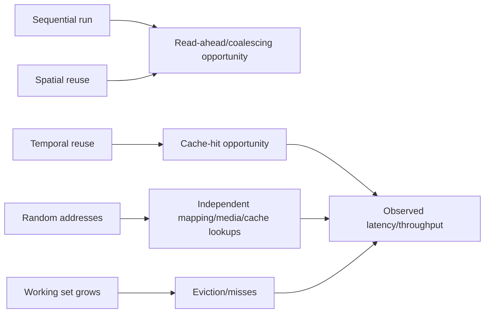

### Locality evidence

- Request address runs and stride distribution where authorized/available.
- Reuse interval and active unique data size.
- Cache hit/miss populations and lower-tier reads.
- Sequential stream count and concurrency.
- File/object/key/list pattern rather than only bytes.
- Tiered/cold blocks and recall behavior.

Do not recommend more cache, flash, tiering changes, or placement from `random` or `sequential` alone. Compare application SLO, active set, lower service, capacity, cost, and failure state.

---

## 5. Concurrency, offered load, and the throughput-latency knee

**Concurrency** is work active or outstanding at the same time. More concurrency can use parallel resources until the bottleneck saturates; beyond the knee, queues and tail latency grow faster than useful throughput.

```mermaid
flowchart LR
    C1[Low concurrency] --> IDLE[Parallel capacity idle]
    IDLE --> C2[Increase concurrency]
    C2 --> GAIN[Throughput rises]
    GAIN --> KNEE[Throughput-latency knee]
    KNEE --> EXTRA[More offered work]
    EXTRA --> QUEUE[Queue/wait/tail rise]
    QUEUE --> TIMEOUT[Timeout/retry/rejection]
    TIMEOUT --> MORE[Retry amplifies offered load]
```

### Synthetic sweep

| Concurrent workers | Throughput | p99 latency | Error rate | Interpretation |
|---:|---:|---:|---:|---|
| 4 | 3,000 ops/s | 12 ms | 0% | Capacity underused |
| 16 | 10,000 ops/s | 18 ms | 0% | Useful parallelism |
| 32 | 15,000 ops/s | 30 ms | 0% | Near candidate knee |
| 64 | 16,000 ops/s | 130 ms | 0.2% | Little output gain, tail growth |
| 128 | 16,200 ops/s | 480 ms | 3% | Saturated/unstable region |

These numbers describe one synthetic test only. A production operating point is chosen from the business SLO and safe headroom, not the row with maximum throughput.

### Arrival models

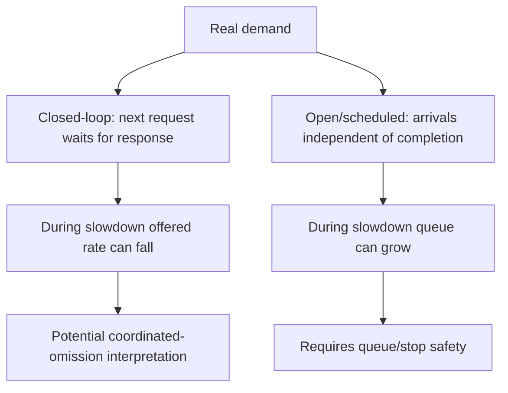

Use the arrival model that matches the business. A fixed-rate open test can overload systems dangerously; a closed test can hide the arrivals that would have queued during stalls.

---

## 6. Time behavior: burst, diurnal, weekly, seasonal, and change points

**Burstiness** describes short demand above typical level. **Diurnal** means repeating by time of day. **Seasonality** is a repeating cycle such as weekday, month-end, quarter-end, or annual peak. A **change point** is a time when the data-generating process shifts materially.

```mermaid
timeline
    title Synthetic workload cycle
    00:00 : Backup and replication
    06:00 : Batch catch-up
    09:00 : Interactive user ramp
    12:00 : Daily transaction peak
    18:00 : Reporting and close
    Month end : Financial close and archive
    Quarter end : Regulatory/reporting surge
```

### Plain-English deep-dive: climate, weather, and a new factory

A baseline is the climate. A burst is today's storm. Seasonality is monsoon season. A change point is opening a new factory that permanently changes local traffic. **Why it matters:** comparing month-end to a quiet Tuesday produces a false anomaly, while using last year's baseline after a migration hides a real architectural shift.

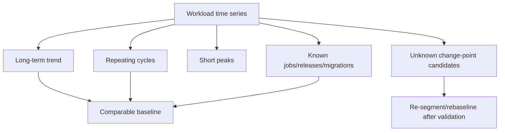

### Change-point evidence

- Application release/deployment or query-plan change.
- New tenant/project/user population.
- Data/working-set threshold crossing cache.
- Host/driver/firmware/ONTAP/network/identity change.
- Snapshot/retention/backup/replication schedule change.
- Volume move, takeover, path loss, QoS policy, or tiering change.
- Telemetry definition/collector change that creates a false change point.

---

## 7. Foreground, background, and maintenance work

**Foreground** work directly serves current application/user requests. **Background** work supports protection, maintenance, efficiency, movement, analytics, or recovery and can share the same resources.

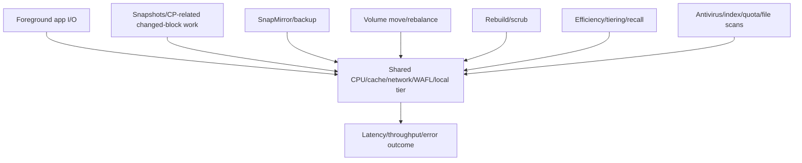

### Background-work inventory

| Work | Demand to capture | Business tradeoff |
|---|---|---|
| Snapshot/protection | Change rate, timing, capacity | Recovery coverage |
| Replication/backup | Read/write/network, throttle, lag | RPO and independent copies |
| Rebuild/scrub | Media/controller work | Protection restoration/integrity |
| Volume move/rebalance | Source/destination/network/CP | Placement/lifecycle |
| Efficiency/tiering | CPU/metadata/object path | Capacity/cost |
| Recall/restore | Object/network/local capacity | RTO |
| Antivirus/index/quota scan | Namespace/metadata | Security/search/governance |

`Background` does not mean optional. Rescheduling a backup can improve foreground latency while violating RPO or extending risk. Compare options with the owning team and validate both outcomes.

---

## 8. Business SLO and workload acceptance criteria

A **service-level indicator (SLI)** is the measured service behavior; an **SLO** is its target over a defined population/window. Storage metrics support but do not replace the customer SLI.

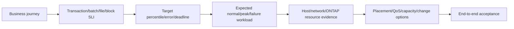

### SLO definition table

| Field | Example question |
|---|---|
| Operation | Claim commit, VM boot, file open, backup, report completion? |
| Population | Which users/sites/tenants/objects? |
| Metric | p95/p99 latency, success rate, throughput, deadline, fairness? |
| Window | One minute, business hour, month-end, maintenance/failure? |
| Exclusions | Approved maintenance or no exclusions? |
| Error handling | Timeout, wrong result, retry, partial success? |
| Measurement | Client/app source, sample count, clock, data quality? |
| Owner | Who approves target and accepts misses? |

### Synthetic error-budget orientation

If an SLO requires 99.9% successful operations over 10,000,000 operations:

$$
10{,}000{,}000\times(1-0.999)=10{,}000\ \text{allowed failures under the simple count model}
$$

This does not define a customer contract or permit concentrated failures during one critical period. Policy and business impact govern interpretation.

---

## 9. Constructing a baseline

A **baseline** is a versioned description of normal workload and service behavior for comparable business, topology, configuration, and health conditions. It is not a single mean.

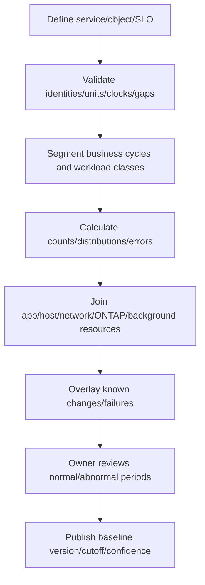

### Baseline contents

- Business periods and critical peaks.
- Application transactions, errors, retries, p50/p95/p99 where valid.
- IOPS/throughput/size/mix/concurrency/locality/working set.
- Client/host/path/session distribution.
- SVM/volume/LUN/node/local-tier and background scope.
- CPU/cache/network/CP/local-tier/media evidence.
- Capacity/Snapshot/retention/tiering and protection state.
- Versions/topology/changes and expected failure-state behavior.
- Missing-data, clock, sampling and confidence notes.

### Robust summary example

For a synthetic comparable-hour IOPS series:

$$
[8{,}000,8{,}200,8{,}100,8{,}300,8{,}150,25{,}000]
$$

Mean:

$$
\bar{x}=10{,}958.3
$$

Median:

$$
\tilde{x}=8{,}175
$$

The mean is pulled by one event. Do not discard it automatically: classify whether it is a legitimate peak, known change, data defect, or anomaly. Use distributions and event labels.

---

## 10. Baseline comparability and rebaselining

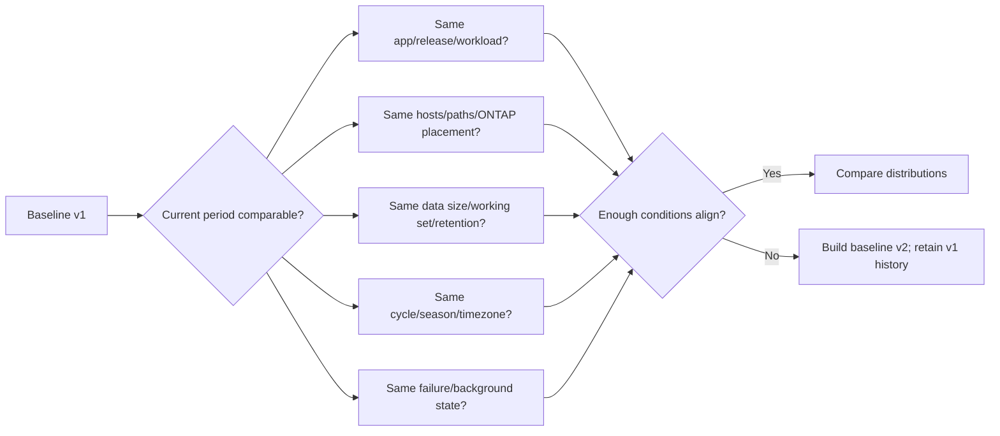

### Rebaseline triggers

- Material application/workload or population change.
- Persistent working-set/data-size shift.
- Platform/ONTAP/host/network/driver upgrade.
- Volume placement, QoS, efficiency, tiering, or protection redesign.
- New failure-state operating model.
- Counter/source/schema or sampling change.

Do not rebaseline merely to make a regression disappear. Preserve old baseline, reason, effective date, approver, and before/after outcome.

---

## 11. Bottlenecks, saturation, and queues

A **bottleneck** is the resource constraining output or response for a particular workload. **Saturation** means offered demand reaches effective service capacity and queues, errors, or backpressure grow.

### Plain-English deep-dive: busiest station versus limiting station

Every kitchen station can be busy during dinner. The bottleneck is the station preventing more meals from completing or making them wait. A 90% busy refrigerator may not matter if the payment queue is blocking all orders. **Why it matters:** utilization is supporting evidence; the throughput-latency mechanism identifies the bottleneck.

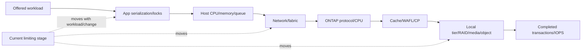

### Saturation signature

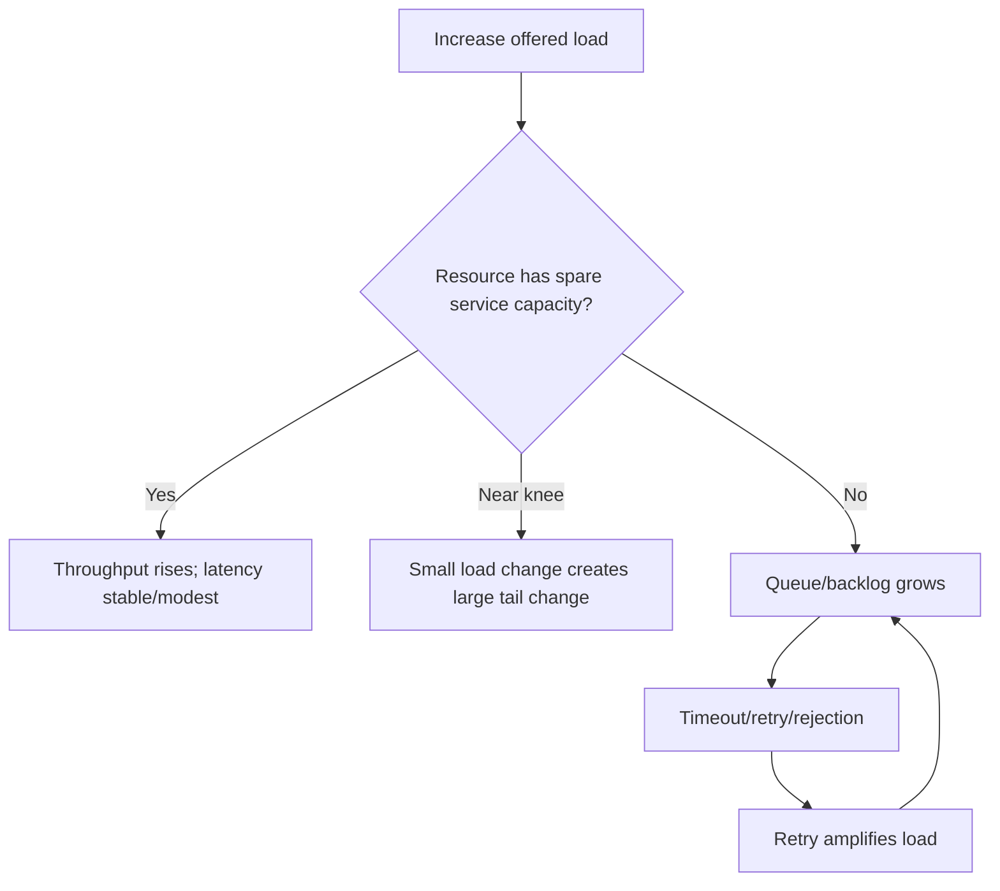

### Bottleneck proof checklist

1. Workload and service output are measured at the same time.
2. Candidate resource reaches an effective constraint under the exact scope.
3. Queue/wait or backpressure grows at/above that resource.
4. End-to-end throughput plateaus or latency/errors rise.
5. Competing upstream/downstream hypotheses are tested.
6. A safe change in candidate capacity/load changes the outcome as predicted.

---

## 12. Competing workloads and noisy neighbors

A **noisy neighbor** is a workload whose use of shared resources materially harms another workload's objective. Sharing alone is not noisy-neighbor proof.

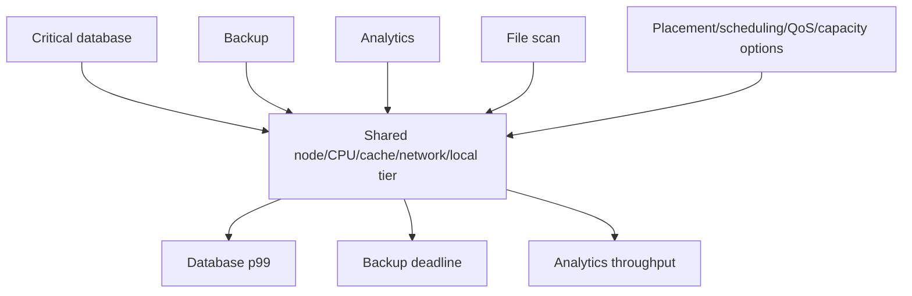

### Noisy-neighbor evidence

| Required evidence | Why |
|---|---|
| Shared resource map | Proves potential contention domain |
| Per-workload demand/time | Identifies who offered work |
| Victim SLO and tail | Proves customer harm |
| Resource queue/service | Shows contention mechanism |
| Controlled separation/cap | Distinguishes coincidence from interference |
| Alternate hypotheses | Avoids blaming the largest workload |

### Fairness

**Fairness** describes how constrained service is distributed among workloads according to business policy. Equal throughput is not always fair: one workload may have a stringent latency SLO while another is best effort.

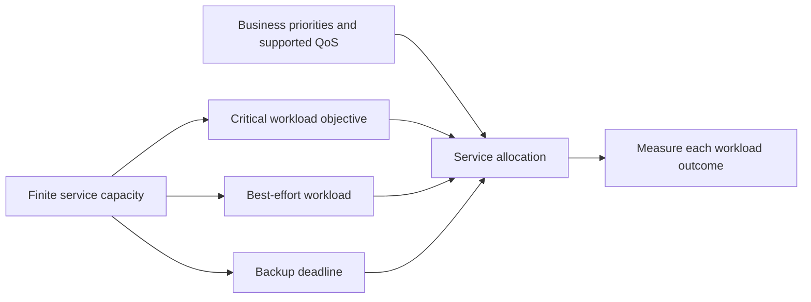

---

## 13. ONTAP QoS concepts: policy groups, ceilings, floors, and adaptive QoS

**Storage QoS** controls or prioritizes workload throughput according to a policy. A **policy group** defines the policy and is assigned to supported workload objects.

### Current-doc-safe concepts

| Concept | Plain meaning | Analogy | Critical caveat |
|---|---|---|---|
| Policy group | QoS policy assigned to one/more supported workloads | Traffic rule for a lane/group | Exact supported objects and sharing vary |
| Throughput ceiling / QoS Max | Limits workload to a maximum IOPS, MB/s, or documented combination | Speed limiter | Can increase application latency/deadline risk |
| Throughput floor / QoS Min | Gives a critical workload minimum-throughput priority under documented behavior | Reserved service priority | Requires available/managed capacity and can affect others |
| Fixed QoS | Policy value remains fixed until changed | Fixed speed/service rule | Workload size/growth can make it stale |
| Adaptive QoS | Scales policy value with documented workload-size basis/ratio | Service budget grows with store size | Exact objects, size basis and release support vary |
| Shared/non-shared | Limit/guarantee applies collectively or individually under exact type | Team budget versus personal budget | Semantics differ by policy type/release |

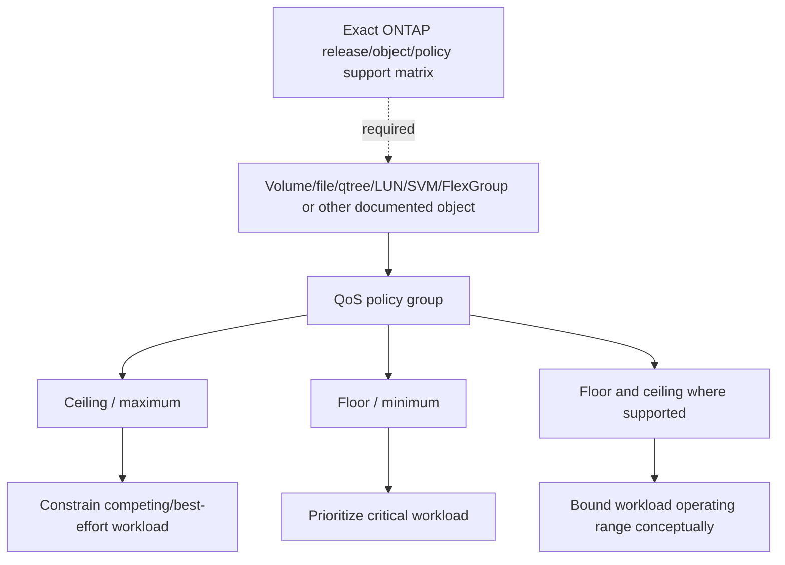

### Adaptive model orientation

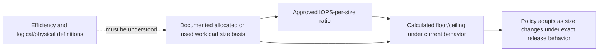

Conceptual formula:

$$
Q_{effective}=r\times S_{documented}
$$

where $r$ is the approved rate-per-size ratio and $S_{documented}$ is the exact allocated/used basis documented for that policy. This is not a proposed setting.

### QoS does not create capacity

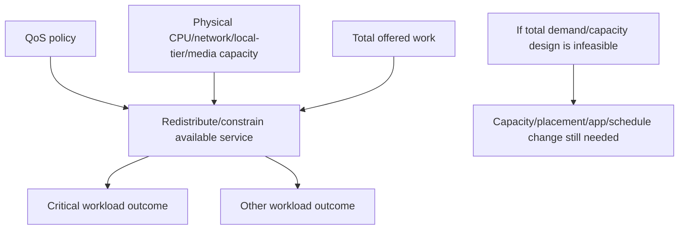

---

## 14. QoS decision framework and risks

```mermaid
flowchart TD
    SYM[Workload misses SLO/fairness] --> MAP[Prove shared contention and workload identities]
    MAP --> CAUSE{Competing workload mechanism?}
    CAUSE -->|No| FIX[Address app/host/network/storage root cause]
    CAUSE -->|Yes| GOAL{Protect critical or constrain competitor?}
    GOAL -->|Constrain| C[Evaluate documented ceiling]
    GOAL -->|Protect| F[Evaluate documented floor]
    GOAL -->|Scale by size| A[Evaluate adaptive QoS]
    C --> SUP[Check exact support/object/policy assignment restrictions]
    F --> SUP
    A --> SUP
    SUP --> TEST[Model/test app outcomes and failure state]
    TEST --> CHANGE[Approved canary/change/rollback]
```

### QoS risk table

| Decision | Benefit | Risk to test |
|---|---|---|
| Ceiling backup | Protect foreground from backup bursts | Backup misses RPO/window and backlog grows |
| Floor critical app | Prioritize critical throughput | Other workloads' latency increases; overcommit risk |
| Ceiling critical app | Protect shared platform from one app | App violates p99/deadline during peak |
| Shared group | Team-level cap | One member consumes budget/fairness shifts |
| Non-shared group | Per-member rule | Aggregate demand can exceed intended capacity |
| Adaptive policy | Scales with size | Wrong size basis/ratio and growth create surprises |

### Assignment restrictions and current support

Before any design, verify:

- Object type and volume/protection/root/mirror restrictions.
- SVM, FlexGroup, file, qtree, LUN, and policy support for the exact release.
- Shared/non-shared and floor/ceiling combination behavior.
- Adaptive size basis and interaction with data efficiency.
- FabricPool, synchronous replication, moves, and lifecycle interactions.
- Current maximum workload/policy-group limits from the exact source, without copying them into this guide.

---

## 15. Controlled testing: one question, one variable, real acceptance criteria

A **controlled test** changes one planned factor while holding important workload, data, topology, and health conditions comparable.

```mermaid
flowchart TD
    Q[Business question and hypothesis] --> SAFE[Authorization/nonproduction/canary/stop conditions]
    SAFE --> PROFILE[Representative workload/data/arrival model]
    PROFILE --> BASE[Repeat baseline]
    BASE --> CHANGE[Change one factor]
    CHANGE --> OBS[Collect app/host/network/ONTAP/protection evidence]
    OBS --> REPEAT[Repeat/randomize/order as appropriate]
    REPEAT --> DEC[Compare effect/variation/confidence]
    DEC --> CLEAN[Rollback/cleanup/normal-state validation]
```

### Test design fields

- Question and falsifiable prediction.
- Workload mix, size, locality, concurrency, arrival pattern, data pattern, duration, warm/cold state.
- Hardware/software/topology/capacity/health and background work.
- Application SLO, errors, transaction correctness, and protection deadline.
- Client-generator CPU/network and measurement health.
- Change/canary, maximum load, queue, latency/error and capacity stop conditions.
- Repetitions, randomization/order, confidence, exclusions, cleanup, rollback.

### Synthetic A/B effect

Baseline p99 samples (ms): $[210,225,218,230]$.

Test p99 samples (ms): $[160,170,165,168]$.

Mean of baseline p99 values is 220.75 ms; mean of test p99 values is 165.75 ms, but this is **not** a combined p99 calculation. It summarizes repeated run-level p99s. Report the per-run sample sizes/histograms and ensure workload equivalence before claiming improvement.

---

## 16. Benchmark traps and representative tests

### Plain-English deep-dive: treadmill record versus real commute

A treadmill can measure speed under controlled conditions, but it does not include traffic, hills, luggage, weather, or route changes. A storage benchmark measures the system under its exact test, not the application forever. **Why it matters:** synthetic maximum IOPS at extreme queue depth can be technically true and operationally useless.

```mermaid
flowchart TD
    MAX[Headline benchmark result] --> CACHE{Working set fits cache?}
    MAX --> CLIENT{Generator CPU/network saturated?}
    MAX --> DATA{Zeros/compressible/nonrepresentative?}
    MAX --> QD{Extreme concurrency destroys SLO?}
    MAX --> TIME{Too short for steady state/GC/tiering/CP?}
    MAX --> BG{Background/failure/protection absent?}
    CACHE --> REAL[Representative result with limitations]
    CLIENT --> REAL
    DATA --> REAL
    QD --> REAL
    TIME --> REAL
    BG --> REAL
```

### Benchmark traps

| Trap | Misleading outcome | Control |
|---|---|---|
| Cache-sized working set | Measures memory path | Use warm/cold/working-set phases |
| Short run | Misses steady/background effects | Run long enough for mechanism |
| Zeros/compressible data | Artificial reduction/cache | Representative data pattern |
| Extreme queue depth | High IOPS, unusable latency | Sweep concurrency against SLO |
| One request size/mix | Hides actual classes | Use measured distributions |
| Client bottleneck | Storage looks capped | Monitor/distribute generator |
| Best run only | Selection bias | Report all repetitions/variance |
| No errors/timeouts | Failed work disappears | Include errors and latency |
| Closed-loop omission | Stalls suppress arrivals | Match actual arrival model |
| Production target | Outage/data-loss risk | Nonproduction/canary/strict stops |
| No failure state | Capacity disappears during takeover/path loss | Test approved degraded mode |
| One change plus many hidden differences | Causality invalid | Hold factors/record differences |

Use proven tools only under authorized procedures. `fio`, DiskSpd, TPC-like audited benchmarks, application-native tests, and vendor tools answer different questions.

---

## 17. Workload placement and change safety

Placement can move a volume/workload to another node/local tier or change client/LIF/path distribution. It trades capacity, performance, protection, failure-state balance, and operational risk.

```mermaid
flowchart TD
    NEED[Placement/change candidate] --> WHY[Proven bottleneck/failure/capacity mechanism]
    WHY --> DEST[Destination CPU/cache/ports/local-tier/capacity]
    DEST --> SHARED[New neighbors/background work/failure domains]
    SHARED --> PROT[Snapshots/replication/backup/tiering/QoS]
    PROT --> SUP[Current release/platform/protocol/app support]
    SUP --> PLAN[Transfer/cutover/stop/rollback/validation]
    PLAN --> CANARY[Stage/canary if supported]
    CANARY --> VERIFY[App SLO, capacity, protection, normal/failure state]
```

### Placement questions

- Is the workload's active bottleneck tied to its current placement?
- Does the destination have normal and takeover/failure-state headroom?
- Which other workloads share destination node, ports, cache, local tier, media, and background schedules?
- Does network/LIF locality improve or worsen?
- What volume move, constituent, SAN host, SnapMirror, FabricPool, Snapshot, QoS, and application restrictions exist?
- What is cutover/rollback/forward-recovery behavior?

### Change-safety state model

```mermaid
stateDiagram-v2
    [*] --> Proposed
    Proposed --> EvidenceReady: Mechanism/support/owner established
    EvidenceReady --> Approved: Risk, test, stop/rollback accepted
    Approved --> Canary: Small controlled scope
    Canary --> Expanded: Acceptance criteria pass
    Canary --> RolledBack: Stop threshold reached
    Expanded --> Validated: App/protection/capacity/failure state pass
    Expanded --> RolledBack
    Validated --> Monitored
```

Do not move work, alter QoS, reschedule protection, change concurrency, or tune queue/timeouts merely because a dashboard is red.

---

## 18. Discovery, evidence, risk, recommendations, and JD Mapping

### Discovery questions

1. Which business service, operation, SLO, users/hosts, critical periods, deadlines, and fairness priorities apply?
2. What is the measured read/write/other, size, random/sequential, metadata, concurrency, locality, working-set, burst and seasonal fingerprint?
3. Which SVM/volume/LUN/file/qtree/FlexGroup/cache/node/local-tier/port/media objects and background jobs serve/share the workload?
4. Which baseline version and comparable periods exist, and which change points/topology/source-schema changes occurred?
5. Where do queues, utilization, throughput plateaus, tail latency, errors or backpressure indicate saturation?
6. Which competing workloads share the constrained resource and which victim SLO proves harm?
7. Which QoS policy groups/floors/ceilings/adaptive policies currently exist, with exact assignment semantics and current support evidence?
8. Which representative controlled test can disconfirm app, host, network, ONTAP, media, background and noisy-neighbor hypotheses?
9. Which placement, schedule, app, QoS, capacity and status-quo options exist, with tradeoffs and failure-state impact?
10. Which current docs, IMT/HWU, application/vendor, owners, authorization and data-quality gaps constrain action?

### Minimum evidence pack

- Business SLO/SLI, transaction/batch deadline, user impact, baseline and UTC timeline.
- Full workload fingerprint by object/client/time, including sizes/concurrency/locality/seasonality/background.
- Topology and shared-resource/failure-domain map.
- Application/host/network/ONTAP distributions, queues, CPU/cache/CP/local-tier/media and changes.
- Baseline version, comparator-selection rules, change points, gaps, sampling and field definitions.
- Current QoS policy-group/object/type/state and exact release support/assignment documentation.
- Benchmark/test method, tool/version, data pattern, preconditioning, arrival model, duration, repetitions, stop conditions and raw results.
- Competing hypotheses, options, owner, action date, rollback/forward plan, validation and residual risk.

### Recommendation model

```mermaid
flowchart TD
    E[Verified SLO fingerprint baseline contention and policy evidence] --> C[Business criticality/fairness/protection/change context]
    C --> R[Risk mechanism impact likelihood horizon confidence]
    R --> O[App/schedule/placement/QoS/capacity/status-quo options]
    O --> A[Owner prerequisites date canary stop/rollback]
    A --> V[Representative normal/peak/failure/app validation]
    V --> RR[Residual risk monitoring/rebaseline/review]
```

### Recommendation patterns

| Finding | Risk | Bounded recommendation | Validation |
|---|---|---|---|
| Backup overlap proven to violate DB p99 | Critical app misses SLO; moving backup may risk RPO | Compare scheduling and documented ceiling options with both owners | DB p99 plus backup completion/RPO |
| Working set permanently exceeds prior cache behavior | Lower-tier demand and tail increase | Rebaseline; compare app/cache/placement/capacity options | Hit/miss, p99, cost and failure state |
| Critical workload and analytics share saturated local tier | Noisy-neighbor mechanism is repeatable | Compare placement, schedule, supported floor/ceiling and capacity | Both workloads' SLO/fairness and protection |
| Extreme-queue benchmark drives hardware request | Purchase may not improve real app | Re-run representative mix/concurrency/arrival and app SLO | Throughput-latency-error curve |
| Adaptive QoS basis uses wrong workload-size assumption | Policy changes unexpectedly with growth/efficiency | Validate exact release/object/size basis and model scenarios | Policy behavior plus app/fairness test |

### JD Mapping

| JD responsibility | Part 44 contribution | Your factual bridge and gap |
|---|---|---|
| Generate/analyze customer data | Fingerprints, baselines, segmentation, change points, tests | MBA/Excel/Power BI/SQL/Python transfer strongly |
| Storage depth | Workload, saturation, noisy-neighbor and ONTAP QoS architecture | Conceptual/synthetic; no production QoS claim |
| Strategic advice | Placement, protection, capacity, fairness and change tradeoffs | Advisory/business analysis transfer |
| Risk/stability | Prevents unsafe benchmarking/tuning and identifies saturation | critical-situation discipline transfers |
| Supportability | Requires exact QoS object/release/app evidence | No customer/gated result claimed |
| Service reviews | Converts workload/SLO/baseline/policy into decisions | Business-review strength |
| Influence/adoption | Frames options around app and protection owners | Cross-team prior experience transfers |

---

## 19. Fully synthetic scenario: Aster Retail noisy-neighbor decision

> **Synthetic case:** Aster Retail, every workload, SLO, graph, policy, test, and result below is fictional. It is not an ONTAP benchmark, customer data, QoS recommendation, or your production work.

### Environment

- Checkout database LUNs and analytics file volumes share one node/local tier.
- Daily analytics starts at 11:55 before a 12:00 promotion.
- A backup begins at 12:10.
- Checkout SLO: synthetic p99 under 250 ms and errors below an approved business rate.
- Analytics deadline: complete before 14:00.
- No current QoS policy is assumed; exact release support remains to be checked.

```mermaid
flowchart TB
    SHOP[Checkout users] --> DB[Database LUN workload]
    ANALYST[Analytics users] --> NAS[Analytics NFS volume]
    BACKUP[Backup workload] --> SHARED[Shared node/local tier/network]
    DB --> SHARED
    NAS --> SHARED
    SHARED --> SLO1[Checkout p99/errors]
    SHARED --> SLO2[Analytics completion]
    SHARED --> SLO3[Backup/RPO completion]
```

### Fingerprints

| Dimension | Checkout | Analytics | Backup |
|---|---|---|---|
| Operations | Small mixed random, durable log writes | Large sequential reads plus metadata | Large reads/writes |
| Concurrency | User-session driven burst | Many parallel workers | Bounded job streams |
| Working set | Grows during promotion | Broad dataset scan | Full protected scope |
| Objective | Tail/error SLO | Completion deadline | RPO/window |
| Timing | 12:00 burst | Starts 11:55 | Starts 12:10 |

### Timeline

```mermaid
sequenceDiagram
    autonumber
    participant C as Checkout app
    participant A as Analytics
    participant B as Backup
    participant R as Shared resources
    A->>R: Parallel scan starts 11:55
    C->>R: Promotion demand rises 12:00
    R-->>C: Checkout p99/outstanding rise
    B->>R: Backup begins 12:10
    R-->>C: Errors and tail increase further
    R-->>A: Analytics throughput drops
    R-->>B: Backup finish forecast slips
```

### Baseline and change points

| Evidence | Observation | Bounded interpretation |
|---|---|---|
| Prior promotions | Checkout met SLO before analytics worker increase | Historical comparator with older app/data state |
| Analytics release | Worker count doubled last week | Valid change-point candidate |
| Working set | Checkout active set crosses prior cache range | Lower-tier demand candidate |
| Shared local tier | Queue/service rises as combined load peaks | Shared contention mechanism candidate |
| Network | No loss, but one member carries analytics flow | Contributes to analytics, not full DB tail |
| Backup | Adds work after initial p99 rise | Amplifier, not initial trigger |

### Hypothesis tree

```mermaid
flowchart TD
    TOP[Checkout p99 and deadlines fail] --> DB{DB locks/plans?}
    TOP --> CACHE{Checkout working-set transition?}
    TOP --> ANA{Analytics concurrency noisy neighbor?}
    TOP --> BK{Backup amplification?}
    TOP --> NET{Network member/flow issue?}
    TOP --> LT{Shared local-tier saturation?}
    ANA --> TEST[Controlled concurrency/schedule comparison]
    CACHE --> TEST
    BK --> TEST
    DB --> TEST
    NET --> TEST
    LT --> TEST
```

### Controlled test results

Synthetic approved nonproduction replay:

| Test | Checkout p99 | Checkout errors | Analytics completion | Backup outcome |
|---|---:|---:|---:|---|
| Promotion only | 210 ms | Within target | Not run | Not run |
| Promotion + old analytics concurrency | 235 ms | Within target | Before deadline | Not run |
| Promotion + doubled analytics | 620 ms | Above target | Faster initially | Not run |
| Promotion + doubled analytics + backup | 980 ms | Above target | Misses deadline | Misses window |

The doubled analytics load produces the discriminating change; backup amplifies it. This supports shared contention in the synthetic environment, but exact ONTAP resource and policy choice still require current evidence.

### Options

| Option | Benefit | Risk/tradeoff |
|---|---|---|
| Reduce analytics concurrency | Quick demand control | Longer analytics completion |
| Shift schedule | Removes overlap | Business freshness and backup collisions |
| Place workload elsewhere | Reduces shared local-tier/node contention | Move/capacity/protection/change risk |
| Documented ceiling on analytics | Constrains competitor | Analytics misses deadline if too low |
| Documented floor for checkout | Protects critical throughput | Other workloads suffer; capacity still finite |
| Add capacity/resources | More service/headroom | Cost/lead time; bottleneck can move |

### Recommendations

1. Restore analytics concurrency to the last tested level as a reversible interim control, owned by analytics, while preserving its deadline monitoring.
2. Rebaseline checkout after current data/working-set/app changes and separate database waits from storage queue time.
3. Validate exact ONTAP release/object QoS support and compare a documented analytics ceiling versus checkout floor only in an authorized canary; use placeholders until design review.
4. Keep backup/RPO as a co-equal acceptance criterion; do not solve checkout by silently missing protection.
5. Evaluate placement/capacity if combined business demand remains infeasible, including takeover/failure-state headroom and protection dependencies.

### Customer-facing summary

> "The initial checkout degradation begins when analytics concurrency doubles; backup starts later and amplifies the shared queue. Controlled replay reproduces that difference while the previous analytics level meets both objectives. We recommend a reversible concurrency correction now, current-document QoS and placement evaluation under canary tests, and acceptance criteria for checkout, analytics, and backup together. QoS can allocate finite service; it cannot replace capacity if all three objectives are infeasible."

---

## 20. Your analytics, MBA, and Microsoft 365 transfer

```mermaid
flowchart LR
    M365[M365 support/escalations] --> PATH[Workload/user/path/change scoping]
    CRIT[Critical situation] --> SAFE[Priorities/owners/communication/change safety]
    MBA[MBA analytics] --> BASE[Segmentation/change points/uncertainty/tradeoffs]
    BI[Excel Power BI SQL Python] --> TEST[Data QA/baselines/tests/dashboards]
    PATH --> METHOD[ONTAP workload/QoS synthetic method]
    SAFE --> METHOD
    BASE --> METHOD
    TEST --> METHOD
    METHOD --> GAP[Authorized ONTAP QoS/tool/lab experience still needed]
```

### Transfer and gap

| Factual strength | Transfer | Honest gap |
|---|---|---|
| M365 case patterns | Scope user/client/change and compare cohorts | Not ONTAP workload-object operation |
| Critical situation | Protect critical service, owner, rollback and updates | No storage QoS change authority |
| MBA/statistics | Baselines, change points, scenarios and fairness | No production storage benchmark ownership |
| Office/SQL/Python | Reproducible workload/test/report pipeline | No customer ONTAP metrics/tool access |

### Honest interview answer

> "I characterize a workload before proposing QoS: read/write/other mix, size distribution, randomness, concurrency, locality, working set, bursts, seasonality and foreground/background jobs. I tie that to an application SLO, build a comparable versioned baseline, prove a shared-resource/noisy-neighbor mechanism and test one variable. I then consider documented ceiling, floor, adaptive, placement or capacity options. My production evidence is enterprise support and analytics, not ONTAP QoS operation."

---

## 21. Labs, whiteboard drills, and self-test

### Whiteboard drills

1. Fingerprint: mix, size, random/sequential, concurrency, locality, time, context, SLO.
2. Throughput: sum $IOPS_i\times size_i$ by class.
3. Locality: sequential, random, temporal/spatial reuse and working set.
4. Concurrency: useful parallelism -> knee -> queue -> retry loop.
5. Time: burst, diurnal, seasonality and change point.
6. Baseline: scope -> QA -> segment -> distributions -> changes -> version.
7. Bottleneck: demand -> queue/service -> plateau/tail -> discriminating test.
8. Noisy neighbor: shared resource plus victim SLO and controlled separation.
9. QoS: policy group -> ceiling/floor/adaptive -> exact support -> canary.
10. Change: evidence -> approval -> canary -> stop/rollback -> normal-state proof.

### Paper lab

A fictional fleet has 80 workloads across NFS, SMB, FC and iSCSI; month-end/backup/replication cycles; changing working sets; current and stale baselines; 12 QoS policies with unclear assignment; two saturated local tiers; and no representative benchmark.

Tasks:

1. Build a stable workload-to-object/application-owner inventory.
2. Calculate mix/size/throughput classes and preserve distributions.
3. Classify random/sequential/locality and estimate active sets with confidence.
4. Segment burst/diurnal/weekly/month-end periods and known change points.
5. Build baseline versions and comparator-selection rules.
6. Map foreground/background jobs and shared resources/failure domains.
7. Identify saturation using throughput-latency-error/queue evidence.
8. Prove or reject at least three noisy-neighbor cases.
9. Inventory QoS policy groups, objects, type and current support without settings changes.
10. Design representative closed/open-arrival controlled tests with safety stops.
11. Compare app/schedule/placement/QoS/capacity/status-quo options.
12. Write three recommendations and an OSR-ready summary.

```mermaid
flowchart LR
    INV[Inventory workloads/owners] --> FP[Build fingerprints]
    FP --> BASE[Build baselines/change points]
    BASE --> BOT[Find queues/saturation/contention]
    BOT --> QOS[Audit current QoS/support]
    QOS --> TEST[Design representative safe tests]
    TEST --> REC[Compare options and recommend]
```

### Lab pass checklist

- [ ] Every workload has exact object/path/owner and business SLO.
- [ ] Mix/size/randomness/concurrency/locality/time/background are measured.
- [ ] Baselines use comparable cycles and preserve versions/change points.
- [ ] Bottleneck evidence includes queue/service/output, not utilization alone.
- [ ] Noisy-neighbor claim includes shared resource, victim SLO and controlled check.
- [ ] QoS features/objects/semantics cite the exact current release.
- [ ] No floor, ceiling, adaptive ratio, threshold or limit is invented.
- [ ] Benchmark arrival/data/cache/duration/client/stop conditions are explicit.
- [ ] Placement/change includes protection and failure-state capacity.
- [ ] No synthetic work is called production ONTAP performance/QoS work.

### Self-test

1. Define a workload fingerprint and every dimension.
2. Calculate read/write/other mix and state limitations.
3. Calculate throughput from an I/O-size distribution.
4. Explain random/sequential and temporal/spatial locality.
5. Explain working-set/cache transition.
6. Draw concurrency, knee, saturation and retry feedback.
7. Compare closed/open arrivals and coordinated omission.
8. Define burst, diurnal, seasonality and change point.
9. Inventory foreground/background work and business tradeoffs.
10. Define SLI/SLO/population/window/error/exclusions.
11. Build a versioned baseline with robust summaries.
12. Decide when to rebaseline without hiding regression.
13. Prove a bottleneck using six evidence steps.
14. Prove a noisy neighbor and define fairness.
15. Explain QoS policy groups, ceiling, floor, fixed, adaptive and shared/non-shared concepts.
16. Explain why QoS cannot create capacity.
17. Build the QoS decision/risk framework without settings.
18. Design a controlled representative test and avoid 12 benchmark traps.
19. Evaluate placement/change safety and failure-state headroom.
20. Recreate Aster Retail and answer Q1-Q8 aloud.

---

## 22. Official Source Anchors

**Date checked: 2026-08-24.** These official and credible public sources anchor workload, QoS, monitoring, baseline, testing, and statistical concepts. Exact ONTAP support matrices, defaults, object assignments, settings, limits, commands, and behavior remain release/platform/workload sensitive.

| Topic | Official or credible public source | Bounded use and currency note |
|---|---|---|
| ONTAP QoS concepts | [ONTAP QoS throughput guarantees](https://docs.netapp.com/us-en/ontap/performance-admin/guarantee-throughput-qos-task.html) | Current ceilings, floors, policy groups, adaptive concepts and support matrices; reopen exact release |
| QoS workflow | [ONTAP storage QoS workflow](https://docs.netapp.com/us-en/ontap/performance-admin/qos-workflow-concept.html) | Current monitoring-to-policy workflow; not a universal setting recipe |
| Assignment restrictions | [ONTAP QoS policy group assignment restrictions](https://docs.netapp.com/us-en/ontap/performance-admin/policy-group-assignment-restrictions.html) | Exact current supported object/policy combinations |
| Adaptive QoS | [Set throughput with adaptive QoS](https://docs.netapp.com/us-en/ontap/performance-admin/adaptive-qos-policy-groups-task.html) | Exact size basis/ratio/object/release behavior |
| Performance workflow | [ONTAP performance administration workflow](https://docs.netapp.com/us-en/ontap/performance-admin/identify-resolve-issues-workflow-task.html) | Current performance investigation navigation |
| REST performance metrics | [ONTAP REST performance metrics](https://docs.netapp.com/us-en/ontap-automation/rest/performance_metrics.html) | Current object/IOPS/latency/throughput availability matrix |
| Statistical/time-series methods | [NIST/SEMATECH e-Handbook](https://www.itl.nist.gov/div898/handbook/) | Robust summaries, comparison, monitoring and time-series orientation |
| Seasonality/change context | [NIST time-series model identification](https://www.itl.nist.gov/div898/handbook/pmc/section4/pmc446.htm) | Stationarity/seasonality and autocorrelation orientation |
| Monitoring/SLOs/tails | [Google SRE - Monitoring Distributed Systems](https://sre.google/sre-book/monitoring-distributed-systems/) | Traffic, latency, errors, saturation, tails, black/white-box and resolution |
| fio | [fio documentation](https://fio.readthedocs.io/en/latest/fio_doc.html) | Official tool documentation; destructive-load safety and exact version required |
| DiskSpd | [Microsoft DiskSpd](https://github.com/microsoft/diskspd) | Official Microsoft test tool; workload/safety/representativeness required |
| SNIA PTS | [SNIA Performance Test Specifications](https://www.snia.org/tech_activities/standards/curr_standards/pts) | Industry test-method orientation; choose applicable current specification |
| TPC | [Transaction Processing Performance Council](https://www.tpc.org/) | Audited application benchmark context; do not generalize results |

### Source-use discipline

- Record exact ONTAP/platform/object/policy type/release/source/date and every support note.
- Use the workload's business SLO and measured fingerprint, not copied thresholds.
- Treat baseline, benchmark, and production observations as different evidence.
- Preserve test tool/version/config/data pattern/arrival/cache/duration/repetitions/errors.
- Verify protection, failure-state and application outcomes before QoS/placement changes.
- Mark inaccessible, unsupported, stale and unknown evidence explicitly.

---

## Likely Interview Questions

### Q1. How do you characterize a storage workload?

> **Model answer:** "I map the business transaction to exact clients, protocol and ONTAP objects, then measure read/write/other mix, I/O-size distribution, random/sequential behavior, concurrency, locality, active working set, metadata, bursts, seasonality and foreground/background jobs. I record application SLO/errors and topology. The application label is context, not the fingerprint."

### Q2. How do you build a reliable baseline?

> **Model answer:** "I define scope and comparable business cycles, validate stable IDs, units, clocks, gaps and counter definitions, segment workload classes and seasonality, preserve distributions/errors/sample counts, join app/host/network/ONTAP/background evidence and overlay changes. Owners validate normal periods. I version the baseline and rebaseline only after a material validated change, preserving prior history."

### Q3. How do you identify a bottleneck and saturation?

> **Model answer:** "I increase or observe offered demand, find the resource whose effective capacity constrains output, show queue/wait or backpressure growth, and show throughput plateau or tail/errors rising. I test upstream and downstream alternatives and make one safe change that should alter the outcome. High utilization alone is not proof, and the bottleneck can move after a change."

### Q4. What is a noisy neighbor?

> **Model answer:** "It is a competing workload that materially harms another workload through a proven shared resource. I need per-workload demand, the victim SLO/tail, shared queue/service evidence, time alignment and a controlled separation or cap. Sharing or a large backup is not enough. Fairness follows business priorities, not equal throughput by default."

### Q5. Compare ONTAP QoS ceilings and floors.

> **Model answer:** "A documented throughput ceiling limits a workload's maximum IOPS/MB/s behavior to constrain impact. A floor gives a critical workload minimum-throughput priority under the release's documented behavior. A policy group applies the rule to supported objects, with shared/non-shared semantics that vary. A ceiling can miss the constrained workload's deadline; a floor can increase impact on others."

### Q6. What is adaptive QoS?

> **Model answer:** "Adaptive QoS scales a documented floor or ceiling from an approved rate-per-size ratio and the exact supported allocated/used workload-size basis. It helps large fleets avoid stale fixed values as size changes, but object support, size basis, efficiency interaction, templates and floors/ceilings vary by release. I model growth and validate application/fairness behavior before use."

### Q7. What makes a benchmark representative and safe?

> **Model answer:** "It answers a business question with measured sizes/mix/locality/concurrency/arrival model/working set/durability, controls cache/data pattern/client CPU/network/background work, runs long enough, repeats, captures app through media distributions and errors, and has authorization, canary and stop/cleanup rules. Maximum synthetic IOPS is not application capacity, and closed-loop coordinated omission must match real arrivals."

### Q8. How does your background transfer, and what remains a gap?

> **Model answer:** "enterprise support and critical-situation work gives me workload/change scoping, dependency evidence, owner coordination and safe change communication. My MBA and Excel, Power BI, SQL, Python and statistics support baselines, segmentation, change points and tests. I have not operated production ONTAP QoS or benchmarks. I would use current docs, authorized telemetry and NetApp/application owners."

---

## 30-Second Memory Hooks

- **Fingerprint:** What arrives, how big, how mixed, how parallel, where, and when.
- **Read/write/other:** Operation semantics matter beyond percentages.
- **Size distribution:** Same IOPS can mean radically different bytes/CPU.
- **Random/sequential:** Access order; **locality:** reuse in space/time.
- **Working set:** Active data, not total capacity.
- **Concurrency:** Useful until the knee; beyond it, waiting dominates.
- **Burst:** Short storm; **seasonality:** repeating climate; **change point:** new regime.
- **Foreground/background:** Different purpose, shared resources.
- **SLO:** Customer outcome defines the useful operating point.
- **Baseline:** Comparable distribution plus workload/topology/change context.
- **Bottleneck:** Resource that constrains output, not merely looks busy.
- **Noisy neighbor:** Shared resource + victim SLO + causal check.
- **QoS ceiling:** Constrain maximum; test the constrained workload.
- **QoS floor:** Prioritize minimum; test every other workload.
- **Adaptive QoS:** Rate per documented size basis, exact release only.
- **QoS:** Allocates finite service; does not create capacity.
- **Benchmark:** Reproduce the business question, not a headline.
- **Placement:** Move only after proving placement-related mechanism.
- **Your bridge:** Analytics/change rigor transfers; ONTAP QoS production work does not.

---

## Completion Checklist

- [ ] Build a full workload fingerprint from measured distributions and context.
- [ ] Calculate operation mix and size-class throughput with units.
- [ ] Explain random/sequential/locality/working-set/cache interactions.
- [ ] Draw concurrency, knee, saturation and retry amplification.
- [ ] Distinguish closed/open arrivals and coordinated omission.
- [ ] Segment burst/diurnal/weekly/month-end/seasonal behavior.
- [ ] Identify and govern foreground/background work and protection tradeoffs.
- [ ] Define business SLI/SLO/population/window/error/exclusions/owner.
- [ ] Construct and version comparable baselines with change points.
- [ ] Rebaseline only after a validated regime change.
- [ ] Prove bottleneck/saturation through queue/service/output/test evidence.
- [ ] Prove noisy-neighbor/fairness rather than infer from sharing.
- [ ] Explain QoS policy groups, ceilings/floors/fixed/adaptive/shared concepts only through current docs.
- [ ] State why QoS cannot create capacity and model side effects.
- [ ] Design controlled representative tests with safety/stop/cleanup.
- [ ] Avoid all benchmark traps and report variation/errors.
- [ ] Evaluate placement/QoS/schedule/app/capacity/status-quo options with failure-state risk.
- [ ] Recreate Aster Retail and complete labs/self-test/Q1-Q8.
- [ ] State the No-production-NetApp boundary and exact non-claim accurately.
- [ ] Recheck current docs, IMT/HWU, app guidance and Support before customer use.

---

*Next suggested section:* [Part 45 - Capacity Analytics, Forecasting, Efficiency, and Risk Thresholds](Part-45-capacity-analytics-forecasting.md)