# Part 45 - Capacity Analytics, Forecasting, Efficiency, and Risk Thresholds

> **Section goal:** Learn to reconcile every important capacity layer, convert snapshots into trustworthy fleet trends, model linear, compound, seasonal, and event-driven growth, quantify uncertainty, and turn a forecast into an owned action before operational lead time expires. By the end, you should be able to challenge ambiguous `used`, `free`, `effective`, and `full` dashboards; model Snapshot, efficiency, thin provisioning, reserve, replication, and tiering effects; rank fleet risk; and write a capacity recommendation without inventing thresholds or precision.

Covers index item **45** and maps directly to job-description responsibilities for gathering and analyzing customer data, assessing utilization and risk, planning workloads and lifecycle changes, recommending actions, improving stability, communicating through operational/service reviews, and coordinating Support, sales, engineering, application, infrastructure, finance, and customer owners.

**Version caveat:** Exact ONTAP capacity fields, local-tier/aggregate terminology, WAFL and metadata reserves, Snapshot reserve behavior, volume guarantees, LUN space reservation and fractional reserve, thin provisioning, autosize/autodelete, quotas, FlexGroup constituent behavior, data-compaction/dedupe/compression reporting, clone and Snapshot savings, FabricPool local/object-tier reporting, SnapMirror destination/reserve behavior, System Manager/CLI/REST/API labels, hard limits, alerts, defaults, and release/platform support change over time. Re-open the exact ONTAP release's current volume, local-tier, storage-efficiency, Snapshot, FabricPool, SAN, quota, REST/API and application documentation before customer use.

A **current-doc check** means reopening those exact release-, object-, layer-, tier-, protection- and application-specific sources at the time of analysis rather than relying on this guide or remembered behavior.

This Part supplies no universal free-space percentage, reserve, Snapshot reserve, oversubscription, efficiency ratio, growth rate, threshold, action horizon, forecast model, autosize/autodelete policy, or hardware-sizing rule. Synthetic numbers teach calculations only. Customer thresholds must come from current product/app/support requirements, protection/failure-state design, approved business risk, measured forecast error, and actual action lead time.

> **No-production-NetApp boundary:** You do not claim production ONTAP capacity administration, sizing, forecasting, efficiency, FabricPool, Snapshot, volume-autogrow, LUN-reservation, quota, or hardware-planning experience. Every fleet, dashboard, threshold, forecast, model, risk, customer, command concept, and result below is synthetic. Your factual strengths are enterprise support, critical-situation ownership, Azure/M365 service and networking analysis, an a postgraduate business-analytics qualification, and Excel, Power BI, SQL, Python, statistics, customer reviews, and change communication. The explicit non-claim is: **you have not owned a production ONTAP capacity plan, changed a customer capacity control, guaranteed a data-efficiency ratio, sized a NetApp platform, or diagnosed a production NetApp full condition.**

---

## 1. Capacity is a typed measurement, not one number

Every capacity value needs a **measurement contract**:

$$
CapacityValue=(object, layer, numerator, denominator, unit, tier, scope, time, source)
$$

### Plain-English deep-dive: warehouse signs that all say `space`

One sign reports the building's outside volume, another the legal shelf capacity, another boxes promised to customers, another occupied shelves, and another aisle space available today. All can correctly say `space`, but subtracting or comparing them without labels is nonsense. **Why it matters:** `80% used` can refer to a host filesystem, LUN, volume, local tier, physical bytes, logical bytes, Snapshot reserve, object tier, quota, or fleet rollup.

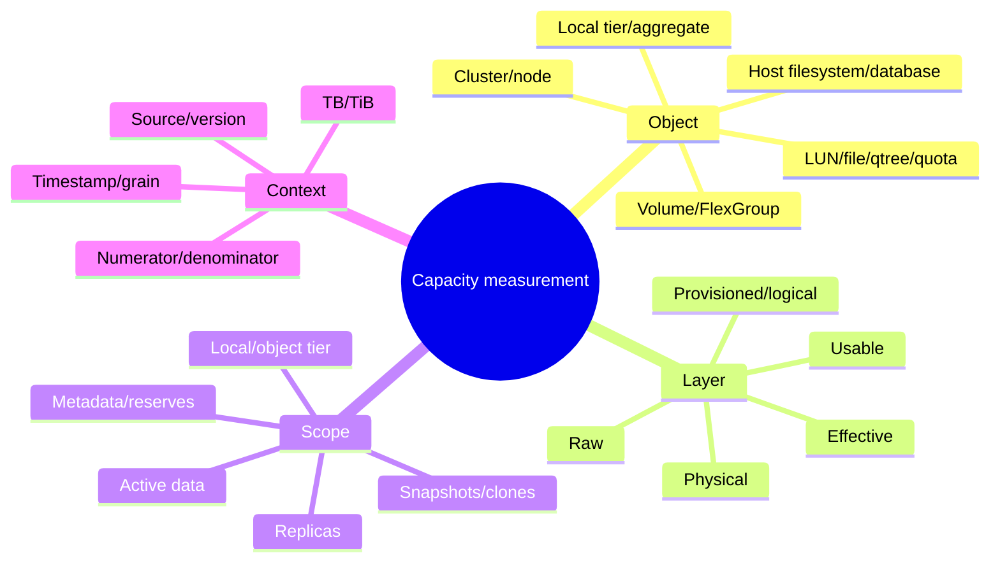

### Capacity dictionary

| Term | Plain meaning | Required qualifier | Common trap |
|---|---|---|---|
| Raw | Device/media nameplate capacity before protection/system deductions | Decimal/binary, device count/type | Calling it application-usable |
| Usable | Capacity available after a named set of protection/system deductions | Which RAID/spares/root/system/reserves | Assuming one universal raw-to-usable ratio |
| Provisioned | Logical address space promised/configured | Host/LUN/volume/object and thin/thick | Treating promise as occupied bytes |
| Logical used | Data represented before named efficiency savings | Active/Snapshot/clone/replica scope | Comparing to a physical denominator |
| Physical used | Media/tier bytes consumed under source semantics | Local/object/total and metadata scope | Assuming it equals host file sizes |
| Effective | Capacity/data represented after a stated efficiency/protection calculation | Formula, inclusions and local/total scope | Marketing a ratio without denominator |
| Free | Denominator minus used/reserved under one source | Exact object and exclusions | Calling all free space allocatable |
| Available | Capacity currently allocatable to a named consumer under policy | Guarantees/reserves/limits/health | Equating to raw mathematical free |
| Reserved | Capacity withheld/committed for a named purpose | Snapshot/LUN/metadata/root/guarantee/etc. | Pooling unlike reserves as one bucket |
| Tiered | Data physically placed in a capacity/object tier | Local versus object bytes, policy and time | Calling local savings total-system savings |

### Measurement contract example

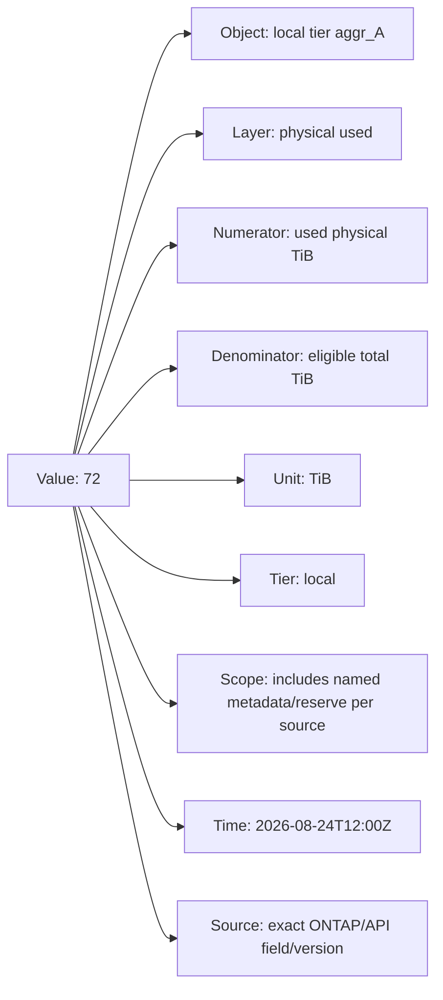

---

## 2. Raw, usable, and protected capacity

Raw-to-usable conversion is not a single percentage. Device formatting, RAID layout, parity, spares, root/system needs, checksums/metadata, local-tier rules, platform limits, partitioning, and failure-state design affect what can serve workloads.

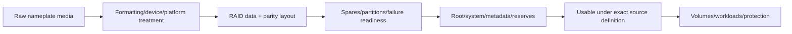

### Raw-to-usable evidence

- Exact platform, ONTAP release, disk/SSD type/count/size and partition ownership.
- RAID type, group layout, parity and current degraded/rebuild state.
- Spare and root/system allocations.
- Local-tier total/used/available fields from the exact current source.
- HA/takeover and maintenance-state capacity requirements.
- Decimal TB versus binary TiB and vendor/OS display conventions.

Do not estimate purchase capacity from nameplate arithmetic. Use current supported sizing/design tools and NetApp specialists, then reconcile delivered telemetry after implementation.

---

## 3. Object hierarchy and double-counting traps

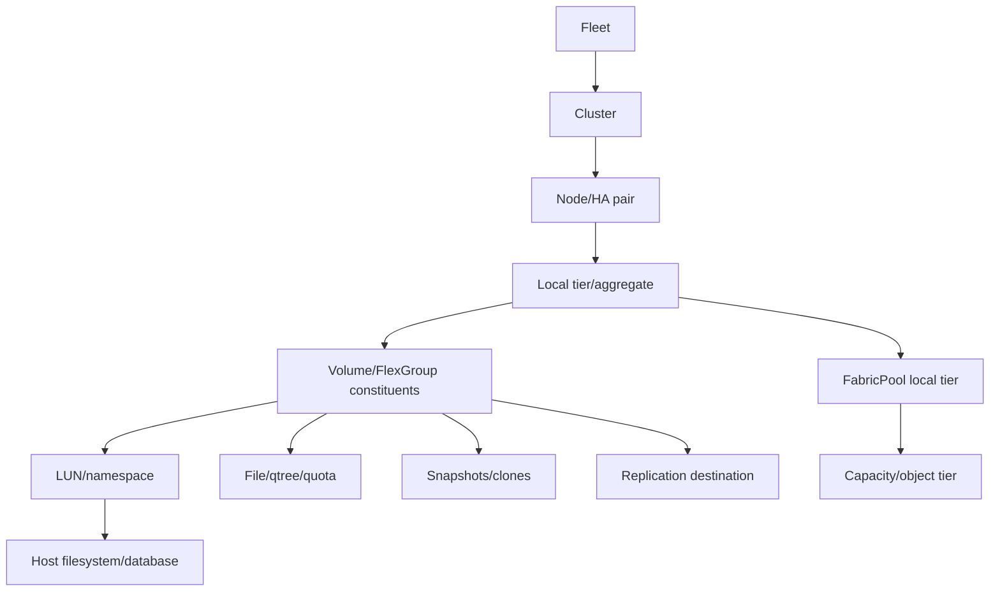

### Do not sum without ownership rules

| Potential double count | Why it happens | Control |
|---|---|---|
| Volume plus LUN used | Child LUN bytes are inside volume | Choose level or reconcile parent/children |
| FlexGroup plus constituents | Logical parent and physical constituents overlap | Use documented rollup semantics |
| Source plus replica | Two physical copies, one logical dataset | Label protection-copy scope |
| Active plus Snapshot logical | Shared blocks can be referenced twice logically | Use source's unique physical accounting |
| Clone plus parent | Shared blocks represent multiple logical datasets | Separate logical represented and physical unique |
| Local plus total tiered views | Local/object/total dashboards may overlap | Define tier union explicitly |
| Cluster plus node/local tier | Parent rollup includes children | Stable hierarchy and aggregation rule |

### Reconciliation invariant

For one source/object/time, test documented relationships rather than forcing equality:

$$
used + available + named\ reserves \stackrel{?}{\approx} total
$$

Differences can be valid because fields use different scopes, timestamps, rounding, metadata, reserves, or eligibility. Record the residual and investigate semantics.

---

## 4. Provisioned, logical, physical, and effective capacity

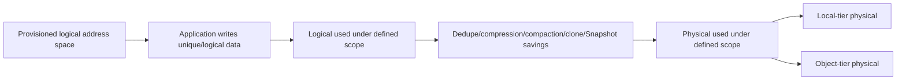

### Plain-English deep-dive: promises, books, and shelf space

Provisioned capacity is library cards promising borrowing rights. Logical capacity is pages readers think they own. Physical capacity is shelf space actually occupied after identical pages and compression are handled. Effective capacity states how many logical pages are represented per physical shelf, but only under a precise formula. **Why it matters:** a 2.4:1 ratio is not free space, a guarantee, or a reason to promise 2.4 times more data.

### Efficiency math

For a synthetic scope with 360 TiB logical represented and 150 TiB physical consumed:

$$
\text{efficiency ratio}=\frac{360}{150}=2.4:1
$$

$$
\text{savings percentage}=\frac{360-150}{360}\times100=58.33\%
$$

If 30 TiB of the 150 TiB is in an object tier, local physical is 120 TiB. Reporting $360/120=3:1$ as a total efficiency ratio would mix tier placement with data reduction. Show separately:

- Logical represented: 360 TiB.
- Total physical under defined union: 150 TiB.
- Local physical: 120 TiB.
- Object-tier physical: 30 TiB.
- Data-reduction ratio under exact source: 2.4:1, if those scopes are valid.

### Efficiency is workload dependent

| Driver | Can increase savings | Can reduce savings |
|---|---|---|
| Duplicate blocks | Repeated OS/images/data | Encrypted/pre-compressed unique data |
| Compression | Compressible text/structured data | Media/encrypted/random data |
| Compaction | Small compatible blocks | Large/already packed data |
| Snapshots/clones | Shared unchanged blocks | High change rate/long retention |
| Workload aging | Stable shared historical data | Frequent overwrite/delete churn |

Never guarantee an efficiency ratio from another customer, lab, application label, or marketing example. Use application-aware measurements and conservative scenarios.

---

## 5. Free versus available versus reserved

**Free** is an arithmetic remainder under one accounting source. **Available** is what a named consumer can allocate now under policy, reserves, health and limits. **Reserved** is withheld or committed for an explicit purpose.

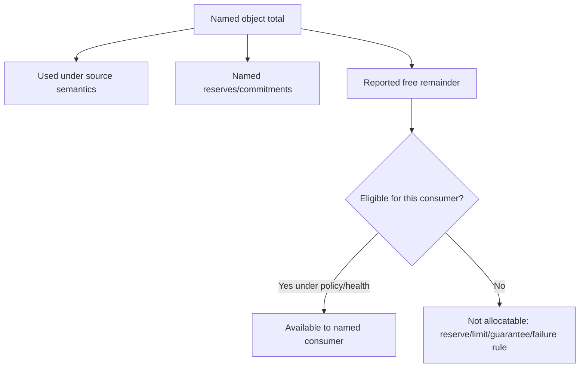

### Reserved does not mean one fungible pool

| Reserve/commitment concept | Purpose/question | Required exact-source check |
|---|---|---|
| Snapshot reserve | Space designated for Snapshot copies under volume behavior | Reserve percentage/use/overflow semantics |
| Volume guarantee | Whether volume space is reserved from containing local tier | Supported type and thin/thick behavior |
| LUN space reservation | Whether space is reserved for LUN writes | Host/volume/LUN interaction |
| Fractional reserve | Space behavior for overwrite guarantees under exact configuration | Release/support/application requirements |
| Root/system/metadata | Platform and filesystem operation | What telemetry includes/excludes |
| Quota | Logical usage limit for user/group/qtree | Not necessarily physical free space |
| Protection headroom | Capacity retained for failure/recovery/replication | Design policy and failure state |

Do not reclaim, merge, or reduce a reserve because a dashboard calls it unused. Establish owner, mechanism, support, consequence, and rollback.

---

## 6. Thin provisioning and oversubscription

**Thin provisioning** allows logical promises to exceed currently reserved physical capacity, consuming physical space as data is written. **Oversubscription** is the relationship between promises and capacity; it becomes risk when simultaneous realized demand exceeds available service/capacity before action.

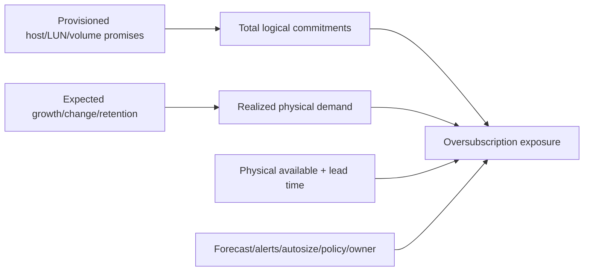

### Oversubscription metrics

Conceptual, not universal policy:

$$
\text{provisioning ratio}=\frac{\text{logical provisioned}}{\text{physical capacity under matching scope}}
$$

This ratio alone cannot estimate risk. Include logical used, expected simultaneous growth, efficiency uncertainty, Snapshot/replica change, tiering, failures, quotas, app behavior, and remediation lead time.

### SAN full-stack capacity path

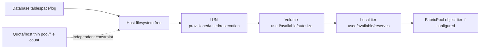

A database can report full while ONTAP has space, and a thin LUN can appear free to the host while the volume/local tier approaches an unsafe condition. Troubleshoot every boundary.

---

## 7. Snapshot and changed-block capacity

An ONTAP Snapshot copy is a point-in-time reference to filesystem blocks. Unchanged blocks are shared; changed or deleted blocks retained by Snapshots continue to consume physical capacity under documented accounting.

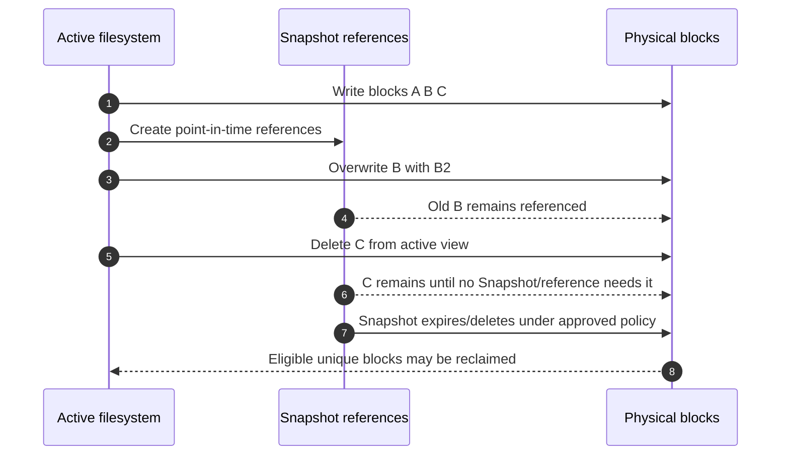

### Snapshot growth drivers

- Application change/overwrite/delete rate.
- Snapshot frequency and retention.
- Dataset/file churn and temporary data.
- Clones and other references.
- Replication/protection behavior.
- Reserve/autodelete/autosize policy and exact object behavior.

### Synthetic changed-block orientation

A dataset has 50 TiB active physical data. A daily workload changes 2 TiB of unique blocks. A simplistic upper-bound orientation for seven retained points could add up to 14 TiB if changes never overlap and no reduction/reclaim applies:

$$
2\ \text{TiB/day}\times7\ \text{days}=14\ \text{TiB}
$$

This is not a Snapshot sizing formula. Real unique-block sharing, repeated changes, compression/dedupe, retention timing, deletions and application-consistent behavior must be measured. Do not delete Snapshots or change protection to fix space without recovery owners and current support guidance.

---

## 8. FabricPool and local versus total capacity

FabricPool combines a performance/local tier with an object/capacity tier under documented tiering policies and cooling behavior. Tiering can reclaim local physical space while total protected data and object capacity/cost remain.

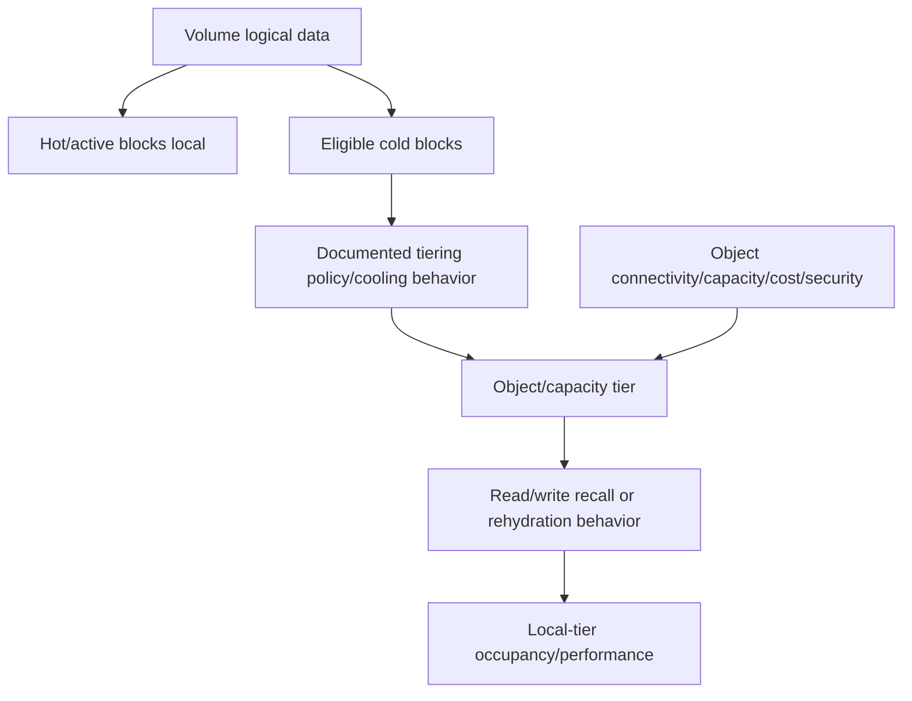

### Tiered reporting table

| Measure | What it answers | What it does not answer |
|---|---|---|
| Local physical used | Local-tier occupancy | Total physical footprint |
| Object-tier physical used | Capacity-tier occupancy under source | Local performance headroom |
| Logical represented | Workload data under source scope | Physical cost by itself |
| Tiering rate/backlog | Movement behavior | Application latency by itself |
| Recall/read pattern | Access to tiered blocks | Root cause without network/object evidence |

Capacity recommendations must include object-tier availability/cost, connectivity, encryption/security, recall/performance, backup/protection, minimum local hot set, rehydration, and failure scenarios. Tiering is not deletion.

---

## 9. Replication, clones, quotas, files, and capacity-like constraints

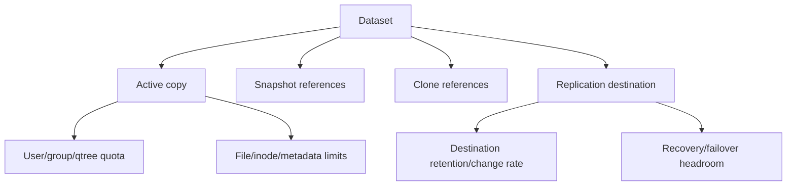

### Constraint inventory

| Constraint | Symptom | Capacity question |
|---|---|---|
| Volume available | Writes/autogrow fail or warn | Is containing local tier/policy able to grow? |
| Local tier available | Multiple volumes at risk | Which reserves, metadata, tiers and failure state apply? |
| Host filesystem/thin pool | App reports disk full | Is host allocation independent of ONTAP free? |
| Quota | Specific user/qtree blocked | Is logical quota reached despite physical free? |
| File count/metadata | Creates fail with bytes free | Is namespace/metadata constraint reached? |
| Replication destination | Lag/failure or no recovery headroom | Source change/retention/destination growth? |
| Object tier | Tiering/recall/cost issue | Capacity/connectivity/policy/service constraint? |

The right question is not only `How many bytes are free?` but `Which constraint can block the next required operation, and when?`

---

## 10. Fleet capacity data model

One row should represent one object, layer, tier, measure and time grain.

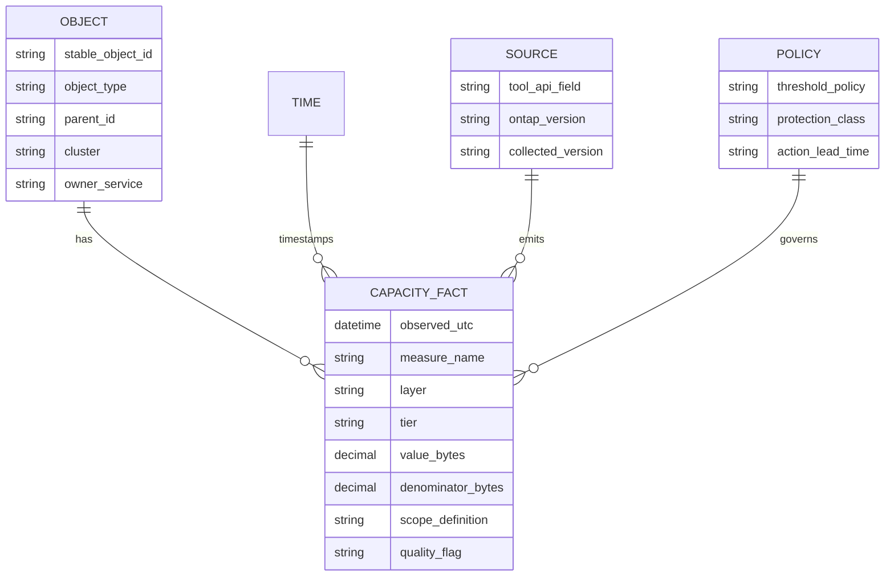

### Required fields

- Stable IDs and effective-dated hierarchy/ownership.
- UTC timestamp plus raw source time/time zone.
- Bytes as canonical unit plus original unit/value.
- Measure name, layer, tier, active/Snapshot/clone/replica scope.
- Numerator/denominator and source field/API/tool/version.
- Total, used, available, provisioned, logical/physical and reserve fields without conflation.
- Policy/SLO/protection/failure class.
- Collection state, missing/late/stale/estimated/invalid quality flags.

### Unit conversion

$$
1\ \text{TB}=10^{12}\ \text{bytes}
$$

$$
1\ \text{TiB}=2^{40}\ \text{bytes}=1{,}099{,}511{,}627{,}776\ \text{bytes}
$$

Therefore:

$$
100\ \text{TB}\approx90.95\ \text{TiB}
$$

A TB/TiB mismatch can look like roughly a 10% discrepancy. Preserve bytes and display the unit.

---

## 11. Fleet aggregation: sum bytes, never average percentages blindly

### Plain-English deep-dive: two glasses and one reservoir

A small glass 80% full and a reservoir 60% full are not `70% full` together. You must add their water and total capacities. **Why it matters:** a simple average gives tiny objects the same fleet weight as huge ones, while a fleet percentage can hide the small object that fills tomorrow.

### Weighted fleet utilization

Synthetic objects:

| Object | Used | Total | Utilization |
|---|---:|---:|---:|
| Small | 6.4 TiB | 8 TiB | 80% |
| Large | 48 TiB | 80 TiB | 60% |

Incorrect simple mean:

$$
\frac{80\%+60\%}{2}=70\%
$$

Correct aggregate utilization:

$$
\frac{6.4+48}{8+80}\times100=61.82\%
$$

Both are still needed: 61.82% describes total bytes; per-object risk reveals the small object's 80% condition.

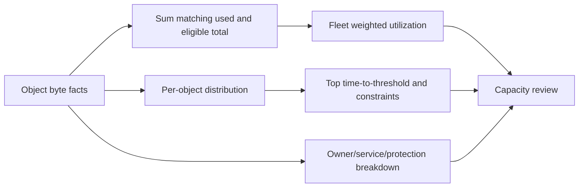

### Fleet views

- Total used/available by matching capacity layer.
- Per-object weighted and unweighted distributions, clearly labeled.
- Top current utilization and shortest forecast horizon.
- Growth contribution by service/object/customer/region/platform.
- Snapshot, efficiency, tiered and replication drivers.
- Risk by action lead time and data-quality confidence.
- Orphan/unowned/stale/missing objects.

---

## 12. Capacity stocks, flows, and decomposition

Capacity used is a **stock** measured at time $t$. Writes, deletes, efficiency, Snapshot changes, replication, moves, tier-out and tier-in are **flows** that change stocks.

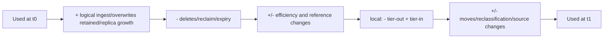

Conceptual local-physical reconciliation:

$$
C_{t+1}=C_t+I_t-D_t-E_t+R_t-TierOut_t+TierIn_t+M_t+\epsilon_t
$$

where $I$ is new retained physical demand, $D$ reclaim, $E$ net efficiency savings, $R$ Snapshot/replica retained change, $M$ moves/reclassification, and $\epsilon$ unresolved residual. Terms depend on field definitions; do not infer unavailable flows from one stock difference.

### Decomposition tree

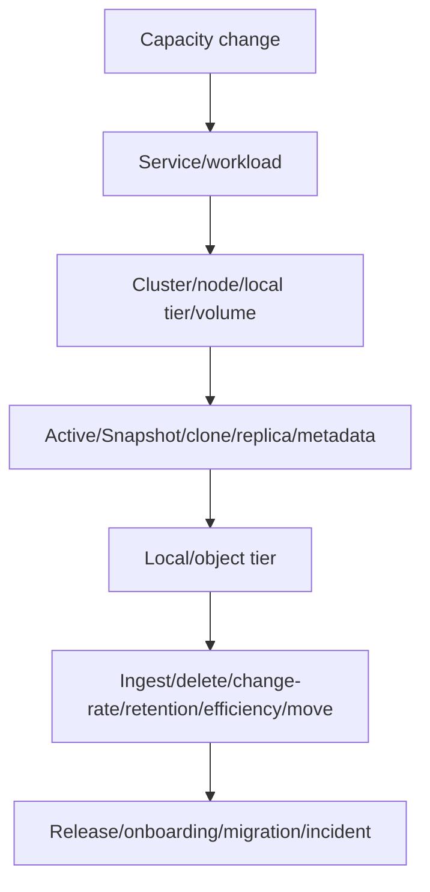

Power BI decomposition trees and drill-through can support this path, but source semantics and model relationships decide truth.

---

## 13. Data preparation for forecasting

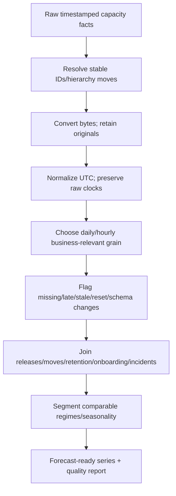

### Data-quality rules

- Missing capacity is unknown, never zero.
- Do not linearly interpolate across a move, reset, tier policy change or long gap without explicit justification.
- Distinguish actual deletion/tier-out from object replacement/source-ID change.
- Keep original and normalized units/timestamps.
- Mark backfilled points and exclude future information from model training.
- Forecast each meaningful constraint, not a mixed fleet percentage.
- Rebuild or segment after validated change points.

### Stock sampling caveat

Daily end-of-day capacity can miss intraday peaks and temporary files. Hourly maximum can overstate persistent risk. Store suitable raw grain and model both sustained stock and peak operating constraint where business relevant.

---

## 14. Linear trend and time-to-threshold

A linear model assumes approximately constant net growth:

$$
\hat{C}(t)=a+bt
$$

where $b$ is net capacity change per time unit.

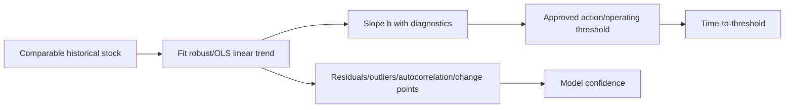

### Synthetic time-to-threshold

Current local physical used is 72 TiB. An approved synthetic operating threshold is 90 TiB. Validated net growth is 0.45 TiB/day:

$$
TTT=\frac{90-72}{0.45}=40\ \text{days}
$$

If growth is zero or negative, this formula does not yield a useful full date. If growth changes with workload, retention or tiering, use scenarios or another model.

### Do not extrapolate blindly

- Short window can capture one migration.
- Long window can average away a recent regime.
- Deletes and retention create step-downs.
- Capacity stock often has autocorrelated residuals.
- A linear fit can exceed physical bounds or miss seasonality/events.
- Confidence intervals must include model and scenario uncertainty.

---

## 15. CAGR and exponential growth

**Compound annual growth rate (CAGR)** is the constant annual rate connecting two endpoints:

$$
CAGR=\left(\frac{V_n}{V_0}\right)^{1/n}-1
$$

Synthetic growth from 120 TiB to 180 TiB over two years:

$$
CAGR=(180/120)^{1/2}-1=22.47\%
$$

One-year exponential projection:

$$
180\times(1+0.2247)\approx220.45\ \text{TiB}
$$

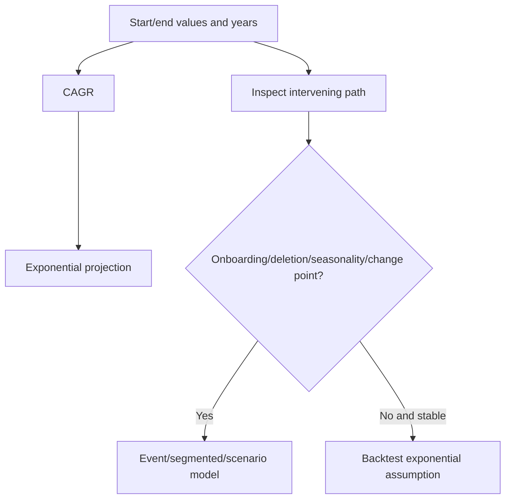

CAGR ignores the path, volatility, discrete onboarding, physical bounds, efficiency/tiering changes and deletion policies. Use it for high-level comparison only when its assumptions fit.

---

## 16. Seasonal and ETS forecasting

Capacity stock itself may rise over time, while its **net inflow** can repeat daily, weekly, month-end or annual cycles. Model the process that carries seasonality.

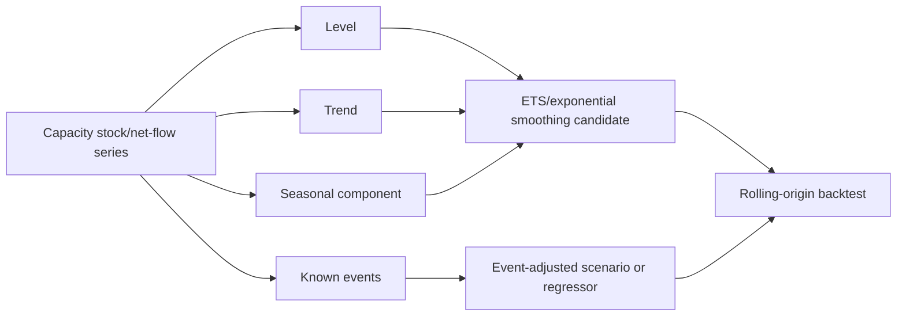

### Seasonal choices

| Pattern | Candidate method | Caveat |
|---|---|---|
| Stable weekly net growth | Seasonal naive/ETS | Need multiple complete cycles |
| Month-end ingest | Calendar/event regressors plus trend | Month lengths and business dates vary |
| Retention expiry sawtooth | Cohort/retention model | Average trend hides peaks |
| Annual peak | Seasonal model plus scenarios | Few annual cycles create high uncertainty |
| Irregular migrations | Explicit event scenarios | Do not teach model that every spike repeats |

Excel `FORECAST.ETS` can model seasonality with documented parameters and data requirements. It is not an automatic truth engine: select valid timelines, detect seasonality carefully, hold out data, inspect residuals, and document settings. SQL/Python may provide reproducible pipelines and richer validation.

---

## 17. Event-driven and workload-onboarding forecasts

Workload onboarding, migration, retention changes, acquisitions, application releases, archival, encryption/compression changes, and protection redesign can create steps or ramps outside historical trend.

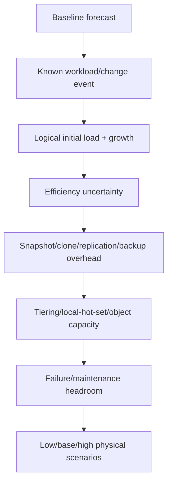

### Synthetic onboarding range

A planned workload has 200 TiB logical initial data. No production reduction test exists. Scenarios:

| Scenario | Assumed logical-to-physical ratio | Base physical before protection/tiering |
|---|---:|---:|
| Conservative | 1.5:1 | 133.33 TiB |
| Planning | 2.0:1 | 100 TiB |
| Optimistic | 2.5:1 | 80 TiB |

$$
Physical=\frac{Logical}{assumed\ ratio}
$$

These are sensitivity cases, not guarantees. Add separately measured Snapshot/change-rate, replication destination, local hot-set, object-tier, metadata, failure-state and growth needs. The decision should remain viable under a conservative approved case.

### Event register

| Event | Date/window | Capacity effect | Confidence | Owner | Validation |
|---|---|---|---|---|---|
| Onboarding | Planned | Step plus growth | Medium | App/storage | Pilot ingest/ratio/change rate |
| Retention extension | Approved | Delayed reclaim | High/medium | Data owner | Cohort expiry model |
| Encryption | Planned | Potential efficiency shift | Low until test | Security/app | Representative reduction test |
| Tiering policy change | Proposed | Local/object redistribution | Medium | Storage/cloud | Local/recall/cost canary |

---

## 18. Forecast validation and error metrics

Do not grade a model on the same data used to fit it. Use time-ordered holdouts or **rolling-origin backtesting**.

```mermaid
flowchart LR
    T1[Train through t1] --> P1[Predict next horizon]
    T2[Train through t2] --> P2[Predict next horizon]
    T3[Train through t3] --> P3[Predict next horizon]
    P1 --> ERR[Errors by horizon/season/regime]
    P2 --> ERR
    P3 --> ERR
    ERR --> SELECT[Choose simplest adequate model/scenarios]
```

### Error metrics

For actual $y_t$ and forecast $\hat y_t$:

$$
MAE=\frac{1}{n}\sum|y_t-\hat y_t|
$$

$$
RMSE=\sqrt{\frac{1}{n}\sum(y_t-\hat y_t)^2}
$$

$$
WAPE=\frac{\sum|y_t-\hat y_t|}{\sum|y_t|}
$$

$$
Bias=\frac{1}{n}\sum(\hat y_t-y_t)
$$

| Metric | Strength | Limitation |
|---|---|---|
| MAE | Capacity-unit interpretation | Treats large/small errors linearly |
| RMSE | Penalizes large misses | Sensitive to events/outliers |
| MAPE | Familiar percentage | Undefined/unstable near zero and weights small objects heavily |
| WAPE | Aggregate relative error | Can hide small critical objects |
| Bias | Finds systematic over/under forecast | Positive/negative errors can cancel |

Evaluate date error for threshold crossing too: a capacity model can have small byte error but predict the action date too late.

---

## 19. Uncertainty: intervals, scenarios, assumptions, and confidence

### Plain-English deep-dive: arrival time with traffic and a scheduled road closure

A navigation app gives a central arrival time, a range from ordinary traffic variation, and a different route scenario for a known road closure. Capacity planning needs the same distinction. **Why it matters:** a narrow statistical interval cannot include an unmodeled acquisition, and a broad scenario is not the same as random forecast error.

```mermaid
flowchart TD
    UNC[Forecast uncertainty] --> DATA[Missing/stale/noisy/definition changes]
    UNC --> MODEL[Trend/seasonality/residual/model choice]
    UNC --> PARAM[Estimated slope/season/efficiency]
    UNC --> EVENT[Onboarding/retention/migration timing/size]
    UNC --> POLICY[Threshold/reserve/lead-time decisions]
    DATA --> RANGE[Prediction interval/scenarios/confidence]
    MODEL --> RANGE
    PARAM --> RANGE
    EVENT --> RANGE
    POLICY --> RANGE
```

### Uncertainty register

| Assumption | Low/base/high | Evidence | Sensitivity | Owner/date |
|---|---|---|---|---|
| Net growth | Measured range | Backtest/history | Threshold date | Capacity analyst |
| Efficiency | Conservative/test/planning | Representative pilot | Physical need | App/storage |
| Snapshot change | Retention/change-rate scenarios | Snapshot data | Peak space | Protection |
| Onboarding date | Earliest/plan/latest | Project plan | Action deadline | Program owner |
| Tiering | Local hot set and movement range | Pilot/current fields | Local/object need | Storage/cloud |

Publish central, lower and upper risk dates with assumptions. Use conservative action dates when consequences are high and expansion lead time is long.

---

## 20. Thresholds, alerts, and action lead time

A **hard limit** blocks or degrades an operation. A **threshold** is a policy decision boundary. An **alert** is a notification generated by a condition. A **forecast risk date** estimates when a threshold may be crossed. They are not interchangeable.

```mermaid
flowchart LR
    LIMIT[Documented hard/operational constraint] --> POLICY[Approved operating threshold/headroom]
    POLICY --> FORECAST[Forecast crossing distribution]
    FORECAST --> LEAD[Subtract end-to-end action lead time]
    LEAD --> ACTION[Owner must start by action date]
    ACTION --> ALERT[Alert/escalation/reminder workflow]
    ALERT --> VALID[Completion and post-change validation]
```

### Lead-time model

$$
L_{action}=L_{analysis}+L_{approval}+L_{procurement}+L_{delivery}+L_{implementation}+L_{validation}+L_{contingency}
$$

$$
ActionDate=ForecastRiskDate-L_{action}
$$

### Synthetic action-date calculation

The Part 14 synthetic time-to-threshold is 40 days. End-to-end action lead time is:

| Component | Days |
|---|---:|
| Analysis/design | 5 |
| Approval/change | 7 |
| Procurement/delivery | 25 |
| Implementation | 3 |
| Validation | 5 |
| Contingency | 5 |
| **Total** | **50** |

$$
40-50=-10\ \text{days}
$$

The action start is already ten days late under the synthetic assumptions, even though the threshold is 40 days away. Escalate options now: demand control, reclaim with owners, placement/tiering where supported, temporary risk control, or accelerated/additional capacity.

### Multi-stage policy without universal percentages

```mermaid
stateDiagram-v2
    [*] --> Observe
    Observe --> Investigate: Forecast horizon enters review window
    Investigate --> Plan: Risk confirmed and owner assigned
    Plan --> Execute: Action start date reached
    Execute --> Escalate: Milestone slips or risk worsens
    Execute --> Validate: Capacity/control delivered
    Validate --> Rebaseline: New stable regime
    Escalate --> Execute: Recovery plan approved
```

Set each transition from product/app constraints, failure/protection reserve, forecast error, business impact, and action lead time. Do not copy percentages between objects.

---

## 21. Threshold design by constraint and consequence

```mermaid
flowchart TD
    OBJ[Object/constraint] --> HARD[Documented failure/degradation behavior]
    HARD --> HEAD[Required normal/failure/protection headroom]
    HEAD --> ERR[Forecast/data uncertainty]
    ERR --> LEAD[Action lead time]
    LEAD --> IMP[Business impact/critical period]
    IMP --> TH[Approved threshold and workflow]
```

### Threshold policy fields

- Object/type/layer/tier and exact numerator/denominator.
- Documented hard or operational constraint and source/release.
- Normal, maintenance, takeover/failure and protection-state headroom.
- Current value, forecast date/range and model/backtest error.
- Observe/investigate/plan/execute/escalate rules.
- Action lead-time components and latest safe start date.
- Owner, approver, notification, ticket/change/procurement linkage.
- Suppression/deduplication, stale-data behavior and escalation.
- Validation/closure/rebaseline criteria.

### Alert-quality traps

| Trap | Result | Fix |
|---|---|---|
| One static percentage everywhere | Too early for some, too late for others | Constraint/lead-time policy |
| Alert on current percentage only | Misses fast growth | Forecast horizon/change rate |
| Forecast only | Misses sudden spike/full condition | Current hard/operating signals too |
| No stale-data alert | Green dashboard from dead collector | Data-freshness control |
| Duplicate child/parent alerts | Noise and conflicting owners | Dependency-aware grouping |
| No owner/action link | Repeated warning without execution | Ticket/milestone/escalation workflow |
| Auto-close on brief dip | Flapping after deletion/tiering | Sustained closure and validation |

---

## 22. Capacity discrepancy troubleshooting tree

```mermaid
flowchart TD
    START[Two sources disagree] --> TIME{Same timestamp/grain/freshness?}
    TIME -->|No| ALIGN[Align and label stale/gaps]
    TIME -->|Yes| OBJ{Same stable object and hierarchy?}
    OBJ -->|No| MAP[Resolve moves/FlexGroup/parent-child IDs]
    OBJ -->|Yes| UNIT{Same bytes/TB/TiB/rounding?}
    UNIT -->|No| CONV[Convert from original bytes]
    UNIT -->|Yes| LAYER{Same logical/physical/provisioned/effective?}
    LAYER -->|No| DICT[Use field dictionary]
    LAYER -->|Yes| SCOPE{Same active/Snapshot/clone/replica/reserve scope?}
    SCOPE -->|No| RECON[Reconcile named components]
    SCOPE -->|Yes| TIER{Same local/object/total tier?}
    TIER -->|No| TMAP[Separate tiers/unions]
    TIER -->|Yes| BUG[Check source version/collection defect with owner]
```

### Discrepancy worksheet

| Field | Source A | Source B | Resolution |
|---|---|---|---|
| Timestamp/freshness |  |  |  |
| Object ID/type/parent |  |  |  |
| Numerator/denominator |  |  |  |
| Bytes/unit/rounding |  |  |  |
| Logical/physical/provisioned |  |  |  |
| Active/Snapshot/clone/replica |  |  |  |
| Local/object tier |  |  |  |
| Reserve/metadata/guarantee |  |  |  |
| Tool/API/ONTAP version |  |  |  |

Never average disagreeing sources. Resolve semantics or carry the discrepancy as uncertainty.

---

## 23. `Full` symptom troubleshooting tree

```mermaid
flowchart TD
    SYM[Write/create/grow/report says full] --> APP{Application/database limit?}
    APP --> HOST{Host filesystem/thin pool/partition?}
    HOST --> QUOTA{User/qtree/file/metadata quota or limit?}
    QUOTA --> LUN{LUN logical size/reservation/path?}
    LUN --> VOL{Volume available/autosize/Snapshot space?}
    VOL --> LT{Local tier available/reserves/metadata?}
    LT --> TIER{FabricPool object tier/connectivity/policy?}
    TIER --> PROT{Replication/backup/failure state constraint?}
    PROT --> DOC[Exact errors/fields/events/current docs/Support]
```

### Immediate evidence and safety

1. Preserve exact error, object, operation, time, app/host/ONTAP state and recent changes.
2. Identify which layer denied the operation.
3. Protect data/recovery and stop uncontrolled retries or growth with owners.
4. Do not delete Snapshots, disable protection, remove reservations, force tiering, resize, move, or alter autosize/autodelete based only on a red chart.
5. Use current supported emergency procedures and Support for production risk.
6. Validate writes, app consistency, protection, capacity hierarchy and recurrence after mitigation.

---

## 24. Discovery, evidence, risk, recommendations, and JD Mapping

### Discovery questions

1. Which business service, dataset, object, layer, tier, protection class and operation is at risk?
2. What do `total`, `used`, `free`, `available`, `reserved`, `provisioned`, `logical`, `physical`, `effective` and `tiered` mean in each source?
3. Are bytes/units/timestamps/IDs/hierarchy/source versions and missing data reconciled?
4. How do active data, Snapshots, clones, replicas, metadata, quotas, guarantees/reservations and object tier contribute?
5. What are net ingest/delete/reclaim/change-rate/efficiency/tier/move flows and known change points?
6. Which linear/CAGR/ETS/event/scenario model is supported by backtesting and residuals?
7. What prediction range and assumption sensitivities govern the risk date?
8. Which hard/operating threshold applies in normal, maintenance and failure states?
9. What is the full analysis-to-validation lead time and latest safe action date?
10. Which reclaim, retention, application, placement, tiering, efficiency, protection, demand-control, resize, capacity and status-quo options are supported?

### Minimum evidence pack

- Stable object/hierarchy/owner/service/protection inventory.
- Raw bytes plus original values/units/timestamps/tool/API/ONTAP versions.
- Capacity field dictionary with numerator/denominator/layer/tier/scope.
- Active/Snapshot/clone/replication/quota/reservation/guarantee/metadata reconciliation.
- Daily/intraday stock history and known flow/event/change register.
- Forecast candidates, train/test windows, rolling backtests, residual/error/bias and crossing-date error.
- Low/base/high assumptions for growth, efficiency, Snapshot, onboarding, tiering and timing.
- Exact current product/app constraints and approved threshold policy.
- End-to-end action lead time, owner, milestones, dependencies, validation and residual risk.

### Recommendation model

```mermaid
flowchart TD
    E[Typed reconciled capacity + trustworthy history] --> C[Business/protection/failure/event context]
    C --> F[Backtested forecast + scenarios + uncertainty]
    F --> R[Risk date versus action lead time]
    R --> O[Reclaim/app/retention/tier/placement/capacity/status-quo options]
    O --> A[Owner/date/dependencies/change/rollback]
    A --> V[Capacity/app/protection/failure validation]
    V --> RR[Residual risk/monitoring/rebaseline]
```

### Recommendation patterns

| Finding | Risk | Bounded recommendation | Validation |
|---|---|---|---|
| Local tier crosses policy threshold before purchase lead time | Multi-volume write/protection risk | Start approved capacity path and evaluate reversible demand/reclaim/placement options | New headroom plus normal/failure app/protection tests |
| Snapshot growth follows unowned retention change | Capacity risk versus recovery obligation | Confirm legal/app/RPO owner; model retention options; no deletion without approval | Recovery coverage and sustained capacity trend |
| Dashboard efficiency includes tiering in one view | Planning underestimates total physical/cost | Separate logical, total physical, local and object-tier metrics | Reconciled bytes and invoice/object data |
| CAGR ignores planned onboarding | Risk date too late | Add event low/base/high scenarios and pilot efficiency/change rate | Pilot versus assumptions and revised forecast |
| Fleet average looks healthy but small critical volume has short horizon | Local service outage risk hidden | Rank by object time-to-threshold/lead time, not fleet percentage | Owner action/milestone and object trend |

### JD Mapping

| JD responsibility | Part 45 contribution | Your factual bridge and gap |
|---|---|---|
| Generate/analyze customer data | Typed capacity facts, QA, decomposition, forecasts | MBA/Excel/Power BI/SQL/Python transfer strongly |
| Storage depth | ONTAP logical/physical/Snapshot/tiering/reserve hierarchy | Conceptual/synthetic; no production administration claim |
| Strategic advice | Lead-time, onboarding, lifecycle and option modeling | Business analytics and review strength |
| Risk/stability | Full-condition, protection and failure-state controls | critical-situation discipline transfers |
| Service reviews | Fleet risk, decisions, owners and forecast accuracy | Customer communication transfers |
| Influence/adoption | Aligns app, data, storage, finance and procurement | Cross-team prior experience transfers |
| Supportability | Requires exact release/source/Support evidence | No gated/customer result claimed |

---

## 25. Fully synthetic scenario: Northstar Media capacity decision

> **Synthetic case:** Northstar Media, every object, capacity value, threshold, source, forecast, model, policy, action and result below is fictional. It is not customer telemetry, a platform-sizing recommendation, or your production work.

### Situation

- A local tier hosts editing volumes, a media catalog, Snapshots and a replication destination.
- One dashboard reports `87% used`; another reports `72% local used`; finance reports object storage growth.
- A 200-TiB logical archive onboarding is planned in 45 days.
- Procurement plus implementation/validation normally requires a synthetic 50-day lead time.
- A retention extension and tiering-policy pilot occurred in the historical window.

```mermaid
flowchart TB
    EDIT[Editing workload] --> VOL1[Active volumes]
    CAT[Catalog] --> VOL2[Database volume]
    SNAP[Snapshots] --> LT[Local tier]
    DEST[Replication destination] --> LT
    VOL1 --> LT
    VOL2 --> LT
    LT --> FP[FabricPool]
    FP --> OBJ[Object tier]
    ARCH[Planned archive] -.onboarding.-> LT
    ARCH -.tiering.-> OBJ
```

### Reconciliation

| Dashboard value | Contract | Finding |
|---|---|---|
| 87% | Logical represented / displayed effective denominator | Includes efficiency representation; not physical utilization |
| 72% | Local physical used / eligible local physical total | Candidate local operating measure |
| Object growth | Object-tier physical bytes and cost | Needed for total physical/cost, not local denominator |
| 240% efficiency | Logical/physical under source's active+Snapshot scope | Must not multiply available capacity blindly |

```mermaid
sequenceDiagram
    autonumber
    participant A as Analyst
    participant D as Dashboard/API owners
    participant S as Storage/protection owners
    participant P as Program/finance
    A->>D: Request fields, units, times, scope, version
    D-->>A: Logical/effective view and local physical view
    A->>S: Reconcile active/Snapshot/replica/reserve/tiering
    S-->>A: Retention and tier-policy change dates
    A->>P: Add archive scenarios and lead time
    P-->>A: Earliest/plan/latest onboarding dates
```

### Historical regimes

| Period | Valid interpretation |
|---|---|
| Before retention extension | Old Snapshot-reclaim regime |
| After retention extension | Higher retained changed-block stock |
| Tiering pilot | Local stock falls; object stock rises |
| Planned archive | New event outside historical trend |

A single linear fit over all periods is rejected because changes alter the data-generating process.

### Forecast scenarios

Current synthetic local physical used: 72 TiB. Approved local operating threshold: 90 TiB. Post-change baseline growth: 0.45 TiB/day before archive.

| Scenario | Archive physical basis | Initial local hot share | Event timing | Modeled consequence |
|---|---:|---:|---|---|
| Low | 80 TiB | 20% | Day 55 | Threshold before event from base growth |
| Base | 100 TiB | 30% | Day 45 | Event makes current plan infeasible |
| High | 133.33 TiB | 50% | Day 35 | Immediate major local/object/protection need |

Even without archive:

$$
TTT=(90-72)/0.45=40\ days
$$

With 50-day action lead time, action is already late. Archive assumptions worsen the risk.

### Hypothesis and decision tree

```mermaid
flowchart TD
    RISK[Capacity plan at risk] --> BAD{Is 87% physical local utilization?}
    BAD -->|No| RECON[Use 72% local physical plus total object view]
    RISK --> RET{Did retention create persistent slope/step?}
    RISK --> TIER{Did tiering only move physical location?}
    RISK --> ARCH{Is archive represented in history?}
    RET --> MODEL[Segmented + event scenarios]
    TIER --> MODEL
    ARCH --> MODEL
    MODEL --> LEAD[Compare upper risk date to 50-day lead]
    LEAD --> ACT[Start owned mitigation/capacity decision now]
```

### Options

| Option | Benefit | Risk/tradeoff |
|---|---|---|
| Delay/phase archive | Reduces immediate step | Program/business delay |
| Validate higher tiering share | Reduces local occupancy | Object cost/recall/connectivity/local hot-set risk |
| Review retention with owner | May reduce retained changes | Recovery/legal/compliance risk |
| Place archive on suitable capacity | Isolates growth | Cost, lead time, support/design work |
| Expand/add supported capacity | Restores headroom | Procurement/change/failure-state planning |
| Rely on 2.4:1 efficiency | No immediate spend | Unacceptable: ratio is scope/workload dependent |

### Recommendation

1. Open the capacity action now because the upper/base risk date precedes end-to-end lead time.
2. Use 72% only as the reconciled local-physical starting point; retain logical/effective and object-tier views separately.
3. Segment retention and tiering regimes; publish low/base/high archive ratios, local hot share and event dates.
4. Pilot representative archive data to measure reduction, change rate, recall and object cost, without turning results into a guarantee.
5. Compare phasing, supported placement/tiering and additional capacity while preserving recovery, legal retention, editing SLO and failure-state headroom.
6. Assign milestones and escalate any procurement/design delay; validate capacity, app, protection and object-tier outcomes after action.

### Customer-facing summary

> "The 87% and 72% values use different logical/effective and local-physical contracts, so they should not be averaged. The reconciled local view reaches the approved operating threshold in about 40 days under the post-change base slope, before the 50-day action lead time, and the planned archive is not represented in history. We recommend starting the capacity decision now, testing archive reduction and hot-set assumptions, and evaluating phasing, tiering/placement and supported capacity without weakening retention or recovery obligations."

---

## 26. Your analytics, MBA, Power BI, and Microsoft 365 transfer

```mermaid
flowchart LR
    M365[M365/Azure service analysis] --> ID[Stable scope/dependency/change evidence]
    CRIT[Critical situation] --> RISK[Impact/owner/action/escalation]
    MBA[MBA analytics/statistics] --> FC[Forecast/backtest/scenario/uncertainty]
    TOOLS[Excel Power BI SQL Python] --> PIPE[QA/model/decomposition/dashboard]
    ID --> METHOD[ONTAP synthetic capacity method]
    RISK --> METHOD
    FC --> METHOD
    PIPE --> METHOD
    METHOD --> GAP[Production ONTAP fields/sizing/operations still require lab/mentoring]
```

### Transfer and gap

| Factual strength | Natural transfer | Honest gap |
|---|---|---|
| Microsoft service/support data | Source QA, IDs, timelines, cohorts and changes | Not ONTAP capacity-field operation |
| Critical-situation ownership | Consequence, mitigation, owner, date and escalation | No production storage change authority |
| MBA/statistics | Trend/seasonality/backtest/scenario/uncertainty | No NetApp platform-sizing ownership |
| Excel/Power BI/SQL/Python | Reproducible models, decomposition and reviews | No customer telemetry/tool entitlement assumed |

### Honest interview answer

> "I refuse to forecast an unlabeled percentage. I first type every number by object, layer, unit, local/object tier, active/Snapshot/replica/reserve scope, time and source. I reconcile stocks and events, segment change points, compare linear, compound, seasonal and event models with rolling backtests, and publish ranges. The action date is the risk date minus full lead time. My production experience is enterprise support and analytics, not ONTAP capacity administration or sizing."

---

## 27. Labs, dashboard build, and self-test

### Whiteboard drills

1. Measurement contract: object, layer, numerator, denominator, unit, tier, scope, time, source.
2. Raw -> protection/system deductions -> usable -> allocation.
3. Provisioned -> logical -> efficiency -> physical -> local/object tier.
4. Free -> eligibility/policy -> available; list named reserves.
5. Host/database -> filesystem -> LUN -> volume -> local tier -> object tier.
6. Active writes -> Snapshot changed blocks -> retention/reclaim.
7. Fleet bytes -> weighted utilization plus per-object risk.
8. Stock bridge: ingest, delete, efficiency, reference, tier and move flows.
9. Linear/CAGR/ETS/event models and rolling backtest.
10. Risk date -> lead time -> action date -> owner/escalation.

### Dashboard lab

Create a synthetic Power BI/Excel/SQL/Python model for 150 clusters and 20,000 objects with local/object-tier facts, Snapshots, replicas, reservations, efficiency, planned onboarding, time-varying ownership, gaps and source changes.

Required pages:

1. Executive risk: bytes, headroom, risk dates/ranges, action deadlines and owners.
2. Fleet distribution: weighted totals plus object-level horizon/hotspots.
3. Capacity bridge: active/Snapshot/replica/metadata and local/object tier.
4. Growth decomposition: service/object/type/driver/event.
5. Forecast diagnostics: model, train/test, error, bias, residual and crossing-date error.
6. Scenario planner: growth/efficiency/Snapshot/onboarding/tiering/lead-time sensitivity.
7. Data quality: stale/missing/orphan/definition/unit/hierarchy issues.
8. Action tracker: recommendation, owner, dependency, milestone, status and validation.

```mermaid
flowchart LR
    INGEST[Ingest raw facts/events] --> QA[Contract/unit/time/ID QA]
    QA --> MODEL[Capacity star schema]
    MODEL --> DECOMP[Decomposition/drill-through]
    MODEL --> FORE[Forecast/backtest/scenarios]
    FORE --> RISK[Risk/action dates]
    DECOMP --> RISK
    RISK --> TRACK[Owner/action/validation tracker]
```

### Lab calculations

1. Convert every original TB/TiB value to canonical bytes.
2. Reconcile used/available/reserves/total and flag residuals.
3. Calculate logical/total-physical reduction; keep local/object tiers separate.
4. Calculate weighted fleet utilization and per-object distributions.
5. Estimate slopes over multiple windows and detect change points/events.
6. Calculate linear TTT and action-date range.
7. Calculate CAGR only for valid endpoint comparisons.
8. Fit seasonal/event candidates and use rolling-origin backtests.
9. Calculate MAE/RMSE/WAPE/bias and threshold-date error.
10. Run low/base/high onboarding, efficiency, Snapshot, tier and lead-time scenarios.

### Lab pass checklist

- [ ] No mixed logical/physical/provisioned/effective percentage.
- [ ] Every value carries layer, scope, unit, tier, time and source.
- [ ] Parent/child, active/Snapshot/clone/replica and local/object double counts are controlled.
- [ ] Missing data remains unknown and source changes are segmented.
- [ ] Weighted fleet totals coexist with per-object risk.
- [ ] Forecasts are backtested in time order with uncertainty.
- [ ] Known events are explicit scenarios, not buried in trend.
- [ ] Thresholds derive from constraints, failure/protection headroom, uncertainty and lead time.
- [ ] Alerts have owners, workflow, freshness and closure validation.
- [ ] No efficiency, capacity, threshold or production ONTAP claim is invented.

### Self-test

1. Define and use the nine-field measurement contract.
2. Compare raw, usable, provisioned, logical, physical and effective capacity.
3. Compare free, available and six reserve/commitment concepts.
4. Explain thin provisioning and why provisioning ratio is not risk by itself.
5. Trace SAN/application full conditions across every layer.
6. Explain Snapshot changed-block retention without calling it a full copy.
7. Separate local, object-tier and total physical capacity.
8. Prevent hierarchy, FlexGroup, clone, Snapshot and replica double counting.
9. Calculate efficiency ratio/savings and disclose scope.
10. Convert TB/TiB and calculate weighted fleet utilization.
11. Distinguish stock from flow and build a capacity bridge.
12. Prepare a forecast-ready series without filling unknowns with zero.
13. Calculate linear time-to-threshold.
14. Calculate and challenge CAGR/exponential growth.
15. Explain seasonal/ETS and event-driven models.
16. Design low/base/high onboarding scenarios.
17. Run rolling-origin validation and explain MAE/RMSE/WAPE/bias.
18. Separate statistical, event, data and policy uncertainty.
19. Derive action date from risk date and full lead time.
20. Build constraint-specific thresholds/alerts and troubleshoot discrepancies/full symptoms.
21. Recreate Northstar Media and answer Q1-Q8 aloud.

---

## 28. Official Source Anchors

**Date checked: 2026-08-24.** These official and credible public sources anchor ONTAP capacity, volumes, efficiency, Snapshot, FabricPool, forecasting, visualization, and statistical concepts. Exact fields, settings, limits, defaults, behavior, support and alert thresholds remain release/platform/application/configuration sensitive.

| Topic | Official or credible public source | Bounded use and currency note |
|---|---|---|
| Volume administration | [ONTAP volumes](https://docs.netapp.com/us-en/ontap/volumes/index.html) | Current volume capacity, space and configuration navigation; reopen exact release |
| Display space | [Commands for displaying space usage](https://docs.netapp.com/us-en/ontap/volumes/commands-display-space-usage-reference.html) | Current command/source orientation; verify fields and semantics |
| Local tiers | [ONTAP disks and local tiers](https://docs.netapp.com/us-en/ontap/disks-aggregates/index.html) | Current RAID/local-tier/storage organization |
| Storage efficiency | [ONTAP storage efficiency overview](https://docs.netapp.com/us-en/ontap/concepts/storage-efficiency-overview.html) | Current dedupe/compression/compaction concepts; no guaranteed ratio |
| Snapshot copies | [ONTAP data protection and Snapshot copies](https://docs.netapp.com/us-en/ontap/data-protection/index.html) | Current protection/Snapshot navigation; verify exact space behavior |
| FabricPool | [ONTAP FabricPool](https://docs.netapp.com/us-en/ontap/fabricpool/index.html) | Current local/object-tier architecture and configuration navigation |
| FabricPool policies | [FabricPool tiering policies](https://docs.netapp.com/us-en/ontap/fabricpool/tiering-policies-concept.html) | Current policy/cooling/retrieval behavior; exact release applies |
| REST storage resources | [ONTAP REST API documentation](https://docs.netapp.com/us-en/ontap-automation/reference/api_reference.html) | Current API resource/field references; inspect cluster's version |
| Forecasting/statistics | [NIST/SEMATECH e-Handbook](https://www.itl.nist.gov/div898/handbook/) | Regression, residual, time-series and uncertainty orientation |
| Excel ETS | [Microsoft FORECAST.ETS](https://support.microsoft.com/en-us/office/forecast-ets-function-15389b8b-677e-4fbd-bd95-21d464333f41) | Official function syntax/data/seasonality behavior; validate model |
| Power BI decomposition | [Microsoft Power BI decomposition tree](https://learn.microsoft.com/en-us/power-bi/visuals/power-bi-visualization-decomposition-tree) | Official interactive root-cause decomposition visual guidance |
| Power BI drill mode | [Microsoft Power BI drill mode](https://learn.microsoft.com/en-us/power-bi/consumer/end-user-drill) | Official drill/down/up/through usage; data model governs meaning |
| Power BI anomalies | [Microsoft Power BI anomaly detection](https://learn.microsoft.com/en-us/power-bi/visuals/power-bi-visualization-anomaly-detection) | Official anomaly visual guidance; not causal proof |

### Source-use discipline

- Capture exact ONTAP/platform/object/field/source/release/date and support caveats.
- Preserve raw bytes and display units; never infer TB versus TiB.
- Label active/Snapshot/clone/replica, local/object tier, and logical/physical scope.
- Treat efficiency, tiering and protection as separate dimensions unless the source defines a combined metric.
- Backtest forecasts and keep known events/scenarios outside unjustified trend.
- Derive thresholds from current constraints and action lead time, never copied percentages.
- Use current supported sizing tools and specialists for purchase/platform decisions.
- Mark inaccessible, stale, estimated, missing and disputed evidence explicitly.

---

## Likely Interview Questions

### Q1. How do raw, usable, provisioned, logical, physical, and effective capacity differ?

> **Model answer:** "Raw is media nameplate capacity. Usable follows a named set of protection/system deductions. Provisioned is logical address space promised. Logical used is data represented before named savings; physical used is consumed media/tier bytes. Effective is a stated logical-to-physical or other ratio, not free space. Every value needs object, numerator, denominator, tier, scope, unit, time and source."

### Q2. How do free, available, and reserved capacity differ?

> **Model answer:** "Free is a source-defined arithmetic remainder. Available is what a particular consumer may allocate now after policy, guarantees, reserves, limits and health. Reserved is committed for a named purpose such as Snapshot, volume/LUN behavior, metadata/root or failure/protection headroom. I never combine unlike reserves or reclaim them without owner, support and consequence analysis."

### Q3. How do efficiency, Snapshots, and FabricPool affect capacity interpretation?

> **Model answer:** "Efficiency represents logical data with fewer physical bytes under an exact active/Snapshot/clone scope; I report ratio and savings without guarantees. Snapshots share unchanged blocks and retain changed/deleted referenced blocks. FabricPool moves eligible physical blocks between local and object tiers, reducing local occupancy but not deleting total data. I show logical, total physical, local physical and object physical separately."

### Q4. How do you build a fleet capacity dataset and dashboard?

> **Model answer:** "I use stable effective-dated object hierarchy and one fact per object/layer/tier/measure/time, canonical bytes plus original values, field definitions, source/version and quality flags. I sum matching bytes for fleet utilization rather than averaging percentages, preserve object distributions/hotspots, decompose active/Snapshot/replica/tier drivers, and link risk dates to owners/actions."

### Q5. How do you choose and validate a capacity forecast?

> **Model answer:** "I clean IDs/units/times/gaps, separate stocks from flows, segment change points and join known events. I compare simple linear, CAGR/exponential, seasonal/ETS and event scenarios according to mechanism. Rolling-origin backtests measure MAE, RMSE, WAPE, bias and threshold-date error. I publish ranges and assumptions, not one false-precision date."

### Q6. How do you forecast a new workload with uncertain efficiency?

> **Model answer:** "I start with logical initial data and growth, then use conservative/base/optimistic reduction cases supported by representative pilot data, never a guarantee. I add Snapshot change/retention, replicas, local hot set, object tier, metadata and failure-state headroom separately. I test event date and size sensitivity and choose a plan viable under an approved conservative case."

### Q7. How do you design capacity thresholds and alerts?

> **Model answer:** "I identify the exact documented constraint, required normal/failure/protection headroom, forecast uncertainty, business impact and full analysis-to-validation lead time. The latest action date is risk date minus that lead time. Observe, investigate, plan, execute and escalate stages each have owners and workflow. I monitor current conditions, forecast horizon and data freshness."

### Q8. How does your background transfer, and what remains a gap?

> **Model answer:** "My prior support work gives me source validation, impact/change timelines and cross-team ownership. My MBA and Excel, Power BI, SQL, Python and statistics support reconciliations, decomposition, forecasting, backtesting and scenarios. I have not owned production ONTAP capacity, sizing, FabricPool or efficiency changes, so I would use current docs, authorized data and NetApp/app specialists."

---

## 30-Second Memory Hooks

- **Capacity contract:** Object, layer, numerator, denominator, unit, tier, scope, time, source.
- **Raw:** Nameplate; **usable:** after named deductions.
- **Provisioned:** Promise; **logical:** represented; **physical:** occupied.
- **Effective:** Formula with scope, never `free space` by itself.
- **Free:** Arithmetic remainder; **available:** eligible now; **reserved:** named purpose.
- **Thin:** Promise now, consume later; risk depends on simultaneous realization and lead time.
- **Snapshot:** Shared unchanged blocks, retained changed references.
- **FabricPool:** Moves physical location; does not delete data.
- **Efficiency:** Workload- and scope-dependent, never guaranteed from labels.
- **Fleet:** Sum bytes; keep object hotspots. Never average percentages blindly.
- **Stock:** Used now; **flow:** what changes it.
- **Linear:** Constant net growth; **CAGR:** endpoint compound rate.
- **ETS:** Level + trend + seasonality, validated out of sample.
- **Event:** Model onboarding explicitly; history cannot know the future plan.
- **Uncertainty:** Data + model + parameter + event + policy assumptions.
- **Action date:** Forecast risk date minus full lead time.
- **Alert:** A workflow signal, not the threshold or hard limit.
- **Your bridge:** Analytics rigor transfers; ONTAP capacity operation/sizing does not.

---

## Completion Checklist

- [ ] Attach the full measurement contract to every capacity value.
- [ ] Reconcile raw, usable, provisioned, logical, physical and effective layers.
- [ ] Distinguish free, available and every named reserve/commitment.
- [ ] Trace host/LUN/volume/local-tier/object-tier constraints.
- [ ] Explain thin provisioning/oversubscription without using ratio as risk alone.
- [ ] Model Snapshot changed-block/retention/reclaim safely.
- [ ] Separate logical, total physical, local physical and object-tier capacity.
- [ ] Prevent hierarchy/FlexGroup/Snapshot/clone/replica double counts.
- [ ] Calculate and qualify efficiency ratio and savings.
- [ ] Preserve bytes and convert TB/TiB explicitly.
- [ ] Calculate weighted fleet use and retain per-object risk.
- [ ] Reconcile capacity stocks/flows/change points/events.
- [ ] Prepare forecast data without treating missing as zero.
- [ ] Compare linear, CAGR/exponential, seasonal/ETS and event/scenario models.
- [ ] Backtest in time order with error, bias and crossing-date diagnostics.
- [ ] Publish uncertainty ranges and assumption sensitivity.
- [ ] Derive thresholds/alerts/action dates from constraints and full lead time.
- [ ] Troubleshoot discrepancies/full conditions from app to object tier.
- [ ] Recreate Northstar Media and complete labs/self-test/Q1-Q8.
- [ ] State the No-production-NetApp boundary and exact non-claim accurately.
- [ ] Recheck current ONTAP/app/sizing/Support sources before customer use.

---

*Next suggested section:* [Part 46 - Performance and Capacity Recommendation Case Studies](Part-46-performance-capacity-case-studies.md)