# Part 46 - Performance and Capacity Recommendation Case Studies

> **Section goal:** Integrate Parts 1-45 into realistic performance and capacity decisions. By the end, you should be able to separate saturation from application, host, network and protocol delay; challenge misleading dashboards; reconcile logical, physical, local and tiered capacity; model growth and action lead time; compare application, schedule, QoS, placement and capacity options; design safe tests; and present an evidence-bounded recommendation in a customer service review.

Covers index item **46** and maps directly to job-description responsibilities for customer-data generation and analysis, deep technical investigation, proactive risk mitigation, solution stability, capacity/performance planning, operational service reviews, recommendation ownership, escalation, and executive communication.

**Version caveat:** Exact ONTAP objects, counters, units, sampling, retention, performance archives, QoS policy types and assignment behavior, volume/local-tier capacity fields, Snapshot accounting, FabricPool reporting, protection operations, failover behavior, platform limits, commands, System Manager/REST/Unified Manager/Digital Advisor views, and supported changes vary by release, platform, protocol, workload and tool. A **current-doc check** means reopening the exact cluster's current ONTAP REST/API, performance, capacity, QoS, protection, FabricPool, IMT/HWU, application and Support documentation before using a field, threshold, test or change.

This Part gives no universal latency target, utilization limit, queue target, QoS value, reserve, headroom percentage, forecast model, growth rate, efficiency guarantee, placement rule, benchmark result, or hardware size. All organizations, telemetry, SLOs, thresholds, calculations and outcomes are synthetic teaching material.

> **No-production-NetApp boundary:** You do not claim production ONTAP performance analysis, capacity administration, QoS, benchmarking, placement, sizing or change ownership. Every case below is fictional. Your factual strengths are enterprise support, critical-situation ownership, Azure/M365 service and network troubleshooting, an a postgraduate business-analytics qualification, and Excel, Power BI, SQL, Python, statistics, customer reviews and cross-team communication. The explicit non-claim is: **you have not diagnosed or tuned a production ONTAP workload, set production ONTAP QoS, produced a NetApp hardware sizing, executed a production volume move, or owned a customer ONTAP capacity plan.**

---

## 1. The capstone method: symptom to verified outcome

### Plain-English deep-dive: detective before mechanic

A mechanic who replaces the loudest-looking part can create a second fault without fixing the first. A detective establishes the timeline, identifies who could have caused the event, predicts what each hypothesis would produce, and looks for the cheapest evidence that separates them. **Why it matters:** performance and capacity dashboards show candidates; a recommendation needs a mechanism, business consequence and validating change.


### Case contract

> At `<UTC interval>`, `<business population>` performing `<operation>` against `<service/object>` observed `<latency/throughput/error/capacity symptom>` versus `<SLO/comparable baseline>`. Evidence covers `<defined app/host/network/ONTAP/capacity scope>`. `<gaps>` remain unknown. The decision is `<business question>` by `<date/owner>`.

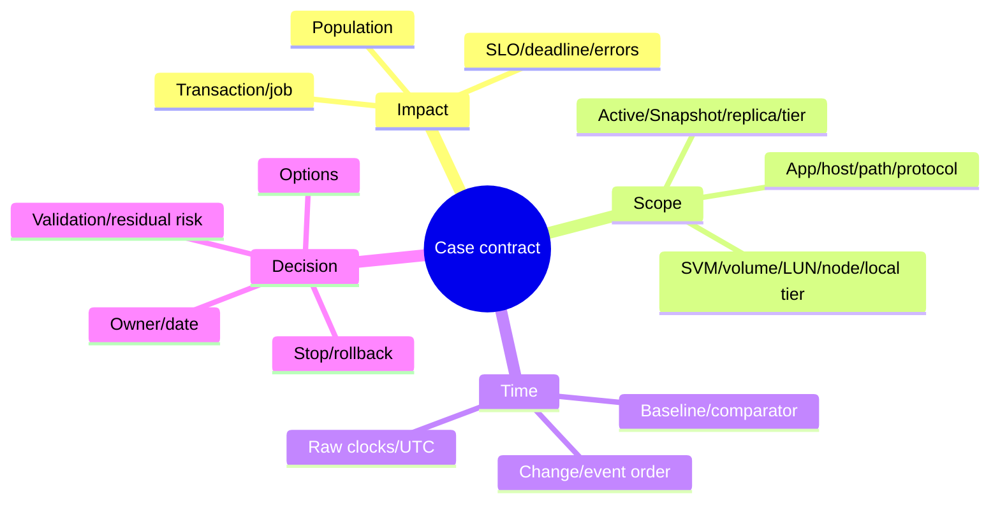

---

## 2. Integrated case categories

| Category | Central question | Discriminating evidence |
|---|---|---|
| A. Application latency, storage healthy | Is storage inside the slow transaction's critical path? | Per-request spans/waits plus matching storage scope |
| B. Network or fabric dependency | Does path delay/loss/imbalance explain client-versus-target gap? | Packet/fabric/path canary and aligned target completion |
| C. ONTAP saturation | Which resource constrains useful output at the workload knee? | Queue/service/output curve and safe capacity/load change |
| D. Noisy neighbor and QoS | Does a competitor harm a victim through a shared resource? | Per-workload demand, victim SLO and controlled separation |
| E. Protection/maintenance overlap | Is background work trigger, amplifier or coincidence? | Event ordering and one-variable replay |
| F. Misleading dashboard | Do scope, weighting, rollup, nulls or clocks create the story? | Raw counts/bytes/histograms/definitions and reaggregation |
| G. Capacity/efficiency/tiering mismatch | Which logical/physical/local/object value is the constraint? | Typed capacity contract and component reconciliation |
| H. Snapshot/retention growth | Did changed-block retention alter stock or slope? | Active/Snapshot stock bridge and retention change point |
| I. Onboarding forecast | Is planned demand represented before action lead time? | Low/base/high event scenarios and pilot measurements |
| J. Failure-state headroom | Can the service meet objectives after node/path/site loss? | Approved degraded-state model/test and protection capacity |
| K. Benchmark/placement/hardware request | Does the test represent the business workload? | Mix/size/locality/concurrency/arrival/cache and app SLO |

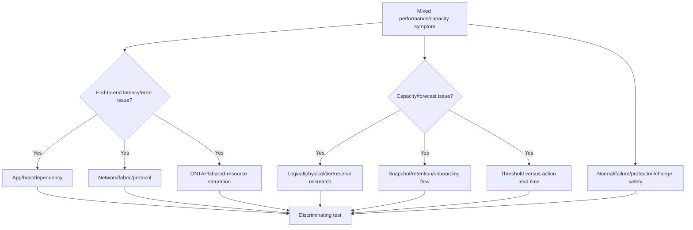

---

## 3. Evidence contract and confidence

### Evidence classes

| Class | Example | What it can prove |
|---|---|---|
| Black-box | Transaction latency, errors, deadline | Customer outcome |
| White-box | Host wait, network trace, ONTAP object metric | Behavior inside its measurement boundary |
| Configuration | Topology, policy, placement, version | Potential mechanism/supportability |
| Event/change | Release, backup, move, failover, retention | Time-ordered candidate |
| Controlled test | One planned variable and prediction | Stronger causal support |
| Product authority | Current docs, IMT/HWU, Support | Supported behavior/action boundary |

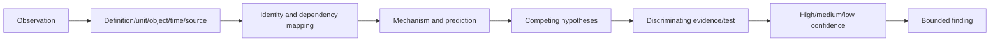

### Confidence rubric

- **High:** multiple independent matching sources, clear mechanism, predicted controlled result, no major unresolved contradiction.
- **Medium:** mechanism and correlations fit, but controlled test or one important boundary is missing.
- **Low:** dashboard association, incomplete scope, stale/missing data, or plausible alternatives remain.
- **Unknown:** source absent, definition unavailable, clocks irreconcilable, or object identity uncertain.

Never convert missing data to `healthy`, `zero`, or `not affected`.

---

## 4. Quantitative toolkit

### 4.1 Throughput from operation classes

$$
Throughput=\sum_i IOPS_i\times IOSize_i
$$

Synthetic workload:

| Class | IOPS | Average class size | Throughput |
|---|---:|---:|---:|
| Small random | 20,000 | 8 KiB | 156.25 MiB/s |
| Large sequential | 400 | 1 MiB | 400 MiB/s |
| **Total** | **20,400** | Mixed | **556.25 MiB/s** |

### 4.2 Weighted latency

$$
\bar W=\frac{\sum_i n_i\bar W_i}{\sum_i n_i}
$$

Do not average p95/p99 values across objects or intervals unless the underlying event distribution can be merged.

### 4.3 Little's Law cross-check

For stable, matching scope:

$$
L=\lambda W
$$

where $L$ is average outstanding work, $\lambda$ is completions per second and $W$ is average response time in seconds.

### 4.4 Capacity time-to-threshold

$$
TTT=\frac{C_{threshold}-C_{current}}{g}
$$

for positive approximately linear net growth $g$. The latest safe action date subtracts analysis, approval, procurement, implementation, validation and contingency lead time.

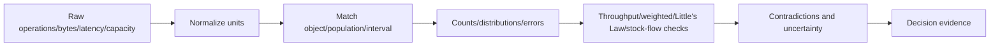

### Plain-English deep-dive: matching receipts before adding totals

You cannot add a restaurant bill from Monday to a grocery receipt from Tuesday and call it one meal. In the same way, host p99, ONTAP mean latency, five-minute IOPS and hourly capacity belong to different populations until object, operation, interval and unit are aligned. **Why it matters:** mathematically correct arithmetic on mismatched populations creates a confident false conclusion.

---

## 5. Case A: application latency while storage remains within its scope baseline

> **Synthetic case:** Meridian Claims reports a checkout-like claim-commit p99 increase from 1.1 seconds to 4.8 seconds between 09:40 and 10:20 UTC. The database LUN's matching ONTAP operation latency distribution and throughput remain near comparable-period behavior. All values are fictional.

### Evidence

| Layer | Observation | Interpretation boundary |
|---|---|---|
| User transaction | p99 4.8 s; errors rise | Customer impact proven |
| App trace | 3.9 s p99 lock/worker wait before storage call | Strong application-queue candidate |
| Host I/O | Comparable latency/queue to baseline | Does not exclude rare/storage-unseen events |
| Network | No matching loss/retransmission change | Path candidate weakened, not disproven |
| ONTAP object | Similar latency/IOPS/throughput distribution | Storage service within measured scope |
| Change | App worker pool doubled at 09:35 | Time-ordered cause candidate |

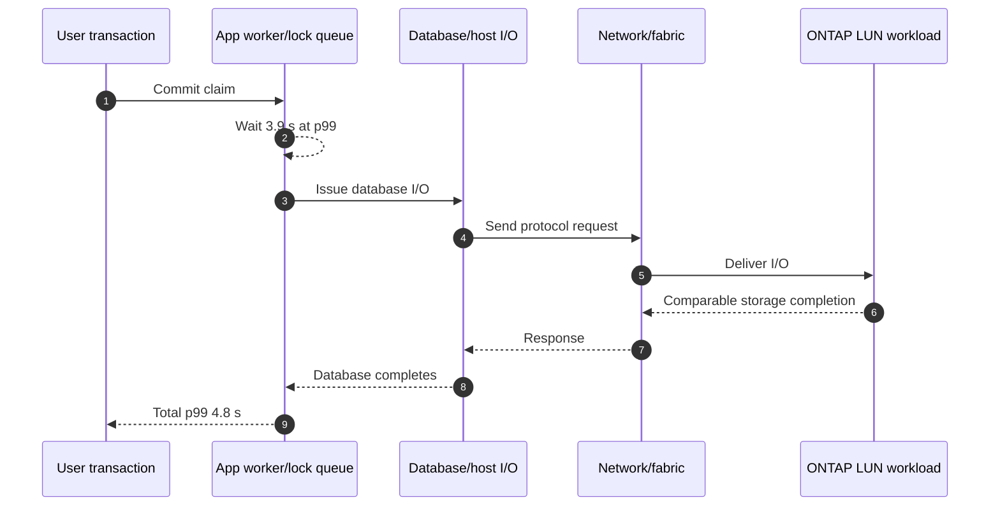

### Hypothesis tree

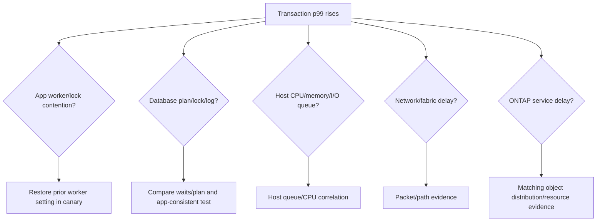

### Discriminating test and finding

An authorized canary restores the prior worker-pool setting. Transaction p99 falls to 1.3 seconds while matching ONTAP metrics remain materially unchanged. This supports application contention with **high synthetic confidence**. It does not prove ONTAP can never contribute outside the measured interval.

### Recommendation

Keep the reversible application correction, validate throughput/errors/business correctness under peak concurrency, monitor matching host/network/ONTAP scopes, and create an app-capacity guardrail. Do not purchase storage or alter QoS from the original dashboard.

---

## 6. Case B: network path creates the client-target latency gap

> **Synthetic case:** One site reports read p99 of 220 ms while the matching ONTAP protocol-operation p99 is 12 ms. A second site using another path is normal.

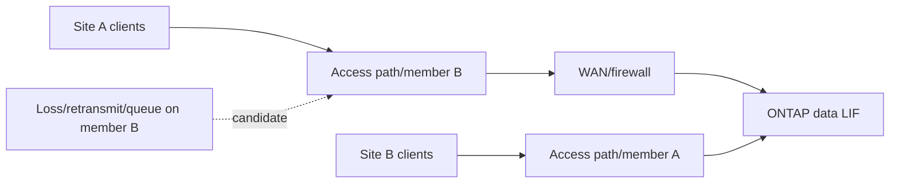

### Evidence sequence

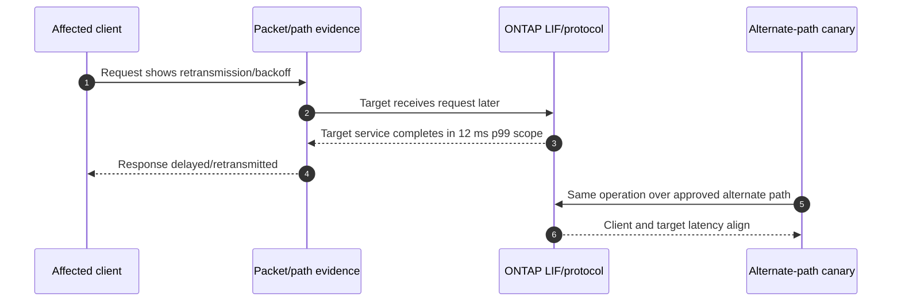

### Finding and safety

The alternate-path canary removes the client-target gap without changing the storage object or workload. This supports the path hypothesis. The network team must still identify whether congestion, errors, policy, MTU, link aggregation, firewall or routing caused it. Do not move a volume or increase storage capacity to hide a path fault.

### Recommendation

Repair the validated path mechanism, confirm redundancy and failure-state behavior, then restore balanced traffic in stages. Validate client p99/errors, packet/fabric health, LIF/port distribution and ONTAP service together.

---

## 7. Case C: saturation and a noisy neighbor

> **Synthetic case:** A critical database and an analytics scan share a node/local tier. Analytics concurrency doubled. Database p99 rises from 180 ms to 700 ms while useful throughput plateaus.

### Little's Law check

At the degraded stable interval:

$$
\lambda=28{,}000\ IOPS,\qquad W=0.018\ s
$$

$$
L=28{,}000\times0.018=504\ outstanding
$$

The synthetic host/target observations are near 490-520 comparable outstanding operations, so units and broad scope reconcile. At the old analytics concurrency:

$$
25{,}000\times0.007=175\ outstanding
$$

The large outstanding-work increase with modest throughput gain supports queueing near a shared constraint.

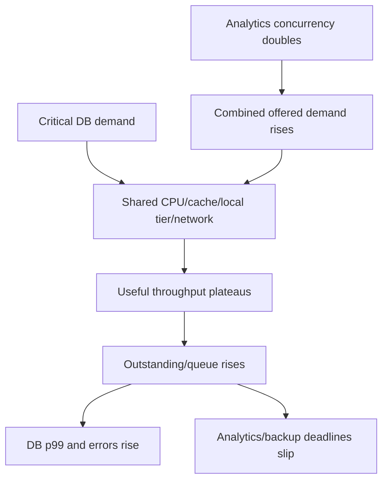

### Controlled separation

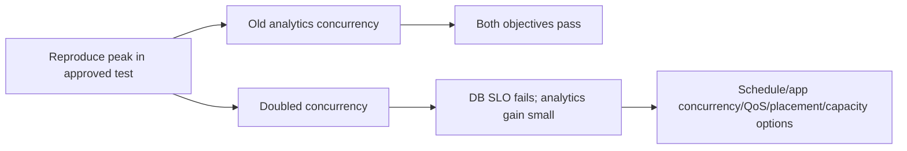

### Recommendation

Use the last representative passing analytics concurrency as an interim reversible control. Evaluate scheduling and exact-current-doc QoS ceiling/floor behavior with both workload owners; consider placement/capacity only if combined objectives remain infeasible. Validate database p99/errors, analytics deadline, protection jobs and degraded-state headroom together.

---

## 8. Case D: protection work is an amplifier, not the trigger

> **Synthetic case:** Database latency begins rising at 10:00 UTC. Replication starts at 10:05 and backup starts at 10:10. A dashboard labels backup the root cause because all graphs overlap after 10:10.

### Plain-English deep-dive: the second lane closure

Traffic is already backing up before a second lane closes. The second closure can worsen the queue, but it cannot explain why traffic first slowed. **Why it matters:** event order distinguishes trigger, amplifier and consequence; all three can still require action.

```mermaid
timeline
    title Synthetic event order
    09:55 : App release completes
    10:00 : DB p99/outstanding begin rising
    10:05 : Replication transfer starts
    10:10 : Backup starts
    10:12 : ONTAP shared queue and CP activity rise further
    10:25 : Errors peak
```

### Causal tests

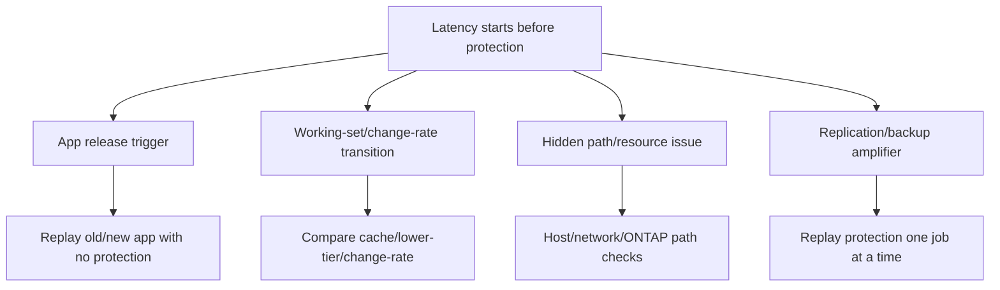

### Recommendation

Do not cancel protection indefinitely or weaken RPO from correlation. Correct the trigger if the app-release test confirms it; then coordinate schedules or supported throttling/QoS only if protection amplification still violates both foreground and protection objectives.

---

## 9. Case E: a misleading latency dashboard

> **Synthetic case:** A dashboard displays `51 ms average volume latency` by averaging two volume means without operation counts.

| Volume | Operations | Mean latency |
|---|---:|---:|
| Small critical volume | 100 | 100 ms |
| Large batch volume | 9,900 | 2 ms |

Incorrect mean of means:

$$
\frac{100+2}{2}=51\ ms
$$

Correct operation-weighted mean:

$$
\frac{100\times100+9{,}900\times2}{10{,}000}=2.98\ ms
$$

The fleet mean of 2.98 ms is also insufficient: it hides severe latency for the small critical population.

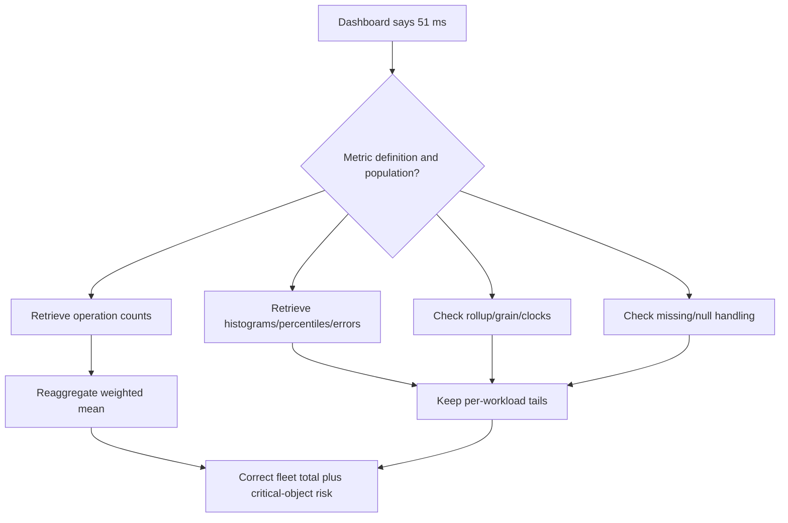

### Dashboard traps found

- Mean of means rather than count-weighted mean.
- Five-minute rollup hides a 30-second business-critical burst.
- p99 values averaged across intervals.
- Missing samples converted to zero.
- Local timestamps compared to UTC without offset history.
- Volume and local-tier scopes shown on one unlabeled axis.

### Recommendation

Publish raw counts, scope, units, interval, sample quality and per-workload distributions. Show fleet weighted values and critical-object tails side by side. Add a stale/missing-data state. Do not tune the system from the original chart.

---

## 10. Case F: logical, physical, local and object-tier capacity are mixed

> **Synthetic case:** One slide says `3:1 effective capacity`; another says `2.4:1 reduction`; a third says local space is 75% used.

### Typed reconciliation

| Measure | Synthetic value | Contract |
|---|---:|---|
| Logical represented | 360 TiB | Active+named reference scope |
| Local physical used | 120 TiB | Performance/local tier |
| Object-tier physical used | 30 TiB | Capacity/object tier |
| Total physical used | 150 TiB | Defined local+object union |
| Local eligible total | 160 TiB | Local denominator |

Total logical-to-physical ratio:

$$
360/150=2.4:1
$$

Local logical-to-local-physical presentation:

$$
360/120=3:1
$$

Local utilization:

$$
120/160=75\%
$$

All can be arithmetically correct, but `3:1` mixes data reduction with tier placement if presented as total-system efficiency.

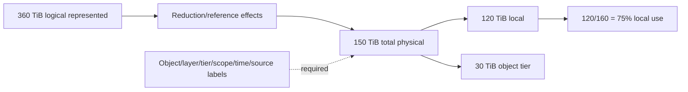

### Recommendation

Separate logical represented, total physical, local physical, object physical and local available. Reconcile Snapshot/clone/replica/reserve scope and provider cost. Forecast each actual constraint; do not multiply free capacity by a reported ratio.

---

## 11. Case G: Snapshot retention changes the capacity regime

> **Synthetic case:** A local tier is at 72 TiB used against an approved synthetic operating threshold of 90 TiB. Base net growth was 0.45 TiB/day; a retention change adds 0.35 TiB/day of retained changed-block growth.

New synthetic net growth:

$$
g=0.45+0.35=0.80\ TiB/day
$$

$$
TTT=\frac{90-72}{0.80}=22.5\ days
$$

If full action lead time is 30 days:

$$
22.5-30=-7.5\ days
$$

The action start is already late under these assumptions.

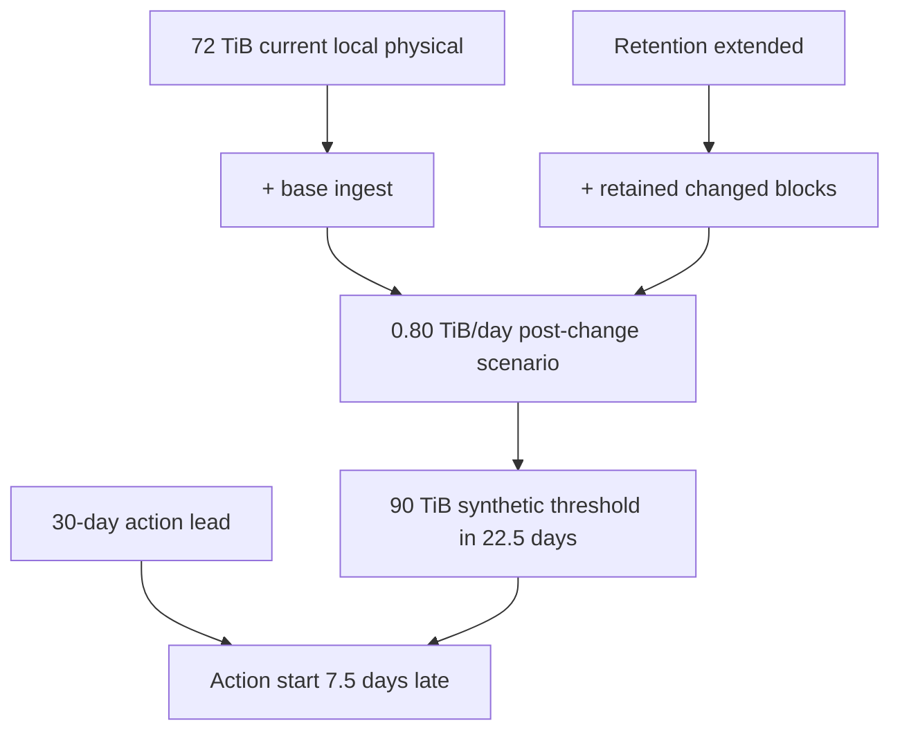

### Safety and recommendation

Do not delete Snapshots or reduce retention without recovery/legal/application owners. Open the capacity action now; validate the changed-block model; compare approved retention cohorts, application cleanup, placement/tiering and supported capacity while preserving RPO/RTO and failure-state headroom.

---

## 12. Case H: planned onboarding is absent from historical trend

> **Synthetic case:** A 200-TiB logical archive is planned. No representative production efficiency result exists. Historical linear growth does not include the event.

### Physical sensitivity

| Scenario | Assumed ratio | Initial physical before protection/tiering |
|---|---:|---:|
| Conservative | 1.5:1 | 133.33 TiB |
| Planning | 2.0:1 | 100 TiB |
| Optimistic | 2.5:1 | 80 TiB |

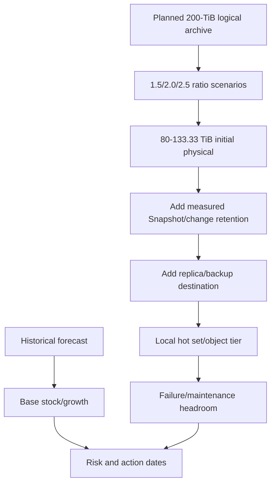

### Pilot and decision

Pilot representative encrypted/compressed archive data to measure reduction, ingest, change rate, metadata, local hot set, recall and object cost. Keep all ratios as scenarios, not guarantees. Phase or delay onboarding if supported capacity, protection and action lead time cannot meet the conservative approved case.

---

## 13. Case I: normal-state charts hide failure-state risk

> **Synthetic case:** Two equivalent nodes each carry 45 units of normalized demand against a synthetic 100-unit effective capacity model. Normal charts look comfortable. During one-node takeover, survivor demand approaches 90 units before recovery, background and rebalance work.

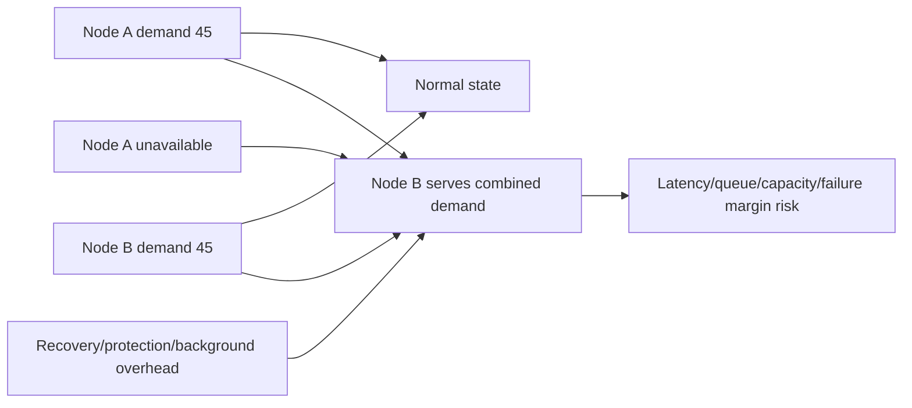

This is a normalized teaching model, not ONTAP CPU arithmetic or a threshold. Actual takeover ownership, workloads, local tiers, paths, cache, protocol and platform behavior must be modeled with current tools and approved tests.

### Failure-state acceptance

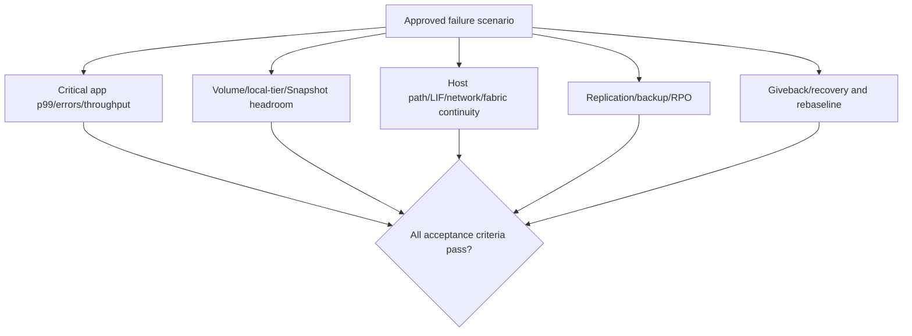

### Recommendation

Size and place against approved normal, maintenance and failure objectives, not one average dashboard. Use current supported nondisruptive test procedures and application owners; never induce failure from this guide.

---

## 14. Case J: benchmark headline drives the wrong hardware request

> **Synthetic case:** A test reaches 16,200 IOPS at 128 workers with 480 ms p99 and 3% errors. The real application needs 15,000 IOPS at 32 workers with 30 ms p99 and no test errors.

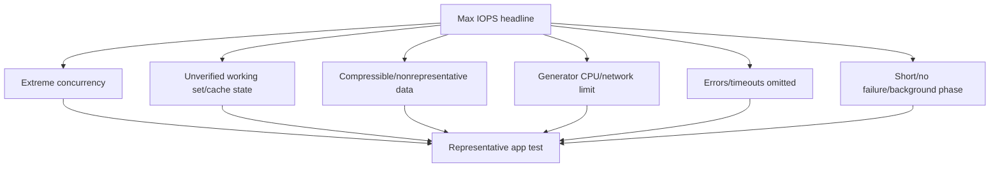

### Plain-English deep-dive: race-car top speed versus delivery route

A race car's top speed on a closed track does not predict whether it can deliver packages through city traffic on time. **Why it matters:** maximum synthetic IOPS at extreme queue depth can hide unusable latency, errors, cache dependence and a completely different application mix.

### Recommendation

Reject the hardware request as unproven, not necessarily wrong. Re-run the measured mix, sizes, locality, concurrency, arrival model, durability, working set, duration, background and failure conditions. Compare application SLO, cost and lifecycle options before app, QoS, placement or hardware changes.

---

## 15. Cross-case troubleshooting tree

```mermaid
flowchart TD
    START[Customer says storage is slow/full] --> IMP[Define operation/population/SLO/time]
    IMP --> DATA{Evidence fresh and comparable?}
    DATA -->|No| FIXDATA[Resolve IDs/units/clocks/gaps/definitions]
    DATA -->|Yes| PATH{Client and ONTAP latency align?}
    PATH -->|No| UP[App/host/network/protocol investigation]
    PATH -->|Yes| SAT{Output plateau + queue/service growth?}
    SAT -->|No| SEM[Workload semantics/cache/rare tails/dependency]
    SAT -->|Yes| SHARE[Map bottleneck/shared workloads]
    START --> CAP{Capacity symptom?}
    CAP --> CONTRACT[Type logical/physical/local/object/reserve]
    CONTRACT --> FLOW[Snapshot/retention/tiering/onboarding flows]
    FLOW --> FC[Backtested forecast + scenarios + lead time]
    SHARE --> OPT[App/schedule/QoS/placement/capacity options]
    FC --> OPT
    UP --> OPT
    SEM --> OPT
    OPT --> TEST[Canary/stop/rollback/end-to-end validation]
```

### Contradiction handling

| Contradiction | Do not do | Better next check |
|---|---|---|
| Client slow, ONTAP normal | Declare storage innocent forever | Match per-request timing/path and unseen queues |
| ONTAP busy, app normal | Tune to reduce a red metric | Confirm headroom/failure/lifecycle risk |
| High utilization, no queue/plateau | Call bottleneck | Sweep or observe output/latency mechanism |
| Backup overlaps after symptom starts | Call backup root cause | Test trigger versus amplifier |
| Capacity falls after tiering | Call data deleted | Reconcile local and object tiers |
| Forecast fits history | Ignore planned onboarding | Add event scenarios |
| QoS protects one workload | Call platform fixed | Validate every workload/deadline and total capacity |

---

## 16. Option decision matrix

A decision matrix makes assumptions visible; it does not override support restrictions, legal requirements or safety vetoes.

### Synthetic Orion Health options

Weights sum to 1. Higher scores are better on a 1-5 synthetic scale.

| Criterion | Weight | App/concurrency correction | Path remediation | Schedule/QoS | Placement/capacity | Status quo |
|---|---:|---:|---:|---:|---:|---:|
| Expected SLO benefit | 0.25 | 4 | 2 | 4 | 5 | 1 |
| Causal evidence | 0.20 | 4 | 3 | 4 | 3 | 1 |
| Implementation speed | 0.10 | 5 | 3 | 4 | 1 | 5 |
| Reversibility | 0.15 | 5 | 4 | 5 | 2 | 5 |
| Protection/failure-state fit | 0.15 | 4 | 5 | 3 | 5 | 1 |
| Lifecycle/cost fit | 0.15 | 5 | 4 | 4 | 2 | 5 |
| **Weighted score** | **1.00** | **4.40** | **3.35** | **4.00** | **3.30** | **2.60** |

$$
Score(option)=\sum_i weight_i\times rating_{i,option}
$$

Example:

$$
Score_{app}=0.25(4)+0.20(4)+0.10(5)+0.15(5)+0.15(4)+0.15(5)=4.40
$$

```mermaid
flowchart TD
    OPT[Candidate options] --> VETO{Supported/legal/safe?}
    VETO -->|No| REJECT[Reject or redesign]
    VETO -->|Yes| SCORE[Score benefits/evidence/speed/reversibility/protection/cost]
    SCORE --> SENS[Sensitivity: change weights/assumptions]
    SENS --> PILOT[Choose reversible pilot]
    PILOT --> VALID[Validate all acceptance criteria]
    VALID --> DEC[Expand/rollback/reconsider]
```

### Sensitivity and vetoes

- If database integrity or recovery policy fails, an option is disqualified regardless of score.
- If capacity lead time is already missed, speed weight may rise.
- If causal evidence is low, a small probe may rank above a large purchase.
- Record who chose weights and when; do not present the score as objective truth.

---

## 17. Safe test and change plan

```mermaid
stateDiagram-v2
    [*] --> Hypothesis
    Hypothesis --> Authorized: Scope/owners/support established
    Authorized --> Baseline: Representative repeat captured
    Baseline --> Canary: One variable changed
    Canary --> Stop: Safety threshold reached
    Canary --> Validate: Acceptance criteria pass
    Stop --> Rollback
    Validate --> Expand: Residual risk accepted
    Validate --> Rollback: Benefit absent/side effect
    Expand --> Rebaseline
    Rollback --> Review
```

### Test/change worksheet

| Field | Required content |
|---|---|
| Question | One falsifiable mechanism and predicted result |
| Scope | App/host/path/ONTAP/capacity objects and exact versions |
| Workload | Mix, size, locality, concurrency, arrival, data, duration, state |
| Baseline | Comparable repetitions, distributions, errors and quality |
| Variable | One planned change; hidden differences recorded |
| Safety | Authorization, nonproduction/canary, maximum load, stop conditions |
| Protection | Snapshot/replication/backup/RPO/RTO acceptance |
| Failure state | Approved degraded-mode requirement |
| Rollback | Trigger, method, authority and forward-recovery alternative |
| Validation | App correctness/SLO plus host/network/ONTAP/capacity/protection |

Never use this chapter as a production command runbook.

---

## 18. Recommendation writing

### Recommendation anatomy

```mermaid
flowchart LR
    F[Finding + scope + confidence] --> R[Risk mechanism/impact/horizon]
    R --> O[Options and rejected alternatives]
    O --> REC[Recommended action]
    REC --> OWNER[Owner/date/prerequisites]
    OWNER --> SAFE[Canary/stop/rollback]
    SAFE --> V[Validation/SLO/protection/failure]
    V --> RES[Residual risk/monitoring/rebaseline]
```

### Model recommendation

> **Finding:** In the synthetic peak replay, doubled analytics concurrency is the discriminating change that increases shared outstanding work and causes the critical database p99 miss; backup starts later and amplifies the queue. Confidence is medium-high for the tested environment, not for all production periods. **Risk:** Month-end transactions and protection deadlines can both fail. **Recommendation:** Restore the last passing analytics concurrency now; validate exact-current-doc schedule/QoS options in an authorized canary; begin placement/capacity evaluation if combined objectives remain infeasible. **Owner/date:** Analytics, storage and protection owners by the approved action dates. **Validation:** Database p99/errors/correctness, analytics and backup deadlines, matching resource queues, and normal/failure-state headroom. **Residual risk:** Different working sets, future growth and failure conditions require monitoring and rebaseline.

### Weak versus strong language

| Weak | Stronger bounded wording |
|---|---|
| Storage is the problem | Matching evidence supports `<resource mechanism>` in `<scope>` |
| Add disks | Compare supported capacity/placement after representative test |
| QoS will fix it | Test documented policy option and every affected objective |
| Backup caused it | Backup began after trigger and amplified the measured queue |
| We will be full in 30 days | Model range crosses approved threshold in X-Y days under assumptions |
| Efficiency gives 3x capacity | Measured ratio has exact logical/physical/tier/reference scope |

---

## 19. Mock operational service review

> **Fully synthetic scenario:** Orion Health combines Cases C, D, G and I. All metrics, thresholds, dates, systems, owners and decisions are fictional.

### Review agenda

1. Business outcomes and SLO exceptions.
2. Evidence quality and changes since last review.
3. Performance findings and competing hypotheses.
4. Capacity forecast and action lead time.
5. Protection and failure-state objectives.
6. Options, decisions, owners and dates.
7. Validation and residual risk.

```mermaid
sequenceDiagram
    autonumber
    participant TAM as TAM analyst
    participant APP as Application owner
    participant STO as Storage owner
    participant NET as Network owner
    participant PRO as Protection owner
    participant EXE as Customer sponsor
    TAM->>EXE: State impact, confidence and decision required
    TAM->>APP: Show workload/change and app-wait evidence
    TAM->>STO: Show shared queue, QoS/placement and capacity scope
    TAM->>NET: Confirm path evidence and residual checks
    TAM->>PRO: Protect RPO/RTO and retention acceptance
    APP-->>TAM: Accept reversible concurrency canary
    STO-->>TAM: Own current-doc QoS/capacity evaluation
    PRO-->>TAM: Define backup/retention non-negotiables
    EXE-->>TAM: Approve owners, dates and escalation trigger
```

### Executive summary page

| Topic | Status | Evidence and decision |
|---|---|---|
| Critical DB p99 | At risk in synthetic month-end replay | Analytics concurrency is discriminating change; reversible correction approved |
| Backup deadline | At risk during combined peak | Protection is amplifier and co-equal objective; schedule/QoS test owned |
| Local capacity | Action date passed in upper scenario | Retention change and onboarding scenarios require immediate decision |
| Network | No current primary finding | Alternate-path comparison remains in validation plan |
| Failure state | Confidence gap | Current normal-state evidence cannot prove takeover objective |
| Data quality | Medium | One five-minute gap remains unknown; raw sources preserved |

### Decision log

| Decision | Owner | Due | Success evidence | Escalation trigger |
|---|---|---|---|---|
| Restore tested analytics concurrency | App owner | Synthetic D+2 | DB/analytics objectives pass | Any correctness/error regression |
| Model documented QoS/schedule canary | Storage/protection | D+7 | Both foreground and RPO deadlines pass | Unsupported assignment or missed backup |
| Start capacity/placement design | Storage/finance | D+1 | Approved option before risk range | Milestone later than latest action date |
| Validate takeover scenario | Platform/app/network | D+21 | App/path/protection criteria pass | Test cannot be safely authorized |
| Repair dashboard weighting/freshness | Analytics owner | D+5 | Raw reconciliation and stale state | Missing source remains hidden |

### Mock spoken summary

> "The customer impact is a month-end database tail-latency miss, not a general storage outage. In representative replay, doubled analytics concurrency is the variable that produces the shared queue; backup starts later and amplifies it. The capacity model also changed after retention was extended, and its upper action date is already inside implementation lead time. We recommend the last passing application setting as the reversible immediate control, a documented QoS/schedule canary protecting both database and backup objectives, and an immediate placement/capacity decision. Normal-state evidence does not prove takeover readiness, so that remains an owned confidence gap."

---

## 20. Discovery, evidence, risk, and JD Mapping

### Capstone discovery questions

1. Which exact business operation, population, SLO/error/deadline and critical periods matter?
2. What workload mix, size, locality, concurrency, working set, burst and background fingerprint applies?
3. Which app/host/path/protocol/SVM/LIF/volume/LUN/node/local-tier/media and capacity objects map to it?
4. Are units, operation classes, timestamps, sampling, resets, nulls, rollups, object IDs and source versions comparable?
5. Does latency align from client to ONTAP, and where does queue/service time grow?
6. Does useful output plateau as demand/outstanding work grows, and does Little's Law reconcile?
7. Which shared workloads, protection jobs, changes, failures or tiering events precede/amplify the symptom?
8. Which logical/physical/local/object/Snapshot/replica/reserve capacity is constrained?
9. Which forecast model, backtest error, event scenario and action lead time govern the decision?
10. Which app, network, schedule, QoS, placement, capacity, protection and status-quo options are supported and safely testable?

### Evidence-to-risk table

| Evidence | Context | Risk | Option | Validation |
|---|---|---|---|---|
| Client p99 diverges from target p99 | One path/site | Network/app dependency | Path/app canary | Per-request/path plus app SLO |
| Queue rises and output plateaus | Matching shared resource | Saturation/tail/errors | Demand/QoS/placement/capacity | Curve plus every workload objective |
| Snapshot slope changes after retention | Recovery policy change | Capacity before lead time | Retention/capacity/tiering | Recovery plus sustained stock trend |
| Dashboard averages unweighted means | Missing counts/rollup | Wrong investment/change | Rebuild metric | Raw reconciliation and owner signoff |
| Normal charts lack failure evidence | HA/failure objective | Degraded-state outage | Approved failover model/test | App/path/capacity/protection criteria |

### JD Mapping

| JD responsibility | Part 46 contribution | Your factual bridge and gap |
|---|---|---|
| Generate/analyze customer data | Reconciles transactions, counters, paths, capacity and forecasts | MBA/Excel/Power BI/SQL/Python transfer strongly |
| Storage expertise | Integrates ONTAP objects, WAFL/CP, QoS, protection, capacity and tiers | Conceptual/synthetic; no production tuning claim |
| Strategic recommendations | Quantifies options, lead time, lifecycle and business tradeoffs | Advisory/business analytics transfer |
| Risk and stability | Requires causal tests, stop/rollback, protection and failure state | critical-situation discipline transfers |
| Operational service reviews | Converts evidence into decisions, owners, dates and residual risk | Customer-review communication transfers |
| Escalation/supportability | Preserves contradictions and current product authority | enterprise escalation rigor transfers |
| Influence/adoption | Aligns app, network, storage, protection, finance and sponsor | Cross-team experience transfers |

---

## 21. Your transfer and honest gap

```mermaid
flowchart LR
    M365[M365/Azure support] --> DEP[User/service/dependency/change scoping]
    CRIT[Critical situation] --> INC[Impact/owners/evidence/updates/safe action]
    MBA[MBA analytics] --> ANA[Segmentation/forecast/scenario/decision matrix]
    TOOL[Excel/Power BI/SQL/Python] --> QA[Reconciliation/dashboard/test analysis]
    DEP --> METHOD[Performance/capacity recommendation method]
    INC --> METHOD
    ANA --> METHOD
    QA --> METHOD
    METHOD --> GAP[Production ONTAP tools/QoS/sizing/change remain training gaps]
```

### Transfer table

| Factual strength | Transfer | Honest limit |
|---|---|---|
| Enterprise support | Symptom, dependency, timeline and escalation | Not ONTAP performance ownership |
| Networking | Client-target path and clock-aligned packet evidence | Not FC/ONTAP production operation |
| Critical situation | Safety, owners, status, rollback and validation | No authority for customer storage changes |
| MBA/statistics | Baselines, weighted math, forecasts, uncertainty and options | No NetApp sizing certification claimed |
| BI/SQL/Python | Reproducible QA, models and service-review visuals | No customer telemetry entitlement assumed |

### Honest interview bridge

> "I use a disciplined evidence method: define the customer SLO and workload, map the client-to-media and capacity hierarchy, validate units/objects/clocks/missing data, compare competing app/host/network/ONTAP hypotheses, and use weighted math, Little's Law and forecast backtests as cross-checks. I recommend only after a discriminating safe test, then define owner, rollback, validation and residual risk. My production background is enterprise support and analytics, not ONTAP tuning, QoS, sizing or moves."

---

## 22. Labs and self-test

### Capstone paper lab

A fictional healthcare fleet contains 40 clusters, 600 applications and 8,000 storage objects. Data includes transactions, app waits, host queues, packet/fabric summaries, ONTAP metrics, QoS inventory, capacity layers, Snapshot/replication/tiering stocks, changes, maintenance, failures, planned onboarding, source gaps and a 60-day action tracker.

Tasks:

1. Define ten business case contracts and stable object/dependency joins.
2. Build workload fingerprints and comparable baselines.
3. Reconcile operation counts, bytes, means, percentiles and Little's Law.
4. Separate app/host/path/ONTAP latency and rank competing hypotheses.
5. Find throughput-latency knees, shared resources and noisy-neighbor candidates.
6. Classify background work as trigger, amplifier, consequence or coincidence.
7. Rebuild misleading dashboard calculations from raw populations.
8. Reconcile logical/physical/local/object/Snapshot/replica/reserve capacity.
9. Fit linear/seasonal/event scenarios and rolling-origin errors.
10. Compare risk dates with end-to-end action lead time.
11. Model normal, maintenance and failure-state acceptance.
12. Build one weighted option matrix with sensitivity and vetoes.
13. Design canary/stop/rollback/end-to-end validation for three cases.
14. Deliver the mock service review and answer Q1-Q8 aloud.

```mermaid
flowchart LR
    ING[Ingest synthetic multi-layer evidence] --> QA[Scope/unit/time/quality QA]
    QA --> CASE[Build case contracts]
    CASE --> HYP[Competing hypotheses]
    HYP --> MATH[Mechanism/math/forecast checks]
    MATH --> TEST[Safe discriminating tests]
    TEST --> MATRIX[Option matrix]
    MATRIX --> OSR[Mock service review]
    OSR --> TRACK[Owners/dates/validation/residual risk]
```

### Lab pass checklist

- [ ] Every claim names population, object, interval, unit and source.
- [ ] Missing data remains unknown and clocks retain uncertainty.
- [ ] Averages are weighted; percentiles are not averaged.
- [ ] Little's Law uses stable matching scope.
- [ ] Saturation includes output, queue/service and a discriminating change.
- [ ] Noisy-neighbor claims prove shared mechanism and victim harm.
- [ ] Capacity layers/tier/reference scopes do not mix.
- [ ] Forecasts are backtested and planned events are explicit.
- [ ] Risk date is compared with full action lead time.
- [ ] QoS/placement/capacity options use current support evidence.
- [ ] Protection and failure-state objectives remain acceptance criteria.
- [ ] Recommendation includes owner/date/stop/rollback/validation/residual risk.

### Self-test

1. Explain the capstone method from symptom to residual risk.
2. Classify all eleven case categories and their discriminating evidence.
3. Build an evidence contract and confidence rating.
4. Calculate mixed-class throughput and weighted latency.
5. Apply Little's Law with matching scope.
6. Diagnose application latency with normal storage evidence.
7. Diagnose a client-target latency gap through path evidence.
8. Prove saturation and noisy-neighbor interference.
9. Separate background trigger from amplifier.
10. Repair an unweighted/missing-data/rollup dashboard.
11. Reconcile logical, total physical, local and object capacity.
12. Model a Snapshot-retention change point and action date.
13. Build onboarding low/base/high cases without efficiency guarantees.
14. Assess normal versus failure-state headroom.
15. Reject or redesign a nonrepresentative benchmark.
16. Build a weighted decision matrix with sensitivity and vetoes.
17. Design a safe canary and complete recommendation anatomy.
18. Run the Orion service review and state your transfer/gap honestly.

---

## 23. Official Source Anchors

**Date checked: 2026-08-24.** These official and credible public sources anchor the performance, QoS, capacity, forecasting, testing and service-review methods. Exact product behavior, fields, settings, limits and support remain release/platform/workload/configuration sensitive.

| Topic | Official or credible public source | Bounded use |
|---|---|---|
| ONTAP performance | [ONTAP performance administration](https://docs.netapp.com/us-en/ontap-performance-admin/) | Current investigation and monitoring entry point |
| REST metrics | [ONTAP REST performance metrics](https://docs.netapp.com/us-en/ontap-automation/rest/performance_metrics.html) | Current object/IOPS/latency/throughput availability matrix |
| QoS | [ONTAP QoS throughput guarantees](https://docs.netapp.com/us-en/ontap/performance-admin/guarantee-throughput-qos-task.html) | Current floors/ceilings/policy concepts and support notes |
| QoS restrictions | [QoS policy-group assignment restrictions](https://docs.netapp.com/us-en/ontap/performance-admin/policy-group-assignment-restrictions.html) | Exact supported assignment behavior |
| Volumes/capacity | [ONTAP volumes](https://docs.netapp.com/us-en/ontap/volumes/index.html) | Current volume capacity/space navigation |
| Local tiers | [ONTAP disks and local tiers](https://docs.netapp.com/us-en/ontap/disks-aggregates/index.html) | RAID/local-tier/storage organization |
| Efficiency | [ONTAP storage efficiency overview](https://docs.netapp.com/us-en/ontap/concepts/storage-efficiency-overview.html) | Reduction concepts; no ratio guarantee |
| FabricPool | [ONTAP FabricPool](https://docs.netapp.com/us-en/ontap/fabricpool/index.html) | Local/object-tier architecture and dependencies |
| Data protection | [ONTAP data protection](https://docs.netapp.com/us-en/ontap/data-protection/index.html) | Snapshot/replication/protection context |
| Statistical methods | [NIST/SEMATECH e-Handbook](https://www.itl.nist.gov/div898/handbook/) | Distributions, regression, time-series, uncertainty |
| Monitoring/SLOs | [Google SRE - Monitoring Distributed Systems](https://sre.google/sre-book/monitoring-distributed-systems/) | Black/white-box, traffic, latency, errors, saturation |
| Delay variation | [RFC 3393](https://www.rfc-editor.org/rfc/rfc3393) | Delay variation, sampling and measurement parameters |
| Excel forecasts | [Microsoft forecast functions](https://support.microsoft.com/en-us/office/forecast-and-trend-functions-reference-5f1e34aa-c112-4d7b-b9ed-146748b60f1b) | Official forecast function orientation |
| Power BI analysis | [Power BI decomposition tree](https://learn.microsoft.com/en-us/power-bi/visuals/power-bi-visualization-decomposition-tree) | Interactive decomposition; not causal proof |
| Workload testing | [fio documentation](https://fio.readthedocs.io/en/latest/fio_doc.html) | Tool behavior; authorization and representativeness required |
| Windows testing | [Microsoft DiskSpd](https://github.com/microsoft/diskspd) | Official Microsoft storage test tool documentation |

### Source-use discipline

- Record exact ONTAP/tool/object/field/release/source/date and support notes.
- Preserve raw evidence, units, counts, timestamps and quality flags.
- Treat product telemetry, lab results, synthetic scenarios and business SLOs as separate evidence classes.
- Never copy a threshold, QoS value, efficiency ratio, forecast or benchmark into a customer design without current evidence.
- Use IMT/HWU, application guidance and Support for supported design/change decisions.
- Mark inaccessible, stale, missing, estimated and disputed evidence explicitly.

---

## Likely Interview Questions

### Q1. How do you approach a mixed performance and capacity case?

> **Model answer:** "I define the business operation, population, SLO, interval and decision; map app, host, path, protocol and ONTAP objects plus typed capacity; validate IDs, units, clocks, gaps and counter definitions; build competing hypotheses; use weighted math, Little's Law and stock/forecast checks; run the cheapest safe discriminating test; compare options; and finish with owner, date, rollback, validation and residual risk."

### Q2. How do you separate ONTAP saturation from application or network latency?

> **Model answer:** "I align client and ONTAP operation populations. A client-target gap points upstream to app, host or path. Saturation needs rising demand, a matching resource queue/wait, useful output plateau or tail/errors, and a safe resource/load change that alters the outcome. High utilization or one storage latency graph alone is not proof."

### Q3. How do you prove and mitigate a noisy neighbor?

> **Model answer:** "I map the victim and competitor to a shared resource, measure per-workload demand, prove victim SLO harm and shared queue/service behavior, and use controlled separation or a documented cap as the discriminating check. I compare app concurrency, scheduling, QoS, placement and capacity while validating both workloads and protection deadlines."

### Q4. How do you challenge a misleading dashboard?

> **Model answer:** "I request metric definitions, object hierarchy, numerator/denominator, units, sample counts, interval, rollup, raw clocks, reset and missing-data behavior. I weight means by counts, never average percentiles, preserve critical-object tails, separate logical/physical/local/object capacity, and rebuild the result from raw populations."

### Q5. How do performance and capacity decisions interact?

> **Model answer:** "Working-set growth, Snapshot retention, tiering, protection and onboarding can change both capacity location and latency. A performance move can create destination capacity/failure risk; a capacity tiering action can create recall/cost/dependency risk. I validate app SLO, capacity, protection and normal/failure state together."

### Q6. How do you choose among QoS, scheduling, placement and more capacity?

> **Model answer:** "First I prove the mechanism. I compare expected business benefit, causal evidence, speed, reversibility, protection/failure-state fit, lifecycle and cost; apply support/legal/safety vetoes; test sensitivity; and choose the smallest reversible pilot. QoS allocates finite service and cannot replace infeasible capacity."

### Q7. What belongs in a customer service review recommendation?

> **Model answer:** "A scoped finding and confidence, business risk mechanism and horizon, options and rejected alternatives, recommended action, owner/date/prerequisites, canary/stop/rollback, app/protection/failure-state validation, residual risk, and data-quality gaps. The executive view shows decisions and overdue milestones, not a wall of graphs."

### Q8. How does your background transfer, and what remains a gap?

> **Model answer:** "My prior support and critical-situation work gives me customer-impact scoping, dependency and network evidence, hypothesis testing, safe action and stakeholder updates. My MBA and Excel, Power BI, SQL, Python and statistics support baselines, forecasts and decision analysis. I have not operated production ONTAP performance, QoS, sizing or placement, so I would use current docs, authorized telemetry and NetApp/application specialists."

---

## 30-Second Memory Hooks

- **Start black-box:** The customer transaction defines success.
- **Scope before math:** Object, operation, interval, unit, source.
- **Gap:** Client minus target is not arithmetic unless requests match.
- **Saturation:** Demand + queue + plateau/tail + discriminating change.
- **Noisy neighbor:** Shared resource + victim harm + controlled separation.
- **Background:** Trigger, amplifier, consequence or coincidence.
- **Dashboard:** Weight means; never average percentiles; unknown is not zero.
- **Capacity:** Logical, total physical, local, object, reserve and time.
- **Forecast:** Backtest history; add future events explicitly.
- **Action date:** Risk date minus end-to-end lead time.
- **QoS:** Allocates finite service; it does not create capacity.
- **Benchmark:** Reproduce the business workload and SLO.
- **Decision matrix:** Exposes assumptions; safety vetoes still win.
- **Recommendation:** Finding -> risk -> options -> owner/date -> validation -> residual risk.
- **Your bridge:** Evidence and analytics transfer; production ONTAP operation does not.

---

## Completion Checklist

- [ ] Define a precise business case contract and decision date.
- [ ] Classify the case without forcing one cause category.
- [ ] Map application-to-media and typed capacity objects.
- [ ] Validate units, counts, clocks, sampling, rollups and missing data.
- [ ] Preserve averages/percentiles/errors and operation populations correctly.
- [ ] Apply throughput, weighted means and Little's Law only to matching scope.
- [ ] Separate client, host, path, protocol and ONTAP delay.
- [ ] Prove saturation/noisy neighbor through mechanism and a safe test.
- [ ] Classify background work as trigger/amplifier/consequence/coincidence.
- [ ] Repair dashboard weighting, scope, tier and freshness errors.
- [ ] Reconcile logical/physical/local/object/Snapshot/replica/reserve capacity.
- [ ] Model Snapshot retention, onboarding and action lead time with scenarios.
- [ ] Assess normal, maintenance and failure-state objectives.
- [ ] Challenge benchmark representativeness before hardware/placement changes.
- [ ] Compare options with sensitivity and support/legal/safety vetoes.
- [ ] Define canary, stop, rollback and end-to-end validation.
- [ ] Deliver the mock service review with decisions, owners and dates.
- [ ] State confidence, contradictions, unknowns and residual risk.
- [ ] Complete labs/self-test and answer exact Q1-Q8 aloud.
- [ ] State the No-production-NetApp boundary and exact non-claim accurately.
- [ ] Re-run current-doc, IMT/HWU, application and Support checks before customer use.

---

*Next suggested section:* [Part 47 - AutoSupport Architecture, Delivery, Privacy, and Troubleshooting](Part-47-autosupport-architecture-delivery.md)