# Part 47 - AutoSupport Architecture, Delivery, Privacy, and Troubleshooting

> **Section goal:** Understand how ONTAP AutoSupport collects, packages, routes, records, and delivers support information, and how to diagnose stale or missing telemetry without confusing local collection with remote receipt. By the end, you should be able to explain message types, manifests, destinations, HTTPS/SMTP paths, entitlement and identity dependencies, privacy controls, delivery evidence, troubleshooting, and customer risk while remaining honest about gated access and production experience.

Covers index item **47** and maps directly to job-description responsibilities for generating and analyzing customer data, proactive risk mitigation, support-experience improvement, install-base accuracy, customer-specific recommendations, operational service reviews, secure evidence handling, and cross-functional escalation.

**Explicit nonclaim:** You have not administered or troubleshot AutoSupport in a production NetApp environment.

**Privacy and access boundary:** Customer telemetry, manifests, payloads, identifiers, contracts, portal status, and support evidence require authorization, minimization, secure handling, and approved retention.

**Synthetic-evidence rule:** Every identifier, date, payload, status, test result, and recommendation in the exercises is fictional and sanitized; none is a real tool result or customer record.

**Version caveat:** Exact AutoSupport defaults, cluster/node scope, message types, triggers, subsystem content, file/time budgets, maximum sizes, destinations, history/status values, HTTPS/SMTP/SMTPS behavior, proxy authentication, certificate validation, private-data removal, OnDemand behavior, test workflow, commands, fields, retention, and Digital Advisor presentation vary by ONTAP release and configuration. A **current-doc check** means reopening the exact ONTAP release's AutoSupport, command-reference, security, networking, and Support documentation before interpreting a field or changing a setting.

This Part provides no production configuration recipe, destination allow-list, firewall rule, proxy exception, redaction guarantee, retention promise, or entitlement result. Public examples establish concepts only. Customer-specific AutoSupport payloads, Support Site assets, Active IQ Digital Advisor views, case data, and some Knowledge Base procedures require authorized identity and entitlement. Missing access remains an explicit gap; it is never replaced with an invented screen or result.

> **No-production-NetApp boundary:** You do not claim production ONTAP AutoSupport experience. Every cluster, serial, message, status, destination, timeline, customer, screenshot-like table, and recommendation below is synthetic. Your factual strengths are enterprise support, critical-situation evidence collection, Azure/M365 networking, DNS/TCP/TLS/proxy troubleshooting, analytics, customer reviews, and secure escalation. The explicit non-claim is: **you have not configured or tested production AutoSupport, inspected a customer's payload or manifest, used AutoSupport OnDemand, diagnosed a production delivery failure, accessed customer Digital Advisor telemetry, changed private-data settings, or uploaded a core/performance archive through AutoSupport.**

---

## 1. AutoSupport purpose and architecture

**AutoSupport** is an ONTAP mechanism that monitors system health and creates support messages containing selected system status, configuration, log, performance, and diagnostic information. Messages can be sent to NetApp technical support and, according to configuration, to an internal support organization or support partner.

### Plain-English deep-dive: diagnostic parcel service

Think of AutoSupport as a diagnostic parcel service:

- ONTAP systems are the branch offices producing evidence.
- A trigger or schedule decides when a parcel should be prepared.
- Subsystem collectors assemble files and status records.
- The manifest is the packing list, including collection failures.
- HTTPS or SMTP is the delivery route.
- The destination receives the parcel only if identity, network, policy, size, and service conditions permit it.

**Why it matters:** `AutoSupport enabled`, `message collected`, `message queued`, and `message received by NetApp` are four different claims.

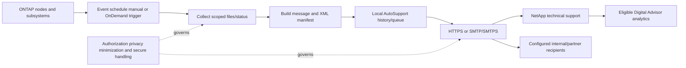

### Core terms

| Term | Plain meaning | Analogy | Why it matters |
|---|---|---|---|
| **AutoSupport message** | A packaged support/telemetry collection for one trigger and node context | Diagnostic parcel | Unit whose collection and delivery must be tracked |
| **Trigger** | Event, schedule, manual action, or Support instruction that requests a message | Shipping request | Explains why the message exists |
| **Subsystem** | ONTAP component/category that contributes diagnostic files | Department packing evidence | Content and collection time differ by subsystem |
| **Manifest** | XML inventory of included files, sizes, status, and collection errors | Packing list | Proves what was attempted/included, not that every desired item succeeded |
| **Transport** | HTTPS, SMTP, or release-supported SMTP with TLS | Courier route | Determines capability, security, size, proxy, and certificate dependencies |
| **Destination** | NetApp, internal recipients, partner recipients, or an invoked URI under documented use | Delivery address | Receipt must be proven per destination |
| **AutoSupport OnDemand** | HTTPS-based mechanism through which technical support can request new or past messages under documented conditions | Authorized return-shipping instruction | Depends on support delivery, HTTPS, identity, and entitlement |
| **Telemetry freshness** | Age and coverage of the latest successfully received usable evidence | Date on the newest trusted parcel | Stale telemetry can make a healthy dashboard falsely reassuring |

### Scope and role boundary

Public ONTAP documentation states that AutoSupport management is cluster-administrator scoped; an SVM administrator does not manage it. AutoSupport is enabled by default in documented setup contexts, but configuration, support delivery, local copies, network reachability, and actual receipt still require verification.

---

## 2. Message types and trigger paths

AutoSupport messages differ by purpose and content. Public documentation distinguishes event-triggered, daily, performance, weekly, manually invoked, core-upload, performance-archive, and AutoSupport OnDemand cases.

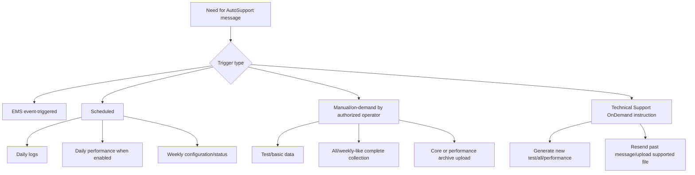

### Message-type orientation

| Message type | Public-content orientation | Decision use | Important caveat |
|---|---|---|---|
| Event-triggered | Context-sensitive files for the subsystem associated with the EMS trigger | Incident precursor/context | Not every EMS event creates the same content or destination behavior |
| Daily log | Log files | Recent operational history | Schedule existence does not prove collection or receipt |
| Daily performance | Prior-period sampled performance data when enabled | Trend/performance context | Sampling, coverage, privacy, and enablement matter |
| Weekly | Configuration and status data | Inventory/configuration baseline | Weekly evidence can be stale after a change |
| Manual test | Basic data for delivery testing | Transport/receipt validation | Does not prove large-message or every subsystem path |
| Manual all | Broader weekly-like troubleshooting collection | Support-requested investigation | Can be large/sensitive; current procedure and authorization required |
| Core/performance archive | Large specialist file upload | Crash or time-series escalation | Public docs require appropriate support/transport behavior; highly sensitive |
| OnDemand | Support-requested new or past message | Guided Support investigation | HTTPS and support delivery are required under public docs |

### Trigger-to-receipt evidence

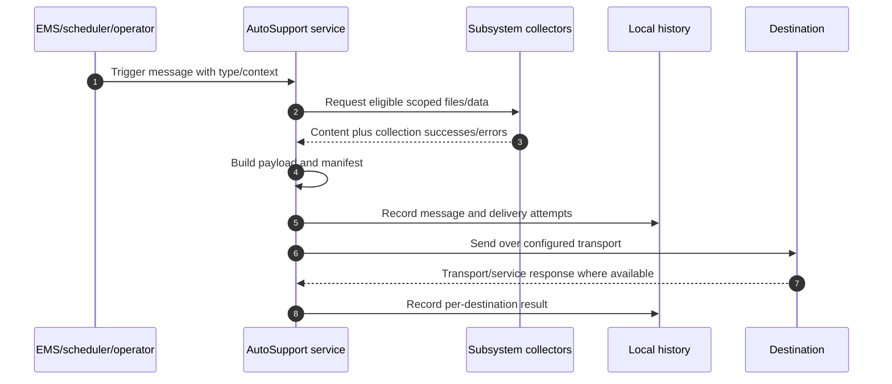

### Event-triggered AutoSupport versus EMS

An EMS event is an ONTAP event record. An event-triggered AutoSupport is a package created because a configured/documented EMS trigger called for broader context. The event is not the parcel; the parcel may include related logs and subsystem data.

---

## 3. Collection categories and manifest orientation

AutoSupport can collect information from supported subsystems. The precise file list, selection, time/size budget, and release behavior must be read from current documentation and the message manifest.

### Plain-English deep-dive: categories are shelves, not guarantees

Knowing that a parcel can contain `configuration`, `logs`, or `performance` is like knowing a warehouse has those shelves. It does not prove a specific file was placed in this parcel, was complete, covered the incident interval, or survived size truncation. The manifest is the authoritative packing-list evidence for that message.

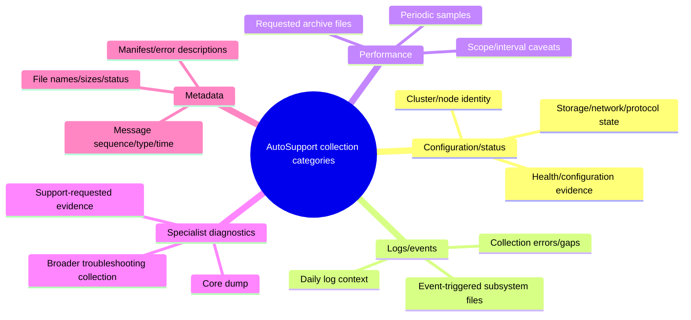

### Manifest fields confirmed by public documentation

| Manifest field | What it supports | What it cannot prove alone |
|---|---|---|
| Message sequence number | Correlates manifest to a message | Customer/system identity without surrounding evidence |
| Included file names | Which files were packaged | That file contents cover the full incident |
| File size in bytes | Payload-size evidence | Completeness, truth, or safe interpretation |
| Collection status | Whether collection completed under recorded status | Remote receipt or Support usability |
| Error description | Why one or more files were not collected | Root cause without subsystem/state evidence |

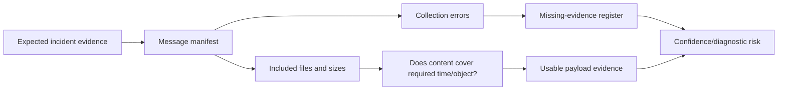

### Collection quality checks

1. Exact cluster/node, message sequence, type, trigger, and UTC time.
2. Expected subsystem versus actual files in the manifest.
3. Collection error, time-budget, size-limit, or truncation indicators.
4. Incident interval versus log/performance coverage.
5. File freshness and whether later changes invalidate configuration data.
6. Privacy classification and authorized reviewers.

---

## 4. Sources and destinations

### Source side

AutoSupport is generated from ONTAP nodes and cluster-level configuration according to release behavior. Public setup documentation notes cluster-wide configuration inheritance for newer releases while older releases can differ. Always record the exact release and node message history.

### Destination side

| Destination | Purpose | Evidence needed | Access caveat |
|---|---|---|---|
| NetApp technical support | Product support and eligible analytics | Support delivery enabled, per-message successful destination status, entitled asset association | Support Site/Digital Advisor access can be gated |
| Internal `to` recipients | Key AutoSupport email messages | Correct list, mail host, actual mailbox receipt | Email can contain sensitive support data |
| Internal `noteto` recipients | Shortened key-message notices | Correct list and receipt | Summary is not full diagnostic evidence |
| Support partner | Broader configured message copies | Partner authorization, agreement, recipient control, receipt | Third-party data sharing needs consent/contract review |
| Explicit URI for supported manual action | Targeted resend/upload under documented command | Exact authorized URI, transport, result, purpose | Never use an ad hoc upload destination |

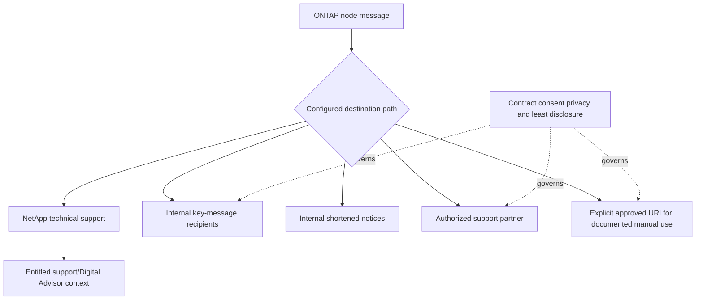

### Destination independence

Success to one destination does not prove success to another. HTTPS to NetApp can succeed while internal SMTP copies fail; internal email can arrive while NetApp delivery is disabled or blocked. Preserve per-destination evidence.

---

## 5. HTTPS and SMTP delivery concepts

Public ONTAP documentation recommends HTTPS because it offers the strongest feature set and security. SMTP is an alternative with explicit limitations. Starting with the documented release, SMTP can use explicit TLS; exact availability must be rechecked.

### HTTPS path

```mermaid
sequenceDiagram
    autonumber
    participant A as ONTAP AutoSupport
    participant D as DNS
    participant P as Optional HTTP proxy
    participant T as NetApp/support HTTPS endpoint
    A->>D: Resolve endpoint/proxy name
    D-->>A: Address/TTL or error
    A->>P: Connect through configured proxy when required
    P->>T: Establish outbound route
    A->>T: TLS handshake and certificate validation
    A->>T: HTTPS PUT; documented fallback can use POST
    T-->>A: Transport/service response
    A->>A: Record destination status/history
```

### HTTPS capabilities and dependencies

- Preferred public-documented transport.
- Supports AutoSupport OnDemand and large-file uploads under documented conditions.
- Uses TLS and public documentation identifies TCP port 443.
- Can require a configured HTTP proxy.
- ONTAP validates the server certificate against trusted root/intermediate CAs.
- Name resolution, routes, firewall/egress rules, proxy authentication, certificate trust, time, endpoint service, and payload size all matter.

### SMTP/SMTPS path

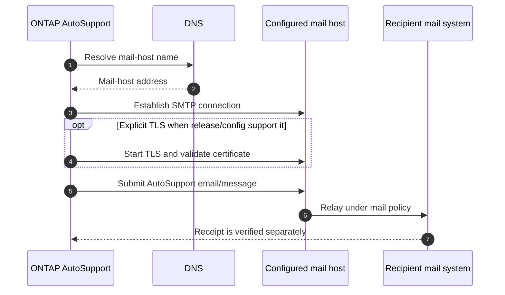

### Transport comparison

| Dimension | HTTPS | SMTP/SMTPS |
|---|---|---|
| Public recommendation | Preferred | Use when HTTPS is not allowed/supported after review |
| AutoSupport OnDemand | Supported under documented configuration | Not supported by public requirements page |
| Large-file upload | Supported under documented configuration | Not supported by public requirements page |
| Security | TLS with endpoint certificate validation | Plain SMTP is unencrypted; explicit TLS is release/config dependent |
| Intermediary | Optional HTTP proxy | Mail relays/filtering/gateways |
| Failure evidence | TLS/HTTP/proxy/service and AutoSupport history | SMTP/TLS/relay/mailbox and AutoSupport history |
| Size behavior | Documented protocol limit and possible truncation | Smaller documented limit and possible truncation |

**Current-doc boundary:** Never copy size limits or ports from memory into a firewall/change plan. The public source records values at its update date; use the exact running release and command reference.

---

## 6. End-to-end network dependency map

### Plain-English deep-dive: outbound path is a chain, not an internet checkbox

`The cluster has internet access` is too broad. The message needs the correct source context, DNS answer, route, firewall egress, proxy or mail relay, certificate trust, time, destination service, and return response. One broken link produces a delivery failure even when management browsing works elsewhere.

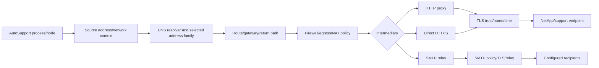

### Dependency checklist

| Dependency | Questions | Evidence |
|---|---|---|
| Source | Which node/context/address family originates the short-lived connection? | Current config plus packet/firewall flow where authorized |
| DNS | Which resolver, answer, TTL, IPv4/IPv6 path? | Exact query/answer and selected address |
| Routing | Which gateway/route and return path? | Source-context route lookup and device evidence |
| Firewall/NAT | Which rule/state/translation permits the exact endpoint/port? | Rule ID, original/translated tuple, result |
| Proxy | URL/port/auth, TLS behavior, capacity, allow-list? | Proxy logs and AutoSupport check/history |
| TLS/PKI | Name, chain, root/intermediate, validity, time, inspection? | Certificate and handshake error without bypass |
| SMTP | Mail host, relay policy, sender, size/filter/quarantine? | Relay logs and recipient receipt |
| Destination | Service availability/response and entitled asset association? | AutoSupport status plus authorized portal confirmation |

### Strict security boundary

- Do not disable TLS verification or deploy an unreviewed proxy bypass.
- Do not open broad outbound access when exact destinations/current guidance can be used.
- Do not put proxy/mail credentials in tickets, scripts, screenshots, or this guide.
- Do not collect unrestricted packet payloads; AutoSupport content and credentials can be sensitive.
- Coordinate egress changes with security/network owners and validate rollback.

---

## 7. Entitlement, registration, and asset identity

Delivery success does not guarantee that telemetry appears under the expected customer/account view. Support entitlement, asset registration, serial/system identity, ownership, and account/site association can affect visibility and service workflows.

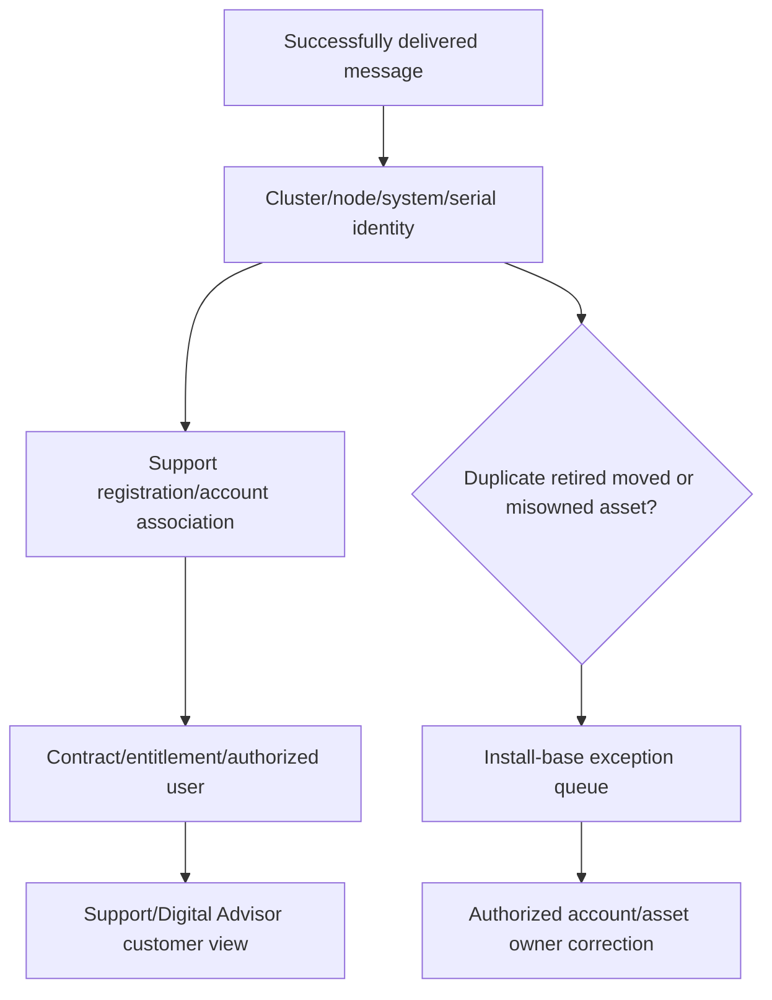

### Identity fields to reconcile

- Customer/account and site.
- Cluster UUID/name and node system identifiers.
- Chassis/controller serials and current ownership.
- Product/platform and ONTAP release.
- Support contract/entitlement reference and service status.
- Last received message per node, not only one cluster aggregate.
- Retired/replaced/moved/renamed systems and duplicate records.
- Data source, evidence timestamp, confidence, and correction owner.

### Gated-access rule

If the analyst cannot access the Support Site or Digital Advisor account, safe wording is:

> "I can validate the local AutoSupport configuration, collection manifest, test invocation, and outgoing history with an authorized storage administrator. I cannot confirm remote account association or Digital Advisor receipt without entitled access; that is an explicit owner-assigned check, not an assumed success."

---

## 8. Test, delivery status, and telemetry freshness

Public setup documentation provides a layered validation pattern: inspect configuration, run AutoSupport checks/details, invoke a test message, inspect message history, and confirm expected destination receipt. The public page identifies a successful outgoing history status, but exact status values and timing remain release-specific.

### Delivery state model

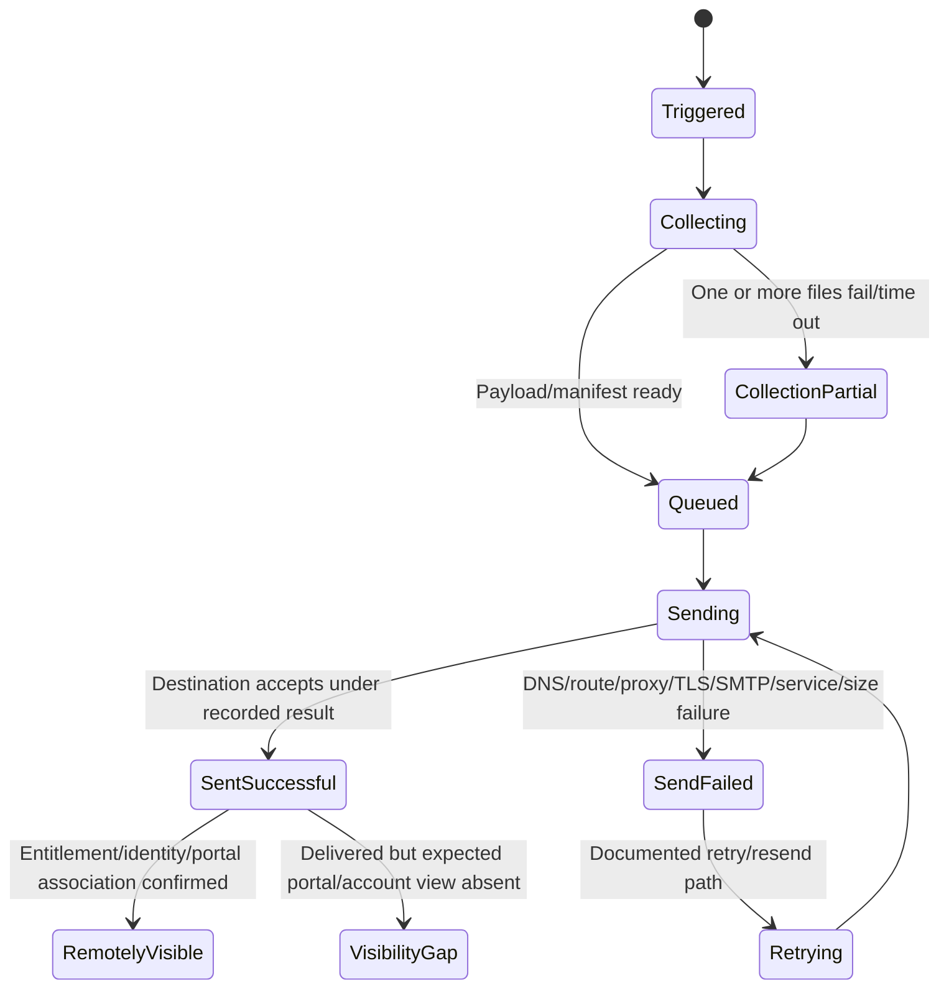

### Freshness is multidimensional

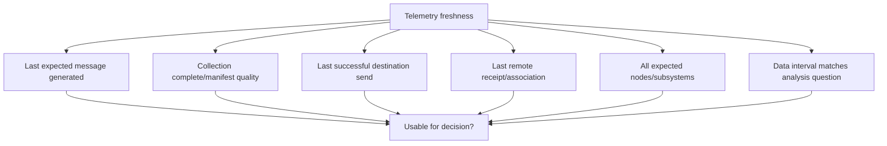

### Freshness matrix

| State | Meaning | Risk treatment |
|---|---|---|
| Current and complete enough | Expected node/messages received; manifest covers needed evidence | Use with stated cutoff and limitations |
| Current but partial | Recent message has collection/truncation gaps | Lower confidence; obtain alternate evidence |
| Locally generated, send failed | Cluster evidence exists but remote support analytics are stale | Repair delivery; preserve local evidence |
| Sent successful, portal missing | Transport success but account/identity/processing visibility unresolved | Validate registration/entitlement and portal owner |
| One node stale | Cluster-level view hides node blind spot | Scope risk to node and repair individually |
| Intentionally disabled/reduced | Governance decision changed coverage | Record owner/rationale/expiry/compensating monitoring |
| Unknown | Access or source unavailable | Do not label healthy; assign evidence action |

### Missing telemetry risk

- Proactive wellness findings can be absent or stale.
- Support can spend incident time rebuilding inventory and history.
- Bug, lifecycle, capacity, and upgrade analysis can use wrong versions/state.
- Install-base and entitlement mismatches can persist.
- "No alert" can actually mean "no recent data."

---

## 9. Privacy, PII, secrets, consent, and secure handling

AutoSupport contains diagnostic/support information. Depending on configuration and system state, support evidence can include identifiers, addresses, filenames, account/contact information, logs, command output, and other potentially sensitive data. Never promise that a generic private-data option removes every item a customer's policy considers sensitive.

### Plain-English deep-dive: redact a working copy, protect the original

A medical team may preserve the original scan in a restricted archive while sharing a redacted report with a wider review group. Destroying the original prevents diagnosis; sharing it widely violates privacy. **Why it matters:** support evidence needs purpose limitation, minimum access, secure transfer, retention, and redacted customer-facing outputs.

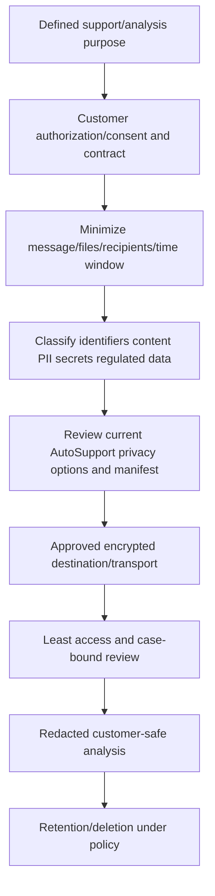

### Data-handling controls

| Control | Required behavior |
|---|---|
| Purpose | State the support, health, or incident question |
| Authorization | Confirm customer policy, contract, consent, and recipient legitimacy |
| Minimization | Select only required message/file/time scope |
| Private-data setting | Verify exact current behavior and irreversible side effects before changing |
| Manifest review | Confirm included/missing files and sizes before sharing |
| Secret handling | Never expose passwords, proxy/mail credentials, private keys, CHAP secrets, tokens, or unredacted authorization headers |
| Transfer | Use configured/approved NetApp or customer secure channel only |
| Access | Named case roles; no public links or unapproved AI/chat tools |
| Reporting | Redact names, paths, serials, IPs, identities, and customer content as needed |
| Retention | Follow customer/NetApp agreement and delete working copies when required |

Public setup documentation exposes a private-data-removal option and warns that changing it can delete local AutoSupport history and associated files. Therefore it is a high-impact configuration decision, not a casual privacy toggle.

### PII and support-information boundary

NetApp's public privacy policy describes Support Information and functional/device/network information as possible processed categories and states that NetApp can act as a processor/service provider under customer agreements. For a real customer, the applicable contract/data-processing terms and customer policy govern. This study guide does not interpret law.

---

## 10. AutoSupport versus EMS, support bundles, and Digital Advisor

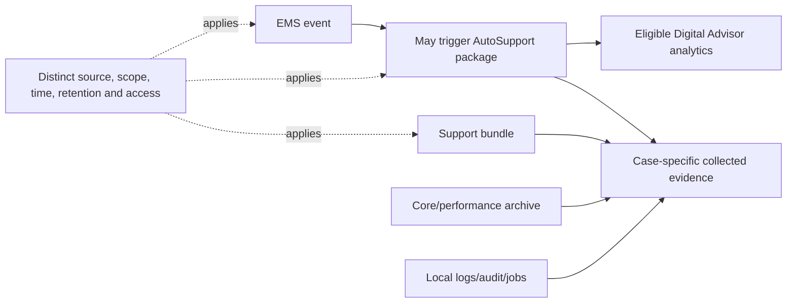

### Comparison table

| Evidence source | Primary job | Trigger/collection | Delivery/access | What it does not prove |
|---|---|---|---|---|
| EMS | Record named ONTAP events | Event emission | Local/query/notifications | Full diagnostic context or remote receipt |
| AutoSupport | Package recurring/event/manual support evidence | Event, schedule, manual, OnDemand | HTTPS/SMTP destinations; gated remote views | Continuous complete logs or app health |
| Support bundle | Case-oriented package of selected diagnostics | Operator/Support workflow | Secure case transfer | Automatic periodic telemetry or exact app context |
| Core/performance archive | Deep crash/time-series specialist artifact | Explicit supported collection/upload | Restricted Support handling | Entire incident history or root cause alone |
| Digital Advisor | Proactive fleet/wellness analysis from eligible data | Service processing of received data | Entitled web/account access | Freshness, completeness, or applicability without validation |

### Memory rule

**EMS reports a signal; AutoSupport packs context; Digital Advisor analyzes eligible received data; a support bundle assembles case evidence.**

---

## 11. Discovery, evidence, risk, and recommendation engineering

### Discovery questions

1. Which cluster/node/platform/ONTAP release, account/site, entitlement, and business service are in scope?
2. Is AutoSupport enabled for local collection and support delivery, and who authorized the configuration?
3. Which event, scheduled, performance, weekly, manual, or OnDemand messages are expected from each node?
4. Which exact files/subsystems/manifests and collection errors cover the decision interval?
5. Which HTTPS or SMTP destination is configured, and which internal/partner recipients also receive messages?
6. Which source address, DNS, route, firewall, NAT, proxy/mail host, TLS certificate, and endpoint path applies?
7. What do local checks, test invocation, per-destination history, remote receipt, and portal/account association show?
8. Which messages/nodes are stale, partial, truncated, disabled, missing, or inaccessible?
9. Which payload identifiers, filenames, logs, PII, secrets, regulated data, recipients, consent, retention, and transfer controls apply?
10. What customer decision or risk depends on this telemetry, and what alternate evidence exists if it is missing?

### Evidence contract

| Evidence | Required fields |
|---|---|
| Configuration | Cluster/node, release, enabled/support/transport/private/performance settings, recipients, proxy/mail host, timestamp |
| Collection | Sequence, trigger/type, manifest, files/sizes/status/errors, time/size/truncation context |
| Delivery | Destination, attempt time, status/error, retry/resend, test message and receipt |
| Network | Source/destination tuple, DNS, route, firewall, proxy/SMTP, TLS certificate/error, address family |
| Identity | Cluster/node/system/serial, customer/account/site, entitlement, portal association |
| Privacy | Purpose, authorization, classification, recipients, redaction, secure transfer, retention |
| Decision | Freshness cutoff, confidence, gaps, business risk, action owner/date, validation and residual risk |

### Evidence-to-recommendation chain

```mermaid
flowchart LR
    OBS[Observed collection/delivery/freshness evidence] --> CONTEXT[Customer service entitlement privacy and decision context]
    CONTEXT --> FIND[Verified finding and confidence]
    FIND --> RISK[Support/proactive/analytics/business risk]
    RISK --> OPTIONS[Repair path alternate evidence defer/accept options]
    OPTIONS --> ACTION[Recommendation owner date prerequisites]
    ACTION --> PROOF[Test message manifest status remote receipt]
    PROOF --> RESID[Residual gaps monitoring and next review]
```

### Recommendation patterns

| Finding | Risk | Bounded recommendation | Validation |
|---|---|---|---|
| HTTPS test fails certificate validation | Remote telemetry and OnDemand/large uploads unavailable | PKI/network owners should repair name/chain/time/trust under current docs; no TLS bypass | Test history succeeds and authorized remote receipt is confirmed |
| SMTP copies arrive but NetApp support is disabled | Internal notices create false confidence in remote support visibility | Storage owner should review/enable supported delivery only with customer approval and exact requirements | Per-destination history and entitled portal confirmation |
| Weekly message succeeds but event messages are partial | Incident diagnostics can omit the failing subsystem | Inspect manifest/errors/time/size and collect alternate case evidence with Support | Required subsystem file present/usable in a later controlled test |
| One node has no recent successful message | Cluster-level wellness can hide a blind node | Scope node-specific network/collection/history and repair | Fresh successful message from every expected node |
| Payload sharing lacks approved recipient/retention | Privacy/contract exposure | Minimize, use approved secure destination, redact report, record consent/retention | Access audit and deletion/retention evidence |

### JD Mapping

| JD responsibility | Part 47 contribution | Your factual bridge and gap |
|---|---|---|
| Generate/analyze customer data | Defines message, manifest, freshness, identity, and quality schema | Analytics/evidence skills transfer; no production payload access |
| Improve support experience | Reduces missing context and validates delivery before incidents | enterprise escalation-package discipline transfers |
| Proactive risk/stability | Treats missing/stale telemetry as a managed risk | critical situation and monitoring reasoning transfer |
| Install-base quality | Reconciles cluster/node/serial/account/entitlement association | Data-quality strengths transfer |
| Customer recommendations | Connects evidence to network/privacy/owner/proof/residual risk | Advisory and review communication transfer |
| Security/privacy | Applies minimization, consent, redaction, secure transfer, retention | Enterprise data-handling experience transfers |
| Cross-functional work | Coordinates storage, network, PKI, security, Support, partner, account owners | Multi-team prior experience transfers |

---

## 12. Troubleshooting AutoSupport delivery

### Troubleshooting tree

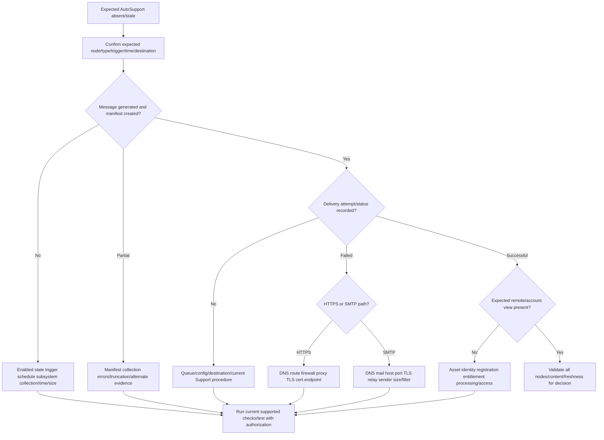

### Failure table

| Symptom | Candidate causes | Discriminating evidence | Unsafe shortcut |
|---|---|---|---|
| No message in history | Trigger not expected, disabled collection, subsystem failure, local service/config issue | Expected schedule/event plus current config/events | Repeatedly invoking broad `all` messages |
| Collection partial | File missing, time/size budget, subsystem error | Manifest status/file/error | Assuming send retry restores absent content |
| DNS failure | Resolver/path/address-family issue | Source-context query and route | Hardcoding an undocumented endpoint IP |
| HTTPS proxy failure | Wrong URL/port/auth, proxy policy/capacity | Proxy and AutoSupport check/history | Broad proxy bypass |
| TLS certificate failure | Missing CA/intermediate, name/time/inspection | Exact chain/alert/current trust | Disabling verification |
| SMTP failure | Mail host/relay/sender/TLS/size/quarantine | Relay logs and per-recipient receipt | Opening all relay access |
| Successful local history, no Digital Advisor data | Asset association, entitlement, portal processing/access, wrong account | Sequence/node/serial plus authorized portal owner | Fabricating a screenshot/result |
| Stale after node replacement | Old/new serial/system/account record mismatch | Install-base and last-message comparison | Marking old asset current |

### Troubleshooting discipline

1. Preserve the last known-good and first failed sequence/time.
2. Separate collection failure from transport failure.
3. Separate HTTPS from SMTP destinations.
4. Use exact errors before changing DNS/proxy/certificate/firewall/mail settings.
5. Test the smallest relevant path; a basic test does not prove archive-sized upload.
6. Confirm remote receipt/association only through authorized access.
7. Recheck privacy and change approval before broader collection or resend.
8. Validate freshness after repair, not only one green transport result.

### Escalation pack

- Business/support impact and analysis blocked by missing telemetry.
- Cluster/node/platform/ONTAP/system/serial/account identity and UTC timeline.
- AutoSupport configuration, expected message types, destination model, and current-doc references.
- Message sequence/type/trigger/manifest/files/sizes/collection errors.
- Check/test/history statuses and full redacted errors.
- DNS/route/firewall/proxy/SMTP/TLS/address-family evidence.
- Entitlement/registration/asset-association evidence or named access gap.
- Privacy authorization, recipients, secure evidence location, and redactions.
- Actions tried, results, rollback, leading/alternate hypotheses, exact specialist ask.

---

## 13. Fully synthetic sanitized scenario and tool fallback

> **Synthetic boundary:** `Cedar Labs`, cluster/node names, serials, sequence numbers, message times, statuses, network devices, recipients, and findings are invented. The tables are teaching artifacts, not screenshots from ONTAP, Support, or Digital Advisor.

### Scenario

Cedar Labs has a fictional two-node ONTAP cluster. Internal notice emails arrive, but the account team's proactive report has no recent telemetry for node B. The customer does not grant the analyst direct Support Site or Digital Advisor access.

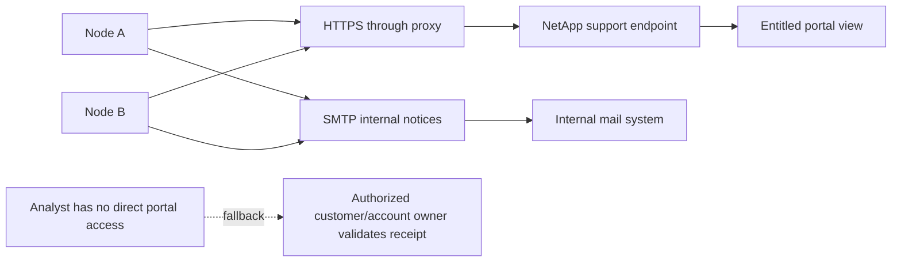

### Synthetic screenshot replacement: local configuration/evidence table

| Field | Node A | Node B | Evidence classification |
|---|---|---|---|
| Expected weekly message | Yes | Yes | Synthetic scenario input |
| Internal SMTP notice | Received | Received | Synthetic mailbox result |
| Latest HTTPS history | Successful | Failed | Synthetic local-history summary |
| Failure stage | None | TLS certificate validation | Synthetic diagnostic input |
| Manifest collection | Complete enough | Complete enough | Synthetic manifest summary |
| Portal confirmation | Authorized owner confirms current | Authorized owner confirms stale | Synthetic fallback confirmation |

### Timeline

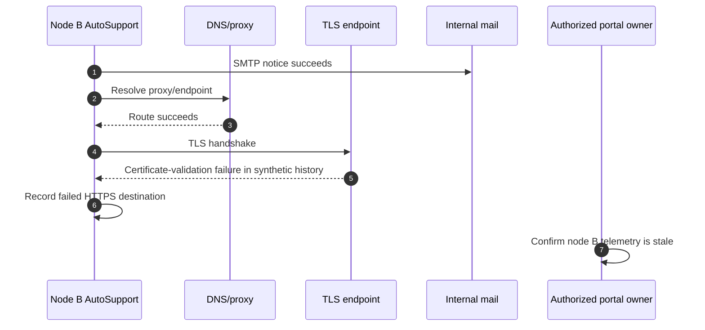

### Competing hypotheses

| Hypothesis | Supporting evidence | Disconfirming check |
|---|---|---|
| AutoSupport collection failed | Remote data stale | Manifest and internal message show collection completed |
| General internet route failed | HTTPS failed | DNS/proxy route established before TLS error |
| SMTP success proves NetApp receipt | Internal email arrived | Separate HTTPS destination history is failed |
| Certificate trust broke after proxy inspection change | TLS validation error follows approved proxy change | Compare chain/name/time from current secure path with PKI owner |
| Entitlement alone caused stale view | Portal is stale | Failed HTTPS send already explains missing node B receipt; entitlement still checked after repair |

### Bounded recommendation

> **Finding:** Synthetic node B collects the expected message and sends internal SMTP notice, but HTTPS delivery fails certificate validation after a proxy trust change; node A remains current. **Risk:** NetApp-side telemetry for node B is stale, reducing proactive wellness and incident-context quality. **Recommendation:** The PKI/network owner and storage owner should restore the documented trusted certificate chain/name/time path without disabling validation, then run the smallest supported check/test. **Access fallback:** The authorized portal owner, not you, confirms remote receipt and asset association. **Validation:** node B shows a successful HTTPS destination result, the expected manifest is complete enough, and the portal owner confirms the new sequence. **Residual risk:** a basic test does not prove every large upload/subsystem; ongoing weekly and event-message freshness monitoring remains.

### What the scenario proves

- Destination-specific evidence prevents SMTP success from masking HTTPS failure.
- Manifest success separates collection from delivery.
- The analyst can make progress without gated access by assigning the portal check to an authorized owner.
- TLS validation is repaired, not bypassed.
- The scenario does not prove production AutoSupport skill.

---

## 14. Your transfer and honest gap

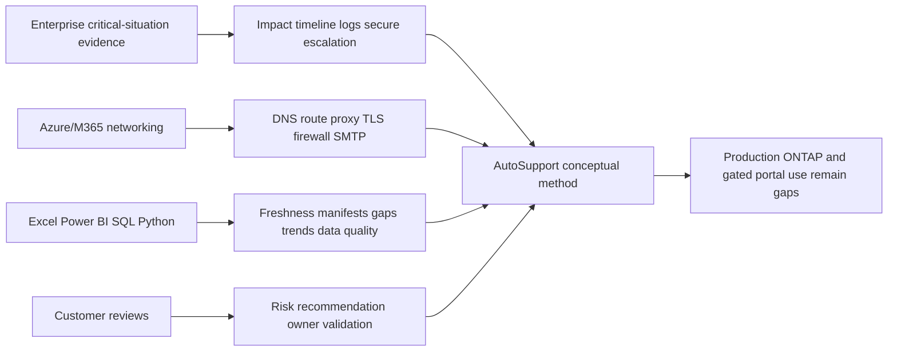

### Transfer table

| Factual strength | Transfer to AutoSupport | Honest limit |
|---|---|---|
| Enterprise support/escalation | Question-led evidence, secure transfer, exact ask | Not NetApp AutoSupport operation |
| DNS/TCP/TLS/proxy/SMTP troubleshooting | Delivery-path hypothesis testing | Exact ONTAP fields/procedures require current docs |
| Analytics/data quality | Freshness, completeness, duplicate/identity and gap reporting | No customer Digital Advisor data assumed |
| Critical situation/customer communication | Impact, owner, checkpoint, residual risk | No authority to change customer egress/privacy settings |

### Honest interview answer

> "I understand AutoSupport as a collection-and-delivery pipeline: a trigger starts subsystem collection, the manifest records included files and collection errors, the message enters local history, and each HTTPS or SMTP destination has its own delivery result. I would validate DNS, route, firewall, proxy or mail relay, TLS and asset/entitlement association, then state telemetry freshness and gaps. My production experience is enterprise support and network evidence, not ONTAP AutoSupport or Digital Advisor; I would use current docs and an authorized customer or NetApp owner for gated confirmation."

---

## 15. Paper lab and self-test workflow

### Paper lab objective

Build a privacy-safe AutoSupport health assessment for a fictional eight-node fleet using only synthetic records and public documentation.

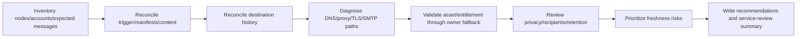

### Synthetic lab data

Create eight node records with:

- Two current/complete HTTPS nodes.
- One node with manifest collection error.
- One node with proxy authentication failure.
- One node with certificate-chain failure.
- One SMTP-only node with OnDemand/large-upload gap.
- One successfully sent node mapped to the wrong retired asset record.
- One node with AutoSupport deliberately disabled and an expired exception.

### Tasks

1. Build cluster/node/system/serial/account/site/owner/entitlement inventory.
2. Define expected event, daily, performance, weekly, and manual-test evidence by node.
3. Reconcile message history with manifest files/status/errors.
4. Separate collection, queue, transport, remote receipt, and portal-association states.
5. Draw each HTTPS path through DNS, route, firewall, proxy, TLS, and endpoint.
6. Draw each SMTP path through DNS, mail host, TLS, relay, recipient, and quarantine.
7. Create freshness fields: last generated, complete, sent, received, and usable dates.
8. Create privacy fields: purpose, data classes, recipients, approval, transfer, retention.
9. Build a missing-evidence/authorized-access register.
10. Rank risks by business criticality, missing duration, incident need, and alternate evidence.
11. Write three recommendations with evidence, context, risk, action, owner/date, validation, and residual risk.
12. Deliver a two-minute operational-review summary without claiming direct tool access.

### Lab pass checklist

- [ ] Every conclusion names node, message type, destination, sequence/time, and data cutoff.
- [ ] Manifest collection and transport delivery are separate states.
- [ ] HTTPS and SMTP destination results are not conflated.
- [ ] Basic test success is not treated as proof of large archive upload.
- [ ] Freshness includes generation, collection, send, receipt, scope, and usability.
- [ ] Missing/gated evidence stays unknown and has an authorized owner.
- [ ] TLS validation, privacy, consent, and secure transfer are not bypassed.
- [ ] EMS, AutoSupport, Digital Advisor, and support bundles remain distinct.
- [ ] All tables/screenshots are labeled synthetic.
- [ ] No result is described as your production NetApp experience.

### Self-test

1. Define AutoSupport, trigger, subsystem, message, manifest, transport, destination, OnDemand, and freshness.
2. Draw the complete trigger-to-collection-to-delivery-to-analysis architecture.
3. Compare event, daily, performance, weekly, manual, archive, and OnDemand messages.
4. Explain every manifest field and its evidence limit.
5. Compare NetApp, internal, partner, and explicit-URI destinations.
6. Compare HTTPS and SMTP capability/security/dependency boundaries.
7. Trace DNS, route, firewall, proxy, TLS, mail relay, and endpoint failures.
8. Explain entitlement/registration/asset identity after transport success.
9. Build the freshness matrix and explain missing-telemetry risk.
10. Apply privacy minimization, PII/secret handling, consent, redaction, transfer, and retention.
11. Distinguish AutoSupport, EMS, support bundle, core/performance archive, and Digital Advisor.
12. Apply the troubleshooting tree to collection, HTTPS, SMTP, and portal-association failures.
13. Recreate the Cedar Labs scenario with authorized-owner fallback.
14. Complete the paper lab and answer Q1-Q8 aloud.

---

## 16. Official Source Anchors

**Date checked: 2026-08-24.** Only public official NetApp sources are used below. Exact commands, fields, defaults, limits, endpoint behavior, privacy settings, and Support/Digital Advisor access remain release-, contract-, and entitlement-sensitive. Reopen the exact current pages before customer use.

| Topic | Official public source | Bounded use and access note |
|---|---|---|
| AutoSupport purpose/ownership | [Learn about ONTAP AutoSupport](https://docs.netapp.com/us-en/ontap/system-admin/manage-autosupport-concept.html) | Public purpose, default/high-level behavior, cluster-admin scope; exact release configuration still required |
| Message destinations/triggers | [When and where AutoSupport messages are sent](https://docs.netapp.com/us-en/ontap/system-admin/when-where-autosupport-messages-sent-concept.html) | Event, scheduled, manual, and OnDemand destination orientation |
| Message content types | [Types of AutoSupport messages and their content](https://docs.netapp.com/us-en/ontap/system-admin/types-autosupport-messages-reference.html) | Event/daily/performance/weekly/manual/archive content categories; not a payload guarantee |
| Manifest | [Information included in the AutoSupport manifest](https://docs.netapp.com/us-en/ontap/system-admin/autosupport-manifest-concept.html) | Sequence, included files/sizes, status, collection errors, XML/Digital Advisor orientation |
| Transport requirements | [Prepare to use AutoSupport](https://docs.netapp.com/us-en/ontap/system-admin/requirements-autosupport-reference.html) | HTTPS/SMTP/SMTPS, proxy, certificate, size/security capability orientation; recheck exact release |
| Setup/check/test/history | [Set up ONTAP AutoSupport](https://docs.netapp.com/us-en/ontap/system-admin/setup-autosupport-task.html) | Public layered validation workflow and privacy-option warning; production change authority still required |
| AutoSupport and Digital Advisor | [About Digital Advisor and AutoSupport](https://docs.netapp.com/us-en/ontap/system-admin/autosupport-active-iq-digital-advisor-concept.html) | Public relationship between received AutoSupport data and Digital Advisor context |
| NetApp privacy | [NetApp Privacy Policy](https://www.netapp.com/company/legal/privacy-policy/) | Public categories including Support Information and processor/service-provider context; customer agreement and law govern real handling |
| Support access | [NetApp Support Site](https://mysupport.netapp.com/) | Official gated destination for entitled assets, cases, uploads, and support workflows; never invent inaccessible results |
| Documentation entry | [NetApp Documentation](https://docs.netapp.com/) | Select exact product/release and current command references |

### Source-use discipline

- Record exact cluster/node/platform/ONTAP release, message sequence/type/trigger, destination, source page, and date.
- Use the manifest for included-file and collection-error evidence.
- Use per-destination history plus authorized remote confirmation; do not infer receipt from configuration.
- Recheck transport size/security/proxy/certificate details for the exact release.
- Protect payloads, filenames, identifiers, logs, credentials, and customer data.
- State Support Site/Digital Advisor entitlement gaps explicitly.
- Never fabricate a tool screen, message result, serial, destination, or NetApp internal workflow.

---

## Likely Interview Questions

### Q1. What is AutoSupport, and what problem does it solve?

> **Model answer:** "AutoSupport is ONTAP's support-telemetry mechanism. Events, schedules, authorized manual actions, or Support OnDemand instructions trigger subsystem collection; ONTAP packages selected files and a manifest, records local history, and sends to configured NetApp, internal, or partner destinations. It improves proactive analysis and problem determination, but I verify collection, per-destination delivery, remote association, freshness, and privacy separately."

### Q2. Compare event-triggered, scheduled, manual, and OnDemand AutoSupport messages.

> **Model answer:** "Event messages package context for a triggering EMS subsystem. Scheduled messages provide daily logs, optional periodic performance data, and weekly configuration/status. Manual test/all/archive actions support controlled validation or Support-requested evidence. OnDemand lets technical support request new or past messages under documented HTTPS/support configuration. Their content, destination, size, and access differ, so I identify the exact type and manifest."

### Q3. What does the AutoSupport manifest tell you?

> **Model answer:** "The manifest is the XML packing list for a message: sequence number, included files, each file's byte size, collection status, and error descriptions when files could not be collected. I use it to prove content and gaps for that message. It does not prove the files cover the incident, that transport succeeded, or that NetApp associated the message with the expected account."

### Q4. How do HTTPS and SMTP delivery differ?

> **Model answer:** "Current public docs recommend HTTPS because it provides stronger security/features and supports AutoSupport OnDemand and large-file uploads under documented conditions. SMTP has narrower capabilities; plain SMTP is unencrypted, while explicit TLS support is release-dependent. HTTPS adds proxy and certificate-chain dependencies; SMTP adds relay, sender, mailbox and filtering dependencies. I prove each destination separately and never bypass TLS validation."

### Q5. How would you troubleshoot missing AutoSupport telemetry?

> **Model answer:** "I define expected node, message type, trigger, time and destination; check whether collection and manifest succeeded; inspect per-destination history/error; then trace HTTPS through DNS, route, firewall, proxy, TLS and endpoint or SMTP through mail host/TLS/relay/recipient. If sending succeeds but the portal is stale, I reconcile serial/system identity, registration, entitlement and account association with an authorized owner."

### Q6. Why is telemetry freshness more than the last message date?

> **Model answer:** "Freshness includes whether every expected node generated the right message, the manifest collected the required files, the destination send succeeded, remote receipt/account association is confirmed, and the content interval matches the analysis question. A recent partial test message cannot replace a complete weekly configuration or incident-specific event package. Missing data is unknown, not healthy."

### Q7. How do you protect privacy when using AutoSupport evidence?

> **Model answer:** "I define purpose and customer authorization, minimize message/file/time/recipient scope, inspect the manifest and current privacy settings, classify identifiers/content/PII/secrets, use approved encrypted destinations, restrict access, redact customer-facing working copies, and follow retention/deletion policy. I never request secrets or promise that one private-data setting removes every sensitive item."

### Q8. How does your prior background transfer, and what remains a gap?

> **Model answer:** "My prior enterprise support work gives me production evidence discipline, secure escalation, DNS/TCP/TLS/proxy/SMTP troubleshooting, critical-situation communication, and analytics for freshness and missing data. I understand AutoSupport's architecture and validation method, but I have not configured it or used customer Digital Advisor in production. I would use current docs and authorized storage, network, PKI, customer, and NetApp owners."

---

## 30-Second Memory Hooks

- **AutoSupport:** Diagnostic collection plus delivery pipeline, not just a setting.
- **Trigger:** Event, schedule, manual action, or Support instruction.
- **Manifest:** Packing list with files, sizes, status, and collection errors.
- **Event message:** EMS signal causes a context package; EMS and package are distinct.
- **Weekly:** Configuration/status baseline; recheck after changes.
- **HTTPS:** Preferred secure/full-feature route; proxy and PKI still matter.
- **SMTP:** Mail route with capability/security limits; receipt is destination-specific.
- **OnDemand:** Support instruction path over documented HTTPS configuration.
- **Delivery proof:** Configuration -> check -> test -> history -> authorized receipt.
- **Freshness:** Generated + collected + sent + received + complete enough + correct scope.
- **Missing telemetry:** Unknown visibility, not a green health result.
- **Entitlement:** Delivered data still needs correct asset/account association and authorized access.
- **Privacy:** Purpose, consent, minimize, protect, redact, retain/delete.
- **EMS:** Event; **AutoSupport:** package; **Digital Advisor:** analysis; **bundle:** case collection.
- **Your bridge:** Network/evidence discipline transfers; production NetApp tool use does not.

---

## Completion Checklist

- [ ] Define AutoSupport, triggers, subsystem collection, manifest, destinations, transport, OnDemand, and freshness.
- [ ] Draw the complete source-to-Digital-Advisor/support architecture.
- [ ] Compare event, daily, performance, weekly, manual, archive, and OnDemand messages.
- [ ] Explain manifest files/sizes/status/errors and evidence limitations.
- [ ] Map NetApp/internal/partner/URI destinations and prove each separately.
- [ ] Compare HTTPS/SMTP/SMTPS capability, security, size, proxy, and certificate constraints through current docs.
- [ ] Trace DNS, routes, firewall/NAT, proxy, TLS, mail host, endpoint, and address-family dependencies.
- [ ] Reconcile entitlement, registration, node/system/serial/account/site identity after send success.
- [ ] Build complete test/history/receipt and telemetry-freshness evidence.
- [ ] Explain missing-telemetry impact on support, wellness, lifecycle, bug, and upgrade analysis.
- [ ] Apply purpose limitation, consent, PII/secret handling, redaction, secure transfer, and retention.
- [ ] Distinguish AutoSupport, EMS, Digital Advisor, support bundles, cores, and performance archives.
- [ ] Apply the troubleshooting tree and build the escalation pack.
- [ ] Recreate Cedar Labs with synthetic tables and authorized-owner fallback.
- [ ] Complete the paper lab/self-test and answer Q1-Q8 aloud.
- [ ] State the No-production-NetApp boundary and exact non-claim accurately.
- [ ] Recheck current ONTAP/Support/privacy documentation and gated access before customer use.

---

*Next suggested section:* [Part 48 - Active IQ Digital Advisor and Proactive Wellness Analysis](Part-48-active-iq-digital-advisor-wellness.md)