# Part 48 - Active IQ Digital Advisor and Proactive Wellness Analysis

> **Section goal:** Learn how to turn Digital Advisor fleet, system, wellness, upgrade, capacity, efficiency, performance, planning, and support signals into customer-safe actions without treating a dashboard as unquestionable truth. By the end, you should be able to define access and scope, validate freshness and applicability, separate a risk from an action, control alert noise, build evidence-backed recommendations, and work through an authorized portal owner when access is gated.

Covers index item **48** and maps directly to job-description responsibilities for proactive risk identification, customer-data analysis, install-base review, system-health reporting, lifecycle/upgrade planning, efficiency and capacity insight, support-case context, customer recommendations, and cross-functional follow-through.

**Explicit nonclaim:** You have not operated Active IQ Digital Advisor for a production NetApp customer.

**Privacy and access boundary:** Digital Advisor account, watchlist, inventory, telemetry, case, contract, risk, and recommendation data are gated customer information and must remain in approved channels.

**Synthetic-evidence rule:** Every screenshot-like table, identifier, date, wellness signal, metric, and action below is fictional and sanitized; it is not a reproduction of the live service.

**Version caveat:** Digital Advisor names, navigation, widgets, colors, thresholds, severity models, platform/level support, risk content, corrective actions, inventory fields, exports, APIs, forecast methods, Upgrade Advisor behavior, support-tier features, entitlement rules, and data timing can change independently of ONTAP. A **current-doc check** means reopening current Digital Advisor documentation, the underlying risk/advisory or recommendation, exact platform/release documentation, and the customer's entitled portal view at decision time.

This Part is not a substitute for Digital Advisor, NetApp Support, an exact advisory, Upgrade Advisor plan, IMT, Hardware Universe, release notes, customer monitoring, or change governance. The portal and many results require valid Support Site credentials, asset entitlement, and active support context. If access is absent, the analyst records the gap and asks an authorized customer/account owner to provide a minimum necessary dated extract. No portal screen, risk, system, case, plan, or recommendation is invented.

> **No-production-NetApp boundary:** You do not claim production Digital Advisor experience. Every customer, watchlist, system, screenshot-like table, risk, metric, case, date, and recommendation below is synthetic. Your factual strengths are enterprise support, service reviews, critical-situation ownership, Azure/M365 observability and networking, data-quality analysis, Power BI/Excel/SQL/Python, and evidence-led customer communication. The explicit non-claim is: **you have not signed into a customer's Digital Advisor tenant, managed production watchlists, acknowledged a production risk, requested an Upgrade Advisor plan, inspected a customer AutoSupport instance, exported production performance data, viewed customer cases, or remediated a NetApp wellness action.**

---

## 1. What Digital Advisor is

**Active IQ Digital Advisor**, also called **Digital Advisor**, is NetApp's cloud-based portal and mobile experience for predictive analytics and proactive support. Public documentation says it combines AutoSupport telemetry, installed-base/support context, and broader analytics to expose health, risk, inventory, planning, upgrade, capacity, efficiency, performance, case, and configuration insights where supported.

### Plain-English deep-dive: an evidence analyst, not an oracle

Imagine a travel control center that combines aircraft telemetry, maintenance records, route plans, and known safety notices. It can highlight a likely issue and suggest an action, but engineers still verify that the data is current, the aircraft model is applicable, and the maintenance step is approved. Digital Advisor plays a similar evidence-to-insight role.

**Why it matters:** a dashboard recommendation is an input to a decision, not permission to make a change.

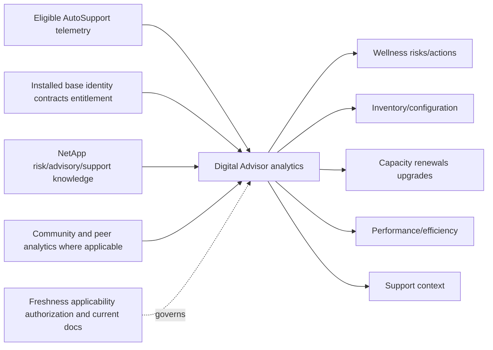

### Core terms

| Term | Plain meaning | Analogy | Why it matters |
|---|---|---|---|
| **Customer dashboard** | Central view for an entitled customer's installed base | Company control room | Scope can include many sites and systems |
| **Watchlist** | Saved selection of systems from one or more entitled customers/categories/serials | Curated flight board | Makes a working fleet manageable but can omit assets |
| **Widget** | Summary panel for a domain such as wellness, inventory, planning, or upgrades | Instrument panel | Summary requires drill-down before action |
| **Wellness attribute** | Risk domain such as security, performance/efficiency, availability/protection, capacity, configuration, or sustainability | Safety discipline | Groups findings by impact area |
| **Risk** | Identified condition with severity, affected systems, and potential consequence | Safety finding | Must be validated for exact system and current state |
| **Action** | Corrective guidance associated with one or more risks | Maintenance instruction | Requires prerequisites, owner, change review, and proof |
| **Affected system** | Asset to which a risk is mapped | Aircraft tail number | Identity mismatch can misdirect work |
| **Inventory** | Hardware/software/system/account records visible to the user | Asset register | Completeness depends on entitlement and source quality |
| **Freshness** | Age and coverage of source telemetry and processed view | Last trusted instrument update | Stale data creates false confidence |
| **Applicability** | Whether a finding truly matches the exact platform, release, feature, and state | Right instruction for the right model | Similar is not exact |

---

## 2. Identity, account, entitlement, and scope

Public documentation requires valid NetApp Support Site credentials to log in. Visibility depends on support-contract, entitlement, authorization, installed-base state, and feature/platform scope. A valid login does not mean every customer or secure system is visible.

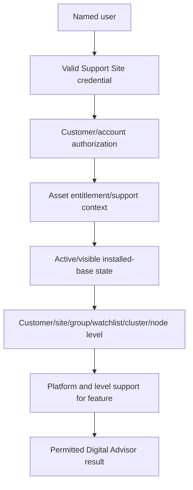

### Scope hierarchy

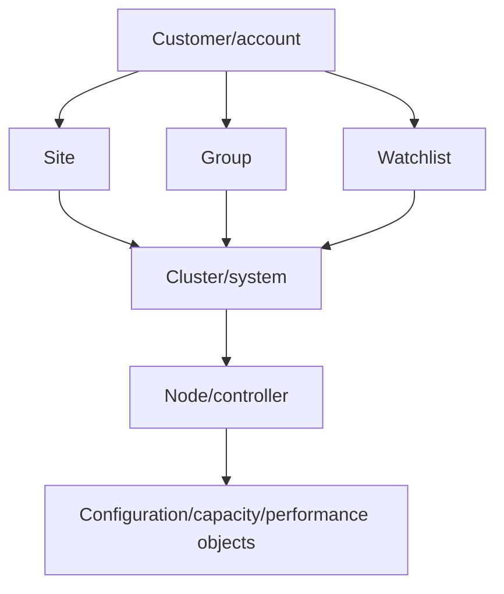

### Watchlists

A watchlist is a convenience scope, not an authoritative asset inventory. Public docs allow systems to be selected by categories such as customer, site, group, certain subscriptions, or serial numbers. Membership and maximums are service details to recheck before use.

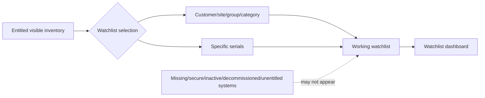

### Access and missing-system triage

| Symptom | Plausible cause | Safe next evidence |
|---|---|---|
| Cannot log in | Missing/invalid Support Site account or authentication issue | Official registration/account-support path |
| Customer not searchable | No customer authorization or entitlement | Account/customer owner confirmation |
| System absent | New-source delay, secure system, no entitlement, inactive/archived/decommissioned record | Serial/system/account/status reconciliation and non-technical support path |
| Feature disabled | Unsupported platform or hierarchy level, support-tier/feature constraint | Current feature/platform matrix and exact view context |
| Contract-expired asset absent | Visibility lifecycle after contract expiration | Contract owner and current login documentation |
| Watchlist incomplete | Membership/filter error or missing underlying inventory | Compare watchlist members with governed install base |

### Role boundary

- The **customer/account owner** authorizes access and resolves customer association.
- The **install-base/contract owner** corrects serial, site, ownership, lifecycle, and entitlement records.
- The **storage/platform owner** validates system state and implements approved technical actions.
- The **TAM/technical analyst** connects evidence to risk, owner, timing, and validation; they do not silently edit ownership or execute changes.
- **NetApp Support/service owners** handle technical cases, service defects, private advisories, and portal issues according to support process.

---

## 3. From AutoSupport to an actionable view

Part 47 established that collection, send, receipt, and portal association are separate states. Digital Advisor adds processing, matching, and presentation stages.

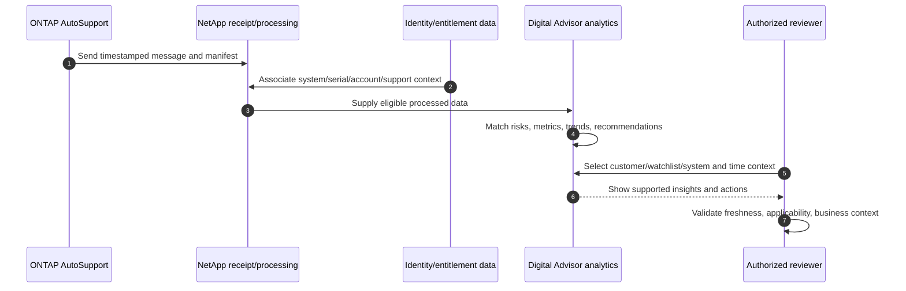

### Data lineage questions

1. Which customer, account, site, watchlist, cluster, node, system ID, and serial does the view represent?
2. Which AutoSupport instance or other source underlies the metric/finding?
3. What is the source timestamp, received timestamp, processed timestamp, and review timestamp?
4. Was source collection complete enough for this question?
5. Does the finding map to the exact release/platform/protocol/configuration?
6. Is the asset active, entitled, correctly owned, and included in scope?
7. Is the result current, historical, acknowledged, mitigated, suppressed, or still open?

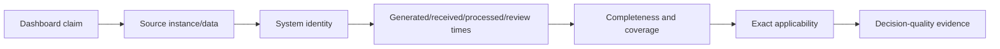

---

## 4. Wellness categories, severities, risks, and actions

Current public documentation lists wellness areas that include security and ransomware defense, performance and efficiency, availability and protection, capacity, configuration, and sustainability. Support renewals and other planning signals also appear in the broader experience. Categories and labels can evolve.

### Wellness taxonomy

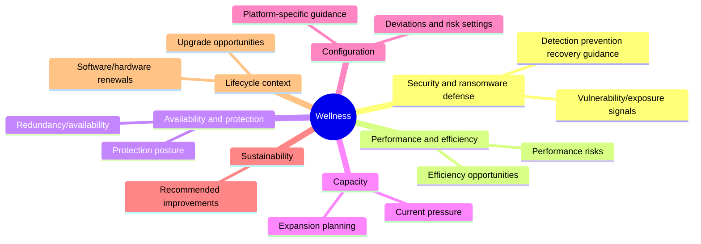

### Severity is impact language, not automatic priority

Public wellness documentation currently describes Critical, High, Medium, Low, and Best Practice risk types with consequence-oriented definitions. Reopen the current risk page before quoting severity. Customer priority also depends on exposure, business criticality, redundancy, change risk, and deadline.

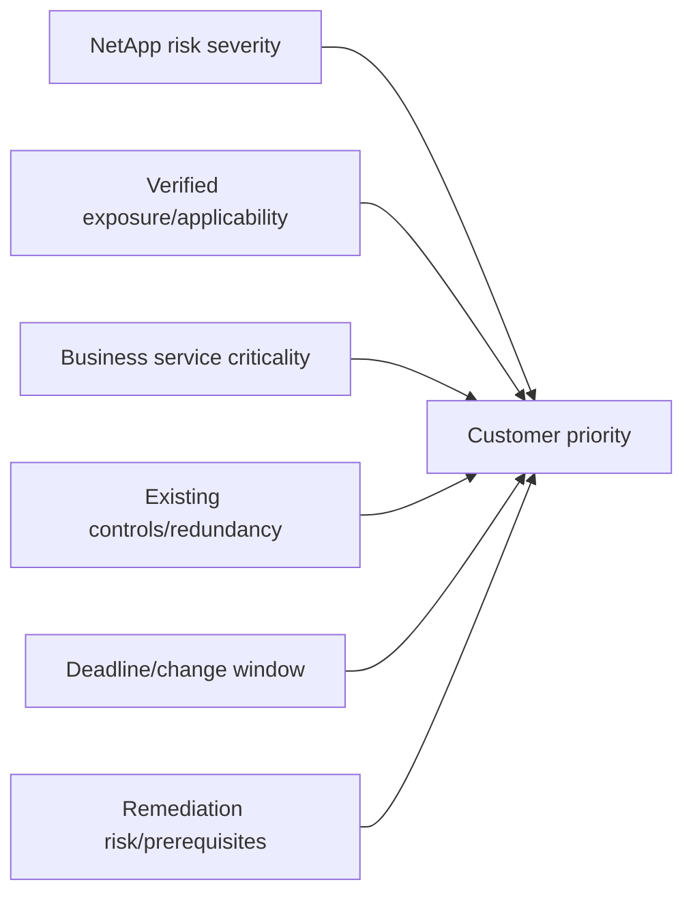

| Field | Question | Evidence standard |
|---|---|---|
| Risk name/ID | What exact condition is asserted? | Dated portal extract or official detail |
| Severity/consequence | What can happen according to current content? | Quote carefully; do not inflate |
| Affected systems | Which exact systems are mapped? | Serial/system/cluster/node identity |
| Detected/updated time | When was it detected and last evaluated? | Portal/source timestamps |
| Trigger/evidence | What telemetry/configuration caused the match? | Underlying field/source where available |
| Corrective action | What action is recommended? | Exact current action text/reference |
| Applicability | Does exact platform/release/feature/state match? | ONTAP docs, advisory, IMT/HWU as relevant |
| Customer priority | Why now for this service? | Exposure, impact, controls, deadline |

### Risk, action, and affected system

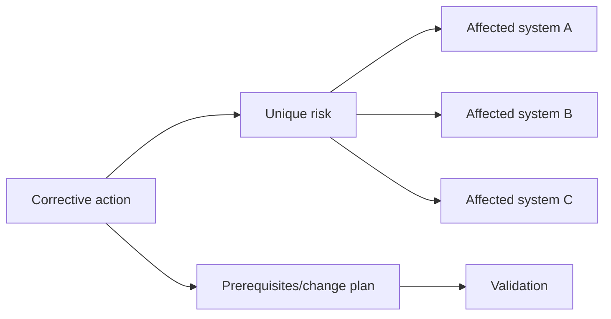

### Plain-English deep-dive: acknowledge is not remediate

Acknowledging a fire-alarm notification means someone has seen and owns it. It does not extinguish the fire. Likewise, a Digital Advisor acknowledgement can support workflow awareness, but the technical risk remains until evidence shows the condition is corrected or no longer applicable.

**Why it matters:** never report acknowledged risks as fixed.

---

## 5. Inventory, configuration, and asset context

Digital Advisor can expose inventory and configuration information where supported, including customer/system context and cluster/node details. Public docs also describe ClusterViewer for detailed physical/logical configuration on supported platforms.

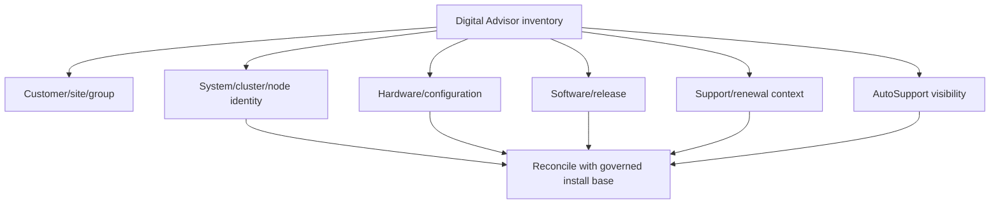

### Inventory cannot be treated as complete by default

An absent system can be new, unentitled, secure, inactive, archived, decommissioned, wrongly owned, or delayed in source processing. A visible system can be retired, duplicated, stale, or attached to the wrong site. Part 49 defines full reconciliation.

### Minimum asset extract

| Identity | Configuration | Support/data | Governance |
|---|---|---|---|
| Customer/account/site/group | Platform/model/release | Contract/support context | Source and extract time |
| Cluster/system ID | Nodes/controllers | Last AutoSupport/source time | Confidence and exception |
| Serial numbers | Key configuration/feature flags | Open risks/cases | Record/action owner |
| Active/retired/replaced state | Capacity/performance scope | Renewal/upgrade signal | Review date |

---

## 6. Upgrade, lifecycle, capacity, efficiency, performance, and cases

Digital Advisor brings several decision domains together. Each domain still needs its authoritative validator.

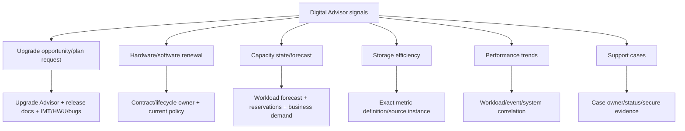

### Domain guide

| Domain | Useful Digital Advisor signal | Required caution |
|---|---|---|
| Upgrade | Systems that may need upgrade; ONTAP upgrade-plan workflow where supported | A suggestion is not an approved target/path; validate exact dependencies |
| Lifecycle/renewal | Hardware/software expired or approaching expiry under current service logic | Current support policy, contract, ownership, and business horizon govern |
| Capacity | Used/available context, pressure, trend/forecast, expansion signal | Metric definitions, reserves, snapshots, object level, growth assumptions matter |
| Efficiency | Logical/physical use, data-reduction ratio and savings | Source AutoSupport instance, object scope, Snapshot inclusion, workload mix matter |
| Performance | Longer-period CPU, latency, IOPS/protocol, throughput graphs/CSV where supported | Correlation is not causation; sampling and workload context matter |
| Cases | Technical/non-technical support context and valuable-insight count where available | Case content is sensitive; status/count does not equal root cause or resolution |

### Capacity forecast boundary

Public FAQ currently describes a forecast based on prior used-capacity history, an average growth rate, and forward extrapolation under a stable usable-capacity assumption. That is a planning signal, not a promise.

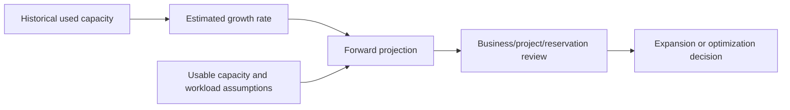

### Plain-English deep-dive: a forecast is a ruler, not a prophecy

Extending a line on a ruler helps estimate where steady growth lands. A migration, acquisition, backup-policy change, cleanup, compression shift, or new workload can bend that line. **Why it matters:** pair the portal forecast with known demand events and confidence ranges.

### Efficiency interpretation

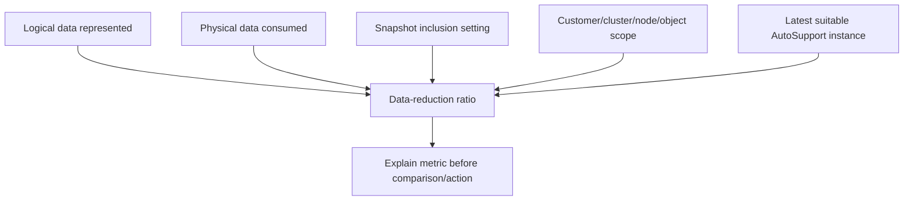

Do not add savings across different object layers as though they were independent. Do not compare ratios until scope, Snapshot treatment, platform/workload, and source time are aligned.

### Performance interpretation

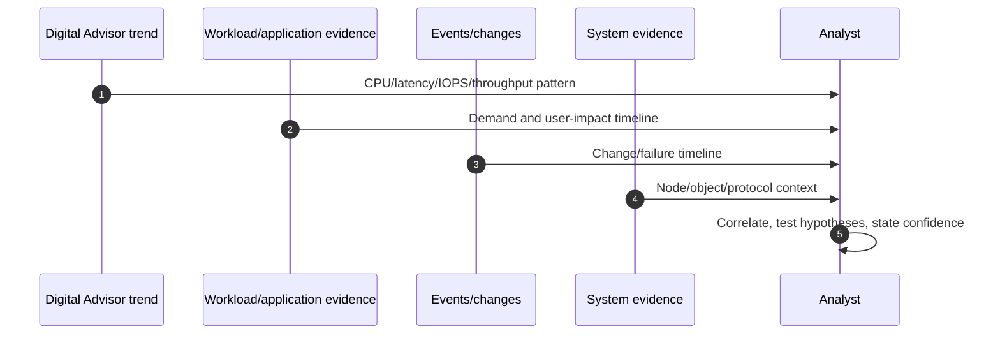

---

## 7. Freshness, applicability, and false confidence

### Plain-English deep-dive: a green dashboard can be a dark sensor

A security camera screen can look calm because the room is safe or because the camera froze yesterday. The visual alone cannot distinguish those states. **Why it matters:** "no risk" is meaningful only when expected systems and source data are current and complete enough.

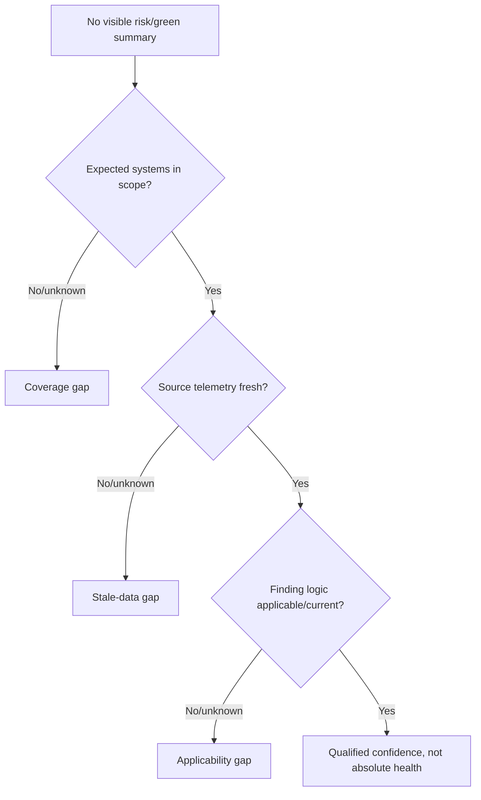

### Freshness dimensions

| Dimension | Example question | Failure risk |
|---|---|---|
| Scope | Are all production clusters/nodes/assets included? | Blind systems |
| Source generation | Did each expected AutoSupport message generate? | Missing evidence |
| Receipt/association | Did it reach NetApp and map to correct asset/account? | Stale portal view |
| Processing | When did Digital Advisor evaluate/update the result? | Old risk state |
| Content coverage | Did source include the needed subsystem/time interval? | Partial analysis |
| Review | When did a qualified owner last validate it? | Forgotten action |

### Applicability ladder

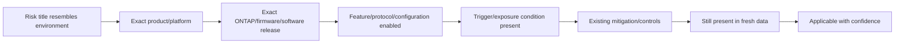

### False-confidence patterns

- Watchlist excludes a recently added production cluster.
- One node's AutoSupport is stale while cluster summary looks current.
- An acknowledged finding is counted as resolved.
- A recommendation matched an old release before an upgrade.
- A capacity forecast ignores an approved migration.
- A green view reflects unsupported feature/platform scope.
- A system appears twice after replacement or ownership change.
- A risk is technically applicable but already controlled by a validated workaround.
- A summary count hides many systems affected by one action.

---

## 8. Noise control and action extraction

The goal is not to copy every widget into a report. It is to produce a deduplicated, applicable, prioritized action register.

### Noise-to-action pipeline

```mermaid
flowchart LR
    RAW[Raw risks actions metrics cases] --> SCOPE[Filter governed in-scope assets]
    SCOPE --> FRESH[Validate freshness/completeness]
    FRESH --> DEDUP[Deduplicate risk/action/system mappings]
    DEDUP --> APPLY[Validate exact applicability]
    APPLY --> CONTEXT[Add business/control/change context]
    CONTEXT --> PRIOR[Prioritize]
    PRIOR --> OWNER[Assign owner/date/prerequisites]
    OWNER --> PROOF[Define validation/residual risk]
```

### Deduplication grain

| Grain | Example | Rule |
|---|---|---|
| Unique risk | One condition affects 40 systems | Keep one risk definition; preserve 40 affected mappings |
| Unique action | One action mitigates several risks | Avoid 12 duplicate change requests |
| System-risk | Same risk on node A and B | Preserve per-system applicability/status |
| Service impact | Five systems support one service | Consolidate business narrative, retain asset evidence |
| Change bundle | Several compatible actions share window | Bundle only after dependency/collision review |

### Action record schema

| Field | Required content |
|---|---|
| Action ID/title | Stable local identifier plus exact source risk/action reference |
| Scope | Customer/site/service/system/node/serial |
| Source | Digital Advisor view/extract, source data time, review time |
| Finding | Verified condition without exaggeration |
| Applicability/confidence | Exact match evidence, gaps, confidence level |
| Business risk | Impact, likelihood/exposure, affected service, deadline |
| Recommendation | Bounded action with authoritative validation sources |
| Owner/date | One accountable owner and next checkpoint |
| Prerequisites | Access, compatibility, backup/protection, capacity, window, approvals |
| Validation | Technical and customer-success proof |
| Residual risk | What remains, monitoring, accepted/deferred conditions |

### Prioritization

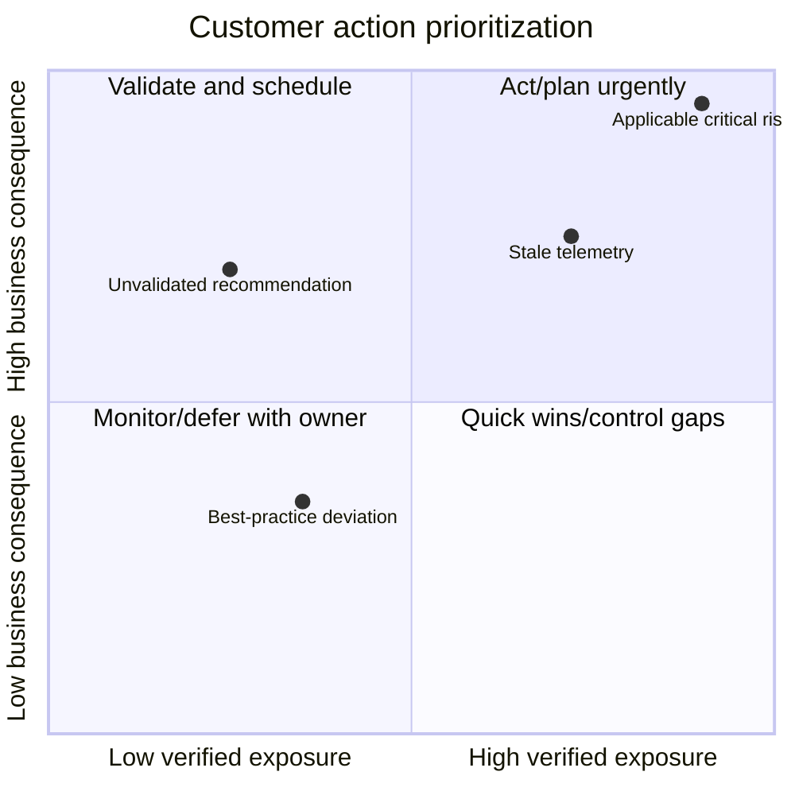

**Boundary:** this diagram is a thinking aid, not a NetApp scoring model. Do not manufacture numerical risk scores.

---

## 9. Operational service-review workflow

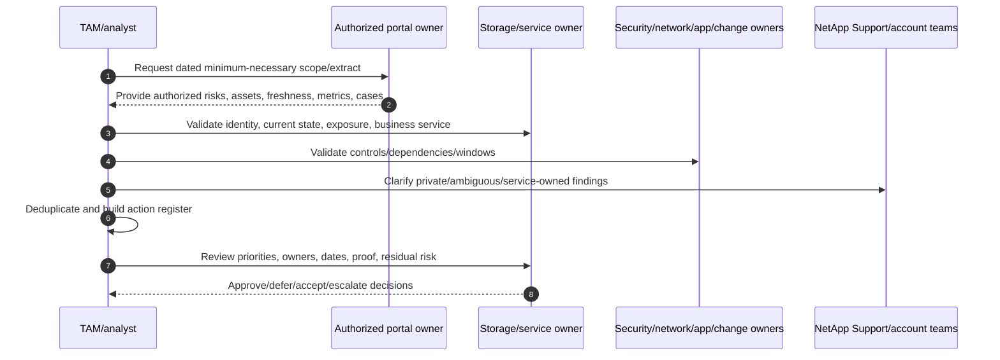

### Review agenda

1. Scope, account/watchlist, assets, data cutoff, missing systems, and access gaps.
2. Previous actions: closed only with evidence; deferred/accepted with owner/date.
3. New high-consequence and time-bound applicable risks.
4. Security, availability/protection, capacity, configuration, performance/efficiency signals.
5. Upgrade/lifecycle/renewal roadmap and exact validation dependencies.
6. Support cases, recurring themes, and evidence gaps.
7. Consolidated recommendations, change collisions, owners, milestones, and validation.
8. Residual risks and next review date.

### Evidence-to-customer narrative

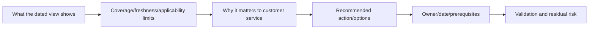

### Customer-safe wording

Avoid: "Digital Advisor says upgrade immediately."

Prefer:

> "The authorized Digital Advisor extract dated `<time>` maps risk `<ID>` to systems `<scope>` using telemetry current through `<time>`. We verified the exact platform/release/feature condition and found `<evidence>`. The business risk is `<impact/exposure>`. The storage and application owners should evaluate `<bounded action>` against Upgrade Advisor, IMT/HWU, release notes, protection state, and the approved window. Success is `<proof>`; remaining gaps are `<residual risk>`."

---

## 10. Troubleshooting and escalation

### Portal/data troubleshooting tree

```mermaid
flowchart TD
    START[Expected view/risk/system missing or inconsistent] --> ACCESS{Can authorized user log in?}
    ACCESS -->|No| ACCOUNT[Support Site account/authentication support]
    ACCESS -->|Yes| SCOPE{Correct customer/watchlist/level?}
    SCOPE -->|No| SELECT[Correct scope and compare membership]
    SCOPE -->|Yes| ASSET{System visible in inventory?}
    ASSET -->|No| IB[Entitlement/security/active-state/source-delay reconciliation]
    ASSET -->|Yes| DATA{AutoSupport/source current?}
    DATA -->|No| ASUP[Part 47 collection/delivery/association workflow]
    DATA -->|Yes| FEAT{Feature supported at platform/level?}
    FEAT -->|No| DOC[Current feature/platform documentation]
    FEAT -->|Yes| MATCH{Result agrees with system evidence?}
    MATCH -->|No| ESC[Preserve IDs/times/evidence; technical or non-technical case]
    MATCH -->|Yes| ACT[Validate applicability and create governed action]
```

### Technical versus non-technical path

Public FAQ distinguishes technical product issues from non-technical Digital Advisor/install-base issues. Use the current official process.

| Problem | Likely route | Include |
|---|---|---|
| Hardware disruption, performance, data/product technical issue | Technical case | Impact, system, timeline, diagnostics, exact ask |
| Missing system/inventory | Non-technical service/install-base path | Serial/system/customer/site, expected ownership, source/date |
| Wrong contract dates/offering | Non-technical contract/service path | Contract/asset evidence and authorized contact |
| Feature access/service behavior | Non-technical service path unless product fault is proven | User/account, feature, scope, timestamp, sanitized capture |
| Risk/action seems technically incorrect | Technical case/service clarification | Risk ID, exact affected asset/release/config, fresh contradictory evidence |

### Escalation pack

- Customer/account/watchlist/site/group/cluster/node/system/serial scope.
- Named authorized user and access/entitlement state; no credentials.
- URL/feature/hierarchy level and UTC occurrence/review times.
- Source AutoSupport sequence/time and freshness/coverage status where available.
- Exact risk/action/metric/case identifiers and sanitized dated extract.
- Expected versus observed result and reproducible navigation/filter context.
- System/platform/release/configuration evidence and applicability analysis.
- Business/support impact, deadline, actions tried, results, leading/alternate hypotheses.
- Data classification, secure evidence location, owner, and exact specialist ask.

---

## 11. Fully synthetic sanitized scenario and screenshot-table fallback

> **Synthetic boundary:** `Harbor Textiles`, all systems, serial fragments, risks, values, cases, dates, states, extracts, and recommendations are invented. These are text replacements for portal screenshots, not copied Digital Advisor screens.

### Synthetic authorized extract: scope and freshness

| Asset | Service | Portal scope | Last source | Extract status | Confidence/action |
|---|---|---|---|---|---|
| `HT-CL-01` | ERP | Watchlist `Core-Prod` | `2026-08-23 02:10Z` | Current enough | Review mapped risks |
| `HT-CL-02` | Design files | Watchlist `Core-Prod` | `2026-08-13 02:12Z` | Stale | Repair AutoSupport before health conclusion |
| `HT-CL-03` | Archive | Missing from watchlist | Unknown | Scope gap | Authorized inventory reconciliation |
| `HT-CL-04` | Test | Customer view | `2026-08-23 02:20Z` | Current, non-production | Exclude from production action count |

### Synthetic risk/action extract

| Local ID | Portal-style finding | Assets | Source time | Applicability | Customer action |
|---|---|---|---|---|---|
| `A-01` | High availability/protection risk `SYN-RISK-17` | `HT-CL-01` | `2026-08-23` | Exact trigger needs storage-owner validation | Validate protection state and current official action |
| `A-02` | Capacity planning signal | `HT-CL-01` | `2026-08-23` | Trend current; planned migration absent | Reforecast with business demand |
| `A-03` | No current visible risks | `HT-CL-02` | `2026-08-13` | Not decision-quality due to staleness | Do not report healthy |
| `A-04` | Upgrade opportunity | `HT-CL-01` | `2026-08-23` | Target/path not validated | Start Part 54 planning, not immediate change |

### Access fallback

```mermaid
flowchart LR
    USER[No customer portal entitlement] --> REQ[Minimum necessary extract request]
    REQ --> OWNER[Authorized customer/account owner]
    OWNER --> EXPORT[Dated sanitized scope/freshness/risk/action tables]
    EXPORT --> VERIFY[Storage/app/security owners validate state/context]
    VERIFY --> REGISTER[Action register and service review]
    BLOCK[Unavailable field/view] --> GAP[Named evidence gap owner/date]
    GAP --> REGISTER
```

### Competing interpretations

| Observation | Unsafe conclusion | Better interpretation/check |
|---|---|---|
| `HT-CL-02` has no open risks | It is healthy | Source is stale; repair data path first |
| Capacity line approaches threshold | Buy hardware now | Reconcile definitions, migration, reservations, workload demand, lead time |
| Upgrade opportunity appears | Target release is approved | Generate/validate exact plan, compatibility, bugs, path, prechecks |
| One high risk affects two nodes | Create two unrelated changes | Preserve mappings; evaluate one coordinated action/dependencies |
| `HT-CL-03` absent from watchlist | It is decommissioned | Reconcile entitlement, lifecycle, ownership, and membership |

### Bounded recommendation

> **Finding:** The synthetic authorized extract shows current data for `HT-CL-01`, stale data for `HT-CL-02`, and a scope gap for `HT-CL-03`. `HT-CL-01` has an unvalidated high availability/protection risk and a capacity signal. **Risk:** reporting the watchlist as healthy would hide telemetry and membership gaps; acting directly on the risk or forecast could create an unsupported change or unnecessary spend. **Recommendation:** the storage owner validates the exact risk trigger and current corrective action; the network/storage owners repair `HT-CL-02` AutoSupport; the install-base owner reconciles `HT-CL-03`; and the capacity owner refreshes assumptions. **Validation:** current source/receipt, complete governed scope, exact applicability evidence, approved action plans, and post-change/customer proof. **Residual risk:** portal analysis remains bounded by telemetry, platform support, data processing, and inaccessible fields recorded in the gap register.

---

## 12. Experience transfer, discovery, and JD Mapping

### Transfer map

```mermaid
flowchart LR
    MS[enterprise support/service health] --> RISK[Signal-to-risk discipline]
    CRIT[Critical-situation ownership] --> ACT[Owner/date/checkpoint/escalation]
    AZ[Azure/M365 telemetry] --> FRESH[Freshness/scope/correlation]
    BI[Power BI Excel SQL Python] --> CLEAN[Reconcile/dedup/trend/action register]
    REVIEW[Customer reviews] --> STORY[Evidence-risk-recommendation narrative]
    RISK --> DA[Digital Advisor conceptual workflow]
    ACT --> DA
    FRESH --> DA
    CLEAN --> DA
    STORY --> DA
    DA --> GAP[Production portal operation remains a gap]
```

### Discovery questions

1. Which customer/account/sites/services/assets and decision are in scope?
2. Who has authorized access, and which systems/features are visible at which level?
3. Is the governed install base reconciled with customer/watchlist/system views?
4. What are the latest source, receipt, processing, extract, and review times?
5. Which wellness risks/actions affect which exact assets, releases, features, and services?
6. Which risks are new, recurring, acknowledged, mitigated, stale, disputed, or excluded?
7. Which upgrade, lifecycle, capacity, efficiency, performance, and case signals need action?
8. What authoritative sources validate each recommendation?
9. What data/privacy/access boundaries apply to exports, reports, and case information?
10. Which owner/date/prerequisites/validation/residual risk completes every action?

### JD Mapping

| JD responsibility | Part 48 contribution | Your factual bridge and gap |
|---|---|---|
| Proactive risk/stability | Converts wellness findings into applicable prioritized actions | Service-health/critical-situation discipline transfers; no production acknowledgements |
| Customer-data analysis | Validates scope, freshness, lineage, deduplication, and confidence | BI/SQL/Python/Excel strengths transfer |
| Install-base quality | Reconciles customer/watchlist/system/serial visibility | Data-quality work transfers; gated corrections need owner |
| Capacity/performance/efficiency | Interprets trends with definitions and workload context | Azure/M365 observability reasoning transfers |
| Upgrade/lifecycle planning | Treats signals as planning inputs requiring exact validation | Change-risk reasoning transfers; no Upgrade Advisor operation claimed |
| Support experience | Connects cases, evidence gaps, and proactive remediation | enterprise escalation experience transfers |
| Service reviews | Produces concise evidence-risk-action-owner-proof narrative | Customer communication transfers |

### Honest interview answer

> "I understand Digital Advisor as an entitled analytics and workflow layer over AutoSupport and installed-base data. I would establish customer/watchlist/system scope, verify source and processing freshness, validate exact risk applicability, deduplicate risk/action/system mappings, and turn the result into owner/date/prerequisite/validation actions. My production experience is with Microsoft service telemetry and customer escalations, not a customer Digital Advisor portal, so I would use current official content and an authorized portal owner for the minimum necessary extract."

---

## 13. Paper lab and self-test

### Paper lab

Using only synthetic data, build a monthly Digital Advisor service review for twelve systems across two sites.

```mermaid
flowchart LR
    SCOPE[Reconcile governed fleet/watchlist] --> FRESH[Grade source/processing freshness]
    FRESH --> RISKS[Normalize risks/actions/systems]
    RISKS --> APPLY[Validate applicability]
    APPLY --> DOM[Add upgrade/lifecycle/capacity/efficiency/performance/cases]
    DOM --> PRIOR[Prioritize by exposure/business context]
    PRIOR --> PACK[Action register and customer review]
```

### Required synthetic records

- Two missing watchlist members.
- One unentitled or secure asset visible only to an authorized owner.
- Two stale-AutoSupport systems.
- One acknowledged but unresolved high risk.
- Three systems affected by one corrective action.
- One capacity forecast invalidated by planned migration.
- One efficiency comparison with mismatched Snapshot scope.
- One performance spike correlated with a workload change but not proven causal.
- One upgrade opportunity with unresolved compatibility dependency.
- One incorrect contract date requiring a non-technical path.

### Tasks

1. Define customer/site/watchlist/cluster/node/system/serial scope and business services.
2. Reconcile governed inventory, portal visibility, lifecycle, and entitlement.
3. Add source, receipt, processing, extract, and review timestamps.
4. Grade every system Current, Partial, Stale, Missing, or Unknown.
5. Normalize risks, unique actions, affected-system mappings, severities, and statuses.
6. Validate platform/release/feature/trigger/control/current-state applicability.
7. Interpret capacity, efficiency, and performance using exact definitions and context.
8. Treat upgrade/lifecycle/case signals as planning inputs with authoritative checks.
9. Deduplicate, prioritize, assign owner/date/prerequisites/proof/residual risk.
10. Write a one-page service-review summary and a technical/non-technical escalation pack.

### Lab pass checklist

- [ ] Every view/export/table is labeled synthetic or authorized/datetime-bounded.
- [ ] No missing or stale system is reported healthy.
- [ ] Watchlist and governed install base are reconciled.
- [ ] Acknowledged and remediated are separate.
- [ ] Risk, unique action, and affected-system grains are preserved.
- [ ] Severity and customer priority are not conflated.
- [ ] Upgrade, forecast, efficiency, and performance signals include caveats.
- [ ] Every recommendation cites authoritative validators.
- [ ] Access gaps use an authorized-owner fallback.
- [ ] No production Digital Advisor experience is claimed.

---

## 14. Official Source Anchors

**Date checked: 2026-08-24.** Public official NetApp sources only. Digital Advisor is a continuously updated cloud service; labels, navigation, content, platform support, thresholds, calculations, access, and support-tier availability can change after this date. Reopen current pages and the exact entitled view before customer use.

| Topic | Official public source | Bounded use |
|---|---|---|
| Service purpose and docs hub | [Digital Advisor documentation](https://docs.netapp.com/us-en/active-iq/index.html) | Predictive analytics/proactive-support orientation and current navigation |
| Feature orientation | [Learn about Digital Advisor features](https://docs.netapp.com/us-en/active-iq/concept_understand_activeiq_features.html) | Watchlist-level wellness, inventory, planning, upgrade and insight scope; support varies |
| Terms/widgets/domains | [Learn about Digital Advisor](https://docs.netapp.com/us-en/active-iq/concept_key_terms.html) | Current public terminology, wellness areas, inventory/planning/performance/efficiency/case concepts |
| Login/contract visibility | [Log in to Digital Advisor](https://docs.netapp.com/us-en/active-iq/task_login_activeiq.html) | Support Site credential and current visibility rules; no entitlement inference |
| Quick start/platform variation | [Quick start for Digital Advisor](https://docs.netapp.com/us-en/active-iq/concept_getting_started_2.html) | Widgets/features vary by platform and hierarchy |
| Watchlists | [Create a watchlist](https://docs.netapp.com/us-en/active-iq/task_add_watchlist.html) | Category/serial membership concepts; recheck limits/current workflow |
| Wellness and severity | [Learn about wellness widget](https://docs.netapp.com/us-en/active-iq/concept_overview_wellness.html) | Current public risk categories/consequence language |
| Risk/action workflow | [View risks and take corrective actions](https://docs.netapp.com/us-en/active-iq/task_view_risk_and_take_action.html) | Risk/action/affected-system drill-down and manual mitigation orientation |
| Capacity/efficiency/inventory/cases FAQ | [FAQ for Digital Advisor](https://docs.netapp.com/us-en/active-iq/reference_aiq_faq.html) | Public calculation, missing-inventory, and support-path context; definitions can change |
| Performance | [Use Digital Advisor to view ONTAP performance](https://docs.netapp.com/us-en/ontap/performance-admin/active-iq-digital-advisor-view-performance-concept.html) | Public metric/export/trend scope; requires AutoSupport and supported level |
| AutoSupport relationship | [Digital Advisor and ONTAP AutoSupport](https://docs.netapp.com/us-en/ontap/system-admin/autosupport-active-iq-digital-advisor-concept.html) | AutoSupport analysis, SupportEdge/feature variation, upgrade/wellness/capacity/case/inventory orientation |
| Official gated portal | [Digital Advisor](https://activeiq.netapp.com/?source=onlinedocs) | Authorized access only; never invent results |

### Source-use discipline

- Capture exact customer/watchlist/system scope, source and extract timestamps, risk/action IDs, and review date.
- Preserve source definitions for capacity, efficiency, forecast, and performance metrics.
- Revalidate platform/release/feature applicability against authoritative current sources.
- Use an authorized owner for gated assets, cases, support details, and portal results.
- Minimize and secure customer exports; never include credentials or unrestricted case/payload data.
- Record unavailable fields as gaps, not favorable assumptions.

---

## Likely Interview Questions

### Q1. What is Digital Advisor, and how does it relate to AutoSupport?

> **Model answer:** "Digital Advisor is NetApp's cloud-based predictive analytics and proactive-support experience. It analyzes eligible AutoSupport telemetry together with installed-base/support context and presents supported wellness, inventory, upgrade, capacity, efficiency, performance and case insights. AutoSupport collection and receipt are upstream; I still validate scope, freshness, identity and applicability before acting."

### Q2. What is a watchlist, and why is it not a source of truth?

> **Model answer:** "A watchlist is a saved working selection of entitled systems by customer/site/group/category or serial. It makes fleet analysis manageable, but membership can omit new, secure, unentitled, inactive, decommissioned or misassociated systems. I reconcile it with the governed install base and record scope/extract time."

### Q3. How do risks, actions, and affected systems differ?

> **Model answer:** "A risk is the identified condition and consequence; affected systems are the exact asset mappings; an action is corrective guidance that may address one or several risks. I preserve all three grains, validate exact applicability, and add business priority, prerequisites, owner, date, validation and residual risk."

### Q4. How do you avoid false confidence from a green dashboard?

> **Model answer:** "I verify that every governed production asset is in scope, its source telemetry and processing are current, collection is complete enough, the feature is supported at that platform/level, and the finding logic is applicable. No visible risk with stale or missing data is an unknown, not healthy."

### Q5. How would you prioritize Digital Advisor recommendations?

> **Model answer:** "I do not use severity alone. I combine exact exposure, business consequence, service criticality, existing controls, deadline, change risk and dependencies. I deduplicate common actions, assign accountable owners and checkpoints, and define technical/customer validation plus residual risk."

### Q6. How do you use capacity, efficiency, and performance insights safely?

> **Model answer:** "I capture object scope, metric definition, AutoSupport/source time, Snapshot/reserve treatment, forecast assumptions and workload/change context. A trend or correlation is not a purchase decision or root cause. I compare like with like and reconcile planned demand, migrations and customer monitoring."

### Q7. What do you do without Digital Advisor access?

> **Model answer:** "I do not invent the view. I define the minimum fields needed and ask an authorized customer/account owner for a dated sanitized extract of scope, freshness, risks, actions and relevant metrics. Unavailable evidence stays in a named gap register with an owner/date; sensitive data remains in approved channels."

### Q8. How does your background prepare you for this despite the production-tool gap?

> **Model answer:** "Microsoft service-health and critical-situation work gives me signal validation, ownership and customer-risk discipline; Azure/M365 observability gives me freshness and correlation habits; and BI/SQL/Python/Excel skills support reconciliation and deduplication. I have not operated a production Digital Advisor tenant, so I use current docs and authorized owners explicitly."

---

## 30-Second Memory Hooks

- **Digital Advisor:** AutoSupport and installed-base data turned into supported insights.
- **Portal is not truth:** verify identity, freshness, completeness, and applicability.
- **Watchlist:** convenient working scope, not authoritative inventory.
- **Risk:** condition/consequence; **action:** corrective guidance; **affected system:** mapping.
- **Acknowledge:** seen/owned, not fixed.
- **Severity is not priority:** add exposure, business impact, controls, deadline, and change risk.
- **Green can mean blind:** stale or missing data is unknown.
- **Forecast:** history extended under assumptions, not prophecy.
- **Efficiency:** align object scope, source time, and Snapshot treatment.
- **Performance:** correlate trend with workload/events/system evidence.
- **Upgrade signal:** start validated planning, not immediate change.
- **Gated access:** authorized dated extract or explicit gap.
- **Action register:** evidence -> applicability -> risk -> owner/date -> proof -> residual risk.
- **Your bridge:** prior evidence/analytics transfer; production portal use does not.

---

## Completion Checklist

- [ ] Define Digital Advisor, customer dashboard, watchlist, widget, risk, action, affected system, freshness, and applicability.
- [ ] Explain the AutoSupport/install-base/analytics/portal flow.
- [ ] Map credential, authorization, entitlement, contract, asset-state, platform, and hierarchy dependencies.
- [ ] Reconcile watchlist scope with governed install base.
- [ ] Explain wellness categories and current severity boundaries.
- [ ] Preserve unique risk, unique action, and affected-system mappings.
- [ ] Interpret inventory/configuration without assuming completeness.
- [ ] Treat upgrade/lifecycle signals as inputs to exact validation.
- [ ] Explain capacity, forecast, efficiency, performance, and case caveats.
- [ ] Grade source, receipt, processing, extract, scope, and review freshness.
- [ ] Apply the exact-platform/release/feature/trigger/control/current-state ladder.
- [ ] Identify false-confidence and noise patterns.
- [ ] Build an action register with owner/date/prerequisites/proof/residual risk.
- [ ] Run the operational service-review and troubleshooting workflows.
- [ ] Recreate the fully synthetic Harbor Textiles fallback scenario.
- [ ] Complete the paper lab and answer Q1-Q8 aloud.
- [ ] State the No-production-NetApp boundary and exact non-claim accurately.
- [ ] Recheck current official docs and entitled views before customer use.

---

*Next suggested section:* [Part 49 - Install-Base Management, Asset Identity, Ownership, and Data Quality](Part-49-install-base-management-data-quality.md)