# Part 49 - Install-Base Management, Asset Identity, Ownership, and Data Quality

> **Section goal:** Build a governed, auditable view of which NetApp assets exist, where they are, who owns them, what they run, what services they support, whether support and telemetry are current, and which conflicts need correction. By the end, you should be able to model customer/site/cluster/node/SVM identity, reconcile multiple sources, handle duplicates and lifecycle events, preserve history, score confidence, manage exceptions, measure data quality, and communicate risk without silently overwriting evidence.

Covers index item **49** and maps to job-description responsibilities for install-base accuracy, customer-data analysis, entitlement and lifecycle planning, proactive support, service reviews, ownership, asset moves/adds/changes, data-quality improvement, and cross-functional governance.

**Explicit nonclaim:** You have not owned a production NetApp install base or reconciled live NetApp customer asset systems.

**Privacy and access boundary:** Asset identifiers, serials, locations, contacts, contracts, entitlement, telemetry, cases, and ownership records are restricted customer and operational data.

**Synthetic-evidence rule:** Every asset, serial, UUID, source record, date, match score, exception, lifecycle event, and reconciliation result below is fictional and sanitized; it is not a live CMDB, support, or portal result.

**Version caveat:** ONTAP identity fields, command output, cluster/node/SVM terminology, inventory exports, Digital Advisor visibility, support-contract fields, source latency, APIs, platform coverage, and account workflows vary by release and service. A **current-doc check** means reopening the exact ONTAP release's command reference and current Digital Advisor/Support documentation before collecting, interpreting, or correcting a field.

This Part does not designate one universal source of truth, define a customer retention policy, authorize an asset transfer, change a support contract, merge support records, decommission equipment, or expose customer contacts. Field-level authority belongs to the customer and relevant NetApp/account/support owners. Gated systems and secure assets require authorized access. Unknown values and conflicts remain visible exceptions.

> **No-production-NetApp boundary:** You do not claim production NetApp install-base stewardship. Every account, site, serial, UUID, system ID, cluster, SVM, contact, contract, topology, workload, exception, and audit record below is synthetic. Your factual strengths are enterprise support data, Azure/M365 tenant and resource identity, CMDB-style reconciliation, Excel/SQL/Python/Power BI quality analysis, customer ownership mapping, and audit-ready escalations. The explicit non-claim is: **you have not corrected a customer's NetApp installed base, transferred asset ownership, merged support records, decommissioned a production NetApp system, managed a Digital Advisor inventory export, or changed a NetApp contract/contact record.**

---

## 1. Install-base purpose

An **install base** is the governed set of products and logical systems associated with a customer, location, ownership context, lifecycle state, support relationship, and operational purpose.

### Plain-English deep-dive: a living property register

Think of an install base as a property register for a city. A street address, parcel ID, building name, owner, tenant, permit, utility meter, and occupancy status describe different truths. Renaming a building does not create a new parcel; replacing a utility meter does not move the building. Storage assets have the same identity problem.

**Why it matters:** matching only by name or one serial can merge distinct systems or split one real system into duplicates.

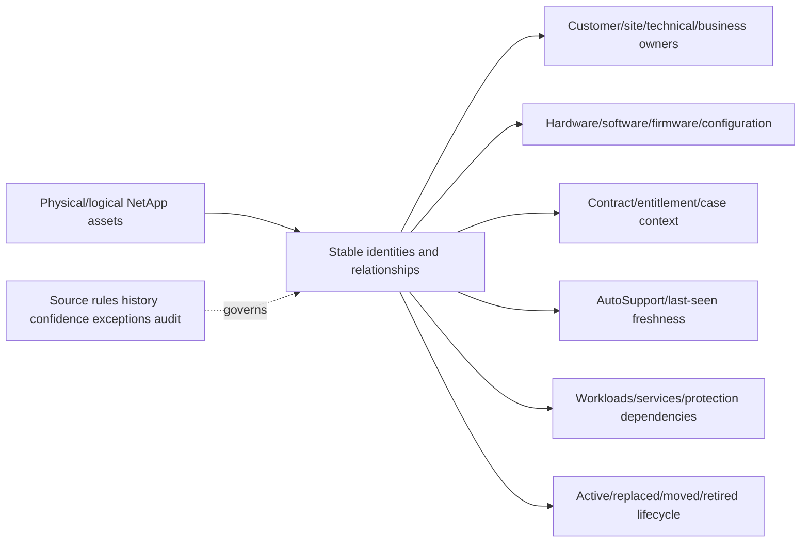

### Core terms

| Term | Plain meaning | Analogy | Why it matters |
|---|---|---|---|
| **Entity** | Thing managed as its own record: customer, site, cluster, node, SVM, component, contract, service | Person/place/object in a registry | Different entities need different keys |
| **Identifier** | Value used to distinguish an entity | Passport number | Names and identifiers are not interchangeable |
| **Natural key** | Real-world field such as serial or UUID | Vehicle VIN | Useful but can change meaning by entity/era |
| **Surrogate key** | Internal stable ID assigned by the data model | Registry record number | Keeps history through rename/replacement |
| **Source of record** | Authorized owner for a particular field | Land registry for legal owner | Authority is field-specific, not universal |
| **Golden record** | Reconciled best current view with provenance | Verified master file | Must retain source/conflict history |
| **Lineage** | Where a value came from and how it changed | Chain of custody | Makes decisions reproducible |
| **Freshness/last seen** | Age of the most recent trusted observation | Last meter reading | Old data cannot prove current state |
| **Exception** | Conflict, gap, duplicate, or unsupported state requiring owner action | Registry discrepancy case | Prevents silent bad-data acceptance |
| **MAC** | Move, add, or change event | Property transaction | Identity and relationships must update together |

---

## 2. Entity model and identity hierarchy

### Entity relationship map

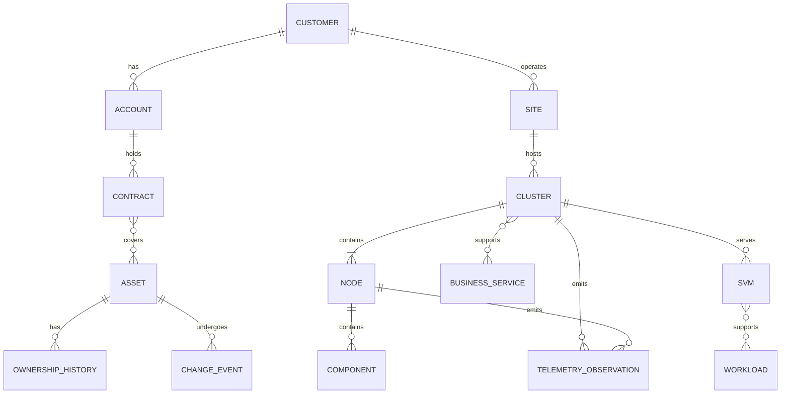

### Identity levels

| Entity | Candidate identifiers | Descriptive fields | Common mistake |
|---|---|---|---|
| Customer/account | Authorized account/customer ID | Name, region, commercial owner | Matching by customer name text only |
| Site | Governed site/location ID | Address, region, datacenter, timezone | Treating free-text location as durable key |
| Cluster | Cluster UUID and current official identity fields | Cluster name, serial, contact/location | Assuming rename creates a new cluster |
| Node/controller | Node UUID, system ID, serial, asset tag as applicable | Node name, model, owner/location | Treating replacement controller as same physical asset without event history |
| SVM/Vserver | SVM UUID plus cluster context | Name, type/subtype, protocols, state | Matching SVM name globally across clusters |
| Component | Exact serial/part/model/slot where available | Shelf/disk/adapter/firmware | Using model alone as instance identity |
| Contract | Authorized contract/entitlement ID | Offering, dates, status | Extending dates from an email without source approval |
| Workload/service | Customer service/catalog ID | App, owner, tier, RTO/RPO, protocol | Equating an SVM with one application |

### Stable key principle

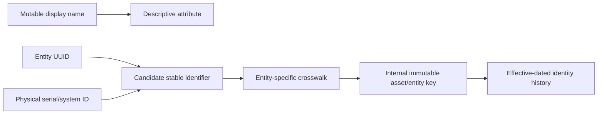

**Rule:** never join unlike entity types merely because values look similar. A cluster serial, controller serial, system ID, node UUID, and SVM UUID identify different things.

---

## 3. ONTAP identity anchors

Current public ONTAP command references provide examples of distinct identity fields:

- `cluster identity show` exposes cluster UUID, name, cluster serial, location, and contact.
- `system node show -inventory` can expose node serial, asset tag, system ID, model, and related inventory fields; detailed/current fields vary.
- `vserver show` exposes SVM/Vserver name, type/subtype, UUID, state, allowed protocols, and other details.

These are product observations, not customer ownership or contract authority.

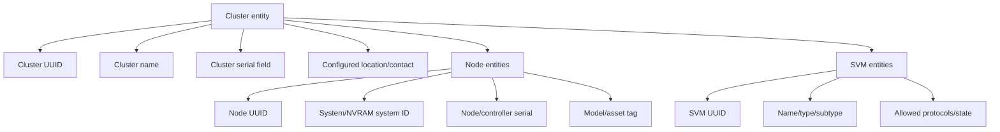

### Plain-English deep-dive: configured location is a claim, not a GPS fact

A luggage tag can say `London` while the bag is physically in Paris. ONTAP's configured location/contact fields are useful operational metadata, but they do not independently prove legal ownership, physical address, or current custodian. **Why it matters:** reconcile them with authorized site/asset records and last-seen evidence.

### Collection boundary

- Use least-privileged, read-only collection approved by the customer.
- Record exact command/API/export, release, fields, collector, source time, and timezone.
- Do not store credentials, unrestricted support payloads, or sensitive contact details in broad reports.
- Do not infer absent advanced fields when privilege or version hides them.
- Treat command output as one source with defined field authority.

---

## 4. Source systems and field-level authority

No single system necessarily owns every field. Define authority by **field and event**.

### Plain-English deep-dive: one folder does not own every fact

A hospital may trust the identity office for a patient's legal name, the clinical system for current medication, and billing for insurance status. Calling any one database the universal truth would corrupt the other facts. Install-base governance works the same way: ONTAP can authoritatively describe current operational identity/configuration, while authorized commercial, asset, and service owners govern different fields.

**Why it matters:** source precedence must be defined per field, with effective time and an escalation owner for conflicts.

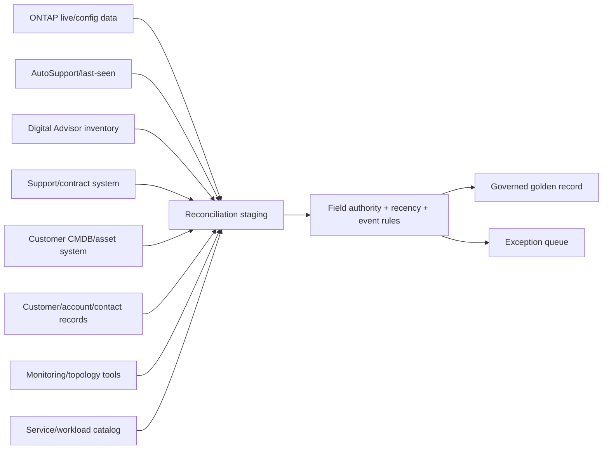

### Source-of-record matrix

| Field group | Likely authoritative owner/source | Corroborating source | Conflict rule |
|---|---|---|---|
| Live cluster/node/SVM config | Authorized current ONTAP observation | Recent AutoSupport/Digital Advisor | Fresh direct observation generally wins for operational state, with change approval checked |
| Hardware serial/model/system ID | Product inventory/authorized physical and support records | ONTAP inventory, Digital Advisor, shipping/RMA evidence | Never auto-merge conflicting durable IDs |
| Customer/account/legal owner | Authorized account/support/commercial record | Customer CMDB/contact | Route ownership conflict to account owner |
| Site/address/custodian | Customer asset/CMDB and approved site record | ONTAP configured location, support record | Keep configured and governed location separate until reconciled |
| Contract/offering/dates | Authorized support/contract system | Customer procurement | Route mismatch; no analyst date edits |
| Technical/business contacts | Customer-approved directory/role register | Support/account records | Prefer role aliases; protect PII |
| Workload/service/RTO/RPO | Customer service catalog/application owner | SVM/protocol/topology/monitoring | Owner validates mapping and criticality |
| Telemetry last seen | AutoSupport receipt/portal source metadata | Local message history | Store generated, sent, received, processed separately |
| Lifecycle state | Approved change/disposal/RMA/contract workflow | Telemetry and CMDB | State transition needs evidence/effective date |

### Authority decision

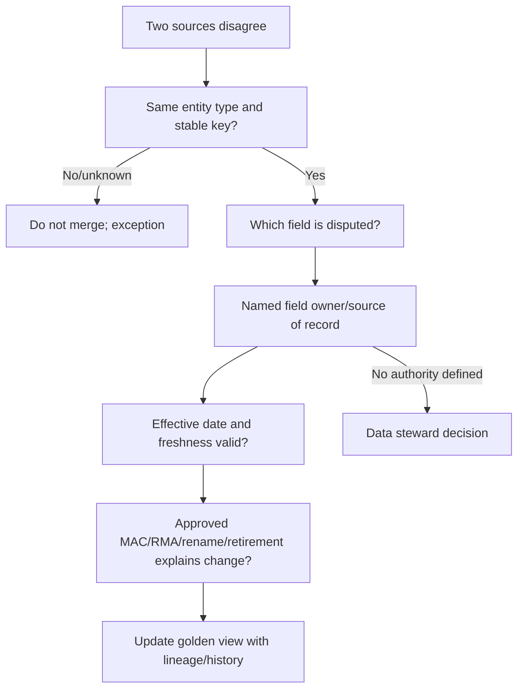

---

## 5. Golden-record data model

### Asset record

| Domain | Minimum fields |
|---|---|
| Governance | Internal immutable key, entity type, status, source lineage, confidence, exception ID |
| Customer/location | Customer/account/site IDs, governed location, timezone, custodian |
| Product identity | Cluster UUID/name/serial; node UUID/name/system ID/serial/model; SVM UUID/name/type |
| Configuration | ONTAP release, relevant firmware, hardware/components, protocols/features |
| Relationships | Cluster-node-SVM-component, HA/protection peer, network/fabric, workload/service |
| Support | Contract/entitlement/offering/status/dates, support owner |
| Operations | Last seen/generated/sent/received/processed/reconciled times |
| Ownership | Technical, business, platform, contract, security, and change owners |
| Lifecycle | Ordered/installed/active/moved/replaced/retired/disposed events and effective dates |

### Bitemporal thinking

Two times matter:

- **Effective time:** when the fact was true in the customer environment.
- **Recorded time:** when the data system learned or corrected it.

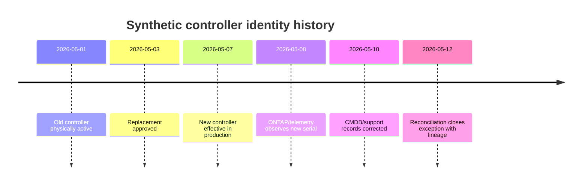

### Why preserve history

- Explains why a support case referenced an old serial.
- Prevents telemetry from a replaced component being assigned to the new one.
- Shows when a site/account move took effect.
- Supports contract, audit, lifecycle, incident, and trend questions.
- Allows correction without rewriting the past.

---

## 6. Matching, crosswalks, and confidence

### Match tiers

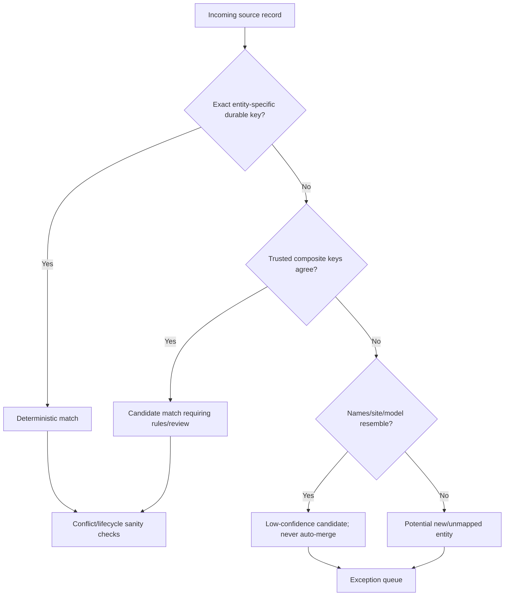

### Key rules

1. Normalize formatting, not meaning: trim/case/punctuation under documented rules.
2. Match within entity type and customer/ownership boundary.
3. Prefer exact UUID/serial/system identifiers appropriate to that entity.
4. Require relationship/time sanity: a node cannot be active in two unrelated clusters at once without explanation.
5. Never auto-merge on hostname, model, IP, contact, location, or partial serial alone.
6. Preserve source raw value and transformation version.
7. Route durable-key conflicts to a human steward.

### Confidence model

| Level | Evidence | Permitted use |
|---|---|---|
| Confirmed | Exact durable key plus corroborated entity/context and current source | Governed reporting/action |
| High | Exact key, one authoritative source, no contradictions | Operational use with source note |
| Medium | Composite match with strong context but missing durable key | Review/planning, not irreversible update |
| Low | Name/site/model similarity or stale evidence | Exception only |
| Unknown/conflict | Missing or contradictory durable identity | No merge or health/support conclusion |

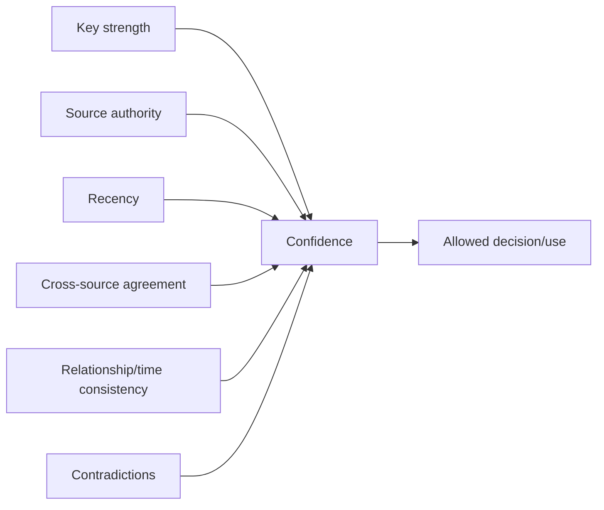

**Boundary:** confidence labels are a governance scheme, not a statistically calibrated probability unless the organization validates them as one.

---

## 7. Duplicates, merges, splits, replacements, and retirements

### Duplicate patterns

| Pattern | Example cause | Correct handling |
|---|---|---|
| Same asset, changed name | Cluster/node rename | One entity, effective-dated alias history |
| Same hardware, duplicate support/CMDB rows | Import/account/site duplication | Stewarded merge retaining source IDs/audit |
| Different assets, same name | Reused hostname at another site | Separate durable identities |
| Replacement hardware under same logical service | RMA/controller refresh | Old/new physical entities linked by replacement event; logical service continuity explicit |
| One cluster split into two | Reconfiguration/migration | New relationships and effective dates; do not overwrite prior topology |
| Two environments consolidated | Migration/merge | Preserve predecessor/successor lineage |
| Retired asset still transmitting | Incomplete decommission or stale identity | Investigate; do not silently reactivate/ignore |

### Lifecycle transition model

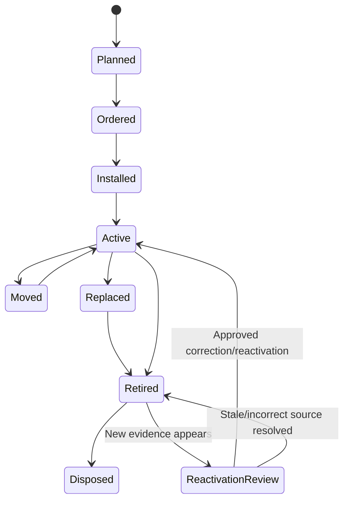

### Merge safety

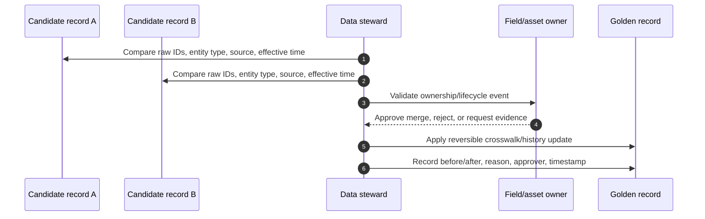

### Never do this

- Delete the losing source record and its history.
- Reuse an old serial/UUID for a new physical entity.
- Mark an asset retired because it is absent from one gated view.
- Treat lack of telemetry as decommission proof.
- Merge customer records across ownership boundaries without authorization.
- Reassign cases/contracts/telemetry through an unreviewed join.

---

## 8. Moves, adds, changes, and controller events

**MAC** governance captures a move, add, or change from request through evidence-backed closure.

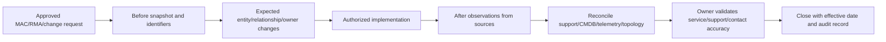

### Event impact matrix

| Event | Identity effect | Relationship effect | Required checks |
|---|---|---|---|
| Cluster rename | Cluster UUID should anchor continuity; name becomes alias history | Monitoring/support/search references update | UUID, new/old name, telemetry association, docs |
| Node/controller replacement | Physical serial/system/node identifiers can change | Node-to-cluster/support/component relationships update | RMA/change evidence, old/new IDs, entitlement, AutoSupport |
| Site move | Physical asset identity usually persists | Site/custodian/network/contact/account relationships may change | Effective date, chain of custody, support address, egress/telemetry |
| SVM rename/migration | SVM UUID/context and behavior require exact validation | Workload/protocol/DNS/protection mappings can change | Before/after UUID/name/cluster/service links |
| Cluster split/merge | One-to-many or many-to-one lineage | Nodes/SVMs/services/contracts reattach | Predecessor/successor graph and effective time |
| Decommission | Entity preserved, status changes | Workloads/contracts/telemetry/cases/components close or transfer | Owner approval, data/protection disposal, last seen, contract |

### Controller replacement example

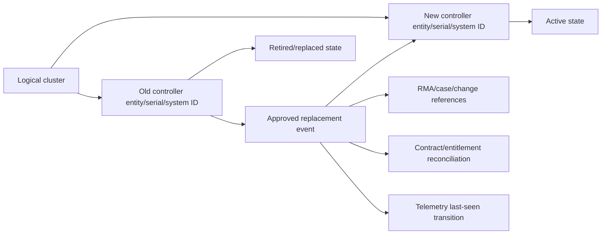

---

## 9. Topology and workload linkage

An install base becomes operationally useful when assets connect to services, protocols, protection, hosts, fabrics, monitoring, and owners.

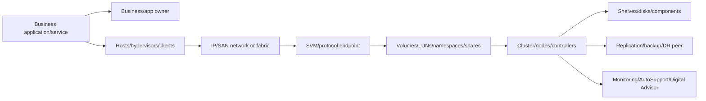

### Workload relationship fields

- Business service/catalog ID and tier.
- Application/business/technical owners and role aliases.
- Production/test/DR classification.
- SVM/cluster/storage-object relationship.
- NAS/SAN/NVMe/S3 protocol and host/hypervisor/client group.
- Network/fabric/switch/path/multipath relationships.
- Protection target, backup, replication, RTO/RPO, and recovery owner.
- Monitoring, maintenance window, change group, and case/escalation contacts.

### Plain-English deep-dive: asset health without service mapping is a parts list

A list of engine parts cannot tell you which ambulance is unavailable. Likewise, serial/model/release inventory cannot explain customer impact until it links to workloads and business services. **Why it matters:** prioritization must understand service dependency, not merely hardware count.

---

## 10. Freshness and reconciliation workflow

### Freshness dimensions

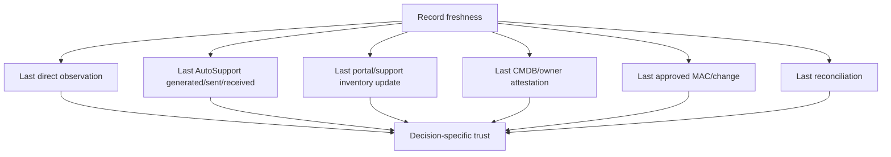

### Reconciliation stages

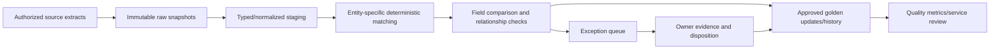

### Reconciliation controls

1. Snapshot source and extraction metadata before transformation.
2. Parse structured exports/APIs rather than manual string edits where available.
3. Normalize data types, timezones, case, whitespace, and enumerations under versioned rules.
4. Match only within defined entity/key rules.
5. Compare field values, effective times, relationships, and lifecycle state.
6. Never auto-resolve durable-identity, ownership, contract, or retirement conflicts.
7. Record proposed change, owner/approver, evidence, effective date, and rollback/correction path.
8. Recompute quality metrics and publish unresolved exceptions.

---

## 11. Exceptions, audit, privacy, and governance

### Exception taxonomy

| Exception | Example | Owner |
|---|---|---|
| Missing entity | Production cluster absent from governed view | Asset/account/data steward |
| Duplicate candidate | Same node serial in two active records | Data steward plus asset owner |
| Identity conflict | Node UUID and serial map differently across sources | Storage/support owner |
| Ownership/site conflict | Support and CMDB assign different customer/site | Account/asset owner |
| Contract conflict | Status/dates/offering disagree | Contract/support owner |
| Stale telemetry | Last receipt outside expected cadence | Storage/network owner |
| Orphan relationship | SVM has no cluster/service or component no parent | Platform/app owner |
| Invalid lifecycle | Retired asset still active/transmitting | Decommission/change owner |
| Missing owner | No accountable technical/business contact | Service/customer owner |

### Exception lifecycle

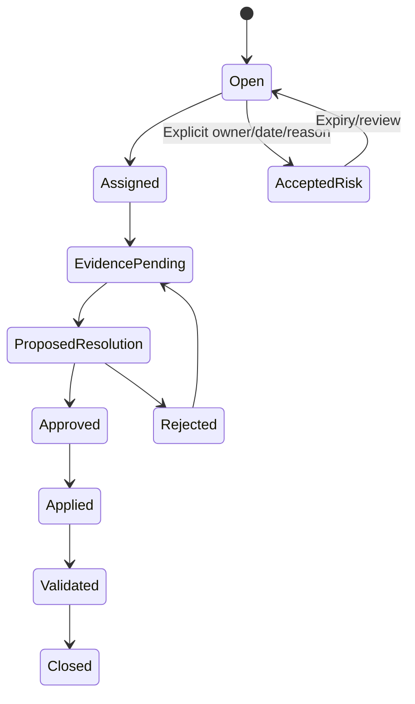

### Audit record

| Field | Purpose |
|---|---|
| Change/exception ID | Traceability |
| Entity and affected fields | Exact scope |
| Before/after values | Reversibility/accountability |
| Raw source references | Evidence lineage |
| Effective/recorded times | Historical truth |
| Reason/event | Rename, RMA, move, correction, retirement, merge |
| Requestor/owner/approver | Separation of duties |
| Transformation/rule version | Reproducibility |
| Validation/result | Closure proof |
| Privacy/retention class | Secure handling |

### Privacy and access

- Contacts, addresses, serials, topology, contract data, case links, and workload mappings can be sensitive.
- Use role aliases and minimum necessary fields in broad reports.
- Restrict raw exports and audit evidence to authorized roles.
- Do not place credentials, tokens, customer payloads, or private case text in reconciliation tables.
- Follow customer/NetApp retention, transfer, and deletion requirements.
- Maintain field-level access where commercial, technical, and personal data have different audiences.

---

## 12. Data-quality metrics and service-level governance

### Quality dimensions

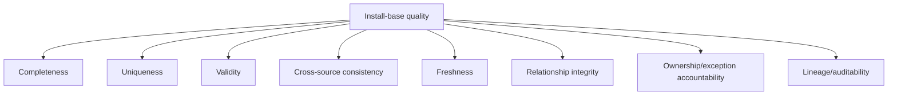

### Example metrics

| Metric | Definition | Anti-gaming check |
|---|---|---|
| Identity completeness | In-scope active entities with required durable IDs / active entities | Do not exclude difficult assets from denominator |
| Duplicate rate | Unresolved duplicate candidate groups / active entities | Review false positives/negatives |
| Freshness compliance | Assets observed within approved cadence / expected assets | Separate missing telemetry from retired state |
| Ownership completeness | Active services/assets with accountable owners / active services/assets | Role must be current and reachable |
| Relationship integrity | Required parent/service links valid / required links | Detect circular/orphan links |
| Contract conflict rate | Assets with unresolved contract mismatches / supported assets | Keep gated unknown separate |
| Exception aging | Open exceptions by age/severity/owner | Accepted risks must have expiry |
| Change closure quality | MAC events with before/after/approval/validation / closed events | Sample audit evidence |

### Dashboard flow

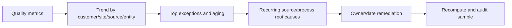

**Do not create a vanity percentage:** report numerator, denominator, exclusions, source cutoff, and unknowns.

---

## 13. Evidence, risk, recommendation, and JD Mapping

### Evidence contract

| Evidence | Required fields |
|---|---|
| Source snapshot | Source, extraction method/version, user/role, UTC time, scope, retention class |
| Identity | Entity type, internal key, raw durable IDs, names/aliases, parent relationships |
| Operational | Configuration, last-seen timestamps, topology/workload/service state |
| Commercial | Customer/account/site/contract/entitlement with authorized source |
| Lifecycle | Status, event, predecessor/successor, effective/recorded dates |
| Reconciliation | Match rule, before/after, confidence, conflict, exception, owner/approver |
| Decision | Business risk, recommendation, deadline, validation, residual risk |

### Recommendation chain

```mermaid
flowchart LR
    OBS[Observed cross-source mismatch] --> ID[Entity/key/relationship verification]
    ID --> AUTH[Field authority and effective-time check]
    AUTH --> FIND[Confirmed finding/confidence]
    FIND --> RISK[Support/operations/lifecycle/business risk]
    RISK --> REC[Bounded correction/process recommendation]
    REC --> OWNER[Owner/approver/date]
    OWNER --> PROOF[Before/after validation and audit]
    PROOF --> RESID[Residual gaps/monitoring]
```

### JD Mapping

| JD responsibility | Part 49 contribution | Your factual bridge and gap |
|---|---|---|
| Install-base accuracy | Defines entities, keys, sources, reconciliation, lifecycle, audit | CMDB/data-quality reasoning transfers; no NetApp corrections claimed |
| Customer data analysis | Adds lineage, confidence, freshness, exceptions, metrics | SQL/Python/Excel/Power BI strengths transfer |
| Proactive support | Connects current assets/telemetry/contracts to risk | enterprise support inventory habits transfer |
| Service review | Reports scope, quality, aging exceptions, owners, deadlines | Customer review communication transfers |
| Lifecycle/upgrade planning | Preserves exact hardware/software/firmware/workload dependencies | Planning discipline transfers; product validation stays gated/current |
| Cross-functional ownership | Separates storage, account, contract, app, data steward roles | Multi-team escalation experience transfers |

---

## 14. Fully synthetic sanitized scenario: install-base reconciliation

> **Synthetic boundary:** `Juniper Medical`, every identifier, customer, site, cluster, node, SVM, serial fragment, contract, contact, date, source, exception, and result is invented. The examples are not NetApp or customer exports.

### Source snapshots

| Source | Entity/value | Source time | Synthetic issue |
|---|---|---|---|
| ONTAP observation | Cluster UUID `C-101`, name `jm-prod-new`; node serial `N-B22` | `2026-08-23` | Current name/new controller |
| Digital Advisor extract | Cluster `jm-prod-old`; node serial `N-A11`; last seen `2026-08-06` | `2026-08-24` | Stale/pre-replacement identity |
| Customer CMDB | Cluster `jm-prod-new`; site `DC-West`; node serial `N-A11` Active | `2026-08-22` | Old controller not retired |
| RMA/change | Replace `N-A11` with `N-B22`, effective `2026-08-20` | `2026-08-20` | Authoritative event evidence |
| App catalog | SVM name `clinical`; no UUID; service `Imaging` | `2026-07-01` | Weak SVM join and stale owner |

### Reconciliation graph

```mermaid
flowchart LR
    CL[Logical cluster key / UUID C-101] --> OLDNAME[Alias jm-prod-old]
    CL --> NEWNAME[Current name jm-prod-new]
    CL --> OLDNODE[Controller N-A11 / Replaced]
    CL --> NEWNODE[Controller N-B22 / Active]
    EVENT[RMA effective 2026-08-20] --> OLDNODE
    EVENT --> NEWNODE
    SVM[SVM UUID evidence needed] --> SERVICE[Imaging service]
    STALE[Digital Advisor stale association] --> EXC[Exception owner/date]
    SVM --> EXC
```

### Decision table

| Decision | Evidence | Action | Validation |
|---|---|---|---|
| Preserve one logical cluster | Exact synthetic cluster UUID and rename event | Store old name as alias; current name effective-dated | Queries by either alias find same cluster history |
| Separate old/new controller assets | RMA and differing serial/system identity | Mark old Replaced, new Active, link predecessor/successor | ONTAP, telemetry, CMDB, support view agree after update |
| Do not auto-link SVM by name | App catalog lacks SVM UUID/cluster context | Storage/app owner provides exact SVM mapping | UUID + cluster + service owner confirmed |
| Do not label portal healthy/current | Last seen predates replacement | Repair/reconcile AutoSupport and asset association | New controller sequence visible to authorized owner |

### Bounded recommendation

> **Finding:** Synthetic direct observation and approved RMA evidence show one renamed cluster and a controller replacement, while CMDB and Digital Advisor snapshots retain older identities; the workload catalog also lacks a durable SVM key. **Risk:** support telemetry, contract/case selection, lifecycle status, and Imaging-service impact could be assigned to the wrong controller or SVM. **Recommendation:** data, storage, account/support, and application owners should apply effective-dated alias/replacement crosswalks, reconcile the new controller association, and confirm SVM UUID/cluster/service mapping. **Validation:** source-specific before/after snapshots agree on current relationships while preserving history, the authorized portal owner confirms fresh telemetry, and audit records name approvers. **Residual risk:** fields unavailable through gated sources remain explicit exceptions, not inferred matches.

---

## 15. Paper lab and self-test

### Paper lab

Build a synthetic reconciliation workbook/database for twenty clusters, forty nodes, thirty SVMs, eight sites, twelve services, and four source systems.

```mermaid
flowchart LR
    MODEL[Define entities/keys/relationships] --> SNAP[Create immutable synthetic source snapshots]
    SNAP --> MATCH[Run deterministic match rules]
    MATCH --> EXC[Generate conflicts/duplicates/orphans/stale records]
    EXC --> RES[Apply owner-approved effective-dated resolutions]
    RES --> MET[Calculate quality metrics]
    MET --> REVIEW[Write service review and audit sample]
```

### Inject these cases

- Cluster rename with stable UUID.
- Controller replacement with old/new serial/system IDs.
- Two clusters with the same display name at different sites.
- Duplicate support record for one physical node.
- SVM names reused across clusters.
- Site move with stale support location.
- Cluster split and predecessor/successor mappings.
- Retired asset still sending telemetry.
- Active asset with stale telemetry.
- Missing contract, owner, workload, and topology links.

### Tasks

1. Define entity types, internal surrogate keys, natural keys, aliases, and parent relationships.
2. Build field-level source-of-record and conflict rules.
3. Store raw snapshots with extraction and effective/recorded times.
4. Normalize values under a versioned transformation rule set.
5. Run deterministic, composite-review, and no-auto-fuzzy match tiers.
6. Create confidence, exception, owner, SLA, and aging fields.
7. Resolve rename/replacement/move/split/merge/retirement cases reversibly.
8. Link clusters/SVMs to workloads, services, hosts, protection, and owners.
9. Calculate quality metrics with numerators, denominators, unknowns, and exclusions.
10. Produce an evidence-risk-recommendation service review and an audit sample.

### Lab pass checklist

- [ ] Entity types and keys are not conflated.
- [ ] Names/IPs/models never cause an automatic durable-identity merge.
- [ ] Field authority, source time, effective time, and lineage are explicit.
- [ ] Old/new names and physical replacements retain history.
- [ ] Missing telemetry is not retirement proof.
- [ ] Contract, ownership, retirement, and identity conflicts require human approval.
- [ ] Workload/service/topology relationships have owners and evidence.
- [ ] Metrics include denominator, unknowns, cutoff, and exclusions.
- [ ] Sensitive contacts/contracts/topology are access-controlled.
- [ ] No production NetApp stewardship is claimed.

---

## 16. Official Source Anchors

**Date checked: 2026-08-24.** Public official NetApp sources only. Command pages can default to a current release and Digital Advisor is continuously updated. Select the exact ONTAP release and current service documentation before customer use.

| Topic | Official public source | Bounded use |
|---|---|---|
| Digital Advisor inventory | [View storage system inventory details](https://docs.netapp.com/us-en/active-iq/task_view_inventory_details.html) | Inventory rollup, system detail/download, entitled-switch orientation; access and fields vary |
| Missing/contract/install-base issues | [Digital Advisor FAQ](https://docs.netapp.com/us-en/active-iq/reference_aiq_faq.html) | Public causes for missing systems and technical/non-technical support paths |
| Customer/search/inventory terms | [Learn about Digital Advisor](https://docs.netapp.com/us-en/active-iq/concept_key_terms.html) | Customer/site/group/cluster/serial/search/inventory concepts |
| Access/contract visibility | [Log in to Digital Advisor](https://docs.netapp.com/us-en/active-iq/task_login_activeiq.html) | Credential and current contract-visibility orientation; no entitlement inference |
| Cluster identity | [cluster identity show](https://docs.netapp.com/us-en/ontap-cli/cluster-identity-show.html) | Cluster UUID/name/serial/location/contact example; use exact-release command reference |
| Node identity/inventory | [system node show](https://docs.netapp.com/us-en/ontap-cli/system-node-show.html) | Node serial/asset tag/system ID/model/UUID field orientation; privilege/release varies |
| SVM identity | [vserver show](https://docs.netapp.com/us-en/ontap-cli/vserver-show.html) | SVM/Vserver name/type/subtype/UUID/protocol/state orientation; exact release required |
| AutoSupport observation | [Learn about ONTAP AutoSupport](https://docs.netapp.com/us-en/ontap/system-admin/manage-autosupport-concept.html) | Telemetry/support-message role and cluster-admin boundary |
| Official gated support | [NetApp Support Site](https://mysupport.netapp.com/) | Authorized account/asset/contract/case workflows only; never invent results |

### Source-use discipline

- Record exact entity type before collecting or joining any identifier.
- Capture raw values, release/service context, source and extraction times, and access role.
- Define field-level authority with the customer and authorized NetApp owners.
- Preserve history and evidence for rename, replacement, move, merge, split, and retirement.
- Protect contacts, locations, topology, support, contract, and workload data.
- Never infer gated ownership/entitlement or overwrite unresolved conflicts.

---

## Likely Interview Questions

### Q1. What is an install base, and why is it important to a TAM?

> **Model answer:** "It is the governed set of customer assets and logical systems with identity, location, ownership, configuration, support, telemetry, lifecycle and service relationships. It matters because proactive risks, cases, upgrades, contracts and customer impact are only reliable when attached to the correct current asset."

### Q2. How do cluster, node, and SVM identities differ?

> **Model answer:** "They are distinct entities. A cluster has cluster identity such as UUID/name/serial fields; nodes have node UUID, system ID, serial, model and names; SVMs have their own UUID, name, type and protocol context. I use entity-specific keys and parent relationships, never a global name-only join."

### Q3. What is the source of truth for the install base?

> **Model answer:** "Usually there is no universal source. Authority is field-specific: live ONTAP can own operational configuration, support systems own contract/entitlement, customer CMDB owns governed site/custodian, and service owners own workload criticality. The golden view applies documented authority, recency and event rules while retaining lineage and exceptions."

### Q4. How would you resolve duplicate asset records?

> **Model answer:** "I compare entity type, exact durable IDs, customer boundary, relationships, source authority and effective times. Name/model/site similarity creates only a candidate. A steward validates lifecycle evidence, then applies a reversible crosswalk/merge with before-and-after values, approver and audit history."

### Q5. How do you model a controller replacement?

> **Model answer:** "I preserve old and new physical controller entities, link them through an approved replacement event, mark effective lifecycle states, and update cluster, component, contract and telemetry relationships. The logical cluster/service can continue, but I do not reuse the old serial or erase case history."

### Q6. What makes install-base data decision-quality?

> **Model answer:** "Correct entity/key, authoritative source, fresh observation, cross-source consistency, valid relationships, lifecycle history, accountable owners, documented confidence, resolved or visible exceptions, and audit lineage. I report numerator, denominator, cutoff and unknowns for quality metrics."

### Q7. How do you link assets to customer impact?

> **Model answer:** "I map cluster/node/SVM and storage objects through protocol, hosts/fabrics, applications, business services, protection, RTO/RPO and owners. Without that topology, an asset inventory is only a parts list and cannot support impact-based prioritization."

### Q8. How does your background transfer, and what is your gap?

> **Model answer:** "My prior support and Azure/M365 work gives me tenant/resource identity, CMDB-style reconciliation, audit and escalation habits; SQL/Python/Excel/Power BI support quality analysis. I have not changed a production NetApp installed base or contract record, so authorized owners and current NetApp sources remain explicit."

---

## 30-Second Memory Hooks

- **Install base:** Who owns what, where, running what, supporting which service, seen when.
- **Entity first:** Customer, site, cluster, node, SVM, component, contract, service are different.
- **Name is an alias:** Durable key plus history anchors identity.
- **Source of truth:** Field-specific authority, not one magical database.
- **Golden record:** Reconciled view plus lineage and visible conflicts.
- **Effective vs recorded time:** When true versus when learned.
- **Match safely:** Exact key first; fuzzy similarity never auto-merges.
- **Replacement:** New physical entity, linked history, logical continuity explicit.
- **Retired plus telemetry:** Investigate, never silently reactivate or ignore.
- **MAC:** Before -> approved event -> after -> reconcile -> validate -> audit.
- **Service mapping:** Parts become customer impact through workload relationships.
- **Quality:** Complete, unique, valid, consistent, fresh, related, owned, auditable.
- **Unknown:** An exception with an owner, not a guessed value.
- **Your bridge:** Identity/data governance transfers; NetApp record changes do not.

---

## Completion Checklist

- [ ] Define install base, entity, key, source of record, golden record, lineage, freshness, exception, and MAC.
- [ ] Model customer/account/site/cluster/node/SVM/component/contract/service relationships.
- [ ] Distinguish cluster UUID/serial, node UUID/system ID/serial, and SVM UUID/name.
- [ ] Build a field-level source-of-record matrix.
- [ ] Create immutable raw snapshots and effective/recorded-time history.
- [ ] Apply exact/composite/fuzzy-review matching safely.
- [ ] Define confidence levels and allowed uses.
- [ ] Handle duplicates, rename, replacement, move, split, merge, retirement, and reactivation review.
- [ ] Link assets to workloads, hosts/fabrics, protection, services, and owners.
- [ ] Track generated/sent/received/processed/observed/reconciled freshness.
- [ ] Govern exceptions, approvals, before/after changes, and audit evidence.
- [ ] Protect contacts, contracts, locations, topology, and support information.
- [ ] Measure quality with transparent numerators, denominators, cutoffs, and unknowns.
- [ ] Recreate the synthetic Juniper Medical scenario.
- [ ] Complete the paper lab and answer Q1-Q8 aloud.
- [ ] State the No-production-NetApp boundary and exact non-claim accurately.
- [ ] Recheck exact-release/current-service docs and gated sources before customer use.

---

*Next suggested section:* [Part 50 - Interoperability Matrix Tool: Supportability Validation from End to End](Part-50-imt-supportability-validation.md)