# Part 50 - Interoperability Matrix Tool: Supportability Validation from End to End

> **Section goal:** Learn to represent a real customer stack as an exact component/version recipe, search the NetApp Interoperability Matrix Tool (IMT), read supported-configuration results and notes correctly, preserve dated evidence, compare upgrade deltas, and respond safely when a combination is unlisted. By the end, you should be able to validate storage, protocol, host, hypervisor, application, adapter, driver, firmware, switch, multipath, and Host Utilities dependencies without turning partial matches into a support claim.

Covers index item **50** and maps directly to job-description responsibilities for technical solution validation, proactive risk identification, upgrade planning, customer-specific recommendations, case readiness, install-base analysis, change governance, and cross-functional coordination.

**Explicit nonclaim:** You have not approved or certified a production NetApp configuration through IMT.

**Privacy and access boundary:** Authorized IMT results, notes, exports, saved searches, customer recipes, and exception communications must remain in approved systems and be shared only at the necessary level.

**Synthetic-evidence rule:** Every recipe, component, result row, note, identifier, date, and supportability classification below is fictional and sanitized; no table is a live IMT result.

**Version caveat:** IMT is a continuously updated web application. Solutions, categories, components, properties, exact versions, configuration rows, notes, policies, history, saved searches, URLs, exports, subscriptions, and interface behavior can change. A **current-doc check** means reopening current IMT, selecting the exact solution and all required components, reviewing the Results row plus notes/policies/history, recording the evidence date, and cross-checking product/host/release documentation immediately before a decision or change.

IMT access requires authorized NetApp identity and can be gated. Public documentation explains the workflow but cannot prove a customer recipe supported. This Part contains no real IMT result, support declaration, exception, certification, or waiver. Hardware Universe, release notes, host/vendor documentation, application matrices, advisories, and actual configuration evidence remain separate required sources.

> **No-production-NetApp boundary:** You do not claim production IMT validation. Every recipe, component, version, result row, note, configuration ID, export, customer, and recommendation below is synthetic. Your factual strengths are enterprise supportability analysis, Azure/M365 dependency mapping, Windows/Linux/network stack troubleshooting, evidence-led change reviews, and structured data comparison. The explicit non-claim is: **you have not used an entitled customer IMT session to approve a production NetApp design or upgrade, saved/subscribed to a production configuration, opened a Can't Find Config request, or received a NetApp support exception for an unlisted combination.**

---

## 1. What IMT answers

The **Interoperability Matrix Tool (IMT)** is NetApp's web application for searching configurations of NetApp products and components that meet NetApp's published standards and requirements. It organizes compatibility through solutions, configurations, components, categories, criteria, and result rows.

### Plain-English deep-dive: the whole recipe matters

A restaurant may approve flour, eggs, and an oven individually, but that does not prove a particular cake recipe works at a specific temperature and altitude. IMT supportability is similarly about an exact combination, not a bag of individually supported products.

**Why it matters:** “ONTAP is supported” and “the host OS is supported” do not prove that this ONTAP + protocol + OS update + HBA + driver + firmware + switch + multipath combination is listed.

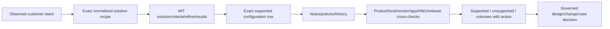

### What IMT does and does not prove

| IMT can help establish | IMT alone does not prove |
|---|---|
| A listed compatible configuration for selected exact criteria | The customer actually runs those exact versions/settings |
| Related component/version combinations in a solution | Hardware slot/port/cabling/platform limits from Hardware Universe |
| Notes, history, policies/guidelines tied to configuration/workflow | Absence of defects, advisories, or workload-specific risk |
| Upgrade/downgrade alternatives through current features such as What If | A supported upgrade path, NDO result, rollback, or app certification |
| End-to-end related-solution exploration | End-to-end deployment correctness or performance suitability |
| Exportable dated search evidence | Permanent future support after the matrix changes |

---

## 2. IMT terminology

| Term | Plain meaning | Analogy | Decision use |
|---|---|---|---|
| **Solution** | Defined interoperability use case with relevant categories/components | Recipe family | Choose the right problem domain first |
| **Category** | Component group in a solution | Ingredient class | Tells which dimensions participate |
| **Component** | Product or technology item selectable in criteria | Ingredient | Must include exact version/property as required |
| **Property/attribute** | Filter such as release, model, protocol, driver, firmware | Ingredient specification | Distinguishes near matches |
| **Criteria** | Selected solution/components/categories | Shopping list | Input only, not proof of support |
| **Configuration** | Combination represented by an IMT result | Exact recipe | Unit of supportability evidence |
| **Refine Search Criteria** | Page for narrowing compatible candidates | Recipe filter | Warning/selection still needs Results confirmation |
| **Results** | Page listing configurations meeting criteria | Approved recipe list | Controlling IMT evidence when exact row/notes match |
| **Note/policy/guideline** | Conditions, requirements, exclusions, or context | Fine print/instructions | Part of the support statement, not optional reading |
| **History** | Configuration change context exposed by current result | Revision log | Helps explain changed support evidence |
| **What If** | Feature to explore component upgrade/downgrade within configuration | Ingredient substitution test | Planning input; revalidate final exact row |

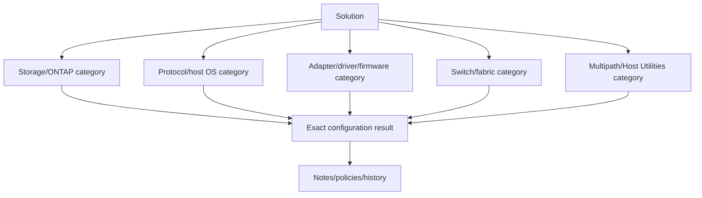

---

## 3. The exact solution recipe

Before opening IMT, freeze the observed and proposed stacks in structured records.

### Minimum recipe fields

| Layer | Exact fields to capture | Common hidden mismatch |
|---|---|---|
| NetApp product | Product/platform, ONTAP/product release including patch level where represented | Major version recorded but patch omitted |
| Storage personality/service | On-prem/cloud/service/array family as applicable | Wrong solution family |
| Protocol | FCP, iSCSI, NVMe/FC, NVMe/TCP, NFS, SMB, etc., plus required mode | Assuming all protocols share host requirements |
| Host OS | Distribution/edition, exact version/update/kernel where applicable, architecture | “Linux” or “Windows” too broad |
| Hypervisor | Product/version/update/build where relevant | Guest OS checked but hypervisor omitted |
| Application | Product/version and vendor support context when solution includes it | IMT storage path mistaken for app certification |
| Adapter | HBA/NIC/CNA vendor, exact model/part and mode | Adapter family substituted for exact card |
| Driver | Exact package/inbox/out-of-box version | Supported firmware with wrong driver |
| Adapter firmware | Exact version and boot code where required | Driver/firmware treated independently |
| Switch/fabric | Vendor/model, exact OS/firmware, protocol/mode | Switch omitted because paths are currently up |
| Multipathing | Native/DSM/MPIO software and exact version/config policy | Package installed but path policy wrong |
| Host Utilities | Product and exact release where applicable | Availability assumed from another OS release |
| Relevant notes/settings | Required timeouts, ALUA/ANA, queue, zoning, initiator, SAN boot, limits | Result row copied without conditions |

### Recipe graph

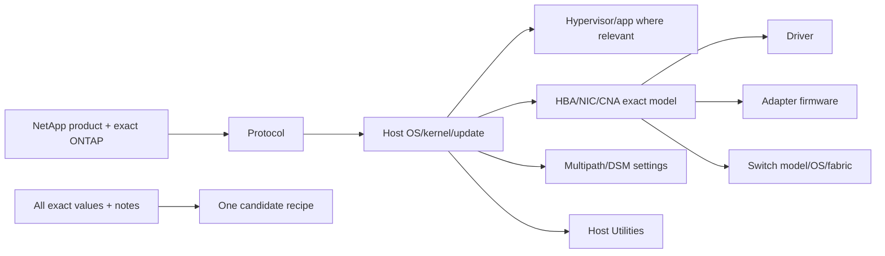

### Current versus target

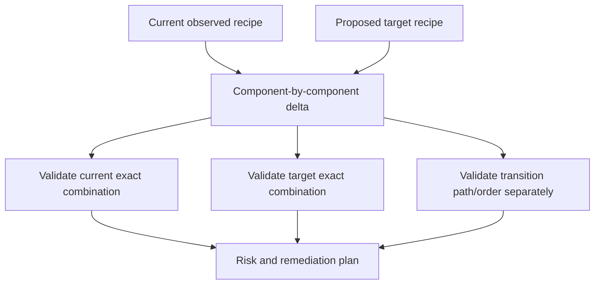

**Rule:** a supported target does not prove the current-to-target transition is supported at every intermediate state.

---

## 4. Search-method selection

Current public IMT docs describe common entry points including **ONTAP SAN Host Simplified**, **Solution Search**, **List and Find**, and **Advanced Search**.

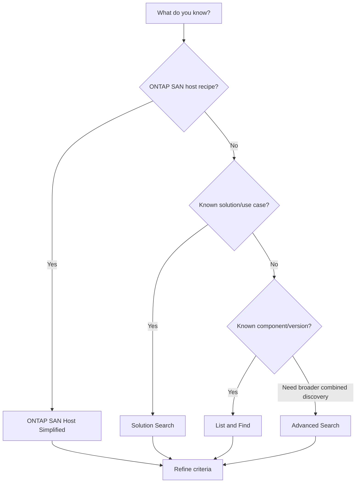

### Search choices

| Method | Best starting point | Risk to avoid |
|---|---|---|
| ONTAP SAN Host Simplified | Known ONTAP SAN host stack | Omitting exact driver/firmware/Host Utilities/notes |
| Solution Search | Known named solution/use case | Choosing a similarly named but wrong solution |
| List and Find | Known component needing compatible contexts | Treating component presence as full-stack support |
| Advanced Search | Complex component/category discovery | Building an ambiguous criteria set |

### Plain-English deep-dive: choose the right rulebook

Looking up electrical wiring in a plumbing code produces confident but irrelevant answers. IMT solutions define which compatibility rulebook and categories apply. **Why it matters:** search-method convenience never compensates for choosing the wrong solution.

---

## 5. End-to-end IMT workflow

Public documentation organizes the workflow around Enter Criteria, Refine Search Criteria, and Results.

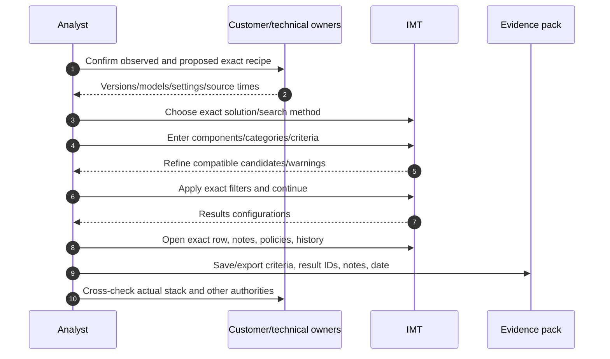

### Step-by-step

1. Define the business question: current support, target design, upgrade delta, incident, or renewal.
2. Inventory every relevant component/version from authoritative live/export/vendor evidence.
3. Normalize names without broadening versions.
4. Select the exact IMT solution/search method.
5. Enter criteria for the whole relevant recipe.
6. Refine component properties carefully; capture selections and warnings.
7. Continue to **Results**; the refine page itself is not final confirmation.
8. Locate an exact configuration row matching all recipe dimensions.
9. Read every note, policy/guideline, history detail, requirement, and exclusion.
10. Export/save the result and record configuration/search IDs, criteria, date, user/role, and source link.
11. Cross-check actual implementation, Hardware Universe, product/host/app/vendor docs, release notes, bugs/advisories.
12. Classify supportability and define remediation, owner, validation, and residual risk.

### Refine-page warning boundary

Current public docs explicitly state that users must go to the Results page to confirm valid configurations, including when a compatibility warning appears.

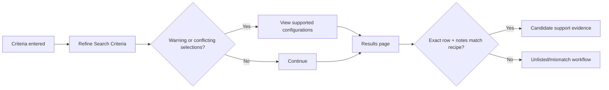

---

## 6. Reading results and notes correctly

### Result-row contract

| Evidence item | Capture | Why |
|---|---|---|
| Solution/configuration name/ID | Exact stable identifiers shown | Reproduce and escalate |
| Search criteria | Every selected component/property/version | Prove scope |
| Result row | All component/version columns | Prevent partial-match claim |
| Notes | Full relevant note IDs/text/context | Conditions are part of supportability |
| Policies/guidelines | Applicable current policy reference | Captures broader requirements |
| History | Change detail/date when relevant | Explains support-status change |
| Evidence time | UTC date/time and source | Supportability is time-bounded |
| Export/saved config | Approved secure artifact/reference | Audit and peer review |

### Plain-English deep-dive: fine print is part of the answer

An airline ticket that says “valid only with passport and before Friday” is not valid when those conditions fail. An IMT row with a note is the same: the note is not optional commentary; it can constrain the configuration.

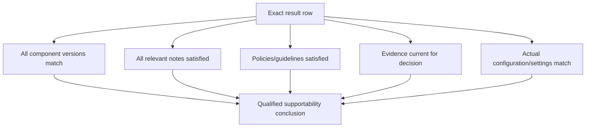

### Unsupported shortcuts

- Screenshot only one compatible component.
- Quote a result without solution/configuration ID or date.
- Ignore notes because the row appears green.
- Broaden `x.y.z` into `x.y` without explicit matrix behavior.
- Substitute a similar HBA/NIC or switch model.
- Assume inbox driver equals listed driver.
- Omit firmware or multipath because data currently flows.
- Treat a saved result as permanently current.

---

## 7. Host Utilities, multipath, adapter, and fabric depth

Public SAN host documentation says host configuration varies by host OS and protocol, requires critical multipathing/parameter settings, and recommends SAN Host Utilities when available. IMT and host documentation must be used together.

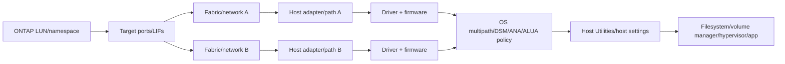

### Layer checks

| Layer | IMT question | Runtime/config question |
|---|---|---|
| Adapter | Exact model supported in recipe? | Correct slot/mode/WWPN/IQN/NQN/link state? |
| Driver | Exact version paired with OS/adapter/firmware? | Actually loaded version and settings? |
| Firmware | Exact supported pairing? | Active firmware/boot code consistent across adapters? |
| Switch | Exact model/OS supported for protocol/solution? | Zoning/VLAN/MTU/flow control/fabric health correct? |
| Multipath | Exact native/DSM/software version supported? | Required policy, timeout, path count/state/failover behavior? |
| Host Utilities | Correct release available/supported? | Installed tools/settings and reported configuration? |
| Host OS | Exact update/kernel/architecture? | Running kernel/build matches evidence? |
| ONTAP | Exact release and mode? | Target/initiator settings and protocol configuration correct? |

### Supportability versus operability

### Plain-English deep-dive: a car can run with an unapproved part

A car might start and drive after someone installs an unapproved replacement part. That observation proves present operation, not manufacturer support, crash safety, durability, or warranty coverage. Conversely, an approved part can still be installed incorrectly. **Why it matters:** runtime evidence and IMT supportability answer different questions, so investigate both without substituting one for the other.

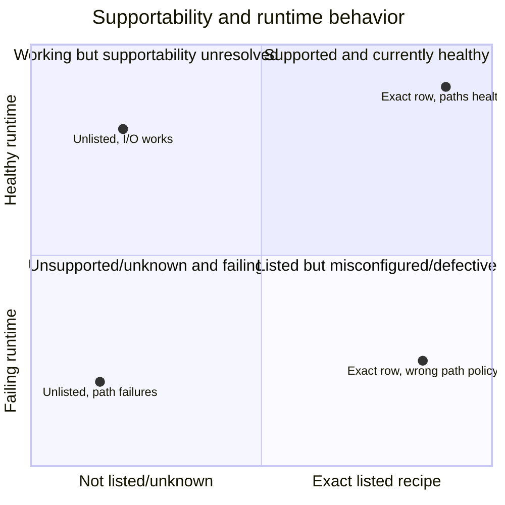

**Boundary:** a working configuration can be unlisted; a listed configuration can be misconfigured or affected by a defect.

---

## 8. Classification: supported, unsupported, and unknown

### Decision states

| State | Evidence | Customer wording/action |
|---|---|---|
| Supported as observed | Exact current recipe has matching result row; notes/policies satisfied; actual config matches | “Listed in IMT as of date for captured recipe, subject to notes and other validations” |
| Supported as proposed | Exact target recipe listed and conditions satisfied | Proceed to path/change/bug/HWU/app validation |
| Mismatch/remediation available | Current recipe differs; exact supported recipe identified | Plan bounded component alignment and validate transition |
| Explicitly unsupported | Authoritative result/policy/support response says combination unsupported | Do not recommend as supported; remediate/escalate |
| Unlisted | No exact row after correct solution/criteria and current search | Treat as unsupported or unknown according to policy/support guidance; open Can't Find Config/Support path |
| Unknown | Access, inventory, criteria, note, or authoritative response missing | Do not approve; assign evidence owner/date |

### Unlisted is not automatically broken

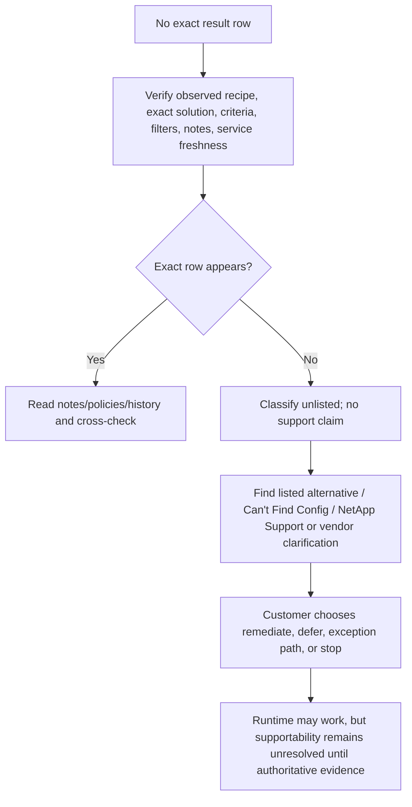

Safe wording:

> “The exact captured recipe was not found in the current IMT search as of `<date>`. That does not prove the stack is the runtime cause or that it cannot function; it means we cannot represent it as a listed NetApp-supported configuration from this evidence. We will verify criteria, use the official Can't Find Config/Support path, and/or identify a listed alternative before approval.”

---

## 9. Upgrade and downgrade delta analysis

IMT public docs describe What If and specific configuration upgrade/downgrade exploration. Treat these as compatibility planning tools, then revalidate the final exact current and target rows.

### Delta matrix

| Layer | Current | Target | Compatibility status | Transition/order action |
|---|---|---|---|---|
| ONTAP | Exact current | Exact target | Current row / target row | Supported ONTAP path checked separately |
| Host OS/kernel | Exact current | Exact target | Both exact combinations | App/hypervisor/driver prerequisites |
| HBA/NIC | Model | Same/new | Row and HWU | Slot/hardware/change dependency |
| Driver | Current | Required target | Pairing delta | Stage/reboot/rollback |
| Firmware | Current | Required target | Pairing delta | Vendor sequence and dual-path safety |
| Switch OS | Current | Target | Fabric recipe | Upgrade fabric A/B separately |
| Multipath/HU | Current | Target | Host recipe | Validate policy/path failover |

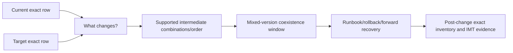

### Mixed-state trap

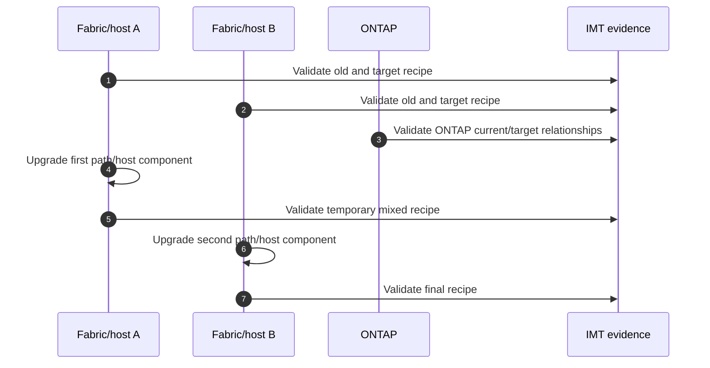

If temporary mixed versions are not validated, “both endpoints are supported” is insufficient.

---

## 10. Evidence pack, privacy, and peer review

### Evidence pack

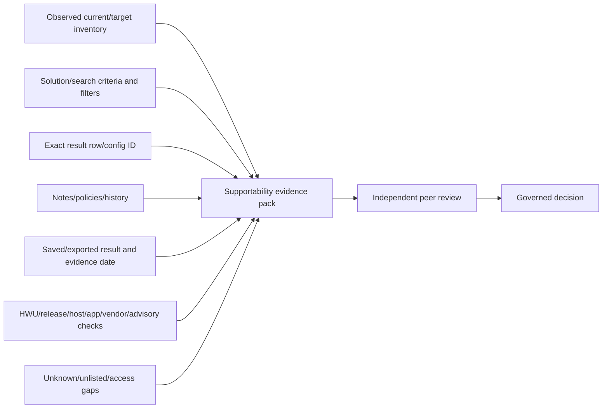

### Required metadata

- Customer/service and internal asset IDs; redact broad copies.
- Current and proposed recipe, source, collector, and observation time.
- Exact IMT solution, criteria, filters, configuration/result identifiers.
- Full component/version row, notes, policies/guidelines, and relevant history.
- IMT query/export UTC time and reviewer identity/role.
- Cross-check references and dates.
- Classification, confidence, unresolved gaps, alternatives.
- Recommendation, owner/date, prerequisites, validation, residual risk.

### Access/privacy boundary

- Use authorized identity; never share credentials or session tokens.
- Generated URLs/saved searches may reveal customer architecture; protect them.
- Exports can expose exact software/firmware, security posture, and topology.
- Store in approved case/change repositories with least access and retention.
- Use sanitized tables in customer decks when full detail is unnecessary.
- An inaccessible IMT result stays an access gap; an authorized owner performs the check.

---

## 11. Troubleshooting IMT and validation failures

### Troubleshooting tree

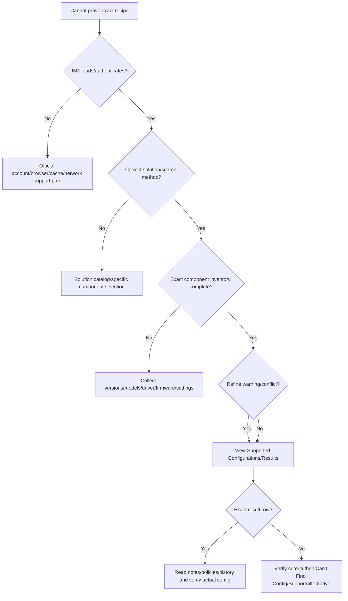

### Common failures

| Symptom | Candidate cause | Discriminating check |
|---|---|---|
| Too many result rows | Criteria too broad/version omitted | Compare frozen recipe against every selected property |
| No result | Wrong solution, incompatible exact combination, stale/new component, filter conflict | Verify solution/inventory, clear/rebuild criteria, service status, official report path |
| Component absent | Naming/category mismatch or newly added/source update lag | List and Find/Advanced Search/current troubleshooting guidance |
| Refine warning | Selected components conflict | Continue to supported configurations/Results; do not infer |
| Saved result differs later | Matrix changed or criteria not identical | Compare IDs, criteria, notes/history, evidence dates |
| Result listed but host fails | Runtime misconfiguration/defect/hardware/path issue | Host/ONTAP/fabric evidence and case workflow |
| URL opens playground/preselected view | Criteria-bearing link behavior | Validate all selected solution/components before using result |

### Escalation pack

- Business/change/incident question and deadline.
- Exact current/target recipe and authoritative inventory evidence.
- IMT solution/search method/criteria/filters/result IDs/date.
- Full row, notes, policies/history, export/sanitized capture.
- Expected versus observed result and reproduction steps.
- Alternative searches/rows and Can't Find Config reference if used.
- Runtime symptoms separately from supportability gap.
- HWU, host/vendor/application/release/advisory cross-checks.
- Impact, actions tried, confidence, access/privacy constraints, exact ask.

---

## 12. Fully synthetic sanitized scenario: IMT recipe validation

> **Synthetic boundary:** `Orchid Logistics`, every version/model/result/configuration/note/date/system is invented. The table is a teaching replacement for a gated IMT export, not an actual support claim.

### Synthetic current recipe

| Component | Observed current | Proposed target | Source |
|---|---|---|---|
| ONTAP | `SYN-ONTAP-A` | `SYN-ONTAP-B` | Synthetic inventory |
| Protocol | FCP | FCP | Synthetic design |
| Host OS | `SYN-LINUX-1` | `SYN-LINUX-2` | Synthetic host extract |
| HBA | `SYN-HBA-42` | Same | Synthetic PCI inventory |
| Driver | `DRV-7` | `DRV-9` | Synthetic loaded driver |
| Firmware | `FW-3` | `FW-5` | Synthetic adapter tool |
| Switch OS | `FAB-OS-8` | `FAB-OS-9` | Synthetic fabric inventory |
| Multipath/HU | `MP-A` / `HU-A` | `MP-B` / `HU-B` | Synthetic host config |

### Synthetic search result table

| Recipe checked | Exact row? | Note state | Classification |
|---|---|---|---|
| Full current recipe | No | N/A | Unlisted; not approved, not declared runtime-broken |
| Full target recipe | Yes: `SYN-CONFIG-204` | Synthetic note requires exact `DRV-9` + `FW-5` pairing | Candidate supported target pending all cross-checks |
| Temporary target ONTAP + old driver/firmware | No | N/A | Mixed-state supportability gap |
| Listed alternative with `DRV-8` + `FW-4` | Yes: `SYN-CONFIG-198` | Synthetic OS limitation | Alternative for owner/support review |

### Dependency/delta graph

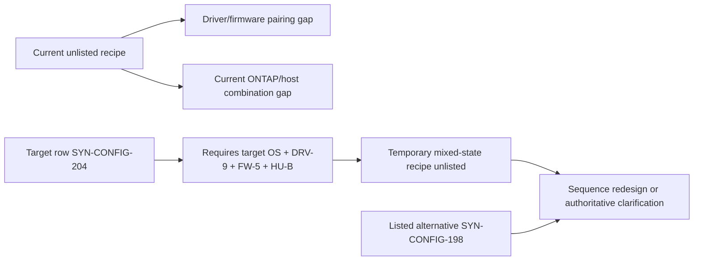

### Competing hypotheses

| Observation | Unsafe conclusion | Safe interpretation |
|---|---|---|
| Current I/O works | Current recipe is supported | Runtime success does not create an IMT row |
| Target exact row exists | Upgrade can proceed directly | Transition, mixed state, bugs, HWU, app, protection, rollback remain |
| Same HBA model appears elsewhere | Any driver/firmware works | Pairing is recipe-specific |
| No current row | This mismatch caused every incident | Supportability gap is a risk; root cause needs runtime evidence |

### Bounded recommendation

> **Finding:** The synthetic current recipe and temporary mixed state are unlisted, while one target recipe is listed only with an exact driver/firmware/Host Utilities combination and synthetic note. **Risk:** the customer lacks current supportability evidence and could pass through an unvalidated intermediate stack, complicating failover and Support engagement. **Recommendation:** the storage, Linux, adapter, fabric, application, and change owners should verify the inventory, use an authorized owner to reproduce current IMT results/notes, seek official clarification or select a fully listed sequence, and validate HWU/release/app/defect requirements. **Validation:** exact current/intermediate/target classifications, peer-reviewed evidence pack, path-resilience test, and post-change inventory. **Residual risk:** a listed recipe does not eliminate runtime configuration or defect risk.

---

## 13. Discovery, recommendation, and JD Mapping

### Discovery questions

1. What customer service/design/change/incident question must IMT answer?
2. Which exact NetApp product/platform/ONTAP release and protocol are present/current/target?
3. Which host OS/kernel/update, hypervisor, application, and architecture apply?
4. Which exact HBA/NIC/CNA, driver, firmware, switch model/OS, multipath, and Host Utilities versions run?
5. Which solution/search method and all categories/components model the stack?
6. Which exact Results row, notes, policies, history, and evidence date apply?
7. What differs between actual/current/target/intermediate recipes?
8. Which HWU, release-note, bug/advisory, host/vendor/app requirements remain?
9. Is the result supported, unsupported, unlisted, unknown, or remediable?
10. Who owns clarification/change/validation, and what is the residual risk?

### Evidence-to-recommendation

```mermaid
flowchart LR
    INV[Exact observed recipe] --> IMT[Exact result row/notes/date]
    IMT --> APPLY[Actual setting and cross-source applicability]
    APPLY --> FIND[Supportability finding/confidence]
    FIND --> RISK[Support/change/availability risk]
    RISK --> OPT[Listed alternatives/clarification/remediation]
    OPT --> REC[Owner/date/sequence/prerequisites]
    REC --> PROOF[Peer review and post-change evidence]
    PROOF --> RES[Residual risk]
```

### JD Mapping

| JD responsibility | Part 50 contribution | Your factual bridge and gap |
|---|---|---|
| Solution validation | Defines exact end-to-end recipe and Results evidence | Microsoft dependency/supportability analysis transfers |
| Upgrade planning | Compares current/target/intermediate compatibility | Change-review discipline transfers; no production IMT approval claimed |
| Proactive risk | Detects unlisted/mismatched driver/firmware/host/fabric combinations | Cross-stack troubleshooting transfers |
| Customer recommendation | Produces bounded alternatives with notes, owners, proof | Evidence-risk communication transfers |
| Support experience | Builds reproducible configuration/evidence pack | Escalation discipline transfers |
| Cross-functional work | Coordinates storage, host, hypervisor, app, network, vendor, change owners | Multi-team prior experience transfers |

### Honest interview answer

> "I would freeze the exact current and proposed recipe, select the correct IMT solution, enter all storage/protocol/host/adapter/driver/firmware/switch/multipath/Host Utilities criteria, and confirm an exact Results row with every note, policy and evidence date. I would cross-check actual configuration, HWU, release, bug and application requirements. If unlisted, I would not call it supported or automatically broken; I would verify criteria and use the official clarification or listed-alternative path. I have not approved a production NetApp stack in IMT."

---

## 14. Paper lab and self-test

### Paper lab

Create six synthetic current/target SAN recipes across Windows, Linux, and hypervisor hosts.

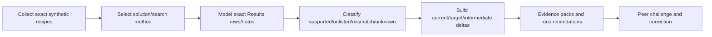

### Inject these cases

- Exact supported recipe with a mandatory note.
- Same components but wrong driver/firmware pairing.
- Working but unlisted current recipe.
- Target listed but temporary mixed state unlisted.
- HBA model ambiguity requiring exact part/model.
- Feature hidden by wrong solution or hierarchy.
- Saved result whose notes changed at a later evidence date.
- App vendor matrix conflicts with otherwise listed storage path.

### Tasks

1. Build current/target structured inventory and source timestamps.
2. Choose ONTAP SAN Host Simplified, Solution Search, List and Find, or Advanced Search with rationale.
3. Record solution, criteria, filters, results, notes, policies, history, IDs, and date.
4. Validate all exact fields and actual runtime settings.
5. Cross-check HWU, host/hypervisor/app/vendor docs, release notes, and defects.
6. Classify each recipe without overclaiming.
7. Build upgrade delta including intermediate/coexistence states.
8. Write an unlisted-configuration escalation and a listed-alternative recommendation.
9. Peer-review for omitted categories, partial matches, stale evidence, and ignored notes.
10. Answer Q1-Q8 aloud without claiming tool experience.

### Lab pass checklist

- [ ] Every component/version/property is exact and sourced.
- [ ] The correct solution/search method is explicit.
- [ ] Refine criteria are never treated as final support proof.
- [ ] Exact Results row, notes, policies, history, ID, and date are captured.
- [ ] Current, target, and intermediate recipes are separate.
- [ ] Host Utilities, multipath, HBA/NIC, driver, firmware, and switch are included.
- [ ] Runtime success and supportability are separate.
- [ ] Unlisted is neither approved nor automatically blamed as root cause.
- [ ] Gated access uses an authorized-owner fallback.
- [ ] No production IMT approval is claimed.

---

## 15. Official Source Anchors

**Date checked: 2026-08-24.** Public official NetApp sources only. IMT data and interface can change continuously; public docs describe method, while customer supportability requires a current authorized IMT result.

| Topic | Official public source | Bounded use |
|---|---|---|
| IMT purpose/three-page flow | [Interoperability Matrix Tool overview](https://docs.netapp.com/us-en/interoperability-matrix-tool/index.html) | Solution/configuration/component/category and Enter/Refine/Results workflow |
| Search methods | [Perform common searches](https://docs.netapp.com/us-en/interoperability-matrix-tool/performing-common-searches.html) | ONTAP SAN Host Simplified, Solution Search, List and Find, Advanced Search |
| Search criteria | [Define and enter search criteria](https://docs.netapp.com/us-en/interoperability-matrix-tool/defining-and-entering-the-search-criteria.html) | Component/solution/category criteria concepts |
| Search use cases | [IMT search workflow](https://docs.netapp.com/us-en/interoperability-matrix-tool/interoperability-matrix-tool-search-workflow.html) | Host OS/HBA/upgrade/end-to-end/policy/report-issue workflow links |
| Refine warning | [Find compatibility using Refine Search Criteria](https://docs.netapp.com/us-en/interoperability-matrix-tool/finding-the-compatibility-using-the-refine-search-criteria.html) | Results page required to confirm valid configurations |
| Results/export/What If/end-to-end | [Understand and use IMT results](https://docs.netapp.com/us-en/interoperability-matrix-tool/understanding-and-using-imt-results.html) | Supported configuration, export, related solution, What If concepts |
| Saved criteria/configurations | [Work with saved criteria, recent searches, and configurations](https://docs.netapp.com/us-en/interoperability-matrix-tool/working-with-saved-criteria-recent-searches-and-config.html) | Save/load/edit/delete/subscription orientation |
| IMT troubleshooting | [Troubleshoot IMT issues](https://docs.netapp.com/us-en/interoperability-matrix-tool/troubleshooting-interoperability-matrix-tool-issues.html) | Public service/login/component/search troubleshooting; recheck current behavior |
| SAN host/Host Utilities | [Learn about SAN host configurations](https://docs.netapp.com/us-en/ontap-sanhost/overview.html) | Host OS/protocol-specific multipath/settings and Host Utilities role |
| SAN host docs hub | [ONTAP SAN hosts and cloud clients](https://docs.netapp.com/us-en/ontap-sanhost/index.html) | Current OS/distribution and Host Utilities guidance |
| Gated IMT application | [NetApp IMT](https://imt.netapp.com/matrix/) | Authorized current results only; never invent a row |

### Source-use discipline

- Capture current IMT results at decision/change time, not from memory.
- Preserve exact recipe, solution, criteria, result/configuration ID, notes/policies/history, and UTC date.
- Reconcile actual installed/running versions and settings.
- Cross-check HWU, release notes, bugs/advisories, and host/hypervisor/application/vendor sources.
- Protect saved URLs/exports and customer architecture.
- Route unlisted/ambiguous combinations through official IMT/Support paths.

---

## Likely Interview Questions

### Q1. What does IMT validate?

> **Model answer:** "IMT lists configurations of NetApp products and components that meet NetApp's published interoperability requirements. I use the correct solution, exact criteria and Results row, including notes/policies/history and date. It validates a listed recipe, not the customer's actual settings, hardware limits, lack of bugs, upgrade path, or application certification by itself."

### Q2. Why is exact versioning so important?

> **Model answer:** "Supportability is combinational. An OS update, kernel, HBA model, driver, firmware, switch OS, multipath or Host Utilities change can create a different recipe. Product families and major versions are too broad; I capture authoritative current and target values for every required component."

### Q3. Describe the IMT workflow.

> **Model answer:** "Freeze the real recipe, choose the right solution/search method, enter components/categories, refine exact properties, continue to Results, match a complete configuration row, read notes/policies/history, save/export dated evidence, then cross-check actual config, HWU, release, defect and app/vendor requirements."

### Q4. Is a compatible Refine Search screen enough?

> **Model answer:** "No. Public IMT docs explicitly direct users to the Results page to confirm valid configurations. I need an exact Results row and its conditions; criteria or individually selectable components are only search inputs."

### Q5. What does an unlisted configuration mean?

> **Model answer:** "It means I cannot prove the exact recipe is listed from that current search. It is not automatically runtime-broken or the incident root cause, but I do not call it supported. I verify inventory/solution/criteria, use Can't Find Config or Support clarification, and identify a listed alternative."

### Q6. How do you analyze an upgrade with IMT?

> **Model answer:** "I validate exact current and target recipes, compare component deltas, and test every temporary mixed/coexistence state and ordering. I also validate the actual upgrade path, HWU, release notes, bugs, application/protocol requirements, protection, rollback and runtime tests separately."

### Q7. How do Host Utilities and multipathing fit?

> **Model answer:** "SAN host configuration is OS- and protocol-specific. The exact Host Utilities release, multipath/DSM software and settings, adapter driver/firmware, switch and ONTAP combination all matter. A listed recipe can still fail if path policy/timeouts/zoning or runtime settings are wrong."

### Q8. How does your background transfer, and what remains a gap?

> **Model answer:** "enterprise support and Azure/M365 work gave me cross-layer dependency, exact-version, change-review and evidence-pack discipline. I can apply the IMT method and communicate uncertainty, but I have not used an entitled IMT session to approve a production NetApp stack; an authorized experienced reviewer validates real results."

---

## 30-Second Memory Hooks

- **IMT:** Exact supported configuration repository, not a product popularity list.
- **Recipe:** ONTAP + protocol + host + adapter + driver + firmware + switch + multipath + HU + conditions.
- **Solution first:** Choose the right compatibility rulebook.
- **Criteria:** Question; **Results row:** candidate answer.
- **Notes are binding:** Fine print belongs to the row.
- **Exact means exact:** Family/major version/similar model is insufficient.
- **Working != supported:** Runtime and supportability are separate axes.
- **Listed != configured correctly:** Runtime evidence still matters.
- **Unlisted:** No support claim; not automatic root cause.
- **Upgrade:** Validate current + target + every mixed state.
- **Evidence:** Recipe, ID, row, notes, policies, history, export, date.
- **Cross-check:** IMT + HWU + release + bug/advisory + host/app/vendor.
- **Gated:** Authorized reviewer or explicit gap, never invented output.
- **Your bridge:** Dependency/evidence discipline transfers; production approval does not.

---

## Completion Checklist

- [ ] Define solution, category, component, property, criteria, configuration, Refine, Results, notes, history, and What If.
- [ ] Explain what IMT proves and does not prove.
- [ ] Capture the complete exact current and target recipe.
- [ ] Choose the correct common search method and solution.
- [ ] Follow Enter Criteria -> Refine -> Results -> notes/policies/history.
- [ ] Treat Results, not Refine, as controlling configuration evidence.
- [ ] Include ONTAP, protocol, OS/kernel, hypervisor/app, HBA/NIC, driver, firmware, switch, multipath, and Host Utilities.
- [ ] Distinguish supportability from runtime operability/configuration.
- [ ] Classify supported, unsupported, mismatch, unlisted, and unknown safely.
- [ ] Use official clarification/alternative workflow for unlisted recipes.
- [ ] Validate current, target, and temporary mixed/coexistence recipes.
- [ ] Build a dated secure peer-reviewed evidence pack.
- [ ] Apply troubleshooting and escalation workflows.
- [ ] Recreate the synthetic Orchid Logistics scenario.
- [ ] Complete the paper lab and answer Q1-Q8 aloud.
- [ ] State the No-production-NetApp boundary and exact non-claim accurately.
- [ ] Recheck current authorized IMT and all cross-sources before customer use.

---

*Next suggested section:* [Part 51 - Hardware Universe, Platform Limits, Components, and Configuration Rules](Part-51-hardware-universe-platform-limits.md)