# Part 51 - Hardware Universe, Platform Limits, Components, and Configuration Rules

> **Section goal:** Learn to validate a physical NetApp configuration using exact platform, controller, part, slot, port, shelf, drive, cable, topology, ONTAP, and lifecycle context. By the end, you should be able to use Hardware Universe (HWU) and public platform documentation without relying on remembered specifications, distinguish hardware compatibility from end-to-end interoperability, resolve source conflicts, and turn limits or configuration gaps into evidence-backed change recommendations.

Covers index item **51** and maps directly to job-description responsibilities for install-base analysis, technical configuration validation, lifecycle/upgrade planning, proactive hardware risk, capacity and expansion reviews, customer recommendations, support readiness, and cross-functional change governance.

**Explicit nonclaim:** You have not designed or approved a production NetApp hardware configuration through Hardware Universe.

**Privacy and access boundary:** Gated HWU results, customer bills of materials, serials, locations, slot maps, cabling, contracts, and replacement plans require authorized access and controlled sharing.

**Synthetic-evidence rule:** Every model, part, slot, limit, topology, date, support result, and recommendation below is fictional and sanitized; no value is a copied HWU result or current product specification.

**Version caveat:** Hardware Universe, platform documentation, supported adapters, slots/ports, shelf/drive combinations, cabling rules, maximums, minimums, firmware/ONTAP dependencies, replacement procedures, and lifecycle status change. A **current-doc check** means opening HWU for the exact system/model and date, reading applicable notes, then cross-checking the exact ONTAP release, IMT recipe, platform/shelf/switch installation guide, release notes, and change procedure before design or implementation.

HWU is a gated authoritative hardware-configuration reference; this guide cannot reproduce a customer-specific lookup or certify a real configuration. It contains no remembered platform specifications, numeric customer limits, slot maps, part substitutions, cable plans, drive mixing rules, or lifecycle promises. Every example value is synthetic.

> **No-production-NetApp boundary:** You do not claim production Hardware Universe or NetApp hardware-design experience. Every platform, part, slot, port, shelf, drive, cable, limit, firmware, lifecycle state, and recommendation below is synthetic. Your factual strengths are enterprise support, server/network dependency mapping, exact-version evidence, capacity/change reviews, inventory reconciliation, and secure escalation. The explicit non-claim is: **you have not used HWU to approve a production NetApp configuration, installed or cabled a NetApp controller/shelf, selected a production adapter/drive, performed a hardware expansion, replaced a NetApp FRU, or certified a platform limit.**

---

## 1. What Hardware Universe contributes

**Hardware Universe (HWU)** is NetApp's gated hardware reference used to look up current platform and component specifications, supported combinations, configuration rules, and limits. Treat each result as scoped to the exact model, component identity, version context, notes, and evidence date.

### Plain-English deep-dive: the aircraft configuration manual

An aircraft model name alone does not tell a mechanic which engine variant, seat load, tire, connector, or maintenance limit applies. The exact tail configuration and current manual revision matter. HWU plays that configuration-reference role for NetApp hardware.

**Why it matters:** a correct limit for a neighboring platform or older release can be dangerously wrong for the customer's exact system.

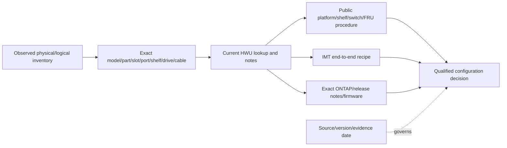

### HWU versus other sources

| Source | Primary question | Does not replace |
|---|---|---|
| HWU | Is this exact hardware/platform/component configuration and limit represented under current rules? | IMT, actual inventory, procedure, defects, lifecycle policy |
| IMT | Is the exact cross-product host/protocol/software/driver/firmware recipe listed? | Physical slot/port/cabling/platform limits |
| Platform install/maintain docs | How to install, cable, expand, replace, and maintain exact hardware | Current HWU maximums/combinations or customer approval |
| ONTAP release notes/docs | What does exact ONTAP release support/require/change? | Hardware part identity and physical topology |
| Switch/shelf docs | Exact topology, cabling, firmware, and procedure context | Overall controller/platform supportability |
| Lifecycle/support source | Is product/component sold/supported and until when? | Technical compatibility |
| Live inventory | What is actually installed/running/connected? | Whether it is supported or correctly designed |

---

## 2. Hardware identity hierarchy

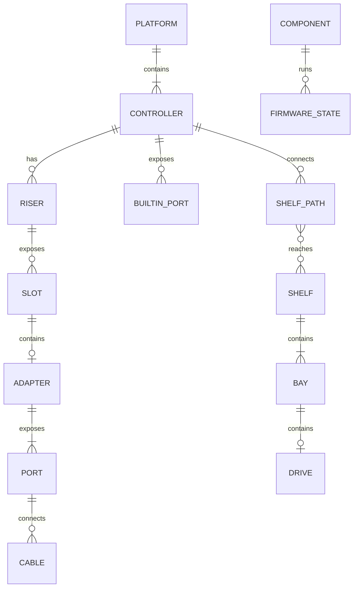

### Identity fields

| Entity | Minimum exact identity | Context fields |
|---|---|---|
| Platform/system | Product family and exact controller/platform model | HA/single context, ONTAP release, personality, location |
| Controller | Serial/system/node identity and exact controller model | HA partner, chassis, lifecycle state |
| Adapter/module | Exact part/model/FRU and function/mode | Controller, riser, slot, ONTAP, firmware |
| Port | Controller/module/slot/port designation and port type/speed/mode | Peer, cable, VLAN/fabric/stack, role |
| Shelf | Exact shelf model/serial/module type | Shelf ID, stack/loop, pathing, firmware |
| Drive | Exact drive model/part/capacity/type/firmware | Shelf/bay, ownership, aggregate/pool role |
| Cable/transceiver | Exact cable/transceiver/connector type and endpoints | Length, speed, protocol, route, labeling |
| Switch | Exact model/serial and firmware/OS | Cluster/storage/SAN role, ports, topology |

### Exact identity path

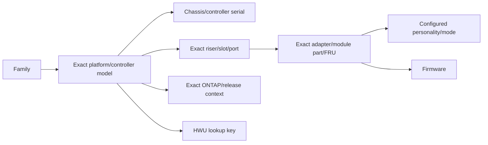

### Plain-English deep-dive: model family is not instance identity

Saying “a sedan tire” is not enough to order a wheel: trim, year, axle, rim, load rating, and exact part matter. Similarly, adapter family or shelf type cannot substitute for exact part/model and slot context. **Why it matters:** similar components can have different slot, speed, firmware, cabling, and release constraints.

---

## 3. Configuration domains to validate

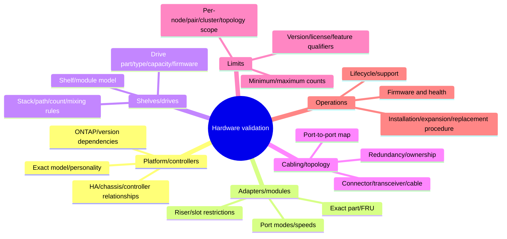

### Domain evidence matrix

| Domain | Observed evidence | HWU/current-doc question | Operational validation |
|---|---|---|---|
| Controllers | Serial/model/system inventory | Exact platform/configuration supported? | HA health/ownership/partner state |
| Slots/adapters | Part/model/FRU + slot/riser + mode | Is adapter allowed in that slot/mode/release? | Loaded/recognized, port health, firmware |
| Ports | Exact controller/module/port and role | Supported type/speed/mode? | Peer/link/config/traffic/path state |
| Shelves | Shelf/module/serial/ID/topology | Supported shelf/count/attachment/mix? | Path redundancy, module/shelf health |
| Drives | Part/model/type/capacity/firmware/bay | Supported drive/shelf/platform/mix/count? | Ownership, health, aggregate/pool state |
| Cabling | Endpoint-to-endpoint cable map | Supported cable/transceiver/topology/length? | Link/path/failover and physical labeling |
| Limits | Current object counts and required growth | Exact scoped max/min and qualifiers? | Headroom, reservations, failure-state capacity |

---

## 4. Platform, controller, and HA context

### Platform validation graph

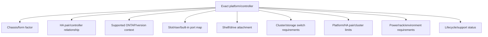

### Scope words matter

| Limit scope | Meaning | Error example |
|---|---|---|
| Per port | Applies to one physical/logical port | Multiplying or aggregating incorrectly |
| Per adapter | Shared across ports on one module | Treating each port as full independent maximum |
| Per controller/node | Applies to one controller | Reporting pair total as node capacity |
| Per HA pair | Shared or constrained across partners | Doubling a pair limit |
| Per cluster | Aggregate cluster boundary | Assuming scale per node multiplies indefinitely |
| Per stack/loop/path | Topology-specific shelf/device boundary | Counting shelves but ignoring topology/path |
| Per supported configuration | Depends on platform, ONTAP, component, feature, notes | Quoting a number without qualifiers |

### HA failure-state check

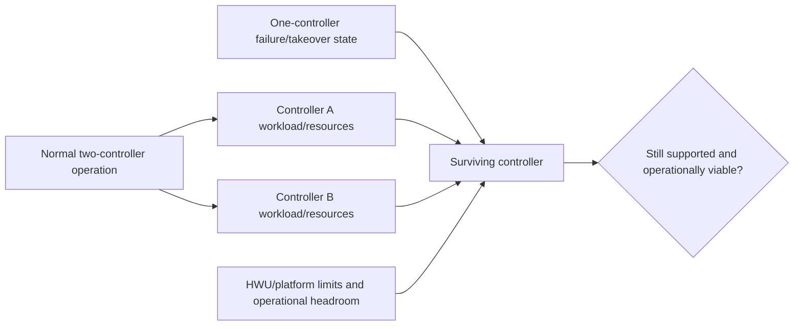

A configuration that fits only in the normal state may be operationally unsafe during takeover even if a simple count is below a published maximum.

---

## 5. Adapters, risers, slots, ports, and modes

### Slot validation

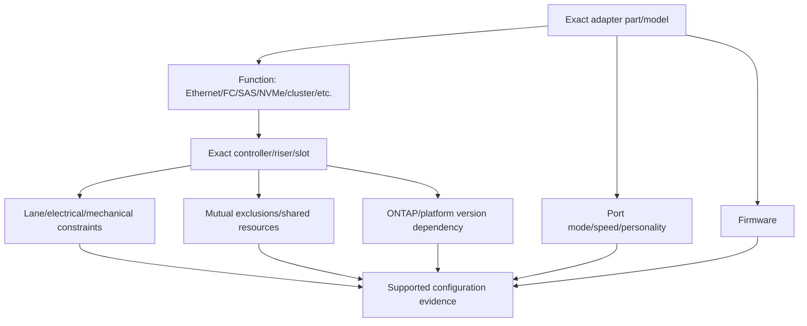

### Adapter questions

1. Exact part/model/FRU, not a marketing family?
2. Is the adapter supported in this exact platform, riser, and slot?
3. Are adjacent slots, lane sharing, or onboard-port exclusions relevant?
4. Which port personality/mode/speed and transceiver/cable are supported?
5. Which ONTAP and firmware versions apply?
6. Is the adapter for cluster, storage, data, management, tape, MetroCluster, or another role?
7. Does IMT also list the end-to-end host/network/fabric recipe?
8. Is the installed card recognized and healthy in the expected mode?

### Port-map evidence

| Controller | Riser/slot | Adapter part | Port | Configured role/mode | Peer/cable | HWU/doc evidence ID/date | Status |
|---|---|---|---|---|---|---|---|
| Synthetic only | Synthetic only | Synthetic only | Synthetic only | Synthetic only | Synthetic only | Required in real case | Unknown until checked |

---

## 6. Shelves, drives, modules, and ownership

Public ONTAP hardware documentation organizes current shelf installation, hot-add, shelf-ID, and cabling procedures by exact shelf/system family. Use the exact workflow; do not generalize between shelf families.

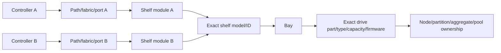

### Shelf/drive validation

| Question | Evidence |
|---|---|
| Is this exact shelf model supported on this platform/release? | Current HWU + exact platform/shelf docs |
| Is attachment direct or switch-connected and supported? | HWU/topology docs + physical port map |
| Is shelf/module/drive firmware appropriate? | Current firmware guidance + actual inventory |
| Are shelf IDs, paths, stack/loop topology, and ownership correct? | Live/system/physical evidence |
| Are drive model/part/type/capacity/mixing rules supported? | HWU exact drive/shelf/platform configuration |
| Are count and topology limits scoped correctly? | Exact notes with per-port/stack/pair/cluster qualifiers |
| Does added capacity preserve failure-state headroom? | Capacity/HA model + post-add validation |

### Plain-English deep-dive: more bays do not equal usable expansion

An apartment building can have empty rooms but no legal occupancy permit, elevator capacity, or electrical headroom for more residents. Empty drive bays similarly do not prove that a drive type, shelf, path, port, count, or capacity expansion is supported. **Why it matters:** validate the entire attachment and limit chain.

---

## 7. Cabling and topology rules

### Endpoint-to-endpoint cable record

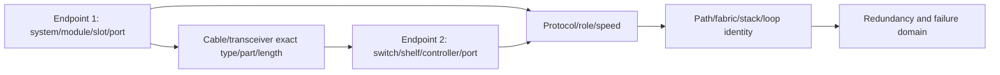

### Cable-map fields

- Endpoint A and B: system serial/model, module, slot, port.
- Cable/transceiver part/type, connector, supported speed/mode, and length.
- Protocol/role and logical network/fabric/stack.
- Redundant peer/path and failure domain.
- Label, physical route, rack, panel, switch port, and owner.
- Expected link/port/path state before and after change.
- Exact HWU/platform/shelf/switch procedure and evidence date.

### Redundancy check

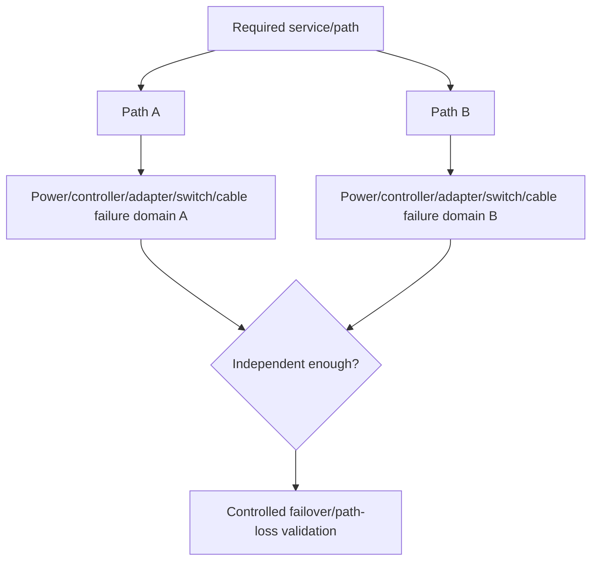

Two cables are not redundant if they share the same unsupported adapter, switch, power source, or physical failure domain.

---

## 8. Limits, headroom, and version dependencies

### Plain-English deep-dive: every limit has a measuring cup

“The limit is eight” is meaningless until you know whether eight means per elevator, floor, building, campus, or emergency mode. Hardware limits also have a measuring scope: port, adapter, controller, HA pair, cluster, stack, or exact configuration. **Why it matters:** the same number applied at the wrong scope can double-count capacity or hide a failure-state overload.

### Limit record schema

| Field | Required content |
|---|---|
| Object/metric | What is counted or measured |
| Exact scope | Port, adapter, controller, HA pair, cluster, shelf stack, protocol, feature |
| Current value | Observed count/state and source time |
| Proposed value | After approved change, including temporary state |
| Maximum/minimum | Exact current HWU/doc value; never memory |
| Qualifiers | Platform, ONTAP, component, topology, license/feature, notes |
| Failure-state value | Takeover/path/switch failure case |
| Evidence | Source link/ID/version/date and reviewer |
| Headroom | Arithmetic plus operational buffer policy |

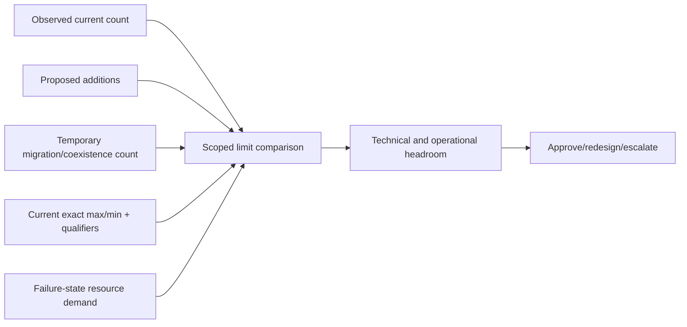

### Version dependency chain

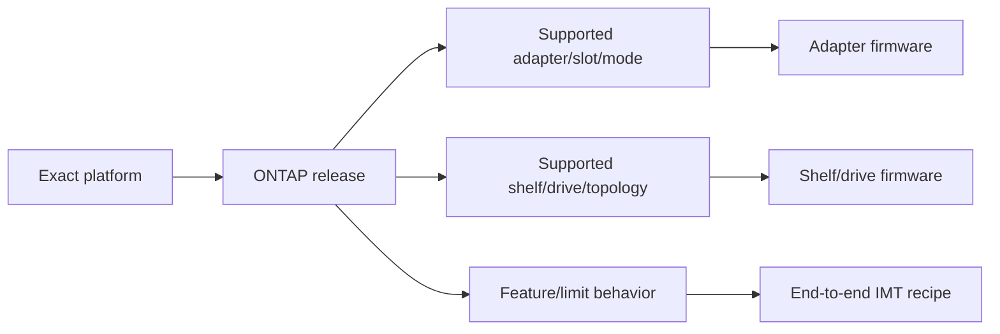

### Never quote a naked number

Unsafe: “This platform supports 24 shelves.”

Safe pattern:

> “For exact platform `<model>`, controller/HA context `<scope>`, ONTAP `<release>`, shelf `<model/module>`, attachment `<topology>`, and note `<ID>`, current HWU dated `<date>` states `<limit>`. Current is `<count>`, proposed/temporary/failure-state values are `<values>`. The authorized reviewer must recheck at change time.”

---

## 9. Current configuration, proposed change, and conflict handling

### Before/after validation

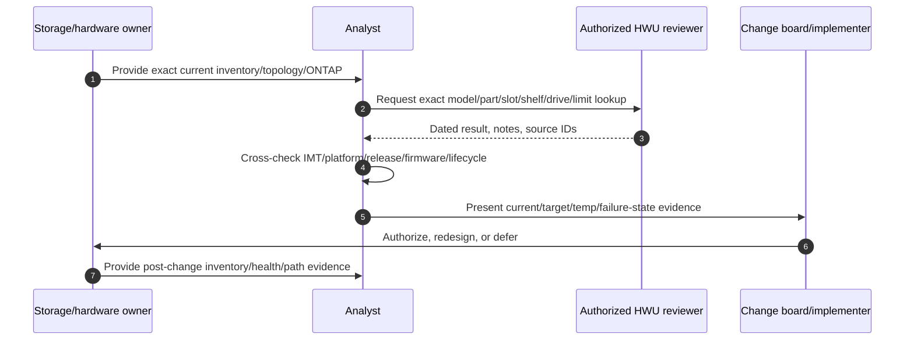

### Source conflict rule

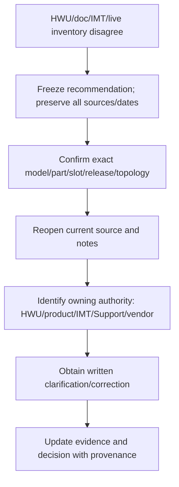

### Conflict examples

| Conflict | Do not | Do |
|---|---|---|
| HWU and old design document differ | Pick the larger limit | Recheck exact context/date and escalate source discrepancy |
| Live adapter part not found | Substitute similar model | Verify physical/inventory identity and authorized support path |
| HWU supports hardware, IMT omits host recipe | Declare design supported | Treat end-to-end supportability unresolved |
| Procedure shows port but HWU slot note restricts use | Follow picture alone | Apply exact current configuration rules and clarify |
| Lifecycle page and contract view differ | Promise support date | Route to lifecycle/contract owner with dated evidence |

---

## 10. Lifecycle, replacement, and expansion cases

### Case matrix

| Case | Required evidence | Key risk |
|---|---|---|
| New design | Exact BOM/parts/slots/topology/versions/limits/IMT | Unsupported combination or insufficient redundancy |
| Shelf/drive expansion | Current/target/temp counts, attachment, drive rules, firmware, headroom | Limit/mixing/path/failure-state issue |
| Adapter addition | Exact part, slot/riser, exclusions, port mode, firmware, IMT | Wrong slot/mode or shared-resource collision |
| Controller refresh | Current/target platform, supported shelves/drives/adapters, migration path | Orphaned component or unsupported carry-forward |
| FRU replacement | Exact failed/replacement FRU and model-specific procedure | Similar-looking wrong part/procedure |
| Lifecycle remediation | Current official status, support/contract, compatible successor | Premature promise or stranded dependency |
| Cable/topology correction | Exact endpoints/media/path/failure domains | Outage from broken redundancy |

### Replacement decision

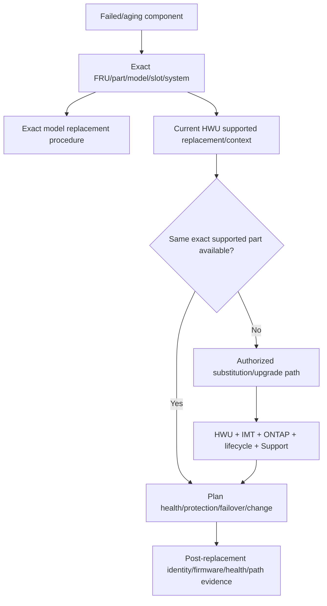

### Expansion decision

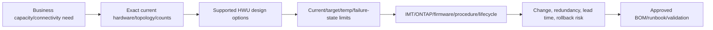

---

## 11. Evidence, recommendation, privacy, and escalation

### Evidence contract

| Evidence | Required fields |
|---|---|
| Inventory | System/controller/shelf/drive/adapter/switch serial, exact model/part/FRU, slot/port/bay, firmware |
| Topology | Endpoint cable map, role/protocol/speed, peer, path/fabric/stack, failure domain |
| Software | Exact ONTAP, feature/personality, relevant switch/module/drive firmware |
| HWU | Search scope, result/reference, notes, exact limits/rules, UTC date, authorized reviewer |
| Cross-sources | IMT config/date, platform/shelf/switch docs, release notes, lifecycle/support evidence |
| Change | Current/target/temporary/failure-state, BOM, owner, approvals, runbook, rollback/forward recovery |
| Validation | Identity, health, firmware, links/paths, failover, count/headroom, monitoring |

### Recommendation chain

```mermaid
flowchart LR
    OBS[Observed exact inventory/topology] --> HWU[Current HWU rule/limit/notes]
    HWU --> CROSS[IMT/ONTAP/docs/firmware/lifecycle]
    CROSS --> FIND[Verified finding/confidence/conflicts]
    FIND --> RISK[Availability/support/capacity/change risk]
    RISK --> OPT[Supported alternatives]
    OPT --> REC[Owner/date/BOM/runbook/prerequisites]
    REC --> PROOF[Post-change identity/health/path/headroom]
    PROOF --> RES[Residual risk/monitoring]
```

### Privacy/security

- Serial numbers, rack/port/cable maps, topology, firmware, lifecycle gaps, and support details are sensitive infrastructure data.
- Use authorized HWU accounts; never share credentials/session artifacts.
- Store full exports/BOMs/maps in approved repositories with least access.
- Redact serials, IPs, locations, contacts, and exact vulnerabilities from broad decks.
- Do not expose management credentials or configuration dumps in evidence tables.

### Escalation pack

- Customer/service/change question and impact.
- Exact platform/controller/serial/ONTAP/HA context.
- Exact adapter/part/slot/port/mode/firmware and shelf/drive/module/bay data.
- Endpoint-to-endpoint cable/topology/failure-domain map.
- Current/proposed/temporary/failure-state counts and headroom.
- HWU result/notes/date and authorized reviewer; IMT/config ID/date.
- Conflicting public docs/release/lifecycle/Support evidence.
- Actions tried, alternatives, deadline, confidence, exact clarification ask.

---

## 12. Fully synthetic sanitized scenario: hardware validation

> **Synthetic boundary:** `Maple Research`, all model/part/slot/port/shelf/drive/limit/firmware identifiers and findings are invented. No number or result below is a real NetApp specification or HWU output.

### Synthetic current/proposed inventory

| Element | Current synthetic value | Proposed synthetic value | Evidence status |
|---|---|---|---|
| Platform | `SYN-PLAT-20` HA pair | Same | Exact gated HWU check required |
| ONTAP | `SYN-O-1` | `SYN-O-2` | Release cross-check required |
| Slot 3 adapter | `SYN-ADP-A`, mode X | `SYN-ADP-B`, mode Y | Part/slot/mode rule unknown |
| Shelves | 3 x `SYN-SH-A` | +2 x `SYN-SH-B` | Mixing/topology/count unknown |
| Drives | `SYN-DRV-A/FW1` | Add `SYN-DRV-B/FW2` | Drive/shelf/platform/firmware rule unknown |
| Cabling | Dual paths through `SYN-SW-1/2` | Add shelf paths | Endpoint map incomplete |

### Synthetic gated HWU fallback extract

| Check | Authorized-owner synthetic response | Analyst classification |
|---|---|---|
| Adapter B in slot 3 | Not listed for this synthetic platform/release | Unsupported/unresolved; redesign or clarify |
| Shelf B attachment | Listed only through synthetic topology Z and note `SYN-N4` | Conditional candidate |
| Current + target shelf count | Below synthetic stated normal limit | Failure-state and temporary counts still required |
| Drive B in Shelf B | Listed with exact synthetic firmware | Candidate pending actual identity/firmware |

### Configuration graph

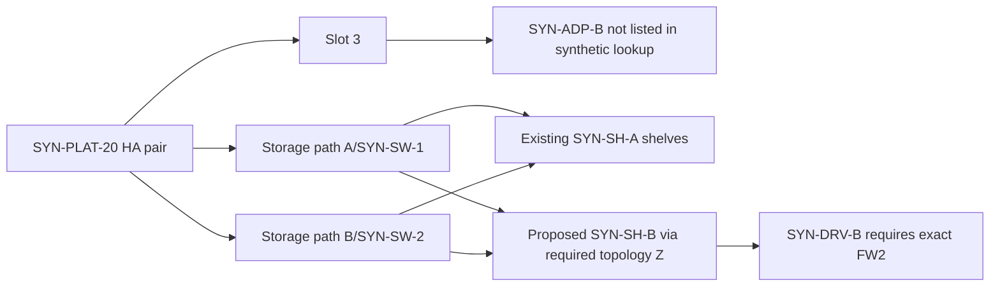

### Conflict analysis

| Observation | Unsafe statement | Safe action |
|---|---|---|
| Adapter fits physically | It is supported | Exact part/slot/mode/release lookup says otherwise in synthetic case |
| Shelf count below normal max | Expansion is safe | Validate topology, mixing, temporary and failure-state scope |
| Drive model looks similar | It can be substituted | Use exact part/firmware/shelf/platform evidence |
| Public diagram shows cabling | Any cable/transceiver works | Validate exact endpoint/media/speed/topology and procedure |

### Bounded recommendation

> **Finding:** The synthetic proposed adapter is not listed in the authorized HWU fallback, while the proposed shelf/drive path is conditional on exact topology and firmware; normal-state count alone is insufficient. **Risk:** proceeding could produce an unsupported slot configuration, broken redundancy, or firmware/topology mismatch. **Recommendation:** redesign the adapter choice/slot using a listed alternative or obtain authoritative clarification; complete the endpoint cable map and current/target/temporary/failure-state limit checks; cross-check IMT, ONTAP, lifecycle and exact shelf procedure. **Validation:** post-change exact inventory, firmware, link/path health, ownership, failover and headroom evidence. **Residual risk:** inaccessible HWU details remain owner-supplied dated evidence, never inferred values.

---

## 13. Discovery, JD Mapping, and honest transfer

### Discovery questions

1. Which exact customer service/design/change/incident is in scope?
2. Which platform/controller/serial/HA/personality and ONTAP release apply?
3. Which adapters/modules/parts/FRUs/risers/slots/ports/modes/firmware exist?
4. Which shelves/modules/drives/parts/bays/firmware/ownership/topology exist?
5. Which cables/transceivers/endpoints/speeds/protocols/failure domains apply?
6. Which current/proposed/temporary/failure-state limits need validation and at what scope?
7. What does current HWU say for the exact configuration and notes/date?
8. What do IMT, platform/shelf/switch docs, release notes, firmware and lifecycle sources add?
9. Are any values unlisted, conflicting, stale, gated, or inferred from memory?
10. What supported options, owner/date, runbook, proof, and residual risk follow?

### JD Mapping

| JD responsibility | Part 51 contribution | Your factual bridge and gap |
|---|---|---|
| Hardware/configuration validation | Exact model/part/slot/port/shelf/drive/topology method | Server/network evidence habits transfer; no NetApp design approval claimed |
| Install-base accuracy | Adds component/firmware/topology identity | Data reconciliation strengths transfer |
| Capacity/expansion planning | Scoped current/target/temp/failure-state limits/headroom | Capacity/change reasoning transfers |
| Proactive risk | Finds unsupported parts, topology, firmware, lifecycle and redundancy gaps | Incident/prevention discipline transfers |
| Upgrade/lifecycle | Cross-checks carry-forward hardware and replacements | Dependency planning transfers |
| Customer recommendation | Produces evidence-backed BOM/runbook/validation | Advisory communication transfers |

### Honest interview answer

> "I would start from exact live and physical identity: platform, controller, serial, ONTAP, adapter part/slot/port/mode/firmware, shelf/module/drive/bay, and cable endpoints. An authorized owner would retrieve current HWU results and notes; I would cross-check IMT, platform/shelf/switch docs, release notes, firmware and lifecycle. I would never quote a limit from memory or generalize a nearby model. I have not designed or installed production NetApp hardware."

---

## 14. Paper lab and self-test

### Paper lab

Build a synthetic hardware validation workbook for two HA pairs, four adapters, six shelves, forty-eight drives, two storage switches, and a proposed expansion.

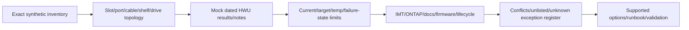

### Inject these cases

- Similar adapter family but wrong exact part.
- Correct part in an unsupported synthetic slot.
- Port mode conflict with intended role.
- Shelf model supported only under another topology.
- Drive model/firmware mismatch.
- Two apparent paths sharing one failure domain.
- Normal-state count below max but takeover headroom inadequate.
- Old design document conflicts with newer mock HWU result.
- Hardware listed but end-to-end IMT recipe unlisted.
- Lifecycle replacement with no supported carry-forward plan.

### Tasks

1. Build exact identity records for every physical entity and relationship.
2. Draw endpoint-to-endpoint cabling and failure domains.
3. Record exact mock HWU query scope, result, notes, date, and reviewer.
4. Separate per-port/adapter/controller/pair/cluster/stack limits.
5. Calculate current/proposed/temporary/failure-state values and headroom.
6. Cross-check IMT, ONTAP, public platform/shelf/switch procedures, firmware, lifecycle.
7. Freeze and escalate source conflicts rather than selecting a favorable value.
8. Produce a supported-option comparison, BOM, owner/date, runbook, validation, residual risk.
9. Build a sanitized service-review summary and technical escalation pack.
10. Answer Q1-Q8 aloud without quoting a real specification.

### Lab pass checklist

- [ ] Every hardware item uses exact model/part/serial/location identity.
- [ ] Platform, component, topology, software, firmware and lifecycle contexts are separate.
- [ ] No specification or limit comes from memory.
- [ ] Every number has scope, qualifiers, source, version/date, reviewer.
- [ ] Normal, target, temporary and failure states are all evaluated.
- [ ] Similar model/physical fit never proves support.
- [ ] HWU, IMT, ONTAP and procedure roles are not conflated.
- [ ] Source conflicts freeze the decision and receive an owner.
- [ ] Gated HWU uses an authorized dated extract.
- [ ] No production hardware design/install experience is claimed.

---

## 15. Official Source Anchors

**Date checked: 2026-08-24.** Public official NetApp sources only. HWU itself is gated; no live result or numeric specification is reproduced. Exact platform/release/current HWU checks are mandatory before customer use.

| Topic | Official public source | Bounded use |
|---|---|---|
| Gated hardware reference | [NetApp Hardware Universe](https://hwu.netapp.com/) | Authorized exact current hardware lookup; redirected sign-in confirms gated access |
| Hardware documentation hub | [ONTAP hardware systems documentation](https://docs.netapp.com/us-en/ontap-systems/index.html) | Current install, expand, upgrade and maintain navigation by platform/shelf/component |
| Hardware family navigation | [ONTAP hardware systems family](https://docs.netapp.com/us-en/ontap-systems-family/index.html) | Hardware/install/upgrade/switch/MetroCluster documentation boundaries |
| Drive shelves | [Drive shelves for ONTAP hardware systems](https://docs.netapp.com/us-en/ontap-systems/drive-shelves/index.html) | Current shelf-family procedures/navigation; exact system workflow required |
| FRU replacement | [System component replacement reference](https://docs.netapp.com/us-en/ontap-systems/fru-reference/index.html) | Exact model/component procedure navigation; does not authorize substitution |
| End-to-end interoperability | [Interoperability Matrix Tool overview](https://docs.netapp.com/us-en/interoperability-matrix-tool/index.html) | Cross-product supported-configuration workflow; does not replace HWU |
| ONTAP command reference | [ONTAP command reference](https://docs.netapp.com/us-en/ontap-cli/index.html) | Exact-release inventory/health command discovery; customer privilege/approval required |
| Hardware support access | [NetApp Support Site](https://mysupport.netapp.com/) | Authorized contract, case, downloads and clarification only |

### Source-use discipline

- Identify exact model/part/FRU/slot/port/shelf/drive/cable before lookup.
- Capture HWU search scope, notes, result/reference, reviewer and UTC date.
- Never quote a limit without scope, platform, version, topology and qualifiers.
- Cross-check actual inventory, IMT, ONTAP/release, procedures, firmware and lifecycle.
- Freeze decisions on source conflict or unlisted identity; obtain authoritative clarification.
- Protect serials, topology, firmware and support information.

---

## Likely Interview Questions

### Q1. What is Hardware Universe used for?

> **Model answer:** "HWU is NetApp's gated current hardware-configuration reference for exact platform/component specifications, combinations, rules and limits. I scope a lookup to exact model, part, slot, port, shelf, drive, ONTAP/topology context, notes and date, then cross-check actual inventory, IMT and platform procedures."

### Q2. How is HWU different from IMT?

> **Model answer:** "HWU answers hardware/platform/component configuration and limit questions. IMT validates exact end-to-end product/software/host/protocol/driver/firmware combinations. A card can be valid for a platform slot while the host recipe is unlisted, so neither replaces the other."

### Q3. Why do exact part and slot matter?

> **Model answer:** "Components in one family can have different electrical lanes, port personalities, firmware, exclusions and release support; slots/risers can share resources. Physical fit or a similar model does not prove support. I capture exact part/FRU, riser/slot/port/mode and platform/release."

### Q4. How do you validate a platform limit?

> **Model answer:** "I define the object and scope, record current/proposed/temporary/failure-state values, retrieve the exact current HWU maximum/minimum and all platform/ONTAP/topology notes, calculate headroom, cross-check procedures and obtain peer review. I never quote a naked number from memory."

### Q5. How would you assess a shelf expansion?

> **Model answer:** "Inventory exact platform/ONTAP, current shelf/module/drive/firmware/count/topology/ports; validate proposed shelf/drive mixing, attachment and scoped limits in current HWU; map redundant cable endpoints/failure domains; cross-check procedure/firmware/IMT/lifecycle; then define BOM, runbook, rollback and post-add health/path/headroom proof."

### Q6. What do you do when sources conflict?

> **Model answer:** "Freeze the recommendation, preserve all source versions/dates, confirm exact model/part/slot/release/topology, reopen current notes, identify whether HWU/product/IMT/Support/vendor owns the question, and obtain written clarification. I never choose the larger or more convenient value."

### Q7. Can a supported hardware component still create risk?

> **Model answer:** "Yes. It can be in the wrong slot/mode, run wrong firmware, violate topology or failure-state headroom, be cabled through one failure domain, be outside lifecycle, or participate in an unlisted IMT recipe. Supportability and operational correctness both need evidence."

### Q8. How does your background transfer, and what remains a gap?

> **Model answer:** "My prior support, server/network dependency mapping, inventory reconciliation and change-review work give me exact-evidence and cross-source habits. I have not used HWU to approve or physically install production NetApp hardware, so an authorized experienced hardware owner validates real lookups and procedures."

---

## 30-Second Memory Hooks

- **HWU:** Exact hardware configuration reference, gated and date-sensitive.
- **IMT:** End-to-end interoperability; HWU and IMT answer different questions.
- **Exact identity:** Platform + part + FRU + slot + port + mode + firmware.
- **Physical fit != supported:** Similar shape/model is not evidence.
- **Shelf expansion:** Shelf + module + drive + firmware + topology + count + path.
- **Cable:** Two exact endpoints, media, role, speed, path and failure domain.
- **Limit:** Object + scope + current/target/temp/failure + qualifiers + date.
- **Naked number:** Never acceptable.
- **HA headroom:** Validate surviving state, not only normal state.
- **Procedure:** Exact model and component; never borrow a neighboring workflow.
- **Conflict:** Freeze, preserve, scope, identify authority, clarify.
- **Gated HWU:** Authorized dated extract, not invented lookup.
- **Your bridge:** Evidence/change discipline transfers; hardware design/install does not.

---

## Completion Checklist

- [ ] Define HWU's purpose and boundary against IMT/product/procedure/lifecycle sources.
- [ ] Build platform-controller-riser-slot-adapter-port-shelf-drive-cable identities.
- [ ] Capture exact model/part/FRU/serial/location/mode/firmware.
- [ ] Validate platform/controller/HA/ONTAP context.
- [ ] Validate adapter slot/riser/lane/exclusion/port-mode dependencies.
- [ ] Validate shelf/module/drive/firmware/mixing/ownership/topology.
- [ ] Build endpoint-to-endpoint cable and failure-domain maps.
- [ ] Scope every limit per port/adapter/controller/pair/cluster/stack/configuration.
- [ ] Evaluate current, target, temporary and failure-state values/headroom.
- [ ] Cross-check HWU, IMT, ONTAP, platform/shelf/switch docs, firmware, lifecycle.
- [ ] Freeze and escalate conflicts or unlisted parts.
- [ ] Plan new design, expansion, replacement, refresh and lifecycle cases.
- [ ] Build secure evidence, recommendation and escalation packs.
- [ ] Recreate the synthetic Maple Research scenario.
- [ ] Complete the paper lab and answer Q1-Q8 aloud.
- [ ] State the No-production-NetApp boundary and exact non-claim accurately.
- [ ] Recheck current authorized HWU and exact source context before customer use.

---

*Next suggested section:* [Part 52 - Bugs, BURTs, Defects, Release Notes, and Bug-Scrub Methodology](Part-52-burts-defects-release-notes-bug-scrub.md)