# Part 52 - Bugs, BURTs, Defects, Release Notes, and Bug-Scrub Methodology

> **Section goal:** Learn to identify candidate defects, verify exact applicability and exposure, distinguish severity from probability and customer priority, evaluate fixed releases and workarounds, deduplicate overlapping sources, and communicate customer risk safely. By the end, Arti should be able to run a repeatable bug scrub across Bugs Online/BURT records, release notes, security advisories, Knowledge Base (KB) articles, Digital Advisor signals, AutoSupport, cases, and system evidence without fabricating private details or assuming every matching version is affected.

Covers index item **52** and maps directly to job-description responsibilities for proactive risk analysis, system stability, upgrade planning, customer-specific recommendations, support-case pattern analysis, recurring-issue reduction, secure evidence handling, and cross-functional escalation.

**Explicit nonclaim:** Arti has not performed a production NetApp BURT or bug scrub using gated defect information.

**Privacy and access boundary:** Private defect text, engineering notes, support cases, customer symptoms, attachments, and restricted fixes remain in approved need-to-know systems; customer-facing material is sanitized and source-bounded.

**Synthetic-evidence rule:** Every bug ID, symptom, trigger, release, date, workaround, fixed target, applicability result, and recommendation below is fictional and sanitized; no real private defect is reproduced.

**Version caveat:** Bugs Online records, BURT/defect fields, visibility, status, severity, affected products/releases, fixed releases, workarounds, release notes, advisories, KBs, and case guidance can change. A **current-doc check** means reopening the authorized current record and linked official sources, capturing publication/update dates, then verifying the customer's exact platform/release/protocol/feature/configuration/trigger at analysis and change time.

Many defect and release-note details require a NetApp account, entitlement, or case relationship. Public security advisories have a separate publication process. A missing public record does not prove no defect; a private reference cannot be copied into an unauthorized report. This guide does not disclose a real private bug, exploit, customer case, or restricted workaround.

> **No-production-NetApp boundary:** Arti does not claim production NetApp bug-scrub experience. Every defect/BURT ID, symptom, trigger, release, workaround, case, customer, exposure, and recommendation below is synthetic. Her factual strengths are Microsoft incident/problem management, known-issue correlation, release regression analysis, CRITSIT evidence, customer-safe RCA communication, SQL/Python/Excel data normalization, and support escalation. The explicit non-claim is: **she has not accessed a customer's private Bugs Online data, confirmed a production NetApp BURT, approved a NetApp fixed release/workaround, performed a customer bug scrub, or disclosed a private NetApp defect.**

---

## 1. Defect vocabulary and source boundaries

### Core terms

| Term | Plain meaning | Why it matters |
|---|---|---|
| **Bug/defect** | Product behavior that differs from intended/required behavior | Candidate explanation or proactive risk, not automatically customer exposure |
| **BURT** | NetApp support/engineering term commonly used for a tracked bug/defect record or identifier | Exact record fields and visibility must come from authorized current source |
| **Symptom** | Observable behavior when defect manifests | Must match customer evidence, not just a title |
| **Trigger** | Conditions/actions/state that cause manifestation | Version presence without trigger may mean no current exposure |
| **Affected configuration** | Exact product/release/platform/protocol/feature/state represented as affected | “Same release” alone is usually insufficient |
| **Fixed release** | Release identified by authoritative source as containing correction | Not automatically the customer's approved target/path |
| **Workaround** | Temporary/alternative action reducing or avoiding exposure | Can carry operational/security/support risk |
| **Severity** | Potential consequence under source's current classification | Different from probability and customer priority |
| **Exposure** | Evidence that the customer's exact trigger/configuration is present | Bridges generic defect to customer risk |
| **Bug scrub** | Structured review of candidate defects against an exact customer environment/change | Produces applicable, not-applicable, unknown, and action states |

### Plain-English deep-dive: a vehicle recall is not every car

A recall may affect one model year, engine, factory batch, and operating condition. Owning the brand does not mean your car is affected. Defect applicability works the same way: product, release, platform, feature, protocol, state, and trigger must match.

**Why it matters:** “customer runs affected version” is a candidate filter, not an exposure conclusion.

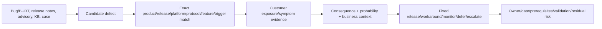

### Source roles

| Source | Best use | Access/interpretation boundary |
|---|---|---|
| Bugs Online/BURT record | Defect identity, affected/fixed context, symptoms/triggers/workaround where exposed | Gated/current; visibility and fields vary |
| Comprehensive release notes | Known issues, limitations, cautions, fixes/release context | Gated official source; exact version required |
| Public release highlights | New/enhanced feature orientation and link to detailed release material | Not a complete defect/fix list |
| Security advisory | Public product/CVE/severity/remediation status and update timeline | Security scope; always use latest update |
| KB | Diagnostic/procedure/workaround context | Public/gated and revision-sensitive; not necessarily defect authority |
| Support case | Customer-specific investigation and guidance | Private, need-to-know, not reusable as public truth |
| Digital Advisor | Proactive risk-to-system mapping | Freshness/applicability/access checks required |
| AutoSupport/logs | Actual customer configuration/symptom/timeline evidence | Sensitive and potentially partial |

---

## 2. The defect-to-customer evidence chain

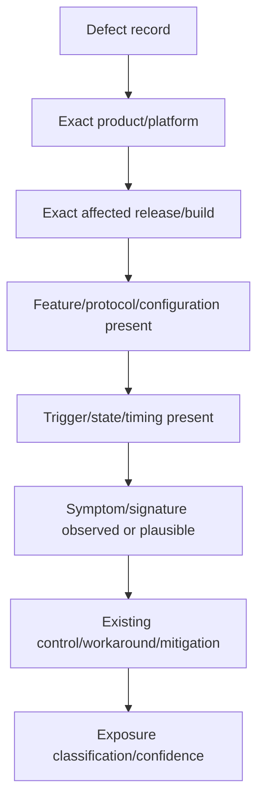

### Applicability fields

| Field | Question | Evidence |
|---|---|---|
| Defect identity | What exact record and current status? | Authorized record ID/title/update time |
| Product/platform | Does exact product/model/personality match? | Install base/HWU/current system evidence |
| Release/build | Is current/target/intermediate release listed in affected/fixed context? | Exact system version + current record/release notes |
| Protocol/feature | Is relevant NFS/SMB/SAN/NVMe/S3/replication/security/etc. enabled and used? | Live config plus workload map |
| Trigger | Are required sequence, load, topology, setting, operation, or timing conditions present? | Logs/config/change/workload evidence |
| Symptom | Does actual behavior/signature/timeline align? | Events/logs/case evidence |
| Frequency/probability | How often can trigger occur here? | Customer operations/history; do not invent |
| Consequence | What could happen under current authoritative description? | Source plus service impact mapping |
| Control | Is workaround/monitor/redundancy already effective? | Validated operational evidence |
| Fix | Which release contains fix, and is it usable as a target? | Current defect/release/upgrade/IMT/HWU evidence |

### Plain-English deep-dive: symptom similarity is a lead, not a fingerprint

Many illnesses cause fever. A similar symptom narrows investigation but does not identify the disease without tests and context. Storage latency, takeover, panic, disconnect, stale data, or job failure can also have many causes. **Why it matters:** preserve alternate hypotheses and seek discriminating evidence.

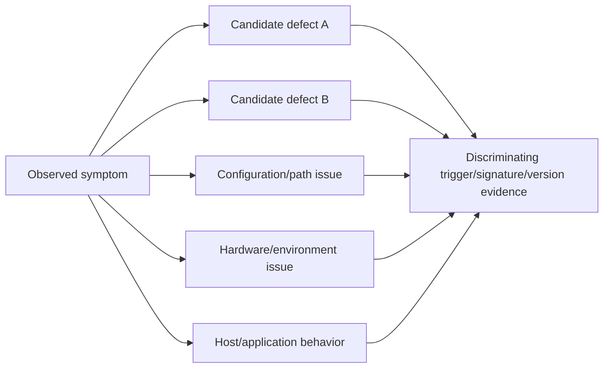

---

## 3. Candidate discovery without confirmation bias

### Inputs

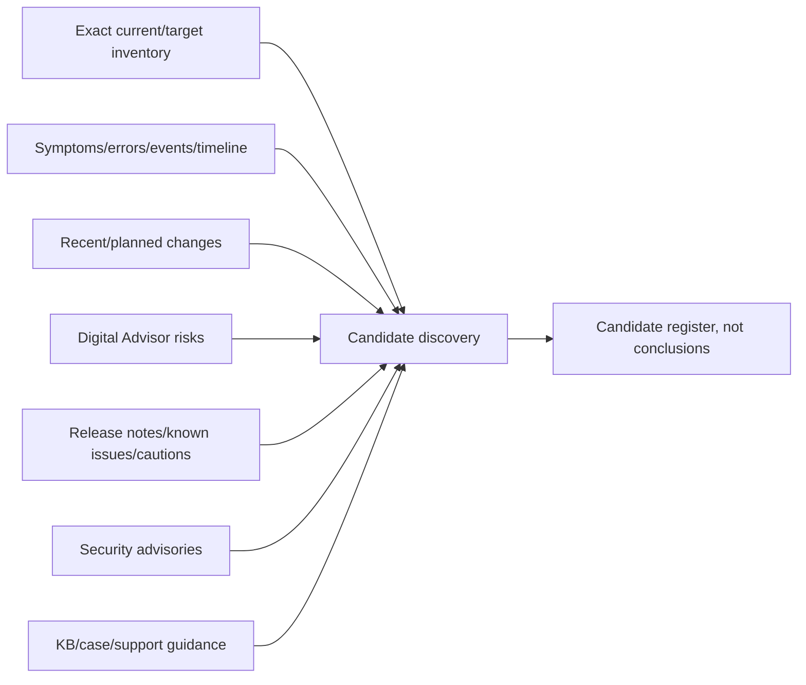

### Search tokens

- Exact product/platform and current/target/intermediate release.
- Protocol, feature, operation, configuration, topology, and component.
- Exact error/event/panic/signature text after secure redaction.
- Symptom and consequence, including timing/frequency.
- Recent change, upgrade, failover, load pattern, or environmental condition.
- Existing case/KB/advisory/risk identifiers.

### Candidate-register fields

| Field | Purpose |
|---|---|
| Candidate ID/source | Traceability and access classification |
| Title/summary | Sanitized orientation, not copied private text |
| Product/release/platform scope | First applicability gate |
| Protocol/feature/trigger | Exposure gates |
| Symptom/signature | Correlation gate |
| Affected/fixed/workaround fields | Current authoritative claims with update date |
| Alternate hypotheses | Prevent tunnel vision |
| Evidence gaps/owner/date | Make unknowns actionable |

### Search funnel

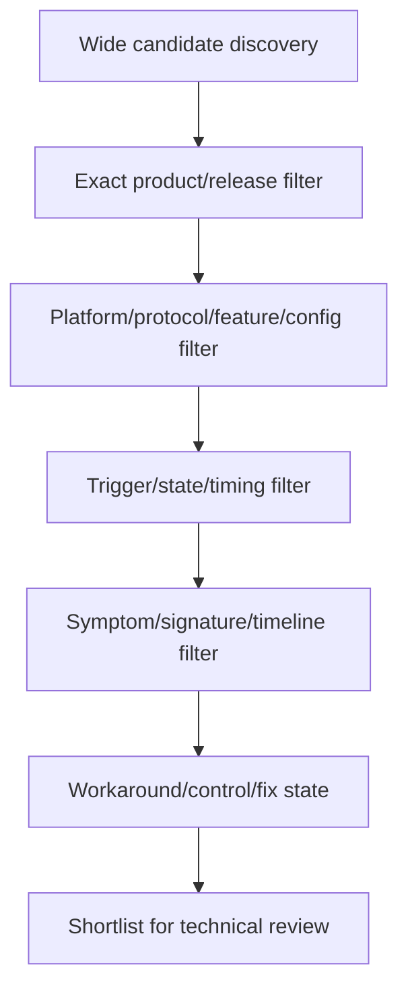

---

## 4. Applicability decisions

### Classification states

| State | Meaning | Required wording/action |
|---|---|---|
| Applicable/observed | Exact scope/trigger aligns and symptom evidence is present | Treat as strong candidate/confirmed only at authorized level; act/escalate |
| Applicable/exposed | Exact scope and trigger present, symptom not yet observed | Proactive risk; prioritize by consequence/probability |
| Potentially applicable | Some gates match; trigger/config evidence incomplete | Unknown pending named evidence |
| Not applicable | Authoritative gate clearly fails | Record reason/evidence/date; do not silently delete |
| Mitigated | Applicable but validated workaround/control reduces exposure | Monitor workaround validity/residual risk |
| Fixed in current state | Authoritative fixed release installed and validation supports absence | Keep evidence; do not claim universal immunity |
| Unknown/access-limited | Required record or customer evidence unavailable | Do not infer favorable result; assign owner/date |
| Disputed | Sources or system evidence conflict | Escalate and freeze irreversible recommendation |

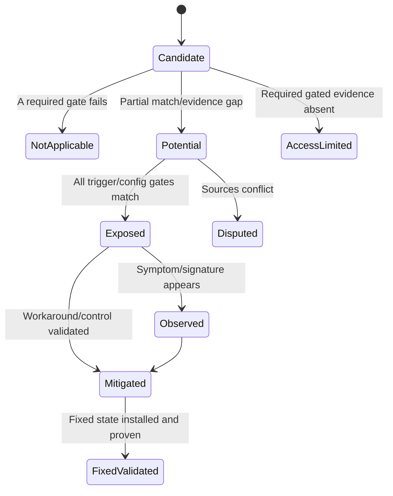

### Applicability matrix

| Gate | Match | No match | Unknown |
|---|---|---|---|
| Product/platform | Continue | Not applicable | Obtain exact identity |
| Release/build | Continue | Not applicable under current record | Obtain exact/current/target release evidence |
| Protocol/feature/config | Continue | Not applicable | Query configuration/workload owner |
| Trigger/state/timing | Exposed candidate | Not currently exposed | Collect operational evidence |
| Symptom/signature | Observed candidate | Proactive only/alternate cause | Collect logs/case evidence |
| Control/workaround | Mitigated candidate | Unmitigated | Validate implementation/effect |

---

## 5. Severity, probability, exposure, and customer priority

### Plain-English deep-dive: storm strength is not your flood risk

A powerful storm can be low priority for a city outside its path; a smaller storm directly over an unprotected hospital can be urgent. Defect severity describes potential consequence, while customer priority also needs exposure probability, business criticality, controls, and timing.

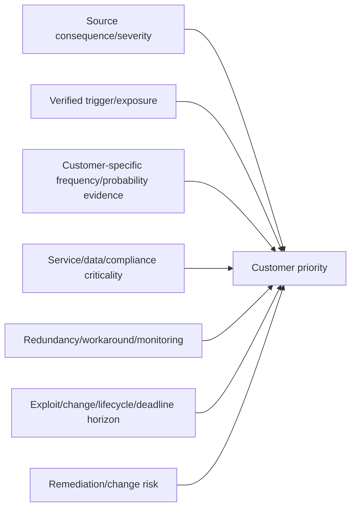

### Keep dimensions separate

| Dimension | Meaning | Anti-pattern |
|---|---|---|
| Severity | Potential consequence if manifested | Assuming it will happen |
| Probability/frequency | Likelihood under this customer's operations | Inventing percentages without data |
| Exposure | Exact trigger/config present | Treating release match alone as exposure |
| Business impact | Effect on service/data/compliance/recovery | Copying generic impact without service map |
| Detectability | Ability to identify precursor/occurrence | Calling monitoring a prevention control |
| Remediation urgency | Deadline considering all dimensions | Equating vendor severity with change priority |

### Qualitative priority record

Use evidence labels rather than fake precision:

- **Consequence:** Critical/High/Medium/Low according to current source, quoted with date.
- **Exposure:** Confirmed/Likely/Possible/Unlikely/Unknown under locally defined evidence rules.
- **Confidence:** High/Medium/Low/Unknown with named gaps.
- **Priority:** Now/next window/roadmap/monitor/defer/accept, approved by accountable owner.

---

## 6. Fixed releases, workarounds, and target selection

A fixed release is not automatically the right customer target. Validate support status, upgrade path, platform, IMT/HWU, host/app/protocol, other defects, capacity, protection, NDO claim, and business timing.

### Plain-English deep-dive: one repaired bridge does not choose the route

A route planner does not send every truck over the first bridge with one repaired crack; it also checks road class, vehicle height, other closures, distance, weather, and the roads needed to reach it. A fixed release similarly resolves one tracked issue but still must fit the customer's complete supported path and risk profile.

**Why it matters:** “contains the fix” and “is the approved target” are separate conclusions.

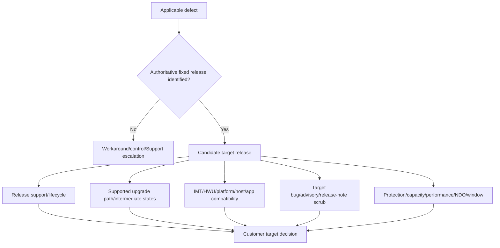

### Workaround assessment

| Question | Evidence |
|---|---|
| Is workaround current and authoritative? | Current bug/KB/Support source/date |
| Does exact customer config permit it? | ONTAP/IMT/HWU/app/security/change validation |
| Does it reduce trigger, symptom, or consequence? | Mechanism and controlled test |
| What side effects exist? | Performance, availability, security, operations, support |
| Is it reversible? | Runbook/rollback and preserved pre-state |
| How long may it remain? | Owner/expiry/review and target fix plan |
| How is effectiveness monitored? | Trigger/symptom/health metrics and alert owner |

### Workaround lifecycle

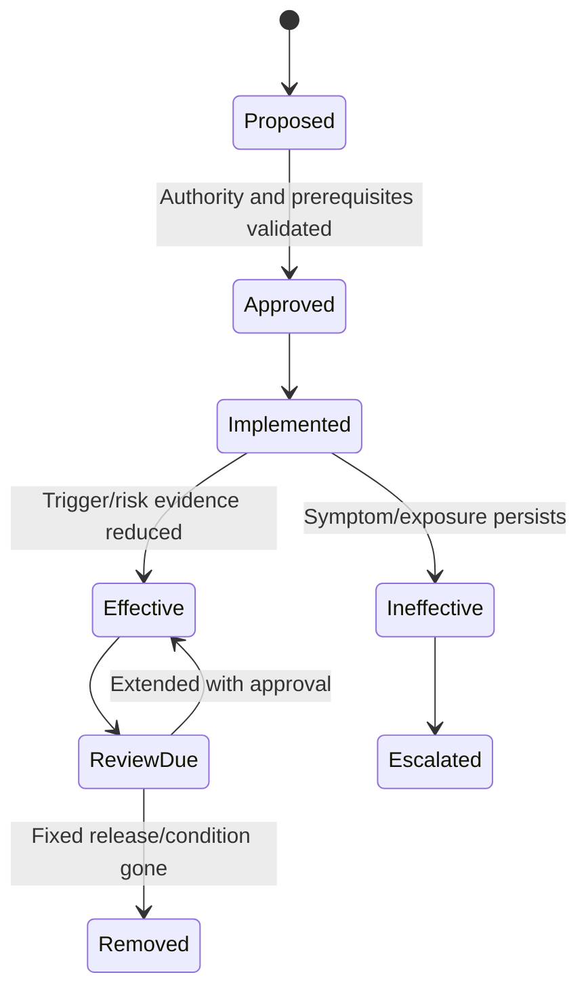

---

## 7. Release notes, advisories, KBs, and cases

### Release-source relationship

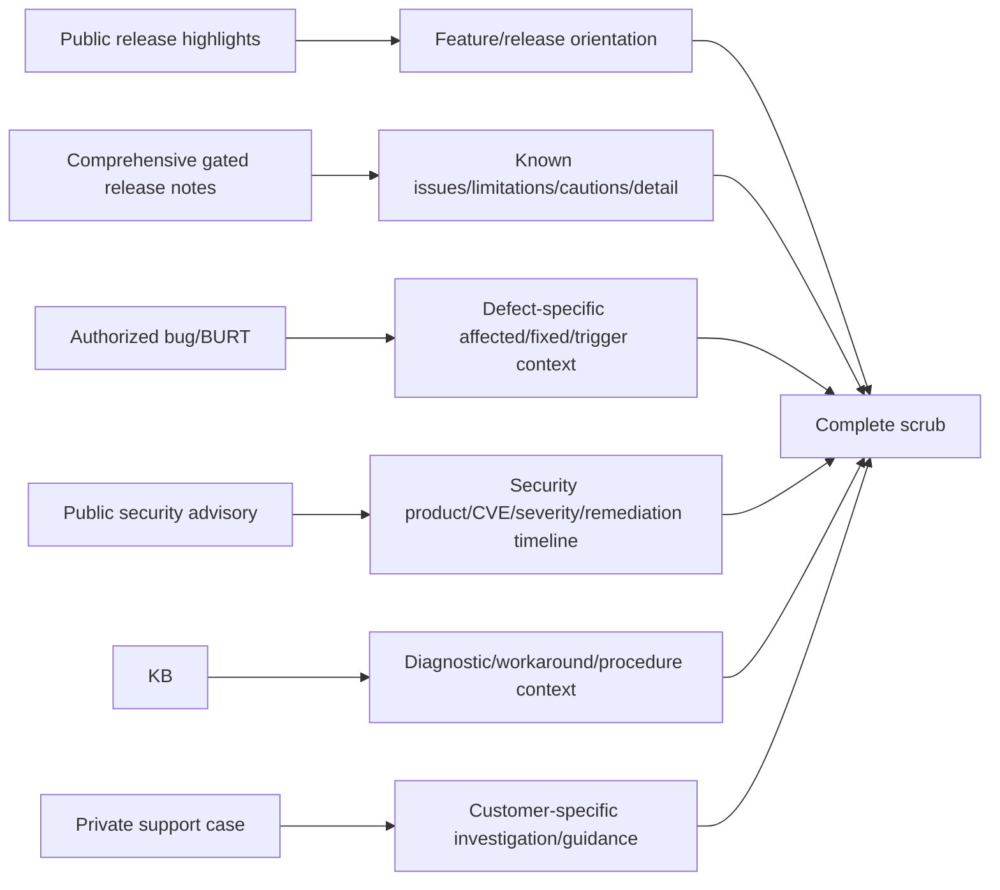

### Security advisory discipline

- Use the current updated advisory, not an old cached copy.
- Match exact product/version and affected/unaffected/remediation table.
- Keep CVSS/vendor severity separate from customer exposure/priority.
- Do not infer exploitability or share private exploit detail.
- Track advisory update time because product status can evolve.
- Coordinate security, storage, risk, application, and change owners.

### Public/private handling

| Information | Safe handling |
|---|---|
| Public advisory/release highlight | Link and quote narrowly with publication/update date |
| Gated bug/release notes/KB | Share only with authorized audience; sanitize summaries |
| Private case/customer logs | Keep in approved case repository; minimum necessary access |
| Internal engineering hypothesis | Label hypothesis; do not present as published defect |
| Fixed release/workaround | Cite current authoritative record and approval context |
| Security details | Follow coordinated disclosure and customer policy |

---

## 8. Deduplication and evidence normalization

One underlying defect can appear as a Digital Advisor risk, Bugs Online record, release-note entry, KB, case reference, and security advisory. Preserve source IDs while avoiding duplicate customer actions.

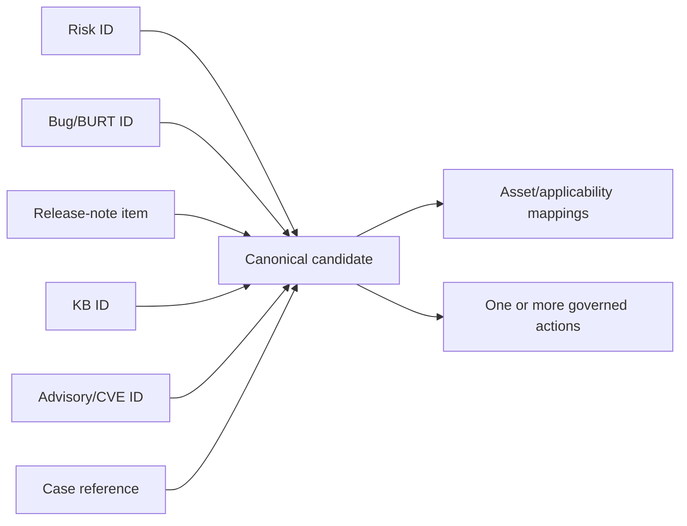

### Dedup keys

- Exact authoritative defect/advisory identifiers and cross-references.
- Product/release/platform/feature/trigger/symptom signature.
- Fixed-release/workaround relationship.
- Source update/version times.
- Affected-system mappings.

### Do not merge when

- Similar symptom has different trigger/root cause.
- One advisory covers a dependency while another covers product integration.
- Different fixed releases or workarounds apply.
- Private case hypothesis lacks authoritative defect cross-reference.
- Product/platform/protocol scopes differ.

### Canonical record

| Field group | Content |
|---|---|
| Identity | Local canonical ID, authorized defect/advisory/KB/release/case references |
| Definition | Sanitized symptom, trigger, consequence, source dates |
| Scope | Products, releases, platforms, protocols, features, configurations |
| Resolution | Fixed releases, workaround/control, limitations, authority |
| Customer mapping | Assets/services, applicability, exposure, evidence, confidence |
| Action | Priority, owner/date, prerequisites, validation, residual risk |

---

## 9. Bug-scrub workflow

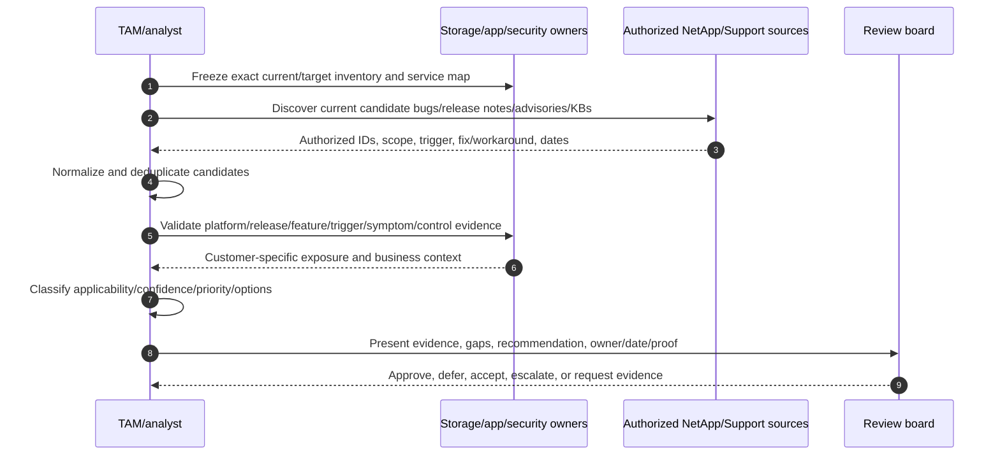

### Scrub phases

1. **Scope:** customer, services, assets, current/target/intermediate releases, cutoff.
2. **Discover:** Bugs Online, release notes, advisories, KB, Digital Advisor, cases, symptoms.
3. **Normalize:** IDs, source/access, products, releases, trigger, symptom, fixed/workaround, dates.
4. **Deduplicate:** canonical issue and source crosswalk, preserving distinct scopes.
5. **Apply:** exact environment gates and customer evidence.
6. **Prioritize:** severity, exposure probability, business impact, controls, deadline, change risk.
7. **Recommend:** fix/workaround/monitor/defer/accept/escalate options.
8. **Govern:** owner/date/prerequisites/approval/secure evidence.
9. **Validate:** post-change/fix/workaround symptom, trigger, telemetry, service outcome.
10. **Refresh:** rerun before upgrade/change because records evolve.

### Decision tree

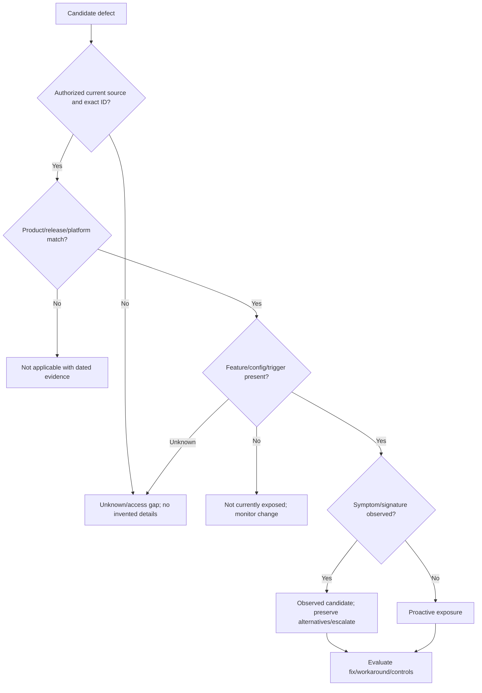

---

## 10. Customer-safe wording and recommendation engineering

### Avoid

- “You definitely have this bug” based only on release match.
- “Upgrade to X; it fixes everything.”
- “Critical means it will happen soon.”
- “No public bug exists, so the product is defect-free.”
- “The workaround is harmless.”
- Copying private bug/case text into a broad customer deck.

### Use

> “Authorized source `<ID>` updated `<date>` describes `<sanitized condition>` for `<exact scope>`. Customer evidence confirms `<matching gates>` and does not yet confirm `<gaps>`, so applicability is `<state/confidence>`. Potential consequence is `<source-bounded statement>`; customer-specific exposure/priority is `<evidence>`. Options are `<fixed target/workaround/monitor/escalate>` subject to `<dependencies>`. Owner/date/proof/residual risk are `
`."

### Recommendation flow

```mermaid
flowchart LR
    SOURCE[Authorized current defect evidence] --> APPLY[Exact customer applicability]
    APPLY --> FIND[Finding/state/confidence/gaps]
    FIND --> RISK[Consequence/exposure/business priority]
    RISK --> OPTIONS[Fix/workaround/monitor/defer/accept/escalate]
    OPTIONS --> REC[Owner/date/prerequisites/approvals]
    REC --> VALID[Trigger/symptom/service/post-change validation]
    VALID --> RES[Residual risk/refresh cadence]
```

---

## 11. Troubleshooting and escalation

### Evidence conflicts

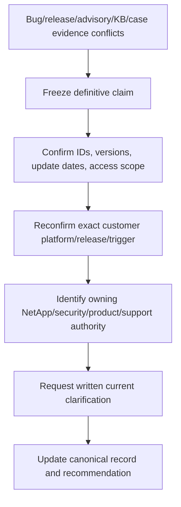

### Escalation pack

- Customer/business impact and affected services/assets.
- Exact platform/product/current/target/intermediate release and topology.
- Exact protocol/feature/config/trigger/workload state.
- UTC symptom/change timeline, logs/events/signatures, frequency.
- Candidate defect/advisory/release/KB IDs, source/update dates, access classification.
- Applicability matrix, confidence, evidence gaps, alternate hypotheses.
- Current controls/workaround and observed effectiveness/side effects.
- Fixed-release target dependencies: path, IMT/HWU, app, protection, capacity, other defects.
- Secure evidence location, actions tried/results, exact specialist question.

### Root-cause boundary

An applicable defect can be:

- A proactive exposure with no incident.
- A contributing factor rather than primary cause.
- A strong candidate pending private engineering confirmation.
- The confirmed root cause only at the evidence/authority level supported by the case.

Do not promote a candidate to confirmed root cause because a title sounds similar.

---

## 12. Fully synthetic sanitized scenario: bug scrub

> **Synthetic boundary:** `Pine Aerospace`, `SYN-BURT-5201`, `SYN-KB-77`, all releases, symptoms, triggers, cases, fixes, workarounds, and decisions are invented. No real NetApp defect is represented or implied.

### Synthetic candidate

| Field | Synthetic value |
|---|---|
| Defect | `SYN-BURT-5201` |
| Sanitized symptom | Intermittent path recovery delay after a specific failover sequence |
| Affected scope | Synthetic platform P + ONTAP `SYN-R1` + protocol Q + setting Z |
| Trigger | Failover during synthetic host retry state with setting Z enabled |
| Fixed release | `SYN-R2` according to fictional authorized record |
| Workaround | `SYN-KB-77`; temporary setting change with synthetic performance caveat |
| Source updated | `2026-08-20` (fictional) |

### Synthetic fleet applicability

| Cluster | Release/platform | Protocol/setting | Trigger evidence | Symptom | Classification |
|---|---|---|---|---|---|
| `PA-01` | Exact match | Exact match | Observed sequence | Matching logs | Observed candidate, high confidence; alternate causes retained |
| `PA-02` | Exact match | Setting Z disabled | Trigger absent | None | Not currently exposed |
| `PA-03` | Different platform | Similar protocol | N/A | Similar latency | Not applicable to this defect; investigate alternatives |
| `PA-04` | Exact match | Unknown setting | Unknown | None | Potential/unknown; owner action |

### Applicability graph

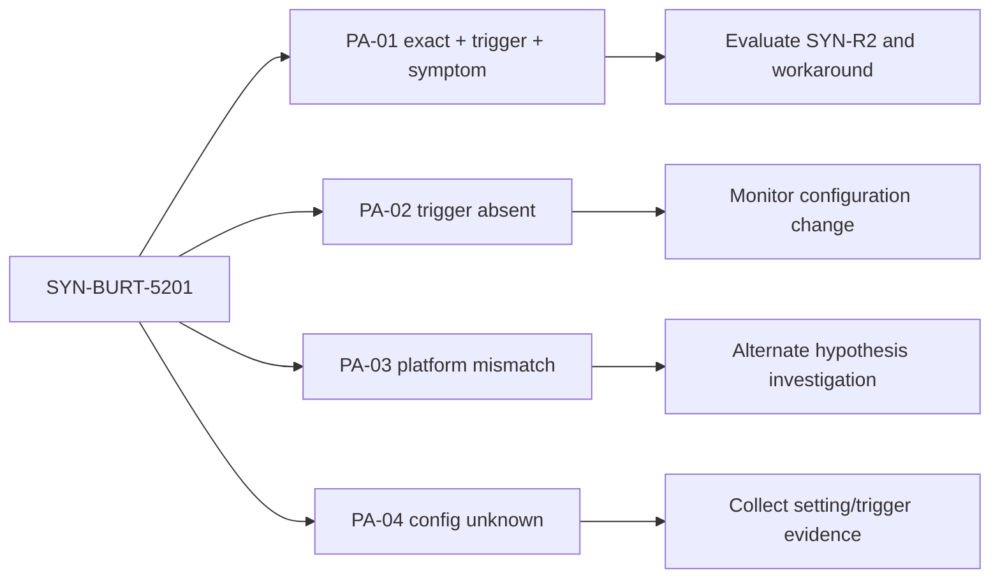

### Target decision

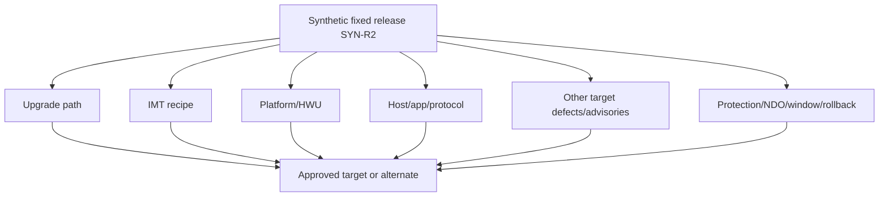

### Bounded recommendation

> **Finding:** Synthetic `PA-01` matches product/release/protocol/setting/trigger and has aligned symptoms, while `PA-02`, `PA-03`, and `PA-04` have different applicability states. **Risk:** `PA-01` can experience path-recovery delay under the documented fictional trigger; `PA-04` remains unknown. **Recommendation:** NetApp Support and the storage/SAN/application owners should confirm the candidate at the appropriate authority, validate the workaround's side effects, complete `SYN-R2` upgrade-path/IMT/HWU/app/target-scrub checks, and collect `PA-04` configuration. **Validation:** controlled path/failover and service evidence after mitigation/fix, with alternate hypotheses still tested. **Residual risk:** a fixed release does not remove unrelated path, configuration, or defect risk.

---

## 13. Discovery, JD Mapping, and Arti transfer

### Discovery questions

1. Which customer services/assets and current/target/intermediate releases are in scope?
2. What exact symptom/signature/timeline/frequency/trigger/change is observed?
3. Which authorized Bugs Online/BURT, release-note, advisory, KB, case, or Digital Advisor records are candidates?
4. Which product/platform/release/protocol/feature/configuration gates match?
5. Is the trigger present, and is the symptom observed or only proactively possible?
6. What severity/consequence does the source state, and what is customer-specific exposure/probability/priority?
7. Which workaround/control exists, who approved it, what side effects/expiry/monitoring apply?
8. Which fixed release is identified, and is it a valid supported customer target/path?
9. Which duplicate records/cross-references map to one canonical issue?
10. Which evidence is private/gated/unknown, and who owns clarification?

### JD Mapping

| JD responsibility | Part 52 contribution | Arti's factual bridge and gap |
|---|---|---|
| Proactive risk/stability | Applies defects to exact customer exposure and controls | Microsoft known-issue/problem management transfers |
| Upgrade planning | Validates fixed release as one target input and scrubs target | Release/change analysis transfers; no NetApp target approval claimed |
| Case/support improvement | Builds reproducible candidate/alternate/escalation evidence | CRITSIT and support escalation transfer |
| Customer recommendations | Separates severity, probability, applicability, business priority | Customer-safe risk communication transfers |
| Data analysis | Normalizes/deduplicates sources and asset mappings | SQL/Python/Excel strengths transfer |
| Security/privacy | Handles public/private advisory, bug, KB, case boundaries | Enterprise evidence handling transfers |

### Honest interview answer

> "I would create a candidate register from authorized bugs, release notes, advisories, KBs, cases and telemetry, then deduplicate by authoritative IDs and scope. For each candidate I would verify exact product, release, platform, protocol, feature, trigger and symptom, separate severity from customer exposure/probability, and evaluate workaround or fixed release with all upgrade dependencies. My production defect experience is Microsoft, not NetApp Bugs Online, so I would use current authorized records and never invent private details."

---

## 14. Paper lab and self-test

### Paper lab

Create a synthetic bug scrub for ten systems, two current releases, two proposed targets, and fifteen invented defect/advisory/KB candidates.

```mermaid
flowchart LR
    SCOPE[Freeze fleet/releases/services] --> DISC[Discover synthetic candidates]
    DISC --> NORM[Normalize IDs/scope/trigger/fix/workaround/date]
    NORM --> DEDUP[Deduplicate/cross-reference]
    DEDUP --> APPLY[Apply customer evidence gates]
    APPLY --> PRIOR[Consequence/exposure/probability/priority]
    PRIOR --> ACTION[Fix/workaround/monitor/defer/escalate]
    ACTION --> REVIEW[Peer review and refresh]
```

### Inject these cases

- Release match but platform mismatch.
- Exact scope/trigger with no observed symptom.
- Similar symptom from a different root cause.
- Fixed release that fails one IMT dependency.
- Workaround with performance/security side effect and expiry.
- Same defect in bug record, release note, KB, Digital Advisor and case.
- Two similar symptoms that must not be deduplicated.
- Gated record unavailable to analyst.
- Security advisory updated after initial scrub.
- Target release introduces a different high-priority candidate.

### Tasks

1. Build source/access/update metadata and canonical candidate crosswalks.
2. Apply product/release/platform/protocol/feature/trigger/symptom/control gates.
3. Classify each asset Applicable observed, Exposed, Potential, Not applicable, Mitigated, Fixed, Unknown, or Disputed.
4. Record severity, exposure, probability evidence, business impact, confidence, and priority separately.
5. Evaluate fixed target and workaround authority, dependencies, side effects, expiry and monitoring.
6. Preserve alternate hypotheses and discriminating checks.
7. Write customer-safe action records and a private technical escalation pack.
8. Re-run after a fictional advisory/update and record changed decisions.
9. Peer-review public/private handling and overclaims.
10. Answer Q1-Q8 aloud without naming a real bug.

### Lab pass checklist

- [ ] Every defect ID and all details are explicitly synthetic.
- [ ] Matching release alone never proves applicability.
- [ ] Symptom similarity never proves root cause.
- [ ] Severity, exposure, probability, confidence and priority remain separate.
- [ ] Fixed release is validated as a complete target/path.
- [ ] Workaround has authority, side effects, expiry and proof.
- [ ] Dedup preserves distinct triggers/scopes/source IDs.
- [ ] Public/private/gated boundaries are respected.
- [ ] Unknown evidence has an owner/date.
- [ ] No production NetApp bug-scrub experience is claimed.

---

## 15. Official Source Anchors

**Date checked: 2026-08-24.** Public official NetApp sources only. Bugs Online and comprehensive ONTAP release notes require authorized sign-in; this Part cites entry points and method, not any real defect detail.

| Topic | Official public/gated source | Bounded use |
|---|---|---|
| Bugs Online | [NetApp Bugs Online](https://mysupport.netapp.com/site/bugs-online) | Authorized current bug/BURT records only; visibility/fields vary |
| ONTAP comprehensive release notes | [ONTAP 9 Release Notes](https://library.netapp.com/ecm/ecm_download_file/ECMLP2492508) | Gated known issues/limitations/cautions/release details; exact version required |
| Public release orientation | [ONTAP release highlights](https://docs.netapp.com/us-en/ontap/release-notes/index.html) | Public features/highlights and links; explicitly directs known issues/cautions to gated release notes |
| Security advisories | [NetApp Security Advisories](https://security.netapp.com/advisory/) | Public searchable advisory/CVE/severity/published/updated/product context; use latest update |
| Knowledge Base | [NetApp Knowledge Base](https://kb.netapp.com/) | Public/gated diagnostics/procedures; current authorization and revision required |
| Support cases | [NetApp Support Site](https://mysupport.netapp.com/) | Customer-private case evidence and authorized escalation only |
| Digital Advisor risks | [View risks and take corrective actions](https://docs.netapp.com/us-en/active-iq/task_view_risk_and_take_action.html) | Proactive risk/action mapping; freshness/applicability checks required |
| Upgrade preparation | [Prepare to upgrade ONTAP](https://docs.netapp.com/us-en/ontap/upgrade/prepare.html) | Upgrade planning context; not a defect-specific support decision |

### Source-use discipline

- Record exact authoritative ID, source/access class, publication/update and evidence dates.
- Verify exact product/release/platform/protocol/feature/configuration/trigger/symptom.
- Preserve gated/private text in approved systems; use sanitized customer-safe summaries.
- Recheck fixed release/workaround and target dependencies before action.
- Keep candidate, applicable, exposed, observed, mitigated, fixed and confirmed-root-cause states distinct.
- Never invent a bug/BURT, CVE, fixed release, workaround, severity, probability or NetApp position.

---

## Likely Interview Questions

### Q1. What is a bug scrub?

> **Model answer:** "It is a structured review of candidate Bugs Online/BURT records, release notes, advisories, KBs, cases and telemetry against an exact customer current/target environment. It produces applicable, exposed, observed, mitigated, not-applicable, unknown and action states with evidence, owners and dates."

### Q2. Does an affected release match prove the customer has the bug?

> **Model answer:** "No. I also verify exact product/platform, protocol/feature/configuration, trigger/state/timing and symptom/signature. A release match is only an early filter. Missing trigger can make it not currently exposed; similar symptoms require alternate hypotheses."

### Q3. How do severity, probability, and priority differ?

> **Model answer:** "Severity is potential consequence under the source's classification. Probability/frequency is customer-specific likelihood under actual trigger conditions. Priority adds exposure, service criticality, controls, deadline and remediation risk. I keep them separate and avoid invented numeric scores."

### Q4. How do you evaluate a fixed release?

> **Model answer:** "I confirm the fixed release from a current authoritative record, then validate support lifecycle, upgrade path/intermediate states, IMT/HWU, host/application/protocol, target bugs/advisories, protection, capacity, NDO, maintenance window and rollback limits. A fix is one target input, not automatic approval."

### Q5. What makes a workaround acceptable?

> **Model answer:** "Current authoritative guidance, exact customer applicability, approved change/security/support review, understood side effects, reversibility, expiry/owner, monitoring and evidence that it reduces trigger or consequence. It remains temporary unless the accountable owner approves otherwise."

### Q6. How do you deduplicate bug information?

> **Model answer:** "I create a canonical issue with cross-references to authoritative bug, advisory, release, KB, Digital Advisor and case IDs, then retain affected-asset mappings and actions. I do not merge similar symptoms when triggers, scopes, fixes or workarounds differ."

### Q7. How do you discuss private defect information with a customer?

> **Model answer:** "I keep private/gated text in approved need-to-know systems, use a sanitized source-bounded statement for the authorized audience, cite dates/IDs only where allowed, and focus on verified applicability, risk and action. I never copy private case or engineering detail into a broad deck."

### Q8. How does your background transfer, and what remains a gap?

> **Model answer:** "Microsoft incident/problem management gave me known-issue correlation, release regression, alternate-hypothesis and customer-safe RCA discipline; analytics skills support normalization and deduplication. I have not run a production NetApp bug scrub or accessed private Bugs Online data, so authorized current sources and reviewers remain explicit."

---

## 30-Second Memory Hooks

- **Bug/BURT:** Tracked defect candidate; current authorized record controls details.
- **Release match:** Candidate filter, not exposure proof.
- **Applicability ladder:** Product -> release -> platform -> feature -> trigger -> symptom -> control.
- **Symptom:** Lead, not fingerprint.
- **Severity:** Consequence; **probability:** likelihood; **priority:** customer decision.
- **Exposed:** Trigger present; **observed:** symptom evidence also present.
- **Fixed release:** Contains fix, not automatically approved target.
- **Workaround:** Authority + applicability + side effects + expiry + monitoring.
- **Dedup:** One canonical issue, many source IDs and asset mappings.
- **Public/private:** Sanitize, authorize, date, never disclose restricted detail.
- **Unknown:** Evidence action, not a favorable assumption.
- **Root cause:** Candidate becomes confirmed only at supported evidence/authority level.
- **Refresh:** Records and advisories evolve; rerun before change.
- **Arti's bridge:** Microsoft problem discipline transfers; NetApp bug authority does not.

---

## Completion Checklist

- [ ] Define bug, defect, BURT, symptom, trigger, affected configuration, fixed release, workaround, severity, exposure, and scrub.
- [ ] Distinguish Bugs Online, release notes/highlights, advisories, KBs, cases, Digital Advisor and AutoSupport.
- [ ] Build the exact applicability evidence chain.
- [ ] Discover candidates without confirmation bias and preserve alternates.
- [ ] Classify Applicable observed/Exposed/Potential/Not applicable/Mitigated/Fixed/Unknown/Disputed.
- [ ] Separate severity, probability, exposure, impact, confidence and priority.
- [ ] Validate fixed release as a complete supported target/path.
- [ ] Validate workaround authority, side effects, expiry, monitoring and proof.
- [ ] Deduplicate source records without merging distinct defects.
- [ ] Apply public/private/gated access and secure handling.
- [ ] Write customer-safe findings and recommendation chains.
- [ ] Build a complete technical escalation pack.
- [ ] Recreate the fully synthetic Pine Aerospace scenario.
- [ ] Complete the paper lab and answer Q1-Q8 aloud.
- [ ] State the No-production-NetApp boundary and exact non-claim accurately.
- [ ] Recheck current authorized defect/release/advisory sources before customer use.

---

*Next suggested section:* [Part 53 - Software, Hardware, Firmware, and Support Lifecycle Management](Part-53-lifecycle-management.md)