# Part 53 - Software, Hardware, Firmware, and Support Lifecycle Management

> **Section goal:** Build a current, source-backed lifecycle view across ONTAP, hardware, firmware, host operating systems, hypervisors, switches, applications, contracts, and customer services. By the end, Arti should be able to use source-native lifecycle terminology, distinguish availability from support and entitlement, calculate risk horizons, expose dependency deadlines, and produce a multi-year roadmap tied to budget, maintenance windows, ownership, and validation.

Covers index item **53** and maps directly to job-description responsibilities for proactive lifecycle risk, install-base management, upgrade and refresh strategy, contract/renewal planning, customer-specific roadmaps, service reviews, technical-debt reduction, and cross-functional program governance.

**Explicit nonclaim:** Arti has not owned a production NetApp lifecycle roadmap or approved a live product-support milestone.

**Privacy and access boundary:** Customer inventory, contracts, entitlement, budgets, procurement plans, support dates, and migration decisions require authorized access and controlled disclosure.

**Synthetic-evidence rule:** Every release, platform, firmware, milestone, support date, contract date, roadmap, and result below is fictional and sanitized unless directly cited as a public definition; no synthetic date is a vendor commitment.

**Version caveat:** Release cadence, support capabilities, End of Availability (EOA), End of Support (EOS), Last Ship, software-version support, product communications, contract terms, firmware availability, and third-party vendor lifecycle dates can change. A **current-doc check** means reopening the exact official product/version/policy/contract/vendor source, recording its published/updated/evidence dates, and validating dependencies immediately before budget, roadmap, support, purchase, or change decisions.

This Part deliberately avoids inventing NetApp lifecycle stage labels. It uses current source-native terms and stores the underlying support capabilities/dates instead of translating them into undocumented colors such as “mainstream,” “extended,” or “obsolete.” Customer contract entitlement is separate from product/version lifecycle and must be confirmed through authorized systems.

> **No-production-NetApp boundary:** Arti does not claim production NetApp lifecycle ownership. Every platform, release, firmware, date, contract, customer, budget, and roadmap example below is synthetic. Her factual strengths are Microsoft product/service lifecycle planning, Azure/M365 change governance, Windows/network dependency coordination, customer roadmaps, inventory analytics, risk registers, and executive communication. The explicit non-claim is: **she has not approved a NetApp lifecycle roadmap, interpreted a customer's NetApp contract, committed a NetApp support date, selected a production ONTAP target, or executed NetApp firmware/hardware refresh.**

---

## 1. Lifecycle is a dependency system

Lifecycle management is the controlled alignment of product availability, vendor support, software/firmware versions, customer entitlement, compatibility, business use, and replacement/upgrade execution over time.

### Plain-English deep-dive: the weakest passport controls the trip

A travel group can leave only when every required passport, visa, ticket, and connection remains valid. One expired document can block the whole journey. A storage service similarly depends on ONTAP, controllers, shelves, adapters, firmware, hosts, switches, hypervisors, applications, and contracts.

**Why it matters:** a current ONTAP release cannot rescue an expired host dependency or unsupported hardware platform.

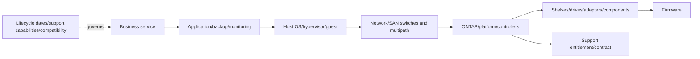

### Core terms

| Term | Source-native/plain meaning | Important boundary |
|---|---|---|
| **End of Availability (EOA)** | Current NetApp policy defines it as the last date a product is available for quoting from NetApp's price list | EOA is not automatically End of Support |
| **Last Ship** | Current policy defines it as the last date NetApp ships a product for which a purchase order was placed | Shipping date is not support expiry |
| **End of Support (EOS)** | Current policy defines it as the last date a product is supported by NetApp | Exact product/contract/policy evidence required |
| **Software Version Support** | Source describing support capabilities for particular software versions/releases | Do not replace capability table with invented stage names |
| **Feature/maintenance/patch update** | Terms used in current support policy for different software update purposes | Exact product policy governs |
| **Entitlement** | Customer's authorized right to support/downloads/services for an asset/software | Product may be supportable while customer contract is inactive |
| **Firmware** | Embedded code for disks, shelves, SP/BMC, adapters, switches, and other components | Each component/vendor has its own compatibility/lifecycle |
| **Risk horizon** | Time until a dependency deadline minus planning/procurement/test/change buffer | A planning construct, not a NetApp policy label |
| **Technical debt** | Accumulated cost/risk from delayed alignment, unsupported versions, undocumented dependencies, or temporary workarounds | Must be tied to evidence and customer impact |

---

## 2. Source-native terminology and evidence

### Plain-English deep-dive: availability, support, and contract are three clocks

A phone can stop being sold, remain repairable by the manufacturer, and still lack warranty coverage for one owner. EOA, EOS, and contract entitlement are similarly distinct. **Why it matters:** “not sold” does not mean “unsupported,” and “supported product” does not prove this customer's active coverage.

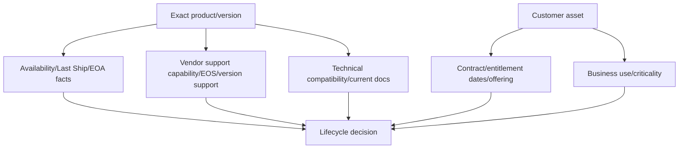

### Lifecycle evidence record

| Field | Required content |
|---|---|
| Entity | Exact product, platform, component, software, firmware, vendor |
| Current version/state | Exact installed/running version and source time |
| Source term | Verbatim official term such as EOA, EOS, Last Ship, or support capability |
| Date/capability | Exact official date or current capability row; unknown if unavailable |
| Source metadata | Official URL/record, publication/update and evidence dates, access class |
| Customer entitlement | Contract ID/offering/status/dates from authorized source |
| Compatibility | IMT/HWU/product/vendor evidence and date |
| Dependencies | Upstream/downstream systems, versions, services, owners |
| Decision | Risk horizon, option, owner, milestone, budget/window, validation |

### Do not normalize away meaning

Keep a source terminology crosswalk:

| Raw source term | Vendor/product/source | Internal reporting group | Rule |
|---|---|---|---|
| EOA | NetApp policy/product communication | Availability milestone | Preserve verbatim definition/date |
| EOS | NetApp policy/product communication | Support deadline | Preserve verbatim definition/date |
| Last Ship | NetApp policy/product communication | Procurement milestone | Do not equate with EOA/EOS |
| Technical support / root-cause / downloads / P-release availability | ONTAP release support page | Version support capability | Store each capability, not an invented stage |
| Third-party vendor term | Exact vendor policy | Dependency milestone | Preserve vendor wording and scope |

---

## 3. ONTAP release support and target posture

Current public ONTAP release-support documentation provides release dates/cadence intent and a table of support capabilities by years since release, including online documentation, technical support, root-cause analysis, downloads, P-releases, and vulnerability alerts. Use the current page; do not hard-code its values into a long-lived roadmap.

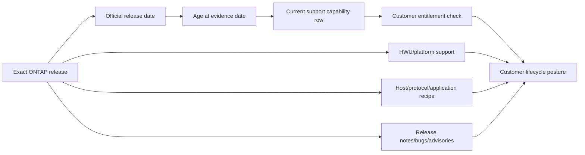

### Release posture fields

- Exact ONTAP release and patch/build.
- Release date and current support-capability evidence date.
- Available technical support/root-cause/download/P-release/vulnerability-alert capabilities according to current page.
- Platform support in HWU and system documentation.
- Upgrade path, intermediate releases, and revert limits.
- IMT compatibility for hosts, protocols, adapters, drivers, firmware, switches, multipath.
- Known issues, limitations, cautions, advisories, fixed-release needs.
- Feature requirements/deprecations/default/limit changes.
- Customer change window, application certification, protection and rollback readiness.

### Release age is not the only target criterion

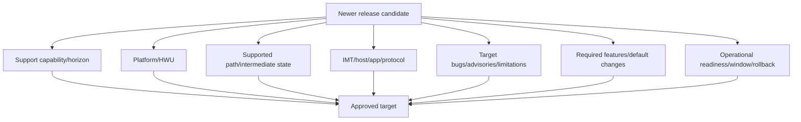

---

## 4. Hardware lifecycle

Public hardware docs explicitly describe “end-of-availability” systems as no longer available for purchase but still supported. Current policy separately defines EOA, Last Ship, and EOS.

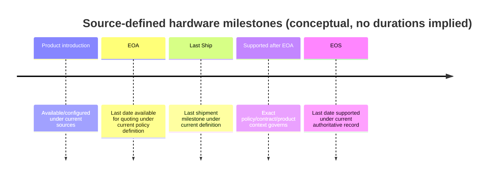

### Hardware lifecycle record

| Domain | Fields |
|---|---|
| Identity | Exact platform/controller/shelf/drive/adapter/switch model, serial, part/FRU |
| Milestones | EOA, Last Ship, EOS if officially published; source/date |
| Support | Contract/offering/status, spares/RMA/service-location constraints |
| Software | Highest/current compatible ONTAP/firmware/feature context from current sources |
| Dependencies | Shelves/drives/adapters/switches/cables/hosts/protection/workloads |
| Capacity | Current demand/growth/headroom and refresh sizing |
| Replacement | Supported successor/transition path only when officially validated |
| Execution | Procurement lead time, migration, rack/power/network, testing, disposal |

### Refresh impact graph

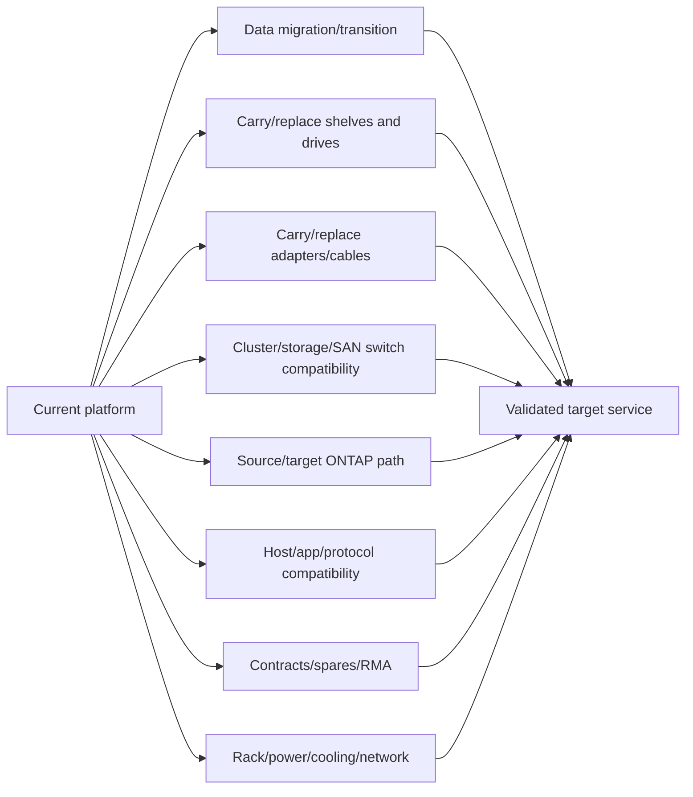

---

## 5. Firmware lifecycle

Firmware has its own inventory, recommendation, compatibility, sequencing, and rollback/forward-recovery considerations. Current public ONTAP docs identify supported firmware-update workflows for devices such as disks, disk shelves, SP, and BMC, with behavior varying by ONTAP and Digital Advisor registration.

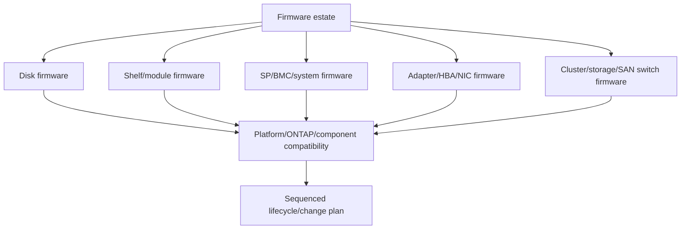

### Firmware record

| Field | Why |
|---|---|
| Exact component identity | Firmware is model/part-specific |
| Current/active version | Installed package may differ from active version |
| Recommended/target version | Must come from current official guidance |
| Security/defect rationale | Explains urgency and source |
| ONTAP/platform/IMT/HWU dependency | Prevents incompatible update |
| Update method/sequence | Automatic/manual/pre-stage/vendor-specific behavior varies |
| Disruption/reboot/failover | Change impact and redundancy plan |
| Rollback/forward recovery | Firmware downgrade may be constrained |
| Validation | Version, health, paths, telemetry, service outcome |

### Plain-English deep-dive: firmware is the component's operating language

Two people can own compatible radios but fail to communicate if one runs incompatible control software. Firmware is the low-level language a component uses with the platform. **Why it matters:** hardware model support alone does not prove its current firmware works with the target ONTAP, driver, switch, or topology.

---

## 6. Host, hypervisor, switch, application, and tooling lifecycle

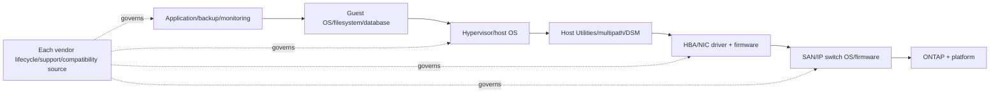

### Dependency questions

1. Which vendor owns each lifecycle/support date and terminology?
2. Does the exact current and target IMT recipe remain listed?
3. Are application, backup, monitoring, security, automation, and DR products certified?
4. Do drivers, firmware, Host Utilities, multipath/DSM and switch OS align?
5. What intermediate mixed states occur during upgrade?
6. Which team has budget, window, lab, rollback and vendor access?
7. Does one dependency's earlier deadline pull the whole roadmap forward?

### Earliest-deadline rule

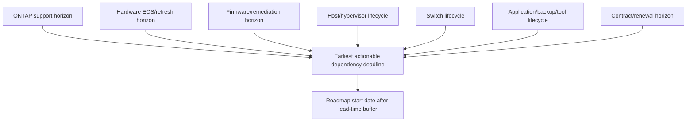

---

## 7. Risk horizon and planning lead time

### Plain-English deep-dive: the deadline is not the start date

If a passport expires on departure day, beginning the renewal that morning is already too late. Budget approval, procurement, design, testing, change windows, and migration consume time before a lifecycle deadline. **Why it matters:** planning works backward to the latest safe start, not forward from the vendor's final date.

Define an internal planning calculation, clearly labeled as customer governance rather than NetApp policy:

$$
\text{Latest Safe Start} = \text{Authoritative Deadline} - (\text{Decision} + \text{Budget} + \text{Procurement} + \text{Design} + \text{Test} + \text{Change Buffer})
$$

$$
\text{Risk Horizon} = \text{Latest Safe Start} - \text{Evidence Date}
$$

### Planning funnel

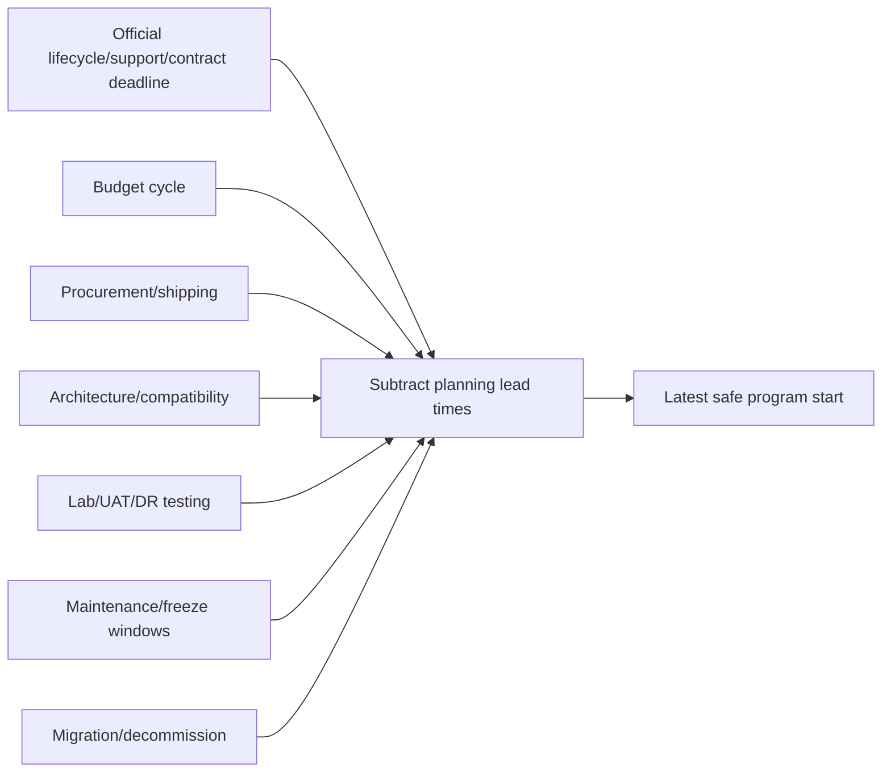

### Confidence bands

| Evidence state | Planning treatment |
|---|---|
| Confirmed official date and dependency map | Commit milestone with documented assumptions |
| Official date, incomplete dependency mapping | Start discovery earlier; hold contingency |
| Announcement expected/roadmap only | Do not state as committed fact; scenario-plan |
| Gated/unknown lifecycle | Assign owner and conservative planning buffer; no invented date |
| Conflicting source dates | Freeze external commitment and escalate authority |

### Technical debt register

| Debt | Evidence | Consequence | Horizon | Remediation path |
|---|---|---|---|---|
| Old ONTAP release | Current support-capability/source date | Reduced patches/alerts/support options under current source | Calculated | Validated upgrade program |
| EOA hardware | Official EOA; exact EOS/contract state | Procurement/spares/feature/refresh pressure | Calculated | Refresh/migrate/contract review |
| Firmware drift | Exact current vs recommended/compatible | Defect/security/compatibility risk | Source deadline/priority | Sequenced update |
| Host/switch mismatch | Current IMT gap/vendor lifecycle | Support/failover risk | Earliest dependency | Coordinated stack change |
| Temporary workaround | Bug/approval/expiry | Side effects and operational fragility | Workaround expiry | Fixed target/removal |

---

## 8. Lifecycle roadmap

### Roadmap layers

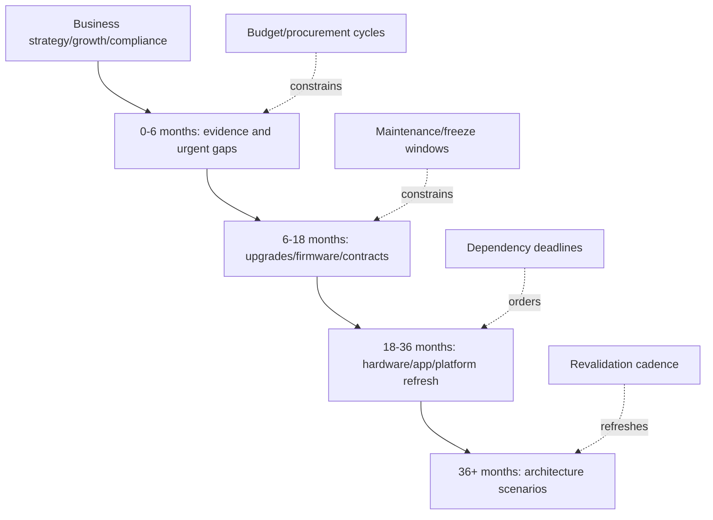

### Roadmap item schema

| Field | Required content |
|---|---|
| Scope | Customer/site/service/assets/dependencies |
| Driver | Official lifecycle/support/contract/security/defect/capacity/business evidence |
| Current/target | Exact versions/platforms/firmware/configuration |
| Deadline/horizon | Source date, latest safe start, confidence/assumptions |
| Dependencies | IMT/HWU/path/app/host/switch/protection/capacity/data migration |
| Milestones | Discover, design, approve, procure, lab, pilot, deploy, validate, decommission |
| Resources | Budget, people, support/vendor, lab, hardware, licenses |
| Windows | Maintenance, freeze, peak season, DR tests, business blackout |
| Ownership | Sponsor, technical, application, security, network, procurement, change |
| Success/residual | Technical/service/contract proof and remaining risk |

### Roadmap dependency graph

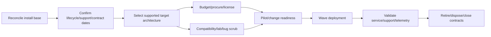

---

## 9. Cadence and governance

### Review cadence

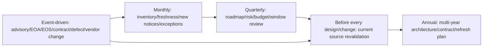

### Governance roles

| Role | Accountability |
|---|---|
| Customer sponsor/service owner | Risk appetite, budget, business window, acceptance |
| Storage/platform owner | Current state, target design, ONTAP/hardware/firmware execution |
| Host/hypervisor/app owners | Dependency lifecycle/certification/testing |
| Network/SAN owner | Switch/adapter/path lifecycle and resilience |
| Security/risk | Advisories, exceptions, compliance, residual risk |
| Procurement/contract/account | Entitlement, renewals, purchasing, lead times |
| TAM/analyst | Evidence, dependency map, roadmap, actions, cadence, escalation |
| NetApp/vendor Support | Authoritative clarification and supported procedures |

### Decision states

- **Plan:** Evidence current; target/dependencies need design/budget.
- **Execute:** Approved, resourced, validated runbook/window.
- **Monitor:** Horizon acceptable; refresh cadence assigned.
- **Defer:** Owner/date/reason/compensating control/expiry.
- **Accept:** Explicit accountable acceptance and review date.
- **Unknown:** Missing evidence with owner/date; never green.

---

## 10. Evidence, recommendation, and customer communication

### Evidence contract

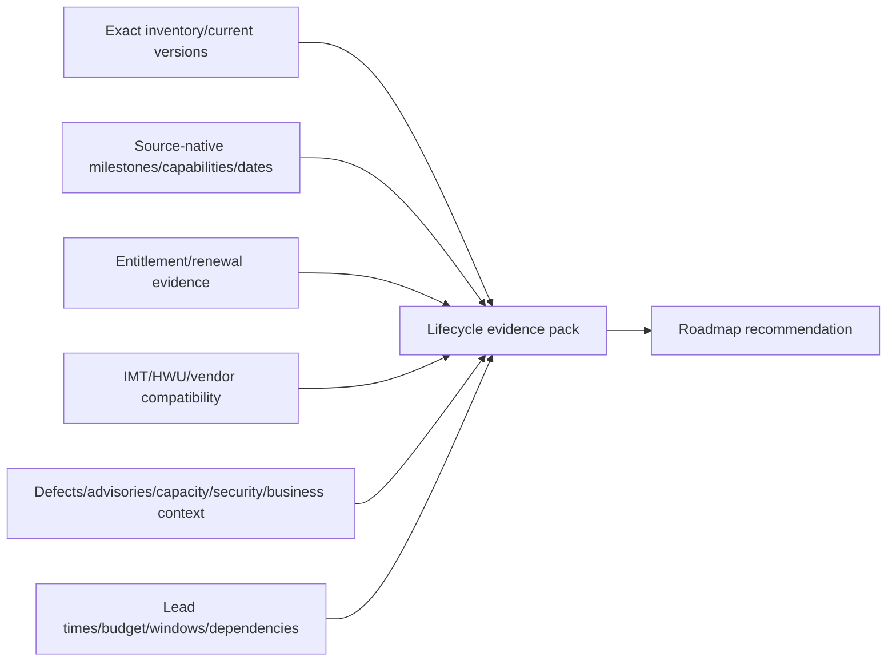

### Customer-safe wording

Avoid: “The system is obsolete next year.”

Prefer:

> “Official source `<source>` dated `<date>` identifies `<exact product/version>` with source term/capability `<verbatim fact>` and milestone `<date if published>`. Customer entitlement is `<status/source>` and the earliest dependent deadline is `<dependency/date>`. Given `<lead-time assumptions>`, latest safe program start is `<date/confidence>`. We recommend `<option>` with `<milestones/owners/budget/window>`, validated by `<proof>`. Unknowns and residual risks are `<list>`."

### Recommendation chain

```mermaid
flowchart LR
    FACT[Current source-native lifecycle facts] --> DEP[Customer dependency/entitlement map]
    DEP --> HORIZON[Deadline and latest-safe-start horizon]
    HORIZON --> RISK[Service/support/security/cost risk]
    RISK --> OPTIONS[Upgrade/refresh/renew/migrate/defer/accept]
    OPTIONS --> ROAD[Roadmap owner/budget/window/milestones]
    ROAD --> PROOF[Compatibility/change/service/support validation]
    PROOF --> RES[Residual risk/review cadence]
```

---

## 11. Conflicts, missing dates, and escalation

### Conflict tree

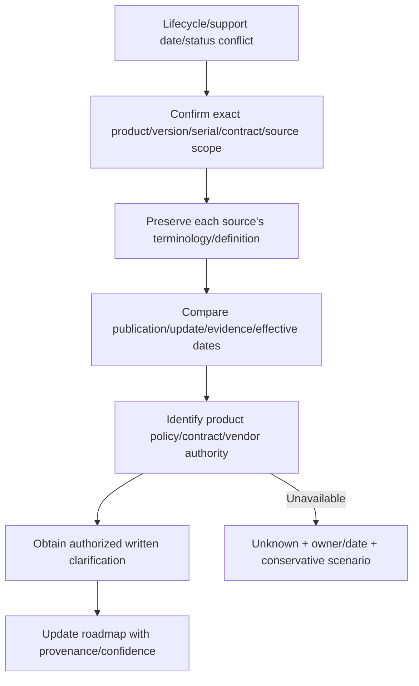

### Missing-date discipline

- Do not derive EOS by adding a remembered number to EOA.
- Do not infer support from presence in public documentation.
- Do not infer contract coverage from product eligibility.
- Do not quote a roadmap or sales estimate as a committed support date.
- Use scenario ranges internally when official dates are absent, labeled as assumptions.
- Assign a named account/contract/product owner to resolve gated facts.

### Escalation pack

- Exact product/platform/component/software/firmware/vendor identities.
- Customer serial/account/contract references in approved secure repository.
- Current installed versions and source timestamps.
- Conflicting source-native terms, URLs/IDs, publication/update/evidence dates.
- Support capabilities, EOA/Last Ship/EOS/version-support/contract facts as published.
- Dependency/IMT/HWU/bug/advisory/service/business evidence.
- Deadline, lead-time assumptions, budget/window impact, decision blocked.
- Options, confidence, exact clarification request, owner/date.

---

## 12. Fully synthetic sanitized scenario: lifecycle roadmap

> **Synthetic boundary:** `Summit Foods`, all products, releases, firmware, dates, contracts, costs, deadlines, and roadmap items are invented. The terminology demonstrates method only and is not a NetApp lifecycle statement.

### Synthetic dependency register

| Dependency | Current | Source-native fact | Customer context | Horizon action |
|---|---|---|---|---|
| ONTAP | `SYN-O1` | Synthetic support capability changes on `2027-03-31` | Two upgrade windows/year | Start target validation now |
| Platform | `SYN-P1` | Synthetic EOA passed; synthetic EOS `2028-06-30` | Contract current through `2027-12-31` | Budget refresh in next cycle |
| Shelf firmware | `SYN-SF1` | Synthetic recommendation `SYN-SF2` | One shelf path warning | Validate/sequence firmware |
| Host OS | `SYN-H1` | Synthetic vendor support ends `2027-01-31` | App certification lags | Earliest dependency, coordinate app |
| SAN switch | `SYN-SW1` | Synthetic vendor milestone `2028-01-01` | Fabric upgrade needs two windows | Design after host decision |
| Backup app | `SYN-B1` | Target ONTAP not yet synthetically certified | Critical restore control | Certification is target blocker |

### Timeline

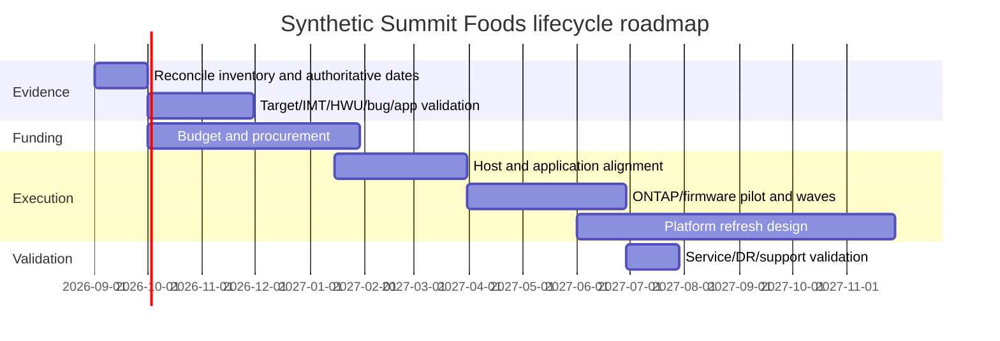

### Dependency path

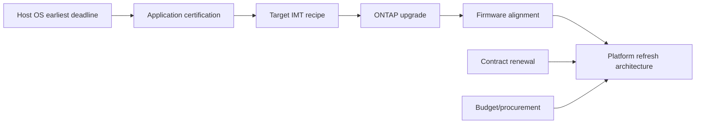

### Bounded recommendation

> **Finding:** In the synthetic register, the host OS deadline and application certification precede the platform's synthetic EOS and block the ONTAP target; firmware and contract timelines create additional dependencies. **Risk:** managing each asset in isolation would start too late, preserve an unlisted stack, or fund hardware without a certified application path. **Recommendation:** launch a cross-team program at the earliest latest-safe-start date, confirm every official/gated date, validate app/IMT/HWU/bug/upgrade paths, align budget and windows, and phase host/app, ONTAP/firmware, then platform refresh. **Validation:** exact target recipes, successful pilot/service/DR tests, current entitlement, fresh telemetry, and retired-source closure. **Residual risk:** unpublished or changed vendor dates remain scenario assumptions until authoritative confirmation.

---

## 13. Discovery, JD Mapping, and Arti transfer

### Discovery questions

1. Which customer services, assets, releases, firmware, hosts, switches, applications and contracts are in scope?
2. What exact source-native EOA, Last Ship, EOS, version-support capability or vendor term applies?
3. What are publication/update/evidence/effective dates and access confidence?
4. What entitlement/offering/contract dates apply to each customer asset?
5. Which platform/ONTAP/firmware/IMT/HWU/app dependencies constrain targets?
6. Which security/defect/capacity/feature/business drivers change urgency?
7. What is the earliest dependency deadline and latest safe program start?
8. Which budget, procurement, lab, staffing, freeze and maintenance windows apply?
9. Which options are upgrade, firmware, renew, refresh, migrate, defer or accept?
10. What owner/milestone/proof/residual risk/revalidation cadence governs each item?

### JD Mapping

| JD responsibility | Part 53 contribution | Arti's factual bridge and gap |
|---|---|---|
| Lifecycle management | Source-native product/version/firmware/contract dependency model | Microsoft lifecycle planning transfers; no NetApp commitments claimed |
| Install-base analysis | Exact assets/versions/firmware/entitlement/owners | Data-quality strengths transfer |
| Upgrade/refresh strategy | Earliest deadline, target dependencies, lead-time roadmap | Change/program planning transfers |
| Proactive risk | Identifies shrinking support, contract and compatibility horizons | Service-risk discipline transfers |
| Customer roadmap | Aligns budget, procurement, windows, milestones and validation | Executive/customer communication transfers |
| Cross-functional governance | Coordinates storage/host/app/network/security/procurement/support | Multi-team escalation experience transfers |

### Honest interview answer

> "I separate availability, support capability, contract entitlement and technical compatibility. I preserve official source terms like EOA, Last Ship and EOS, and for ONTAP versions I store the current capability table instead of inventing a stage. Then I map firmware, host, switch, application and contract dependencies, calculate the earliest latest-safe-start horizon, and create a budgeted roadmap. My production lifecycle experience is Microsoft, not NetApp commitment authority, so every real date is revalidated with authorized owners."

---

## 14. Paper lab and self-test

### Paper lab

Build a synthetic three-year lifecycle roadmap for twelve clusters, three platform families, four ONTAP releases, six firmware domains, three host OS families, two hypervisors, four switch fabrics, five applications, and contracts.

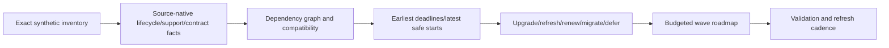

### Inject these cases

- EOA hardware that remains supported.
- Product supportable but customer contract expired.
- ONTAP support capabilities change before platform EOS.
- Host OS deadline earlier than storage deadline.
- Firmware recommendation dependent on target ONTAP.
- Target ONTAP blocked by application certification.
- Switch refresh colliding with storage maintenance window.
- Missing official EOS date with only a roadmap estimate.
- Conflicting contract and product-support sources.
- Temporary workaround expiring before planned upgrade.

### Tasks

1. Preserve exact source terms, definitions, dates, publication/update/evidence metadata.
2. Separate availability, support, entitlement, compatibility and business-use states.
3. Build complete software/hardware/firmware/host/switch/app/contract relationships.
4. Identify earliest dependency deadline and calculate planning lead-time scenarios.
5. Register technical debt with consequence, horizon, owner and remediation.
6. Build 0-6, 6-18, 18-36 and 36+ month roadmap bands.
7. Align decisions with budget, procurement, lab, freeze, maintenance and DR windows.
8. Resolve conflicts through authoritative owners; preserve unknowns.
9. Write executive summary, technical evidence pack and cadence calendar.
10. Answer Q1-Q8 aloud without quoting a real lifecycle date.

### Lab pass checklist

- [ ] No invented NetApp lifecycle labels or dates.
- [ ] EOA, Last Ship, EOS, version support and entitlement remain distinct.
- [ ] Every date has exact entity/source/update/evidence context.
- [ ] Firmware and third-party dependencies are included.
- [ ] Earliest dependency, not storage alone, drives planning.
- [ ] Lead-time arithmetic is labeled an internal planning method.
- [ ] Unknown/conflicting dates are not favorable assumptions.
- [ ] Roadmap has budget, windows, owners, milestones, proof and residual risk.
- [ ] Revalidation cadence is defined.
- [ ] No production NetApp commitment authority is claimed.

---

## 15. Official Source Anchors

**Date checked: 2026-08-24.** Public official NetApp sources only. Lifecycle/support/contract data changes; recheck exact current sources and customer entitlement before use.

| Topic | Official source | Bounded use |
|---|---|---|
| ONTAP release support | [ONTAP 9 release support](https://docs.netapp.com/us-en/ontap/release-notes/release-support-reference.html) | Release cadence intent/dates and current support-capability table; plans can change |
| Release context | [ONTAP release highlights](https://docs.netapp.com/us-en/ontap/release-notes/index.html) | Public feature orientation and gated comprehensive-release-notes link |
| EOA/EOS/Last Ship policy terms | [Support Policies and Offerings](https://mysupport.netapp.com/site/info/policies-and-offerings) | Current definitions and policy context; exact product/contract source controls |
| Software version support | [Software Version Support](https://mysupport.netapp.com/site/info/version-support) | Authorized current version-support details; access/content can vary |
| EOA hardware docs | [End-of-availability ONTAP hardware systems](https://docs.netapp.com/us-en/ontap-systems/endofavail/index.html) | Publicly confirms EOA systems are no longer purchasable but can still be supported |
| Hardware docs hub | [ONTAP hardware systems documentation](https://docs.netapp.com/us-en/ontap-systems/index.html) | Current install/maintain/upgrade/shelf/FRU navigation |
| Firmware updates | [Update firmware manually](https://docs.netapp.com/us-en/ontap/update/firmware-task.html) | Current disk/shelf/SP/BMC firmware workflow varies by ONTAP/Digital Advisor |
| Product communications | [NetApp Product Communique](https://mysupport.netapp.com/info/communications/index.html) | Official product communication entry; availability can be gated/intermittent |
| Hardware configuration | [Hardware Universe](https://hwu.netapp.com/) | Gated exact platform/component/version configuration and lifecycle context |
| Interoperability | [Interoperability Matrix Tool](https://imt.netapp.com/matrix/) | Gated exact end-to-end recipe evidence |

### Source-use discipline

- Preserve source terminology and definitions verbatim; do not manufacture lifecycle stages.
- Record exact product/version/component/serial/contract scope and publication/update/evidence dates.
- Separate product availability, vendor support capability, customer entitlement, compatibility and use.
- Revalidate ONTAP, HWU, IMT, firmware, host/switch/app/vendor and contract facts.
- Do not infer EOS by arithmetic or promise roadmap dates as vendor commitments.
- Protect contract, serial, topology and customer planning data.

---

## Likely Interview Questions

### Q1. How do EOA, Last Ship, and EOS differ?

> **Model answer:** "Under current NetApp policy, EOA is the last quote-availability date, Last Ship is the final shipment date for placed orders, and EOS is the last support date. They are separate milestones. I preserve exact source definitions/dates and verify customer contract entitlement independently."

### Q2. How do you classify ONTAP release support without inventing labels?

> **Model answer:** "I record the exact release/date and the current official capability table, such as documentation, technical support, root-cause analysis, downloads, P-releases and vulnerability alerts. I do not translate it into undocumented stage names; I cite the source/evidence date."

### Q3. Why can an EOA platform still be supportable?

> **Model answer:** "EOA describes purchase/quote availability, not EOS. Public hardware docs explicitly say EOA systems are no longer available for purchase but are still supported. Exact EOS, policy, contract, software/firmware and compatibility facts still need verification."

### Q4. How do you calculate lifecycle urgency?

> **Model answer:** "I find the earliest authoritative dependency deadline, subtract decision, budget, procurement, design, test and change buffers to calculate a latest safe program start, and label that arithmetic as internal planning. Unknown dates use scenarios, not invented commitments."

### Q5. What belongs in a lifecycle roadmap?

> **Model answer:** "Exact scope/current/target, official drivers/dates, dependencies, risk horizon, milestones, budget/procurement, lab/pilot/waves, maintenance/freeze windows, owners, success proof, residual risk and revalidation cadence across ONTAP, hardware, firmware, host, switch, app and contract."

### Q6. How does firmware fit lifecycle management?

> **Model answer:** "Firmware is versioned software tied to exact disks, shelves, SP/BMC, adapters and switches. I inventory active versions, use current recommendations, validate ONTAP/platform/IMT/HWU dependencies, sequence disruption and redundancy, and define rollback or forward recovery plus post-update health/path proof."

### Q7. What do you do with conflicting or missing lifecycle dates?

> **Model answer:** "I preserve each source term/scope/version/date, confirm exact product/contract, identify product-policy/contract/vendor authority, and request written clarification. Until then the date is unknown with an owner and conservative scenario; I never derive it from memory."

### Q8. How does your background transfer, and what remains a gap?

> **Model answer:** "Microsoft lifecycle, Azure/M365 change governance and customer-roadmap work give me dependency, horizon, budget/window and executive-risk discipline. I have not committed NetApp support dates or approved a NetApp roadmap, so authorized current sources and account/product owners validate every real fact."

---

## 30-Second Memory Hooks

- **Lifecycle:** Availability + support + entitlement + compatibility + business use over time.
- **EOA:** Last quote availability; not automatically EOS.
- **Last Ship:** Shipment milestone; not support expiry.
- **EOS:** Last support date under current authoritative source.
- **ONTAP support:** Store capabilities, not invented stage labels.
- **Entitlement:** Customer contract; separate from product supportability.
- **Weakest dependency:** Earliest host/switch/app/firmware/contract deadline can drive storage.
- **Firmware:** Exact component + active version + compatibility + sequence + proof.
- **Risk horizon:** Deadline minus all real planning lead time.
- **Roadmap:** Evidence -> dependencies -> budget/window -> waves -> validation.
- **Unknown date:** Scenario plus owner, never arithmetic from memory.
- **Technical debt:** Delayed alignment with measurable consequence/horizon.
- **Cadence:** Monthly, quarterly, annual, event-driven, and pre-change refresh.
- **Arti's bridge:** Lifecycle governance transfers; NetApp commitment authority does not.

---

## Completion Checklist

- [ ] Define lifecycle, EOA, Last Ship, EOS, version support, entitlement, firmware, risk horizon and technical debt.
- [ ] Preserve source-native terms and definitions without invented NetApp labels.
- [ ] Separate availability, support, contract, compatibility and business-use states.
- [ ] Record ONTAP support capabilities rather than an undocumented stage.
- [ ] Build exact hardware milestone/support/contract/replacement records.
- [ ] Inventory disk/shelf/SP/BMC/adapter/switch firmware and dependencies.
- [ ] Map host/hypervisor/app/backup/monitoring/switch/IMT dependencies.
- [ ] Identify earliest deadline and calculate latest safe start with explicit assumptions.
- [ ] Build technical-debt and lifecycle-risk registers.
- [ ] Align 0-6/6-18/18-36/36+ roadmap with budget, procurement and windows.
- [ ] Assign roles, decision states and revalidation cadence.
- [ ] Handle missing/conflicting dates through authoritative escalation.
- [ ] Build secure customer and technical evidence packs.
- [ ] Recreate the fully synthetic Summit Foods scenario.
- [ ] Complete the paper lab and answer Q1-Q8 aloud.
- [ ] State the No-production-NetApp boundary and exact non-claim accurately.
- [ ] Recheck official current product/version/contract/vendor sources before use.

---

*Next suggested section:* [Part 54 - ONTAP Upgrade Planning, Upgrade Advisor, and Nondisruptive Operations](Part-54-ontap-upgrade-planning.md)