# Part 54 - ONTAP Upgrade Planning, Upgrade Advisor, and Nondisruptive Operations

> **Section goal:** Turn a business reason to upgrade into a validated ONTAP target, supported path, healthy starting state, coordinated change, evidence-based go/no-go decision, and verified customer outcome. By the end, Arti should be able to use Upgrade Advisor or Upgrade Health Checker appropriately, validate hardware/IMT/release/bug/application/protocol/replication/security dependencies, explain automated nondisruptive upgrade (ANDU) boundaries, build communications and recovery plans, and run post-upgrade hypercare without promising zero impact.

Covers index item **54** and maps directly to job-description responsibilities for upgrade strategy, proactive risk reduction, lifecycle management, technical configuration review, customer change governance, system stability, support readiness, cross-functional coordination, and executive communication.

**Explicit nonclaim:** Arti has not planned, approved, or executed a production ONTAP upgrade.

**Privacy and access boundary:** Cluster plans, Upgrade Advisor output, inventories, cases, bugs, credentials, maintenance windows, business services, and validation evidence require authorization and approved storage.

**Synthetic-evidence rule:** Every cluster, release, path, precheck, date, duration, status, result, and recommendation below is fictional and sanitized; it is not a live Upgrade Advisor plan or supported upgrade declaration.

**Version caveat:** Recommended targets, Upgrade Advisor/Upgrade Health Checker behavior, AutoSupport requirements, prechecks, supported direct/direct multi-hop/multi-stage paths, mixed-version rules, platform/IMT support, special considerations, ANDU behavior, duration, revert constraints, commands, System Manager navigation, and postchecks vary by source/target ONTAP release and configuration. A **current-doc check** means regenerating/reviewing the current cluster-specific plan, then reopening exact current/target/intermediate release documentation immediately before approval and execution.

Upgrade Advisor and Digital Advisor require authorized identity and qualifying support context; Upgrade Health Checker has different current prerequisites. This guide contains no real upgrade plan, target recommendation, path, precheck output, NDO guarantee, duration, command sequence, or rollback procedure. Exact customer evidence and current official instructions control.

> **No-production-NetApp boundary:** Arti does not claim production ONTAP upgrade execution. Every customer, cluster, version, path, precheck, duration, blocker, result, and recommendation below is synthetic. Her factual strengths are Microsoft enterprise change governance, Windows/Azure/M365 upgrades, CRITSIT readiness, compatibility analysis, customer communications, rollback planning, service validation, and hypercare. The explicit non-claim is: **she has not generated a production Upgrade Advisor/Health Checker plan, executed ANDU, performed ONTAP takeover/giveback, approved a MetroCluster/SnapMirror upgrade, reverted ONTAP, or declared a customer NetApp upgrade nondisruptive.**

---

## 1. Upgrade is a business and technical program

An ONTAP upgrade is a controlled transition among complete system states, not merely installation of a software image.

### Plain-English deep-dive: changing the railway while trains keep moving

An ANDU resembles upgrading sections of railway while traffic is redirected over healthy tracks. Success depends on track redundancy, signals, train behavior, sequencing, and the ability to stop when conditions change. The new rail itself is only one component.

**Why it matters:** HA automation can preserve service only when platform, configuration, clients, paths, applications, and operating conditions meet exact requirements.

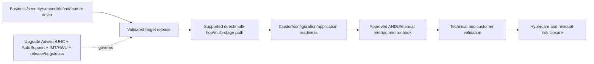

### Core terms

| Term | Plain meaning | Boundary |
|---|---|---|
| **Major upgrade** | Move to a higher numbered ONTAP release | Different from a patch within same numbered release |
| **Patch upgrade** | Move to a higher patch version within one numbered release | Exact recommendation/current path still required |
| **Upgrade Advisor** | Digital Advisor service that uses eligible cluster data to recommend path/target and produce a cluster-specific plan | Active support context and AutoSupport/current data required |
| **Upgrade Health Checker (UHC)** | Onsite tool for comprehensive health/plan generation, especially larger/complex or limited-internet environments | Setup/current tool docs required; output still needs review |
| **ANDU** | Automated nondisruptive upgrade using ONTAP HA failover sequencing | “Nondisruptive” is conditional, not zero-risk/zero-session-effect promise |
| **Direct path** | Supported upgrade with one target image/path step | Exact current/target table controls |
| **Direct multi-hop** | Automated process uses an intermediate image within one initiated operation | Requires exact documented images/behavior |
| **Multi-stage** | Separate upgrades through one or more supported intermediate releases | Each stage has separate readiness/validation |
| **Mixed-version state** | Cluster nodes temporarily run different compatible ONTAP versions during supported operation | Exact path compatibility/time/operation constraints apply |
| **Revert** | Version-specific procedure to return to an earlier ONTAP release under documented constraints | Not a universal instant rollback |

---

## 2. Business drivers and success criteria

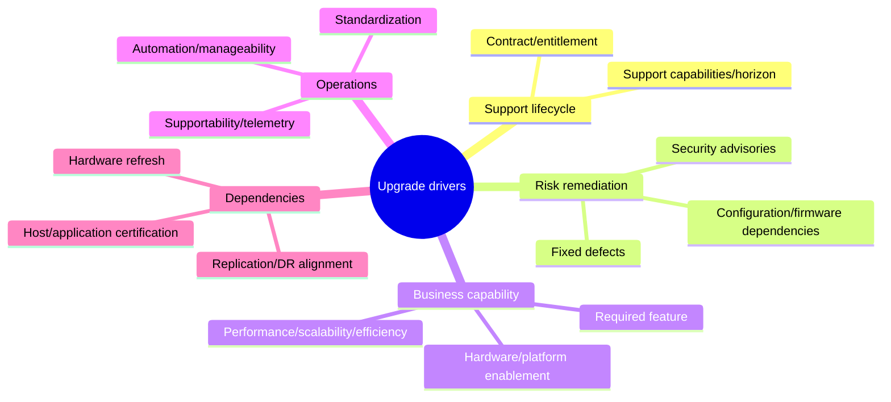

### Driver record

| Field | Question |
|---|---|
| Decision | Why upgrade, why now, and what happens if deferred? |
| Service | Which business services, users, data and recovery obligations depend on it? |
| Evidence | Lifecycle/defect/advisory/feature/capacity/performance/contract sources and dates |
| Success | Which technical, application, business and support outcomes prove value? |
| Constraints | Target date, freeze, budget, resources, vendor/app certification, change tolerance |
| Alternatives | Patch, workaround, hardware refresh, migration, defer/accept with controls |

### Success hierarchy

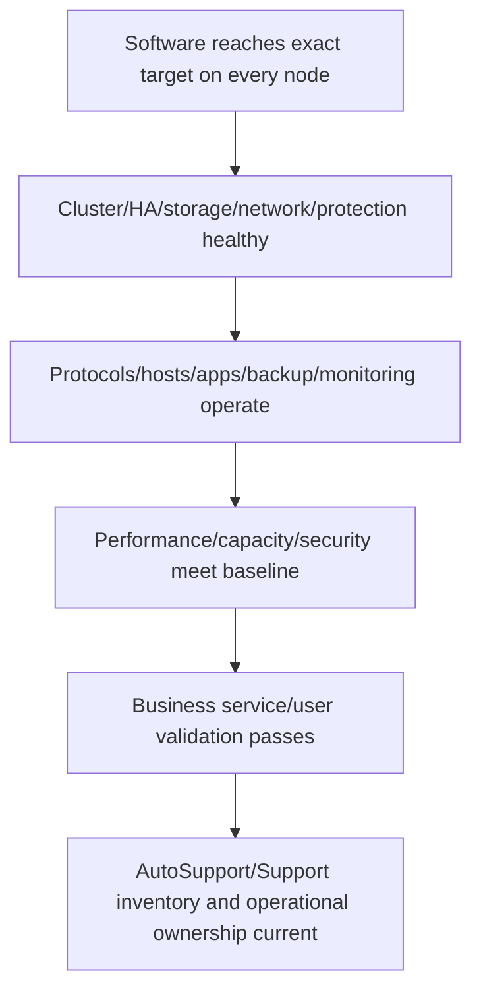

“Upgrade completed” is not the same as “customer outcome validated.”

---

## 3. Target release selection

Current public docs describe Upgrade Advisor's recommendation as based on current configuration/current ONTAP and provide manual target-selection guidance. A recommendation begins validation; it does not end it.

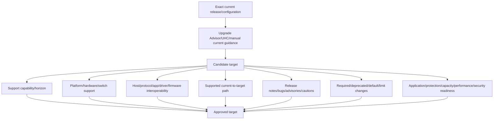

### Target comparison

| Criterion | Candidate A | Candidate B | Evidence required |
|---|---|---|---|
| Business driver solved |  |  | Feature/fix/security/lifecycle source |
| Platform support |  |  | Current HWU/system docs |
| End-to-end compatibility |  |  | Current IMT/app/vendor evidence |
| Path/stages |  |  | Current supported path table/plan |
| Release risk |  |  | Release notes/cautions/bugs/advisories |
| Operational change |  |  | Defaults/limits/deprecations/protocol behavior |
| Support horizon |  |  | Current release-support evidence |
| Window/effort |  |  | Environment-specific estimate and plan |
| Recovery limits |  |  | Exact revert/forward-recovery docs |

### Plain-English deep-dive: newest is a candidate, not a universal answer

The newest bridge may be stronger, but a truck still needs a route to it, compatible height/weight, and safe roads afterward. A newer ONTAP release likewise must support the customer's platform, complete stack, upgrade path, applications, protection design, and operational constraints.

---

## 4. Upgrade Advisor, UHC, AutoSupport, and gated fallback

### Upgrade Advisor path

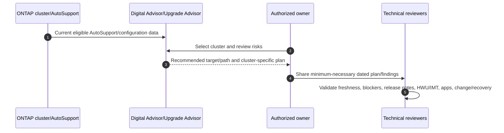

Public current guidance says Upgrade Advisor requires an active support contract for Digital Advisor and AutoSupport data, with an official manual-upload path when needed. It also instructs reviewers to resolve relevant configuration/replacement risk categories before upgrade.

### UHC path

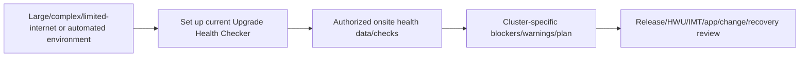

### Tool-output boundaries

| Output | Use | Must still validate |
|---|---|---|
| Recommended target | Candidate target tailored to observed configuration | Freshness, platform, IMT/app, defects, business requirements |
| Recommended path | Cluster-specific planning path | Current official path table/images/stages and execution plan |
| Blockers/errors | Must-resolve conditions under tool logic | Corrective action, owner, recheck and unintended effects |
| Warnings | Risk/condition requiring review | Disposition and approval; do not blanket-ignore |
| Plan/report | Structured preparation input | Customer-specific operations, communications, recovery, validation |

### Gated-access fallback

If Arti lacks access:

1. Define required fields: cluster/system IDs, source-data time, current/target/path, errors/warnings/actions, plan generation time.
2. Ask an authorized storage/account owner to generate and sanitize the current report.
3. Keep the source plan in approved access-controlled storage.
4. Record unavailable details as gaps with owner/date.
5. Never recreate a likely-looking report from public docs.

---

## 5. Supported paths and intermediate states

Public docs define direct, direct multi-hop, and multi-stage paths. Exact path tables change; never infer a hop by arithmetic.

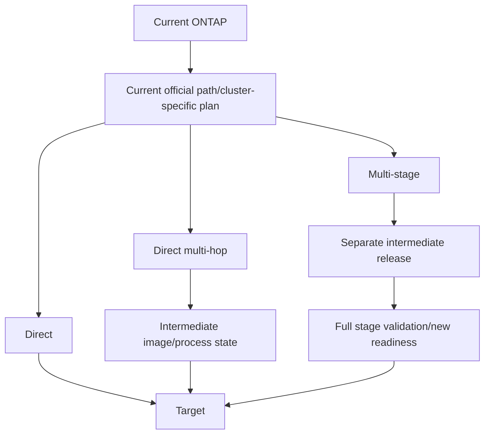

### Path evidence

| Field | Required content |
|---|---|
| Current state | Exact release/patch on every node and mixed-state status |
| Target | Exact numbered/patch release |
| Method | Automated/manual and current support basis |
| Path type | Direct/direct multi-hop/multi-stage from current source |
| Intermediate | Every image/release/state and mixed-version compatibility |
| Images | Authorized checksums/source/availability/staging requirements |
| Operations | Expected takeover/giveback/reboots/stages under current docs |
| Stage proof | Health, apps, protection, telemetry and owner signoff before next stage |

### Mixed-version boundary

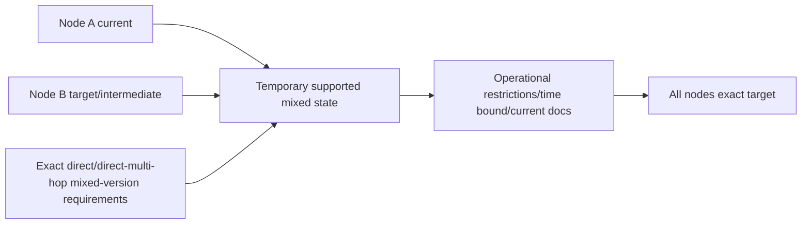

A multi-stage source and final release pair can be unsupported as a mixed-version cluster even though each separate stage is supported. Follow the exact current path statement.

---

## 6. Pre-upgrade readiness and automated checks

Current public docs allow automated prechecks before the maintenance window and require resolving all errors; warnings should also be resolved as a best practice. The automated process also performs checks, but early execution creates remediation time.

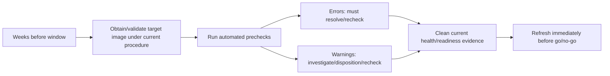

### Readiness domains

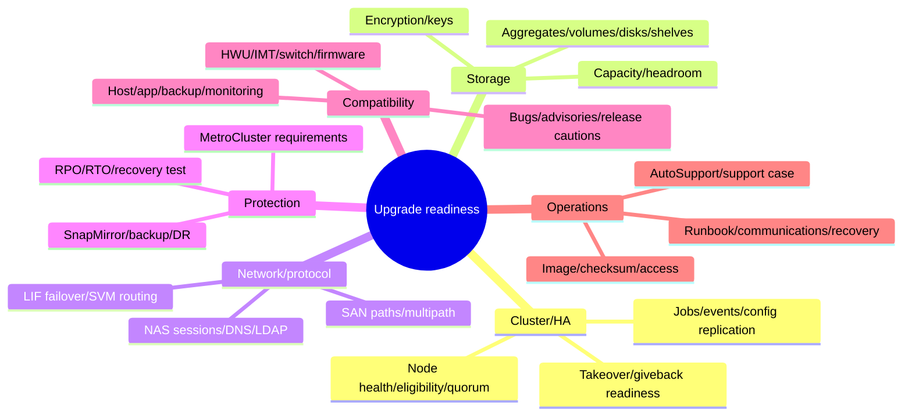

### Evidence checklist

| Domain | Evidence before go/no-go |
|---|---|
| Cluster/HA | All nodes healthy; HA/takeover/giveback and config state acceptable under exact procedure |
| Storage | No unresolved critical hardware/storage state; capacity/failure-state headroom |
| Network | LIF failover groups/policies and SVM routes validated; management path resilient |
| SAN/NAS | Correct host paths/multipath/settings; session-oriented protocol effects reviewed |
| Protection | Replication relationships/lag/errors, backup/restore, DR/MetroCluster readiness |
| Security | External key management, certificates/SSH/FIPS/LDAP and security warnings handled |
| Tooling | Current Upgrade Advisor/UHC/precheck plan, errors cleared, warnings dispositioned |
| Support | AutoSupport fresh, support entitlement/case/escalation contacts, evidence pack ready |

### Plain-English deep-dive: a precheck is a smoke detector, not structural engineering

A smoke detector can confirm one class of danger is absent at test time; it cannot certify foundation strength, evacuation behavior, or tomorrow's weather. Automated prechecks catch defined cluster conditions, but they do not replace IMT/HWU, application certification, business tests, target bug scrub, or recovery planning.

---

## 7. Special configurations and application/protocol readiness

Current public special-considerations documentation calls out mixed-version clusters, MetroCluster, SAN, SnapMirror, encryption/key management, netgroups, LDAP/TLS, session-oriented protocols, SSH/FIPS, ransomware warnings, and other release-specific configurations.

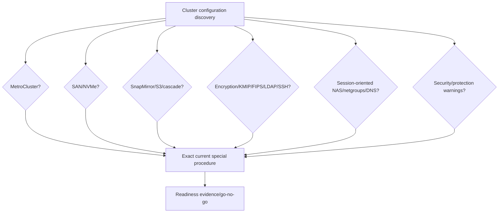

### Application/protocol contract

| Owner | Must validate |
|---|---|
| Application | Supported/certified target, transaction/session behavior, test plan, business success |
| Host/hypervisor | OS/kernel/driver/firmware/HU/multipath exact recipe and retry behavior |
| SAN | Path count/state, zoning, ALUA/ANA/DSM policy, failover/failback tests |
| NAS | NFS/SMB client/session/lock/mount/name-service behavior and reconnect tolerance |
| Backup | Backup/restore/copy/catalog/snapshot integration and target certification |
| Replication/DR | Source/destination version compatibility, lag, topology, failover/recovery |
| Security | Key/cert/identity/crypto/compliance behavior and emergency access |
| Monitoring/automation | API/CLI/schema/integration compatibility and alert suppression/validation |

### Replication dependency graph

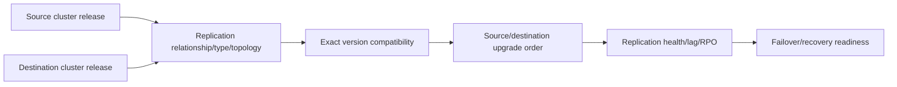

---

## 8. ANDU and nondisruptive-operation boundaries

Public docs recommend ANDU and state that it uses HA failover to keep clusters serving data without interruption during the upgrade. That product statement has prerequisites and does not justify an unconditional customer promise.

### Conceptual ANDU sequence

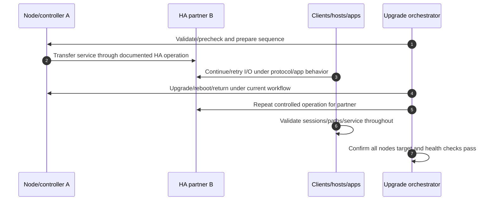

### NDO claim ladder

| Claim | Evidence needed |
|---|---|
| Product method is documented as ANDU | Exact current public/source-target documentation |
| Cluster meets ANDU prerequisites | Plan/prechecks/health/path/special-config evidence |
| Hosts/apps tolerate failovers | IMT/vendor/app/retry/path testing |
| No customer-visible impact occurred | Monitoring, application, user and transaction evidence |
| Future upgrade will have zero impact | **Never promise**; risk can be reduced, not eliminated |

### NDO risk model

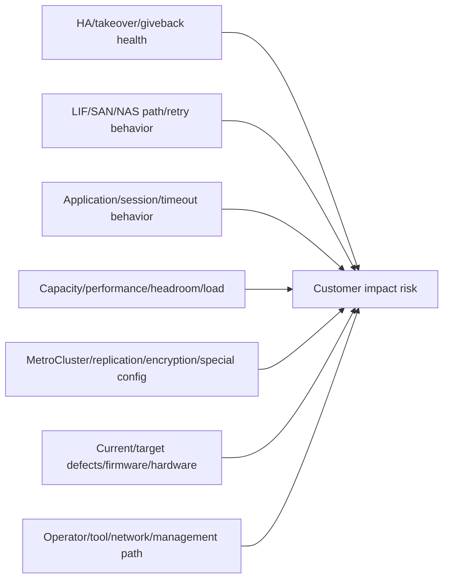

### Plain-English deep-dive: nondisruptive is an engineered outcome

An automatic door is designed for continuous entrance, but blocked sensors, crowding, power failure, or a person who cannot tolerate the brief movement can still cause impact. “Nondisruptive” names the supported HA method and intended service behavior, not a warranty that every client session or workload sees nothing.

---

## 9. Runbook, communications, and go/no-go

### Runbook structure

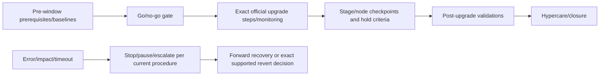

### Go criteria

- Approved business/change scope, current target/path/runbook.
- Current authorized Upgrade Advisor/UHC plan and prechecks.
- All errors resolved/retested; every warning has technical disposition/approval.
- Cluster, HA, storage, network, protection, capacity and performance healthy against baseline.
- HWU/IMT/host/app/backup/monitoring/firmware/switch/MetroCluster evidence current.
- Target release notes, cautions, limitations, defects/advisories reviewed.
- Images/checksums/access/credentials/support contacts/evidence repository ready.
- Application/business validators and communication bridge available.
- Forward-recovery/revert boundaries understood; backups/protection verified.

### No-go/hold examples

- New critical health, replication, hardware, path, key-management or capacity issue.
- Precheck error or unexplained warning.
- Stale AutoSupport/plan or changed inventory after validation.
- Unsupported current/target/intermediate IMT/HWU/app configuration.
- Missing application/business owner or failed baseline.
- Support/escalation/recovery access unavailable.
- Environment differs from approved path/runbook.

### Communications matrix

| Time | Audience | Message |
|---|---|---|
| Planning | Sponsors/owners | Driver, scope, target/path, risk, dependencies, decision dates |
| Pre-window | Users/ops/support | Window, expected behavior, monitoring, contacts, validation, escalation |
| Start/go | Change bridge | Baseline/go evidence, exact scope, owners/checkpoints |
| Checkpoint | Technical/business | Stage/node status, health/app evidence, deviations, next decision |
| Incident/hold | All owners | Impact, stop state, evidence, current action, next update time |
| Completion | Stakeholders | Target/health/app/business result, residual risks, hypercare |

---

## 10. Validation and hypercare

### Validation pyramid

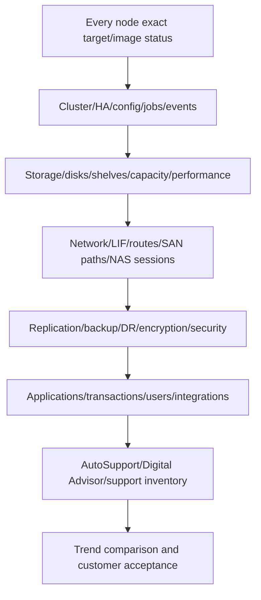

### Baseline/during/after record

| Signal | Baseline | During threshold/hold | Post target | Owner |
|---|---|---|---|---|
| Node/HA health | Current evidence | No unexplained degradation | All target/healthy | Storage |
| Client paths/sessions | Count/state/error | Within approved retry/impact | Restored/expected | Host/network/app |
| Replication | State/lag | No unapproved RPO breach | Healthy/caught up | DR/storage |
| Performance | Latency/IOPS/CPU/throughput | Agreed deviation | Baseline-equivalent/contextual | Performance/app |
| Capacity | Used/free/headroom | No safety threshold breach | Expected values | Storage/capacity |
| Application | Synthetic/real transaction | Stop on business threshold | Owner signoff | App/business |
| AutoSupport | Fresh/send/receipt | Delivery retained | New target evidence received | Storage/support |

### Hypercare timeline

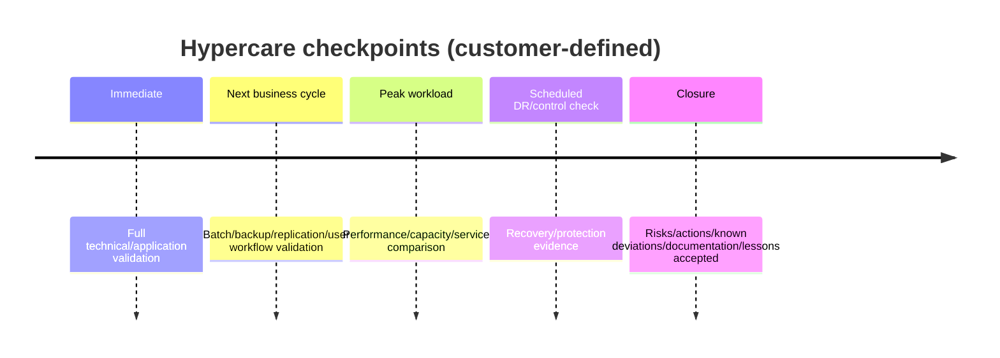

Do not close only because the upgrade job reports success.

---

## 11. Recovery, revert, and failure escalation

### Plain-English deep-dive: revert is another migration, not Undo

Undoing a document edit is simple because the previous bytes remain local. Software/data-system reversion can encounter changed on-disk structures, feature state, configuration, compatibility, and time limits. **Why it matters:** ONTAP revert is an exact version-specific operation with prerequisites and restrictions, not a generic rollback button.

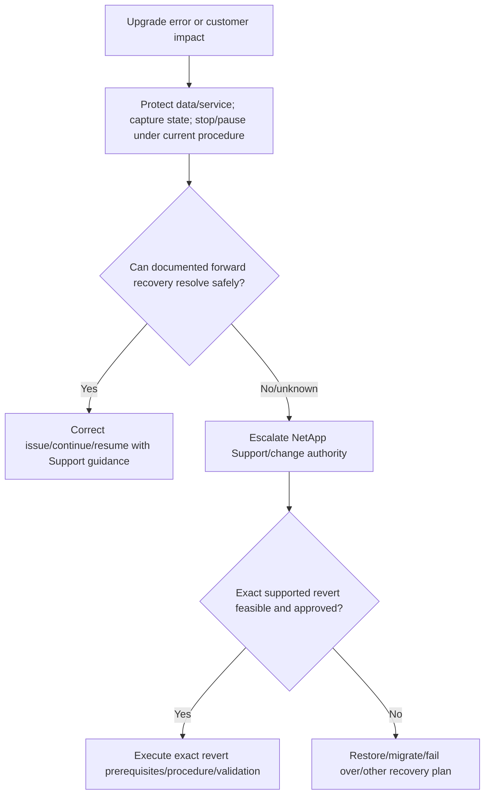

### Recovery planning fields

| Field | Required content |
|---|---|
| Failure/hold criteria | Exact health/app/time/impact conditions |
| Safe stop/pause | Current official method and state implications |
| Forward recovery | Corrective actions, owner, max wait, resume proof |
| Revert eligibility | Exact source/target/version/time/feature/config prerequisites |
| Data/protection | Backup/snapshot/replication/recovery state and RPO/RTO |
| External dependencies | Hosts/apps/switches/firmware already changed and compatibility |
| Authority | Storage/change/customer/Support decision roles |
| Validation | Full technical/application/business proof after recovery |

### Escalation pack

- Customer/business impact, service, RPO/RTO and UTC timeline.
- Exact current/target/path/stage/node states and upgrade method.
- Upgrade Advisor/UHC/precheck plan IDs/times, resolved warnings/errors.
- Full current upgrade status/errors/events/jobs and sanitized logs.
- Cluster/HA/storage/network/path/replication/key/capacity/performance evidence.
- Application/host/session/transaction evidence and deviations.
- IMT/HWU/release note/bug/advisory/special-config references/dates.
- Actions tried/results, stop state, forward/revert constraints, exact ask.
- AutoSupport sequence/case/secure evidence location and next communication time.

---

## 12. Fully synthetic sanitized scenario: ONTAP upgrade plan

> **Synthetic boundary:** `Blue Harbor Bank`, clusters, releases, paths, warnings, blockers, durations, metrics, and outcomes are fictional. This is not a real Upgrade Advisor/UHC plan or ONTAP instruction.

### Synthetic plan extract

| Field | Synthetic value | Decision use |
|---|---|---|
| Cluster | `BHB-CL-01` | Scope only |
| Current | `SYN-O-OLD-P4` | Exact fictional baseline |
| Target | `SYN-O-NEW-P2` | Candidate, not approved by table alone |
| Path | Fictional direct multi-hop via `SYN-O-MID` | Validate current official equivalent in real case |
| Plan source time | `2026-08-21T02:00Z` | Freshness |
| Error | Synthetic stale replication relationship | Must resolve/recheck |
| Warning | Synthetic SAN host path inconsistency | Investigate, owner disposition |
| Driver | Synthetic fixed defect + lifecycle horizon | Business/risk rationale |

### Dependency graph

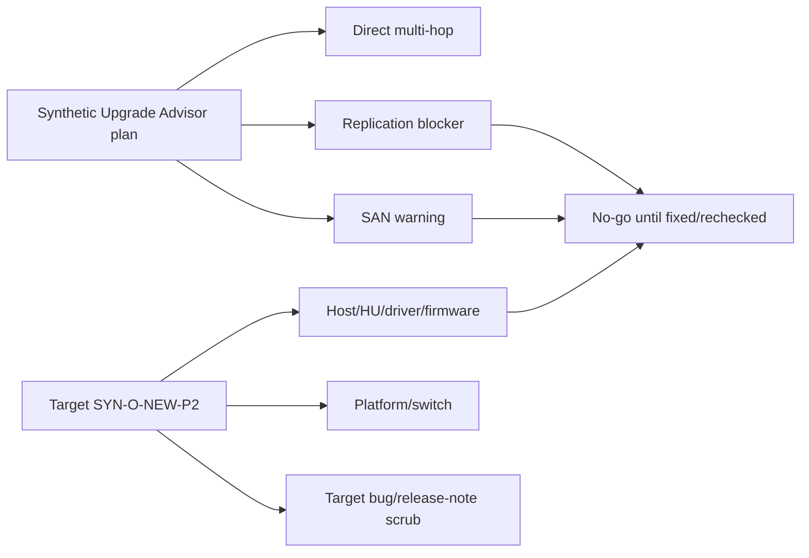

### Go/no-go table

| Gate | Initial | Remediation/proof | Final synthetic decision |
|---|---|---|---|
| Replication | Error | Owner repairs; lag/state stable across two checks | Go candidate |
| SAN paths | Warning | Host/SAN owners correct path policy; controlled failover passes | Go candidate |
| IMT target/intermediate | One host unknown | Authorized exact result supplied | Go candidate |
| Application | Batch baseline missing | App owner runs baseline and defines stop threshold | Go candidate |
| Revert | Assumed | Exact fictional constraints reveal feature limitation | Forward-recovery plan strengthened |

### Synthetic execution state

```mermaid
sequenceDiagram
    autonumber
    participant C as Change lead
    participant S as Storage/ANDU
    participant H as Host/application owners
    participant N as NetApp Support
    C->>S: Go after refreshed evidence
    S->>S: Begin fictional HA sequence
    H->>H: Monitor paths/sessions/transactions
    H-->>C: Brief retry spike within approved threshold
    S-->>C: Stage completes; cluster healthy
    C->>H: Run full app/backup/replication validation
    H-->>C: Validation passes
    C->>N: Confirm AutoSupport/target evidence in synthetic workflow
```

### Bounded recommendation

> **Finding:** The synthetic plan identifies a path but also a replication error, SAN warning, unknown host recipe, missing app baseline, and constrained revert. **Risk:** accepting the generated plan without customer readiness could cause data-protection, path, application, or recovery impact. **Recommendation:** clear and rerun every blocker/warning, validate exact current/intermediate/target HWU/IMT/bugs/release/app dependencies, establish baselines/thresholds, strengthen forward recovery, and use refreshed evidence for go/no-go. **Validation:** all nodes at target, full technical/protection/application/business proof, fresh AutoSupport, and hypercare trend stability. **Residual risk:** ANDU lowers disruption risk but cannot guarantee every client session or external dependency.

---

## 13. Discovery, JD Mapping, and Arti transfer

### Discovery questions

1. What business/security/lifecycle/defect/feature outcome drives the upgrade?
2. Which exact clusters/nodes/platforms/current patches/services/owners are in scope?
3. What current Upgrade Advisor/UHC/manual plan, AutoSupport time, target and path apply?
4. What direct/direct multi-hop/multi-stage/intermediate/mixed-version states occur?
5. Which errors/warnings/health/config conditions must be resolved and rechecked?
6. Are HWU/IMT/hosts/apps/backup/monitoring/switches/firmware fully supported at every state?
7. Which release cautions/known issues/bugs/advisories/default/limit changes apply?
8. Which MetroCluster/replication/SAN/NAS/security/key/cert/route/special considerations apply?
9. What ANDU impact assumptions, baselines, hold/no-go, forward/revert and Support plan exist?
10. What post-upgrade technical/application/business/hypercare proof closes the change?

### JD Mapping

| JD responsibility | Part 54 contribution | Arti's factual bridge and gap |
|---|---|---|
| Upgrade strategy | Business driver -> target -> path -> readiness -> validation | Microsoft upgrade/change planning transfers |
| Proactive risk | Clears blockers, target defects, compatibility and special configs | CRITSIT/prevention discipline transfers |
| System stability | HA/path/protection/capacity/performance/app gates | Enterprise service-health experience transfers |
| Customer recommendation | Evidence-based go/no-go, recovery and hypercare | Customer communications transfer |
| Support experience | AutoSupport/current plan/escalation pack | Microsoft support escalation transfers |
| Cross-functional governance | Coordinates storage/host/app/network/security/DR/change/Support | Multi-team ownership transfers |

### Honest interview answer

> "I would start with the business driver and exact current cluster state, use an authorized fresh Upgrade Advisor or UHC plan, validate target and direct/multi-hop/multi-stage path, resolve/recheck errors and warnings, and cross-check HWU, IMT, release notes, bugs, applications, replication, security and protocol behavior. I would frame ANDU as a conditional HA method, define go/no-go and forward/revert limits, and close only after application/business hypercare. I have not executed production ANDU."

---

## 14. Paper lab and self-test

### Paper lab

Build a synthetic two-cluster upgrade program: one standard HA cluster and one MetroCluster/SAN/replication-heavy environment.

```mermaid
flowchart LR
    DRIVER[Define drivers/success] --> PLAN[Mock Upgrade Advisor/UHC plans]
    PLAN --> TARGET[Compare targets/paths]
    TARGET --> READY[Prechecks/health/compat/special configs]
    READY --> RUN[Runbook/comms/go-no-go/recovery]
    RUN --> VALID[Technical/app/business validation]
    VALID --> HYP[Hypercare/lessons/closure]
```

### Inject these cases

- Stale AutoSupport plan.
- Direct multi-hop with an unvalidated intermediate host recipe.
- Multi-stage path requiring full stage checkpoint.
- Precheck error and warning with different handling.
- Platform/switch target compatibility conflict.
- SAN host wrong path count/policy.
- SnapMirror version/order dependency.
- External key management and certificate dependency.
- Session-sensitive application with low retry tolerance.
- Revert constraint discovered during planning.
- Upgrade job success but backup/application validation failure.

### Tasks

1. Define drivers, scope, services, success, alternatives and deferral risk.
2. Create authorized-tool fallback records with plan/source/freshness fields.
3. Compare target releases using full evidence matrix.
4. Validate every current/intermediate/target/mixed state and image/stage.
5. Build precheck/error/warning/owner/retest register.
6. Complete cluster/HA/storage/network/SAN/NAS/protection/security/app readiness.
7. Define conditional NDO assumptions, baselines, thresholds and hold/no-go gates.
8. Build exact runbook, communications, Support/escalation and forward/revert plan.
9. Define validation pyramid and hypercare checkpoints.
10. Answer Q1-Q8 aloud without claiming production execution.

### Lab pass checklist

- [ ] Business outcome and deferral risk are explicit.
- [ ] Tool plan and AutoSupport data are current and authorized.
- [ ] Target selection includes lifecycle/HWU/IMT/path/bugs/apps/operations.
- [ ] Every intermediate/mixed/stage state is validated.
- [ ] Errors are cleared; warnings have technical disposition and approval.
- [ ] MetroCluster/replication/SAN/NAS/security/special configurations are reviewed.
- [ ] ANDU/NDO is conditional; zero impact is never promised.
- [ ] Go/no-go, hold, forward recovery and exact revert limits are explicit.
- [ ] Job success is followed by technical/application/business/hypercare proof.
- [ ] No production ONTAP upgrade experience is claimed.

---

## 15. Official Source Anchors

**Date checked: 2026-08-24.** Public official NetApp sources only. Exact source/target/path/tool/precheck/revert instructions change; regenerate and recheck immediately before a real upgrade.

| Topic | Official source | Bounded use |
|---|---|---|
| Upgrade overview/ANDU | [Learn about ONTAP upgrades](https://docs.netapp.com/us-en/ontap/upgrade/index.html) | Major/patch, Upgrade Advisor/UHC/manual prep and ANDU HA intent |
| When/why/support cadence | [When to upgrade ONTAP](https://docs.netapp.com/us-en/ontap/upgrade/when-to-upgrade.html) | Current public upgrade rationale/cadence/support guidance; recheck exact page |
| Upgrade Advisor/UHC | [Prepare with Upgrade Advisor or Upgrade Health Checker](https://docs.netapp.com/us-en/ontap/upgrade/create-upgrade-plan.html) | Current access/AutoSupport/tool-role/blocker guidance |
| Target selection | [Choose a target ONTAP version](https://docs.netapp.com/us-en/ontap/upgrade/choose-target-version.html) | Current recommendation orientation; full validation still required |
| Manual preparation | [Prepare manually for an ONTAP upgrade](https://docs.netapp.com/us-en/ontap/upgrade/prepare.html) | Release notes/HWU/IMT/Config Advisor/path/LIF/routes/special checks/SP-BMC sequence |
| Upgrade paths | [Supported ONTAP upgrade paths](https://docs.netapp.com/us-en/ontap/upgrade/concept_upgrade_paths.html) | Direct/direct multi-hop/multi-stage and current tables/mixed-state boundaries |
| Automated prechecks | [Run automated pre-upgrade checks](https://docs.netapp.com/us-en/ontap/upgrade/automated-pre-checks.html) | Early validation, errors/warnings, MetroCluster repetition/current workflow |
| Hardware/SAN/MetroCluster support | [Confirm target hardware configuration](https://docs.netapp.com/us-en/ontap/upgrade/confirm-configuration.html) | HWU/switch/MetroCluster/IMT/SAN dependency requirements |
| Special configurations | [Special configuration checks](https://docs.netapp.com/us-en/ontap/upgrade/special-considerations.html) | Current mixed/MetroCluster/SAN/SnapMirror/security/NAS-specific checklist links |
| Upgrade duration | [ONTAP upgrade duration guidelines](https://docs.netapp.com/us-en/ontap/upgrade/how-long-upgrade-will-take.html) | Public typical guidelines only; actual environment differs |
| Upgrade/revert docs hub | [Upgrade and revert ONTAP](https://docs.netapp.com/us-en/ontap/setup-upgrade/index.html) | Select exact current revert/version procedure; not a generic rollback |
| Gated Digital Advisor | [Digital Advisor](https://activeiq.netapp.com/?source=onlinedocs) | Authorized Upgrade Advisor access only; never invent a plan |

### Source-use discipline

- Regenerate/review cluster-specific plan using fresh AutoSupport/current inventory.
- Record exact current/target/intermediate path, tool/report IDs/times and evidence date.
- Resolve/recheck errors; disposition warnings with accountable approval.
- Revalidate HWU, IMT, release notes, bugs/advisories, apps, protocols and special configs.
- Quote ANDU/NDO only with prerequisites and customer validation boundaries.
- Use exact version-specific forward/revert procedures; never promise one-click rollback.
- Protect customer plans, serials, topology, logs, credentials and case evidence.

---

## Likely Interview Questions

### Q1. How do you choose an ONTAP upgrade target?

> **Model answer:** "I start with the business driver and exact current state, use a fresh authorized Upgrade Advisor/UHC recommendation or current manual guidance, then validate support horizon, HWU/platform, IMT/hosts/apps, exact path, release notes/cautions, bugs/advisories, features/default changes, protection, capacity, operations and recovery."

### Q2. What is the difference among direct, direct multi-hop, and multi-stage?

> **Model answer:** "A direct path uses one supported target transition; direct multi-hop lets the automated process use an intermediate image within one initiated operation; multi-stage requires separate upgrades to supported intermediate releases with full checkpoints. Exact current path tables and mixed-version rules control."

### Q3. What does Upgrade Advisor provide, and what does it not replace?

> **Model answer:** "It uses eligible cluster/AutoSupport data to identify issues, recommend target/path and generate a cluster-specific plan. It does not replace freshness checks, HWU/IMT, release/bug/advisory review, application/protocol certification, customer readiness, change communications, recovery planning or post-upgrade validation."

### Q4. How do you handle precheck errors and warnings?

> **Model answer:** "Errors must be resolved and the checks rerun before proceeding under current guidance. Warnings receive technical investigation, corrective action where possible, documented risk disposition and approval, then refreshed checks. I do not bulk-ignore warnings or rely on an old report."

### Q5. What does nondisruptive mean for ANDU?

> **Model answer:** "ANDU is the recommended HA-based method designed to keep data serving during sequenced failover/upgrade operations. Customer impact still depends on HA health, paths, protocol retries, sessions, apps, load, special configurations and defects. I never promise zero impact; I define baselines, thresholds and business validation."

### Q6. Which special configurations need attention?

> **Model answer:** "I use the exact current checklist, including mixed versions, MetroCluster, SAN pathing, SnapMirror/version/order/topology, encryption/key management, FIPS/SSH/LDAP, netgroups, session-oriented protocols, ransomware warnings and release-specific features. Each has an owner and evidence."

### Q7. Why is revert not a standard rollback plan?

> **Model answer:** "Revert is a separate version-specific operation with prerequisites, feature/configuration/data-state constraints and external compatibility implications. During failure I first stabilize and preserve evidence, use documented forward recovery where safe, and involve Support/change authority before an exact supported revert or alternate recovery."

### Q8. How does your background transfer, and what remains a gap?

> **Model answer:** "Microsoft enterprise upgrades, Azure/M365 change governance and CRITSIT work give me compatibility, go/no-go, communication, recovery, validation and hypercare discipline. I have not generated a production Upgrade Advisor plan or executed ONTAP ANDU/revert, so experienced authorized owners and current procedures control execution."

---

## 30-Second Memory Hooks

- **Upgrade:** Business outcome plus complete state transition, not image install.
- **Target:** Recommendation is a candidate; validate the whole stack.
- **Path:** Direct, direct multi-hop, or multi-stage from current official table.
- **Mixed state:** Temporary and constrained; exact compatibility rules apply.
- **Upgrade Advisor:** Cluster-specific plan from eligible data; still needs review.
- **UHC:** Onsite health/plan option with current setup requirements.
- **Prechecks:** Errors clear; warnings investigate/disposition; rerun fresh.
- **Special configs:** MetroCluster, SAN, SnapMirror, keys, security, sessions, routes.
- **ANDU:** HA-based nondisruptive method, conditional customer outcome.
- **Go/no-go:** Current evidence, owners, thresholds, recovery and Support ready.
- **Validation:** Node -> cluster -> storage -> network -> protection -> app -> customer.
- **Revert:** Version-specific migration, not Undo.
- **Hypercare:** Validate next business/backup/replication/peak cycles before closure.
- **Arti's bridge:** Change governance transfers; production ONTAP execution does not.

---

## Completion Checklist

- [ ] Define major/patch, Upgrade Advisor, UHC, ANDU, direct, direct multi-hop, multi-stage, mixed state and revert.
- [ ] Establish business drivers, alternatives, deferral risk and success hierarchy.
- [ ] Compare candidate targets across lifecycle/HWU/IMT/path/bugs/apps/operations.
- [ ] Use fresh authorized Upgrade Advisor/UHC/AutoSupport evidence or explicit fallback.
- [ ] Validate every current/target/intermediate/stage/mixed-version state.
- [ ] Run early and refreshed prechecks; clear errors and disposition warnings.
- [ ] Validate cluster/HA/storage/network/capacity/performance/protection readiness.
- [ ] Validate hosts/apps/backup/monitoring/protocol/session behavior.
- [ ] Review MetroCluster/replication/SAN/NAS/security/key/cert/special configs.
- [ ] Explain ANDU/NDO without promising zero impact.
- [ ] Build runbook, communications, go/no-go, hold and Support/escalation plans.
- [ ] Build forward recovery and exact version-specific revert decision boundaries.
- [ ] Validate technical/application/business/AutoSupport outcomes and hypercare.
- [ ] Recreate the fully synthetic Blue Harbor Bank scenario.
- [ ] Complete the paper lab and answer Q1-Q8 aloud.
- [ ] State the No-production-NetApp boundary and exact non-claim accurately.
- [ ] Regenerate/recheck all current sources immediately before customer use.

---

*Next suggested section:* [Part 55 - Firmware, Host, Hypervisor, Switch, and Multipath Upgrade Coordination](Part-55-firmware-host-switch-upgrade-coordination.md)