# Part 55 - Firmware, Host, Hypervisor, Switch, and Multipath Upgrade Coordination

> **Section goal:** Coordinate a multi-team storage-stack change so that every current, temporary, and target state remains supportable, observable, and recoverable. By the end, Arti should be able to map controllers, disks, shelves, adapters, switches, HBAs/NICs, drivers, host operating systems, hypervisors, Host Utilities, multipath, guests, applications, backup, and monitoring; prevent changes from colliding with shared failure domains; sequence dual-path/fabric and HA/quorum operations; define rollout rings, RACI, test/hold criteria, rollback and forward recovery; and preserve an audit-ready evidence pack.

Covers index item **55** and maps directly to job-description responsibilities for upgrade coordination, proactive risk reduction, system stability, interoperability validation, lifecycle execution, customer change governance, technical leadership, support readiness, and cross-functional communication.

**Explicit nonclaim:** Arti has not coordinated a production NetApp cross-stack firmware, host, hypervisor, switch, or multipath upgrade.

**Privacy and access boundary:** Customer inventories, configurations, compatibility results, credentials, switch and host artifacts, maintenance plans, and recovery evidence require authorization and controlled handling.

**Synthetic-evidence rule:** Every component, version, date, compatibility result, test, rollback state, and recommendation below is fictional and sanitized; it is not a live vendor matrix or customer change result.

**Version caveat:** Firmware recommendations, Host Utilities, host OS/hypervisor updates, HBA/NIC drivers and firmware, multipath/DSM/NMP settings, switch OS/RCF, ONTAP compatibility, procedures, reboot needs, path states, and upgrade order change by platform, protocol, vendor, release, and topology. A **current-doc check** means freezing exact inventory; validating current, target, and every temporary state in current IMT/HWU/product/vendor documentation; and reopening exact runbooks immediately before each wave.

This Part contains no real driver/firmware bundle, switch command, RCF, path-count promise, quorum threshold, timeout, host setting, maintenance sequence, or rollback command. Exact source instructions and customer change authority control. Public examples provide method only; IMT, HWU, downloads, cases, and some vendor matrices are gated.

> **No-production-NetApp boundary:** Arti does not claim production cross-stack NetApp upgrade coordination. Every customer, component, version, fabric, path, ring, result, and recommendation below is synthetic. Her factual strengths are Microsoft enterprise upgrades, Windows/Azure/M365 dependency management, DNS/TCP/TLS/network troubleshooting, driver and OS servicing, cluster/change governance, CRITSIT communication, testing, and recovery planning. The explicit non-claim is: **she has not upgraded production NetApp firmware, Windows/Linux Host Utilities, ESXi storage settings, SAN/cluster/storage switch software, HBA/NIC driver/firmware, multipath configuration, or coordinated a production NetApp stack change.**

---

## 1. The whole stack is the unit of change

### Plain-English deep-dive: the suspension bridge problem

A suspension bridge stays safe because cables, towers, deck, anchors, sensors, and traffic rules work together. Replacing two “redundant” cables at once can remove the safety margin. A storage stack behaves similarly: storage, network, host, hypervisor, guest, application, protection, and monitoring are one dependency system.

**Why it matters:** individually approved changes can combine into an outage when they consume the same path, HA partner, quorum vote, maintenance window, or recovery option.

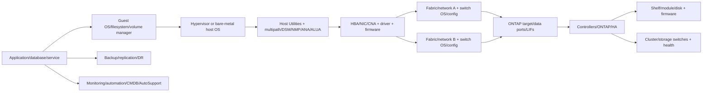

### Core terms

| Term | Plain meaning | Why it matters |
|---|---|---|
| **Dependency graph** | Map of components and service relationships | Exposes hidden shared risk and ordering |
| **Compatibility snapshot** | Exact versions/settings/topology at one point in a change | Proves current, temporary, or target state |
| **Temporary/mixed state** | Combination that exists between endpoints during rollout | Often omitted from matrix checks |
| **Failure domain** | Shared element whose loss affects several paths/services | Two paths sharing it are not independent |
| **Change collision** | Concurrent/sequenced changes interact through a shared dependency | Can invalidate tests and recovery |
| **Blast radius** | Systems/services potentially affected by a change/failure | Determines ring and window design |
| **Rollout ring** | Increasingly broad deployment cohort after validation | Limits exposure and creates learning |
| **Hold point** | Explicit decision checkpoint between steps/rings | Prevents automation from continuing through ambiguity |
| **Rollback** | Return a component to prior state under supported procedure | May be unavailable after state/data/config changes |
| **Forward recovery** | Move to a corrected supported state without returning fully backward | Often safer when downgrade is constrained |
| **RACI** | Responsible, Accountable, Consulted, Informed role model | Prevents owner ambiguity during change/incident |

---

## 2. Build the dependency graph and inventory

### Entity model

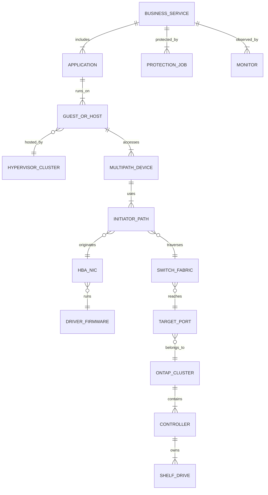

### Exact inventory record

| Layer | Current evidence | Target evidence | Required identity |
|---|---|---|---|
| ONTAP/controllers | Current release/HA/platform/ports | Target release/state | Cluster/node UUID, serial/model, release |
| Disks/shelves | Models/modules/drives/firmware/pathing | Recommended compatible firmware | Exact part/model/serial/bay/module |
| Cluster/storage switches | Model/OS/RCF/health/ports | Supported target software/config | Exact switch/role/serial/port/config |
| SAN/IP switches | Model/OS/config/zones/VLANs | Vendor/IMT-supported target | Fabric, domain, port, peer, ISL/MLAG/vPC context |
| HBA/NIC/CNA | Model/part/slot/ports | Same/new target | Exact PCI/device/WWPN/IQN/NQN/MAC |
| Driver/firmware | Loaded/active versions/settings | Exact paired target | Per adapter/port and boot BIOS if relevant |
| Host OS | Edition/distribution/build/kernel | Exact update | Host/cluster, boot mode, vendor lifecycle |
| Hypervisor | Product/build/vCenter/tools | Exact target | Cluster/host/baseline/image/profile |
| Host Utilities | Product/version/install/settings | Exact supported target | OS/protocol/MPIO choice |
| Multipath | DSM/NMP/native version/policy/paths/timeouts | Exact supported settings | Device/path/controller/fabric mapping |
| Guest/application | OS/app/DB/agent/version | Certified target | Service owner, transaction, maintenance tolerance |
| Backup/monitoring | Product/version/jobs/integrations | Supported target | Restore tests, APIs, alert owners |

### Source hierarchy

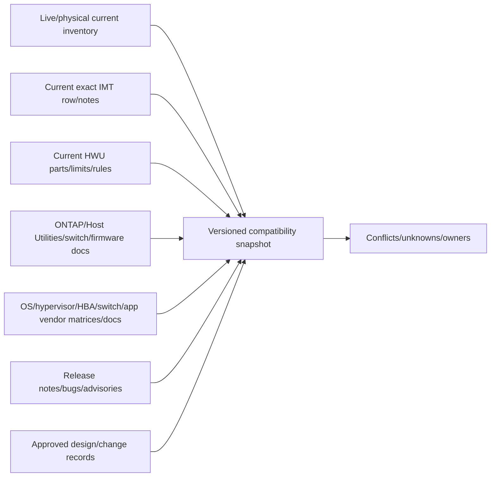

---

## 3. Compatibility snapshots for every state

### Plain-English deep-dive: inspect every stepping stone

Knowing the first and last stones are strong does not make the river crossing safe; every stone touched in between must hold. Upgrade programs often validate “before” and “after” while overlooking the days or minutes when one fabric, host, driver, controller, or switch runs a different version.

**Why it matters:** temporary state can be the highest-risk configuration.

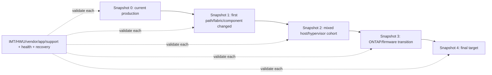

### Snapshot schema

| Field group | Required content |
|---|---|
| Scope/time | Snapshot ID, effective interval, ring/wave, services/assets |
| Storage | ONTAP/platform/controller/shelf/disk/firmware |
| Connectivity | Target ports, switch/fabric OS/config, cable/path map |
| Host | OS/kernel/hypervisor/HBA/NIC/driver/firmware/boot |
| Host storage | Host Utilities, DSM/NMP/native multipath, path policy/timeouts/states |
| Consumers | Guests/apps/DBs/backups/monitoring/automation versions |
| Compatibility | Exact IMT/HWU/vendor/app rows/notes/evidence dates |
| Health | HA/quorum, paths, links, jobs, capacity/performance, replication |
| Recovery | Remaining redundancy, rollback/forward options and dependencies |

### State decision

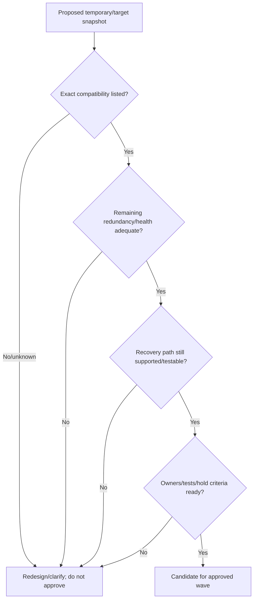

---

## 4. Bundles and dependency sequencing

A **bundle** is a validated set of component versions that must be treated together, such as OS + HBA driver + adapter firmware + Host Utilities + multipath settings.

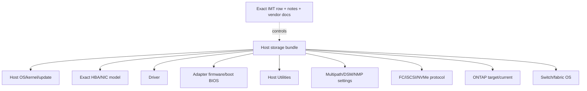

### Sequence-design questions

1. Which dependency must exist before another component can move?
2. Does the target support both old and new peers during transition?
3. Which update needs a host/controller/switch reboot or link reset?
4. Which redundancy remains while one path/fabric/node is offline?
5. Are drivers and firmware upgraded together or in a prescribed order?
6. Does Host Utilities change MPIO/registry/HBA settings and require reboot?
7. Can guest/app/backup/monitoring versions tolerate both host/ONTAP states?
8. What exact observation proves a step succeeded before the next starts?

### Topological ordering

```mermaid
flowchart LR
    SUPPORT[Validate target/mixed recipes] --> BASE[Repair health/path/config baselines]
    BASE --> TOOL[Update management/monitoring/backup compatibility where prerequisite]
    TOOL --> FAB1[Upgrade one redundant path/fabric cohort]
    FAB1 --> TEST1[Path-loss/failback/service test]
    TEST1 --> HOST1[Upgrade canary host bundle]
    HOST1 --> TEST2[Host/app/backup validation]
    TEST2 --> STORAGE[ONTAP/firmware step under exact current plan]
    STORAGE --> HOSTREST[Remaining host/hypervisor rings]
    HOSTREST --> FAB2[Second path/fabric only when current procedure/order supports]
    FAB2 --> FINAL[Final compatibility/DR/service evidence]
```

**Boundary:** this is a generic dependency pattern, not a universal NetApp ordering rule. Current official documentation can prescribe a different order; for example, one current ONTAP preparation page provides specific ordering guidance for supported switch software relative to ONTAP. The exact customer plan controls.

---

## 5. Dual paths, dual fabrics, and failure domains

### Path model

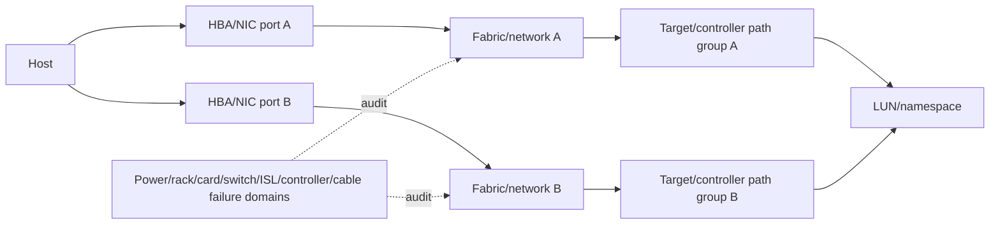

### Independence audit

| Layer | Path A | Path B | Shared dependency to expose |
|---|---|---|---|
| Host | Adapter/port/PCI root | Adapter/port/PCI root | Same HBA, driver defect, host reboot |
| Fabric/network | Switch/domain/VLAN/ISL | Switch/domain/VLAN/ISL | Shared upstream, config automation, power |
| Storage target | LIF/port/adapter/controller | LIF/port/adapter/controller | Same controller/card/switch |
| Physical | Cable/transceiver/rack/PDU | Cable/transceiver/rack/PDU | Shared tray/patch panel/power |
| Software | Driver/firmware/policy | Driver/firmware/policy | Common version defect/misconfiguration |
| Operations | Change owner/runbook/tool | Change owner/runbook/tool | One command affects both fabrics |

### One-side-at-a-time discipline

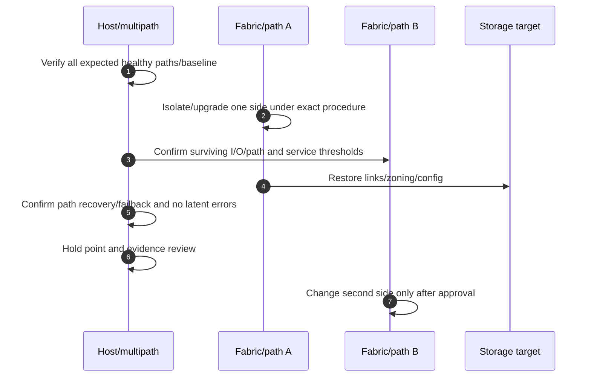

### Plain-English deep-dive: two lanes can share one tunnel

Two road lanes look redundant until both enter the same tunnel. Two storage paths can share a switch, HBA, controller, power source, config push, or driver defect. **Why it matters:** count failure domains, not path lines on a dashboard.

---

## 6. HA, quorum, cluster, and switch considerations

### Availability layers

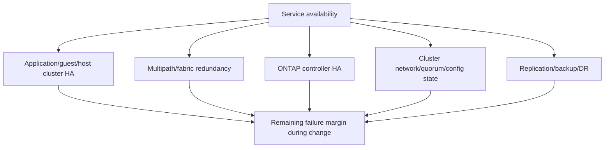

### Quorum/HA questions

- Which nodes/controllers/hosts/switches participate in quorum or HA?
- What minimum healthy membership and voting state does the exact product require?
- Which planned reboot/link loss overlaps an existing degraded member?
- Does a host cluster move workload onto storage paths also under maintenance?
- Can ONTAP takeover combine with hypervisor failover or switch reload?
- Is replication/backup recovery still available if the active service path fails?
- What current procedure prevents partition, split-brain, isolated node, or double failure?

### Failure-budget ledger

| Redundancy resource | Normal | Consumed by current fault | Consumed by planned step | Remaining | Decision |
|---|---|---|---|---|---|
| ONTAP HA controllers | Exact current |  |  |  | Go/hold |
| Cluster switches/links | Exact current |  |  |  | Go/hold |
| SAN/IP fabrics | Exact current |  |  |  | Go/hold |
| Host paths/HBAs | Exact current |  |  |  | Go/hold |
| Hypervisor/host capacity | Exact current |  |  |  | Go/hold |
| Replication/backup | Exact current |  |  |  | Go/hold |
| Operational staff/Support | Exact current |  |  |  | Go/hold |

### Change safety gate

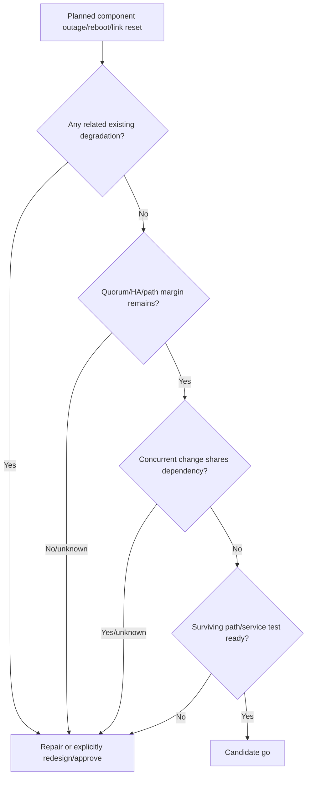

---

## 7. Windows, Linux, and vSphere coordination

### Host-specific concerns

| Platform | Upgrade bundle | Validation focus |
|---|---|---|
| Windows | OS/build, HBA/NIC driver+firmware, Windows Host Utilities, MPIO/DSM, registry/HBA parameters, cluster roles | Reboot, path count/state/policy, storage failover handling, Windows cluster/app/backup |
| Linux | Distribution/kernel, inbox/vendor driver, HBA firmware/tools, Linux Host Utilities where applicable, native multipath, udev/filesystem/LVM | Boot/initramfs, paths/WWIDs/policy, failover/recovery, DB/app/backup |
| VMware vSphere/ESXi | ESXi build/image, HBA/NIC driver+firmware, NMP/SATP/PSP/native NVMe, vCenter/tools/integration, guest settings | Maintenance/evacuation capacity, path groups/policy, datastores/vVols, VM/app/backup |
| Guest OS | Guest tools/drivers/timeouts/filesystem/app agents | Underlying APD/PDL/path/failover behavior and transaction recovery |

### Host ring sequence

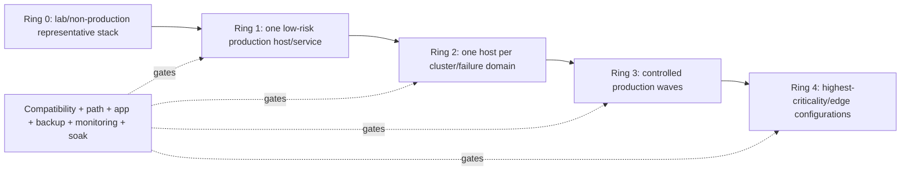

### Ring design fields

- Representative hardware/protocol/topology/application mix.
- Blast radius and business criticality.
- Maintenance/evacuation/failover capacity.
- Exact current/target snapshot and known exceptions.
- Test matrix, soak duration, threshold, owner, hold/rollback criteria.
- Learning carried into runbook before next ring.

### Windows/Host Utilities change boundary

Current public Windows Host Utilities docs show that installation choices can set registry and HBA parameters and that an upgrade can require reboot. Therefore record before/after values and validate MPIO/HBA behavior; do not treat it as a passive utility update.

### Linux boundary

Current Linux Host Utilities docs describe management/support collection roles, OS/HBA package dependencies, and protocol limits that vary by release. Exact IMT and distribution-specific host docs control. Do not assume the utility changes host settings or supports every protocol/version.

### vSphere boundary

Current vSphere host docs describe exact-version multipathing, path groups/policies, SAN boot, vVol, guest tuning and known-issue context. Validate the current vSphere/ONTAP/HBA/driver/firmware/ONTAP tools recipe and guest/application behavior; do not copy settings between versions.

---

## 8. Switch, adapter, and firmware coordination

### Switch roles

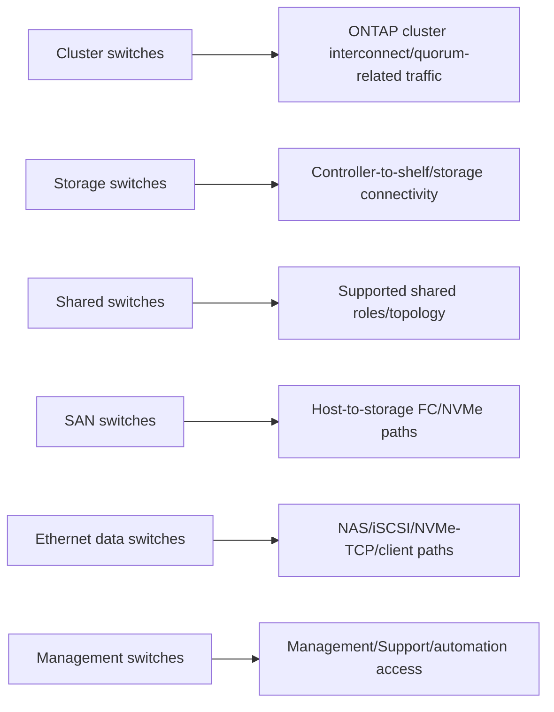

### Firmware domains

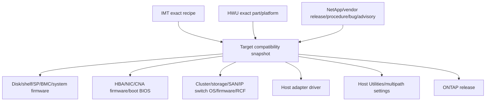

### Firmware/change record

| Field | Required content |
|---|---|
| Component | Exact model/part/serial/slot/port/fabric/role |
| Current | Active firmware/driver/OS/config, not package name only |
| Target | Exact supported target/bundle and rationale |
| Dependencies | ONTAP/OS/HU/multipath/switch/app/boot/RCF |
| Procedure | Current exact source/version/checksum/staging/reboot |
| Resilience | Surviving path/fabric/node/quorum/capacity |
| Recovery | Downgrade support, config backup, rescue image, forward option |
| Validation | Version, config, links, paths, health, traffic, service, monitoring |

### Switch health

Current NetApp switch documentation separates cluster, storage, shared, and switch-health workflows. Use the exact model procedure and monitor/verify health before and after; never generalize commands/RCFs among models.

---

## 9. Change collisions and integrated calendar

### Collision types

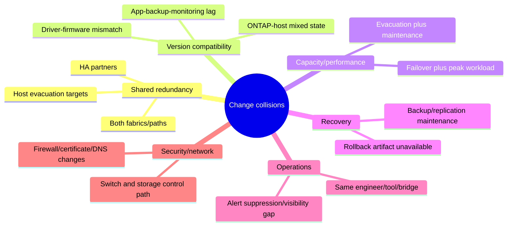

### Collision matrix

| Change A | Change B | Shared dependency | Risk | Control |
|---|---|---|---|---|
| Fabric A switch upgrade | Fabric B maintenance | All storage paths | Total path loss | Separate windows; prove A recovered before B |
| ONTAP ANDU | Host OS/HBA reboot | Same app I/O paths | HA and host redundancy both consumed | Freeze host changes during storage sequence |
| Hypervisor evacuation | Remaining host firmware | Capacity/failover target | Overload/no landing zone | Capacity and ring gate |
| Backup upgrade | Storage/ONTAP upgrade | Recovery and validation | No trustworthy restore/backup proof | Preserve independent recovery control |
| Monitoring change | Any infrastructure change | Detection/telemetry | Blind failure/false success | Stable independent monitoring |
| Network DNS/firewall/cert | AutoSupport/management change | Support/control plane | Lost escalation/control access | Separate and validate management path |

### Integrated calendar gate

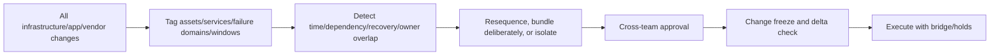

### Freeze/delta check

Immediately before a wave, compare actual inventory, health, open incidents, approved runbook, compatibility snapshot, other changes, staff/Support availability, and recovery artifacts. Any unexplained delta reopens go/no-go.

---

## 10. RACI and command structure

**RACI** means:

- **Responsible:** performs the task.
- **Accountable:** owns final outcome/decision; exactly one where practical.
- **Consulted:** provides required two-way expertise.
- **Informed:** receives status/impact communication.

### RACI matrix

| Workstream | Accountable | Responsible | Consulted | Informed |
|---|---|---|---|---|
| Integrated design/sequence | Customer change/service owner | Lead architect/TAM coordinator | Storage, host, network, app, security, backup, vendors | Operations/stakeholders |
| ONTAP/storage firmware | Storage owner | Storage engineers | NetApp Support, app/DR/network | Change bridge |
| SAN/IP/cluster/storage switches | Network/SAN or storage owner by role | Switch engineers | Storage, host, vendor Support | Change bridge |
| HBA/NIC driver+firmware | Host/platform owner | Windows/Linux/vSphere engineers | Adapter vendor, SAN/storage | App owners |
| Host Utilities/multipath | Host/platform owner | Host engineers | NetApp/SAN/storage | App owners |
| Hypervisor/guest/app | App/platform owner | Virtualization/app teams | Storage/network/backup/security | Business owner |
| Backup/DR validation | Recovery owner | Backup/DR teams | App/storage/security | Sponsor |
| Go/no-go | Customer change authority | Change lead gathers evidence | All accountable owners/Support | Stakeholders |
| Incident/recovery | Incident commander | Technical workstreams | NetApp/vendors/security/business | Executives/users |

### Command structure

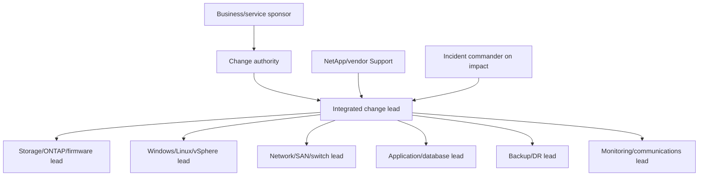

### Decision rights

- Workstream owner can stop their unsafe step.
- Integrated change lead pauses progression on threshold/evidence ambiguity.
- Customer change authority decides proceed/defer/recover with accountable owners.
- Incident commander takes command when customer impact crosses incident threshold.
- NetApp/vendor Support advises authoritative procedures/supportability; customer authority owns business risk acceptance.

---

## 11. Test matrix and observability

### Test dimensions

| Test class | Before | During/hold | After/soak |
|---|---|---|---|
| Compatibility | Exact current/mixed/target rows and notes | No unapproved inventory delta | Final exact snapshot/peer review |
| Hardware/firmware | Versions/health/sensors/errors | No new failure/degraded redundancy | Target versions and clean health |
| Paths/fabrics | Expected count/state/policy/latency/errors | Surviving I/O within threshold | All paths recover/failback correctly |
| HA/quorum | Members/votes/partners/links healthy | No unplanned member loss/partition | Full membership/HA restored |
| Host/hypervisor | Cluster capacity, datastores/devices, boot | Reboot/evacuation/migration within threshold | Host/VM/device/setting validation |
| Application | Transactions/sessions/batch/users | Stop on agreed error/latency/integrity threshold | Functional, batch, peak and owner signoff |
| Backup/DR | Recent successful backup/restore/replication | Recovery control remains independent | New backup/restore and replication proof |
| Monitoring/Support | Alerts/logs/time/AutoSupport/case bridge | Independent visibility maintained | Telemetry/inventory/documentation current |

### Test flow

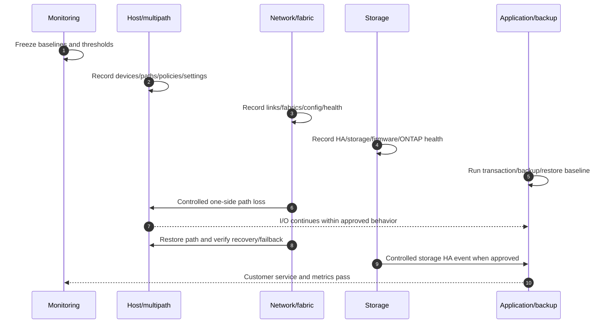

### Stop/hold criteria

- Unexpected loss or wrong state/policy of surviving paths.
- Quorum/HA/member/link degradation beyond approved plan.
- New hardware/firmware/switch health fault.
- Data integrity, filesystem, datastore, boot, cluster, or transaction error.
- Replication/backup/restore control unavailable or RPO/RTO breach.
- Performance/capacity exceeds approved threshold.
- Monitoring, management, Support, or communication bridge lost.
- Actual version/config differs from compatibility snapshot/runbook.
- Rollback/forward artifact or accountable owner unavailable.

---

## 12. Rollback, forward recovery, and evidence preservation

### Plain-English deep-dive: reverse gear may not fit the new road

After crossing a one-way bridge and changing cargo configuration, simply driving backward may be illegal or unsafe. Firmware, drivers, host OS, hypervisor, switch config, ONTAP, filesystem, and application state can also make downgrade unavailable. **Why it matters:** design rollback per component and a coordinated forward-recovery path for the whole snapshot.

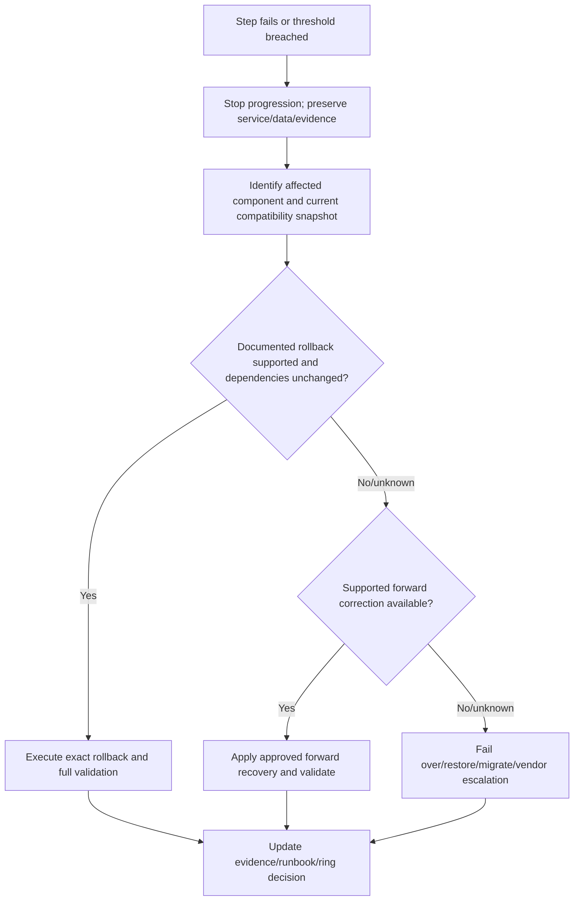

### Recovery plan by component

| Component | Backward question | Forward option | Evidence/artifact |
|---|---|---|---|
| Switch | Is software/config/RCF downgrade supported? | Correct config/upgrade/rescue/replacement | Config backup, image/checksum, console access |
| HBA/NIC firmware | Is firmware downgrade supported with driver/boot? | Supported paired firmware/driver | Vendor package, config, alternate path |
| Host OS/hypervisor | Is uninstall/rollback supported after state changes? | Fix-forward patch/image/rebuild/evacuate | Image/profile/backup/boot media |
| Host Utilities/multipath | Can package/settings revert safely? | Repair/reinstall supported target settings | Before registry/config/path inventory |
| ONTAP/firmware | Exact version-specific revert/downgrade constraints? | Support-guided forward recovery | Upgrade plan/status/AutoSupport/protection |
| App/backup/monitoring | Are schemas/catalogs/configs backward compatible? | Restore service/config or update integration | Backups, export, transaction checkpoint |

### Evidence preservation

- UTC timeline, actor, exact step, ring/wave, system/component IDs.
- Before/after/current versions and active firmware/configuration.
- Path/link/quorum/HA/health/application/backup/monitoring state.
- Full redacted errors/logs/events/upgrade status and commands run.
- IMT/HWU/vendor/source references and evidence dates.
- Recovery decision, authority, artifacts, result, residual risk.
- Secure location and privacy classification; no secrets/session tokens.

---

## 13. Evidence pack, communications, and customer recommendation

### Evidence pack structure

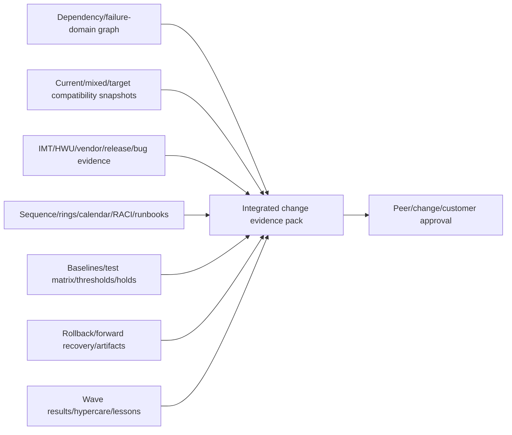

### Communication checkpoints

| Checkpoint | Content |
|---|---|
| Design review | Scope, graph, compatibility states, collisions, options, risks |
| Wave readiness | Inventory delta, health, staffing, runbook, tests, recovery, go/no-go |
| Step/hold | Exact state, surviving redundancy, test result, issue/deviation, next decision |
| Impact | Customer effect, incident command, stop state, evidence, action, update time |
| Wave completion | Target versions, health, app/backup/monitoring proof, soak status |
| Program closure | Final snapshot, unresolved exceptions, lessons, lifecycle/CMDB/support updates |

### Recommendation chain

```mermaid
flowchart LR
    OBS[Exact stack inventory and lifecycle drivers] --> COMP[Current/mixed/target compatibility]
    COMP --> COLL[Failure-domain/collision/sequence analysis]
    COLL --> RISK[Availability/support/recovery/business risk]
    RISK --> OPT[Resequence/bundle/ring/defer/alternative]
    OPT --> REC[Owners/dates/windows/runbooks/tests/recovery]
    REC --> PROOF[Wave and customer outcome evidence]
    PROOF --> RES[Residual risk/next cadence]
```

### Customer-safe wording

> “The dated inventory shows `<scope/current stack>`. Current IMT/HWU/vendor evidence validates `<states>` and leaves `<gaps>`. Proposed changes share `<failure domains/dependencies>`, so we recommend `<sequence/rings/collision controls>` rather than concurrent execution. Go requires `<health/compatibility/tests/owners/recovery>`. Success is `<technical/application/business proof>`; residual risk is `<remaining uncertainty>` with owner/date.”

---

## 14. Fully synthetic sanitized scenario: integrated upgrade coordination

> **Synthetic boundary:** `Redwood Media`, every version, device, fabric, path, ring, metric, result, and source reference below is invented. No table is an IMT/HWU/vendor output or production runbook.

### Synthetic dependency inventory

| Layer | Current | Target | Planned owner |
|---|---|---|---|
| ONTAP | `SYN-O1` | `SYN-O2` | Storage |
| Shelf firmware | `SYN-SF1` | `SYN-SF2` | Storage |
| SAN fabrics | `SYN-FAB-A/B-1` | `SYN-FAB-A/B-2` | SAN network |
| Windows hosts | `SYN-W1/HU1/DRV1/FW1` | `SYN-W2/HU2/DRV2/FW2` | Windows |
| Linux hosts | `SYN-L1/HU1/DRV1/FW1` | `SYN-L2/HU2/DRV2/FW2` | Linux |
| vSphere | `SYN-V1/NMP1` | `SYN-V2/NMP2` | Virtualization |
| Backup/monitoring | `SYN-B1/M1` | `SYN-B2/M2` | Recovery/operations |

### Initial collision plan

```mermaid
flowchart LR
    FAB[Fabric A upgrade] --> SHARED[Shared failure margin]
    ONTAP[ONTAP ANDU] --> SHARED
    HOST[Canary host reboot] --> SHARED
    BACK[Backup platform maintenance] --> REC[Recovery margin]
    ONTAP --> REC
    MON[Monitoring agent migration] --> VIS[Visibility margin]
    FAB --> VIS
    SHARED --> NOGO[Initial schedule is no-go]
    REC --> NOGO
    VIS --> NOGO
```

### Redesigned rings and sequence

```mermaid
gantt
    title Synthetic Redwood Media coordinated waves
    dateFormat  YYYY-MM-DD
    section Readiness
    Freeze inventory and validate all snapshots :a1, 2026-09-01, 14d
    Repair paths and verify backup/monitoring    :a2, after a1, 7d
    section Ring 0-1
    Lab and canary host bundle                  :b1, after a2, 7d
    Soak and application validation             :b2, after b1, 7d
    section Fabrics/Storage
    Fabric A then restore/test                  :c1, after b2, 3d
    ONTAP and shelf firmware under exact plans  :c2, after c1, 5d
    Fabric B then restore/test                  :c3, after c2, 3d
    section Rings 2-4
    Remaining host/hypervisor waves             :d1, after c3, 21d
    Backup/monitoring target updates             :d2, after d1, 5d
    section Closure
    Peak/DR/restore/telemetry validation         :e1, after d2, 10d
```

### Compatibility snapshot table

| Snapshot | Synthetic state | Result | Gate |
|---|---|---|---|
| `S0` | All current | Listed/healthy in fictional evidence | Baseline |
| `S1` | Fabric A target, B current | Listed but one old HBA firmware note | Resolve before canary |
| `S2` | Canary hosts target, ONTAP current | Listed exact bundles | Path/app/backup soak |
| `S3` | ONTAP target, remaining hosts current | One Linux combination unknown | Split Linux wave; authoritative clarification |
| `S4` | All target | Listed fictional rows | Final service/DR proof |

### RACI excerpt

| Decision | A | R | C | I |
|---|---|---|---|---|
| Integrated go/no-go | Customer change authority | Change lead | All workstream owners + Support | Business/operations |
| Fabric A/B steps | SAN owner | SAN engineers | Storage/host/app | Change bridge |
| Host rings | Platform owner | Windows/Linux/vSphere teams | SAN/storage/app/backup | Business owners |
| Incident recovery | Incident commander | Assigned technical leads | Vendors/business/security | Stakeholders |

### Bounded recommendation

> **Finding:** The synthetic initial schedule simultaneously consumes path, storage HA, recovery, and monitoring margins; one mixed Linux state and an HBA firmware note are unresolved. **Risk:** individually valid changes could combine into total path loss, poor detection, unavailable recovery, or unsupported temporary state. **Recommendation:** freeze the initial schedule, resolve compatibility gaps, restore baseline path/backup/monitoring health, and execute ringed one-failure-domain-at-a-time waves with hold tests and an integrated RACI. **Validation:** every snapshot listed/current, expected paths and quorum/HA restored, application/backup/restore/DR tests pass, monitoring and AutoSupport remain fresh, and final inventory matches evidence. **Residual risk:** model-specific procedures, downgrade constraints, and gated matrices require authorized owners at each wave.

---

## 15. Discovery, JD Mapping, and Arti transfer

### Discovery questions

1. Which business services/apps/guests/hosts/hypervisors connect to which storage objects and paths?
2. Which exact ONTAP/controllers/disks/shelves/adapters/switches/firmware versions run?
3. Which exact Windows/Linux/vSphere/Host Utilities/multipath/HBA/NIC driver/firmware bundles run and target?
4. Which current, target and every temporary mixed-state IMT/HWU/vendor/app records apply?
5. Which path/fabric/HA/quorum/host-capacity/backup/monitoring failure margins exist?
6. Which planned/active changes share assets, time, failure domains, owners, recovery or observability?
7. What topological order and rollout rings minimize blast radius while preserving supportability?
8. What baseline/test/threshold/hold/soak/customer outcome gates each step/ring?
9. Which rollback is documented per component, and what coordinated forward recovery exists?
10. Who is Responsible/Accountable/Consulted/Informed, and who can stop/command recovery?

### JD Mapping

| JD responsibility | Part 55 contribution | Arti's factual bridge and gap |
|---|---|---|
| Upgrade coordination | End-to-end dependency/snapshot/sequence/ring method | Microsoft enterprise servicing transfers |
| System stability | Preserves path/HA/quorum/recovery/monitoring margins | CRITSIT/service-health discipline transfers |
| Interoperability | Validates exact current/mixed/target recipes | Cross-stack support analysis transfers |
| Proactive risk | Detects change collisions and unsupported temporary states | Change calendar/risk reasoning transfers |
| Customer communication | RACI, checkpoints, hold/incident/closure narrative | Executive and technical communication transfers |
| Support readiness | Audit-ready evidence/recovery/escalation pack | Microsoft escalation discipline transfers |

### Honest interview answer

> “I would model the whole service from application and guest through host/hypervisor, Host Utilities/multipath, HBA/NIC driver and firmware, dual fabrics, ONTAP controllers, shelves/disks, backup and monitoring. I would freeze exact current/target/intermediate compatibility snapshots, audit true failure-domain independence, detect change collisions, and sequence one side/ring at a time with hold tests, RACI and recovery artifacts. My production coordination experience is Microsoft, not NetApp stack execution, so current IMT/HWU/vendor procedures and experienced owners control every real step.”

---

## 16. Paper lab and self-test

### Paper lab

Build a synthetic coordinated-upgrade program for two ONTAP clusters, four shelves, two cluster switches, two SAN fabrics, twelve Windows/Linux/ESXi hosts, twenty guests, six applications, backup, replication, and monitoring.

```mermaid
flowchart LR
    INV[Build exact stack inventory] --> GRAPH[Dependency/failure-domain graph]
    GRAPH --> SNAP[Current/mixed/target compatibility snapshots]
    SNAP --> COLL[Collision and failure-budget analysis]
    COLL --> SEQ[Topological sequence and rollout rings]
    SEQ --> RACI[RACI/runbooks/tests/recovery/comms]
    RACI --> SIM[Simulate hold/failure/forward recovery]
    SIM --> PACK[Evidence pack and customer review]
```

### Inject these cases

- Two nominal paths share one switch/power/config tool.
- ONTAP ANDU collides with host reboot and fabric maintenance.
- Driver target requires different adapter firmware than initially planned.
- Windows Host Utilities changes settings and requires reboot.
- Linux Host Utilities/protocol expectation is incorrect.
- vSphere target has an unknown guest/application edge case.
- Temporary mixed state is unlisted although endpoints are listed.
- Hypervisor evacuation lacks destination capacity.
- Backup and monitoring maintenance overlap infrastructure change.
- One switch/host rollback is unsupported; forward recovery required.
- A canary passes basic I/O but fails batch/restore validation.
- An open degraded path appears during the final delta check.

### Tasks

1. Build exact component, path, service and owner records.
2. Draw controller/shelf/switch/HBA/fabric/host/hypervisor/guest/app/backup/monitoring graph.
3. Create current/target/every temporary compatibility snapshot with dated evidence.
4. Audit failure domains and maintain a redundancy/quorum/failure-budget ledger.
5. Detect collisions across calendar, assets, recovery, observability, capacity and owners.
6. Build dependency order and Ring 0-4 rollout with hold/soak criteria.
7. Create Windows/Linux/vSphere bundle and validation records.
8. Build RACI, command structure, communications and stop authority.
9. Execute a paper test matrix and simulate rollback-unavailable forward recovery.
10. Produce audit-ready evidence and answer Q1-Q8 aloud.

### Lab pass checklist

- [ ] Whole service dependency graph includes every required layer.
- [ ] Exact current, target and temporary states have compatibility evidence.
- [ ] Path count is replaced by failure-domain independence analysis.
- [ ] Existing faults and planned steps are combined in a failure-budget ledger.
- [ ] Host/driver/firmware/HU/multipath bundles are version-exact.
- [ ] Windows, Linux, vSphere, guest, app, backup and monitoring tests are included.
- [ ] Concurrent changes do not consume shared redundancy/recovery/visibility.
- [ ] Rings have representative scope, holds, soak, owners and learning feedback.
- [ ] RACI and incident command/stop rights are explicit.
- [ ] Rollback and forward recovery are component- and snapshot-specific.
- [ ] Gated evidence uses authorized owners and secure storage.
- [ ] No production NetApp cross-stack execution is claimed.

---

## 17. Official Source Anchors

**Date checked: 2026-08-24.** Public official NetApp sources only. Exact component/version/procedure data changes; recheck authorized IMT/HWU and every current product/vendor source before each wave.

| Topic | Official source | Bounded use |
|---|---|---|
| ONTAP target hardware/SAN support | [Confirm target hardware configuration](https://docs.netapp.com/us-en/ontap/upgrade/confirm-configuration.html) | Requires HWU and fully supported SAN components including OS/HU/multipath/driver/firmware |
| IMT workflow | [Interoperability Matrix Tool overview](https://docs.netapp.com/us-en/interoperability-matrix-tool/index.html) | Exact current/mixed/target recipe evidence; gated application controls real result |
| HWU | [Hardware Universe](https://hwu.netapp.com/) | Exact platform/part/slot/limit/version evidence; gated |
| SAN host overview | [Learn about SAN host configurations](https://docs.netapp.com/us-en/ontap-sanhost/overview.html) | OS/protocol-specific multipath/settings and Host Utilities role |
| SAN host docs hub | [ONTAP SAN hosts and cloud clients](https://docs.netapp.com/us-en/ontap-sanhost/index.html) | Current Windows/Linux/ESXi/FCP/iSCSI/NVMe host guidance navigation |
| Windows Host Utilities | [Windows Host Utilities release notes](https://docs.netapp.com/us-en/ontap-sanhost/hu-wuhu-release-notes.html) | Current features/issues/cautions; exact OS support in IMT |
| Windows settings | [Review Windows Host Utilities configuration](https://docs.netapp.com/us-en/ontap-sanhost/hu-wuhu-configuration.html) | Shows version/MPIO choices can change registry/HBA parameters; exact version only |
| Windows HU upgrade | [Upgrade Windows Host Utilities](https://docs.netapp.com/us-en/ontap-sanhost/hu_wuhu_upgrade.html) | Current upgrade/reboot/version verification workflow; exact prerequisites apply |
| Linux Host Utilities | [Linux Host Utilities release notes](https://docs.netapp.com/us-en/ontap-sanhost/hu-luhu-release-notes.html) | Features/issues/cautions and IMT dependency |
| Linux HU install/context | [Install Linux Host Utilities](https://docs.netapp.com/us-en/ontap-sanhost/hu-luhu-80.html) | Utility role, HBA package/protocol/current-version boundaries |
| VMware vSphere | [Use VMware vSphere 8.x with ONTAP](https://docs.netapp.com/us-en/ontap-sanhost/hu_vsphere_8.html) | Version-specific SAN boot/multipath/path/vVol/guest/settings/issues; never generalize |
| ONTAP firmware | [Update firmware manually](https://docs.netapp.com/us-en/ontap/update/firmware-task.html) | Disk/shelf/SP/BMC current workflow varies by ONTAP/Digital Advisor |
| ONTAP switch docs | [Switch documentation for ONTAP systems](https://docs.netapp.com/us-en/ontap-systems-switches/index.html) | Exact cluster/storage/shared switch model procedures/navigation |
| Switch health | [Ethernet switch health monitor](https://docs.netapp.com/us-en/ontap-systems-switches/cshm/index.html) | Configure/check/verify/troubleshoot supported switch health monitoring |
| ONTAP upgrade/NDO | [Learn about ONTAP upgrades](https://docs.netapp.com/us-en/ontap/upgrade/index.html) | Exact ANDU/current preparation/path boundaries from Part 54 |

### Source-use discipline

- Capture exact active/loaded versions, settings, paths, roles and topology from current systems.
- Validate every current/temporary/target state in current IMT/HWU/product/vendor/app sources.
- Use exact model/OS/protocol procedures; never transfer commands/settings across versions.
- Preserve dual-path/fabric independence, HA/quorum, recovery and monitoring margins.
- Recheck inventory/health/calendar immediately before each ring.
- Protect exports, serials, topology, configs, logs, credentials and support data.

---

## Likely Interview Questions

### Q1. Why must you validate temporary states, not just current and target?

> **Model answer:** “A rollout creates combinations such as one fabric new/one old, target ONTAP with old hosts, or new OS with old driver/firmware. Those states can be unlisted or consume recovery margin even when endpoints are supported. I create exact dated compatibility snapshots and gates for every state.”

### Q2. How do you prove two storage paths are truly redundant?

> **Model answer:** “I map each path end to end through host adapter/PCI, driver/firmware, cable, switch/fabric/power, target port/adapter/controller and operational tooling. I test one-side loss and recovery. Two visible paths sharing a failure domain or common broken setting are not independent.”

### Q3. How do you sequence a multi-stack upgrade?

> **Model answer:** “I model dependencies, repair baseline health, validate exact bundles/states, preserve stable backup/monitoring, change one failure domain at a time, test surviving service and path recovery at hold points, use representative rings, and advance only after technical/application/customer evidence. Exact current procedures override generic order.”

### Q4. What belongs in a host storage bundle?

> **Model answer:** “Exact host OS/kernel or hypervisor build, HBA/NIC model, loaded driver, active firmware/boot BIOS, Host Utilities, multipath/DSM/NMP settings/policy, protocol and compatible ONTAP/switch state, plus guest/app/backup requirements and all IMT notes.”

### Q5. How do you prevent change collisions?

> **Model answer:** “I tag every change by assets, services, time, failure domains, capacity, recovery controls, monitoring and owners; compare the integrated calendar; and resequence or deliberately bundle with one accountable plan. ONTAP, host, both fabrics, backup and monitoring cannot independently consume the same safety margin.”

### Q6. How do Windows, Linux, and vSphere validation differ?

> **Model answer:** “Windows includes Host Utilities registry/HBA settings, MPIO/DSM and reboots; Linux varies by distribution/kernel, native multipath, inbox/vendor drivers and HU protocol role; vSphere includes image/build, NMP/SATP/PSP or NVMe, evacuation capacity, datastores/vVols and guest behavior. Exact IMT and version docs control each.”

### Q7. How do rollback and forward recovery differ?

> **Model answer:** “Rollback returns one component to a supported prior state when downgrade and dependencies permit. Forward recovery moves to a corrected supported state when reversal is unavailable or unsafe. I design both per component and compatibility snapshot, preserve artifacts/evidence, and validate the whole service afterward.”

### Q8. How does your background transfer, and what remains a gap?

> **Model answer:** “Microsoft enterprise servicing and CRITSIT work gave me dependency graphs, rings, driver/OS/network coordination, collision control, RACI, tests, recovery and communications discipline. I have not executed production NetApp firmware, switch, Host Utilities or multipath changes, so authorized specialists and current exact procedures control implementation.”

---

## 30-Second Memory Hooks

- **Unit of change:** Whole customer service stack, not one package.
- **Snapshot:** Exact versions/settings/topology during one effective interval.
- **Stepping stones:** Validate every temporary state.
- **Bundle:** OS + adapter + driver + firmware + HU + multipath + protocol + ONTAP/switch.
- **Redundancy:** Count independent failure domains, not path lines.
- **One side:** Change, survive/test, restore/failback, hold, then other side.
- **Failure budget:** Existing degradation + planned outage must leave safe margin.
- **Rings:** Lab -> canary -> representative -> broad -> critical/edge.
- **Collision:** Shared asset, time, failure domain, capacity, recovery, monitoring or owner.
- **RACI:** One accountable outcome owner; everyone knows stop/recovery authority.
- **Test:** Compatibility + path + HA/quorum + host + app + backup + monitoring.
- **Rollback:** Supported backward move; **forward recovery:** corrected supported destination.
- **Evidence pack:** Graph + snapshots + matrices + sequence + tests + recovery + results.
- **Arti's bridge:** Enterprise change discipline transfers; production NetApp execution does not.

---

## Completion Checklist

- [ ] Build the full controller/disk/shelf/adapter/switch/HBA/NIC/driver/host/hypervisor/HU/multipath/guest/app/backup/monitoring graph.
- [ ] Capture exact current and target inventory/settings/topology.
- [ ] Create compatibility snapshots for every temporary/mixed state.
- [ ] Build exact Windows/Linux/vSphere host storage bundles.
- [ ] Audit dual paths/fabrics by independent failure domains.
- [ ] Preserve HA/quorum/cluster/host-capacity/protection margins.
- [ ] Maintain a failure-budget ledger before every step.
- [ ] Validate switch role/model/OS/config/health and exact procedure.
- [ ] Detect integrated-calendar collisions across redundancy/recovery/visibility.
- [ ] Design dependency order and representative rollout rings.
- [ ] Build RACI, command structure, stop and recovery decision rights.
- [ ] Define baseline/during/after test matrix, thresholds, holds and soak.
- [ ] Plan component/snapshot-specific rollback and forward recovery.
- [ ] Build secure evidence, communications and escalation packs.
- [ ] Recreate the fully synthetic Redwood Media scenario.
- [ ] Complete the paper lab and answer Q1-Q8 aloud.
- [ ] State the No-production-NetApp boundary and exact non-claim accurately.
- [ ] Recheck every current authorized source and final delta before each wave.

---

*Next suggested section:* [Part 56 - Customer Data Pipeline: Sources, Extraction, Cleaning, Joining, and Validation](Part-56-customer-data-pipeline.md)