# Part 56 - Customer Data Pipeline: Sources, Extraction, Cleaning, Joining, and Validation

> **Section goal:** Build a trustworthy customer-analysis pipeline from enterprise source discovery through extraction, raw preservation, cleaning, identity resolution, joins, reconciliation, quality gates, lineage, refresh, presentation, and exception handling. By the end, Arti should be able to explain how AutoSupport, Digital Advisor, install-base, CMDB, case, compatibility, bug, lifecycle, monitoring, project, and manual-file evidence becomes a reproducible customer recommendation without inventing data, access, or NetApp production experience.

Covers index item **56** and maps directly to job-description responsibilities for generating, analyzing, and reporting customer data; maintaining install-base accuracy; identifying technical risk; improving recommendation quality; preparing service reviews; tracking preventative remediation; using Excel, Power BI, SQL, and Python; and communicating evidence limitations.

**Explicit nonclaim:** Arti has not built or operated a production NetApp customer-data pipeline or extracted live customer data from NetApp-gated systems.

**Privacy and access boundary:** Customer telemetry, serials, system identifiers, topology, versions, cases, defects, contracts, contacts, locations, usage, support status, business criticality, and recommendation records are restricted data. Collection requires a defined purpose, authorized identity, least access, approved transfer/storage, retention, redaction, and audit.

**Synthetic-evidence rule:** Every customer, source row, identifier, version, timestamp, metric, match, exception, finding, score, recommendation, and outcome below is fictional and sanitized. No table is a live AutoSupport, Digital Advisor, CMDB, IMT, HWU, Bugs Online, case, or customer result. No real customer data or tool screenshot is used.

**Version caveat:** Source names, APIs, exports, schemas, identifiers, timestamps, pagination, retention, entitlement, user interfaces, and field meanings change. A **current-doc check** means reopening the exact current product/service/API/export documentation, recording source and schema versions, and validating fields against authorized source owners at extraction and decision time. IMT, HWU, Bugs Online, Support, contracts, and customer systems can be gated.

> **No-production-NetApp boundary:** Arti's factual strengths are an MBA in Business Analytics; Excel, Power BI, SQL, Python, statistics, Microsoft enterprise support, CRITSIT evidence, backlog/quality/CSAT analytics, data-service troubleshooting, customer reviews, and cross-team action tracking. She does **not** claim production access to AutoSupport payloads, Digital Advisor customer views, NetApp install-base systems, IMT/HWU results, private BURTs, live ONTAP monitoring, or customer CMDB/case data. Her exact non-claim is: **she has not extracted, joined, reconciled, published, or governed a live NetApp customer dataset.**

---

## 1. The pipeline exists to answer a decision question

A **data pipeline** is a controlled sequence that moves evidence from source systems into a form people can use for a decision. It is not merely an import script or workbook.

### Plain-English deep-dive: refinery, not bucket

Raw evidence resembles crude material arriving from several suppliers. A refinery identifies each shipment, preserves the original, removes contaminants, transforms it through documented stages, tests the output, and records where every batch came from. Pouring all sources into one bucket may be quick, but nobody can later explain a conflict or reproduce a recommendation.

**Why it matters:** the pipeline's output can influence maintenance, upgrades, support, spending, risk acceptance, and customer trust. Every transformation therefore needs an owner, rule, evidence date, and validation.

| Term | Plain meaning | Analogy | Why it matters |
|---|---|---|---|
| **Source system** | Original system that records a fact or observation | Supplier ledger | Different systems own different fields |
| **Extraction** | Authorized retrieval of data from a source | Collect a shipment | Scope and time determine what was captured |
| **Schema** | Field names, types, meanings, and relationships | Shipping manifest format | A renamed or retyped field can break logic silently |
| **Grain** | What one row represents | One parcel, pallet, or truck | Joins fail when row meanings differ |
| **Lineage** | Trace from output back to sources and transformations | Batch genealogy | Makes a finding reproducible |
| **Provenance** | Who/what/when/how a value was obtained | Chain of custody | Supports confidence and audit |
| **Reconciliation** | Explain and resolve differences among sources | Balance bank statements | Prevents arbitrary source selection |
| **Quality gate** | Pass/fail check before data moves forward | Inspection station | Stops bad evidence before a customer report |

```mermaid
flowchart LR
    QUESTION[Customer decision question] --> DISCOVER[Discover sources and owners]
    DISCOVER --> EXTRACT[Extract authorized snapshots]
    EXTRACT --> RAW[Preserve raw evidence]
    RAW --> CLEAN[Clean and standardize]
    CLEAN --> JOIN[Resolve identities and join]
    JOIN --> RECON[Reconcile conflicts]
    RECON --> QA[Quality gates]
    QA --> PRESENT[Presentation dataset]
    PRESENT --> DECIDE[Finding, risk, recommendation, action]
    DECIDE --> VALIDATE[Validate outcome and feed back]
```

### Start with the output contract

Before collecting data, define:

1. Decision and audience.
2. In-scope customer, sites, systems, services, and time range.
3. Required fields and evidence confidence.
4. Data cutoff and refresh expectation.
5. Privacy classification and authorized users.
6. Acceptance checks and known limitations.
7. Owner for the decision and each remediation action.

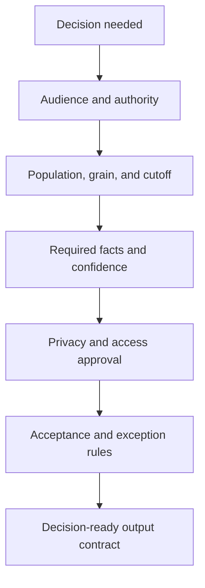

---

## 2. Customer source catalog

A **source catalog** records every candidate source, its business purpose, owner, grain, identifiers, timing, access, quality risks, and authorized extraction method.

### Required enterprise source families

| Source family | Typical evidence orientation | Likely grain | Key controls and caveats |
|---|---|---|---|
| **AutoSupport** | Node/system configuration, health, events, support telemetry | Message, node, subsystem, interval | Collection is not receipt; manifest and freshness matter; sensitive/gated |
| **Active IQ Digital Advisor** | Entitled inventory, wellness, risks/actions, capacity, efficiency, performance, lifecycle and case context | System-risk, system-action, metric interval | Watchlist is not authoritative inventory; validate source freshness and applicability |
| **Install base / asset registry** | Customer/account/site, serial, platform, owner, contract and lifecycle | Asset/effective period | Field-level authority, replacement history and duplicates matter |
| **Customer CMDB** | Configuration items, services, owners, relationships, change history | CI/effective period | Friendly names can drift; customer governance controls authority |
| **Support cases/incidents/problems** | Symptoms, impact, actions, cause, workaround, owner, status | Case/event/update | Case text can be unstructured/private; case count is not root cause |
| **IMT** | Exact supported end-to-end recipes and notes | Configuration result | Current authorized result and every note required; supportability is not runtime health |
| **Hardware Universe** | Exact platform, component, slot, port, shelf, drive, limit and rule | Hardware configuration fact | Gated/current; does not replace IMT or live inventory |
| **Bugs/BURTs/release notes** | Defect scope, trigger, affected/fixed release, workaround | Defect-source record | Public/private boundaries; applicability requires exact customer evidence |
| **Lifecycle/support sources** | EOA, Last Ship, EOS, release support capabilities, contracts | Product/version/asset milestone | Preserve source-native terms; contract differs from product lifecycle |
| **Monitoring/performance/capacity** | Time-series IOPS, latency, throughput, capacity, health and alerts | Object-time interval | Counter definitions, clock, sampling, missing data and stable IDs matter |
| **Projects/change systems** | Planned upgrades, migrations, owners, milestones, dependencies, windows | Project/action/change | Planned is not implemented; target dates can slip |
| **Manual files** | Customer spreadsheets, presentations, email-approved lists, inventories | File-dependent | High drift/type/lineage risk; preserve original and owner attestation |

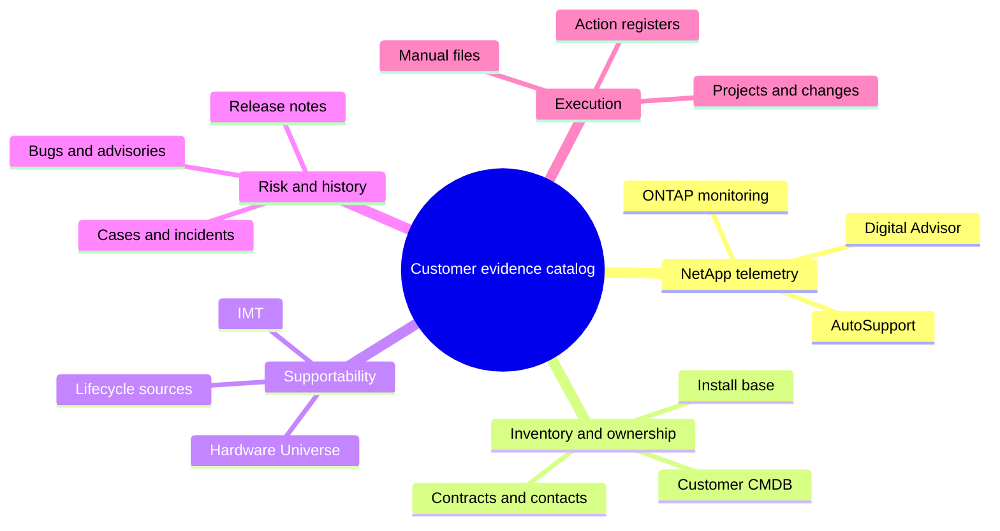

### Catalog record

| Field | Required content |
|---|---|
| Source ID/name | Stable internal source identifier and current product/system name |
| Owner/steward | Technical, data, privacy, and access owner |
| Purpose | Decision questions the source is allowed to support |
| Grain/population | What each row/message represents and inclusion/exclusion rules |
| Identifiers | Stable and descriptive IDs available |
| Schema/version | Export/API/report version and field dictionary |
| Time | Source event, effective, updated, extracted, processed times and timezone |
| Access | Authentication, entitlement, role, approval and transfer path |
| Quality risks | Null, duplicate, stale, conflict, coverage, bias and retention risks |
| Extraction | CSV, API, report/export, manual or owner-supplied snapshot |
| Retention/classification | Data class, approved storage, retention and disposal |

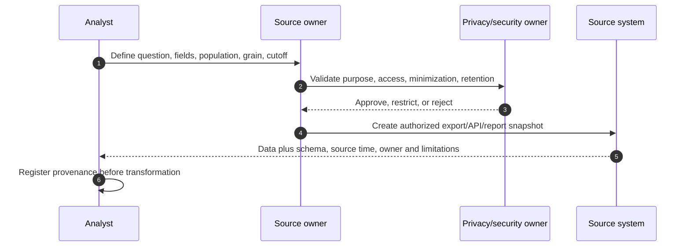

---

## 3. Grain, identifiers, schemas, types, time zones, and access

### Plain-English deep-dive: label every box before stacking it

Joining data without grain is like stacking boxes labeled only `medical supplies`: one box may contain one glove, another a hospital's monthly inventory. A serial number can identify a controller, while a cluster UUID identifies a logical cluster. They are both identifiers, but not for the same entity.

**Why it matters:** the most dangerous pipeline error is a plausible-looking many-to-many join that duplicates or misattributes risk.

### Grain contract

| Dataset | Example grain | Candidate key | Duplicate meaning |
|---|---|---|---|
| Asset | One physical/logical asset per effective period | Internal asset key + effective start | Duplicate record or valid history |
| Telemetry | One object/metric/time interval/source | Object UUID + metric + interval | Retry, replica, or double ingestion |
| Risk | One canonical risk definition | Canonical risk ID | Duplicate source descriptions |
| Affected mapping | One risk-to-asset applicability record | Risk ID + asset ID + evidence date | Repeated processing or changed state |
| Case | One support case | Case ID | Source duplication |
| Case update | One timestamped case event | Case ID + event ID/time | Valid one-to-many history |
| Action | One decision/remediation item | Action ID | Duplicate ownership or split work |
| Compatibility | One exact configuration/evidence date | Configuration ID + evidence date | Current/history snapshots |

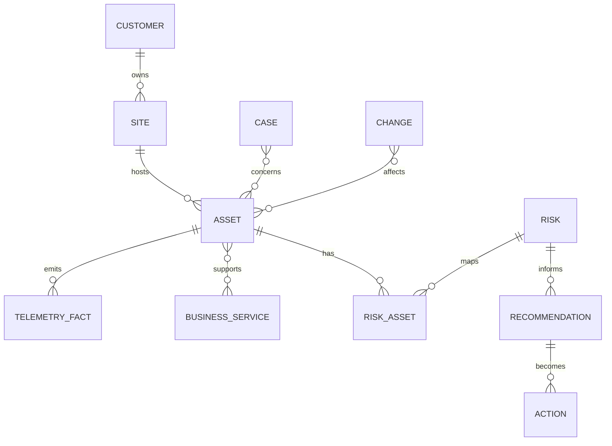

### Identifier hierarchy

| Entity | Prefer | Do not join alone on |
|---|---|---|
| Customer/account | Authorized customer/account ID | Customer display name |
| Site | Governed site/location ID | Free-text city/address |
| Cluster | Cluster UUID in cluster context | Cluster name or management IP |
| Node/controller | Node UUID/system ID/serial as entity-appropriate | Node name or partial serial |
| SVM | SVM UUID plus cluster | SVM name globally |
| Component | Serial/part/slot with parent identity | Model only |
| Workload/service | Customer service/catalog ID | Share/LUN name alone |
| Risk/defect | Authoritative ID plus local canonical ID | Similar title |

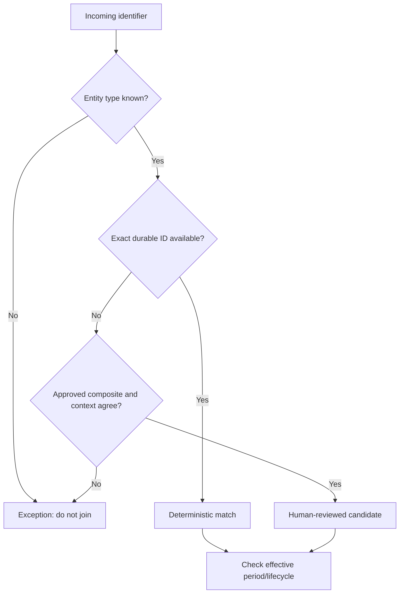

### Schema and type contract

For every field, store:

- Name and plain definition.
- Data type and allowed null meaning.
- Unit and scale.
- Entity/grain.
- Source field and schema version.
- Valid values/range.
- Effective and observation-time behavior.
- Sensitivity classification.
- Transformation and owner.

Do not store serial numbers as floating-point values, dates as locale-ambiguous text, percentages without denominators, or capacities without canonical bytes and original units.

### Four important times

| Time | Meaning | Example use |
|---|---|---|
| **Event/observation time** | When the source observed the condition | Telemetry/case event ordering |
| **Effective time** | When a fact became true in the environment | Controller replacement or ownership change |
| **Recorded/updated time** | When the source stored/corrected it | Late CMDB correction |
| **Extraction/processing time** | When the pipeline captured/processed it | Reproducibility and data cutoff |

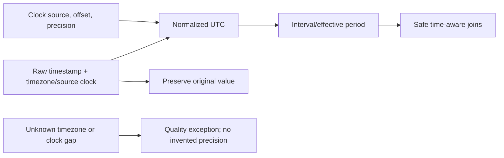

### Access record

Capture named user/service identity, role, customer authorization, source entitlement, extraction purpose, approval, fields/population, approved destination, retention, and revocation. Successful authentication is not permission to export every field.

---

## 4. Extraction: CSV, API, report, and manual files

### Extraction patterns

| Pattern | Strength | Main risks | Required controls |
|---|---|---|---|
| **CSV/export** | Simple, reviewable snapshot | Truncation, locale, formula/type changes, first-page/filter omissions | Source filters, row count, schema, encoding, delimiter, hash, cutoff |
| **API** | Structured, repeatable, scalable | Pagination, rate limits, auth/RBAC, schema change, retries, partial success | Current docs, complete paging, timeouts, logs, least role, raw response |
| **Report/portal export** | Business-friendly/current service context | Hidden filter, aggregated grain, stale processing, screenshot-only evidence | Export settings, scope, source time, row grain, owner, raw attachment |
| **Manual file** | Captures customer knowledge unavailable elsewhere | Copy/paste, version drift, formulas, hidden rows, owner ambiguity | Preserve original, named owner, version, controlled template, validation |

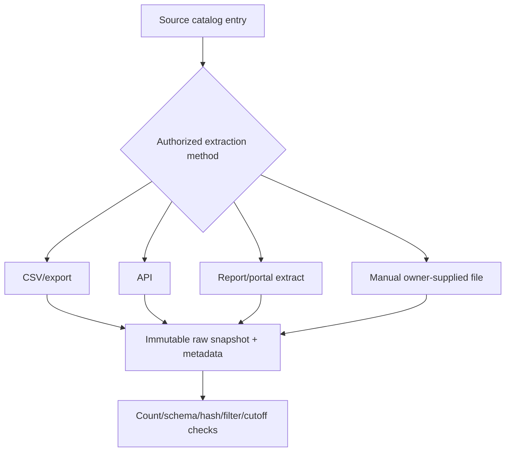

### API extraction lifecycle

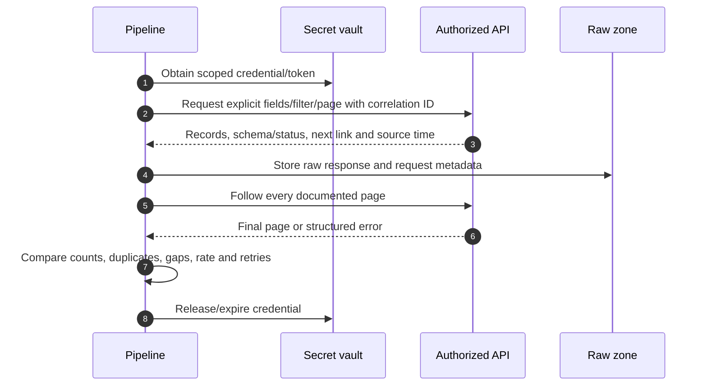

### Extraction manifest

Each run records:

- Run ID and pipeline version/commit.
- Source, endpoint/report/export and schema version.
- Authorized identity/role without secret.
- Request/filter/page parameters.
- Start/end/cutoff times.
- Expected/actual pages and rows.
- Raw file names, hashes and storage path.
- Errors, retries, partial results and quality status.
- Reviewer and approved downstream purpose.

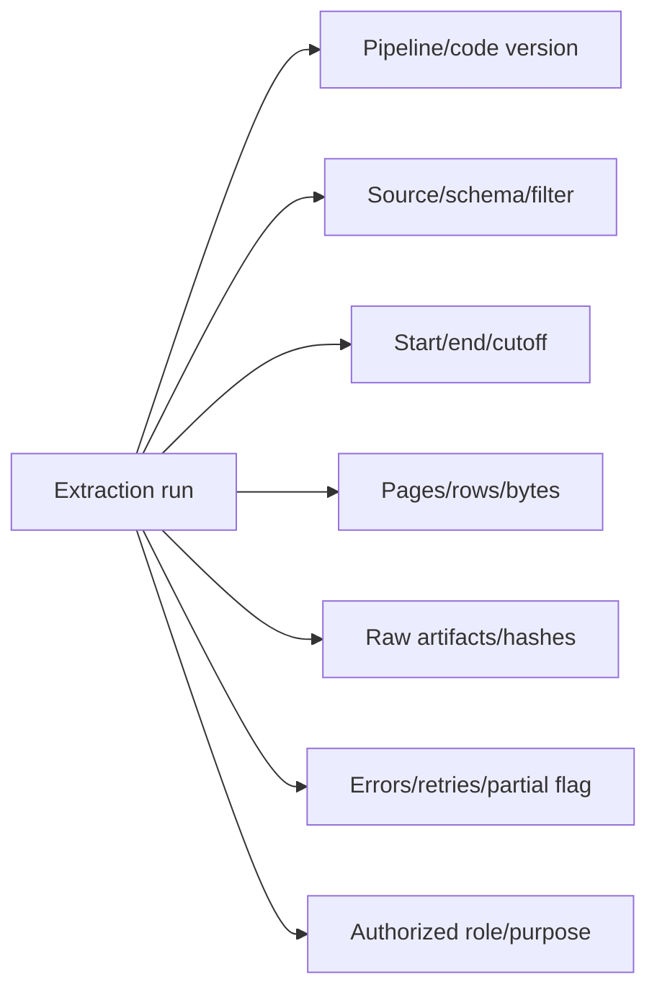

### Safe retry rule

Read extraction can retry only when the source's paging and consistency semantics are understood. A retry that restarts after source data changed can duplicate or omit rows. Prefer source snapshot tokens/cursors where available; otherwise record the inconsistency risk and reconcile counts/IDs.

---

## 5. Raw, staging, curated, and presentation zones

### Plain-English deep-dive: evidence locker, workbench, certified parts, and briefing room

- **Raw** is the sealed evidence locker: source-shaped, immutable, access-restricted.
- **Staging** is the workbench: parsed and typed, but not yet business-certified.
- **Curated** is the certified-parts store: conformed identities, reconciled fields, quality status, history.
- **Presentation** is the briefing room: audience-specific tables, KPIs, charts, and action registers.

**Why it matters:** analysts need to reproduce a chart from raw evidence without letting a dashboard edit rewrite history.

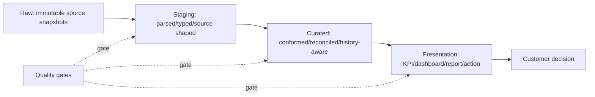

### Zone contract

| Zone | Allowed changes | Must preserve | Typical users |
|---|---|---|---|
| Raw | None beyond encryption/packaging metadata | Original bytes, hash, source/run provenance | Restricted data engineering/audit |
| Staging | Parse, type, normalize names/units/times | Raw key/reference and transformation errors | Analysts/engineers |
| Curated | Conform keys, deduplicate, effective-date, reconcile | Source values, lineage, confidence, exceptions | Approved analytics consumers |
| Presentation | Aggregate/filter/derive for a named audience | Metric definitions, cutoff, drill-through, limitations | TAM/customer/leadership by need |

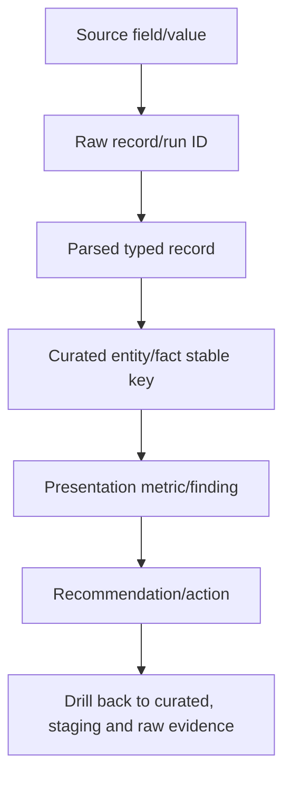

### No direct dashboard-to-source joins

Production-quality reporting should not let every workbook independently join raw exports. Centralize field definitions, identifiers, history, quality checks, and exceptions so two analysts do not produce different asset counts from the same cutoff.

---

## 6. Cleaning: nulls, duplicates, stale data, conflicts, and outliers

Cleaning makes problems explicit; it must not invent favorable data.

### Nulls

| Null class | Meaning | Handling |
|---|---|---|
| Not applicable | Field does not apply to entity/source | Preserve reason code |
| Not collected | Source/role/export omitted it | Quality/access gap |
| Unknown | Fact not known | Exception/owner/date |
| Redacted | Removed for privacy | Preserve classification, not value |
| Invalid | Failed parsing/range/type | Quarantine and raw reference |
| Truly empty | Source explicitly records no value | Validate source semantics |

Do not convert any of these to zero, `No`, healthy, or empty string without a documented rule.

### Cleaning flow

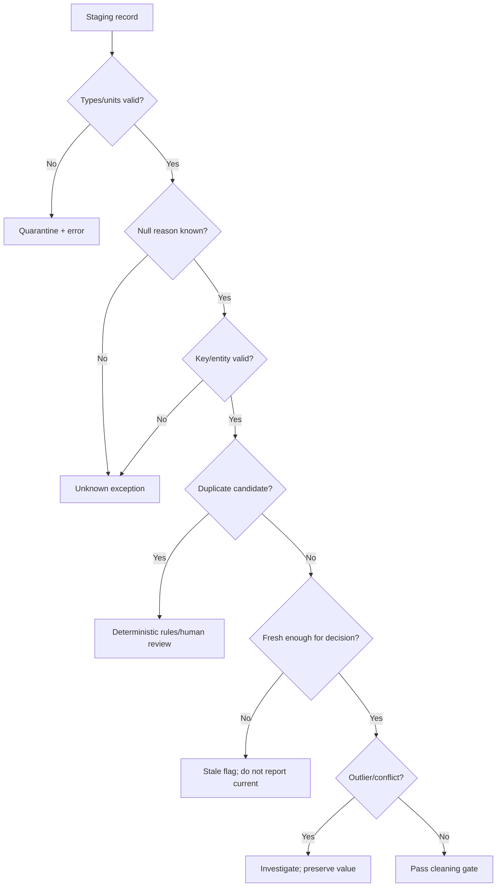

### Duplicates

Distinguish exact duplicate ingestion, repeated source snapshots, valid one-to-many history, same name/different entity, replacement events, and true duplicate records. Deduplication uses entity-specific keys plus effective time, never friendly name alone.

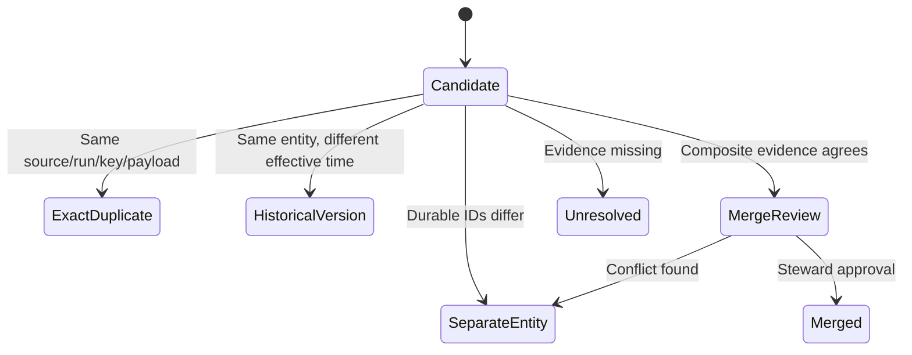

### Staleness

A freshness rule is decision-specific. Weekly inventory might be adequate for a quarterly trend but unsafe for a same-day upgrade go/no-go. Store source observation, received, processed, extraction, and review times separately.

### Conflicts

Never select the most convenient source. Compare entity, field definition, effective time, source authority, recency, event history, and corroboration. Unresolved conflict reduces confidence and remains visible.

### Outliers

An outlier can be a data error, legitimate extreme, incident, migration, change point, or rare critical asset. Flag it; do not delete it automatically. Compare raw source, neighboring values, related metrics, known changes, and owner evidence.

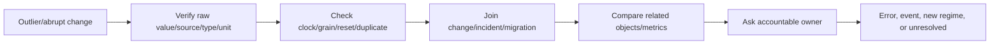

---

## 7. Joins, cardinality, and slowly changing state

### Plain-English deep-dive: count the seats before combining guest lists

If one guest appears twice on a hotel list and one room appears three times in a maintenance list, a naive join creates six rows. The result looks detailed but doubles occupancy and risk counts.

**Why it matters:** join cardinality must be asserted and tested before totals, KPIs, or recommendations are trusted.

### Join cardinality

| Relationship | Meaning | Example | Control |
|---|---|---|---|
| One-to-one | One row on each side | Cluster current record to one governed owner record | Uniqueness test both sides |
| One-to-many | One parent, many children | Cluster to nodes | Parent key and expected child count |
| Many-to-one | Many facts to one dimension | Telemetry intervals to one asset | Dimension uniqueness/effective time |
| Many-to-many | Multiple on both sides | Risks to assets | Bridge table with explicit grain |

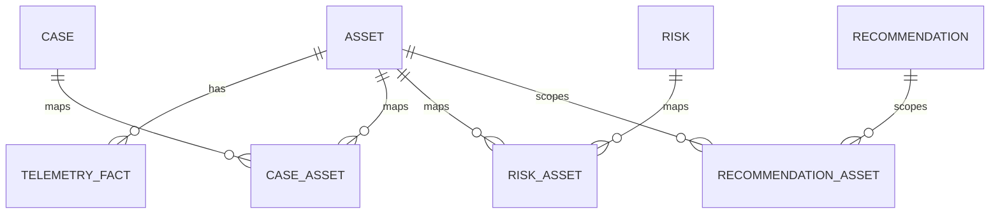

### Join validation

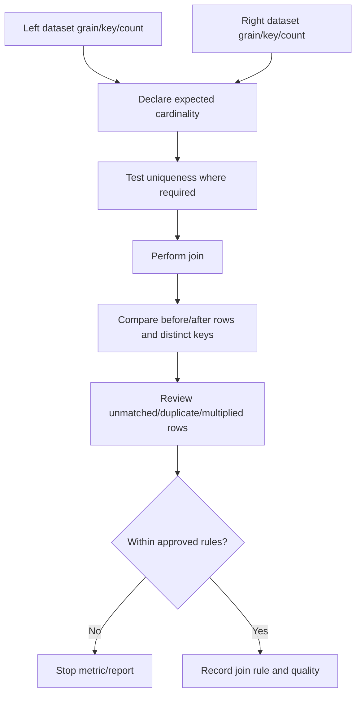

### Slowly changing state orientation

An asset's name, owner, site, release, lifecycle status, service mapping, and contract can change. A **slowly changing dimension** pattern preserves these effective periods so a June case uses the June owner/version rather than today's value.

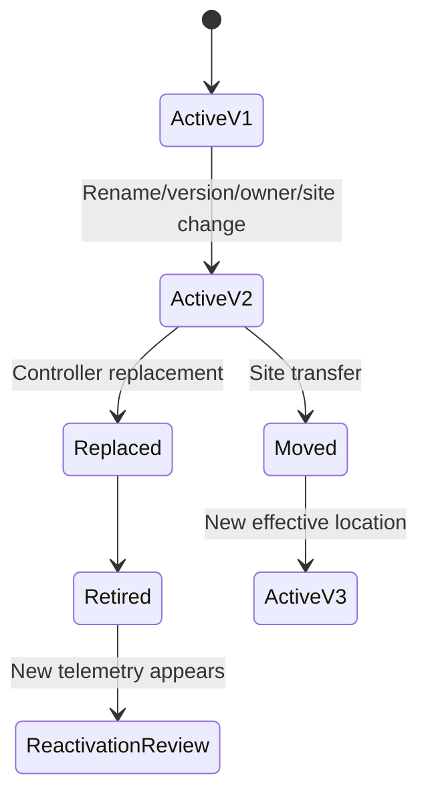

### Effective-dated join

For a fact at time $t$, join the dimension row where:

$$
effective\_start \le t < effective\_end
$$

Use a clear open-ended convention for the current row. Reject overlapping periods for the same entity unless the model explicitly permits them.

### Join anti-patterns

- Cases to assets by customer text and hostname.
- Telemetry to current asset record without effective time.
- IMT result to a system by ONTAP major version only.
- Bugs to systems by release alone.
- Actions to affected systems using comma-separated text.
- Capacity percentages averaged after a many-to-many join.

---

## 8. Reconciliation and field-level source of truth

A **source of truth** is authoritative for a specific field under governance, not for every fact.

### Field authority matrix

| Field | Candidate authority | Corroboration | Conflict owner |
|---|---|---|---|
| Live ONTAP release/configuration | Current authorized system observation | AutoSupport/Digital Advisor | Storage owner |
| Physical serial/model | Physical/support inventory and approved observation | ONTAP/HWU | Asset/storage owner |
| Customer/site/legal ownership | Authorized account/CMDB record | Support/install base | Account/data steward |
| Contract/entitlement | Authorized contract/support system | Procurement/customer record | Contract owner |
| Business service/criticality | Customer service/application owner | CMDB/topology | Business owner |
| Risk applicability | Current authoritative source plus live config | Digital Advisor/cases | Technical/security owner |
| Action status | Governed action register and closure evidence | Project/case updates | Accountable action owner |

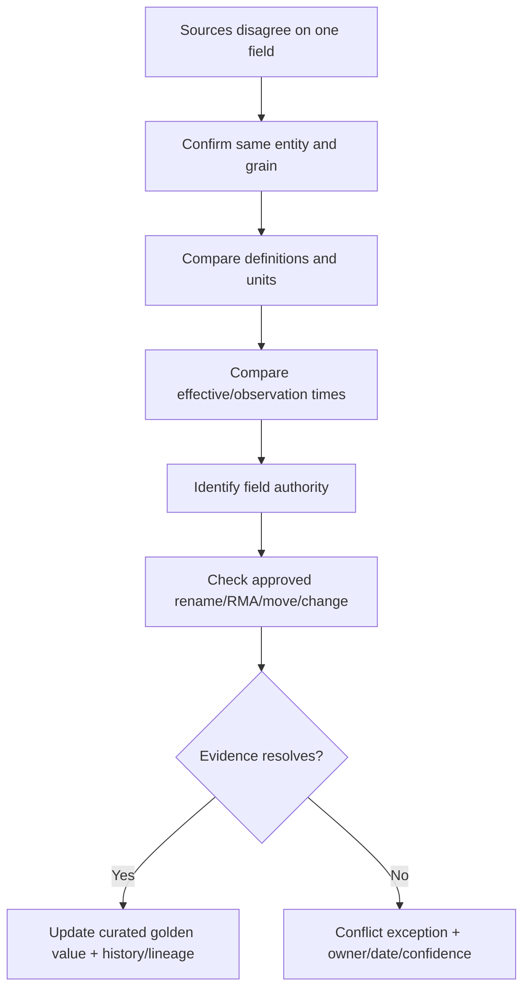

### Reconciliation sequence

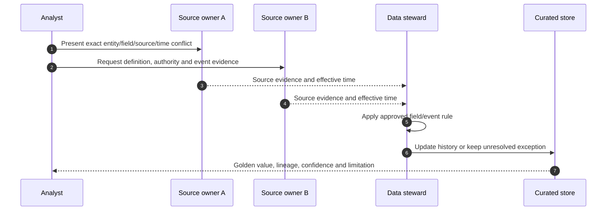

### Reconciliation invariant

For capacity or other components, test a documented relationship rather than force equality:

$$
reported\ total \stackrel{?}{\approx} \sum documented\ components + documented\ residual
$$

Rounding, timing, eligibility, reserves, and source definitions can create valid residuals. Record them rather than hiding them.

---

## 9. Lineage, provenance, and versioning

### Lineage record

```mermaid
flowchart LR
    SRC[Source record/export/API response] --> RUN[Extraction run ID]
    RUN --> STAGE[Parsing/type/unit/time transformation]
    STAGE --> MATCH[Identity/join rule version]
    MATCH --> RECON[Reconciliation/exception decision]
    RECON --> FACT[Curated fact/dimension version]
    FACT --> KPI[Metric/finding]
    KPI --> REC[Recommendation/action]
    REC --> OUT[Validation/outcome]
```

### Provenance fields

- Source system, owner and access class.
- Source record ID/URL/reference.
- Raw artifact/hash.
- Observation/effective/recorded/extraction times.
- Pipeline code/config/schema version.
- Transformation and join-rule versions.
- Data-quality test results.
- Steward decision, approver and reason.
- Presentation/report version and cutoff.

### Version every logic artifact

Version source adapters, schemas, dictionaries, match rules, source-authority rules, quality tests, metrics, risk rules, report definitions, and exception taxonomies. A report should be reproducible from immutable raw inputs plus a tagged pipeline version.

```mermaid
flowchart TB
    DATA[Raw snapshot version] --> BUILD[Pipeline build/version]
    SCHEMA[Schema/dictionary version] --> BUILD
    RULES[Match/reconciliation/metric rules] --> BUILD
    BUILD --> OUTPUT[Curated/presentation release]
    OUTPUT --> MANIFEST[Counts/hashes/cutoff/tests/limitations]
    MANIFEST --> REPRO[Independent rerun and compare]
```

### Correction, not overwrite

If a source or rule was wrong, create a corrected version with recorded time, effective impact, affected reports/actions, and reprocessing decision. Do not rewrite historical evidence silently.

---

## 10. Refresh and reproducibility

A refresh is successful only when source coverage, raw extraction, transformations, joins, quality, publication, and downstream validation all complete.

```mermaid
sequenceDiagram
    autonumber
    participant O as Orchestrator
    participant S as Sources
    participant R as Raw/staging
    participant C as Curated
    participant P as Presentation
    participant A as Analyst/owner
    O->>S: Start run with cutoff and source versions
    S-->>R: Extract pages/files plus manifests/errors
    R->>R: Parse/type/normalize and quarantine
    R->>C: Match/join/reconcile under versioned rules
    C->>C: Run quality/reconciliation gates
    C->>P: Publish atomic presentation release
    P-->>A: Notify release, cutoff, quality and limitations
    A->>P: Validate key totals/findings before customer use
```

### Refresh states

```mermaid
stateDiagram-v2
    [*] --> Planned
    Planned --> Extracting
    Extracting --> Partial: One source/page fails
    Extracting --> Transforming
    Partial --> Failed: Policy disallows partial publication
    Partial --> Transforming: Approved degraded mode with explicit flags
    Transforming --> QualityGate
    QualityGate --> Failed: Critical test fails
    QualityGate --> Published: Atomic release succeeds
    Published --> Validated: Owner checks pass
    Validated --> [*]
```

### Reproducibility checklist

- Frozen source snapshots or source query/cursor evidence.
- Environment/dependency versions.
- Deterministic transformations where possible.
- Controlled random seeds for statistical procedures.
- Stable sort/order before hashes/exports.
- Canonical units/time zones.
- Run manifest and quality results.
- Secure retention of raw and release artifacts.
- Independent rerun comparison with explained differences.

### Incremental versus full refresh

Incremental extraction reduces load but requires durable change keys, deletion/tombstone handling, late-arriving corrections, idempotency, and periodic full reconciliation. If those controls are absent, a periodic full snapshot may be safer despite cost.

```mermaid
flowchart TD
    SOURCE[Source capability] --> CDC{Reliable change ID/timestamp/tombstone?}
    CDC -->|Yes| INC[Incremental load + idempotent merge]
    CDC -->|No| FULL[Full snapshot/diff]
    INC --> RECON[Periodic full reconciliation]
    FULL --> RECON
    RECON --> DRIFT[Detect missed deletes/late corrections/schema drift]
```

---

## 11. Quality gates and reconciliation tests

### Gate hierarchy

```mermaid
flowchart LR
    G1[Source/access/schema gate] --> G2[File/page/count/hash gate]
    G2 --> G3[Type/null/range/unit/time gate]
    G3 --> G4[Identity/uniqueness/cardinality gate]
    G4 --> G5[Relationship/reconciliation/freshness gate]
    G5 --> G6[Metric/business-rule gate]
    G6 --> G7[Presentation/privacy/action gate]
    G7 --> PUBLISH[Publish]
```

### Required tests

| Gate | Example tests | Failure action |
|---|---|---|
| Source | Expected source/version/owner/access | Stop or mark source unavailable |
| Extraction | Pages/rows/files/bytes/hash/filters | Stop incomplete load or explicit partial mode |
| Schema | Required fields/types/enums | Quarantine schema drift |
| Null | Null reason and critical-field completeness | Exception; never default silently |
| Identity | Unique durable keys and valid entity types | Stop joins/metrics |
| Cardinality | Expected one-to-one/one-to-many/many-to-many bridge | Stop multiplied results |
| Referential | Child keys map to valid effective parent | Orphan exception |
| Freshness | Source/processed age by decision SLA | Stale/unknown, no healthy conclusion |
| Reconciliation | Source totals/components/residuals | Explain conflict before publish |
| Privacy | Allowed fields/audience/retention/redaction | Block publication |
| Business | KPI denominator, exclusions, expected ranges | Owner review |

### Quality score caution

Do not hide a critical identity failure inside an average quality score. Report each dimension, severe exceptions, numerator/denominator, cutoff, and trend.

```mermaid
flowchart TD
    DIM[Completeness/uniqueness/validity/freshness/relationships] --> SCORE[Optional summary score]
    CRIT[Critical key/privacy/reconciliation failure] --> VETO[Publication veto]
    SCORE --> REVIEW[Context only]
    VETO --> REVIEW
    REVIEW --> ACTION[Owner/date/remediation]
```

### Data-quality metrics

- Required-field completeness.
- Durable-key uniqueness/conflict rate.
- Unmatched/orphan relationship rate.
- Freshness compliance by source/entity/criticality.
- Duplicate candidate and unresolved merge age.
- Reconciliation residual/conflict rate.
- Exception aging/owner/expiry.
- Refresh success, partial, failure and duration.
- Reproducibility difference rate.
- Customer-impacting report correction/reopen rate.

---

## 12. Privacy, security, and synthetic evidence

### Privacy-first architecture

```mermaid
flowchart TD
    PURPOSE[Defined customer decision purpose] --> MIN[Minimum sources/fields/population/time]
    MIN --> AUTH[Authorized identity and source entitlement]
    AUTH --> TRANSFER[Approved encrypted transfer]
    TRANSFER --> STORE[Encrypted access-controlled zones]
    STORE --> PROCESS[Audited least-privilege processing]
    PROCESS --> REPORT[Redacted audience-specific output]
    REPORT --> RETAIN[Retention/disposal evidence]
```

### Access matrix

| Role | Raw | Curated restricted | Presentation | Change authority |
|---|---|---|---|---|
| Data engineer | Minimum required sources | Pipeline quality | Limited | None by role alone |
| TAM analyst | Usually no unrestricted payloads | Approved analytical fields | Customer/service review | Recommendation only |
| Storage owner | Relevant technical evidence | Full technical scope as approved | Technical/customer views | Customer-approved changes |
| Privacy/security | Oversight/audit by need | Policy/control evidence | Compliance-safe output | Security approval within scope |
| Customer executive | No raw payload | No unnecessary identifiers | Decision-level findings | Business risk/funding decision |

### Secret and sensitive-data rules

- Never ingest passwords, tokens, secret keys, CHAP secrets, private keys, session cookies, or unredacted authorization headers into analytics.
- Hashing an identifier is not anonymous if it can be linked back or has a small domain.
- Use pseudonymous internal keys in broad analytics; keep reidentification crosswalk separately restricted.
- Minimize case text, filenames, usernames, IPs, locations, serials, and contacts.
- Never send customer data to unapproved AI/chat/public services.
- Use fully synthetic evidence for learning and portfolio work.

### Synthetic dataset rules

1. Label customer and every value synthetic.
2. Use impossible/non-real identifiers or clear `SYN-` prefixes.
3. Do not mimic a real customer topology closely enough to identify it.
4. Do not copy gated screenshots, text, cases, bugs, or exports.
5. Keep source citations to public concepts, not claimed tool output.

---

## 13. Error and exception register

An **exception register** is the managed queue of data defects that cannot be silently corrected.

### Exception schema

| Field | Purpose |
|---|---|
| Exception ID/type/severity | Stable tracking and prioritization |
| Entity/source/field | Exact affected scope |
| Observed/expected | Reproducible defect statement |
| Evidence/run IDs | Raw and pipeline lineage |
| Business/report impact | Which decisions are unsafe |
| Workaround | Temporary bounded handling, if any |
| Owner/date/status | Accountability and aging |
| Resolution/approval | Source correction, rule change, accepted risk or no action |
| Validation | Rerun and affected-report correction |
| Residual risk/expiry | Remaining limitation and review trigger |

```mermaid
stateDiagram-v2
    [*] --> Open
    Open --> Triaged
    Triaged --> Assigned
    Assigned --> EvidencePending
    EvidencePending --> ProposedResolution
    ProposedResolution --> Approved
    ProposedResolution --> Rejected
    Rejected --> EvidencePending
    Approved --> Applied
    Applied --> Reprocessed
    Reprocessed --> Validated
    Validated --> Closed
    Open --> AcceptedRisk: Authorized owner/expiry/control
    AcceptedRisk --> Open: Expiry/source/impact change
```

### Exception classes

- Missing source/entitlement/access.
- Schema/field/enum drift.
- Parse/type/unit/timezone error.
- Duplicate/conflicting durable identifier.
- Stale telemetry or source outage.
- Many-to-many join multiplication.
- Orphan parent/service/owner relationship.
- Source-of-record conflict.
- Metric/reconciliation discrepancy.
- Privacy/redaction/retention violation.
- Manual-file owner/version/formula uncertainty.

### Accepted data risk

An authorized owner can accept a bounded analytical limitation when the decision can safely proceed with controls. Record why, impact, compensating evidence, owner, start, expiry, review trigger, and what remains excluded. Data analysts do not accept customer business risk by themselves.

---

## 14. Fully synthetic sanitized scenario: Redwood Health fleet review

> **Synthetic boundary:** `Redwood Health`, all sources, systems, identifiers, metrics, dates, joins, findings, risks, recommendations, and outcomes are invented. No real customer data, NetApp tool result, private bug, or screenshot is represented.

### Discovery question

Redwood's synthetic lead TAM asks:

> Which production storage systems support the patient-record service, which have stale telemetry, lifecycle/supportability gaps, or recurring cases, and which preventative actions should be discussed in the next operational service review?

### Source inventory

| Source | Synthetic extract | Quality issue |
|---|---|---|
| AutoSupport-like manifest/history | Node messages through `2026-08-20` | One node send failed; one manifest partial |
| Digital-Advisor-like table | Four systems and three risk mappings | One system absent; one finding stale |
| Install-base extract | Five active, one retired asset | Duplicate controller after replacement |
| CMDB | Four clusters mapped to patient service | One cluster name old; service owner missing |
| Cases | 18 synthetic cases | Free-text asset names and timezone mix |
| IMT-like evidence | Three dated recipes | One target recipe expired/stale evidence date |
| Lifecycle sheet | Platform and release milestones | Source links missing for two rows |
| Monitoring | Daily capacity/performance facts | One three-day collector gap displayed as zero |
| Project tracker | Upgrade and migration plans | Target date changed; dashboard cache stale |

```mermaid
flowchart TB
    DISC[Patient-service decision] --> SRC[Authorized synthetic source catalog]
    SRC --> RAW[Immutable source snapshots]
    RAW --> ID[Cluster/node/SVM/service identity resolution]
    ID --> JOIN[Cases/risks/telemetry/lifecycle/projects]
    JOIN --> RECON[Conflicts, gaps and effective-time history]
    RECON --> QA[Quality gates]
    QA --> FIND[Findings and recommendations]
```

### Synthetic identifiers and grain

| Entity | Stable synthetic key | Current descriptive name |
|---|---|---|
| Patient service | `SYN-SVC-001` | `Patient Records` |
| Cluster | `SYN-CLU-101` | `rh-prod-a-new` |
| Old cluster alias | Same cluster key | `rh-prod-a-old` |
| Replaced controller | `SYN-NODE-OLD-11` | Retired/replaced |
| Current controller | `SYN-NODE-NEW-22` | Active |
| SVM | `SYN-SVM-501` + cluster key | `clinical` |

### Identity-resolution graph

```mermaid
flowchart LR
    C[SYN-CLU-101] --> OLDNAME[rh-prod-a-old alias]
    C --> NEWNAME[rh-prod-a-new current]
    C --> OLDNODE[SYN-NODE-OLD-11 replaced]
    C --> NEWNODE[SYN-NODE-NEW-22 active]
    RMA[Synthetic replacement effective 2026-08-12] --> OLDNODE
    RMA --> NEWNODE
    SVM[SYN-SVM-501] --> SERVICE[SYN-SVC-001 Patient Records]
```

### Join controls

1. Cases with cluster name use an alias bridge effective at case time, not direct text join.
2. Risk-to-asset is a bridge table, preserving one risk mapped to several assets.
3. Daily facts with source gaps remain null/unknown, not zero.
4. Project target uses the latest approved effective-dated milestone.
5. Lifecycle records without official source/date remain `Unknown`, not overdue.

```mermaid
flowchart TD
    CASES[Case events] --> ALIAS[Effective-dated alias bridge]
    ALIAS --> ASSET[Stable cluster/node asset]
    RISKS[Canonical risks] --> RA[Risk-asset bridge]
    ASSET --> RA
    FACTS[Daily metrics] --> DQ[Freshness/gap flags]
    PROJECT[Approved project milestones] --> SCD[Effective-dated project state]
    RA --> VIEW[Curated customer view]
    DQ --> VIEW
    SCD --> VIEW
```

### Quality results

| Gate | Synthetic result | Decision effect |
|---|---|---|
| Asset uniqueness | Duplicate replacement row resolved with history | Asset counts can publish |
| Service mapping | One system owner missing | Action owner needed; risk ranking confidence medium |
| Telemetry freshness | One node stale, one partial | No healthy conclusion for those scopes |
| Case identity | 16 matched, 2 unresolved | Case trend has explicit exclusion |
| Lifecycle source | Two unsupported rows quarantined | No lifecycle recommendation from them |
| Metric gap | Three days restored to null/unknown | Forecast retrained without fake zeros |
| Privacy | Contacts/paths removed from executive view | Publish allowed |

### Evidence findings

| Finding | Evidence and limitation | Confidence |
|---|---|---|
| `SYN-CLU-101` has one stale node telemetry stream | Last successful synthetic receipt predates cutoff; local collection status available | High for staleness, not health |
| Patient-service case handoffs repeat an asset-identity gap | Five of 16 matched cases use old alias; no common technical cause claimed | Medium-high |
| One upgrade action uses stale compatibility evidence | Synthetic IMT-like evidence predates target driver change | High for evidence gap |
| Capacity trend crosses review horizon in base scenario | Daily facts exclude gap correctly; planned imaging project still uncertain | Medium |
| One lifecycle row lacks authoritative source | Manual sheet only | Low/unknown; no customer claim |

### Risk and recommendation chain

```mermaid
flowchart LR
    E1[Stale node telemetry] --> R1[Reduced proactive/support visibility]
    E2[Old alias in cases] --> R2[Slower/misdirected handoffs]
    E3[Stale compatibility proof] --> R3[Unsupported change-state risk]
    E4[Capacity scenario] --> R4[Lead-time planning risk]
    R1 --> A1[Repair/validate source receipt]
    R2 --> A2[Publish stable-ID case crosswalk]
    R3 --> A3[Refresh exact compatibility recipe]
    R4 --> A4[Validate project demand and scenarios]
```

### Recommendations

1. **Telemetry:** Storage/network owners repair the synthetic node delivery path and prove generation, manifest quality, send, receipt, and portal association before the review.
2. **Case identity:** Data/support owners publish a stable cluster/node alias crosswalk and update case templates to require stable asset ID plus friendly name.
3. **Compatibility:** Host/storage owners regenerate the exact current/target/intermediate recipe evidence after driver change; stale evidence cannot approve the upgrade.
4. **Capacity:** Application/capacity owners confirm imaging-project amount/date and run low/base/high physical-growth scenarios against action lead time.
5. **Lifecycle:** Data steward rejects the unsourced manual lifecycle dates and assigns an authorized source owner.

### Synthetic customer-facing summary

> "The curated view contains four decision-quality findings, not a blanket fleet-health score. One node's telemetry is stale, five case handoffs use a retired alias, the upgrade recipe evidence predates a driver change, and the capacity horizon depends on an unconfirmed imaging project. We recommend repairing evidence coverage and identity first, then refreshing compatibility and capacity decisions. Two lifecycle rows remain unknown because their source cannot be verified."

### Validation outcomes

| Action | Synthetic proof | Residual risk |
|---|---|---|
| Telemetry repair | New sequence generated/received and owner confirms association | Future source outages remain possible |
| Alias crosswalk | Next three cases link stable IDs without duplicate routing | Historic free text remains imperfect |
| Compatibility refresh | Current, temporary and target recipe evidence reviewed | Listed support does not guarantee fault-free change |
| Capacity refresh | Project owner validates input and forecast range | Workload/efficiency can change |
| Lifecycle exception | Unsourced rows removed from decision view | Gated dates remain unknown until owner supplies them |

---

## 15. Arti transfer, honest NetApp gap, and JD Mapping

```mermaid
flowchart LR
    MBA[MBA Business Analytics] --> MODEL[Grain, quality, statistics, decision framing]
    EXCEL[Excel/Power Query] --> ETL[Imports, types, joins, reconciliation]
    PBI[Power BI] --> VIS[Models, KPIs, trends, drill-through]
    SQL[SQL] --> DB[Keys, joins, windows, QA queries]
    PY[Python] --> AUTO[APIs, validation, reproducible transformations]
    MS[Microsoft support] --> EVID[Cases, incidents, owners, customer narrative]
    MODEL --> TAM[NetApp TAM synthetic pipeline method]
    ETL --> TAM
    VIS --> TAM
    DB --> TAM
    AUTO --> TAM
    EVID --> TAM
    TAM --> GAP[Authorized NetApp sources and production review still required]
```

### Transfer and gap

| Arti evidence | Natural transfer | Honest NetApp gap |
|---|---|---|
| MBA/statistics | Grain, uncertainty, outlier, forecast and decision logic | NetApp field semantics/tool workflows require current validation |
| Excel/Power Query | Controlled imports, typing, merge/append and QA | No production AutoSupport/Digital Advisor export handling |
| Power BI | Star models, trends, action views and executive narrative | No live NetApp dashboard or customer model ownership |
| SQL | Relational keys, joins, cardinality, effective dates, reconciliation | No production NetApp warehouse schema |
| Python | API extraction, pagination, tests, versioned pipelines | No authorized NetApp API/customer credential use |
| Microsoft support | Case evidence, privacy, CRITSIT timelines and customer reviews | No production NetApp cases/BURTs/install-base stewardship |

### JD Mapping

| JD responsibility | Part 56 contribution | Evidence boundary |
|---|---|---|
| Generate customer data from enterprise sources | Source catalog, extraction manifest, zones and refresh | Method demonstrated with synthetic data only |
| Analyze and report customer data | Cleaning, joins, reconciliation, QA, presentation | Analytics skills are factual; NetApp outputs remain gated/unpracticed |
| Maintain install-base accuracy | Entity keys, effective history, source authority, exceptions | Does not authorize live record corrections |
| Improve technical recommendations | Traceable evidence -> context -> risk -> action | Product conclusions need NetApp owners/current docs |
| Operational service reviews | Dated presentation release and action register | No real customer data or screenshots |
| Security and access | Purpose, least access, minimization, retention, audit | Customer/privacy owners govern actual handling |
| Process improvement | Reproducible versioned pipeline and quality metrics | Production engineering and monitoring remain future work |

### Honest interview answer

> "I would begin with the customer decision and source catalog, then define grain, stable identifiers, schema, time and access for AutoSupport, Digital Advisor, install base, CMDB, cases, IMT/HWU, bugs, lifecycle, monitoring, projects and manual files. I would preserve raw snapshots, create staging/curated/presentation zones, clean without inventing nulls, validate join cardinality, reconcile field-level authorities, and publish only after freshness, lineage, privacy and business gates pass. My production data/analytics experience is Microsoft-focused; I have not built a live NetApp pipeline, so authorized source owners and current documentation control every real extraction and field meaning."

---

## 16. Paper lab and self-test

### Paper lab: synthetic customer evidence pipeline

Build a fully synthetic pipeline for 25 clusters, 50 nodes, 30 SVMs, 20 business services, 120 cases, 40 risks, 18 compatibility recipes, 10 lifecycle products, daily capacity/performance facts, 35 project actions, and 12 manual files.

```mermaid
flowchart LR
    DESIGN[Define decision/source/grain/privacy] --> EXTRACT[Create synthetic CSV/API/report inputs]
    EXTRACT --> ZONES[Raw/staging/curated/presentation]
    ZONES --> CLEAN[Null/duplicate/stale/conflict/outlier handling]
    CLEAN --> JOIN[Identity/cardinality/effective-time joins]
    JOIN --> QA[Quality/reconciliation/privacy gates]
    QA --> CASE[Findings/risks/recommendations/actions]
    CASE --> REPRO[Refresh/reproduce/audit]
```

### Inject these defects

- One cluster rename and one controller replacement.
- Duplicate serial in two active source rows.
- SVM names reused across clusters.
- Cases in local time, telemetry in UTC, one unknown timezone.
- Three missing API pages and one retried duplicate page.
- One schema rename and one capacity unit change from GB to bytes.
- Missing data displayed as zero in a source dashboard.
- One Digital-Advisor-like watchlist missing a production cluster.
- One stale IMT-like recipe and one private-bug access gap.
- One lifecycle spreadsheet with unsupported dates.
- One many-to-many risk join that multiplies totals.
- One manual file with hidden rows and formulas returning errors.
- One privacy violation containing a contact and file path in an executive export.

### Tasks

1. Write the output contract and source catalog.
2. Define every dataset's grain, stable key, schema, unit, timezone, access and owner.
3. Build immutable raw snapshots and extraction manifests.
4. Parse and type staging data; quarantine invalid fields.
5. Build effective-dated entity dimensions and bridge tables.
6. Validate one-to-one, one-to-many and many-to-many cardinality.
7. Reconcile field authority and retain unresolved exceptions.
8. Run source, count, schema, null, key, referential, freshness, reconciliation and privacy gates.
9. Create a run manifest and independently reproduce the presentation release.
10. Produce discovery, evidence, risk, recommendation, action and residual-risk tables.
11. Deliver a technical and executive summary with no invented NetApp result.
12. Answer Q1-Q8 aloud.

### Self-test prompts

1. Explain the complete source-to-decision pipeline and why raw preservation matters.
2. Name every required source family and its grain/access caveat.
3. Define grain, schema, stable identifier, lineage and provenance.
4. Distinguish event, effective, recorded, extraction and processing times.
5. Explain CSV/API/report/manual extraction controls and pagination.
6. Compare raw, staging, curated and presentation zones.
7. Classify nulls, duplicates, stale records, conflicts and outliers safely.
8. Explain join cardinality and prove a many-to-many bridge is required.
9. Explain slowly changing state and an effective-dated join.
10. Define field-level source of truth and conflict resolution.
11. Build quality gates, metrics and publication vetoes.
12. Explain privacy, access, synthetic evidence and secret exclusions.
13. Build an exception register with accepted-risk expiry.
14. Recreate Redwood Health's discovery, evidence, risks and recommendations.
15. State Arti's transfer and exact NetApp gap.

### Lab pass checklist

- [ ] Every source has purpose, owner, grain, schema, IDs, times, access, retention and extraction method.
- [ ] AutoSupport, Digital Advisor, install base, CMDB, cases, IMT, HWU, bugs, lifecycle, monitoring, projects and manual files are present.
- [ ] Raw evidence is immutable and traceable through staging, curated and presentation zones.
- [ ] Null is never silently converted to zero/healthy/not applicable.
- [ ] Duplicate and slowly changing records preserve lifecycle history.
- [ ] Every join declares and validates cardinality; many-to-many uses bridges.
- [ ] Source authority is field-specific and unresolved conflicts remain visible.
- [ ] Refreshes are reproducible and quality-gated.
- [ ] Privacy, access, minimization, redaction, retention and audit controls pass.
- [ ] All scenarios and evidence are labeled synthetic and sanitized.
- [ ] No production NetApp source access or pipeline ownership is claimed.

---

## 17. Official Source Anchors

**Date checked: 2026-08-24.** Public official sources only. Service interfaces and schemas change; re-open current product/API/export documentation and authorized customer source definitions before use.

| Topic | Official public source | Bounded use |
|---|---|---|
| AutoSupport purpose and messages | [Learn about ONTAP AutoSupport](https://docs.netapp.com/us-en/ontap/system-admin/manage-autosupport-concept.html) | Source context, not access to a customer payload |
| AutoSupport manifest | [Information included in the AutoSupport manifest](https://docs.netapp.com/us-en/ontap/system-admin/autosupport-manifest-concept.html) | File/status/error provenance orientation |
| Digital Advisor | [Digital Advisor documentation](https://docs.netapp.com/us-en/active-iq/index.html) | Public feature/scope context; customer results are gated |
| Digital Advisor inventory | [View storage system inventory details](https://docs.netapp.com/us-en/active-iq/task_view_inventory_details.html) | Inventory/export orientation and access caveats |
| ONTAP REST automation | [ONTAP REST API documentation](https://docs.netapp.com/us-en/ontap-automation/) | Structured extraction, jobs, API/reference navigation; exact release controls |
| ONTAP REST reference | [ONTAP REST API reference](https://docs.netapp.com/us-en/ontap-restapi/) | Exact current endpoint/field/pagination schema source |
| IMT | [Interoperability Matrix Tool overview](https://docs.netapp.com/us-en/interoperability-matrix-tool/index.html) | Public workflow; live results require authorized access |
| Hardware Universe | [NetApp Hardware Universe](https://hwu.netapp.com/) | Official gated hardware source; no result inferred here |
| Bugs and Support | [NetApp Support Site](https://mysupport.netapp.com/) | Gated bugs, cases, contracts and support context; no private data reproduced |
| ONTAP release support | [ONTAP release support](https://docs.netapp.com/us-en/ontap/release-notes/release-support-reference.html) | Software lifecycle/support-capability context |
| NIST data integrity | [NIST SP 1800-25 - Data Integrity](https://www.nccoe.nist.gov/publication/1800-25/) | Data-integrity and recovery-oriented governance context |
| NIST privacy framework | [NIST Privacy Framework](https://www.nist.gov/privacy-framework) | Identify/govern/control/communicate/protect privacy-risk orientation |
| ISO data-quality standard catalog | [ISO/IEC 25012:2008](https://www.iso.org/standard/35736.html) | Official data-quality model catalog entry; full standard may require purchase |
| W3C provenance | [W3C PROV overview](https://www.w3.org/TR/prov-overview/) | Standard provenance concepts for entities, activities and agents |

### Source-use discipline

- Record exact source, schema/API/export version, owner, access class, observation/cutoff/extraction times, and retrieval date.
- Use authorized structured exports/APIs where available; never screen-scrape or fabricate gated results.
- Preserve raw artifacts, hashes, filters, pagination, count checks, field definitions, and transformation versions.
- Treat public NetApp docs as concept/schema guidance, not customer evidence.
- Protect identifiers, contacts, cases, topology, contracts, payloads, and secrets.
- Mark missing, stale, partial, conflicting, gated and synthetic evidence explicitly.

---

## Likely Interview Questions

### Q1. How would you build a customer-data pipeline for a TAM service?

> **Model answer:** "I start with the decision, audience, population, grain, cutoff and privacy contract. I catalog AutoSupport, Digital Advisor, install base, CMDB, cases, IMT/HWU, bugs, lifecycle, monitoring, projects and manual files; extract authorized versioned snapshots; preserve raw; type/clean in staging; resolve stable identities/effective history; join with cardinality tests; reconcile field authorities; and publish only after quality, privacy and owner validation."

### Q2. Why are grain and stable identifiers so important?

> **Model answer:** "Grain says what one row represents; a stable ID says which entity it describes. Without them, joining one asset row to many case/risk/telemetry rows can multiply facts or attach evidence to the wrong controller, cluster or SVM. I declare expected cardinality, use bridge tables for many-to-many relationships, and validate row/distinct-key counts after every join."

### Q3. How do you handle missing, stale, duplicate, conflicting, or outlier data?

> **Model answer:** "I classify null reason instead of defaulting it, preserve duplicate candidates until entity/time evidence resolves them, grade freshness for the specific decision, use field-level source authority and effective time for conflicts, and investigate outliers as possible data errors, incidents or new regimes. Unresolved conditions remain exceptions with owner/date/confidence; they never become zero or healthy."

### Q4. How do raw, staging, curated, and presentation layers differ?

> **Model answer:** "Raw preserves source-shaped immutable evidence and provenance. Staging parses and standardizes types/units/times while retaining errors. Curated data has conformed keys, history, reconciled fields, confidence and exceptions. Presentation data contains audience-specific metrics/findings/actions with definitions, cutoff and drill-through. A chart must trace back through every layer."

### Q5. How do you reconcile sources that disagree?

> **Model answer:** "I confirm the same entity/grain, compare definitions, units and effective/observation times, identify the authorized owner for that field, and check approved rename/RMA/move/change events. If evidence resolves it, I update the curated history with lineage. If not, I preserve both values as an exception and narrow the conclusion."

### Q6. How do you prove a refresh is complete and reproducible?

> **Model answer:** "Each run has a source/query/schema/cutoff manifest, pages/rows/bytes/hashes/errors, pipeline/rule versions and quality results. I atomically publish only after count, schema, key, cardinality, referential, freshness, reconciliation, metric and privacy gates. An independent rerun from frozen raw inputs must reproduce the release or explain versioned differences."

### Q7. What privacy controls belong in this pipeline?

> **Model answer:** "Purpose limitation, minimum fields/population, authorized identity/entitlement, encrypted transfer/storage, least role by zone, sensitive-field classification, pseudonymous analytical keys, redacted audience views, audited access, retention/disposal and secret exclusion. I use fully synthetic data for learning and never send customer evidence to unapproved services."

### Q8. How does your background transfer, and what remains a gap?

> **Model answer:** "My MBA, statistics, Excel/Power Query, Power BI, SQL, Python and Microsoft support work give me strong grain, join, QA, lineage, case and customer-review skills. I have not extracted or governed live NetApp customer sources, so I would use current docs, authorized source owners and secure customer systems; every NetApp field/access/result remains explicitly validated rather than assumed."

---

## 30-Second Memory Hooks

- **Pipeline:** Decision question -> governed evidence -> validated action.
- **Source catalog:** Purpose, owner, grain, IDs, schema, time, access, quality, extraction.
- **Grain:** What one row means before any join.
- **Stable ID:** Entity-specific anchor; names are descriptive aliases.
- **Schema:** Field contract with type, unit, null, owner and version.
- **Four times:** Event, effective, recorded, extracted/processed.
- **Raw:** Sealed evidence locker.
- **Staging:** Typed workbench.
- **Curated:** Reconciled, history-aware certified data.
- **Presentation:** Audience view with definitions, cutoff and drill-through.
- **Null:** Unknown/not collected/not applicable/redacted/invalid are different.
- **Cardinality:** Count seats before combining guest lists.
- **Bridge:** Explicit many-to-many relationship, not comma-separated text.
- **Source of truth:** Field-specific authority, not one magical system.
- **Lineage:** Every finding walks back to source and rule versions.
- **Refresh:** Pages + counts + schema + keys + QA + atomic publish.
- **Exception:** Visible defect with owner/date, not silent repair.
- **Privacy:** Purpose, minimum, authorization, protection, redaction, disposal.
- **Arti's bridge:** Analytics rigor transfers; production NetApp access does not.

---

## Completion Checklist

- [ ] Define the decision, audience, population, grain, cutoff, privacy and acceptance contract.
- [ ] Catalog AutoSupport, Digital Advisor, install base, CMDB, cases, IMT, HWU, bugs, lifecycle, monitoring, projects and manual files.
- [ ] Record source owner, grain, identifiers, schema/version, times, access, retention and extraction method.
- [ ] Preserve immutable raw evidence and extraction manifests with pagination/count/hash/error checks.
- [ ] Separate raw, staging, curated and presentation zones.
- [ ] Type units/dates/identifiers correctly and classify every null reason.
- [ ] Detect duplicates, stale evidence, conflicts and outliers without silent deletion/defaults.
- [ ] Declare and validate one-to-one, one-to-many and many-to-many join cardinality.
- [ ] Use effective-dated history for names, versions, sites, owners, lifecycle and projects.
- [ ] Define field-level source authority and preserve unresolved conflicts.
- [ ] Maintain complete lineage, provenance and versioned logic.
- [ ] Make refreshes reproducible, atomic, monitored and quality-gated.
- [ ] Run source/schema/count/null/key/referential/freshness/reconciliation/privacy/business gates.
- [ ] Maintain an error/exception register with owner, expiry, proof and residual risk.
- [ ] Apply least access, minimization, redaction, secret exclusion, retention and disposal.
- [ ] Recreate the fully synthetic Redwood Health scenario and paper lab.
- [ ] Answer Q1-Q8 aloud and state the exact No-production-NetApp boundary.
- [ ] Recheck current source/API/export documentation and authorized customer field definitions before real use.

---

*Next suggested section:* [Part 57 - Risk Scoring, Prioritization, and Preventative Recommendation Logic](Part-57-risk-scoring-prioritization.md)