# Part 57 - Risk Scoring, Prioritization, and Preventative Recommendation Logic

> **Section goal:** Turn verified technical and data findings into a defensible order of preventative work without pretending that a score is objective truth. By the end, you should be able to write bounded risk statements; separate severity, exposure, likelihood, urgency, confidence, effort, dependencies, lead time, and residual risk; use matrices, ordinal weighted models, and FMEA-style methods carefully; apply safety vetoes and documented expert override; test uncertainty and sensitivity; manage aging and accepted risk; and explain portfolio decisions to technical and executive audiences.

Covers index item **57** and maps directly to job-description responsibilities for proactive risk identification, customer-specific prioritization, preventative recommendations, operational service reviews, stability improvement, lifecycle and upgrade planning, action tracking, data analysis, executive communication, and cross-functional influence.

**Explicit nonclaim:** You have not owned a production NetApp customer-risk model, approved a NetApp remediation priority, or accepted customer business risk.

**Privacy and access boundary:** Customer assets, vulnerabilities, defects, supportability gaps, contracts, telemetry, service criticality, cases, recovery posture, financial impact, risk appetite, accepted risks, and action status are sensitive. Use authorized sources, minimum necessary fields, approved storage, audience-specific redaction, and accountable customer decision owners.

**Synthetic-evidence rule:** Every customer, asset, score, scale, weight, threshold, finding, probability, cost, date, risk, recommendation, decision, and outcome below is fictional and sanitized. The methods are teaching aids, not NetApp severity models, Digital Advisor outputs, production thresholds, or customer commitments.

**Version caveat:** Digital Advisor severity/content, product advisories, defects, release support, IMT/HWU results, lifecycle milestones, recommended actions, telemetry, and customer conditions change. A **current-doc check** means reopening the exact current authoritative source, verifying applicability to the exact platform/release/feature/configuration, and recording evidence and review dates before scoring or recommending.

This Part provides no universal risk scale, weight, threshold, probability, FMEA cutoff, service criticality, effort estimate, urgency rule, or remediation SLA. A locally approved model must be calibrated against outcomes, challenged for bias and gaming, and governed by accountable customer owners.

> **No-production-NetApp boundary:** Your factual strengths are enterprise support and critical situation, incident/problem/risk prioritization, customer impact analysis, MBA decision methods, Excel, Power BI, SQL, Python, statistics, service reviews, and cross-team action ownership. You do **not** claim production ONTAP risk decisions, NetApp Digital Advisor operation, private bug applicability, lifecycle commitment authority, compatibility approval, or customer risk acceptance. Your exact non-claim is: **you have not designed, calibrated, approved, or operated a production NetApp customer-risk scoring system.**

---

## 1. Risk language before risk arithmetic

A **finding** is an evidence-backed condition. A **risk** is uncertainty about a future objective, expressed through a mechanism and consequence. A **priority** is the governed decision about order and timing. A **recommendation** is a bounded action intended to change exposure, likelihood, consequence, detectability, or recovery.

### Plain-English deep-dive: smoke, fire risk, and the fire plan

- Smoke in a room is an **observation**.
- A damaged cable overheating near oxygen supplies is a **finding and mechanism**.
- A fire could interrupt critical care is the **risk**.
- Replacing the cable, isolating power, and validating alarms is the **recommendation**.
- Doing it before repainting the hallway is **priority**.

**Why it matters:** a red dashboard tile is not itself a risk statement, and a high score is not itself an action.

| Term | Plain meaning | Must include |
|---|---|---|
| **Observation** | Raw measured/reported fact | Source, object, time, unit, quality |
| **Finding** | Interpreted condition supported by evidence | Scope, comparison/standard, confidence, gaps |
| **Issue** | Problem already occurring | Current impact, owner, containment and recovery |
| **Risk** | Possible future effect on an objective | Cause/condition, uncertain event, consequence, horizon |
| **Severity** | Consequence if manifestation occurs | Source/customer impact scale, not probability |
| **Urgency** | How soon a decision/action must start | Risk horizon minus action lead time |
| **Priority** | Approved order/timing relative to other work | Risk, effort, dependencies, constraints and owner judgment |
| **Residual risk** | Risk remaining after controls/action | Remaining exposure, monitoring and acceptance |

```mermaid
flowchart LR
    OBS[Observation] --> FIND[Finding: scoped condition]
    FIND --> MECH[Mechanism and uncertainty]
    MECH --> RISK[Risk to customer objective]
    RISK --> OPTIONS[Options and tradeoffs]
    OPTIONS --> REC[Preventative recommendation]
    REC --> DEC[Priority and decision]
    DEC --> ACT[Action/owner/date]
    ACT --> VALID[Validation and residual risk]
```

### Risk statement template

> Because `<verified condition/cause>` exists in `<exact scope>` under `<trigger/exposure>`, there is a possibility that `<event>` will affect `<business/technical objective>` by `<bounded consequence>` within `<time horizon>`. Evidence is `<sources/cutoff>` with `<confidence/gaps>`. Existing controls are `<controls/effectiveness>`. If no action is taken, `<trajectory>`; after proposed action, `<residual risk>` remains.

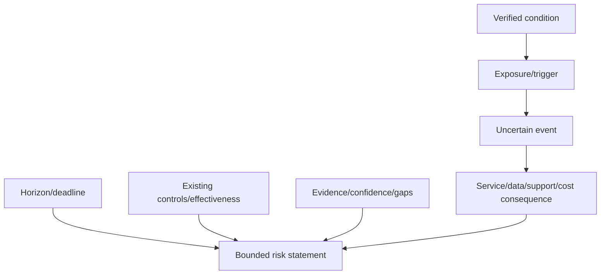

---

## 2. Evidence contract and applicability gate

Do not score a candidate until identity, freshness, applicability, and evidence quality are explicit.

### Applicability ladder

```mermaid
flowchart LR
    SOURCE[Current authoritative source] --> ID[Exact customer/asset identity]
    ID --> PRODUCT[Exact product/platform/release]
    PRODUCT --> FEATURE[Feature/protocol/configuration present]
    FEATURE --> TRIGGER[Trigger/exposure condition present]
    TRIGGER --> TIME[Still present in fresh evidence]
    TIME --> CONTROL[Existing mitigation/control checked]
    CONTROL --> APPLY[Applicable/exposed state + confidence]
```

### Candidate states

| State | Meaning | Priority handling |
|---|---|---|
| Observed issue | Impact is occurring now | Incident/problem process; risk model is secondary |
| Applicable and exposed | Exact condition/trigger present | Prioritize with consequence, horizon and controls |
| Potentially applicable | Some gates unknown | Evidence action before irreversible remediation |
| Not applicable | A required gate fails | Record reason/date; monitor environment changes |
| Mitigated | Applicable but effective control exists | Score residual state and control durability |
| Fixed/closed | Correction and outcome validated | Retain proof and monitoring |
| Unknown/access-limited | Required evidence unavailable | Never convert to low/green |
| Disputed | Sources/owners conflict | Escalate; avoid false precision |

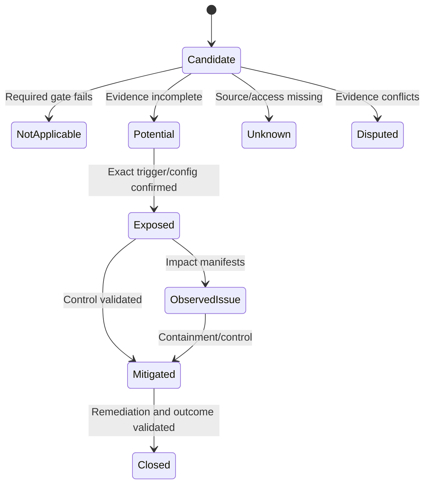

### Evidence record

| Field | Required content |
|---|---|
| Finding ID/title | Stable local ID and bounded summary |
| Assets/services | Exact stable IDs, relationships and business criticality source |
| Source | AutoSupport, Digital Advisor, install base, CMDB, case, IMT/HWU, bug, lifecycle, monitoring, project or owner evidence |
| Time | Observation/effective/extraction/review cutoff and freshness |
| Applicability | Exact product/release/feature/trigger/control state |
| Confidence | High/medium/low/unknown and missing evidence |
| Existing controls | Preventive, detective, recovery and effectiveness proof |
| Contradictions | Conflicting sources/alternate explanations |

---

## 3. Risk dimensions: keep unlike questions separate

### Dimension map

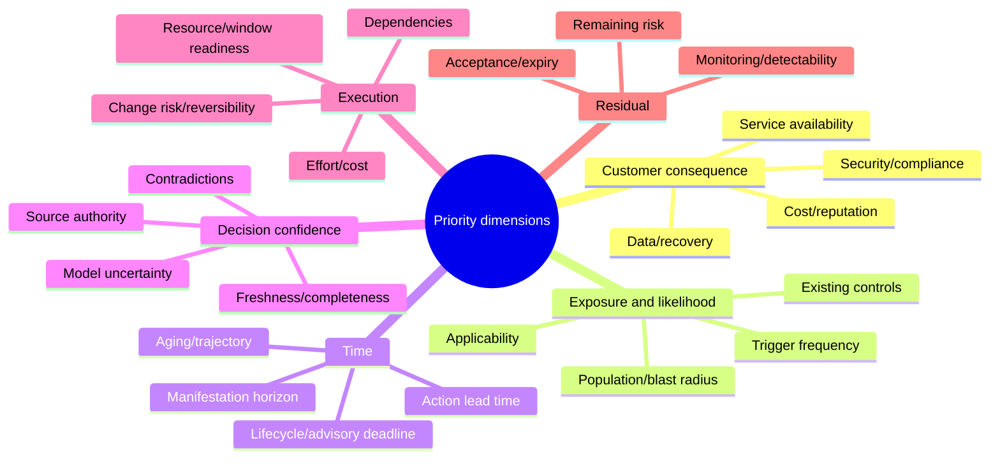

### Dimension definitions

| Dimension | Question | Do not confuse with |
|---|---|---|
| Asset/service criticality | How important is the affected objective? | Current impact or likelihood |
| Consequence/impact | What could happen if event manifests? | Probability it will happen |
| Exposure/applicability | Is exact condition and trigger present, for how much scope? | Vendor severity |
| Likelihood/frequency | How plausible/often under customer conditions? | Confidence in evidence |
| Detectability | Can precursor/manifestation be identified early and reliably? | Prevention |
| Time horizon | When could consequence occur or deadline arrive? | Remediation duration |
| Supportability | Does current/target configuration have authoritative support evidence? | Runtime health |
| Confidence | How strong is evidence/model? | Low risk |
| Effort/cost | Work/resources needed | Risk reduction value |
| Dependencies | What must happen first/in parallel? | Optional administrative detail |
| Lead time | Decision-to-validation elapsed time | Engineer hands-on effort |
| Reversibility/change risk | How safely can action be tested/recovered? | Need for action |
| Residual risk | What remains after action/control? | Original/inherent risk |

### Plain-English deep-dive: weather severity, route exposure, and forecast confidence

A hurricane may be severe, but a city outside its path has low exposure. A weaker storm directly over a hospital tomorrow can be more urgent. A poor forecast lowers confidence, not the storm's possible consequence.

**Why it matters:** consequence, exposure, likelihood, urgency, and confidence answer different questions and should not be collapsed prematurely.

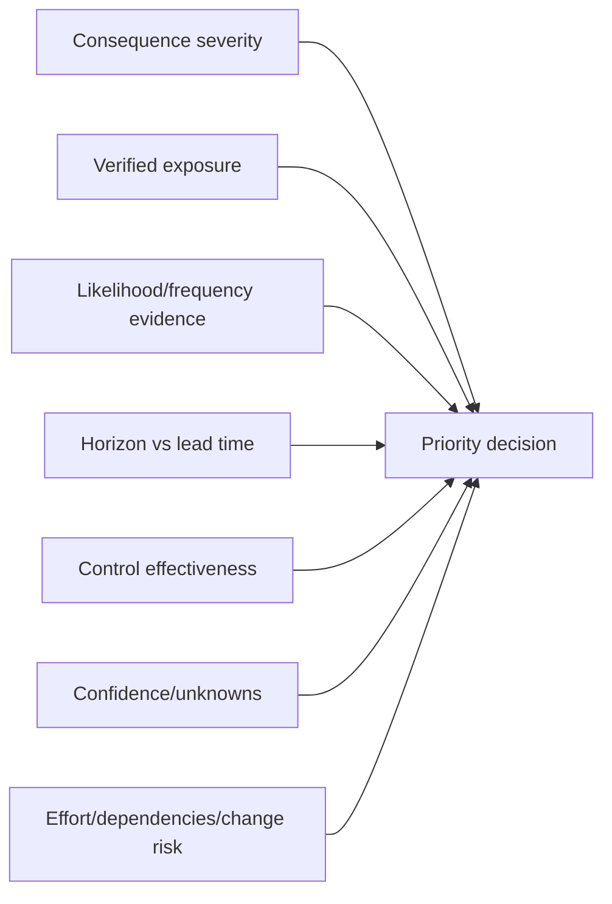

---

## 4. Severity is not urgency

**Severity** describes consequence if a risk manifests. **Urgency** describes how soon action must start to preserve options.

### Latest-safe-start logic

Let the earliest risk/deadline date be $D$, and end-to-end action lead time be $L$:

$$
Latest\ Safe\ Start = D-L
$$

Lead time can include evidence, decision, budget, procurement, design, compatibility, testing, change windows, implementation, validation, and contingency.

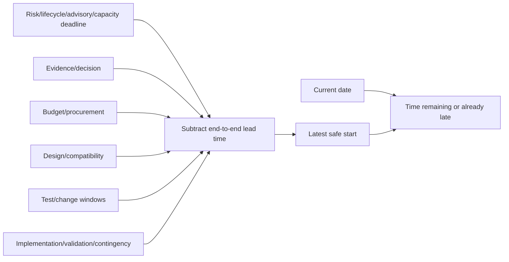

### Severity-versus-urgency examples

| Scenario | Severity | Urgency | Reason |
|---|---|---|---|
| Severe defect, trigger absent and controlled | High | Monitor/plan | Consequence high, current exposure low |
| Medium supportability gap blocks change next week | Medium | High | Decision deadline and lead time are immediate |
| High lifecycle risk three years away but procurement takes 30 months | High | High to start planning | Latest safe start can be near |
| Low-impact hygiene item with one-hour safe fix | Low | Opportunistic | Useful quick win, not above critical dependency |
| Current outage | Current issue | Immediate incident response | Do not bury in portfolio scoring |

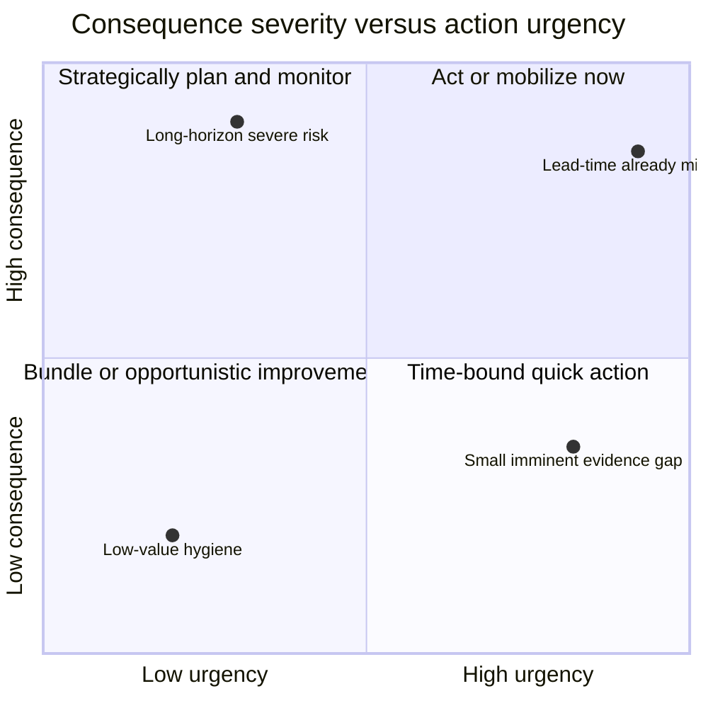

**Boundary:** quadrant positions are illustrative and synthetic, not measured probabilities or NetApp thresholds.

---

## 5. Likelihood, exposure, detectability, and confidence

### Likelihood evidence ladder

| Evidence | Safer interpretation |
|---|---|
| Exact trigger observed repeatedly | Frequency can be estimated for this observed population/window |
| Exact condition present; trigger plausible | Exposed, probability uncertain |
| Release match only | Candidate, not exposed |
| Similar symptom | Hypothesis, not defect probability |
| No historical event | Does not prove future impossibility or effective control |
| Missing telemetry | Unknown, not low likelihood |

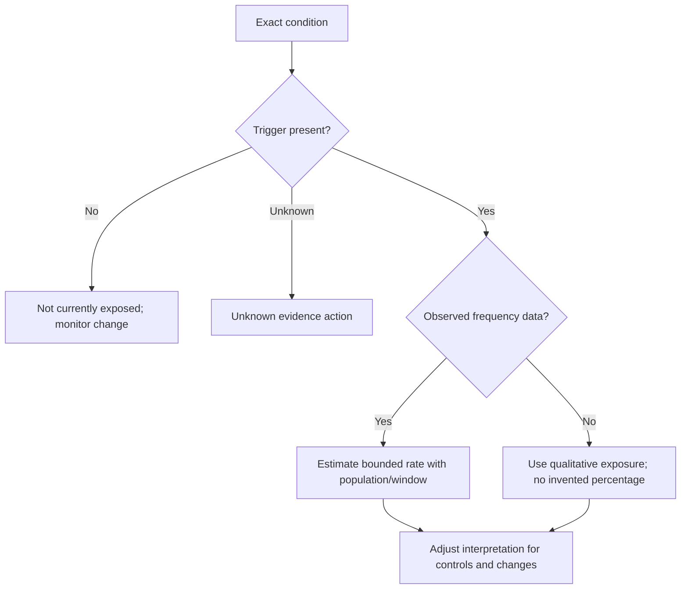

### Detectability

Detection can reduce time-to-response, but it may not prevent consequence. Record what signal, coverage, latency, false-negative/positive rate, owner, and response playbook exist.

### Confidence labels

| Level | Evidence pattern | Use |
|---|---|---|
| High | Multiple authoritative/current sources, exact applicability, no major contradiction | Decision/action with normal safeguards |
| Medium | Mechanism and key evidence align; one important test/gap remains | Reversible action or evidence collection |
| Low | Partial/stale/indirect evidence or plausible alternatives | Probe, not major irreversible change |
| Unknown | Source/access/identity/definition absent | Explicit gap and owner/date |

### Confidence is not a risk discount

A low-confidence, potentially catastrophic condition can justify urgent evidence collection or precautionary containment. It should not automatically receive a low score.

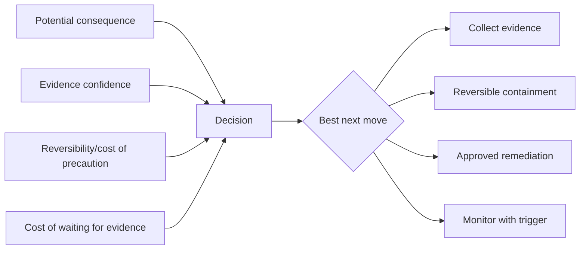

---

## 6. Time, aging, trend, and action lead time

Risk changes over time. Store detected date, evidence age, exposure start, deadline, latest safe start, owner checkpoint, accepted-risk expiry, and validation date.

### Aging model

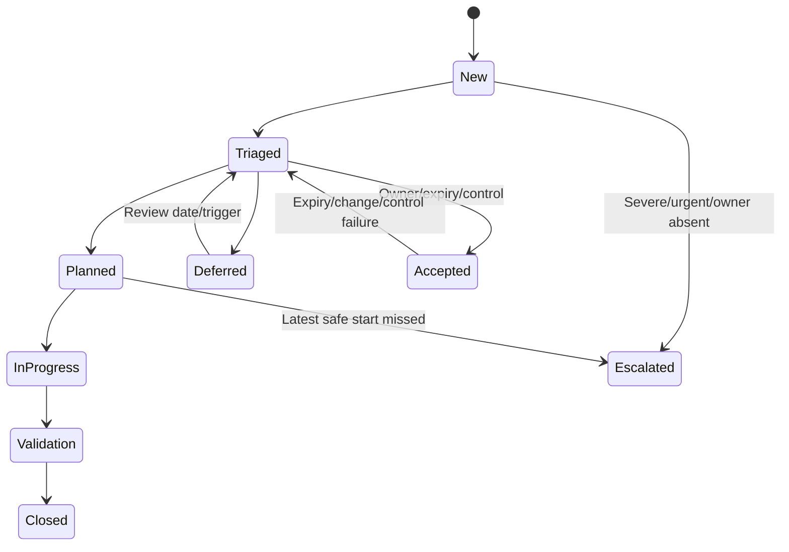

### Aging is not simply `today - open date`

Track:

- **Evidence age:** how old the supporting data is.
- **Risk age:** how long condition has existed.
- **Queue age:** how long action has waited for ownership/decision.
- **Milestone slippage:** due date versus current forecast.
- **Time-to-deadline:** authoritative horizon.
- **Lead-time margin:** deadline minus remaining end-to-end action duration.

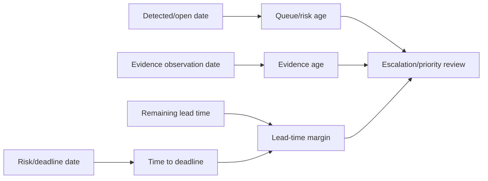

### Aging controls

- Escalate unassigned high-consequence items.
- Escalate when latest safe start is approached or missed.
- Expire stale evidence and rerun applicability.
- Require defer/accept review dates.
- Track blocked time separately from owner inactivity.
- Never improve metrics by closing/reopening or removing hard items from the denominator.

---

## 7. Effort, dependencies, reversibility, and feasibility

Risk priority is not identical to execution order. A prerequisite may need to start first even when its standalone risk is lower.

### Effort and lead-time fields

| Field | Example components |
|---|---|
| Analysis effort | Evidence collection, specialist review, design |
| Financial cost | Hardware, licenses, services, labor, opportunity cost |
| Procurement lead | Approval, quote, order, delivery, rack/power |
| Compatibility lead | IMT/HWU/app/vendor validation, bug scrub |
| Test lead | Lab, pilot, app/DR/security validation |
| Change lead | Freeze/window, communications, runbook, approvals |
| Recovery complexity | Revert/forward recovery, migration, data protection |
| Ongoing overhead | Monitoring, workaround maintenance, repeated manual control |

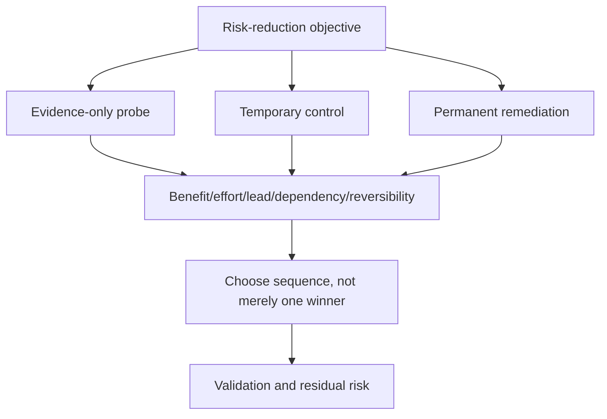

### Dependency graph

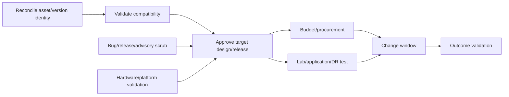

### Quick wins

Quick wins are actions with bounded benefit, low dependency, low change risk, and easy proof. They may proceed alongside, not instead of, urgent strategic work. Do not let a team optimize closure count by completing many low-value items while a critical dependency slips.

### Status quo is an option

Compare remediation against monitored deferment or accepted risk. The status quo has cost, exposure trajectory, shrinking support options, and future lead-time consequences; it is not a zero-cost baseline.

---

## 8. Ordinal scales and weighted scoring

An **ordinal scale** ranks categories, such as Low < Medium < High. It does not prove equal distance between categories. `High = 3` is a code for order, not evidence that High is exactly three times Low.

### Plain-English deep-dive: podium places are not stopwatch times

First, second, and third establish order, but they do not reveal whether the winner was one millisecond or one minute ahead. Adding podium places across races can produce a ranking, but the arithmetic should not be treated as physical measurement.

**Why it matters:** risk ratings often look numeric while remaining judgment categories.

### Example local ordinal scales

| Dimension | 1 | 2 | 3 | 4 | 5 |
|---|---|---|---|---|---|
| Consequence | Negligible | Low | Moderate | High | Severe |
| Exposure | Not exposed | Limited | Partial | Broad | Confirmed/active |
| Urgency | Roadmap | Plan | Next window | Start now | Already late/current |
| Confidence | Unknown | Low | Medium | High | Verified/current |
| Effort | Very high | High | Medium | Low | Very low |

These labels and direction are synthetic. Effort is reversed only if the model intentionally rewards ease; mixing benefit and convenience in one score can bury important hard work.

### Weighted score

A local ranking aid might use:

$$
Score_j=\sum_{i=1}^{n}w_i r_{ij}, \qquad \sum_i w_i=1
$$

where $r_{ij}$ is an ordinal rating and $w_i$ is a governance choice. This calculation imposes assumptions:

- Category gaps behave as if comparable.
- Weighted compensation is allowed: strength in one dimension can offset weakness in another.
- Ratings/weights are stable enough for the decision.
- Criteria are not double-counted.
- Higher score meaning is consistent.

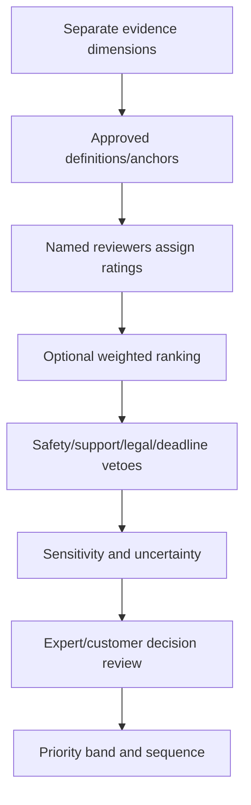

### Model design controls

1. Publish definitions and examples for each rating.
2. Keep source severity separate from local customer priority.
3. Avoid overlapping criteria such as impact, criticality and severity unless intentionally distinct.
4. Do not include confidence only as a multiplier that suppresses unknown catastrophic risk.
5. Keep effort visible; do not let easy work automatically outrank important work.
6. Use bands and narrative, not tiny decimal differences.
7. Calibrate against outcomes and reviewer consistency.
8. Version weights, rules and exceptions.

### Ranking ties and near-ties

Scores such as `3.84` and `3.79` rarely justify precise order if inputs are ordinal judgments. Treat them as the same priority band, then use dependency, horizon, reversibility, customer value and expert review.

---

## 9. Risk matrices and FMEA-style analysis

### Risk matrix

A qualitative matrix crosses consequence and likelihood/exposure. It is useful for conversation, but category boundaries can be arbitrary and different risks can collapse into one cell.

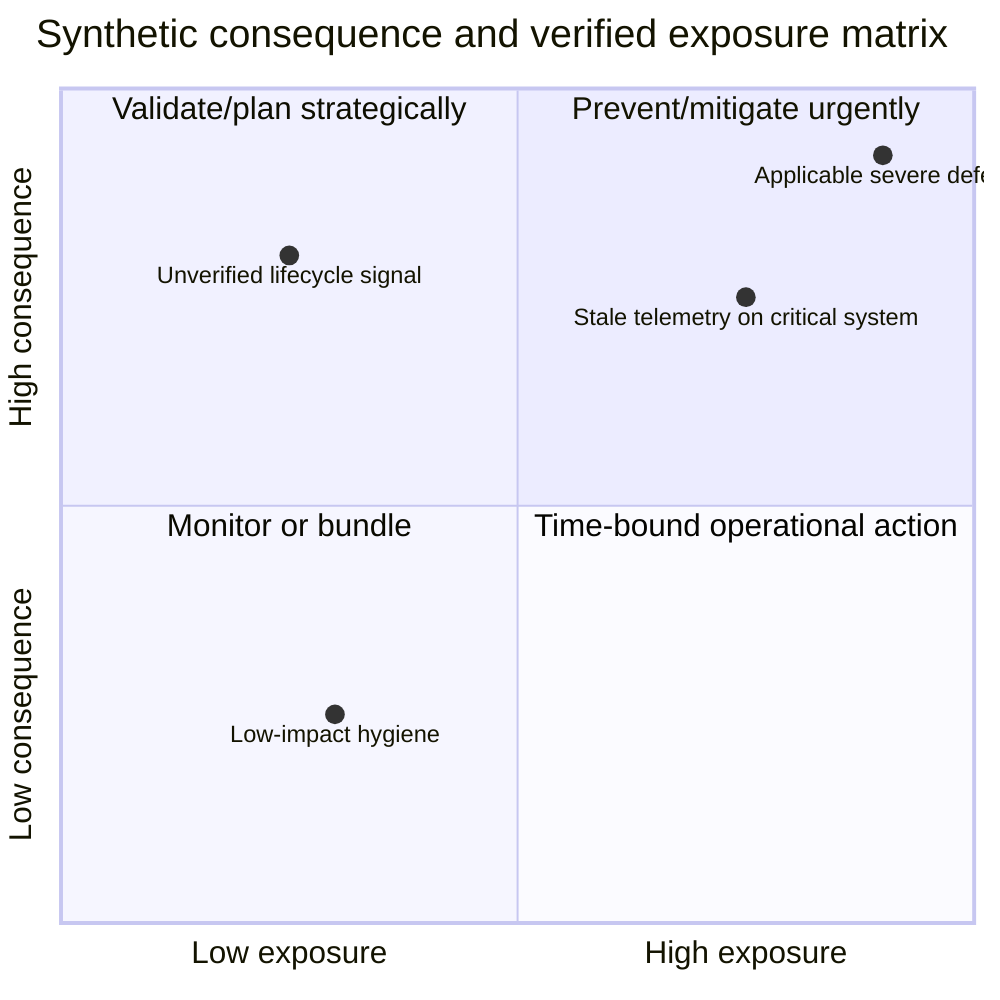

### FMEA orientation

**Failure Modes and Effects Analysis (FMEA)** asks:

- What can fail (**failure mode**)?
- Why/how can it fail (**cause/mechanism**)?
- What happens (**effect**)?
- What controls prevent or detect it?
- What action reduces risk?

A classic-style **Risk Priority Number (RPN)** is often written:

$$
RPN = Severity \times Occurrence \times Detection
$$

where higher Detection rating often means harder to detect. This is an ordinal prioritization aid, not a measured probability or expected loss.

| FMEA field | TAM adaptation |
|---|---|
| Process/function | Customer service/storage dependency |
| Failure mode | Unsupported state, capacity exhaustion, path loss, stale telemetry, upgrade failure |
| Cause | Defect, lifecycle, config, missing control, process gap |
| Effect | Availability, data, support, security, cost or timeline consequence |
| Existing controls | Redundancy, monitoring, workaround, backup, review |
| S/O/D | Locally defined ratings with evidence |
| Action | Prevent, reduce, detect, recover or gather evidence |
| Owner/date/proof | Governance and validation |

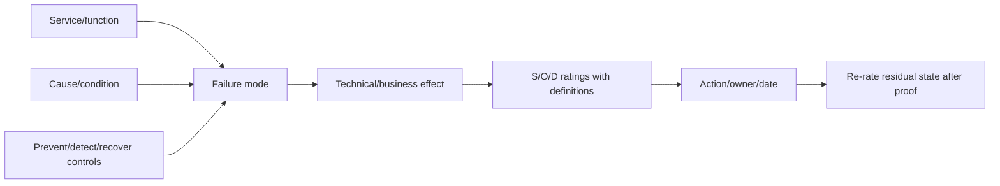

### FMEA/RPN caveats

- Different rating triples can produce the same RPN but have very different consequences.
- Multiplying ordinal labels creates false mathematical confidence.
- A severe but rare failure can rank below several moderate ratings.
- Detection cannot always compensate for irreversible data/security harm.
- Review the individual dimensions and veto conditions, not only the product.
- Never compare RPNs across teams using different definitions.

---

## 10. Uncertainty and sensitivity analysis

### Uncertainty types

| Type | Example | Response |
|---|---|---|
| Data uncertainty | Stale/missing telemetry or unknown owner | Collect evidence; widen conclusion |
| Applicability uncertainty | Bug trigger or exact recipe unknown | Targeted validation/authorized review |
| Model uncertainty | Weight/scale choice changes order | Sensitivity and alternative model |
| Forecast uncertainty | Growth/project date varies | Low/base/high scenarios and backtesting |
| Execution uncertainty | Procurement/window/test duration | Range and contingency |
| Outcome uncertainty | Remediation may not reduce mechanism | Pilot and explicit success criteria |

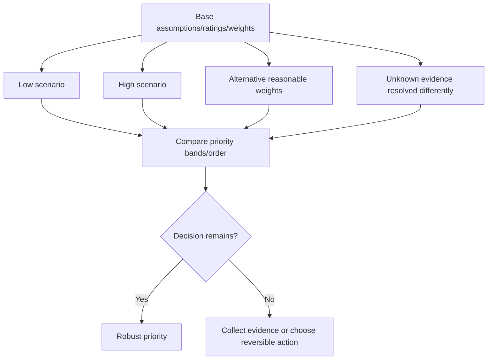

### One-way sensitivity

Change one assumption or weight through a plausible range while holding others fixed. Record when the ranking crosses a decision boundary.

### Scenario analysis

Use conservative/base/optimistic or trigger-absent/trigger-present cases. Do not assign numerical probability unless historical/customer evidence supports it.

### Value of information

Ask whether one evidence action could change the decision enough to justify delay/cost. If the safest action is reversible and urgent, acting while collecting evidence may be better than waiting.

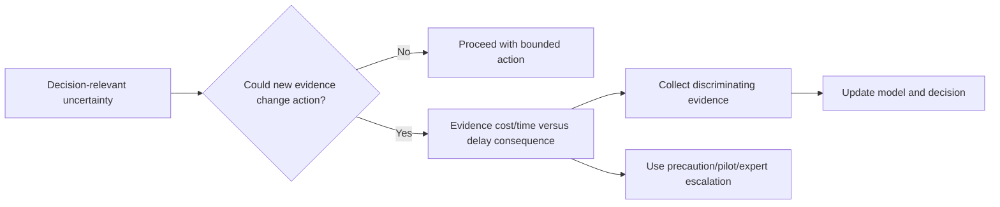

### Communicating uncertainty

Prefer:

> "Priority remains `Now` across reasonable consequence/exposure weights because the latest safe start has passed. Confidence in the exact failure probability is low, so the immediate action is a reversible containment plus evidence collection, not an irreversible architecture change."

Avoid:

> "The risk is exactly 82.4%."

---

## 11. Expert override, vetoes, and governance

### Plain-English deep-dive: autopilot with a qualified pilot

Automation can keep a plane stable under expected conditions, but a qualified pilot must handle sensor conflicts, weather, runway changes, and safety limits. A risk score similarly supports consistency while accountable experts handle context the model cannot encode.

**Why it matters:** override is legitimate only when transparent, evidence-backed, bounded, and reviewable. Secret overrides destroy trust; blind adherence destroys judgment.

### Non-compensable veto examples

- Known safety, legal, privacy, security, or contractual prohibition.
- Explicitly unsupported configuration for the planned action.
- Data-protection/recovery requirement cannot be met.
- Latest safe start missed with severe consequence.
- Critical source identity is unresolved.
- Required customer/change authority unavailable.
- No viable rollback/forward recovery for an irreversible action.

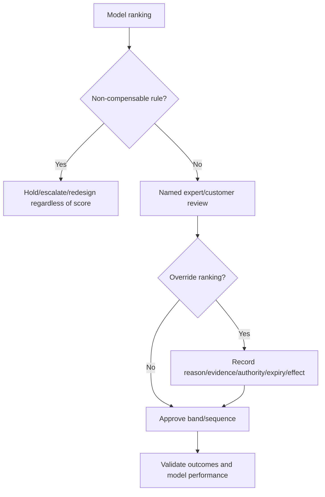

### Override record

| Field | Required content |
|---|---|
| Original result | Model version, inputs, score/band/order |
| Changed decision | New band/order/action |
| Reason | Missing criterion, dependency, customer context, source authority, precaution |
| Evidence | Dated sources and expert role |
| Authority | Named accountable decision owner |
| Duration | Permanent, temporary, or expiry/review date |
| Impact | Displaced work and accepted residual risk |
| Outcome | Validation and whether model should change |

### Separation of duties

The analyst prepares evidence/model, technical owners validate mechanism/actions, business/customer owners set appetite and accept residual risk, and change authorities approve implementation. One person should not invent scores, approve remediation, and accept residual risk without review.

---

## 12. Portfolio prioritization and dependency sequencing

Prioritizing one risk differs from managing a portfolio with shared actions, dependencies, collisions, limited resources, and customer windows.

### Portfolio pipeline

```mermaid
flowchart LR
    RAW[Candidate findings] --> DEDUP[Canonical risks/actions]
    DEDUP --> APPLY[Applicability/confidence]
    APPLY --> BAND[Risk/urgency bands]
    BAND --> DEP[Dependency and shared-action graph]
    DEP --> CAP[Resource/window/collision capacity]
    CAP --> SEQ[Portfolio sequence/waves]
    SEQ --> TRACK[Owners/milestones/aging]
    TRACK --> VALID[Outcome/residual/model feedback]
```

### Deduplicate at the right grain

- One risk may affect many systems.
- One action may mitigate several risks.
- Several actions may be prerequisites for one remediation.
- One change window can bundle compatible actions but can also increase blast radius.
- Keep risk, affected-system, recommendation, action, decision, and validation records separate.

### Portfolio decision factors

| Factor | Question |
|---|---|
| Risk reduction | Which objective/dimension changes and by how much qualitatively? |
| Urgency | Which latest-safe-start or active issue governs? |
| Dependency | What unlocks or blocks other actions? |
| Shared action | Can one validated change address several risks? |
| Collision | Do changes touch same platform, hosts, paths, freeze, or recovery resources? |
| Capacity | Which specialist, budget, lab, procurement and window constraints apply? |
| Customer value | Does sequence protect the most important service/outcome? |
| Optionality | Does a reversible action preserve future choices? |

```mermaid
flowchart TD
    R1[Risk A] --> A1[Action: evidence repair]
    R2[Risk B] --> A1
    A1 --> A2[Validate target/supportability]
    R3[Risk C] --> A2
    A2 --> A3[Upgrade/refresh implementation]
    R4[Capacity risk] --> A4[Expansion/migration design]
    A3 --> COLLIDE{Same customer window/resources?}
    A4 --> COLLIDE
    COLLIDE --> WAVE[Sequence waves and contingency]
```

### Portfolio views

- **Now:** current issue, latest-safe-start passed, severe active exposure, veto.
- **Next window:** action ready and time-bound.
- **Plan/fund:** significant horizon/lead time or dependency work.
- **Evidence first:** uncertainty could change action.
- **Monitor:** low/current controlled exposure with trigger and review.
- **Deferred/accepted:** explicit owner, reason, control, expiry and residual risk.

---

## 13. Anti-gaming, bias, and false precision

### Common gaming patterns

| Pattern | Effect | Control |
|---|---|---|
| Remove unknown/stale assets from denominator | Improves coverage score falsely | Governed population and explicit unknowns |
| Close/reopen aged risks | Resets aging | Stable risk ID and full state history |
| Split one hard risk into easy actions | Inflates closure count | Track customer outcome and canonical risk |
| Bundle many risks into one vague item | Hides exposure/assets | Preserve risk-to-asset mappings |
| Lower ratings to avoid escalation | Understates risk | Anchored definitions, peer review, source evidence |
| Inflate ratings to win resources | Crowds out other work | Cross-portfolio calibration and override log |
| Count acknowledgement as remediation | False closure | Closure requires technical/customer proof |
| Use stale favorable evidence | Creates false confidence | Freshness gate and expiry |

```mermaid
flowchart LR
    METRIC[Risk/action metric] --> INCENT[What behavior does it reward?]
    INCENT --> GAME[Potential gaming/bias]
    GAME --> CONTROL[Stable population/history/peer review/outcome proof]
    CONTROL --> AUDIT[Sample raw evidence and decisions]
    AUDIT --> ADJUST[Revise model/process]
```

### Bias checks

- Availability bias: recent dramatic incident dominates common systemic risks.
- Tool bias: visible Digital Advisor items outrank unmonitored/gated systems.
- Data-rich bias: well-instrumented services look riskier than blind ones.
- Effort bias: easy fixes outrank strategic dependencies.
- Authority bias: senior opinion overrides evidence without record.
- Customer-size bias: largest customer always dominates consequence.
- Status quo bias: deferred risk treated as harmless.

### False precision controls

1. Show source categories and narrative, not only decimals.
2. Use priority bands and ranges.
3. Round scores consistently; avoid hundredths for ordinal inputs.
4. Show dimensions and vetoes next to summary score.
5. Show uncertainty and rank sensitivity.
6. Publish model/version/reviewer/date.
7. Do not present an ordinal score as probability, expected loss, or SLA.

### Calibration

Compare prior ratings with manifestation, near misses, control effectiveness, remediation outcomes, aging, false positives/negatives, and reviewer disagreement. Calibration improves definitions; it does not manufacture objective probability from sparse data.

---

## 14. Preventative recommendation logic and residual risk

### Control hierarchy

```mermaid
flowchart TD
    RISK[Verified risk mechanism] --> REMOVE[Remove condition/trigger]
    RISK --> REDUCE[Reduce exposure/likelihood]
    RISK --> LIMIT[Limit consequence/blast radius]
    RISK --> DETECT[Improve early detection]
    RISK --> RECOVER[Improve recovery/resilience]
    RISK --> ACCEPT[Accept residual risk]
    REMOVE --> OPT[Compare supported options]
    REDUCE --> OPT
    LIMIT --> OPT
    DETECT --> OPT
    RECOVER --> OPT
    OPT --> ACT[Owner/date/prerequisites/rollback/proof]
```

### Recommendation record

| Field | Required content |
|---|---|
| Finding/risk | Evidence, mechanism, consequence, horizon, confidence |
| Current controls | Prevention/detection/recovery and effectiveness |
| Options | Remediate, mitigate, detect, recover, transfer, defer, accept, status quo |
| Recommended action | Specific supported bounded action |
| Rationale | Which risk dimensions it changes and why |
| Dependencies | Access, compatibility, bug/lifecycle, owner, budget, test, window |
| Change safety | Canary, stop, rollback/forward recovery |
| Success | Technical, business, support and data evidence |
| Residual risk | Remaining dimensions, monitoring, owner and acceptance |

```mermaid
flowchart LR
    INH[Inherent/current risk] --> CTRL[Existing controls]
    CTRL --> CUR[Current residual risk]
    CUR --> ACTION[Proposed action]
    ACTION --> TARGET[Target residual risk]
    TARGET --> PROOF[Validate control/action effectiveness]
    PROOF --> ACCEPT{Within customer appetite?}
    ACCEPT -->|Yes| MON[Accept/monitor with expiry]
    ACCEPT -->|No| MORE[Additional option/escalation]
```

### Accepted risk

Risk acceptance requires:

- Exact scope/objective and evidence cutoff.
- Reason action is deferred/not selected.
- Consequence/exposure/horizon/confidence.
- Current controls and their proof.
- Accountable customer/business authority.
- Start, expiry/review and reopening triggers.
- Monitoring, response owner and escalation.
- Residual risk and displaced dependencies.

The analyst records and explains; the authorized customer owner accepts.

### Closure

A risk is not closed because a ticket completed. Validate the exact condition, customer outcome, side effects, affected scope, telemetry freshness, action sustainability, and residual-risk decision.

---

## 15. Fully synthetic sanitized scenario: Northwind Bio risk portfolio

> **Synthetic boundary:** `Northwind Bio`, all assets, services, risks, defects, lifecycle facts, scores, weights, probabilities, dates, priorities, costs, actions, and outcomes are fictional. Tables are not Digital Advisor, Bugs Online, IMT, HWU, or customer results.

### Discovery context

Northwind asks which preventative actions should enter the next two maintenance windows while funding a platform refresh. The synthetic portfolio supports regulated research, general file services, and archive workloads.

### Evidence register

| ID | Synthetic finding | Applicability/confidence | Consequence | Horizon/lead time | Existing control |
|---|---|---|---|---|---|
| `R-01` | Exact fictional defect trigger on research cluster | Exposed; high | Severe availability/data-recovery delay | Trigger can occur now; workaround 5 days | Redundancy, but trigger affects recovery path |
| `R-02` | AutoSupport-like telemetry stale on one node | Confirmed; high | Reduced proactive/support visibility | Current; repair 2 days | Local monitoring only |
| `R-03` | Platform synthetic EOS in 15 months | Source confirmed; high | Support/spares/upgrade constraint | Program lead 14 months | Contract currently active |
| `R-04` | Capacity base case reaches threshold in 9 months | Medium; project input uncertain | Service growth/backup risk | Expansion lead 7 months | Cleanup frees limited space |
| `R-05` | One host recipe evidence stale after driver change | Confirmed evidence gap; high | Upgrade supportability/change risk | Upgrade in 6 weeks | Change can be held |
| `R-06` | Low-severity configuration hygiene | Applicable; high | Minor operational inefficiency | No deadline; 2 hours | None needed |
| `R-07` | Severe advisory title, exact feature absent | Not applicable; high | Severe generic consequence | Monitor config change | Feature disabled/verified |
| `R-08` | Backup restore proof older than policy cadence | Confirmed gap; medium | Recovery confidence risk | Next test window in 3 weeks | Successful backups, restore uncertain |

```mermaid
flowchart TB
    SERVICE[Northwind services] --> R1[R-01 active defect exposure]
    SERVICE --> R2[R-02 telemetry blind spot]
    SERVICE --> R3[R-03 lifecycle horizon]
    SERVICE --> R4[R-04 capacity scenario]
    SERVICE --> R5[R-05 stale compatibility]
    SERVICE --> R8[R-08 restore confidence]
    R2 --> EVID[Evidence/visibility repair]
    R5 --> EVID
    EVID --> CHANGE[Safe upgrade/refresh decisions]
    R3 --> CHANGE
    R4 --> CHANGE
```

### Synthetic ordinal model

The steering group uses a teaching-only 1-5 scale and weights:

| Dimension | Weight |
|---|---:|
| Consequence | 0.25 |
| Verified exposure | 0.20 |
| Urgency/latest-safe-start | 0.25 |
| Control weakness | 0.15 |
| Customer/service criticality | 0.15 |

| Risk | Consequence | Exposure | Urgency | Control weakness | Criticality | Weighted score |
|---|---:|---:|---:|---:|---:|---:|
| `R-01` | 5 | 5 | 5 | 4 | 5 | 4.85 |
| `R-02` | 3 | 5 | 4 | 4 | 5 | 4.10 |
| `R-03` | 5 | 5 | 5 | 3 | 5 | 4.70 |
| `R-04` | 4 | 3 | 4 | 3 | 5 | 3.80 |
| `R-05` | 4 | 5 | 4 | 3 | 5 | 4.20 |
| `R-06` | 1 | 5 | 1 | 2 | 2 | 2.10 |
| `R-08` | 5 | 4 | 5 | 4 | 5 | 4.65 |

`R-07` is not scored for current remediation because exact feature applicability fails; it remains a monitored condition-change rule.

### Score caveat

The numbers are ordinal codes. `R-05` at 4.20 is not 2.0% riskier than `R-02` at 4.10. The team uses bands, individual dimensions, dependencies, vetoes and expert judgment.

```mermaid
flowchart LR
    SCORE[Initial synthetic ranking] --> VETO{Safety/deadline/applicability veto}
    VETO --> R1[R-01 immediate controlled workaround/fix plan]
    VETO --> R3[R-03 lifecycle program starts now]
    VETO --> R8[R-08 restore validation next window]
    SCORE --> DEP[Dependency review]
    DEP --> R2[R-02 telemetry repair first]
    DEP --> R5[R-05 compatibility refresh before upgrade]
    SCORE --> QUICK[R-06 bundle only if no critical work displaced]
```

### Sensitivity analysis

| Change | Result | Decision implication |
|---|---|---|
| Consequence weight +0.10; urgency -0.10 | `R-01`, `R-03`, `R-08` remain top band | Robust strategic/urgent set |
| Exposure weight +0.10; criticality -0.10 | `R-02` and `R-05` rise | Evidence/supportability work remains important |
| Capacity project enters high case | `R-04` rises to top band | Obtain project evidence before funding sequence |
| Restore test evidence unexpectedly passes | `R-08` residual priority falls after proof | Validate before keeping high band |

```mermaid
flowchart TD
    BASE[Base ranking] --> W1[Alternative weights]
    BASE --> CAPH[Capacity high scenario]
    BASE --> REST[Restore result pass/fail]
    W1 --> COMP[Compare priority bands]
    CAPH --> COMP
    REST --> COMP
    COMP --> ROBUST[R-01/R-03 robust; R-04/R-08 evidence-sensitive]
```

### Expert override

The model ranks `R-03` slightly below `R-01`, but the sponsor starts the lifecycle program in parallel because its latest safe start is already inside procurement/design lead time. This is not a secret score change; the override record names the source date, lead-time dependency, sponsor, displaced budget work, and review date.

### Portfolio sequence

```mermaid
gantt
    title Synthetic Northwind preventative sequence
    dateFormat  YYYY-MM-DD
    section Immediate
    R-01 authorized containment and fix validation :a1, 2026-09-01, 10d
    R-02 telemetry repair                         :a2, 2026-09-01, 3d
    R-05 compatibility evidence refresh           :a3, after a2, 7d
    section Next window
    R-08 controlled restore validation             :b1, 2026-09-20, 3d
    Upgrade readiness after R-05                   :b2, after a3, 20d
    section Program
    R-03 refresh design/budget/procurement          :c1, 2026-09-01, 180d
    R-04 project-demand and capacity scenarios      :c2, 2026-09-05, 20d
```

### Preventative recommendations

1. **`R-01`:** Authorized technical owners validate the fictional defect and apply the current supported reversible control, then evaluate the fixed target across path/IMT/HWU/app/protection requirements. Validate trigger absence and service recovery; retain alternate causes.
2. **`R-02`:** Repair node telemetry and prove generation, collection, delivery, receipt, association and freshness. Do not infer health during the blind interval.
3. **`R-03`:** Start refresh design/funding now because end-to-end lead time consumes the apparent 15-month horizon. Recheck official lifecycle/contract/compatibility sources.
4. **`R-04`:** Confirm planned project date/size and run low/base/high forecasts before hardware commitment; monitor lead-time margin.
5. **`R-05`:** Hold upgrade approval until current, intermediate and target recipe evidence and notes match actual driver/firmware/host state.
6. **`R-08`:** Run the approved restore validation; successful backup jobs alone do not prove recoverability.
7. **`R-06`:** Bundle hygiene only when it does not consume specialists/window capacity needed by top-band actions.

### Outcomes and residual risk

| Risk | Synthetic validation | Residual risk decision |
|---|---|---|
| `R-01` | Trigger test and recovery path pass after supported mitigation | Monitor until fixed target validated |
| `R-02` | New telemetry sequence current on every node | Monitor freshness SLA/source outage |
| `R-03` | Budget/design milestones approved | Delivery/vendor dates still uncertain |
| `R-04` | Project high case confirmed | Capacity action becomes top-band program item |
| `R-05` | Exact recipe refreshed and peer reviewed | Runtime/change defect risk remains |
| `R-08` | Restore succeeds but exceeds customer target | New recovery-performance action opened |

---

## 16. Discovery, evidence, risk, recommendation, and JD Mapping

### Discovery questions

1. What exact customer objective, service, assets and decision horizon are in scope?
2. What is the evidence cutoff, source authority, freshness, completeness and access limitation?
3. Is the candidate observed, exposed, potential, mitigated, not applicable, fixed, unknown or disputed?
4. What consequence, exposure, likelihood/frequency, detectability and existing controls apply?
5. What deadline, trajectory, latest safe start, aging and evidence-expiry conditions apply?
6. What confidence and uncertainty could change the action?
7. What effort, procurement, compatibility, test, change, recovery and owner dependencies apply?
8. Which non-compensable vetoes or expert context override a score?
9. Which actions are shared, sequenced, colliding, quick-win, deferred or accepted?
10. What validation proves risk reduction, and what residual risk remains?

### Evidence-to-priority contract

```mermaid
flowchart LR
    EVID[Current evidence and applicability] --> DIM[Separate consequence/exposure/time/control/confidence dimensions]
    DIM --> METHOD[Matrix/ordinal/FMEA aid]
    METHOD --> SENS[Uncertainty/sensitivity]
    SENS --> GOV[Veto/expert/customer governance]
    GOV --> PORT[Portfolio dependency/resource sequence]
    PORT --> REC[Preventative recommendation]
    REC --> PROOF[Outcome/residual risk/model feedback]
```

### JD Mapping

| JD responsibility | Part 57 contribution | Your factual bridge and gap |
|---|---|---|
| Proactive risk identification | Exact applicability, consequence, horizon and controls | enterprise incident/problem/risk discipline transfers |
| Preventative recommendations | Action changes mechanism/exposure/consequence/detection/recovery | Advisory skills transfer; NetApp action authority does not |
| Customer prioritization | Transparent dimensions, sensitivity, veto and owner judgment | MBA/analytics decision framing transfers |
| Operational service reviews | Bands, aging, owners, deadlines, accepted/residual risk | Customer-review communication transfers |
| Lifecycle/upgrade planning | Latest-safe-start, dependency and portfolio sequencing | Change/program planning transfers |
| Data analysis | Versioned scoring, uncertainty, calibration and anti-gaming | Excel/Power BI/SQL/Python/statistics transfer |
| Cross-functional influence | Technical, business, security, procurement and change roles | critical-situation coordination transfers |

---

## 17. Your transfer and honest NetApp gap

```mermaid
flowchart LR
    CRIT[Critical situation/enterprise support] --> IMP[Impact, urgency, ownership, escalation]
    MBA[MBA/statistics] --> DEC[Dimensions, uncertainty, sensitivity, tradeoffs]
    BI[Excel/Power BI/SQL/Python] --> MODEL[Transparent models, aging, portfolio views]
    CUST[Customer reviews] --> STORY[Evidence-risk-action narrative]
    IMP --> METHOD[NetApp TAM risk method]
    DEC --> METHOD
    MODEL --> METHOD
    STORY --> METHOD
    METHOD --> GAP[Production NetApp evidence, calibration and authority remain gaps]
```

### Transfer table

| Factual strength | Transfer | Honest limit |
|---|---|---|
| enterprise support/critical situation | Current impact, safety, owner/checkpoint, escalation | Not ONTAP production risk authority |
| MBA/statistics | Dimensions, scenarios, sensitivity, bias and decision tradeoffs | No customer-calibrated NetApp probability model |
| Excel/Power BI | Risk register, matrices, aging, trends, service-review views | No live Digital Advisor/customer dataset |
| SQL/Python | Reproducible rules, joins, QA and model versions | No production scoring pipeline ownership |
| Customer communication | Bounded risk, options, owner/date and residual risk | Customer sponsor accepts risk, not analyst |

### Honest interview answer

> "I would not start with a score. I would verify exact applicability and write the cause-event-consequence-horizon statement, then keep consequence, exposure, likelihood, detectability, confidence, controls, lead time, effort, dependencies and residual risk separate. An ordinal weighted score or FMEA-style RPN can aid consistency, but I expose its assumptions, use vetoes, test sensitivity, document expert override, sequence shared dependencies, and require an accountable customer owner for acceptance. My production experience is Microsoft risk and service management, not a calibrated NetApp customer-risk model."

---

## 18. Paper lab and self-test

### Paper lab: synthetic 40-risk portfolio

Build a fully synthetic portfolio across availability, data protection, security, lifecycle, supportability, capacity, performance, telemetry, install-base, upgrade and process risks for 20 services and 50 assets.

```mermaid
flowchart LR
    EVID[Create synthetic evidence/applicability] --> RISK[Write bounded risk statements]
    RISK --> DIM[Rate separate dimensions]
    DIM --> METHODS[Matrix/weighted/FMEA comparisons]
    METHODS --> SENS[Sensitivity/uncertainty/override]
    SENS --> PORT[Dependencies/resources/waves/aging]
    PORT --> ACT[Recommendations/acceptance/validation]
    ACT --> CAL[Outcome and calibration review]
```

### Inject these cases

- Severe vendor finding with exact feature absent.
- Medium consequence but latest safe start already missed.
- Low-confidence catastrophic possibility with a cheap reversible containment.
- High score caused by duplicate dimensions.
- Equal RPNs with very different severity patterns.
- A quick win that would displace a critical specialist.
- One action that mitigates six risks.
- Two high-priority actions colliding in the same window.
- Unknown telemetry falsely scored as low exposure.
- Accepted risk with expired review date.
- Closed ticket without outcome validation.
- Owner gaming aging by reopening the item.
- Score order that flips under reasonable weights.
- Customer override based on a regulatory deadline absent from the model.
- Residual risk still above customer appetite after remediation.

### Tasks

1. Define terms, population, decision scope, source cutoff and owner roles.
2. Classify candidates by applicability before scoring.
3. Write condition-trigger-event-consequence-horizon-control-confidence statements.
4. Define anchored ordinal scales and reviewer instructions.
5. Build a consequence/exposure matrix, weighted score and FMEA-style table.
6. Compare individual dimensions and identify RPN/weighted-score distortions.
7. Calculate latest-safe-start ranges with full lead-time components.
8. Run weight, scenario and evidence sensitivity analysis.
9. Apply support/safety/privacy/recovery/deadline vetoes.
10. Record expert overrides with authority, reason, expiry and displaced work.
11. Build dependency/shared-action/collision graphs and wave plan.
12. Track aging, deferment, acceptance, expiry and anti-gaming controls.
13. Write preventative recommendations and target residual-risk statements.
14. Validate outcomes and propose model calibration changes.
15. Deliver executive and technical portfolio summaries.
16. Answer Q1-Q8 aloud.

### Self-test

1. Distinguish observation, finding, issue, risk, priority, recommendation and action.
2. Write a complete cause-event-consequence-horizon risk statement.
3. Explain the applicability gate and all candidate states.
4. Separate severity, exposure, likelihood, urgency and confidence.
5. Calculate latest safe start and explain lead-time assumptions.
6. Explain detectability without calling it prevention.
7. Compare effort, lead time, dependencies and execution order.
8. Explain why ordinal arithmetic and decimal rankings can mislead.
9. Build and critique a weighted score.
10. Build and critique a risk matrix and FMEA/RPN.
11. Run sensitivity and value-of-information analysis.
12. Apply vetoes and document expert override.
13. Prioritize a portfolio with shared actions and collisions.
14. Detect gaming, bias and false precision.
15. Govern accepted and residual risk through expiry/validation.
16. Recreate Northwind Bio and state your transfer/gap.

### Lab pass checklist

- [ ] No candidate is scored before exact applicability/confidence is recorded.
- [ ] Consequence, exposure, likelihood, urgency, confidence and effort stay separate.
- [ ] No invented numerical probability is presented as fact.
- [ ] Ordinal scales have anchored definitions and named reviewers.
- [ ] Weighted scores and RPNs are labeled decision aids with caveats.
- [ ] Non-compensable vetoes can override arithmetic.
- [ ] Sensitivity shows whether priority bands/order are robust.
- [ ] Expert overrides have authority, reason, evidence, expiry and outcome.
- [ ] Dependencies, shared actions, collisions, resources and lead time shape sequence.
- [ ] Aging/accepted risk cannot be reset or hidden.
- [ ] Closure requires outcome and residual-risk validation.
- [ ] All examples/results are fully synthetic and sanitized.
- [ ] No production NetApp risk model or acceptance authority is claimed.

---

## 19. Official Source Anchors

**Date checked: 2026-08-24.** Public official and credible sources only. Exact NetApp findings, severities, applicability, supportability, dates and actions require current authorized evidence.

| Topic | Official or credible public source | Bounded use |
|---|---|---|
| Digital Advisor wellness | [Learn about Digital Advisor wellness](https://docs.netapp.com/us-en/active-iq/concept_overview_wellness.html) | Public risk-category/severity orientation; current customer data is gated |
| Risk/action workflow | [View risks and take corrective actions](https://docs.netapp.com/us-en/active-iq/task_view_risk_and_take_action.html) | Risk/action/affected-system workflow orientation; not change authority |
| ONTAP security advisories | [NetApp Security Advisories](https://security.netapp.com/advisory/) | Current public product/CVE/remediation context; exact applicability required |
| ONTAP release support | [ONTAP release support](https://docs.netapp.com/us-en/ontap/release-notes/release-support-reference.html) | Current release-support capability context |
| Interoperability | [Interoperability Matrix Tool overview](https://docs.netapp.com/us-en/interoperability-matrix-tool/index.html) | Exact recipe method; live result requires authorized current access |
| Hardware configuration | [NetApp Hardware Universe](https://hwu.netapp.com/) | Gated exact hardware rules/limits; no values inferred here |
| Risk assessment | [NIST SP 800-30 Rev. 1](https://csrc.nist.gov/pubs/sp/800/30/r1/final) | Threat, vulnerability, likelihood, impact, uncertainty and assessment guidance |
| Risk framework | [NIST Cybersecurity Framework 2.0](https://www.nist.gov/cyberframework) | Govern/identify/protect/detect/respond/recover risk-management orientation |
| Enterprise risk | [NISTIR 8286A Rev. 1](https://csrc.nist.gov/pubs/ir/8286/a/r1/final) | Cybersecurity risk detail, risk registers and enterprise integration orientation |
| FMEA | [NASA Systems Engineering Handbook](https://www.nasa.gov/reference/systems-engineering-handbook/) | Credible systems-engineering/FMEA orientation; local method still requires definition |
| SRE risk/reliability | [Google SRE - Embracing Risk](https://sre.google/sre-book/embracing-risk/) | Reliability risk and business tradeoff concepts; not a NetApp model |
| Statistical uncertainty | [NIST/SEMATECH e-Handbook](https://www.itl.nist.gov/div898/handbook/) | Statistical process, uncertainty and analysis concepts |

### Source-use discipline

- Record exact source ID, version/update date, asset scope, applicability, evidence cutoff and access class.
- Preserve source severity and customer priority as separate fields.
- Do not invent likelihood, probability, score, threshold, weight, target or remediation.
- Use IMT, HWU, defects, lifecycle, application and Support evidence before technical action.
- Version local models and retain individual dimensions, uncertainty, overrides and outcomes.
- Keep accepted-risk authority with the accountable customer owner.
- Protect sensitive risk, vulnerability, topology, contract and service data.

---

## Likely Interview Questions

### Q1. How do you turn a technical finding into a customer risk?

> **Model answer:** "I verify exact asset, source, time, applicability and controls, then write: because this condition exists under this trigger, an uncertain event could affect a named business objective with a bounded consequence within a horizon. I state confidence, gaps, current controls, trajectory and residual risk before discussing score or action."

### Q2. What is the difference among severity, likelihood, exposure, urgency, and confidence?

> **Model answer:** "Severity is consequence if manifestation occurs; likelihood/frequency is how plausible/often under customer conditions; exposure is whether the exact condition/trigger and scope are present; urgency is how soon action must start given deadline and lead time; confidence is evidence strength. None safely substitutes for another."

### Q3. How do you use weighted risk scores safely?

> **Model answer:** "I define anchored ordinal scales, avoid duplicate criteria, publish weights and model version, retain individual dimensions, use bands rather than tiny decimal differences, apply non-compensable vetoes, test reasonable weights/scenarios, and require expert/customer review. The score ranks under assumptions; it is not probability or objective truth."

### Q4. What are the limitations of a risk matrix or FMEA RPN?

> **Model answer:** "Matrix categories can have arbitrary boundaries and collapse different risks into one cell. RPN multiplies ordinal severity, occurrence and detection; equal products can hide radically different severe outcomes, and detection may wrongly compensate for irreversible harm. I inspect dimensions and vetoes, not just color or product."

### Q5. How do effort and dependencies affect priority?

> **Model answer:** "They affect sequence, readiness and latest safe start, but hard work does not make risk unimportant. I map evidence, compatibility, funding, procurement, testing, window, recovery and shared-resource dependencies; run quick wins only when they do not displace critical work; and show status-quo cost and lead-time loss."

### Q6. When is expert override appropriate?

> **Model answer:** "When material customer context, a regulatory or support veto, dependency, uncertainty, or model omission changes the decision. I record original result, new decision, reason, evidence, named authority, expiry, displaced work and outcome. Override is transparent governance, not a hidden preference."

### Q7. How do you govern accepted and residual risk?

> **Model answer:** "I state exact scope, evidence, consequence, exposure, horizon, controls and remaining risk; name the accountable customer authority; record reason, expiry/review triggers, monitoring/response owner and dependencies; and reopen on evidence, control or environment change. Ticket closure alone is not acceptance or validation."

### Q8. How does your background transfer, and what remains a gap?

> **Model answer:** "enterprise support and critical-situation give me impact, urgency, ownership and escalation discipline; my MBA, statistics and BI/SQL/Python skills support transparent models, sensitivity and portfolio analysis. I have not calibrated or governed a production NetApp risk model, so current authorized NetApp evidence, technical owners and customer risk authority remain explicit."

---

## 30-Second Memory Hooks

- **Finding:** Verified condition; **risk:** uncertain objective effect; **priority:** governed order.
- **Risk sentence:** Condition -> trigger -> event -> objective consequence -> horizon.
- **Applicability first:** Exact asset/product/release/feature/trigger/control.
- **Severity:** Consequence, not probability or urgency.
- **Exposure:** Is the customer actually in the path?
- **Confidence:** Evidence strength, not a low-risk discount.
- **Urgency:** Deadline minus full lead time.
- **Effort:** Shapes sequence, not importance.
- **Ordinal:** Rank categories; do not pretend equal distances.
- **Weighted score:** Assumption-exposing aid, not truth.
- **Matrix:** Conversation map; category boundaries matter.
- **FMEA/RPN:** Failure mode/effect/control first; product can mislead.
- **Sensitivity:** Would a reasonable assumption change the decision?
- **Veto:** Safety/support/legal/recovery can override score.
- **Override:** Reason + evidence + authority + expiry + outcome.
- **Portfolio:** Shared actions, dependencies, collisions, waves and capacity.
- **Anti-gaming:** Stable population, IDs, history and outcome proof.
- **Residual:** Reassess after control; owner accepts what remains.
- **Your bridge:** Risk analytics transfers; NetApp/customer authority does not.

---

## Completion Checklist

- [ ] Define observation, finding, issue, risk, severity, urgency, priority, recommendation and residual risk.
- [ ] Write a bounded condition-trigger-event-consequence-horizon-control-confidence statement.
- [ ] Apply exact identity/freshness/applicability gates before scoring.
- [ ] Keep consequence, exposure, likelihood, detectability, confidence and controls separate.
- [ ] Calculate latest safe start using complete evidence-to-validation lead time.
- [ ] Track evidence age, risk age, queue age, deadline and milestone slippage.
- [ ] Map effort, dependencies, shared actions, collisions, reversibility and status quo.
- [ ] Define/version anchored ordinal scales and weights.
- [ ] Explain weighted-score compensation, interval and false-precision assumptions.
- [ ] Use risk matrices and FMEA/RPN only with individual-dimension caveats.
- [ ] Run uncertainty, scenario, sensitivity and value-of-information analysis.
- [ ] Apply safety/support/legal/privacy/recovery/deadline vetoes.
- [ ] Log expert override with evidence, authority, expiry, displaced work and outcome.
- [ ] Build a portfolio sequence with waves, owners, milestones and aging controls.
- [ ] Detect gaming, bias, stale evidence and cosmetic closure.
- [ ] Govern accepted/residual risk with accountable owner, controls and review triggers.
- [ ] Validate customer/technical outcomes before closure and feed back into calibration.
- [ ] Recreate the fully synthetic Northwind Bio scenario and paper lab.
- [ ] Answer Q1-Q8 aloud and state the exact No-production-NetApp boundary.
- [ ] Recheck current authoritative NetApp/customer sources before real decisions.

---

*Next suggested section:* [Part 58 - Recommendation Writing: Evidence, Context, Action, Value, and Validation](Part-58-recommendation-writing.md)