# Part 58 - Recommendation Writing: Evidence, Context, Action, Value, and Validation

> **Section goal:** Convert technical and analytical evidence into recommendations that a customer can understand, challenge, decide, execute, and validate. By the end, Arti should be able to keep observations, findings, issues, risks, recommendations, actions, and decisions distinct; write evidence-context-condition-consequence statements; propose specific options with rationale and tradeoffs; name prerequisites, owners, dates, success criteria, rollback/forward recovery, and residual risk; tailor executive and technical versions without changing facts; manage the recommendation lifecycle; respond to objections; and close only with outcome evidence.

Covers index item **58** and maps directly to job-description responsibilities for customer-specific technical recommendations, proactive risk mitigation, operational service reviews, executive communication, technical escalation, lifecycle and upgrade planning, action tracking, support-experience improvement, cross-functional influence, and measurable customer value.

**Explicit nonclaim:** Arti has not issued, approved, or implemented a production NetApp recommendation or represented a recommendation as an authorized NetApp support position.

**Privacy and access boundary:** Customer configurations, identifiers, telemetry, cases, defects, contracts, risks, costs, owners, business impacts, decisions, and change/recovery plans are sensitive. Use authorized evidence, purpose-limited access, audience-specific redaction, secure repositories, and approved retention.

**Synthetic-evidence rule:** Every customer, system, version, finding, risk, recommendation, action, decision, owner, date, cost, metric, objection, and outcome below is fictional and sanitized. No table is a real Digital Advisor result, AutoSupport record, IMT/HWU result, bug, case, support instruction, or customer decision.

**Version caveat:** Product behavior, risk content, compatibility, lifecycle, defects, upgrade paths, commands, prerequisites, rollback/revert constraints, support guidance, and service interfaces change. A **current-doc check** means reopening the exact current authoritative product/service/support source and verifying customer applicability at recommendation and execution time.

This Part gives no production command runbook, universal threshold, target release, sizing, hardware choice, QoS setting, remediation deadline, outage promise, risk acceptance, or guaranteed result. A recommendation is an evidence-bounded proposal; authorized customer and technical owners make decisions and execute supported changes.

> **No-production-NetApp boundary:** Arti's factual strengths are Microsoft enterprise support, CRITSIT, technical RCA and escalation writing, customer service reviews, executive communication, an MBA in Business Analytics, Excel/Power BI/SQL/Python, change governance, and cross-team action ownership. She does **not** claim production ONTAP administration, Digital Advisor operation, IMT/HWU approval, private defect authority, NetApp sizing, or customer change authority. Her exact non-claim is: **she has not authored an approved production NetApp architecture, upgrade, performance, capacity, lifecycle, or remediation recommendation.**

---

## 1. Recommendation writing is decision engineering

A useful recommendation does more than describe a problem. It creates a traceable bridge from evidence to a customer decision, action, and validated outcome.

### Plain-English deep-dive: diagnosis, prescription, consent, and follow-up

A doctor does not stop at `abnormal result`. They explain what was observed, what it may mean in this patient's context, which options exist, why one is preferred, prerequisites and side effects, who decides, and how success will be checked. Technical recommendations need the same separation.

**Why it matters:** evidence without action creates analysis debt; action without evidence creates change risk.

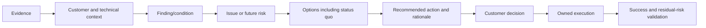

### Quality test

A recommendation is decision-ready when an authorized reader can answer:

1. What do we know, from where, as of when?
2. What scope and customer objective are affected?
3. What is happening or could happen, and why?
4. How confident are we and what remains unknown?
5. What choices exist, including doing nothing?
6. Why is one option preferred for this customer?
7. What must be true before acting?
8. Who decides, who acts, and by when?
9. How do we stop/recover and prove success?
10. What risk remains, and who accepts it?

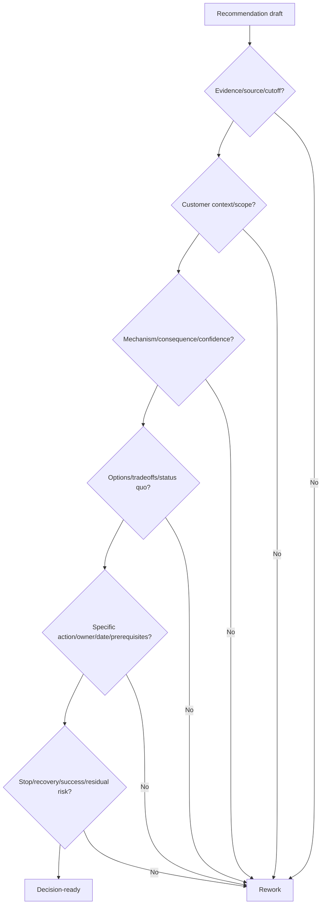

---

## 2. Observation, finding, issue, risk, recommendation, action, and decision

These records are related but not interchangeable.

| Record | Plain meaning | Example shape | Owner of truth |
|---|---|---|---|
| **Observation** | Direct measured/reported fact | `Node B last successful telemetry receipt was 18 days ago` | Evidence/source owner |
| **Finding** | Interpreted condition supported by observations | `Node B's proactive data is stale for the review cutoff` | Qualified analyst/technical reviewer |
| **Issue** | Undesired condition currently affecting an objective | `Support cannot use current node evidence in the active case` | Incident/problem/service owner |
| **Risk** | Uncertain future effect on an objective | `A future incident may take longer to diagnose` | Risk/business owner with technical input |
| **Recommendation** | Proposed course of action | `Repair HTTPS delivery and verify remote receipt` | Recommending technical/business team |
| **Action** | Committed executable work item | `Network owner corrects trust chain by D+5` | Named action owner |
| **Decision** | Authorized choice among options | `Approve repair now; defer proxy redesign` | Accountable customer/change/business authority |

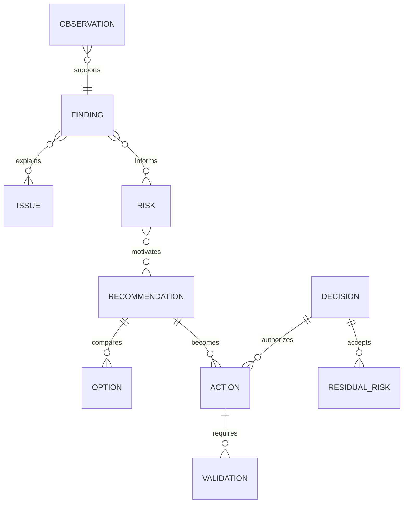

### State transitions

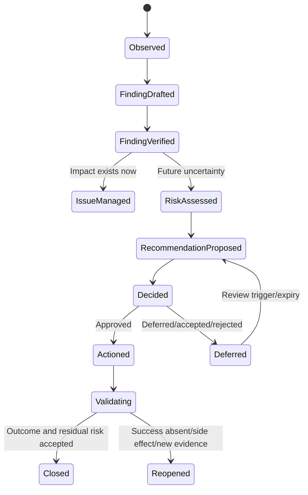

### Common category errors

- `High CPU was observed` is not automatically a finding that CPU is the bottleneck.
- `A risk exists` is not an action.
- `Upgrade` is not a complete recommendation.
- `Recommendation sent` is not a decision.
- `Ticket closed` is not validation.
- `Customer acknowledged` is not accepted residual risk.

---

## 3. Evidence-context-condition-consequence

A strong finding sentence can use four blocks:

1. **Evidence:** exact source, object, population, interval, definition, quality and cutoff.
2. **Context:** customer service, topology, change, requirement, comparison and boundary.
3. **Condition:** verified state or deviation, with confidence and contradictions.
4. **Consequence:** current issue or possible risk mechanism, not inflated certainty.

### Plain-English deep-dive: a laboratory result needs the patient chart

`Level = 12` is meaningless without the test name, units, range, time, sample quality, and patient context. Technical metrics behave the same way. `Latency high` or `capacity 80%` cannot support a recommendation until object, workload, baseline, denominator, data quality and customer objective are known.

**Why it matters:** evidence-context-condition-consequence prevents dashboard narration from masquerading as analysis.

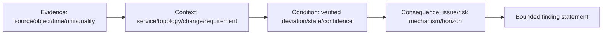

### Sentence pattern

> `<Source>` observed `<fact>` for `<exact object/population>` during `<UTC interval/cutoff>` using `<definition/unit>`. In the context of `<service/topology/change/objective>`, this indicates `<condition>` relative to `<baseline/requirement>`, with `<confidence/gaps>`. If/currently when `<mechanism/trigger>`, the customer objective `<objective>` can/is experiencing `<bounded consequence>` within `<horizon>`.

### Evidence hierarchy

| Evidence class | Example | Supports | Does not prove alone |
|---|---|---|---|
| Customer outcome | Transaction errors, missed RPO, case delay | Business/operational impact | Technical cause |
| Product/system telemetry | ONTAP metric, AutoSupport manifest, health state | Behavior in measurement scope | End-to-end impact or supportability |
| Configuration/inventory | Release, topology, policy, asset map | Possible mechanism/applicability | Runtime manifestation |
| Authoritative product source | IMT, HWU, bug, release, lifecycle, Support guidance | Supported/current product position in scope | Actual customer state |
| Controlled test | Predicted one-variable result | Stronger causal evidence | All future workloads/states |
| Expert/customer attestation | Owner confirms context/change | Operational/business context | Product fact without corroboration |

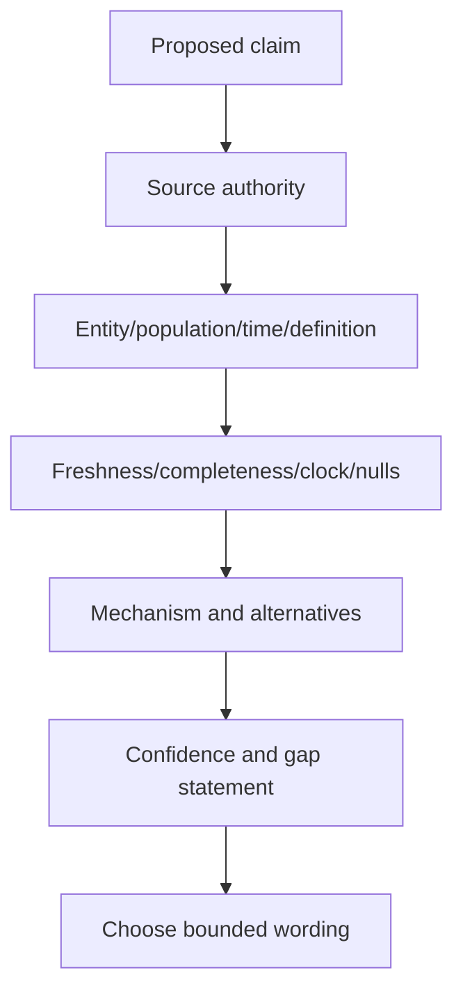

### Confidence wording

| Confidence | Wording |
|---|---|
| High | `Evidence supports... in the measured scope` |
| Medium | `Evidence is consistent with...; X remains untested` |
| Low | `This is a candidate hypothesis because...; do not change until Y` |
| Unknown | `The source/access/identity is unavailable; no health or risk conclusion is made` |

---

## 4. Anatomy of a complete recommendation

### Recommendation contract

| Field | Required content |
|---|---|
| ID/title | Stable action-oriented name |
| Finding | Evidence-context-condition-consequence and confidence |
| Customer value/risk | Objective, impact, horizon and why it matters now |
| Specific action | Exact bounded outcome/action; not vague intent |
| Rationale | Mechanism and dimensions expected to change |
| Options | Alternatives and status quo |
| Tradeoffs | Benefit, risk, cost, time, complexity, reversibility |
| Prerequisites | Access, current docs, supportability, health, budget, owners, tests, window |
| Scope | Assets, services, exclusions and phases |
| Owner/date | Accountable decision/action owners and milestones |
| Change safety | Canary, stop, hold, rollback/forward recovery |
| Success | Technical, application, business and support proof |
| Residual risk | What remains, monitoring, acceptance and review |

```mermaid
flowchart LR
    F[Finding and confidence] --> V[Customer value/risk/horizon]
    V --> OPT[Options/status quo/tradeoffs]
    OPT --> REC[Specific recommended action/rationale]
    REC --> PRE[Prerequisites/scope/sequence]
    PRE --> OWN[Decision owner/action owner/date]
    OWN --> SAFE[Canary/hold/rollback/forward recovery]
    SAFE --> SUCCESS[Success criteria and evidence]
    SUCCESS --> RES[Residual risk/monitoring/acceptance]
```

### Specific action test

Weak: `Improve capacity management.`

Specific:

> `The application and storage owners should validate the planned imaging ingest by 2026-09-15, rerun low/base/high physical-capacity scenarios against the approved operating threshold and end-to-end expansion lead time, and select phase, cleanup, tiering, or supported capacity action before the earliest latest-safe-start date.`

The second statement identifies actors, evidence, analysis, options, decision and deadline without prescribing an unsupported product command.

### Rationale

Rationale connects action to mechanism:

> `This action is preferred because planned ingest is absent from the historical trend, and confirming the event can change the capacity decision more than tuning the forecast model.`

Avoid `best practice` as a self-justifying phrase. Cite the exact current source and customer objective.

---

## 5. Options and tradeoffs

Every material recommendation should compare at least the proposed action and status quo; often it should include staged, temporary, and strategic alternatives.

### Option dimensions

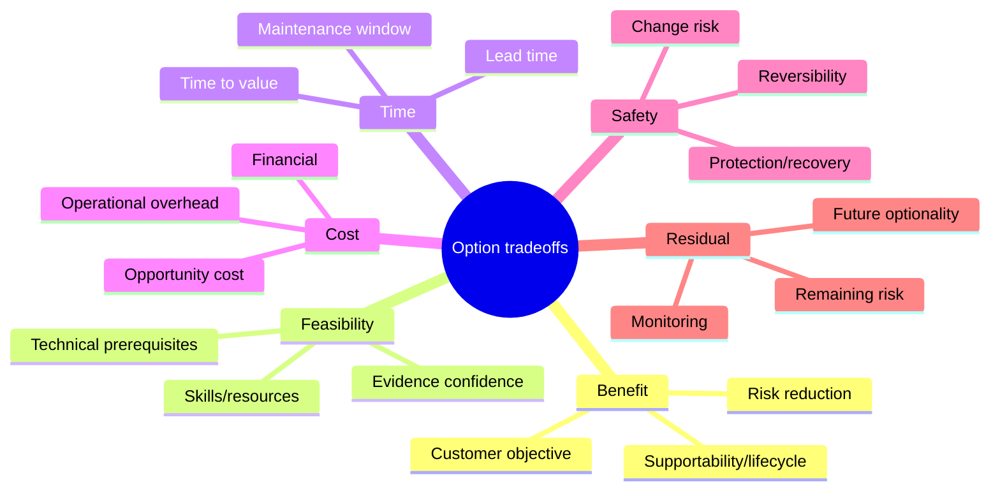

### Option table

| Option | Benefit | Prerequisites | Tradeoffs | Recovery | Residual risk |
|---|---|---|---|---|---|
| Evidence-only probe | Reduces uncertainty cheaply | Access, scope, owner | Delays remediation if overused | Stop collection | Risk still present |
| Temporary control | Reduces trigger/consequence quickly | Current authoritative guidance | Ongoing overhead/side effects | Remove/reverse per plan | Underlying condition remains |
| Permanent remediation | Addresses root condition | Compatibility, budget, test, change | More lead time/change risk | Exact rollback/forward recovery | New/other risks remain |
| Strategic redesign | Improves long-term fit/resilience | Architecture/funding/migration | Highest complexity/time | Phase/failback alternatives | Transition risk |
| Status quo/defer | Avoids immediate change | Explicit owner/control/review | Exposure and lead-time margin continue | N/A | Current risk accepted |

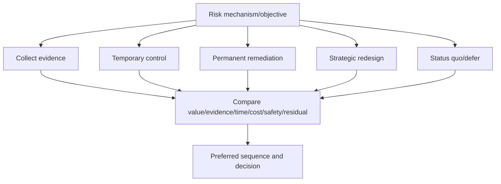

### Do not hide the rejected options

Record why alternatives were not chosen, the assumptions that would reopen them, and who agreed. This prevents the next reviewer from repeating analysis or believing the recommendation was arbitrary.

---

## 6. Prerequisites, owners, dates, and dependencies

### Prerequisite categories

| Category | Examples |
|---|---|
| Evidence | Fresh AutoSupport/monitoring, exact inventory, source definitions, business baseline |
| Product authority | Current docs, IMT, HWU, Bugs Online, release notes, Support guidance |
| Health/safety | HA, protection, capacity, paths, keys, backups, change baseline |
| Customer | Business objective, risk appetite, budget, window, application validator |
| Technical | Target design, compatibility, runbook, test environment, recovery plan |
| Governance | Change/security/privacy/legal/contract approvals |
| Resources | Named specialists, procurement, licenses, hardware, vendor access |

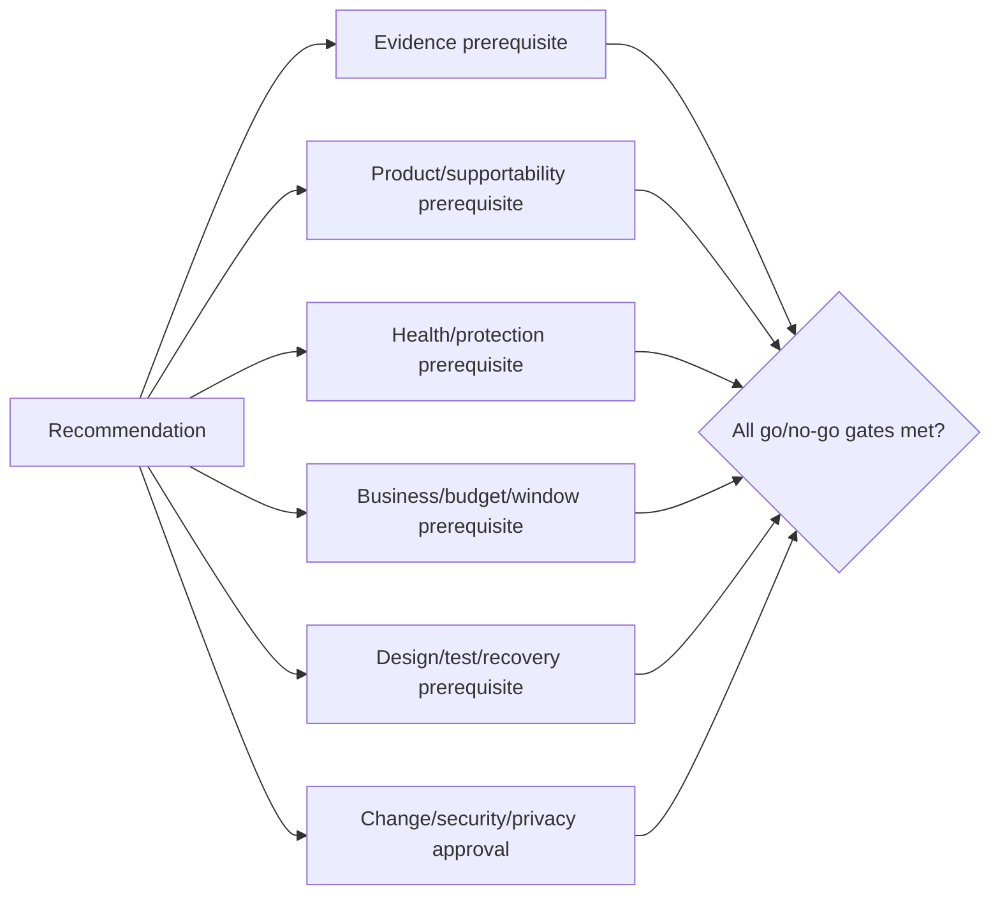

### Ownership model

| Role | Accountability |
|---|---|
| Recommender | Evidence, options, rationale, caveats and traceability |
| Technical owner | Validates mechanism, design, procedure and technical success |
| Business/service owner | Objective, consequence, priority and outcome acceptance |
| Action owner | Executes defined work and reports evidence |
| Decision owner | Approves/rejects/defers/accepts risk |
| Change authority | Approves implementation under governance |
| Risk owner | Owns residual risk, monitoring and review |

Do not write `team` as owner. Use a named accountable role/person in the controlled register and role-safe wording in broad reports.

### Milestone dates

Separate:

- Evidence due.
- Decision due.
- Design/compatibility complete.
- Procurement/funding complete.
- Test/pilot.
- Change window.
- Outcome validation.
- Residual-risk review/expiry.

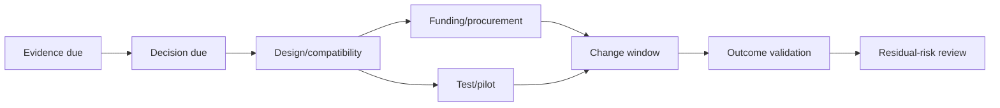

---

## 7. Success criteria and validation

Success criteria should be observable, scoped, time-bound, and linked to the customer objective. `No errors` is too vague unless the source, population and interval are defined.

### Validation pyramid

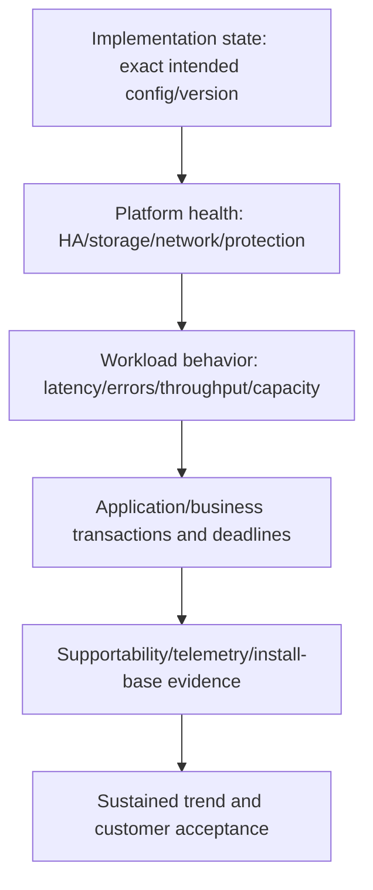

### Success contract

| Dimension | Required definition |
|---|---|
| Signal | Exact metric, event, state, transaction or customer confirmation |
| Scope | Assets, services, population, exclusions |
| Baseline | Comparable pre-action state and quality |
| Target | Approved value/state/range, sourced rather than invented |
| Window | Immediate, business cycle, peak, backup/replication, hypercare |
| Owner | Who measures and signs off |
| Failure | Stop/reopen/escalate criteria |
| Residual | Expected remaining deviation/risk |

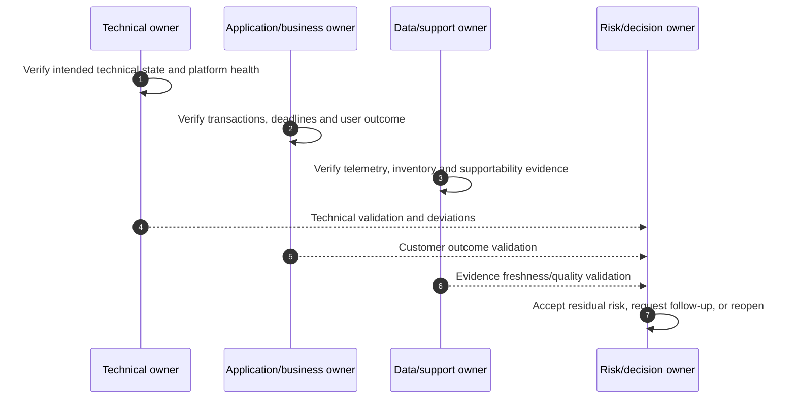

### Leading and lagging evidence

- **Leading:** prerequisite completion, control state, freshness, error budget, headroom, path health.
- **Lagging:** incident recurrence, customer impact, restore result, missed deadline, case trend.

Use both. A configuration change can pass immediately yet fail at the next peak or restore cycle.

---

## 8. Stop, rollback, forward recovery, and safeguards

### Plain-English deep-dive: an exit plan is part of the route

A mountain route is not safe merely because the destination is attractive. The group needs weather limits, turnaround points, emergency shelters, and who calls the return. A technical recommendation similarly needs hold criteria and recovery authority before execution.

**Why it matters:** `rollback available` is not enough; some storage/software changes have version, data-state, feature, time, and dependency constraints.

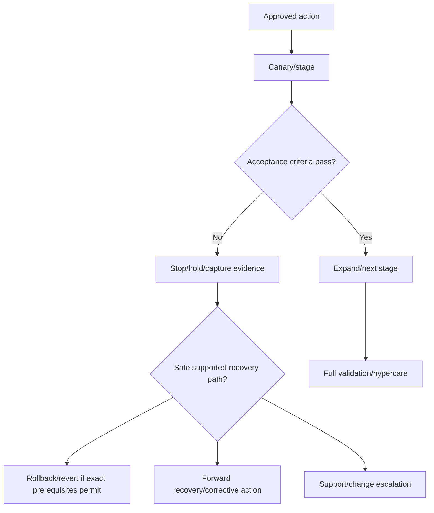

### Safety fields

| Field | Required content |
|---|---|
| Canary/stage | Smallest representative supported scope |
| Hold/stop | Exact health, error, impact, timeout or contradiction condition |
| Authority | Who can stop, continue, recover or escalate |
| Evidence | What is captured before state changes further |
| Rollback/revert | Exact current supported prerequisites and constraints |
| Forward recovery | Corrective/continue/failover/migrate alternative |
| Data protection | Backup, Snapshot, replication, RPO/RTO and restore proof |
| Communication | Audience, checkpoint and next-update time |

Never promise a generic one-click rollback. Use exact current product procedure and Support/change authority.

---

## 9. Executive versus technical recommendation

The facts, decision, and risk must remain consistent. The level of detail changes.

### Audience model

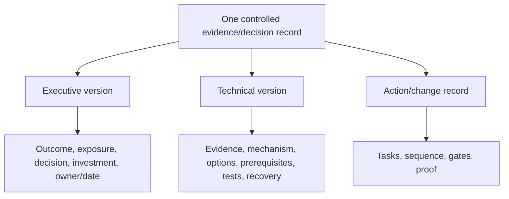

### Executive version

Usually includes:

- One-sentence customer objective and finding.
- Business/service risk and timing.
- Recommendation and reason.
- Decision/ask, owner, milestone and funding/window.
- Key caveat and residual risk.
- Status/progress/validation.

### Technical version

Includes:

- Exact assets, versions, topology and scope.
- Sources, timestamps, definitions, quality and confidence.
- Mechanism, competing hypotheses and tests.
- Current/target/intermediate states.
- IMT/HWU/release/bug/app/supportability sources.
- Options/tradeoffs/prerequisites.
- Runbook reference, go/no-go, stop/recovery.
- Detailed validation and residual risks.

### Same recommendation, two versions

**Executive:**

> `The research platform's support horizon is now inside the estimated design and procurement lead time. Begin the refresh program this quarter to preserve supported options; the sponsor should approve discovery funding by D+20. The main unknown is application certification, which must be resolved before target selection.`

**Technical:**

> `Official lifecycle evidence dated <date> and the governed install base show <exact platform/release scope>. End-to-end decision, compatibility, procurement, test, migration and validation lead time is <assumption range>, placing the latest safe start in <range>. Validate target platform/ONTAP/shelf/adapter/IMT/application/protection paths, run a target bug scrub, and phase design/pilot/migration. Hold target approval until application certification and exact HWU/IMT evidence are current.`

### Never change certainty by audience

Do not turn `medium-confidence capacity scenario` into `capacity shortage` on the executive slide. Concision can omit technical detail, not caveats material to the decision.

---

## 10. Weak-to-strong examples

| Weak wording | Why weak | Stronger bounded wording |
|---|---|---|
| Storage is slow | No object/population/mechanism | Matching transactions show delay before storage call; measured ONTAP scope remains near baseline |
| Upgrade immediately | No driver/target/path/prerequisites | Start target/path validation now because latest safe start is inside lead time; approve change only after named gates |
| Add capacity | No layer, amount, forecast or lead time | Validate local/total physical/Snapshot/project scope, then compare phased demand, cleanup, tiering and supported capacity options |
| Fix AutoSupport | No failure stage or proof | Repair node B HTTPS certificate path; prove collection, send, receipt, account association and ongoing freshness |
| Critical bug affects you | Release match overclaim | Current source maps a candidate to the release; exact feature/trigger evidence is still required before exposure claim |
| Follow best practices | No current source/customer reason | Apply current documented requirement `<source/date>` because exact configuration `<condition>` creates `<risk>` |
| Owner: storage team | Not accountable | Storage platform owner `<controlled record>` by `<milestone>` with app/network validators |
| Roll back if needed | Not executable | Stop on `<criteria>`; use exact supported rollback only if `<prerequisites>`, otherwise invoke forward-recovery/Support plan |
| Recommendation complete | No outcome | Close after technical, application, support-data and customer success evidence; record residual risk |

```mermaid
flowchart LR
    VAGUE[Vague claim/action] --> SCOPE[Add exact scope/time/source]
    SCOPE --> MECH[Add condition/mechanism/confidence]
    MECH --> VALUE[Add customer consequence/horizon]
    VALUE --> OPTIONS[Add options/tradeoffs/status quo]
    OPTIONS --> OWN[Add owner/date/prerequisites]
    OWN --> PROOF[Add safety/success/residual risk]
    PROOF --> STRONG[Decision-ready recommendation]
```

### Word choices

Prefer:

- `supports`, `is consistent with`, `within measured scope`, `candidate`, `exposed`, `unknown`, `current source states`.
- `should evaluate`, `should validate`, `recommended after prerequisites`, `hold until`, `owner/date/proof`.

Avoid:

- `definitely`, `always`, `never fails`, `zero risk`, `guaranteed`, `future-proof`, `no impact`, unless an authoritative bounded fact truly uses that term and the scope is explicit.

---

## 11. Recommendation lifecycle

### Lifecycle states

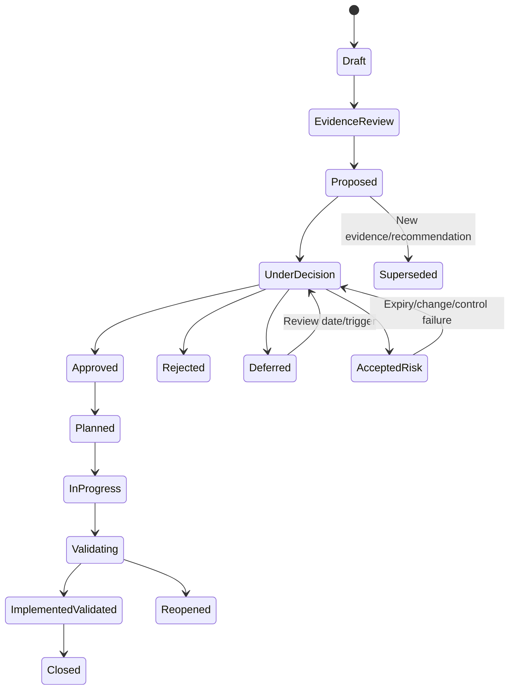

### Recommendation register

| Field group | Content |
|---|---|
| Identity | Recommendation ID, title, version, parent finding/risk |
| Evidence | Sources, cutoff, scope, confidence, privacy class |
| Proposal | Action, rationale, options, prerequisites, value, residual risk |
| Decision | Status, decision owner, date, rationale, rejected/deferred/accepted detail |
| Execution | Actions, dependencies, owners, milestones, change references |
| Validation | Success evidence, deviations, side effects, customer signoff |
| History | Changes, supersession, reopen, source/model versions |

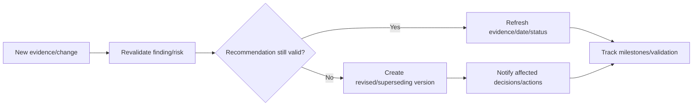

### Review triggers

- Source, version, configuration, service criticality or topology changes.
- New defect/advisory/release/lifecycle fact.
- Evidence becomes stale or contradiction appears.
- Milestone slips past latest safe start.
- Workaround/control expires or fails.
- Customer objective, budget, risk appetite or window changes.
- Validation shows no benefit or side effect.

---

## 12. Decisions and decision records

A decision record preserves what was decided, by whom, why, using which evidence, and under what conditions.

### Plain-English deep-dive: meeting memory is not a decision record

A room can leave the same meeting with five different memories of what was approved. Minutes that preserve the chosen option, evidence, conditions, owner, deadline, rejected alternatives, and reopen triggers are the shared receipt.

**Why it matters:** recommendation governance must survive staff turnover, source changes, delayed implementation, and later questions about why an option was chosen.

### Decision types

| Decision | Meaning |
|---|---|
| Approve | Proceed subject to prerequisites and gates |
| Reject | Do not proceed; record rationale and alternate |
| Defer | Revisit at date/trigger with interim controls |
| Accept risk | Authorized owner accepts bounded residual/current risk until review |
| Request evidence | Decision cannot be made; assign discriminating checks |
| Supersede | New recommendation replaces prior one |

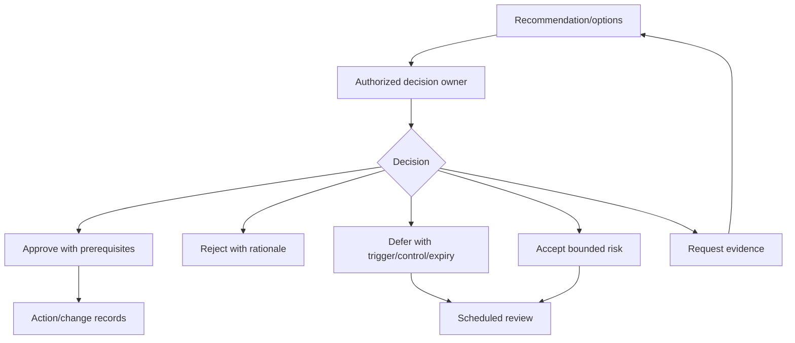

### Decision-record schema

- Decision ID/date/status.
- Recommendation and option versions considered.
- Decision scope and customer objective.
- Evidence cutoff, confidence, gaps and assumptions.
- Chosen option and rationale.
- Rejected options and reopen conditions.
- Decision authority and consulted roles.
- Prerequisites/conditions/constraints.
- Actions, owners and milestones.
- Accepted/residual risk, controls, expiry and monitoring.
- Validation and closure criteria.

### Decision integrity

Do not rewrite the original recommendation after a decision. Version corrections and link them. Preserve decisions made with older evidence so later reviewers can distinguish poor execution, changed conditions, and reasonable judgment under uncertainty.

---

## 13. Objections, disagreement, and influence

### Objection types

| Objection | Underlying question | Response |
|---|---|---|
| `The dashboard is green` | Is evidence current/complete/applicable? | Show scope/freshness/unknowns and source lineage |
| `We have never had this failure` | Does history prove no exposure? | Separate absence of observation from mechanism/controls |
| `Vendor says critical` | Is it applicable and urgent here? | Verify exact trigger, consequence, controls and horizon |
| `The change is too risky` | Are alternatives/controls/recovery adequate? | Compare status quo, pilot, temporary control, staged remediation |
| `We cannot fund it` | Which options preserve time/value? | Phase evidence/design, quantify latest safe start and deferred risk |
| `Just tell us what to buy` | Is sizing/design evidence complete? | State missing workload/compatibility/failure-state inputs |
| `This is not our team's issue` | Is ownership/dependency unclear? | Map service, asset, field authority and RACI |
| `Close it; we acknowledged it` | Was action/outcome/residual risk decided? | Distinguish acknowledgement, decision, execution and validation |

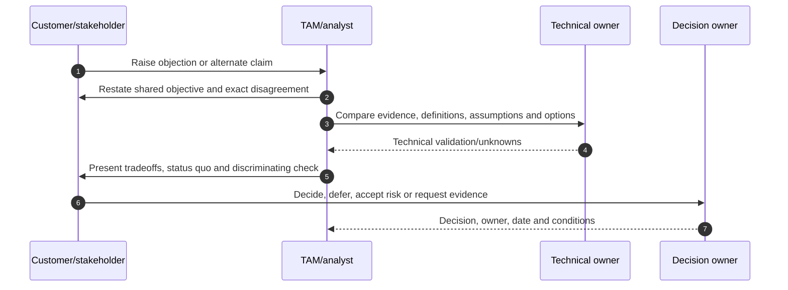

### Response pattern

1. Confirm the shared objective.
2. State the exact point of agreement and disagreement.
3. Ask what evidence would change each position.
4. Separate fact, interpretation, preference and constraint.
5. Compare options/status quo and consequences.
6. Propose the cheapest safe discriminating check or reversible step.
7. Escalate authority, not emotion.
8. Record the decision and residual risk.

### Say `I do not know` precisely

> `I cannot confirm that the exact target recipe is supported because the current driver/firmware combination and authorized IMT result are unavailable. I recommend holding approval while the host and storage owners provide those two facts by D+3.`

This is more useful than guessing or saying only `more analysis needed`.

---

## 14. Closure, reopen, and value realization

### Closure proof

```mermaid
flowchart TD
    DONE[Action reports complete] --> STATE[Verify exact implemented state]
    STATE --> TECH[Technical health/supportability]
    TECH --> APP[Application/business outcome]
    APP --> SUSTAIN[Sustained cycle/peak/backup/DR evidence]
    SUSTAIN --> RES[Residual risk/control/monitoring]
    RES --> OWNER[Decision/risk owner acceptance]
    OWNER --> CLOSE[Close with evidence]
```

### Closure criteria

- Correct assets and recommendation/action versions.
- Intended state implemented and independently observed.
- No unresolved change errors or unexpected side effects.
- Technical/application/business success criteria pass.
- Supportability, telemetry and install-base records are current.
- Required peak, batch, backup, replication or recovery cycle passes.
- Residual risk has owner, controls and review.
- Lessons and reusable process improvement captured.

### Reopen triggers

- Condition, symptom or customer impact recurs.
- Source/applicability changes.
- Validation was incomplete or wrong population used.
- Workaround expires or monitoring/control fails.
- New dependency or side effect appears.
- Customer objective/threshold changes.

### Value realization

Measure the intended outcome, not activity count:

| Recommendation objective | Better outcome evidence |
|---|---|
| Improve support readiness | Fresh evidence, stable IDs, reduced diagnostic handoff delay |
| Reduce upgrade risk | Current compatibility, cleared gates, successful app/protection validation |
| Reduce capacity risk | Forecast/lead-time margin and successful demand accommodation |
| Improve recoverability | Restore/recovery test meets customer objective |
| Reduce repeated incidents | Mechanism/control changes and recurrence trend, not case closure alone |
| Improve lifecycle posture | Supported target milestones completed before latest safe start |

---

## 15. Fully synthetic sanitized scenario: Alpine Diagnostics service review

> **Synthetic boundary:** `Alpine Diagnostics`, all systems, services, versions, findings, metrics, dates, options, costs, owners, objections, decisions, changes, and outcomes are invented. Nothing is a real NetApp tool result or support recommendation.

### Customer objective

Alpine needs reliable imaging availability and a supportable upgrade path before its seasonal workload peak.

### Synthetic evidence

| ID | Observation | Context | Quality/limitation |
|---|---|---|---|
| `O-01` | One node's last synthetic remote telemetry receipt is 16 days old | Imaging cluster; weekly evidence expected | Local collection current; remote account access owner-confirmed |
| `O-02` | Target host driver differs from dated recipe evidence | Upgrade project in six weeks | Exact current IMT-like result unavailable to Arti |
| `O-03` | Local physical capacity base case reaches synthetic threshold in eight months | New imaging project starts in four months | Project size range not yet approved |
| `O-04` | Restore test is 14 months old | Customer policy expects annual test | Backups succeed; current restore objective unproven |
| `O-05` | Five cases reference retired node alias | Controller replaced two months ago | Cases are synthetic; no shared technical cause inferred |

```mermaid
flowchart TB
    OBJ[Imaging availability and supportable upgrade] --> T[Telemetry finding]
    OBJ --> I[Interoperability evidence gap]
    OBJ --> C[Capacity scenario]
    OBJ --> R[Restore confidence gap]
    OBJ --> ID[Case identity gap]
    T --> ACTIONS[Recommendation portfolio]
    I --> ACTIONS
    C --> ACTIONS
    R --> ACTIONS
    ID --> ACTIONS
```

### Findings and risks

| Finding | Risk statement | Confidence |
|---|---|---|
| Node B remote telemetry is stale | A future incident may lack current support/proactive context, increasing diagnostic delay | High for staleness; no health claim |
| Upgrade recipe evidence predates driver change | Planned target/intermediate states may be unlisted or require different prerequisites | High for evidence gap; support state unknown |
| Capacity forecast excludes approved-value project input | Capacity action could start late or purchase could be mis-sized | Medium; project range unresolved |
| Restore objective has no current proof | Recovery may miss customer objective despite successful backup jobs | Medium-high |
| Case aliases are stale | Cases may route evidence to retired physical identity and slow handoff | High for data/process gap |

### Options

```mermaid
flowchart TD
    RISK[Alpine portfolio] --> A[Repair evidence/identity first]
    RISK --> B[Proceed with upgrade/capacity assumptions]
    RISK --> C[Hold all work]
    A --> A1[Telemetry repair + recipe refresh + alias crosswalk]
    A --> A2[Project range + restore test]
    B --> BR[Fast but supportability/sizing/recovery risk]
    C --> CR[No change risk, but peak/lead-time risk continues]
    A1 --> PREF[Preferred staged path]
    A2 --> PREF
```

### Complete technical recommendation

> **Finding:** Synthetic evidence dated `2026-08-24` shows stale remote telemetry for node B, a driver change after the last compatibility recipe, an event-sensitive capacity forecast, an overdue restore proof, and stale node aliases in cases. These are distinct evidence/supportability/capacity/recovery/data-quality findings; they do not prove current ONTAP failure. **Risk/value:** Alpine's seasonal imaging objective and upgrade decision can be undermined by incomplete support evidence, an unvalidated host recipe, late capacity action, and unknown restore performance. **Recommendation:** (1) storage/network owners repair and validate telemetry end to end; (2) host/storage owners regenerate current/intermediate/target compatibility evidence and hold upgrade approval until exact notes/prerequisites pass; (3) application/capacity owners approve low/base/high project inputs and compare forecast horizon with full lead time; (4) backup/application owners run an approved restore test; (5) data/support owners deploy an effective-dated alias crosswalk. **Prerequisites:** authorized access, exact current docs/results, healthy baseline, protection, app validators and change approvals. **Safety:** use staged tests, named stop criteria and exact supported recovery paths. **Success:** current telemetry, peer-reviewed recipe, approved capacity decision before latest safe start, restore objective evidence, and new cases using stable IDs. **Residual risk:** telemetry can fail again, a listed recipe can still have defects, project demand can change, and one restore test does not prove every disaster scenario.

### Executive version

> `Four evidence gaps could compromise Alpine's seasonal readiness: stale support telemetry, an upgrade recipe that predates a driver change, a capacity plan missing approved project demand, and outdated restore proof. Repair and validate these inputs before approving the upgrade or capacity purchase. Owners should complete evidence and restore gates by the next review; the sponsor should decide the capacity/upgrade sequence before the latest safe-start date. No current outage is asserted.`

### Objections and responses

| Objection | Response/action |
|---|---|
| `The cluster is green` | Green scope cannot prove node B's missing remote evidence; report the blind spot, not poor health |
| `The driver is probably fine` | Runtime operation is not current supportability evidence; authorized owner refreshes exact recipe |
| `Just buy capacity` | Project amount/date and logical/physical/local/protection scope can change option/size |
| `Backups pass every night` | Backup job success does not prove restore objective; run approved recovery validation |
| `Old aliases are cosmetic` | They already appear in cases; stable-ID mapping reduces wrong-asset handoff risk |

### Decision record

| Field | Synthetic decision |
|---|---|
| Decision | Approve evidence/restore work now; hold upgrade and capacity commitment |
| Authority | Customer service sponsor with storage/app/change owners |
| Rationale | Cheap reversible evidence actions can materially change expensive decisions |
| Rejected option | Proceed from stale compatibility/project assumptions |
| Review | D+14 or earlier if recipe/project evidence arrives |
| Accepted residual | Temporary schedule pressure; monitored by program owner |

```mermaid
sequenceDiagram
    autonumber
    participant T as TAM/analyst
    participant S as Storage/network owner
    participant H as Host/application owner
    participant B as Backup/capacity owner
    participant X as Customer sponsor
    T->>X: Present executive finding, options, timing and unknowns
    X->>S: Approve telemetry and identity evidence actions
    X->>H: Require exact compatibility result before upgrade approval
    X->>B: Require project range and restore test
    S-->>T: Current telemetry and stable-ID proof
    H-->>T: Peer-reviewed recipe evidence
    B-->>T: Capacity scenarios and restore result
    T->>X: Updated decision and residual-risk record
```

### Synthetic outcome

- Telemetry delivery and remote association validate.
- Current recipe identifies an additional firmware prerequisite; upgrade plan is revised.
- High project case moves capacity latest safe start forward.
- Restore completes but misses the synthetic target, creating a new recovery-performance recommendation.
- New cases use stable IDs; historic cases retain alias lineage.

The original recommendation closes only after each decision/action reaches its own validated outcome. The restore gap opens a new finding/risk rather than being hidden to preserve closure statistics.

---

## 16. Discovery, evidence, risk, recommendation, and JD Mapping

### Discovery questions

1. What customer objective, decision, audience, service, assets and horizon are in scope?
2. What exact observations/sources/definitions/timestamps/quality and access limits exist?
3. What finding is supported, with which context, condition, mechanism, confidence and alternatives?
4. Is this a current issue, future risk, both, or unknown?
5. Which options, including status quo, temporary control and strategic path, are viable?
6. What value, tradeoffs, costs, lead time, dependencies and reversibility apply?
7. Which current documents, IMT/HWU/bugs/lifecycle/app/Support evidence are prerequisites?
8. Who recommends, decides, acts, validates and accepts residual risk, and by when?
9. What canary, hold, rollback/forward-recovery and communication plan applies?
10. Which technical, application, business and sustained outcomes close or reopen it?

### Evidence-to-recommendation chain

```mermaid
flowchart LR
    OBS[Observation/source/time/quality] --> FIND[Finding/context/condition/confidence]
    FIND --> RISK[Issue/risk/mechanism/horizon]
    RISK --> OPT[Options/status quo/tradeoffs]
    OPT --> REC[Specific action/rationale/prerequisites]
    REC --> DEC[Decision/owner/date/conditions]
    DEC --> SAFE[Execution/stop/recovery]
    SAFE --> VALID[Success/customer value/residual risk]
```

### JD Mapping

| JD responsibility | Part 58 contribution | Arti's factual bridge and gap |
|---|---|---|
| Customer recommendations | Complete evidence-to-action anatomy | Microsoft advisory writing transfers; no NetApp production authority |
| Proactive risk mitigation | Links mechanism/horizon to preventative options | CRITSIT/problem-management discipline transfers |
| Operational service reviews | Executive ask plus technical evidence/action register | Customer-review communication transfers |
| Technical escalation | Exact scope, sources, contradictions, specialist ask | Enterprise support escalation transfers |
| Lifecycle/upgrade/capacity | Options, prerequisites, lead time, stop/recovery, proof | Change/analytics skills transfer |
| Cross-functional influence | Shared objective, objections, decision owner and RACI | Multi-team experience transfers |
| Outcome/value tracking | Closure on customer result and residual risk | Analytics/quality methods transfer |

---

## 17. Arti's transfer and honest NetApp gap

```mermaid
flowchart LR
    SUP[Microsoft enterprise support] --> EVID[Evidence, hypotheses, exact asks]
    CRIT[CRITSIT/change governance] --> SAFE[Impact, owners, checkpoints, recovery]
    MBA[MBA/analytics] --> OPT[Options, tradeoffs, value, uncertainty]
    COMM[Customer/executive reviews] --> STORY[Clear decision narrative]
    EVID --> METHOD[NetApp TAM recommendation method]
    SAFE --> METHOD
    OPT --> METHOD
    STORY --> METHOD
    METHOD --> GAP[Production NetApp recommendation and change authority remain gaps]
```

### Transfer table

| Factual strength | Transfer | Honest limit |
|---|---|---|
| Microsoft support/RCA | Evidence-context-condition, hypotheses, escalation | Not ONTAP root-cause or Support authority |
| CRITSIT/change | Impact, owner/date, stop/recovery, updates | No customer storage change authority |
| MBA/analytics | Options, tradeoffs, uncertainty, measurable value | No NetApp sizing/threshold guarantee |
| Excel/Power BI/SQL/Python | Reproducible evidence and action tracking | No live NetApp dataset/tool operation |
| Executive communication | Concise ask without losing material caveats | Decision remains with customer/accountable owners |

### Honest interview answer

> `I separate observation, finding, issue, risk, recommendation, action and decision. My recommendation starts with dated scoped evidence and customer context, states the condition/consequence and confidence, compares options and status quo, and proposes a specific action with rationale, prerequisites, owner/date, safety, success criteria and residual risk. I create consistent executive and technical versions and close only on outcome evidence. My production experience is Microsoft support and analytics, not approved NetApp recommendations, so current NetApp sources and authorized owners govern real actions.`

---

## 18. Paper lab and self-test

### Paper lab: recommendation portfolio

Using only synthetic data, create 15 recommendations covering stale telemetry, install-base identity, supportability, lifecycle, upgrade, defect exposure, capacity, performance, protection, recovery, case recurrence, and data quality.

```mermaid
flowchart LR
    RAW[Create synthetic observations] --> FIND[Write findings]
    FIND --> RISK[Separate issues/risks]
    RISK --> OPT[Generate options/tradeoffs/status quo]
    OPT --> REC[Write complete recommendations]
    REC --> AUD[Executive/technical/action versions]
    AUD --> DEC[Mock objections/decisions]
    DEC --> VALID[Validation/closure/reopen]
```

### Inject these cases

- One metric without definition/unit/population.
- One high-utilization observation with no bottleneck mechanism.
- One bug release match with trigger unknown.
- One recommendation whose target is not validated in IMT/HWU.
- One capacity recommendation mixing logical and physical scope.
- One upgrade proposal with no intermediate-state validation.
- One `owner = storage team` and vague due date.
- One generic `rollback if needed` statement.
- One executive slide that drops a material confidence caveat.
- One customer objection based on no prior incident.
- One deferred decision without control/expiry.
- One accepted risk without authorized owner.
- One ticket closed before app outcome validation.
- One successful action with an unexpected residual risk.
- One new source that supersedes the recommendation.

### Tasks

1. Classify every record as observation, finding, issue, risk, recommendation, action or decision.
2. Write evidence-context-condition-consequence statements with confidence.
3. Build exact customer objective and value/risk statements.
4. Generate probe, temporary, permanent, strategic and status-quo options.
5. Compare benefit, cost, time, dependencies, safety, reversibility and residual risk.
6. Write specific action, rationale, prerequisites, scope, owners and milestone dates.
7. Define canary, hold, stop, rollback/forward recovery and communications.
8. Define technical/application/business/supportability success criteria.
9. Produce matched executive and technical versions.
10. Convert weak examples into bounded recommendations.
11. Run objection sessions and record decisions/rejected options/reopen triggers.
12. Track lifecycle states, version/supersede records, closure and reopen.
13. Deliver an executive service review and technical recommendation register.
14. Answer Q1-Q8 aloud.

### Self-test

1. Define and distinguish all seven record types.
2. Build an evidence-context-condition-consequence sentence.
3. State confidence without weakening material uncertainty.
4. Explain every recommendation-anatomy field.
5. Compare at least four options plus status quo.
6. Write specific action and rationale without a production command recipe.
7. Define prerequisites, owners, dates and dependency sequence.
8. Build success criteria from technical to customer outcome.
9. Explain stop, rollback, forward recovery and authority.
10. Produce executive and technical versions with consistent certainty.
11. Rewrite nine weak recommendations.
12. Explain recommendation lifecycle and review triggers.
13. Write a decision record and accepted-risk record.
14. Respond to common objections with a discriminating check.
15. Define closure, reopen and value realization.
16. Recreate Alpine Diagnostics and state Arti's gap.

### Lab pass checklist

- [ ] Observations, findings, issues, risks, recommendations, actions and decisions are distinct.
- [ ] Every finding includes evidence, context, condition, consequence, time and confidence.
- [ ] Every recommendation includes specific action and customer rationale/value.
- [ ] Options include status quo, tradeoffs and reopen assumptions.
- [ ] Prerequisites include current product/supportability and customer governance.
- [ ] Owners are accountable; evidence/decision/test/change/validation dates are separate.
- [ ] Stop, hold, rollback/forward-recovery and communication authority are explicit.
- [ ] Success covers technical, application, business, support-data and sustained outcomes.
- [ ] Executive and technical versions preserve the same facts and certainty.
- [ ] Objections are answered with evidence, options and decision records.
- [ ] Deferred/accepted risks have controls, owner, expiry and review trigger.
- [ ] Closure requires outcome and residual-risk validation; reopen is supported.
- [ ] All examples/evidence are synthetic and sanitized.
- [ ] No production NetApp recommendation or implementation authority is claimed.

---

## 19. Official Source Anchors

**Date checked: 2026-08-24.** Public official and credible sources only. Exact NetApp applicability, actions, prerequisites and procedures require current authorized evidence and customer governance.

| Topic | Official or credible public source | Bounded use |
|---|---|---|
| Digital Advisor risk/actions | [View risks and take corrective actions](https://docs.netapp.com/us-en/active-iq/task_view_risk_and_take_action.html) | Risk/action/affected-system orientation; not production change authority |
| Digital Advisor wellness | [Learn about Digital Advisor wellness](https://docs.netapp.com/us-en/active-iq/concept_overview_wellness.html) | Public severity/category orientation; customer applicability remains gated |
| AutoSupport | [Learn about ONTAP AutoSupport](https://docs.netapp.com/us-en/ontap/system-admin/manage-autosupport-concept.html) | Evidence pipeline orientation; no customer payload represented |
| Upgrade planning | [Prepare to upgrade ONTAP](https://docs.netapp.com/us-en/ontap/upgrade/prepare.html) | Current preparation/prerequisite context; exact source/target required |
| Upgrade plans | [Prepare with Upgrade Advisor or Upgrade Health Checker](https://docs.netapp.com/us-en/ontap/upgrade/create-upgrade-plan.html) | Tool-plan/blocker orientation; gated output and review required |
| Interoperability | [Interoperability Matrix Tool overview](https://docs.netapp.com/us-en/interoperability-matrix-tool/index.html) | Exact supported recipe workflow; current authorized results required |
| Hardware configuration | [NetApp Hardware Universe](https://hwu.netapp.com/) | Gated exact hardware rule/limit source; no value inferred here |
| Risk assessment | [NIST SP 800-30 Rev. 1](https://csrc.nist.gov/pubs/sp/800/30/r1/final) | Risk assessment, uncertainty and communication orientation |
| Enterprise risk records | [NISTIR 8286A Rev. 1](https://csrc.nist.gov/pubs/ir/8286/a/r1/final) | Risk-register and enterprise integration concepts |
| Systems engineering | [NASA Systems Engineering Handbook](https://www.nasa.gov/reference/systems-engineering-handbook/) | Trade study, verification/validation and decision discipline orientation |
| Architecture decisions | [Microsoft Azure Well-Architected Framework](https://learn.microsoft.com/en-us/azure/well-architected/) | Tradeoff, reliability and operational-excellence concepts; not NetApp authority |
| Reliable operations | [Google SRE Workbook](https://sre.google/workbook/table-of-contents/) | Practical monitoring, response and reliability validation concepts |

### Source-use discipline

- Record exact source, asset, release/configuration, publication/update/evidence dates, access class and cutoff.
- Preserve observation, finding, risk, recommendation, action and decision lineage.
- Cite current IMT/HWU/bugs/release/lifecycle/application/Support evidence before technical action.
- Do not translate generic best practice into a production instruction without exact applicability.
- Keep private cases, bugs, customer costs, topology and decision records in approved systems.
- Never promise zero risk, zero impact, guaranteed capacity/performance, or universal rollback.

---

## Likely Interview Questions

### Q1. How do observation, finding, issue, risk, recommendation, action, and decision differ?

> **Model answer:** `An observation is a direct fact; a finding interprets facts in context; an issue is current adverse impact; a risk is an uncertain future objective effect; a recommendation proposes a course; an action is committed executable work; and a decision is the authorized choice. I preserve links and owners instead of collapsing them into one ticket.`

### Q2. What belongs in a strong finding statement?

> **Model answer:** `Exact source, object/population, interval/cutoff, definition/unit and quality; customer service/topology/change/requirement context; the verified condition versus baseline; mechanism or alternatives; consequence; confidence and gaps. I use bounded wording such as supports or is consistent with, not certainty beyond evidence.`

### Q3. What makes a recommendation decision-ready?

> **Model answer:** `A specific action and rationale tied to customer value/risk, options and status quo with tradeoffs, prerequisites and scope, accountable decision/action owners and dates, canary/stop/recovery safeguards, technical and customer success criteria, and residual risk with acceptance/monitoring.`

### Q4. How do you tailor executive and technical versions?

> **Model answer:** `Both come from one controlled record and preserve facts, uncertainty and decision. The executive version emphasizes outcome, exposure, timing, investment, ask and owner. The technical version adds exact assets, sources, mechanism, compatibility, options, prerequisites, tests, recovery and detailed validation.`

### Q5. How do you compare recommendation options?

> **Model answer:** `I include evidence-only, temporary control, permanent remediation, strategic redesign and status quo where relevant. I compare expected objective/risk benefit, confidence, prerequisites, time, cost, change risk, reversibility, protection, supportability, residual risk and future optionality, then state why one sequence is preferred.`

### Q6. How do you respond when a customer challenges a recommendation?

> **Model answer:** `I restate the shared objective, isolate the exact factual or preference disagreement, compare sources/definitions/assumptions, ask what evidence would change each view, show status-quo tradeoffs, and propose the cheapest safe discriminating check or reversible step. The authorized owner decides and the record captures residual risk.`

### Q7. When can a recommendation close?

> **Model answer:** `After the intended state is independently observed, technical/platform and application/business success criteria pass over required cycles, supportability/telemetry/install-base evidence is current, side effects are resolved, and the accountable owner accepts monitored residual risk. Ticket completion or acknowledgement alone is insufficient.`

### Q8. How does your background transfer, and what remains a gap?

> **Model answer:** `Microsoft support, CRITSIT and change work give me evidence, RCA, safety, owner and customer communication discipline; my MBA and analytics tools support options and measurable value. I have not authored or implemented an approved production NetApp recommendation, so current NetApp sources and authorized technical/customer owners control real decisions.`

---

## 30-Second Memory Hooks

- **Observation:** What the source measured.
- **Finding:** What the evidence supports in context.
- **Issue:** Harm happening now.
- **Risk:** Possible effect on an objective.
- **Recommendation:** Proposed course and rationale.
- **Action:** Committed work with owner/date.
- **Decision:** Authorized choice and conditions.
- **Finding anatomy:** Evidence + context + condition + consequence + confidence.
- **Recommendation anatomy:** Action + why + options + prerequisites + owner/date + safety + proof + residual.
- **Status quo:** A real option with exposure and lead-time cost.
- **Rationale:** Connect action to mechanism/customer value.
- **Owner:** Accountable role/person, not `the team`.
- **Dates:** Evidence, decision, design, test, change, validation, review.
- **Safety:** Canary, hold, stop, rollback/forward recovery, authority.
- **Executive:** Outcome/ask/timing; **technical:** evidence/mechanism/how/proof.
- **Caveat:** Concision cannot change certainty.
- **Decision record:** Chosen/rejected options, evidence, authority and conditions.
- **Objection:** Shared objective -> exact disagreement -> discriminating check.
- **Closure:** Outcome evidence plus residual-risk acceptance.
- **Arti's bridge:** Recommendation discipline transfers; NetApp authority does not.

---

## Completion Checklist

- [ ] Keep observation, finding, issue, risk, recommendation, action and decision distinct.
- [ ] Write evidence-context-condition-consequence with source/time/scope/quality/confidence.
- [ ] Tie every recommendation to a named customer objective, value or risk horizon.
- [ ] Specify the action, rationale, scope, exclusions and sequence.
- [ ] Compare options, status quo, tradeoffs, assumptions and reopen conditions.
- [ ] Identify current-doc, IMT/HWU/bug/lifecycle/app/Support prerequisites.
- [ ] Name decision/action/technical/business/risk owners and milestone dates.
- [ ] Define canary, hold, stop, rollback/forward recovery and communication authority.
- [ ] Define technical, application, business, support-data and sustained success criteria.
- [ ] State residual risk, controls, monitoring, owner, acceptance and review.
- [ ] Produce consistent executive, technical and action-record versions.
- [ ] Replace vague/absolute/best-practice language with bounded evidence wording.
- [ ] Track draft, decision, implementation, validation, closure, defer, accept and supersede states.
- [ ] Preserve complete decision records and rejected options.
- [ ] Handle objections through evidence, tradeoffs and safe discriminating checks.
- [ ] Close only on value/outcome proof; reopen on recurrence, new evidence or failed controls.
- [ ] Recreate the fully synthetic Alpine Diagnostics scenario and paper lab.
- [ ] Answer Q1-Q8 aloud and state the exact No-production-NetApp boundary.
- [ ] Recheck current authoritative sources and customer context before real use.

---

*Next suggested section:* [Part 59 - Excel for TAM Analysis: Power Query, Pivots, Lookups, Charts, and QA](Part-59-excel-tam-analysis.md)