# Part 59 - Excel for TAM Analysis: Power Query, Pivots, Lookups, Charts, and QA

> **Section goal:** Build a refreshable, reviewable Excel workbook for TAM install-base, risk, lifecycle, case, capacity, and action analysis. By the end, Arti should be able to use structured tables, named ranges, correct types and time zones, structured references, lookups, conditional and aggregate formulas, text cleanup, data checks, conditional formatting, aging, Power Query, merges/appends, PivotTables, slicers, charts, validation, protection, versioning, and layered QA without hiding errors or presenting synthetic evidence as production NetApp experience.

Covers index item **59** and maps directly to job-description responsibilities for generating and analyzing customer data, Excel-based service reviews, install-base quality, risk/action tracking, lifecycle planning, trend and case analysis, data validation, repeatable reporting, executive communication, and process improvement.

**Explicit nonclaim:** Arti has not built or operated a production NetApp customer workbook from live AutoSupport, Digital Advisor, install-base, case, IMT, HWU, BURT, lifecycle, or ONTAP data.

**Privacy and access boundary:** Customer identifiers, serials, topology, versions, risks, cases, contacts, contracts, costs, service mappings, and action decisions are sensitive. Use authorized minimum data, approved encrypted storage, controlled sharing, retention, redaction, and least access. Excel protection is not encryption or a substitute for repository permissions.

**Synthetic-evidence rule:** Every customer, asset, source row, metric, formula result, risk, date, chart, recommendation, owner, and outcome below is fictional and sanitized. No table or workbook view is a real NetApp or customer export.

**Version caveat:** Excel functions, Power Query connectors/engines, data types, privacy levels, refresh behavior, PivotTable features, dynamic arrays, protection, macros, coauthoring, and version history vary by Excel edition, platform, tenant policy, file format, locale, and update channel. A **current-doc check** means reopening the official Microsoft documentation for the deployed Excel version and testing the exact workbook in its approved environment.

This Part provides no live workbook, customer threshold, NetApp metric definition, API credential, macro code, production automation, or change authority. Formulas use fictional columns and Excel syntax; function separators and availability can differ by locale/version.

> **No-production-NetApp boundary:** Arti factually knows Excel, Power Query, Power BI, SQL, Python, statistics, business analytics, Microsoft support data, case trends, quality checks, customer reviews, and action tracking. She does **not** claim access to customer NetApp sources or production NetApp workbook ownership. Her exact non-claim is: **she has not refreshed, reconciled, protected, published, or governed an Excel workbook containing live NetApp customer data.**

---

## 1. Workbook purpose and architecture

An analysis workbook is a small governed data product. It needs defined inputs, transformations, model tables, calculations, checks, outputs, ownership, refresh instructions, and limitations.

### Plain-English deep-dive: kitchen, pantry, pass, and dining room

- Source files are deliveries.
- Power Query is the preparation area.
- Model tables are labeled pantry shelves.
- Formula and QA sheets are the kitchen controls.
- PivotTables/charts are the service pass.
- Executive and technical sheets are different dining rooms using the same food.

**Why it matters:** mixing raw imports, manual edits, formulas, and charts on one sheet makes refresh errors invisible and recommendations irreproducible.

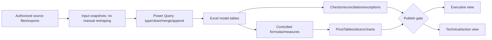

### Suggested workbook layers

| Sheet/prefix | Purpose | Manual edits allowed? |
|---|---|---|
| `README` | Purpose, owner, sources, refresh, version, caveats | Controlled documentation only |
| `Config` | Approved parameters and named ranges | Validated cells only |
| `Input_*` | Source files/tables or query landing | No reshaping; source snapshot only |
| `PQ_*` | Query connections/staging | Edit in Power Query, not cells |
| `Dim_*` | Customer, asset, service, date, owner dimensions | Governed/query output |
| `Fact_*` | Risk, case, action, metric and lifecycle facts | Governed/query output |
| `Calc_*` | Explicit calculations where model tables do not contain them | Controlled formulas |
| `QA_*` | Tests, exceptions, reconciliation and signoff | Formula/query results plus disposition fields |
| `Pivot_*` | PivotTables/PivotCharts and analyst exploration | Refresh/filter only |
| `Exec` | Decisions, trends, owners, deadlines, caveats | No raw sensitive detail |
| `Tech` | Drillable technical findings/actions | Controlled views |

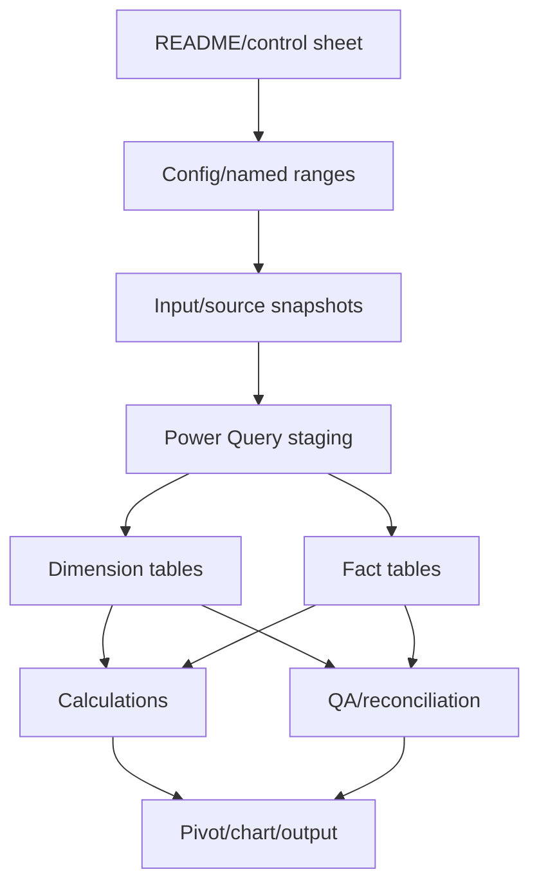

### README/control fields

- Workbook purpose, audience and decision question.
- Owner, reviewer, privacy classification and approved repository.
- Source names, owners, extracts, cutoff, schema and access limitations.
- Refresh order, parameters, expected row counts and duration.
- Table/column data dictionary and metric definitions.
- Quality gates, exceptions and latest signoff.
- Workbook/version/change history.
- Known limitations and No-production-NetApp boundary.

---

## 2. Excel tables, named ranges, and structured references

### Excel tables

Convert governed rectangular datasets to Excel tables with unique, meaningful names such as `tblAssets`, `tblRisks`, `tblActions`, and `tblCases`.

Benefits:

- Header filters and stable named columns.
- Automatic formula propagation.
- Structured references that survive row growth better than fixed ranges.
- Easier Power Query/PivotTable sources.
- Total rows and calculated-column consistency.

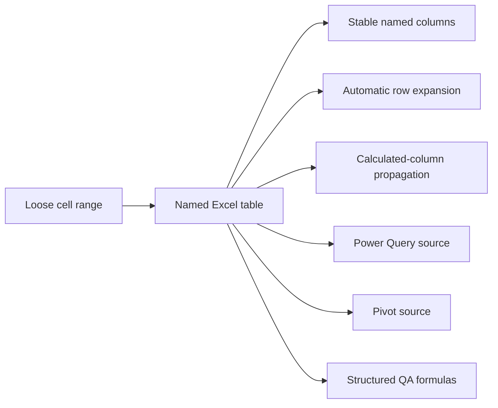

### Table naming

| Object | Example | Rule |
|---|---|---|
| Input table | `tblInputAssets` | Source-shaped snapshot |
| Curated table | `tblAssets` | One defined grain |
| Bridge table | `tblRiskAsset` | Explicit many-to-many mapping |
| Exception table | `tblExceptions` | One exception per row |
| Parameter | `pAsOfDate` | Named single cell, type validated |
| Threshold | `pStaleDays` | Approved local value with source/owner |

### Named ranges

Use workbook-level names for small controlled parameters, not for replacing every table column. Document scope, type, owner, source and allowed values.

Examples:

- `pAsOfDate`: governed report cutoff date.
- `pStaleDays`: customer-approved freshness cadence.
- `pCustomerId`: selected stable customer key.
- `pDataFolder`: approved folder path only when policy permits.

### Structured references

| Syntax | Meaning |
|---|---|
| `tblAssets[AssetKey]` | Entire AssetKey data column |
| `[@AssetKey]` | AssetKey in the current row |
| `tblActions[[#Headers],[DueDate]]` | Header cell for DueDate |
| `tblRisks[[#All],[RiskId]:[Status]]` | Specified columns including headers/totals |

Example calculated column:

```excel
=IF([@DueDate]="","Unknown",IF([@Status]="Closed","Closed",IF([@DueDate]<pAsOfDate,"Overdue","Open")))
```

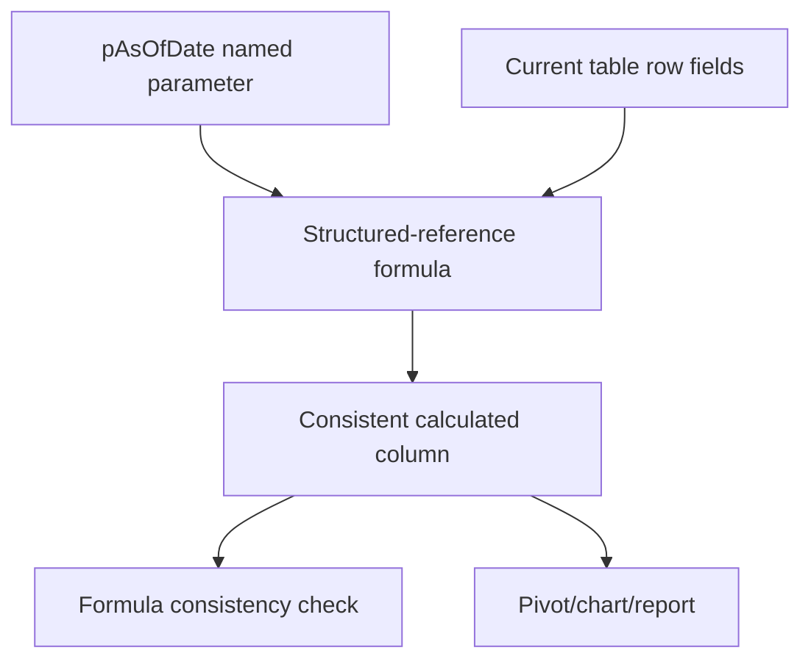

### Structured-reference caveat

Table formulas can still be overwritten in one row, and totals can include hidden/filter contexts differently by function. Add formula-consistency QA and document whether filtered rows should affect calculations.

---

## 3. Data types, dates, and time zones

### Plain-English deep-dive: matching labels does not make contents identical

`08/09/26` could mean August 9 or September 8. `100` could mean bytes, GiB, percent, milliseconds, or a text serial. A cell's appearance does not establish its type or meaning.

**Why it matters:** Excel can silently coerce values, drop leading zeros, interpret IDs as dates/scientific notation, and compare local timestamps as if they shared a clock.

### Type rules

| Field | Preferred type/control | Common failure |
|---|---|---|
| Serial/system/cluster IDs | Text | Scientific notation, leading-zero loss |
| Capacity | Numeric canonical bytes plus original value/unit | Mixing decimal/binary units or text numbers |
| Percent | Decimal number with percent format and denominator definition | Storing `75` instead of `0.75` |
| Date | Excel date value with ISO display | Locale text ambiguity |
| Timestamp | Date-time plus separate source timezone/UTC field | Treating local times as UTC |
| Status/category | Validated text enumeration | Spelling/case variants |
| Boolean | TRUE/FALSE or controlled Yes/No | Blank interpreted as false |
| Version | Text, often split into sortable components if needed | `9.10` treated numerically as `9.1` |

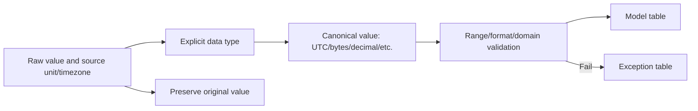

### Dates and times

Store at least:

- Original timestamp text/value.
- Source timezone or offset.
- Normalized UTC timestamp.
- Local reporting date/time when needed.
- Observation/effective/extraction type.
- Precision/clock uncertainty.

Excel serial dates represent elapsed days; time is a fraction of a day. Formatting changes appearance, not the stored value.

### Aging formula

```excel
=IF(OR([@OpenDate]="",pAsOfDate=""),"Unknown",MAX(0,INT(pAsOfDate)-INT([@OpenDate])))
```

For due status:

```excel
=IFS(
  [@Status]="Closed","Closed",
  [@DueDate]="","No due date",
  [@DueDate]<pAsOfDate,"Overdue",
  [@DueDate]<=pAsOfDate+7,"Due in 7 days",
  TRUE,"Future"
)
```

### Time-zone caution

Do not derive historical UTC solely from a current fixed offset when daylight-saving rules apply. Prefer source-provided UTC/offset or use an approved time-zone transformation outside formulas. Unknown timezone remains an exception.

```mermaid
sequenceDiagram
    autonumber
    participant S as Source timestamp
    participant Q as Power Query/type logic
    participant M as Model
    participant R as Report
    S->>Q: Original date-time + offset/timezone
    Q->>Q: Validate locale/type and normalize UTC
    Q->>M: Store original, UTC, local date and quality
    M->>R: Use UTC for correlation; local date for audience where defined
```

---

## 4. XLOOKUP and lookup design

Use lookups only when the lookup side is unique at the intended grain. A formula returning one value can hide duplicate keys.

### XLOOKUP pattern

```excel
=XLOOKUP(
  [@AssetKey],
  tblAssets[AssetKey],
  tblAssets[ServiceTier],
  "Not found",
  0
)
```

- `0` requests an exact match.
- The explicit not-found result preserves an exception.
- The formula still requires a uniqueness check on `tblAssets[AssetKey]`.

### Duplicate-key check

```excel
=COUNTIF(tblAssets[AssetKey],[@AssetKey])
```

Interpret:

- `1`: unique candidate.
- `0`: unmatched.
- `>1`: duplicate/conflict; XLOOKUP's first match is unsafe.

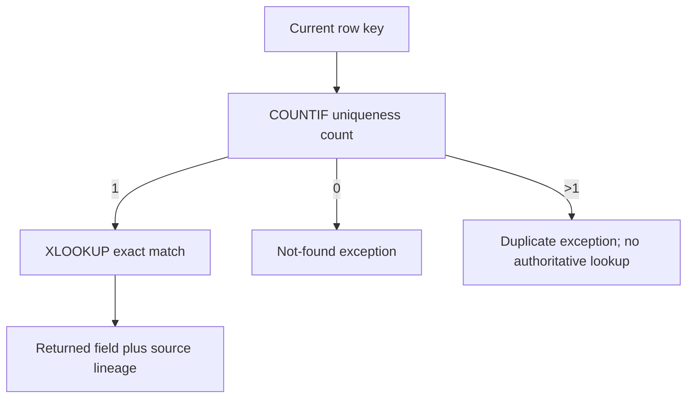

### XLOOKUP considerations

- Exact match is the usual identity lookup.
- Reverse search and approximate modes require explicit reason and sorted/data assumptions.
- Returning multiple columns via dynamic arrays depends on Excel version and surrounding cells.
- Use stable keys, not cluster names, case text, model, IP, or partial serial alone.
- For effective-dated history, Power Query/data model/SQL is usually safer than a simple current-row lookup.

### Crosswalk example

```excel
=LET(
  MatchCount,COUNTIF(tblAssetAliases[Alias],[@ReportedAsset]),
  IF(MatchCount=1,
     XLOOKUP([@ReportedAsset],tblAssetAliases[Alias],tblAssetAliases[AssetKey],"Not found",0),
     IF(MatchCount=0,"Not found","Duplicate alias")
  )
)
```

`LET` improves readability where available; document version requirements.

---

## 5. INDEX/MATCH concepts and lookup alternatives

`INDEX` returns a value at a position; `MATCH` finds the position. Together they provide a flexible exact lookup pattern supported by older Excel versions.

```excel
=INDEX(
  tblAssets[ServiceTier],
  MATCH([@AssetKey],tblAssets[AssetKey],0)
)
```

### Plain-English deep-dive: library shelf position

`MATCH` finds the shelf position for a catalog ID; `INDEX` retrieves the value from the corresponding shelf in another column. The catalog must still contain one unambiguous record.

**Why it matters:** formula choice does not solve bad keys. XLOOKUP and INDEX/MATCH can both return a plausible wrong value when duplicates exist.

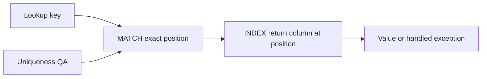

### Comparison

| Method | Strength | Caveat |
|---|---|---|
| XLOOKUP | Readable, explicit not-found, flexible return | Availability/version; first duplicate still wins |
| INDEX/MATCH | Flexible and widely compatible | More verbose; errors need explicit handling |
| Power Query Merge | Refreshable multi-column relational join | Must validate cardinality and expansion counts |
| Data Model relationship | Efficient reusable reporting relationship | Requires proper dimension uniqueness and model understanding |

### Avoid VLOOKUP fragility

VLOOKUP is common, but hard-coded column indexes can break when columns move. It can still be valid in controlled workbooks, yet this guide favors named return columns through XLOOKUP, INDEX/MATCH, Power Query, or model relationships.

---

## 6. IF, IFS, SWITCH, and IFERROR

### IF

Use `IF` for a clear binary branch:

```excel
=IF([@LastSeenUTC]="","Unknown",IF(pAsOfDate-INT([@LastSeenUTC])>pStaleDays,"Stale","Current"))
```

### IFS

Use `IFS` for ordered conditions; put the most specific/important conditions first and use `TRUE` for the final default:

```excel
=IFS(
  [@Applicability]="Unknown","Evidence required",
  [@Status]="Closed","Closed",
  [@LatestSafeStart]<pAsOfDate,"Escalate",
  [@DueDate]<=pAsOfDate+14,"Next 14 days",
  TRUE,"Plan"
)
```

### SWITCH

Use `SWITCH` to map one expression to controlled categories:

```excel
=SWITCH(
  [@DecisionStatus],
  "Approved","Execute",
  "Deferred","Monitor",
  "Accepted","Review residual risk",
  "Rejected","No action",
  "Unknown status"
)
```

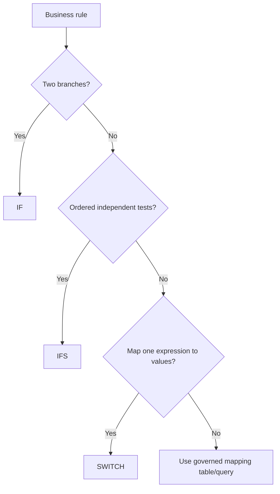

### IFERROR caveat

`IFERROR` catches many errors but can hide defects such as duplicate/missing keys, invalid types, broken references, and divide-by-zero.

Unsafe:

```excel
=IFERROR(XLOOKUP([@Asset],tblAssets[Name],tblAssets[Owner]),"")
```

Safer:

```excel
=LET(
  MatchCount,COUNTIF(tblAssets[AssetKey],[@AssetKey]),
  IF(MatchCount=1,
     XLOOKUP([@AssetKey],tblAssets[AssetKey],tblAssets[OwnerRole],"Not found",0),
     IF(MatchCount=0,"ERROR: unmatched","ERROR: duplicate key")
  )
)
```

Use `IFERROR` only when the error is expected, understood, separately measured, and replaced with a meaningful result.

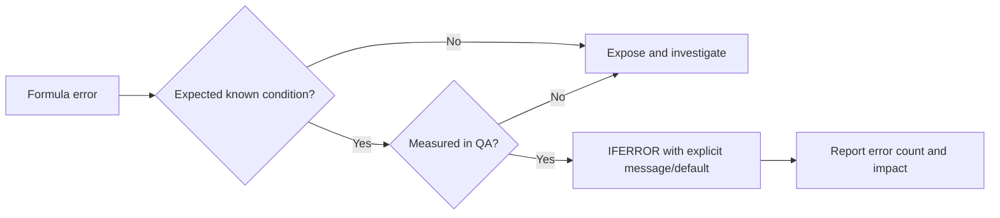

---

## 7. COUNTIFS, SUMIFS, and denominator discipline

### COUNTIFS

Count open high-priority actions for one service:

```excel
=COUNTIFS(
  tblActions[ServiceKey],[@ServiceKey],
  tblActions[PriorityBand],"Now",
  tblActions[Status],"<>Closed"
)
```

Count stale active assets:

```excel
=COUNTIFS(
  tblAssets[LifecycleState],"Active",
  tblAssets[FreshnessState],"Stale"
)
```

### SUMIFS

Sum canonical physical bytes for in-scope objects:

```excel
=SUMIFS(
  tblCapacity[PhysicalUsedBytes],
  tblCapacity[CustomerKey],pCustomerId,
  tblCapacity[QualityState],"Pass"
)
```

### Multiple conditions

`COUNTIFS`/`SUMIFS` apply AND logic across criteria. OR logic usually requires adding non-overlapping results, a helper classification, dynamic array method, PivotTable, or query. Avoid double-counting overlapping conditions.

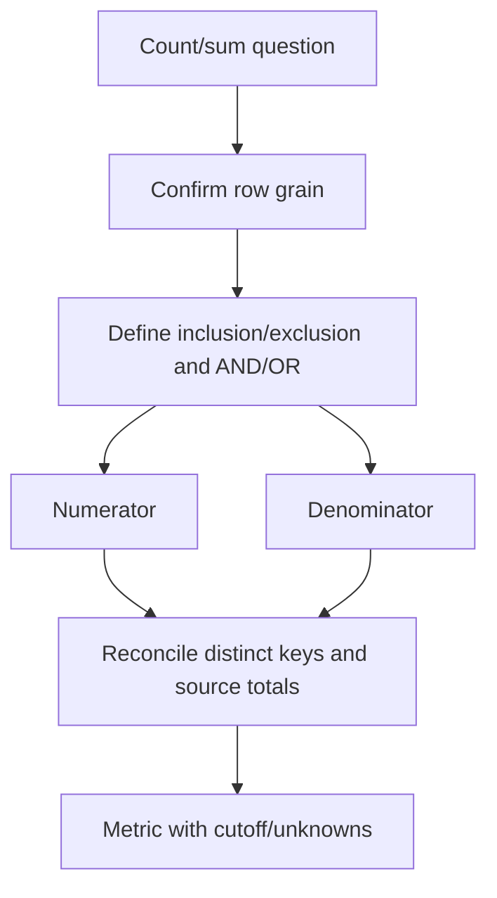

### Rate example

```excel
=LET(
  Eligible,COUNTIFS(tblAssets[InScope],TRUE,tblAssets[LifecycleState],"Active"),
  Current,COUNTIFS(tblAssets[InScope],TRUE,tblAssets[LifecycleState],"Active",tblAssets[FreshnessState],"Current"),
  IF(Eligible=0,NA(),Current/Eligible)
)
```

Do not remove unknown/stale hard cases from the denominator to make performance look better. Show numerator, denominator, exclusions and unknowns.

---

## 8. Text cleanup and controlled categories

### Cleanup functions

| Function/pattern | Use | Caveat |
|---|---|---|
| `TRIM` | Remove repeated ASCII spaces | Does not remove every Unicode/nonbreaking space |
| `CLEAN` | Remove selected nonprinting characters | Limited character set |
| `SUBSTITUTE` | Replace a known character/string | Requires explicit target; can alter meaningful text |
| `UPPER`/`LOWER` | Normalize case for comparison | Preserve original display value |
| `TEXTBEFORE`/`TEXTAFTER`/`TEXTSPLIT` | Parse controlled delimiters | Version-dependent; delimiter can occur in real text |
| `VALUE`/`DATEVALUE` | Convert text under locale assumptions | Prefer Power Query with explicit locale/type |

Example normalization for comparison:

```excel
=UPPER(TRIM(CLEAN(SUBSTITUTE([@ReportedAsset],CHAR(160)," "))))
```

Store the raw value and normalized value separately. Normalizing formatting does not prove two records are the same entity.

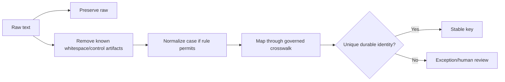

### Controlled mapping tables

Prefer a table such as `tblStatusMap` with `RawStatus`, `CanonicalStatus`, `Source`, `EffectiveStart`, `EffectiveEnd`, and `RuleOwner` instead of deeply nested formulas. This makes taxonomy changes reviewable.

### Fuzzy matching boundary

Power Query fuzzy matching or text similarity can identify candidates but must not auto-merge durable asset identities, ownership, contracts, or case associations without steward review.

---

## 9. Checks, error columns, and conditional formatting

### Row-level checks

Create explicit columns such as:

- `KeyCheck`.
- `TypeCheck`.
- `FreshnessCheck`.
- `OwnerCheck`.
- `RelationshipCheck`.
- `FormulaCheck`.
- `PrivacyCheck`.
- `RowQAStatus`.

Example:

```excel
=TEXTJOIN("; ",TRUE,
  IF([@AssetKey]="","Missing AssetKey",""),
  IF([@SourceUTC]="","Missing source time",""),
  IF([@OwnerRole]="","Missing owner",""),
  IF([@MatchCount]>1,"Duplicate key",""),
  IF([@PrivacyClass]="Restricted","Review output scope","")
)
```

### Workbook-level control totals

| Check | Formula/query idea |
|---|---|
| Source versus loaded rows | Expected row count minus table row count |
| Distinct keys | Compare row count with unique stable IDs at expected grain |
| Unmatched joins | Count `Not found`/null foreign keys |
| Duplicate keys | Count keys with `COUNTIF > 1` |
| Missing critical fields | `COUNTBLANK`/`COUNTIFS` by field |
| Reconciliation | Source totals versus model totals and documented residual |
| Formula consistency | Compare formulas within calculated columns |
| Refresh time | Latest query refresh/cutoff versus report date |
| Exceptions | Open counts by severity/age/owner |

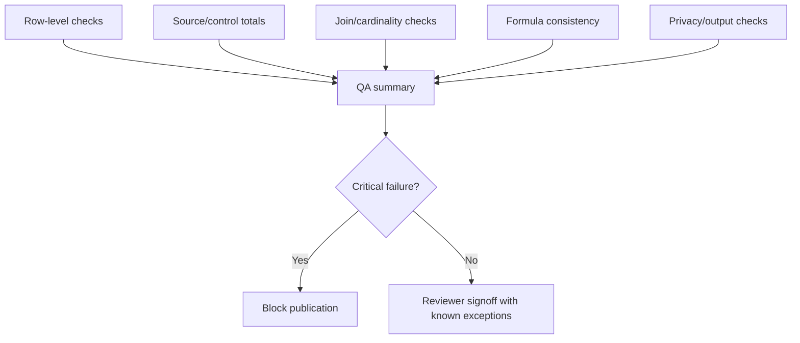

### Conditional formatting

Use it to direct attention, never as the only storage of meaning.

Good uses:

- Overdue actions based on `DueState`.
- Stale evidence based on `FreshnessState`.
- Duplicate/missing keys based on QA columns.
- Latest-safe-start margin categories.
- Exception aging.

Controls:

- Base rules on explicit helper columns/formulas.
- Use accessible colors plus text/icons.
- Keep rule ranges table-based and ordered.
- Test copied/overlapping rules.
- Do not encode status only through fill color.
- Use customer-approved thresholds, not invented red/amber/green cutoffs.

### Formula consistency

A single overwritten calculated cell can silently change one record. Use table calculated columns, workbook inspection/review, and a QA method that compares formulas or relies on Power Query/model calculations where practical.

---

## 10. Aging and action tracking

### Action table grain

One row per action, with bridge tables for many assets/risks when needed.

| Field group | Columns |
|---|---|
| Identity | ActionKey, RecommendationKey, RiskKey(s via bridge) |
| Scope | CustomerKey, ServiceKey, AssetKey(s via bridge) |
| Ownership | DecisionOwner, ActionOwner, Validator |
| Dates | Open, evidence due, decision due, due, latest safe start, validation, review |
| Status | Proposed, approved, in progress, blocked, validating, closed, deferred, accepted |
| Evidence | Source cutoff, confidence, exception and change references |
| Outcome | Success status, residual risk, closure/reopen reason |

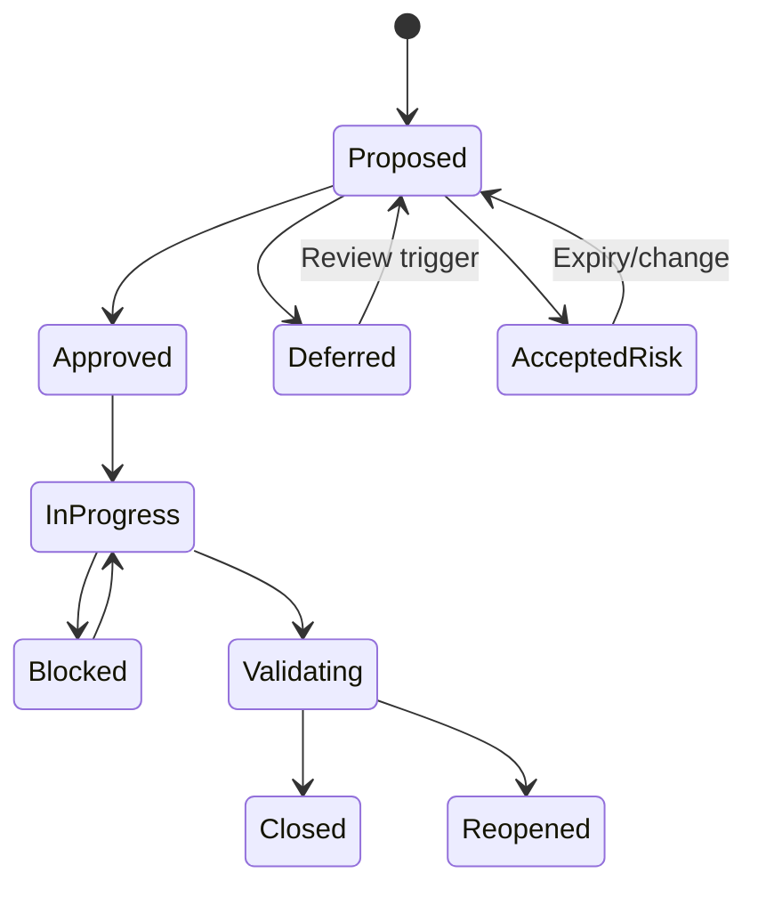

### Aging formulas

Open age:

```excel
=IF([@OpenDate]="","Unknown",MAX(0,INT(pAsOfDate)-INT([@OpenDate])))
```

Due margin:

```excel
=IF([@DueDate]="","Unknown",INT([@DueDate])-INT(pAsOfDate))
```

Latest-safe-start margin:

```excel
=IF([@LatestSafeStart]="","Unknown",INT([@LatestSafeStart])-INT(pAsOfDate))
```

### Aging anti-gaming

- Stable ActionKey through reopen.
- OriginalOpenDate never reset.
- Separate blocked days and owner-wait days.
- Close only after validation, not implementation.
- Deferred/accepted states need owner, reason, control and expiry.
- Do not remove overdue rows from the PivotTable source.

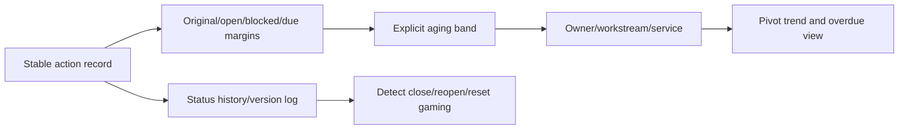

---

## 11. Power Query: extract, transform, and load

Power Query is Excel's data connection and transformation environment. Use it to make repeatable imports, type conversions, cleanup, appends, merges, grouping, unpivoting, and refresh steps visible.

### Plain-English deep-dive: a recorded assembly line

Manual cleanup is like rebuilding each product from memory at a desk. Power Query is an assembly line whose stations are named and replayed: receive, type, clean, map, join, check, and load. If a station changes, reviewers can inspect the changed step and rerun the same inputs.

**Why it matters:** repeatable visible transformations reduce copy/paste drift, but the assembly line still needs correct source, grain, keys, privacy and quality gates.

### Query architecture

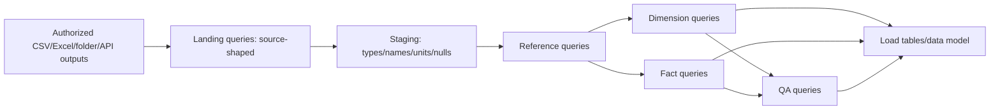

### Recommended practices

1. Keep landing queries close to source and disable load where appropriate.
2. Use explicit types and locale.
3. Rename steps meaningfully.
4. Preserve source identifiers and timestamps.
5. Reference rather than duplicate query logic.
6. Parameterize approved paths/cutoffs carefully.
7. Handle missing columns/files explicitly.
8. Profile column quality/distribution, then add deterministic checks.
9. Keep privacy levels/credentials in the approved environment.
10. Document refresh dependencies and load destinations.

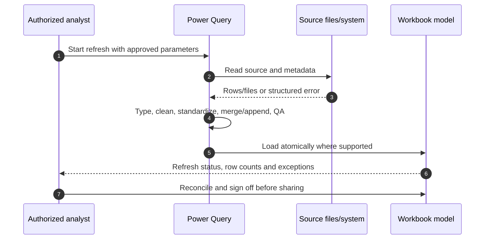

### Query folding and performance orientation

For sources that support folding, Power Query can push transformations back to the source. Exact folding varies by connector/step. Use diagnostics and current docs rather than assuming. For flat files, reduce columns/rows early and avoid repeated full scans where practical.

### Data privacy levels

Power Query privacy settings help control unintended data combination behavior, but they do not replace organizational authorization. Never choose a permissive setting merely to make refresh succeed; involve the data/privacy owner.

---

## 12. Power Query merges and cardinality validation

A **merge** joins tables by selected columns. Before expanding the nested result, declare expected cardinality and test key uniqueness.

### Merge workflow

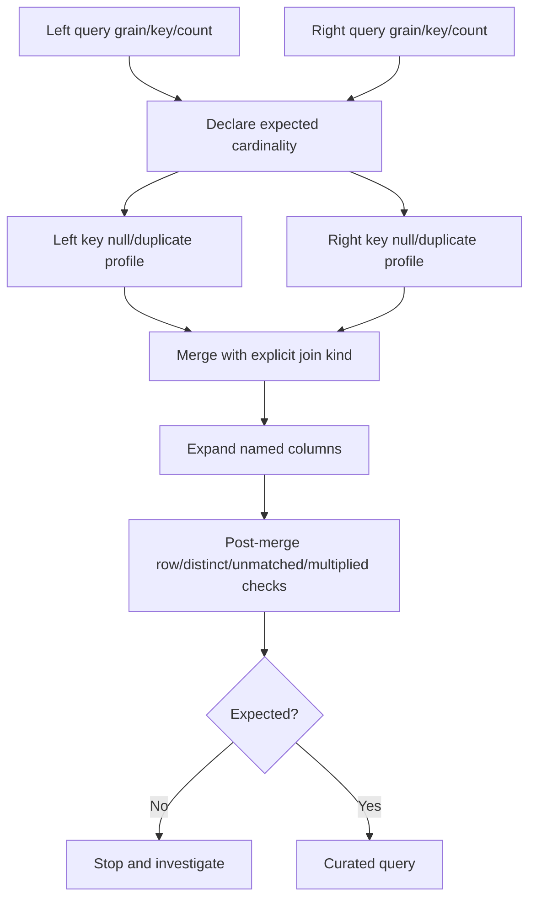

### Join kinds

| Join kind | Use | Risk |
|---|---|---|
| Left outer | Keep all left rows, add matches | Duplicate right keys multiply on expand |
| Inner | Keep only matches | Silently drops unmatched population if unreported |
| Full outer | Reconciliation across both sources | Requires clear origin/match classification |
| Left anti | Rows present only on left | Excellent unmatched QA |
| Right anti | Rows present only on right | Excellent orphan/new-record QA |

### Cardinality check queries

Group each key and count rows. Any count above one on a required dimension key is a blocker, not a merge detail. For many-to-many relationships, create a bridge query at the exact pair grain.

### Effective-dated merge

Power Query's basic merge uses equality, so effective-time joins can require careful designs, such as joining by stable key and filtering where fact time is inside the dimension interval. Validate performance and uniqueness; SQL/data models may be better for large data.

---

## 13. Power Query appends and schema drift

An **append** stacks rows from tables with compatible meaning and grain.

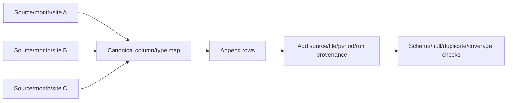

### Append rules

- Same conceptual grain and column meaning.
- Explicit canonical names/types/units.
- Add source file/system and extraction period before append.
- Missing columns become explicit nulls and schema exceptions.
- Extra columns receive review, not silent discard.
- Detect duplicate files/periods and late replacements.
- Reconcile total rows by file/source.

### Folder imports

Folder-combine patterns are useful for monthly exports, but test:

- Hidden/temp files.
- Different schemas.
- Duplicate versions of the same period.
- Filename-derived dates.
- Corrupt/empty files.
- Access/retention permissions.
- Sample-file transformation drift.

### Schema drift gate

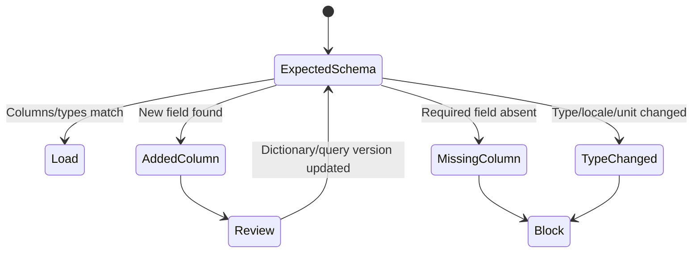

---

## 14. PivotTables and slicers

PivotTables summarize rows by dimensions and aggregations. They do not repair grain, duplicates, missing data, or invalid measures.

### Pivot design

```mermaid
flowchart LR
    MODEL[Clean model table/data model] --> ROWS[Rows: service/site/owner/risk]
    MODEL --> COLS[Columns: status/period/category]
    MODEL --> VALUES[Values: count/sum/average/distinct count]
    MODEL --> FILTER[Filters/slicers]
    ROWS --> PIVOT[PivotTable]
    COLS --> PIVOT
    VALUES --> PIVOT
    FILTER --> PIVOT
    PIVOT --> QA[Reconcile totals/drill rows]
```

### Aggregation discipline

| Metric | Pivot behavior |
|---|---|
| Asset count | Prefer distinct stable AssetKey when data model supports it |
| Action count | Count stable ActionKey, not asset-action bridge rows |
| Capacity | Sum canonical additive bytes at non-overlapping grain |
| Percentage | Calculate numerator/denominator; do not average percentages blindly |
| Latency | Understand weighted/event grain; averages of averages can mislead |
| Percentile | Do not average p95/p99 values across groups as a global percentile |
| Aging | Show distribution/bands and oldest items, not only mean |

### Slicers

Use slicers for controlled categorical fields such as customer/site/service/status/priority, and timelines for dates. Connect slicers intentionally to compatible PivotTables. Show selected scope and data cutoff prominently so screenshots cannot lose filter context.

### Refresh controls

- Refresh queries before pivots.
- Set/verify refresh-on-open only under approved behavior.
- Check `Refresh All` order and external connection status.
- Preserve items/filter behavior carefully when categories disappear.
- Confirm PivotTable cache does not show stale results.
- Reconcile grand totals to model QA after refresh.

---

## 15. Charts and responsible Excel visualization

Choose charts based on the question, not decoration.

| Question | Appropriate chart | Caveat |
|---|---|---|
| Trend over time | Line chart | Consistent interval, gaps visible, no invented zero |
| Compare categories | Sorted bar chart | Start at zero for magnitude comparison unless justified |
| Composition | Stacked bar/100% stacked | Limit categories; keep denominator clear |
| Aging distribution | Histogram or bar bands | Define bins and cutoff |
| Risk matrix | Scatter/heatmap-like table | Categories/positions are model outputs, not probability |
| Actual versus target | Line/bar with approved target | Target source/date/definition required |
| Portfolio timeline | Milestone/Gantt-style bar | Dates/uncertainty/dependencies visible |

```mermaid
flowchart TD
    Q[Analytical question] --> TIME{Time trend?}
    TIME -->|Yes| LINE[Line with gaps/cutoff]
    TIME -->|No| COMP{Category magnitude?}
    COMP -->|Yes| BAR[Sorted bar]
    COMP -->|No| DIST{Distribution?}
    DIST -->|Yes| HIST[Histogram/bands]
    DIST -->|No| REL{Relationship?}
    REL -->|Yes| SCAT[Scatter with uncertainty]
    REL -->|No| TABLE[Table/KPI with definitions]
```

### Chart safeguards

- Clear title states metric, scope and time.
- Axis units and scale visible.
- Missing/partial intervals remain gaps or explicit markers.
- Avoid 3D effects, misleading dual axes and truncated magnitude axes.
- Use direct labels/legends that fit.
- Use accessible color plus shapes/text.
- Show source cutoff and filters.
- Link every chart to a reconciliation/QA check.
- Do not put customer secrets or detailed identifiers in executive charts.

### Conditional formatting versus chart

A dense action table can use text status and restrained conditional formatting; a trend belongs in a chart. Avoid coloring every cell. The viewer should see decisions, exceptions and movement rather than a rainbow grid.

---

## 16. Data validation, protection, and controlled inputs

### Data validation

Use validation for manual controlled fields:

- Status.
- Priority band.
- Decision state.
- Owner role from approved list.
- Date bounds.
- Yes/No/Unknown.
- Reason code.

Prefer validated lookup tables over comma-separated hard-coded lists when categories evolve.

```mermaid
flowchart LR
    LIST[Governed lookup table] --> VALID[Data-validation rule]
    VALID --> INPUT[Controlled manual input]
    INPUT --> CHECK[Required/type/domain/cross-field QA]
    CHECK -->|Pass| MODEL[Action/decision table]
    CHECK -->|Fail| ERROR[Visible error/instruction]
```

### Validation limitations

- Pasting can bypass validation depending on action/version.
- Existing invalid data can remain.
- Validation does not prove accuracy or authority.
- Dropdown categories need effective governance.
- Use QA formulas/query checks in addition.

### Protection

| Control | Purpose | Limitation |
|---|---|---|
| Locked formula/query cells | Reduce accidental edits | Sheet protection is not strong security |
| Protected sheet/workbook structure | Prevent casual structural changes | Authorized users may still need controlled edit process |
| File encryption/password under policy | Protect file content | Password management and tenant policy matter |
| Repository permissions | Control who can access/share | Must be maintained/audited |
| Sensitivity labels/DLP | Organizational handling controls | Availability depends on Microsoft 365 policy |
| Separate raw data | Restrict sensitive source details | Crosswalk and exports still need governance |

### Protection workflow

```mermaid
flowchart TD
    CLASS[Classify data/audience] --> REPO[Approved repository/permissions]
    REPO --> ENC[Encryption/sensitivity/DLP policy]
    ENC --> CELLS[Unlock only controlled input cells]
    CELLS --> PROTECT[Protect formulas/sheets/structure]
    PROTECT --> TEST[Test refresh, filters, pivots, accessibility]
    TEST --> SHARE[Share minimum audience-specific copy]
```

Never store passwords, tokens, private keys, CHAP secrets, session cookies, or credentials in cells, names, queries, VBA, hidden sheets, or connections.

---

## 17. Versioning, change control, and reproducible refresh

### Workbook version record

| Field | Content |
|---|---|
| Workbook ID/version | Stable name and semantic/internal version |
| File format | `.xlsx`, `.xlsm`, etc. with reason |
| Owner/reviewer | Accountable roles |
| Change date | UTC/local clearly stated |
| Changed | Queries, formulas, schemas, rules, pivots, charts, controls |
| Reason | Source change, defect fix, new requirement |
| Validation | Test results and reviewer |
| Compatibility | Excel versions/platforms tested |
| Rollback | Prior approved version/location |

```mermaid
flowchart LR
    CHANGE[Proposed workbook change] --> BRANCH[Controlled working copy/version]
    BRANCH --> TEST[Refresh with synthetic/test snapshots]
    TEST --> QA[Formula/query/pivot/chart/privacy regression]
    QA --> REVIEW[Independent review]
    REVIEW --> RELEASE[Approved version in repository]
    RELEASE --> LOG[Change log/data cutoff/signoff]
    RELEASE --> PRIOR[Preserve prior approved version]
```

### Reproducible refresh checklist

1. Freeze/version source snapshots and expected counts.
2. Set approved named parameters.
3. Refresh queries in documented order.
4. Verify query errors, privacy prompts and connection status.
5. Refresh PivotTables/charts.
6. Run QA/reconciliation and inspect exception deltas.
7. Verify filters/slicers/cutoff and calculation mode.
8. Review executive/technical outputs for privacy and narrative consistency.
9. Record run date, source cutoff, workbook version and reviewer.
10. Publish an approved copy/link, not an uncontrolled attachment chain.

### Calculation controls

- Use automatic calculation unless a documented performance exception requires otherwise.
- Check for stale/manual calculation before publication.
- Avoid volatile functions such as `OFFSET`, `INDIRECT`, `NOW`, and `TODAY` where they harm reproducibility; use governed `pAsOfDate` for reports.
- Avoid external workbook links when a controlled query/model can replace them.
- Inspect circular references and hidden names/connections.

---

## 18. Macros and VBA orientation only

Macros/VBA can automate repetitive workbook actions, but they add code, security, compatibility, maintenance, signing, and review obligations.

### Appropriate orientation

Potential uses:

- Repeatable export formatting.
- Controlled refresh/report packaging.
- UI helpers for governed inputs.
- Repetitive quality checks not available declaratively.

Prefer Power Query, tables, formulas, PivotTables, Office Scripts/approved automation, or upstream SQL/Python when they provide clearer governed logic.

```mermaid
flowchart TD
    NEED[Automation need] --> DECL{Can tables/formulas/Power Query/pivots solve it?}
    DECL -->|Yes| SIMPLE[Use declarative feature]
    DECL -->|No| ENV{Approved automation platform?}
    ENV --> VBA[VBA/macro candidate]
    ENV --> SCRIPT[Office Script/Power Automate/upstream code candidate]
    VBA --> GOV[Code review/signing/trusted location/version/testing]
    SCRIPT --> GOV
    GOV --> DEPLOY[Controlled deployment and support owner]
```

### Macro controls

- Never enable unknown macros.
- Use organizational macro policy, trusted publishers/locations and digital signing where required.
- Keep source code reviewable and versioned.
- Do not embed credentials/secrets.
- Test on supported Excel platforms and file formats.
- Include error handling, logging and safe failure.
- Limit file/system/network access.
- Define support owner and removal/fallback path.

This Part intentionally provides no VBA code and makes no recommendation to bypass macro security.

---

## 19. End-to-end workbook QA

### QA layers

```mermaid
flowchart LR
    Q1[Source/authorization/cutoff] --> Q2[Schema/type/unit/time]
    Q2 --> Q3[Key/duplicate/null/referential]
    Q3 --> Q4[Merge/append/cardinality/count]
    Q4 --> Q5[Formula/mapping/aging/denominator]
    Q5 --> Q6[Pivot/chart/filter/refresh]
    Q6 --> Q7[Privacy/protection/accessibility]
    Q7 --> Q8[Customer narrative/action validation]
    Q8 --> PUB[Publish/signoff]
```

### QA checklist

| Layer | Checks |
|---|---|
| Source | Authorized, complete snapshot, expected file/page/row, cutoff |
| Schema | Required columns, types, locale, unit, timezone, enums |
| Identity | Stable keys, duplicates, aliases, entity type, effective history |
| Transform | Step logic, null reasons, cleanup, mappings, query errors |
| Join | Expected cardinality, pre/post counts, unmatched/anti-join, bridges |
| Formula | Correct ranges/references, propagation, errors, denominator, edge cases |
| Pivot | Correct aggregation/grain, distinct counts, caches, filters/slicers |
| Chart | Question fit, axes, units, gaps, accessibility, cutoff |
| Privacy | Minimum fields, redaction, labels, permissions, hidden-data check |
| Narrative | Findings match evidence; caveats and owners/dates consistent |

### Edge-case tests

- Empty source.
- One-row source.
- Missing required column.
- Duplicate key.
- Null date/owner/status.
- Unknown timezone.
- Large serial/leading zero.
- Negative or impossible metric.
- Stale source.
- New status value.
- Many-to-many merge.
- No PivotTable rows after slicer.
- Long labels and print/export layout.
- Workbook opened in supported alternate client/platform.

### Independent review

The reviewer should reproduce key totals, trace a sample output to raw source, challenge one join and one denominator, test refresh, inspect exceptions, and verify no sensitive hidden sheet/query/name leaks into shared output.

---

## 20. Fully synthetic sanitized scenario: Contoso Genomics TAM workbook

> **Synthetic boundary:** `Contoso Genomics`, all assets, sources, formulas, files, timestamps, KPIs, thresholds, risks, actions, charts, and recommendations are fictional. This is a text design for a learning workbook, not an attached/live NetApp workbook.

### Decision question

Which synthetic production systems have stale evidence, lifecycle/compatibility/capacity risks, recurring support themes, or overdue preventative actions before the quarterly service review?

### Synthetic inputs

| Source/table | Grain | Injected quality issue |
|---|---|---|
| `tblInputAssets` | One asset/source record | Duplicate retired controller; IDs imported as numbers |
| `tblInputTelemetry` | One node/message state | Local timestamps, one unknown timezone, one stale node |
| `tblInputRisks` | One risk-asset mapping | Duplicate mapping and unknown applicability |
| `tblInputCases` | One case | Old aliases, mixed status text, two unmatched assets |
| `tblInputLifecycle` | One product milestone | One unsourced manual date |
| `tblInputActions` | One action | Missing owner, reset open date, overdue accepted risk |
| Monthly capacity files | One object/month | One duplicate file, unit change, missing month |

```mermaid
flowchart TB
    ASSET[Asset input] --> PQ[Power Query staging]
    TELE[Telemetry input] --> PQ
    RISK[Risk input] --> PQ
    CASES[Case input] --> PQ
    LIFE[Lifecycle input] --> PQ
    ACT[Action input] --> PQ
    CAP[Monthly capacity folder] --> PQ
    PQ --> MODEL[Dimensions/facts/bridges]
    MODEL --> QA[QA and exception tables]
    MODEL --> PIV[Pivot/slicer/chart views]
    QA --> REVIEW[Service-review publish gate]
    PIV --> REVIEW
```

### Workbook tables

| Table | Key/grain |
|---|---|
| `tblAssets` | One stable AssetKey/effective period |
| `tblAssetAliases` | One alias/AssetKey/effective period |
| `tblServices` | One ServiceKey |
| `tblRiskAsset` | One RiskKey + AssetKey + evidence date |
| `tblCases` | One CaseKey |
| `tblActions` | One ActionKey |
| `tblCapacity` | One ObjectKey + month + source run |
| `tblExceptions` | One ExceptionKey |

### Query flow

```mermaid
flowchart LR
    LAND[Landing queries] --> TYPE[Explicit types/locale/UTC/bytes]
    TYPE --> NORM[Trim/clean/status mapping]
    NORM --> KEYS[Stable keys/alias candidate review]
    KEYS --> MERGE[Dimensions and bridge merges]
    MERGE --> APPEND[Monthly capacity append]
    APPEND --> CHECK[Anti-joins/duplicates/schema/count checks]
    CHECK --> LOAD[Load model and QA tables]
```

### Formula controls

Action state:

```excel
=IFS(
  [@ValidationDate]<>"","Closed - validated",
  [@AcceptedRiskExpiry]<pAsOfDate,"Accepted risk expired",
  [@LatestSafeStart]<pAsOfDate,"Escalate - start late",
  [@DueDate]<pAsOfDate,"Overdue",
  [@OwnerRole]="","Missing owner",
  TRUE,"Open"
)
```

Asset service lookup with uniqueness control:

```excel
=LET(
  C,COUNTIF(tblAssets[AssetKey],[@AssetKey]),
  IF(C=1,XLOOKUP([@AssetKey],tblAssets[AssetKey],tblAssets[ServiceKey],"Not found",0),
     IF(C=0,"ERROR: unmatched","ERROR: duplicate asset"))
)
```

### QA results

| Test | Synthetic result | Disposition |
|---|---|---|
| Asset stable-key uniqueness | 1 duplicate replacement row | Preserve effective history; no deletion |
| Alias match | 2 unmatched cases | Exception; exclude from asset-specific trend with count shown |
| Time zones | 1 unknown | Do not correlate to UTC incident timeline |
| Capacity folder files | 1 duplicate month, 1 missing month | Block trend until duplicate removed; show gap for missing month |
| Lifecycle source | 1 manual unsourced date | Quarantine from decision view |
| Action owner | 2 missing | Service review action to assign owners |
| Accepted risk expiry | 1 expired | Reopen decision state |
| Privacy | One contact in technical table | Remove from executive output; keep restricted role alias |

### Pivot views

```mermaid
flowchart TD
    MODEL[Validated model] --> P1[Assets by freshness/lifecycle/service]
    MODEL --> P2[Risks by applicability/priority/owner]
    MODEL --> P3[Actions by state/age/latest-safe-start]
    MODEL --> P4[Cases by theme/service/quarter]
    MODEL --> P5[Capacity trend with visible gaps]
    SLICER[Service/site/period/status slicers] --> P1
    SLICER --> P2
    SLICER --> P3
    SLICER --> P4
    SLICER --> P5
```

### Findings

1. One active node's synthetic telemetry is stale; no health conclusion is made for the blind interval.
2. Two cases cannot be tied to stable assets because aliases are unresolved; asset-specific recurrence excludes and reports them.
3. One lifecycle date lacks an authoritative source and is removed from priority calculations.
4. The capacity trend contains a true missing month; the line chart displays a gap rather than zero.
5. One accepted risk is past expiry and returns to decision review.
6. Current action closure rate initially overstated performance because implementation, not validation, drove `Closed`.

### Risk and recommendations

```mermaid
flowchart LR
    F1[Stale telemetry] --> R1[Support/proactive visibility risk]
    F2[Unmatched aliases] --> R2[Case routing/trend confidence risk]
    F3[Unsourced lifecycle date] --> R3[Wrong roadmap decision risk]
    F4[Capacity gap] --> R4[Forecast uncertainty]
    F5[Expired acceptance] --> R5[Ungoverned residual risk]
    R1 --> A1[Repair/validate telemetry]
    R2 --> A2[Steward alias crosswalk]
    R3 --> A3[Obtain official source]
    R4 --> A4[Restore source/reforecast ranges]
    R5 --> A5[Reopen owner decision]
```

### Synthetic recommendations

- Storage/network owners validate telemetry generation, delivery, receipt and freshness before reporting the asset healthy.
- Data/support owners resolve the two aliases using durable identity and effective history; no fuzzy auto-merge.
- Lifecycle owner supplies current official evidence or keeps the milestone unknown.
- Capacity owner removes the duplicate file, preserves the missing interval, validates units and reruns scenario forecasts.
- Risk owner reviews the expired acceptance and records control, new expiry, remediation or escalation.
- Workbook owner changes closure KPI to require `ValidationDate` and documents the rule/version.

### Executive output

The `Exec` sheet contains:

- Data cutoff and QA status.
- Five decision/action KPIs with numerator/denominator.
- Top findings and latest-safe-start items.
- Action owner/date/status.
- One trend with visible missing interval.
- Explicit exclusions and No-production-NetApp/synthetic label.

### Validation

- Refresh from frozen synthetic inputs reproduces row counts and hashes.
- All duplicate/unmatched/stale/unsourced conditions appear in QA.
- Pivot totals reconcile to model tables.
- Slicer scope is printed on the executive view.
- Formula consistency and calculation mode pass.
- Shared executive copy excludes restricted contacts/raw identifiers.
- A second reviewer traces each finding to source/query/formula/exception.

---

## 21. Discovery, evidence, risk, recommendation, and JD Mapping

### Discovery questions

1. What customer decision, audience, cutoff, scope and privacy classification does the workbook serve?
2. Which source files/exports, grains, keys, schemas, units, time zones and owners apply?
3. Which fields are manual, query-derived, formula-derived or authoritative source values?
4. Which Excel version/platform/tenant policy and function/connector features are available?
5. What table/named-range/query/model architecture keeps raw, transformed, QA and output layers separate?
6. Which lookup, conditional, aggregation and text rules are versioned and testable?
7. What merge/append cardinality, schema drift, count and reconciliation checks gate refresh?
8. Which PivotTable aggregations, slicers and charts answer the decision without misleading?
9. Which validation/protection/repository/version/macro controls apply?
10. Who refreshes, reviews, signs off, publishes, fixes exceptions and owns residual risk?

### Evidence-to-recommendation chain

```mermaid
flowchart LR
    SRC[Authorized typed source tables] --> PQ[Versioned Power Query transformations]
    PQ --> MODEL[Stable dimensions/facts/bridges]
    MODEL --> FORM[Controlled formulas/aging/metrics]
    MODEL --> QA[QA/reconciliation/exceptions]
    FORM --> OUT[Pivot/slicer/chart]
    QA --> OUT
    OUT --> FIND[Finding/risk/recommendation]
    FIND --> ACT[Owner/date/validation/residual risk]
```

### JD Mapping

| JD responsibility | Part 59 contribution | Arti's factual bridge and gap |
|---|---|---|
| Generate/analyze customer data | Tables, Power Query, types, joins, formulas and QA | Excel/analytics skills are factual; NetApp sources remain unpracticed |
| Install-base accuracy | Stable keys, aliases, duplicate/unmatched and effective-state controls | Data-quality skills transfer |
| Proactive risk/action tracking | Aging, latest-safe-start, accepted-risk and validation states | Support/program tracking transfers |
| Operational service review | Pivots, slicers, charts, executive/technical views | Customer-review experience transfers |
| Capacity/case/lifecycle analysis | Typed aggregation, trends, gaps, source authority | MBA/statistics transfer; product facts need current sources |
| Security/governance | Validation, protection, repository, version and privacy controls | Enterprise data handling transfers |
| Process improvement | Repeatable refresh, exception register and independent QA | Automation mindset transfers; no live NetApp workbook claimed |

---

## 22. Arti's transfer and honest NetApp gap

```mermaid
flowchart LR
    EXCEL[Excel tables/formulas/PQ/pivots] --> WORK[Auditable workbook architecture]
    BI[Power BI/analytics] --> MODEL[Grain, dimensions, KPIs, visuals]
    SQL[SQL] --> JOIN[Keys, joins, aggregation, QA]
    PY[Python/statistics] --> TEST[Reproducibility, validation, uncertainty]
    MS[Microsoft support] --> CASE[Cases/actions/customer narrative]
    WORK --> TAM[NetApp TAM synthetic workbook method]
    MODEL --> TAM
    JOIN --> TAM
    TEST --> TAM
    CASE --> TAM
    TAM --> GAP[Live NetApp data, definitions and governance remain gaps]
```

### Transfer table

| Factual strength | Transfer | Honest limit |
|---|---|---|
| Excel/Power Query | Tables, formulas, merges/appends, pivots, QA | No live NetApp source refresh |
| Power BI | Data-model/visual/audience discipline | Production dashboard is Part 60 and remains a gap |
| SQL | Grain, uniqueness, cardinality and reconciliation | No NetApp warehouse schema |
| Python/statistics | Automated checks, edge cases and uncertainty | No production credential/API automation |
| Microsoft support | Case/action/service-review context | No production NetApp cases/install base |

### Honest interview answer

> `I would build the workbook as a governed data product: README/config, immutable inputs, Power Query landing/staging, dimension/fact/bridge tables, controlled formulas, explicit QA, and audience outputs. I use stable text IDs, UTC plus source times, exact-match lookups with duplicate checks, transparent IF/IFS/SWITCH logic, measured IFERROR use, COUNTIFS/SUMIFS with denominator discipline, validated merges/appends, and reconciled pivots/charts. My Excel experience is factual, but I have not refreshed live NetApp customer data, so source access, definitions and results remain explicitly authorized and current.`

---

## 23. Paper lab and self-test

### Paper lab: build the synthetic TAM workbook

Design a workbook from synthetic CSV/Excel inputs for 50 clusters, 100 nodes, 80 SVMs, 30 services, 300 cases, 120 risks, 150 actions, 24 monthly capacity files, lifecycle records, and compatibility evidence.

```mermaid
flowchart LR
    PLAN[Define decision/data dictionary/architecture] --> INPUT[Create synthetic source snapshots]
    INPUT --> PQ[Build Power Query landing/staging/model]
    PQ --> FORM[Add formulas/validated inputs]
    FORM --> QA[Build QA and exceptions]
    QA --> PIV[Build pivots/slicers/charts]
    PIV --> PROT[Protection/versioning/refresh]
    PROT --> REVIEW[Independent review and service-review delivery]
```

### Inject these defects

- IDs converted to scientific notation and leading zeros lost.
- Dates parsed under two locales.
- One unknown timezone and a daylight-saving transition.
- Duplicate dimension key that XLOOKUP would hide.
- INDEX/MATCH unmatched key.
- IF/IFS rule-order conflict.
- IFERROR hiding a broken reference.
- COUNTIFS excluding unknowns from denominator.
- SUMIFS mixing bytes and GiB.
- Nonbreaking spaces and reused aliases.
- One overwritten calculated-column formula.
- Conditional formatting applied to wrong range.
- Power Query missing page/file and type drift.
- Merge multiplying rows and append duplicating a month.
- Pivot count at bridge grain instead of distinct action grain.
- Stale PivotTable cache and disconnected slicer.
- Misleading chart with missing month as zero.
- Data validation bypassed by paste.
- Hidden sheet containing sensitive contact data.
- Unsigned macro in an input file; do not enable it.

### Tasks

1. Create README, Config, Input, query/model, Calc, QA, Pivot, Exec and Tech layers.
2. Build named tables and documented parameters.
3. Define types, canonical units, UTC/local dates and quality fields.
4. Use XLOOKUP and INDEX/MATCH with uniqueness/unmatched checks.
5. Build IF, IFS, SWITCH and narrowly justified IFERROR formulas.
6. Build COUNTIFS/SUMIFS metrics with numerator/denominator/exclusions.
7. Preserve raw text and create controlled cleanup/mapping.
8. Build aging, latest-safe-start, formula-consistency and row-QA checks.
9. Create Power Query landing/staging/reference/dimension/fact/bridge/QA queries.
10. Validate merge cardinality, anti-joins, append provenance and schema drift.
11. Build reconciled PivotTables, slicers and responsible charts.
12. Apply validation, protection, repository, privacy and version controls.
13. Reject/disable the unsigned macro and document approved automation alternatives.
14. Run full edge-case and independent-review checklist.
15. Deliver executive and technical views and answer Q1-Q8 aloud.

### Self-test

1. Explain the workbook architecture and purpose of each layer.
2. Define tables, named ranges and structured references.
3. Prevent ID/date/unit/timezone type errors.
4. Use XLOOKUP with exact match and duplicate/unmatched checks.
5. Explain INDEX/MATCH and when Power Query/model relationships are better.
6. Choose IF, IFS, SWITCH or mapping table.
7. Explain why IFERROR can hide defects.
8. Build COUNTIFS/SUMIFS with denominator discipline.
9. Clean text without claiming identity.
10. Build row/workbook checks and accessible conditional formatting.
11. Track action aging without gaming.
12. Design Power Query landing, staging, merge and append controls.
13. Build PivotTables/slicers with correct grain and refresh.
14. Choose responsible charts and preserve missing intervals.
15. Apply validation, protection, versioning and macro security.
16. Run end-to-end QA and recreate Contoso Genomics.

### Lab pass checklist

- [ ] Workbook purpose, audience, sources, cutoff, owner, privacy and version are documented.
- [ ] Inputs, transformations, model, calculations, QA and outputs are separated.
- [ ] Tables/named ranges/structured references use clear controlled names.
- [ ] IDs are text; dates/time zones/units/types are explicit and tested.
- [ ] XLOOKUP/INDEX-MATCH have uniqueness and unmatched checks.
- [ ] IF/IFS/SWITCH logic is ordered, documented and edge-tested.
- [ ] IFERROR never hides unmeasured defects.
- [ ] COUNTIFS/SUMIFS expose numerator, denominator, exclusions and units.
- [ ] Raw/clean text coexist and fuzzy matches require review.
- [ ] Conditional formatting uses explicit status plus accessible cues.
- [ ] Aging preserves original dates and validation-based closure.
- [ ] Power Query merges/appends validate cardinality, counts, provenance and drift.
- [ ] Pivots/slicers/charts reconcile to model and show scope/cutoff/gaps.
- [ ] Validation, protection, repository, privacy and version controls pass.
- [ ] No unknown/unsigned macro is enabled; macros remain orientation only.
- [ ] Full QA and independent trace-to-source review pass.
- [ ] All data/results are synthetic; no production NetApp workbook is claimed.

---

## 24. Official Source Anchors

**Date checked: 2026-08-24.** Official Microsoft and public NetApp sources only. Excel capability varies by deployed version/platform/tenant; reopen the exact current Microsoft page and test before production use.

| Topic | Official source | Bounded use |
|---|---|---|
| Excel tables/structured references | [Using structured references with Excel tables](https://support.microsoft.com/en-us/office/using-structured-references-with-excel-tables-f5ed2452-2337-4f71-bed3-c8ae6d2b276e) | Table/structured-reference syntax and behavior |
| Named ranges | [Define and use names in formulas](https://support.microsoft.com/en-us/office/define-and-use-names-in-formulas-4d0f13ac-53b7-422e-afd2-abd7ff379c64) | Workbook/worksheet names and management |
| XLOOKUP | [XLOOKUP function](https://support.microsoft.com/en-us/office/xlookup-function-b7fd680e-6d10-43e6-84f9-88eae8bf5929) | Current syntax/match/search behavior and availability |
| INDEX/MATCH | [INDEX function](https://support.microsoft.com/en-us/office/index-function-a5dcf0dd-996d-40a4-a822-b56b061328bd) and [MATCH function](https://support.microsoft.com/en-us/office/match-function-e8dffd45-c762-47d6-bf89-533f4a37673a) | Position/return lookup concepts |
| Conditional functions | [IF function](https://support.microsoft.com/en-us/office/if-function-69aed7c9-4e8a-4755-a9bc-aa8bbff73be2), [IFS function](https://support.microsoft.com/en-us/office/ifs-function-36329a26-37b2-467c-972b-4a39bd951d45), and [SWITCH function](https://support.microsoft.com/en-us/office/switch-function-47ab33c0-28ce-4530-8a45-d532ec4aa25e) | Current formula syntax and behavior |
| Error handling | [IFERROR function](https://support.microsoft.com/en-us/office/iferror-function-c526fd07-caeb-47b8-8bb6-63f3e417f611) | Error substitution syntax; governance caveats remain local |
| Conditional aggregation | [COUNTIFS function](https://support.microsoft.com/en-us/office/countifs-function-dda3dc6e-f74e-4aee-88bc-aa8c2a866842) and [SUMIFS function](https://support.microsoft.com/en-us/office/sumifs-function-c9e748f5-7ea7-455d-9406-611cebce642b) | Criteria-based count/sum syntax |
| Power Query | [Power Query for Excel Help](https://support.microsoft.com/en-us/office/power-query-for-excel-help-2b433a85-ddfb-420b-9cda-fe0e60b82a94) | Official Power Query feature/help entry |
| Merge/append | [Merge queries](https://support.microsoft.com/en-us/office/merge-queries-and-join-tables-cbd17828-7a50-4dc6-9aac-20af4ef6d8a6) and [Append queries](https://support.microsoft.com/en-us/office/append-queries-9a3260a7-c123-4c7a-8b31-2a8c24484e26) | Current join/append workflow; cardinality QA remains analyst responsibility |
| PivotTables/slicers | [Create a PivotTable](https://support.microsoft.com/en-us/office/create-a-pivottable-to-analyze-worksheet-data-a9a84538-bfe9-40a9-a8e9-f99134456576) and [Use slicers](https://support.microsoft.com/en-us/office/use-slicers-to-filter-data-249f966b-a9d5-4b0f-b31a-12651785d29d) | Official summary/filter workflow |
| Data validation | [Apply data validation to cells](https://support.microsoft.com/en-us/office/apply-data-validation-to-cells-29fecbcc-d1b9-42c1-9d76-eff3ce5f7249) | Controlled-input features and limitations |
| Protection | [Protection and security in Excel](https://support.microsoft.com/en-us/office/protection-and-security-in-excel-be0b34db-8cb6-44dd-a673-0b3e3475ac2d) | Distinguishes protection levels; repository/security policy still governs |
| Macro security | [Change macro security settings in Excel](https://support.microsoft.com/en-us/office/change-macro-security-settings-in-excel-a97c09d2-c082-46b8-b19f-e8621e8fe373) | Official security orientation; never bypass organizational policy |
| AutoSupport concepts | [Learn about ONTAP AutoSupport](https://docs.netapp.com/us-en/ontap/system-admin/manage-autosupport-concept.html) | Example source-family context only; no customer data used |
| Digital Advisor concepts | [Digital Advisor documentation](https://docs.netapp.com/us-en/active-iq/index.html) | Example source-family context; customer portal data is gated |

### Source-use discipline

- Record Excel version/build/platform, workbook format, locale, tenant policy and test date.
- Store source definitions, snapshots, cutoff and privacy classification.
- Validate function/connector availability before relying on it.
- Treat formulas/query steps as versioned code with review and edge tests.
- Reconcile every PivotTable/chart/KPI to controlled model totals.
- Do not enable unknown macros or bypass privacy/security controls.
- Public NetApp docs supply source concepts, not customer evidence or tool access.

---

## Likely Interview Questions

### Q1. How would you structure an Excel workbook for TAM analysis?

> **Model answer:** `I separate README/config, immutable inputs, Power Query landing/staging, dimension/fact/bridge tables, calculations, QA/exceptions, pivots, and executive/technical outputs. Every release records source cutoff, workbook/query/formula versions, quality status, filters and reviewer. Raw data and manual inputs never mingle invisibly.`

### Q2. How do you make lookups safe?

> **Model answer:** `I use stable entity-specific text keys and exact match, first count matches on the lookup side, return explicit unmatched/duplicate errors, and preserve an exception table. XLOOKUP or INDEX/MATCH cannot fix duplicate or weak keys; for complex/effective joins I prefer Power Query, a data model or SQL with cardinality tests.`

### Q3. When do you use IF, IFS, SWITCH, and IFERROR?

> **Model answer:** `IF for a clear binary branch, IFS for ordered conditions, SWITCH for mapping one expression, and a governed mapping table when categories evolve. IFERROR is only for expected measured errors with explicit output; I never use it to blank out broken references, duplicate keys or type defects.`

### Q4. How do you use COUNTIFS and SUMIFS responsibly?

> **Model answer:** `I confirm row grain and additive units, define inclusion/exclusion and AND/OR logic, expose numerator and denominator, preserve unknowns, and reconcile totals to sources. I do not average percentages or sum duplicated bridge rows, and I avoid overlapping OR counts that double-count records.`

### Q5. What controls do you use for Power Query merges and appends?

> **Model answer:** `I type and profile keys first, declare cardinality, test dimension uniqueness, choose an explicit join kind, inspect anti-joins, then compare pre/post rows and distinct keys after expansion. Appends require matching grain/schema/units plus file/source/run provenance, duplicate-period and schema-drift checks.`

### Q6. How do you keep PivotTables and charts from misleading customers?

> **Model answer:** `I start from a validated grain/model, use distinct keys and correct additive measures, reconcile totals, refresh caches, show slicer/filter scope and cutoff, preserve missing intervals as gaps, label units/denominators, avoid averaged percentiles and misleading axes, and use accessible color plus text.`

### Q7. How do you protect and version a workbook?

> **Model answer:** `I use approved repository permissions, encryption/sensitivity policy, minimum data, locked formula/query cells, protected structure, controlled input validation, version/change logs, tested prior versions and independent review. Sheet protection is not security, and credentials never belong in cells, queries, hidden sheets or VBA.`

### Q8. How does your background transfer, and what remains a gap?

> **Model answer:** `I have hands-on Excel, Power Query, Power BI, SQL, Python, statistics and Microsoft support analytics experience, so tables, joins, formulas, QA and service-review design transfer directly. I have not refreshed or governed live NetApp customer data, so every source, metric definition, access and result would be validated with current docs and authorized owners.`

---

## 30-Second Memory Hooks

- **Workbook:** Small governed data product, not a colorful file.
- **Architecture:** Input -> Power Query -> model -> calc/QA -> pivot/chart -> audience.
- **Table:** Named rectangular grain with structured columns.
- **Named range:** Small controlled parameter with owner/type.
- **ID:** Text and stable; names are aliases.
- **Time:** Preserve original + timezone + UTC + cutoff.
- **XLOOKUP:** Exact match plus uniqueness/unmatched checks.
- **INDEX/MATCH:** Find position, return value; keys still govern safety.
- **IF:** Binary; **IFS:** ordered tests; **SWITCH:** one-value mapping.
- **IFERROR:** Handle known measured errors, never hide defects.
- **COUNTIFS/SUMIFS:** Grain, units, numerator, denominator, unknowns.
- **Cleanup:** Normalize formatting, not identity.
- **Conditional format:** Attention aid; status still lives in data.
- **Aging:** Stable ID/original date/validation-based closure.
- **Power Query:** Repeatable typed transformations with visible steps.
- **Merge:** Declare cardinality; inspect anti-joins and row multiplication.
- **Append:** Same grain/schema/units plus provenance.
- **Pivot:** Summarizes clean data; it does not clean data.
- **Chart:** Question, scale, gaps, units, cutoff, accessibility.
- **Protection:** Prevent accidents; permissions/encryption protect data.
- **Macros:** Code with security/governance, orientation only here.
- **Arti's bridge:** Excel skill is real; live NetApp workbook experience is not.

---

## Completion Checklist

- [ ] Document decision, audience, scope, source cutoff, owner, privacy, version and limitations.
- [ ] Separate README/config, inputs, Power Query, model, calculations, QA and outputs.
- [ ] Use named Excel tables and documented named parameters.
- [ ] Use structured references and verify calculated-column consistency.
- [ ] Type IDs, versions, capacities, percentages, dates and booleans correctly.
- [ ] Preserve source time/zone and normalized UTC; unknown timezone remains an exception.
- [ ] Use XLOOKUP and INDEX/MATCH with exact keys, uniqueness and unmatched controls.
- [ ] Use IF, IFS and SWITCH for the right logic shape; prefer mapping tables when governed.
- [ ] Use IFERROR only for expected, measured and explicitly represented errors.
- [ ] Use COUNTIFS/SUMIFS with correct grain, units, numerator/denominator and OR logic.
- [ ] Preserve raw text, apply controlled cleanup and prevent fuzzy auto-merges.
- [ ] Build row-level checks, control totals, reconciliation and accessible conditional formatting.
- [ ] Track action age, latest-safe-start, blocked/deferred/accepted states and validation closure.
- [ ] Build Power Query landing/staging/reference/dimension/fact/bridge/QA flows.
- [ ] Validate merge join kind/cardinality and append schema/provenance/duplicate periods.
- [ ] Build reconciled PivotTables, slicers and responsible charts with visible scope/cutoff.
- [ ] Apply data validation plus paste/domain QA.
- [ ] Apply repository, encryption/sensitivity, protection, privacy and version controls.
- [ ] Treat macros as governed code; do not enable unknown/unsigned macros or store secrets.
- [ ] Run full source-to-narrative QA and independent review.
- [ ] Recreate the fully synthetic Contoso Genomics workbook design and paper lab.
- [ ] Answer Q1-Q8 aloud and state the exact No-production-NetApp boundary.
- [ ] Recheck exact Excel/tenant/source documentation before production use.

---

*Next suggested section:* [Part 60 - Power BI, Dashboards, KPIs, Trends, and Responsible Visualization](Part-60-power-bi-dashboards-kpis.md)