# Part 60 - Power BI, Dashboards, KPIs, Trends, and Responsible Visualization

> **Section goal:** Build a trustworthy Power BI experience for customer install base, telemetry freshness, risk, lifecycle, supportability, capacity, cases, recommendations, and actions. By the end, you should be able to design a star schema, define fact/dimension grain, manage relationships and filter direction, separate Power Query from semantic-model work, choose measures versus columns, write bounded DAX and time intelligence, create TAM KPIs and trend/cohort views, use drill-through and tooltips, apply row-level security and access controls, plan refresh/gateway operations, design accessible visuals, communicate uncertainty, prevent misleading charts, separate executive and technical pages, and reconcile every result to governed sources.

Covers index item **60** and maps directly to job-description responsibilities for Power BI customer analysis, proactive risk reporting, operational service reviews, install-base quality, lifecycle/upgrade/capacity planning, support and case insight, action governance, executive communication, technical drill-down, process improvement, and measurable customer outcomes.

**Explicit nonclaim:** You have not built, published, secured, refreshed, or governed a production Power BI semantic model or dashboard containing live NetApp customer data.

**Privacy and access boundary:** Customer identity, serials, topology, versions, metrics, cases, risks, defects, contracts, costs, owners, business-service mappings, accepted risks, and decisions are sensitive. Use authorized minimum data, approved workspaces, least privilege, row/object-level security where appropriate, sensitivity labels, export controls, audit, retention, and audience-specific views. RLS is not a substitute for workspace/app permissions or source security.

**Synthetic-evidence rule:** Every customer, asset, source row, relationship, DAX result, KPI, target, trend, risk, chart, user role, refresh, gateway, recommendation, and outcome below is fictional and sanitized. No visual or table is a real AutoSupport, Digital Advisor, ONTAP, IMT, HWU, Bugs Online, case, or customer result.

**Version caveat:** Power BI Desktop, Service, Fabric, semantic models, connectors, DAX, Power Query, relationship behavior, visual interactions, RLS, gateways, refresh, deployment, licensing, sensitivity, accessibility, export and tenant settings change. A **current-doc check** means reopening official Microsoft documentation for the deployed environment, validating the exact feature/licensing/tenant behavior, and testing with authorized representative data before publishing.

This Part provides no `.pbix`/`.pbip` artifact, live credentials, customer threshold, NetApp metric definition, production RLS identity mapping, gateway configuration, universal KPI, or guarantee. DAX examples use a fictional semantic model and require adaptation, testing, and owner approval.

> **No-production-NetApp boundary:** You factually know Power BI, Excel, Power Query, SQL, Python, statistics, business analytics, enterprise support data, case/customer reviews, and decision communication. You do **not** claim live NetApp data-model or dashboard ownership. Your exact non-claim is: **you have not modeled, visualized, secured, published, refreshed, certified, or distributed production NetApp customer data in Power BI.**

---

## 1. A dashboard is a decision interface

A dashboard should help a named audience recognize scope and evidence quality, understand what changed and why it matters, make a decision, assign action, and validate outcomes. It is not a poster of attractive charts.

### Plain-English deep-dive: aircraft instruments and the flight decision

An aircraft panel is useful because instruments have defined sensors, units, freshness, ranges, warnings, and procedures. A frozen altimeter that still looks calm is dangerous. A TAM dashboard needs the same discipline: controlled sources, definitions, cutoff, quality, context, and drill paths.

**Why it matters:** a green KPI can mean healthy, out of scope, stale, filtered, missing, or incorrectly calculated.

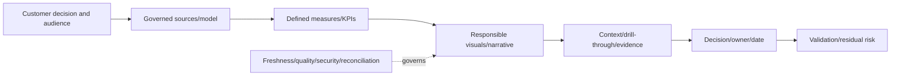

### Dashboard contract

| Field | Required content |
|---|---|
| Audience | Executive, lead TAM, technical owner, data steward, action owner |
| Decision | Exact question and decision cadence |
| Scope | Customer/site/service/assets/time/exclusions |
| Data | Sources, owners, grain, cutoff, refresh and privacy |
| Metrics | Name, formula, numerator/denominator, unit, target source, owner |
| Quality | Missing/stale/partial/conflict and publication gates |
| Interaction | Filters, cross-highlighting, drill-through, tooltip and reset path |
| Security | Workspace/app/model/RLS/export/audit expectations |
| Outcome | Actions, owners, dates, validation and residual risk |

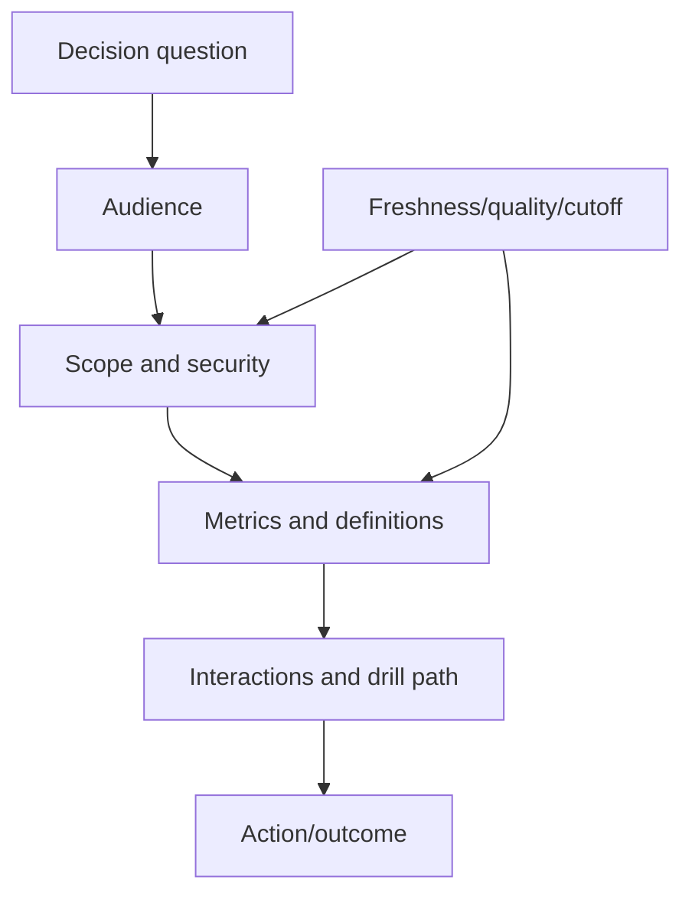

---

## 2. Star schema foundations

A **star schema** places business events/measurements in **fact tables** and descriptive entities in **dimension tables**. Dimensions filter facts through controlled relationships.

### Plain-English deep-dive: receipts and catalogs

A receipt records events: one item was sold at a time for an amount. Catalogs describe the customer, product, store and date. If every receipt repeats and contradicts the full customer/product descriptions, analysis becomes inconsistent. Facts are receipts; dimensions are catalogs.

**Why it matters:** a star schema makes grain, filters, reusable measures and drill paths easier to reason about than one giant flat table.

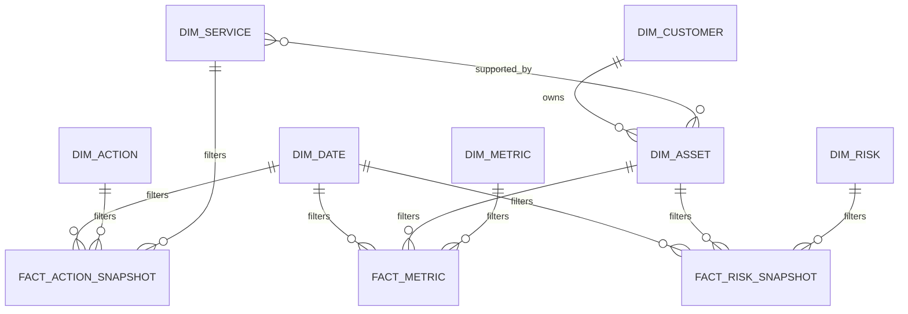

### Candidate fact tables

| Fact | One row represents | Additive examples | Non-additive/semi-additive cautions |
|---|---|---|---|
| `FactMetric` | Object + metric + interval + source run | Bytes/operations in interval | Percentiles, ratios and stocks need special aggregation |
| `FactCapacitySnapshot` | Object + snapshot date + capacity layer | Used bytes across non-overlapping objects | Do not sum same stock across dates/layers |
| `FactRiskSnapshot` | Risk + asset + snapshot date | Exposure mapping count at exact grain | Distinct risk/asset counts differ |
| `FactActionSnapshot` | Action + snapshot date/status | Action count at snapshot | One action can map to many risks/assets |
| `FactCase` | One case | Case count | Updates/events belong in separate fact |
| `FactCaseEvent` | One case event/time | Event count/duration components | Case duplication if joined flat |
| `FactLifecycleMilestone` | Product/version/asset milestone | Milestone count | Dates/status are not additive |
| `FactRefreshQuality` | Source/run/test result | Row/error/exception counts | Different source populations need context |

### Candidate dimensions

- `DimDate` and optional role-playing dates.
- `DimCustomer`, `DimSite`, `DimService`.
- `DimAsset`, `DimPlatform`, `DimRelease`.
- `DimRisk`, `DimRecommendation`, `DimAction`.
- `DimCaseTheme`, `DimOwner`, `DimSource`, `DimMetric`.
- Bridge tables such as `BridgeServiceAsset`, `BridgeRiskAction`, and `BridgeActionAsset`.

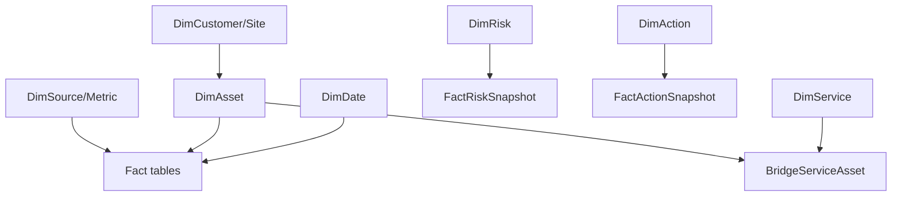

### Avoid a single wide table

A flattened `asset x service x risk x action x case x month` table creates multiplication. One action mapped to three assets and four risks produces twelve rows before cases/time are added. Measures then overcount unless every calculation compensates perfectly.

---

## 3. Facts, dimensions, grain, and keys

### Grain declaration

Every table needs a sentence: `One row represents...`

| Table | Grain sentence | Candidate key |
|---|---|---|
| `DimAsset` | One governed asset version/effective period | Asset surrogate key |
| `FactRiskSnapshot` | One risk-to-asset state at one snapshot cutoff | RiskKey + AssetKey + SnapshotDateKey |
| `FactActionSnapshot` | One action state at one snapshot cutoff | ActionKey + SnapshotDateKey |
| `FactCapacitySnapshot` | One object/capacity-layer observation at one time/source | ObjectKey + LayerKey + DateTime + SourceRun |
| `BridgeServiceAsset` | One effective service-to-asset relationship | ServiceKey + AssetKey + effective period |

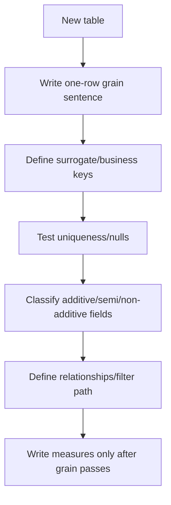

### Surrogate and business keys

- Use a stable model key for relationships.
- Preserve source business IDs for lineage.
- Keep entity types separate: cluster, node, SVM, component, service, risk and action are not interchangeable.
- If dimension history is required, one business entity can have multiple surrogate rows across effective periods.
- Unknown members can be explicit model records only under a governed design; do not turn missing data into a real healthy asset.

### Slowly changing state

Current owner, site, release, lifecycle, name and service mapping can change. Decide whether the report needs current-state restatement or historical state at event time. Document the choice.

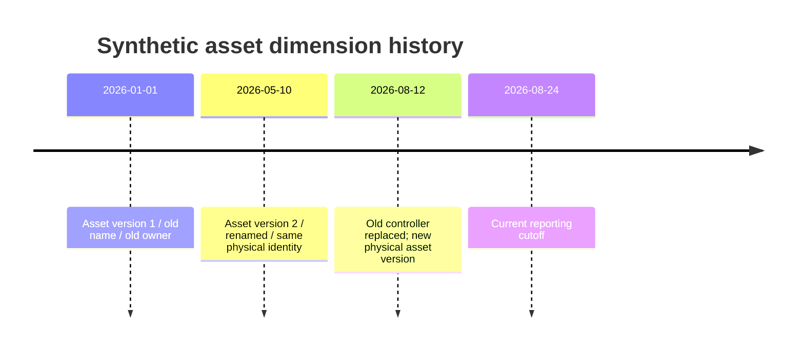

### Factless facts and bridges

A bridge can record a relationship without a numeric measure, such as action-to-risk or service-to-asset. Count the correct stable entity, not bridge rows.

---

## 4. Relationships, cardinality, and filter direction

### Cardinality

| Relationship | Meaning | Model expectation |
|---|---|---|
| One-to-many | Unique dimension key filters many facts | Preferred star-schema relationship |
| One-to-one | One unique row each side | Review whether tables should be combined or role separated |
| Many-to-many | Keys repeat on both sides | Use only with explicit bridge/design and measure tests |

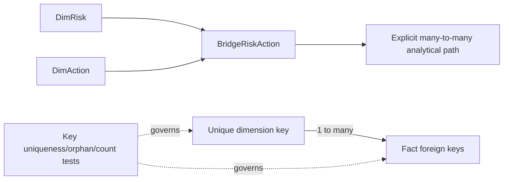

### Filter direction

Prefer single-direction filtering from dimensions to facts. Bidirectional filtering can be valid for a specific design, but it can create ambiguous paths, surprising totals, performance issues and security implications.

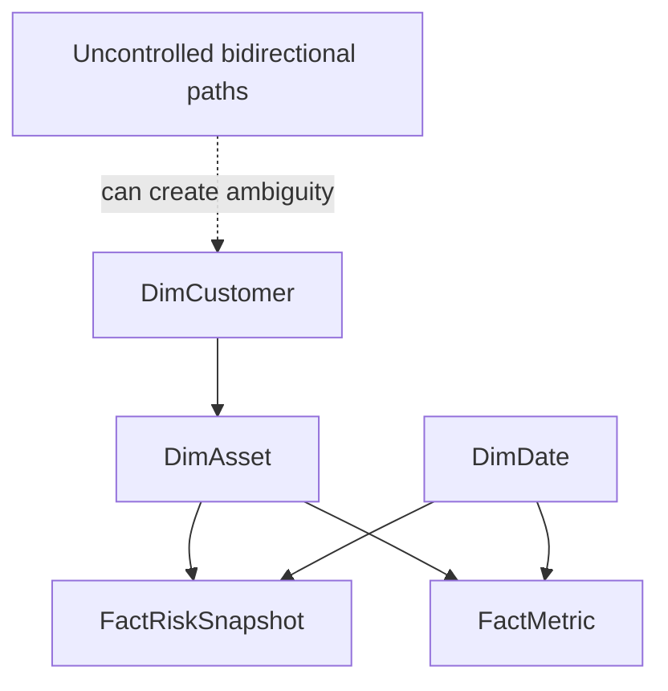

### Relationship QA

- Dimension key is unique/nonblank.
- Fact foreign keys map or use an explicit unknown exception design.
- Pre/post-load distinct counts reconcile.
- Active/inactive relationships are documented.
- Filter direction supports the intended question without unintended propagation.
- Many-to-many measures count stable entities.
- RLS tests include bridge/filter paths.

### Inactive relationships

An action can have OpenDate, DueDate, ValidationDate and ReviewDate. One date relationship may be active; measures can use `USERELATIONSHIP` for another. Name role-playing dimensions or measures clearly.

```DAX
Actions Due :=
CALCULATE(
    DISTINCTCOUNT(DimAction[ActionKey]),
    USERELATIONSHIP(DimDate[Date], DimAction[DueDate])
)
```

---

## 5. Power Query versus semantic-model work

### Plain-English deep-dive: prepare ingredients before the menu calculates totals

Power Query is best for repeatable row/column preparation: parsing, typing, standardizing, appending, merging and shaping. The semantic model is best for relationships and calculations that respond to report filters.

**Why it matters:** doing dynamic filter calculations in Power Query freezes them at refresh; doing heavy source cleanup in DAX repeats complexity at query time.

| Task | Power Query | Semantic model/DAX |
|---|---|---|
| Connect/extract/filter source rows | Preferred | Not the role of DAX |
| Types, locale, units, UTC normalization | Preferred | Avoid late conversion |
| Append files and source provenance | Preferred | Not efficient model logic |
| Deterministic row cleanup/mapping | Preferred | Use DAX only if truly filter-dependent |
| Dimension/fact shaping | Preferred | Relationships finalized in model |
| Relationships/cardinality/filter direction | No | Semantic model |
| Dynamic totals/ratios/KPIs | No | Measures |
| Row-level static category needed for slicing | Query or calculated column based on ownership/performance | Choose deliberately |
| Time intelligence | Prepare date columns; model date table | Measures/DAX |

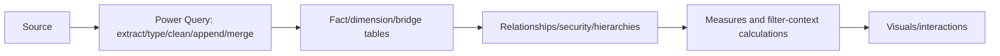

### Upstream-first principle

If a transformation belongs in a governed enterprise data platform and serves multiple products, put it upstream when feasible. Do not create competing source-of-truth logic in every `.pbix`.

### Power Query controls

- Explicit source/schema/type/locale.
- Parameters without embedded secrets.
- Landing/staging/reference queries.
- Query folding verification where relevant.
- Merge cardinality and anti-join checks.
- Append provenance/schema drift checks.
- Privacy levels and approved credential handling.
- Dataflow/warehouse versus Desktop ownership decision.

---

## 6. Measures versus calculated columns

A **calculated column** computes one stored value per row at refresh. A **measure** computes a result in filter context at query time.

### Row context and filter context

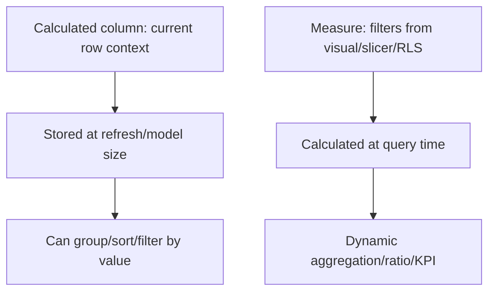

### Choose a measure when

- Result should change with customer/site/service/date/status filters.
- Aggregating counts, sums, ratios, rates or time intelligence.
- The value is a report calculation, not a row attribute.
- Avoiding stored duplicate results.

### Choose a column when

- A stable row classification/key is needed for relationships, sorting, grouping or RLS.
- It is computed at refresh and independent of report filter context.
- Power Query/upstream is not the better owner.

### Examples

Calculated column (if not better upstream):

```DAX
Action Due State =
SWITCH(
    TRUE(),
    ISBLANK(DimAction[DueDate]), "No due date",
    DimAction[ValidationStatus] = "Validated", "Closed - validated",
    DimAction[DueDate] < DimAction[ModelAsOfDate], "Overdue",
    "Open"
)
```

Measure:

```DAX
Open Actions :=
CALCULATE(
    DISTINCTCOUNT(DimAction[ActionKey]),
    DimAction[ValidationStatus] <> "Validated"
)
```

### Measure-first reporting

Explicit measures improve definition ownership, formatting, reuse, testing and discoverability. Avoid relying on implicit `Sum of Column` for governed KPIs.

---

## 7. DAX foundations and safe patterns

### Core concepts

| Concept | Plain meaning |
|---|---|
| Filter context | Current customer/date/service/status filters affecting a measure |
| Row context | Current row during calculated-column/iterator evaluation |
| `CALCULATE` | Evaluates an expression under modified filter context |
| Iterator (`SUMX`, etc.) | Evaluates an expression row by row over a table |
| `DIVIDE` | Division with controlled alternate result |
| `DISTINCTCOUNT` | Counts unique keys rather than multiplied rows |
| Variables (`VAR`) | Name intermediate expressions for readability/testing |

### KPI measures

```DAX
In-Scope Active Assets :=
CALCULATE(
    DISTINCTCOUNT(DimAsset[AssetKey]),
    DimAsset[LifecycleState] = "Active",
    DimAsset[InScope] = TRUE()
)
```

```DAX
Current Telemetry Assets :=
CALCULATE(
    DISTINCTCOUNT(DimAsset[AssetKey]),
    DimAsset[LifecycleState] = "Active",
    DimAsset[InScope] = TRUE(),
    DimAsset[FreshnessState] = "Current"
)
```

```DAX
Telemetry Freshness Rate :=
DIVIDE([Current Telemetry Assets], [In-Scope Active Assets])
```

### Unknowns remain visible

```DAX
Assets with Unknown Freshness :=
CALCULATE(
    DISTINCTCOUNT(DimAsset[AssetKey]),
    DimAsset[InScope] = TRUE(),
    DimAsset[FreshnessState] = "Unknown"
)
```

Do not remove unknowns from the denominator unless the metric definition explicitly and transparently requires it.

### Context diagram

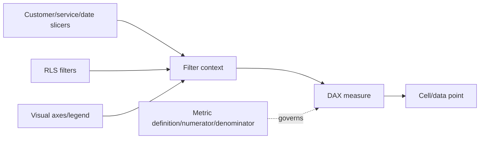

### DAX controls

- Use stable keys and `DISTINCTCOUNT` at intended grain.
- Use `DIVIDE`, not `/`, when alternate behavior matters.
- Return blank/explicit unknown rather than fake zero when denominator/data is absent.
- Use variables and measure branching.
- Format units centrally.
- Avoid complex calculated-column chains where Power Query/upstream is clearer.
- Test totals, because total filter context is not always sum of visible row results.
- Document filter-removal functions (`ALL`, `REMOVEFILTERS`) carefully.
- Do not calculate averages of averages or percentiles from percentile summaries.

---

## 8. Date tables and time intelligence

A dedicated date table provides continuous dates, attributes, sorting and consistent time filtering.

### Date-table fields

- Date and DateKey.
- Year, quarter, month number/name and YearMonth.
- Week/fiscal fields under customer definition.
- MonthStart/MonthEnd.
- Business/maintenance/freeze flags where governed.
- Sort columns for text labels.

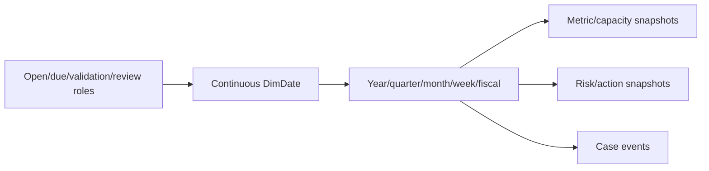

### Time-intelligence prerequisites

- Date column contains unique continuous dates.
- Model date table is marked/configured correctly for environment.
- Fact relationships and date roles are intentional.
- Reporting calendar/fiscal rules are customer-approved.
- Snapshot facts are not summed across dates as flow metrics.

### Examples

```DAX
Cases Previous Month :=
CALCULATE(
    [Case Count],
    DATEADD(DimDate[Date], -1, MONTH)
)
```

```DAX
Case Count MoM Change :=
[Case Count] - [Cases Previous Month]
```

```DAX
Validated Actions Rolling 90D :=
CALCULATE(
    [Validated Actions],
    DATESINPERIOD(DimDate[Date], MAX(DimDate[Date]), -90, DAY)
)
```

### Snapshot-as-of measure orientation

Risk/action/capacity snapshots often need the last available date in context, not sum across dates. Define and test as-of semantics explicitly.

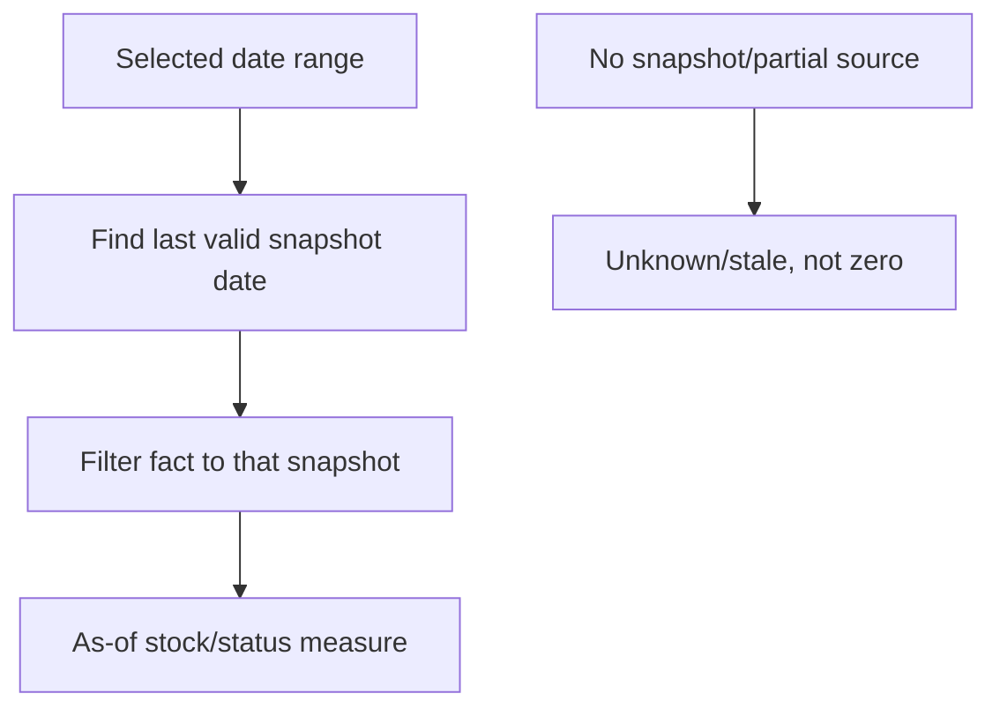

### Time caveats

- UTC events versus customer-local reporting dates.
- Late-arriving/corrected facts.
- Incomplete current month.
- Different source cadences.
- Missing dates/collector outages.
- Cohort age versus calendar time.
- Seasonality and planned events.

---

## 9. TAM KPI catalog

KPIs require exact objective, grain, numerator, denominator, exclusions, source, cadence, target authority, owner and action interpretation.

### KPI categories

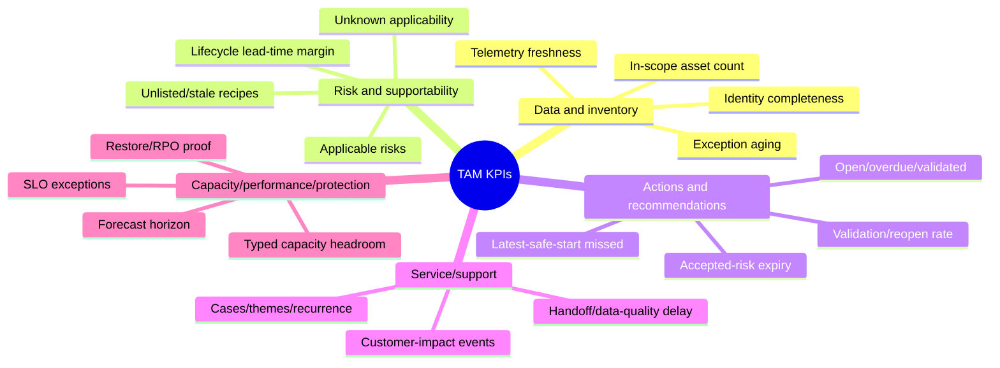

### KPI definitions

| KPI | Definition orientation | Important caveat |
|---|---|---|
| Telemetry freshness rate | Current in-scope active assets / all in-scope active assets | Unknown/stale stay in denominator/status breakdown |
| Identity completeness | Assets with required durable IDs / governed in-scope assets | Do not exclude difficult records |
| Applicable open risks | Distinct canonical risk-asset mappings in applicable states | Distinct risk, asset and mapping counts differ |
| Unknown applicability | Candidate mappings missing decisive evidence | Unknown is not low risk |
| Overdue actions | Distinct actions due before as-of date and not validated | Implementation is not closure |
| Latest-safe-start missed | Distinct actions/programs whose start margin < 0 | Lead-time assumptions shown |
| Validated action rate | Actions with success proof / actions eligible for validation | Define cohort and denominator |
| Reopen rate | Validated/closed actions later reopened / closed cohort | Lagging outcome; small denominators matter |
| Lifecycle exposure | Assets/dependencies inside approved planning horizon | Source-native dates/terms and confidence |
| Capacity horizon | Scenario time to approved threshold versus action lead time | Range/scenario, not prophecy |
| Restore-proof currency | Protected services with current approved restore evidence / protected services | Successful backups are not restore proof |

### KPI contract table

| Field | Example requirement |
|---|---|
| Business question | `Where is preventative action late?` |
| Measure | `Latest-Safe-Start Missed Actions` |
| Grain | Distinct ActionKey as of last snapshot |
| Formula | Numerator/filters/date behavior |
| Target/band | Customer-approved policy/source/date |
| Quality | Missing due/lead-time/owner counts shown separately |
| Owner | Program/risk owner |
| Action | Escalate, assign, replan or accept residual risk |

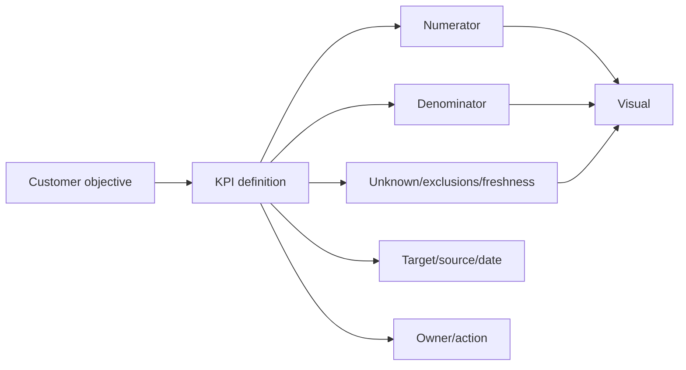

---

## 10. Trends, snapshots, and change interpretation

A trend must use comparable definitions, populations, cadences and units. A line moving down can reflect remediation, scope loss, stale sources, reclassification or closure gaming.

### Trend validation

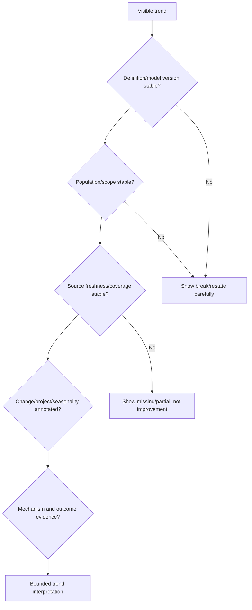

### Snapshot facts

Risk, action, inventory and capacity state are often snapshots. Preserve snapshot dates to show backlog and status evolution. Do not reconstruct prior state from current rows unless full history exists.

### Flow versus stock

| Type | Example | Time aggregation |
|---|---|---|
| Flow | Cases opened, bytes transferred, actions validated during period | Sum over non-overlapping periods |
| Stock | Open risks, used capacity, active assets at date | Last/as-of value; not sum across dates |
| Rate | Freshness rate, closure rate | Recompute numerator/denominator in context |
| Distribution | Aging/latency | Show distribution/percentiles from proper event data |

### Change annotations

Annotate upgrade, migration, data-source outage, model-definition change, large project, retention change and customer process change. Correlation remains bounded until mechanism/tests support causality.

---

## 11. Cohorts and fair comparisons

A **cohort** groups entities by a shared start/event/category and compares their evolution over comparable age or context.

### Cohort uses

- Actions opened in the same quarter: validation/reopen progression.
- Systems onboarded in the same month: telemetry/data-quality maturity.
- Customers entering lifecycle program: milestone progression.
- Risks first detected in same quarter: aging and control outcomes.
- Upgrade waves: post-change case/performance outcomes by time since upgrade.

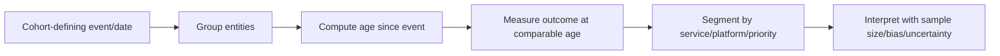

### Cohort caveats

- Selection bias: easier customers/actions enter earlier.
- Survivorship bias: retired/failed entities disappear.
- Definition/model changes across cohorts.
- Small sample sizes and changing mix.
- Censoring: newer cohorts have less observation time.
- Confounding: different platform/service/priority.

### Example cohort measure orientation

```DAX
Validated Actions :=
CALCULATE(
    DISTINCTCOUNT(DimAction[ActionKey]),
    DimAction[ValidationStatus] = "Validated"
)
```

Use action open cohort and age bands from governed fields. Do not claim causal improvement from cohort differences without controls/evidence.

---

## 12. Drill-through, tooltips, and evidence paths

### Drill-through

Drill-through carries selected context to a detail page, such as:

- Customer -> service -> asset.
- KPI -> contributing assets/actions.
- Risk -> affected systems, evidence and recommendations.
- Action -> dependencies, milestones, validation and history.
- Capacity horizon -> object/layer/scenario assumptions.
- Case trend -> themes/cases without exposing private text broadly.

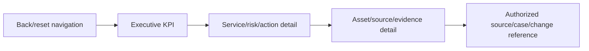

### Tooltip pages

Tooltips can show:

- Definition and numerator/denominator.
- Source cutoff/freshness/quality.
- Target/source date.
- Small trend and comparison.
- Unknown/excluded counts.
- Owner and next action.

Do not put essential information only on hover; keyboard/touch/export users may not receive it.

### Drill safeguards

- Preserve selected context and show it in titles.
- Provide a clear back/reset control.
- Avoid exposing identifiers/case details beyond audience.
- Do not let drill pages use a different hidden population.
- Test RLS and cross-filter behavior at every depth.
- Include source/evidence references, not raw secret payloads.

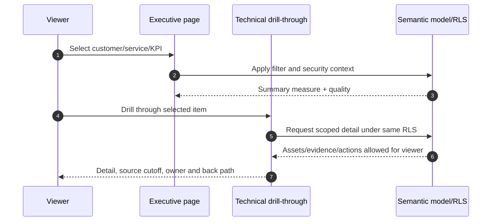

---

## 13. Responsible visualization and misleading-chart avoidance

### Choose the visual for the question

| Question | Visual | Safeguard |
|---|---|---|
| Trend | Line | Comparable cadence; gaps visible; no invented zero |
| Category magnitude | Sorted bar | Usually zero baseline; labels/units |
| Composition | Stacked/100% stacked bar | Clear denominator; limited categories |
| Distribution | Histogram/box plot-supported custom visual only if approved, or bands | Define bins; sample size/outliers |
| Relationship | Scatter | Explain axes, population and non-causality |
| Current state + decision | KPI/card plus supporting trend/table | Definition, target, quality, owner |
| Risk portfolio | Matrix/scatter/table | Ordinal positions are not probability |
| Action milestones | Timeline/Gantt-style approved visual/table | Dates, uncertainty, dependencies |

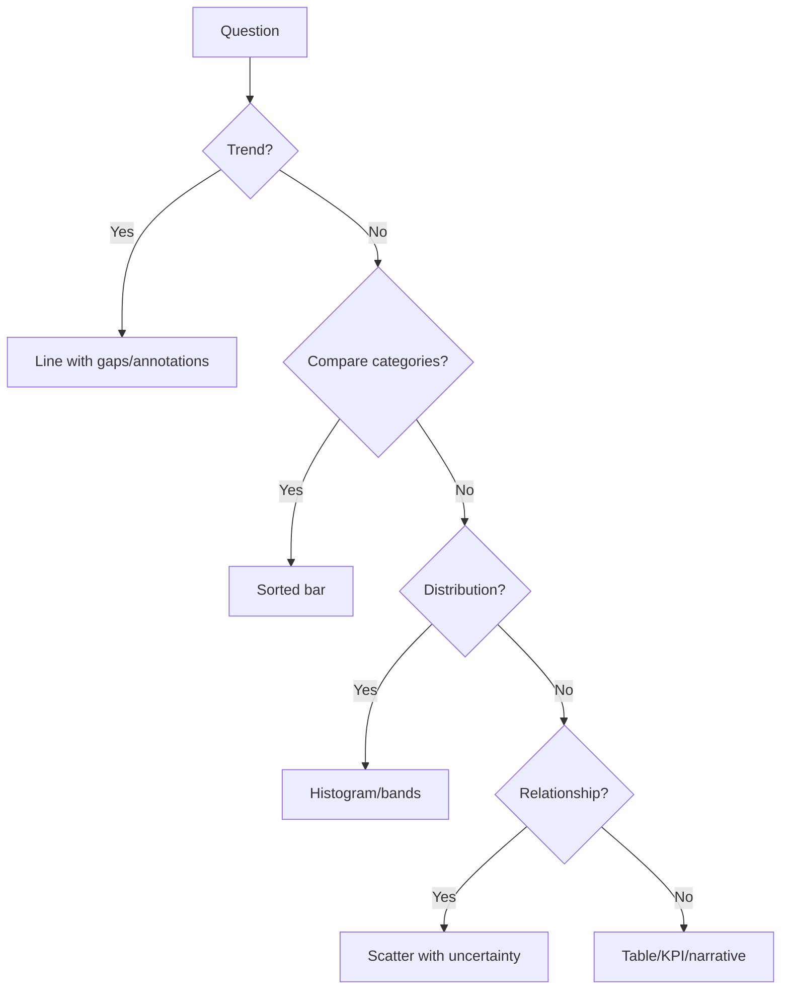

### Misleading patterns

- Truncated axes exaggerating magnitude.
- Dual axes implying relationships.
- 3D charts distorting area/angle.
- Pie/donut overload and tiny differences.
- Missing intervals converted to zero.
- Smoothed lines hiding volatility.
- Averaged percentages, means or percentiles at wrong grain.
- Red/amber/green without approved thresholds or visible unknown state.
- Changing filter context between cards without disclosure.
- Top-N excluding the long tail or unknown category.
- Maps when geography is irrelevant/sensitive.
- Decorative gauge occupying space without trend/context.

### Plain-English deep-dive: a cropped photograph can tell a false story

A photograph can be genuine while a tight crop hides the crowd, warning sign or empty room around it. A chart can use real numbers and still mislead through axes, filters, aggregation, omitted unknowns or time range.

**Why it matters:** responsible visualization includes the denominator, scope, time, missing data and comparison needed to interpret the picture.

```mermaid
flowchart LR
    VIS[Visual claim] --> DATA[Source/model/measure]
    DATA --> SCOPE[Population/filters/time]
    SCOPE --> SCALE[Axis/unit/denominator]
    SCALE --> MISS[Missing/unknown/exclusions]
    MISS --> COMP[Baseline/target/context]
    COMP --> SAFE[Responsible interpretation]
```

---

## 14. Accessibility, color, and layout

### Accessibility controls

- Meaning never depends on color alone.
- Sufficient text/background and data-color contrast.
- Descriptive visual titles and alt text.
- Logical tab order and keyboard navigation.
- Sensible reading order.
- Text size and layout tested at common zoom/device.
- Avoid excessive motion and inaccessible custom visuals.
- Use markers, labels, icons and patterns with color.
- Provide table/detail alternative for visual-only information.

```mermaid
flowchart TD
    PAGE[Report page] --> COLOR[Color + text/icon/shape redundancy]
    PAGE --> CONTRAST[Contrast and readable text]
    PAGE --> NAV[Tab/read order and keyboard navigation]
    PAGE --> ALT[Alt text/descriptive titles]
    PAGE --> RESP[Responsive/mobile/export testing]
    PAGE --> TABLE[Accessible detail/table alternative]
```

### Color design

- Use neutral colors for context.
- Reserve strong emphasis for decisions/exceptions.
- Define red/amber/green only from approved rules and include Unknown/No data.
- Keep category colors consistent across pages.
- Test common color-vision deficiencies.
- Avoid using many unrelated colors as decoration.

### Layout

Use a consistent reading order:

1. Scope, cutoff and data-quality status.
2. Customer objective/status.
3. Main trends/findings.
4. Decisions/risks/actions.
5. Detail/drill path.

Do not overcrowd pages. A scrollable technical detail table and drill-through are better than tiny unreadable visuals.

---

## 15. Uncertainty, freshness, and unknown states

### Data-quality states

| State | Visual/report treatment |
|---|---|
| Current/complete enough | Use with cutoff and scope |
| Current/partial | Show partial badge, missing coverage and lower confidence |
| Stale | Show age and block current-health interpretation |
| Missing | Explicit no-data/coverage gap, not zero |
| Conflicting | Show exception; prevent definitive KPI where material |
| Estimated/scenario | Label assumptions/range; distinguish from observed |
| Synthetic | Persistent label; no production inference |

```mermaid
flowchart TD
    VALUE[Displayed value] --> OBS{Observed current data?}
    OBS -->|Yes| QUALITY{Complete/consistent enough?}
    QUALITY -->|Yes| NORMAL[Display with cutoff]
    QUALITY -->|No| PART[Partial/conflict marker and limitation]
    OBS -->|No| TYPE{Stale/missing/estimated?}
    TYPE --> STALE[Age/coverage gap]
    TYPE --> MISS[No data, not zero]
    TYPE --> EST[Scenario/range/assumptions]
```

### Uncertainty methods

- Low/base/high scenario bands.
- Confidence category and evidence gap count.
- Sample size/population coverage.
- Forecast error/backtest range.
- Sensitivity of priority/action to assumptions.
- Error bars or bands only where statistically valid and understandable.
- Narrative annotations for model/source changes.

### Data cutoff measure

Create a prominent last-refresh/source-cutoff indicator from a governed refresh fact, not `NOW()` alone. Service refresh time and latest source observation are different.

```DAX
Latest Source Observation UTC :=
MAX(FactRefreshQuality[LatestSourceObservationUTC])
```

```DAX
Open Critical Data Exceptions :=
CALCULATE(
    DISTINCTCOUNT(FactRefreshQuality[ExceptionKey]),
    FactRefreshQuality[Severity] = "Critical",
    FactRefreshQuality[Status] <> "Closed"
)
```

### Publication veto

Block or prominently degrade the report when critical source, identity, privacy, relationship, denominator or reconciliation checks fail. A dashboard should not remain silently green because refresh technically completed.

---

## 16. Executive and technical pages

### One model, different questions

```mermaid
flowchart TB
    MODEL[One governed semantic model] --> EXEC[Executive overview]
    MODEL --> TAM[TAM operational review]
    MODEL --> TECH[Technical risk/detail]
    MODEL --> DATA[Data quality/install base]
    MODEL --> ACTION[Action/decision lifecycle]
    EXEC --> DRILL[Controlled drill-through]
    TAM --> DRILL
    TECH --> DRILL
    DATA --> DRILL
```

### Executive page

Keep it decision-focused:

- Customer objective/status and scope/cutoff.
- 4-7 high-value KPIs with definition/tooltips.
- Trend and major change annotation.
- Top risks/unknowns and why now.
- Decision/action owner/date and latest-safe-start.
- Key caveat/residual risk.

Avoid walls of technical counters, serials and dozens of cards.

### Technical page

Include:

- Exact asset/service/source/version scope.
- Risk applicability and evidence confidence.
- Telemetry/capacity/performance/protection trends where relevant.
- IMT/HWU/bug/lifecycle evidence status.
- Data-quality/unknown/conflict drill-through.
- Recommendations, dependencies, prerequisites, stop/recovery and validation.

### Data-quality page

- Source freshness and refresh status.
- Row/distinct/key/referential/reconciliation checks.
- Missing/unknown/stale/conflict counts.
- Exceptions by owner/age/severity.
- Schema/model/version changes.

### Action page

- Proposed/approved/in-progress/blocked/validating/closed/deferred/accepted.
- Due and latest-safe-start margins.
- Owners/dependencies/collisions.
- Validation/reopen/residual risk.

---

## 17. Row-level security, access, and export governance

### Security layers

```mermaid
flowchart TD
    SOURCE[Source authorization/security] --> WS[Workspace roles]
    WS --> APP[App/audience permissions]
    APP --> MODEL[Semantic model build/read permissions]
    MODEL --> RLS[Row-level security]
    RLS --> REPORT[Report/page/visual experience]
    REPORT --> EXPORT[Export/share/subscription controls]
    AUDIT[Audit/sensitivity/DLP/retention] -.governs.-> WS
```

### RLS purpose

RLS filters model rows for viewers, for example an authorized customer/account mapping. It must be tested with real role patterns and all relationship paths.

### Static versus dynamic RLS

| Pattern | Orientation | Risks |
|---|---|---|
| Static role | Fixed filter such as region/customer group | Role proliferation and maintenance |
| Dynamic role | User identity maps through an entitlement table | Identity normalization, duplicate/missing entitlements, bridge/filter complexity |

### RLS caveats

- Workspace roles can have permissions that bypass/alter viewer RLS expectations; verify current Microsoft behavior.
- RLS does not hide columns/tables from users with broader model access; consider object-level/security architecture where available and required.
- Export/analyze-in-Excel/build permissions can expose more detail under allowed context.
- A report filter is not security.
- Do not place multiple customers in one model without approved isolation design and adversarial tests.
- Test totals, drill-through, tooltips, subscriptions and exports as each role.

```mermaid
sequenceDiagram
    autonumber
    participant U as Viewer identity
    participant S as Power BI Service
    participant E as Entitlement mapping
    participant M as Semantic model
    U->>S: Open app/report
    S->>M: Query under identity/role
    M->>E: Resolve permitted customer/service rows
    E-->>M: Authorized keys
    M-->>S: Filtered measures/details
    S-->>U: Allowed report experience
    U->>S: Drill/export request
    S->>M: Reapply security and permission rules
```

### Access governance

- Named workspace/app/model owners.
- Least privilege and separated dev/test/prod.
- Sensitivity labels and tenant sharing policy.
- Guest/external sharing approval.
- Service principals/credentials governed.
- Audit/log review and periodic access recertification.
- Remove departed/changed-role users.
- Secure source and gateway independently.

---

## 18. Refresh, gateway, and operational reliability

### Refresh path

```mermaid
flowchart LR
    SRC[Cloud/on-prem sources] --> CONN[Connector/credentials/privacy]
    CONN --> GW[On-premises data gateway if required]
    GW --> PQ[Power Query/dataflow transformations]
    PQ --> MODEL[Semantic model refresh]
    MODEL --> TEST[Quality/reconciliation/security tests]
    TEST --> REPORT[Report/app publication]
    MON[Refresh/gateway/capacity monitoring] -.governs.-> GW
    MON -.governs.-> MODEL
```

### Gateway orientation

An on-premises data gateway can bridge Power BI Service to supported on-premises sources. Exact gateway mode, cluster, connector, identity, network, high-availability and ownership behavior must use current Microsoft documentation and organizational standards.

### Refresh design fields

| Field | Required content |
|---|---|
| Source | System/endpoint/file, owner, schema, privacy, cutoff behavior |
| Mode | Import, DirectQuery, Direct Lake or composite as approved/current |
| Schedule | Cadence, time zone, source availability, collision |
| Incremental | Range policy, partitions, late changes/deletes, backfill |
| Gateway | Cluster/members, owners, data source mapping, service account |
| Capacity | Model size, duration, concurrent workloads, limits |
| Failure | Alerts, retries, incident owner, stale-report behavior |
| Validation | Row counts, source cutoff, reconciliation, RLS and report smoke tests |

### Refresh state model

```mermaid
stateDiagram-v2
    [*] --> Scheduled
    Scheduled --> Extracting
    Extracting --> Transforming
    Transforming --> Loading
    Loading --> QualityGate
    QualityGate --> Published: Tests pass
    QualityGate --> Failed: Critical test fails
    Extracting --> Failed: Source/gateway/auth error
    Transforming --> Failed: Schema/type/query error
    Published --> Validated: Report/security smoke tests pass
    Failed --> Investigating
    Investigating --> Scheduled: Corrected/retry approved
```

### Stale-report behavior

- Display latest source cutoff and refresh status.
- Alert owner on failure or duration anomaly.
- Decide whether users can see last successful data with a prominent stale banner or whether publication is blocked.
- Do not update only the displayed `last refreshed` timestamp if source data did not advance.
- Preserve failure evidence and impact.

### Performance basics

- Star schema and minimized columns/cardinality.
- Correct data types and upstream shaping.
- Measures over governed grain.
- Avoid unnecessary bidirectional/many-to-many relationships.
- Limit visual count and expensive interactions.
- Use Performance Analyzer/DAX/query diagnostics under current tools.
- Test representative RLS and data volume.

---

## 19. QA, reconciliation, and release gates

### QA layers

```mermaid
flowchart LR
    Q1[Source/schema/authorization] --> Q2[Power Query rows/types/nulls]
    Q2 --> Q3[Keys/relationships/cardinality]
    Q3 --> Q4[Measure/unit/filter/time logic]
    Q4 --> Q5[Visual/interaction/drill/tooltip]
    Q5 --> Q6[RLS/access/export/privacy]
    Q6 --> Q7[Refresh/gateway/performance]
    Q7 --> Q8[Executive narrative/action/outcome]
    Q8 --> RELEASE[Release/certify/promote]
```

### Reconciliation tests

| Test | Example |
|---|---|
| Source rows | Extracted versus staged/loaded rows by source/run |
| Distinct identity | Assets/cases/actions/risks versus governed source |
| Relationship | Orphan fact keys and bridge duplicates |
| Totals | Capacity bytes, case count, open action count to source/workbook/SQL |
| Rate | Numerator/denominator/exclusions/unknowns independently recomputed |
| Snapshot | As-of state compared to source snapshot |
| Time | Date range, role-playing relationship and incomplete period |
| Filter | Customer/site/service/status selections and reset state |
| Security | Expected allowed/denied rows for every role |
| Export | Exported detail matches authorized visible context |

### Measure test matrix

Test each measure under:

- No filters/grand total.
- One customer/site/service.
- One and multiple dates.
- Empty population.
- Only unknown/stale rows.
- Duplicate bridge mappings.
- RLS roles.
- Current versus prior snapshot.
- Incomplete current period.
- Drill-through context.

```mermaid
flowchart TD
    MEASURE[Measure definition] --> BASE[Known small test dataset]
    BASE --> CASES[Filter/empty/unknown/duplicate/date/RLS cases]
    CASES --> EXPECT[Expected hand/SQL/Excel result]
    EXPECT --> COMPARE[Compare Power BI result]
    COMPARE --> PASS{Match and explain totals?}
    PASS -->|No| FIX[Fix model/measure/definition]
    PASS -->|Yes| DOC[Document and regression-test]
```

### Release gate

- Product owner approves definitions and audience.
- Data owner approves source/quality/privacy.
- Technical reviewer approves model/measures.
- Security reviewer approves permissions/RLS/export.
- Accessibility review passes.
- Reconciliation and regression tests pass.
- Refresh/gateway monitoring and support owner ready.
- Executive and technical narratives match evidence.
- Version/deployment/rollback records complete.

---

## 20. Fully synthetic sanitized scenario: Fabrikam Health TAM dashboard

> **Synthetic boundary:** `Fabrikam Health`, all systems, services, source rows, measures, targets, charts, roles, refreshes, gateway states, findings, recommendations, owners, and outcomes are fictional. This is a text design, not a real `.pbix`, screenshot, customer report, or NetApp result.

### Customer decision

Which preventative actions should Fabrikam prioritize before its quarterly review and imaging peak, and which conclusions are blocked by stale, missing or conflicting evidence?

### Synthetic source/model inventory

| Source | Model destination | Injected issue |
|---|---|---|
| Asset/install-base snapshots | `DimAsset`, `FactAssetSnapshot` | One replacement duplicate, one missing service map |
| Telemetry freshness | `FactTelemetrySnapshot` | One stale node, one partial manifest |
| Risks/recommendations | `DimRisk`, `FactRiskSnapshot`, bridges | One unknown applicability, one many-to-many mapping |
| Actions/decisions | `DimAction`, `FactActionSnapshot` | One expired acceptance, one implemented-not-validated |
| Cases/themes | `FactCase`, `DimCaseTheme` | Two unresolved aliases, private text excluded |
| Capacity | `FactCapacitySnapshot` | Missing month and project scenarios |
| Lifecycle/compatibility | milestone/evidence facts | One unsourced date, one stale recipe |

```mermaid
flowchart TB
    ASSET[Asset snapshots] --> MODEL[Star semantic model]
    TELE[Telemetry] --> MODEL
    RISK[Risk/recommendation] --> MODEL
    ACTION[Actions/decisions] --> MODEL
    CASE[Cases/themes] --> MODEL
    CAP[Capacity] --> MODEL
    LIFE[Lifecycle/compatibility] --> MODEL
    MODEL --> EXEC[Executive page]
    MODEL --> TECH[Technical/drill pages]
    MODEL --> DQ[Data-quality page]
    MODEL --> ACT[Action page]
```

### Core model

```mermaid
erDiagram
    DIM_DATE ||--o{ FACT_ASSET_SNAPSHOT : filters
    DIM_DATE ||--o{ FACT_RISK_SNAPSHOT : filters
    DIM_DATE ||--o{ FACT_ACTION_SNAPSHOT : filters
    DIM_DATE ||--o{ FACT_CAPACITY_SNAPSHOT : filters
    DIM_CUSTOMER ||--o{ DIM_ASSET : owns
    DIM_ASSET ||--o{ FACT_ASSET_SNAPSHOT : describes
    DIM_ASSET ||--o{ FACT_RISK_SNAPSHOT : affected
    DIM_RISK ||--o{ FACT_RISK_SNAPSHOT : classifies
    DIM_ACTION ||--o{ FACT_ACTION_SNAPSHOT : tracks
    DIM_SERVICE ||--o{ BRIDGE_SERVICE_ASSET : maps
    DIM_ASSET ||--o{ BRIDGE_SERVICE_ASSET : maps
```

### Synthetic measures

```DAX
Active Assets :=
CALCULATE(
    DISTINCTCOUNT(DimAsset[AssetKey]),
    DimAsset[LifecycleState] = "Active"
)
```

```DAX
Stale or Unknown Telemetry Assets :=
CALCULATE(
    DISTINCTCOUNT(DimAsset[AssetKey]),
    DimAsset[FreshnessState] IN { "Stale", "Unknown", "Partial" }
)
```

```DAX
Validated Action Rate :=
DIVIDE(
    [Validated Actions],
    [Actions Eligible for Validation]
)
```

```DAX
Latest-Safe-Start Missed Actions :=
CALCULATE(
    DISTINCTCOUNT(DimAction[ActionKey]),
    DimAction[LatestSafeStartDate] < MAX(DimDate[Date]),
    DimAction[ValidationStatus] <> "Validated"
)
```

### Executive page design

1. Header: `Fabrikam Health - Quarterly Preventative Posture`, selected scope, source cutoff, refresh/quality badge.
2. KPI cards: active assets, stale/unknown telemetry, applicable open risks, latest-safe-start missed, overdue validation, open critical data exceptions.
3. Trend: applicable/unknown risk mappings over six snapshots with model-change annotation.
4. Decision table: top recommendations, rationale, decision owner, due/latest-safe-start, confidence and residual risk.
5. Narrative: three conclusions and three unknowns; no current outage asserted.

```mermaid
flowchart LR
    HEADER[Scope/cutoff/quality] --> KPI[Decision KPIs]
    KPI --> TREND[Risk/action trends]
    TREND --> DEC[Top decisions/owners/dates]
    DEC --> NARR[Findings/unknowns/residual risk]
    NARR --> DRILL[Technical/data-quality drill-through]
```

### Technical pages

- **Asset/freshness:** cluster/node/service identity, source sequence/age/status and exceptions.
- **Risk/applicability:** exact scope, source date, trigger/control/confidence, affected-system mappings.
- **Lifecycle/supportability:** current/target evidence state, IMT/HWU/bug/lifecycle date and owner.
- **Capacity:** logical/physical/local/Snapshot layers, low/base/high scenario and lead-time margin.
- **Cases:** canonical themes, stable asset mapping, time trend and exclusions.
- **Actions:** dependencies, state history, blockers, validation and accepted-risk expiry.

### RLS design

Synthetic `SecurityUserCustomer` maps user principal names to CustomerKey. The model filters `DimCustomer` to assets/facts. Tests include missing/duplicate entitlement, technical drill, tooltip, export, app audience and a broad workspace contributor role.

```mermaid
flowchart LR
    USER[Viewer UPN] --> MAP[SecurityUserCustomer]
    MAP --> CUSTOMER[DimCustomer]
    CUSTOMER --> ASSET[DimAsset]
    ASSET --> FACTS[Customer facts]
    QA[Duplicate/missing mapping tests] -.governs.-> MAP
```

### Refresh failure

The on-premises synthetic capacity source fails through the gateway while cloud action data refreshes. Publication control keeps the last complete model, displays a stale capacity/source banner, and blocks a new capacity conclusion. It does not label the capacity KPI as zero or update the source cutoff falsely.

```mermaid
sequenceDiagram
    autonumber
    participant S as Sources
    participant G as Gateway
    participant M as Semantic model
    participant Q as Quality gate
    participant U as Users
    S->>G: Capacity extract request
    G-->>M: Synthetic source failure
    S->>M: Cloud action data succeeds
    M->>Q: Partial refresh evidence
    Q-->>M: Reject mixed publication / retain last complete release
    Q-->>U: Stale capacity banner and owner/next update
```

### Findings

| Finding | Dashboard evidence | Confidence/limit |
|---|---|---|
| One node is stale/partial | Asset freshness drill and source cutoff | High for evidence state; no health conclusion |
| Upgrade action has stale recipe | Supportability page shows driver change after evidence date | High for evidence gap; actual support unknown |
| Accepted risk expired | Action snapshot/history | High; customer must redecide |
| Capacity horizon moved earlier in high scenario | Scenario page and approved project range | Medium; source refresh currently stale |
| Closure KPI was overstated | Implemented actions counted as closed before validation | High; measure corrected/versioned |

### Risks and recommendations

```mermaid
flowchart LR
    F1[Stale telemetry] --> R1[Support/proactive blind spot]
    F2[Stale recipe] --> R2[Upgrade supportability risk]
    F3[Expired acceptance] --> R3[Ungoverned residual risk]
    F4[Capacity scenario] --> R4[Lead-time risk]
    F5[Wrong closure measure] --> R5[False progress/decision risk]
    R1 --> A1[Repair/validate source]
    R2 --> A2[Refresh exact recipe before approval]
    R3 --> A3[Reopen customer decision]
    R4 --> A4[Restore refresh/revalidate scenario]
    R5 --> A5[Use validation-based measure and restate trend]
```

### Bounded recommendations

1. Storage/network owners restore telemetry and prove generation, collection, send, receipt, association and freshness.
2. Host/storage owners regenerate current/intermediate/target compatibility evidence and hold upgrade approval until notes/prerequisites pass.
3. Customer risk owner reopens expired acceptance with current evidence, controls, action or new expiry.
4. Data/capacity owners restore gateway/source refresh, reconcile snapshots and only then update scenario/lead-time recommendation.
5. Model owner versions the validated-closure measure, restates historical trend if source supports it, and documents the break.
6. Security owner tests RLS, exports, drill-through and workspace roles before app release.

### Validation

- Source/model totals reconcile for assets, risks, actions, cases and capacity.
- Empty/unknown/RLS/date/drill tests pass.
- Executive and technical pages show same cutoff/definitions.
- Accessibility/tab order/alt text/contrast pass.
- Gateway failure alert and stale behavior pass.
- A viewer cannot access another synthetic customer through report, drill, tooltip or export.
- Each finding traces to measure, fact, query and synthetic source.
- Actions close only after technical/customer success and residual-risk review.

---

## 21. Discovery, evidence, risk, recommendation, and JD Mapping

### Discovery questions

1. What decision, audience, cadence, scope, cutoff and customer objective should the report serve?
2. Which sources, grains, facts, dimensions, bridges, keys and slowly changing states apply?
3. Which relationships/cardinalities/filter directions and date roles are required?
4. Which transformations belong upstream/Power Query versus model/DAX?
5. Which row attributes require columns and which dynamic results require measures?
6. What KPI numerator, denominator, unit, target, unknown state, owner and action apply?
7. Which trends, cohorts, drill-throughs, tooltips and narratives answer the question responsibly?
8. Which RLS/workspace/app/export/sensitivity/audit controls protect each audience?
9. Which source/refresh/gateway/capacity/monitoring and stale-report controls apply?
10. Which reconciliation, measure, RLS, accessibility and outcome tests gate release?

### Evidence-to-recommendation chain

```mermaid
flowchart LR
    SRC[Authorized sources/cutoff] --> STAR[Star schema/grain/relationships]
    STAR --> MEAS[Governed DAX measures/time logic]
    MEAS --> QA[Reconciliation/quality/security tests]
    QA --> VIS[Responsible executive/technical visuals]
    VIS --> FIND[Finding/uncertainty/risk]
    FIND --> REC[Recommendation/owner/date]
    REC --> VALID[Outcome/residual risk/model feedback]
```

### JD Mapping

| JD responsibility | Part 60 contribution | Your factual bridge and gap |
|---|---|---|
| Generate/analyze customer data | Star schema, DAX, trends/cohorts and QA | Power BI/analytics skills transfer; NetApp sources remain unpracticed |
| Proactive risk/stability | Applicability, freshness, lifecycle, action and capacity KPIs | enterprise support-risk reasoning transfers |
| Operational service reviews | Executive narrative, decisions, owners and drill-through | Customer communication transfers |
| Technical analysis | Asset/evidence/supportability/capacity/case technical pages | SQL/Power Query/Power BI modeling transfers |
| Install-base quality | Stable identity, relationships, unknowns and exception views | Data-quality discipline transfers |
| Security/governance | RLS, access, export, labels, gateway and audit | Enterprise security habits transfer |
| Outcome improvement | Validation/reopen/residual-risk measures | Analytics and problem-management transfer |

---

## 22. Your transfer and honest NetApp gap

```mermaid
flowchart LR
    PBI[Power BI/modeling] --> STAR[Star schemas, measures, visuals]
    PQ[Power Query/Excel] --> CLEAN[Typed transformations and QA]
    SQL[SQL] --> REL[Grain, keys, relationships, reconciliation]
    PY[Python/statistics] --> TEST[Validation, trends, uncertainty]
    MS[enterprise support] --> STORY[Customer impact, actions, reviews]
    STAR --> METHOD[NetApp TAM synthetic dashboard method]
    CLEAN --> METHOD
    REL --> METHOD
    TEST --> METHOD
    STORY --> METHOD
    METHOD --> GAP[Live NetApp model/security/refresh ownership remains gap]
```

### Transfer table

| Factual strength | Transfer | Honest limit |
|---|---|---|
| Power BI | Model, DAX, interactions, dashboard narrative | No production NetApp semantic model |
| Power Query/Excel | Source shaping, reconciliation, service-review prototype | No live AutoSupport/Digital Advisor refresh |
| SQL | Star schema, cardinality and test queries | No NetApp enterprise data-platform schema |
| Python/statistics | Cohort/trend/uncertainty and regression tests | No production pipeline credential ownership |
| enterprise support | Cases, impact, risks, actions and executive communication | No ONTAP production conclusion/change authority |

### Honest interview answer

> `I would start with the decision and data contract, then build a star schema with explicit fact/dimension grain, one-to-many relationships and controlled bridges. Power Query handles repeatable shaping; explicit DAX measures handle filter-context KPIs and time intelligence. I show numerator, denominator, unknowns, cutoff and uncertainty, provide executive and technical drill paths, test RLS/export/refresh/gateway/accessibility, and reconcile every visual to sources. My Power BI skill is factual, but I have not governed a production NetApp dashboard, so live sources, definitions, access and conclusions remain authorized and current.`

---

## 23. Paper lab and self-test

### Paper lab: synthetic multi-customer TAM report

Design a synthetic Power BI solution for five customers, 100 clusters, 200 nodes, 150 services, 500 cases, 250 risks, 300 actions, 24 monthly capacity snapshots, telemetry freshness, lifecycle and compatibility evidence.

```mermaid
flowchart LR
    CONTRACT[Decision/data/security contract] --> MODEL[Star schema/grain/keys]
    MODEL --> PQ[Power Query facts/dimensions/bridges]
    PQ --> DAX[Measures/date/time intelligence]
    DAX --> PAGES[Executive/technical/data/action pages]
    PAGES --> SEC[RLS/access/export tests]
    SEC --> OPS[Refresh/gateway/monitoring]
    OPS --> QA[Reconciliation/accessibility/release gate]
    QA --> REVIEW[Mock service review and outcome]
```

### Inject these defects

- Flat table multiplying risk/action/asset/case rows.
- Duplicate dimension key and orphan facts.
- Accidental bidirectional relationship ambiguity.
- Many-to-many count using bridge rows.
- Calculated column used for a filter-dynamic KPI.
- Measure total differs from sum of rows.
- Percentage excludes unknowns silently.
- Snapshot stock summed across months.
- Incomplete date table and wrong active date relationship.
- Current month compared with complete prior month.
- Cohort survivorship/selection bias.
- Drill-through loses customer context.
- Tooltip contains essential information inaccessible elsewhere.
- Truncated axis, dual axis and missing interval as zero.
- RAG colors without Unknown or text.
- RLS duplicate/missing entitlement and workspace-role bypass test.
- Export exposes unauthorized detail.
- Gateway failure and partial-source refresh.
- Dashboard `refreshed` timestamp advances while source cutoff does not.
- Executive and technical pages use different metric definitions.

### Tasks

1. Define audience, decision, source, scope, cutoff, privacy and KPI contracts.
2. Build fact, dimension, bridge and date tables with grain and keys.
3. Configure and test relationship cardinality/filter direction/date roles.
4. Assign transformations to upstream/Power Query/model deliberately.
5. Create explicit measures versus calculated columns with rationale.
6. Write/test DAX for assets, freshness, risks, actions, rates, unknowns, as-of snapshots and time trends.
7. Build KPI definitions, trends, cohorts, drill-through and tooltips.
8. Create executive, TAM, technical, data-quality and action pages.
9. Apply accessibility, responsible color, uncertainty and misleading-chart controls.
10. Design/test dynamic RLS, workspace/app/model/export permissions.
11. Design refresh/gateway monitoring and stale/partial publication behavior.
12. Reconcile model/measures/visuals to synthetic source/SQL/Excel controls.
13. Run measure, relationship, RLS, interaction, accessibility and performance regression tests.
14. Deliver a mock review and trace every recommendation to evidence.
15. Answer Q1-Q8 aloud.

### Self-test

1. Explain why a dashboard is a decision interface.
2. Define star schema, fact, dimension, grain, key and bridge.
3. Choose relationship cardinality and filter direction safely.
4. Separate Power Query, model and upstream responsibilities.
5. Choose measures versus calculated columns.
6. Explain row/filter context, CALCULATE, variables, DISTINCTCOUNT and DIVIDE.
7. Build a date table and role-playing time intelligence.
8. Define TAM KPIs with numerator/denominator/unknown/owner/action.
9. Interpret trends and snapshots without aggregation errors.
10. Build cohorts and state bias/uncertainty limits.
11. Design drill-through/tooltips with context and security.
12. Prevent misleading charts and implement accessibility.
13. Show stale/missing/conflicting/scenario states responsibly.
14. Design executive versus technical pages over one model.
15. Explain RLS/access/export and gateway/refresh controls.
16. Run full reconciliation/release tests and recreate Fabrikam Health.

### Lab pass checklist

- [ ] Dashboard purpose, audience, decision, scope, cutoff and privacy are explicit.
- [ ] Fact/dimension/bridge/date tables have declared grain and stable keys.
- [ ] Relationships are one-to-many/single direction unless justified and tested.
- [ ] Many-to-many paths use explicit bridges and distinct-entity measures.
- [ ] Power Query, model and upstream responsibilities are deliberate.
- [ ] Measures versus columns are chosen by row/filter behavior and ownership.
- [ ] DAX totals, blanks, unknowns, denominators and filters are tested.
- [ ] Date table/time intelligence handles snapshots, incomplete periods and date roles.
- [ ] TAM KPIs include definition, source, owner, target and action interpretation.
- [ ] Trends/cohorts show model/population/source changes and uncertainty.
- [ ] Drill-through/tooltips preserve context, access and navigation.
- [ ] Charts avoid misleading axes/aggregation/gaps/colors and pass accessibility.
- [ ] Executive/technical/data/action pages share one controlled definition set.
- [ ] RLS/workspace/app/model/export behavior passes adversarial role tests.
- [ ] Refresh/gateway failures produce alert and honest stale/partial behavior.
- [ ] Source/model/measure/visual totals and filters reconcile.
- [ ] All data/results are fully synthetic and sanitized.
- [ ] No production NetApp Power BI ownership or result is claimed.

---

## 24. Official Source Anchors

**Date checked: 2026-08-24.** Official Microsoft and public NetApp sources only. Power BI/Fabric features, licensing and tenant behavior change; reopen the exact current documentation and test in the deployed environment.

| Topic | Official source | Bounded use |
|---|---|---|
| Star schema | [Understand star schema and the importance for Power BI](https://learn.microsoft.com/en-us/power-bi/guidance/star-schema) | Fact/dimension/grain/modeling guidance |
| Relationships | [Model relationships in Power BI Desktop](https://learn.microsoft.com/en-us/power-bi/transform-model/desktop-relationships-understand) | Cardinality, filter direction and active/inactive relationship behavior |
| DAX basics | [DAX overview](https://learn.microsoft.com/en-us/dax/dax-overview) | Row/filter context, formulas and semantic-model orientation |
| Measures | [Create measures for data analysis in Power BI Desktop](https://learn.microsoft.com/en-us/power-bi/transform-model/desktop-measures) | Explicit measure creation/usage |
| Calculated columns | [Using calculated columns in Power BI Desktop](https://learn.microsoft.com/en-us/power-bi/transform-model/desktop-calculated-columns) | Row-level stored calculation behavior |
| Date tables | [Design guidance for date tables in Power BI Desktop](https://learn.microsoft.com/en-us/power-bi/guidance/model-date-tables) | Date-table and time-intelligence design guidance |
| Power Query | [Power Query documentation](https://learn.microsoft.com/en-us/power-query/) | Official transformation/connector language and concepts |
| Drill-through | [Set up drillthrough in Power BI reports](https://learn.microsoft.com/en-us/power-bi/create-reports/desktop-drillthrough) | Current drill-through configuration/behavior |
| Tooltips | [Create report tooltip pages in Power BI](https://learn.microsoft.com/en-us/power-bi/create-reports/desktop-tooltips) | Tooltip-page behavior; essential accessibility caveat remains |
| RLS | [Row-level security with Power BI](https://learn.microsoft.com/en-us/fabric/security/service-admin-row-level-security) | Current semantic-model RLS behavior and Service role considerations |
| Gateway | [On-premises data gateway documentation](https://learn.microsoft.com/en-us/data-integration/gateway/) | Gateway architecture, management and troubleshooting entry |
| Refresh | [Data refresh in Power BI](https://learn.microsoft.com/en-us/power-bi/connect-data/refresh-data) | Refresh types, dependencies and operational behavior |
| Accessibility | [Design Power BI reports for accessibility](https://learn.microsoft.com/en-us/power-bi/create-reports/desktop-accessibility-creating-reports) | Alt text, tab order, contrast and accessible report guidance |
| Performance | [Optimization guide for Power BI](https://learn.microsoft.com/en-us/power-bi/guidance/power-bi-optimization) | Model/report/data-source optimization orientation |
| AutoSupport source context | [Learn about ONTAP AutoSupport](https://docs.netapp.com/us-en/ontap/system-admin/manage-autosupport-concept.html) | Example source-family concept, not customer data |
| Digital Advisor source context | [Digital Advisor documentation](https://docs.netapp.com/us-en/active-iq/index.html) | Example risk/inventory source context; gated customer data not represented |

### Source-use discipline

- Record Power BI Desktop/Service/Fabric versions, licensing/capacity, tenant settings and test date.
- Capture source, grain, schema, cutoff, refresh, quality and privacy metadata.
- Version facts/dimensions/relationships/measures/KPIs/security/pages and deployment artifacts.
- Reconcile model/measure/visual results to governed source controls.
- Test RLS, permissions, export, drill-through, tooltips and subscriptions for every audience.
- Public NetApp docs provide source concepts only; never invent customer telemetry or portal results.

---

## Likely Interview Questions

### Q1. How would you design a Power BI model for TAM reporting?

> **Model answer:** `I start with audience/decision/source contracts, then use a star schema: dimension tables for customer, asset, service, risk, action, source and date; facts for metric, capacity, risk/action snapshots and cases; explicit bridges for many-to-many mappings. I declare grain/keys, test one-to-many relationships and use explicit measures at stable entity grain.`

### Q2. How do cardinality and filter direction affect correctness?

> **Model answer:** `Dimensions should normally have unique keys and filter facts one way. Repeated keys or bidirectional paths can multiply rows, create ambiguous filters, surprising totals and security problems. I use explicit bridges for many-to-many, test orphan/duplicate keys and verify every filter/RLS/drill path.`

### Q3. When do you use Power Query, a calculated column, or a measure?

> **Model answer:** `Power Query/upstream for repeatable source shaping, types, units, appends and deterministic joins; a calculated column for a stable row attribute needed at refresh for slicing/sorting/relationships; a measure for dynamic aggregation, ratios, KPIs and time intelligence under filter context. I prefer explicit reusable measures.`

### Q4. How do you design trustworthy TAM KPIs?

> **Model answer:** `Each KPI has a customer objective, stable grain, explicit numerator/denominator/unit, source/cutoff, target authority, unknown/exclusion treatment, cadence, owner and action meaning. I use distinct keys, show unknown/stale separately, test totals/filters/as-of dates and reconcile to source.`

### Q5. How do you show trends and uncertainty responsibly?

> **Model answer:** `I verify stable definition, population, cadence and source coverage; distinguish flows from snapshot stocks and recompute rates; show missing intervals as gaps, incomplete periods and model changes; use ranges/scenarios/confidence/sample size where justified; and avoid causal claims from correlation alone.`

### Q6. How do you design executive versus technical pages?

> **Model answer:** `Both use one semantic model and definitions. The executive page shows scope/cutoff/quality, a few decision KPIs, trend, top risks/unknowns, decisions and owners. Technical pages expose exact assets, source/applicability, capacity/performance/protection/supportability evidence, dependencies, actions and validation through secure drill-through.`

### Q7. How do you secure and operate the report?

> **Model answer:** `I combine source security, least workspace/app/model permissions, tested RLS/entitlement mappings, sensitivity/export/audit controls and periodic recertification. Refresh design includes approved credentials, gateway ownership/HA, cadence, alerts, quality gates and honest stale behavior. RLS/report filters are not substitutes for permissions.`

### Q8. How does your background transfer, and what remains a gap?

> **Model answer:** `I have Power BI, Power Query, Excel, SQL, Python, statistics and enterprise support analytics experience, so star modeling, DAX, QA, trends and customer narrative transfer. I have not published or secured a production NetApp dashboard, so live NetApp sources, definitions, RLS, gateway and customer conclusions require authorized owners and current docs.`

---

## 30-Second Memory Hooks

- **Dashboard:** Decision interface, not chart gallery.
- **Star:** Facts are events/snapshots; dimensions describe/filter them.
- **Grain:** One row means exactly one declared thing.
- **Key:** Stable entity anchor; bridge for many-to-many.
- **Relationship:** Usually dimension 1 -> many fact, single direction.
- **Power Query:** Shape at refresh; **DAX:** calculate in filter context.
- **Column:** Stored row attribute; **measure:** dynamic filtered result.
- **DAX:** DISTINCTCOUNT stable keys; DIVIDE; variables; test totals.
- **Date:** Continuous table, explicit roles, snapshot-as-of logic.
- **KPI:** Objective + formula + denominator + unknown + target + owner + action.
- **Trend:** Stable definition/population/source or show a break.
- **Stock:** Last/as-of; **flow:** sum through time.
- **Cohort:** Compare equal age; state bias and censoring.
- **Drill:** Preserve context, security, back path and evidence.
- **Visual:** Question, scale, units, gaps, denominator, cutoff.
- **Accessibility:** Color plus text/shape, contrast, alt/tab/read order.
- **Unknown:** Not zero, green or out of denominator silently.
- **Executive:** Decisions/why/when; **technical:** exact evidence/how/proof.
- **RLS:** Row filter, not full security architecture.
- **Gateway:** Governed bridge with owner, monitoring and failure behavior.
- **QA:** Source -> query -> model -> measure -> visual -> security -> narrative.
- **Your bridge:** Power BI skill is real; live NetApp dashboard ownership is not.

---

## Completion Checklist

- [ ] Define audience, decision, objective, scope, cutoff, privacy and outcome.
- [ ] Build fact/dimension/bridge/date tables with grain and keys.
- [ ] Classify measures as additive, semi-additive, non-additive or rates.
- [ ] Use one-to-many single-direction relationships unless justified/tested.
- [ ] Validate many-to-many bridges, orphan/duplicate keys and filter paths.
- [ ] Assign work appropriately to upstream, Power Query, model and DAX.
- [ ] Choose calculated columns versus measures deliberately.
- [ ] Write explicit DAX with stable-key distinct counts, blanks/unknowns and tested totals.
- [ ] Build date tables, role-playing relationships, as-of snapshots and incomplete-period controls.
- [ ] Define TAM data/inventory/risk/action/service/capacity/protection KPIs fully.
- [ ] Validate trend definitions, population, freshness, stock/flow/rate behavior and annotations.
- [ ] Use cohorts with age, sample, selection, survivorship and censoring caveats.
- [ ] Build secure drill-through/tooltips with visible context and accessible alternatives.
- [ ] Prevent misleading axes, dual-axis implications, missing-to-zero and wrong aggregation.
- [ ] Apply accessible color, contrast, labels, alt text, tab/read order and table alternatives.
- [ ] Display stale/missing/partial/conflicting/scenario/unknown states honestly.
- [ ] Build consistent executive, TAM, technical, data-quality and action pages.
- [ ] Test source/workspace/app/model/RLS/export/security and access recertification.
- [ ] Govern refresh/gateway/cadence/credentials/alerts/stale behavior/performance.
- [ ] Reconcile source/query/model/measure/visual totals and regression-test all contexts.
- [ ] Recreate the fully synthetic Fabrikam Health scenario and paper lab.
- [ ] Answer Q1-Q8 aloud and state the exact No-production-NetApp boundary.
- [ ] Recheck exact Power BI/Fabric/tenant/source documentation before production use.

---

*Next suggested section:* [Part 61 - Operational Service Review Architecture and Meeting Lifecycle](Part-61-operational-service-review-lifecycle.md)