# Part 61 - Operational Service Review Architecture and Meeting Lifecycle

> **Section goal:** Design and run an operational service review as a recurring decision system, not a slide-reading event. By the end, Arti should be able to define purpose, audience, cadence, prework, data cutoff, quality gates, lead-TAM review, agenda, narrative, facilitation, decisions, actions, minutes, follow-up, value evidence, and review QA for technical and executive audiences.

Covers index item **61** and maps directly to job-description responsibilities for conducting operational service reviews, analyzing and reporting customer data, understanding the customer environment, mitigating risk, tracking preventative remediation, representing recommendations clearly, communicating under lead-TAM guidance, working across time zones, and improving customer value and loyalty.

**Explicit nonclaim:** Arti has not led or delivered a production NetApp operational service review, represented a live NetApp account, or committed NetApp or a customer to an action.

**Privacy and access boundary:** Review inputs can contain customer identifiers, topology, versions, telemetry, incidents, cases, defects, vulnerabilities, contracts, lifecycle, costs, names, decisions, and accepted risks. Use purpose-limited authorized access, approved repositories, minimum necessary detail, audience-specific redaction, controlled distribution, retention, and an accurate attendance record.

**Synthetic-evidence rule:** Every customer, service, asset, metric, threshold, incident, risk, recommendation, action, owner, date, decision, and outcome below is fictional and sanitized. No table is a live AutoSupport, Digital Advisor, ONTAP, IMT, HWU, Bugs Online, case, account, or customer result.

**Version and current-source caveat:** NetApp products, support services, Digital Advisor views, advisories, release support, lifecycle facts, compatibility results, Office features, and customer conditions change. A **current-source check** means reopening the exact authoritative public or authorized source, verifying scope and date, and recording the evidence cutoff before the review and again before any later change decision.

This Part describes a transferable operating model, not an internal NetApp process, fixed meeting cadence, contract entitlement, service-level commitment, severity model, account-health formula, or production change procedure. Actual governance follows the customer's agreement, lead TAM, authorized account roles, and customer decision authorities.

> **No-production-NetApp boundary:** Arti's factual strengths are Microsoft enterprise support, CRITSIT ownership, customer and business reviews, CSAT/backlog/quality analysis, executive communication, Excel, Power BI, an MBA in Business Analytics, Product/Engineering coordination, mentoring, and action follow-through. She does **not** claim NetApp account ownership, live NetApp tool access, ONTAP administration, customer-risk acceptance, or formal NetApp review delivery. Her exact non-claim is: **she has not prepared, led, represented, or closed a production NetApp operational service review.**

---

## 1. The review is a decision lifecycle

An **operational service review (OSR)** is a recurring governance cycle in which verified technical and service evidence is converted into shared understanding, decisions, owned actions, and validated outcomes.

### Plain-English deep-dive: the review is a control loop, not a school report

A school report summarizes what already happened. An aircraft control loop repeatedly reads instruments, compares actual state with the desired path, makes corrections, and checks whether the correction worked. An OSR should work like the control loop.

**Why it matters:** a polished deck without decisions, owners, dates, and follow-up is communication activity, not service governance.

| Term | Plain meaning | Analogy | Why it matters |
|---|---|---|---|
| **Purpose** | The outcome the review must produce | Destination on a route | Prevents an unfocused status recital |
| **Audience** | People who use, challenge, decide, or act on the content | Different readers of the same map | Determines detail and decision language |
| **Cadence** | Agreed repeat frequency and timing | Maintenance interval | Makes learning and follow-through recurring |
| **Data cutoff** | Latest included evidence time | Closing a financial period | Stops moving numbers during approval |
| **Quality gate** | Check that must pass before publication | Preflight inspection | Prevents bad evidence entering decisions |
| **Narrative** | Ordered reasoning from outcome to action | Guided route through evidence | Turns charts into meaning |
| **Decision ask** | Specific authorized choice needed | Fork in the road | Gives the meeting a finish line |
| **Parking lot** | Visible queue for valid off-agenda topics | Side road marked for later | Protects time without dismissing concerns |
| **Minutes** | Concise record of decisions and commitments | Shared receipt | Prevents conflicting memories |
| **Follow-up** | Work after the meeting to progress and validate action | Delivery tracking | Converts agreement into outcome |

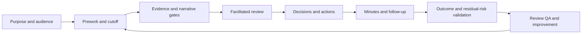

### Minimum review outputs

1. Shared period, scope, cutoff, and data-quality statement.
2. Outcome and material-change summary.
3. Technical evidence and uncertainty proportionate to the audience.
4. Prioritized risks and recommendations.
5. Explicit decisions, including deferment or accepted risk.
6. Actions with accountable owner, target, dependency, and validation.
7. Minutes, decision log, action register, and next checkpoint.
8. Evidence of what changed since the prior cycle and what remains open.

---

## 2. Purpose, audience, and cadence

The purpose should be written before the agenda. A strong purpose names the period, customer outcomes, decisions, and follow-through expected.

> **Purpose pattern:** `For <period and scope>, review material changes, health, support experience, risks and action progress; decide <specific choices>; confirm owners and validation for the next cycle.`

### Audience layers

| Audience | Primary questions | Useful content | Avoid |
|---|---|---|---|
| Customer executive sponsor | What changed, why does it matter, what decision is needed? | Outcomes, material risk, trend, options, owner/date, residual risk | Raw logs, unexplained acronyms, dozens of alerts |
| Customer technical owners | What evidence supports the conclusion and what must we do? | Scope, topology, versions, trends, applicability, prerequisites, tests | Unsupported certainty or vague action verbs |
| Lead TAM/account team | Is the account narrative coherent and aligned? | Customer goals, evidence quality, account context, escalation and value | Conflicting messages or unreviewed commitments |
| Support/SMEs | Are the technical claims accurate and bounded? | Exact source, condition, hypotheses, product scope, technical ask | Commercial/account assumptions outside scope |
| Action owners | What is expected, by when, and what proves completion? | Task, dependency, date, stop/escalation and validation | A slide reference with no controlled action record |

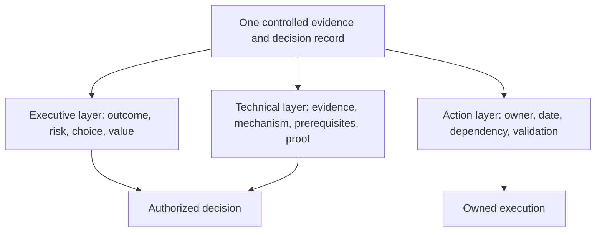

### Cadence design

Cadence is customer- and service-specific. Consider:

- Estate size and rate of change.
- Risk, incident, lifecycle, capacity, and project horizons.
- Contract/service scope and lead-TAM direction.
- Customer governance calendar, freezes, budgets, and time zones.
- Evidence refresh cycles and action lead time.
- Audience availability and decision latency.

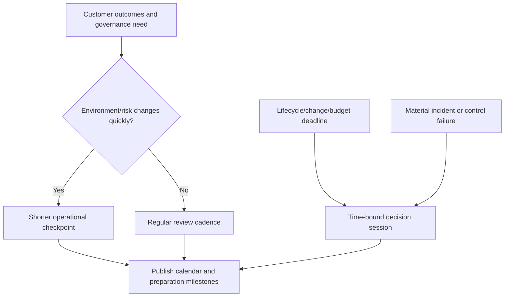

Do not represent monthly, quarterly, or annual timing as a universal NetApp rule. A quarterly review can coexist with weekly action checkpoints and event-driven decision sessions.

---

## 3. The recurring review lifecycle

### Plain-English deep-dive: one meeting is only the visible checkpoint

A restaurant's dining service is visible, but ordering, storage, preparation, safety checks, staffing, cleanup, and inventory control make it possible. The meeting is similarly the visible checkpoint in a longer lifecycle.

**Why it matters:** most review quality is determined before attendees join, and most value is created after they leave.

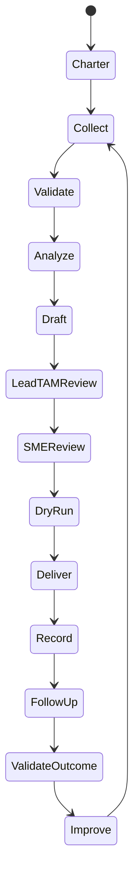

| Phase | Main question | Exit evidence |
|---|---|---|
| Charter | Why, for whom, and what decisions? | Purpose, audience, scope, agenda, cadence |
| Collect | Which current sources cover the period? | Source manifest and evidence requests |
| Validate | Is identity, freshness, completeness, access, and definition sound? | Quality results and visible limitations |
| Analyze | What changed and why does it matter? | Findings, risks, options, recommendations |
| Draft | What is the shortest coherent decision story? | Executive core plus technical appendix |
| Review | Are facts, wording, roles, and asks correct? | Lead-TAM/SME comments resolved |
| Dry run | Can the team deliver within time and handle challenge? | Timed rehearsal and role assignment |
| Deliver | What should attendees understand, decide, and own? | Decisions, actions, questions, parking lot |
| Record | What exactly was agreed or disputed? | Minutes, decision log, updated actions |
| Follow up | Are actions moving and blockers escalated? | Checkpoints and evidence |
| Validate | Did action change the intended outcome? | Before/after proof and residual risk |
| Improve | How will the next review be more useful? | QA score, feedback, improvement owner |

---

## 4. Prework, data cutoff, and quality gates

Prework begins from the decisions and audience, not from copying the prior deck.

### Prework sequence

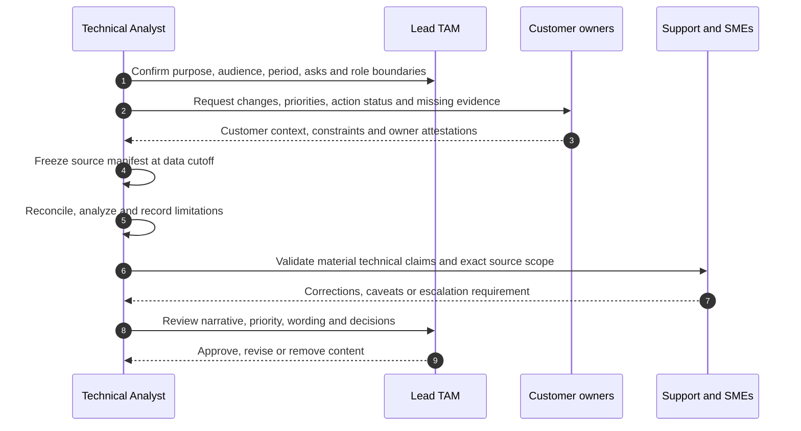

### Data cutoff record

| Field | Required content |
|---|---|
| Review period | Start/end and time zone |
| Source cutoff | Latest included observation/extract per source |
| Refresh completion | Run status, time, version, quality result |
| Scope | Customer, sites, services, assets, exclusions |
| Definitions | Metric/model versions and changed definitions |
| Missing/partial | Source gaps, affected conclusions, owner/date |
| Late changes | Events after cutoff and how they will be handled |

**Rule:** do not silently mix post-cutoff facts into selected visuals. Add a clearly timestamped late-breaking note, explain which conclusions it changes, and version the pack when necessary.

### Quality gates

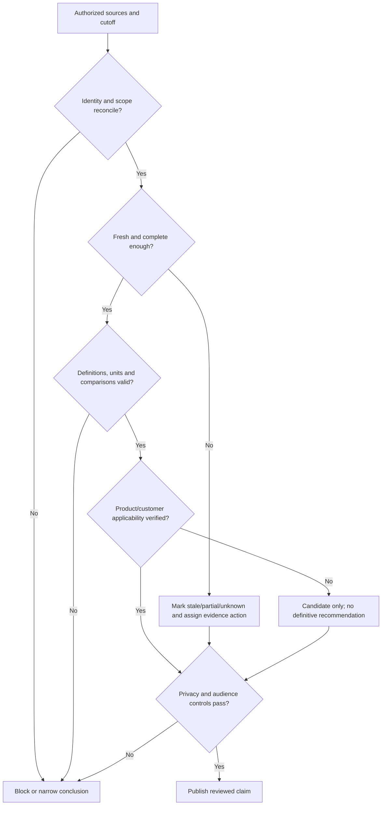

### Lead TAM review gate

The lead TAM review should check:

- Alignment with account goals and service scope.
- Priority and customer context.
- Accuracy of role ownership and escalation paths.
- Whether wording implies unsupported internal policy or commitment.
- Whether decision asks are realistic and assigned to authorized owners.
- Consistency across executive, technical, commercial, and support messages.
- Time, sensitivity, and likely objection handling.

The analyst can own preparation and sections while respecting lead-TAM accountability for the integrated account narrative.

---

## 5. The required content domains

An OSR should not mechanically include every available domain. Include what is material to the agreed purpose, show exclusions, and keep detailed evidence available.

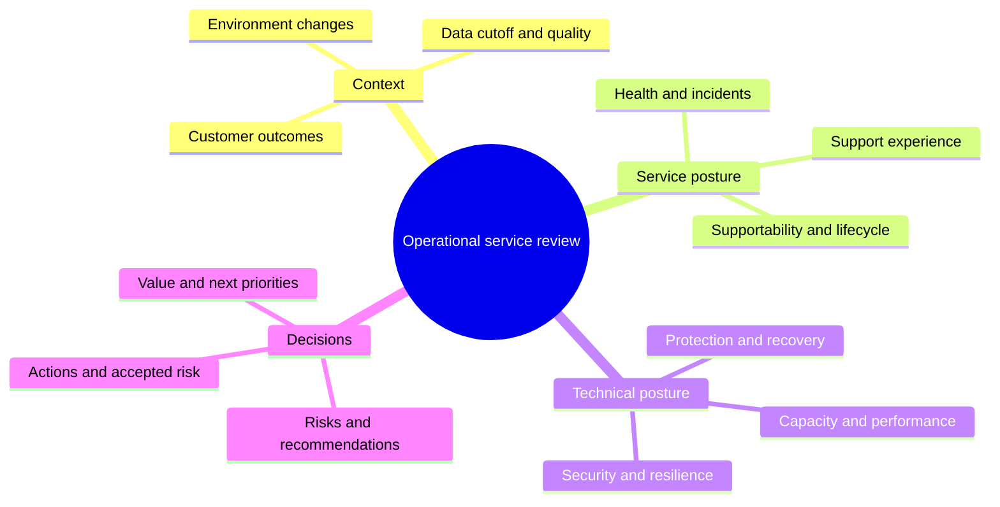

### Domain contract

| Domain | Questions | Evidence orientation | Decision/action orientation |
|---|---|---|---|
| Health | What is current, degraded, unknown, or changed? | Current scoped health/telemetry plus gaps | Restore evidence coverage or manage condition |
| Incidents/cases | What material events/themes occurred? | Impact, chronology, recurrence, cause confidence | Prevention, escalation-quality, or ownership action |
| Capacity | Is headroom aligned to demand and lead time? | Typed physical/logical trends and scenarios | Evidence, design, funding, or expansion decision |
| Performance | Are customer SLOs and baselines changing? | Comparable workloads, latency/throughput/IOPS and dependencies | Targeted test or supported remediation |
| Protection/recovery | Are RPO/RTO and restore controls proven? | Policy, job, replication, restore/DR evidence | Test, remediate, or accept residual risk |
| Supportability | Are exact combinations and prerequisites current? | IMT/HWU/release/host/application evidence | Hold, validate, upgrade, or exception path |
| Lifecycle | Is the horizon inside planning/procurement lead time? | Current official milestone and contract context | Roadmap, funding, migration, or monitoring |
| Risks | Which uncertain outcomes deserve attention? | Applicability, consequence, horizon, controls, confidence | Prioritize, gather evidence, mitigate, accept |
| Recommendations | What should be done and why? | Evidence-context-risk-options chain | Decision owner, action owner, milestone, proof |
| Actions | What progressed, aged, blocked, or validated? | Controlled action history and closure evidence | Replan, escalate, close, defer, accept |
| Value | What customer outcome moved? | Baseline, contribution, customer action, outcome | Continue, change, or stop service activity |

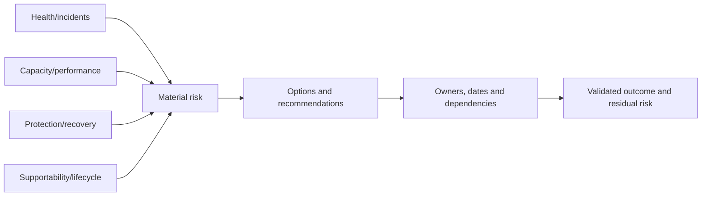

### Support-experience wording

Case counts alone do not show experience or product quality. Separate:

- Cases opened, severity, aging, recurrence, handoffs, reopen, and escalation.
- Current issue versus future risk.
- Proven common cause versus similar symptom/theme.
- Vendor, customer, partner, and multi-vendor dependencies.
- Acknowledgment, workaround, restoration, resolution, and prevention.

---

## 6. Narrative architecture and audience layers

### Plain-English deep-dive: headlines are road signs

A road sign says `Bridge closed: use Route 7`, not `Transportation update`. A slide title should similarly state the conclusion or decision, while the body supplies evidence.

**Why it matters:** stakeholders should understand the story from slide titles even before reading detail.

### Message-first storyline

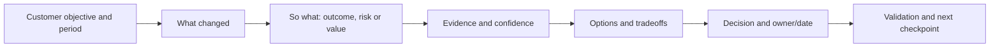

### Recommended review architecture

1. Purpose, scope, period, cutoff, quality, and decisions sought.
2. Executive summary: outcomes, material changes, top risks, actions, value.
3. Environment and priority changes.
4. Service health and support experience.
5. Capacity, performance, protection, supportability, and lifecycle as material.
6. Prioritized recommendations and options.
7. Decision requests and action register.
8. Next-period plan and value evidence.
9. Technical appendix, definitions, source register, and detailed exceptions.

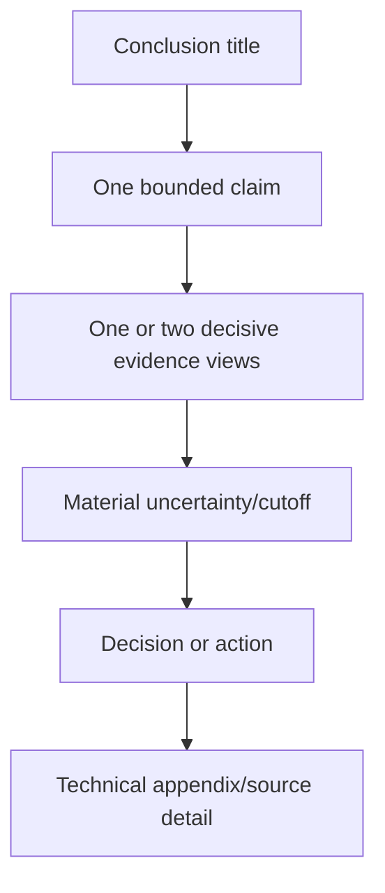

### Executive versus technical layers

| Element | Executive layer | Technical layer |
|---|---|---|
| Scope | Business service and material estate | Exact assets, versions, topology, source |
| Health | Outcome and material exception | States, events, evidence coverage |
| Risk | Consequence, horizon, options | Condition, trigger, controls, confidence |
| Recommendation | Choice, value, investment, owner/date | Applicability, prerequisites, test, recovery |
| Action | Decision and accountability | Tasks, dependencies, validation |
| Value | Outcome movement and remaining exposure | Before/after definitions and evidence |

Conciseness must not remove a caveat that could change the decision.

---

## 7. Agenda, facilitation, and meeting control

### Agenda contract

| Agenda field | Required question |
|---|---|
| Topic | What outcome does this item serve? |
| Presenter/facilitator | Who explains and who controls the discussion? |
| Timebox | How long is enough for the decision? |
| Mode | Inform, validate, discuss, or decide? |
| Pre-read | What must attendees review beforehand? |
| Decision | Who has authority and what choice is requested? |
| Output | Decision, action, evidence request, or parking-lot owner? |

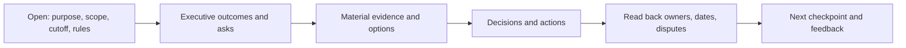

### Facilitation sequence

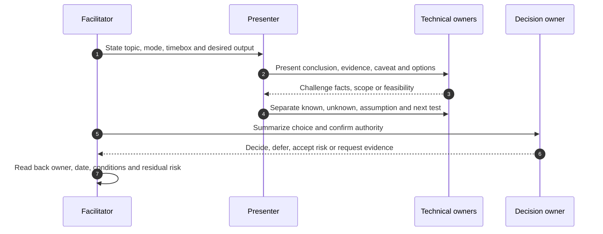

### Meeting-control techniques

- Begin with outcome and decision, not slide number.
- Name whether each item is `inform`, `validate`, `discuss`, or `decide`.
- Ask quiet technical owners directly for evidence or constraint input.
- Interrupt respectfully when discussion repeats or leaves scope.
- Separate a challenge to evidence from a challenge to priority.
- Keep a visible parking lot with owner and disposition.
- Read back decisions and actions before moving on.
- Preserve disagreement instead of forcing false consensus.
- End on time or explicitly renegotiate the remaining agenda.

### Parking-lot rules

A parking-lot item needs a statement, reason it is outside the current decision, owner, route, target, and whether it blocks anything. `Discuss later` is not an action.

---

## 8. Decisions, actions, minutes, and follow-up

### Decision states

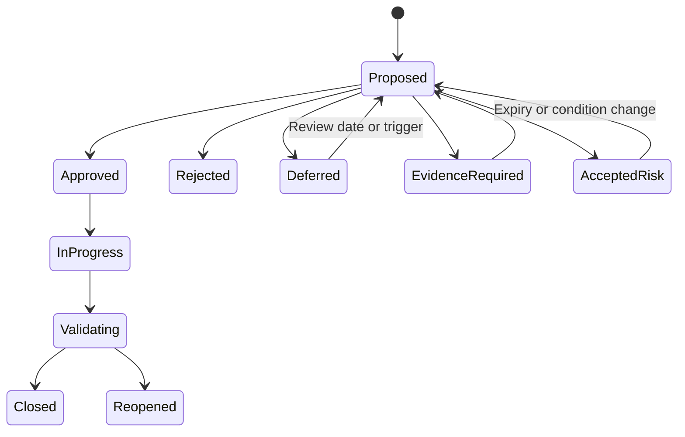

### Decision record

| Field | Required content |
|---|---|
| Decision | Exact choice and scope |
| Authority | Named accountable customer/role |
| Evidence | Sources, cutoff, confidence, contradictions |
| Options | Chosen and rejected paths with rationale |
| Conditions | Prerequisites, limits, stop/reopen triggers |
| Actions | Owners, milestones, dependencies |
| Residual risk | Remaining exposure, control, owner, expiry |

### Action record

An action should contain stable ID, statement, recommendation/risk link, accountable owner, contributors, target, latest safe start where relevant, status, blocker, dependency, evidence location, validation, residual risk, and last update.

### Minutes are not a transcript

Good minutes record:

- Meeting purpose, date/time/time zone, attendees, and absences.
- Period, cutoff, scope, and quality caveats.
- Decisions and exact rationale/conditions.
- Actions, owners, targets, blockers, and validation.
- Accepted/deferred risk and next review trigger.
- Disputed facts and evidence requests.
- Parking-lot items and routes.
- Next checkpoint and distribution controls.

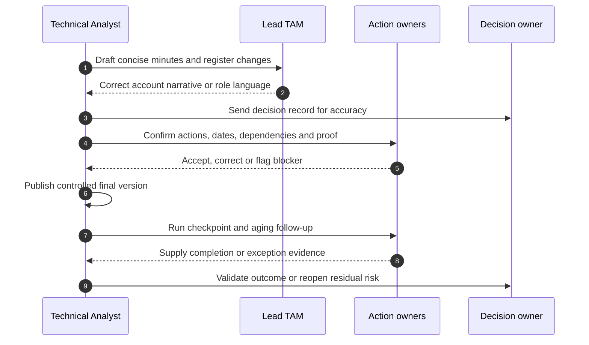

### Follow-up timing

Send the record promptly enough that memory and action remain current, but do not invent a universal hour-based SLA. Urgent decisions can require same-day confirmation; routine reviews follow the agreed governance.

---

## 9. Value, review QA, and continual improvement

### Plain-English deep-dive: activity is the receipt, value is the result

A gym can count visits and coaching sessions, but the customer cares about improved health and capability. Review count, slide count, and recommendation count are activities. Value requires evidence that a customer outcome or decision improved.

**Why it matters:** inflated value claims damage trust and can confuse contribution with causation.

### Value chain

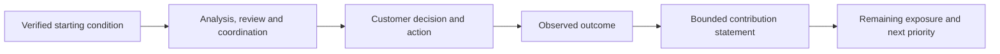

Examples of defensible value evidence:

- Asset/source gaps reconciled and maintained.
- A decision occurred before latest safe start.
- A supportability prerequisite was validated before change.
- A restore or resilience control was actually tested.
- An action moved from recommendation to validated outcome.
- A recurring handoff defect was measured and improved.

Do not claim an avoided outage without defensible counterfactual evidence. Prefer: `The review enabled earlier validation and preserved the planned decision window.`

### Review QA rubric

| Dimension | Pass question |
|---|---|
| Purpose | Did the review produce the intended decisions or evidence actions? |
| Evidence | Were source, cutoff, scope, quality, and uncertainty visible? |
| Narrative | Could attendees explain what changed, why, and what happens next? |
| Audience | Was detail appropriate without changing facts? |
| Facilitation | Were time, challenge, inclusion, and parking lot controlled? |
| Governance | Were decisions, owners, dates, accepted risk, and authority explicit? |
| Follow-through | Did actions progress to validation rather than acknowledgment? |
| Value | Were outcomes bounded and remaining risk visible? |

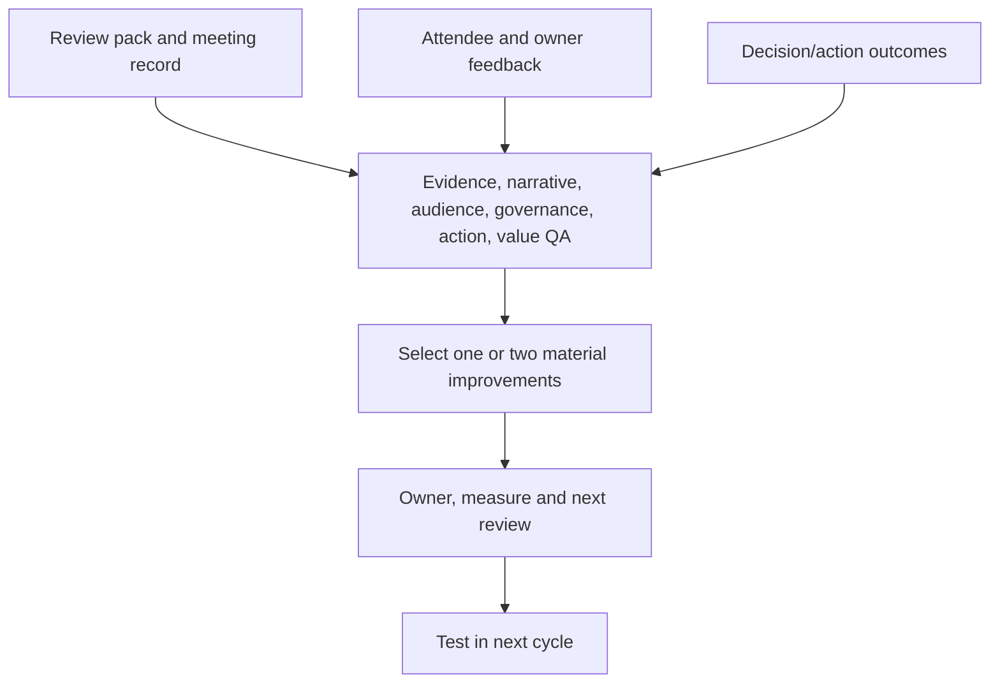

### Review anti-patterns

| Anti-pattern | Why it fails | Better practice |
|---|---|---|
| Copy last deck and refresh colors | Preserves stale priorities and definitions | Start from decisions, changes, and current source manifest |
| Show every alert | Noise hides material exposure | Validate, deduplicate, prioritize, and appendix detail |
| Hide missing data | Green can mean blind | Show stale/partial/unknown and evidence action |
| Read slides word for word | Uses meeting time without discussion | Pre-read detail; use meeting for decisions |
| Mix executive and raw technical detail | Neither audience can act efficiently | One record, layered views |
| Make unreviewed commitments | Violates role and account boundaries | Confirm with lead TAM and authorized owners |
| Owner = `team` | Nobody is accountable | Named controlled owner and contributors |
| Minutes = transcript | Decisions disappear in narrative | Decision/action-first record |
| Close on acknowledgment | No outcome proof | Validate intended technical/customer result |
| Claim loyalty from meeting sentiment | Manipulative and weakly evidenced | Build trust through accuracy, usefulness, and follow-through |

---

## 10. Fully synthetic sanitized scenario: HarborView Research quarterly review

> **Synthetic boundary:** `HarborView Research`, every service, system, metric, date, incident, risk, recommendation, owner, decision, and result is invented. The scenario does not represent a NetApp customer, internal process, tool output, contract, or Arti's production work.

### Purpose and scope

The fictional review covers `2026-04-01` through `2026-06-30` with a `2026-06-30 23:59 UTC` data cutoff. Its purpose is to decide whether to begin lifecycle discovery, approve a restore-validation workstream, and resolve two overdue evidence actions before a planned analytics expansion.

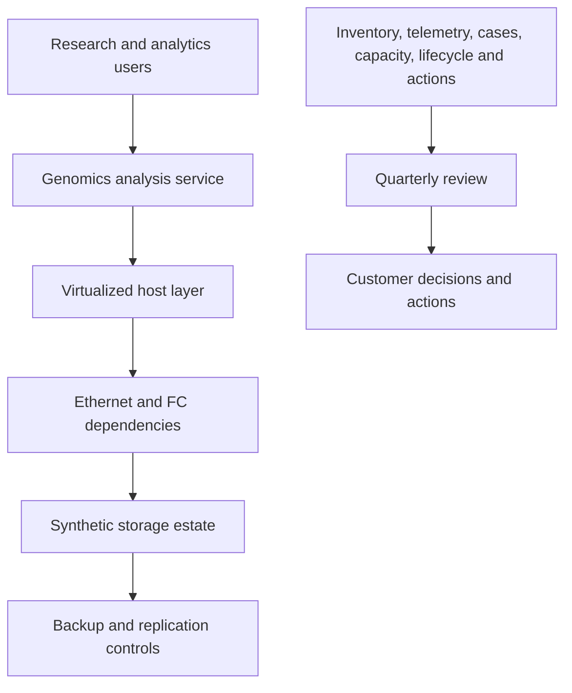

### Data-quality gate

| Source | Cutoff/quality | Permitted conclusion | Prohibited conclusion |
|---|---|---|---|
| Synthetic inventory | 20 assets; one owner missing | Ownership exception exists | Estate is complete forever |
| Telemetry-like table | One node stale for 11 days | Evidence coverage is stale | Node is unhealthy |
| Cases | 14 sanitized cases; two alias gaps | Handoff theme merits review | One product defect caused all cases |
| Capacity | 12 monthly physical snapshots | Base trend and scenarios | Guaranteed date-to-full |
| Restore records | Last controlled test 15 months ago | Current proof is absent | Backups cannot restore |
| Lifecycle placeholder | Public-source field missing exact platform confirmation | Evidence work is required | A vendor date applies |

### Executive narrative

> `The quarter remained operationally stable in the synthetic record, but three decisions need attention: restore evidence is older than the agreed review cadence; one node's remote telemetry is stale; and lifecycle planning lead time may consume the apparent horizon. We request approval for restore validation and lifecycle discovery, plus named ownership for telemetry repair. No current outage, unsupported configuration, or avoided incident is asserted.`

### Review flow and decisions

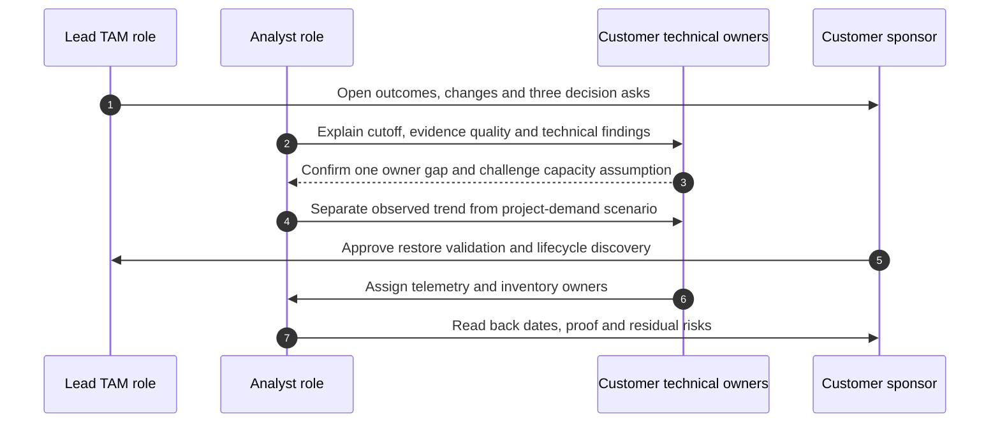

| Decision/action | Owner | Target | Validation | Residual risk |
|---|---|---|---|---|
| Approve controlled restore validation | Backup and application owners | 2026-07-24 | Restore result compared with customer RPO/RTO definition | One test does not cover every scenario |
| Begin lifecycle discovery, not purchase | Infrastructure architecture owner | 2026-08-07 | Exact inventory and current official milestones documented | Funding and application certification remain unknown |
| Repair telemetry evidence path | Storage/network owner | 2026-07-10 | New generation, delivery, receipt, association, freshness evidence | Future delivery failure remains possible |
| Assign missing asset owner | Customer asset steward | 2026-07-08 | Controlled inventory updated and reviewed | Future changes can reintroduce drift |
| Validate analytics-growth input | Application/capacity owners | 2026-07-17 | Low/base/high demand range approved | Demand and efficiency can change |

### Follow-up results

- Telemetry receipt becomes current; no retrospective health claim is made for the blind interval.
- The restore completes but exceeds the fictional RTO, opening a new performance/recovery action.
- Lifecycle discovery confirms the need for planning, but no platform purchase is selected.
- Capacity high scenario moves the latest safe start forward; the forecast remains a range.
- The action register records owner/date/proof and preserves the new residual risks.

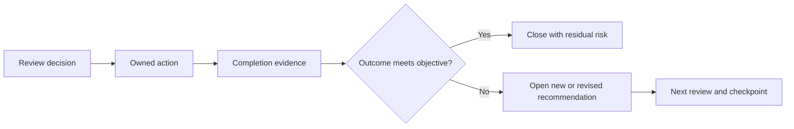

### What this scenario proves and does not prove

It proves the ability to structure a synthetic review method. It does **not** prove NetApp tool access, ONTAP expertise, a customer result, an internal review process, or production review leadership.

---

## 11. Discovery, evidence, risks, actions, and validation

### Discovery questions

1. What purpose, period, cadence, audience, scope, and decisions define success?
2. Which business services, technical domains, changes, incidents, projects, and constraints matter?
3. What source, owner, definition, cutoff, freshness, coverage, and access apply?
4. What changed since the prior review, and which comparisons remain valid?
5. Which claims require lead-TAM, Support, SME, customer, commercial, or legal review?
6. Which findings are current issues, risks, unknowns, or not applicable?
7. What options, dependencies, decision authorities, and time horizons exist?
8. What action, owner, date, validation, residual risk, and next checkpoint are required?

### Evidence-to-outcome contract

```mermaid
flowchart LR
    DISC[Discovery and review purpose] --> EVID[Authorized evidence and cutoff]
    EVID --> FIND[Finding, confidence and contradiction]
    FIND --> RISK[Customer risk/value implication]
    RISK --> REC[Options and recommendation]
    REC --> DEC[Decision and authority]
    DEC --> ACT[Action, owner, date, dependency]
    ACT --> VALID[Outcome proof and residual risk]
```

### Risk register for the review process itself

| Review-process risk | Control | Validation |
|---|---|---|
| Stale or mixed-cutoff evidence | Source manifest and publication gate | Reproduce all cutoff labels |
| Technical overclaim | SME/lead-TAM review and bounded wording | Trace claim to source and scope |
| Sensitive data overshared | Audience-specific view and distribution check | Privacy reviewer/sample export |
| Missing decision authority | Stakeholder/RACI check before agenda | Named attendee/delegate confirmed |
| Action ambiguity | Controlled action schema and read-back | Owner accepts statement/date/proof |
| No follow-through | Scheduled checkpoints and aging | Movement or explicit escalation |
| Inflated value | Baseline and contribution caveat | Outcome evidence and counterfactual caution |

---

## 12. Arti's factual bridge and JD Mapping

```mermaid
flowchart LR
    MS[Microsoft support and CRITSIT] --> IMP[Impact, evidence, cadence, ownership]
    REV[Business reviews and executive communication] --> STORY[Audience narrative and facilitation]
    BI[Excel, Power BI and MBA analytics] --> DATA[Cutoff, trends, QA and uncertainty]
    ENG[Product and Engineering collaboration] --> REVIEW[Technical review and exact asks]
    IMP --> TAM[Transferable OSR method]
    STORY --> TAM
    DATA --> TAM
    REVIEW --> TAM
    TAM --> GAP[Production NetApp review remains unproven]
```

### Factual tie

| Arti's factual evidence | Natural transfer | Boundary |
|---|---|---|
| Microsoft enterprise support and CRITSITs | Impact-first updates, evidence, owner/checkpoint discipline | Not NetApp account or incident authority |
| Customer/business reviews | Audience calibration and outcome narrative | Not proof of NetApp OSR delivery |
| CSAT, backlog, case quality and trends | Service-experience analysis and QA | Not NetApp case or Digital Advisor data |
| Excel, Power BI, SQL, Python, statistics, MBA | Data cutoff, models, visuals, uncertainty | No live NetApp dataset/report ownership |
| Product/Engineering collaboration | Technical review, escalation and defect-language discipline | No private NetApp defect access |
| Mentoring and 100+ recognitions | Facilitation, trust and reusable quality practices | Recognition is corroboration, not storage expertise |

### JD Mapping

| JD responsibility | Part 61 capability | Honest evidence boundary |
|---|---|---|
| Conduct operational service reviews | Complete charter-to-follow-up lifecycle | Synthetic method only |
| Analyze/report customer data | Cutoff, quality gates, narrative and layers | Analytics experience factual; NetApp sources gated |
| Understand customer environment | Environment/change/service framing | Must discover and validate live context |
| Mitigate risk and improve stability | Evidence-risk-recommendation-decision chain | No production NetApp remediation authority |
| Track preventative remediation | Action schema, aging, validation and reopen | Customer/action owners retain execution |
| Improve recommendations | Lead-TAM/SME review and QA rubric | No internal NetApp workflow claimed |
| Communicate under lead TAM guidance | Role-aware preparation, delivery and read-back | Lead TAM owns integrated narrative |
| Work across time zones | Explicit time zones, pre-read, handoff and checkpoints | No unlimited-availability promise |
| Demonstrate value and loyalty | Outcome evidence and trust through follow-through | No causal renewal or loyalty claim |

### Honest interview statement

> `I have prepared and delivered customer and business reviews in Microsoft support contexts, but I have not run a NetApp operational service review. My approach would be to agree purpose, audience, cadence and decisions; set a controlled cutoff; validate health, incident, capacity, performance, protection, supportability, lifecycle and action evidence; review material claims with the lead TAM and SMEs; deliver layered executive and technical narratives; and close the loop through decisions, owners, minutes, validation and residual risk.`

---

## 13. Role plays, paper lab, and self-test

### Role play 1: executive challenge

The sponsor asks: `Why are we discussing risk when there was no outage?`

Respond in 60 seconds using shared objective, verified condition, time horizon, controls, options, decision, and no fear language.

### Role play 2: technical challenge

The storage owner disputes a capacity chart because a project changed the workload. Acknowledge the correction, separate observed from scenario data, state what changes, assign evidence, and avoid defending the slide.

### Role play 3: agenda control

A valid incident discussion consumes the lifecycle-decision timebox. Summarize, park with owner/route, check whether it blocks today's decision, and renegotiate time with the decision owner.

### Paper lab: build a synthetic quarterly review

```mermaid
flowchart LR
    CHARTER[Purpose, audience, cadence and decisions] --> CUT[Source manifest and cutoff]
    CUT --> QA[Quality, privacy and applicability gates]
    QA --> STORY[Executive core and technical appendix]
    STORY --> DRY[Lead-TAM/SME review and dry run]
    DRY --> MEET[Facilitated mock meeting]
    MEET --> RECORD[Minutes, decisions and actions]
    RECORD --> FOLLOW[Follow-up, validation and review QA]
```

Create synthetic evidence for health, three incidents, capacity/performance, protection, lifecycle/supportability, six risks, eight recommendations, and twelve actions. Inject:

- One stale source and one mixed cutoff.
- One chart whose denominator changed.
- One similar-case theme without common cause.
- One access-gated compatibility unknown.
- One recommendation with no decision authority present.
- One overloaded action owner.
- One disputed priority.
- One accepted risk past expiry.
- One late-breaking event after cutoff.
- One value claim that wrongly says an outage was prevented.

### Lab tasks

1. Write purpose, audience map, cadence, agenda modes, and decision asks.
2. Create source/cutoff/quality/privacy records.
3. Build executive and technical versions from one controlled record.
4. Produce at least one architecture, trend, risk, and action view.
5. Run lead-TAM and SME review role plays.
6. Facilitate a 45-minute mock review with parking lot and read-back.
7. Produce minutes, decision log, action register, and follow-up plan.
8. Validate two actions and reopen one failed outcome.
9. Score review QA and assign one improvement.
10. Answer Q1-Q8 aloud.

### Self-test

1. Define an OSR and explain why it is a lifecycle.
2. Write purpose and choose cadence without claiming a fixed rule.
3. Distinguish executive, technical, action, and account-team audiences.
4. Build prework, cutoff, and quality gates.
5. Explain lead-TAM and SME review boundaries.
6. Cover all health, incident, capacity, performance, protection, supportability, lifecycle, risk, recommendation, action, and value domains.
7. Build a conclusion-led narrative and layered pack.
8. Facilitate agenda modes, challenge, parking lot, and decision read-back.
9. Write decisions, actions, minutes, and accepted-risk records.
10. Validate follow-up outcomes and residual risk.
11. Measure value without causal overclaim.
12. Recreate HarborView and state Arti's exact nonclaim.

### Lab pass checklist

- [ ] Purpose, audience, cadence, scope, cutoff, and decisions are explicit.
- [ ] Every source has owner, date, definition, quality, and access state.
- [ ] Lead-TAM and SME review resolve material claims and role language.
- [ ] Health, incidents, capacity, performance, protection, supportability, lifecycle, risks, recommendations, actions, and value are covered as material.
- [ ] Executive and technical layers share the same facts and certainty.
- [ ] Agenda, timeboxes, parking lot, decisions, and read-back are controlled.
- [ ] Minutes contain decisions/actions rather than a transcript.
- [ ] Follow-up validates outcomes and records residual risk.
- [ ] Review QA produces a measurable improvement action.
- [ ] All evidence is synthetic and sanitized.
- [ ] No production NetApp process, result, commitment, or experience is claimed.

---

## 14. Official and Public Source Anchors

**Date checked: 2026-08-24.** The supplied NetApp TAM Technical Analyst job description, summarized in the master guide's JD coverage matrix, is the primary source for role responsibilities. Public sources below provide bounded service, product-evidence, and governance context; they do not define an internal NetApp OSR process or customer entitlement.

| Topic | Official/public source | Bounded use |
|---|---|---|
| NetApp support context | [NetApp Support Services](https://www.netapp.com/services/support/) | Public support-service context; exact purchased service and roles require contract/account confirmation |
| Digital Advisor | [NetApp Digital Advisor documentation](https://docs.netapp.com/us-en/active-iq/) | Public feature/evidence orientation; customer data and access are gated |
| Digital Advisor risks/actions | [View risks and take corrective actions](https://docs.netapp.com/us-en/active-iq/task_view_risk_and_take_action.html) | Public workflow orientation; not customer applicability or change authority |
| AutoSupport | [Learn about ONTAP AutoSupport](https://docs.netapp.com/us-en/ontap/system-admin/manage-autosupport-concept.html) | Evidence-source concept; no customer payload represented |
| ONTAP release support | [ONTAP release support](https://docs.netapp.com/us-en/ontap/release-notes/release-support-reference.html) | Current release-support context; exact estate still requires verification |
| Continual improvement | [ITIL information from PeopleCert](https://www.peoplecert.org/browse-certifications/it-governance-and-service-management/ITIL-1) | Official ITIL owner context for service management/continual improvement; no NetApp process inferred |
| Project governance | [What is project management? - PMI](https://www.pmi.org/about/learn-about-pmi/what-is-project-management) | General objective, planning, execution and closure orientation |

### Source-use discipline

- Record source, scope, publication/update/evidence date, access class, cutoff, and reviewer.
- Recheck exact product, release, supportability, advisory, lifecycle, and customer evidence before the review and before action.
- Treat public documentation as concept/product context, not a live customer result.
- Do not expose gated cases, bugs, contracts, topology, telemetry, or names in broadly distributed packs.
- Do not infer a NetApp internal process, service promise, cadence, health score, or customer outcome from this teaching model.

---

## Likely Interview Questions

### Q1. How would you design an operational service review?

> **Model answer:** `I start with purpose, audience, period, scope, cadence and exact decisions. I set a source cutoff, validate identity/freshness/definitions/applicability/privacy, then build one controlled narrative with executive and technical layers. After lead-TAM and SME review, I facilitate decisions, record owners/dates/conditions, and follow every action through outcome and residual-risk validation.`

### Q2. What belongs in the review?

> **Model answer:** `Only material content for the agreed purpose: customer and environment changes; health and incidents; support experience; capacity, performance and protection; supportability and lifecycle; prioritized risks and recommendations; action progress; decisions; value evidence; uncertainty and next priorities. Detailed evidence stays in a technical appendix.`

### Q3. Why are the data cutoff and quality gates important?

> **Model answer:** `They make every claim reproducible and prevent mixed periods, stale telemetry, bad identities, changed definitions, incomplete populations or sensitive data from driving a decision. Missing or post-cutoff evidence is visible and either narrows the conclusion, creates an evidence action, or versions the pack.`

### Q4. How do you serve executive and technical audiences in one review?

> **Model answer:** `I use one controlled evidence and decision record. Executives receive outcome, material exposure, options, decision, owner and timing. Technical owners receive exact scope, evidence, mechanism, applicability, prerequisites, tests and validation. I change depth, never facts or certainty.`

### Q5. How do you control a difficult meeting?

> **Model answer:** `I state each item's mode and desired output, use timeboxes, isolate evidence versus priority disagreement, invite accountable owners, maintain a visible parking lot, and ask the authorized owner for a decision. Before moving on, I read back the decision, owner, date, conditions, evidence gap and residual risk.`

### Q6. What happens after the meeting?

> **Model answer:** `I produce concise controlled minutes, update decision and action registers, confirm owners/dates/dependencies/proof, and schedule checkpoints. Implementation does not close the item; I validate the technical and customer outcome, record residual risk, and reopen when evidence or results fail.`

### Q7. How do you demonstrate value without overclaiming?

> **Model answer:** `I establish a baseline, show the service activity and customer decision/action, then measure the resulting outcome with attribution caution. I can state that the review enabled earlier supportability evidence or action closure; I would not claim an avoided outage or renewal causation without defensible counterfactual evidence.`

### Q8. How does your background transfer, and what remains a gap?

> **Model answer:** `Microsoft enterprise support, CRITSITs, business reviews, analytics, executive communication and Product/Engineering coordination give me evidence, audience, facilitation and action discipline. I have not delivered a production NetApp OSR, so live NetApp sources, account narrative, service scope and commitments require lead-TAM and authorized-owner review.`

---

## 30-Second Memory Hooks

- **OSR:** A recurring decision-and-follow-through loop, not a deck recital.
- **Purpose first:** Know the decisions before collecting slides.
- **Audience:** One evidence record, several depths, unchanged certainty.
- **Cadence:** Match change, risk, lead time and governance; never invent a fixed rule.
- **Cutoff:** Close the evidence period before approving the story.
- **Quality gate:** Identity, freshness, definition, applicability, privacy.
- **Lead TAM:** Integrated account narrative and governance owner.
- **Narrative:** What changed -> so what -> evidence -> choice -> owner -> proof.
- **Agenda mode:** Inform, validate, discuss, or decide.
- **Parking lot:** Valid topic with owner and route, not a discussion graveyard.
- **Decision:** Choice + authority + evidence + conditions + residual risk.
- **Action:** Owner + date + dependency + proof.
- **Minutes:** Shared decision receipt, not transcript.
- **Value:** Outcome movement with attribution caution, not meeting count.
- **Closure:** Validated result and residual risk, not acknowledgment.
- **Arti's bridge:** Microsoft review discipline transfers; NetApp OSR experience does not.

---

## Completion Checklist

- [ ] Define OSR purpose, audience, cadence, scope, period and decision asks.
- [ ] Explain the complete recurring lifecycle from charter through improvement.
- [ ] Build prework, source manifest, cutoff and quality/privacy gates.
- [ ] Describe lead-TAM and SME review without inventing internal process.
- [ ] Cover health, incidents, support experience, capacity, performance, protection, supportability, lifecycle, risks, recommendations, actions and value.
- [ ] Create conclusion-led executive and technical layers from one record.
- [ ] Build agenda modes, timeboxes, facilitation, parking lot and read-back.
- [ ] Write decision, action, minutes, accepted-risk and follow-up records.
- [ ] Validate technical/customer outcomes and residual risk before closure.
- [ ] Apply review QA and continual improvement.
- [ ] Recreate the fully synthetic HarborView scenario and paper lab.
- [ ] Explain every anti-pattern and its better practice.
- [ ] Answer Q1-Q8 aloud.
- [ ] State the privacy, synthetic-evidence and No-production-NetApp boundaries exactly.
- [ ] Recheck current authoritative sources at review and action time.

---

*Next suggested section:* [Part 62 - Customer Discovery, Environment Profiling, and Technical Questioning](Part-62-customer-discovery-environment-profiling.md)