# Part 62 - Customer Discovery, Environment Profiling, and Technical Questioning

> **Section goal:** Learn a customer environment without guessing, interrogating, or reducing it to a product inventory. By the end, Arti should be able to plan and facilitate respectful discovery; use open, closed, and funnel questions; profile business services, critical data, objectives, workloads, topology, protocols, versions, changes, incidents, support models, vendors, constraints, pain, risk, stakeholders, and evidence; and manage assumptions, unknowns, and contradictions through owned validation.

Covers index item **62** and maps directly to job-description responsibilities for understanding customer environments, generating and analyzing customer data, identifying technical risk, improving support experience, preparing service reviews, advising under lead-TAM guidance, coordinating cross-functional stakeholders, and applying communication and technical questioning skills.

**Explicit nonclaim:** Arti has not conducted discovery for a production NetApp account, certified a live storage topology, or validated a customer's NetApp environment profile.

**Privacy and access boundary:** Discovery can expose business-critical services, data classification, network/storage topology, addresses, identities, versions, vulnerabilities, incidents, recovery posture, contracts, suppliers, owners, maintenance windows, and operational weaknesses. Collect only what serves an agreed purpose through authorized participants and systems; classify, redact, retain, share, and dispose of it according to customer and organizational policy.

**Synthetic-evidence rule:** Every customer, service, dataset, SLA, SLO, RPO, RTO, workload, topology, protocol, version, incident, vendor, constraint, metric, finding, risk, recommendation, action, and outcome below is fictional and sanitized. No table is a real customer, AutoSupport, Digital Advisor, ONTAP, IMT, HWU, case, contract, or account record.

**Version and current-source caveat:** Product features, protocol behavior, releases, compatibility, lifecycle, support offerings, documentation, and customer environments change. A **current-source check** means recording the exact product/release/configuration and reopening current authoritative documentation or authorized tool evidence before drawing a technical conclusion.

This Part is a transferable discovery model, not a NetApp internal questionnaire, required workshop agenda, service entitlement, audit, security assessment, architecture approval, or permission to inspect production systems. The lead TAM, customer owners, contract, data owners, and security/privacy authorities define actual scope and access.

> **No-production-NetApp boundary:** Arti's factual strengths are Microsoft enterprise and partner support, SharePoint/OneDrive/Microsoft 365 data services, CRITSIT discovery, Azure, Windows networking, Active Directory, virtual-machine and storage fundamentals, customer communication, analytics, and Product/Engineering coordination. She does **not** claim production ONTAP, NAS, SAN, NetApp telemetry, IMT, HWU, or account discovery experience. Her exact non-claim is: **she has not discovered, mapped, validated, or approved a production NetApp customer environment.**

---

## 1. Discovery is a joint model-building exercise

**Customer discovery** is the structured work of learning what the customer is trying to achieve, what exists, how it is connected and operated, what evidence supports that view, what is uncertain, and which decisions or risks require attention.

### Plain-English deep-dive: detective interview versus joint map-making

An interrogation tries to extract admissions from a guarded person. Joint map-making puts knowledgeable people around a blank map and asks each to add routes, hazards, missing bridges, and destinations. Technical discovery should feel like the second.

**Why it matters:** respect improves evidence quality. People disclose uncertainty and operational reality when questions have a clear purpose and do not imply blame.

| Term | Plain meaning | Analogy | Why it matters |
|---|---|---|---|
| **Discovery** | Learn goals, environment, evidence, constraints, and unknowns | Joint map-making | Prevents generic advice |
| **Environment profile** | Dated structured description of business and technical context | Patient chart | Maintains context across reviews and incidents |
| **Topology** | Components and relationships, including direction and failure domains | Transit map | Shows dependencies a list cannot |
| **Workload** | Application activity and resource demand over time | Traffic pattern | Determines performance, capacity, and protection needs |
| **Constraint** | Condition limiting feasible options | Bridge height limit | Shapes recommendations and sequence |
| **Assumption** | Belief temporarily used without proof | Pencil note on a map | Must be owned and tested |
| **Unknown** | Important fact not yet known | Unmapped road | Is not equivalent to healthy or absent |
| **Contradiction** | Sources or stakeholders disagree | Two maps showing different bridges | Requires evidence, not majority vote |
| **Evidence request** | Specific authorized ask for a fact or artifact | Request for a survey record | Makes validation actionable |

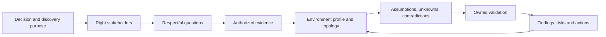

### Discovery principles

1. Explain why each information category matters.
2. Begin with outcomes and services, not product commands.
3. Ask the broad question before testing a narrow hypothesis.
4. Separate fact, interpretation, preference, and constraint.
5. Treat diagrams and exports as evidence with dates, not eternal truth.
6. Make unknowns safe to state and useful to resolve.
7. Confirm what will be stored, shared, and redacted.
8. Return a useful validated profile to the customer.

---

## 2. Open, closed, and funnel questions

### Question types

| Type | Purpose | Example | Risk if misused |
|---|---|---|---|
| **Open** | Discover context and language | `Walk me through what happens when the imaging service is unavailable.` | Can wander without structure |
| **Probing** | Explore one important answer | `Which dependency delayed restoration?` | Can feel accusatory without rationale |
| **Clarifying** | Resolve meaning | `When you say storage, do you mean the array, file service, or whole data path?` | Can expose jargon mismatch; that is useful |
| **Closed** | Confirm a bounded fact | `Is the recorded RTO four hours?` | Leading confirmation bias if asked too early |
| **Scaling/ranking** | Compare importance under defined anchors | `Which three services lose the most value after two hours?` | False precision or politics |
| **Counterfactual** | Explore consequence or dependency | `If this site were unavailable, which service could still operate?` | Hypothetical answer needs test evidence |
| **Evidence-seeking** | Identify proof | `Which record shows the last restore met the objective?` | Must respect access and privacy |

### Plain-English deep-dive: the question funnel

A camera begins with a wide scene, then zooms toward the subject, and finally focuses sharply. A question funnel does the same: broad context, narrower mechanism, exact confirmation, and evidence.

**Why it matters:** starting with `Is firmware X the problem?` can lock everyone into the analyst's first theory and hide a more important service or dependency issue.

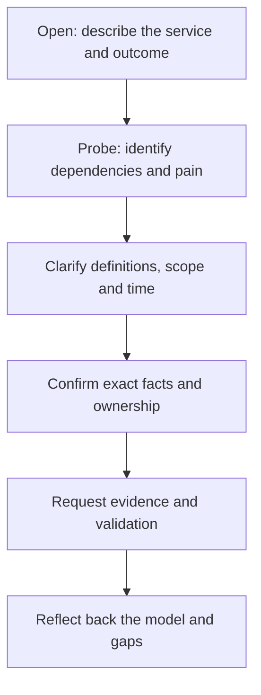

### Funnel example

1. `What outcome matters most for this service?`
2. `What technical path delivers that outcome?`
3. `Where have you seen delay or fragility?`
4. `Which users, sites, and periods are affected?`
5. `Was the last event on 2026-07-10?`
6. `Which timeline, logs, or case record can validate that?`
7. `Have I understood correctly that the symptom is current but the cause remains unknown?`

### Avoid leading and compound questions

Weak: `The unsupported old switch probably caused the outage and delayed the upgrade, right?`

Better sequence:

- `What was the observed failure and scope?`
- `Which components were on the affected path?`
- `What evidence tests the switch hypothesis?`
- `Separately, what currently supports the switch's supportability state?`

---

## 3. Business services, critical data, and objectives

Start with the business service because technical priority depends on what the technology enables.

### Service profile

| Field | Discovery questions |
|---|---|
| Service/outcome | What does the service let customers or employees accomplish? |
| Users and sites | Who depends on it, where, and at what times? |
| Critical data | Which records are essential, sensitive, regulated, or irreplaceable? |
| Criticality | Which consequence grows with duration, scope, or data loss? |
| Service owner | Who defines outcome and accepts business risk? |
| Technical owner | Who operates each dependency? |
| Peak/batch | Which business cycles change demand? |
| Degraded mode | What can continue when a dependency fails? |
| Recovery | What order and validation restore useful service? |

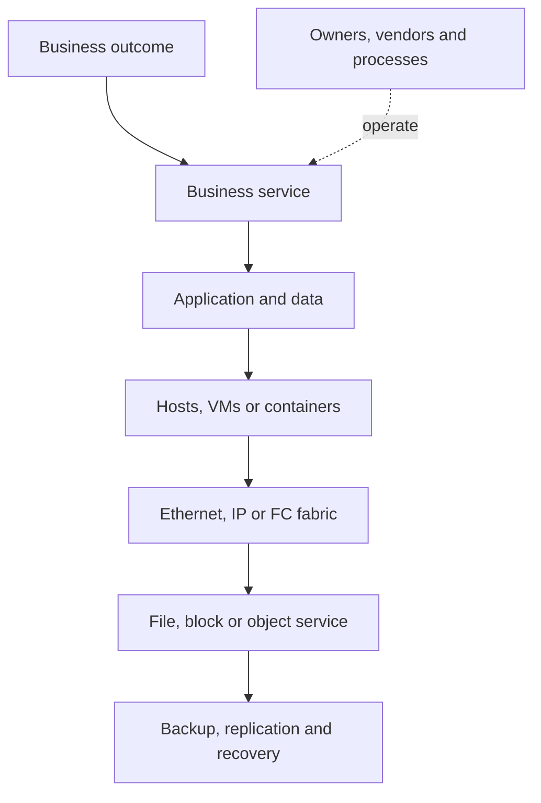

### Plain-English deep-dive: SLA, SLO, RPO, and RTO are different promises

- **Service-level agreement (SLA)** - a formal agreement describing service commitments and consequences. **Analogy:** a delivery contract. **Why it matters:** it defines an agreed boundary, not every engineering goal.
- **Service-level objective (SLO)** - a measurable reliability/performance target for a service. **Analogy:** the dispatch target used to meet the contract. **Why it matters:** technical evidence should relate to the customer's objective.
- **Recovery point objective (RPO)** - maximum targeted data-loss period after disruption. **Analogy:** how many pages of recent work may need re-entry. **Why it matters:** it drives protection frequency and design.
- **Recovery time objective (RTO)** - targeted duration to restore useful service. **Analogy:** how long the shop can remain closed. **Why it matters:** it drives recovery sequence, capability, and tests.

These are objectives, not proof. Actual recovery-point and recovery-time results require test or incident evidence.

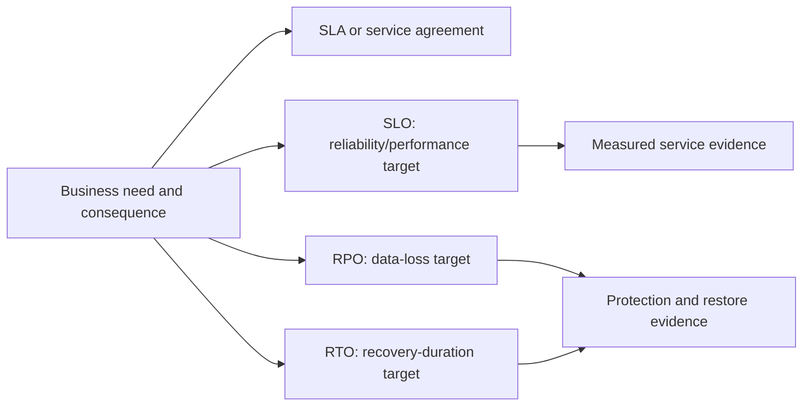

### Critical-data questions

- What data must be available, correct, confidential, retained, and recoverable?
- Where is the authoritative copy and what replicas/caches exist?
- Which applications coordinate writes or require consistency?
- Which legal, privacy, sovereignty, retention, or deletion rules apply?
- Who can validate a restored dataset or application transaction?
- Which encryption/key/identity dependency can block recovery?

Do not ask for sensitive content when metadata, classification, owner attestation, or approved evidence can answer the question.

---

## 4. Workloads, topology, protocols, and versions

### Workload fingerprint

| Dimension | Examples | Why it matters |
|---|---|---|
| Access model | File, block, object | Ownership, protocol and consistency |
| Read/write mix | Read-heavy, write-heavy, mixed | Cache/media/protection behavior |
| I/O size/pattern | Small/large, random/sequential | IOPS/throughput relationship |
| Concurrency | Sessions, threads, hosts, queues | Saturation and scaling |
| Timing | Peak, batch, backup, month-end, seasonal | Comparable baselines and windows |
| Growth/churn | Ingest, delete, Snapshot/retention | Capacity and efficiency |
| Data temperature | Hot, warm, cold | Tiering and performance fit |
| Availability | Active/standby, scale-out, single dependency | Failure and maintenance impact |
| Protection | RPO/RTO, backup, replication, restore | Recoverability and bandwidth |

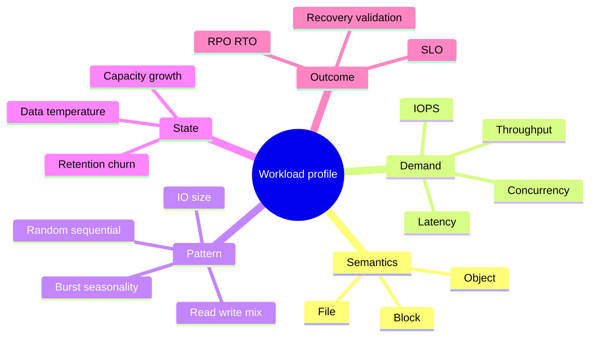

### Topology dimensions

Profile:

- Users/sites and client networks.
- Applications, middleware, databases, and data services.
- Physical hosts, virtual machines, hypervisors, or containers.
- Ethernet/IP/VLAN/DNS/firewall/proxy/load balancer dependencies.
- Fibre Channel fabrics, switches, zones, initiators, targets, and paths.
- NFS, SMB, iSCSI, FC, NVMe, or S3 protocols and security/identity.
- Storage clusters/nodes/SVMs/LIFs/volumes/LUNs/buckets at appropriate scope.
- Backup, replication, archive, DR, monitoring, management, and key services.
- Failure domains, alternate paths, owner boundaries, and shared dependencies.

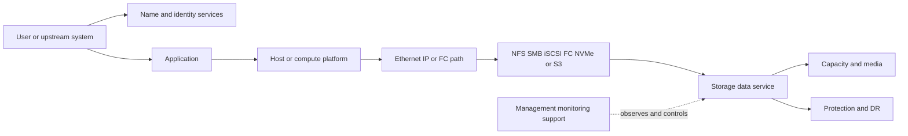

### Version inventory

Record exact product/release, platform, host OS/hypervisor, adapter, driver, firmware, switch OS, multipath, protocol/dialect, application/plugin, protection integration, and evidence date. Friendly labels such as `latest`, `current`, `old`, or `supported` are not sufficient.

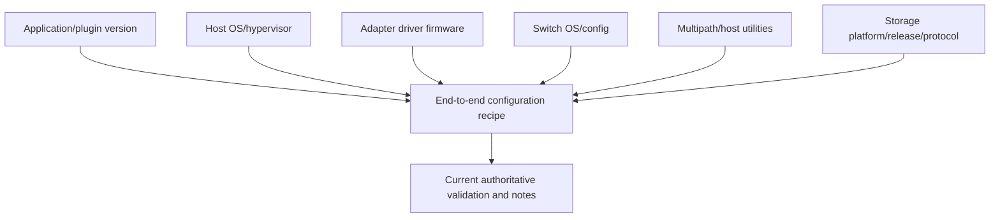

**Boundary:** runtime operation does not prove supportability, and a listed combination does not guarantee fault-free operation.

---

## 5. Change calendar, incidents, pain, constraints, and risk

### Change calendar

Ask about:

- Approved changes, projects, migrations, expansions, and decommissions.
- Freeze periods, peak seasons, fiscal/procurement cycles, and staff availability.
- Application, host, network, security, backup, cloud, and vendor changes.
- Test, rollback/forward-recovery, and validation windows.
- Changes completed but missing inventory/topology updates.

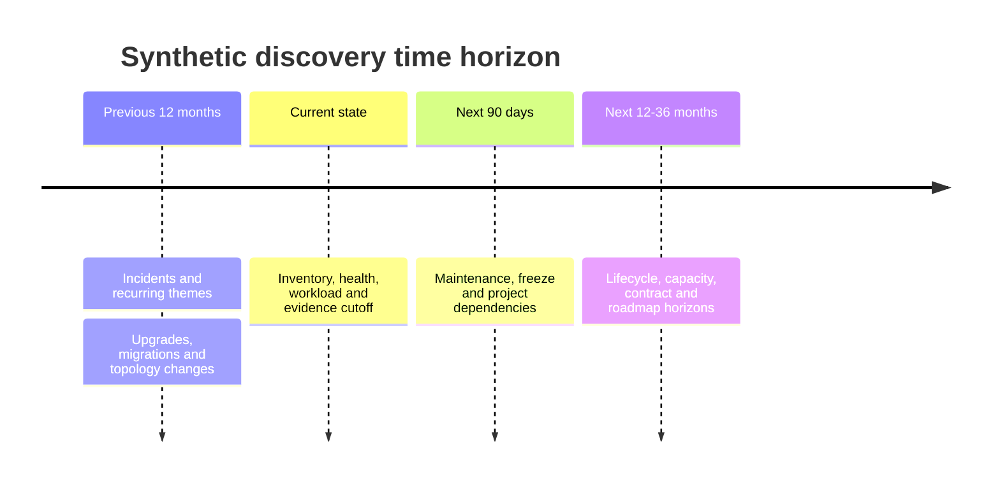

### Incident and support-history questions

- Which events materially affected users, data, recovery, support, or change?
- What was observed, restored, resolved, and proven as root cause?
- What workarounds or temporary controls remain?
- Which handoffs, evidence gaps, or ownership delays recurred?
- What prevention actions were validated, deferred, or accepted?

Do not turn `similar symptoms` into `same root cause` without evidence.

### Pain versus risk

| Category | Meaning | Example response |
|---|---|---|
| Pain | Experienced friction or cost now | Quantify scope/frequency and owner |
| Issue | Current adverse condition | Contain, restore, diagnose, own |
| Risk | Possible future objective impact | Validate mechanism/horizon/control |
| Preference | Desired working style or feature | Test priority and feasibility |
| Constraint | Limits available options | Design around or escalate decision |
| Requirement | Must be satisfied and has authority/source | Record source and acceptance test |

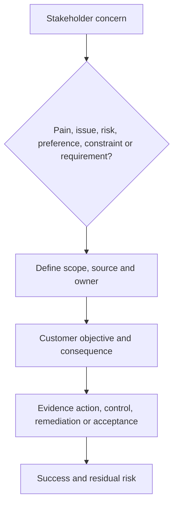

### Constraint categories

- Maintenance and change risk.
- Budget, procurement, licensing, and contract.
- Skills, staffing, language, and time zones.
- Security, privacy, regulatory, and data residency.
- Application certification and vendor support.
- Physical space, power, cooling, ports, bandwidth, or cloud limits.
- Technical debt, unsupported dependencies, and migration windows.

Constraints should shape options, not disappear from the recommendation.

---

## 6. Support model, vendors, stakeholders, and ownership

### Support model discovery

| Question | Why it matters |
|---|---|
| Who detects and declares incidents? | Determines first evidence and severity route |
| Who opens vendor cases and owns communication? | Prevents duplicate or abandoned escalations |
| Which support contracts/partners apply? | Defines entitled routes, not technical cause |
| Who can collect and transfer evidence? | Protects privacy and response time |
| Who approves changes and accepts risk? | Separates advice from authority |
| How are vendor boundaries coordinated? | Prevents each supplier restarting discovery |
| What are shift/time-zone handoffs? | Preserves context and avoids fatigue gaps |

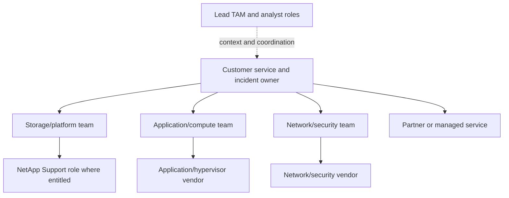

### Stakeholder capture

For each stakeholder record role, outcome, concern, influence, decision rights, evidence owned, availability/time zone, communication preference, and delegate. Part 63 develops the complete map and RACI.

### Ownership questions

- Who is accountable for the business service?
- Who operates each technical layer?
- Who owns authoritative inventory and topology?
- Who approves evidence access and external transfer?
- Who validates application outcome?
- Who decides priority, budget, change, and residual risk?
- Who is absent, overloaded, or single-threaded?

---

## 7. Evidence requests and validation

### Evidence-request contract

| Field | Example content |
|---|---|
| Purpose | Decision or hypothesis the evidence supports |
| Scope | Service, assets, interval, event, fields |
| Source/owner | Authoritative system and authorized provider |
| Method | Approved export, report, observation, interview, test |
| Sensitivity | Classification, redaction, storage and audience |
| Due/priority | When needed and what it blocks |
| Acceptance | Format, timestamps, identifiers and quality |
| Disposition | Retention, return/deletion and result |

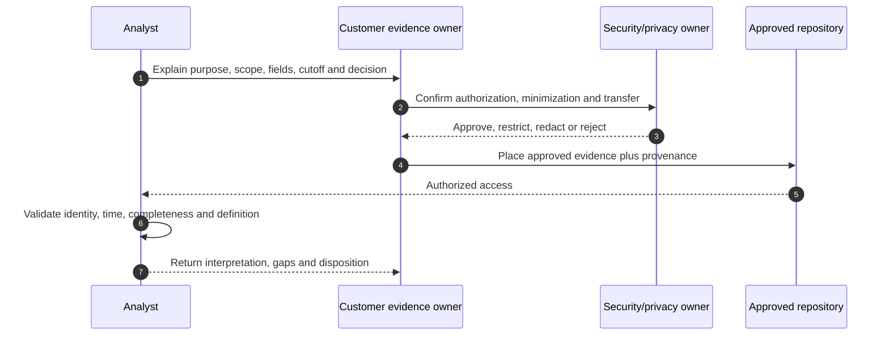

### Evidence hierarchy

- Direct current authorized observation.
- Authoritative customer/system record.
- Current official product/support source.
- Controlled test with clear conditions.
- Named owner attestation.
- Historical document or recollection.

Lower-ranked evidence can be useful, but confidence and validation plan must remain visible.

### Do not ask for everything

Broad data collection creates privacy, review, and interpretation risk. Ask for the cheapest evidence that can distinguish between meaningful alternatives or support the next decision.

---

## 8. Assumptions, unknowns, and contradictions

### Plain-English deep-dive: pencil, blank space, and conflicting maps

An assumption is a pencil route drawn provisionally. An unknown is blank space. A contradiction is two maps disagreeing. Ink, blank, and conflict require different handling.

**Why it matters:** collapsing all three into `TBD` hides decision risk and ownership.

| Record | Required content | Exit |
|---|---|---|
| Assumption | Statement, reason, decision impact, owner, test, expiry | Verified, rejected, or replaced |
| Unknown | Exact missing fact, why it matters, source/owner, due date | Known, accepted limitation, or escalated |
| Contradiction | Conflicting values/sources/times/definitions, impact | Reconciled or bounded exception |

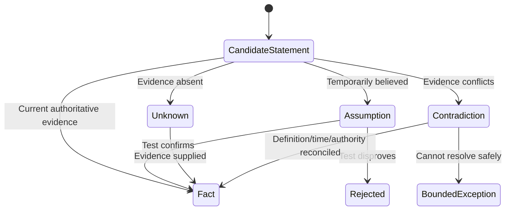

### Contradiction workflow

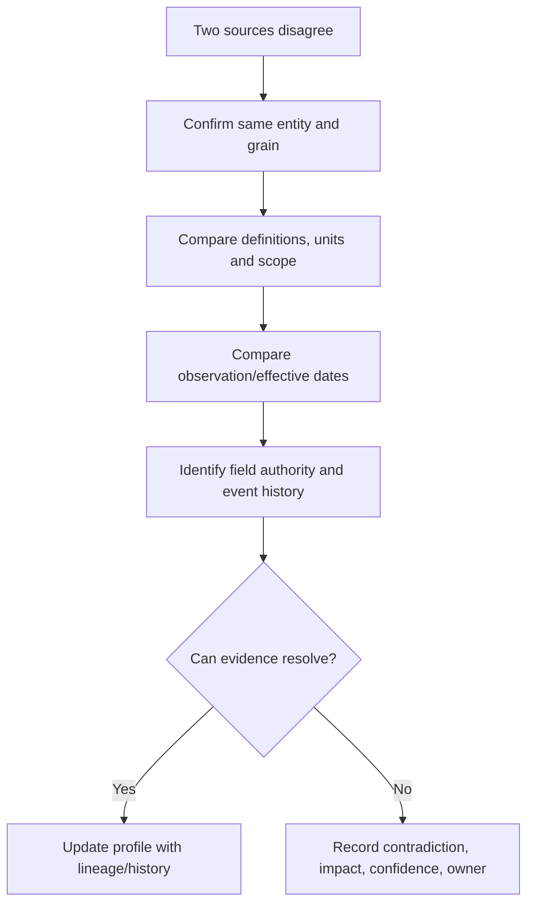

### Confirmation technique

At the end of each topic say:

> `I heard X as a verified fact, Y as your operating preference, Z as an assumption requiring evidence, and W as an unresolved contradiction. Is that accurate, and who owns each correction?`

---

## 9. Environment profile and workshop facilitation

### Plain-English deep-dive: the profile is a living patient chart

A patient chart records identity, history, current condition, medicines, owners, tests, allergies, and next actions. It is dated and corrected rather than rewritten from memory. An environment profile should behave the same way.

**Why it matters:** persistent context reduces repeated discovery while preserving change history and uncertainty.

### Environment-profile template

| Section | Minimum fields |
|---|---|
| Control | Purpose, owner, version, cutoff, classification, reviewers |
| Business | Services, outcomes, users/sites, criticality, owners, SLA/SLO |
| Data | Criticality/classification, flows, authoritative copies, RPO/RTO |
| Workload | Access model, demand, pattern, peaks, growth, availability |
| Topology | Application-to-compute-to-network/fabric-to-storage-to-protection |
| Inventory | Stable IDs, product/platform/releases, component versions, owner |
| Operations | Monitoring, support, cases, incidents, change, escalation, time zones |
| Protection | Backup, replication, DR, restore tests, dependencies |
| Plans | Projects, changes, freezes, budget, lifecycle and capacity horizons |
| Evidence | Sources, dates, definitions, quality, access and lineage |
| Gaps | Assumptions, unknowns, contradictions and evidence requests |
| Decisions | Risks, recommendations, actions, accepted risk and validation |

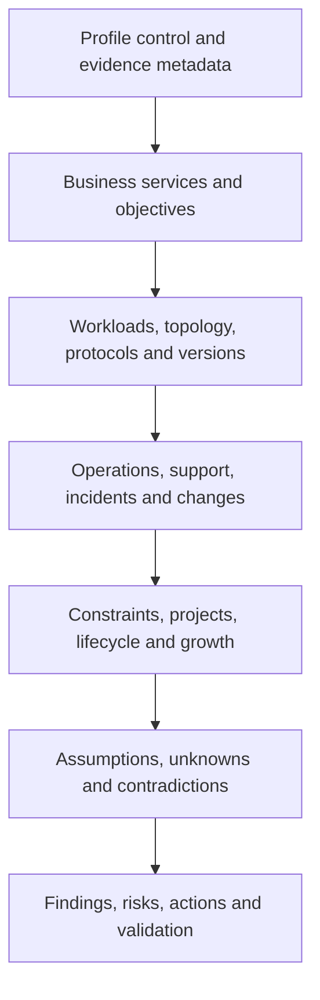

### Workshop plan

1. Send purpose, topics, evidence boundaries, and prework.
2. Invite knowledgeable doers and decision owners, not only managers.
3. Assign facilitator, mapper, note-taker, timekeeper, and customer validators.
4. Begin with no-blame rules and explain how data will be used.
5. Map the service live, marking fact/assumption/unknown/contradiction.
6. Use timeboxes and parking lot; schedule specialist follow-ups.
7. Read back the model, decisions, evidence requests, owners, and dates.
8. Return a sanitized draft for customer validation.

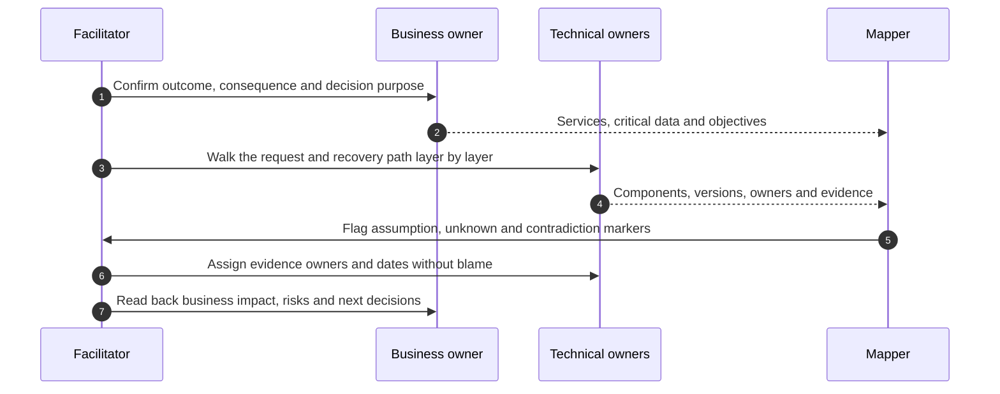

### Respect and inclusion

- Explain acronyms and do not use expertise as status.
- Ask `what made sense at the time?` before `why did you do that?`
- Avoid implying missing documentation means poor capability.
- Make space for operations staff who know the real workflow.
- Offer asynchronous validation across language and time-zone barriers.
- Do not force disclosure outside authorized scope.
- Correct your model visibly when the customer provides better evidence.

---

## 10. From discovery to risk, action, and validation

Discovery is complete enough for a decision when material facts and limitations are explicit, not when every field is filled.

```mermaid
flowchart LR
    QUESTION[Customer decision question] --> PROFILE[Validated environment profile]
    PROFILE --> FIND[Finding or evidence gap]
    FIND --> RISK[Issue/risk to objective]
    RISK --> OPTIONS[Options and constraints]
    OPTIONS --> ACTION[Recommendation, owner and date]
    ACTION --> TEST[Evidence or outcome validation]
    TEST --> UPDATE[Profile, residual risk and review]
```

### Discovery output register

| Output | Minimum content |
|---|---|
| Finding | Evidence, scope, date, condition, confidence |
| Risk | Cause/event/consequence/horizon/control |
| Recommendation | Options, preferred action, rationale, prerequisites |
| Action | Owner, due, dependency, status, validation |
| Validation | Test/source, expected result, reviewer, residual risk |

### Exit criteria

- Customer validates the service and topology at the required level.
- Critical data and objectives have accountable owners.
- Exact product/protocol/version scope is known or explicitly unknown.
- Change, incident, support, vendor, and constraint context is visible.
- Material contradictions have owners and decision impact.
- Recommendations do not depend on hidden assumptions.
- Sensitive evidence is stored and shared appropriately.

---

## 11. Fully synthetic sanitized scenario: BlueRock Imaging discovery

> **Synthetic boundary:** `BlueRock Imaging`, all people, services, systems, versions, objectives, incidents, metrics, sources, risks, actions, dates, and outcomes are invented. No live NetApp result, customer process, or Arti production experience is represented.

### Initial request

`Storage is slow, backups are risky, and we need an upgrade plan.`

The statement contains three concerns but no reliable scope, baseline, mechanism, or decision.

### Funnel discovery

```mermaid
sequenceDiagram
    autonumber
    participant A as Analyst role
    participant BO as Business owner
    participant SO as Storage owner
    participant NO as Network owner
    participant AO as Application owner
    A->>BO: Which outcome and periods are affected?
    BO-->>A: Image retrieval misses target during evening ingest
    A->>AO: Which transactions, hosts and data paths are involved?
    AO-->>A: One batch service and one interactive service share paths
    A->>SO: Which storage objects, protocols, versions and evidence apply?
    SO-->>A: Two protocol paths; one inventory record conflicts
    A->>NO: Which network changes or saturation evidence exist?
    NO-->>A: QoS change occurred before symptoms; causality untested
    A->>A: Separate performance, protection and upgrade workstreams
```

### Synthetic environment map

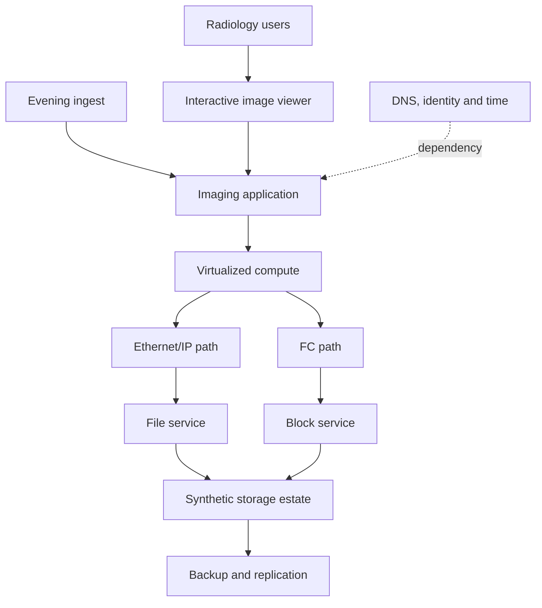

### Profile evidence

| Topic | Evidence | State |
|---|---|---|
| Business target | Owner states interactive retrieval SLO; source document pending | Assumption until documented |
| Performance | App transaction delay aligns with ingest; storage latency alone not yet correlated | Medium-confidence pattern |
| Topology | Diagram shows shared switch; port path unverified | Unknown path detail |
| Versions | Host driver differs between CMDB and host export | Contradiction |
| Protection | Backup jobs succeed; last restore test date unknown | Recovery proof unknown |
| Upgrade | Target quarter exists; exact recipe and application certification absent | Evidence work required |
| Change | QoS policy changed five days before first complaint | Correlation, not cause |

### Contradiction resolution

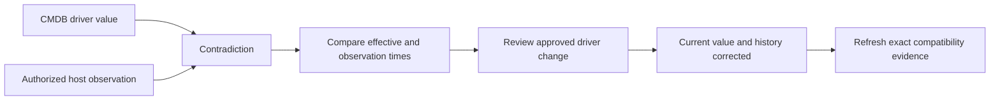

### Findings, risks, actions, validation

| Finding | Risk | Action/owner | Validation |
|---|---|---|---|
| Shared ingest and interactive demand correlate with delay | SLO may be missed during peak; bottleneck unknown | App/storage/network owners run synchronized transaction and layer metrics | Reproduce/no-reproduce under controlled comparable window |
| Driver inventory contradicts current host evidence | Upgrade recipe could be wrong | Host owner corrects history; storage owner obtains current exact recipe | Peer-reviewed dated result and notes |
| Backup success lacks restore evidence | RTO/RPO may not be met | Backup/app owners plan approved restore test | Data/application validation against objectives |
| Shared switch path not physically validated | Claimed redundancy may share failure domain | Network owner validates ports, paths and ownership | Dated topology and path test |
| SLO source is pending | Priority/measurement target can be disputed | Business owner supplies approved objective | Controlled profile updated |

### Synthetic result

The controlled test shows the application queue grows before storage latency changes. The discovery therefore prevents an unsupported storage-tuning recommendation. A separate network path check finds a shared dependency, and restore testing misses the fictional RTO. These are scenario outcomes only; they do not prove a real product behavior or customer result.

---

## 12. Anti-patterns and corrections

| Anti-pattern | Why it fails | Better practice |
|---|---|---|
| Begin with a 100-question spreadsheet | Feels extractive and hides purpose | Explain decision and use staged funnels |
| Ask only managers | Misses operational reality | Include doers, owners and validators |
| Treat inventory as environment | Omits service, data, paths, recovery and people | Map application-to-data dependencies |
| Ask `why did you...` in blame tone | Reduces psychological safety | Ask conditions, evidence and rationale at the time |
| Accept diagrams as current | Architecture drifts | Date, source, validate and mark unknowns |
| Convert unknown to no/healthy | Creates false confidence | Preserve unknown with owner/date/impact |
| Vote on contradictory facts | Popularity is not authority | Compare entity, definition, time and source |
| Collect raw sensitive data by default | Adds privacy and access risk | Minimize and use approved evidence |
| Lead with a product hypothesis | Anchors discovery | Start with outcome/symptom and competing paths |
| Promise a recommendation during discovery | Evidence may change | Commit to validation and next checkpoint |
| Never return the profile | Customer receives no value and cannot correct it | Share a controlled validated artifact |

---

## 13. Arti's factual bridge and JD Mapping

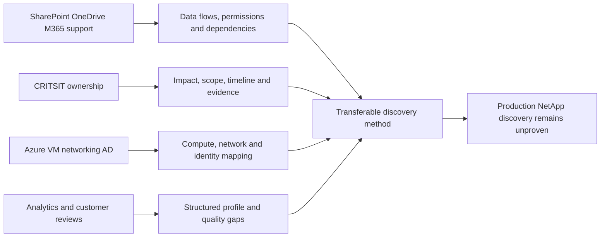

### Factual tie

| Arti evidence | Discovery transfer | Boundary |
|---|---|---|
| Enterprise/partner Microsoft support | Respectful questioning and multi-party context | Not a NetApp account profile |
| SharePoint/OneDrive | Business data, permissions, sync and service dependencies | Not ONTAP NAS administration |
| CRITSITs | Impact, scope, changes, timeline, evidence and owners | Not storage RCA by default |
| Azure/VM/networking/AD | Application-to-compute-to-network/identity reasoning | Storage fabrics/protocol depth still developing |
| MBA/Excel/Power BI/SQL/Python | Structured profile, contradictions and data quality | No live NetApp dataset |
| Product/Engineering collaboration | Evidence requests and exact specialist asks | No private NetApp Engineering access |

### JD Mapping

| JD responsibility | Part 62 capability | Honest boundary |
|---|---|---|
| Understand customer environment | Business-to-data profile and topology | Requires customer validation |
| Analyze/report customer data | Evidence contract and contradiction management | NetApp sources remain gated/unpracticed |
| Identify risk/supportability | Exact versions, controls, changes and unknowns | Current authorized product evidence required |
| Improve support experience | Support model, ownership, evidence and handoff discovery | Does not replace Support process |
| Operational service reviews | Validated profile supplies review context | Part 61 governs delivery |
| Customer communication | Respectful funnel and reflection | No interrogation or blame |
| Cross-functional work | Business, app, storage, network, security, vendor roles | Part 63 formalizes governance |
| Learn/apply technology | Current-source checks and explicit gaps | Conceptual knowledge is not production evidence |

### Honest interview statement

> `I would start with the customer outcome and decision, then use an open-to-closed funnel to map business services, critical data, objectives, workloads, topology, protocols, versions, changes, incidents, support, vendors, constraints and stakeholders. I would label facts, assumptions, unknowns and contradictions, request only authorized decision-relevant evidence, and return a dated profile with risks, actions and validation. My production discovery experience is Microsoft-focused; I have not validated a live NetApp environment.`

---

## 14. Role plays, paper lab, and self-test

### Role play 1: the guarded storage owner

The owner says, `This questionnaire looks like an audit.` Explain purpose, minimization, access, how the profile helps them, and invite them to shape scope.

### Role play 2: conflicting experts

The network and storage owners disagree about path redundancy. Separate entity, logical versus physical path, effective date, evidence source, and propose a safe validation rather than choosing a side.

### Role play 3: executive interruption

The sponsor asks for an upgrade date before inventory and application certification exist. State what is known, why the missing facts can change the answer, and give an evidence owner/checkpoint without sounding evasive.

### Paper lab: synthetic discovery workshop

```mermaid
flowchart LR
    PURPOSE[Define purpose and privacy] --> STAKE[Map participants and roles]
    STAKE --> FUNNEL[Run business-to-technical funnels]
    FUNNEL --> MAP[Build service, data and topology profile]
    MAP --> GAPS[Mark assumptions, unknowns and contradictions]
    GAPS --> EVID[Assign evidence requests]
    EVID --> RISK[Findings, risks and actions]
    RISK --> VALID[Customer validation and profile version]
```

Build a fully synthetic profile for three business services, two sites, mixed file/block access, 20 hosts, two fabrics, backup/replication, five vendors, 12 months of incidents, a 12-month change calendar, and five stakeholder groups.

Inject:

- One undocumented tier-one service.
- Conflicting RPO and RTO records.
- A topology diagram 18 months old.
- A reused hostname and controller replacement.
- One unvalidated physical path.
- A successful backup with no restore test.
- A project demand missing from capacity data.
- A driver version conflict.
- A maintenance freeze and overloaded owner.
- One sensitive evidence request that should be rejected/minimized.

### Lab tasks

1. Write discovery purpose, audience, privacy and output contract.
2. Build open/probing/clarifying/closed/evidence questions.
3. Map business services, critical data, SLA/SLO/RPO/RTO and owners.
4. Profile workload, topology, protocols, versions and failure domains.
5. Add change, incident, support, vendor, constraint and pain context.
6. Maintain assumption, unknown, contradiction and evidence registers.
7. Facilitate a no-blame workshop with read-back.
8. Produce the environment profile and topology.
9. Convert validated findings into risks, actions and outcome checks.
10. Answer Q1-Q8 aloud.

### Self-test

1. Define discovery and the environment profile.
2. Build a question funnel and correct a leading question.
3. Distinguish SLA, SLO, RPO and RTO.
4. Map a business service to critical data and complete dependency path.
5. Characterize a workload and exact version recipe.
6. Capture change, incident, support, vendor and constraint context.
7. Write a purpose-limited evidence request.
8. Manage an assumption, unknown and contradiction differently.
9. Facilitate a respectful workshop and return the profile.
10. Recreate BlueRock and state Arti's nonclaim.

### Lab pass checklist

- [ ] Discovery begins with purpose, customer outcome and authorized scope.
- [ ] Open, probing, clarifying, closed and evidence questions form a funnel.
- [ ] Business services, critical data, SLA/SLO/RPO/RTO and owners are explicit.
- [ ] Workloads, topology, protocols, versions, changes and failure domains are mapped.
- [ ] Incidents, support model, vendors, constraints, pain and stakeholders are captured.
- [ ] Facts, assumptions, unknowns and contradictions use distinct records.
- [ ] Evidence requests are minimal, authorized, dated and decision-relevant.
- [ ] Workshop behavior is respectful, inclusive and no-blame.
- [ ] The customer validates the profile and material gaps.
- [ ] Findings lead to risks, actions, validation and residual risk.
- [ ] All evidence is fully synthetic and sanitized.
- [ ] No production NetApp discovery, result or internal process is claimed.

---

## 15. Official and Public Source Anchors

**Date checked: 2026-08-24.** The supplied NetApp TAM Technical Analyst job description, represented in the master guide's JD matrix, is the primary source for role responsibilities. The sources below provide bounded architecture, recovery, support, and questioning context; they do not define a NetApp internal discovery process.

| Topic | Official/public source | Bounded use |
|---|---|---|
| NetApp documentation | [NetApp Documentation](https://docs.netapp.com/) | Current product/release architecture and behavior; exact customer state requires evidence |
| NetApp support context | [NetApp Support Services](https://www.netapp.com/services/support/) | Public support context; exact entitlement and account model require confirmation |
| AutoSupport evidence orientation | [Learn about ONTAP AutoSupport](https://docs.netapp.com/us-en/ontap/system-admin/manage-autosupport-concept.html) | Public concept only; no customer payload or access inferred |
| Digital Advisor inventory context | [View storage system inventory details](https://docs.netapp.com/us-en/active-iq/task_view_inventory_details.html) | Public feature orientation; customer data is gated and not an environment source of truth by itself |
| Contingency planning | [NIST SP 800-34 Rev. 1](https://csrc.nist.gov/pubs/sp/800/34/r1/upd1/final) | Official contingency, business-impact and recovery-planning orientation |
| SLO orientation | [Google SRE Workbook - Implementing SLOs](https://sre.google/workbook/implementing-slos/) | Public reliability-engineering guidance; customer definitions and contracts govern actual objectives |
| Privacy framework | [NIST Privacy Framework](https://www.nist.gov/privacy-framework) | Purpose, governance and privacy-risk orientation for discovery data |

### Source-use discipline

- Record exact product/release/configuration, source, owner, evidence date, scope, and access.
- Prefer current authorized observation and authoritative owner records over recollection.
- Treat topology and profiles as dated controlled models, not permanent truth.
- Recheck IMT, HWU, release, lifecycle, advisory, application, and vendor sources before technical conclusions.
- Do not collect sensitive content when metadata, classification, or owner attestation is sufficient.
- Never present this model as a NetApp internal questionnaire, audit, or service promise.

---

## Likely Interview Questions

### Q1. How would you discover a customer environment before recommending anything?

> **Model answer:** `I define the decision, purpose, participants and data boundaries, then work from business service and critical data through application, compute, network/fabric, protocol, storage, protection and operations. I use an open-to-closed funnel, label facts/assumptions/unknowns/contradictions, request authorized evidence, and return a dated customer-validated profile.`

### Q2. What is the difference between open and closed questions?

> **Model answer:** `Open questions reveal context in the customer's language; closed questions confirm a precise fact. I start broad, probe and clarify, then close and request evidence. Starting with a narrow leading question anchors the discovery to my hypothesis and can hide the real dependency.`

### Q3. What belongs in an environment profile?

> **Model answer:** `Control metadata; business services, owners and objectives; critical data and RPO/RTO; workload pattern; application-to-storage topology; protocols and exact versions; monitoring/support/incidents/changes/vendors; constraints and plans; sources and quality; assumptions/unknowns/contradictions; risks, actions and validation.`

### Q4. How do you handle SLA, SLO, RPO, and RTO?

> **Model answer:** `I keep them distinct: SLA is an agreement, SLO is a measurable service target, RPO is targeted data-loss period, and RTO is targeted restoration duration. I record authority, scope and definition, then compare them with measured or test evidence; an objective is not proof it was achieved.`

### Q5. How do you resolve contradictory customer data?

> **Model answer:** `I confirm the same entity and grain, compare definitions/units/scope, observation and effective dates, authoritative field owner and change history. If evidence resolves it, I preserve the corrected history and lineage; otherwise I record a bounded contradiction, decision impact, confidence, owner and due date.`

### Q6. How do you make discovery respectful rather than an interrogation?

> **Model answer:** `I explain purpose and benefit, minimize data, ask outcome-led questions, avoid blame language, define jargon, invite operators and decision owners, make unknowns safe, correct my model visibly, use timeboxes and read-back, and return a useful controlled profile for validation.`

### Q7. When is discovery complete enough?

> **Model answer:** `When the material service, data, topology, owners, objectives, versions, changes, constraints and evidence limits needed for the decision are explicit; critical contradictions have owners; recommendations do not depend on hidden assumptions; and customer validators agree with the bounded model. It need not fill every possible field.`

### Q8. How does your background transfer, and what remains a gap?

> **Model answer:** `Microsoft enterprise support and CRITSITs give me impact, scope, timeline, dependency and evidence questioning; SharePoint/OneDrive, Azure, networking, AD and analytics help me map services and data. I have not discovered a production NetApp environment, so ONTAP, fabric, protocol and gated-tool conclusions require current evidence and experienced review.`

---

## 30-Second Memory Hooks

- **Discovery:** Joint map-making for a decision, not interrogation.
- **Start:** Business outcome -> critical data -> full technical path.
- **Funnel:** Open -> probe -> clarify -> close -> evidence -> reflect.
- **SLA:** Agreement; **SLO:** service target.
- **RPO:** How much data loss; **RTO:** how long to recover.
- **Workload:** Semantics, demand, pattern, growth, peaks and objectives.
- **Topology:** Components plus relationships, owners and failure domains.
- **Version:** Exact component recipe and date, never `latest` from memory.
- **Pain:** Experienced friction; **risk:** uncertain future effect.
- **Constraint:** Shapes options; it does not vanish from the plan.
- **Evidence request:** Purpose + minimum scope + authority + acceptance.
- **Assumption:** Pencil; **unknown:** blank; **contradiction:** conflicting maps.
- **Profile:** Living dated patient chart, not permanent truth.
- **Workshop:** Purpose, no blame, live map, read-back, owners.
- **Arti's bridge:** Microsoft discovery transfers; NetApp environment proof does not.

---

## Completion Checklist

- [ ] Define discovery purpose, scope, stakeholders, privacy and outputs.
- [ ] Use open, probing, clarifying, closed and evidence questions in a funnel.
- [ ] Profile business services, critical data, owners, SLA/SLO/RPO/RTO.
- [ ] Characterize workloads, peaks, growth, availability and protection.
- [ ] Map application, compute, network/fabric, protocol, storage and recovery topology.
- [ ] Record exact product, release, driver, firmware, switch and application versions.
- [ ] Capture change calendar, incidents, support model, vendors, pain and constraints.
- [ ] Write purpose-limited authorized evidence requests.
- [ ] Separate facts, assumptions, unknowns and contradictions.
- [ ] Build and customer-validate the environment profile.
- [ ] Facilitate respectful inclusive workshops without interrogation or blame.
- [ ] Convert evidence to findings, risks, actions, validation and residual risk.
- [ ] Recreate the fully synthetic BlueRock scenario and paper lab.
- [ ] Answer Q1-Q8 aloud and state the exact nonclaim.
- [ ] Recheck current authoritative product and customer evidence before real conclusions.

---

*Next suggested section:* [Part 63 - Stakeholder Mapping, Account Team Roles, RACI, and Governance](Part-63-stakeholders-account-team-raci.md)