# Part 63 - Stakeholder Mapping, Account Team Roles, RACI, and Governance

> **Section goal:** Build a clear people-and-decision architecture around a customer environment. By the end, Arti should be able to map customer, account-team, Support, specialist, partner, and vendor personas; distinguish interest, influence, authority, accountability, responsibility, support, consultation, and information; design bounded RACI/RASCI views; establish governance forums, cadences, escalation paths, and handoffs; and detect absent, overloaded, or ambiguous ownership before it becomes customer risk.

Covers index item **63** and maps directly to job-description responsibilities for working under lead-TAM guidance, coordinating account teams, understanding customer environments, conducting operational reviews, influencing preventative remediation, managing escalations and special projects, contributing to cross-functional/SME teams, communicating across time zones, and improving customer experience and loyalty.

**Explicit nonclaim:** Arti has not operated within a production NetApp account team, assigned NetApp or customer decision rights, or approved a live NetApp/customer RACI or governance model.

**Privacy and access boundary:** Stakeholder maps can reveal names, titles, reporting lines, influence, availability, contact routes, commercial roles, risk owners, escalation paths, and organizational weaknesses. Store the minimum necessary information in approved systems, use role-based broad views, restrict personal/contact details, recertify access, and remove stale records.

**Synthetic-evidence rule:** Every customer, person, role assignment, forum, cadence, contract, conflict, escalation, decision, action, date, risk, and outcome below is fictional and sanitized. No table represents a NetApp internal organization, actual account team, real customer, contract, or support process.

**Version and current-source caveat:** Organizations, account models, contracts, support offerings, partner scopes, product ownership, and customer personnel change. A **current-source check** means confirming current named roles, delegates, authorities, service scope, escalation routes, and contact methods with authorized account and customer owners before relying on the map.

This Part provides a generic governance model, not a NetApp internal org chart, fixed service model, standard escalation ladder, universal RACI, commercial process, or authority to assign customer work. The actual contract, lead TAM, account leadership, Support process, partner scope, and customer governance control live responsibilities.

> **No-production-NetApp boundary:** Arti's factual strengths are Microsoft enterprise and partner support, CRITSIT coordination, Product/Engineering collaboration, Technical Advisor experience, customer reviews, mentoring, stakeholder communication, and action tracking. She does **not** claim NetApp lead-TAM, Sales, Customer Success, Professional Services, Support, Product, Engineering, partner, or customer-governance authority. Her exact non-claim is: **she has not designed, approved, or operated a production NetApp account-team RACI, governance forum, escalation path, or handoff model.**

---

## 1. Stakeholder architecture from zero

A **stakeholder** is a person or group that affects, is affected by, contributes to, governs, or decides an outcome.

### Plain-English deep-dive: the map is a wiring diagram, not a contact list

A contact list tells you who exists. A wiring diagram shows which switch controls which circuit, which devices share a breaker, and where a missing connection creates risk. A stakeholder map should show outcomes, interests, evidence, authority, dependencies, and communication paths.

**Why it matters:** knowing a person's title does not reveal who can approve a change, accept risk, supply evidence, unblock budget, or validate an application outcome.

| Term | Plain meaning | Analogy | Why it matters |
|---|---|---|---|
| **Stakeholder** | Person/group connected to an outcome | Person using or maintaining a building | Broadest relationship |
| **Persona** | Role pattern with typical needs and concerns | Type of traveler | Helps calibrate communication |
| **Interest** | How much the outcome matters to the stakeholder | Personal stake in a journey | Predicts engagement and concern |
| **Influence** | Ability to shape others or the result | Trusted navigator | Can exist without formal authority |
| **Authority** | Formal right to decide or approve | Licensed controller | Determines valid decisions |
| **Accountability** | Ownership of the result | Person answerable for delivery | Should not be vague or duplicated casually |
| **Responsibility** | Work performed to achieve result | Person doing the task | Can be shared among contributors |
| **Governance** | How decisions, oversight, escalation, and review occur | Rules of the road | Makes ownership repeatable |
| **Handoff** | Controlled transfer of work/context | Relay baton exchange | Prevents lost evidence and duplicated work |

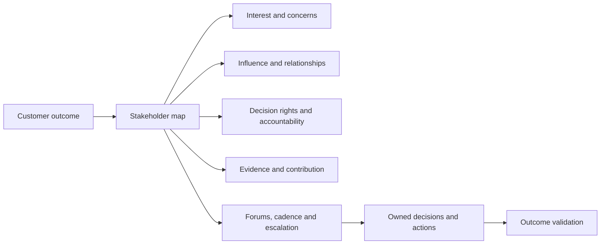

### Stakeholder-record fields

- Role and organization; name/contact only in restricted record.
- Customer outcome and interest.
- Influence and formal decision rights.
- Accountable/responsible/supporting/consulted/informed activities.
- Evidence owned and validation role.
- Dependencies and conflict/constraint.
- Forum, cadence, preferred channel, language, and time zone.
- Delegate, backup, availability, and overload risk.
- Last validated date and map owner.

---

## 2. NetApp-account-role personas at a generic level

These are generic role distinctions for interview preparation. Titles, boundaries, and presence vary by account and service; they are not a NetApp internal org chart.

### Account-team role map

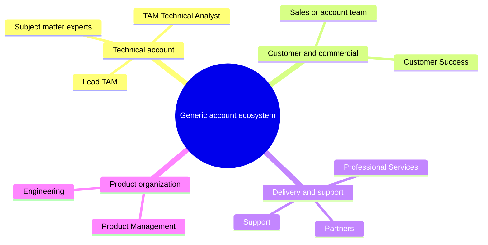

| Persona | Primary interest | Typical contribution | Typical authority/boundary |
|---|---|---|---|
| **Lead TAM** | Integrated technical account strategy, governance, trust, service value | Account context, priorities, reviews, escalations, technical relationship | Leads TAM narrative within scope; does not replace customer change/risk authority |
| **TAM Technical Analyst** | Evidence quality, analysis, reporting, recommendation representation, follow-through | Profiles, reconciliations, trends, risk/recommendation/action records, review content | Owns assigned analysis quality; does not act as lead TAM or production administrator by default |
| **Sales/account team** | Commercial relationship, scope, opportunity, renewal | Contract/account context, commercial coordination, sponsor alignment | Owns commercial motion; does not certify technical supportability |
| **Customer Success** | Adoption and realized outcomes where role/service applies | Success plan, adoption/outcome signals, stakeholder engagement | Does not replace Support or technical implementation roles |
| **Support** | Diagnose and progress technical cases within support scope | Troubleshooting, restoration guidance, case escalation, defect route | Owns case process; does not own customer governance or all implementation |
| **Professional Services (PS)** | Deliver scoped design, migration, implementation, or transformation | Project plan, design, implementation, acceptance, handover | Owns contracted deliverables, not unlimited ongoing work |
| **Product Management** | Product direction and prioritization | Product context, roadmap decisions through authorized routes | Does not administer customer environment or promise unapproved roadmap |
| **Engineering** | Build/maintain product and investigate qualifying defects | Product diagnostics, fixes, technical input | Owns product code/decisions, not customer change approval |
| **Partner** | Deliver contracted resale, integration, managed service, or local expertise | Implementation, operations, evidence, coordination | Owns partner scope only; boundaries must be explicit |
| **Subject matter expert (SME)** | Deep expertise in a bounded domain | Review, diagnosis, decision criteria, teach-back | Advises within expertise; does not inherit account/business authority |

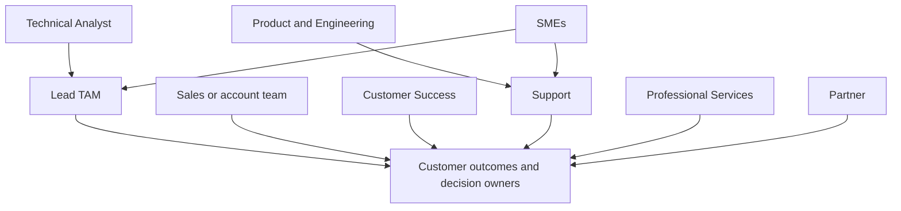

### Ownership versus contribution

An analyst may prepare most of a review but not own the integrated account strategy. A lead TAM may own governance but not a Support case. Support may own a case but not the customer's production change. Contribution volume does not silently transfer accountability.

---

## 3. Customer and ecosystem personas

### Customer personas

| Persona | Main concerns | Evidence/decision role | Engagement approach |
|---|---|---|---|
| **Executive sponsor** | Continuity, risk, cost, accountability, value | Funding, priority, business risk, escalation | Outcome, options, timing, concise asks |
| **Storage/platform owner** | Health, supportability, capacity, lifecycle, changes | Technical state, feasibility, operations | Exact evidence, dependencies, validation |
| **Application owner** | Transactions, users, data consistency, maintenance | Criticality, SLO, application test/signoff | Translate infrastructure condition to service outcome |
| **Network/fabric owner** | Paths, switches, routing, segmentation, bandwidth | Topology, events, changes, path validation | Exact ports/flows/times; shared tests |
| **Security/risk/compliance** | Exposure, control, audit, privacy, exception | Security approval, control/risk decision | Bounded evidence, sensitivity, residual risk |
| **Operations/service desk** | Detection, runbooks, ownership, escalations | Incident history, monitoring and first response | Actionable symptoms and routes |
| **Backup/DR owner** | Recoverability, RPO/RTO, tests, retention | Protection design and recovery proof | Test outcomes, dependencies, exceptions |
| **Change manager/CAB** | Scope, risk, scheduling, approval, recovery | Change-governance decision | Complete prerequisites and validation |
| **Procurement/finance** | Budget, contract, lead time, value | Purchase/funding process | Risk horizon, options, total lead time |
| **Business/service owner** | Customer outcome and consequence | SLO/criticality, business risk, acceptance | Plain outcome and decision language |

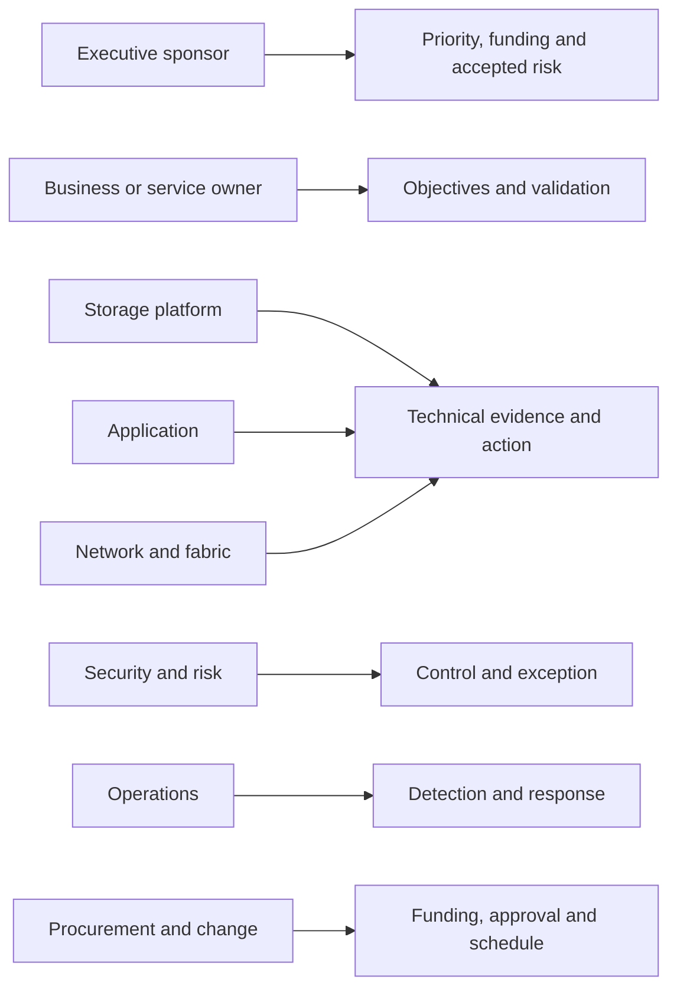

### Ecosystem/vendor personas

Include hypervisor/OS, application/database, network/security, backup, cloud, managed-service, reseller/integrator, colocation, and telecommunications providers where they own a dependency or support boundary.

Do not invite every vendor to every forum. Include the role when its evidence, authority, or action is required; protect customer information and commercial boundaries.

---

## 4. Interest, influence, authority, and decision rights

### Plain-English deep-dive: loudness is not authority

At an airport, a frequent traveler may strongly influence others, but only authorized operations staff can close a runway. A quiet security officer may hold a non-negotiable approval. Stakeholder planning must separate visibility, influence, expertise, and formal authority.

**Why it matters:** the loudest participant should not become the assumed decision owner.

### Four separate dimensions

| Dimension | Question | Evidence |
|---|---|---|
| Interest | How much does this outcome affect them? | Goals, impact, workload, incentives |
| Influence | Can they shape opinion, resources, or execution? | Relationships, expertise, control of dependencies |
| Authority | Can they formally approve/accept/commit? | Charter, role, contract, policy, delegation |
| Availability | Can they act in the required horizon? | Calendar, time zone, delegate, workload |

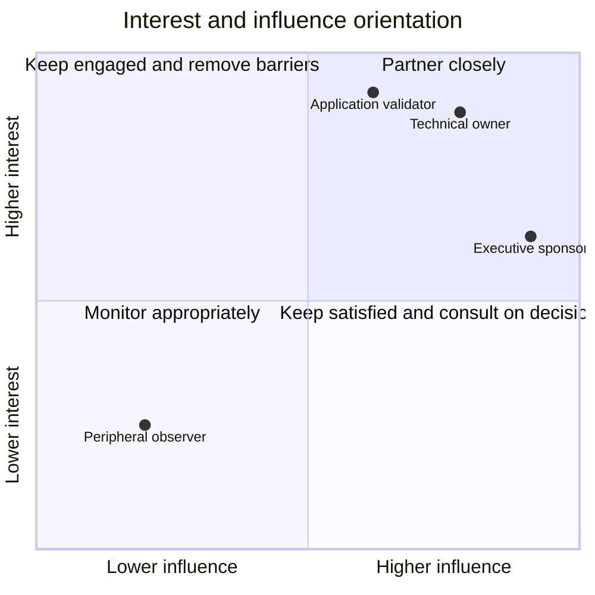

**Boundary:** positions are synthetic conversation aids, not measurements or judgments about real people.

### Decision-rights matrix

Record authority separately for:

- Business priority and risk acceptance.
- Technical design and supportability validation.
- Budget and procurement.
- Security/privacy exception.
- Production change approval and execution.
- Incident severity/restoration coordination.
- Vendor escalation and defect route.
- Application/business outcome validation.

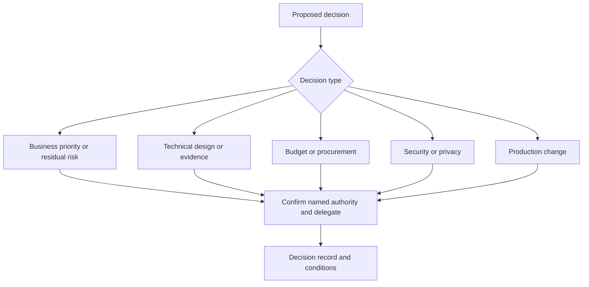

### Stakeholder-engagement plan

Do not equate lower influence with lower respect. Calibrate content, timing, channel, and involvement to role, impact, and accessibility.

---

## 5. RACI and RASCI, with caveats

### Plain-English deep-dive: a RACI is a seating chart, not the play

A seating chart tells who sits where, but it does not make them understand the script, arrive on time, or perform. RACI identifies role categories; working agreements, names, dates, evidence, and escalation make work happen.

**Why it matters:** a perfect table can coexist with abandoned actions.

### RACI

- **R - Responsible:** performs the work.
- **A - Accountable:** owns the result or final decision.
- **C - Consulted:** gives two-way input before action/decision.
- **I - Informed:** receives appropriate one-way status/outcome.

### RASCI

**S - Support:** provides resources or active assistance to the Responsible role. RASCI can clarify support but can also create confusion if `Support` is mistaken for the vendor Support organization.

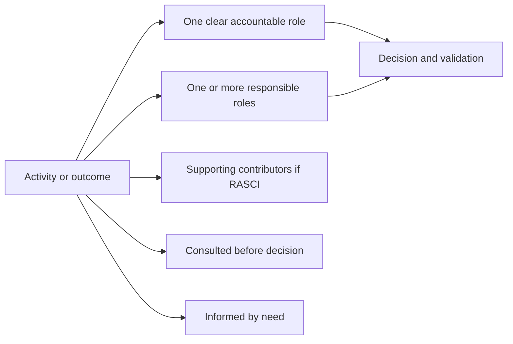

### RACI rules and caveats

1. Define one activity/outcome per row at useful grain.
2. Prefer one clear `A`; if accountability is genuinely joint, define the decision split.
3. `A/R` can be valid but creates concentration risk.
4. Too many `C` roles slow decisions; too many `I` roles create noise.
5. RACI does not encode sequence, time, skill, capacity, delegation, or escalation.
6. Confirm named people privately; broad decks can show roles.
7. Do not assign customer work unilaterally.
8. Revalidate after org, contract, project, or incident changes.

### Illustrative generic RACI

This table is synthetic and must not be used as a NetApp or customer default.

| Activity | Lead TAM | Technical Analyst | Support | Sales/CS | PS/Partner | Customer technical owner | Customer business/change owner | Product/Engineering |
|---|---|---|---|---|---|---|---|---|
| Environment profile | A | R | C | I | C | R/C | C | I |
| Health/risk analysis | A | R | C | I | C | C | I | C |
| Operational review | A | R | C | C | C | C | C | I |
| Progress support case | I | C | A/R | I | C | R/C | I | C/R when routed |
| Approve production change | I | I | C | I | R if contracted | R | A | C |
| Accept business risk | C | I | I | I | C | C | A/R | I |
| Scoped implementation | C | C | C | I | R | A/R per scope | A/C | C |
| Product defect decision | I | C | R/C | I | C | C | I | A/R |

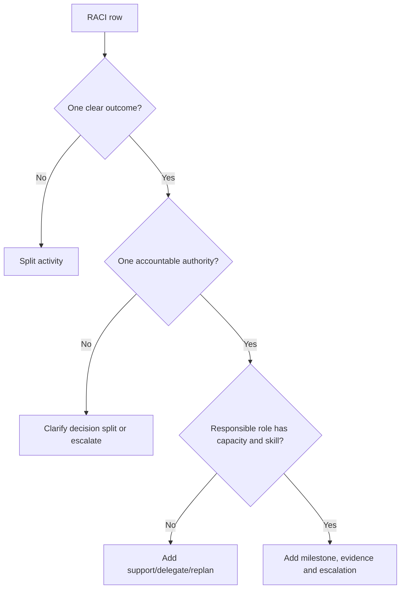

---

## 6. Governance forums and cadence

A **governance forum** is a recurring or event-driven place where defined participants review evidence and exercise defined decisions or oversight.

### Forum design

| Forum type | Purpose | Typical output | Anti-pattern |
|---|---|---|---|
| Operational checkpoint | Progress actions, cases, changes, evidence | Updated owners/blockers/checkpoints | Repeating status with no intervention |
| Technical working session | Resolve architecture/evidence/feasibility | Validated design/test/evidence action | Inviting executives into raw troubleshooting |
| Operational service review | Integrate outcomes, risks, recommendations, value | Decisions, actions, residual risk | Slide recital |
| Steering/leadership review | Decide priorities, funding, exceptions | Sponsor decision and escalation | Technical detail without choices |
| Incident bridge | Restore safely and coordinate workstreams | Current impact, action, checkpoint | Mixing post-incident blame into response |
| Change/go-no-go forum | Confirm prerequisites and authorize change | Approve/hold/reject with conditions | Assuming technical recommendation is approval |
| Problem/PIR review | Learn mechanism and prevention | Corrective actions and owners | Five-whys blame ritual |

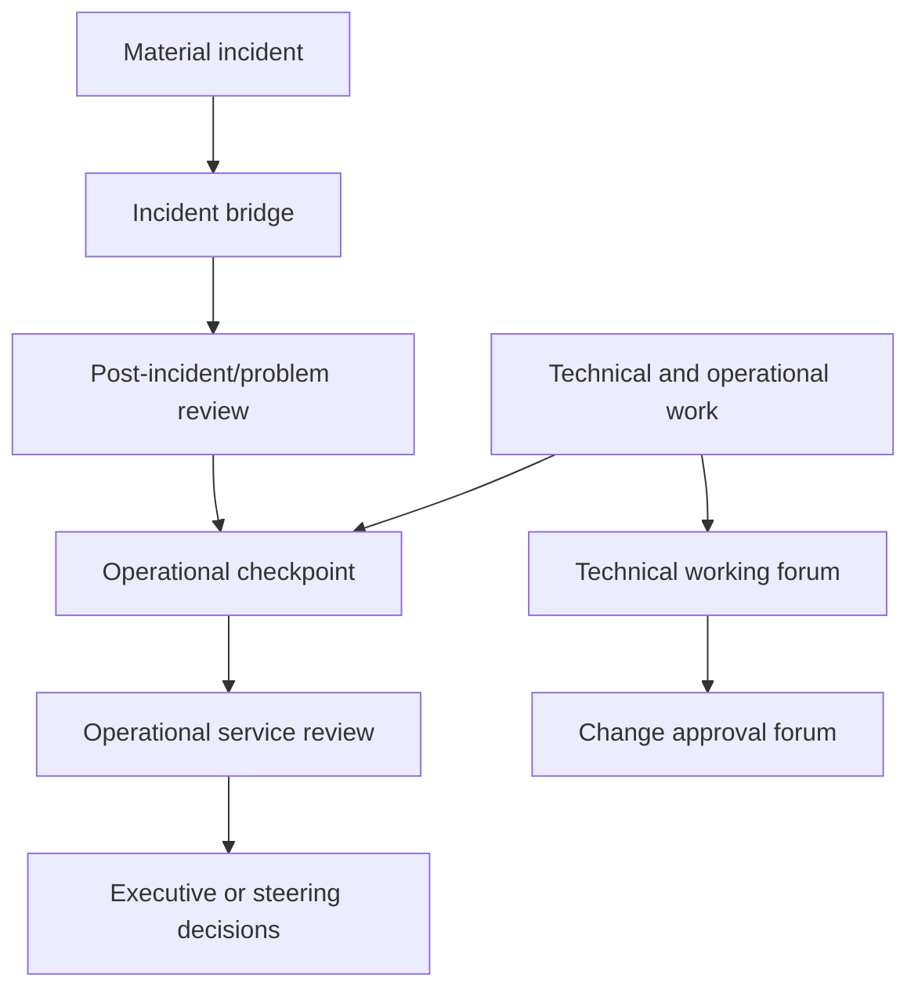

### Governance charter fields

- Purpose, in-scope/out-of-scope decisions.
- Chair/facilitator, members, required quorum/delegation if applicable.
- Inputs, cutoff, pre-read, agenda modes, and confidentiality.
- Decision method and authority.
- Outputs, record location, owner, and follow-up.
- Cadence/event triggers, time zone, and accessibility.
- Escalation route and review of forum effectiveness.

### Cadence architecture

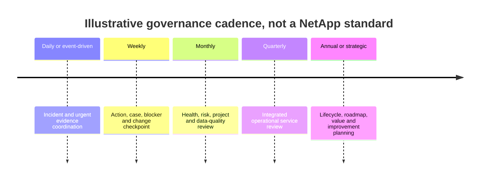

Actual cadence follows need, contract, risk horizon, customer calendar, and lead-TAM direction.

---

## 7. Escalation paths and handoffs

### Escalation is a governance action

Escalation should increase attention, authority, expertise, or resources because the current route cannot protect the outcome. It is not punishment or abandonment.

### Escalation triggers

- Current or growing customer impact.
- Safety/security/privacy/supportability boundary.
- Decision authority missing.
- Latest safe start or contractual/customer deadline at risk.
- Technical evidence requires Support/SME/Engineering route.
- Owner absent, overloaded, blocked, or repeatedly misses checkpoints.
- Cross-vendor deadlock or unresolved responsibility.
- Communication trust or expectation risk.

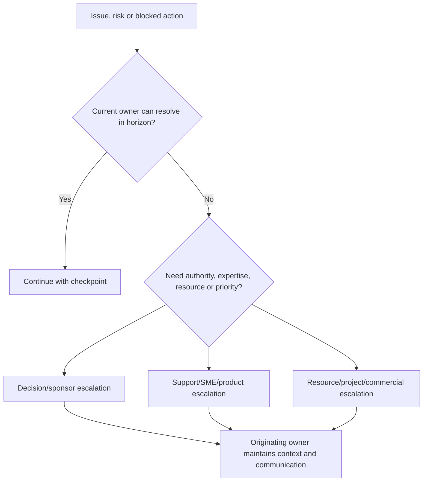

### Escalation package

- Customer impact/objective and urgency.
- Exact scope, timeline, current state, and evidence.
- Actions tried, result, and remaining hypotheses.
- Current owner, blocker, dependency, and deadline.
- Exact ask: decision, expertise, resource, exception, or priority.
- Secure evidence location and communication checkpoint.
- What remains owned by the originating team.

### Handoff contract

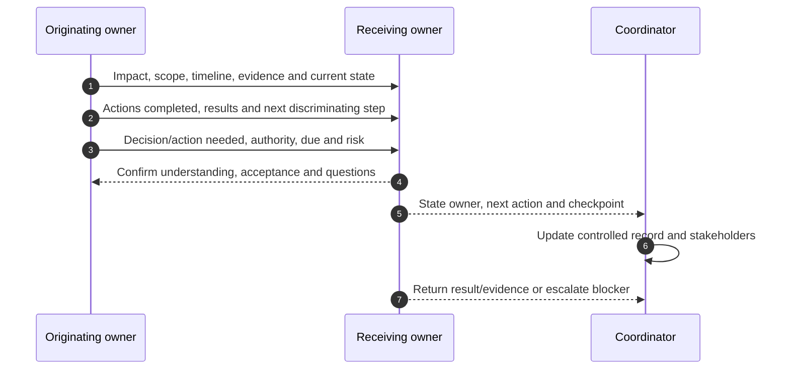

### Follow-the-sun handoff

Include timezone/date, impact, known/unknown, changes, evidence links, actions/results, active hypothesis, safety boundary, exact next action, owner, customer update, and checkpoint. Do not transfer a bare ticket number.

---

## 8. Absent, overloaded, or ambiguous roles

### Plain-English deep-dive: a bridge with one support column

A bridge may stand under normal load while one support column carries too much. A single expert who owns every approval, test, escalation, and customer update creates the same hidden failure point.

**Why it matters:** workload and backup coverage are governance facts, not personal weakness.

### Risk patterns

| Pattern | Signal | Risk | Control |
|---|---|---|---|
| Absent authority | Decisions repeatedly defer | Lead-time loss | Delegate or sponsor escalation |
| Overloaded Responsible | Aging, missed evidence, context switching | Quality and schedule failure | WIP limit, support, replan, priority decision |
| Single expert | No backup or documentation | Continuity risk | Shadow, backup, runbook, knowledge transfer |
| Multiple Accountables | Conflicting approvals | Decision deadlock | Split decision domains or name one authority |
| Unowned boundary | Each vendor points elsewhere | Restarted discovery and delay | Joint evidence plan and coordinator |
| Silent stakeholder | Late veto or missing requirement | Rework/change failure | Early consultation and explicit signoff |

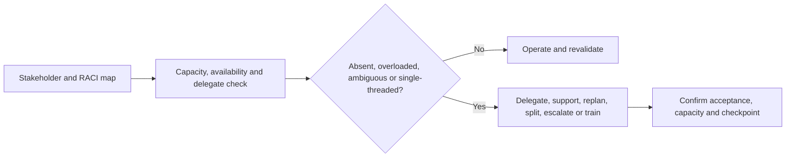

### Capacity conversation

Use evidence and outcome language:

> `The same owner is Responsible for six time-bound actions and Accountable for two approvals before the freeze. Which work should be reprioritized, delegated, or supported so the critical path remains credible?`

Avoid: `The owner is not committed.`

---

## 9. Governance evidence, risks, actions, and validation

### Governance evidence

- Current stakeholder map and validation date.
- Role/decision authority source and delegates.
- RACI/RASCI by activity/outcome.
- Forum charters, attendance, decisions, and action history.
- Escalation/handoff records and response checkpoints.
- Workload, aging, missed-decision, and single-thread risk.
- Customer feedback and outcome evidence.

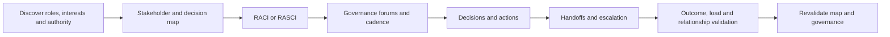

### Governance-risk register

| Finding | Risk | Action | Validation |
|---|---|---|---|
| No application validator named | Infrastructure change may pass while service fails | Name owner/delegate before go/no-go | Transaction signoff recorded |
| One owner overloaded | Critical action may miss latest safe start | Sponsor reprioritizes/supports work | Milestones and WIP reduce |
| RACI has two Accountables | Conflicting decision possible | Split technical/business authority | Decision record accepted |
| Partner handoff lacks evidence | Next team restarts discovery | Adopt handoff contract | Receiving owner accepts without rediscovery |
| Forum has no decision mode | Meetings age actions | Charter agenda/output | Decision/action throughput improves without gaming |

### Validation measures

- Percentage of material activities with accepted named authority and delegate.
- Decision wait time and missed latest-safe-start events.
- Actions without owner/date/proof.
- Handoff rework or evidence-request repetition.
- Single-threaded critical roles.
- Forum decisions/actions versus status-only time.
- Reopened decisions due to missing stakeholder/requirement.

Metrics are diagnostic, not performance punishment. Preserve context and small denominators.

---

## 10. Fully synthetic sanitized scenario: Summit Public Health governance reset

> **Synthetic boundary:** `Summit Public Health`, all roles, teams, contracts, decisions, dates, systems, incidents, conflicts, metrics, and outcomes are invented. No NetApp internal/account process or real customer is represented.

### Situation

A fictional recovery-improvement project has stalled. The storage lead is Responsible for inventory, compatibility, restore tests, vendor cases, and weekly reporting. The application owner attends only after changes. A partner believes it owns implementation, while the customer's change manager believes the work is advisory only.

### Initial stakeholder map

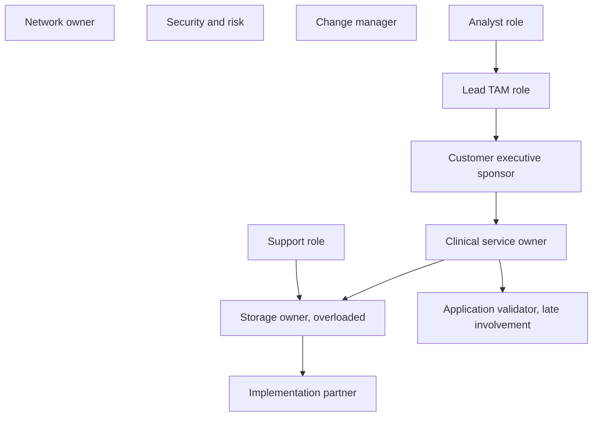

### Discovery findings

| Finding | Evidence | Risk |
|---|---|---|
| No named business risk authority | Meetings defer residual-risk choices | Schedule and accountability ambiguity |
| Storage owner holds five critical roles | Action aging and quality errors | Single-thread/capacity risk |
| Partner scope language is interpreted differently | Contract summary and stakeholder interviews conflict | Work may not execute |
| Application owner lacks defined signoff | Prior test validated platform only | Customer outcome could remain unproven |
| Weekly forum has status but no decision rights | Four repeated blockers | Meeting activity without progress |

### Revised governance

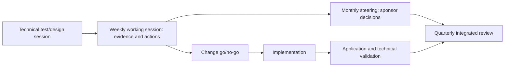

### Synthetic RASCI correction

| Activity | Sponsor | Service owner | Storage | Application | Change | Partner | Lead TAM | Analyst | Support |
|---|---|---|---|---|---|---|---|---|---|
| Decide recovery objective/priority | A | R | C | C | I | I | C | I | I |
| Build technical evidence | I | C | A/R | C | I | S | C | R | C |
| Design implementation | I | C | A | C | C | R | C | C | C |
| Approve production change | I | C | R | C | A | R | I | I | C |
| Validate application recovery | I | A | C | R | I | S | C | C | I |
| Accept residual business risk | A | R/C | C | C | I | I | C | I | I |

### Escalation and handoff

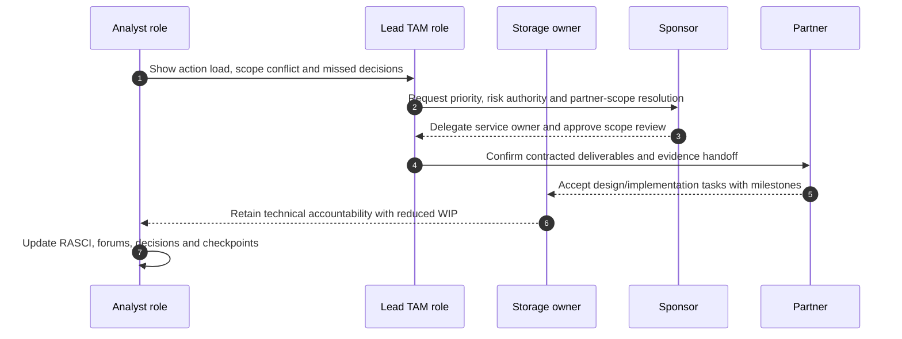

### Synthetic validation

- Partner scope is clarified through authorized contract owners; no commercial interpretation is invented by the analyst.
- The service owner validates application recovery; storage evidence alone no longer closes the action.
- The sponsor chooses which lower-priority work pauses, rather than blaming the overloaded owner.
- Weekly meetings contain explicit decision/evidence modes and escalate unresolved sponsor choices.
- A backup application validator is named.

These outcomes demonstrate a paper governance method only.

---

## 11. Anti-patterns and corrections

| Anti-pattern | Why it fails | Better practice |
|---|---|---|
| Stakeholder map is a mailing list | No authority or dependency insight | Record outcome, evidence, decision and delegate |
| Title equals authority | Formal rights vary by domain | Confirm exact decision right |
| Loudest person becomes Accountable | Influence is not authority | Use charter/delegation and read-back |
| RACI for every tiny task | Becomes unmaintainable | Use meaningful outcome grain |
| Multiple unexplained `A`s | Creates conflict | Split domains or name one authority |
| `C` everyone | Decisions stall and inboxes grow | Consult only decision-relevant roles |
| Vendor owns everything | Contracted boundaries disappear | Map customer/vendor/partner scope explicitly |
| Escalation means blame | Owners hide risk | Escalate need for authority/expertise/resource |
| Handoff is a ticket link | Context and evidence are lost | Use acceptance-based handoff contract |
| Overload treated as personal failure | Hides portfolio choice | Surface WIP/capacity and sponsor decision |
| Stale names in broad deck | Privacy and routing risk | Role-based view plus controlled current contacts |

---

## 12. Arti's factual bridge and JD Mapping

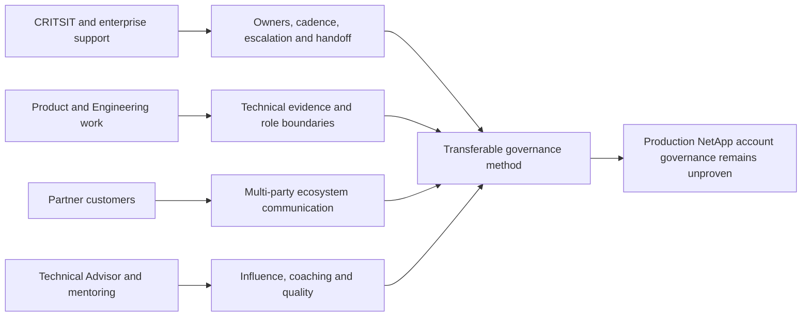

### Factual tie

| Arti evidence | Transfer | Boundary |
|---|---|---|
| Microsoft CRITSIT/enterprise support | Multi-role incident ownership and checkpoints | Not NetApp lead-TAM authority |
| Product/Engineering collaboration | Exact asks, escalation packages and technical review | Not NetApp Product/Engineering route ownership |
| Partner and customer work | Customer-partner-vendor boundary communication | Contract scopes must be confirmed |
| Technical Advisor program | Advisory influence and broader team contribution | Not equivalent to NetApp TAM title |
| Mentoring/onboarding/interviews | Support, coaching and delegation awareness | Manager/accountability boundaries remain |
| Business reviews/analytics | Governance evidence and action aging | No live NetApp account data |

### JD Mapping

| JD responsibility | Part 63 capability | Honest boundary |
|---|---|---|
| Work under lead TAM | Clear lead-TAM/analyst ownership split | No internal process claim |
| Understand/support customer | Customer and ecosystem persona map | Customer validates current roles |
| Conduct reviews | Forum charter, decision rights and participants | Part 61 governs review lifecycle |
| Track/influence remediation | RACI/RASCI, action, escalation and overload controls | Customer owners retain authority |
| Cross-functional/SME contribution | Product, Engineering, Support, PS, partner boundaries | No authority inherited from contribution |
| Special projects | Governance forums, cadence, decision and handoff | Part 68 adds project mechanics |
| Time zones/high pressure | Delegates and follow-the-sun handoffs | No unlimited availability promise |
| Improve loyalty/value | Reliable ownership and fewer dropped handoffs | No sales manipulation or renewal claim |

### Honest interview statement

> `I would map roles by customer outcome, interest, influence, decision rights, evidence, availability and dependencies; then use a bounded RACI or RASCI for meaningful activities. I would charter forums by purpose and authority, define escalation as a request for attention/expertise/resource, require acceptance-based handoffs, and surface absent or overloaded roles early. My production examples are from Microsoft support, not a NetApp account team.`

---

## 13. Role plays, paper lab, and self-test

### Role play 1: authority conflict

Two directors both claim approval authority. Ask which decision domain each owns, cite the charter/delegation need, split technical/change/business decisions if appropriate, and avoid choosing based on seniority alone.

### Role play 2: overloaded owner

Present WIP, deadlines and displaced outcomes to the sponsor. Ask for prioritization, support, or delegation without blaming the owner.

### Role play 3: vendor deadlock

Three suppliers ask the customer to gather the same evidence. Establish one shared timeline/evidence package, named coordinator, separate vendor asks, secure sharing, and next checkpoints.

### Paper lab: synthetic account governance

```mermaid
flowchart LR
    PERSONA[Map all account, customer and vendor personas] --> RIGHTS[Interest, influence and decision rights]
    RIGHTS --> RACI[Build RACI and RASCI variants]
    RACI --> FORUM[Charter forums and cadence]
    FORUM --> ESC[Escalation and handoff paths]
    ESC --> LOAD[Absent, overloaded and delegate controls]
    LOAD --> SIM[Role-play decisions, incident and project]
    SIM --> QA[Validate outcomes and improve governance]
```

Use all required personas: lead TAM, Technical Analyst, Sales, Customer Success, Support, Professional Services, Product, Engineering, partners, customer executive, storage, application, network/fabric, security/risk, operations, backup/DR, change, procurement, and business owner.

Inject:

- Two Accountables for a change.
- No application validator.
- One overloaded storage SME.
- A partner scope dispute.
- A silent security veto discovered late.
- A time-zone handoff with only a ticket number.
- An executive forum with no decision authority.
- A technical forum attended by too many observers.
- One absent risk owner and one expired delegate.

### Lab tasks

1. Build persona and restricted stakeholder records.
2. Map interest, influence, authority, availability and evidence.
3. Create decision-rights matrix by domain.
4. Build and critique RACI and RASCI.
5. Charter operational, technical, review, steering, incident and change forums.
6. Design cadence and event triggers.
7. Create escalation packages and acceptance-based handoffs.
8. Resolve absent/overloaded/single-threaded roles.
9. Run all three role plays and record decisions.
10. Answer Q1-Q8 aloud.

### Self-test

1. Distinguish stakeholder, persona, interest, influence, authority and accountability.
2. Explain every generic account/customer persona and boundary.
3. Build a decision-rights matrix.
4. Define RACI/RASCI and five caveats.
5. Charter six governance forums and appropriate outputs.
6. Explain escalation triggers and package.
7. Deliver a complete handoff and follow-the-sun update.
8. Detect absent, overloaded, ambiguous and single-threaded roles.
9. Recreate Summit Public Health governance.
10. State Arti's exact nonclaim.

### Lab pass checklist

- [ ] Every required account, customer and partner persona is represented.
- [ ] Interest, influence, authority, accountability and availability stay distinct.
- [ ] Decision rights cover business, technical, budget, security, change and validation.
- [ ] RACI/RASCI uses meaningful grain and clear accountability.
- [ ] Governance forums have purpose, authority, inputs, outputs and cadence.
- [ ] Escalation asks for authority, expertise, resource or priority without blame.
- [ ] Handoffs require receiving-owner acceptance and checkpoint.
- [ ] Absent, overloaded, ambiguous and single-thread risks have controls.
- [ ] Privacy and contact-data handling are role-appropriate.
- [ ] Outcomes and governance effectiveness are validated.
- [ ] All evidence and roles are synthetic and sanitized.
- [ ] No NetApp internal organization, process or production authority is claimed.

---

## 14. Official and Public Source Anchors

**Date checked: 2026-08-24.** The supplied NetApp TAM Technical Analyst job description, represented in the master guide's JD matrix, is the primary source for role expectations. Public sources provide bounded service and governance context only; they do not establish a NetApp internal org chart, RACI, or escalation process.

| Topic | Official/public source | Bounded use |
|---|---|---|
| NetApp support context | [NetApp Support Services](https://www.netapp.com/services/support/) | Public service context; exact purchased service, role and escalation require confirmation |
| NetApp services context | [NetApp Services](https://www.netapp.com/services/) | Public high-level services context; no account-role assignment inferred |
| Project governance | [What is project management? - PMI](https://www.pmi.org/about/learn-about-pmi/what-is-project-management) | General stakeholder, planning, execution and outcome orientation |
| Project standard | [PMBOK Guide and Standards](https://www.pmi.org/standards/pmbok) | Official PMI standards entry; access/details vary and no universal RACI is inferred |
| Service management | [ITIL information from PeopleCert](https://www.peoplecert.org/browse-certifications/it-governance-and-service-management/ITIL-1) | Official ITIL-owner context for service/value/governance orientation |
| Privacy governance | [NIST Privacy Framework](https://www.nist.gov/privacy-framework) | Governance and privacy-risk orientation for stakeholder/contact records |

### Source-use discipline

- Confirm current names, roles, delegates, contract/service scope, authority and escalation route with authorized owners.
- Keep customer, commercial and personal details in approved need-to-know systems.
- Use role names in broad artifacts and controlled names/contact routes in operational records.
- Distinguish generic role orientation from actual NetApp/customer structure.
- Revalidate after organization, contract, project, product or personnel changes.
- Never use a teaching RACI to assign real customer or NetApp work.

---

## Likely Interview Questions

### Q1. How do you build a stakeholder map for a technical account?

> **Model answer:** `I start from customer outcomes and identify account, customer, Support, specialist, partner and vendor roles. For each I record interest, influence, formal decision rights, evidence, contribution, availability, dependencies, forum and delegate. I validate the map with authorized owners and keep personal details restricted.`

### Q2. How do lead TAM, Technical Analyst, Support, Sales, Customer Success, Professional Services, Product, and Engineering differ?

> **Model answer:** `The lead TAM owns integrated technical account governance; the analyst owns assigned evidence/analysis quality; Support owns case progression; Sales owns commercial motion; Customer Success drives adoption/outcomes where applicable; PS delivers contracted projects; Product owns product direction; Engineering owns product code/investigation. None automatically inherits customer change or risk authority.`

### Q3. What is the difference among interest, influence, authority, responsibility, and accountability?

> **Model answer:** `Interest is stake, influence is ability to shape, authority is formal right to decide, responsibility is performing work, and accountability is ownership of the result. A loud or expert stakeholder may influence strongly without being the authorized decision owner.`

### Q4. How do you use RACI or RASCI safely?

> **Model answer:** `I define one meaningful outcome per row, prefer one clear Accountable role, name Responsible performers, use Support/Consulted/Informed sparingly, and add actual owner, date, dependency, capacity, evidence and escalation outside the table. I confirm assignments; I never unilaterally assign customer work.`

### Q5. What governance forums would you establish?

> **Model answer:** `Only those needed: operational checkpoints for actions, technical sessions for evidence/design, service reviews for integrated decisions, steering for priority/funding, incident bridges for restoration, change forums for go/no-go, and problem reviews for learning. Each has purpose, authority, inputs, outputs, cadence and escalation.`

### Q6. When and how do you escalate?

> **Model answer:** `When impact, deadline, safety/support boundary, missing authority, blocked owner or needed expertise/resource exceeds the current route. I package impact, scope, timeline, evidence, actions/results, blocker and exact ask. Escalation expands help while the originating owner maintains context and communication.`

### Q7. How do you handle an absent or overloaded owner?

> **Model answer:** `I show the decisions/actions, deadlines, WIP, dependencies and customer consequence, then ask the accountable sponsor to reprioritize, delegate, add support or change scope. I establish a backup and checkpoint. I frame it as portfolio and continuity risk, not personal commitment.`

### Q8. How does your background transfer, and what remains a gap?

> **Model answer:** `Microsoft CRITSITs, partner support, Product/Engineering collaboration, Technical Advisor work and mentoring give me cross-functional ownership, escalation and handoff experience. I have not operated a NetApp account-team governance model, so actual roles, service scope, authority and escalation paths require lead-TAM and customer validation.`

---

## 30-Second Memory Hooks

- **Stakeholder map:** Wiring diagram of outcomes and authority, not mailing list.
- **Interest:** Stake; **influence:** ability to shape; **authority:** right to decide.
- **Accountability:** Own the result; **responsibility:** perform the work.
- **Lead TAM:** Integrated technical account governance.
- **Analyst:** Evidence, analysis, representation and follow-through.
- **Support:** Case progression; **Engineering:** product code/defect decision.
- **Sales:** Commercial motion; **Customer Success:** adoption/outcomes; **PS:** scoped delivery.
- **RACI:** Responsible, Accountable, Consulted, Informed.
- **RASCI S:** Active support, not automatically vendor Support.
- **RACI caveat:** Seating chart, not the play.
- **Forum:** Purpose + authority + input + output + cadence.
- **Escalation:** Add authority, expertise, resource or priority; do not abandon.
- **Handoff:** Receiving owner accepts context, next action and checkpoint.
- **Overload:** Portfolio choice and continuity risk, not a character judgment.
- **Arti's bridge:** Microsoft coordination transfers; NetApp account authority does not.

---

## Completion Checklist

- [ ] Map every required account, customer, partner and vendor persona.
- [ ] Explain each persona's interest, contribution and authority boundary.
- [ ] Separate interest, influence, authority, availability, responsibility and accountability.
- [ ] Build decision rights for business, technical, security, budget, change and validation.
- [ ] Define RACI and RASCI with all caveats.
- [ ] Create a bounded illustrative RACI without treating it as a NetApp standard.
- [ ] Charter operational, technical, review, steering, incident, change and problem forums.
- [ ] Set customer-appropriate cadence and event triggers.
- [ ] Build escalation paths and exact escalation packages.
- [ ] Deliver acceptance-based and follow-the-sun handoffs.
- [ ] Detect and control absent, overloaded, ambiguous and single-threaded roles.
- [ ] Validate governance through decisions, actions, outcomes and relationship quality.
- [ ] Recreate the fully synthetic Summit scenario and paper lab.
- [ ] Answer Q1-Q8 aloud and state the exact nonclaim.
- [ ] Revalidate actual roles, authority, service scope and contact routes before use.

---

*Next suggested section:* [Part 64 - Customer Health, Success Plans, Value Realization, and Loyalty](Part-64-customer-health-success-value.md)