# Part 64 - Customer Health, Success Plans, Value Realization, and Loyalty

> **Section goal:** Assess and improve customer health without hiding complexity behind a color or using fear to influence renewal. By the end, Arti should be able to build a multidimensional health model, separate leading and lagging indicators, explain score caveats, create outcome-based success plans, connect evidence to value with counterfactual caution, treat loyalty and renewal as sensitive signals rather than sales levers, and help restore trust after failures through ownership, transparency, action, and validation.

Covers index item **64** and maps directly to job-description responsibilities for understanding customer environments, improving support experience and loyalty, maximizing solution value, mitigating risk, tracking preventative remediation, conducting operational reviews, supporting strategic planning, communicating across stakeholders, and improving technical recommendations under lead-TAM guidance.

**Explicit nonclaim:** Arti has not owned a production NetApp customer-health model, success plan, value-realization claim, renewal outcome, loyalty program, or trust-recovery plan.

**Privacy and access boundary:** Health and success data can combine telemetry, support history, adoption, incidents, risks, contracts, commercial timing, stakeholder sentiment, organizational behavior, business outcomes, and individual feedback. Limit collection to agreed purposes, separate technical from commercial access where appropriate, protect identities/comments, use approved systems, and avoid broad distribution of sensitive relationship or renewal signals.

**Synthetic-evidence rule:** Every customer, asset, score, threshold, target, contract date, incident, relationship signal, action, milestone, value estimate, decision, renewal indicator, and outcome below is fictional and sanitized. No table is a real NetApp health score, Digital Advisor view, account record, customer result, or commercial forecast.

**Version and current-source caveat:** Products, support services, Digital Advisor wellness content, lifecycle, risk signals, adoption features, contracts, customer objectives, and stakeholder relationships change. A **current-source check** means revalidating exact scope, definitions, source dates, customer objectives, service terms, and authorized owners before interpreting health or value.

This Part supplies a generic learning model, not a NetApp internal health formula, threshold, customer-success methodology, renewal probability, account forecast, service entitlement, or commercial instruction. Actual account governance follows the lead TAM, authorized customer/account roles, contract, product evidence, and customer outcome owners.

> **No-production-NetApp boundary:** Arti's factual strengths are Microsoft enterprise support, CSAT above 4.75 Enterprise and above 4.85 SMB, more than 100 recognitions, CRITSIT ownership, customer/business reviews, backlog/case-quality analytics, Excel, Power BI, statistics, an MBA in Business Analytics, advisory work, and mentoring. She does **not** claim NetApp customer health, Digital Advisor operation, ONTAP outcome ownership, Customer Success tenure, renewal authority, or commercial forecasting. Her exact non-claim is: **she has not designed, scored, governed, or represented a production NetApp customer-health, success, value, loyalty, or renewal model.**

---

## 1. Customer health is a reasoned picture, not a color

**Customer health** is a dated, evidence-bounded view of whether the solution, support relationship, operating model, and action plan are positioned to achieve the customer's agreed outcomes.

### Plain-English deep-dive: a medical chart, not a traffic light

A traffic light gives one instruction at one intersection. A medical chart contains vital signs, symptoms, history, medicines, adherence, test quality, risks, and patient goals. Customer health is closer to the chart.

**Why it matters:** one green score can conceal stale telemetry, an overdue restore test, a strong relationship, a blocked lifecycle program, and a satisfied but at-risk application owner.

| Term | Plain meaning | Analogy | Why it matters |
|---|---|---|---|
| **Health dimension** | One distinct aspect of customer posture | One vital sign | Prevents unrelated signals being collapsed |
| **Leading indicator** | Signal that can precede an outcome | Rising temperature before illness | Supports earlier action |
| **Lagging indicator** | Evidence after an outcome occurred | Recovery time after incident | Validates actual result |
| **Success plan** | Shared outcomes, milestones, owners, evidence, and risks | Treatment plan | Connects activity to customer goals |
| **Value realization** | Evidence that capability and action contributed to useful outcomes | Benefit from using a tool, not owning it | Separates adoption/activity from result |
| **Loyalty** | Willingness to continue, advocate, or deepen a trusted relationship | Choosing the same reliable partner | Emerges from experience; cannot be demanded |
| **Trust recovery** | Work that rebuilds confidence after failure | Repair plus proof after a broken promise | Requires action, not reassurance alone |

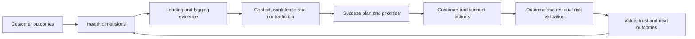

### Health statement pattern

> `As of <cutoff>, <dimension> is <bounded state> for <scope> because <evidence>. Confidence is <level> due to <quality/gaps>. This affects <customer outcome> through <mechanism/horizon>. Current controls and actions are <state>; the next decision is <ask>.`

---

## 2. The multidimensional health model

No single dimension is sufficient. Keep source-native signals and customer context visible.

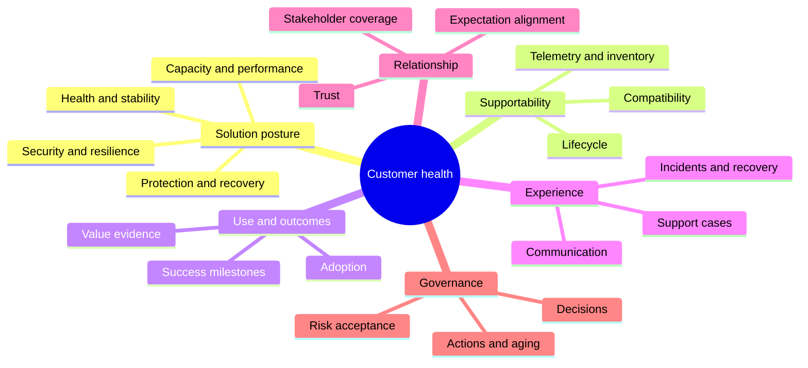

### Dimension catalog

| Dimension | Key questions | Example evidence | Common trap |
|---|---|---|---|
| **Solution health/stability** | Are material faults or degraded states present? | Current scoped health/events/incidents | Stale data reported as healthy |
| **Supportability** | Are exact current/target combinations and evidence valid? | IMT/HWU/release/application/vendor evidence | Runtime operation treated as support proof |
| **Adoption/use** | Are intended capabilities used appropriately? | Feature/use/process evidence with customer purpose | More use always called better |
| **Risk posture** | Which applicable risks threaten objectives? | Applicability, controls, horizon, confidence | Vendor severity copied as customer priority |
| **Support experience** | Can the customer obtain effective help? | Impact, handoffs, case aging, recurrence, evidence quality | Case count alone used as experience |
| **Relationship/trust** | Are expectations, communication, and credibility sound? | Stakeholder feedback, commitments, disputes | Sentiment treated as objective truth |
| **Governance** | Are decisions timely and authorities present? | Forums, decision wait, escalations | Meeting count treated as governance |
| **Action posture** | Do recommendations progress to proof? | Owner/date/blocker/validation/aging | Acknowledgment treated as closure |
| **Lifecycle** | Is planning ahead of lead time and support horizon? | Current official/contract/product evidence | Generic date or `latest` advice |
| **Capacity** | Is headroom aligned with demand and lead time? | Physical/logical trends and scenarios | Precise forecast from weak history |
| **Performance** | Are service objectives met under comparable load? | App/SLO and layer metrics | High utilization called bottleneck |
| **Protection/recovery** | Are RPO/RTO and restore/DR controls proven? | Policy, transfer, restore and test evidence | Successful backup called recoverability |

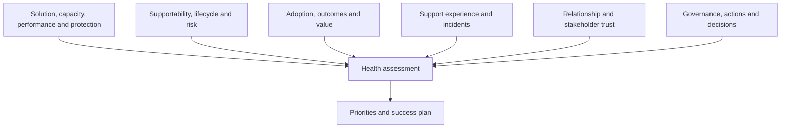

### Dimension interactions

A customer can have:

- Stable current operations but severe lifecycle lead-time risk.
- Strong adoption but poor supportability evidence.
- Good technical posture but damaged trust after communication failures.
- High case volume during a successful migration rather than poor product quality.
- Low case volume because the customer cannot or will not engage Support.

Avoid forcing these into one simplistic label.

---

## 3. Leading and lagging indicators

### Plain-English deep-dive: dashboard warning versus destination arrival

Fuel level and engine temperature are leading signals: they help act before failure. Arrival time is lagging evidence: it proves what happened. Neither replaces the other.

**Why it matters:** healthy leading controls do not guarantee an outcome, and a good historical outcome does not prove future readiness.

### Indicator examples

| Dimension | Leading indicator | Lagging indicator |
|---|---|---|
| Stability | Health prerequisites, telemetry freshness, open severe conditions | Customer-impact incidents and duration |
| Supportability | Current exact recipe evidence and lifecycle margin | Change blocked/delayed by unsupported state |
| Capacity | Headroom and latest-safe-start range | Threshold breach or emergency expansion |
| Performance | Baseline movement and queue/latency trend | SLO miss or user transaction delay |
| Protection | Current policies and scheduled restore tests | Measured restore point/time and data validity |
| Support experience | Evidence completeness and response handoff quality | Resolution/reopen/feedback outcomes |
| Governance | Named authority, action age, decision lead time | Missed milestone or unresolved accepted risk |
| Adoption/value | Training/readiness and workflow milestones | Verified outcome/usefulness and sustained use |

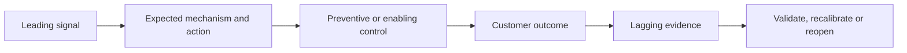

### Indicator contract

Every indicator needs objective, scope, grain, definition, source, cutoff, cadence, target authority, owner, quality state, action meaning, and known limitations.

### Beware metric substitution

- Recommendations sent are not risk reduced.
- Training attendance is not adoption.
- Case closure is not resolution quality.
- Backup success is not restore success.
- Review attendance is not stakeholder alignment.
- `Green` tool status is not customer outcome.

---

## 4. Health scores and RAG caveats

### Plain-English deep-dive: a grade averages unlike subjects

A student average of 80 can hide 100 in art and 60 in mathematics. If mathematics is a prerequisite, the average misleads. A health score can similarly hide a critical recovery or supportability gap behind strong relationship and adoption signals.

**Why it matters:** summary scores must never compensate away non-negotiable risk or conceal unknown data.

### Score risks

| Risk | Example | Control |
|---|---|---|
| Compensability | Strong relationship offsets severe restore gap | Non-compensable veto/visible dimension |
| False precision | `82.7` from subjective categories | Bands plus source dimensions |
| Unknown suppression | Missing telemetry becomes zero/green | Explicit Unknown and coverage |
| Double counting | Incidents, stability and support experience overlap | Define independent dimensions |
| Stale weighting | Model no longer matches objectives | Version and governance review |
| Gaming | Close easy actions to lift score | Stable population and outcome proof |
| Sentiment bias | One loud stakeholder controls relationship score | Broader evidence and context |
| Commercial bias | Renewal timing changes technical health | Separate technical and commercial records |

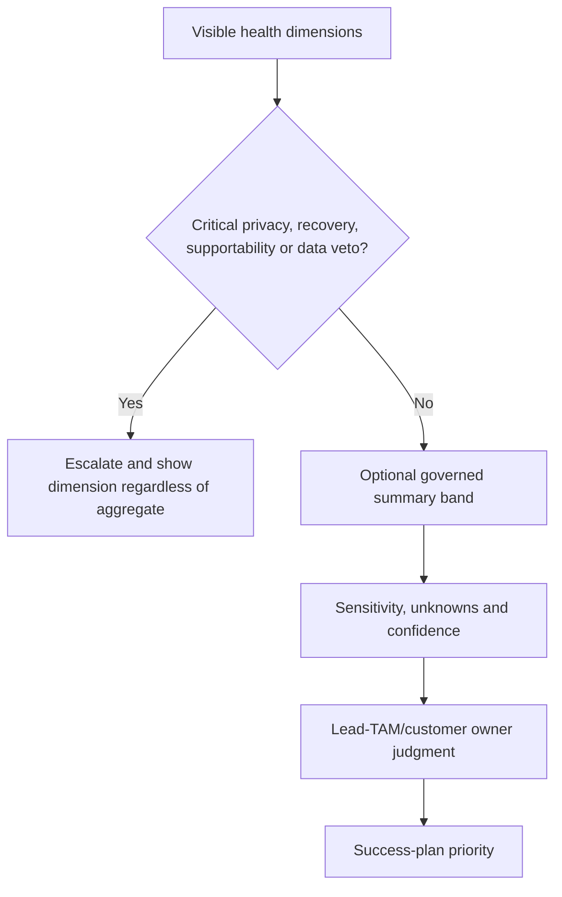

### RAG status

Red/amber/green can support scanning only when:

- Each state has approved definitions.
- Unknown/no-data/conflicting are separate states.
- Source date and population are visible.
- Critical dimensions remain individually visible.
- Status leads to a named action or monitoring rule.
- Color is paired with text/icons for accessibility.

### Never infer probability casually

A local health band is not a renewal probability, outage probability, or vendor severity. Do not convert an ordinal score into `80% healthy` without a valid definition.

---

## 5. Success plans: outcomes, milestones, owners, and evidence

A **success plan** is a shared, living agreement that connects customer outcomes to measurable milestones, responsibilities, dependencies, risks, and evidence.

### Success-plan anatomy

| Field | Required content |
|---|---|
| Outcome | Customer capability/result, not vendor activity |
| Baseline | Starting condition and cutoff |
| Measure | Evidence, definition, target/range and owner |
| Milestones | Evidence of progressive capability, not dates alone |
| Actions | Customer/account/partner responsibilities |
| Dependencies | Technical, people, budget, access, change and vendor |
| Risks/assumptions | Mechanism, horizon, controls and tests |
| Governance | Forum, cadence, decision authority and escalation |
| Validation | Technical, application, business and sustained evidence |
| Residual | Remaining risk, monitoring and review |

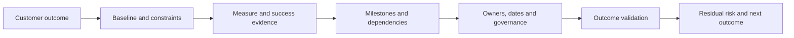

### Outcome hierarchy

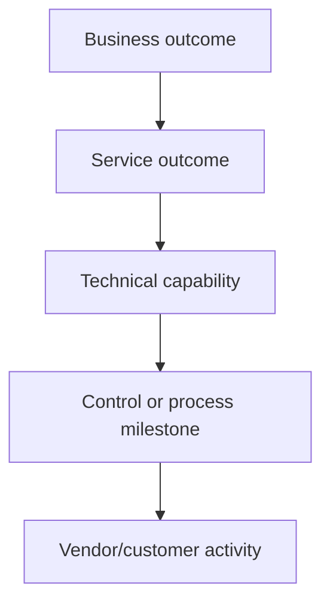

Example:

- Activity: hold restore workshop.
- Milestone: approved restore runbook and test prerequisites.
- Technical capability: restore completes with valid data.
- Service outcome: application returns within defined RTO/RPO.
- Business outcome: critical workflow resumes within tolerated interruption.

### Success-plan lifecycle

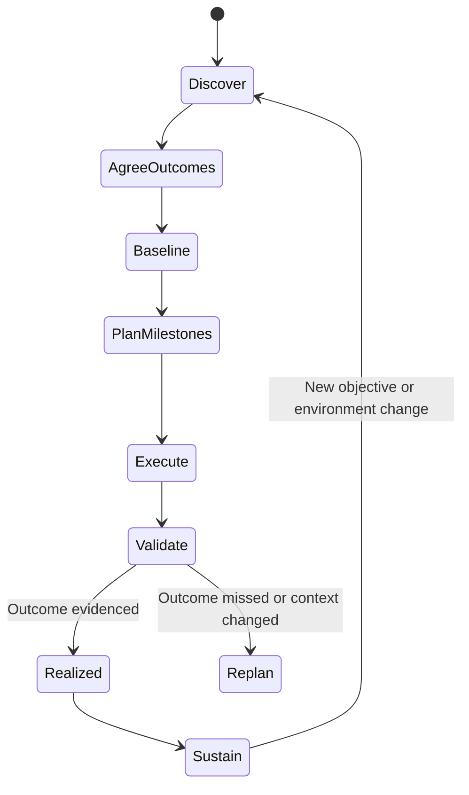

Do not write the customer's success plan for them. Co-create it with authorized outcome owners.

---

## 6. Value realization and attribution caution

### Plain-English deep-dive: contribution is not sole causation

An umbrella contributes to staying dry, but the result also depends on wind, rain intensity, clothing, and route. A TAM review may contribute to an earlier decision, while customer engineering, funding, partner delivery, and product capability produce the outcome together.

**Why it matters:** honest attribution is more credible than claiming every positive outcome.

### Value chain

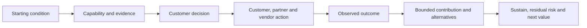

### Value types

| Value type | Evidence orientation | Caution |
|---|---|---|
| Risk reduction | Exposure/control/validation changed | Avoid claiming event would definitely occur |
| Decision quality | Earlier/current evidence and clearer options | Decision can still have uncertain outcome |
| Stability | Comparable incident/SLO trend and mechanism | Other changes may explain improvement |
| Support experience | Fewer repeated evidence/handoff defects, better feedback | Case mix and severity can change |
| Efficiency | Less manual work or faster cycle at same quality | Do not shift hidden work to another team |
| Adoption | Capability used for intended workflow | Usage is not value without outcome |
| Lifecycle readiness | Milestones before latest safe start | Program delivery remains uncertain |
| Recovery readiness | Restore/DR tests meet objectives | One scenario does not prove all disasters |

### Counterfactual caution

The **counterfactual** asks what would have happened without the service/action. Usually it cannot be observed directly.

Prefer:

> `The analysis surfaced the supportability gap before change approval and enabled an evidence-based hold.`

Avoid:

> `The TAM prevented an outage.`

unless a defensible design supports that causal claim.

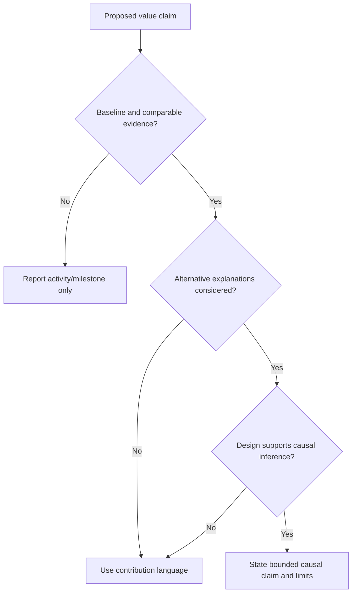

---

## 7. Renewal sensitivity and loyalty without manipulation

Renewal and loyalty can be affected by value, trust, product fit, service experience, price, strategy, competition, procurement, and organizational change. A Technical Analyst should support an accurate technical/value narrative without inventing commercial forecasts or pressuring the customer.

### Ethical boundary

| Ethical behavior | Manipulative behavior |
|---|---|
| Make risks, options and timing clear | Exaggerate risk near renewal |
| Show validated outcomes and open gaps | Hide failures to protect account optics |
| Ask what success means to the customer | Treat all adoption as upsell opportunity |
| Preserve customer decision authority | Use fear, urgency, or executive pressure to force action |
| Separate technical and commercial claims | Present renewal likelihood as technical health |
| Record product/service limitations | Promise unsupported roadmap or outcome |

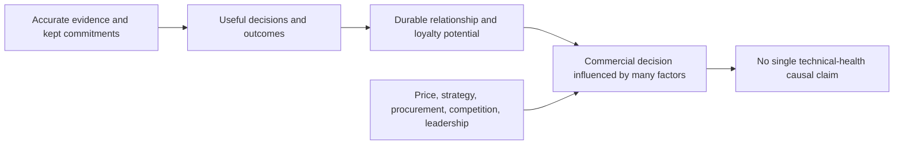

### Loyalty signals

Potential signals include stakeholder engagement, willingness to share context, confidence in advice, adoption of jointly agreed actions, constructive challenge, advocacy, and continuity of governance. Each can have alternate explanations and privacy/sentiment limitations.

### Technical analyst contribution

- Supply accurate evidence and outcome history.
- Show remaining technical exposure honestly.
- Clarify what service activities enabled and what the customer implemented.
- Avoid commercial commitments and unsupported competitor claims.
- Route commercial questions to accountable account roles.

---

## 8. Trust building and recovery

Trust grows when words, evidence, ownership, and outcomes remain consistent over time.

### Trust ingredients

- Competence: sound method and appropriate expertise.
- Reliability: commitments and checkpoints are kept.
- Integrity: facts, uncertainty, limitations, and errors are visible.
- Benevolence: customer outcome is prioritized over self-protection.
- Role clarity: authority and boundaries are respected.

### Trust-recovery sequence

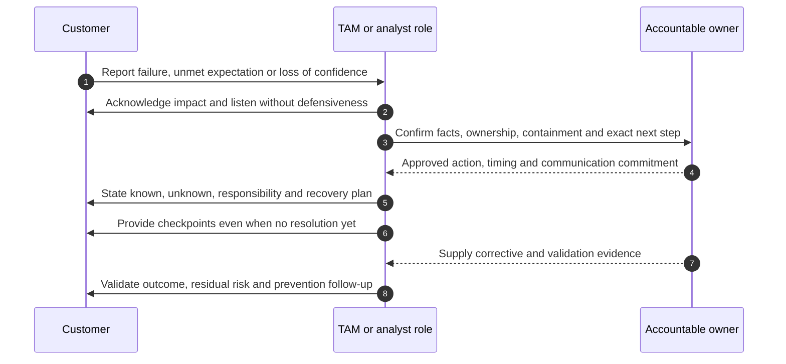

### Acknowledgment versus resolution

- **Acknowledgment:** `We understand the impact and own the next communication/action.`
- **Containment/restoration:** Immediate consequence reduced or service restored.
- **Resolution:** The current issue is addressed within verified scope.
- **Prevention:** Corrective control reduces recurrence mechanism.
- **Trust recovery:** Repeated evidence shows improved behavior and reliability.

Do not say `trust is restored` on behalf of the customer. Ask and observe over time.

### Difficult trust states

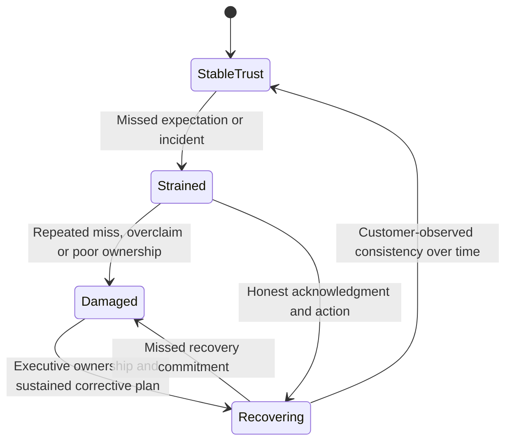

---

## 9. Health governance, actions, and lifecycle

### Health-review cycle

```mermaid
flowchart LR
    SCOPE[Outcomes, dimensions, population and cutoff] --> EVID[Sources and data quality]
    EVID --> ASSESS[Dimension assessment and confidence]
    ASSESS --> PRIOR[Customer-context priorities]
    PRIOR --> PLAN[Success-plan actions and milestones]
    PLAN --> GOVERN[Forums, decisions and escalation]
    GOVERN --> VALID[Outcome and trust validation]
    VALID --> REFRESH[Refresh model and next outcomes]
```

### Health record

For every dimension include:

- Scope and customer objective.
- Evidence sources, cutoff, quality, and confidence.
- Current condition, trend, and leading/lagging signals.
- Contradictions and alternate explanations.
- Risk/value implication and time horizon.
- Existing controls and action state.
- Owner, milestone, validation, and residual risk.

### Action posture

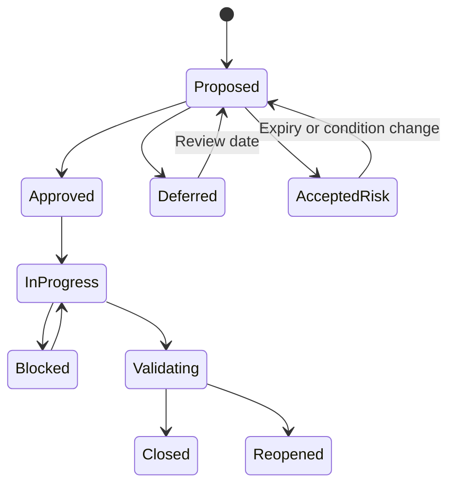

Health should worsen or become uncertain when critical evidence expires, an action misses latest safe start, a control fails, decision authority disappears, or a customer objective changes. Do not preserve green status for narrative convenience.

---

## 10. Discovery, evidence, risks, actions, and validation

### Discovery questions

1. Which customer outcomes, services, stakeholders, and time horizons define health?
2. Which solution, supportability, adoption, risk, support, relationship, governance, action, lifecycle, capacity, performance, and protection dimensions matter?
3. What leading and lagging evidence, source, cutoff, definition, owner, and quality apply?
4. Which unknowns, contradictions, biases, or score assumptions can change the conclusion?
5. What success-plan outcome, baseline, milestone, dependency, and validation are agreed?
6. Which value claim is activity, contribution, correlation, or defensible causation?
7. Which trust or loyalty signal is sensitive, and who may see/use it?
8. What action, owner, decision, residual risk, and next review are required?

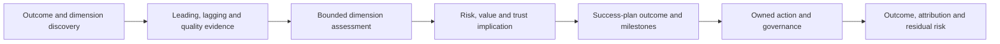

### Health-risk/action examples

| Finding | Risk/value implication | Action | Validation |
|---|---|---|---|
| Restore proof expired | Recoverability confidence is unknown | Run authorized recovery test | RPO/RTO/data/app result |
| Lifecycle lead time narrows | Options and budget timing may shrink | Start discovery/funding milestones | Approved roadmap before latest safe start |
| Strong relationship, stale telemetry | Trust cannot compensate for evidence gap | Repair source and show unknown state | Current receipt and quality |
| Actions acknowledged but not validated | Reported progress overstates risk movement | Change closure rule | Evidence-based closure/reopen trend |
| Low engagement after communication miss | Trust and context may degrade | Listening session and corrective commitments | Customer feedback and sustained delivery |

---

## 11. Fully synthetic sanitized scenario: Pinecrest Legal health reset

> **Synthetic boundary:** `Pinecrest Legal`, all services, systems, scores, incidents, contracts, people, objectives, actions, dates, metrics, and outcomes are invented. The scenario is not a NetApp account, customer-health method, Digital Advisor result, renewal forecast, or Arti production work.

### Initial headline

The fictional account is reported as `Green, score 86` because product use and meeting attendance are high.

### Dimension-level evidence

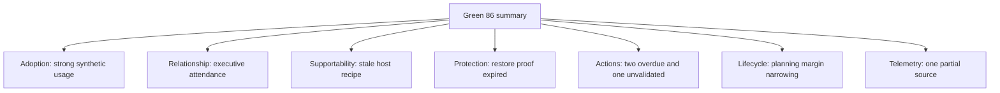

| Dimension | Synthetic evidence | Bounded state |
|---|---|---|
| Solution stability | No material incident in quarter; one partial source | Stable observed scope; medium confidence |
| Supportability | Recipe predates host-driver change | Unknown target supportability |
| Adoption | Intended file workflow used by 80% synthetic cohort | Strong use; outcome not yet proven |
| Support experience | One critical case had repeated handoff | Strained for affected service |
| Relationship | Sponsor attends; application owner stopped attending | Mixed, not green |
| Governance/actions | Two actions beyond latest safe start | At risk |
| Lifecycle | Program lead time consumes horizon | Plan now |
| Protection | Restore test 16 months old | Recovery proof stale |

### Health conclusion

> `As of 2026-08-24, adoption is strong in the synthetic scope, but overall posture cannot be called uniformly green. Restore proof is stale, target supportability is unknown after a driver change, two actions are late, and application-owner engagement declined after a handoff failure. No outage or renewal probability is asserted. Priorities are evidence recovery, supportability validation, action replan, and trust repair.`

### Success plan

| Outcome | Baseline | Milestone/action | Owner | Validation |
|---|---|---|---|---|
| Prove recoverability | Restore evidence 16 months old | Plan and execute approved restore scenario | Backup/app owners | RPO/RTO and data/app signoff |
| Restore upgrade decision readiness | Stale recipe | Inventory and validate exact current/target recipe | Host/storage owners | Dated reviewed result and notes |
| Improve action governance | Two late, one implementation-only closure | Replan WIP and require validation | Sponsor/action owners | Aging and validated closure |
| Recover app-owner trust | Handoff failure and missed follow-up | Listening, acknowledgment, corrective commitment | Lead TAM/customer sponsor | Owner feedback and kept checkpoints |
| Demonstrate workflow value | Usage known; outcome unknown | Define baseline and user workflow measure | Service owner | Outcome trend with attribution caveat |

### Trust-recovery path

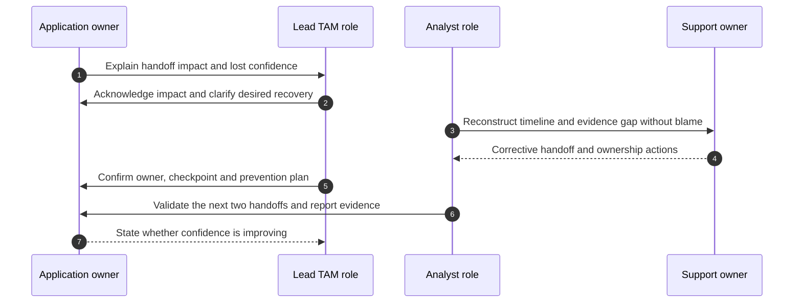

### Synthetic outcomes

- Restore succeeds but misses the fictional RTO; health does not become green, and a recovery-performance action opens.
- Exact compatibility evidence is refreshed; it supports planning but does not guarantee change success.
- The sponsor reduces WIP and two actions reach validation.
- Application-owner participation resumes after kept commitments; the guide calls this a trust-recovery signal, not proof of loyalty or renewal.
- Workflow use correlates with faster document retrieval, but other process changes prevent sole-causation claims.

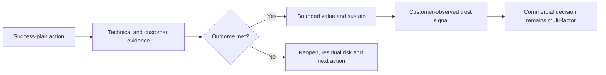

---

## 12. Anti-patterns and corrections

| Anti-pattern | Why it fails | Better practice |
|---|---|---|
| One health score hides dimensions | Critical gaps compensate away | Show dimensions, vetoes and unknowns |
| Green because no cases | Customer may be disengaged or blind | Validate coverage and outcomes |
| High use equals value | Activity may not improve outcome | Link to customer success measure |
| Case count equals product quality | Mix/severity/context differ | Analyze impact, cause, handoff and outcome |
| Meeting attendance equals relationship | Attendance can be compulsory | Use broader trust and behavior evidence |
| Renewal timing changes technical color | Commercial bias corrupts truth | Separate records and authorities |
| Fear-based risk near renewal | Manipulative and damages trust | Evidence, options and customer authority |
| Claim prevented outage | Counterfactual usually unknowable | State surfaced risk/enabled decision |
| Apologize without corrective action | Words do not restore reliability | Acknowledge, own, act, validate, sustain |
| Close success plan on activity | No outcome proof | Validate technical/service/business result |
| Hide bad news to protect loyalty | Trust collapses when discovered | Prompt accurate bounded communication |

---

## 13. Arti's factual bridge and JD Mapping

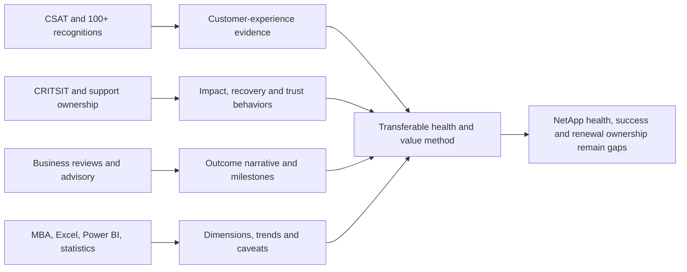

### Factual tie

| Arti evidence | Transfer | Boundary |
|---|---|---|
| CSAT >4.75 Enterprise and >4.85 SMB | Measured support-experience awareness | Not a NetApp health or renewal score |
| 100+ recognitions | Repeated customer/peer feedback signal | Not proof of storage expertise or loyalty |
| CRITSIT/business-critical incidents | Trust, cadence, ownership and recovery | Not NetApp incident/product authority |
| Business reviews/advisory | Outcomes, risks, actions and stakeholder narrative | Not NetApp success-plan ownership |
| MBA/analytics/Power BI/Excel | Multidimensional models, trends, uncertainty | No production NetApp account dataset |
| Mentoring/Product collaboration | Relationship and cross-team contribution | No Customer Success or commercial authority |

### JD Mapping

| JD responsibility | Part 64 capability | Honest boundary |
|---|---|---|
| Improve support experience/loyalty | Support and trust dimensions with recovery | No loyalty or renewal causation claim |
| Maximize solution value | Outcome-based success and value chain | Customer defines success |
| Mitigate risk/stability | Technical dimensions and leading controls | Current NetApp evidence required |
| Track remediation | Action states, validation and residual risk | Customer/action owners execute |
| Operational reviews | Health narrative and success-plan progress | Part 61 review governance applies |
| Strategic planning | Lifecycle, capacity and lead-time outcomes | No production roadmap authority |
| Analyze/report data | Indicator/score quality and attribution | Live account data remains gated |
| Influence ethically | Transparent options without fear | Commercial roles own renewal motion |

### Honest interview statement

> `I would not begin with a single color. I would assess solution, supportability, adoption, risk, support experience, relationship, governance, actions, lifecycle, capacity, performance and protection using dated leading and lagging evidence. I would convert priorities into a customer-owned success plan and measure value with contribution/counterfactual caution. My factual customer experience is Microsoft support; I have not operated a NetApp health, success or renewal model.`

---

## 14. Role plays, paper lab, and self-test

### Role play 1: commercial pressure

An account stakeholder asks you to change a technical-health status from amber to green before renewal. Explain evidence, separate commercial and technical records, propose the exact actions that could change the status, and escalate integrity concerns appropriately.

### Role play 2: satisfied but risky customer

The sponsor says `We are happy, so why discuss restore testing?` Respect the experience, separate relationship from recoverability, explain objective/evidence gap, and offer a proportionate validation path without fear.

### Role play 3: trust damage

A customer says the team promised an update and disappeared. Acknowledge impact, do not defend intent, establish owner/checkpoint/corrective action, and explain how follow-through will be measured.

### Paper lab: synthetic health and success model

```mermaid
flowchart LR
    OUT[Define customer outcomes] --> DIM[Build 12 health dimensions]
    DIM --> IND[Leading and lagging indicators]
    IND --> SCORE[Critique optional score and vetoes]
    SCORE --> PLAN[Create success plan]
    PLAN --> VALUE[Measure value with attribution caution]
    VALUE --> TRUST[Run loyalty and trust scenarios]
    TRUST --> QA[Validate and improve model]
```

Build a fully synthetic three-service account with 40 assets, six stakeholders, 18 cases, 12 risks, 15 actions, lifecycle/capacity/performance/protection evidence, adoption data, customer feedback, and a fictional renewal date.

Inject:

- Green aggregate hiding failed restore proof.
- Unknown telemetry excluded from denominator.
- High adoption with no outcome measure.
- Strong executive relationship but absent app owner.
- Case spike caused by migration, not deterioration.
- Two actions closed on implementation only.
- Expired accepted risk.
- Commercial pressure to soften health language.
- Trust damage from missed update.
- Correlated improvement with three plausible causes.

### Lab tasks

1. Define outcomes, scope, dimensions, evidence and privacy.
2. Create leading/lagging indicator contracts.
3. Build and critique RAG/weighted summaries.
4. Define non-compensable vetoes and Unknown state.
5. Create success outcomes, baselines, milestones, owners and validation.
6. Write bounded value claims and counterfactual caveats.
7. Separate renewal/loyalty signals from technical health.
8. Run all three role plays and trust-recovery sequence.
9. Validate outcomes and reopen failed milestones.
10. Answer Q1-Q8 aloud.

### Self-test

1. Define customer health and all 12 dimensions.
2. Distinguish leading and lagging indicators.
3. Critique RAG, scores, weighting, unknowns and gaming.
4. Build a complete success plan.
5. Connect activity, milestone, capability, service and business outcome.
6. Explain value attribution and counterfactual caution.
7. Handle renewal sensitivity ethically.
8. Explain trust ingredients and recovery sequence.
9. Recreate Pinecrest Legal and state Arti's nonclaim.
10. Deliver Q1-Q8 aloud.

### Lab pass checklist

- [ ] All solution, supportability, adoption, risk, support, relationship, governance, action, lifecycle, capacity, performance and protection dimensions are explicit.
- [ ] Leading and lagging indicators have source, cutoff, definition, owner and action meaning.
- [ ] Unknowns, critical vetoes and individual dimensions remain visible.
- [ ] Scores/RAG are labeled governed summaries, not probability or truth.
- [ ] Success plans contain outcomes, baselines, milestones, dependencies, owners and proof.
- [ ] Value claims distinguish activity, contribution, correlation and causation.
- [ ] Counterfactual limitations are visible.
- [ ] Renewal and loyalty signals are handled without manipulation or fear.
- [ ] Trust recovery includes acknowledgment, ownership, action, checkpoints and validation.
- [ ] All evidence is fully synthetic and sanitized.
- [ ] No NetApp health model, customer result, renewal, or loyalty claim is invented.

---

## 15. Official and Public Source Anchors

**Date checked: 2026-08-24.** The supplied NetApp TAM Technical Analyst job description, represented in the master guide's JD matrix, is the primary source for role responsibilities concerning support experience, value and loyalty. Public sources below provide bounded product/service and benefits context; they do not establish a NetApp internal health, success, or renewal model.

| Topic | Official/public source | Bounded use |
|---|---|---|
| Digital Advisor wellness | [Learn about Digital Advisor wellness](https://docs.netapp.com/us-en/active-iq/concept_overview_wellness.html) | Public wellness/risk orientation; live customer signals and severity are gated/current |
| Digital Advisor risks/actions | [View risks and take corrective actions](https://docs.netapp.com/us-en/active-iq/task_view_risk_and_take_action.html) | Public workflow orientation; not a total customer-health score or change authority |
| NetApp support context | [NetApp Support Services](https://www.netapp.com/services/support/) | Public service context; exact service and outcomes require account/contract evidence |
| NetApp services | [NetApp Services](https://www.netapp.com/services/) | Public high-level value/delivery context; no account result inferred |
| Benefits realization | [Benefits Realization Management - PMI](https://www.pmi.org/learning/thought-leadership/series/benefits-realization) | Official PMI thought-leadership entry for connecting outputs to outcomes/benefits |
| Service/value management | [ITIL information from PeopleCert](https://www.peoplecert.org/browse-certifications/it-governance-and-service-management/ITIL-1) | Official ITIL-owner context for value and continual improvement |
| Privacy governance | [NIST Privacy Framework](https://www.nist.gov/privacy-framework) | Governance/privacy orientation for health, sentiment and relationship data |

### Source-use discipline

- Record source, dimension, definition, scope, cutoff, quality, access and owner.
- Preserve source-native severity separately from customer priority and health interpretation.
- Recheck exact lifecycle, supportability, risk and customer objectives before each assessment.
- Separate technical, relationship and commercial records by purpose and access.
- Never infer renewal probability, loyalty, avoided outage, or internal NetApp health status from this model.
- Attribute outcomes to customer, partner, product and service contributions honestly.

---

## Likely Interview Questions

### Q1. How would you assess customer health?

> **Model answer:** `I define customer outcomes and assess separate solution, supportability, adoption, risk, support-experience, relationship, governance, action, lifecycle, capacity, performance and protection dimensions. Each uses dated leading/lagging evidence, confidence, unknowns, controls and owner. I summarize only after critical dimensions and caveats remain visible.`

### Q2. What is the difference between leading and lagging indicators?

> **Model answer:** `Leading indicators show conditions or controls that may precede outcomes, such as telemetry freshness, headroom or restore-test scheduling. Lagging indicators show what happened, such as SLO misses or measured restore time. Leading controls do not guarantee success, and past lagging success does not guarantee readiness.`

### Q3. What are the risks of a health score or RAG status?

> **Model answer:** `Unlike dimensions can compensate, unknowns can disappear, subjective inputs gain false precision, overlapping metrics double-count, and teams can game easy closures. I show source dimensions, Unknown, non-compensable vetoes, definitions, cutoff, sensitivity and customer-owner judgment; a health band is not outage or renewal probability.`

### Q4. What makes a success plan useful?

> **Model answer:** `Customer-owned outcomes, a verified baseline, measures and target authority, capability-based milestones, named customer/account actions, dependencies, risks, governance, technical/application/business validation and residual risk. Meetings and training are activities; the plan closes on customer outcome evidence.`

### Q5. How do you prove value without overclaiming?

> **Model answer:** `I connect baseline, capability, decision, customer/partner/vendor action and observed outcome, then state contribution and alternate explanations. I can say analysis surfaced a gap before approval; I do not claim an outage was prevented unless a defensible counterfactual design supports it.`

### Q6. How should renewal and loyalty affect technical communication?

> **Model answer:** `They should not change technical facts, risk status or uncertainty. I provide accurate outcome and open-risk evidence, avoid fear or unsupported roadmap promises, protect sensitive commercial data, and route commercial decisions to accountable roles. Loyalty emerges from usefulness, integrity and kept commitments.`

### Q7. How do you recover trust after a failure?

> **Model answer:** `Acknowledge impact without defensiveness, listen, state known/unknown and role ownership, contain or restore, set reliable checkpoints, deliver corrective action, validate the outcome and prevention, and ask the customer whether confidence is improving. One apology does not declare trust restored.`

### Q8. How does your background transfer, and what remains a gap?

> **Model answer:** `My Microsoft CSAT, recognitions, CRITSIT ownership, customer reviews, analytics and advisory work support experience, trust, trend and outcome discipline. I have not operated a NetApp customer-health, success or renewal model, so live account dimensions, sources, objectives and commercial interpretation require authorized NetApp/customer owners.`

---

## 30-Second Memory Hooks

- **Health:** Dated multidimensional picture, not a color.
- **Dimensions:** Solution, supportability, adoption, risk, support, relationship, governance, actions, lifecycle, capacity, performance, protection.
- **Leading:** Early condition/control; **lagging:** actual outcome.
- **Unknown:** Separate state, never silently green or excluded.
- **Score:** Summary under assumptions, not probability or truth.
- **Veto:** Critical recovery/support/privacy risk cannot average away.
- **Success plan:** Outcome + baseline + milestone + owner + proof + residual.
- **Activity:** Work performed; **value:** useful outcome realized.
- **Attribution:** Contribution is not sole causation.
- **Counterfactual:** What would have happened otherwise is usually unobserved.
- **Loyalty:** Earned through accurate, useful, reliable behavior.
- **Renewal:** Multi-factor commercial decision, not a technical-health output.
- **Trust recovery:** Acknowledge -> own -> act -> update -> validate -> sustain.
- **Arti's bridge:** CSAT and support experience transfer; NetApp health ownership does not.

---

## Completion Checklist

- [ ] Define customer health and all 12 required dimensions.
- [ ] Build bounded health statements with cutoff, confidence and action.
- [ ] Separate leading and lagging indicators with complete contracts.
- [ ] Explain every health-score, RAG, weighting, unknown and gaming caveat.
- [ ] Define critical non-compensable vetoes.
- [ ] Build a customer-owned success plan with outcomes and milestones.
- [ ] Connect activity, capability, service and business outcomes.
- [ ] Measure value with baseline, contribution and counterfactual caution.
- [ ] Handle renewal/loyalty sensitivity without fear or manipulation.
- [ ] Build trust and execute a complete trust-recovery sequence.
- [ ] Govern health through actions, decisions, validation and residual risk.
- [ ] Recreate the fully synthetic Pinecrest scenario and paper lab.
- [ ] Answer Q1-Q8 aloud and state the exact nonclaim.
- [ ] Protect technical, relationship and commercial data appropriately.
- [ ] Recheck current authoritative product, service and customer evidence.

---

*Next suggested section:* [Part 65 - PowerPoint and Data Storytelling for Technical and Executive Audiences](Part-65-powerpoint-data-storytelling.md)