# Part 65 - PowerPoint and Data Storytelling for Technical and Executive Audiences

> **Section goal:** Turn verified technical analysis into a clear PowerPoint decision narrative for executives and engineers. By the end, Arti should be able to define audience and decision, build a message-first storyline and executive summary, write conclusion titles, draw architecture and data flows, choose responsible charts and heatmaps, present recommendations and actions, create a technical appendix, apply visual hierarchy and accessibility, show source/cutoff/uncertainty, use speaker notes, distinguish live and send-ahead decks, and run complete content/visual/presentation QA without slide clutter.

Covers index item **65** and maps directly to job-description responsibilities for Microsoft Office and PowerPoint, analyzing and reporting customer data, conducting operational service reviews, representing recommendations clearly, communicating with technical and executive stakeholders, influencing preventative remediation, working under lead-TAM guidance, and improving customer value.

**Explicit nonclaim:** Arti has not authored, presented, approved, or distributed a production NetApp customer deck or represented a live NetApp recommendation in PowerPoint.

**Privacy and access boundary:** Decks can expose customer identifiers, topology, versions, telemetry, incidents, vulnerabilities, support cases, costs, contracts, stakeholders, decisions, and accepted risks. Use authorized minimum data, approved templates/repositories, role-appropriate redaction, sensitivity labels and access controls where available, controlled exports, distribution review, retention, and secure links rather than uncontrolled attachment chains.

**Synthetic-evidence rule:** Every customer, system, topology, chart, metric, threshold, slide, incident, risk, recommendation, owner, date, decision, and outcome below is fictional and sanitized. No screenshot, table, visual, or speaker note is a real AutoSupport, Digital Advisor, ONTAP, IMT, HWU, case, account, or customer result.

**Version and current-source caveat:** PowerPoint features, templates, Designer, fonts, chart behavior, accessibility tools, alt text, reading order, speaker notes, Presenter View, coauthoring, export, sensitivity labels, and Microsoft 365 policy vary by platform, edition, tenant, and update channel. Product/support facts and customer evidence also change. A **current-source check** means reopening official Microsoft documentation for the deployed PowerPoint version and revalidating every technical source/result at the deck cutoff and decision time.

This Part provides a design and communication method, not a NetApp internal deck template, brand standard, required review format, commercial claim, production recommendation, or authorization to distribute customer data. Actual branding, legal, accessibility, account, customer, and information-protection requirements govern real presentations.

> **No-production-NetApp boundary:** Arti's factual strengths are Microsoft customer and business reviews, executive communication, Excel, Power BI, PowerPoint exposure, analytics, an MBA in Business Analytics, CRITSIT updates, technical writing, and Product/Engineering collaboration. She does **not** claim a production NetApp review deck, live NetApp source access, approved ONTAP recommendation, customer presentation result, or NetApp brand/process ownership. Her exact non-claim is: **she has not built, approved, presented, or distributed a production NetApp technical or executive PowerPoint deck.**

---

## 1. A deck is a decision narrative, not a document dump

**Data storytelling** is the disciplined arrangement of evidence, context, visuals, uncertainty, and action so a specific audience can understand a conclusion and make a sound decision.

### Plain-English deep-dive: the deck is a guided route

A box of maps, photos, receipts, and traffic reports contains useful material but does not guide a traveler. A route plan selects the relevant evidence, orders it, marks hazards, and states the next turn. A deck should do the same.

**Why it matters:** adding more evidence can reduce understanding when the audience cannot find the decision.

| Term | Plain meaning | Analogy | Why it matters |
|---|---|---|---|
| **Audience** | People who will use or decide from the deck | Travelers with different needs | Sets depth and language |
| **Decision** | Authorized choice or action sought | Route selection | Gives the deck a finish line |
| **Message-first** | Start from conclusions, then choose support | Newspaper headline before article | Prevents chart-led wandering |
| **Storyline** | Ordered chain of messages | Route through waypoints | Creates coherence across slides |
| **Executive summary** | Compact outcomes, risks, decisions, and actions | Briefing at the gate | Enables fast orientation |
| **Conclusion title** | Slide title stating the takeaway | Road sign saying bridge closed | Makes skimming useful |
| **Technical appendix** | Detailed evidence available on demand | Engineering drawings behind a proposal | Keeps core narrative clear |
| **Visual hierarchy** | Deliberate order of attention | Large/clear signs before fine print | Helps readers scan correctly |
| **Speaker notes** | Presenter guidance not replacing visible evidence | Rehearsal cue card | Supports consistent delivery |

```mermaid
flowchart LR
    DEC[Audience and decision] --> MSG[One-sentence core message]
    MSG --> STORY[Message-first storyline]
    STORY --> EVID[Select evidence and visuals]
    EVID --> SLIDES[Executive core and technical appendix]
    SLIDES --> QA[Content, visual, privacy and accessibility QA]
    QA --> DELIVER[Present or send ahead]
    DELIVER --> ACTION[Decision, action and validation]
```

### Core test

If the audience reads only the deck title, executive summary, slide titles, decision slide, and action slide, can they understand:

- What changed?
- Why does it matter?
- What evidence supports it, as of when?
- What is uncertain?
- What choice or action is needed?
- Who owns it and what proves success?

---

## 2. Audience, purpose, and decision contract

### Audience questions

- Who is present, absent, and the actual decision authority?
- What does each role already know and care about?
- What terminology and detail can be assumed?
- What challenge or objection is likely?
- Will the deck be presented live, read asynchronously, or both?
- What information is restricted for this audience?
- What accessibility, language, time-zone, or device constraints apply?

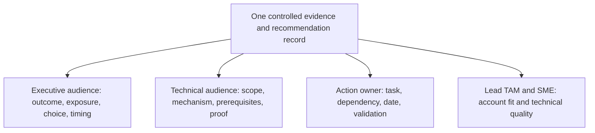

### Decision contract

| Field | Required content |
|---|---|
| Purpose | Inform, validate, discuss, decide, or approve |
| Decision | Exact bounded choice and decision owner |
| Scope | Customer/service/assets/time/exclusions |
| Evidence cutoff | Latest included data and source quality |
| Options | Proposed, alternatives and status quo |
| Constraints | Budget, maintenance, risk, support, resource and timing |
| Desired output | Decision, evidence request, action or escalation |

### Present versus send-ahead decks

| Dimension | Live presentation | Send-ahead/read-alone |
|---|---|---|
| Text | Minimal, scannable, presenter adds context | More complete explanatory labels and callouts |
| Pace | Reveal through conversation and questions | Reader controls order/time |
| Notes | Presenter cues and transitions | Visible context cannot depend on notes |
| Navigation | Linear core plus appendix jumps | Clear contents, links, definitions and references |
| Accessibility | Room/screen/remote delivery tested | Reading order, alt text and export tested |
| Ambiguity | Presenter can clarify | Slide must stand alone without overloading |

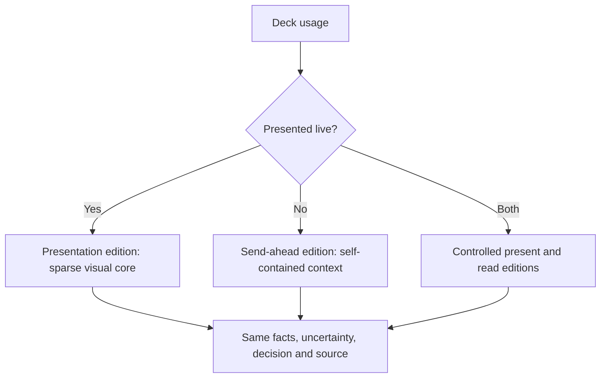

Do not create two uncontrolled truths. Both editions should derive from the same evidence and decision record and carry version/cutoff.

---

## 3. Message-first storyline and executive summary

### Plain-English deep-dive: write the verdict before choosing exhibits

A lawyer identifies the proposition to prove before selecting exhibits. Starting with every available exhibit produces a long, unfocused case. In data storytelling, write the decision message first, then select only evidence that supports or challenges it.

**Why it matters:** chart availability should not determine the story.

### Storyline spine

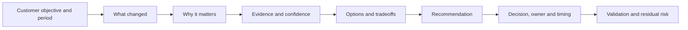

### Storyboard before slides

Write one conclusion sentence per planned slide on paper. Read only the sentences. They should form a coherent argument without duplicated messages or missing logic.

Example:

1. `The review covers 20 synthetic assets through 2026-08-24; one telemetry source is partial.`
2. `Service stability remained within the observed scope, but recovery proof and target supportability are incomplete.`
3. `Lifecycle lead time now consumes the apparent planning horizon.`
4. `Two evidence actions should start now; the purchase decision remains premature.`
5. `The sponsor is asked to approve discovery and restore validation by the next checkpoint.`

### Executive-summary architecture

| Block | Content |
|---|---|
| Outcome/status | One bounded sentence about the customer objective |
| Material changes | 2-4 changes since prior period |
| Top risks/unknowns | Consequence, horizon, confidence |
| Recommendations | Specific preferred actions and rationale |
| Decisions | Exact asks, authority and deadline |
| Progress/value | Validated outcomes, attribution caveat |
| Data note | Cutoff, coverage and critical limitation |

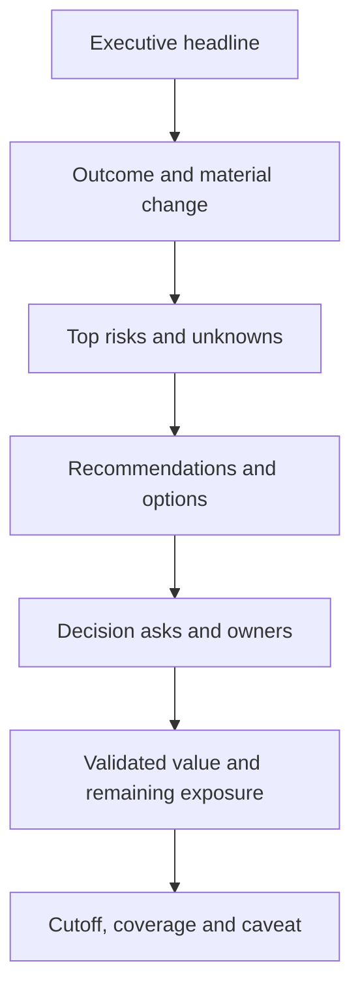

### One-slide executive summary

Prefer 3-5 concise messages and one decision/action table over a dense dashboard. The summary should not contain every KPI simply because it exists.

---

## 4. Conclusion titles and slide anatomy

### Weak versus strong titles

| Weak topic title | Strong conclusion title |
|---|---|
| Capacity update | `High-demand scenario moves the planning start into this quarter` |
| Incidents | `Three handoff defects repeated; no common product cause is proven` |
| Lifecycle | `Discovery must begin now to preserve supported options` |
| Recommendations | `Approve restore validation; hold upgrade target until recipe evidence is current` |
| Action status | `Two overdue actions need sponsor reprioritization before the freeze` |

### Slide anatomy

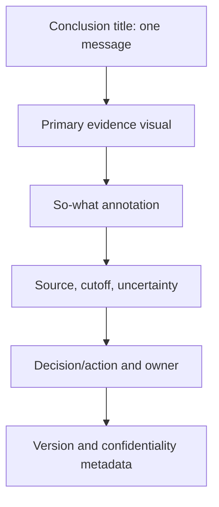

### The assertion-evidence pattern

- **Assertion:** the title states what the evidence supports.
- **Evidence:** chart, diagram, table, or short text proves the assertion.
- **Annotation:** identifies the important comparison or anomaly.
- **Caveat:** states quality/uncertainty material to the decision.
- **Action:** explains what should happen next.

### One-message rule

If a slide requires `and` to join unrelated conclusions, split it. A slide can contain several evidence elements only when they support the same assertion.

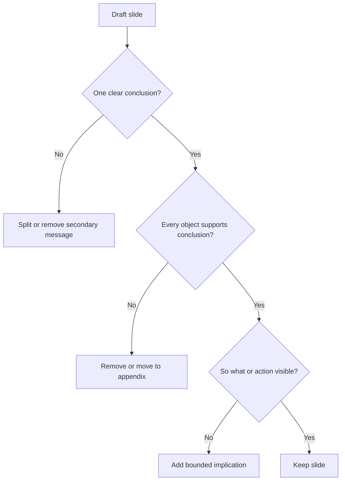

---

## 5. Architecture and data-flow diagrams

Architecture diagrams should answer a question, not display every component.

### Diagram types

| Type | Question answered | Required elements |
|---|---|---|
| Context | What is in/out and who uses it? | Boundary, users, external dependencies |
| Logical architecture | How do services/components relate? | Components, direction, protocols, ownership |
| Physical topology | Where are systems/paths/failure domains? | Sites, nodes, switches, paths, redundancy |
| Data flow | Where does data move and transform? | Source, destination, direction, protocol, trust boundary |
| Protection flow | How is data protected/recovered? | Source, copies, cadence, retention, RPO/RTO/test |
| Evidence lineage | How did the conclusion arise? | Source, transform, metric, finding, action |

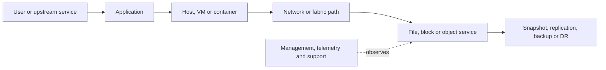

### Diagram discipline

- State purpose and scope in the title.
- Use stable layer order and consistent symbols.
- Label direction, protocol, site, trust/failure boundary, and owner where relevant.
- Distinguish logical from physical relationships.
- Mark unknown/unverified paths visibly.
- Avoid screenshots of unreadable architecture tools.
- Put exact IDs and detailed ports in appendix unless decision-relevant.

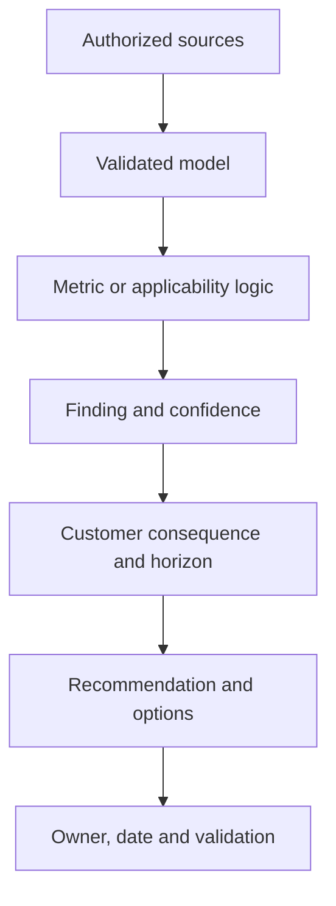

### Progressive disclosure

Show the end-to-end service path first. Then use separate slides for the contested layer, failure domain, or recommendation. Do not make the audience decode a complete topology to find one conclusion.

---

## 6. Charts, tables, and responsible data stories

### Choose the visual from the question

| Question | Best starting visual | Main safeguard |
|---|---|---|
| Trend over time | Line | Comparable periods, visible gaps and annotations |
| Category comparison | Sorted bar | Zero baseline for magnitude; clear units |
| Composition | Stacked/100% bar | Explicit denominator and few categories |
| Distribution | Histogram/box/bands if supported | Sample size and bins |
| Relationship | Scatter | Correlation is not causation |
| Current action state | Compact table or stacked bar | Stable action grain and Unknown |
| Portfolio risk | Table/matrix/scatter | Ordinal status is not probability |
| Milestones | Timeline/Gantt-style view | Dependencies and uncertainty |

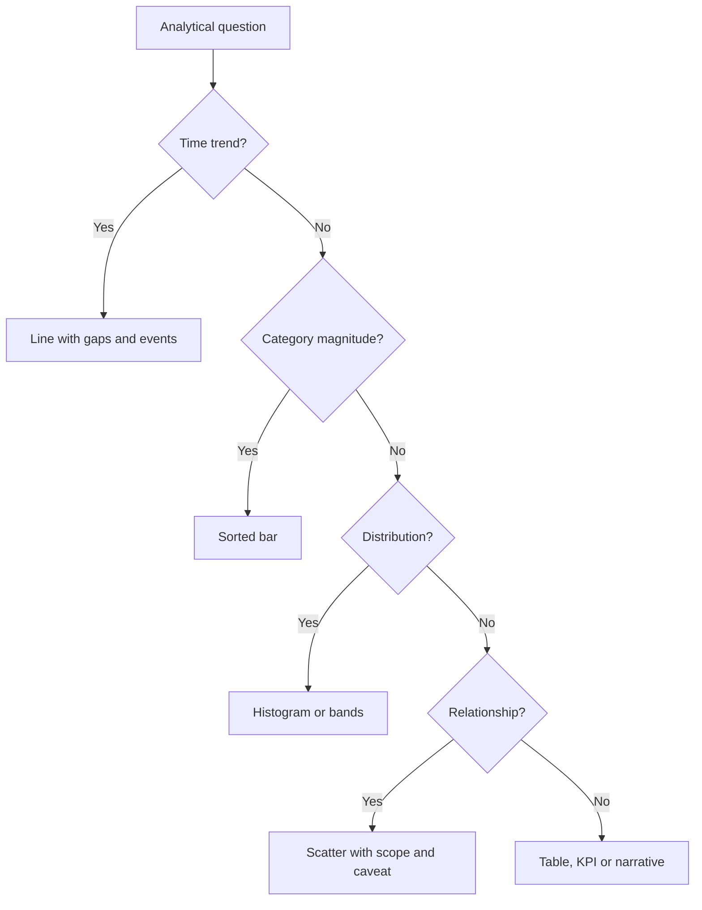

### Plain-English deep-dive: a chart is a cropped photograph

A real photograph can mislead if the crop hides the crowd, warning sign, or empty space. A real chart can mislead through time range, filters, axes, denominator, aggregation, missing data, or color.

**Why it matters:** responsible storytelling includes the context needed to interpret the visual, not only accurate plotted numbers.

### Chart safeguards

- Conclusion title, not chart-type title.
- Source, cutoff, units, scope, and selected filters.
- Missing/partial intervals shown as gaps or explicit markers.
- No 3D effects, decorative gauges, or unjustified dual axes.
- No averaged percentages/percentiles at invalid grain.
- No truncated magnitude axis unless clearly justified and annotated.
- Direct annotation of the important point.
- Accessible colors plus labels/shapes.
- Data table/appendix available where needed.

### Tables

Use tables for exact decisions, recommendations, owners, and mixed fields. Sort by decision relevance. Remove columns not needed by the audience. Avoid tiny text created by fitting a spreadsheet onto a slide.

---

## 7. Risk heatmaps, recommendations, and actions

### Risk heatmap caveat

A heatmap is a conversation aid. It can hide uncertainty, category boundaries, controls, urgency, and dependencies. Show the underlying dimensions and narrative.

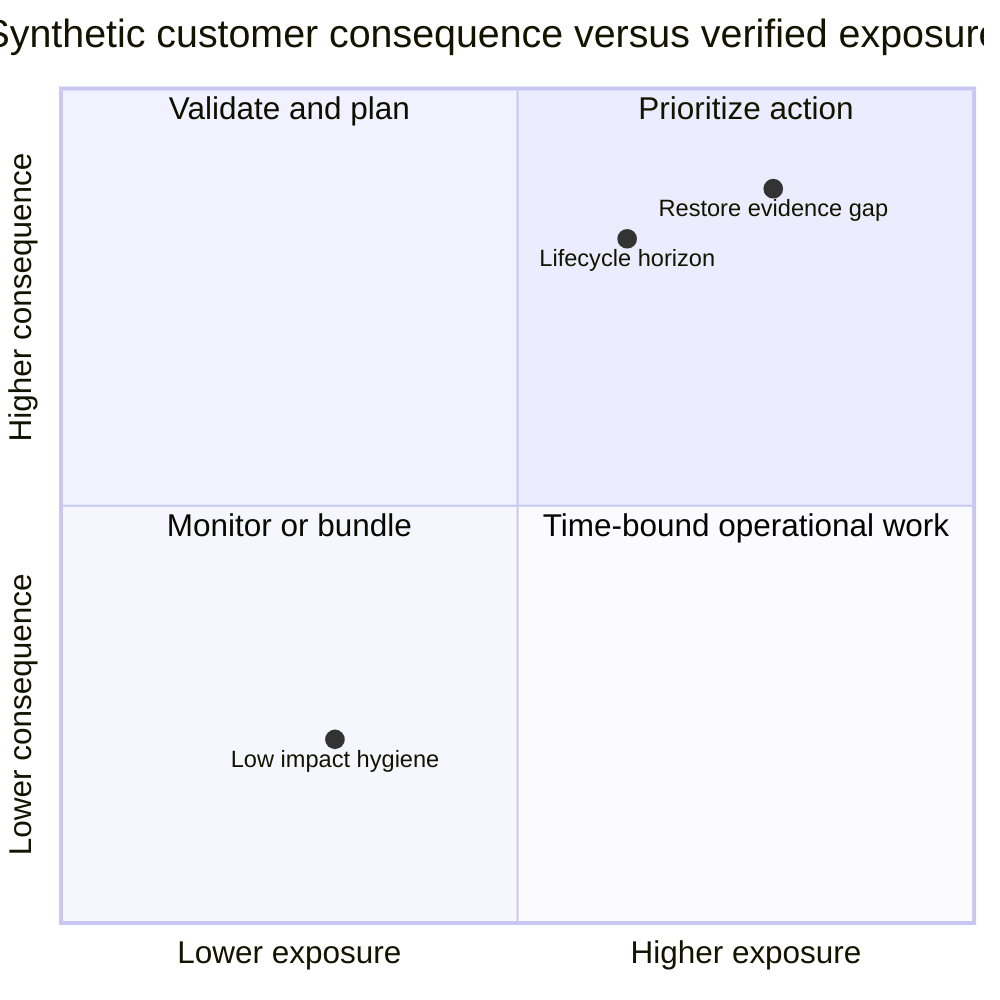

**Boundary:** coordinates and categories are synthetic ordinal positions, not measured probability or NetApp severity.

### Recommendation slide

Include:

- Conclusion and customer objective.
- Evidence and confidence.
- Risk/current issue and horizon.
- Options, including status quo.
- Preferred action and rationale.
- Prerequisites and dependencies.
- Decision owner, action owner, and date.
- Validation and residual risk.

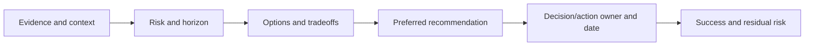

### Action slide

| Action | Why now | Owner | Target | Dependency/blocker | Proof/state |
|---|---|---|---|---|---|
| Short action statement | Latest-safe-start or outcome | Accountable role | Exact date | Named dependency | Validation/status |

Do not use `team` as owner, `ASAP` as date, or `complete` without evidence.

### Technical appendix

Use the appendix for:

- Source register, definitions, cutoff and data-quality results.
- Detailed topology and inventory.
- Metric grain, transformations and reconciliation.
- Exact product/release/compatibility/lifecycle evidence references.
- Risk dimensions and scoring assumptions.
- Complete recommendation/action records.
- Alternate analyses and rejected hypotheses.

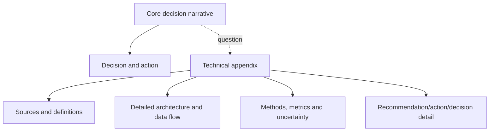

---

## 8. Visual hierarchy, layout, grid, fonts, and color

### Visual hierarchy

The eye should encounter:

1. Conclusion title.
2. Primary evidence/decision.
3. Annotation and action.
4. Source/caveat/footer.

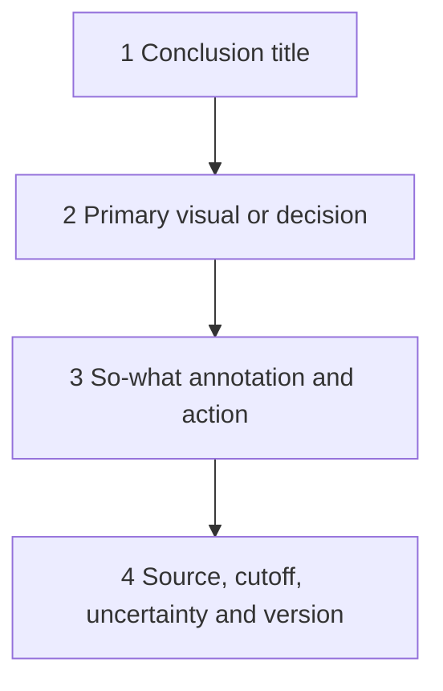

### Grid and alignment

- Use a consistent slide master/layout and margins.
- Align objects to a small grid; use consistent spacing.
- Keep title, content, footer, and page-number zones stable.
- Prefer whitespace to boxes around every object.
- Avoid cards inside cards and decorative panels.
- Do not stretch or distort diagrams/screenshots.

### Fonts

- Use approved available fonts and embed only where policy/licensing supports it.
- Test on the presentation machine and export format.
- Use a limited hierarchy of title, body, annotation, and footer sizes.
- Avoid all caps for paragraphs and excessive emphasis.
- Do not solve clutter by shrinking text below readable size.

### Color

- Use neutral context colors and reserve emphasis for meaning.
- Keep category meanings consistent across slides.
- Pair color with text/icon/shape; never color alone.
- Include Unknown/No data, not only red/amber/green.
- Check contrast and common color-vision deficiencies.
- Avoid decorative gradients and large saturated backgrounds that reduce readability.

### Reduce clutter

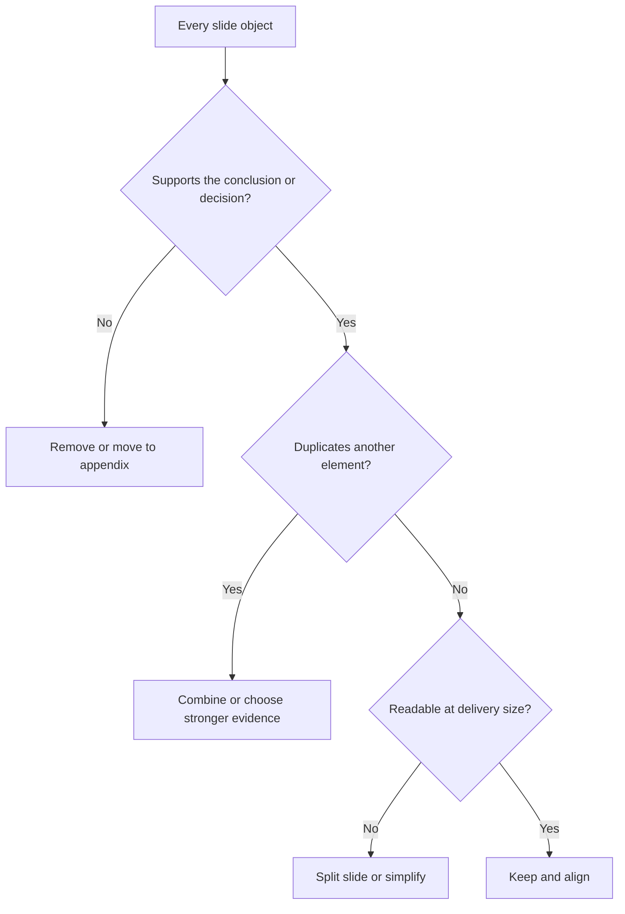

---

## 9. Accessibility and inclusive delivery

### Plain-English deep-dive: visual position is not reading order

A sighted presenter may understand a slide by looking at its top-left title, central chart, and bottom-right action. Assistive technology can encounter those objects in a different internal order, like receiving numbered pages shuffled. Built-in layouts, unique titles, meaningful alt text, and tested reading order restore the intended sequence.

**Why it matters:** a slide can look correct and still communicate a fragmented or misleading story to someone using a screen reader or keyboard.

### Accessibility controls

- Use built-in layouts/placeholders where appropriate.
- Give every slide a unique descriptive title.
- Add useful alternative text to informative images/diagrams/charts.
- Mark decorative objects appropriately where supported.
- Set logical reading order and test keyboard navigation.
- Ensure sufficient contrast and readable text.
- Do not encode meaning by color alone.
- Add captions/transcripts or equivalent for media where required.
- Use meaningful link text.
- Run Accessibility Checker and manually verify important slides.
- Test exported PDF and send-ahead formats separately.

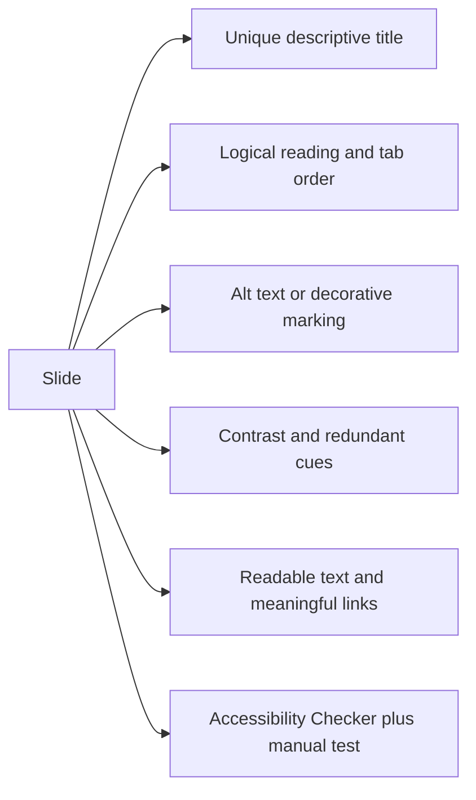

### Alt-text orientation

Alt text should communicate the purpose and takeaway, not list every pixel. A complex chart can use a concise alt summary plus a nearby data table or detailed appendix.

### Remote and global delivery

- Check screen sharing, resolution, zoom, bandwidth, and font rendering.
- State time zones on action slides.
- Avoid idioms and culturally ambiguous humor in critical messages.
- Pause for interpretation and questions.
- Provide the accessible controlled deck after the meeting.

---

## 10. Source, cutoff, uncertainty, speaker notes, and version control

### Source label

At minimum show:

- Source/system or reference.
- Scope/population.
- Observation/extraction cutoff and time zone.
- Definition/model version where material.
- Stale/partial/estimated/synthetic state.

### Uncertainty labels

| State | Wording example |
|---|---|
| Observed/current | `Observed through 2026-08-24 UTC` |
| Partial | `18/20 assets; two sources unavailable` |
| Stale | `Latest observation is 11 days old` |
| Scenario | `Low/base/high assumptions; not forecast certainty` |
| Contradictory | `CMDB and host observation disagree; action assigned` |
| Synthetic | `Fully fictional training data; no customer result` |

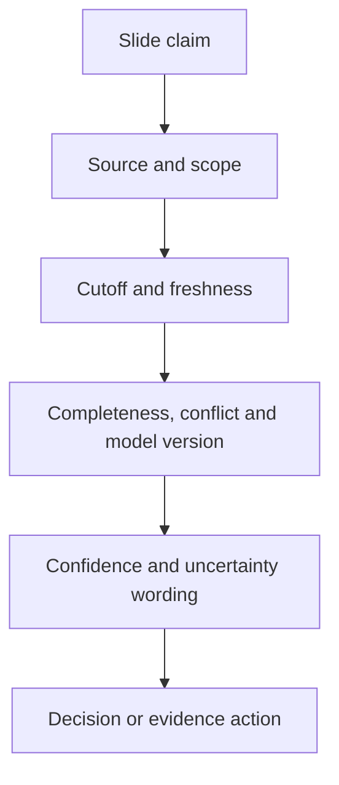

### Speaker notes

Use notes for:

- Objective and transition.
- Evidence definition and pronunciation.
- Likely challenge and bounded response.
- Material caveat not to omit verbally.
- Decision question and authority.
- Timebox and appendix jump.

Do not place essential information only in notes. Notes can be exposed through sharing/export; protect sensitive content.

### Version control

Record deck ID/version, owner/reviewer, evidence cutoff, source/model versions, change log, approval state, distribution, and superseded version. Do not overwrite a decision deck after the meeting without versioning the correction.

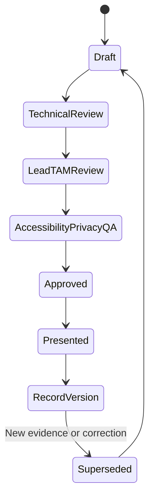

---

## 11. Review, QA, rehearsal, and delivery

### Four review lenses

| Lens | Questions |
|---|---|
| Content | Are facts, scope, definitions, reasoning, uncertainty and actions correct? |
| Audience | Is the message useful, concise and decision-focused for attendees? |
| Visual | Is hierarchy, alignment, readability, chart choice and consistency sound? |
| Delivery | Can presenters explain, transition, time, handle challenge and read back decisions? |

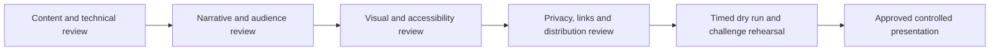

### QA checklist

- Slide titles form a complete storyline.
- Every visual reconciles to a governed source.
- Units, axes, denominators, periods, and filters are visible.
- Sources/cutoffs/uncertainty are complete.
- Executive and technical claims use the same certainty.
- Recommendations include options, owner/date, validation, and residual risk.
- No sensitive identifiers appear in broad views, notes, hidden slides, or document metadata unintentionally.
- Fonts, links, animations, media, and appendix navigation work on delivery device.
- Accessibility checks and manual reading-order/contrast review pass.
- Presenter can finish under time and answer likely objections.

### Rehearsal flow

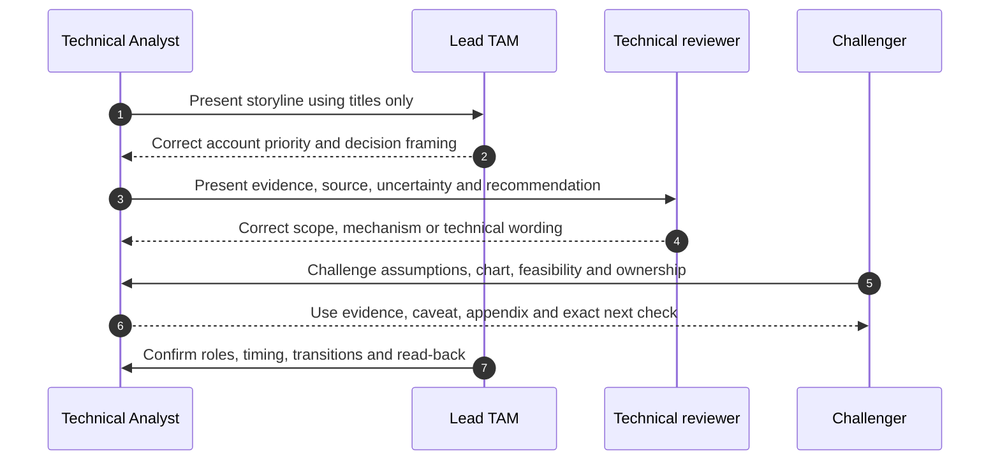

### Delivery behavior

- Do not read every word.
- State the conclusion, point to decisive evidence, then pause.
- Use the appendix when detail is requested; do not hide uncertainty.
- Ask for the decision explicitly.
- Record disagreement and evidence request.
- Read back action, owner, date, and validation.

---

## 12. Fully synthetic sanitized scenario: Meridian Transit service-review deck

> **Synthetic boundary:** `Meridian Transit`, all slides, systems, sources, metrics, dates, risks, recommendations, decisions, owners, and outcomes are invented. The scenario is not a NetApp/customer deck, live tool output, brand template, or Arti production work.

### Audience and decision

- Audience: infrastructure director, storage/app/network owners, change manager, lead TAM role.
- Decisions: approve restore validation and lifecycle discovery; hold upgrade target until exact compatibility evidence is current.
- Cutoff: `2026-08-24 00:00 UTC`.

### Storyboard

```mermaid
flowchart LR
    S1[Scope is 24 assets; two have partial evidence] --> S2[Current stability is observed, but recovery proof is stale]
    S2 --> S3[Lifecycle lead time requires discovery this quarter]
    S3 --> S4[Upgrade supportability remains unknown after driver change]
    S4 --> S5[Approve evidence work now; hold target commitment]
    S5 --> S6[Owners, dates and success criteria close the loop]
```

### Executive-summary content

> `Observed service stability remained within the synthetic measured scope, but two decisions cannot wait for the next quarter. Restore evidence is older than the customer's test cadence, and lifecycle lead time consumes the apparent horizon. The target upgrade recipe is unknown after a host-driver change. Approve restore validation and lifecycle discovery now; hold target selection until current end-to-end supportability evidence is reviewed.`

### Slide examples

| Slide title | Visual | Decision use |
|---|---|---|
| `Two partial sources limit current fleet-health confidence` | Coverage bar plus Unknown table | Approve evidence owners |
| `Restore success is unproven despite successful backup jobs` | Protection flow and last-test timeline | Approve restore test |
| `Lifecycle lead time moves discovery into this quarter` | Milestone/lead-time timeline | Approve discovery work |
| `Driver change invalidates the prior recipe evidence` | Current/target dependency diagram | Hold upgrade target |
| `Five actions have named owners; two require sponsor priority` | Action table | Reprioritize WIP |

### Synthetic architecture slide

```mermaid
flowchart TB
    RIDERS[Transit users] --> APP[Scheduling application]
    APP --> VM[Virtualized compute]
    VM --> NET[Ethernet and FC paths]
    NET --> FILE[File data service]
    NET --> BLOCK[Block data service]
    FILE --> ESTATE[Synthetic storage estate]
    BLOCK --> ESTATE
    ESTATE --> PROTECT[Backup, replication and restore]
    EVID[Inventory, telemetry and supportability evidence] -.governs.-> ESTATE
```

### Risk and recommendation slide

```mermaid
flowchart LR
    F1[Stale restore proof] --> R1[Recovery objective may be missed]
    F2[Stale recipe] --> R2[Upgrade supportability unknown]
    F3[Narrow lifecycle margin] --> R3[Supported options may shrink]
    R1 --> A1[Run approved restore validation]
    R2 --> A2[Refresh exact current/target recipe]
    R3 --> A3[Start lifecycle discovery]
```

### Send-ahead additions

- One-page definitions and source/cutoff summary.
- Alt text and data table for every complex visual.
- Navigation links to architecture, source, metric, and action appendix.
- More explanatory annotation; no essential meaning in speaker notes.
- Distribution classification and contact route for corrections.

### QA defects intentionally caught

1. A bar chart originally excluded two Unknown assets from its denominator.
2. One title said `Upgrade unsupported`; evidence only proved the prior recipe was stale.
3. A diagram implied physical path diversity without physical validation.
4. Speaker notes contained an unredacted synthetic contact name.
5. Red/green status lacked text labels and Unknown.
6. One action used `ASAP` and `storage team` rather than a role/date.

### Synthetic outcome

The mock sponsor approves evidence work and holds target selection. The deck does not claim that an outage was prevented or that any real configuration is supported. The action slide becomes the controlled decision/action register after meeting updates.

---

## 13. Discovery, evidence, risks, actions, and validation

### Discovery questions

1. Who is the audience, what decision is required, and how will the deck be consumed?
2. What customer outcome, period, scope, cutoff, evidence quality and privacy apply?
3. What one-sentence conclusion should the audience remember?
4. Which architecture, chart, table or heatmap best supports each conclusion?
5. What source, definition, uncertainty and alternate explanation must remain visible?
6. Which options, recommendation, owner/date, prerequisites and residual risk apply?
7. What belongs in the core narrative versus technical appendix?
8. What content, visual, accessibility, privacy, version and rehearsal tests gate delivery?

```mermaid
flowchart LR
    DISC[Audience and decision discovery] --> EVID[Governed source and cutoff]
    EVID --> STORY[Conclusion-led storyline]
    STORY --> VIS[Responsible visual and architecture]
    VIS --> RISK[Risk, option and recommendation]
    RISK --> ACTION[Decision, owner, date and proof]
    ACTION --> QA[Content, visual, accessibility and delivery validation]
```

### Deck-risk register

| Deck risk | Control | Validation |
|---|---|---|
| Wrong audience/decision | Decision contract | Decision owner reviews purpose |
| Misleading chart | Grain/axis/denominator/source QA | Independent recomputation |
| Architecture overclaim | Mark logical/physical/unknown | Owner validates path |
| Sensitive data leak | Privacy and metadata/notes review | Audience-specific export test |
| Accessibility failure | Built-in layouts/checker/manual test | Keyboard/read order/contrast/PDF test |
| Version confusion | Controlled ID/cutoff/supersession | Repository and link check |
| Presenter overclaim | Notes, rehearsal and bounded answers | Challenge simulation |

---

## 14. Anti-patterns and corrections

| Anti-pattern | Why it fails | Better practice |
|---|---|---|
| Start with all available charts | Evidence availability drives story | Start with decision and messages |
| Topic titles | Audience cannot skim conclusions | Write assertion/conclusion titles |
| Executive slide full of counters | No priority or action | One outcome, evidence and ask |
| Spreadsheet pasted onto slide | Tiny unreadable detail | Decision table plus appendix/link |
| Architecture contains everything | Key path disappears | Purpose-specific progressive disclosure |
| Risk heatmap as truth | Hides assumptions and urgency | Show dimensions, confidence and action |
| Green/red only | Inaccessible and suppresses Unknown | Text, icons and separate no-data state |
| Decorative colors/animation | Competes with evidence | Restrained consistent emphasis |
| Shrink font to fit | Creates illegible clutter | Split, simplify or move detail |
| Essential caveat in notes only | Send-ahead reader misses it | Put material uncertainty on slide |
| Different live/send-ahead facts | Creates two truths | One controlled evidence record |
| Screenshot without provenance | Stale, illegible, sensitive | Recreate bounded visual and cite source |
| Appendix used to hide bad news | Damages trust | Keep decision-material facts in core |

---

## 15. Arti's factual bridge and JD Mapping

```mermaid
flowchart LR
    REV[Microsoft business and customer reviews] --> STORY[Audience and decision narrative]
    BI[Excel, Power BI and MBA analytics] --> VIS[Charts, data quality and uncertainty]
    CRIT[CRITSIT executive updates] --> BLUF[Impact, action, owner and checkpoint]
    ENG[Product and Engineering collaboration] --> TECH[Technical appendix and challenge]
    STORY --> METHOD[Transferable PowerPoint method]
    VIS --> METHOD
    BLUF --> METHOD
    TECH --> METHOD
    METHOD --> GAP[Production NetApp deck remains unproven]
```

### Factual tie

| Arti evidence | Transfer | Boundary |
|---|---|---|
| Customer/business reviews | Storyline, executive summary and facilitation | Not NetApp OSR deck ownership |
| Excel/Power BI | Responsible chart and evidence workflow | No live NetApp data |
| MBA Business Analytics | Decision framing and uncertainty | No customer value causation by default |
| CRITSIT updates | Concise impact/action/checkpoint messages | Not NetApp incident authority |
| Product/Engineering work | Technical detail and exact asks | No private NetApp technical source access |
| Mentoring/onboarding | Teach-back and audience calibration | No NetApp training/brand authority |

### JD Mapping

| JD responsibility | Part 65 capability | Honest boundary |
|---|---|---|
| Microsoft Office/PowerPoint | Complete deck architecture and QA | Production artifact still must be demonstrated |
| Analyze/report customer data | Responsible charts, sources and uncertainty | NetApp data remains gated |
| Operational service reviews | Executive core, technical appendix and actions | Part 61 governs meeting lifecycle |
| Represent recommendations | Evidence-risk-options-owner-proof slide | No production NetApp recommendation authority |
| Executive/technical communication | Layered same-fact narratives | Certainty never changes by audience |
| Influence remediation | Decision/action slide with tradeoffs | Customer retains decision/change authority |
| Improve quality | Review, accessibility, privacy and rehearsal gates | Customer/NetApp standards govern live decks |

### Honest interview statement

> `I start with audience and decision, write the storyline as conclusion sentences, then select the minimum architecture, chart, table or heatmap needed to support each message. I show source, cutoff, scope and uncertainty; include options, owner/date, validation and residual risk; use a technical appendix; and run content, visual, accessibility, privacy and rehearsal QA. I have built Microsoft-focused reviews, not a production NetApp deck.`

---

## 16. Role plays, paper lab, and self-test

### Role play 1: executive asks for one slide

Reduce a 20-slide technical analysis to one executive summary without removing the decision-material uncertainty, owner, timing, and residual risk.

### Role play 2: engineer challenges the chart

The engineer says the denominator and time range are wrong. Thank them, pause the conclusion, use the appendix/source record, state what changes, and assign correction rather than defending the visual.

### Role play 3: live deck failure

Fonts substitute and a video fails. Continue using a tested PDF/static fallback, explain only the necessary issue, protect timing, and preserve accessible post-meeting material.

### Paper lab: synthetic technical and executive deck

```mermaid
flowchart LR
    CONTRACT[Audience, decision, cutoff and privacy] --> BOARD[Message-first storyboard]
    BOARD --> CORE[Executive core slides]
    BOARD --> APP[Technical appendix]
    CORE --> VIS[Architecture, charts, heatmap, action table]
    APP --> VIS
    VIS --> ACCESS[Hierarchy, grid, font, color and accessibility]
    ACCESS --> QA[Source, content, privacy, version and rehearsal QA]
    QA --> DELIVER[Present and send-ahead editions]
```

Build a fully synthetic 12-slide core plus appendix for an operational review. Include scope/cutoff, executive summary, architecture, health, incidents, capacity/performance, protection, lifecycle/supportability, risk heatmap, recommendations, action register, value, and decisions.

Inject:

- Topic-only titles.
- Mixed cutoffs and one stale source.
- Truncated axis and missing interval shown as zero.
- Heatmap presented as probability.
- Unverified physical path in architecture.
- Dense 10-point table.
- Material caveat only in speaker notes.
- Red/green-only status and poor reading order.
- Unredacted identifier in appendix/notes.
- Different values in present and send-ahead editions.
- Missing owner/date/validation on recommendation.

### Lab tasks

1. Write audience and decision contract.
2. Build a title-only storyboard and executive summary.
3. Design architecture and data-flow diagrams.
4. Select/rebuild responsible charts and risk heatmap.
5. Create recommendation, action and technical-appendix slides.
6. Apply grid, hierarchy, fonts, color and clutter reduction.
7. Add sources, cutoffs, uncertainty, notes and version metadata.
8. Run Accessibility Checker plus manual/export tests.
9. Produce controlled live and send-ahead editions.
10. Rehearse all role plays and answer Q1-Q8 aloud.

### Self-test

1. Define data storytelling and message-first design.
2. Write an audience/decision contract.
3. Build a conclusion-title storyline and executive summary.
4. Design a purpose-specific architecture/data-flow visual.
5. Choose and critique charts, tables and heatmaps.
6. Build recommendation/action slides and appendix.
7. Apply visual hierarchy, grid, fonts, colors and whitespace.
8. Explain every accessibility control.
9. Manage source/cutoff/uncertainty/notes/version.
10. Recreate Meridian Transit and state Arti's nonclaim.

### Lab pass checklist

- [ ] Audience, purpose, decision, scope, cutoff and consumption mode are explicit.
- [ ] Slide titles form a coherent conclusion-led storyline.
- [ ] Executive summary contains outcomes, risks, recommendations, decisions, value and data caveat.
- [ ] Architecture/data flows are purpose-specific and mark unknowns.
- [ ] Charts/tables/heatmaps use correct grain, scale, denominator, gaps and caveats.
- [ ] Recommendations/actions include options, owners, dates, dependencies, proof and residual risk.
- [ ] Technical appendix contains detailed sources, definitions, methods and records.
- [ ] Visual hierarchy, grid, font, color and whitespace are consistent and readable.
- [ ] Accessibility, alt text, reading order, contrast and export tests pass.
- [ ] Sources, cutoffs, uncertainty, speaker notes and version control are complete.
- [ ] Live/send-ahead editions preserve the same facts and certainty.
- [ ] All evidence is fully synthetic and sanitized.
- [ ] No production NetApp deck, result or internal template is claimed.

---

## 17. Official and Public Source Anchors

**Date checked: 2026-08-24.** The supplied NetApp TAM Technical Analyst job description, represented in the master guide's JD matrix, is the primary source for PowerPoint, reporting, review and communication expectations. Microsoft official sources govern Office feature behavior; NetApp public sources provide bounded evidence context only.

| Topic | Official source | Bounded use |
|---|---|---|
| PowerPoint help | [Microsoft PowerPoint help and learning](https://support.microsoft.com/en-us/powerpoint) | Official feature/help entry; behavior varies by version/platform |
| Create presentations | [Create a presentation in PowerPoint](https://support.microsoft.com/en-us/office/create-a-presentation-in-powerpoint-42229250-6c66-44cd-827f-2f5802c6634b) | Official presentation-creation orientation |
| Slide masters | [What is a slide master?](https://support.microsoft.com/en-us/office/what-is-a-slide-master-b9abb2a0-7aef-4257-a14e-4329c904da54) | Consistent layouts/themes orientation |
| Accessible PowerPoint | [Make PowerPoint presentations accessible](https://support.microsoft.com/en-us/office/make-your-powerpoint-presentations-accessible-to-people-with-disabilities-6f7772b2-2f33-4bd2-8ca7-dae3b2b3ef25) | Official accessibility practices and checker orientation |
| Alternative text | [Add alternative text to an object](https://support.microsoft.com/en-us/office/add-alternative-text-to-a-shape-picture-chart-smartart-graphic-or-other-object-44989b2a-903c-4d9a-b742-6a75b451c669) | Official alt-text workflow; complex visuals still need useful summaries/tables |
| Speaker notes/Presenter View | [Start the presentation and see notes in Presenter view](https://support.microsoft.com/en-us/office/start-the-presentation-and-see-your-notes-in-presenter-view-4de90e28-487e-435c-9401-eb49a3801257) | Official delivery/notes orientation; notes may be sensitive |
| NetApp documentation | [NetApp Documentation](https://docs.netapp.com/) | Exact product/release evidence source; no customer result inferred |
| Digital Advisor | [NetApp Digital Advisor documentation](https://docs.netapp.com/us-en/active-iq/) | Public feature context; customer visuals and data are gated |

### Source-use discipline

- Record PowerPoint version/platform/template, deck ID/version, evidence cutoff, reviewer and distribution.
- Recheck every version-sensitive technical fact immediately before presentation and action.
- Use public NetApp docs as product context, not as customer evidence.
- Test links, fonts, notes, hidden slides, metadata, export and accessibility on the delivery environment.
- Keep sensitive identifiers, screenshots and gated data out of broad decks.
- Never infer a NetApp internal template, customer result, approved recommendation, or brand standard from this guide.

---

## Likely Interview Questions

### Q1. How do you build an executive technical deck?

> **Model answer:** `I define audience and decision, write one conclusion sentence per slide, and make the titles form the story: context, change, impact, evidence, options, recommendation, decision and proof. I use only decisive visuals, show source/cutoff/uncertainty, keep detail in a technical appendix, and end with owners, dates and validation.`

### Q2. What belongs in an executive summary?

> **Model answer:** `A bounded outcome/status, material changes, top risks and unknowns, preferred recommendations, exact decision asks, owners/timing, validated value and remaining exposure, plus the evidence cutoff and critical quality caveat. It is a decision page, not every KPI.`

### Q3. How do you write strong slide titles?

> **Model answer:** `I state the evidence-supported conclusion, such as 'Driver change invalidates the prior recipe evidence,' rather than 'Compatibility update.' The body supplies one primary visual, annotation, material caveat and action. Reading titles alone should reproduce the argument.`

### Q4. How do you make architecture diagrams useful?

> **Model answer:** `I design each for a question, state scope, use consistent layers, show direction/protocol/owner/failure or trust boundary where relevant, distinguish logical from physical, and mark unverified paths. I progressively disclose detail and move exact ports/IDs to the appendix.`

### Q5. How do you prevent charts and heatmaps from misleading?

> **Model answer:** `I validate grain, aggregation, population, period, axis, unit, denominator, filters and missing data; show source/cutoff/unknowns; avoid 3D, unjustified dual axes and invalid averages; and label heatmap categories as ordinal aids, not probabilities. Every visual reconciles to governed evidence.`

### Q6. How do live and send-ahead decks differ?

> **Model answer:** `A live deck is visually sparse because the presenter supplies context; a send-ahead deck must stand alone with labels, navigation, definitions and accessibility. Both derive from one controlled evidence record and preserve the same facts, uncertainty, decision, version and cutoff.`

### Q7. What QA do you perform before presenting?

> **Model answer:** `Technical/content, audience/narrative, visual, privacy/distribution, accessibility/export, version/link/font/device and timed rehearsal QA. I challenge likely objections, ensure notes do not hide essential facts, trace each claim to source, and confirm recommendations have owner/date/proof/residual risk.`

### Q8. How does your background transfer, and what remains a gap?

> **Model answer:** `Microsoft customer/business reviews, CRITSIT updates, Excel, Power BI, analytics and Product/Engineering communication give me strong storyline, visual and audience skills. I have not delivered a production NetApp deck, so live NetApp evidence, account narrative, branding and recommendations require authorized review.`

---

## 30-Second Memory Hooks

- **Deck:** Guided decision route, not evidence warehouse.
- **Start:** Audience + decision before slides.
- **Message-first:** Write conclusions, then select exhibits.
- **Storyline:** Context -> change -> impact -> evidence -> options -> ask -> proof.
- **Title:** State the takeaway, not the topic.
- **Slide:** Assertion + evidence + annotation + caveat + action.
- **Architecture:** One question, clear direction, marked unknowns.
- **Chart:** Grain + scale + denominator + gaps + cutoff.
- **Heatmap:** Conversation aid, not probability.
- **Recommendation:** Evidence -> risk -> option -> owner/date -> proof.
- **Appendix:** Detail on demand, never a hiding place for bad news.
- **Hierarchy:** Title, primary evidence, action, metadata.
- **Clutter:** Remove, combine, simplify, split, or appendix.
- **Accessibility:** Title, reading order, alt text, contrast, redundant cues.
- **Notes:** Presenter cues, not secret essential evidence.
- **Two editions:** Different density, same truth.
- **Arti's bridge:** Microsoft storytelling transfers; NetApp deck experience does not.

---

## Completion Checklist

- [ ] Define audience, purpose, decision, scope, cutoff and consumption mode.
- [ ] Build a message-first title-only storyline.
- [ ] Create a decision-ready executive summary.
- [ ] Write conclusion titles and one-message slide anatomy.
- [ ] Build purpose-specific architecture and data-flow diagrams.
- [ ] Select responsible charts, tables and risk heatmaps.
- [ ] Create complete recommendation and action slides.
- [ ] Build a technical appendix with source/method/detail.
- [ ] Apply visual hierarchy, grid, fonts, colors, spacing and clutter control.
- [ ] Apply accessibility, alt text, reading order, contrast and export tests.
- [ ] Show source, scope, cutoff, uncertainty and synthetic state.
- [ ] Use speaker notes safely and version the deck.
- [ ] Run content, audience, visual, privacy, accessibility and rehearsal QA.
- [ ] Produce controlled live and send-ahead editions with the same truth.
- [ ] Recreate the fully synthetic Meridian Transit deck and paper lab.
- [ ] Answer Q1-Q8 aloud and state the exact nonclaim.
- [ ] Recheck current Microsoft, NetApp and customer evidence before delivery.

---

*Next suggested section:* [Part 66 - Executive Communication, Technical Writing, and Difficult Messages](Part-66-executive-communication-technical-writing.md)