# Part 66 - Executive Communication, Technical Writing, and Difficult Messages

> **Section goal:** Communicate technical reality so people can understand impact, make decisions, act safely, and maintain trust, especially when news is incomplete or difficult. By the end, Arti should be able to use BLUF; distinguish status, observation, finding, issue, risk, decision, and action; calibrate depth and certainty; write concise emails, updates, minutes, and executive summaries; deliver bad news without blame; establish incident cadence; request decisions; handle difficult messages; use culturally and time-zone-aware language; prefer active voice and defined terms; and separate acknowledgment, restoration, resolution, root cause, and prevention.

Covers index item **66** and maps directly to job-description responsibilities for strong written/verbal communication, technical and executive reporting, operational service reviews, customer-risk communication, high-pressure work, cross-time-zone coordination, recommendation representation, escalation, stakeholder influence, and improved support experience.

**Explicit nonclaim:** Arti has not communicated on behalf of a production NetApp account, issued an authorized NetApp technical position, or owned a live NetApp incident, executive message, customer decision, or remediation commitment.

**Privacy and access boundary:** Communications can expose customer identity, service impact, topology, versions, vulnerabilities, cases, employee names, commercial terms, decisions, legal risk, and incident evidence. Use approved channels, least necessary detail, audience controls, secure links, retention rules, redaction, and review requirements; never move restricted evidence into email or chat merely for speed.

**Synthetic-evidence rule:** Every customer, incident, metric, message, email, decision, owner, timestamp, cause, recommendation, and outcome below is fictional and sanitized. No template is a real NetApp/customer communication, case update, support instruction, post-incident statement, or account record.

**Version and current-source caveat:** Product/support facts, incident states, official guidance, communication channels, Microsoft 365 features, legal/privacy requirements, and customer expectations change. A **current-source check** means revalidating technical facts, source/cutoff, authorized audience, communication owner, channel, and next checkpoint immediately before sending.

This Part provides transferable writing patterns, not a NetApp internal communication policy, severity/cadence standard, legal statement, public-relations guidance, service-level commitment, or authority to speak for NetApp or a customer. Actual account, Support, incident-command, legal, privacy, security, and customer communication procedures control live messages.

> **No-production-NetApp boundary:** Arti's factual strengths are Microsoft enterprise and partner support, CRITSIT and business-critical incident communication, customer updates, technical writing, business reviews, Product/Engineering collaboration, CSAT, and global stakeholder coordination. She does **not** claim NetApp account spokesperson, Support incident commander, ONTAP subject-matter authority, legal/PR authority, or production NetApp executive-writing ownership. Her exact non-claim is: **she has not authored, approved, or delivered a production NetApp customer, incident, executive, legal, or account communication.**

---

## 1. Communication is an operational control

Technical communication is not decoration around the work. It changes what people understand, prioritize, authorize, execute, and trust.

### Plain-English deep-dive: the message is part of the control plane

Traffic lights do not move cars, but incorrect lights can cause a collision. A technical message does not repair storage, but incorrect impact, ownership, timing, or confidence can cause unsafe changes, delayed escalation, duplicated work, or lost trust.

**Why it matters:** communication quality is part of service reliability.

| Term | Plain meaning | Analogy | Why it matters |
|---|---|---|---|
| **BLUF** | Bottom Line Up Front: lead with the conclusion or ask | Destination before route details | Helps readers act quickly |
| **Status** | Current state of tracked work | Parcel location | Is not automatically insight |
| **Finding** | Evidence-backed interpreted condition | Test result in context | Supports risk/action reasoning |
| **Risk** | Possible effect of uncertainty on an objective | Storm threatening a route | Requires horizon and controls |
| **Decision** | Authorized choice among options | Choosing the route | Must name authority and conditions |
| **Action** | Committed work with owner and date | Next turn on route | Converts words into execution |
| **Confidence** | Strength of evidence and reasoning | Focus of a camera | Guides wording and next tests |
| **Cadence** | Agreed update rhythm | Scheduled train board | Reduces information anxiety |

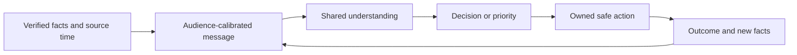

### Message-quality test

The reader should be able to answer:

1. What is the bottom line?
2. Who or what is affected, as of when?
3. What is known, unknown, assumed, or contradicted?
4. What is happening next, by whom, and why?
5. What decision or help is needed?
6. When is the next update or validation?

---

## 2. BLUF and the status-finding-risk-decision-action chain

### BLUF pattern

> **Bottom line:** `<current impact/outcome or decision>`. **Why:** `<decisive evidence and confidence>`. **Next:** `<action/owner/checkpoint or exact ask>`.

### Examples

**Executive:**

> `Bottom line: the target upgrade is not ready for approval because current host-driver evidence no longer matches the dated compatibility record. Host and storage owners will refresh the exact recipe by 2026-08-27; the requested decision today is to hold target approval until that review passes.`

**Technical:**

> `Bottom line: current supportability is unknown, not unsupported. The host observation shows driver X while the prior synthetic recipe references driver Y. Validate current/intermediate/target combinations and notes; no production change is recommended from this message.`

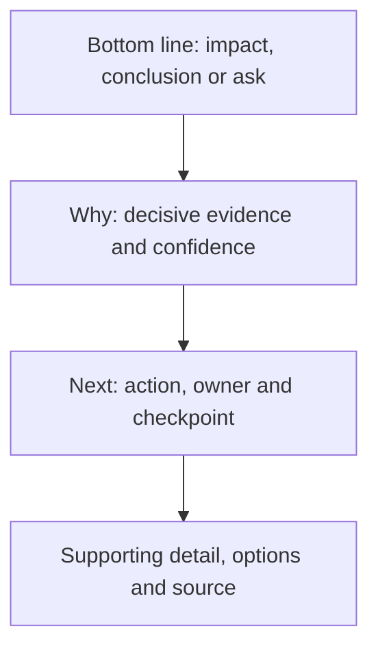

### Record types

| Type | Question answered | Example |
|---|---|---|
| Observation | What was directly measured/reported? | `Remote receipt is 11 days old` |
| Status | Where is work/state now? | `Evidence request is with host owner` |
| Finding | What does evidence support in context? | `Telemetry is stale for node B` |
| Issue | What adverse effect exists now? | `Current case lacks fresh node evidence` |
| Risk | What could affect an objective? | `Future diagnosis may be delayed` |
| Recommendation | What course is proposed and why? | `Repair and validate delivery path` |
| Decision | What choice did authority make? | `Approve repair; defer proxy redesign` |
| Action | What committed work happens next? | `Network owner validates trust by D+3` |

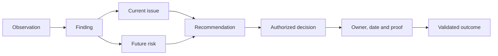

Do not use `status` as a container for every kind of claim. `Case open` is status; `supportability evidence is stale` is a finding.

---

## 3. Audience calibration without changing facts

### Audience matrix

| Audience | Lead with | Include | Avoid |
|---|---|---|---|
| Executive | Outcome, exposure, decision, timing | Options, owner, confidence, residual risk | Raw logs and long chronology |
| Technical owner | Exact scope, evidence, mechanism | Versions, hypotheses, tests, prerequisites | Vague business-only summaries |
| Incident participant | Impact, current state, action, safety, checkpoint | Workstream owners and exact evidence | Speculative RCA during restoration |
| Action owner | Task, reason, due, dependency, proof | Escalation/stop route | Whole account narrative |
| Broad stakeholder | Relevant status and expected behavior | Minimum necessary detail | Restricted topology/case/person data |

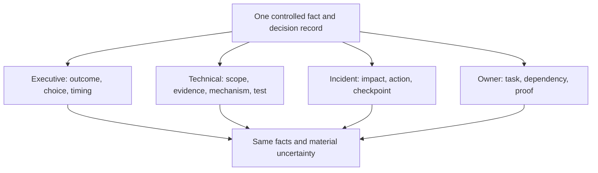

### Plain-English deep-dive: zoom changes detail, not the scene

A satellite image and street map show different detail, but the city cannot move between them. Executive and technical versions can change depth and vocabulary, not impact, certainty, source cutoff, decision, or owner.

**Why it matters:** simplifying `supportability unknown` into `unsupported` is not simplification; it changes the claim.

### Audience questions

- What must this person know, decide, do, or stop doing?
- Which technical detail changes that decision?
- Which caveat is material even if it is complex?
- What sensitive detail can be omitted or role-abstracted?
- Does this message stand alone across time zones?

---

## 4. Certainty, confidence, and epistemic labels

### Four labels

| Label | Meaning | Safe language |
|---|---|---|
| Known | Direct current evidence supports statement | `Evidence shows... within measured scope` |
| Inferred | Multiple facts support interpretation | `Evidence is consistent with...` |
| Hypothesis | Plausible explanation awaiting discriminating test | `A current hypothesis is...; test X next` |
| Unknown | Required evidence absent/conflicting | `We cannot confirm...; owner will obtain Y` |

### Confidence factors

- Source authority and directness.
- Exact identity/scope/applicability.
- Freshness and completeness.
- Reproducibility and independent agreement.
- Contradictions and alternate explanations.
- Model/measurement uncertainty.

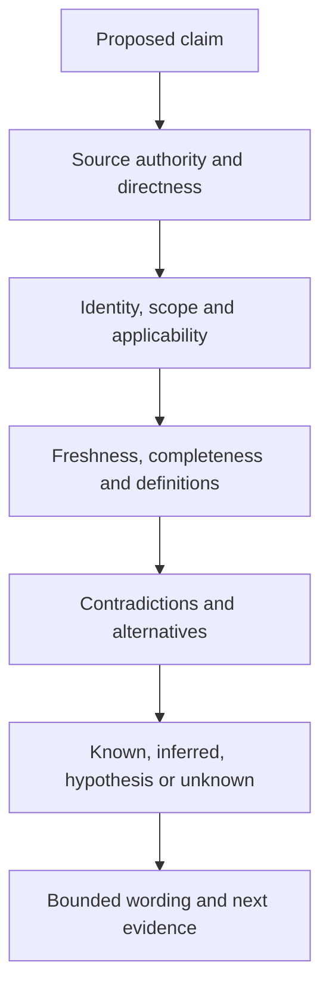

### Certainty anti-patterns

- `Definitely`, `root cause`, `fixed`, `no impact`, `safe`, or `supported` without scope/proof.
- `We think` with no source, confidence, or test.
- `No evidence of` presented as `evidence of no`.
- `Green` when source is stale or partial.
- Exact numerical probability invented from qualitative judgment.

### Correcting yourself

> `Correction: my prior message said the target was unsupported. The evidence only shows that the previous compatibility record is stale after a driver change. Current supportability is unknown pending the dated recipe review. This changes the claim, not the decision to hold approval.`

Prompt correction builds more trust than quietly editing history.

---

## 5. Concise writing, active voice, and jargon control

### Plain-English deep-dive: compression without information loss

Compressing a file should preserve its content. Concise writing removes repetition and low-value detail while preserving impact, evidence, uncertainty, owner, and timing. Deleting those fields is data loss, not brevity.

**Why it matters:** the shortest message is not useful if it creates follow-up confusion or an unsafe assumption.

### Active voice

Active voice names the actor:

- Passive/vague: `The action will be reviewed.`
- Active/accountable: `The customer storage owner will review the action by 2026-08-28.`

Passive voice can be appropriate when the actor is unknown or intentionally not relevant, but do not use it to hide ownership.

### Sentence controls

- One main idea per sentence.
- Subject and verb early.
- Concrete nouns and verbs.
- Dates/times with zone rather than `soon` or `EOD`.
- Bullets for parallel actions, not fragmented prose.
- Define acronyms on first use.
- Use customer language where accurate.
- Replace intensifiers with evidence.

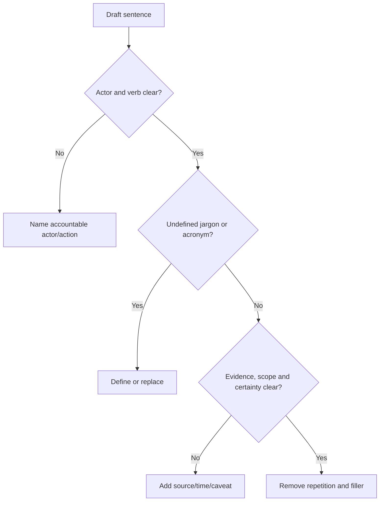

### Jargon translation

| Jargon | Plain-English alternative |
|---|---|
| Remediate | Correct/reduce the specific condition |
| Leverage | Use |
| Operationalize | Put into routine use with owner/process |
| Degraded | State the exact capability that is reduced |
| Best practice | Current documented guidance under stated conditions |
| At risk | Name the condition, consequence and horizon |
| ASAP | Exact date/time or priority rule |
| Circle back | State the next action/checkpoint |

---

## 6. Concise email and update templates

### Decision email

```text
Subject: Decision by <date>: <specific choice and customer outcome>

Bottom line: <recommended choice and why now>.

Evidence as of <cutoff>:
- <decisive fact, scope and confidence>
- <material caveat or unknown>

Options:
1. <option and tradeoff>
2. <status quo/defer and residual risk>

Decision requested: <exact decision> from <authority> by <date/time zone>.
After decision: <owner, action, validation and next update>.
```

### Status update

```text
Subject: <service/action> update - <state> - <timestamp and zone>

Bottom line: <impact/current state>.
Known: <verified facts>.
Unknown: <material uncertainty and evidence owner>.
Actions: <owner -> action -> expected checkpoint>.
Risk/blocker: <what can prevent progress>.
Next update: <exact date/time zone>, or sooner if <trigger>.
```

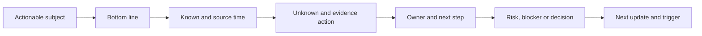

### Recommendation email

Use finding, customer consequence, options, preferred action/rationale, prerequisites, decision owner/date, validation, and residual risk. Link to controlled evidence; do not paste restricted payloads.

### Subject-line controls

Good subjects convey object, state, and ask: `Decision by 28 Aug: approve restore validation for Imaging service`.

Avoid: `Update`, `Urgent`, `FYI`, or `Issue` without scope.

---

## 7. Minutes and executive-summary templates

### Minutes

Minutes should preserve decisions and commitments, not every spoken sentence.

```text
Meeting: <purpose>
Date/time/zone: <...>
Scope and evidence cutoff: <...>
Attendees/required absences: <role-safe list>

Decisions:
- <decision, authority, rationale, conditions, residual risk>

Actions:
- <action ID, action, owner, due, dependency, validation>

Evidence requests/disputes:
- <question, source owner, due, decision impact>

Parking lot:
- <item, route, owner, target>

Next checkpoint: <date/time/zone>
```

### Executive summary

```text
Outcome/status: <one bounded sentence>.
What changed: <2-4 material changes>.
Why it matters: <customer consequence and horizon>.
Recommendation: <preferred action and tradeoff>.
Decision: <authority, exact choice, deadline>.
Progress/value: <validated outcome with attribution caution>.
Data note: <cutoff, coverage, uncertainty>.
```

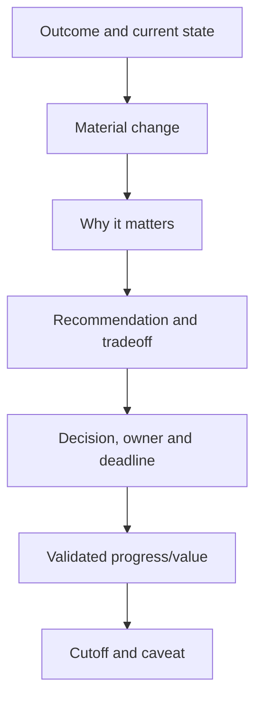

### Meeting acknowledgment

After a difficult meeting, acknowledge receipt and next steps without implying agreement or resolution:

> `Thank you for clarifying the impact. We have recorded two disputed facts and three actions. The storage owner will provide the current host record by 2026-08-27 15:00 UTC; the lead TAM will confirm the decision route after review. This message acknowledges the concern; it does not yet confirm root cause or resolution.`

---

## 8. Bad news without blame

### Bad-news structure

1. State the bottom line and impact.
2. Acknowledge customer experience.
3. State verified facts and unknowns.
4. Own the next action/communication within role.
5. Explain containment, options, decision, or escalation.
6. Give a reliable checkpoint.
7. Follow through and correct errors promptly.

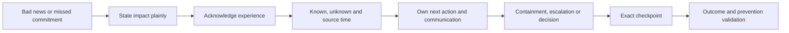

### No-blame language

| Blame-oriented | Evidence-oriented |
|---|---|
| `The network team failed to provide logs.` | `The packet evidence is not available; the network evidence owner will provide or declare the gap by 15:00 UTC.` |
| `The customer ignored our advice.` | `The recommendation was deferred because the maintenance window and application validator were unavailable; residual risk and next review are recorded.` |
| `Support dropped the case.` | `Ownership and next action were not visible between 12:00 and 16:00 UTC; the handoff process is under review.` |
| `User error caused the outage.` | `The approved procedure did not prevent this action path; human and process conditions require review.` |

No-blame does not mean no accountability. Name the process state, decision, owner, action, and evidence without judging motives.

### Apology boundary

Use language authorized by the account/incident/legal context. A sincere acknowledgment can be:

> `We did not provide the agreed checkpoint, and that increased uncertainty during a critical period. I am sorry for that impact. The lead owner is now <role>; the next verified update is <time>.`

Do not speculate about liability or promise a cause/fix before evidence.

---

## 9. Incident cadence and acknowledgment versus resolution

### Incident update contract

| Field | Content |
|---|---|
| Impact | Who/what/how severely; customer words where approved |
| Start/current time | Exact UTC/local times and time zone |
| Scope | Services, sites, users, systems, exclusions |
| Current state | Restored/degraded/ongoing and evidence |
| Known/unknown | Facts versus hypotheses |
| Actions | Workstream, owner, result, next step |
| Safety | Change hold, rollback/forward recovery, Support route |
| Decision/blocker | Exact authority or dependency needed |
| Next update | Time or material-change trigger |

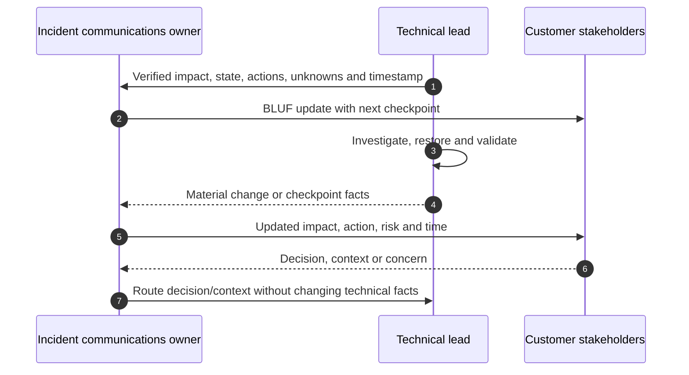

### Cadence design

Cadence depends on impact, rate of change, customer agreement, incident process, time zones, and decision need. Do not invent a universal NetApp interval. Set a reliable next update even if the update may be `no material change; work continues`.

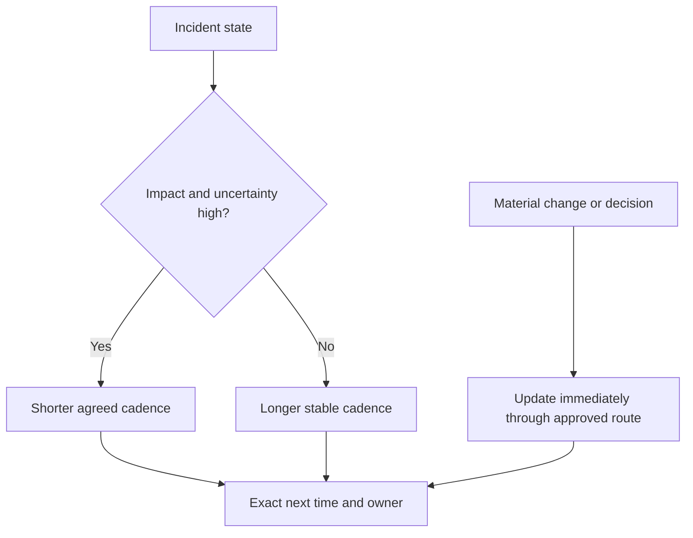

### Plain-English deep-dive: acknowledgment is opening the ticket at the repair shop

The repair shop can confirm it received the car without diagnosing or fixing it. Likewise:

- **Acknowledged:** concern/incident received and ownership/checkpoint established.
- **Contained:** immediate spread/consequence limited.
- **Restored:** useful service returned, perhaps with workaround.
- **Resolved:** current issue addressed in verified scope.
- **Root cause established:** evidence supports causal mechanism.
- **Prevented:** corrective controls implemented and validated.
- **Closed:** agreed criteria, records, residual risk, and owners complete.

**Why it matters:** saying `resolved` when only `acknowledged` or `restored` destroys trust and can end needed technical work.

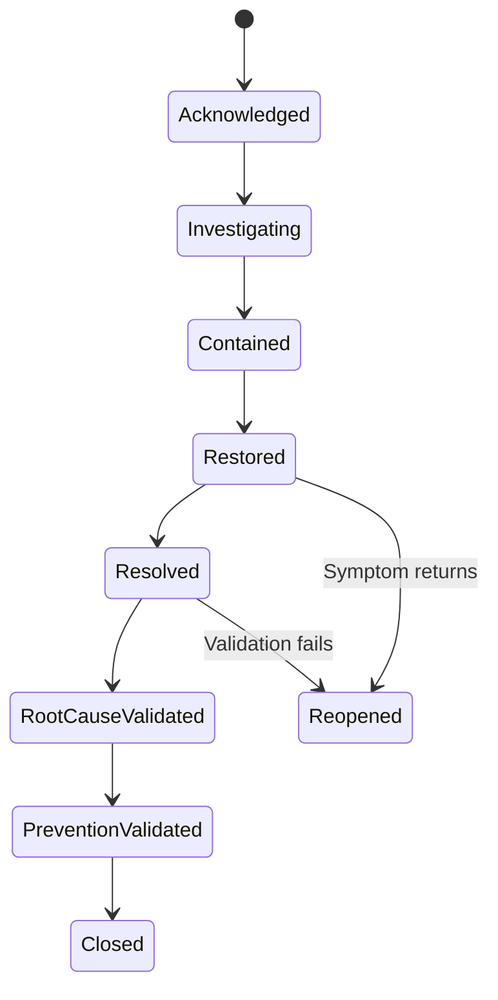

---

## 10. Decision requests and difficult messages

### Decision-request anatomy

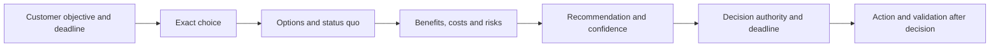

### Decision template

> `Decision requested from <authority> by <date/time zone>: choose <A/B/defer>. Evidence as of <cutoff> supports <bounded conclusion> with <confidence>. Option A provides <benefit> with <tradeoff>; Option B/status quo retains <risk>. I recommend <option> because <customer-specific rationale>. After decision, <owner> will <action> and validate <success>.`

### Difficult-message patterns

**Cannot confirm:**

> `I cannot confirm the target is supported because the current adapter firmware and authorized recipe result are unavailable. Hold approval; owners will provide both by D+3.`

**Missed commitment:**

> `We missed the 14:00 UTC update. That left the customer without the agreed checkpoint. The communication owner is now <role>; verified updates will resume at <time>.`

**Recommendation declined:**

> `The authorized customer owner declined the action because of the freeze. The record shows current controls, residual risk, monitoring, and a review date; this is not a completed remediation.`

**Unsupported request:**

> `I cannot recommend that production change from the available evidence or my role. Support and the customer change authority should review the exact state and supported procedure.`

**No progress:**

> `There is no material technical change since 12:00 UTC. Evidence collection remains blocked by <dependency>; <owner> is addressing it. Impact is unchanged. Next update is 14:00 UTC or sooner on restoration.`

---

## 11. Cultural and time-zone-aware language

### Inclusive global writing

- Use explicit dates such as `2026-08-28`, not `08/09`.
- State time zone and consider both UTC and customer-local time.
- Avoid `EOD`, `COB`, `tomorrow`, and `this evening` across regions.
- Avoid idioms, sarcasm, sports metaphors, and culturally specific humor in critical messages.
- Use short sentences and define acronyms.
- Distinguish directness from disrespect; state facts and requests politely.
- Provide asynchronous context so absence from one meeting does not exclude a region.
- Confirm interpretation rather than assuming silence means agreement.

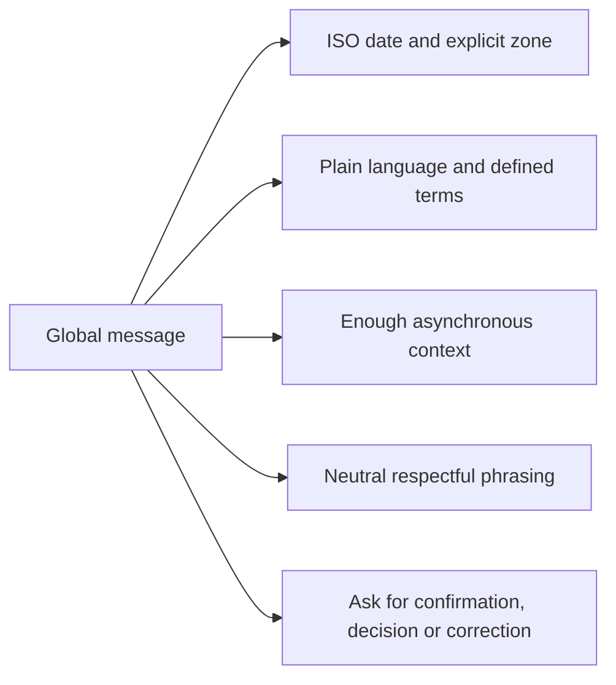

### Time-zone handoff

```text
Handoff at: <timestamp/zone>
Impact/current state: <...>
Known/unknown: <...>
Actions completed/results: <...>
Active work/owner: <...>
Safety/decision boundary: <...>
Exact next step: <...>
Customer update sent/next due: <...>
Receiving owner acknowledgment: <...>
```

### Respectful challenge

> `I may be missing context. The current source shows X as of Y, while the proposed statement says Z. Can we compare the definitions and effective dates before sending?`

This challenges the claim without attacking competence.

---

## 12. Communication QA and approval

### Pre-send gate

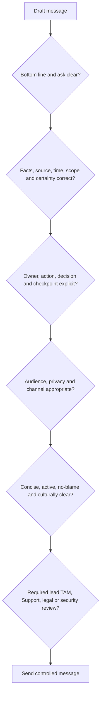

### Reviewer lenses

| Lens | Check |
|---|---|
| Technical | Claim, source, scope, version, hypothesis and action |
| Account | Customer context, role, expectation and commitment |
| Incident | Impact, state, cadence, safety and communication owner |
| Privacy/security | Minimum data, channel, access, links and retention |
| Legal/PR | Liability/public statement/regulated disclosure where applicable |
| Language/accessibility | Plain language, defined terms, readable structure |

### Communication metrics

- Missed update commitments.
- Corrections/retractions and cause.
- Decisions delayed by unclear asks.
- Actions without accepted owners.
- Repeated clarification requests.
- Handoff evidence loss.
- Customer feedback/themes.

Use metrics for learning, not to reward message volume or punish transparent corrections.

---

## 13. Fully synthetic sanitized scenario: Eastgate Manufacturing incident communication

> **Synthetic boundary:** `Eastgate Manufacturing`, every service, timestamp, system, message, person, cause, decision, action, and outcome is invented. No real NetApp/customer incident, SLA, process, or result is represented.

### Situation

A fictional manufacturing-planning service experiences intermittent transaction failures. Storage latency is initially suspected, but current evidence is incomplete.

### Bad first update

> `Storage is down due to a network issue. The team is working urgently and should fix it soon.`

Problems: wrong certainty, contradictory cause/owner, no scope, no timestamp, no action owner, no decision, and no checkpoint.

### Corrected initial update

> `Bottom line (2026-08-24 10:00 UTC): the manufacturing-planning service is experiencing intermittent transaction failures at Site A; Site B remains available. Root cause is unknown. Application, network, and storage owners are correlating transaction, path, and platform evidence. No production change is approved from the current hypothesis. The next customer update is 10:30 UTC or sooner on material impact or restoration.`

### Communication flow

```mermaid
sequenceDiagram
    autonumber
    participant APP as Application lead
    participant NET as Network lead
    participant STO as Storage lead
    participant IC as Communication owner
    participant C as Customer stakeholders
    APP->>IC: Transaction impact and timestamp
    NET->>IC: Path evidence incomplete; hypothesis open
    STO->>IC: Storage metrics within measured baseline; source partial
    IC->>C: BLUF with known/unknown/actions/checkpoint
    NET-->>IC: Packet test isolates firewall reset behavior
    APP-->>IC: Transactions recover after authorized network action
    IC->>C: Restoration update with validation and RCA caveat
```

### Update sequence

| Time UTC | Correct status | Message focus |
|---|---|---|
| 10:00 | Acknowledged/investigating | Impact, scope, unknown cause, owners, next update |
| 10:30 | Investigating | No material impact change; packet evidence action/blocker |
| 10:52 | Contained | Faulting path isolated; authorized traffic control applied |
| 11:15 | Restored | Transactions pass at Site A; monitoring and app validation continue |
| 13:00 | Resolved for current scope | Sustained tests pass; root-cause review remains open |
| D+5 | Prevention review | Firewall/process corrective actions and residual risk |

### Executive update

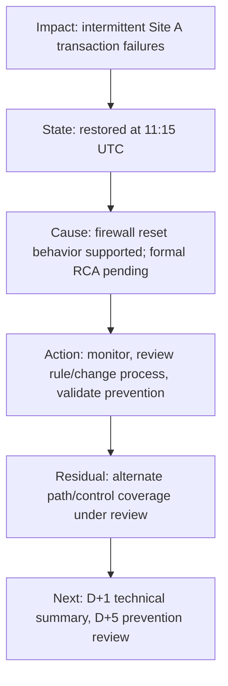

### Difficult correction

At 10:05, one stakeholder had already said `storage outage`. The communication owner sends:

> `Correction: the affected business service is experiencing intermittent transactions, but storage unavailability has not been established. Current evidence includes application failures and incomplete cross-layer data. Please use the 10:00 UTC update as the controlled status while technical owners test competing hypotheses.`

### Decision request

> `Decision requested from the customer incident/change authority by 10:45 UTC: approve a reversible traffic-control test on the isolated path or continue evidence collection without change. The test may restore transactions faster but can shift load; the status quo retains intermittent impact. Network and application owners have defined stop and validation criteria.`

### Synthetic validation

- Application transactions pass for the agreed observation period.
- The message says `restored` before `resolved` and does not claim root cause prematurely.
- A later evidence review supports a firewall mechanism; prevention remains a separate action.
- The missed-certainty correction is retained, not silently erased.
- No real product, customer, or NetApp result is inferred.

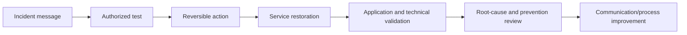

---

## 14. Discovery, evidence, risks, actions, and validation

### Discovery questions

1. Who is the audience, communication owner, approver, and decision authority?
2. What is the impact, scope, source time, known/unknown state, and confidence?
3. Is this status, finding, issue, risk, recommendation, decision, or action?
4. What should the reader know, decide, do, or stop doing?
5. Which privacy, security, legal, support, account, and channel constraints apply?
6. What cadence or next checkpoint is reliable across time zones?
7. Which wording could imply blame, unsupported certainty, or false resolution?
8. What outcome, correction, residual risk, and communication improvement will be validated?

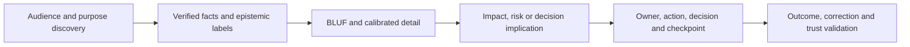

### Communication-risk register

| Risk | Control | Validation |
|---|---|---|
| Premature cause statement | Known/inferred/hypothesis/unknown labels | Technical owner reviews |
| Hidden bad news | BLUF and impact first | Reader can state bottom line |
| Missed update | Named communication owner/cadence | Timestamp history |
| Wrong audience/channel | Privacy and approval gate | Access/distribution review |
| Blame/defensiveness | Process/evidence/ownership language | Peer/customer feedback |
| False closure | State model and success proof | Reopen/validation record |
| Global ambiguity | ISO dates, zones, plain language | Receiving-owner acknowledgment |

---

## 15. Anti-patterns and corrections

| Anti-pattern | Why it fails | Better practice |
|---|---|---|
| Bury bottom line | Reader misses impact/ask | BLUF first |
| `Update: team is working` | No state, action or checkpoint | Known/unknown/owner/next time |
| Status mixed with finding | Creates category confusion | Label each record type |
| Executive certainty greater than technical | Changes truth by audience | Same material caveat |
| `Root cause` during restoration | Anchors and overclaims | Hypothesis plus test |
| Passive voice hides owner | Work becomes unowned | Name actor/action/date |
| Acronym wall | Excludes readers | Define once or use plain terms |
| Bad news softened into ambiguity | Delays action and trust | State impact clearly and respectfully |
| Blame language | People defend instead of solve | Evidence, process, owner and correction |
| `Resolved` after acknowledgment | Premature closure | Use state ladder and proof |
| `EOD` across time zones | Ambiguous deadline | ISO date/time and zone |
| Restricted evidence pasted into email | Privacy/security breach | Secure approved link and minimum summary |
| Silent correction | History and trust break | Explicit corrected statement |

---

## 16. Arti's factual bridge and JD Mapping

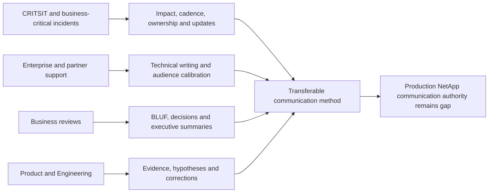

### Factual tie

| Arti evidence | Transfer | Boundary |
|---|---|---|
| Microsoft CRITSITs | High-pressure impact/action/checkpoint communication | Not NetApp incident command |
| Enterprise/partner customers | Audience, boundary and global language | No NetApp account spokesperson role |
| Business reviews | Executive summary, decisions and minutes | Not NetApp OSR ownership |
| Product/Engineering collaboration | Hypothesis, evidence and correction discipline | No private NetApp route or defect authority |
| CSAT/recognitions | Customer communication credibility | Not proof of storage expertise |
| Mentoring/documentation | Plain language and teach-back | No NetApp policy-writing authority |

### JD Mapping

| JD responsibility | Part 66 capability | Honest boundary |
|---|---|---|
| Strong written/verbal communication | BLUF, templates and QA | Actual account procedures govern |
| Operational reviews | Executive summary, decisions and minutes | Part 61 lifecycle applies |
| High-pressure situations | Incident updates and cadence | Support/incident owner retains command |
| Represent recommendations | Finding-risk-options-decision-action chain | No production NetApp recommendation authority |
| Customer time zones | ISO timestamps, handoffs and asynchronous context | No unlimited availability promise |
| Improve support experience | Clear ownership, corrections and trust behavior | No causal loyalty claim |
| Cross-functional work | Audience-specific same-fact record | Role/privacy boundaries remain |

### Honest interview statement

> `I use BLUF, then state verified impact, known/unknown, action owners, decision needs and next checkpoint. I distinguish status, finding, issue, risk, recommendation, decision and action; change depth but not certainty by audience; use active plain language; and deliver bad news without blame. My production communication experience is Microsoft-focused, not authorized NetApp account or incident communication.`

---

## 17. Role plays, paper lab, and self-test

### Role play 1: no progress

Deliver a useful update when there is no technical change. Include unchanged impact, work completed, current blocker, owner, escalation and next checkpoint.

### Role play 2: executive demands root cause

Explain that restoration and evidence continue, distinguish current hypotheses, state the cheapest discriminating test, and commit to the next verified update without sounding evasive.

### Role play 3: missed commitment

Acknowledge the missed update, state impact, avoid excuses, establish the new owner/checkpoint, and explain the process correction.

### Paper lab: synthetic communication portfolio

```mermaid
flowchart LR
    FACTS[Create synthetic facts and uncertainty] --> AUD[Map audiences and approvals]
    AUD --> WRITE[Write BLUF emails, updates, minutes and summaries]
    WRITE --> BAD[Deliver bad news and decision requests]
    BAD --> INCIDENT[Run incident cadence and handoff]
    INCIDENT --> QA[Privacy, certainty, tone and time-zone QA]
    QA --> VALID[Validate outcomes and corrections]
```

Create a synthetic portfolio containing:

- Three decision emails.
- Four incident updates from acknowledgment through restoration.
- One correction/retraction.
- One difficult recommendation deferral.
- One service-review executive summary and minutes.
- One cross-time-zone handoff.
- One trust-recovery message.

Inject:

- Bottom line buried in paragraph six.
- Unsupported `root cause` and `no impact` claims.
- Passive owner and `ASAP` deadline.
- Jargon/acronym overload.
- Blame toward customer/network/Support.
- `Resolved` while only restored.
- Restricted evidence in broad email.
- `EOD tomorrow` sent globally.
- Conflicting executive and technical certainty.
- Silent correction attempt.

### Lab tasks

1. Classify every statement by record type and epistemic label.
2. Rewrite each message using BLUF.
3. Produce executive, technical, incident and owner versions from one record.
4. Apply active voice, plain language and exact dates/zones.
5. Deliver bad news and apology within authority.
6. Run incident cadence and state transitions.
7. Write decision request, minutes and executive summary.
8. Run pre-send privacy/technical/account/legal gates.
9. Validate correction, action and trust outcomes.
10. Answer Q1-Q8 aloud.

### Self-test

1. Define BLUF and the seven record types.
2. Calibrate executive/technical detail without changing certainty.
3. Use known/inferred/hypothesis/unknown labels.
4. Rewrite passive/jargon-heavy text.
5. Produce all email/update/minutes/summary templates.
6. Deliver bad news without blame.
7. Build incident cadence and state ladder.
8. Write a complete decision request.
9. Communicate globally with exact time zones.
10. Recreate Eastgate and state Arti's nonclaim.

### Lab pass checklist

- [ ] Every message starts with a useful BLUF.
- [ ] Status, observation, finding, issue, risk, recommendation, decision and action remain distinct.
- [ ] Executive and technical versions preserve facts and material uncertainty.
- [ ] Known, inferred, hypothesis and unknown labels are accurate.
- [ ] Writing is concise, active, plain and acronym-controlled.
- [ ] Emails, updates, minutes and summaries use complete templates.
- [ ] Bad news states impact, ownership, action and checkpoint without blame.
- [ ] Incident cadence and state names match actual evidence.
- [ ] Decision requests contain authority, options, tradeoffs, deadline and next action.
- [ ] Dates/times/zones and global language are unambiguous.
- [ ] Privacy, channel, review and correction controls pass.
- [ ] All messages and evidence are fully synthetic and sanitized.
- [ ] No production NetApp communication authority or result is claimed.

---

## 18. Official and Public Source Anchors

**Date checked: 2026-08-24.** The supplied NetApp TAM Technical Analyst job description, represented in the master guide's JD matrix, is the primary source for communication expectations. Public official sources provide bounded writing, incident and service context; they do not define a NetApp internal message format or cadence.

| Topic | Official/public source | Bounded use |
|---|---|---|
| Microsoft writing guidance | [Microsoft Writing Style Guide](https://learn.microsoft.com/en-us/style-guide/welcome/) | Official Microsoft style guidance for clear, concise, customer-focused writing |
| Bias-free communication | [Microsoft bias-free communication](https://learn.microsoft.com/en-us/style-guide/bias-free-communication) | Inclusive-language orientation; organizational/customer policy still governs |
| Plain language | [Federal plain language guidelines](https://www.plainlanguage.gov/guidelines/) | Official US government plain-language guidance |
| Incident response | [NIST SP 800-61 Rev. 3](https://csrc.nist.gov/pubs/sp/800/61/r3/final) | Official incident-response lifecycle/context; no NetApp cadence inferred |
| Service management | [ITIL information from PeopleCert](https://www.peoplecert.org/browse-certifications/it-governance-and-service-management/ITIL-1) | Official ITIL-owner context for incident/service/value communication |
| NetApp support context | [NetApp Support Services](https://www.netapp.com/services/support/) | Public service context; exact Support process/cadence/entitlement requires confirmation |
| NetApp documentation | [NetApp Documentation](https://docs.netapp.com/) | Exact product/release facts; no customer result represented |

### Source-use discipline

- Revalidate source, scope, cutoff, impact, state, confidence, owner, audience and channel before sending.
- Use authorized Support/account/incident/legal language and review routes.
- Keep restricted evidence in approved systems and send role-appropriate summaries/links.
- Preserve correction history and never silently strengthen certainty.
- Do not infer a NetApp severity, cadence, message template, service promise, or legal position.
- Treat public product documents as technical context, not customer evidence.

---

## Likely Interview Questions

### Q1. What is BLUF, and how do you use it?

> **Model answer:** `Bottom Line Up Front means I lead with the impact, conclusion or decision, then the decisive evidence/confidence and exact next action or ask. Supporting detail follows. It helps executives and responders act quickly without hiding uncertainty.`

### Q2. How do status, finding, risk, decision, and action differ?

> **Model answer:** `Status is current work/state; a finding interprets evidence; risk is a possible future objective effect; a decision is an authorized choice; and an action is committed work with owner/date/proof. I link them but do not collapse them into one vague update.`

### Q3. How do you communicate uncertainty?

> **Model answer:** `I label known, inferred, hypothesis and unknown; state source, scope, cutoff, quality, contradictions and confidence; avoid absolute wording; and assign the next discriminating evidence action. Unknown is not green, and absence of evidence is not evidence of absence.`

### Q4. How do you tailor executive and technical messages?

> **Model answer:** `Both use one controlled fact/decision record. Executives get outcome, exposure, options, decision, owner and timing; technical readers get exact scope, versions, evidence, mechanism, tests and safeguards. Depth changes, but impact, certainty, cutoff and decision do not.`

### Q5. How do you deliver bad news?

> **Model answer:** `I state the bottom line and impact plainly, acknowledge the experience, separate verified facts from unknowns, own the next action/communication within role, explain containment/escalation/decision, and give a reliable checkpoint. I use process and evidence language rather than blame.`

### Q6. What belongs in an incident update?

> **Model answer:** `Impact, start/current timestamp and zone, scope, current state, known/unknown, workstream actions/results, safety boundary, decision/blocker and next update. Cadence follows impact and agreed process; I say acknowledged, restored, resolved and root cause only when each state is evidenced.`

### Q7. How do you write a decision request?

> **Model answer:** `I name the customer objective/deadline, exact choice, options including status quo, benefits/risks/tradeoffs, evidence/confidence, preferred recommendation, authorized decision owner, decision deadline, and the owner/action/validation that follows.`

### Q8. How does your background transfer, and what remains a gap?

> **Model answer:** `Microsoft enterprise support, CRITSITs, partner communication, business reviews and Product/Engineering work give me strong impact, BLUF, cadence, evidence and correction discipline. I have not spoken for a production NetApp account or incident, so actual NetApp/customer messages require authorized owners and procedures.`

---

## 30-Second Memory Hooks

- **Communication:** Part of the operational control plane.
- **BLUF:** Bottom line -> why -> next/ask.
- **Status:** Where work is; **finding:** what evidence means.
- **Risk:** Possible objective effect; **decision:** authorized choice; **action:** owned work.
- **Audience:** Zoom changes detail, not facts.
- **Confidence:** Source + scope + freshness + alternatives.
- **Labels:** Known, inferred, hypothesis, unknown.
- **Concise:** Compression without impact/evidence/owner loss.
- **Active voice:** Name actor, action and date.
- **Bad news:** Impact -> acknowledge -> facts -> own -> plan -> checkpoint.
- **No blame:** Process/evidence/accountability, not motive judgment.
- **Incident:** Impact + state + actions + blocker + next update.
- **Acknowledged is not restored; restored is not resolved; resolved is not prevented.**
- **Decision request:** Choice + options + tradeoffs + authority + deadline + proof.
- **Global:** ISO date, explicit zone, plain language, confirmation.
- **Correction:** Prompt, explicit and preserved.
- **Arti's bridge:** Microsoft communication transfers; NetApp spokesperson authority does not.

---

## Completion Checklist

- [ ] Use BLUF for executive, technical, incident and decision messages.
- [ ] Distinguish status, observation, finding, issue, risk, recommendation, decision and action.
- [ ] Calibrate audience depth without changing facts or certainty.
- [ ] Label known, inferred, hypothesis and unknown accurately.
- [ ] Use confidence, source, scope, cutoff and contradiction language.
- [ ] Write concise active sentences and control jargon/acronyms.
- [ ] Produce decision email, status update, recommendation, minutes and executive summary.
- [ ] Deliver bad news and acknowledgment without blame or unsupported apology.
- [ ] Build impact-based incident cadence and exact next checkpoints.
- [ ] Separate acknowledgment, containment, restoration, resolution, root cause, prevention and closure.
- [ ] Write difficult messages and complete decision requests.
- [ ] Use cultural/time-zone-aware language and handoffs.
- [ ] Run technical, account, privacy/security, legal and language QA.
- [ ] Recreate the fully synthetic Eastgate scenario and paper lab.
- [ ] Answer Q1-Q8 aloud and state the exact nonclaim.
- [ ] Revalidate current facts, audience, authority and channel before sending.

---

*Next suggested section:* [Part 67 - Influence, Negotiation, Objection Handling, and Remediation Adoption](Part-67-influence-negotiation-objections.md)