# Part 67 - Influence, Negotiation, Objection Handling, and Remediation Adoption

> **Section goal:** Help stakeholders make and implement sound technical decisions when Arti does not control their budget, calendar, people, or production environment. By the end, Arti should be able to influence without authority through trust and evidence; distinguish interests from positions; map incentives; listen, question, reframe, and generate options; use tradeoffs and BATNA responsibly; prepare negotiations; handle cost, downtime, ownership, priority, and evidence objections; govern accepted risk and escalation; maintain decision logs; create implementation intentions; manage action aging; and preserve customer choice without fear or manipulation.

Covers index item **67** and maps directly to job-description responsibilities for influencing and negotiating preventative remediation, communicating recommendations, managing customer risk, tracking actions, handling complex stakeholders, delivering reviews under lead-TAM guidance, improving support experience, and building trust and loyalty.

**Explicit nonclaim:** Arti has not negotiated, approved, or secured adoption of a production NetApp remediation, accepted customer risk, committed NetApp/customer resources, or represented a NetApp commercial or legal position.

**Privacy and access boundary:** Negotiations can expose budgets, staffing, contracts, vulnerabilities, risks, stakeholder incentives, internal disagreements, commercial timing, legal positions, and individual behavior. Use approved systems and channels, minimum necessary detail, role-based distribution, careful notes, and authorized commercial/legal/account participation.

**Synthetic-evidence rule:** Every customer, stakeholder, objection, incentive, cost, outage estimate, option, BATNA, decision, action, date, score, accepted risk, and outcome below is fictional and sanitized. No table is a real NetApp/customer negotiation, commercial position, risk acceptance, or remediation result.

**Version and current-source caveat:** Product guidance, supportability, lifecycle, remediation options, costs, schedules, contracts, customer priorities, and stakeholder authority change. A **current-source check** means revalidating exact technical evidence, options, decision rights, constraints, service scope, and commercial/legal inputs before influencing a decision.

This Part provides an ethical problem-solving model, not a NetApp internal sales playbook, negotiation policy, escalation ladder, pricing position, threat script, support commitment, or authority to accept risk. Actual lead-TAM, account, commercial, Support, legal, security, and customer governance control live decisions.

> **No-production-NetApp boundary:** Arti's factual strengths are Microsoft enterprise and partner support, CRITSIT ownership, technical advisory, customer objection handling, escalation strategy, business reviews, Product/Engineering coordination, action follow-through, and high CSAT. She does **not** claim NetApp commercial negotiation, production ONTAP remediation adoption, customer change authority, contract interpretation, or risk acceptance. Her exact non-claim is: **she has not negotiated, authorized, implemented, or validated a production NetApp remediation or customer risk decision.**

---

## 1. Influence without authority

**Influence without authority** means helping people choose and execute an action through credibility, shared purpose, evidence, options, relationships, and governance rather than command power.

### Plain-English deep-dive: a navigator does not hold the steering wheel

A navigator cannot turn the wheel, but can understand the destination, identify hazards, compare routes, and make the next turn easy to choose. The driver retains authority. A TAM analyst often works like the navigator.

**Why it matters:** customer administrators, change authorities, sponsors, partners, and account roles control different decisions. Influence must respect those boundaries.

| Term | Plain meaning | Analogy | Why it matters |
|---|---|---|---|
| **Influence** | Help shape a decision or behavior | Trusted navigator | Works without command authority |
| **Position** | Stated demand or preferred answer | `Take Route A` | May hide the real need |
| **Interest** | Need, concern, or outcome underneath a position | Arrive safely before 5 PM | Opens more options |
| **Incentive** | Factor that makes behavior attractive or costly | Toll, fuel, schedule | Explains resistance/adoption |
| **Negotiation** | Joint decision process under differing interests/constraints | Agreeing a route and cost | Is not winning an argument |
| **BATNA** | Best Alternative To a Negotiated Agreement | Best route if no joint route is agreed | Clarifies walk-away/deferral reality |
| **Commitment** | Explicit accepted action with owner and conditions | Driver agrees to turn at exit 10 | More than acknowledgment |
| **Implementation intention** | If/when trigger, then named action | `If traffic closes A, take B` | Makes execution more likely and clear |

```mermaid
flowchart LR
    OUTCOME[Shared customer outcome] --> TRUST[Trust and credibility]
    TRUST --> DISC[Listen for interests and constraints]
    DISC --> EVID[Agree facts and unknowns]
    EVID --> OPTIONS[Create options and tradeoffs]
    OPTIONS --> DEC[Authorized customer decision]
    DEC --> COMMIT[Owner, date and implementation intention]
    COMMIT --> VALID[Outcome and residual-risk validation]
```

### Influence foundations

- Technical credibility and honest limits.
- Reliability in commitments and follow-up.
- Empathy for operational and business constraints.
- Clear evidence and uncertainty.
- Choice architecture with real options.
- Fair process and correct authority.
- Visible action and outcome history.

---

## 2. Trust, positions, interests, and constraints

### Plain-English deep-dive: argue about the orange or share the needs

Two people can argue over one orange. If one needs juice and the other needs peel, both interests can be met. The positions were `I need the whole orange`; the interests reveal better options.

**Why it matters:** `No maintenance window` may mean revenue risk, failed-change history, missing app validation, or exhausted staff. Each needs a different response.

### Position-to-interest questions

| Position | Possible interests/constraints | Useful question |
|---|---|---|
| `We will not upgrade` | Downtime, app certification, skills, prior failure, budget | `Which consequence or dependency makes the upgrade unacceptable now?` |
| `Fix it without a change` | Availability, governance, trust, workload | `What change risk must we avoid, and which reversible tests are acceptable?` |
| `This is not our issue` | Ownership ambiguity, capacity, evidence disagreement | `Which part of the service or decision do you own, and what evidence would change that?` |
| `We need it immediately` | Deadline, executive pressure, service impact | `What is the actual decision deadline and consequence of delay?` |
| `The risk is exaggerated` | Applicability doubt, competing work, prior experience | `Which condition, control, or evidence do you dispute?` |

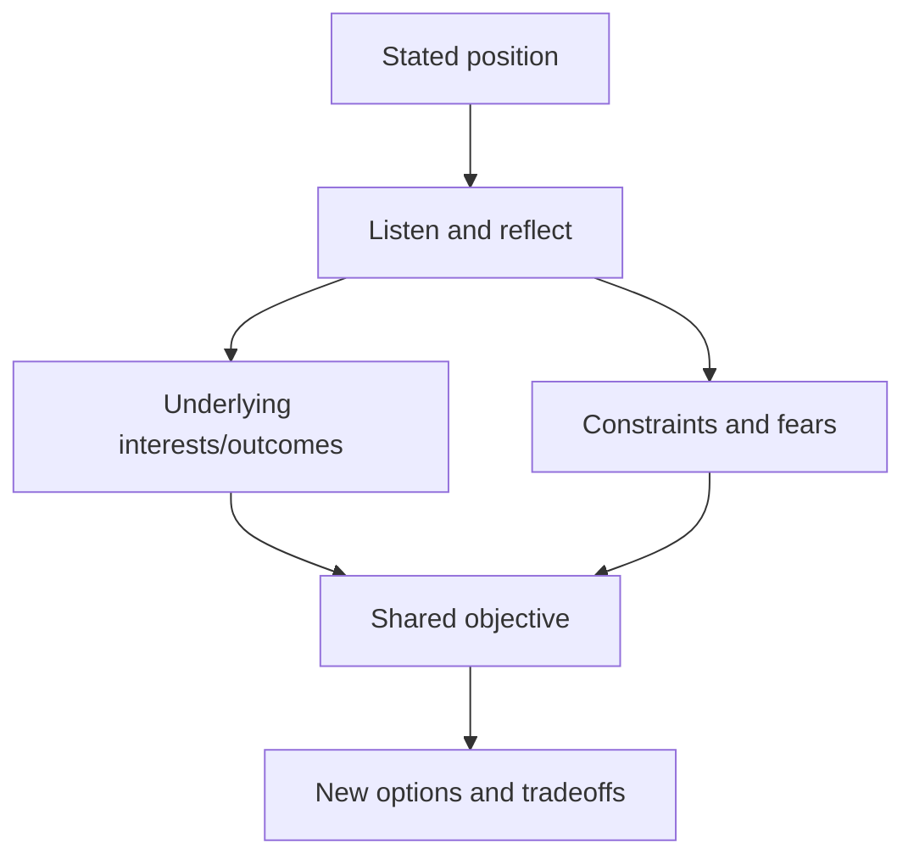

### Trust account

Trust rises through accurate claims, useful advice, kept commitments, fair acknowledgment of constraints, prompt corrections, and no-surprise escalation. It falls through fear, hidden agendas, overclaiming, inconsistent follow-up, or using confidential context as leverage.

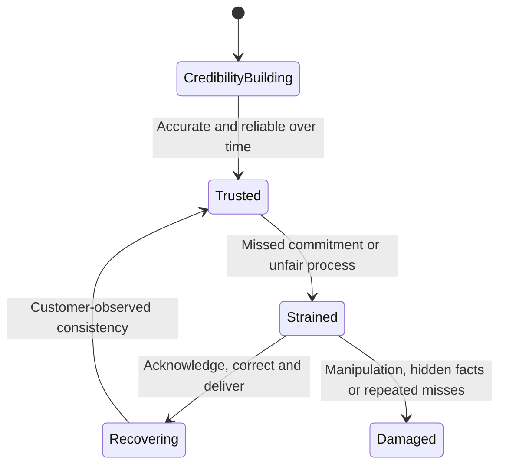

---

## 3. Stakeholder incentives and decision architecture

An **incentive** is anything that affects the relative benefit or cost of an action. It is not necessarily financial.

### Incentive map

| Stakeholder | Typical interest/incentive | Possible adoption barrier |
|---|---|---|
| Executive sponsor | Continuity, risk, cost, accountability | Technical uncertainty or weak value case |
| Storage/platform owner | Stability, supportability, manageable work | Change risk, staff capacity, prior incidents |
| Application owner | Transaction continuity and validation | Test effort and maintenance impact |
| Network/security | Control integrity and safe changes | Incomplete flow/evidence or competing events |
| Operations | Clear runbooks, monitoring, escalation | Added toil and ambiguous ownership |
| Procurement/finance | Predictable cost and approved value | Budget cycle and unqualified estimate |
| Change authority | Bounded risk, rollback, evidence | Missing prerequisites or collision |
| Partner/vendor | Contracted scope and deliverable success | Scope gaps, access, dependencies |

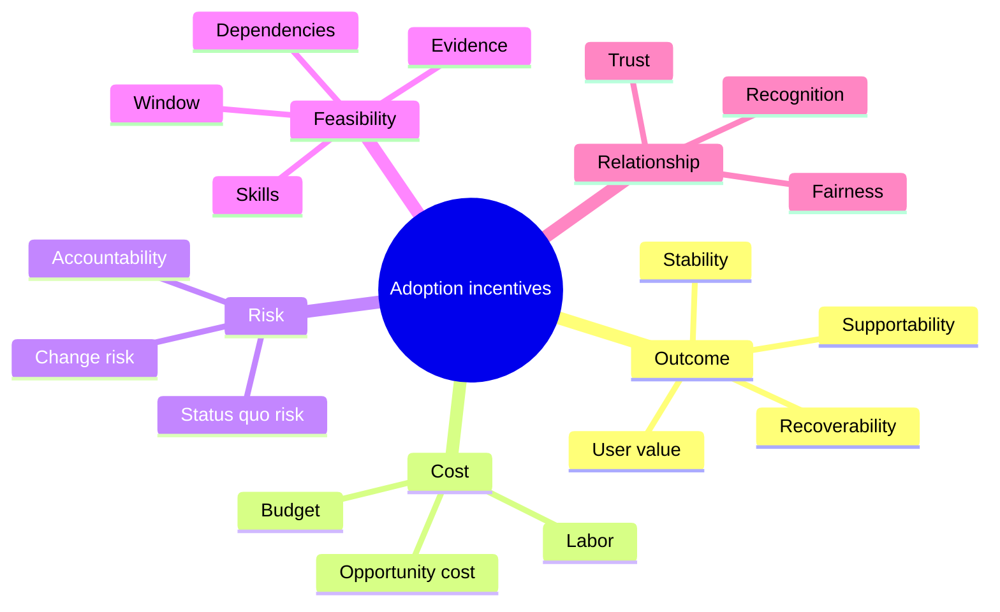

### Decision architecture

Map who supplies evidence, validates technical feasibility, approves budget, authorizes change, accepts residual risk, and validates outcome. A stakeholder can strongly support an action without holding approval authority.

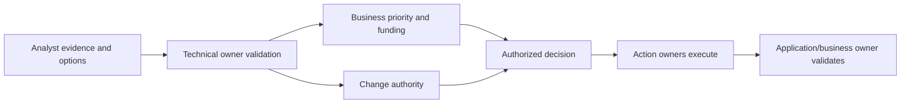

### Avoid assuming incentives

Ask and test. `The customer does not care about risk` is usually an unsupported judgment. They may care differently because of maintenance history, budget, customer impact, or evidence confidence.

---

## 4. Listening, questioning, and reframing

### Listening loop

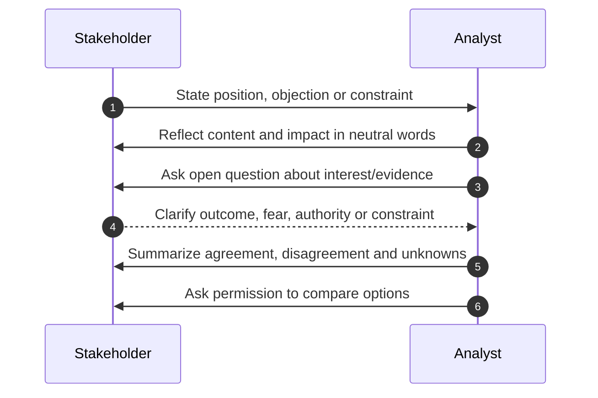

### Useful questions

- `What outcome are you protecting?`
- `Which part of the evidence or consequence do you disagree with?`
- `What would need to be true for this action to be acceptable?`
- `Which constraint is hardest: downtime, people, budget, ownership, or uncertainty?`
- `What happens if no agreement is reached this quarter?`
- `Which reversible step could reduce uncertainty?`
- `Who must approve, execute, and validate?`

### Reframing examples

| Original frame | Reframe |
|---|---|
| `Upgrade versus do nothing` | `Preserve options through evidence, temporary control, phased plan, or accepted risk` |
| `Vendor wants downtime` | `Customer needs a safe path that balances status-quo and change risk` |
| `Customer ignores recommendations` | `Current option does not fit the customer's window, capacity, or evidence threshold` |
| `Who caused this?` | `Which conditions and controls allowed the outcome, and who owns correction?` |
| `Can we guarantee no impact?` | `What risk can be reduced, monitored, recovered, and accepted?` |

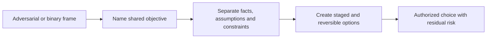

### Active listening is not agreement

Reflecting `You are concerned that a failed change could disrupt month-end` validates understanding, not the technical conclusion or decision.

---

## 5. Options, tradeoffs, and BATNA

### Option set

For material recommendations compare:

- Evidence-only probe.
- Temporary/reversible control.
- Phased remediation or pilot.
- Full remediation.
- Strategic redesign.
- Defer/status quo with monitoring.
- Accepted risk with authority and expiry.

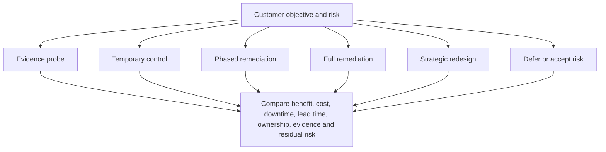

### Tradeoff table

| Dimension | Questions |
|---|---|
| Customer benefit | Which objective improves and how will it be measured? |
| Risk reduction | Which mechanism/exposure/consequence changes? |
| Change risk | What can fail during action and how is it bounded? |
| Cost | Money, labor, opportunity and ongoing control |
| Downtime | Expected need/range, business window and uncertainty |
| Lead time | Evidence, decision, budget, test, change and validation |
| Ownership | Who decides, acts, supports and validates? |
| Reversibility | Canary, stop, rollback or forward recovery |
| Residual risk | What remains after each option? |

### Plain-English deep-dive: BATNA is a safety exit, not a threat

BATNA means the best realistic path available if no negotiated agreement is reached. It may be deferment with monitoring, escalation for evidence, a temporary control, or accepting risk through the proper owner. It is not `agree with us or else`.

**Why it matters:** knowing the real alternative prevents both desperate agreement and empty threats.

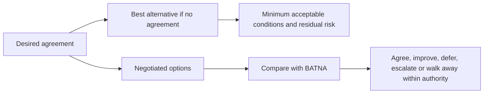

### BATNA caveats

- The analyst does not invent commercial/legal walk-away positions.
- The customer's BATNA and vendor/account BATNA can differ.
- A poor status quo does not justify unsafe action.
- A strong BATNA should not be used to humiliate the other party.
- Escalation must preserve accuracy and relationship.

---

## 6. Negotiation preparation

### Preparation canvas

| Field | Questions |
|---|---|
| Shared outcome | What does every party want to protect? |
| Decision | What exact choice and authority? |
| Facts/unknowns | Which sources and contradictions? |
| Interests | What does each stakeholder need/fear? |
| Constraints | Cost, downtime, ownership, priority, evidence, policy |
| Options | Which staged/status-quo paths exist? |
| Tradeoffs | Benefit, risk, time, cost and residual |
| BATNA | Best authorized alternative if no agreement? |
| Range/boundary | What can be adjusted and what is non-negotiable? |
| Process | Agenda, participants, time, record and escalation |

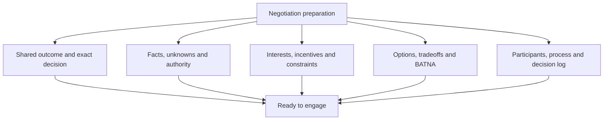

### Non-negotiable versus preference

Examples of potential non-negotiables include legal/privacy prohibitions, unsupported production paths, customer change authority, data-protection prerequisites, and safety controls. Confirm current authority; do not label personal preferences as policy.

### Concession discipline

When changing scope, sequence, timing, or evidence, record what changed, why, reciprocal requirement if any, authority, and residual risk. Do not trade away a technical safety condition to secure agreement.

---

## 7. Objection handling by type

### Objection workflow

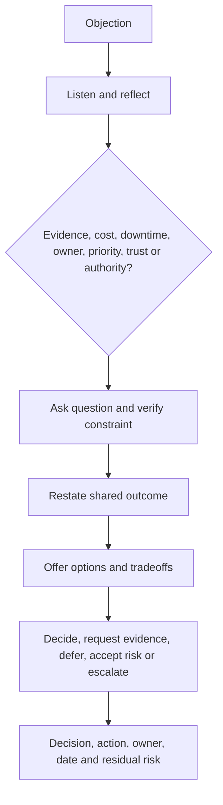

### Cost objection

`We do not have budget.`

- Clarify current-year versus total budget, funding authority, and lead time.
- Compare evidence-only/design/temporary/phased/full/status-quo options.
- Show cost of delay without pretending exact avoided loss.
- Preserve customer financial authority.

### Downtime objection

`We cannot take an outage.`

- Clarify service, users, duration, window, degraded mode, prior change history.
- Examine supported nondisruptive/staged paths only through current evidence.
- Compare status-quo risk and change risk.
- Define canary, stop, recovery, and app validation.
- Never promise `zero impact` without authoritative exact support.

### Ownership objection

`This is not our team's responsibility.`

- Map business service, component, field authority, change authority, and contract scope.
- Separate accountable result from contributing task.
- Propose joint evidence action and escalation if boundary remains unclear.

### Priority objection

`We have more important work.`

- Compare customer impact, urgency/latest safe start, dependencies, resource collision, and opportunity cost.
- Ask sponsor to prioritize rather than treating volume as refusal.
- Offer an evidence or planning milestone that preserves options.

### Evidence objection

`We do not agree that this risk applies.`

- Identify exact disputed gate: identity, version, feature, trigger, control, consequence, horizon, or source.
- Use the cheapest safe discriminating check.
- Reduce certainty/priority if evidence changes.
- Do not pressure agreement before applicability.

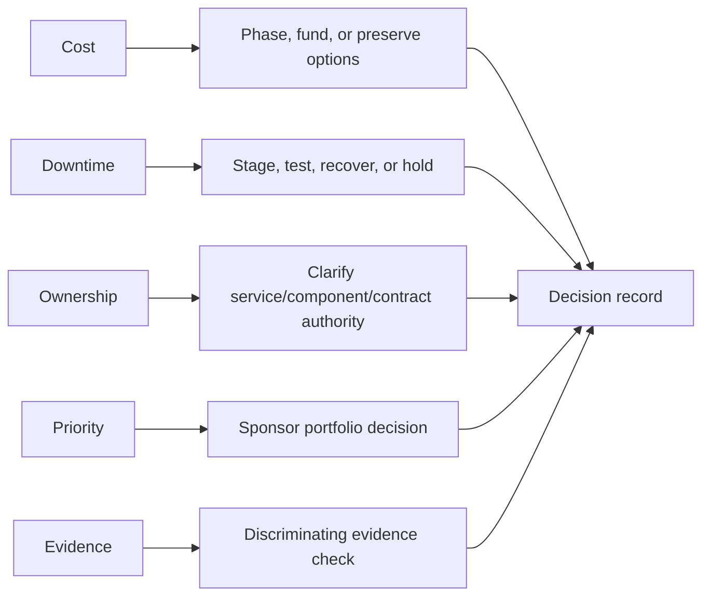

---

## 8. Accepted risk, escalation, and decision logs

### Accepted risk

When a customer defers or declines a recommendation, the analyst should not label the customer noncompliant or close the risk silently.

An accepted-risk record needs:

- Exact condition, scope, evidence cutoff, and confidence.
- Consequence, exposure, horizon, and controls.
- Options considered and reason not selected.
- Accountable customer decision authority.
- Monitoring, response plan, and action owner.
- Start, expiry/review, and reopen triggers.
- Residual risk and dependencies.

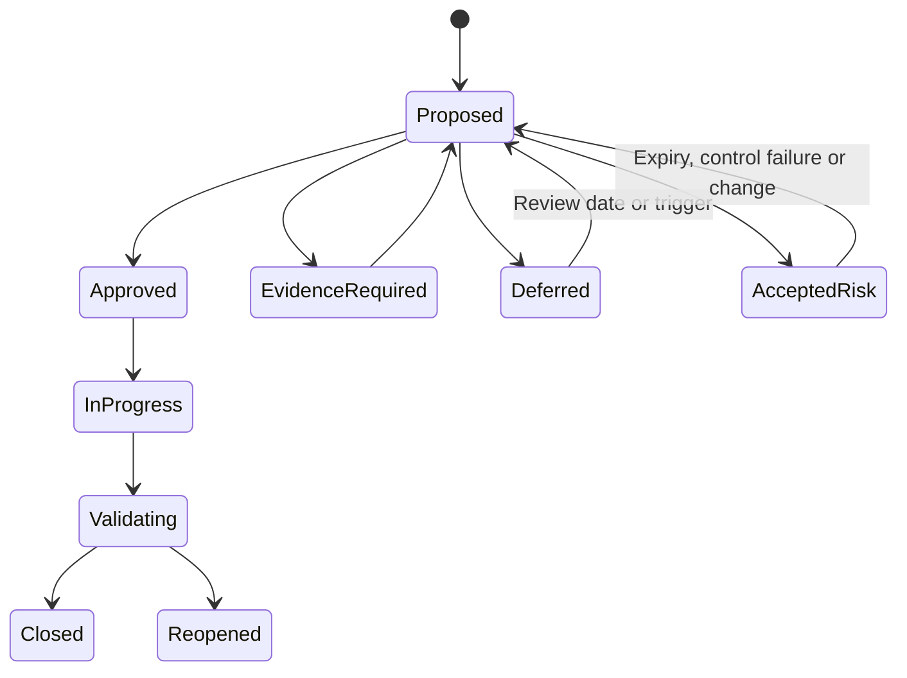

### Escalation

Escalate when consequence, deadline, unsupported/safety boundary, missing authority, action aging, or trust impact exceeds the current route. The exact ask should be authority, expertise, resource, priority, evidence, or conflict resolution.

Do not escalate to punish rejection. A valid authorized `no` can remain a recorded decision with residual risk.

### Decision log

| Field | Required content |
|---|---|
| Decision ID/date | Stable identity and time zone |
| Question/options | Exact choice and status quo |
| Evidence | Source, cutoff, confidence, contradictions |
| Interests/constraints | Material stakeholder factors |
| Decision/authority | Chosen path and named authorized owner |
| Rationale | Why selected and alternatives rejected |
| Conditions/actions | Owner, date, dependency, implementation intention |
| Residual/accepted risk | Controls, expiry and monitoring |
| Reopen | Evidence, environment or deadline triggers |

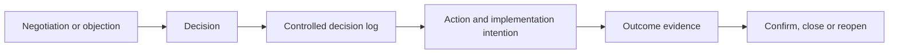

---

## 9. Commitment, implementation intentions, and action aging

### Acknowledgment versus commitment

- Acknowledgment: `I received the recommendation.`
- Agreement: `I support the proposed direction.`
- Decision: `I approve this option under conditions.`
- Commitment: `I own this action by this milestone.`
- Completion: `The work was implemented.`
- Validation: `The intended outcome is proven.`

### Plain-English deep-dive: reserve a calendar slot, not a wish

`I should exercise` is a wish. `If it is 07:00 on Monday, I will walk for 20 minutes` connects a trigger to behavior. An implementation intention similarly states when/if a condition occurs, who will do what, through which route, and what proves completion.

**Why it matters:** vague agreement decays when urgent work arrives.

### Implementation-intention pattern

> `When <time/event/prerequisite> occurs, <owner> will <specific action> in <system/window>, unless <stop condition>; <validator> will confirm <evidence> by <checkpoint>. If blocked by <dependency>, escalate to <authority> within <time>.`

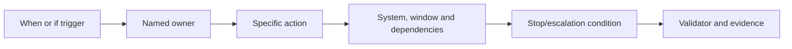

### Action-aging fields

- Original open/decision date.
- Due date and latest safe start.
- Last meaningful update.
- Days in current state and blocked state.
- Blocker/dependency owner.
- Accepted-risk expiry.
- Validation due and reopen history.

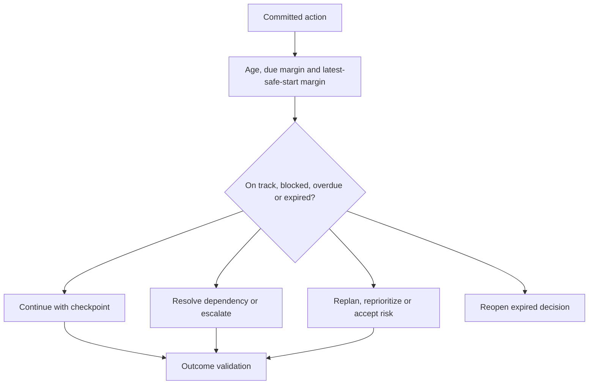

### Follow-up without nagging

Reference shared outcome, accepted commitment, changed fact, blocker, and decision needed. Adjust frequency to risk and agreement. Repeated `checking in` messages with no new help create noise.

---

## 10. Ethical influence and anti-coercion

### Ethical principles

- Preserve informed customer choice.
- State evidence, uncertainty, options, and status quo honestly.
- Do not exaggerate likelihood, impact, urgency, or authority.
- Do not use confidential personal/commercial information as leverage.
- Do not imply support withdrawal beyond verified contract/policy.
- Do not manufacture executive pressure or social proof.
- Do not hide viable alternatives or material side effects.
- Correct your recommendation when new evidence changes it.

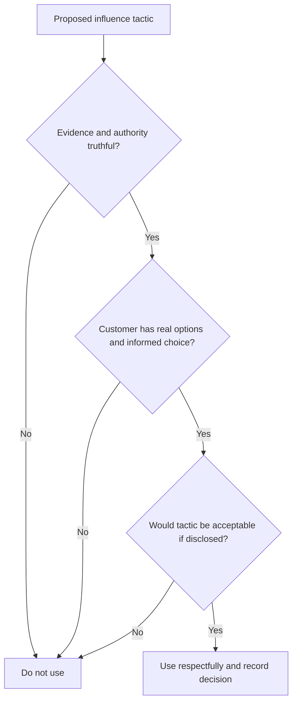

### Fear versus consequence clarity

Fear: `If you do not upgrade, a major outage is inevitable.`

Evidence-bound consequence:

> `The current lifecycle horizon is 15 months in this synthetic example, while design-to-validation lead time is estimated at 12-18 months. Starting discovery now preserves options. No outage probability is asserted; deferral reduces schedule margin and leaves the current controls/residual risk in place.`

### Ethical urgency

Urgency comes from evidence, deadline, and lead time, not volume or seniority. Show the latest safe start and what becomes harder after it.

---

## 11. Fully synthetic sanitized scenario: Silverline University remediation adoption

> **Synthetic boundary:** `Silverline University`, all stakeholders, systems, risks, costs, windows, options, decisions, dates, actions, and outcomes are invented. The scenario is not a NetApp account, negotiation, support position, commercial offer, or Arti production result.

### Situation

A fictional research-storage service has stale restore proof, narrowing lifecycle margin, and incomplete target compatibility evidence. The customer agrees these matter but resists a combined remediation program.

### Stakeholder positions and interests

| Stakeholder | Position | Underlying interest/constraint |
|---|---|---|
| CIO sponsor | `Do it this year` | Avoid urgent budget request next year |
| Storage owner | `No major change this semester` | Team capacity and prior failed change |
| Application owner | `No downtime` | Research deadline and missing test environment |
| Procurement | `No unplanned purchase` | Budget cycle and vendor lead time |
| Security/risk | `Close the gap now` | Audit finding and recovery exposure |

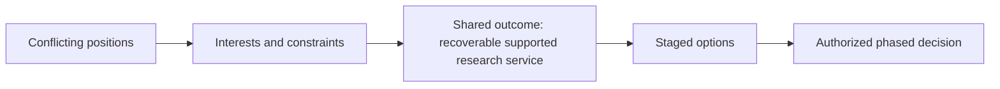

### Negotiation preparation

- Shared outcome: preserve research continuity and supportable options.
- Unknowns: exact target recipe, application test availability, project demand.
- Non-negotiables: customer change approval, current technical evidence, restore data validation.
- BATNA if no combined program: restore test plus lifecycle evidence discovery, accepted schedule risk, and sponsor review at expiry.

### Options

| Option | Benefit | Cost/downtime | Constraint/residual risk |
|---|---|---|---|
| A: Full program now | Fastest integrated path | Highest staff/budget/change load | Test environment not ready |
| B: Evidence and restore phase now; design next term | Preserves options and proves recovery | Lower immediate cost; bounded test window | Lifecycle delivery remains open |
| C: Temporary controls and defer | Lowest immediate load | Ongoing monitoring/toil | Margin shrinks; restore proof still required |
| D: Status quo/accepted risk | No immediate work | No change downtime | Recovery/lifecycle uncertainty remains |

### Objection handling

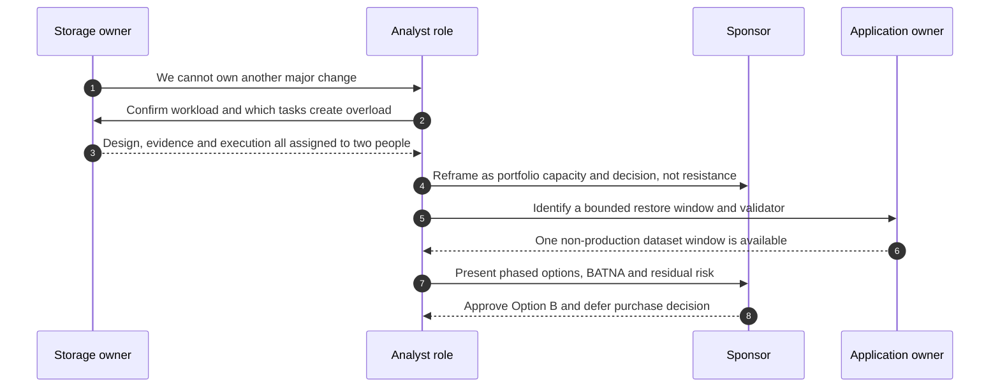

### Decision and implementation intentions

| Decision/action | Implementation intention | Validation |
|---|---|---|
| Restore test | When test dataset is frozen on 2026-09-12, backup/app owners execute approved restore; stop on integrity mismatch | RPO/RTO and application signoff |
| Compatibility evidence | When exact inventory is approved, host/storage owners validate current/intermediate/target recipes within five business days | Dated reviewed evidence and notes |
| Lifecycle discovery | If evidence confirms planning margin below approved threshold, sponsor opens design/funding workstream at next steering forum | Charter and milestones |
| Deferred purchase | Revisit after design evidence; not represented as rejection | Decision log and residual risk |

### Action aging

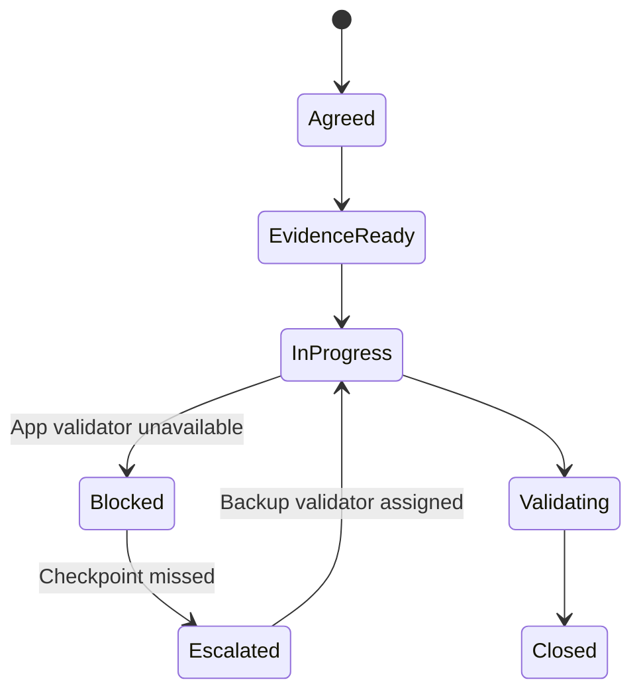

### Synthetic outcome

- Restore completes but misses the fictional RTO, opening a recovery-performance action.
- Compatibility evidence identifies an additional prerequisite; target choice remains deferred.
- The sponsor approves lifecycle design, not a purchase.
- Storage-owner WIP decreases because evidence, execution, and validation roles are split.
- No outage prevention, real supportability, cost saving, or NetApp result is claimed.

---

## 12. Discovery, evidence, risks, actions, and validation

### Discovery questions

1. What shared customer outcome and exact decision are in scope?
2. What positions, interests, incentives, constraints, fears, and authorities apply?
3. Which facts, unknowns, disagreements and evidence owners matter?
4. What evidence-only, temporary, phased, full, strategic and status-quo options exist?
5. What tradeoffs in benefit, cost, downtime, ownership, priority, evidence, lead time, reversibility and residual risk apply?
6. What is each party's authorized BATNA and non-negotiable boundary?
7. What decision, accepted risk, escalation, commitment, implementation intention and action-aging control are required?
8. What outcome and relationship evidence will validate the approach?

```mermaid
flowchart LR
    DISC[Outcome, interests and constraints] --> EVID[Agreed evidence and unknowns]
    EVID --> OPTIONS[Options, tradeoffs and BATNA]
    OPTIONS --> RISK[Risk and ethical consequence clarity]
    RISK --> DEC[Authorized decision or accepted risk]
    DEC --> COMMIT[Implementation intention and action aging]
    COMMIT --> VALID[Outcome, residual risk and trust validation]
```

### Adoption-risk register

| Adoption risk | Control | Validation |
|---|---|---|
| Stakeholder says yes but owns no action | Commitment/implementation intention | Owner accepts and acts |
| Hidden cost/downtime constraint | Interest discovery and options | Feasible plan accepted |
| Applicability disputed | Discriminating evidence check | Confidence/decision updated |
| Fear-based urgency | Latest-safe-start evidence and alternatives | Customer retains informed choice |
| Action aging | Due/latest-safe-start/blocked escalation | Milestone movement or explicit redecision |
| Unclear accepted risk | Authorized record and expiry | Reopen on trigger/expiry |

---

## 13. Anti-patterns and corrections

| Anti-pattern | Why it fails | Better practice |
|---|---|---|
| Influence means convincing | Ignores customer authority | Help make informed feasible choice |
| Argue against the position | Entrenches stakeholders | Discover interests and constraints |
| Assume incentives | Creates insulting stories | Ask and validate |
| One preferred option only | Feels coercive and hides tradeoffs | Include alternatives/status quo |
| BATNA used as threat | Damages trust | Treat as realistic fallback |
| Cost of delay stated as certainty | Invents avoided loss | Use bounded horizon and assumptions |
| `Zero downtime` promise | Unsupported certainty | Current evidence, staging, stop/recovery |
| Escalate every objection | Punishes valid disagreement | Escalate authority/impact only when needed |
| Customer acknowledgment = commitment | Actions never start | Owner/date/trigger/proof |
| Accepted risk has no expiry | Risk disappears administratively | Owner, controls, expiry, reopen |
| Repeated `checking in` | Adds noise without help | Reference blocker, consequence and decision |
| Fear/social pressure near renewal | Manipulative | Evidence, options and ethical boundaries |

---

## 14. Arti's factual bridge and JD Mapping

```mermaid
flowchart LR
    ADVISE[Microsoft technical advisory] --> EVID[Evidence, options and customer action]
    CRIT[CRITSIT and escalations] --> NEG[Interests, urgency and stakeholder alignment]
    PART[Partner and enterprise work] --> BOUND[Ownership and multi-party tradeoffs]
    REV[Business reviews and analytics] --> DEC[Decision records and action aging]
    EVID --> METHOD[Transferable ethical influence method]
    NEG --> METHOD
    BOUND --> METHOD
    DEC --> METHOD
    METHOD --> GAP[Production NetApp negotiation/adoption remains gap]
```

### Factual tie

| Arti evidence | Transfer | Boundary |
|---|---|---|
| Microsoft customer advisory | Evidence-based recommendations and objections | Not NetApp remediation authority |
| CRITSIT/escalation strategy | Shared outcome, urgency, owners and checkpoints | Not customer risk acceptance |
| Enterprise/partner customers | Cross-party interests and boundaries | Contract interpretation requires owners |
| Business reviews/analytics | Options, value, decisions and aging | No live NetApp account dataset |
| Product/Engineering collaboration | Technical disagreement and exact evidence | No private NetApp route/commitment |
| High CSAT/recognitions | Trust and listening evidence | Not proof of negotiation outcome |

### JD Mapping

| JD responsibility | Part 67 capability | Honest boundary |
|---|---|---|
| Influence/negotiation | Interests, options, tradeoffs and ethical choice | No command or commercial authority |
| Remediation adoption | Commitment, implementation intention and aging | Customer executes/approves |
| Customer risk | Accepted-risk and decision-log governance | Customer authority accepts risk |
| Operational reviews | Objections, decisions and action read-back | Part 61 governs meeting lifecycle |
| High-pressure work | Evidence-based urgency and escalation | No fear or unsupported certainty |
| Cross-functional work | Incentive/ownership maps and shared decisions | Actual roles must be validated |
| Improve loyalty/value | Fair process, trust and outcome validation | No renewal manipulation or causal claim |

### Honest interview statement

> `I influence by establishing shared outcomes, listening for interests and constraints, agreeing evidence and unknowns, and presenting real options with cost, downtime, ownership, priority, reversibility and residual-risk tradeoffs. I prepare a BATNA as a fallback, not a threat; record decisions and accepted risk; and turn agreement into implementation intentions and validation. My production experience is Microsoft-focused, not NetApp remediation negotiation.`

---

## 15. Role plays, paper lab, and self-test

### Role play 1: `No budget`

Discover timing and authority, compare evidence/design/phased/full/status-quo options, show lead-time consequence without invented avoided cost, and request a bounded decision.

### Role play 2: `No downtime`

Clarify the service/window, acknowledge prior-change fear, compare supported staged tests and status quo, define stop/recovery/app validation, and avoid zero-impact promises.

### Role play 3: `Your evidence is wrong`

Ask which applicability gate is disputed, agree a discriminating check, pause or revise the recommendation, and preserve the relationship.

### Paper lab: synthetic remediation negotiation

```mermaid
flowchart LR
    MAP[Map outcomes, roles and interests] --> PREP[Evidence, constraints and BATNA]
    PREP --> OPT[Options and tradeoffs]
    OPT --> ROLE[Run objection role plays]
    ROLE --> DEC[Decision and accepted-risk logs]
    DEC --> INTENT[Implementation intentions and action aging]
    INTENT --> VALID[Outcome and ethical-process review]
```

Create a fully synthetic account with eight stakeholders and recommendations covering restore testing, telemetry, lifecycle, compatibility, capacity, performance and action governance.

Inject:

- Cost objection with upcoming budget cycle.
- No-downtime statement after prior failed change.
- Unclear owner across customer and partner.
- Sponsor with competing priority.
- Evidence dispute over defect applicability.
- Analyst using an outage scare.
- One-option recommendation.
- Unrecorded concession.
- Acknowledgment recorded as commitment.
- Accepted risk without expiry.
- Action aging past latest safe start.
- Escalation used as punishment.

### Lab tasks

1. Map positions, interests, incentives, constraints and authority.
2. Prepare evidence, unknowns, options, tradeoffs and BATNA.
3. Reframe binary/adversarial statements.
4. Run cost, downtime, ownership, priority and evidence objections.
5. Record decisions, rejected options and accepted risks.
6. Write implementation intentions and aging/escalation triggers.
7. Audit every tactic for truth, choice and fairness.
8. Validate technical/customer outcomes and relationship effects.
9. Recreate Silverline University.
10. Answer Q1-Q8 aloud.

### Self-test

1. Define influence without authority, position, interest, incentive and commitment.
2. Map stakeholder incentives without assuming motives.
3. Demonstrate listening, questioning and reframing.
4. Build seven option types and tradeoff table.
5. Define BATNA and ethical caveats.
6. Complete the negotiation-preparation canvas.
7. Handle all five required objection types.
8. Govern accepted risk, escalation and decision logs.
9. Write implementation intentions and action-aging controls.
10. State Arti's exact nonclaim.

### Lab pass checklist

- [ ] Shared outcome and correct decision authority are explicit.
- [ ] Positions, interests, incentives, constraints and evidence stay distinct.
- [ ] Listening/reflection precedes reframing or persuasion.
- [ ] Options include evidence, temporary, phased, full, strategic and status quo.
- [ ] Tradeoffs cover cost, downtime, ownership, priority, evidence, lead time and residual risk.
- [ ] BATNA is realistic, authorized and never a threat.
- [ ] Cost, downtime, ownership, priority and evidence objections are handled specifically.
- [ ] Accepted risk has authority, controls, expiry and reopen triggers.
- [ ] Decisions preserve evidence, rationale, options and conditions.
- [ ] Commitments include implementation intention, aging and validation.
- [ ] Influence is truthful, choice-preserving and free of fear/manipulation.
- [ ] All evidence and outcomes are fully synthetic and sanitized.
- [ ] No production NetApp negotiation, remediation or risk authority is claimed.

---

## 16. Official and Public Source Anchors

**Date checked: 2026-08-24.** The supplied NetApp TAM Technical Analyst job description, represented in the master guide's JD matrix, is the primary source for influence, negotiation and remediation-adoption expectations. Public sources provide bounded negotiation, project and support context; they do not define a NetApp internal playbook or commercial position.

| Topic | Official/public source | Bounded use |
|---|---|---|
| BATNA and negotiation concepts | [Program on Negotiation at Harvard Law School - BATNA](https://www.pon.harvard.edu/daily/batna/translate-your-batna-to-the-current-deal/) | Reputable public negotiation education; not NetApp/customer legal or commercial authority |
| Interest-based negotiation | [Program on Negotiation at Harvard Law School](https://www.pon.harvard.edu/) | Public negotiation education; local process and authority still govern |
| Stakeholder/project context | [What is project management? - PMI](https://www.pmi.org/about/learn-about-pmi/what-is-project-management) | General stakeholder, constraint, planning and outcome orientation |
| Benefits realization | [Benefits Realization Management - PMI](https://www.pmi.org/learning/thought-leadership/series/benefits-realization) | Outputs-to-outcomes/value orientation |
| Implementation intentions | [NCI Building Implementation Intentions](https://cancercontrol.cancer.gov/brp/research/constructs/implementation-intentions) | US National Cancer Institute behavioral-science construct orientation; not a guarantee of action |
| NetApp support context | [NetApp Support Services](https://www.netapp.com/services/support/) | Public service context; no threat, entitlement or escalation route inferred |
| Digital Advisor risks/actions | [View risks and take corrective actions](https://docs.netapp.com/us-en/active-iq/task_view_risk_and_take_action.html) | Public risk/action orientation; customer applicability and authority remain gated |

### Source-use discipline

- Revalidate technical evidence, options, customer constraints, decision authority and contract/service boundaries.
- Route pricing, legal, contract, roadmap and commercial commitments to authorized roles.
- Preserve customer informed choice and record accepted/deferred risk accurately.
- Never imply Support withdrawal, inevitable outage, guaranteed no-impact change, or executive mandate without authority.
- Treat public NetApp content as context, not a customer finding or production instruction.
- Keep negotiation notes and stakeholder-sensitive information need-to-know.

---

## Likely Interview Questions

### Q1. How do you influence remediation when you have no authority?

> **Model answer:** `I build trust through accurate evidence and follow-through, establish the shared outcome, listen for interests and constraints, agree facts/unknowns, offer feasible options with tradeoffs, and make the decision/action easy to understand. The authorized customer owner decides; I track commitment through validation and residual risk.`

### Q2. What is the difference between a position and an interest?

> **Model answer:** `A position is the stated answer, such as 'no upgrade.' An interest is the underlying need, such as avoiding month-end disruption, lacking app validation or protecting a stretched team. Interests allow phased, evidence-first or temporary options that a position-only argument hides.`

### Q3. What is BATNA, and how do you use it ethically?

> **Model answer:** `BATNA is the best realistic authorized alternative if no agreement is reached. I compare negotiated options against deferment, temporary control, escalation or accepted risk. It clarifies boundaries and residual risk; it is not a threat, and I do not invent commercial or legal walk-away positions.`

### Q4. How do you prepare for a technical negotiation?

> **Model answer:** `I document shared outcome, exact decision/authority, facts and unknowns, each stakeholder's interests/incentives/constraints, options and tradeoffs, BATNA, non-negotiables, participants/process, likely objections, decision log and post-decision implementation/validation.`

### Q5. How do you handle cost, downtime, ownership, priority, and evidence objections?

> **Model answer:** `I classify the objection and ask what specifically drives it. Cost gets phased/status-quo comparisons; downtime gets supported staging/stop/recovery; ownership gets service/RACI/contract mapping; priority gets sponsor portfolio decisions/latest-safe-start; evidence gets an exact applicability gate and discriminating test.`

### Q6. What do you do when a customer declines the recommendation?

> **Model answer:** `I confirm authorized decision and rationale, record options, evidence, current controls, residual risk, monitoring, owner, expiry/review and reopen triggers. I escalate only if authority, impact or deadline warrants it; I do not punish a valid no or call acknowledgement remediation.`

### Q7. How do you turn agreement into adoption?

> **Model answer:** `I distinguish acknowledgment, agreement, decision and commitment, then write an implementation intention: when a trigger occurs, a named owner performs a specific action with dependencies, stop/escalation conditions, validator and evidence. I track original age, due/latest-safe-start, blockers and validation.`

### Q8. How does your background transfer, and what remains a gap?

> **Model answer:** `Microsoft advisory, CRITSIT, partner/customer objections, business reviews and cross-team escalations give me listening, options, evidence and follow-through skills. I have not negotiated or implemented production NetApp remediation, so live technical options, account/commercial authority and customer risk acceptance remain with authorized owners.`

---

## 30-Second Memory Hooks

- **Influence:** Trusted navigation without holding the wheel.
- **Position:** Stated answer; **interest:** underlying need.
- **Incentive:** Benefit/cost shaping behavior; ask, do not assume.
- **Listen:** Reflect -> question -> summarize -> ask permission to reframe.
- **Reframe:** Shared outcome + facts + constraints + options.
- **Options:** Probe, temporary, phased, full, redesign, defer, accept.
- **Tradeoffs:** Benefit, cost, downtime, owner, lead time, reversibility, residual.
- **BATNA:** Best fallback, safety exit, never threat.
- **Objection:** Classify before answering.
- **Cost:** Phase/fund; **downtime:** stage/recover; **owner:** map authority.
- **Priority:** Sponsor portfolio choice; **evidence:** discriminating test.
- **Accepted risk:** Authority + controls + expiry + reopen.
- **Decision log:** Evidence, options, rationale, conditions and residual.
- **Commitment:** Owner/date/trigger/proof, not acknowledgment.
- **Implementation intention:** If/when X, owner does Y, validator proves Z.
- **Ethical influence:** Truth + real choice + fair disclosed process.
- **Arti's bridge:** Microsoft objection handling transfers; NetApp remediation authority does not.

---

## Completion Checklist

- [ ] Define influence without authority and its ethical foundations.
- [ ] Separate positions, interests, incentives, constraints and authority.
- [ ] Map stakeholder incentives without inventing motives.
- [ ] Demonstrate listening, questioning, reflection and reframing.
- [ ] Build complete option sets and tradeoff comparisons.
- [ ] Define BATNA and every ethical caveat.
- [ ] Complete negotiation preparation and non-negotiable boundaries.
- [ ] Handle cost, downtime, ownership, priority and evidence objections.
- [ ] Govern accepted risk, escalation and decision logs.
- [ ] Distinguish acknowledgment, agreement, decision, commitment, completion and validation.
- [ ] Write implementation intentions and action-aging controls.
- [ ] Audit influence for truth, choice, fairness and no fear.
- [ ] Recreate the fully synthetic Silverline scenario and paper lab.
- [ ] Answer Q1-Q8 aloud and state the exact nonclaim.
- [ ] Revalidate current technical, account, commercial and customer authority before use.

---

*Next suggested section:* [Part 68 - Prioritization, Time Zones, High-Pressure Work, and Special Projects](Part-68-prioritization-time-zones-special-projects.md)