# Part 68 - Prioritization, Time Zones, High-Pressure Work, and Special Projects

> **Section goal:** Choose the right work at the right time, protect quality under pressure, coordinate safely across time zones, and deliver bounded special projects through evidence rather than optimism. By the end, Arti should be able to separate impact, urgency, deadline, lead time, and critical path; use Eisenhower and WSJF only as orientation; control work in progress, queues, calendar, and focus; triage high-pressure work; design follow-the-sun handoffs and fatigue controls; and manage charter, scope, outcomes, stakeholders, RAID, milestones, dependencies, status, change, closure, lessons, and recovery from slippage.

Covers index item **68** and maps directly to job-description responsibilities for prioritizing complex work, performing under pressure, aligning to customer time zones, managing special projects, tracking preventative remediation, coordinating cross-functional teams, conducting reviews, communicating status, and improving customer outcomes.

**Explicit nonclaim:** Arti has not prioritized a production NetApp account portfolio, managed a live NetApp special project, committed NetApp/customer timelines or resources, or operated an internal NetApp follow-the-sun model.

**Privacy and access boundary:** Priority and project records can expose business impact, vulnerabilities, staffing, budgets, contracts, schedules, customer names, incident details, accepted risks, and employee availability. Use approved tools, role-based views, minimum necessary personal data, secure links, access review, retention, and careful handoffs.

**Synthetic-evidence rule:** Every customer, task, score, urgency, deadline, duration, project, stakeholder, resource, RAID item, milestone, dependency, cost, decision, incident, action, date, and outcome below is fictional and sanitized. No table represents a real NetApp/customer plan, service target, internal prioritization method, or project result.

**Version and current-source caveat:** Customer priorities, deadlines, product/lifecycle facts, staffing, time zones, regulations, contracts, and project-management tools change. A **current-source check** means confirming current evidence, decision authority, time-zone rules, calendar, source dates, resource capacity, dependencies, and governance before committing or reprioritizing.

This Part provides transferable prioritization and project patterns, not a NetApp internal queue, staffing model, project methodology, SLA, fixed priority scale, WSJF implementation, time-zone coverage promise, or authority to assign resources. Actual account, customer, Support, incident, HR, project, and commercial governance controls live work.

> **No-production-NetApp boundary:** Arti's factual strengths are Microsoft enterprise support, CRITSIT and business-critical prioritization, backlog health, case quality, time-sensitive escalation, global customer/partner communication, Technical Advisor work, programs, mentoring, Excel/Power BI analytics, and an MBA in Business Analytics. She does **not** claim NetApp portfolio authority, production ONTAP project delivery, NetApp staffing/cadence design, or customer budget/change ownership. Her exact non-claim is: **she has not prioritized, staffed, governed, delivered, or closed a production NetApp account portfolio or special project.**

---

## 1. Priority is a governed choice under constraint

**Prioritization** is the explicit choice of what to do now, next, later, delegate, or not do, given customer impact, risk, deadlines, lead time, dependencies, capacity, and opportunity cost.

### Plain-English deep-dive: every yes is also a no

A suitcase has a fixed capacity. Adding one more item means removing another or exceeding the limit. A work queue behaves the same way. Accepting urgent work without naming displaced work creates hidden delay rather than extra capacity.

**Why it matters:** priority is not a label; it is a resource and sequence decision.

| Term | Plain meaning | Analogy | Why it matters |
|---|---|---|---|
| **Impact** | Consequence to customer objective | Size of fire | Describes importance, not timing alone |
| **Urgency** | How soon action must begin | Distance of fire from fuel | Depends on horizon and lead time |
| **Deadline** | Required decision/delivery time | Departure time | May be external or negotiated |
| **Lead time** | Elapsed time from request to validated result | Order-to-delivery duration | Includes waits and approvals |
| **Critical path** | Dependency chain controlling earliest finish | Longest route through required stops | Delay on it delays outcome |
| **Work in progress (WIP)** | Work started but not complete | Open lanes under construction | Too much increases delay/context switching |
| **Queue** | Work waiting for capacity | People waiting for service | Must be visible and governed |
| **Opportunity cost** | Value lost by choosing one item over another | Item left out of suitcase | Makes displacement explicit |

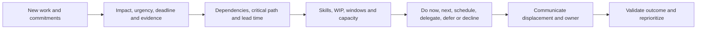

### Priority statement

> `<Work item>` is `<priority band>` because `<customer impact/risk>` must be addressed by `<latest safe start/deadline>`, depends on `<critical dependencies>`, and requires `<capacity>`. It displaces `<work>` with `<consequence>`. Owner/checkpoint is `<...>`.

---

## 2. Impact, urgency, deadlines, lead time, and critical path

### Keep dimensions separate

| Dimension | Question | Trap |
|---|---|---|
| Impact | What objective suffers and how severely? | Loudness treated as impact |
| Urgency | When must action start to preserve options? | Deadline equals start date |
| Deadline | Who/what sets it and what happens if missed? | Unexamined arbitrary date |
| Lead time | Which work and waits occur end to end? | Counting hands-on effort only |
| Critical path | Which dependent sequence determines finish? | Calling every task critical |
| Confidence | How strong are estimates and source facts? | False precision |

### Latest-safe-start logic

$$
Latest\ Safe\ Start = Required\ Outcome\ Date - End\text{-}to\text{-}End\ Lead\ Time
$$

Lead time can include discovery, evidence, approval, design, compatibility, procurement, testing, change windows, implementation, validation, and contingency.

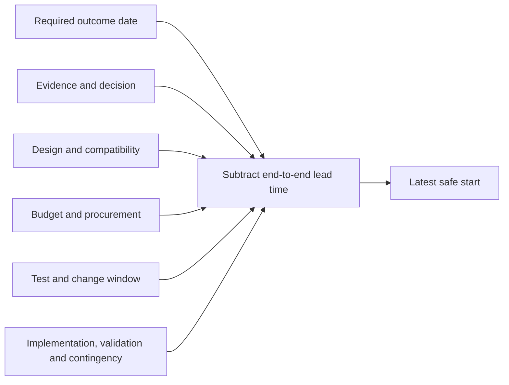

### Plain-English deep-dive: the critical path is the slowest required relay

Several relay teams may run in parallel, but the finish waits for the slowest required chain. Adding speed to a non-controlling chain does not move the finish. The critical path is the dependency chain with no spare time relative to the required finish.

**Why it matters:** a visible high-effort task is not necessarily the task controlling delivery.

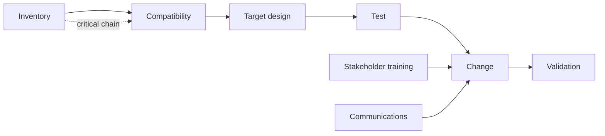

### Critical-path caveat

Real project estimates are uncertain and resources are shared. Recalculate after dependency, scope, duration, calendar, or resource change. Do not present a diagram as deterministic truth.

---

## 3. High-pressure triage

High pressure increases the need for a stable method.

### First-pass triage

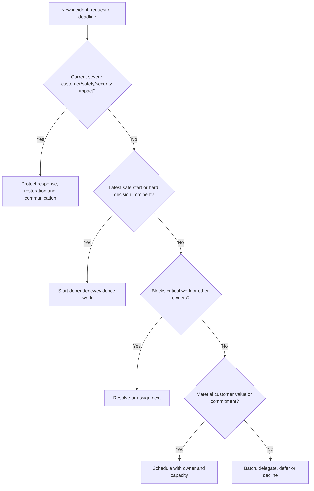

### High-pressure checklist

1. Confirm customer impact and safety boundary.
2. Name incident/decision/communication owner.
3. Freeze unrelated risky changes where authorized.
4. Separate restoration from root-cause and prevention work.
5. Limit active workstreams and define exact asks.
6. Establish source of truth, timestamps, and cadence.
7. Protect handoff, breaks, and fatigue controls.
8. Record displaced commitments and communicate them.

### Priority changes

When a new urgent item arrives:

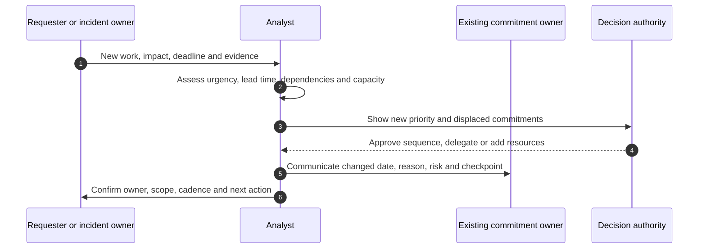

Do not silently miss existing commitments to absorb the new one.

---

## 4. Eisenhower and WSJF orientation, with caveats

### Eisenhower matrix orientation

The matrix separates important/unimportant and urgent/not urgent work.

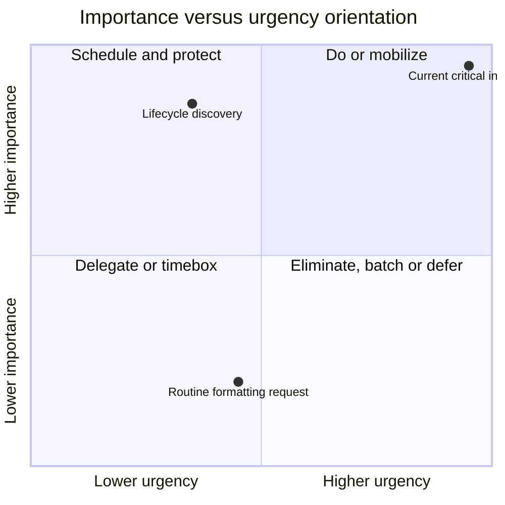

**Caveats:** importance and urgency need definitions, dependencies can alter order, strategic work may be important before it feels urgent, and many technical items cannot simply be delegated.

### WSJF orientation

**Weighted Shortest Job First (WSJF)** is commonly expressed as:

$$
WSJF = \frac{Cost\ of\ Delay}{Job\ Size}
$$

In some implementations, Cost of Delay combines user/business value, time criticality, and risk reduction/opportunity enablement. These are usually relative ordinal estimates, not currency or probability.

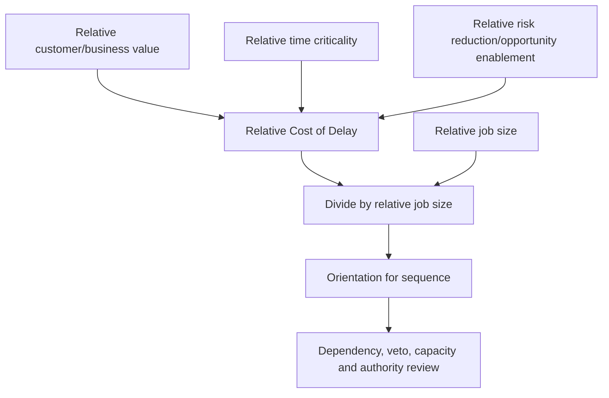

### WSJF caveats

- Relative scores are judgment, not measured economics.
- Small easy work can outrank necessary strategic work if misused.
- Safety, privacy, supportability, contractual, and current-incident vetoes can override.
- Job size must include coordination/validation, not just analyst effort.
- Dependencies and resource specialization can make the highest score not ready.
- Do not compare scores built under different scales/teams.
- Use bands and sensitivity, not decimal certainty.

### Tool choice

| Tool | Useful for | Not sufficient for |
|---|---|---|
| Impact/urgency matrix | Quick conversation | Dependency/resource plan |
| Eisenhower | Personal/operational sorting | Customer risk governance |
| WSJF | Relative portfolio sequencing | Safety/authority/critical path |
| Critical path | Earliest project finish | Value or risk priority |
| Queue age | Delay visibility | Importance or outcome |

---

## 5. WIP, queues, calendar, and focus

### Plain-English deep-dive: opening more lanes can slow every lane

If one worker begins ten tasks and switches constantly, all ten spend more time waiting. Starting work is not progress when completion capacity is fixed.

**Why it matters:** WIP limits expose overload, reduce context switching, and accelerate validated completion.

### Work states

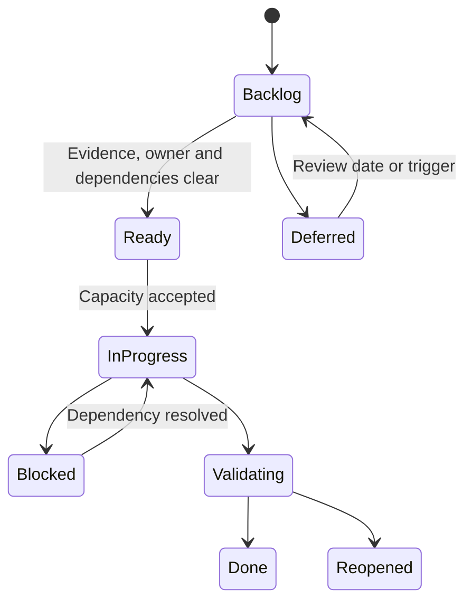

### Queue controls

- Stable item ID and original received date.
- Customer impact, deadline/latest safe start, source and confidence.
- Readiness: owner, prerequisites, access and evidence.
- WIP limit by skill/workstream, not arbitrary total only.
- Aging and blocked time separately.
- Explicit expedite policy with decision authority.
- Service classes if governed: urgent, fixed-date, standard, intangible.
- Validation-based closure.

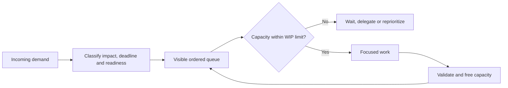

### Calendar and focus

- Protect blocks for analysis, review, customer overlap, and recovery.
- Use meeting agendas/pre-reads; decline meetings without a needed outcome.
- Batch routine reporting and administrative work.
- Reserve contingency for interrupts; do not schedule 100% utilization.
- Match complex work to high-energy periods.
- Record timezone and preparation/commute/access constraints.
- Maintain one controlled commitment list, not scattered inbox flags.

### Focus tradeoff

High utilization creates queues and leaves no recovery capacity. Aim for flow and reliability, not visible busyness.

---

## 6. Time zones, follow-the-sun, handoffs, and fatigue

### Time-zone principles

- Use ISO dates and explicit time-zone abbreviations/offsets.
- Confirm local daylight-saving transitions and holidays.
- Agree overlap windows, urgent routes, and response expectations.
- Use asynchronous context before meetings.
- Rotate inconvenient meetings where feasible.
- Protect uninterrupted analysis and recovery time.
- Escalate unsustainable coverage rather than normalizing it.

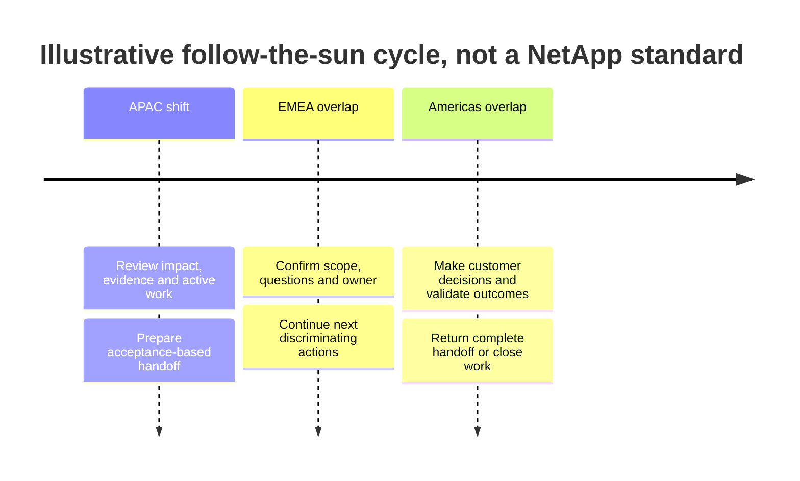

### Handoff contract

| Field | Required content |
|---|---|
| Timestamp/zone | Exact sending and next checkpoint time |
| Impact/state | Customer outcome and current status |
| Known/unknown | Evidence and active hypotheses |
| Work completed | Actions, results and rejected paths |
| Next action | Exact discriminating step and owner |
| Safety | Holds, stop conditions and escalation |
| Communication | Last/next customer update and owner |
| Acceptance | Receiving owner confirms understanding/capacity |

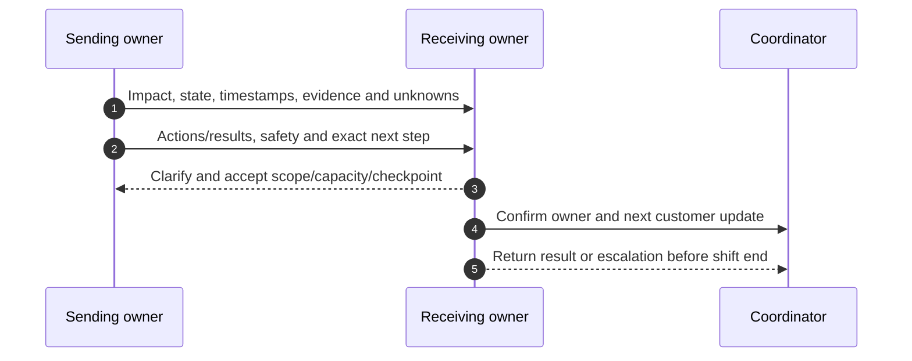

### Plain-English deep-dive: fatigue is a control failure, not commitment

A driver who stays awake longer to deliver faster may increase crash risk. Repeated overnight coverage can similarly reduce judgment, memory, communication, and technical safety.

**Why it matters:** heroic availability is not a sustainable operating model.

### Fatigue controls

- Defined coverage and escalation rather than permanent personal availability.
- Shift/meeting rotation and backup owners.
- Maximum practical continuous work and mandatory breaks according to policy.
- No high-risk change by an exhausted single operator.
- Handoffs before cognition degrades.
- Recovery time after sustained incidents.
- Manager/HR/occupational-health route for persistent risk.

Do not diagnose individuals. Describe workload, hours, decision risk, and required control through authorized channels.

---

## 7. Special-project charter and scope

A **special project** is temporary coordinated work that needs more governance than one action row because it has outcomes, scope, milestones, dependencies, resources, risks, and closure.

### Project charter

| Field | Required content |
|---|---|
| Problem/opportunity | Why the project exists and evidence |
| Outcome/success | Customer capability/result and proof |
| Sponsor/manager | Decision and escalation authority |
| Project lead | Coordination and delivery accountability |
| Scope | Included/excluded services, assets, work and time |
| Deliverables | Reviewable outputs/capabilities |
| Milestones | Evidence-based progress points |
| Stakeholders/RACI | Decide, perform, support, consult, inform |
| RAID | Risks, assumptions, issues, dependencies |
| Constraints | Budget, access, policy, window, skills, contract |
| Governance | Forums, cadence, status, change, escalation |
| Closure | Acceptance, handover, residual risk, lessons |

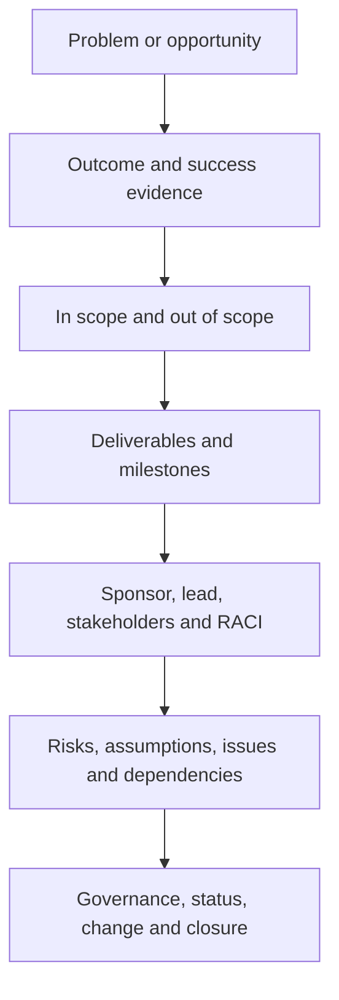

### Scope boundaries

Use `included`, `excluded`, `future`, and `customer/partner/vendor-owned`. Scope statements should define product/service, site, environment, data, work type, time period, and acceptance.

### Scope creep versus discovery

New facts are not automatically scope creep. Evaluate whether they are:

- Required to achieve the agreed outcome.
- A correction to a false assumption.
- A new request that changes resources/time/risk.
- A separate future opportunity.

Use change control rather than reflexively rejecting or silently absorbing the work.

---

## 8. Outcomes, stakeholders, RAID, milestones, and dependencies

### Outcome hierarchy

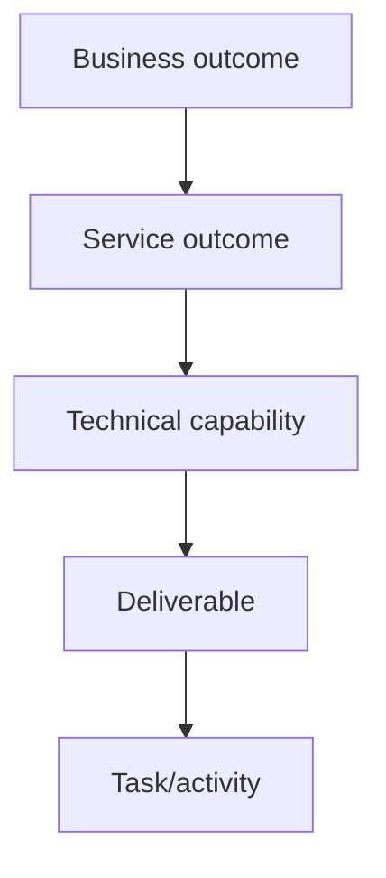

Tasks complete work; deliverables are reviewed outputs; capabilities enable service outcomes; outcomes create value.

### RAID

- **Risk:** uncertain future event that may affect objectives.
- **Assumption:** unverified belief used for planning.
- **Issue:** adverse condition already occurring.
- **Dependency:** required external input, decision, resource, or predecessor.

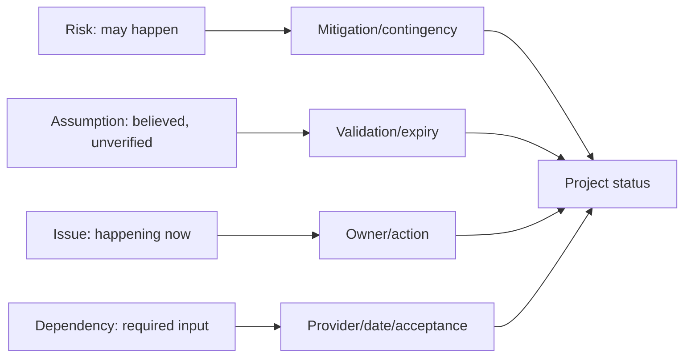

### RAID record

| Field | Content |
|---|---|
| ID/type | Stable and correctly classified |
| Statement | Cause/condition, event or requirement, consequence |
| Evidence/confidence | Source, date and gaps |
| Owner | Accountable role |
| Response | Prevent, mitigate, resolve, validate, escalate |
| Due/trigger | Date, latest safe start or condition |
| Status | Current state and trend |
| Residual | Remaining impact and monitoring |

### Milestones

A milestone should prove a meaningful state, such as:

- Current inventory validated.
- Target recipe approved.
- Test environment ready.
- Restore scenario passes customer acceptance.
- Change go/no-go approved.
- Production outcome sustained through agreed cycle.

`Meeting held` is usually an activity, not a milestone.

### Dependency graph

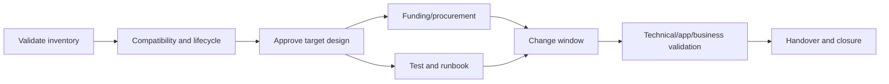

---

## 9. Status, forecasting, and change control

### Status report

| Section | Content |
|---|---|
| BLUF | Outcome/status and decision needed |
| Period/cutoff | Time, source and version |
| Milestones | Baseline/current/forecast and evidence |
| RAID | Top changes, owners and actions |
| Dependencies | Provider commitment and critical path |
| Scope/change | Approved/pending requests and impact |
| Resources | Capacity, specialist and time-zone constraints |
| Decisions | Authority, due and consequence |
| Next | 1-3 concrete priorities/checkpoints |

### RAG status caveat

Define green/amber/red and Unknown. Status should reflect forecast against outcome, not activity volume. A project can complete many tasks while the critical path slips.

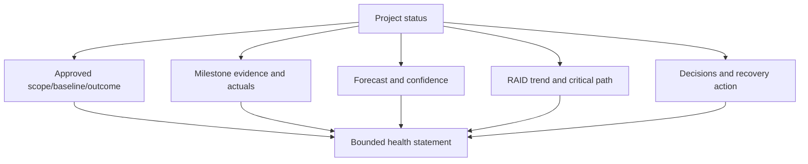

### Change request

Record requester, reason/evidence, exact scope change, benefit, effort/cost, schedule/critical-path impact, risk, dependencies, options, recommendation, authority, decision, baseline/version, and communication.

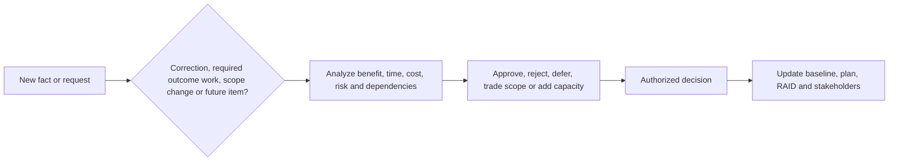

### No silent baseline reset

If a date slips or scope changes, preserve the original baseline and decision history. Otherwise status can be made green by moving the target.

---

## 10. Recovery from slippage

### Slippage response

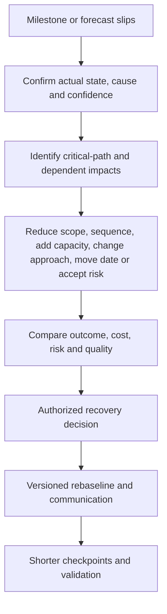

### Recovery principles

- Communicate early; do not wait until the due date.
- Diagnose mechanism: estimate error, dependency, scope, capacity, quality, decision delay, or external event.
- Protect quality/safety; do not compress tests blindly.
- Recover the outcome, not the appearance of plan compliance.
- Show displaced work and residual risk.
- Rebaseline only through authority and preserve original history.
- Add checkpoints proportional to uncertainty, not punitive meetings.

### Schedule compression options

- Fast-track independent work in parallel, with coordination risk.
- Add skilled capacity where work is divisible and onboarding cost is justified.
- Reduce/defer lower-value scope through sponsor decision.
- Use phased delivery or pilot.
- Improve decision/access turnaround.
- Move date with explicit consequence and accepted risk.

Do not assume more people always speed a late, tightly coupled task.

---

## 11. Closure, handover, and lessons

### Closure criteria

- Agreed outcome and deliverables accepted by authority.
- Technical/application/business validation complete.
- Open defects, exceptions, residual risks and owners recorded.
- Operations/support/runbook/monitoring handover accepted.
- Inventory, topology, action and knowledge records updated.
- Financial/contract/procurement closure handled by authorized roles.
- Access, data, temporary resources and repositories cleaned according to policy.
- Lessons and follow-up actions owned.

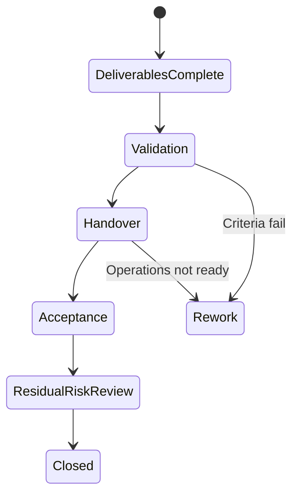

### Lessons learned

Ask:

- What outcome and assumption were correct or wrong?
- Which dependency, decision, handoff, or test controlled delivery?
- Which early signal did we miss?
- Which control or template should change?
- Which success should become standard practice?
- Who owns each improvement and when will it be tested?

### Plain-English deep-dive: a lesson without an owner is a diary entry

Writing `communicate earlier` records regret. A usable lesson changes a trigger, role, template, automation, training, or governance control with an owner and test.

**Why it matters:** lessons create value only when they alter future behavior.

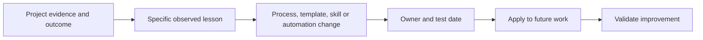

---

## 12. Fully synthetic sanitized scenario: Northstar Media lifecycle project

> **Synthetic boundary:** `Northstar Media`, every service, priority, project, system, version, task, score, timeline, cost, stakeholder, RAID item, decision, and outcome is invented. The scenario is not a NetApp account/project, service promise, internal method, or Arti production result.

### Priority conflict

The fictional account has:

- An intermittent priority incident.
- A lifecycle discovery whose latest safe start is in three weeks.
- A quarterly review due in five days.
- Ten low-value reporting requests.
- A two-person specialist bottleneck.

### Priority decision

```mermaid
flowchart TD
    INC[Current customer-impact incident] --> P1[Immediate restoration/communication]
    LIFE[Lifecycle latest safe start in 3 weeks] --> P2[Protect evidence/design capacity]
    REVIEW[Review in 5 days] --> P3[Reduce to decision-essential content]
    REPORT[Ten routine requests] --> P4[Batch/defer/delegate]
    P1 --> DISPLACE[Show displaced work and sponsor approval]
    P2 --> DISPLACE
    P3 --> DISPLACE
```

### Project charter

| Field | Synthetic content |
|---|---|
| Outcome | Preserve supported options before media-production peak |
| Scope | Inventory, lifecycle/supportability discovery, target options and phased plan |
| Out | Purchase commitment and production implementation |
| Sponsor | Customer infrastructure director |
| Lead | Customer program lead; analyst prepares evidence/reporting |
| Success | Approved option/roadmap before latest safe start |
| Governance | Weekly working, monthly steering, operational review |

### RAID

| Type | Item | Owner/response |
|---|---|---|
| Risk | Application certification may delay target | App owner obtains vendor path; alternate scope |
| Assumption | Procurement lead time is 20 weeks | Procurement validates by D+5 |
| Issue | Current asset inventory has three conflicts | Asset/storage owners reconcile |
| Dependency | Target compatibility requires exact host/switch state | Host/network owners supply evidence |

### Project plan

```mermaid
gantt
    title Synthetic Northstar project sequence
    dateFormat YYYY-MM-DD
    section Evidence
    Reconcile inventory           :a1, 2026-09-01, 7d
    Validate dependencies         :a2, after a1, 10d
    section Options
    Build target options          :b1, after a2, 10d
    Application review            :b2, after a2, 15d
    section Decision
    Sponsor option decision       :milestone, m1, after b2, 0d
    Roadmap and handover          :c1, after m1, 7d
```

### Slippage

Application review slips by 12 days because the vendor path was not identified. The team does not hide it by moving the baseline.

```mermaid
sequenceDiagram
    autonumber
    participant PL as Project lead
    participant AO as Application owner
    participant SP as Sponsor
    participant TA as Analyst role
    AO->>PL: Vendor certification evidence will miss forecast
    PL->>TA: Assess critical path, options and residual risk
    TA-->>PL: Decision date slips unless scope, capacity or target approach changes
    PL->>SP: Present phased decision, date move and scope tradeoff
    SP-->>PL: Approve provisional option shortlist; hold final target
    PL->>TA: Version baseline, RAID, status and checkpoints
```

### Follow-the-sun control

During the incident, one shift sends a complete evidence/next-action handoff. The receiving owner accepts capacity and customer-update duty. After 12 hours, the specialist rotates out rather than continuing into the project work.

### Synthetic closure

- Inventory and dependency evidence reconcile.
- Sponsor approves a phased roadmap, not a purchase or production change.
- Application certification remains a named dependency with owner/date.
- Project closes discovery only after handover and residual-risk review.
- A lesson changes the charter checklist to name every third-party certification path at kickoff.
- No real NetApp supportability, schedule, cost, or customer outcome is claimed.

---

## 13. Discovery, evidence, risks, actions, and validation

### Discovery questions

1. What customer impact, risk, deadline, lead time, critical path and confidence apply?
2. Which work is current impact, fixed-date, strategic, dependency, routine, or low value?
3. What WIP, queue age, skill, window, calendar and focus capacity exists?
4. Which time zones, overlaps, handoffs, delegates and fatigue controls are needed?
5. What project outcome, charter, scope, stakeholders and acceptance define success?
6. Which risks, assumptions, issues, dependencies, milestones and critical paths govern delivery?
7. What status, change, slippage recovery, baseline and decision authority apply?
8. What closure, handover, residual risk, lesson owner and improvement test are required?

```mermaid
flowchart LR
    DISC[Impact, deadline and outcome discovery] --> PRI[Priority, WIP and critical path]
    PRI --> PLAN[Charter, scope, milestones and RAID]
    PLAN --> EXEC[Time-zone-safe execution and status]
    EXEC --> CHANGE[Change, slippage and recovery decision]
    CHANGE --> CLOSE[Validation, handover and residual risk]
    CLOSE --> LEARN[Owned lesson and future test]
```

### Delivery-risk register

| Risk | Control | Validation |
|---|---|---|
| Loud request displaces material work | Evidence-based priority/displacement decision | Sponsor-approved queue |
| Excess WIP | Limits and finish-before-start | Lead/cycle time and reopen trend |
| Time-zone context loss | Acceptance-based handoff | Receiving owner acts without rediscovery |
| Fatigue | Rotation, backup, break and no exhausted change | Hours/coverage and safety review |
| Hidden critical-path slip | Milestone/dependency forecast | Early status and recovery decision |
| Scope absorbed silently | Change control | Versioned baseline and authority |
| Closure on task completion | Outcome/acceptance/handover criteria | Customer/operations signoff |

---

## 14. Anti-patterns and corrections

| Anti-pattern | Why it fails | Better practice |
|---|---|---|
| Priority equals loudest requester | Hides impact and opportunity cost | Impact/urgency/deadline/lead-time evidence |
| Everything is critical | No sequence exists | Critical path and explicit bands |
| Deadline is start date | Lead time is ignored | Calculate latest safe start |
| WSJF decimals are truth | Ordinal assumptions hidden | Bands, caveats, dependencies and vetoes |
| Start everything | WIP and context switching explode | WIP limits and ready queue |
| Calendar at 100% utilization | No interrupt/recovery capacity | Focus blocks and contingency |
| Follow-the-sun = send ticket | Context and ownership lost | Acceptance-based handoff |
| Heroic overnight work | Fatigue increases risk | Rotation and recovery |
| Project charter is a title | Outcome/scope/authority missing | Complete charter and acceptance |
| RAID is an issue list | Risks/assumptions/dependencies mismanaged | Distinct records and responses |
| Status reports activity only | Critical path can slip invisibly | Milestone forecast and decisions |
| Move baseline to stay green | Erases accountability | Versioned change/rebaseline |
| Close when tasks end | Operations/outcome not proven | Acceptance, handover, residual risk |
| Lessons have no owner | Nothing changes | Control, owner and test date |

---

## 15. Arti's factual bridge and JD Mapping

```mermaid
flowchart LR
    CRIT[CRITSIT and enterprise support] --> TRIAGE[Impact, urgency, ownership and cadence]
    BACK[Backlog and case quality] --> FLOW[Queues, aging, WIP and prioritization]
    GLOBAL[Global customers and partners] --> TZ[Time zones, handoffs and communication]
    PROG[Technical Advisor, programs and analytics] --> PROJECT[Charter, milestones, RAID and status]
    TRIAGE --> METHOD[Transferable priority/project method]
    FLOW --> METHOD
    TZ --> METHOD
    PROJECT --> METHOD
    METHOD --> GAP[Production NetApp portfolio/project remains gap]
```

### Factual tie

| Arti evidence | Transfer | Boundary |
|---|---|---|
| Microsoft CRITSIT/business-critical support | High-pressure impact/urgency and cadence | Not NetApp incident/portfolio authority |
| Backlog health/case quality | Queue age, WIP, quality and closure | No NetApp account action queue |
| Enterprise/partner customers | Time-zone and multi-owner coordination | No internal follow-the-sun claim |
| Technical Advisor/program work | Special-project coordination and stakeholder status | Exact scope/results must remain factual |
| Excel/Power BI/MBA | Portfolio, milestone, RAID and trend views | No live NetApp data |
| Mentoring/onboarding | Delegation, backup and knowledge transfer | Not staffing-management authority |

### JD Mapping

| JD responsibility | Part 68 capability | Honest boundary |
|---|---|---|
| Prioritize under pressure | Impact/urgency/lead time/critical path/WIP | Actual account authority required |
| Customer time zones | Coverage, handoff and fatigue controls | No unlimited availability or NetApp schedule claim |
| Manage special projects | Charter through closure/lessons | No production NetApp project result |
| Track remediation | Queue, milestones, dependencies, aging | Customer owners execute |
| Cross-functional work | Stakeholders, RACI, RAID, change decisions | Roles/scopes must be validated |
| Communicate status | BLUF, forecast, RAID and recovery | No silent baseline changes |
| Improve customer value | Outcome/acceptance and lessons | Activity is not value |

### Honest interview statement

> `I prioritize by separating impact, urgency, deadline, lead time and critical path, then checking readiness, dependencies, WIP, skills and displaced work. Under pressure I protect restoration, communication and handoffs. For special projects I use a charter, outcome-based scope, stakeholders, RAID, milestones, status/change control, slippage recovery, validation, handover and owned lessons. My production examples are Microsoft-focused, not NetApp project delivery.`

---

## 16. Role plays, paper lab, and self-test

### Role play 1: five simultaneous urgencies

Rank a current incident, lifecycle latest-safe-start, executive review, data-quality correction and routine request. State dimensions, displaced work, authority and checkpoint.

### Role play 2: unsafe coverage request

The project asks one specialist to work a third overnight shift and execute a high-risk change. Surface fatigue/continuity risk, propose rotation/handoff/date options, and escalate capacity without diagnosing the person.

### Role play 3: red project status

Tell the sponsor that a dependency moves the critical path. Present evidence, options, tradeoffs, recommendation, rebaseline authority and residual risk without optimism padding.

### Paper lab: synthetic priority portfolio and project

```mermaid
flowchart LR
    DEMAND[Create synthetic demand portfolio] --> PRI[Impact, urgency, LSS, WSJF orientation]
    PRI --> FLOW[WIP, queue, calendar and focus design]
    FLOW --> TZ[Follow-the-sun and fatigue simulation]
    TZ --> CHARTER[Special-project charter and RAID]
    CHARTER --> EXEC[Milestones, status and change]
    EXEC --> SLIP[Slippage recovery]
    SLIP --> CLOSE[Closure, handover and lessons]
```

Build 40 synthetic work items and one 12-week special project. Inject:

- Loud low-impact executive request.
- Severe long-horizon item with latest safe start near.
- WSJF score favoring easy low-value work.
- Ten in-progress items for one specialist.
- Time-zone handoff with missing decision.
- Fatigue and single-operator change risk.
- Charter with vague outcome and scope.
- Assumption misclassified as fact.
- Critical dependency without commitment.
- Green status despite critical-path slip.
- Scope addition silently absorbed.
- Rebaseline that erases original date.
- Closure without operations handover.
- Lesson with no owner.

### Lab tasks

1. Define priority dimensions and calculate latest-safe-start ranges.
2. Use/critique Eisenhower and WSJF orientation.
3. Set WIP, readiness, queue aging, calendar and focus controls.
4. Run high-pressure triage and displaced-work communication.
5. Design follow-the-sun handoff and fatigue controls.
6. Write project charter, scope, outcomes, stakeholders and RAID.
7. Map milestones, dependencies and critical path.
8. Produce status/change/slippage recovery decisions.
9. Close through validation, handover and owned lessons.
10. Answer Q1-Q8 aloud.

### Self-test

1. Distinguish impact, urgency, deadline, lead time and critical path.
2. Explain latest safe start and critical-path uncertainty.
3. Use and critique Eisenhower/WSJF.
4. Design WIP, queue, calendar and focus controls.
5. Run high-pressure triage.
6. Build follow-the-sun handoff and fatigue controls.
7. Create full charter, scope, outcome and stakeholder model.
8. Maintain RAID, milestones, dependencies and status.
9. Recover from slippage and govern change/rebaseline.
10. Close/handover/learn and state Arti's nonclaim.

### Lab pass checklist

- [ ] Impact, urgency, deadline, lead time, critical path and confidence stay distinct.
- [ ] Latest safe start uses complete end-to-end lead time.
- [ ] Eisenhower and WSJF remain orientation tools with caveats.
- [ ] WIP, queues, blocked age, calendar, focus and expedite policy are governed.
- [ ] High-pressure triage protects current impact, safety, communication and displaced commitments.
- [ ] Follow-the-sun handoffs require acceptance and exact checkpoints.
- [ ] Fatigue has rotation, backup, break, recovery and escalation controls.
- [ ] Charter, scope, outcomes, stakeholders, RACI and acceptance are complete.
- [ ] Risks, assumptions, issues and dependencies remain distinct.
- [ ] Milestones and critical path are evidence/forecast based.
- [ ] Status, change, slippage and rebaseline preserve history and authority.
- [ ] Closure includes validation, handover, residual risk and owned lessons.
- [ ] All evidence is fully synthetic and sanitized.
- [ ] No production NetApp queue, project, timeline or result is claimed.

---

## 17. Official and Public Source Anchors

**Date checked: 2026-08-24.** The supplied NetApp TAM Technical Analyst job description, represented in the master guide's JD matrix, is the primary source for prioritization, time-zone and special-project expectations. Public official sources provide bounded project, prioritization, fatigue and service context; they do not define a NetApp internal method.

| Topic | Official/public source | Bounded use |
|---|---|---|
| Project management | [What is project management? - PMI](https://www.pmi.org/about/learn-about-pmi/what-is-project-management) | Official PMI orientation to temporary work, outcomes and constraints |
| PMBOK/standards | [PMBOK Guide and Standards](https://www.pmi.org/standards/pmbok) | Official PMI standards entry; exact standard content/access varies |
| WSJF | [Scaled Agile Framework - Weighted Shortest Job First](https://framework.scaledagile.com/wsjf/) | Official SAFe method source; this guide uses orientation only and adds local governance caveats |
| Worker fatigue | [NIOSH - Fatigue and Work](https://www.cdc.gov/niosh/fatigue/about/index.html) | US CDC/NIOSH occupational fatigue context; organizational HR/policy governs controls |
| Incident response | [NIST SP 800-61 Rev. 3](https://csrc.nist.gov/pubs/sp/800/61/r3/final) | Official incident-response context for high-pressure coordination |
| Service management | [ITIL information from PeopleCert](https://www.peoplecert.org/browse-certifications/it-governance-and-service-management/ITIL-1) | Official ITIL-owner context for service, incident and continual improvement |
| NetApp support context | [NetApp Support Services](https://www.netapp.com/services/support/) | Public service context; no internal queue, staffing or cadence inferred |

### Source-use discipline

- Confirm current customer impact, deadlines, time zones, resource capacity, contract, product and lifecycle evidence.
- Treat relative priority scores as decision aids, not objective economics or SLAs.
- Preserve original baselines, decisions, changes and confidence ranges.
- Route fatigue, staffing and HR concerns through authorized organizational channels.
- Do not promise follow-the-sun coverage, dates, capacity or project outcomes without authority.
- Public NetApp sources provide service/product context only, not customer or internal project evidence.

---

## Likely Interview Questions

### Q1. How do you prioritize competing customer work?

> **Model answer:** `I separate impact, urgency, deadline, end-to-end lead time, latest safe start, dependencies, critical path, confidence and readiness. I compare available skills/WIP/windows, identify displaced work, and ask the correct authority to approve sequence, delegation or added capacity. Priority becomes an owned commitment, not a label.`

### Q2. How do you use Eisenhower or WSJF safely?

> **Model answer:** `Eisenhower is a quick important/urgent orientation; WSJF compares relative cost of delay with relative job size. Both rely on definitions and judgment. I show assumptions, avoid decimal certainty, retain individual dimensions, apply safety/support/privacy vetoes, and review dependencies/readiness/resources before sequence.`

### Q3. How do WIP limits improve delivery?

> **Model answer:** `They limit started-but-unfinished work, reduce context switching, expose bottlenecks and focus capacity on validation. I maintain a ready queue, separate blocked age, use explicit expedite rules, protect focus/calendar contingency, and close only on evidence rather than opening more work to look busy.`

### Q4. How do you operate across customer time zones?

> **Model answer:** `I agree overlap and urgent routes, use ISO dates/explicit zones, provide asynchronous context, rotate difficult meetings, and use acceptance-based handoffs containing impact, known/unknown, actions/results, safety, exact next step, communication and checkpoint. I treat fatigue as operational risk, not heroism.`

### Q5. What belongs in a special-project charter?

> **Model answer:** `Evidence-based problem/opportunity, customer outcome and success criteria, sponsor/lead, in/out scope, deliverables, milestones, stakeholders/RACI, RAID, constraints, governance/cadence, status/change/escalation and closure/handover/residual-risk criteria.`

### Q6. What is RAID, and how do the categories differ?

> **Model answer:** `A risk may happen and needs mitigation/contingency; an assumption is believed but unverified and needs a test/expiry; an issue is happening now and needs resolution; a dependency is a required external input/decision with provider/date/acceptance. Mixing them produces the wrong response.`

### Q7. How do you recover a slipping project?

> **Model answer:** `I confirm actual state/cause/confidence, identify critical-path and downstream impact, compare scope/sequence/capacity/approach/date options, protect quality and safety, get an authorized recovery decision, version the rebaseline without erasing history, and use shorter evidence-based checkpoints.`

### Q8. How does your background transfer, and what remains a gap?

> **Model answer:** `Microsoft CRITSITs, backlog/case quality, global customers, Technical Advisor/program work and analytics give me triage, queue, handoff and project-status discipline. I have not governed a production NetApp portfolio or project, so actual priorities, staffing, timelines and customer/NetApp commitments remain authorized-owner decisions.`

---

## 30-Second Memory Hooks

- **Priority:** Explicit resource/sequence choice; every yes displaces something.
- **Impact:** Consequence; **urgency:** when action must start.
- **Latest safe start:** Outcome date minus end-to-end lead time.
- **Critical path:** Required chain controlling earliest finish.
- **Eisenhower:** Important/urgent conversation, not full governance.
- **WSJF:** Relative cost of delay divided by relative size, with caveats.
- **WIP:** Finish before starting more.
- **Queue:** Stable ID, age, readiness, owner and expedite rule.
- **Calendar:** Focus, overlap, contingency and recovery time.
- **Handoff:** Impact + evidence + result + next owner + checkpoint + acceptance.
- **Fatigue:** Operational safety risk, not commitment badge.
- **Charter:** Why, outcome, scope, people, RAID, governance and closure.
- **RAID:** Risk may; assumption believed; issue is; dependency required.
- **Milestone:** Proven state, not meeting date.
- **Status:** Forecast against outcome and critical path, not task count.
- **Slippage:** Diagnose -> options -> authority -> versioned recovery.
- **Lesson:** Control change + owner + test, not diary entry.
- **Arti's bridge:** Microsoft priority/project skills transfer; NetApp authority does not.

---

## Completion Checklist

- [ ] Separate impact, urgency, deadline, lead time, critical path and confidence.
- [ ] Calculate latest safe start with complete lead-time components.
- [ ] Run high-pressure triage and communicate displaced commitments.
- [ ] Use/critique Eisenhower and WSJF as orientation only.
- [ ] Govern WIP, queues, blocked age, calendar, focus and expedite policy.
- [ ] Build time-zone, follow-the-sun, handoff and fatigue controls.
- [ ] Write a full special-project charter and scope boundaries.
- [ ] Define outcome hierarchy, stakeholders and RACI.
- [ ] Maintain distinct risk, assumption, issue and dependency records.
- [ ] Build evidence milestones, dependency graph and critical path.
- [ ] Produce forecast-based status and governed change requests.
- [ ] Recover slippage without hiding quality, impact or original baseline.
- [ ] Close through acceptance, validation, handover, residual risk and lessons.
- [ ] Recreate the fully synthetic Northstar scenario and paper lab.
- [ ] Answer Q1-Q8 aloud and state the exact nonclaim.
- [ ] Revalidate current customer, time-zone, resource and product evidence before commitment.

---

*Next suggested section:* [Part 69 - Coaching, Buddying New Hires, Training, and Knowledge Quality](Part-69-coaching-new-hires-knowledge-quality.md)