# Part 69 - Coaching, Buddying New Hires, Training, and Knowledge Quality

> **Section goal:** Help new hires and peers become safely independent while preserving role boundaries, evidence quality, psychological safety, and customer trust. By the end, Arti should be able to apply adult-learning principles; decompose competencies and tasks; build onboarding plans; use shadow, reverse-shadow, teach-back, and deliberate practice; give sourced SBI feedback; distinguish coaching from managing; calibrate reviewers through quality rubrics; govern knowledge-article lifecycles; evaluate training through a Kirkpatrick orientation; remediate quality gaps; coach inclusively; and escalate when needs exceed her authority or expertise.

Covers index item **69** and maps directly to job-description responsibilities for buddying new hires, coaching standard tasks, improving technical analysis and recommendation representation, contributing to SME and cross-functional teams, building specialization, documenting knowledge, communicating clearly, and improving service quality.

**Explicit nonclaim:** Arti has not designed or owned a production NetApp onboarding curriculum, certified NetApp competency, trained a live NetApp account team, managed NetApp employees, or approved NetApp knowledge standards.

**Privacy and access boundary:** Coaching and training records can contain employee identity, performance observations, customer examples, case details, access levels, accommodations, feedback, assessments, and manager decisions. Use approved systems, minimum necessary personal information, role-based access, sanitized examples, retention controls, and manager/HR/privacy routes for sensitive needs.

**Synthetic-evidence rule:** Every learner, task, competency, assessment, score, case, customer, feedback statement, article, metric, date, remediation, and outcome below is fictional and sanitized. No scenario is a real NetApp employee record, customer case, internal procedure, certification result, or performance decision.

**Version and current-source caveat:** Products, tools, procedures, support boundaries, role expectations, training platforms, accessibility features, and official documentation change. A **current-source check** means revalidating task standard, product/release, access, source dates, owner, quality rubric, and training objective before teaching or publishing.

This Part provides a generic learning and quality model, not a NetApp internal curriculum, manager process, HR policy, certification, permission model, knowledge standard, or production procedure. Actual manager, lead TAM, SME, HR, security/privacy, accessibility, and knowledge-owner governance controls live coaching.

> **No-production-NetApp boundary:** Arti's factual strengths are mentoring, onboarding, technical interviews, Technical Advisor program work, Microsoft enterprise support, documentation, knowledge creation, Product/Engineering collaboration, customer communication, and quality/case analytics. She does **not** claim production NetApp coaching authority, ONTAP task certification, internal NetApp curriculum access, employee performance management, or knowledge approval. Her exact non-claim is: **she has not designed, delivered, certified, or governed a production NetApp onboarding, coaching, training, competency, or knowledge-quality program.**

---

## 1. Coaching is guided capability building

**Coaching** helps a learner improve judgment and performance through goals, questions, observation, practice, feedback, reflection, and gradually increasing ownership.

### Plain-English deep-dive: training wheels come off through evidence

A learner cyclist first watches, then rides with support, then rides while a coach observes, and finally rides independently under agreed safety rules. The coach does not remove support because a date arrived; they use demonstrated capability.

**Why it matters:** onboarding should progress from safe observation to evidence-based independence, not from information dump to unsupported production work.

| Term | Plain meaning | Analogy | Why it matters |
|---|---|---|---|
| **Adult learning** | Learning designed around relevance, experience, agency, and practice | Learning a tool to solve today's job | Increases transfer to work |
| **Competency** | Integrated knowledge, skill, judgment, and behavior | Ability to drive safely, not name car parts | Defines readiness |
| **Task decomposition** | Break work into teachable steps and decisions | Recipe plus judgment points | Makes coaching observable |
| **Shadowing** | Learner observes expert work and reasoning | Watch the instructor drive | Builds mental model |
| **Reverse-shadowing** | Learner performs while coach observes | Learner drives with instructor | Tests application safely |
| **Teach-back** | Learner explains/teaches in own words | Explain the route before driving | Reveals hidden gaps |
| **Calibration** | Align reviewers on quality standards | Judges compare sample scores | Reduces arbitrary feedback |
| **Psychological safety** | Ability to ask, admit, challenge, and learn without humiliation | Safe practice area | Makes uncertainty visible |

```mermaid
flowchart LR
    NEED[Role task and customer outcome] --> DEFINE[Competency and quality standard]
    DEFINE --> LEARN[Explain and demonstrate]
    LEARN --> PRACTICE[Guided deliberate practice]
    PRACTICE --> FEEDBACK[Specific feedback and reflection]
    FEEDBACK --> PROVE[Observed competency evidence]
    PROVE --> INDEP[Bounded independence]
    INDEP --> REFRESH[Refresh, deepen and teach others]
```

### Coaching outcome

The outcome is not `training completed`. It is safe, repeatable performance at defined scope with evidence, correct escalation, and ongoing learning.

---

## 2. Adult-learning principles

Adults learn more effectively when the learning is relevant, connected to prior experience, participatory, problem-centered, respectful, and followed by practice and feedback.

### Adult-learning design

| Principle | Training behavior | Failure mode |
|---|---|---|
| Relevance | Begin with customer/task outcome | Abstract feature tour |
| Prior experience | Ask what analogous work learner knows | Treat learner as empty vessel |
| Agency | Offer choices in practice path | One rigid pace for everyone |
| Problem-centered | Use realistic cases and decisions | Memorize definitions only |
| Practice | Perform task with evidence | Watch slides for hours |
| Feedback | Specific, timely, two-way | Annual vague judgment |
| Reflection | Explain reasoning and alternatives | Reward answer without thought process |
| Spacing/retrieval | Revisit and answer without notes | One-time cramming |

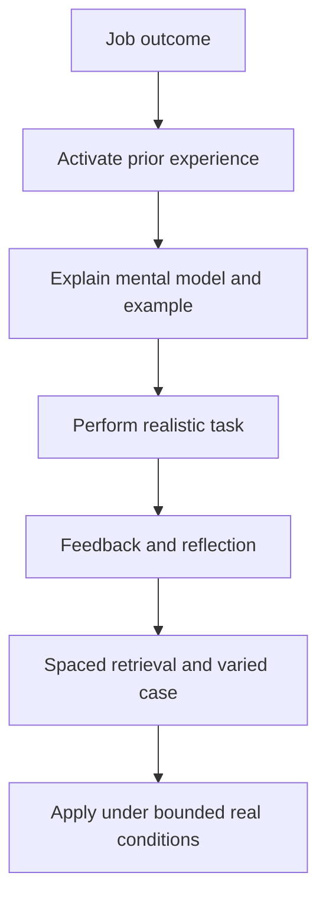

### Plain-English deep-dive: knowing about swimming is not swimming

Reading stroke diagrams can build vocabulary, but water introduces timing, balance, fear, and feedback. Technical work similarly requires decisions under incomplete evidence, not only factual recall.

**Why it matters:** every training plan needs performance practice and observable criteria.

### Accessibility and inclusion

- Ask about preferred learning and any approved accommodation route without demanding medical detail.
- Provide written, verbal, visual, and hands-on paths where practical.
- Define jargon and avoid cultural idioms.
- Support captions, transcripts, keyboard navigation, readable diagrams, and asynchronous access.
- Schedule across time zones fairly.
- Evaluate the same competency through accessible equivalent evidence.

---

## 3. Competency model and task decomposition

### Competency layers

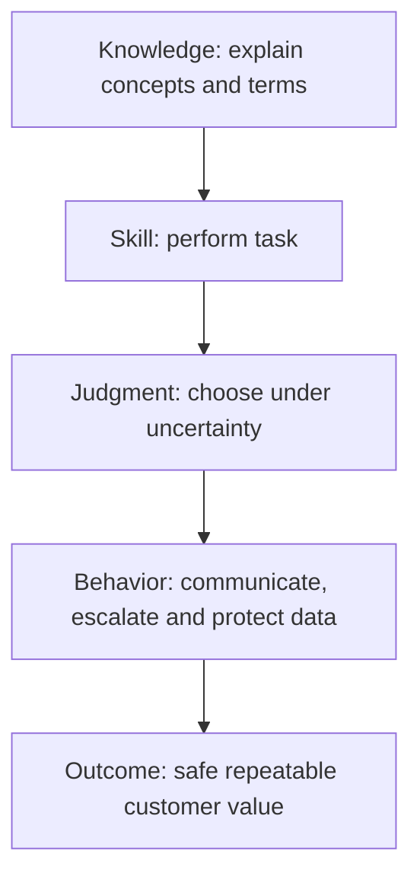

### Competency record

| Field | Required content |
|---|---|
| Competency | Observable capability and scope |
| Why | Customer/team outcome and risk |
| Prerequisites | Knowledge, access, tools, safety and privacy |
| Performance | Task and decision behavior |
| Evidence | Artifact, observation, test and date |
| Levels | Awareness, assisted, independent, reviewer/coach |
| Escalation | Conditions requiring expert/manager/Support |
| Currency | Version/source and refresh trigger |

### Level model

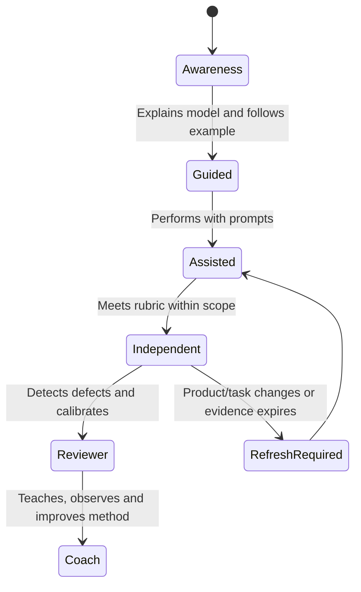

### Task decomposition template

For a task such as preparing a synthetic risk recommendation:

1. Confirm purpose, scope, access, and customer outcome.
2. Collect current authorized evidence.
3. Validate identity, freshness, definition, and applicability.
4. Separate observation, finding, risk, recommendation, action, and decision.
5. Compare options and status quo.
6. Write owner/date/prerequisite/validation/residual risk.
7. Run technical, privacy, and lead-TAM review.
8. Present, handle challenge, and update the record.
9. Validate outcome and capture learning.

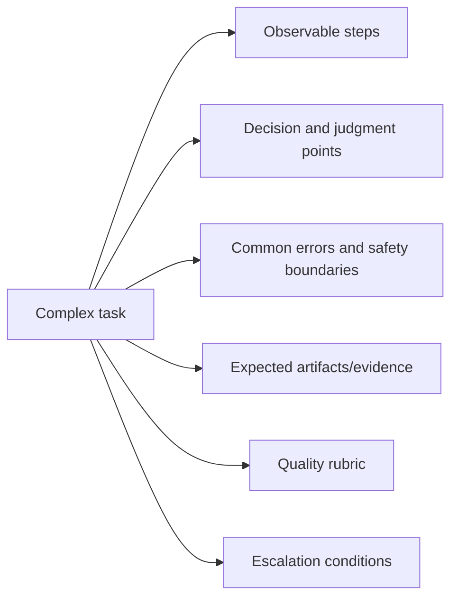

### Decomposition caveat

Do not create a checklist that suppresses judgment. Mark where the learner must choose, explain why, test alternatives, or stop/escalate.

---

## 4. Onboarding plan and learning contract

### Onboarding plan

| Phase | Learner outcome | Activities | Evidence |
|---|---|---|---|
| Orient | Understand role, boundaries, customer outcomes | Role map, privacy, systems, stakeholders | Teach-back and access checklist |
| Foundation | Explain core terms and workflows | Guided study, diagrams, examples | Knowledge checks and concept map |
| Observe | See standard task and expert reasoning | Shadow with structured observation | Observation notes and questions |
| Practice | Perform in synthetic/safe environment | Exercises, faults, review | Artifact and rubric score |
| Reverse-shadow | Perform while coach observes | Bounded real/synthetic task | Observation and feedback |
| Independent | Complete within scope and escalate correctly | Assigned standard work | QA and customer/team outcome |
| Deepen | Handle variants and contribute knowledge | Cases, specialization, teach-back | Reviewed article/session |

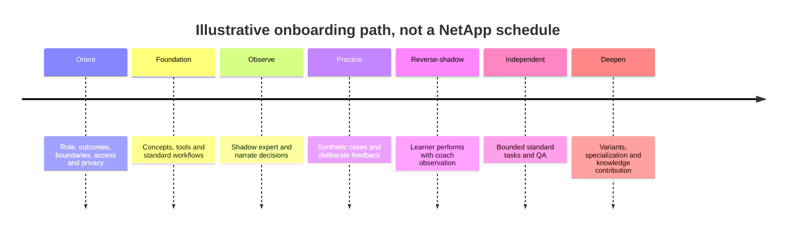

### Learning contract

- Target competencies and priority.
- Learner goals and existing strengths.
- Practice time and evidence.
- Coach, manager, SME, and learner responsibilities.
- Feedback cadence and preferred method.
- Psychological-safety agreement.
- Access/safety/privacy boundaries.
- Escalation and remediation path.
- Review dates and success criteria.

### No fixed calendar claims

Readiness varies by background, task risk, practice access, product change, and quality evidence. Do not call a learner ready because `30 days elapsed`.

---

## 5. Shadow, reverse-shadow, teach-back, and deliberate practice

### Shadowing

The coach should narrate:

- What outcome is being protected.
- Which evidence matters and why.
- Which alternatives are considered.
- Where uncertainty exists.
- Why a step is safe or needs escalation.
- What proves completion.

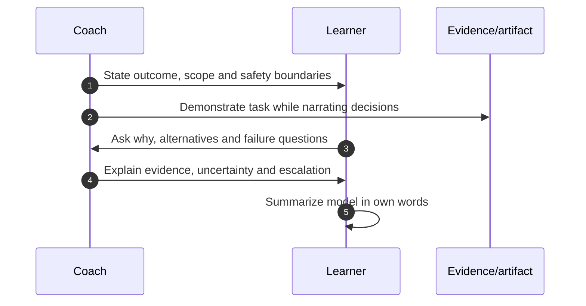

### Reverse-shadowing

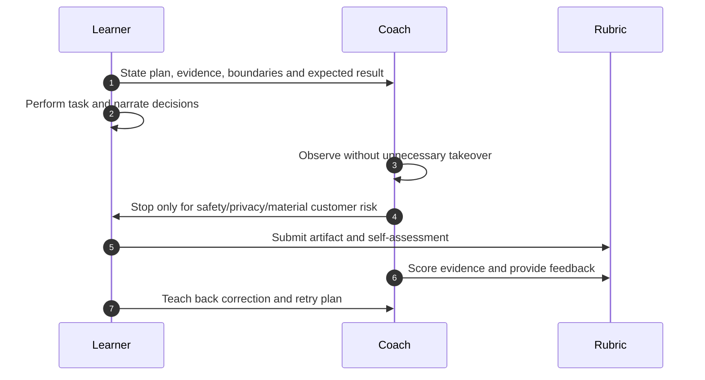

### Teach-back

Ask the learner to explain:

- Concept in plain English and analogy.
- Complete flow and ownership boundaries.
- Common misconception.
- Failure scenario and evidence plan.
- What they would not claim or change.

Teach-back exposes memorized wording that lacks a mental model.

### Plain-English deep-dive: deliberate practice targets the weak move

Playing an entire song repeatedly can preserve the same mistake. A musician isolates the difficult bars, slows down, gets feedback, and repeats until correct. Deliberate practice does the same for technical judgment.

**Why it matters:** practice should target a specific gap at the right difficulty, not merely repeat familiar work.

### Deliberate-practice loop

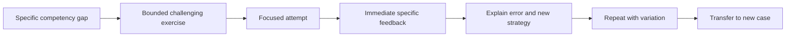

---

## 6. Psychological safety and learning behavior

Psychological safety means learners can ask questions, admit uncertainty, report mistakes, and challenge evidence without humiliation or retaliation. It does not remove standards or accountability.

### Coach behaviors

- Say `I do not know; here is how we validate.`
- Thank people for surfacing risk early.
- Critique observable work, not identity or intelligence.
- Invite alternative hypotheses and disconfirming evidence.
- Separate practice mistakes from production/customer consequences.
- Correct privately when sensitivity warrants; share general learning safely.
- Apply standards consistently.
- Admit and correct coaching errors.

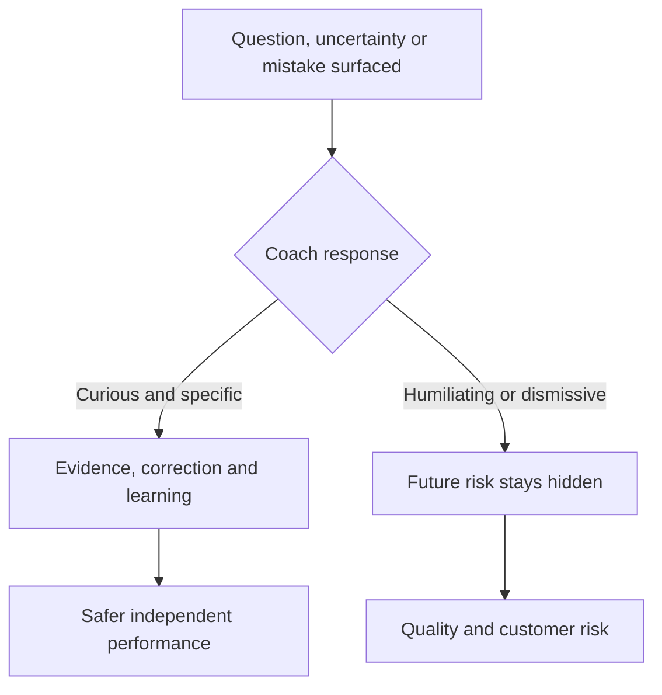

### Safety plus accountability

> `Thank you for flagging that the recipe evidence is missing. Do not infer supportability. Record the gap, identify the source owner, and bring the draft for review by 15:00 UTC.`

The message welcomes uncertainty and still requires correct action.

---

## 7. Feedback using SBI

The **SBI feedback model** from the Center for Creative Leadership uses **Situation, Behavior, Impact**. This Part adds a collaborative next-step conversation after the sourced core.

### SBI structure

- **Situation:** specific time/context.
- **Behavior:** observable action or words, without motive judgment.
- **Impact:** effect on task, customer, evidence, or team.
- **Next:** ask perspective, agree correction/practice, and define proof.

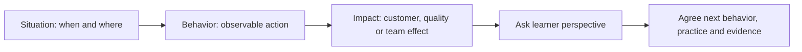

### Example

> `In today's synthetic service-review draft (Situation), you labeled two assets healthy even though their telemetry was stale (Behavior). That can create false confidence and an unsafe executive conclusion (Impact). What led to that classification? For the retry, use Current/Stale/Unknown states, show the denominator, and trace each status to source; we will review the corrected slide at 16:00 UTC (Next).`

### Feedback anti-patterns

| Weak feedback | Problem | Better SBI behavior |
|---|---|---|
| `Be more careful` | Vague | Name exact missed check and impact |
| `You are not analytical` | Identity judgment | Describe the unsupported inference |
| `Great job` | No reusable behavior | Name the effective method and result |
| Public correction with customer detail | Privacy/safety harm | Sanitize or give private feedback |
| Ten gaps at once | Overwhelms learner | Prioritize one or two material behaviors |

### Feedback receipt

The learner can disagree. Compare artifact, rubric, source and reasoning. Feedback is evidence-informed dialogue, not the coach's personal taste.

---

## 8. Coaching versus managing and no-overstep boundaries

### Role distinction

| Activity | Coach/buddy | Manager/authorized owner |
|---|---|---|
| Explain task and standards | Yes | May sponsor/approve |
| Observe and give work feedback | Yes, within scope | Yes |
| Assign formal performance rating | No unless explicitly manager role | Yes under policy |
| Decide compensation/promotion | No | Authorized management/HR |
| Approve production access/change | No by coaching role | Authorized owner |
| Diagnose disability/health issue | No | No; route to approved support/HR/medical processes |
| Set role priorities/resources | Input only | Manager/account authority |
| Certify high-risk competency | Only if formally authorized | Authorized certifier/manager/SME |

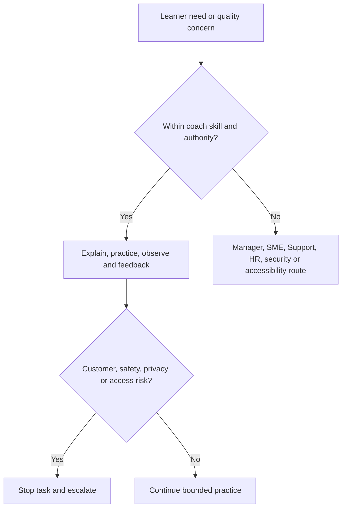

### Inclusive coaching

- Ask, do not assume, what support improves learning.
- Avoid comparing learners publicly.
- Use names/pronouns and communication preferences correctly.
- Make standards and examples transparent.
- Offer multiple ways to practice and demonstrate equivalent competency.
- Account for language/time-zone/accessibility needs without lowering safety criteria.
- Route accommodation and employee-relations matters appropriately.

### Escalate when

- Required expertise exceeds coach competence.
- Production/customer/privacy risk is material.
- Access/authorization is missing.
- Repeated quality gap persists despite practice.
- Learner requests formal accommodation or raises wellbeing concerns.
- Performance decisions or conflict require manager/HR.

---

## 9. Calibration and quality rubrics

### Plain-English deep-dive: judges need a shared scorecard

If judges use different definitions of `excellent`, the same performance receives arbitrary scores. Calibration aligns examples, criteria, evidence, and severity so feedback is fair and useful.

**Why it matters:** quality should not depend on which reviewer happens to open the artifact.

### Rubric dimensions for a TAM analysis artifact

| Dimension | Meets standard when |
|---|---|
| Purpose/scope | Decision, audience, population and cutoff explicit |
| Evidence | Source, identity, freshness, quality and lineage valid |
| Reasoning | Finding/risk/applicability and alternatives bounded |
| Recommendation | Specific options, rationale and prerequisites |
| Governance | Owner, date, authority, dependency and residual risk |
| Validation | Technical/customer success and reopen conditions |
| Communication | Clear, audience-calibrated and uncertainty preserved |
| Privacy/access | Minimum authorized data and correct handling |
| Honesty | Production/lab/conceptual/gated claims separated |

### Rating scale

- **Does not meet:** material missing/unsafe; requires rework before use.
- **Partially meets:** core method visible; one or more material gaps.
- **Meets:** safe, complete, reproducible within defined scope.
- **Exceeds:** meets plus reusable insight/improvement, without unnecessary complexity.

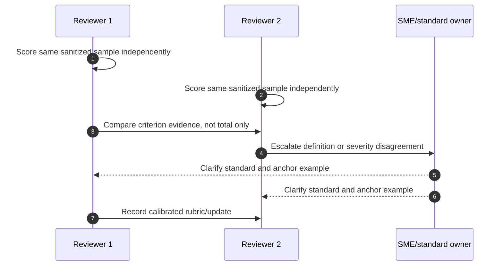

### Calibration metrics

- Reviewer agreement by criterion.
- Rework/reopen rates and material defect types.
- False pass and false fail samples.
- Time to independent quality.
- Standard/source changes and refresh completion.

Do not optimize for high scores by weakening the rubric or selecting easy work.

---

## 10. Knowledge-article lifecycle

A knowledge article is a maintained decision or task aid with scope, evidence, owner, validation, and lifecycle. It is not merely a saved answer.

### Article anatomy

| Section | Content |
|---|---|
| Title/summary | User problem, scope and outcome |
| Applies to | Product/release/context and exclusions |
| Symptoms/question | Observable state, not assumed cause |
| Prerequisites | Access, safety, evidence and role |
| Method | Steps plus reasoning/decision points |
| Expected result | Observable success/failure |
| Escalation | Stop conditions and exact evidence |
| Sources | Current authoritative links and dates |
| Ownership | Author, reviewer, approver and next review |
| Privacy | Sanitized examples and data-handling notes |

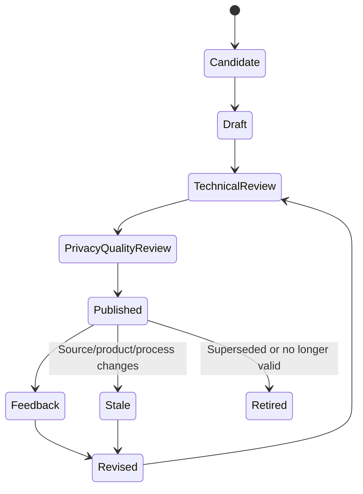

### Article quality checks

- Findability: title and keywords match user language.
- Accuracy: current source and exact scope.
- Usability: safe sequence and expected observations.
- Sufficiency: prerequisites, decision points, exceptions, escalation.
- Privacy: no customer/private/gated content beyond authorization.
- Accessibility: readable structure, alt text/labels, plain language.
- Ownership: review date and feedback route.

### Knowledge feedback loop

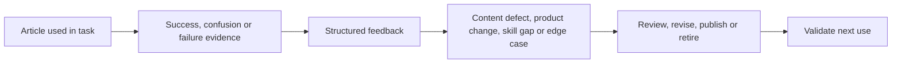

Never copy gated customer case details into a broadly visible article. Generalize and sanitize only through approved process.

---

## 11. Training evaluation: Kirkpatrick orientation

The Kirkpatrick model is commonly described through four levels. Use it as an orientation, not proof that training caused business outcomes.

### Four levels

| Level | Question | Example evidence | Caveat |
|---|---|---|---|
| 1 Reaction | Did learners find it relevant/useful? | Feedback and confidence | Enjoyment is not learning |
| 2 Learning | Did knowledge/skill/attitude change? | Pre/post check, artifact, teach-back | Test quality matters |
| 3 Behavior | Is capability applied at work? | Observation, QA, workflow evidence | Environment/support affects transfer |
| 4 Results | Did organizational/customer outcomes improve? | Quality, cycle, risk or experience | Attribution/confounding caution |

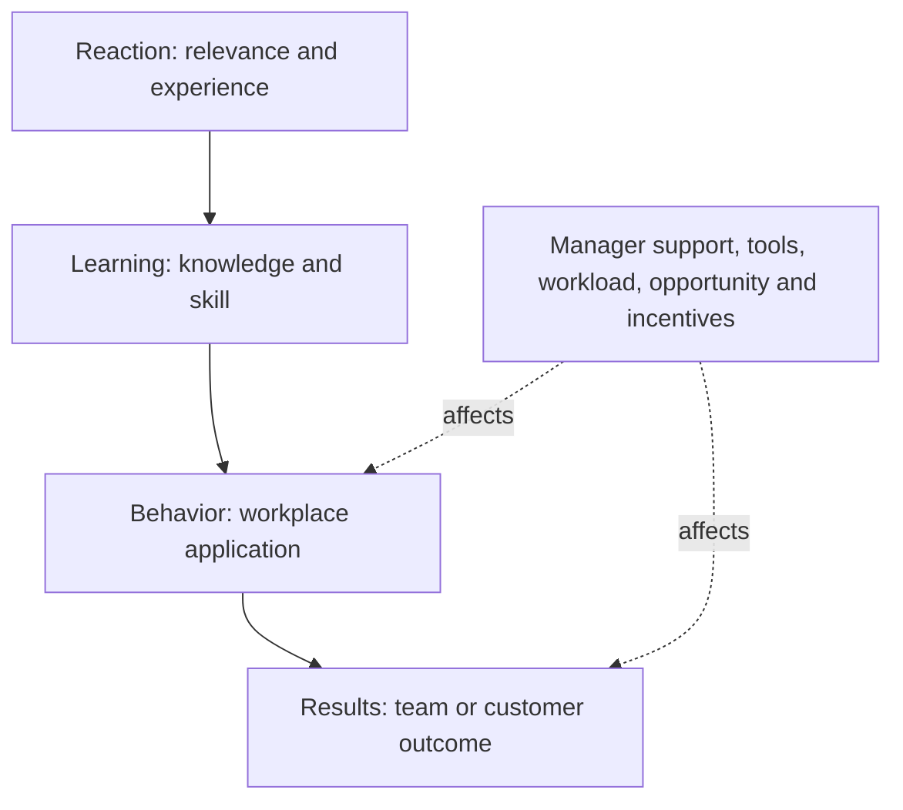

### Evaluation design

- Define behavior/outcome before training.
- Use a baseline and representative tasks.
- Test application, not recall alone.
- Measure after enough opportunity to apply.
- Compare context and alternate explanations.
- Protect learner/customer privacy.
- Use results to improve task, training, tools, standards, or environment.

### Attribution caution

If quality improves after training, training may have contributed; new templates, lower workload, manager coaching, and easier work mix may also explain the change.

---

## 12. Remediation when quality misses

### Quality-gap diagnosis

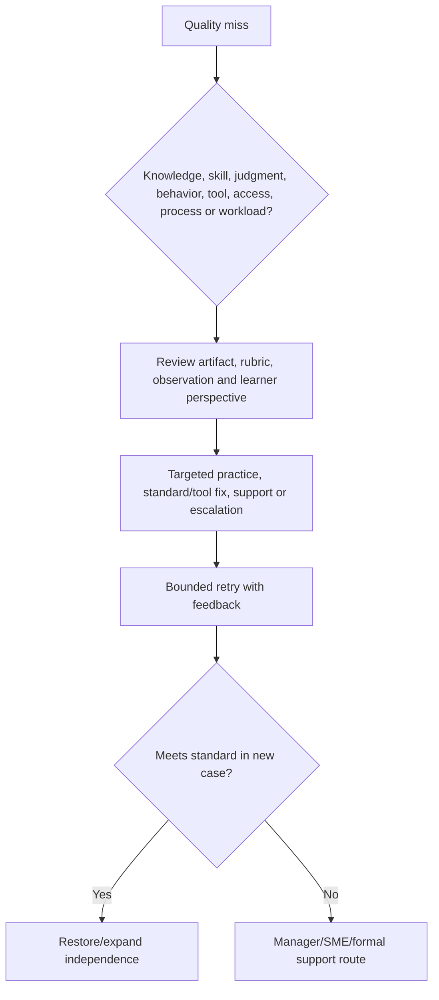

### Remediation plan

- Exact competency and failed criterion.
- Evidence and customer/team impact.
- Learner perspective and contributing conditions.
- Targeted learning/practice or system correction.
- Coach/SME/manager roles.
- Time, support and safe task scope.
- Reassessment method and success evidence.
- Escalation and access restrictions if needed.

### Do not assume training fixes everything

Training cannot repair unclear ownership, impossible workload, missing tools/access, contradictory standards, unsafe procedure, or a manager decision. Fix the controlling cause.

### Positive remediation language

> `The artifact does not yet meet the evidence/applicability criteria because the version match was treated as trigger proof. We will practice two applicability cases, use the rubric, and reassess on a new scenario. Until then, an SME reviews this task type.`

---

## 13. Fully synthetic sanitized scenario: new-hire Maya's risk-analysis ramp

> **Synthetic boundary:** `Maya`, all tasks, scores, artifacts, feedback, cases, customers, dates, and outcomes are fictional. The scenario is not a NetApp employee, performance record, training program, or customer case.

### Target competency

Prepare a synthetic customer risk recommendation that correctly separates source signal, applicability, customer consequence, options, action, validation, and residual risk.

### Onboarding path

```mermaid
flowchart LR
    ORIENT[Role, privacy and nonclaim] --> FOUNDATION[Risk and recommendation concepts]
    FOUNDATION --> SHADOW[Observe two narrated cases]
    SHADOW --> PRACTICE[Three synthetic cases]
    PRACTICE --> REVERSE[Reverse-shadow customer-safe draft]
    REVERSE --> CAL[Rubric and calibrated review]
    CAL --> INDEP[Bounded independent work]
    INDEP --> TEACH[Teach-back and knowledge contribution]
```

### Initial quality miss

Maya writes: `Critical bug affects the customer; upgrade immediately.` The synthetic source only matches a release; exact feature and trigger are unknown.

### SBI feedback

> `In today's synthetic bug-scrub draft (Situation), you converted a release match into confirmed exposure and an immediate upgrade instruction (Behavior). That can overstate customer risk and bypass supportability/change prerequisites (Impact). What evidence would prove feature and trigger applicability? For the retry, classify it as a candidate, request exact evidence, compare options, and define the review gate (Next).`

### Deliberate practice

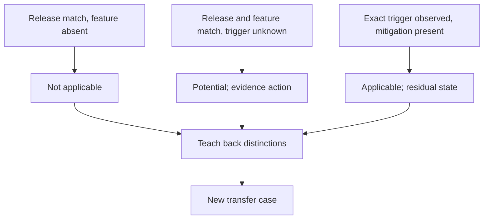

### Rubric evidence

| Dimension | Attempt 1 | Retry | Evidence |
|---|---|---|---|
| Applicability | Does not meet | Meets | Exact gates and Unknown state |
| Risk statement | Partial | Meets | Condition-event-consequence-horizon |
| Recommendation | Does not meet | Meets | Options, prerequisite and owner |
| Honesty/privacy | Meets | Meets | Synthetic labels and no gated data |
| Validation | Partial | Meets | Evidence action and closure criteria |

### Knowledge article contribution

After three transfer cases pass, Maya drafts `Release match does not prove defect exposure`. An SME reviews, privacy/quality checks pass, and the article receives a version/review date. This demonstrates learning contribution, not NetApp certification.

### Kirkpatrick-oriented evaluation

- Reaction: Maya reports the scenarios were relevant.
- Learning: teach-back and new-case artifact meet rubric.
- Behavior: later synthetic work uses applicability gates without prompts.
- Results: review rework falls in the small synthetic sample; no causal production claim is made.

### Synthetic outcome

Maya receives bounded independence for synthetic/standard risk drafts, with SME review for customer-facing or high-risk work. The coach does not make a formal performance or production-access decision.

---

## 14. Discovery, evidence, risks, actions, and validation

### Discovery questions

1. Which customer/team outcome and competency are required, at what scope and risk?
2. What prior experience, learning preference, accessibility/time-zone need and authorized support apply?
3. What task steps, decisions, errors, safety boundaries, rubric and evidence define readiness?
4. Which onboarding, shadow, reverse-shadow, teach-back and deliberate-practice sequence fits?
5. How will psychological safety and accountability coexist?
6. What SBI feedback, calibration and knowledge-lifecycle controls apply?
7. Which reaction, learning, behavior and result evidence will evaluate training with attribution caution?
8. What remediation, manager/SME escalation and residual risk are required?

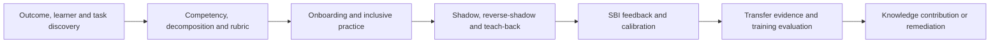

### Learning-risk register

| Risk | Control | Validation |
|---|---|---|
| Information dump/no practice | Task-centered deliberate practice | New-case performance |
| Premature independence | Rubric and reverse-shadow evidence | Bounded task QA |
| Learner hides uncertainty | Psychological safety and coach modeling | Questions/gaps surfaced early |
| Reviewer subjectivity | Calibration and anchor examples | Agreement by criterion |
| Stale knowledge | Owner, source date and lifecycle | Review/revise/retire history |
| Coaching overstep | Manager/SME/HR/security routes | Role and decision records |
| Training blamed for system gap | Cause diagnosis | Tool/process/workload fix |

---

## 15. Anti-patterns and corrections

| Anti-pattern | Why it fails | Better practice |
|---|---|---|
| Slide dump equals onboarding | No practice or transfer | Outcome-task-practice-feedback sequence |
| Calendar equals readiness | Time does not prove capability | Rubric and observed evidence |
| Shadowing is silent watching | Reasoning remains hidden | Narrate decisions and alternatives |
| Coach takes over every error | Learner cannot build judgment | Stop only for material safety; debrief |
| Teach-back is memorized script | Hides model gaps | Require analogy, failure and boundary |
| `Be careful` feedback | No observable correction | SBI plus next practice/proof |
| Psychological safety means no standards | Quality drifts | Welcoming questions plus accountability |
| Coach acts as manager | Authority/privacy violation | Route formal decisions appropriately |
| Rubric is personal preference | Inconsistent quality | Criteria, examples and calibration |
| Publish once, forget article | Stale guidance persists | Owner/review/feedback/retire lifecycle |
| Reaction survey proves success | Enjoyment is not transfer | Learning, behavior and result evidence |
| Retrain every quality miss | Tool/process/workload cause remains | Diagnose controlling cause |
| Compare learners publicly | Damages inclusion and safety | Private evidence-based coaching |

---

## 16. Arti's factual bridge and JD Mapping

```mermaid
flowchart LR
    MENTOR[Mentoring and onboarding] --> COACH[Guidance, practice and feedback]
    INTERVIEW[Technical interviews] --> COMP[Competency evidence and questioning]
    TA[Technical Advisor program] --> TEACH[Advisory and teach-back]
    DOC[Documentation and support quality] --> KNOW[Rubrics and knowledge lifecycle]
    COACH --> METHOD[Transferable coaching method]
    COMP --> METHOD
    TEACH --> METHOD
    KNOW --> METHOD
    METHOD --> GAP[Production NetApp training governance remains gap]
```

### Factual tie

| Arti evidence | Transfer | Boundary |
|---|---|---|
| Mentoring/onboarding | Learning plan, shadowing, feedback and support | Not NetApp employee management |
| Technical interviews | Observable competency questions | Not NetApp certification authority |
| Technical Advisor program | Teach-back and broader team contribution | Not NetApp TAM/SME equivalence |
| Microsoft support documentation | Knowledge quality and customer-safe writing | No internal NetApp article approval |
| Product/Engineering collaboration | Escalation and source review | No NetApp private-content access |
| Analytics/quality work | Rubrics, calibration and evaluation | No production NetApp training dataset |

### JD Mapping

| JD responsibility | Part 69 capability | Honest boundary |
|---|---|---|
| Buddy new hires | Evidence-based onboarding path | Actual manager controls assignment/readiness |
| Coach standard tasks | Decomposition, shadow/reverse-shadow, SBI | No high-risk certification authority |
| Improve analysis quality | Rubric, calibration and remediation | Standards require owner/SME approval |
| Contribute to SME teams | Teach-back and reviewed knowledge | Specialization must be earned |
| Build specialization | Competency levels and deliberate practice | No unearned NetApp expertise claim |
| Communicate/document | Article lifecycle and accessible training | Customer/gated data protected |
| Improve customer experience | Safer consistent work and escalation | Training does not guarantee outcome |

### Honest interview statement

> `I would define the task outcome and competency, decompose steps and judgment points, then use adult-learning principles, shadowing, deliberate practice, reverse-shadowing and teach-back. I give Situation-Behavior-Impact feedback, calibrate with rubrics, and grant only bounded independence through evidence. I have real mentoring/onboarding experience at Microsoft, but I have not operated a NetApp training or certification program.`

---

## 17. Role plays, paper lab, and self-test

### Role play 1: learner hides a mistake

Respond with curiosity and accountability: protect the customer/task, thank early disclosure, inspect evidence, correct the artifact, identify the practice need, and avoid humiliation.

### Role play 2: manager request beyond coach authority

A manager asks for a formal performance rating. Explain the observable task evidence you can provide and route the rating decision to the manager/HR process.

### Role play 3: feedback disagreement

The learner disputes your score. Compare rubric criterion, source and artifact; invite counterevidence; involve the standard owner if needed; correct your review when wrong.

### Paper lab: synthetic onboarding and knowledge program

```mermaid
flowchart LR
    ROLE[Define role outcomes and competencies] --> TASK[Decompose five tasks]
    TASK --> PLAN[Build onboarding and learning contract]
    PLAN --> PRACTICE[Shadow, reverse-shadow, teach-back and deliberate practice]
    PRACTICE --> FEED[SBI feedback and remediation]
    FEED --> CAL[Rubric calibration]
    CAL --> KNOW[Create/review knowledge articles]
    KNOW --> EVAL[Evaluate reaction, learning, behavior and results]
```

Build synthetic training for environment profiling, data QA, risk analysis, recommendation writing, and service-review preparation.

Inject:

- Expert lecture with no practice.
- Learner ready date based only on tenure.
- Silent shadow session.
- Reverse-shadow coach who takes over too early.
- Vague identity-based feedback.
- Two reviewers disagreeing by two levels.
- Article with stale source and customer identifier.
- High reaction score but poor transfer.
- Quality gap caused by missing access, not skill.
- Accommodation request mishandled by coach.
- Coach asked to make formal management decision.

### Lab tasks

1. Define competencies, levels, task steps, judgment and boundaries.
2. Build onboarding phases and learning contract.
3. Run shadow/reverse-shadow/teach-back sessions.
4. Design deliberate-practice variants.
5. Give positive and corrective SBI feedback.
6. Calibrate a rubric on three samples.
7. Build article lifecycle and quality checks.
8. Evaluate four Kirkpatrick levels with attribution caveat.
9. Diagnose/remediate quality gaps and route overstep cases.
10. Answer Q1-Q8 aloud.

### Self-test

1. Explain adult-learning principles and inclusive design.
2. Define competency, levels and task decomposition.
3. Build a complete onboarding plan.
4. Distinguish shadow, reverse-shadow and teach-back.
5. Design deliberate practice and psychological safety.
6. Deliver SBI feedback and a next-step plan.
7. Distinguish coach, manager, SME, HR and access authority.
8. Build/calibrate a quality rubric.
9. Govern article lifecycle and Kirkpatrick evaluation.
10. Remediate Maya's case and state Arti's nonclaim.

### Lab pass checklist

- [ ] Adult-learning and inclusive principles shape the plan.
- [ ] Competencies include knowledge, skill, judgment, behavior and outcome.
- [ ] Tasks expose steps, decisions, errors, evidence, rubric and escalation.
- [ ] Onboarding uses evidence, not elapsed time, for progression.
- [ ] Shadowing narrates reasoning; reverse-shadowing preserves learner ownership.
- [ ] Teach-back and deliberate practice prove transferable understanding.
- [ ] Psychological safety coexists with clear standards/accountability.
- [ ] SBI feedback is specific, observable, impact-linked and actionable.
- [ ] Coaching/management/SME/HR/access boundaries are respected.
- [ ] Rubrics use calibration and anchor examples.
- [ ] Knowledge articles have source, owner, review, feedback and retire controls.
- [ ] Training evaluation covers reaction, learning, behavior and results with attribution caution.
- [ ] Remediation fixes the controlling knowledge/skill/process/tool/workload cause.
- [ ] All examples and learner records are fully synthetic and sanitized.
- [ ] No production NetApp curriculum, competency, certification or management authority is claimed.

---

## 18. Official and Public Source Anchors

**Date checked: 2026-08-24.** The supplied NetApp TAM Technical Analyst job description, represented in the master guide's JD matrix, is the primary source for buddying, coaching and SME expectations. Public sources provide bounded learning, feedback, psychological-safety, knowledge and evaluation context; they do not define a NetApp internal program.

| Topic | Official/public source | Bounded use |
|---|---|---|
| Adult learning/training development | [CDC Training Development](https://www.cdc.gov/training-development/) | US CDC official training-development resources; local role/tasks still govern |
| SBI feedback | [Center for Creative Leadership - SBI feedback](https://www.ccl.org/articles/leading-effectively-articles/closing-the-gap-between-intent-vs-impact-sbii/) | Source for Situation-Behavior-Impact orientation; this guide's next-step extension is explicit |
| Worker voice and supportive workplaces | [U.S. Surgeon General - Workplace Mental Health and Well-Being](https://www.hhs.gov/surgeongeneral/priorities/workplace-well-being/index.html) | Official HHS context for worker voice, protection, connection, work-life harmony and growth; not HR policy or a competency guarantee |
| Kirkpatrick model | [Kirkpatrick Partners - The Kirkpatrick Model](https://www.kirkpatrickpartners.com/the-kirkpatrick-model/) | Official model-owner orientation to four evaluation levels |
| Knowledge-Centered Service | [Consortium for Service Innovation - KCS](https://www.serviceinnovation.org/kcs/) | Official KCS-owner context for knowledge as part of work; no NetApp process inferred |
| Accessible learning content | [W3C Web Content Accessibility Guidelines](https://www.w3.org/WAI/standards-guidelines/wcag/) | Official W3C accessibility standard context for digital materials |
| NetApp documentation | [NetApp Documentation](https://docs.netapp.com/) | Current product/release source for teaching; no internal curriculum or customer result |

### Source-use discipline

- Revalidate task, product/release, procedure, access, rubric, source date and owner before teaching.
- Keep employee feedback/assessment and customer/gated evidence in approved systems.
- Use sanitized synthetic cases for broad practice and knowledge assets.
- Route formal performance, accommodation, wellbeing, access and certification decisions to authorized roles.
- Treat reaction/learning/behavior/result evidence as distinct and avoid causal overclaim.
- Never present this guide as NetApp internal onboarding, certification or knowledge policy.

---

## Likely Interview Questions

### Q1. How would you onboard a new Technical Analyst?

> **Model answer:** `I define role outcomes, competencies, levels, task rubrics and boundaries; assess prior experience; then sequence orientation, foundations, narrated shadowing, synthetic deliberate practice, reverse-shadowing, teach-back and bounded independent work. Progress is based on observed quality and escalation behavior, not elapsed days.`

### Q2. How do shadowing, reverse-shadowing, and teach-back differ?

> **Model answer:** `In shadowing the learner observes and hears expert reasoning. In reverse-shadowing the learner performs/narrates while the coach observes and stops only for material risk. Teach-back makes the learner explain the model, analogy, failure and boundary in their own words, exposing hidden gaps.`

### Q3. What is deliberate practice?

> **Model answer:** `Focused practice on one specific gap at appropriate difficulty, with immediate evidence-based feedback, reflection, retry and transfer to a varied case. Repeating familiar full tasks without targeting the weak decision is repetition, not deliberate practice.`

### Q4. How do you create psychological safety without lowering standards?

> **Model answer:** `I model 'I don't know,' welcome early questions/mistakes, critique observable artifacts not identity, invite counterevidence and correct my own errors. I still state the standard, required action, safety boundary, owner and proof. Safety makes risk visible; accountability resolves it.`

### Q5. How do you give useful feedback?

> **Model answer:** `I use Situation, observable Behavior and Impact, then ask the learner's perspective and agree a specific next behavior/practice/evidence. I prioritize material criteria, protect privacy, compare against a calibrated rubric, and include positive feedback that names reusable behavior.`

### Q6. How do coaching and managing differ?

> **Model answer:** `A coach explains, observes, questions, practices and gives task feedback within expertise. Managers/authorized owners set formal priorities, performance decisions, compensation, access and staffing. I route SME, HR, accommodation, security, production-risk or formal performance needs rather than overstepping.`

### Q7. How do you maintain knowledge and evaluate training?

> **Model answer:** `Articles move through candidate, draft, technical/privacy/quality review, publish, feedback, revision, stale and retire states with sources/owners/dates. I evaluate reaction, learning, workplace behavior and results separately, considering manager support, tools, workload and alternate causes.`

### Q8. How does your background transfer, and what remains a gap?

> **Model answer:** `I have factual mentoring, onboarding, technical interview, Technical Advisor, documentation and quality-analysis experience at Microsoft. Those skills transfer to task decomposition, practice, feedback and knowledge. I have not operated or certified a NetApp training program, so internal standards, access and readiness decisions remain with authorized NetApp roles.`

---

## 30-Second Memory Hooks

- **Coaching:** Guided capability through evidence, not answer giving.
- **Adult learning:** Relevant, experiential, problem-centered, practiced and respectful.
- **Competency:** Knowledge + skill + judgment + behavior + outcome.
- **Task decomposition:** Steps + decisions + errors + evidence + rubric + escalation.
- **Readiness:** Demonstrated capability, not calendar age.
- **Shadow:** Watch and hear reasoning.
- **Reverse-shadow:** Learner performs; coach observes.
- **Teach-back:** Explain model, analogy, failure and boundary.
- **Deliberate practice:** Isolate weak move, feedback, retry, transfer.
- **Psychological safety:** Safe to surface uncertainty; standards remain.
- **SBI:** Situation + observable Behavior + Impact, then next step.
- **Coach boundary:** Develop work; manager owns formal people decisions.
- **Calibration:** Shared criteria and anchor examples.
- **Article:** Findable, current, scoped, safe, owned and reviewable.
- **Kirkpatrick:** Reaction, learning, behavior, results; do not overclaim causation.
- **Remediation:** Diagnose knowledge, skill, judgment, tool, process or workload.
- **Arti's bridge:** Real Microsoft coaching transfers; NetApp certification authority does not.

---

## Completion Checklist

- [ ] Apply adult-learning, accessibility and inclusive-coaching principles.
- [ ] Define competencies across knowledge, skill, judgment, behavior and outcome.
- [ ] Decompose tasks into steps, decisions, errors, evidence, rubric and escalation.
- [ ] Build onboarding phases and a learning contract.
- [ ] Run narrated shadowing, reverse-shadowing and teach-back.
- [ ] Design deliberate practice and transfer tests.
- [ ] Create psychological safety while preserving accountability.
- [ ] Give sourced SBI feedback plus a specific next-step plan.
- [ ] Respect coaching, managing, SME, HR, security and access boundaries.
- [ ] Build and calibrate quality rubrics with anchor examples.
- [ ] Govern knowledge articles through publish, feedback, stale, revise and retire.
- [ ] Evaluate reaction, learning, behavior and results with attribution caution.
- [ ] Diagnose/remediate the controlling cause and escalate appropriately.
- [ ] Recreate the fully synthetic Maya scenario and paper lab.
- [ ] Answer Q1-Q8 aloud and state the exact nonclaim.
- [ ] Recheck current task, product, source, access and standard before teaching.

---

*Next suggested section:* [Part 70 - Cross-Functional Collaboration, SME Teams, and Conflict Resolution](Part-70-cross-functional-sme-conflict.md)