# Part 70 - Cross-Functional Collaboration, SME Teams, and Conflict Resolution

> **Section goal:** Coordinate people with different expertise, incentives, authority, vocabulary, and vendor boundaries around one customer outcome. By the end, Arti should be able to create a shared system view; preserve role/ownership boundaries; design strong handoffs and working agreements; influence without authority; resolve technical disagreement through evidence and discriminating tests; use conflict styles situationally; support psychological safety; improve meeting and decision hygiene; escalate constructively; coordinate vendors; contribute to SME communities; build specialization while sharing knowledge; and repair durable relationships after conflict.

Covers index item **70** and maps directly to job-description responsibilities for cross-functional and SME-team contribution, lead-TAM/account-team execution, stakeholder communication, escalation, high-pressure coordination, technical analysis quality, knowledge sharing, specialization, customer loyalty, and time-zone collaboration.

**Explicit nonclaim:** Arti has not led a production NetApp cross-functional account team, owned a NetApp SME community, resolved a live NetApp/customer/vendor conflict, or represented NetApp Product, Engineering, Support, Sales, or Professional Services authority.

**Privacy and access boundary:** Collaboration records can expose customer evidence, vulnerabilities, contracts, vendor positions, commercial disputes, employee behavior, decision rights, personal feedback, escalation routes, and relationship concerns. Use approved channels, need-to-know access, role-safe broad records, secure evidence links, careful minutes, retention controls, and authorized HR/legal/commercial routes where appropriate.

**Synthetic-evidence rule:** Every customer, team, vendor, disagreement, incident, hypothesis, test, meeting, decision, role, action, date, knowledge artifact, and outcome below is fictional and sanitized. No scenario represents a real NetApp team, customer, partner, internal process, product decision, or conflict.

**Version and current-source caveat:** Products, ownership, organizations, support contracts, partner scopes, SME membership, procedures, and customer conditions change. A **current-source check** means revalidating exact technical evidence, roles, authority, contract scope, current owners, escalation paths, and source dates before coordinating action or representing a position.

This Part provides a generic collaboration model, not a NetApp internal org chart, SME charter, conflict policy, vendor-escalation route, support commitment, legal process, or authority to decide customer/employee matters. Actual lead TAM, management, Support, account, HR, legal, commercial, partner, and customer governance controls live work.

> **No-production-NetApp boundary:** Arti's factual strengths are Microsoft enterprise and partner support, CRITSIT coordination, Product/Engineering collaboration, Technical Advisor work, mentoring, knowledge creation, customer communication, escalation packages, and cross-team fix validation. She does **not** claim NetApp account-team leadership, ONTAP SME status, NetApp Product/Engineering authority, vendor-contract ownership, or production conflict-resolution outcomes. Her exact non-claim is: **she has not led, governed, or represented a production NetApp cross-functional, SME, vendor, or customer conflict-resolution process.**

---

## 1. Collaboration is coordination around a shared outcome

**Cross-functional collaboration** is the coordinated contribution of people from different domains and authority boundaries toward a shared outcome, using agreed evidence, interfaces, decisions, and follow-through.

### Plain-English deep-dive: an orchestra needs a score and clear entrances

Excellent musicians can still produce noise if they play different pieces, do not know when to enter, or cannot hear one another. A shared customer outcome is the score; roles, interfaces, evidence, and decisions are the entrances.

**Why it matters:** collaboration is not simply putting experts in one meeting.

| Term | Plain meaning | Analogy | Why it matters |
|---|---|---|---|
| **Shared outcome** | Result all roles help protect | Piece the orchestra performs | Aligns different incentives |
| **System view** | Components, relationships, people, processes, and feedback | Full orchestra and hall acoustics | Prevents local optimization |
| **Boundary** | Where role/accountability/scope changes | Section boundary in score | Clarifies ownership and escalation |
| **Working agreement** | Explicit rules for how the group operates | Rehearsal rules | Reduces avoidable friction |
| **Technical disagreement** | Competing interpretations/actions about evidence | Different readings of a passage | Can improve decisions when tested |
| **Conflict** | Tension from incompatible goals, needs, values, methods, or perceptions | Competing tempo choices | Needs diagnosis, not automatic suppression |
| **SME** | Subject matter expert in a bounded domain | Specialist musician | Expertise is not universal authority |
| **Repair** | Actions that restore workable trust after harm | Rehearse again after a failed performance | Makes relationships durable |

```mermaid
flowchart LR
    OUT[Shared customer outcome] --> SYSTEM[System and dependency view]
    SYSTEM --> ROLES[Role boundaries and handoffs]
    ROLES --> AGREEMENT[Working agreements and forums]
    AGREEMENT --> EVID[Evidence and technical decisions]
    EVID --> ACTION[Owned cross-functional action]
    ACTION --> VALID[Outcome and relationship validation]
    VALID --> LEARN[Knowledge and durable improvement]
```

### Collaboration quality

Good collaboration produces correct decisions and usable relationships. Agreement without evidence can be unsafe; technically correct behavior that humiliates partners can make future risks invisible.

---

## 2. Shared outcomes and the system view

### System-thinking questions

- What customer/business service and data outcome matters?
- Which application, compute, network/fabric, protocol, storage, protection, identity, security, and operational dependencies deliver it?
- Which team/vendor owns each component, interface, evidence source, and change?
- Which local optimization can harm the end-to-end outcome?
- What feedback loops, queues, delays, or incentives shape behavior?
- Which failure domains or shared dependencies cross team boundaries?

```mermaid
flowchart TB
    USER[Customer/user outcome] --> APP[Application and data]
    APP --> COMPUTE[Host, VM or container]
    COMPUTE --> NETWORK[Network or fabric]
    NETWORK --> STORAGE[Storage data service]
    STORAGE --> PROTECT[Protection and recovery]
    ID[Identity, DNS, time and security] -.cross-cutting.-> APP
    OPS[Monitoring, support and change] -.operates.-> STORAGE
    VENDORS[Partners and vendors] -.support boundaries.-> COMPUTE
```

### Plain-English deep-dive: optimize the journey, not one station

A railway station can improve its own departure metric by sending a train before passengers transfer, making the entire journey worse. A storage team can similarly improve one local metric while the application SLO or recovery outcome deteriorates.

**Why it matters:** the unit of success is the shared customer outcome, not each team's local activity.

### Shared-outcome statement

> `Together we need <customer capability> for <scope/time>, measured by <evidence>. Each team owns <boundary>, and we will decide tradeoffs against the end-to-end outcome rather than a local metric.`

### System map layers

| Layer | Technical view | Human/governance view |
|---|---|---|
| Service | Transactions, users, critical data | Business/service owner |
| Application | Workload, consistency, dependencies | Application owner/vendor |
| Compute | Hosts, hypervisor, containers | Platform team/partner |
| Network/fabric | Paths, ports, DNS, firewall | Network/security/vendor |
| Storage | Protocol, SVM/volume/LUN/object | Storage owner/Support |
| Protection | Backup, replication, DR, restore | Recovery owner/application validator |
| Governance | Changes, incidents, evidence, actions | Lead TAM, customer authorities, account team |

---

## 3. Role boundaries, ownership, and handoffs

### Ownership principles

- Accountability follows the defined result/decision, not contribution volume.
- Expertise informs decisions but does not automatically grant change or business authority.
- The customer owns customer-controlled production changes and business risk.
- Support owns case progression within scope; Engineering owns product code/defect decisions.
- Lead TAM owns integrated technical account governance; analyst owns assigned analysis quality.
- Partners/PS own contracted deliverables, not unspecified gaps.

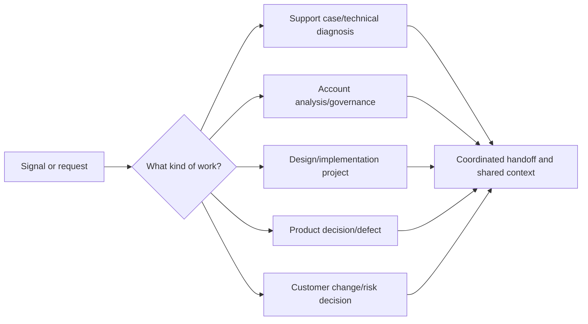

### Handoff contract

| Field | Content |
|---|---|
| Outcome/impact | Customer objective and current consequence |
| Scope/time | Exact services/assets/period/time zone |
| Evidence | Source, location, quality and access |
| Work/results | What was tried, observed and ruled out |
| Known/unknown | Current hypotheses and contradictions |
| Ask | Exact decision, expertise or action needed |
| Owner/checkpoint | Receiving role, target and update |
| Safety/privacy | Holds, restrictions and escalation |

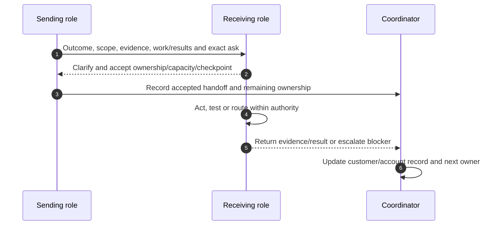

### Handoff anti-pattern

`Ticket 123 is with networking` is not a handoff. It lacks impact, evidence, next action, accepted owner, and checkpoint.

---

## 4. Working agreements

A **working agreement** defines how a group will collaborate before pressure tests the relationship.

### Working-agreement fields

| Area | Agreement questions |
|---|---|
| Shared outcome | What result and measure unite us? |
| Roles | Who decides, performs, validates and coordinates? |
| Evidence | Which source of truth, timestamps and access rules? |
| Communication | Channels, cadence, BLUF, time zones, response expectations |
| Meetings | Purpose, pre-read, agenda, facilitator, decision mode |
| Disagreement | How are hypotheses tested and decisions recorded? |
| Escalation | Which triggers and exact routes? |
| Conflict | No-blame behavior, pause/repair and manager/HR/legal routes |
| Knowledge | Where artifacts live and how sources stay current? |
| Review | When/how is the agreement improved? |

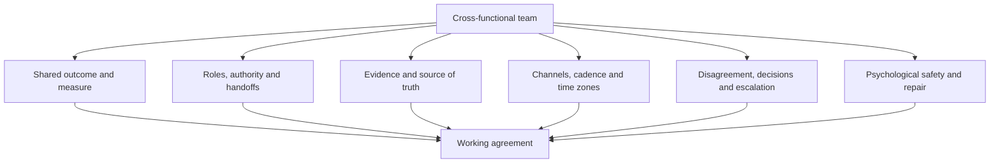

### Working-agreement caveat

An agreement cannot override contract, policy, security, HR, legal, Support, or customer authority. Review it after team, project, product, or scope changes.

---

## 5. Influence and cross-functional alignment

Cross-functional influence begins with shared outcomes, accurate boundaries, stakeholder interests, and credible evidence.

### Alignment loop

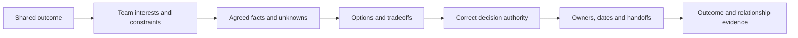

### Useful alignment language

- `We agree the application transaction is the outcome; we disagree about which layer contributes to delay.`
- `The storage and network teams own different evidence; neither source alone proves cause.`
- `Which test could disconfirm each hypothesis safely?`
- `Who owns the decision after technical evidence is reviewed?`
- `What work is displaced if this becomes priority one?`

### Avoid coalition politics

Do not collect supporters to overpower another team before testing the technical disagreement. Social alignment cannot substitute for evidence.

---

## 6. Technical disagreement and evidence tests

### Plain-English deep-dive: disagreement is competing maps, not competing worth

Two engineers can hold different maps because each observes a different layer. The goal is not to decide who is smarter; it is to identify which map predicts the next observable result.

**Why it matters:** technical disagreement becomes productive when hypotheses make testable predictions.

### Disagreement protocol

1. Restate the shared customer outcome.
2. Define the exact point of agreement and disagreement.
3. Separate observation, interpretation, hypothesis, preference, and authority.
4. State each hypothesis and predicted evidence.
5. Choose the cheapest safe discriminating test.
6. Predefine pass/fail/ambiguous interpretation.
7. Run under correct owner/change/privacy controls.
8. Update the decision and preserve alternative hypotheses.

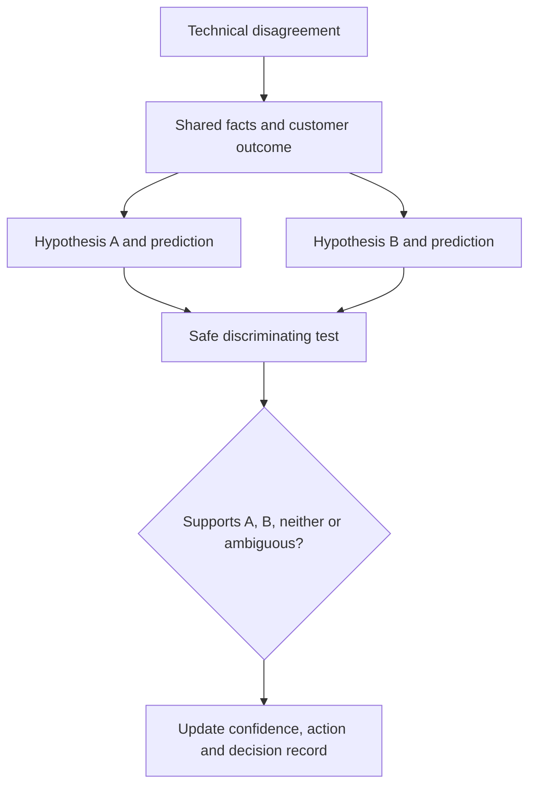

### Evidence-test table

| Field | Content |
|---|---|
| Hypotheses | Mutually distinguishable explanations where possible |
| Predictions | What each expects under test |
| Test | One variable/controlled scope where practical |
| Safety | Authorization, rollback/stop, privacy |
| Evidence | Sources, clocks, units and owners |
| Interpretation | Predefined outcomes and ambiguity |
| Decision | What result changes action? |

### When evidence cannot resolve immediately

- Use reversible containment.
- Narrow the claim and preserve uncertainty.
- Escalate to qualified Support/SME/Engineering route.
- Record accepted risk and next trigger.
- Do not force consensus for meeting closure.

---

## 7. Conflict styles and situational choice

One common orientation describes five modes: competing, collaborating, compromising, avoiding, and accommodating. These are situational behaviors, not fixed personality diagnoses.

### Style map

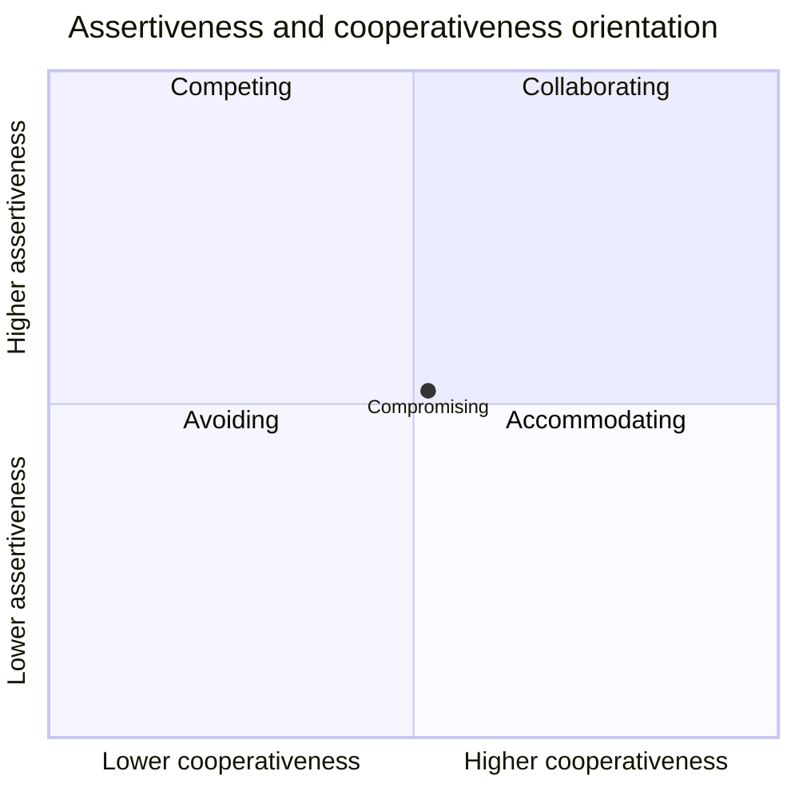

### Mode guidance

| Mode | Useful when | Risk |
|---|---|---|
| Competing | Immediate safety/incident decision within authority | Damages voice/relationship if overused |
| Collaborating | Important outcome and relationship; time/evidence available | Slow if every issue seeks full synthesis |
| Compromising | Time-limited, reversible middle ground is acceptable | Splits difference even when one option is unsafe |
| Avoiding | Issue is low value, cooling-off or evidence is pending | Important conflict festers |
| Accommodating | Other party's concern matters more and no safety boundary | Gives away necessary control or hides disagreement |

### Style-selection questions

- How important is the outcome?
- How urgent/safety-critical is the decision?
- How important is the relationship?
- Is authority clear?
- Can evidence resolve the issue?
- Is the option reversible?
- Is there time for collaboration?

Never use a style label to explain away someone else's behavior or as an HR diagnosis.

---

## 8. Psychological safety and constructive dissent

Psychological safety allows team members to raise uncertainty, mistakes, and dissent without humiliation. It does not mean every idea is correct or every decision requires consensus.

### Team behaviors

- Leaders/SMEs admit limits and invite counterevidence.
- Questions are answered without status games.
- Early risk disclosure is thanked and acted upon.
- Strong challenge targets claims/process, not identity.
- Meeting facilitators prevent interruption/monopolization.
- Dissent and rationale enter the decision record.
- Retaliation, harassment, discrimination, or formal people concerns use authorized manager/HR routes.

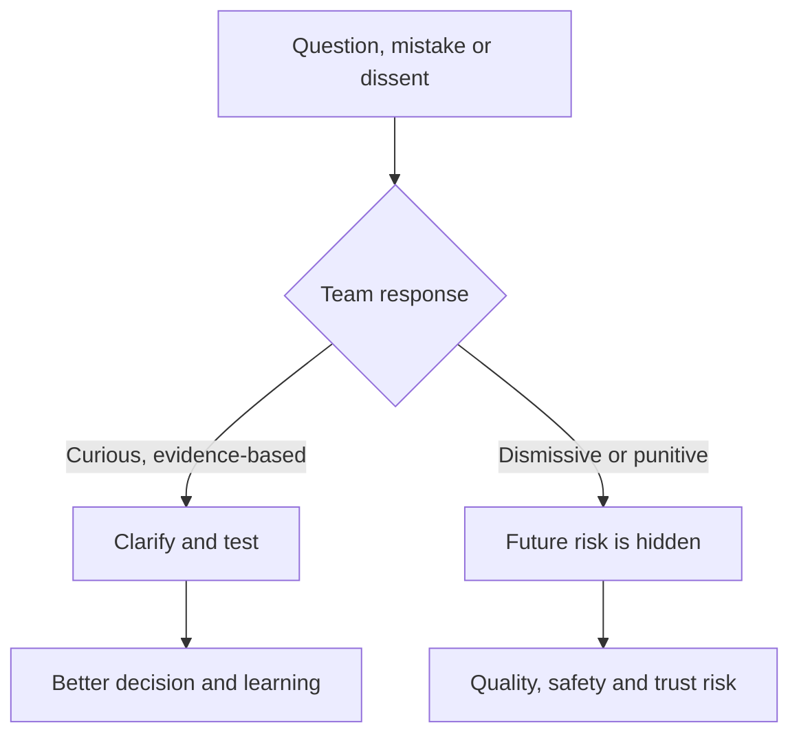

### Constructive challenge pattern

> `I agree that Site A transactions fail. I do not yet see evidence that storage is the cause because the delay begins before the storage call in the synchronized trace. Can we test the application-queue and path hypotheses in one window before changing storage?`

### Safety boundary

Psychological safety does not authorize sharing restricted evidence, bypassing change controls, or ignoring harmful conduct.

---

## 9. Meeting hygiene and decision records

### Meeting hygiene

| Before | During | After |
|---|---|---|
| Purpose, decision, authority, pre-read, agenda and timebox | BLUF, roles, evidence, facilitation, parking lot, read-back | Decisions, actions, owners, dates, proof, distribution |

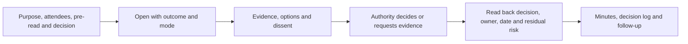

### Decision record

- Decision/question and scope.
- Date/time/zone and authority.
- Evidence cutoff, confidence, and contradictions.
- Options and tradeoffs.
- Chosen/rejected paths and rationale.
- Dissent or evidence request.
- Conditions, actions, owners, milestones.
- Residual risk, monitoring, expiry, and reopen triggers.

### Decision states

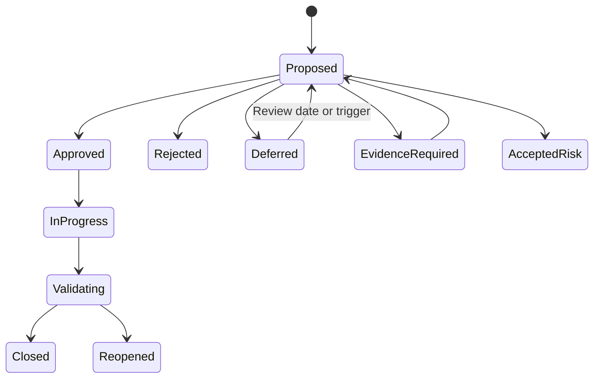

### Meeting anti-pattern

A large recurring meeting should not be used to compensate for unclear owners and broken handoffs. Fix the interfaces; reduce attendees to decision-relevant roles.

---

## 10. Escalation and multi-vendor coordination

### Escalation principles

- Escalate the need for authority, expertise, resource, priority, or conflict resolution.
- Package impact, scope, timeline, evidence, actions/results, blocker, and exact ask.
- Maintain one customer-facing coordinator and shared chronology.
- Preserve vendor-specific private data and contract boundaries.
- Do not use escalation as punishment or imply fault before evidence.

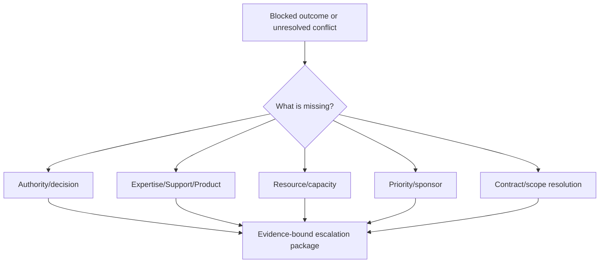

### Vendor coordination model

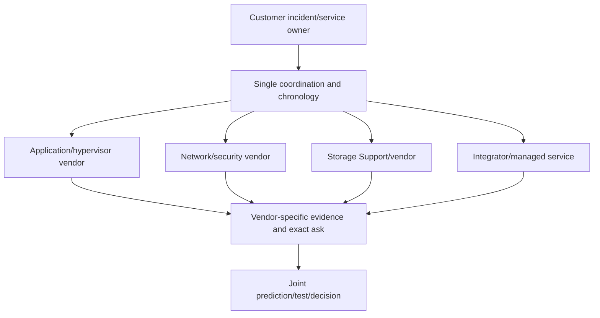

### Joint evidence table

| Field | Purpose |
|---|---|
| Customer impact/timeline | One shared clock and outcome |
| System boundaries | Which vendor owns which component/interface |
| Evidence supplied | Source, timestamp, access, interpretation |
| Vendor hypotheses | Prediction and next test |
| Actions/results | Prevent duplicate/repeated discovery |
| Exact asks | What each vendor must answer/do |
| Customer decision | Change/risk authority remains clear |
| Next checkpoint | Owner and cadence |

Do not give one vendor another vendor's restricted material without authorization.

---

## 11. SME communities, specialization, and knowledge sharing

An **SME community** improves a bounded domain through peer review, patterns, teaching, reusable artifacts, and escalation support.

### SME contribution ladder

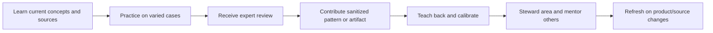

### Useful contributions

- Reviewed decision tree or troubleshooting hypothesis map.
- Quality rubric and anchor examples.
- Sanitized case pattern and counterexample.
- Source/current-version tracker.
- Template, automation, or evidence checklist.
- Teach-back session and recording/transcript where approved.
- Knowledge article with lifecycle owner.
- Cross-domain handoff improvement.

### Specialization plan

| Field | Content |
|---|---|
| Domain/outcome | Why this specialty matters to customers/team |
| Current baseline | Demonstrated knowledge/skills and gaps |
| Learning sources | Current official docs, courses and mentors |
| Practice | Labs, cases, shadow/reverse-shadow |
| Evidence | Artifacts, reviews and outcomes |
| Contribution | Article, tool, teach-back or calibration |
| Boundaries | What still requires another SME/Support |
| Refresh | Version/change triggers and review cadence |

### Plain-English deep-dive: expertise is a garden, not a badge

A garden needs repeated planting, pruning, and adaptation to seasons. Expertise similarly requires current sources, varied practice, peer challenge, and knowledge sharing. A title without maintenance becomes stale.

**Why it matters:** specialization should make the whole team stronger, not create a knowledge monopoly.

### Knowledge-sharing safeguards

- Sanitize customer/private/gated evidence.
- Cite current official sources and dates.
- State applicability and nonclaims.
- Invite counterexamples and peer review.
- Retire stale guidance.
- Build backup experts and searchable artifacts.

---

## 12. Durable relationships and post-conflict repair

Conflict can end with a decision while leaving the relationship damaged. Durable repair addresses both outcome and interaction.

### Repair sequence

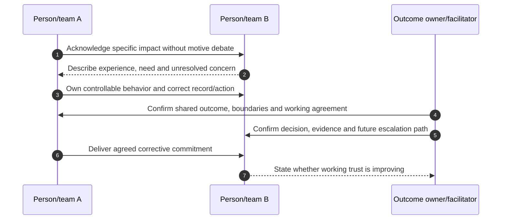

### Repair fields

- What happened and what impact was experienced?
- What fact/behavior can each party own?
- What decision/technical issue is resolved or still open?
- Which correction, apology, or record change is authorized?
- What working agreement/handoff/escalation changes?
- What follow-up behavior will demonstrate reliability?
- Who checks whether the relationship is workable?

### Apology orientation

Use authorized, specific, non-defensive language:

> `In yesterday's review I interrupted your evidence explanation and characterized the network hypothesis as disproven before the test completed. That undermined the discussion and the record. I have corrected the minutes; at the next session you will present the path evidence first, and we will use the agreed hypothesis table before deciding.`

Do not demand forgiveness or declare trust restored.

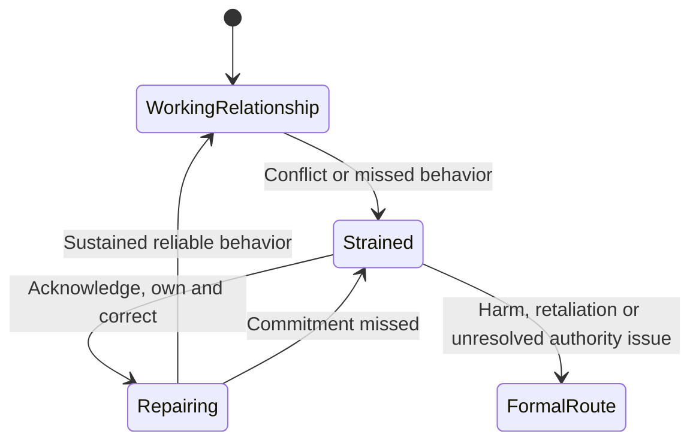

### Formal route boundary

Harassment, discrimination, retaliation, legal/commercial disputes, security/privacy violations, or formal performance concerns require authorized management, HR, legal, security, or compliance routes. Peer conflict coaching does not replace them.

---

## 13. Fully synthetic sanitized scenario: Apex Clinical multi-vendor conflict

> **Synthetic boundary:** `Apex Clinical`, all teams, vendors, incidents, systems, evidence, conflict, decisions, actions, dates, and outcomes are invented. The scenario is not a NetApp customer, account process, vendor statement, product result, or Arti production work.

### Situation

An application experiences intermittent latency. The application vendor says storage is slow; the storage team says the network is dropping packets; the network vendor says host queues are excessive. Meetings have become defensive and repetitive.

### Shared system view

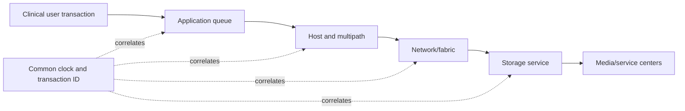

### Conflict diagnosis

| Layer/team | Observation | Overclaim | Needed evidence |
|---|---|---|---|
| Application vendor | Transaction p95 rises at 14:00 | `Storage is cause` | Queue timing before/after storage call |
| Host team | Queue depth rises | `Network cannot keep up` | Path-specific latency/retry and workload |
| Network vendor | Two packet drops in broad window | `Drops caused latency` | Synchronized flow and retransmission impact |
| Storage team | Platform latency near baseline average | `Storage is cleared` | Matching object/transaction/tail interval |

### Working agreement reset

- Shared outcome: restore transaction SLO, not prove one team right.
- One UTC timeline and correlation IDs.
- Every hypothesis states prediction and disconfirming evidence.
- No causal claim in customer update before joint review.
- One coordinator and accepted handoffs.
- Decision owner is customer incident/change authority.
- Conflict behavior concerns use separate repair conversation.

### Hypothesis test

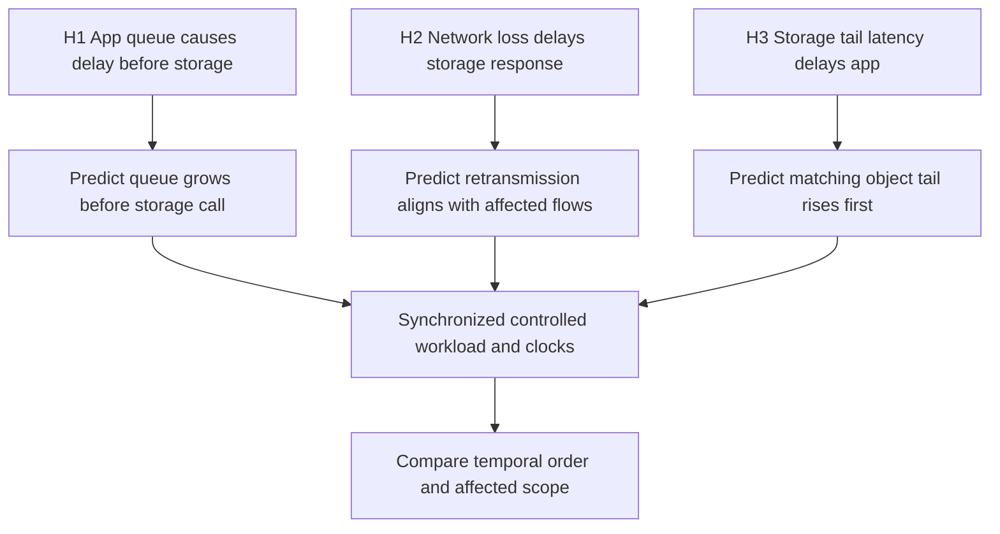

### Test result

In the synthetic trace, the application worker queue rises 40 seconds before storage calls; network drops do not align with affected flows; storage tail latency rises only after request burst increases. Evidence supports an application-queue trigger with storage load as a downstream effect for this test. It does not prove all incidents share the same cause.

### Decision record

| Field | Synthetic record |
|---|---|
| Decision | Tune/test application worker configuration in controlled scope; no storage/network production change |
| Authority | Customer change owner |
| Evidence | Synchronized synthetic trace and controlled test |
| Dissent | App vendor requests second workload variant |
| Action | App owner runs canary; all teams monitor layer metrics |
| Validation | Transaction SLO, queue, network and storage evidence |
| Residual | Other peak patterns may differ; monitor/reopen |

### Relationship repair

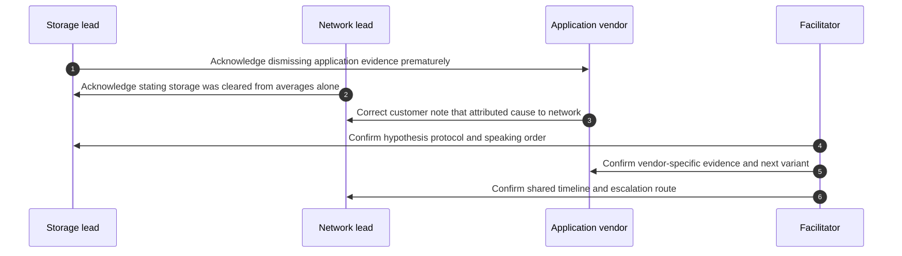

### SME contribution

The group creates a sanitized `Cross-layer latency correlation checklist` with clocks, transaction IDs, layer predictions, source definitions, and decision-state language. It goes through technical/privacy review and receives an owner/review date.

### Synthetic outcome

- The canary improves the synthetic transaction SLO in measured scope.
- The teams preserve alternative hypotheses for other patterns.
- Customer communication is corrected.
- Handoffs and decision records prevent repeated discovery.
- Relationship improvement is assessed after three working sessions, not declared from one apology.
- No real vendor/product/customer result is claimed.

---

## 14. Discovery, evidence, risks, actions, and validation

### Discovery questions

1. What shared customer outcome and complete system/dependency view apply?
2. Which role, decision, evidence, change, contract and handoff boundaries exist?
3. What working agreements, channels, time zones, forums and escalation routes apply?
4. What exact technical facts, interpretations, hypotheses and preferences are disputed?
5. Which predictions and cheapest safe discriminating tests can resolve the disagreement?
6. Which conflict style, psychological-safety and meeting/decision controls fit?
7. How will vendors, SMEs, knowledge artifacts and specialization contribute without monopolizing authority?
8. What outcome, relationship repair, residual risk and follow-up evidence validate collaboration?

```mermaid
flowchart LR
    DISC[Shared outcome and system discovery] --> BOUND[Roles, boundaries and handoffs]
    BOUND --> AGREE[Working agreements and psychological safety]
    AGREE --> TEST[Hypotheses, evidence and conflict handling]
    TEST --> DEC[Decision, escalation and vendor coordination]
    DEC --> ACT[Owned cross-functional action]
    ACT --> VALID[Customer outcome and relationship repair]
    VALID --> KNOW[SME knowledge and process improvement]
```

### Collaboration-risk register

| Risk | Control | Validation |
|---|---|---|
| Local optimization harms service | Shared outcome/system map | End-to-end measure |
| Boundary drops work | Accepted handoff | No repeated discovery/unowned action |
| Technical argument becomes status contest | Hypotheses/predictions/test | Decision follows evidence |
| Dissent hidden | Psychological safety and decision record | Alternate evidence visible |
| Meeting overload | Purpose/authority/timebox/read-back | Decisions/actions, fewer observers |
| Vendor blame loop | One chronology and exact asks | Joint test and ownership |
| SME knowledge monopoly | Reviewed artifacts/backup experts | Reuse and continuity |
| Conflict remains relationally damaged | Repair commitments and follow-up | Working trust/customer outcome |

---

## 15. Anti-patterns and corrections

| Anti-pattern | Why it fails | Better practice |
|---|---|---|
| Collaboration means invite everyone | Noise and unclear authority | Decision-relevant roles and interfaces |
| Shared outcome is vague | Local goals dominate | Measured customer service outcome |
| Expert owns every decision | Expertise is not authority | Distinguish advice, accountability and change |
| Handoff is ticket reassignment | Context and ownership lost | Acceptance-based contract |
| Working agreement is implicit | Pressure exposes different assumptions | Write and review it |
| Technical disagreement by seniority | Evidence loses | Hypotheses, predictions and tests |
| Compromise between safe/unsafe | Middle can be unsafe | Apply boundaries and authority |
| Psychological safety means consensus | Dissent/standards disappear | Safe voice plus decision authority |
| Meeting used instead of ownership | Status repeats | Fix roles/handoffs and reduce attendees |
| Escalation used as threat | Trust and disclosure fall | Exact need and evidence package |
| Multi-vendor blame loop | Every team restarts discovery | Shared chronology and joint test |
| SME hoards expertise | Creates single point of failure | Teach, document and build backups |
| Apology declares repair complete | Relationship evidence absent | Correct, deliver and check over time |
| Peer handles HR/legal issue | Serious concern mishandled | Use formal authorized route |

---

## 16. Arti's factual bridge and JD Mapping

```mermaid
flowchart LR
    CRIT[CRITSIT and enterprise support] --> COORD[Shared impact, roles and cross-team action]
    ENG[Product and Engineering collaboration] --> EVID[Technical disagreement and exact evidence]
    PART[Partner customers] --> VENDOR[Vendor boundaries and handoffs]
    TA[Technical Advisor, mentoring and knowledge] --> SME[SME contribution and teach-back]
    COORD --> METHOD[Transferable collaboration method]
    EVID --> METHOD
    VENDOR --> METHOD
    SME --> METHOD
    METHOD --> GAP[Production NetApp team/conflict leadership remains gap]
```

### Factual tie

| Arti evidence | Transfer | Boundary |
|---|---|---|
| Microsoft CRITSITs | Shared outcome, owners, cadence, escalation | Not NetApp incident/account authority |
| Product/Engineering collaboration | Evidence packages, technical challenge, fix validation | No NetApp Product/Engineering representation |
| Enterprise/partner support | Multi-party boundaries and customer coordination | Contract scope must be authorized |
| Technical Advisor program | Broader technical contribution and influence | Not NetApp SME status |
| Mentoring/knowledge creation | Teach-back, articles and backup capability | No internal NetApp knowledge approval |
| Customer/business reviews | Decision and relationship communication | No production NetApp review ownership |

### JD Mapping

| JD responsibility | Part 70 capability | Honest boundary |
|---|---|---|
| Cross-functional collaboration | Shared outcome/system/boundary method | Actual organization/authority validated |
| SME team contribution | Reviewed artifacts, teach-back, specialization | Expertise must be earned/current |
| Influence without authority | Interests, evidence, working agreements | No command or commercial authority |
| Technical analysis quality | Hypotheses, tests, decisions and alternatives | Product conclusions need current sources/SMEs |
| Escalation/vendor coordination | One chronology, exact asks and handoffs | Contracts and Support routes govern |
| High-pressure communication | Meeting/decision hygiene and psychological safety | Incident owner retains command |
| Customer loyalty | Durable accurate relationships and repair | No causal renewal claim |

### Honest interview statement

> `I align cross-functional teams around a measurable customer outcome and system map, then clarify role boundaries, handoffs and working agreements. For technical disagreement I separate facts from hypotheses, require predictions and a safe discriminating test, record dissent and use the correct decision authority. I contribute reusable SME knowledge and repair conflict through specific ownership and sustained behavior. My production examples are Microsoft-focused, not NetApp team leadership.`

---

## 17. Role plays, paper lab, and self-test

### Role play 1: senior SME dominates

Facilitate the meeting so the SME's expertise is heard without silencing another owner. Restate decision authority, invite counterevidence, and use a hypothesis/test table.

### Role play 2: multi-vendor blame

Create one customer-impact timeline, map boundaries, collect each hypothesis/prediction/evidence, define a joint safe test, and preserve private vendor data.

### Role play 3: post-conflict repair

One participant interrupted and mischaracterized another team's evidence. Use specific acknowledgment, correction, working-agreement change and follow-up behavior without demanding forgiveness.

### Paper lab: synthetic cross-functional case

```mermaid
flowchart LR
    SYSTEM[Map customer outcome and system] --> ROLES[Roles, boundaries and handoffs]
    ROLES --> AGREE[Working agreement and meeting hygiene]
    AGREE --> HYP[Competing hypotheses and tests]
    HYP --> CONFLICT[Conflict-style and psychological-safety practice]
    CONFLICT --> VENDOR[Escalation and vendor coordination]
    VENDOR --> SME[Knowledge artifact and specialization]
    SME --> REPAIR[Relationship repair and validation]
```

Create a fully synthetic service with application, host, network, storage, backup, security, customer, partner, Support and Product/Engineering roles.

Inject:

- Different local metrics and no shared outcome.
- Unclear case versus project ownership.
- Rejected handoff with no acceptance record.
- No working agreement across three time zones.
- Seniority-based technical decision.
- Two plausible hypotheses and one ambiguous test.
- Compromise that violates a safety prerequisite.
- Silent dissent in meeting.
- Vendor blame and restricted-data oversharing risk.
- SME knowledge bottleneck.
- Damaged relationship after public interruption.
- Formal HR concern incorrectly treated as peer conflict.

### Lab tasks

1. Build shared outcome and technical/human system map.
2. Define role/decision/evidence/change boundaries and RACI.
3. Create accepted handoff and working agreement.
4. Write hypotheses, predictions, tests and interpretation.
5. Select/critique conflict modes situationally.
6. Facilitate psychologically safe meeting and decision record.
7. Build escalation and multi-vendor coordination package.
8. Create reviewed SME artifact/specialization plan.
9. Run repair and formal-route scenarios.
10. Answer Q1-Q8 aloud.

### Self-test

1. Define cross-functional collaboration and system view.
2. Explain role/ownership boundaries and complete handoff.
3. Build a working agreement.
4. Influence alignment around shared outcomes.
5. Resolve technical disagreement with hypotheses/tests.
6. Explain five conflict modes and caveats.
7. Create psychological safety and meeting/decision hygiene.
8. Escalate and coordinate vendors safely.
9. Build SME contribution and specialization/knowledge plan.
10. Repair conflict and state Arti's nonclaim.

### Lab pass checklist

- [ ] Shared customer outcome and complete system view are explicit.
- [ ] Role, decision, evidence, change and contract boundaries are clear.
- [ ] Handoffs require context, exact ask, acceptance and checkpoint.
- [ ] Working agreement covers evidence, communication, meetings, disagreement and escalation.
- [ ] Influence uses shared outcomes, interests, evidence and authority.
- [ ] Technical disagreement uses hypotheses, predictions, safe tests and decision impact.
- [ ] Conflict modes are situational tools, not personality diagnoses.
- [ ] Psychological safety preserves dissent, standards and formal-route boundaries.
- [ ] Meetings and decision records produce owners, dates, proof and residual risk.
- [ ] Escalation and vendor coordination use one chronology and secure exact asks.
- [ ] SME contribution creates current reviewed reusable knowledge and backup capability.
- [ ] Relationship repair includes acknowledgment, correction, commitment and sustained evidence.
- [ ] All people, evidence, vendors and outcomes are fully synthetic and sanitized.
- [ ] No production NetApp team, SME, conflict, vendor or customer result is claimed.

---

## 18. Official and Public Source Anchors

**Date checked: 2026-08-24.** The supplied NetApp TAM Technical Analyst job description, represented in the master guide's JD matrix, is the primary source for cross-functional, SME, specialization and customer-relationship expectations. Public sources provide bounded collaboration, conflict, psychological-safety, service and support context; they do not define a NetApp internal process.

| Topic | Official/public source | Bounded use |
|---|---|---|
| Project/stakeholder collaboration | [What is project management? - PMI](https://www.pmi.org/about/learn-about-pmi/what-is-project-management) | Official PMI orientation to stakeholders, outcomes and coordinated work |
| Conflict-mode orientation | [Thomas-Kilmann Conflict Mode Instrument overview](https://kilmanndiagnostics.com/overview-thomas-kilmann-conflict-mode-instrument-tki/) | Model-owner public overview; styles are situational orientation, not diagnosis |
| Worker voice and supportive workplaces | [U.S. Surgeon General - Workplace Mental Health and Well-Being](https://www.hhs.gov/surgeongeneral/priorities/workplace-well-being/index.html) | Official HHS context for worker voice, protection, connection, work-life harmony and growth; not HR policy or a psychological-safety guarantee |
| Service management | [ITIL information from PeopleCert](https://www.peoplecert.org/browse-certifications/it-governance-and-service-management/ITIL-1) | Official ITIL-owner context for service/value/continual improvement |
| Knowledge-Centered Service | [Consortium for Service Innovation - KCS](https://www.serviceinnovation.org/kcs/) | Official KCS-owner context for knowledge sharing; no NetApp process inferred |
| NetApp support context | [NetApp Support Services](https://www.netapp.com/services/support/) | Public support context; exact case/escalation/entitlement routes require confirmation |
| NetApp documentation | [NetApp Documentation](https://docs.netapp.com/) | Current product/release evidence; no internal/team/customer result inferred |

### Source-use discipline

- Revalidate exact customer outcome, topology, roles, authority, contracts, source dates and escalation routes.
- Use one controlled chronology and protect vendor/customer/private evidence by need.
- Route product defects, support cases, commercial disputes, HR/legal/security issues through authorized processes.
- Treat conflict modes as situational choices, never fixed labels or diagnoses.
- Keep SME claims bounded to demonstrated current expertise and peer review.
- Never present this model as NetApp internal organization, policy, SME charter, vendor process or customer result.

---

## Likely Interview Questions

### Q1. How do you make cross-functional collaboration effective?

> **Model answer:** `I start with a measurable customer outcome and end-to-end system map, then clarify role/decision/evidence/change boundaries, accepted handoffs and working agreements. I use one source of truth, evidence-based decisions, explicit owners/checkpoints and outcome validation rather than relying on meeting attendance.`

### Q2. How do you handle ownership boundaries and handoffs?

> **Model answer:** `I distinguish accountability from contribution and confirm case, account, project, product and customer-change authority. A handoff includes impact, scope/time, evidence, work/results, known/unknown, exact ask, receiving owner/checkpoint and safety/privacy, and it is not complete until accepted.`

### Q3. How do you resolve a technical disagreement?

> **Model answer:** `I restate the shared outcome and exact agreement/disagreement, separate observation from interpretation/hypothesis, have each hypothesis predict evidence, choose the cheapest safe discriminating test with predefined interpretation, and update confidence/action/decision while preserving alternatives if ambiguous.`

### Q4. How do conflict styles help?

> **Model answer:** `Competing can protect an urgent safety decision, collaborating fits important outcome/relationship issues, compromising can provide a reversible middle path, avoiding can pause low-value or evidence-pending conflict, and accommodating can preserve a more important concern. I choose situationally and never compromise a required safety boundary or label personalities.`

### Q5. How do you create psychological safety while maintaining accountability?

> **Model answer:** `I model uncertainty, thank early risk disclosure, invite counterevidence, protect people from humiliation and record dissent. I still define standards, authority, owner, action and proof, and use formal manager/HR/legal/security routes for serious conduct or policy issues.`

### Q6. How do you coordinate multiple vendors?

> **Model answer:** `I maintain one customer-impact chronology and coordinator, map each vendor's component/interface/contract boundary, collect vendor-specific hypotheses/evidence/exact asks, run joint predictions/tests under customer authority, protect restricted data, and prevent every vendor from restarting discovery.`

### Q7. How do you contribute to an SME community and repair conflict?

> **Model answer:** `I build current expertise through official sources, varied practice and review, then contribute sanitized decision trees, rubrics, cases, tools or teach-backs with owners/dates. After conflict I acknowledge specific impact, correct the record/behavior, update working agreements, deliver the commitment and ask whether working trust improves over time.`

### Q8. How does your background transfer, and what remains a gap?

> **Model answer:** `Microsoft CRITSITs, partner support, Product/Engineering collaboration, Technical Advisor work, mentoring and knowledge creation give me strong cross-functional evidence and relationship skills. I have not led a production NetApp account/SME/vendor conflict process, so actual roles, support routes, product positions and authority require NetApp/customer owners.`

---

## 30-Second Memory Hooks

- **Collaboration:** Shared outcome + system view + boundaries + evidence + action.
- **System:** Optimize the customer journey, not one team's station.
- **Boundary:** Expertise contributes; authority decides.
- **Handoff:** Context + exact ask + receiving acceptance + checkpoint.
- **Working agreement:** Outcome, roles, evidence, communication, disagreement, escalation, repair.
- **Alignment:** Shared outcome -> interests -> facts -> options -> authority.
- **Disagreement:** Competing maps; test predictions, not status.
- **Test:** Cheapest safe evidence that distinguishes hypotheses.
- **Conflict modes:** Compete, collaborate, compromise, avoid, accommodate situationally.
- **Psychological safety:** Safe dissent plus standards/accountability.
- **Meeting hygiene:** Purpose, authority, evidence, decision, read-back, record.
- **Escalation:** Ask for authority, expertise, resource, priority or scope resolution.
- **Vendor coordination:** One chronology, clear boundaries, exact asks, secure evidence.
- **SME:** Bounded current expertise plus reusable contribution.
- **Specialization:** Practice, review, teach, refresh; not a badge.
- **Repair:** Acknowledge -> own -> correct -> agree -> deliver -> check.
- **Arti's bridge:** Microsoft collaboration transfers; NetApp team authority does not.

---

## Completion Checklist

- [ ] Define shared customer outcome and complete technical/human system view.
- [ ] Clarify accountability, contribution, decision, evidence, change and contract boundaries.
- [ ] Build acceptance-based handoffs and working agreements.
- [ ] Align teams through interests, evidence, options and correct authority.
- [ ] Resolve technical disagreement with hypotheses, predictions and safe tests.
- [ ] Explain five conflict modes and situational caveats.
- [ ] Create psychological safety with dissent, standards and formal-route boundaries.
- [ ] Apply meeting hygiene and complete decision records.
- [ ] Escalate exact needs without blame or threat.
- [ ] Coordinate vendors through one chronology, boundary map, exact asks and secure evidence.
- [ ] Contribute to SME teams through current reviewed reusable knowledge.
- [ ] Build specialization with practice, peer review, teaching and refresh.
- [ ] Repair relationships through specific acknowledgment, correction and sustained behavior.
- [ ] Recreate the fully synthetic Apex Clinical scenario and paper lab.
- [ ] Answer Q1-Q8 aloud and state the exact nonclaim.
- [ ] Revalidate current roles, contracts, evidence, authority and routes before live coordination.

---

*Next suggested section:* [Part 71 - Structured Troubleshooting, Hypothesis Testing, and Root Cause Analysis](Part-71-structured-troubleshooting-rca.md)