# Part 71 - Structured Troubleshooting, Hypothesis Testing, and Root Cause Analysis

> **Section goal:** Turn an urgent, ambiguous symptom into a disciplined evidence trail, a safe restoration decision, and a defensible root-cause analysis (RCA). By the end, Arti should be able to define symptom, scope, timeline, changes, dependencies, baseline, and evidence quality; separate observation from inference; compare hypotheses through predictions and discriminating tests; isolate layers with minimal reproductions and controlled variables; distinguish mitigation, workaround, root cause, and contributing factors; use fault trees and five whys without forcing a story; and write a blame-free RCA with owners, validation, and prevention evidence.

Covers index item **71** and maps directly to job-description responsibilities for high-pressure problem solving, technical analysis, customer-risk mitigation, recommendation quality, Support and Engineering collaboration, operational reviews, and prevention tracking.

**Explicit nonclaim:** Arti has not diagnosed, mitigated, or authored the RCA for a production NetApp, ONTAP, NAS, SAN, replication, MetroCluster, or storage-hardware incident.

**Privacy/access:** Troubleshooting evidence can expose customer data, file paths, identities, network addresses, topology, credentials, security controls, packet contents, logs, defects, contracts, and employee actions. Collect only authorized evidence, minimize and redact it, preserve originals in approved restricted systems, transfer it through approved secure channels, record access and retention, and never paste customer or gated Support data into public notes, portfolios, or unapproved AI systems.

**Synthetic-evidence rule:** Every customer, system, identifier, address, event, counter, packet, hypothesis, test, timeline, action, owner, date, cause, and outcome below is fictional and sanitized. No table, trace, log, screenshot-like record, or result is copied from a real customer or NetApp tool.

**Version/current source caveat:** ONTAP behavior, event names, counters, commands, interfaces, known issues, support policy, and recommended procedures change by release, platform, protocol, host stack, and configuration. A **current-source check** means reopening the exact official documentation or authorized Support source for the observed release and configuration, recording the source and date, and having the qualified owner approve any live diagnostic or change.

This Part teaches a generic reasoning method. It is not a NetApp internal runbook, Support entitlement, severity policy, diagnostic procedure, change authorization, defect determination, or permission to access production systems.

> **No-production-NetApp boundary:** Arti's factual strengths are Microsoft enterprise Support Escalation Engineering, CRITSIT ownership, timeline construction, hypothesis testing, cross-team evidence correlation, mitigation, engineering engagement, technical writing, and customer communication. Her exact nonclaim is: **she has not independently investigated, changed, restored, or declared root cause for a production NetApp system.** In an interview she may describe the method, her Microsoft evidence, and these synthetic exercises, but not present them as NetApp production outcomes.

---

## 1. Troubleshooting is a controlled learning loop

**Troubleshooting** is the disciplined reduction of uncertainty about why an observed outcome differs from an expected one, while protecting the service and data.

| Term | Plain meaning | Analogy | Why it matters |
|---|---|---|---|
| **Symptom** | Observable departure from expected behavior | Smoke alarm sounding | Starts the investigation but does not name the fire |
| **Observation** | What a source directly recorded | Camera image | Can be checked without accepting an explanation |
| **Inference** | Meaning reasoned from observations | Concluding someone entered from footprints | May be strong, but remains interpretation |
| **Hypothesis** | Testable possible explanation | Candidate route on a map | Organizes predictions and evidence |
| **Prediction** | Observation expected if a hypothesis is useful | The next road sign a route should reach | Makes the idea falsifiable |
| **Discriminating test** | Check whose outcomes separate hypotheses | Fork in the road | Produces information, not just more data |
| **Mitigation** | Action that reduces impact now | Moving people out of smoke | Protects service before cause is complete |
| **Root cause** | Causal condition whose removal prevents the defined recurrence within scope | Faulty wire that started this fire | Must be supported by mechanism and counterevidence |
| **Contributing factor** | Condition that increased likelihood, impact, or recovery time | Missing smoke door | Matters even if it did not initiate failure |
| **Corrective action** | Owned change addressing cause or contributor | Replace wire and add inspection | Converts learning into prevention |

```mermaid
flowchart LR
    IMPACT[Protect people, data and service] --> FRAME[Define symptom, scope and expected behavior]
    FRAME --> EVID[Collect time-aligned evidence]
    EVID --> HYP[Rank competing hypotheses]
    HYP --> TEST[Run cheapest safe discriminating test]
    TEST --> UPDATE[Update confidence and next action]
    UPDATE --> RESTORE[Mitigate and validate restoration]
    RESTORE --> RCA[Explain mechanism, causes and contributors]
    RCA --> PREVENT[Own, validate and monitor corrective actions]
```

### Safety before curiosity

When impact is active, restoration and data protection outrank an elegant diagnosis. Preserve enough evidence to avoid blindness, but do not keep a dangerous condition running merely to collect a perfect trace. The authorized incident or change owner decides live actions.

---

## 2. Frame the problem before collecting everything

A useful problem statement says what failed, for whom, where, when, under which operation, compared with what expectation.

> `From <start time/time zone>, <population and operation> experienced <measured symptom/error> on <scope>; <unaffected control> remained normal. Expected <baseline/SLO>. Business impact is <bounded effect>. Cause is unknown.`

### The seven-part frame

| Field | Questions | Bad shortcut |
|---|---|---|
| Symptom | Exact operation, error, latency distribution, data state? | `Storage is slow` |
| Scope | Which users, clients, paths, SVMs, volumes, LUNs, sites? What is unaffected? | `Everyone` without denominator |
| Timeline | First/last known good, onset, peaks, recovery, recurrence, clock quality? | Ticket-open time as onset |
| Change | Planned, automatic, environmental, workload, identity, network, code, lifecycle? | `No changes` from one team |
| Dependencies | Application, host, identity, DNS/time, network/fabric, protocol, storage, protection? | Array-only view |
| Baseline | Expected behavior for comparable time, operation, population, and load? | One global average |
| Evidence quality | Source, object, interval, units, completeness, clock, provenance, access? | Screenshot with no context |

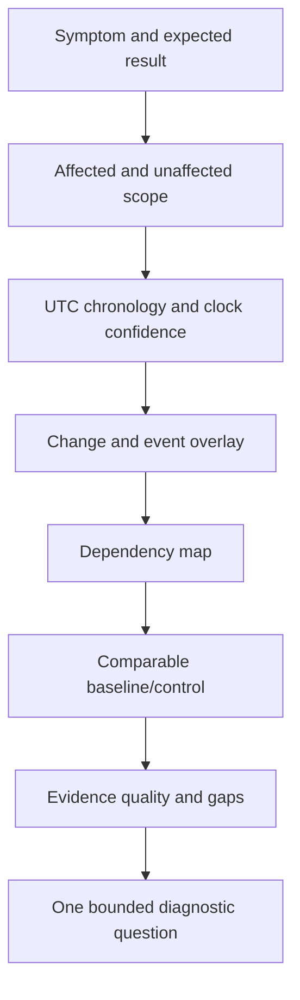

### Timeline construction

Use a common time basis such as Coordinated Universal Time (UTC), but preserve original timestamp, source time zone, clock offset, and collection delay. Sequence is not causality, yet wrong sequence can invalidate a causal story.

```mermaid
timeline
    title Synthetic incident chronology in UTC
    09:55 : Last known good transaction
    10:02 : Client error rate rises
    10:03 : Application queue rises
    10:05 : Storage workload rises
    10:08 : Incident declared
    10:16 : Workload routed to control pool
    10:20 : User success recovers
    10:45 : Evidence preserved and monitoring continues
```

### 🔍 Plain-English deep-dive: observation versus inference

Suppose a storage graph rises at 10:05. `The reported volume latency was 18 ms for this interval under this counter definition` is an observation. `Storage caused the application slowdown` is an inference. The inference needs matching objects, clocks, populations, temporal order, mechanism, alternatives, and a test. **Analogy:** wet pavement proves water is present; it does not prove rain rather than a sprinkler. **Why it matters:** causal language changes priorities and can trigger risky changes.

---

## 3. Build an evidence ledger, not an evidence pile

An **evidence ledger** records what each item proves, does not prove, and how trustworthy it is.

| Ledger field | Example content |
|---|---|
| Evidence ID | `SYN-E17` |
| Source/owner | Synthetic host multipath event, host team |
| Object/population | Host H07, path P2, 114 I/O operations |
| Time/window | 10:01:30-10:02:10 UTC; clock offset measured |
| Definition/units | Path retry count; event semantics source-linked |
| Observation | P2 retry count rose; P1 did not |
| Supports/challenges | Supports path-specific hypothesis; challenges all-path failure |
| Does not prove | Storage target cause or application impact |
| Quality/gap | Direct event, complete interval; packet evidence absent |
| Privacy/access | Synthetic; a live equivalent would be restricted |

### Evidence-quality dimensions

1. **Identity:** exact client, cluster, node, SVM, volume, LUN, path, relationship, or job.
2. **Time:** synchronized clocks, sampling interval, data delay, missing intervals.
3. **Definition:** metric boundaries, units, aggregation, success/error population.
4. **Completeness:** all paths, nodes, operations, and relevant pre-onset period.
5. **Provenance:** original source, collection method, transformation, checksum or version where required.
6. **Independence:** whether two sources truly corroborate or repeat one upstream signal.
7. **Access:** authorization, minimization, redaction, retention, and secure transfer.

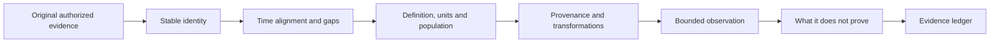

### Evidence strength orientation

| Strength | Example | Use |
|---|---|---|
| Direct and scoped | Exact operation error with matching object/time | Strong observation |
| Corroborating | Independent host and target evidence align | Increases confidence in bounded claim |
| Indirect | Broad node average near incident | Context, not proof |
| Anecdotal | `It felt slow after patching` | Lead to test, not conclusion |
| Missing/ambiguous | Data gap during onset | Explicit uncertainty and collection action |
| Contradictory | Control worsened without predicted trigger | Challenge hypothesis; do not hide it |

---

## 4. Hypotheses must predict evidence

A useful hypothesis has a mechanism, affected scope, predicted observations, and observations that would reduce confidence.

> `H1: If <causal mechanism> is producing <symptom> for <scope>, then under <condition> we expect <prediction A/B>; observing <disconfirming result> would reduce confidence.`

### Hypothesis table

| ID | Candidate mechanism | Prediction | Disconfirming evidence | Cheapest safe test | Current state |
|---|---|---|---|---|---|
| H1 | Client identity mapping changed | Failing clients resolve different effective IDs | Same effective ID and policy path on success/failure | Compare one failing and one control request | Open |
| H2 | One network path loses frames | Failures correlate with one path/retransmission | Failure spans healthy independent path with no loss | Pin a synthetic test to each approved path | Open |
| H3 | Media service time is limiting | Matching storage object service/queue rises first | Storage remains baseline while upstream wait rises | Correlate matching operation and object | Open |

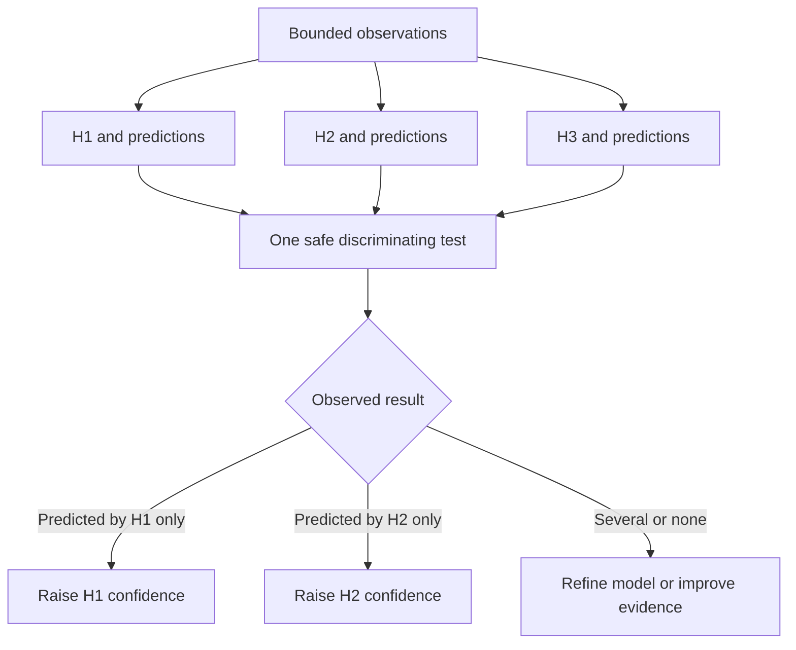

### Falsification orientation

Do not ask only, `What confirms my idea?` Ask, `What should I observe if this idea is wrong?` A failed prediction does not always destroy a hypothesis because the test may be weak, the condition absent, or multiple faults interacting. Record that reasoning rather than rescuing every idea with an after-the-fact exception.

### 🔍 Plain-English deep-dive: Bayesian orientation without fake probability

Bayesian reasoning means updating belief when evidence arrives, while considering how expected that evidence was under competing explanations. It does **not** require inventing `73% likely` when no defensible data supports the number. **Analogy:** a doctor changes the shortlist after each test, but does not pretend every symptom has an exact personal probability. **Why it matters:** use calibrated words such as high, medium, low, supported, weakened, or unresolved, plus reasons and gaps.

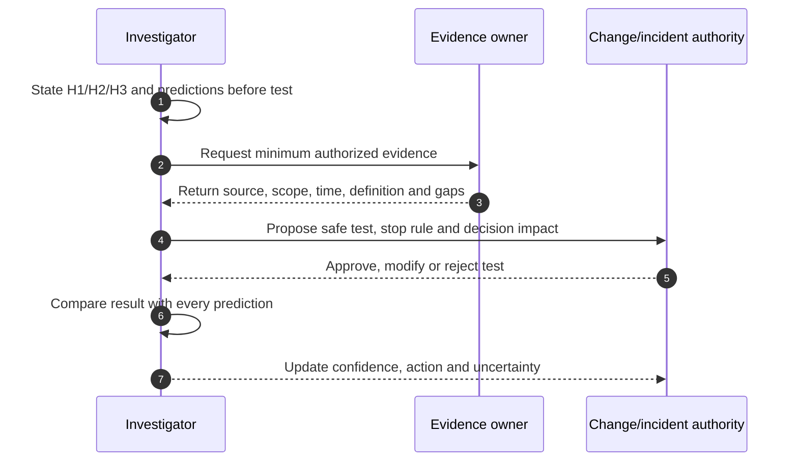

### Confidence language

| Language | Meaning |
|---|---|
| Supported | Available evidence fits prediction and alternatives weakened |
| Consistent with | Fits, but does not distinguish alternatives |
| Weakened | A material prediction failed or counterevidence appeared |
| Ruled out for tested scope | Safe test made the mechanism incompatible within bounded conditions |
| Unknown | Evidence is missing, inaccessible, or ambiguous |

---

## 5. Isolate the failing layer and interface

Layer isolation asks where expected input becomes unexpected output. It does not assume a team or product is at fault.

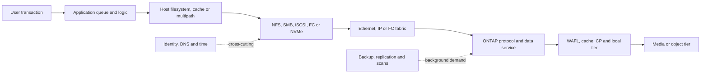

### Boundary questions

- Did the application issue the operation, or wait before issuing it?
- Did the host send it on the expected device/path and receive a protocol response?
- Did the network/fabric carry both directions without loss, reset, congestion, or path asymmetry?
- Did ONTAP receive the matching operation on the expected SVM/object?
- Was wait in protocol processing, CPU, queue, consistency point, local tier, media, or external tier?
- Did a cross-cutting dependency fail only for new sessions, one identity, one name, or one time window?

### Layer matrix

| Layer | Strong evidence | Common overclaim |
|---|---|---|
| Application | Transaction spans and internal queue | `Storage call was last, so storage caused all delay` |
| Host | Device/path latency, queue, errors, retry | `High queue proves array saturation` |
| Network/fabric | Flow/path-specific loss, credit, errors, latency | `Any dropped packet caused outage` |
| Protocol | Exact operation/status/session/state | `TCP connected, so NFS/SMB/iSCSI works` |
| Storage service | Matching object/operation counters/events | `Node average clears every workload` |
| Media/tier | Matching service/queue/utilization and temporal order | `Busy disk is the bottleneck` |

---

## 6. Minimal reproduction, controls, and one-variable tests

A **minimal reproduction** is the smallest authorized input that still produces the defining symptom. A **control** is a comparable case expected not to fail. A **controlled variable** is deliberately changed while important others remain stable.

### 🔍 Plain-English deep-dive: the smallest experiment that can answer the question

If a lamp does not turn on, replacing the bulb, socket, fuse, cable, and switch simultaneously may restore light but teaches nothing. Swapping one known-good bulb is a discriminating test. **Why it matters:** simultaneous changes destroy attribution and can create new faults.

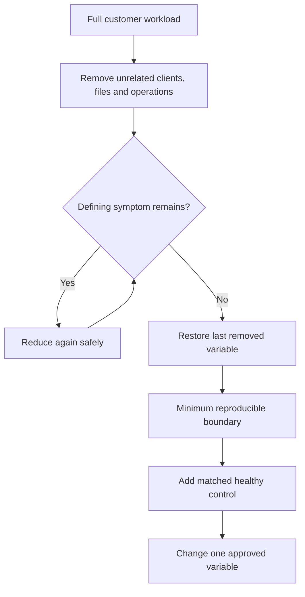

### Test card

| Field | Required content |
|---|---|
| Question | What uncertainty will this test reduce? |
| Hypotheses | Which predictions differ? |
| Scope | Synthetic/lab/canary; exact objects and duration |
| Controlled variable | One intentional difference |
| Held stable | Load, client, path, identity, operation, time where practical |
| Evidence | Before/during/after sources and clock alignment |
| Expected outcomes | Interpretation for each result, including ambiguous |
| Safety | Approval, backup/recovery, stop conditions, privacy |
| Decision | What action changes after the result? |

### Test hierarchy

1. Existing read-only evidence.
2. Reanalysis or comparison with an unaffected control.
3. Synthetic or lab reproduction.
4. Customer-approved canary/read-only probe.
5. Reversible production change under qualified ownership.
6. Irreversible or broad change only under exact official procedure and authority, never as exploratory guessing.

---

## 7. Restoration language: mitigation, workaround, fix, and cause

| Term | Purpose | Claim boundary | Example orientation |
|---|---|---|---|
| Containment | Stop spread or protect integrity | May reduce scope without service | Isolate suspect workload |
| Mitigation | Reduce current impact | Does not prove cause | Shift traffic to healthy path |
| Workaround | Alternative way to meet need | May carry operational debt | Use supported alternate access path |
| Fix/remediation | Correct known defective condition | Requires validation and scope | Apply qualified supported correction |
| Recovery | Return service/data to acceptable state | Not proof of prevention | Restore and validate transactions |
| Root cause | Explain causal mechanism within scope | Requires evidence beyond recovery correlation | Specific trigger plus enabling condition |

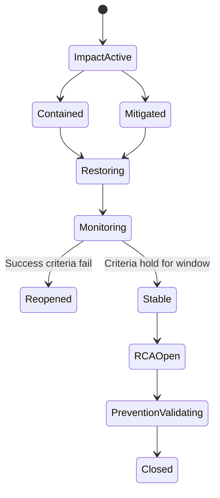

### Do not infer cause from reversal alone

If impact ends after a change, the change is correlated with recovery. Confidence increases when the mechanism predicts the response, unrelated variables stayed stable, the affected scope changed as predicted, and a controlled repeat or durable evidence supports it. Avoid deliberately reintroducing a dangerous fault merely to prove causality.

---

## 8. Fault trees and the limits of five whys

A **fault tree** starts with an unwanted outcome and decomposes sufficient combinations of lower events using logical **OR** and **AND** relationships. It helps expose alternatives and common causes.

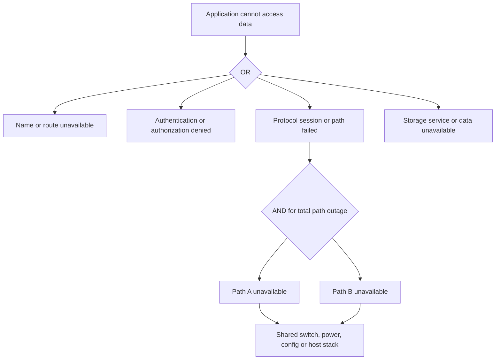

### Five whys

The **five whys** repeatedly asks why a condition occurred. It can reveal process depth, but `five` is not a rule and one chain can force a complex system into a single story.

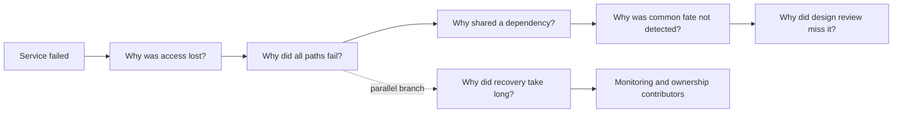

### 🔍 Plain-English deep-dive: systems usually have a causal network, not one root

A bridge collapse may involve load, material, inspection, weather, and design margin. Asking for `the one root cause` can erase contributors that prevention must address. **Why it matters:** define the incident scope, show the mechanism, distinguish trigger from latent conditions, and assign actions to every material contributor.

### Method limits

| Method | Strength | Limit | Safeguard |
|---|---|---|---|
| Fault tree | Keeps alternatives and combinations visible | Can become huge or omit unknowns | Bound top event and mark unknown branches |
| Five whys | Simple process-learning prompt | Hindsight, linearity, blame, arbitrary stopping | Branch, use evidence, ask `how`, verify mechanism |
| Fishbone | Broad category brainstorm | Equal visual weight can imply equal evidence | Convert branches to testable hypotheses |
| Timeline | Establishes sequence | Sequence alone is not causality | Add mechanism and controls |
| Known-error matching | Speeds recognition | Similar symptom is not applicability | Match trigger, version, signature, scope |

---

## 9. Root cause, trigger, mechanism, and contributing factors

Use a causal vocabulary that survives challenge.

| Element | Question |
|---|---|
| Incident definition | What exact recurrence are we preventing? |
| Trigger | What initiated this occurrence? |
| Mechanism | Through which steps did trigger produce symptom? |
| Root causal condition | Which removable condition was necessary or sufficient within scope? |
| Contributing factor | What increased probability, blast radius, or recovery time? |
| Detection gap | Why was it not seen sooner or classified correctly? |
| Recovery factor | What accelerated or delayed restoration? |
| Counterfactual | If action had existed, would this incident likely have been prevented or reduced? |

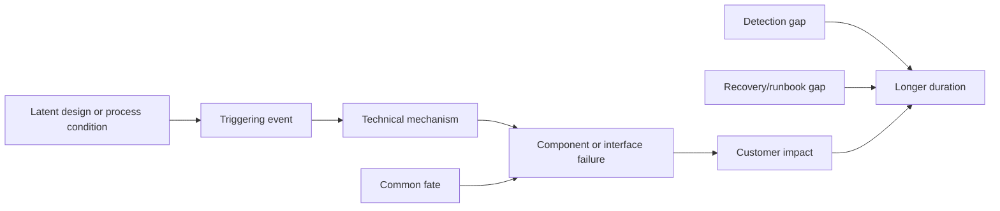

### Causal evidence test

1. Temporal order is valid after clock correction.
2. Exact affected objects and operations match.
3. A plausible technical mechanism links condition to symptom.
4. Predictions match observed affected and unaffected controls.
5. Competing hypotheses are tested or explicitly unresolved.
6. Recovery behavior is consistent without being the only evidence.
7. Version/configuration and known-issue applicability are verified from current authorized sources.
8. The conclusion is no broader than the evidence.

---

## 10. Blame-free RCA is precise, not vague

**Blame-free** means the analysis explains how system design, controls, information, workload, tools, procedures, and decision context shaped actions. It does not erase accountability, intentional misconduct, or required formal review.

### RCA document

| Section | Content |
|---|---|
| Executive summary | Impact, duration, scope, restoration, confidence |
| Customer effect | User/business/data/SLO consequence and evidence |
| Timeline | Last known good through detection, response, restoration, monitoring |
| Technical mechanism | Stepwise cause-and-effect with diagrams |
| Causes/contributors | Trigger, causal conditions, common fate, detection/recovery gaps |
| Evidence | Sources, definitions, contradictions, gaps, access boundaries |
| What went well/poorly | Controls that helped and failed without personal attack |
| Corrective actions | Cause-linked prevention, detection, mitigation, recovery improvements |
| Ownership | Accountable owner, target date, dependency, status, escalation |
| Validation | Test, success measure, observation window, residual risk |

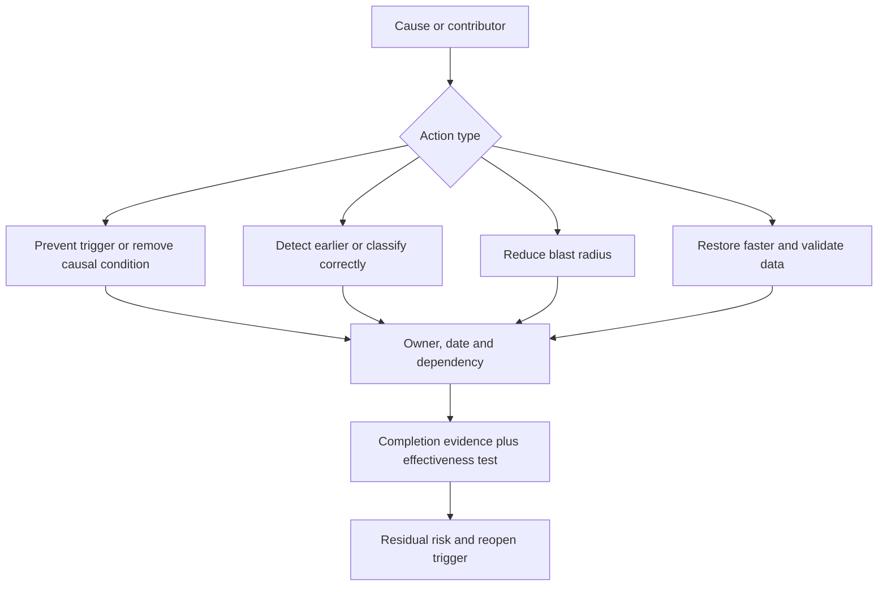

### Action quality

`Engineer to be more careful` is weak. `Configuration workflow validates independent failure domains, blocks duplicate dependency IDs, and is tested against three synthetic topologies by the platform owner before 2026-10-15` is measurable, though still synthetic here.

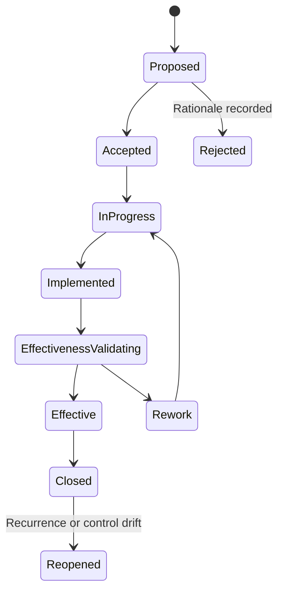

### Review questions

- Does every causal claim cite evidence and acknowledge contradictions?
- Would the explanation still make sense without names or team labels?
- Does each action map to a cause/contributor rather than generic hygiene?
- Is completion distinct from effectiveness?
- Who accepts residual business risk?

---

## 11. Decision discipline under uncertainty

Restoration decisions often precede complete diagnosis. Use a reversible, evidence-preserving decision model.

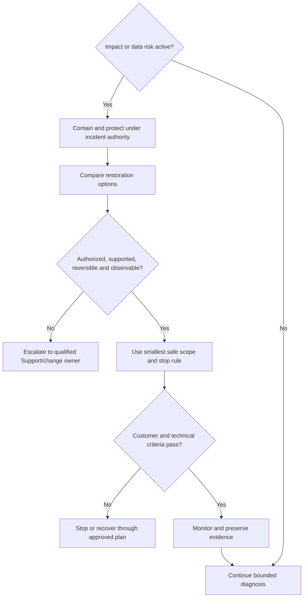

### Decision record under uncertainty

- Known facts and evidence cutoff.
- Unknowns and contradictory observations.
- Current hypotheses and confidence language.
- Options, risks, reversibility, dependencies, supportability.
- Exact authority and customer decision.
- Stop, rollback/recovery, and success criteria.
- Next checkpoint and what evidence can change the decision.

---

## 12. Common reasoning failures

| Failure | Example | Correction |
|---|---|---|
| Premature closure | First plausible alert becomes cause | Keep at least one serious alternative |
| Confirmation bias | Collect only evidence for favored idea | Write disconfirming prediction first |
| Post hoc fallacy | Recovery followed change, so change proved cause | Seek mechanism, controls, matching scope |
| Base-rate neglect | Rare bug favored over common expired credential | Include ordinary dependencies without dismissing signature evidence |
| Availability bias | Last incident was MTU, so this one is MTU | Rebuild from current observations |
| Authority bias | Senior engineer's view becomes fact | Test prediction and record dissent |
| Survivorship bias | Study only failed clients | Compare healthy controls |
| Metric substitution | Node CPU becomes application health | Map evidence to customer operation |
| Averaging away tails | Mean normal, p99 painful | Preserve distributions and populations |
| Evidence destruction | Restart before preserving volatile state | Balance evidence with restoration safety |
| Endless diagnosis | Wait for certainty while impact grows | Mitigate under explicit uncertainty |
| Blame root cause | `Operator error` ends analysis | Examine conditions, guardrails, information, review |

---

## 13. Troubleshooting workbook and customer language

### Investigation board

| Column | Purpose |
|---|---|
| Impact/current state | What customers experience now |
| Facts | Verified observations only |
| Unknowns/contradictions | Evidence gaps and conflicts |
| Hypotheses | Mechanism, prediction, confidence |
| Tests/actions | Owner, approval, result, decision impact |
| Restoration | Mitigation, validation, monitoring |
| Escalations | Exact ask and evidence package |
| RCA/prevention | Cause-linked actions and effectiveness |

### Customer-safe update

> `At <time/zone>, <scope> continues to experience <impact>. We have verified <facts>. Cause remains under investigation; current evidence supports <bounded hypothesis> but <alternative/gap> remains. <Owner> is performing <safe action/test> under <authority>, with the next checkpoint at <time>. No <data/security claim> is made without evidence.`

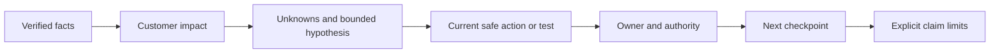

---

## 14. JD Mapping

| JD responsibility | Part 71 capability | Evidence Arti can honestly use |
|---|---|---|
| Analyze customer data | Evidence ledger, provenance, baseline, contradiction handling | Microsoft case/timeline analysis and synthetic workbook |
| Mitigate risk and improve stability | Restoration-first decisions and cause-linked prevention | CRITSIT method; no NetApp production action claim |
| High-pressure situations | Bounded decisions under uncertainty | Microsoft incident coordination |
| Cross-functional/SME work | Predictions, exact evidence requests, decision records | Product/Engineering collaboration |
| Technical recommendations | Evidence -> mechanism -> action -> validation | Support escalation writing and synthetic exercises |
| Operational reviews | RCA themes, action aging, residual risk | Customer/business review experience |

---

## 15. Fully synthetic sanitized scenario(s)

All four scenarios are fictional. They teach reasoning, not product procedures or customer outcomes.

### Scenario A: NFS write denied after a maintenance window

**Symptom:** Two of twelve Linux clients can mount a synthetic export but writes return access denied; reads work. Other clients remain healthy.

**Frame:** Scope is client-specific and operation-specific. The onset follows identity-service maintenance, but the maintenance is only a candidate change.

| Hypothesis | Prediction | Evidence/test | Result |
|---|---|---|---|
| H1 export policy selected a read-only rule | Failing source addresses match a different rule | Compare actual source, selected rule, security flavor | Synthetic rule evidence is identical; H1 weakened |
| H2 effective UID/GID differs | Failing clients present/match different identity | Compare numeric and resolved identities on one file | Failing clients map the group differently; H2 supported |
| H3 file lock blocks write | Protocol status and lock evidence show conflict | Test a new synthetic file and inspect state | New file also denied; no lock conflict; H3 weakened |
| H4 LIF path drops write traffic | Retries/loss align only to failing clients | Compare path flow and protocol replies | Server returns explicit access status; H4 weakened |

```mermaid
sequenceDiagram
    autonumber
    participant C as Synthetic NFS client
    participant I as Identity service
    participant N as Synthetic NFS service
    C->>I: Resolve user and groups
    I-->>C: Different group mapping on affected clients
    C->>N: WRITE with effective identity
    N->>N: Export permits flavor; file permission denies group
    N-->>C: Access denied
    C->>N: READ under permitted bits
    N-->>C: Success
```

**Mitigation:** Customer-authorized identity-cache correction in a synthetic lab scope restores expected mapping. **Cause conclusion:** the bounded scenario supports stale/misconfigured client identity mapping, not an ONTAP defect. **Contributors:** no negative identity test after maintenance and weak client configuration drift detection. **Validation:** positive and negative access, same effective identity, recurrence monitoring. **Residual risk:** other clients may drift until fleet configuration is checked.

### Scenario B: Month-end application tail latency

**Symptom:** p99 transaction latency rises while storage-node average latency appears normal.

| Hypothesis | Prediction | Discriminating evidence |
|---|---|---|
| Application worker queue | Queue rises before storage calls; control service normal | Correlated transaction spans and queue depth |
| One host path retries | Tail aligns with one device/path and retry events | Host path histogram plus flow/fabric evidence |
| Storage workload contention | Victim and competitor share object/resource; victim tail changes with separation | Per-workload/object counters and controlled synthetic separation |
| FabricPool recall | Cold-block recall and external-tier evidence align | Tier-specific operation evidence and working-set test |

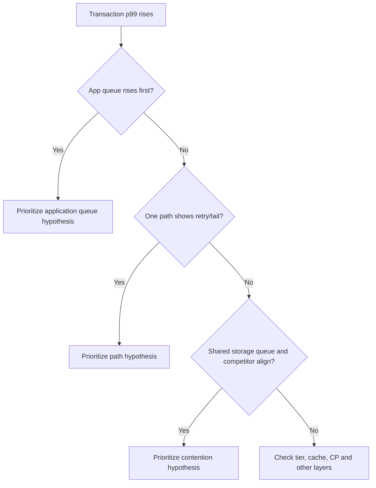

**Synthetic result:** application queue rises 35 seconds before matching storage demand. A controlled worker-limit canary changes transaction tail without changing storage service time. Cause remains bounded to this reproduction; other peaks require separate evidence.

### Scenario C: Replication lag exceeds the recovery objective

**Symptom:** Destination recovery-point age grows even though the scheduled policy exists.

| Hypothesis | Prediction | Evidence |
|---|---|---|
| Schedule not firing | No eligible update job at scheduled time | Relationship/job history and policy labels |
| Change rate exceeds service rate | Queue grows while transfers stay active | Source change, transferred bytes, duration, backlog trend |
| Intercluster path degradation | Throughput/retries align with network interval | Both-end LIF/path and transfer evidence |
| Destination capacity constraint | Destination space/event/job error precedes lag | Typed capacity and event chronology |

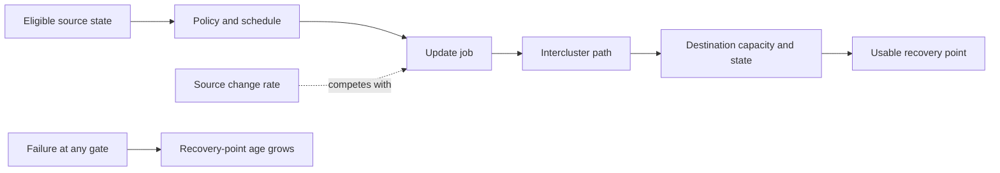

**Synthetic result:** transfer jobs are active, but changed bytes arrive faster than sustained transfer service during the backup window. A network test shows no matching loss; destination has headroom. Mitigation moves a synthetic competing transfer under approved scheduling. Root cause for the exercise is overlapping workload demand beyond measured path service, with missing capacity modeling as a contributor.

### Scenario D: Post-upgrade client regression

**Symptom:** A subset of hosts loses one optimized path after a synthetic software upgrade; the storage cluster reports healthy.

| Candidate | Prediction | Result orientation |
|---|---|---|
| ONTAP service regression | All matching hosts/paths show target-side signature | Not observed in synthetic control hosts |
| Host driver/firmware combination | Only exact changed recipe fails | Matches affected population |
| Zoning change | Missing target appears in fabric visibility | Visibility remains correct |
| Mapping change | LUN absent on target presentation | Mapping stable |

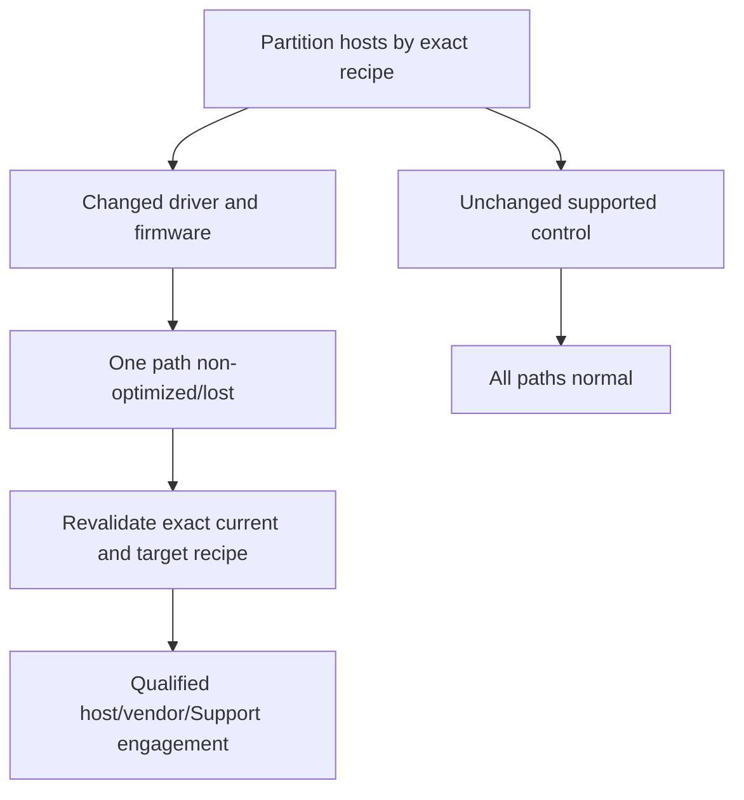

**Decision:** stop the rollout, preserve exact host/path evidence, verify the current compatibility source, and engage the qualified owners. No downgrade, firmware change, path manipulation, or defect declaration is prescribed here. **RCA orientation:** the exact synthetic host combination is unvalidated for the target state; whether it is unsupported, misconfigured, or defective remains an authorized-source question.

---

## 16. Labs, drills, and self-test

### Paper lab: build an investigation pack

Create a fictional service with an application, two hosts, two independent network/fabric paths, one NAS or SAN data service, a protection relationship, and a business SLO.

```mermaid
flowchart LR
    INJECT[Inject one symptom and two misleading signals] --> FRAME[Write seven-part problem frame]
    FRAME --> LEDGER[Build evidence ledger]
    LEDGER --> HYP[Write at least four hypotheses]
    HYP --> PRED[Prediction and disconfirmation per hypothesis]
    PRED --> TEST[Select cheapest safe test]
    TEST --> REST[Choose mitigation and validation]
    REST --> RCA[Draft causal network and actions]
    RCA --> REVIEW[Peer challenge and Q1-Q8 aloud]
```

### Drill 1: observation or inference

Label each statement, then rewrite overclaims:

1. `The host recorded three path timeouts between 14:01 and 14:02 UTC.`
2. `The fabric caused the outage.`
3. `A volume latency average was 2 ms for five minutes.`
4. `The array was healthy.`
5. `The incident recovered after a route change.`
6. `The route change fixed the root cause.`

### Drill 2: hypothesis tournament

Given `new SMB sessions fail but existing sessions continue`, generate identity/DNS/time, service discovery, authentication, network, and server-state hypotheses. For each, state one prediction and one result that weakens it.

### Drill 3: weak RCA repair

Rewrite: `Root cause was human error. Engineer selected the wrong port. Action: retrain engineer.` Include decision context, misleading interface, missing validation/guardrail, common-fate impact, detection delay, owner/date, and effectiveness test.

### Self-test

1. Define symptom, scope, timeline, change, dependency, baseline, and evidence quality.
2. Separate observation, inference, correlation, and causal conclusion.
3. Write a falsifiable hypothesis with prediction and disconfirmation.
4. Explain Bayesian orientation without invented probability.
5. Isolate an application-to-media path by interfaces.
6. Design a minimal reproduction, control, and one-variable test.
7. Distinguish containment, mitigation, workaround, recovery, fix, cause, and contributor.
8. Explain fault-tree and five-whys strengths and limits.
9. Build a causal RCA with action ownership and effectiveness validation.
10. State the privacy, access, production, and current-source boundaries.

### Lab pass checklist

- [ ] Problem frame includes affected and unaffected scope.
- [ ] Timeline preserves source clocks and uncertainty.
- [ ] Evidence ledger states what each item proves and does not prove.
- [ ] At least three serious competing hypotheses remain initially.
- [ ] Every hypothesis has predictions and disconfirming evidence.
- [ ] Test is safe, approved, bounded, and decision-relevant.
- [ ] Mitigation is not mislabeled as root cause.
- [ ] Cause includes mechanism, scope, counterevidence, and confidence.
- [ ] Contributing, detection, and recovery factors are explicit.
- [ ] Corrective actions map to causes and have owners/dates/proof.
- [ ] Completion and effectiveness are validated separately.
- [ ] Customer wording preserves uncertainty without becoming vague.
- [ ] All evidence is fully synthetic and sanitized.
- [ ] No production NetApp diagnosis, access, change, or outcome is claimed.

---

## 17. Arti transfer/honesty

### Transfer map

```mermaid
flowchart LR
    MS[Microsoft escalation evidence] --> FRAME[Symptom, scope, timeline and dependency framing]
    CRIT[CRITSIT ownership] --> REST[Restoration priority and decision logs]
    ENG[Product and Engineering work] --> HYP[Hypotheses, traces and exact asks]
    RCAW[RCA and customer writing] --> RCA[Mechanism, actions and communication]
    FRAME --> TAM[Transferable TAM troubleshooting method]
    REST --> TAM
    HYP --> TAM
    RCA --> TAM
    TAM --> GAP[ONTAP production diagnosis remains a stated gap]
```

### Honest interview wording

> `My production troubleshooting experience is in Microsoft enterprise support, where I have scoped impact, built timelines, correlated cross-layer evidence, tested hypotheses, coordinated mitigation, engaged engineering, and communicated RCA. For NetApp scenarios I would apply the same evidence discipline, but validate the exact ONTAP release, topology, counter semantics, supportability, and Support procedure with qualified owners. I have not independently diagnosed or changed a production NetApp system; my current NetApp evidence is conceptual and fully synthetic.`

---

## 18. Official and Public Source Anchors

**Date checked: 2026-08-24.** These sources anchor public concepts. They do not prove a live configuration, authorize a diagnostic, expose gated defect data, or define an internal NetApp RCA process.

| Topic | Official/public source | Bounded use |
|---|---|---|
| ONTAP event evidence | [ONTAP event, performance, and health monitoring](https://docs.netapp.com/us-en/ontap/event-performance-monitoring/) | Current public monitoring navigation; exact release/event semantics must be reopened |
| EMS definitions | [ONTAP EMS reference](https://docs.netapp.com/us-en/ontap-ems/) | Exact public event catalog by reference version; not customer evidence |
| Performance workflow | [ONTAP performance administration workflow](https://docs.netapp.com/us-en/ontap/performance-admin/identify-resolve-issues-workflow-task.html) | Public investigation orientation; counters and procedures remain release-sensitive |
| NFS evidence context | [ONTAP NFS administration](https://docs.netapp.com/us-en/ontap/nfs-admin/) | Public export, identity, Kerberos, lock, and operation context |
| SAN evidence context | [ONTAP SAN storage management](https://docs.netapp.com/us-en/ontap/san-management/) | Public LUN, igroup, host, protocol, and multipath context |
| Data-protection evidence | [ONTAP data protection and disaster recovery](https://docs.netapp.com/us-en/ontap/data-protection-disaster-recovery/) | Public snapshot, replication, and recovery navigation |
| Upgrade evidence | [ONTAP upgrade documentation](https://docs.netapp.com/us-en/ontap/upgrade/) | Current public upgrade planning and validation context; not a live runbook |
| Support context | [NetApp Support Services](https://www.netapp.com/services/support/) | Public service context; exact entitlement and escalation routes require confirmation |
| Incident-response learning | [NIST SP 800-61 Rev. 3](https://csrc.nist.gov/pubs/sp/800/61/r3/final) | Official public incident-response recommendations; not a storage procedure |
| Post-incident learning | [Google SRE: Postmortem Culture](https://sre.google/sre-book/postmortem-culture/) | Public blame-aware learning orientation; not NetApp policy |

### Source discipline

- Record exact product, release, platform, protocol, host stack, configuration, source URL, revision/date, and evidence cutoff.
- Treat customer telemetry, cases, AutoSupport, Digital Advisor, IMT, HWU, Bugs Online, and Support attachments as authorized/gated data.
- Do not infer a known defect from symptom similarity; verify trigger, affected version, signature, fix, and current authorized source.
- Do not run a remembered command or change from this guide in production.

---

## Likely Interview Questions

### Q1. How do you structure an ambiguous troubleshooting problem?

> **Model answer:** `I first protect service and data, then define the exact symptom, affected and unaffected scope, UTC timeline, recent changes, dependencies, comparable baseline and evidence quality. I write a bounded problem statement, separate observations from inferences, and build an evidence ledger before assigning cause.`

### Q2. How do you use hypotheses and discriminating tests?

> **Model answer:** `Each hypothesis includes a mechanism, affected scope, predictions and evidence that would weaken it. I compare serious alternatives, select the cheapest safe test whose possible outcomes distinguish them, define interpretation and stop rules in advance, obtain the correct approval, and update confidence rather than defend my first idea.`

### Q3. What does Bayesian reasoning mean in troubleshooting?

> **Model answer:** `It means evidence updates confidence relative to what competing explanations predicted. I consider prior context and evidence strength, but I do not invent numeric probability without data. I use calibrated language such as supported, consistent with, weakened, ruled out for tested scope or unknown, with reasons and gaps.`

### Q4. How do you isolate a storage-related problem end to end?

> **Model answer:** `I map the customer transaction through application queue, host cache/filesystem/multipath, protocol, network or FC fabric, ONTAP SVM and object, WAFL/cache/CP/local tier, and media or external tier, with identity, DNS, time and background work as cross-cutting dependencies. I find the interface where expected input first becomes unexpected output using matching identities, operations and clocks.`

### Q5. What is the difference between mitigation, workaround, root cause, and contributing factor?

> **Model answer:** `Mitigation reduces current impact; a workaround uses an alternate path to the need; recovery returns service to an acceptable state; a fix corrects a known condition. Root cause is a causal condition whose removal prevents the defined recurrence within scope. A contributing factor increases likelihood, blast radius or recovery time. Recovery after a change is not cause proof by itself.`

### Q6. What are the limits of fault trees and five whys?

> **Model answer:** `Fault trees keep alternatives, AND combinations and common cause visible, but can omit unknowns or expand without bound. Five whys is a useful prompt but can force a linear, hindsight-biased blame story. I bound the top event, branch the causal network, use evidence at every link and stop only when actions and counterfactuals are defensible.`

### Q7. What makes an RCA credible and blame-free?

> **Model answer:** `It defines impact and scope, reconstructs a clock-corrected timeline, explains a tested technical mechanism, distinguishes trigger, root causal conditions and contributing, detection and recovery factors, preserves contradictions, and links actions to causes. Each action has an owner, date, completion proof, effectiveness test and residual risk. Blame-free means examining system context without erasing accountability.`

### Q8. How does your experience transfer, and what is your NetApp boundary?

> **Model answer:** `Microsoft enterprise escalations and CRITSITs gave me production experience in scope, timelines, cross-layer evidence, hypothesis testing, mitigation, Engineering engagement, RCA and customer communication. I have not diagnosed or changed a production NetApp system, so I would validate exact ONTAP sources and work through qualified Support, incident and change owners. My NetApp cases here are fully synthetic.`

---

## 30-Second Memory Hooks

- **Frame:** Symptom + scope + time + change + dependencies + baseline + evidence quality.
- **Observation:** Camera image; **inference:** what you think it means.
- **Hypothesis:** Mechanism that predicts evidence and can lose confidence.
- **Discriminating test:** The fork that separates explanations.
- **Bayesian orientation:** Update confidence; never manufacture precision.
- **Layer isolation:** Find where expected input first becomes unexpected output.
- **Minimal reproduction:** Smallest safe case that keeps the defining symptom.
- **Control:** Similar healthy case that exposes the meaningful difference.
- **Mitigation:** Reduce pain now; **RCA:** explain recurrence later.
- **Root cause:** Defined scope + mechanism + evidence + counterfactual.
- **Contributor:** Increased likelihood, blast radius, detection or duration.
- **Five whys:** Branch and verify; five is not magic.
- **Blame-free:** Examine conditions and controls without erasing ownership.
- **Action:** Cause-linked owner + date + completion proof + effectiveness test.
- **Arti boundary:** Microsoft production method transfers; NetApp production diagnosis does not.

---

## Completion Checklist

- [ ] Define exact symptom and expected behavior before naming cause.
- [ ] Bound affected and unaffected population, operation, object, and interval.
- [ ] Build a clock-corrected chronology with change and dependency overlays.
- [ ] Use a comparable baseline and explicit healthy controls.
- [ ] Record evidence identity, time, definition, completeness, provenance, limits, and access.
- [ ] Separate observation, inference, correlation, hypothesis, and causal conclusion.
- [ ] Maintain competing hypotheses with predictions and disconfirming evidence.
- [ ] Use calibrated confidence without fake probability.
- [ ] Isolate application, host, protocol, path, storage, and media interfaces.
- [ ] Prefer read-only evidence, synthetic reproduction, and one-variable tests.
- [ ] Protect data/service and obtain authority before any live action.
- [ ] Distinguish containment, mitigation, workaround, recovery, fix, root cause, and contributor.
- [ ] Use fault trees and five whys with branching, evidence, and method limits.
- [ ] Write a mechanism-based, blame-free RCA with contradictions and residual uncertainty.
- [ ] Map corrective actions to causes with owners, dates, dependencies, and effectiveness proof.
- [ ] Use secure, minimum, authorized evidence and approved transfer.
- [ ] Recreate all synthetic scenarios and complete the drills/self-test.
- [ ] Answer exact Q1-Q8 aloud and state the no-production-NetApp boundary.
- [ ] Revalidate current official/authorized sources for every live environment.

---

*Next suggested section:* [Part 72 - Major Incident Management and High-Pressure Customer Communication](Part-72-major-incident-high-pressure-communication.md)