# Part 72 - Major Incident Management and High-Pressure Customer Communication

> **Section goal:** Coordinate a high-impact service disruption without sacrificing safety, evidence, communication quality, or human sustainability. By the end, you should be able to distinguish severity from priority; establish incident commander, technical lead, communications lead, scribe, and workstreams; run disciplined first-15/30/60-minute actions; protect restoration and data integrity; set bridge rules and update cadence; manage evidence, decisions, change freeze, vendors, time zones, fatigue, and handoffs; validate recovery; and convert a post-incident review (PIR) into owned prevention.

Covers index item **72** and maps directly to job-description responsibilities for complex high-pressure situations, customer communication, cross-functional execution, Support engagement, risk mitigation, time-zone alignment, operational reviews, and preventative action tracking.

**Explicit nonclaim:** You have not commanded, represented, or communicated on behalf of NetApp during a production ONTAP, storage, hardware, MetroCluster, or customer major incident.

**Privacy/access:** Incident channels can expose customer identity, service impact, data classification, topology, addresses, credentials, vulnerabilities, logs, packet contents, employee actions, vendor positions, contracts, and legal or security concerns. Use approved bridges and repositories, least necessary access, role-appropriate summaries, secure evidence links, controlled recording, retention rules, and authorized security/privacy/legal review. Never move restricted evidence into a broad chat or portfolio for convenience.

**Synthetic-evidence rule:** Every customer, service, topology, event, metric, message, role, vendor, decision, action, timestamp, cause, recovery, and outcome below is fictional and sanitized. No scenario reproduces a real NetApp incident, customer bridge, Support process, communication, service target, or internal organization.

**Version/current source caveat:** Product behavior, support services, severity definitions, contract terms, escalation routes, incident tools, communication approvals, and recovery procedures change. A **current-source check** means confirming the exact customer contract, incident policy, product/release, support entitlement, authorized owners, technical procedure, and source date before representing status or taking live action.

This Part is a generic incident-management model, not a NetApp internal severity matrix, response-time commitment, staffing model, bridge policy, escalation route, PIR standard, or authorization to change a customer system.

> **No-production-NetApp boundary:** Your factual strengths include Microsoft business-critical incident and critical-situation ownership, Support Escalation Engineering, multi-team coordination, customer updates, executive communication, evidence preservation, engineering engagement, time-zone handoff, and recovery validation. Your exact nonclaim is: **you have not served as incident commander, technical lead, communications owner, or NetApp representative for a production NetApp customer incident.**

---

## 1. A major incident is an operating mode, not just a severe ticket

A **major incident** is a disruption whose business impact and urgency require temporary command structure, accelerated coordination, controlled decisions, and frequent communication.

| Term | Plain meaning | Analogy | Why it matters |
|---|---|---|---|
| **Severity** | Classification of impact and urgency under an agreed policy | Fire-alarm level | Drives response mode and governance |
| **Priority** | Current order in which work receives attention/resources | Which emergency vehicle moves first | Can change with deadlines, safety, and dependencies |
| **Incident commander (IC)** | Role coordinating objective, decisions, owners, safety, and cadence | Air-traffic coordinator | Prevents every expert from steering independently |
| **Technical lead (TL)** | Role integrating diagnosis and restoration workstreams | Chief mechanic | Maintains one technical model and test discipline |
| **Communications lead** | Role producing approved audience-specific updates | Newsroom editor | Separates fact from speculation under pressure |
| **Scribe** | Role maintaining chronology, decisions, actions, evidence links | Flight recorder custodian | Preserves shared memory and handoff quality |
| **Workstream** | Bounded parallel investigation/action with one owner and ask | Lane on a response board | Adds parallelism without duplicate chaos |
| **Bridge** | Coordinated incident forum/channel | Control room | Supports command; it is not the incident itself |
| **PIR** | Post-incident review for learning and prevention | Safety investigation after landing | Turns response evidence into durable improvement |

```mermaid
flowchart LR
    DETECT[Detect and validate impact] --> DECLARE[Declare under current policy]
    DECLARE --> COMMAND[Establish command and roles]
    COMMAND --> RESTORE[Contain, mitigate and restore safely]
    RESTORE --> VALIDATE[Validate customer and technical recovery]
    VALIDATE --> MONITOR[Monitor and hand back to normal operations]
    MONITOR --> PIR[Review mechanism and response]
    PIR --> PREVENT[Own and validate prevention actions]
```

---

## 2. Severity and priority answer different questions

Severity normally reflects impact and urgency under a defined organizational or contractual model. Priority determines the current sequence of work considering severity, safety, data risk, time sensitivity, dependencies, readiness, and displaced work.

### Severity inputs

- Customer-facing service availability and degradation.
- Number/type of users, sites, services, and data affected.
- Data loss, integrity, confidentiality, or recovery risk.
- Safety, regulatory, financial, or mission consequence.
- Workaround availability and sustainability.
- Duration, trajectory, recurrence, and deadline.
- Customer contract and current incident policy.

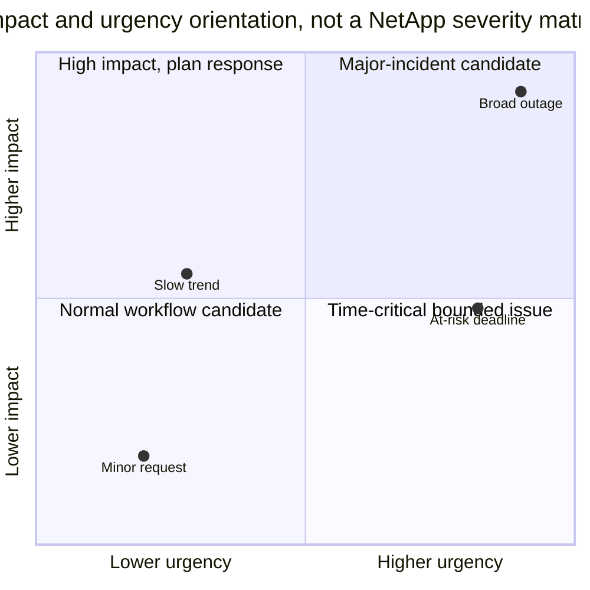

### 🔍 Plain-English deep-dive: severity is not emotional intensity

A loud caller can have a low-impact issue, while a quiet overnight replication failure can threaten the next recovery point. **Analogy:** a smoke detector's volume does not measure the size of the fire. **Why it matters:** classify from verified impact and policy, not pressure, title, blame, or technical novelty.

### Reassessment

Severity can rise or fall when scope, workaround, data risk, duration, or customer consequence changes. Record who authorized the change and why; do not silently relabel history.

---

## 3. Safety, integrity, and restoration define the mission

The incident objective is normally to protect people, data, security, and service, then restore an acceptable customer outcome. Root cause can continue after stability.

### Priority order

1. Immediate safety, security, or data-integrity threat.
2. Prevent spread and preserve recoverability.
3. Restore the highest-value bounded customer operation.
4. Validate service and data, not merely component health.
5. Preserve sufficient evidence without prolonging harm.
6. Continue diagnosis and prevention after stable handback.

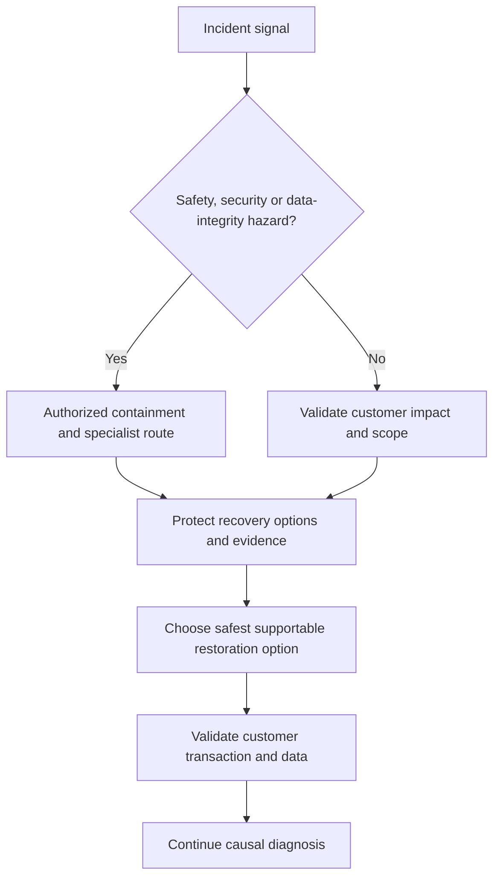

### Restoration principle

Prefer options that are authorized, supportable, reversible where possible, observable, bounded, and compatible with recovery. A familiar command is not automatically a safe action. The correct customer, incident, change, Support, security, or application owner controls live action.

---

## 4. Incident command roles and boundaries

One person may cover multiple roles in a small event, but the responsibilities must remain explicit.

| Role | Owns | Does not automatically own |
|---|---|---|
| Incident commander | Objective, role assignment, priorities, decisions, cadence, escalation, handback | Deepest technical diagnosis or customer change authority |
| Technical lead | Shared technical model, hypotheses, workstreams, test sequencing, technical read-back | Executive messaging or every vendor's actions |
| Communications lead | Approved updates, audience, cadence, consistency, claim limits | Cause declaration without technical/authority review |
| Scribe | Timeline, decisions, actions, owners, evidence links, attendance | Interpreting every technical artifact |
| Workstream lead | One bounded question/action, evidence, next checkpoint | Incident-wide command |
| Customer incident/change owner | Customer priorities, production decisions, risk acceptance | Vendor product defect determination |
| Support/vendor owner | Case progression and product expertise within scope | Customer business decision or other vendor's component |
| Security/privacy/legal role | Specialized governance when triggered | General technical command unless assigned |

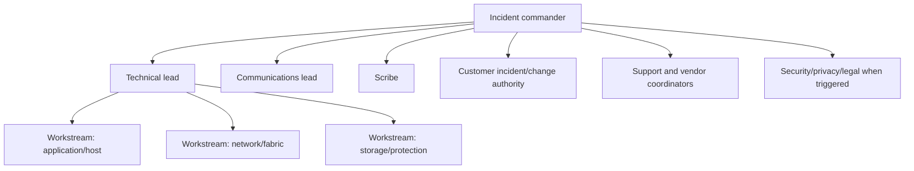

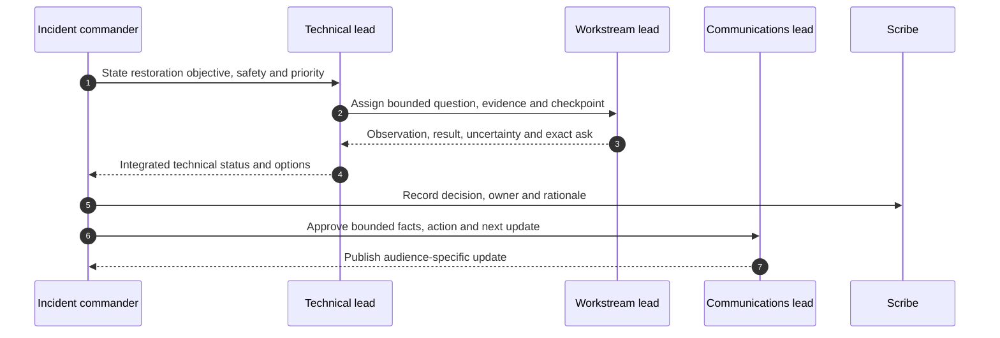

### 🔍 Plain-English deep-dive: command is coordination, not omniscience

The conductor does not play every instrument. The IC creates one tempo, objective, authority map, and decision rhythm so experts can work. **Why it matters:** the most senior or technically deep person is not automatically the best coordinator, and the IC must be free to see the whole response.

---

## 5. Bridge rules that reduce noise

### Opening script

> `This bridge is coordinating <verified impact>. <name/role> is incident commander, <role> technical lead, <role> communications lead, and <role> scribe. Safety and data protection come first; restoration is the current objective. State observations with source/time/scope, separate hypotheses, route changes through the authorized owner, and use the action log. Next internal read-back is <time>; next customer update is <time>.`

### Bridge rules

- One IC controls agenda, priorities, role changes, and read-backs.
- One technical model; workstreams report into the TL.
- Speak in facts, hypotheses, asks, actions, results, and blockers.
- Do not narrate every keystroke or paste restricted logs into broad chat.
- Every production action has owner, authorization, scope, expected result, stop/recovery criteria, and evidence.
- Keep the bridge small enough to decide; observers receive summaries.
- Mute side debates; move deep analysis to workstreams.
- Announce arrivals, departures, and ownership transfers.
- Scribe decisions and timestamps; recording requires explicit approval and policy compliance.
- Respect breaks and shift limits; fatigue is an operational risk.

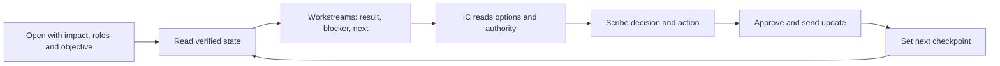

### Bridge anti-patterns

| Anti-pattern | Effect | Correction |
|---|---|---|
| Everyone joins one call | Noise and inhibited analysis | Small command bridge plus workstreams |
| Seniority decides cause | Premature closure | Predictions and evidence through TL |
| Customer hears raw speculation | Trust and action risk | Communications lead uses approved facts |
| Silent action | Conflicting changes and lost attribution | Pre-action read-back and action log |
| Endless status round | No decisions | Report result, blocker, next, ask |

---

## 6. First 15 minutes: establish control and protect options

Exact timing depends on detection and policy; `15/30/60` is an orientation, not a NetApp commitment.

### First-15 checklist

1. Acknowledge and validate the signal; identify source and contact.
2. Bound immediate business, data, security, and safety impact.
3. Declare/escalate under current policy and contract.
4. Name IC, TL, communications lead, and scribe.
5. Open approved bridge, action log, chronology, and evidence repository.
6. State restoration objective, safety constraints, and next update time.
7. Identify current changes and pause unrelated risky changes through authorized owners.
8. Preserve volatile evidence compatible with restoration.
9. Start a small number of high-information workstreams.
10. Send first bounded acknowledgment.

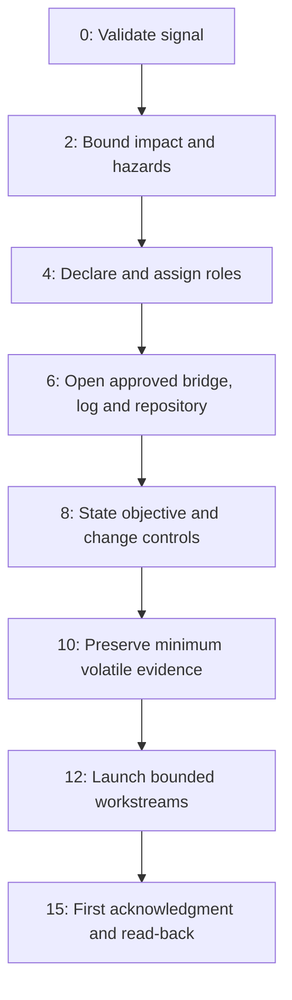

### First acknowledgment

> `We are investigating <verified impact and scope> beginning at <time/zone>. Incident command and technical workstreams are active. We are protecting <data/service objective> and assessing the safest restoration path. Cause is not yet established. Next update: <time/zone>.`

---

## 7. First 30 minutes: create a technical model and restoration options

### By approximately minute 30

- Confirm affected and unaffected controls.
- Build application-to-data dependency map.
- Establish clock quality and unified chronology.
- Record exact changes and deployment overlap.
- Create competing hypotheses and predictions.
- Open Support/vendor cases with impact and minimum evidence where appropriate.
- Identify restoration options, authority, prerequisites, and risk.
- Set internal and customer cadence.
- Assign one owner and next checkpoint per workstream.

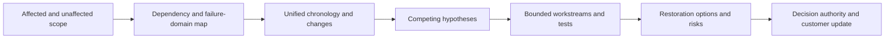

### Workstream card

| Field | Content |
|---|---|
| Question | One uncertainty or restoration task |
| Lead | Named role and backup |
| Scope | Exact service, object, path, time |
| Facts | Source-bounded observations |
| Hypotheses | Predictions and counterevidence |
| Action/test | Approval, safety, expected result |
| Result | Observation, interpretation, evidence link |
| Next/checkpoint | Action, owner, time, blocker/ask |

---

## 8. First 60 minutes: execute a controlled restoration strategy

By approximately minute 60, the response should have a coherent impact statement, role stability, evidence-backed technical model, active restoration option, communication rhythm, escalation posture, and relief plan. Cause may remain unknown.

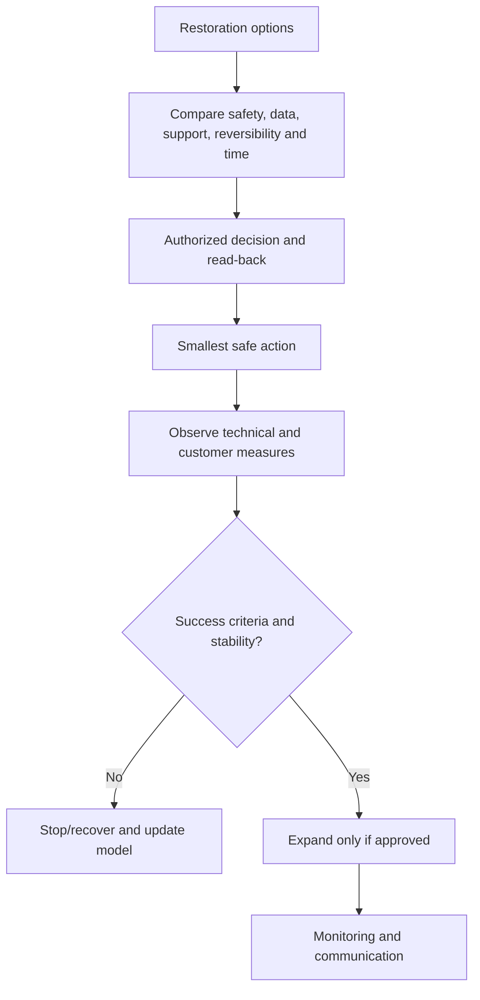

### First-hour review

- Is the customer impact still accurate?
- Does each workstream reduce uncertainty or restore service?
- Are changes serialized and attributable?
- Is the current action supportable and recoverable?
- Does the customer know what is known, unknown, happening, and next?
- Are vendors receiving exact asks rather than broad blame?
- When will each critical role rotate?

---

## 9. Workstreams, action log, and evidence discipline

Parallelism helps only when workstreams have different questions and do not alter shared state unknowingly.

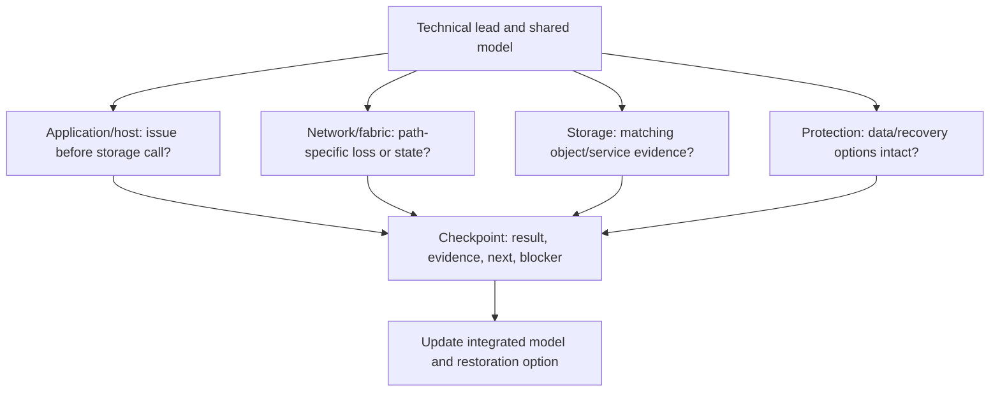

### Action-log fields

| Field | Purpose |
|---|---|
| ID/status | Stable tracking and state |
| Created/time zone | Chronology |
| Action/question | Exact work, not `investigate` |
| Owner/backup | Accountability and relief |
| Authority/change reference | Production control |
| Scope | Objects, population, duration |
| Expected result/stop | Pre-action reasoning |
| Start/end | Attribution |
| Result/evidence | Observed outcome and secure link |
| Decision/next | What changed and checkpoint |

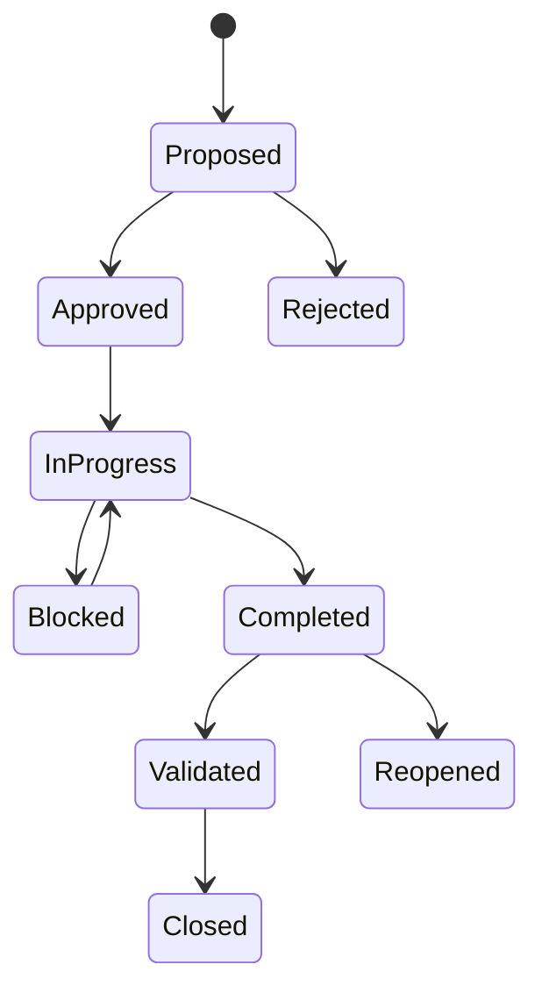

### Evidence rule

Preserve originals; share links, not uncontrolled copies. Every quoted fact carries object, source, timestamp, definition, and access class. Scribes record decisions, not sensitive payloads.

---

## 10. Communication cadence and audience design

Cadence is a promise about the next checkpoint, not a promise that new facts will exist. Send an update on time even when the update is `no material change` plus current action and next checkpoint.

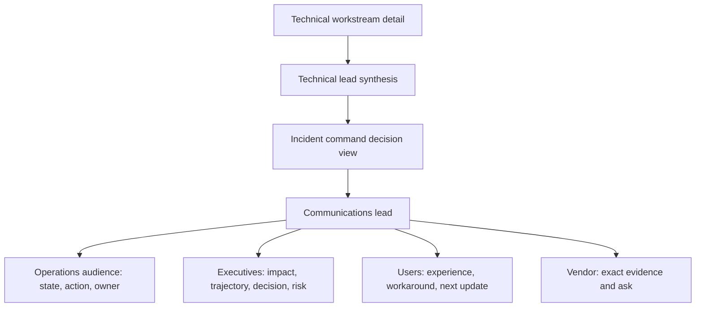

### Update anatomy

1. Timestamp and incident state.
2. Verified impact and trend.
3. Material change since last update.
4. What is known, unknown, and not claimed.
5. Current restoration action and owner.
6. Decision, risk, or customer ask.
7. Next checkpoint.

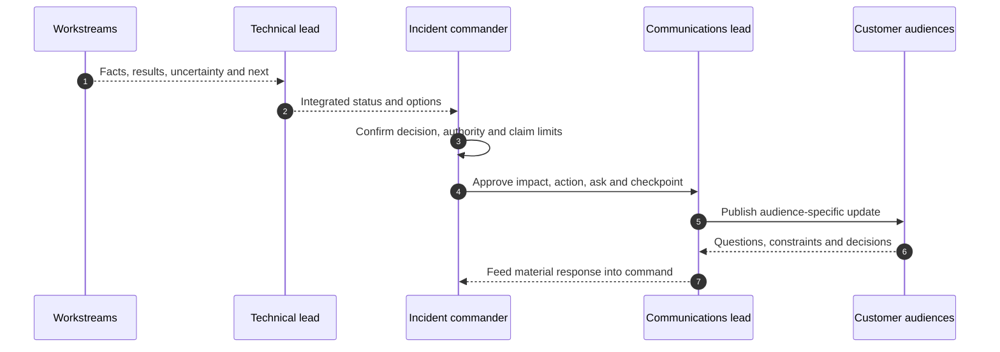

### Executive update example

> `As of 14:30 UTC, synthetic order processing remains unavailable for Site B; Site A and existing reads are normal. No data loss is evidenced. The team has isolated impact to new sessions through one dependency, but cause remains unconfirmed. The customer change owner approved a bounded failover test at 14:35 UTC with stop criteria. Business decision needed: authorize temporary manual intake if service is not stable by 15:00 UTC. Next update 14:45 UTC.`

### High-pressure language

| Avoid | Use |
|---|---|
| `Storage is definitely down` | `New writes to the named service are failing; layer cause is not established` |
| `No data loss` without proof | `We have no current evidence of data loss; integrity validation is in progress` |
| `Fixed` after one success | `Service recovered for tested transactions and is monitoring` |
| `Engineering is working on it` | Exact owner, question, evidence, and checkpoint |
| `ASAP` | Named time, time zone, dependency, and decision |

### 🔍 Plain-English deep-dive: certainty and calm are different

Calm communication does not mean pretending certainty. **Analogy:** a pilot can speak steadily while reporting limited visibility and a diversion. **Why it matters:** precise uncertainty builds more trust than confident speculation and gives decision-makers usable choices.

---

## 11. Change freeze, decision records, and restoration control

A **change freeze** is a temporary governance decision to pause unrelated or risky changes that could worsen impact or destroy attribution. It is not automatically absolute; an authorized emergency restoration change may be the safest option.

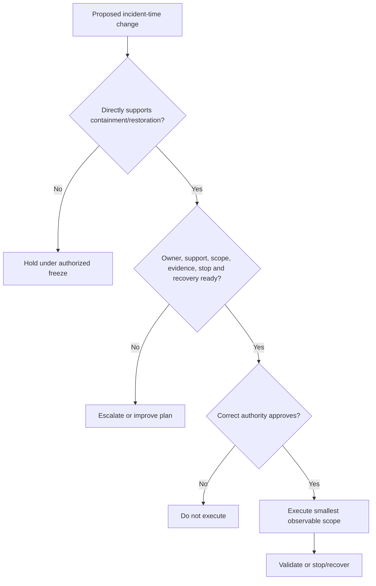

### Decision record

- Decision and timestamp/time zone.
- Decider and authority.
- Facts, source cutoff, and unknowns.
- Options and status quo.
- Safety, data, supportability, and customer tradeoffs.
- Selected scope and rationale.
- Expected result, monitoring, stop, and recovery.
- Communications and next checkpoint.

### No simultaneous blind changes

The IC and TL serialize changes that touch shared state or clearly label independent scopes. Multiple uncoordinated changes can restore service but erase cause and introduce hidden debt.

---

## 12. Vendor and Support escalation

Escalate to obtain expertise, authority, priority, resources, or product investigation. Escalation is not a threat and does not prove vendor fault.

### Minimum vendor package

- Business impact, severity under governing policy, and current state.
- Exact product/service, release, platform, topology, and entitlement identifiers through approved channels.
- UTC timeline, last known good, changes, and recovery actions.
- Reproduction/scope and affected/unaffected controls.
- Logs/traces/events/metrics with secure links and definitions.
- Hypotheses, contradictions, and actions/results.
- Exact ask: interpret signature, validate procedure, engage specialist, assess defect, or approve support path.
- Customer/incident owner, contact method, cadence, and next decision time.

```mermaid
flowchart LR
    IMP[Impact and incident context] --> PKG[Secure evidence package]
    PKG --> ASK[Exact expertise or decision ask]
    ASK --> CASE[Authorized Support/vendor channel]
    CASE --> OWNER[Named vendor owner and checkpoint]
    OWNER --> RESULT[Finding, request, procedure or escalation]
    RESULT --> TL[Technical lead integrates; does not copy blindly]
    TL --> IC[Incident decision and customer communication]
```

### Multi-vendor bridge

Use one customer chronology and boundary map. Each vendor receives only authorized evidence and an exact question about its component/interface. Do not share another vendor's restricted artifact or make one vendor defend a hypothesis it did not state.

---

## 13. Time zones, handoffs, and fatigue

A handoff transfers a live mental model, not merely a ticket number.

### Handoff packet

| Field | Content |
|---|---|
| Impact/state | Current customer experience, trend, workaround |
| Timeline | Key events in UTC plus local business times |
| Roles | IC, TL, communications, scribe, workstreams, backups |
| Facts/unknowns | Verified evidence and contradictions |
| Hypotheses | Predictions, confidence, tests/results |
| Changes/decisions | What happened, authority, result, recovery options |
| Active actions | Owners, checkpoints, blockers, exact asks |
| Communication | Audiences, last update, next cadence, commitments |
| Safety/privacy | Restricted evidence, access, legal/security controls |
| Watch conditions | Reopen triggers, likely next decisions |

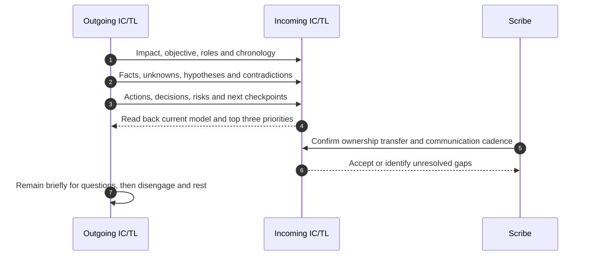

### Fatigue controls

- Predefine shift length, relief, backup, and overlap.
- Rotate high-cognitive-load roles before quality declines.
- Require read-back after long response or role change.
- Use checklists and decision logs; memory degrades under fatigue.
- Schedule hydration, food, medication, and rest without stigma.
- Stop relying on the only person with access or context; build backups.
- Treat irritability, repeated mistakes, tunnel vision, and missed updates as risk signals.

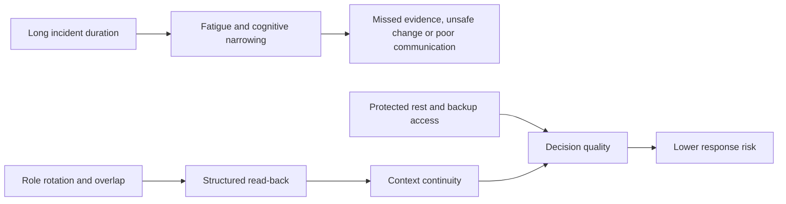

### 🔍 Plain-English deep-dive: rest is redundancy

Two controllers are not resilient if one carries all work until it fails. People are similar: a rested replacement with a strong handoff is an operational control, not a sign of low commitment. **Why it matters:** heroic exhaustion creates common-mode decision risk.

---

## 14. Recovery, validation, monitoring, and handback

Component green is not customer recovery. Validate the complete customer operation, data integrity, performance, session/path behavior, protection, and observability.

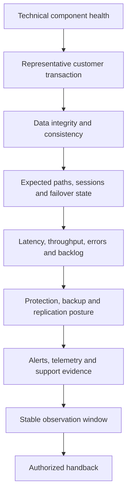

### Recovery criteria

- Defined user/business transactions succeed for affected populations.
- Backlog drains within a measured bound.
- Data consistency/integrity checks pass under application ownership.
- Temporary mitigations and degraded redundancy are documented.
- Protection objectives and recovery points are re-evaluated.
- Monitoring covers the trigger and failure mode.
- Customer confirms acceptable service; the authorized owner accepts residual risk.
- Next update, monitoring duration, and reopen triggers are explicit.

### Handback states

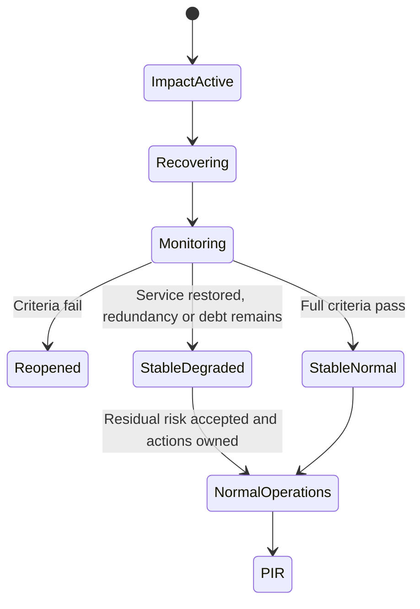

Never close merely because the bridge is tired or one test passed.

---

## 15. PIR and prevention tracking

A PIR reconstructs what happened, why impact occurred, how the response behaved, and which changes will reduce recurrence or consequence.

### PIR sections

- Incident definition, impact, duration, and recovery.
- Timeline with source and clock quality.
- Technical mechanism, causal conditions, and contributors.
- Detection, declaration, escalation, and communication performance.
- What helped, failed, or created delay.
- Decision and change analysis.
- Cause-linked prevention, detection, containment, recovery, and process actions.
- Owners, dates, dependencies, status, effectiveness test, and residual risk.

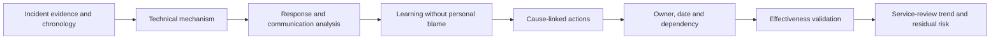

### Prevention portfolio

| Action class | Example orientation | Effectiveness evidence |
|---|---|---|
| Prevent | Remove common dependency | Failure-domain test |
| Detect | Alert on exact trigger/state | Synthetic signal caught within target |
| Limit | Reduce blast radius | Canary/segmentation exercise |
| Recover | Improve runbook/automation | Timed recovery test |
| Communicate | Improve role/update template | Simulation rubric and customer feedback |
| Govern | Fix ownership/change collision | Audit of next changes |

Action completion is not effectiveness. A document uploaded is complete; a timed exercise showing responders use it correctly is evidence of effectiveness.

---

## 16. Fully synthetic sanitized scenario(s)

### Scenario A: new SMB sessions fail across one site

**Impact:** New synthetic legal-workflow sessions fail at Site East; existing sessions and Site West continue. No data-loss evidence exists.

**First 15:** Roles are assigned; an unrelated maintenance change is paused; identity/DNS/time, network path, SMB service, and customer validation workstreams open.

```mermaid
flowchart LR
    NEW[New session] --> DNS[DNS and service name]
    DNS --> AUTH[AD, time, Kerberos and SPN]
    AUTH --> TCP[TCP and SMB negotiate]
    TCP --> SHARE[Tree connect and permissions]
    EXIST[Existing session] -.bypasses some new-session dependencies.-> SHARE
```

| Workstream | Competing hypotheses | Decisive evidence |
|---|---|---|
| Identity | Site DC reachability, time skew, SPN issue | Exact auth mechanism/error and DC/time evidence |
| Network | New flow blocked, one route asymmetric | Both-direction flow and firewall state |
| Storage service | New negotiate/session failure | Matching SMB server events and unaffected controls |
| Customer | Name alias changed | Client-resolved name/address and change record |

**Synthetic result:** Site East resolves an outdated service alias whose SPN does not match the intended service. The customer DNS owner performs an authorized correction. Representative new sessions recover; existing sessions, permissions, performance, and failover are validated. Cause is not described as `storage down`.

### Scenario B: SAN paths degrade during database peak

**Impact:** A synthetic database remains online but latency rises and one of four paths is lost. Data integrity is not shown to be impaired.

```mermaid
flowchart TD
    HOST[Database host] --> P1[Fabric A path 1]
    HOST --> P2[Fabric A path 2]
    HOST --> P3[Fabric B path 1]
    HOST --> P4[Fabric B path 2 lost]
    P1 --> TARGET[Mapped LUN]
    P2 --> TARGET
    P3 --> TARGET
    P4 -.failure.-> TARGET
    COMMON[Shared host adapter or configuration?] -.test.-> HOST
```

**Command decision:** Do not perform broad path rescans or storage failover from speculation. Preserve host/fabric/target evidence, reduce optional batch load under customer authority, and engage host/fabric/storage owners with one chronology.

**Synthetic result:** A fabric optic error aligns with path loss, while remaining paths carry increased queue. Optic replacement remains a qualified hardware/vendor action outside this guide. Service stabilizes after approved workload reduction; degraded redundancy remains explicitly open until qualified repair and path-failure validation.

### Scenario C: replication lag threatens RPO before a forecast storm

**Impact:** The source service is healthy, but the newest verified destination recovery point is older than the recovery-point objective (RPO); weather raises urgency.

```mermaid
flowchart LR
    SRC[Source change rate] --> REL[Replication relationship]
    REL --> PATH[Intercluster network]
    PATH --> DEST[Destination capacity and state]
    DEST --> RP[Verified recovery point age]
    STORM[Business deadline and storm] --> PRI[Priority rises]
    RP --> PRI
```

**Communication:** `Primary service is available. Protection posture is degraded: the newest verified destination point is <synthetic age>, exceeding the stated RPO. No failover is being initiated. Workstreams are assessing path service, relationship state, capacity, and alternate recovery controls.`

**Synthetic result:** Destination capacity threshold and a failed update align. Customer storage and continuity owners approve capacity remediation through their current procedure and validate a new point. The incident remains open through recovery-test evidence; a scheduled policy alone is not proof.

### Scenario D: environmental alert and HA uncertainty

**Impact:** A synthetic node reports repeated temperature alerts; service remains available, but redundancy and hardware risk are uncertain.

```mermaid
flowchart TD
    ALERT[Environmental alert] --> VERIFY[Exact sensor, trend and platform evidence]
    VERIFY --> FAC[Facility cooling and inlet conditions]
    VERIFY --> HW[Controller, fan and shelf evidence]
    HW --> HA[HA readiness and partner capacity]
    FAC --> DEC[Customer/facility/Support decision]
    HA --> DEC
    DEC --> SAFE[Safe containment or qualified service]
```

**Boundary:** The team does not improvise a fan replacement, forced takeover, or shutdown. The IC protects service, engages qualified hardware Support and facilities, checks recovery readiness, freezes unrelated work, and communicates the distinction between current availability and rising hardware risk.

---

## 17. Experience transfer and honesty and JD Mapping

```mermaid
flowchart LR
    CRIT[Enterprise critical-situation ownership] --> COMMAND[Impact, roles, cadence and restoration]
    SUP[Support Escalation Engineering] --> TECH[Evidence workstreams and escalation]
    COMM[Customer/executive communication] --> UPDATE[Audience-safe updates]
    TZ[Global partner and time-zone work] --> HAND[Handoff and fatigue controls]
    COMMAND --> TRANS[Transferable incident method]
    TECH --> TRANS
    UPDATE --> TRANS
    HAND --> TRANS
    TRANS --> GAP[Production NetApp incident command remains a gap]
```

| JD responsibility | Capability | Honest evidence/boundary |
|---|---|---|
| High-pressure customer situations | Command, first-15/30/60, cadence | enterprise critical-situation evidence; not NetApp IC claim |
| Cross-functional work | TL/workstreams/decision logs | Microsoft Product/Engineering and partner work |
| Risk and stability | Safety, restoration, degraded-state tracking | Method and synthetic cases only for ONTAP |
| Customer communication | Executive/technical/user updates | Production Microsoft communication transfers |
| Time-zone alignment | Structured relief and handoff | Global support experience; no NetApp staffing claim |
| Preventative remediation | PIR actions and effectiveness | RCA/action follow-through method |

### Honest interview wording

> `In enterprise incidents I have owned high-pressure coordination, evidence, engineering engagement, and customer communication. My method is to establish command roles, protect data and restoration, separate technical workstreams, keep one chronology and action log, communicate verified impact and uncertainty on cadence, rotate people safely, and validate the customer transaction before handback. I have not commanded a production NetApp incident, so exact NetApp Support, product, and customer procedures would come from authorized owners.`

---

## 18. Labs, drills, self-test, and mock bridge

### Mock major-incident exercise

```mermaid
flowchart LR
    INJ[Inject synthetic impact] --> DECL[Declare and assign roles]
    DECL --> F15[Run first 15 minutes]
    F15 --> F30[Build model and options by 30]
    F30 --> F60[Execute controlled strategy by 60]
    F60 --> SHIFT[Perform live handoff]
    SHIFT --> REC[Validate recovery and handback]
    REC --> PIR[Write PIR and action portfolio]
```

### Exercise injects

1. Initial report exaggerates scope.
2. One key clock is seven minutes fast.
3. A senior attendee declares storage cause without matching evidence.
4. Two teams propose simultaneous changes.
5. A vendor requests a restricted log in open chat.
6. Executive asks whether data is lost before integrity checks finish.
7. A new symptom appears at minute 40.
8. TL has been awake too long and resists relief.
9. Component health turns green while transactions still fail.
10. A temporary workaround leaves protection degraded.

### Drills

- **First message:** Write a 60-word acknowledgment with impact, command, action, uncertainty, and checkpoint.
- **Executive update:** Explain impact, trajectory, decision, and residual risk in 90 seconds.
- **Bridge interruption:** Redirect speculation into a hypothesis workstream respectfully.
- **Change collision:** Compare two restoration changes and select/sequence through authority.
- **Handoff:** Incoming IC reads back top three priorities and risks without seeing earlier chat.
- **PIR:** Convert `human error` into system conditions and measurable controls.

### Self-test

1. Distinguish severity and priority.
2. Explain IC, TL, communications, scribe, workstream, customer, and Support boundaries.
3. State the first-15/30/60 objectives.
4. Run a bridge opening and action read-back.
5. Write technical, executive, and user updates from one fact set.
6. Explain change freeze and emergency-change gating.
7. Build a secure vendor escalation package.
8. Perform a fatigue-aware follow-the-sun handoff.
9. Define recovery and degraded-state criteria.
10. Build a PIR with cause-linked effectiveness actions.

### Mock-bridge pass checklist

- [ ] Severity uses verified impact and current policy, not emotion.
- [ ] Priority includes safety, data, deadline, dependency, and displaced work.
- [ ] IC, TL, communications, scribe, and workstream roles are explicit.
- [ ] Bridge rules and decision authority are read aloud.
- [ ] First-15/30/60 outputs are visible.
- [ ] Restoration outranks root-cause perfection during active impact.
- [ ] Workstreams have bounded questions and checkpoints.
- [ ] Every live action has authority, scope, expected result, stop, recovery, and evidence.
- [ ] Action log and chronology remain current.
- [ ] Updates distinguish fact, hypothesis, action, ask, and next time.
- [ ] Vendor escalation has secure evidence and an exact ask.
- [ ] Handoff includes read-back, ownership transfer, and relief.
- [ ] Customer transaction, data, performance, protection, and monitoring validate recovery.
- [ ] PIR actions map to cause/contributors and test effectiveness.
- [ ] Every scenario and artifact is fully synthetic and sanitized.
- [ ] No NetApp incident role, process, commitment, or outcome is claimed.

---

## 19. Official and Public Source Anchors

**Date checked: 2026-08-24.** Public sources anchor general incident, Support, ONTAP, and continuity concepts. Current customer policy, contract, authorized Support guidance, and qualified technical owners control live response.

| Topic | Official/public source | Bounded use |
|---|---|---|
| Incident response | [NIST SP 800-61 Rev. 3](https://csrc.nist.gov/pubs/sp/800/61/r3/final) | Official public incident-response recommendations; not a NetApp incident policy |
| Service management | [ITIL information from PeopleCert](https://www.peoplecert.org/browse-certifications/it-governance-and-service-management/ITIL-1) | Official framework-owner context; no NetApp severity/cadence inferred |
| Incident command orientation | [FEMA National Incident Management System](https://www.fema.gov/emergency-managers/nims) | Public command/coordination orientation; not a technology runbook |
| NetApp support context | [NetApp Support Services](https://www.netapp.com/services/support/) | Public service context; exact entitlement, severity, contacts, and response require confirmation |
| ONTAP monitoring | [ONTAP event, performance, and health monitoring](https://docs.netapp.com/us-en/ontap/event-performance-monitoring/) | Public evidence-source navigation; exact release semantics required |
| HA operations context | [ONTAP HA pair management](https://docs.netapp.com/us-en/ontap/high-availability/) | Current public takeover/giveback context; no procedure prescribed here |
| Data protection/DR | [ONTAP data protection and disaster recovery](https://docs.netapp.com/us-en/ontap/data-protection-disaster-recovery/) | Public protection/recovery navigation; exact relationship and runbook must be verified |
| MetroCluster operations | [ONTAP MetroCluster documentation](https://docs.netapp.com/us-en/ontap-metrocluster/) | Exact current configuration/recovery documentation entry; qualified procedure required |
| Blameless learning | [Google SRE: Postmortem Culture](https://sre.google/sre-book/postmortem-culture/) | Public learning orientation; not NetApp policy |

### Source-use discipline

- Confirm the governing customer and organizational severity/incident policy at declaration.
- Verify exact Support entitlement and route through approved customer/account channels.
- Use current release/platform procedures for every technical action; do not act from this guide.
- Record source date and evidence cutoff in updates and PIRs.
- Keep security, privacy, legal, safety, and data-integrity incidents in their specialized authorized processes.

---

## Likely Interview Questions

### Q1. How do you distinguish severity from priority in a major incident?

> **Model answer:** `Severity classifies verified impact and urgency under the current policy or contract. Priority determines the current work sequence using severity plus safety, data risk, deadlines, dependencies, readiness and displaced work. I reassess both when scope, workaround, trajectory or consequence changes and record the authority and rationale.`

### Q2. Which incident roles do you establish and why?

> **Model answer:** `I name an incident commander for objective, priorities and decisions; a technical lead for the shared model and workstreams; a communications lead for approved audience-specific updates; and a scribe for chronology, decisions, actions and evidence links. Workstream leads answer bounded questions, while customer, Support, security and change owners retain their actual authority.`

### Q3. What do you do in the first 15, 30, and 60 minutes?

> **Model answer:** `By 15 I validate impact, declare appropriately, assign roles, open approved coordination and logs, protect data and evidence, pause unrelated risk and acknowledge with a checkpoint. By 30 I have scope, topology, timeline, hypotheses, workstreams, Support/vendor engagement and restoration options. By 60 I aim for a controlled restoration strategy, decision rhythm, communication cadence and relief plan, even if cause is unresolved.`

### Q4. How do you run an effective incident bridge?

> **Model answer:** `I open with impact, objective, roles, safety, decision authority and cadence. Workstreams report facts, result, blocker, next and ask; deep analysis stays off the command bridge. Every change gets a read-back and action-log entry. The communications lead publishes approved facts and uncertainty, and the IC keeps the forum small enough to decide.`

### Q5. How do you communicate to executives under pressure?

> **Model answer:** `I lead with timestamped impact and trajectory, material change, what is known and unknown, current restoration action, exact decision or risk, owner and next checkpoint. I avoid raw logs, unsupported cause, and promises outside authority. A calm tone never substitutes for explicit uncertainty.`

### Q6. How do you manage changes and vendors during an incident?

> **Model answer:** `I use an authorized freeze to hold unrelated risk while allowing qualified emergency restoration changes. Each action has supportability, owner, scope, expected result, stop and recovery criteria. Vendor escalation contains impact, exact environment, chronology, secure evidence, actions and a precise ask; it seeks expertise or priority without declaring blame.`

### Q7. How do you hand off and close a long-running incident?

> **Model answer:** `The outgoing team transfers impact, chronology, roles, facts, hypotheses, decisions, actions, communications, risks and watch conditions; the incoming team reads back the model and accepts ownership. Closure requires customer transactions, data, performance, paths, protection and monitoring to pass through a stability window, with degraded state and residual risk explicitly owned.`

### Q8. What production experience transfers, and what remains your NetApp gap?

> **Model answer:** `enterprise critical situation and escalation work gives me production experience in command rhythm, cross-team evidence, restoration focus, customer and executive updates, Engineering engagement, handoffs and follow-through. I have not commanded or represented a production NetApp incident, so NetApp roles, severity, Support routes and technical actions must come from current authorized owners and sources.`

---

## 30-Second Memory Hooks

- **Major incident:** Temporary command mode for impact, restoration, and communication.
- **Severity:** How bad and urgent under policy; **priority:** what goes first now.
- **IC:** Owns the orchestra, not every instrument.
- **TL:** One technical model, many bounded workstreams.
- **Comms:** Facts + uncertainty + action + ask + next time.
- **Scribe:** Timeline, decision, action, evidence link, owner.
- **First 15:** Impact, roles, safety, bridge, freeze, evidence, acknowledgment.
- **First 30:** Scope, map, timeline, hypotheses, workstreams, options.
- **First 60:** Controlled strategy, cadence, escalation, relief.
- **Bridge:** Decide and synchronize; deep work happens in lanes.
- **Change freeze:** Pause unrelated risk, not all restoration.
- **Vendor escalation:** Secure evidence plus an exact ask, never blame.
- **Handoff:** Mental model + read-back + ownership transfer.
- **Fatigue:** Rest is human redundancy.
- **Recovery:** Customer transaction and data, not a green component.
- **PIR:** Mechanism + response learning + effective prevention.
- **Experience boundary:** enterprise incident leadership transfers; NetApp command does not.

---

## Completion Checklist

- [ ] Classify severity from verified impact and governing policy.
- [ ] Prioritize with safety, data, urgency, dependencies, readiness, and displaced work.
- [ ] Assign IC, TL, communications lead, scribe, workstreams, and backups.
- [ ] State bridge objective, rules, authority, cadence, and privacy controls.
- [ ] Execute and document first-15/30/60 outputs.
- [ ] Protect safety, security, data integrity, and recovery options.
- [ ] Keep restoration ahead of perfect root cause during active impact.
- [ ] Use bounded workstreams with evidence, next step, blocker, and checkpoint.
- [ ] Maintain one UTC chronology, action log, and secure evidence repository.
- [ ] Serialize shared-state changes and record decisions before execution.
- [ ] Communicate facts, uncertainty, action, ask, and next update by audience.
- [ ] Build secure vendor packages with exact product/context/evidence/ask.
- [ ] Use structured, fatigue-aware time-zone handoffs and protected relief.
- [ ] Validate customer transaction, data, performance, path, protection, and monitoring.
- [ ] Record degraded state, workaround debt, residual risk, and reopen triggers.
- [ ] Complete a PIR with cause-linked owners, dates, and effectiveness tests.
- [ ] Run all synthetic scenarios, mock bridge, drills, and self-test.
- [ ] Answer exact Q1-Q8 aloud and state the no-production-NetApp boundary.
- [ ] Revalidate current policies, contracts, product sources, and authorities for live work.

---

*Next suggested section:* [Part 73 - Escalation Packages, Support Boundaries, and Engineering Engagement](Part-73-escalation-packages-engineering-engagement.md)