# Part 73 - Escalation Packages, Support Boundaries, and Engineering Engagement

> **Section goal:** Build escalation packages that let the receiving team act without repeating discovery, while preserving customer, Support, Engineering, product, entitlement, privacy, and change boundaries. By the end, you should be able to package impact, scope, timeline, topology, configuration, versions, reproduction, logs, traces, events, metrics, changes, actions, hypotheses, and an exact ask; select a valid severity and route; use secure transfer; distinguish Support progression from Engineering defect engagement; find or link duplicate defects safely; maintain case quality and updates; know when not to escalate; and turn rejection into a better package rather than blame.

Covers index item **73** and maps directly to job-description responsibilities for high-quality technical analysis, Support and Engineering collaboration, complex-case escalation, customer communication, risk mitigation, defect and lifecycle reasoning, and cross-functional ownership.

**Explicit nonclaim:** You have not opened, escalated, prioritized, approved, or represented a production NetApp Support case or Engineering defect investigation, and you have no claimed access to NetApp-internal case, BURT, defect, severity, or escalation systems.

**Privacy/access:** Escalation packages can contain customer identity, serials, topology, addresses, file paths, packet payloads, logs, credentials, personal data, vulnerabilities, contracts, entitlement, defect details, and vendor-restricted evidence. Use purpose-limited authorized collection, minimum necessary data, redaction, approved secure transfer, need-to-know access, retention controls, and sanitized customer-facing summaries. Never use public links, personal storage, broad chat, or a portfolio for customer or gated evidence.

**Synthetic-evidence rule:** Every customer, system, version, identifier, case, entitlement, defect, symptom, trigger, log, trace, metric, action, owner, timestamp, response, rejection, and outcome below is fictional and sanitized. No scenario represents a real NetApp Support workflow, Engineering gate, defect record, severity decision, service commitment, or customer result.

**Version/current source caveat:** Products, releases, telemetry, support services, entitlement, severity policies, case fields, escalation routes, defect visibility, ownership, and Engineering requirements change. A **current-source check** means confirming the exact current customer contract and support route, product/release documentation, authorized case guidance, owner, evidence requirement, and source date before opening or escalating live work.

This Part provides a generic quality model, not a NetApp internal Support handbook, entitlement interpretation, severity matrix, Engineering-engagement criterion, escalation path, defect process, response commitment, or permission to upload data.

> **No-production-NetApp boundary:** Your factual strengths are support escalation engineering, enterprise case ownership, critical-situation handling, diagnostic package creation, trace/log analysis, Product and Engineering engagement, defect reproduction, fix validation, customer updates, and partner support. Your exact nonclaim is: **you have not created, escalated, routed, or owned a production NetApp Support or Engineering package.**

---

## 1. Escalation is a transfer of a bounded problem and ask

An **escalation** asks a receiving authority or expert to remove a specific blocker: priority, expertise, product investigation, decision, resource, or scope resolution.

| Term | Plain meaning | Analogy | Why it matters |
|---|---|---|---|
| **Case** | Governed record of a support request and progression | Patient chart | Preserves impact, evidence, actions, and ownership |
| **Entitlement** | Contractual right to defined support services | Insurance coverage | Determines available route/scope, not technical cause |
| **Severity** | Impact/urgency classification under current policy | Triage category | Must reflect evidence and customer state |
| **Escalation package** | Minimal complete context needed for action | Well-labeled emergency referral | Reduces repeated discovery and unsafe assumptions |
| **Reproduction** | Repeatable steps/conditions that manifest a symptom | Test track reproducing a vehicle fault | Helps isolate mechanism and validate a fix |
| **Signature** | Distinctive error, event, stack, state, or pattern | Fingerprint | Connects cases only when scope and trigger also match |
| **Exact ask** | Specific expertise, decision, interpretation, or action requested | Destination on a parcel | Prevents vague `please investigate` handoffs |
| **Duplicate defect** | Same underlying tracked product issue as another report | Two reports of one broken component | Consolidates evidence without erasing customer ownership |

```mermaid
flowchart LR
    NEED[Blocked outcome or missing expertise] --> QUAL[Qualify impact, route and boundary]
    QUAL --> PACK[Build minimum complete package]
    PACK --> REVIEW[Privacy, technical and ownership review]
    REVIEW --> SEND[Secure submission to authorized route]
    SEND --> ACCEPT[Acceptance, clarification or rejection]
    ACCEPT --> WORK[Owned investigation or decision]
    WORK --> UPDATE[Customer/case updates and new evidence]
    UPDATE --> VALID[Resolution, validation and residual risk]
```

### Escalation quality equation

> **Actionable escalation = verified impact + reproducible context + decisive evidence + bounded uncertainty + exact ask + accepted ownership.**

Volume is not quality. A 10 GB archive without object/time/index may be less useful than a small trace tied to one failed operation.

---

## 2. The minimum evidence package

Every package should answer the receiving team's likely first questions without making unsupported claims.

### Required package fields

| Field | Required content |
|---|---|
| Impact | Business/user/data/service consequence, current state, workaround |
| Scope | Affected/unaffected populations, operations, objects, paths, sites |
| Timeline | Last known good, onset, peaks, changes, actions, recovery in UTC |
| Topology | Application-to-host-to-network/fabric-to-storage/protection map |
| Configuration | Material settings, feature state, protocol/security context |
| Versions | Exact product/build/platform/host/driver/firmware/switch/app recipe |
| Reproduction | Preconditions, steps, expected/actual, frequency, controls, safety |
| Logs/traces/events | Original authorized artifacts, indexes, clocks, definitions |
| Metrics | Object, population, units, interval, baseline, gaps, aggregation |
| Changes | Planned/automatic/workload/environmental changes across teams |
| Actions tried | Who did what, authority, time, result, rollback/recovery |
| Hypotheses | Mechanism, predictions, support/challenge, confidence, unknowns |
| Exact ask | Decision/expertise/interpretation required and deadline/context |
| Ownership | Customer, case, workstream, data, change, and next-checkpoint owners |

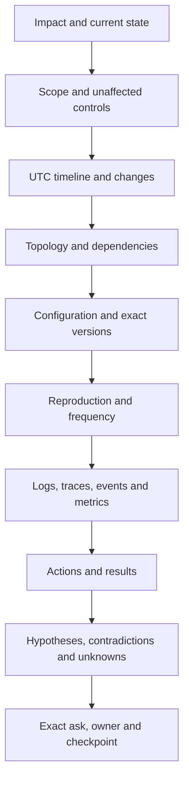

### Package header

> `Request: <exact ask>. Impact: <bounded current effect>. Scope: <affected/unaffected>. Product/configuration: <exact recipe>. Onset: <UTC>. Reproduction/signature: <summary>. Current hypotheses: <ranked, uncertainty>. Evidence index: <secure link>. Customer decision deadline/next checkpoint: <time>.`

### 🔍 Plain-English deep-dive: minimum complete is not minimal effort

Packing for a mountain climb means carrying every critical item but not three wardrobes. An escalation package similarly includes everything required to make the next decision, indexed and scoped, while excluding unrelated sensitive bulk. **Why it matters:** missing context delays action; excessive unindexed data hides the signal and increases privacy exposure.

---

## 3. Impact, scope, and severity must agree

Severity is grounded in current impact and governing policy. The package must not claim a broad outage if only a test host fails, nor hide a protection or integrity risk because user traffic remains available.

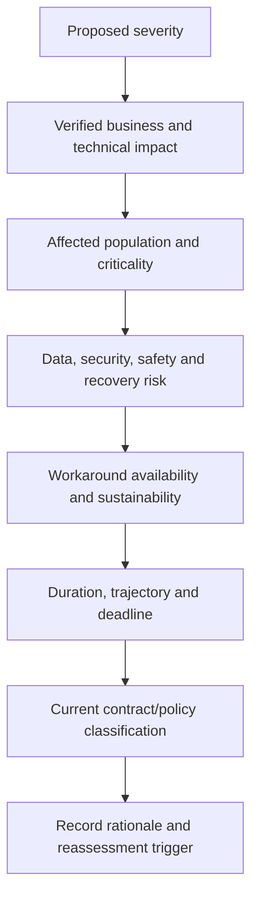

### Scope matrix

| Dimension | Affected | Unaffected control | Unknown |
|---|---|---|---|
| Users/sites | Site East new sessions | Site West, existing sessions | Remote contractors |
| Operations | Create/write | Read/list | Rename/lock recovery |
| Objects | One synthetic SVM/share | Control share | Other aliases |
| Paths | Fabric B target path | Fabric A paths | Alternate host group |
| Time | 14:02-14:18 UTC | Before 14:02 | Clock drift on one host |

### Severity corrections

If evidence changes, update severity through the authorized process and explain the new impact. Do not preserve an inflated severity as leverage or lower it merely because a temporary workaround hides customer pain.

---

## 4. Topology and configuration make evidence interpretable

A receiving engineer cannot interpret a timeout without knowing the path, identities, ownership, redundancy, and exact recipe.

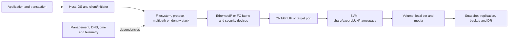

### Version recipe

Capture exact values rather than `latest`, `9.x`, `Windows`, or `supported`:

- Product and complete release/build/patch.
- Platform/model and relevant adapter/port/shelf/drive firmware.
- Protocol and negotiated version/dialect/security mode.
- Host OS/kernel/hypervisor and application version.
- Host Utilities, multipath/device handler, adapter model, driver, firmware.
- Switch model/OS, zoning/VLAN/MTU/routing and path topology.
- Feature configuration and recent changes.
- Current IMT/HWU/application/vendor evidence where authorized.

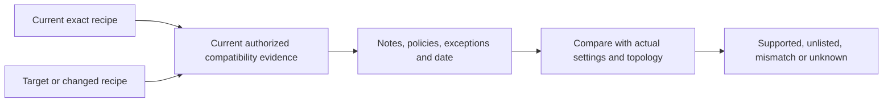

No guide table can certify a live recipe. Use current official and authorized tools.

---

## 5. Timeline and change ledger

An escalation timeline should show sequence, not just a prose story.

| UTC time | Source/clock quality | Observation/action | Owner | Interpretation boundary |
|---|---|---|---|---|
| 13:55 | Synthetic app, synchronized | Last successful control transaction | App owner | Last observed good, not guaranteed system-wide |
| 14:02 | Host event, +20 ms offset | First matching timeout | Host owner | Client symptom |
| 14:03 | Change system | Driver rollout reaches host group | Change owner | Temporal candidate, not cause |
| 14:05 | Storage event | No matching target-port error | Storage owner | Challenges one target hypothesis only |
| 14:14 | Incident log | Rollout paused | Incident owner | Prevention of further exposure |

```mermaid
timeline
    title Synthetic escalation chronology in UTC
    13:55 : Last matching success
    14:02 : First timeout signature
    14:03 : Host change reaches affected group
    14:05 : Storage control remains normal
    14:10 : Reproduction succeeds on changed host only
    14:14 : Rollout paused
    14:20 : Escalation package reviewed and sent
```

### Change categories

- Planned deployments and maintenance.
- Automatic updates, certificate/key rotation, policy refresh, failover.
- Workload volume, concurrency, data distribution, or schedule changes.
- Network/fabric, DNS, time, identity, security, and proxy changes.
- Hardware/environmental and power/cooling events.
- Support, lifecycle, capacity, and entitlement changes.

`No storage changes` does not mean `no relevant changes`.

---

## 6. Reproduction and signature quality

A reproduction must be safe, bounded, and explicit about expected and actual results.

### Reproduction card

| Field | Content |
|---|---|
| Preconditions | Exact version/config/state/data and authorization |
| Steps | Smallest sequence, numbered and deterministic where possible |
| Expected | Observable correct result and source |
| Actual | Exact error/state/metric with timestamp |
| Frequency | Attempts, failures, intermittency, distribution |
| Controls | Similar healthy recipe/path/object |
| Variables | What changed and what remained fixed |
| Safety | Synthetic/lab first, stop criteria, data/privacy/recovery |
| Artifacts | Trace/log/event IDs aligned to one attempt |

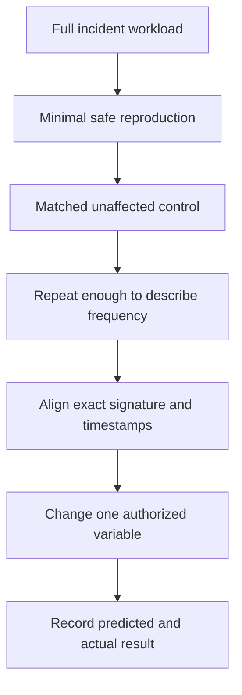

### Signature is necessary but not sufficient

Matching error text may come from different mechanisms; one defect can produce several symptoms. Match product/release, trigger, configuration, object, temporal pattern, stack/event/state, and recovery behavior.

### 🔍 Plain-English deep-dive: a symptom is a postal code, not a house number

`Timeout` narrows the neighborhood but does not identify the house. The exact stage, direction, path, operation, state, and correlated evidence identify the mechanism. **Why it matters:** weak signatures create false duplicate defects and wrong workarounds.

---

## 7. Logs, traces, events, and metrics need an index

### Evidence index

| ID | Artifact | Object/time | Why collected | Decisive location | Privacy/access | Integrity/provenance |
|---|---|---|---|---|---|---|
| E01 | Synthetic client trace | Host H3, attempt A7, 14:09 UTC | Determine failure stage | Frame/event 812, timeout after request | Synthetic | Original retained, parser version recorded |
| E02 | Synthetic server event | SVM S1, 14:08-14:10 | Match request receipt | No matching request ID | Synthetic | Export timestamp recorded |
| E03 | Synthetic path metric | Fabric B, one-minute bins | Test path hypothesis | Error delta at 14:09 | Synthetic | Unit/counter definition included |

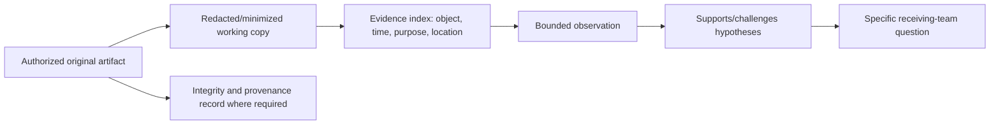

### Quality rules

- Include pre-onset, incident, and recovery intervals where available.
- Preserve time-zone and clock-offset evidence.
- State filters, parsers, transformations, sampling, aggregation, and gaps.
- Identify exact file/record/frame/line without reproducing restricted payload in the summary.
- Do not collect every subsystem by default; tie each artifact to a question.
- Never alter originals to make redaction easier; create controlled derivatives.

---

## 8. Secure transfer and privacy review

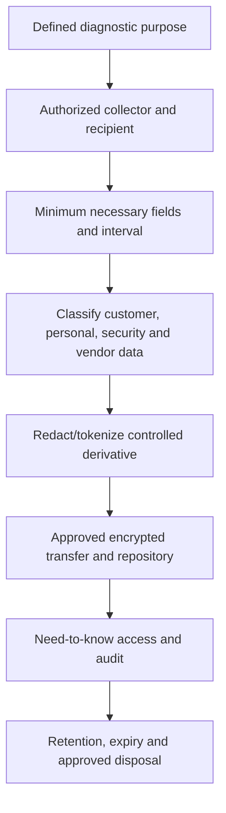

### Transfer checklist

- Confirm recipient identity, case/reference, purpose, entitlement, and channel.
- Exclude credentials, secrets, keys, unrelated payload, and excess personal data.
- Use secure links or approved upload, not email attachment chains unless policy explicitly allows.
- Record what was transferred, by whom, when, to whom, and under which access class.
- Keep customer-facing summaries sanitized and bounded.
- Follow cross-border, sector, legal-hold, security-incident, and retention controls.

### Privacy is part of case quality

A technically useful package that violates data handling is not high quality. When minimum evidence cannot be shared, state the constraint and ask the authorized privacy/security owner for an alternate collection or review path.

---

## 9. Support boundaries, entitlement, and route selection

Support typically progresses incident/product diagnosis within purchased scope. Professional Services, customer operations, application vendors, network providers, security response, Sales/commercial roles, and Engineering have different responsibilities. Exact boundaries come from current agreements and owners.

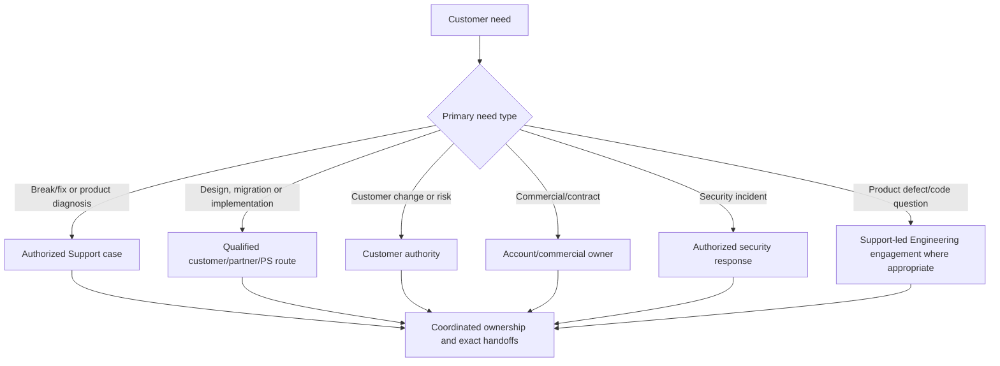

### Entitlement discipline

- Verify correct customer/account, system identity, contract, product, coverage, and contact.
- Do not promise response, onsite service, parts, defect access, or Engineering engagement from memory.
- A technical emergency does not erase contract or safety boundaries; route urgent scope questions to authorized account/Support owners.
- Lack of entitlement does not mean abandon the customer; it means transparently coordinate the correct approved route without inventing a commitment.

### Severity discipline

Do not use severity as leverage for faster Engineering access. State real impact, workaround, data risk, deadline, and trajectory; current policy determines classification.

---

## 10. Support versus Engineering engagement

### 🔍 Plain-English deep-dive: the emergency department and laboratory have different jobs

The emergency department stabilizes and diagnoses the patient; a specialist laboratory investigates a suspected mechanism using a qualified sample. Sending every patient directly to the lab overwhelms it and may not help the patient now. **Why it matters:** Support owns case progression and restoration within scope; Engineering engagement is appropriate when a product question or suspected defect is sufficiently qualified and the current process routes it there.

| Support focus | Engineering focus when engaged | Shared evidence |
|---|---|---|
| Impact, restoration, case ownership | Product mechanism, code, defect, design intent | Exact product/release/configuration |
| Known diagnostics and procedures | Reproduction/signature analysis | Minimal reproduction and controls |
| Known issue/workaround applicability | Existing defect match or new investigation | Traces, events, dumps, logs, metrics |
| Customer updates and next actions | Technical findings and evidence requests | Timeline, changes, hypotheses |
| Service/entitlement route | Product-team priority under internal governance | Exact question and customer consequence |

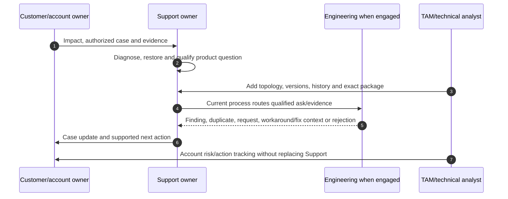

### Good Engineering asks

- `Does the supplied signature match an existing defect for this exact release and trigger?`
- `Which additional artifact can distinguish H1 from H2?`
- `Can Engineering reproduce the bounded behavior with the supplied steps?`
- `Is the observed behavior expected by design for this configuration?`
- `Which fixed release or documented workaround applies, subject to Support validation?`

`Customer is angry; please engage Engineering` is not a technical ask.

---

## 11. Duplicate defects and known-issue matching

A duplicate is useful only when the underlying mechanism is the same, not merely the symptom label.

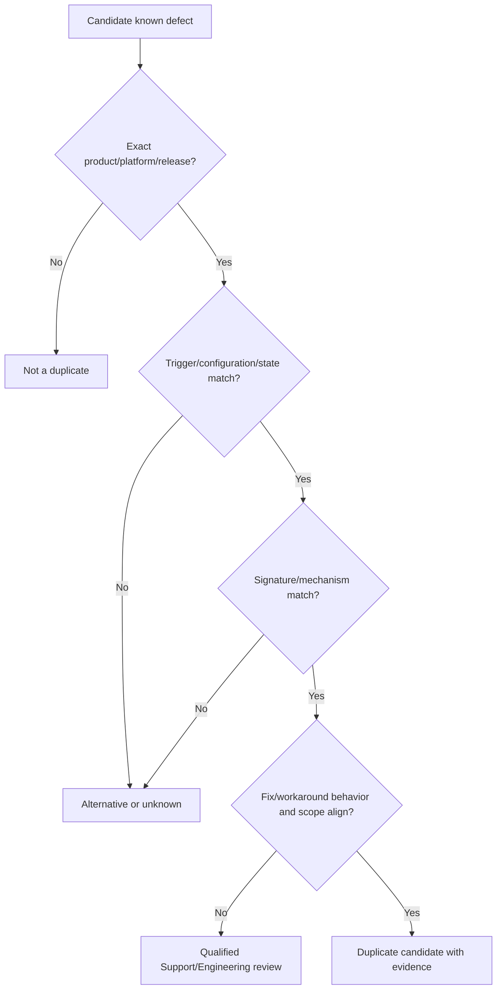

### Duplicate record fields

- Authorized defect identifier and visibility class.
- Product, release, platform, feature, and configuration.
- Trigger and symptom/signature.
- Evidence linking this case to the defect.
- Fixed release/workaround/mitigation from current authorized source.
- Differences and uncertainty.
- Customer action, validation, and residual risk.

Never expose restricted defect text or identifiers to an unauthorized audience. Customer-safe wording should cite the approved source and bounded applicability.

---

## 12. Case quality and update rhythm

A strong case is readable by a new owner at any time.

### Case quality rubric

| Dimension | Weak | Strong |
|---|---|---|
| Impact | `Critical` | Bounded service/user/data consequence and current state |
| Environment | Product family only | Exact recipe, topology, feature, identity |
| Timeline | Narrative without time zone | UTC chronology with changes/actions/results |
| Evidence | Bulk upload | Indexed, scoped, defined, secure artifacts |
| Reasoning | One asserted cause | Competing hypotheses and discriminating evidence |
| Action | `Investigating` | Owner, action, expected result, checkpoint |
| Ask | `Escalate` | Exact expertise/decision and why now |
| Customer update | Internal jargon | Impact, facts, uncertainty, action, next time |

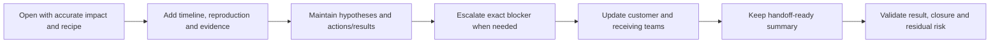

### Update template

> `As of <UTC>, impact is <current state>. Since the last update, <material observation/action/result>. Evidence supports <bounded finding> and challenges <alternative>; <unknown> remains. <Owner> is performing <next action> to answer <question>. Exact ask to <team> is <ask>. Next checkpoint <time>.`

Update when impact, severity, owner, hypothesis, action, result, blocker, decision, or checkpoint changes, and at promised cadence even without material change.

---

## 13. Ownership and handoff

Escalation adds an owner; it does not erase the sender's responsibilities.

### 🔍 Plain-English deep-dive: escalation is a specialist referral, not abandonment

When a family doctor refers a patient to a specialist, the patient still needs someone to coordinate the complete care plan, explain results, and track follow-up. An escalation works the same way: the specialist owns the accepted technical question, while the case/customer coordinator retains communication, restoration context, dependencies, and follow-through. **Why it matters:** transferring a ticket without accepted scope and continuing ownership creates a gap exactly when the problem is most complex.

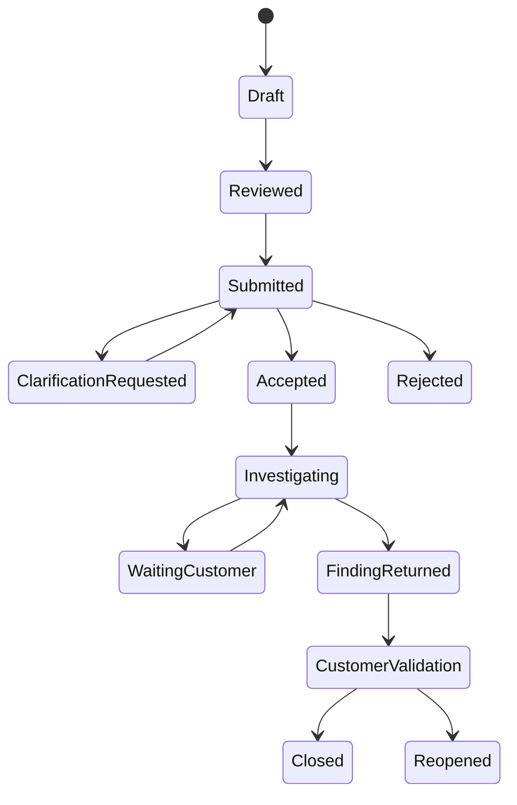

### Ownership questions

- Who owns customer communication while Engineering investigates?
- Who owns current restoration and case progression?
- Who supplies requested evidence and by when?
- Who can authorize production tests/changes?
- Who interprets product findings for the customer?
- Who tracks the account-level risk, lifecycle, or prevention action?
- What happens if the receiving owner rejects or misses the checkpoint?

### Handoff read-back

The receiving owner restates impact, current model, exact ask, accepted scope, missing evidence, and next checkpoint. Ticket assignment alone is not acceptance.

---

## 14. When not to escalate

Do not escalate merely because:

- The sender wants to bypass normal evidence collection.
- Impact/severity is exaggerated to obtain attention.
- The need is a customer-owned change, design project, training request, or commercial question routed elsewhere.
- The same qualified owner is actively progressing the case and no new blocker exists.
- A known supported procedure has not been followed without a valid reason.
- The package has no exact product, version, topology, reproduction, evidence, or ask.
- Symptom similarity is the only defect evidence.
- A requested production experiment is unsafe, unauthorized, or privacy-prohibited.
- Escalation is intended to punish a person/team or manufacture certainty.

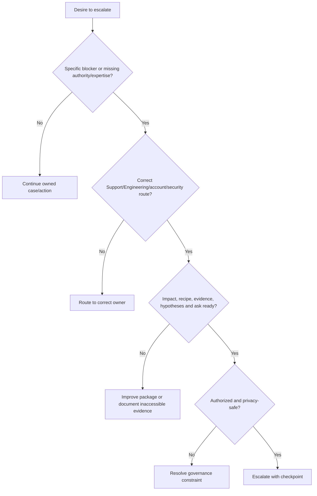

Escalation can still be justified with incomplete evidence during urgent impact, but the package must state exactly what is missing, why, what was preserved, and what decision is needed now.

---

## 15. Rejection is diagnostic evidence about the package or route

Common rejection reasons include wrong route, unsupported scope, insufficient impact, missing exact version/configuration, no reproduction/signature, unreadable evidence, no exact ask, privacy problem, active duplicate, or a product behavior determined to be expected.

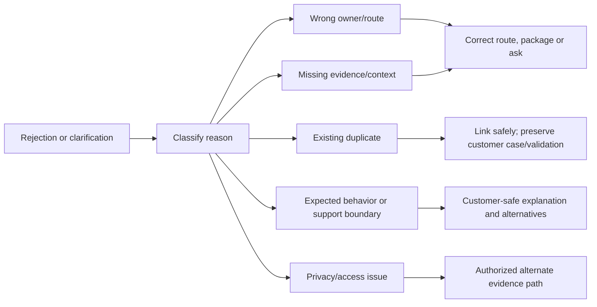

### Repair response

> `The request was not accepted because <bounded reason>. We will <specific correction> by <owner/time>. Current impact and restoration remain owned by <role>. The revised ask is <ask>. We are not interpreting the rejection as proof that the product is healthy or that the customer symptom is invalid.`

### Escalation anti-patterns

| Anti-pattern | Why it fails | Better practice |
|---|---|---|
| `Escalate to Engineering now` | No technical ask | State missing expertise/decision and consequence |
| Huge unindexed archive | Signal hidden, privacy expanded | Minimum evidence plus index |
| Screenshot-only versions | Stale/incomplete | Authoritative text/export with source/time |
| `Same as bug X` | Symptom match only | Trigger, recipe, signature, mechanism |
| Severity inflation | Distorts trust and queues | Current impact under policy |
| Escalation as handoff escape | Customer loses owner | Sender retains communication and coordination |
| Rejection treated as insult | Learning stops | Classify gap, improve or reroute |

---

## 16. Fully synthetic sanitized scenario(s)

### Scenario A: suspected NFS defect with a weak first package

**Initial request:** `NFS is broken after upgrade. Escalate to Engineering.`

**Why weak:** no exact release, client/kernel, NFS version, operation, export rule, identity, timeline, reproduction, trace, unaffected control, or ask.

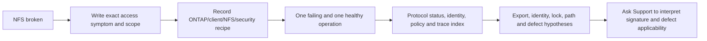

**Improved synthetic package:** Two of ten clients on one kernel/build fail NFSv4.1 `OPEN` after a synthetic client update; NFSv3 control and unchanged clients work. The package includes exact negotiated version/security, client and ONTAP recipe, export/identity observations, attempt IDs, packet and server-event indexes, update timeline, actions, and an ask to distinguish a client-state issue from a product defect. No defect is declared.

### Scenario B: duplicate-defect candidate after path loss

**Situation:** A synthetic case has the same broad timeout text as a gated defect summary, but the platform and trigger may differ.

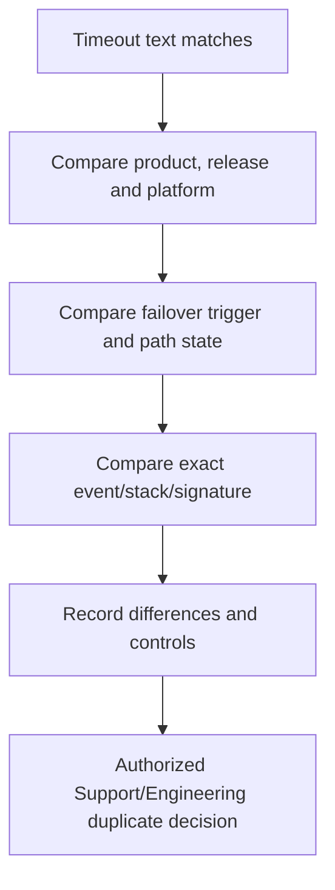

**Outcome:** The synthetic signature differs before the common timeout wrapper, so duplicate status remains unknown. Support requests a narrower trace. The customer case retains its own impact, restoration, and update ownership.

### Scenario C: severity dispute and entitlement uncertainty

**Situation:** A test workload fails; production is healthy, but a migration deadline is tomorrow. The customer requests the highest severity and immediate onsite service.

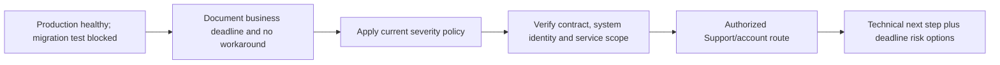

**Response:** Do not minimize the deadline or promise an unsupported severity/onsite response. Record exact test impact, critical path, alternatives, entitlement uncertainty, and ask the authorized Support/account owner to confirm route and service while technical work continues.

### Scenario D: Engineering rejects an incomplete performance escalation

**Situation:** A synthetic package says `p99 high, storage CPU 80%, likely bug` and uploads broad metrics.

**Rejection:** exact workload/object, baseline, operation population, time alignment, counter definitions, reproduction, and Support diagnosis are missing.

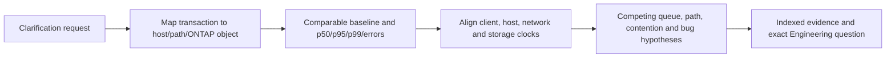

**Improvement:** The revised package ties one transaction population to one volume/workload and host path, shows the application queue rises before storage calls, and withdraws the unsupported bug claim. The correct next owner becomes the application team; escalation rejection improved the system model.

---

## 17. Experience transfer and honesty and JD Mapping

```mermaid
flowchart LR
    MCASE[enterprise case ownership] --> QUAL[Impact, timeline, updates and handoff quality]
    TRACE[Logs, traces and reproduction] --> EVID[Indexed diagnostic evidence]
    PG[Product/Engineering collaboration] --> ASK[Defect qualification and exact asks]
    PART[Partner support] --> BOUND[Vendor, contract and customer boundaries]
    QUAL --> TRANS[Transferable escalation method]
    EVID --> TRANS
    ASK --> TRANS
    BOUND --> TRANS
    TRANS --> GAP[NetApp case systems, routes and defect access remain gaps]
```

| JD responsibility | Part 73 capability | Honest evidence/boundary |
|---|---|---|
| Technical analysis | Reproducible, indexed evidence package | prior case evidence; synthetic NetApp package |
| Support experience | Case progression, updates, handoffs | Production Microsoft, not NetApp Support ownership |
| Engineering collaboration | Product question, signature, defect validation | Microsoft Product/Engineering experience |
| Risk mitigation | Impact, severity, restoration, residual risk | Generic method; customer authority retained |
| Customer communication | Bounded updates and secure summaries | Existing strength |
| Cross-functional work | Accepted ownership and route boundaries | NetApp internal routes must be learned/current |

### Honest interview wording

> `My escalation packages begin with impact, scope and exact environment, then chronology, reproduction, indexed logs/traces/events/metrics, changes, actions/results, competing hypotheses and one exact ask. I keep customer communication and restoration owned while specialists investigate, and I treat rejection as a routing or evidence signal. I have done this in enterprise support, but I have not used NetApp case or defect systems; current NetApp Support and Engineering owners would control those routes.`

---

## 18. Labs, drills, and self-test

### Paper lab: build three packages

```mermaid
flowchart LR
    CASES[Choose NAS, SAN and performance synthetic cases] --> IMP[Write impact/scope/severity rationale]
    IMP --> TOPO[Draw topology and exact recipe]
    TOPO --> REPRO[Build reproduction/control]
    REPRO --> IDX[Index decisive evidence]
    IDX --> HYP[Competing hypotheses]
    HYP --> ASK[Support or Engineering exact ask]
    ASK --> PRIV[Privacy and transfer review]
    PRIV --> PEER[Peer accepts, rejects or requests clarification]
    PEER --> REPAIR[Revise and read back ownership]
```

### Required drills

1. Reduce a 50-item evidence list to the minimum decision-relevant package.
2. Rewrite three severity claims from verified impact and policy.
3. Turn `same bug` into an applicability table.
4. Write a Support ask and a different Engineering ask for one incident.
5. Redact a synthetic evidence index without removing diagnostic identity.
6. Reject a package constructively for wrong route, missing recipe, and privacy issue.
7. Repair the package and produce a 60-second handoff.
8. Write a customer update while an Engineering result remains uncertain.

### Self-test

1. Recite every minimum evidence field.
2. Explain why impact, scope, and severity must align.
3. Draw an application-to-protection topology and version recipe.
4. Build a clock-corrected timeline and change ledger.
5. Define a safe reproduction and signature.
6. Index logs, traces, events, and metrics.
7. Explain secure transfer and privacy controls.
8. Distinguish Support, Engineering, customer, account, security, and PS ownership.
9. Validate a duplicate-defect candidate.
10. Explain when not to escalate and how to improve a rejection.

### Lab pass checklist

- [ ] Impact and scope identify affected and unaffected controls.
- [ ] Severity rationale uses current policy and real consequence.
- [ ] Topology covers application, host, path, protocol, storage, and protection.
- [ ] Exact product, platform, release, host, driver, firmware, switch, and app values are present where relevant.
- [ ] Reproduction states preconditions, expected/actual, frequency, controls, and safety.
- [ ] Timeline uses UTC and includes cross-team changes.
- [ ] Evidence is indexed by object, time, definition, purpose, and decisive location.
- [ ] Actions tried include owner, authority, result, and recovery.
- [ ] Competing hypotheses include predictions and contradictions.
- [ ] Exact ask names the needed decision/expertise and why now.
- [ ] Transfer is authorized, minimum, secure, audited, and retained appropriately.
- [ ] Support and Engineering ownership remain distinct.
- [ ] Duplicate status is evidence-based and visibility-safe.
- [ ] Rejection leads to repair, reroute, or a bounded explanation.
- [ ] Customer communication and restoration retain owners.
- [ ] All evidence and cases are fully synthetic and sanitized.
- [ ] No NetApp case, entitlement, defect, process, or outcome is claimed.

---

## 19. Official and Public Source Anchors

**Date checked: 2026-08-24.** These public anchors do not expose internal case or defect requirements and do not establish a customer's entitlement, severity, escalation route, or live supportability.

| Topic | Official/public source | Bounded use |
|---|---|---|
| NetApp support context | [NetApp Support Services](https://www.netapp.com/services/support/) | Public service orientation; exact entitlement, severity and route require confirmation |
| Support portal context | [NetApp Support](https://mysupport.netapp.com/) | Authorized/gated support entry; no access or field assumption made |
| AutoSupport evidence | [Learn about ONTAP AutoSupport](https://docs.netapp.com/us-en/ontap/system-admin/manage-autosupport-concept.html) | Public telemetry purpose; payloads and customer association are restricted/current |
| AutoSupport manifest | [Information included in the AutoSupport manifest](https://docs.netapp.com/us-en/ontap/system-admin/autosupport-manifest-concept.html) | Public collection-status/provenance orientation |
| EMS evidence | [ONTAP EMS reference](https://docs.netapp.com/us-en/ontap-ems/) | Public event semantics by reference version; not customer evidence |
| Bugs/defects | [NetApp Bugs Online](https://mysupport.netapp.com/site/bugs-online) | Authorized current records only; visibility and process can vary |
| Release context | [ONTAP release highlights](https://docs.netapp.com/us-en/ontap/release-notes/) | Public release orientation; known issues/cautions may require gated notes |
| Interoperability | [NetApp Interoperability Matrix Tool](https://imt.netapp.com/) | Authorized current recipe results and notes; never invent a match |
| Hardware evidence | [NetApp Hardware Universe](https://hwu.netapp.com/) | Authorized current platform/component rules; potentially gated |
| Incident handling | [NIST SP 800-61 Rev. 3](https://csrc.nist.gov/pubs/sp/800/61/r3/final) | Official public incident-response context; not a NetApp escalation standard |

### Source-use discipline

- Confirm exact contract, system identity, entitlement, severity policy, and support contact through authorized owners.
- Record exact source/revision/date and product/release scope for every technical statement.
- Keep customer cases, AutoSupport, Digital Advisor, IMT, HWU, Bugs Online, traces, and Engineering responses in approved systems.
- Do not translate public marketing/service pages into response promises or internal routing claims.
- Do not disclose gated defect information in customer-facing or interview material.

---

## Likely Interview Questions

### Q1. What belongs in a high-quality escalation package?

> **Model answer:** `I include verified impact and current state; affected and unaffected scope; UTC timeline and changes; end-to-end topology; exact configuration and versions; safe reproduction with expected/actual and frequency; indexed logs, traces, events and metrics; actions/results; competing hypotheses and contradictions; secure evidence links; the exact ask; and accepted owners and checkpoints.`

### Q2. How do you decide severity and route?

> **Model answer:** `I classify from current business, user, data, security and recovery impact, workaround, duration, trajectory and deadline under the governing policy and contract. I then route the primary need to Support, customer change authority, security, Professional Services, account/commercial owner or Support-led Engineering engagement. I never inflate severity to obtain attention.`

### Q3. What makes a reproduction and diagnostic signature useful?

> **Model answer:** `A reproduction states exact preconditions, minimal steps, expected and actual result, frequency, affected and healthy controls, one changed variable, safety and aligned artifacts. A signature includes exact stage, operation, object, state, error/event/stack and timing. Error text alone is too broad to prove mechanism or a duplicate defect.`

### Q4. How do you transfer evidence securely?

> **Model answer:** `I define purpose and authorized recipient, collect the minimum necessary interval and fields, classify sensitive content, preserve the restricted original, create a controlled redacted derivative, transfer through the approved encrypted case/repository route, audit access and apply retention/disposal. The summary links to evidence rather than copying secrets or payloads.`

### Q5. How do Support and Engineering engagement differ?

> **Model answer:** `Support owns case progression, restoration, known diagnostics and customer updates within service scope. Engineering, when engaged through the current process, investigates a qualified product mechanism, design question or defect using precise reproduction and evidence. The customer retains production decisions, and the TAM analyst adds account context without replacing Support or Engineering.`

### Q6. How do you validate a duplicate defect?

> **Model answer:** `I compare exact product, platform, release, feature/configuration, trigger/state, symptom and deep signature, plus workaround or fixed-release behavior from the authorized current record. I document differences and confidence. A matching timeout or version is only a lead, and restricted defect details stay in approved channels.`

### Q7. When should you not escalate, and how do you handle rejection?

> **Model answer:** `I do not escalate to bypass discovery, inflate severity, punish a team, route a design/commercial/customer change incorrectly, or submit no exact evidence or ask. If rejected, I classify wrong route, evidence gap, duplicate, expected behavior, support boundary or privacy issue; then reroute, improve the package or give a bounded explanation while retaining customer and restoration ownership.`

### Q8. How does your experience transfer, and what remains a gap?

> **Model answer:** `support escalation engineering gave me production experience building diagnostic packages, analyzing traces, reproducing defects, engaging Product and Engineering, validating fixes and updating customers. I have not used NetApp case, entitlement or defect processes, so exact routes, severity, visibility and Engineering criteria must come from current authorized NetApp owners.`

---

## 30-Second Memory Hooks

- **Escalation:** Specific blocker + complete context + exact ask + accepted owner.
- **Package:** Impact, scope, time, topology, recipe, repro, evidence, changes, actions, hypotheses, ask.
- **Severity:** Verified consequence under policy, never leverage.
- **Topology:** A timeout needs a path and owner map.
- **Recipe:** Exact versions and settings, not family labels.
- **Reproduction:** Preconditions + steps + expected/actual + frequency + control.
- **Signature:** Postal code plus house number; error text alone is not enough.
- **Evidence index:** Artifact + object/time + purpose + decisive location + access.
- **Privacy:** Minimum, authorized, redacted derivative, secure transfer, retention.
- **Entitlement:** Defines available service route, not technical truth.
- **Support:** Restores and progresses case; **Engineering:** qualified product question.
- **Duplicate:** Same mechanism and trigger, not just same symptom.
- **Case quality:** A new owner can act without repeating discovery.
- **No escalation:** No blocker, wrong route, unsafe ask, or package not ready.
- **Rejection:** Diagnose route/package; improve without blame.
- **Experience boundary:** enterprise escalation production depth transfers; NetApp systems/routes do not.

---

## Completion Checklist

- [ ] State verified impact, current state, workaround, and customer consequence.
- [ ] Bound affected and unaffected users, operations, objects, paths, and times.
- [ ] Apply current severity policy and record reassessment triggers.
- [ ] Draw application-to-protection topology and ownership boundaries.
- [ ] Capture exact product, release, platform, host, driver, firmware, switch, protocol, and application recipe where relevant.
- [ ] Build UTC chronology with all cross-team and automatic changes.
- [ ] Write safe reproduction with controls, frequency, expected/actual, and stop criteria.
- [ ] Distinguish broad symptom from deep diagnostic signature.
- [ ] Index logs, traces, events, and metrics by object, time, definition, and purpose.
- [ ] Record actions tried with owner, authority, result, and recovery.
- [ ] Preserve competing hypotheses, contradictions, confidence, and unknowns.
- [ ] End with one exact expertise/decision ask and checkpoint.
- [ ] Verify entitlement and route without promising internal service behavior.
- [ ] Transfer only authorized minimum evidence through approved secure channels.
- [ ] Preserve Support, Engineering, customer, account, security, and PS boundaries.
- [ ] Validate duplicate defects by trigger, recipe, signature, and current authorized source.
- [ ] Keep case updates and customer ownership active during escalation.
- [ ] Know when not to escalate and repair rejection constructively.
- [ ] Complete synthetic cases, package lab, drills, and self-test.
- [ ] Answer exact Q1-Q8 aloud and state the no-production-NetApp boundary.
- [ ] Revalidate current support, product, defect, privacy, and ownership sources for live work.

---

*Next suggested section:* [Part 74 - NAS Troubleshooting Scenarios: NFS, SMB, Identity, DNS, and Permissions](Part-74-nas-troubleshooting-scenarios.md)