# Part 74 - NAS Troubleshooting Scenarios: NFS, SMB, Identity, DNS, and Permissions

> **Section goal:** Diagnose Network-Attached Storage (NAS) symptoms as end-to-end file-service failures rather than immediately blaming the client, network, identity system, or storage. By the end, you should be able to reason through NFS mounts, access, stale handles, locks, identity, netgroups, Kerberos, and NFSv4 state; SMB shares, permissions, Active Directory, DNS, time, SPNs, Kerberos/NTLM, locks, continuously available shares, Multichannel, and Witness; plus namespace, LIF, routing, MTU, performance, and multiprotocol permission interactions using competing hypotheses and decisive evidence.

Covers index item **74** and maps directly to job-description responsibilities for storage depth, complex troubleshooting, customer-risk mitigation, Support engagement, technical analysis, high-pressure communication, and evidence-based recommendations.

**Explicit nonclaim:** You have not administered, diagnosed, changed, restored, or certified a production NetApp ONTAP NFS, SMB, multiprotocol, identity, namespace, LIF, or NAS network service.

**Privacy/access:** NAS evidence can expose customer file and directory names, contents, user/group identities, SIDs, UID/GID values, domains, SPNs, DNS, addresses, tickets, security policy, ACLs, packet payloads, open files, sessions, topology, and credentials. Use approved collection and transfer, minimum fields and intervals, need-to-know access, redaction/tokenization, secure repositories, retention rules, and customer/security authorization. Never capture content or authentication secrets merely because packet or log tooling permits it.

**Synthetic-evidence rule:** Every customer, domain, address, user, group, file, export, share, SVM, LIF, event, packet, metric, case, version, action, owner, and outcome below is fictional and sanitized. No table or diagram is a real customer topology, ONTAP output, packet trace, Support instruction, or product result.

**Version/current source caveat:** ONTAP releases, NFS/SMB behavior, supported dialects and security modes, export/share options, LIF policies, commands, event names, counters, client implementations, Kerberos/AD behavior, and supportability change. A **current-source check** means verifying the exact ONTAP release, client OS/kernel, protocol/dialect/minor version, configuration, IMT result/notes where applicable, and current official or authorized procedure before live diagnosis or change.

This Part is a reasoning casebook, not a NetApp internal troubleshooting manual, command reference, configuration recipe, Support commitment, security assessment, or permission to test production access or failover.

> **No-production-NetApp boundary:** Your factual strengths are enterprise support, SharePoint/OneDrive permissions and data-service troubleshooting, Active Directory, Windows networking, DNS/TCP/TLS dependency analysis, critical-situation ownership, trace correlation, and customer communication. Your exact nonclaim is: **you have not troubleshot or changed a production ONTAP NAS service.** You may explain these synthetic cases and transferable method, not claim their outcomes as customer experience.

---

## 1. NAS is a chain of gates

**NAS** means clients request named files and directories from a server-owned namespace through a file protocol such as Network File System (NFS) or Server Message Block (SMB).

| Term | Plain meaning | Analogy | Why it matters |
|---|---|---|---|
| **Namespace** | Organized path tree visible to clients | Library catalog and aisles | A path can fail before the target file system |
| **Export** | NFS-served path governed by export policy | Building entrance for approved visitors | Mount/traversal and file access are separate gates |
| **Share** | SMB name exposing a server path | Named service counter | Share existence does not grant file permission |
| **LIF** | ONTAP logical network interface identity | Store phone number hosted at a desk | Reachability and hosting can move independently of data |
| **UID/GID** | Numeric Unix user/group identity | Employee and department number | Name text is not access identity |
| **SID** | Windows security identifier | Permanent account barcode | Display name changes do not change identity |
| **ACL** | Access-control entries granting/denying rights | Guest list with rules | Effective access depends on token and evaluation |
| **SPN** | Kerberos service principal name binding a service name to an account | Registered call sign | Wrong/duplicate mapping breaks intended Kerberos |
| **Lease/lock** | Protocol state coordinating caching or conflicting opens | Checkout reservation | State can outlive or block visible file operations |
| **CA share** | SMB continuously available share capability under supported design | Reservation that survives a desk move | Requires complete server/client/application support |

```mermaid
flowchart LR
    APP[Application or shell] --> NAME[Path, DNS and namespace]
    NAME --> NET[Route, MTU, firewall and LIF]
    NET --> SESSION[NFS mount/state or SMB negotiate/session]
    SESSION --> ID[Identity, Kerberos, groups and name mapping]
    ID --> POLICY[Export/share and file ACL/mode]
    POLICY --> STATE[Locks, leases and handles]
    STATE --> DATA[Volume, WAFL and local tier]
    DATA --> RESULT[Client-visible result]
```

### Gate rule

A passed earlier gate does not prove a later one. TCP connection does not prove authentication; mount does not prove write access; authentication does not prove authorization; a healthy LIF does not prove the namespace or file exists.

---

## 2. The NAS evidence contract

For every case capture:

- Exact client/app, source address, identity, path, operation, time, error/status.
- Negotiated NFS version/minor/security or SMB dialect/authentication/capabilities.
- DNS name and resolved address actually used.
- SVM, LIF, route, namespace/junction, volume, export/share, and policy.
- Effective UID/GID/groups or SID/token/name mapping, not just account spelling.
- Protocol request/response, session/state/lock/handle evidence.
- Client, network, identity, ONTAP, and application clocks.
- Affected and unaffected controls.
- Recent changes and current official supportability.
- Safe test, customer owner, expected result, and claim boundary.

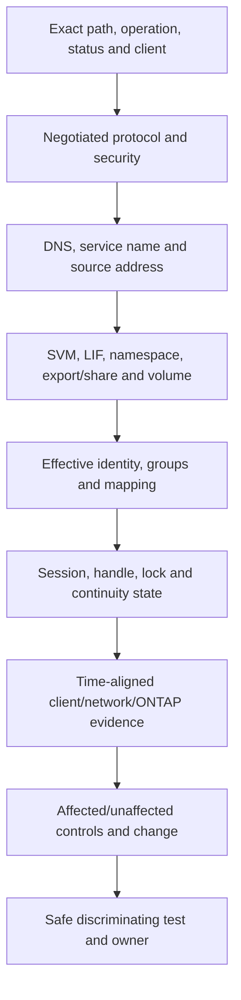

### 🔍 Plain-English deep-dive: authentication is not authorization

Authentication proves who is asking; authorization decides what that identity may do. **Analogy:** a valid building badge proves identity, but room permissions still decide which doors open. **Why it matters:** successful Kerberos or domain login does not prove share, export, directory, file, lock, or application access.

---

## 3. Protocol-oriented triage trees

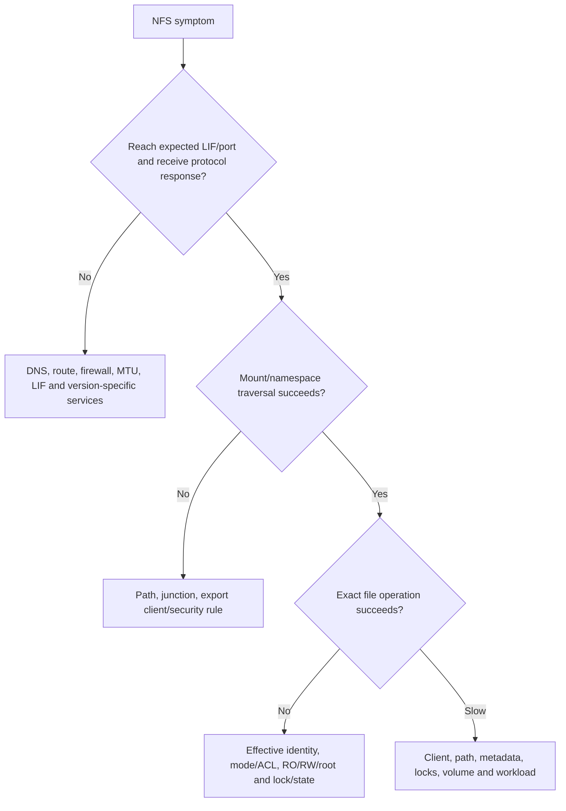

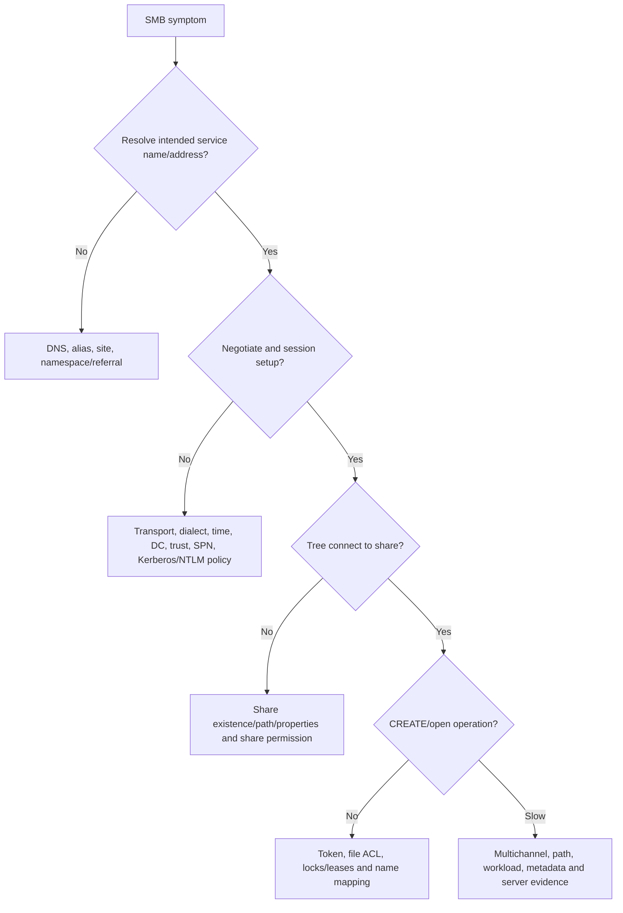

### 🔍 Plain-English deep-dive: start with the failed operation, not the product label

`SMB is down` can mean DNS failed, TCP reset, Kerberos failed, share missing, ACL denied, lock conflict, or one slow directory. **Analogy:** `the airport failed` says nothing about check-in, security, gate, baggage, or runway. **Why it matters:** the exact failed operation determines the useful evidence and owner.

---

## 4. Fully synthetic sanitized scenario(s): NFS cases 1-8

### Case 1 - NFS mount times out on only one subnet

**Symptom/scope:** Synthetic Linux clients in subnet B time out mounting an NFSv3 path; subnet A mounts normally. DNS resolves the same LIF.

| Competing hypothesis | Prediction | Decisive evidence |
|---|---|---|
| Missing return route/asymmetric firewall state | Requests reach LIF but replies leave a different path or are dropped | Both-direction packet/route/firewall state with clocks |
| Version-specific RPC service blocked | TCP 2049 may work while mount/rpcbind path fails | Negotiated version and exact RPC procedure/port response |
| Export client match denies subnet B | Server returns explicit policy denial rather than silence | NFS/RPC status and selected client rule |

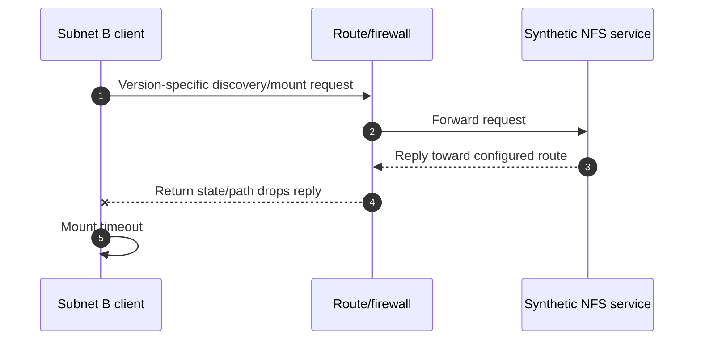

**Synthetic conclusion:** Both-direction evidence supports return-path filtering, not export denial. **Safe boundary:** network/customer owners correct policy through approved change; no broad firewall disable or storage reconfiguration is prescribed.

### Case 2 - Mount succeeds but writes are denied

**Symptom/scope:** One client mounts and reads, but create/write receives access denied.

| Competing hypothesis | Prediction | Decisive evidence |
|---|---|---|
| Export rule permits read but not write | Selected rule/security has RO but not RW | Actual source, selected rule, flavor, operation status |
| Root is mapped/squashed | UID 0 becomes an unprivileged identity | Effective mapped identity and file ownership/mode |
| File ACL/mode denies effective group | Mount gate passes; file gate rejects CREATE | Effective UID/GID/groups and directory ACL/mode |
| Lock conflict | Lock-specific status and existing holder | Protocol state/lock evidence |

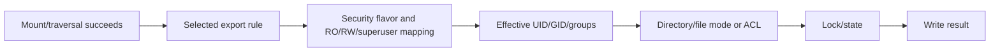

**Synthetic conclusion:** The selected export rule allows write, but root mapping changes the effective user and the directory denies it. **Control:** a non-root application identity succeeds. **Boundary:** do not grant broad root access as a diagnostic shortcut.

### Case 3 - Stale filehandle after namespace work

**Symptom/scope:** Existing clients receive `stale file handle` for one path after a synthetic volume replacement; new traversal reaches the intended content.

| Competing hypothesis | Prediction | Evidence |
|---|---|---|
| Client holds handle to removed/replaced object | Old handle no longer resolves; new lookup gets different identity | Filehandle/object and namespace change chronology |
| LIF moved | Network/session recovery issue, not stale object identity | LIF events plus protocol status |
| File was renamed | Parent/path lookup changes but open handle semantics differ | Exact object identity and operation |

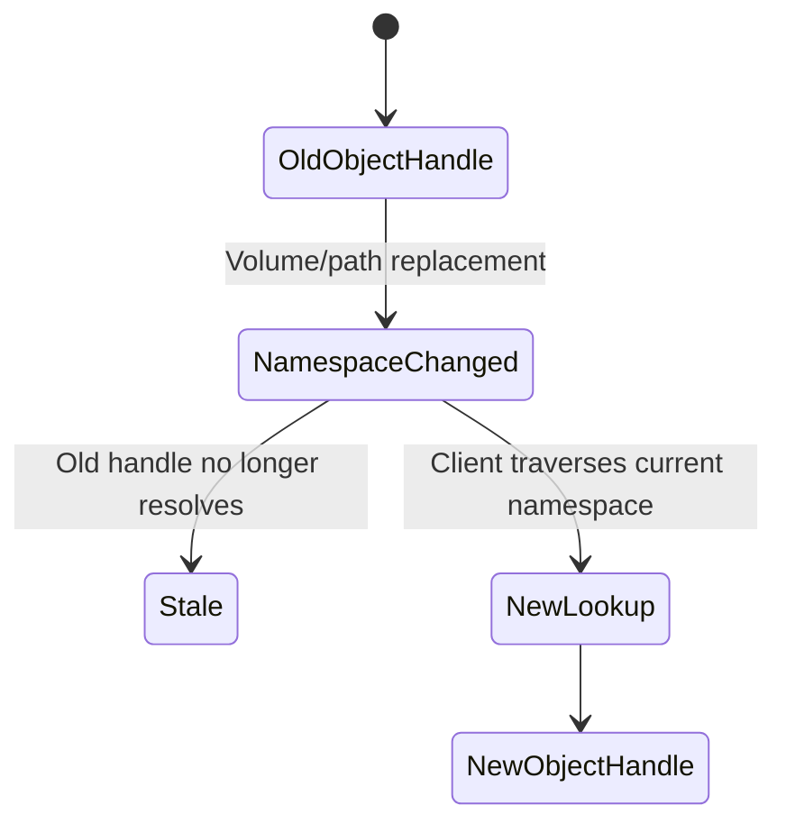

**Synthetic conclusion:** Old and new object identities differ after the approved namespace change. **Mitigation orientation:** application/client owner follows supported remount/reopen behavior after validating data and change intent; no forced cache destruction is prescribed.

### Case 4 - NFS locks do not recover after failover

**Symptom/scope:** File access returns, but a synthetic database cannot reclaim locks after a failover-like event.

| Competing hypothesis | Prediction | Evidence |
|---|---|---|
| Client missed grace/reclaim window | Reclaim attempts/state show timing or identity mismatch | NFS version/stateid/client ID and server grace evidence |
| Application uses unsupported lock behavior | Protocol lock operations differ from app assumption | Client/application/NFS support documentation and trace |
| Network path still blocks state traffic | Retransmission/timeouts during reclaim | Both-direction flow and protocol response |

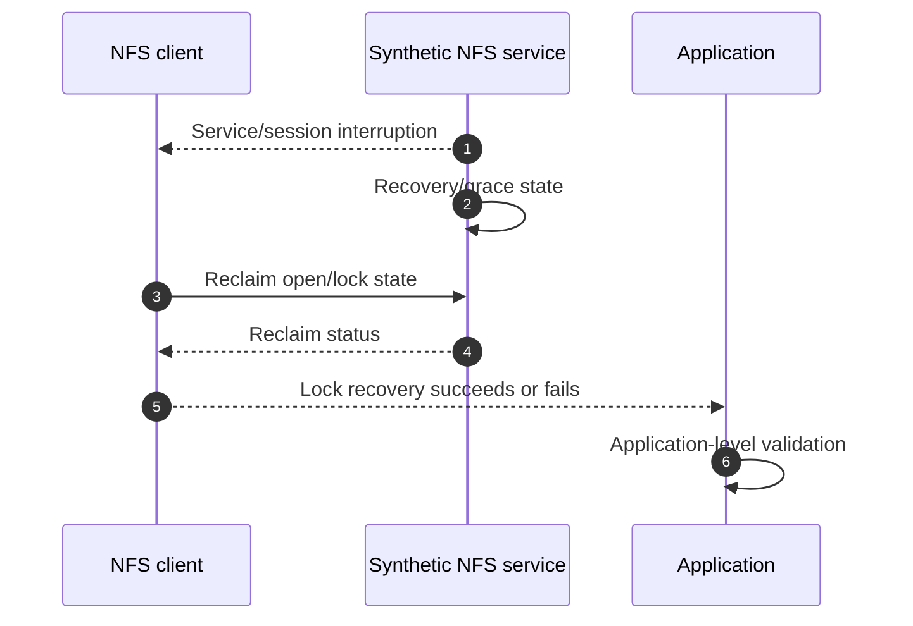

**Synthetic conclusion:** Reclaim requests use a changed client identity and are rejected. **Boundary:** qualified client and Support owners validate exact NFS version behavior; do not clear server lock state blindly.

### Case 5 - UID/GID and LDAP identity drift

**Symptom/scope:** A named user can access files from client A but not client B; usernames look identical.

| Competing hypothesis | Prediction | Evidence |
|---|---|---|
| Numeric UID differs | AUTH_SYS request carries different UID | Client credential and server-observed numeric identity |
| Supplementary groups differ/truncate | Required group absent in effective request/mapping | Effective group list and directory rights |
| LDAP/name-service data stale | Resolvers return different ID/group result | Source-specific lookup, TTL/cache and timestamps |

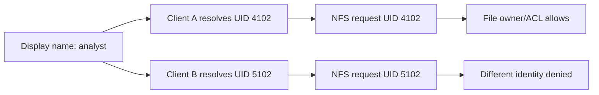

**Synthetic conclusion:** identical text names mask different numeric IDs. **Recommendation:** identity owners reconcile authoritative UID/GID data and validate positive/negative access. Do not recursively change file ownership to hide identity drift.

### Case 6 - Netgroup rule behaves differently by client name

**Symptom/scope:** Export policy uses a netgroup; some clients with the same subnet are allowed and others denied.

| Competing hypothesis | Prediction | Evidence |
|---|---|---|
| Forward/reverse DNS inconsistency affects matching | Client canonical names differ or reverse lookup fails | Exact source IP, forward/PTR responses, resolver used, TTL |
| Netgroup membership is stale/wrong | Authoritative group lacks or misstates host/domain tuple | Current name-service query and cache evidence |
| Earlier policy rule shadows netgroup rule | Selected rule differs from expected later rule | Ordered rule evaluation for actual source |

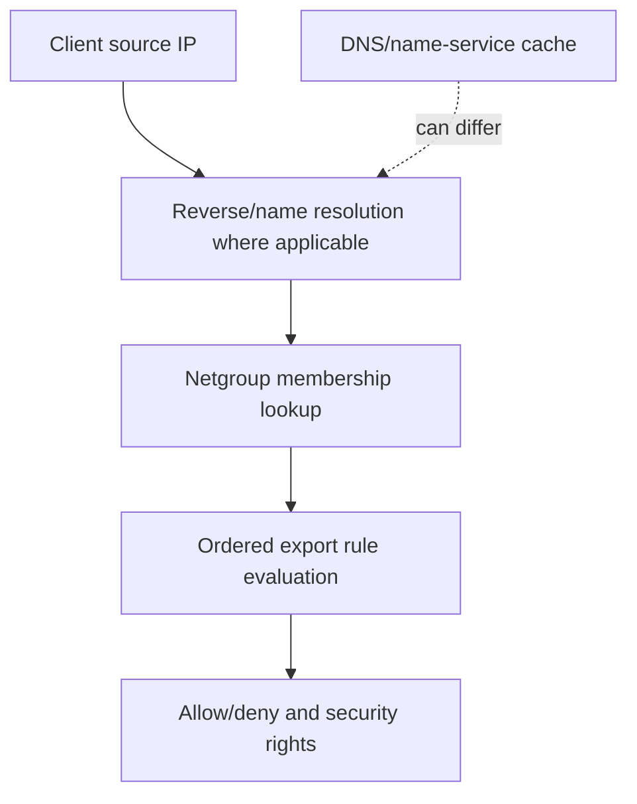

**Synthetic conclusion:** an earlier broad rule matches before the intended netgroup rule. **Boundary:** policy owner reviews ordering through approved change; do not assume netgroup content alone controls access.

### Case 7 - Kerberos NFS mount fails while AUTH_SYS works

**Symptom/scope:** A synthetic NFS Kerberos security flavor fails; a less secure control flavor works but is not accepted as the desired steady state.

| Competing hypothesis | Prediction | Evidence |
|---|---|---|
| DNS/service principal mismatch | Ticket requested for wrong/unknown principal | Exact service name, SPN/principal and KDC response |
| Time skew | Ticket not yet valid/expired or clock error | Client, KDC, ONTAP clock/NTP evidence |
| Keytab/encryption mismatch | Ticket exists but server cannot validate | Auth error stage and current supported crypto/config |
| Network blocks KDC | KDC discovery/traffic fails before NFS | DNS SRV, route/firewall and KDC flow |

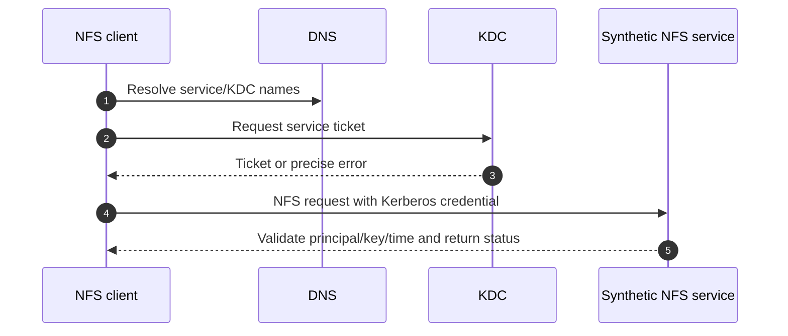

**Synthetic conclusion:** service-name alias requests a principal not configured for the intended endpoint. **Boundary:** identity and storage owners fix the supported principal/name design; do not retain AUTH_SYS fallback merely because it masks Kerberos failure.

### Case 8 - NFSv4 names show `nobody` and state errors recur

**Symptom/scope:** NFSv4 clients display unmapped ownership and later receive state-related errors after sleep/resume.

| Competing hypothesis | Prediction | Evidence |
|---|---|---|
| NFSv4 domain mismatch | Owner strings cannot map consistently | Client/server NFSv4 domain and idmap evidence |
| Name-service record missing | Domain matches but user/group lookup fails | Exact owner string and authoritative lookup |
| Lease/session recovery issue | Sequence/stateid/recovery evidence aligns with resume | Negotiated minor version, session/lease and client trace |

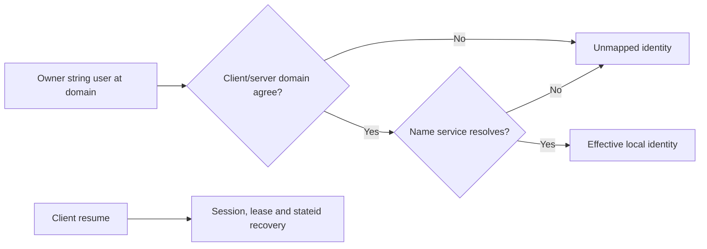

**Synthetic conclusion:** ownership display is caused by domain mismatch; resume state errors are a separate client recovery issue. **Lesson:** do not force two symptoms into one cause.

---

## 5. Fully synthetic sanitized scenario(s): SMB cases 9-15

### Case 9 - SMB server resolves, but the share is not found

**Symptom/scope:** Session setup succeeds, but tree connect to `\\files.example.test\\legal` returns share-not-found.

| Competing hypothesis | Prediction | Evidence |
|---|---|---|
| Share absent/renamed | Enumerated authorized share metadata lacks exact name | Share configuration and change record |
| Namespace/referral targets wrong server | Client connects to a different service than intended | DFS/referral/name resolution and server identity |
| Share path/junction unavailable | Share exists but backing path is invalid/offline | Share-to-path and namespace/volume state |

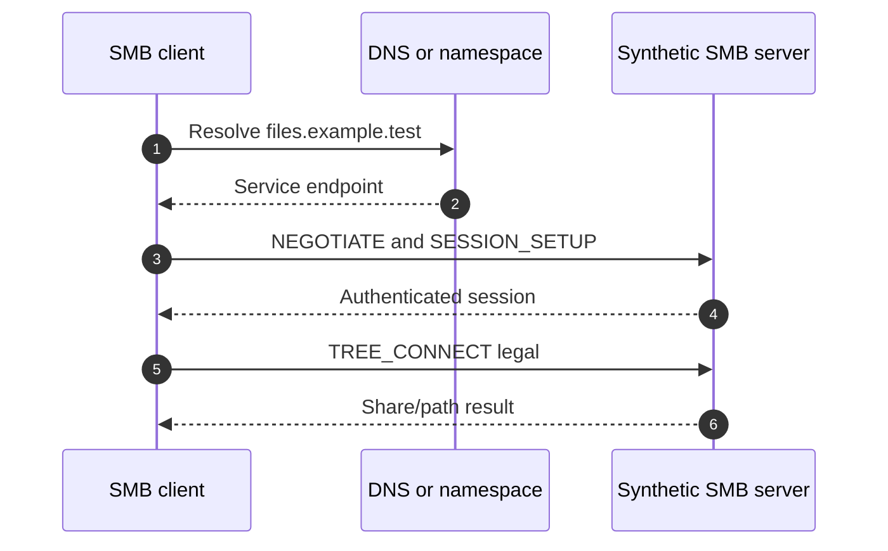

**Synthetic conclusion:** a stale namespace referral sends clients to a server without the share. **Boundary:** namespace owners correct the referral; storage share creation is not a safe workaround without design review.

### Case 10 - SMB access denied despite group membership

**Symptom/scope:** User appears in an AD group but cannot create files; another group member succeeds.

| Competing hypothesis | Prediction | Evidence |
|---|---|---|
| User token predates group change | New session/token includes group; old one does not | Session authentication time and effective SID token |
| Share permission denies before file ACL | Tree connect/create denied at share layer | Share permission evaluation and status stage |
| File ACL explicit deny/inheritance | Effective token matches deny or lacks allow | File ACL, inheritance, owner and requested access |
| Name mapping changes multiprotocol identity | SMB SID maps to unexpected Unix identity | Name-mapping rule/result and effective credentials |

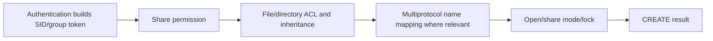

**Synthetic conclusion:** the user's existing session token lacks a newly assigned group. A new authorized test session includes it and access succeeds. **Boundary:** do not weaken ACLs to compensate for stale authentication state.

### Case 11 - SMB domain trust/secure-channel failure

**Symptom/scope:** Local diagnostic access exists, but domain users cannot start new SMB sessions.

| Competing hypothesis | Prediction | Evidence |
|---|---|---|
| Machine account disabled/mismatched secret | Secure-channel/auth failures and account state align | AD and SMB server trust evidence |
| DC unreachable from SVM | DNS works but selected DC path fails | DC discovery, route/firewall and site evidence |
| User credentials invalid | Only named users fail, machine trust remains healthy | KDC/auth status and controls |

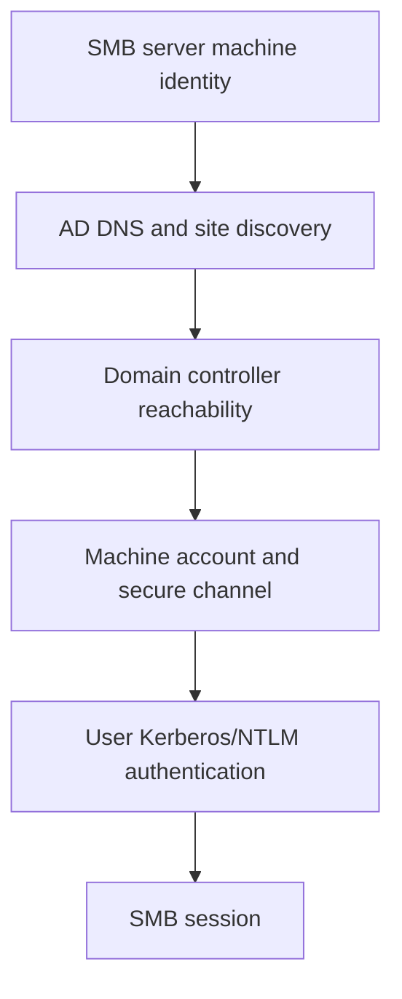

**Synthetic conclusion:** the synthetic machine account is disabled after an uncoordinated directory cleanup. **Boundary:** authorized AD/storage owners restore trust through current procedure; do not recreate/join casually because identity and SPNs may be affected.

### Case 12 - Kerberos fails and NTLM fallback hides the defect

**Symptom/scope:** SMB access works from some clients using NTLM but fails where policy requires Kerberos.

| Competing hypothesis | Prediction | Evidence |
|---|---|---|
| Duplicate/wrong SPN | KDC returns principal error or ticket bound to wrong account | Exact UNC/service name, SPN ownership and KDC result |
| DNS alias not represented in SPN | Direct name works; alias fails Kerberos | Name used, resolved target and requested SPN |
| Time skew | Ticket validity error across clients | Client/DC/SVM clock and NTP evidence |
| NTLM restriction | Kerberos failure followed by blocked fallback | Actual auth mechanism and security policy |

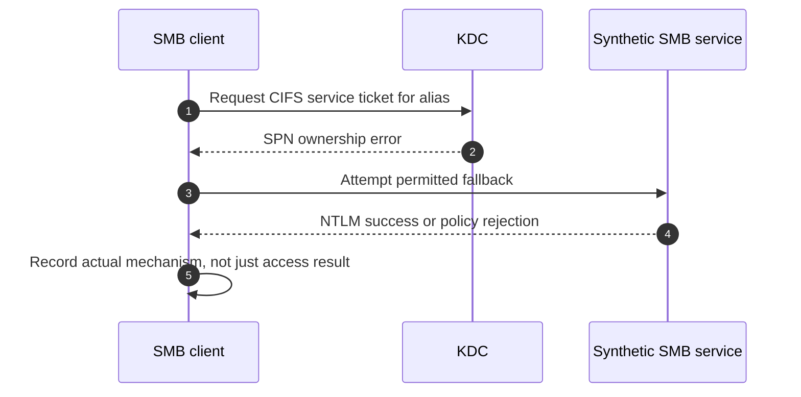

**Synthetic conclusion:** the alias has no correct unique SPN. **Lesson:** NTLM success is not proof the intended Kerberos design works; fix the name/SPN design under identity governance.

### Case 13 - File cannot be renamed because it is open

**Symptom/scope:** One user cannot rename a file while reads continue.

| Competing hypothesis | Prediction | Evidence |
|---|---|---|
| Conflicting SMB share mode/open handle | Server shows an open with incompatible share-delete access | Session/open-file/CREATE share-mode evidence |
| Lease/cache break not completing | Lease break sent but client does not acknowledge | Lease state and network/client evidence |
| ACL denies delete/rename | No conflicting open; requested access denied by ACL | Token, requested access and ACL evaluation |

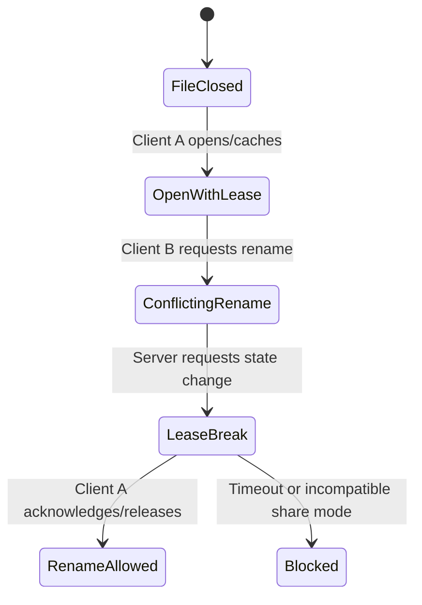

**Synthetic conclusion:** an approved application service holds the file without share-delete permission. **Boundary:** application owner closes/reconfigures through supported behavior; do not force-close production handles without impact and recovery review.

### Case 14 - CA share failover pauses longer than expected

**Symptom/scope:** A supported-looking workload on a continuously available share pauses and reconnects slowly during a synthetic failover exercise.

| Competing hypothesis | Prediction | Evidence |
|---|---|---|
| Share/client/application not eligible for transparent continuity | Durable/persistent handle capability absent | Negotiated SMB dialect/capabilities, share property, app support |
| Witness notification not used/reachable | Client discovers movement through slower path | Witness registration/notification and network evidence |
| DNS/cache delays new connection | Name resolution lags after movement | Client DNS timing and endpoint behavior |
| Failover service itself slow | Server/LIF/storage transition exceeds baseline | HA/LIF/session chronology |

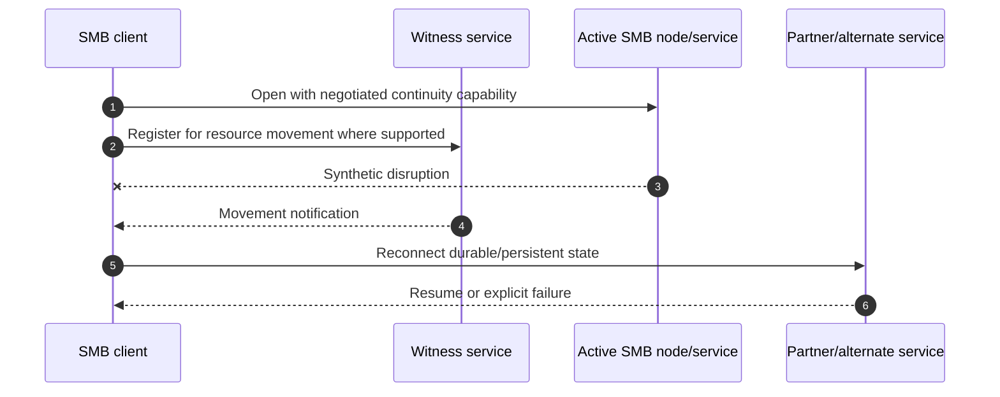

**Synthetic conclusion:** the client negotiated ordinary durable behavior, not the assumed persistent-handle/application combination. **Boundary:** validate exact workload, share, SMB feature, ONTAP/client support and test criteria; never market `CA` as zero interruption.

### Case 15 - SMB Multichannel uses only one path and large I/O stalls

**Symptom/scope:** Multiple interfaces are visible, but one TCP channel carries traffic; large transfers intermittently stall.

| Competing hypothesis | Prediction | Evidence |
|---|---|---|
| Multichannel capability/policy not negotiated | Session shows one channel/capability absent | SMB negotiate/session/channel evidence |
| NIC/path common fate or RSS/RDMA support mismatch | Candidate interfaces are not independently eligible | Exact client/server NIC capabilities, route and supportability |
| MTU mismatch/PMTUD issue | Large payload stalls/retransmits while small requests work | Both-direction packet sizes, ICMP/path MTU, counters |
| Application has one low-concurrency flow | Protocol could add channels but workload does not drive them | Workload and channel utilization |

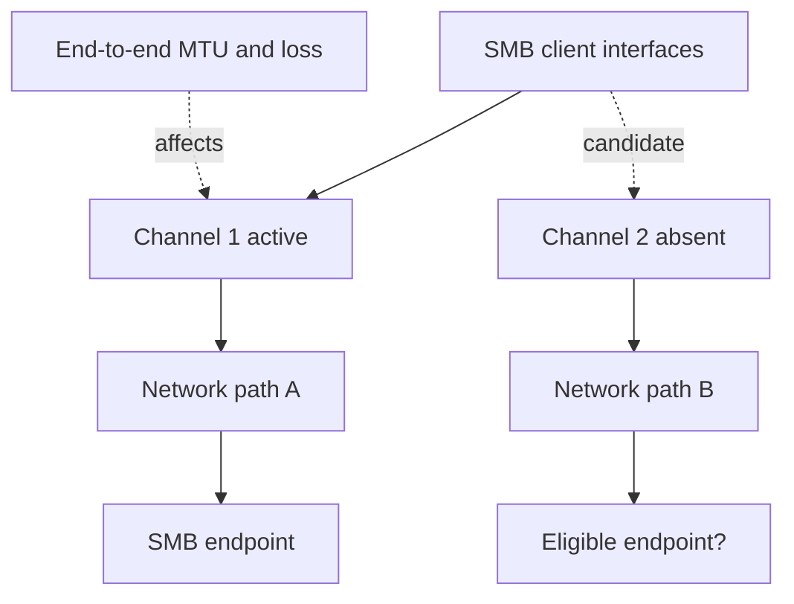

**Synthetic conclusion:** a route makes both candidate interfaces reach the same upstream failure domain, and path B has an MTU inconsistency. **Boundary:** network/client/storage owners validate supported Multichannel design and end-to-end MTU; do not enable jumbo frames on one endpoint alone.

---

## 6. Fully synthetic sanitized scenario(s): cross-protocol cases 16-18

### Case 16 - LIF reachability changes after movement

**Symptom/scope:** NFS and SMB clients in one routed network lose new sessions after a data LIF moves; local-subnet clients remain healthy.

| Competing hypothesis | Prediction | Evidence |
|---|---|---|
| New hosting port lacks upstream VLAN/path | ARP/local clients may work differently; routed path fails | Port/VLAN/broadcast-domain and switch evidence |
| SVM route selects wrong gateway | Replies leave an unexpected interface/gateway | Source-aware route and both-direction flow |
| Firewall pins state to old path | New sessions fail across asymmetry; old sessions differ | Firewall cluster/state and path evidence |
| DNS still points correctly | Both protocols use same address, so DNS not differentiating | Actual client resolution |

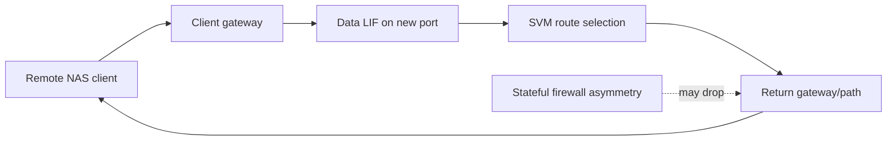

**Synthetic conclusion:** return routing uses a different stateful firewall node after movement. **Boundary:** coordinated network and storage path correction; do not move the LIF repeatedly as diagnosis without preserving state/evidence.

### Case 17 - Slow directory listing while bulk reads are normal

**Symptom/scope:** One synthetic engineering directory lists slowly; large sequential file reads meet baseline.

| Competing hypothesis | Prediction | Evidence |
|---|---|---|
| Metadata-heavy large directory workload | LOOKUP/READDIR/CREATE metadata operations dominate | Protocol operation mix and directory size/distribution |
| Identity/group lookup latency | Delay aligns with name-service calls and uncached identities | Resolver timing/cache and effective identity evidence |
| Lock/contention or antivirus scan | Specific files/directories and background workload align | Open/lock and client/server scan evidence |
| Media throughput limit | Bulk reads should also degrade with matching service queue | Object/local-tier service evidence |

```mermaid
flowchart TD
    LIST[Directory listing slow] --> OPS[Measure metadata operation mix]
    OPS --> ID[Measure identity/name lookup]
    OPS --> LOCK[Measure locks/background scans]
    OPS --> STOR[Measure matching volume/local-tier service]
    BULK[Bulk-read healthy control] --> STOR
    ID --> CAUSE[Discriminating comparison]
    LOCK --> CAUSE
    STOR --> CAUSE
```

**Synthetic conclusion:** uncached group lookups dominate list time for one client population; storage media throughput is not causal. **Recommendation:** identity/cache owners address supported lookup behavior and monitor both access correctness and latency.

### Case 18 - Multiprotocol NFS and SMB permissions disagree

**Symptom/scope:** A file created over SMB is readable by its SMB owner but denied to the expected NFS user; display names appear equivalent.

### 🔍 Plain-English deep-dive: names are labels, identities are keys

Two apartment residents can both be displayed as `Alex`, but their keycards open different doors. SMB authorization evaluates a SID-based token; NFS may present a numeric UID/GID or a Kerberos identity that is mapped into local identity. Name mapping connects those identity systems under ordered rules, but matching display text proves nothing by itself. **Why it matters:** changing an ACL or ownership from a name-only assumption can grant the wrong person access across both protocols.

| Competing hypothesis | Prediction | Evidence |
|---|---|---|
| SID-to-UID name mapping selects wrong rule | Effective Unix identity differs from intended account | Ordered mapping rule, input SID/name and output UID |
| Security style/ACL semantics differ from assumption | File effective permission follows configured style and protocol behavior | Volume/qtree security style, ACL/mode and create path |
| NFS export policy denies operation | Denial occurs before file permission | Selected export rule/security and protocol status |
| SMB token/file ACL only | SMB token has rights absent for mapped NFS identity | Effective SMB token and file ACL |

```mermaid
flowchart LR
    SMB[SMB user SID and groups] --> MAP[Name-mapping rules]
    MAP --> UNIX[Mapped Unix UID/GID]
    NFS[NFS numeric/Kerberos identity] --> UNIX
    UNIX --> STYLE[Volume/qtree security style]
    STYLE --> ACL[Effective ACL/mode]
    ACL --> ACCESS[Protocol-specific access result]
```

**Synthetic conclusion:** an overly broad name-mapping rule precedes the intended specific rule and maps the SMB owner incorrectly for NFS. **Boundary:** multiprotocol security changes need identity, data-owner, security, application, and storage review with expected allow/deny tests; never recursively relax permissions as a shortcut.

---

## 7. Cross-case diagnosis matrix

| Symptom | First high-value split | Common false conclusion | Decisive evidence |
|---|---|---|---|
| Mount timeout | No response vs explicit denial | `Export policy` from silence | Both-direction protocol/path trace |
| Mount works, write denied | Export rights vs effective file identity | `NFS is read-only` | Selected rule + mapped identity + ACL/mode |
| Stale handle | Old object identity vs path outage | `LIF failed` | Filehandle/object and namespace timeline |
| Locks fail after event | Reclaim/state vs network | `Clear locks` | Version/session/stateid/grace and flow |
| SMB session fails | Transport vs auth mechanism | `Share permission` | NEGOTIATE/SESSION_SETUP status and KDC/DC evidence |
| Tree connect fails | Wrong server/share/path vs permission | `AD issue` | Resolved server identity and TREE_CONNECT status |
| Open/rename fails | ACL vs share mode/lease | `File corruption` | CREATE requested access/share mode/open state |
| Failover pause | Capability/reconnect vs HA duration | `CA means zero downtime` | Negotiated capability, Witness, session/HA timeline |
| Slow metadata | Identity/metadata/locks vs media | `Disk slow` | Operation mix, lookup, lock and object evidence |
| Cross-protocol denial | Mapping/style/ACL/export | `Same username means same user` | SID/UID mapping and effective authorization |

### 🔍 Plain-English deep-dive: negative controls are diagnostic gold

An unaffected client, path, operation, identity, or file tells you what can be removed from the suspect set. **Analogy:** if one key opens the door and another does not, the building is not simply `closed`; compare the keys and permissions. **Why it matters:** healthy controls often distinguish identity, policy, path, state, and object hypotheses faster than collecting more failed examples.

```mermaid
flowchart LR
    FAIL[Failing request] --> COMP[Compare one dimension at a time]
    CTRL[Healthy control] --> COMP
    COMP --> CLIENT[Client/identity difference]
    COMP --> PATH[Path/LIF difference]
    COMP --> PROTO[Version/security/session difference]
    COMP --> OBJ[Namespace/export/share/file difference]
    COMP --> TIME[Change/time difference]
    CLIENT --> TEST[Cheapest safe discriminating test]
    PATH --> TEST
    PROTO --> TEST
    OBJ --> TEST
    TIME --> TEST
```

---

## 8. Safe troubleshooting and escalation boundary

### Safe sequence

1. Preserve exact error, request, identity, path, time, and negotiated protocol.
2. Compare an unaffected control.
3. Read current configuration and evidence before change.
4. Test one gate in synthetic/lab or approved bounded scope.
5. Use customer, identity, network, application, storage, and Support owners.
6. Protect data, sessions, locks, and application consistency.
7. Validate positive and negative access plus performance and failover where relevant.
8. Document residual risk and current-source evidence.

```mermaid
flowchart TD
    OBS[Read-only observation] --> CTRL[Healthy control]
    CTRL --> HYP[Competing hypotheses]
    HYP --> TEST[Synthetic/lab or approved bounded test]
    TEST --> OWNER[Qualified owner and Support review]
    OWNER --> CHANGE{Authorized supported change needed?}
    CHANGE -->|No| DOC[Document finding and monitor]
    CHANGE -->|Yes| PLAN[Change, stop/recovery and validation plan]
    PLAN --> VALID[Positive/negative/customer validation]
```

### Never use as exploratory shortcuts

- Broadly disable firewalls, Kerberos, signing, encryption, ACLs, export restrictions, or auditing.
- Grant root, administrator, `Everyone`, or world-writable access to `test` permissions.
- Clear locks, force-close files, delete sessions, rejoin domains, change SPNs, or flush broad caches without ownership and impact review.
- Move LIFs, change MTU, alter routes, recreate shares/exports, or remount production workloads from memory.
- Capture file content, tickets, hashes, credentials, or personal data unnecessarily.
- Declare an ONTAP defect from symptom similarity.

---

## 9. Experience transfer and honesty and JD Mapping

```mermaid
flowchart LR
    SPO[SharePoint/OneDrive permissions] --> AUTH[Identity vs authorization discipline]
    AD[Active Directory and Windows networking] --> SMB[DNS, time, SPN, Kerberos and SMB reasoning]
    ESC[enterprise escalation and traces] --> METHOD[Evidence, controls, hypotheses and communication]
    AZ[Azure/networking fundamentals] --> PATH[LIF, route, MTU and path isolation]
    AUTH --> TRANS[Transferable NAS troubleshooting method]
    SMB --> TRANS
    METHOD --> TRANS
    PATH --> TRANS
    TRANS --> GAP[ONTAP NAS production operations remain a gap]
```

| JD responsibility | Part 74 capability | Honest evidence/boundary |
|---|---|---|
| Storage depth | NFS/SMB architecture and 18 scenarios | Learned/synthetic, not production ONTAP |
| Complex troubleshooting | Gate, control, hypothesis and evidence method | prior production method transfers |
| Risk mitigation | Safe boundaries and positive/negative validation | No production NAS change authority |
| Customer understanding | Identity, app, network, storage dependency map | Strong Microsoft customer-support background |
| Support collaboration | Escalation-ready exact evidence | No NetApp case ownership claim |
| Technical review | Scenario summaries and residual risk | Synthetic portfolio only |

### Honest interview wording

> `For a NAS issue I identify the exact path, operation, client, identity, protocol version/security, time and error; trace DNS and LIF reachability; verify namespace and export/share; determine effective UID/GID or SID token; then evaluate file permissions and lock/state with an unaffected control. My production depth is enterprise identity, permissions, networking and escalation, not ONTAP administration. I would use current NetApp documentation and qualified Support for live procedures.`

---

## 10. Labs, drills, and self-test

### Scenario lab

```mermaid
flowchart LR
    SELECT[Select all 18 synthetic cases] --> FRAME[Write exact operation and affected/control scope]
    FRAME --> PATH[Draw client-to-file gate path]
    PATH --> HYP[At least three competing hypotheses]
    HYP --> EVID[Prediction and decisive evidence]
    EVID --> SAFE[Safe test and ownership boundary]
    SAFE --> UPDATE[Customer-safe finding and residual risk]
    UPDATE --> PANEL[Answer Q1-Q8 and peer challenge]
```

### Required drills

1. Explain why an NFS mount can succeed while write fails.
2. Separate stale filehandle from LIF/path failure.
3. Compare NFSv3 lock recovery with NFSv4 state orientation without overclaiming implementation.
4. Diagnose same username/different UID.
5. Build a netgroup/DNS/rule-order evidence table.
6. Trace NFS Kerberos name, KDC, time, key, and service gates.
7. Trace SMB DNS, SPN, Kerberos, NTLM, share, ACL, lock gates.
8. Explain CA, durable/persistent handles, Witness, and application validation.
9. Diagnose Multichannel and MTU without endpoint-only changes.
10. Explain multiprotocol SID/UID mapping and security-style risk.

### Self-test

1. Draw complete NFS and SMB request paths.
2. Define export, share, namespace, junction, LIF, UID/GID, SID, ACL, SPN, lock, lease, CA, Multichannel, and Witness.
3. State evidence that separates timeout from explicit denial.
4. Explain authentication versus authorization.
5. Explain NFSv4 identity and state as separate concerns.
6. Diagnose new-session-only SMB failure.
7. Compare share permission, file ACL, and lock conflict.
8. Explain LIF movement, routing, stateful asymmetry, and MTU.
9. Separate metadata/identity latency from storage media latency.
10. State safe-change, privacy, supportability, and experience boundaries.

### Lab pass checklist

- [ ] All 18 cases have exact symptom, affected/control scope, competing hypotheses, evidence, conclusion, and boundary.
- [ ] NFS mount, access, stale handle, locks, identity, netgroup, Kerberos, and v4 state are covered.
- [ ] SMB share, access, AD/trust, DNS/time/SPN, Kerberos/NTLM, locks/leases, CA, Multichannel, and Witness are covered.
- [ ] Namespace, junction, LIF, route, stateful firewall, MTU, metadata performance, and multiprotocol permissions are covered.
- [ ] Negotiated protocol version/dialect/security is captured.
- [ ] Effective identity is proven, not inferred from display name.
- [ ] Policy selection/order and file authorization are separated.
- [ ] Healthy controls and timestamps are used.
- [ ] No destructive, broad-access, security-weakening, or unsupported command is proposed.
- [ ] Customer, identity, network, app, storage, security, and Support ownership remain clear.
- [ ] Current ONTAP/client/IMT/documentation evidence is required for live work.
- [ ] All people, data, paths, logs, and outcomes are fully synthetic and sanitized.
- [ ] No production NetApp NAS experience or result is claimed.
- [ ] Exact Q1-Q8 are answered aloud.

---

## 11. Official and Public Source Anchors

**Date checked: 2026-08-24.** Public documentation anchors concepts and navigation only. Exact release, client, configuration, negotiated behavior, supportability, and customer evidence govern live analysis.

| Topic | Official/public source | Bounded use |
|---|---|---|
| ONTAP NAS | [ONTAP NAS management](https://docs.netapp.com/us-en/ontap/nas-management/) | Current NAS navigation; select exact release/topic |
| NFS configuration | [ONTAP NFS configuration](https://docs.netapp.com/us-en/ontap/nfs-config/) | Current setup prerequisites and supported workflow context |
| NFS administration | [ONTAP NFS administration](https://docs.netapp.com/us-en/ontap/nfs-admin/) | Current exports, identity, Kerberos, locks and operations context |
| Export policies | [Manage NFS access using export policies](https://docs.netapp.com/us-en/ontap/nfs-admin/manage-access-concept.html) | Public rule-evaluation orientation; exact fields/order by release |
| SMB configuration | [ONTAP SMB configuration](https://docs.netapp.com/us-en/ontap/smb-config/) | Current AD/share prerequisites and workflow context |
| SMB administration | [ONTAP SMB administration](https://docs.netapp.com/us-en/ontap/smb-admin/) | Current identity, shares, sessions, open files, security and operations context |
| SMB continuity | [Manage SMB with ONTAP](https://docs.netapp.com/us-en/ontap/smb-admin/) | Navigate to current continuously available, Witness and Multichannel guidance |
| Network/LIF | [ONTAP network management](https://docs.netapp.com/us-en/ontap/network-management/) | Current LIF, route, port, broadcast-domain, failover and MTU context |
| Namespaces | [ONTAP namespaces and junction points](https://docs.netapp.com/us-en/ontap/concepts/namespaces-junction-points-concept.html) | Public namespace/junction orientation |
| Interoperability | [NetApp Interoperability Matrix Tool](https://imt.netapp.com/) | Authorized current exact client/protocol solution results and notes |
| Support context | [NetApp Support Services](https://www.netapp.com/services/support/) | Public context; exact entitlement and case route require confirmation |

### Source-use discipline

- Record exact ONTAP and client release, negotiated NFS/SMB version and security mechanism.
- Validate current export/share/name-service/network behavior in exact release docs.
- Use authorized IMT results and notes for applicable host/protocol recipes; never invent support.
- Keep packet traces, identities, paths, ACLs, sessions, and file evidence in approved systems.
- Use qualified Support and customer change owners for production diagnosis or change.

---

## Likely Interview Questions

### Q1. How do you structure an end-to-end NAS investigation?

> **Model answer:** `I start with exact client, source, identity, path, operation, time and error, then prove the negotiated NFS version/security or SMB dialect/auth mechanism. I trace DNS, route/MTU/firewall and LIF; namespace/junction and export/share; effective UID/GID/groups or SID token/name mapping; file ACL/mode and lock/state; and storage object evidence, always comparing an unaffected control.`

### Q2. Why can an NFS mount succeed while file access fails?

> **Model answer:** `Mount or namespace traversal proves only earlier gates. The selected export rule may allow read but not write, require another security flavor or map root; the effective UID/GID/groups may differ; file mode/ACL can deny; or a lock/state conflict can block the exact operation. I capture the server status and effective identity at each gate.`

### Q3. How do you diagnose stale handles and NFS lock/state problems safely?

> **Model answer:** `For stale handles I compare old filehandle/object identity with namespace and volume change history and a fresh lookup; LIF movement alone does not explain a stale object. For locks/state I record negotiated version/minor, client identity, stateid/session/lease/grace/reclaim evidence and path traffic. I do not clear locks or caches blindly; application and Support owners control recovery.`

### Q4. How do DNS, time, SPNs, Kerberos, and NTLM affect SMB?

> **Model answer:** `The client uses the service name to resolve an endpoint and request a Kerberos ticket for a unique SPN owned by the correct account; client, DC and SMB server time and trust must support validation. If Kerberos fails, NTLM may be attempted only when policy permits. I prove the actual mechanism and fix name/SPN/time/trust rather than treating fallback success as healthy design.`

### Q5. How do you separate SMB share, file-permission, and lock failures?

> **Model answer:** `NEGOTIATE and SESSION_SETUP establish protocol/authentication; TREE_CONNECT tests share existence and share authorization; CREATE/open evaluates requested access against the effective SID/group token, file ACL/inheritance and share mode; leases and existing opens can require breaks or block rename/delete. I use the exact failing stage and status, not the generic access-denied text.`

### Q6. What do CA shares, Witness, and Multichannel provide and not provide?

> **Model answer:** `Continuously available shares plus supported client/application durable or persistent handle behavior can improve transparent recovery; Witness can notify capable clients of resource movement; Multichannel can use multiple eligible network channels. None promises zero pause or physical independence. I validate negotiated capabilities, share/workload support, paths, failure domains, MTU and real application recovery.`

### Q7. How do you troubleshoot multiprotocol permission differences?

> **Model answer:** `I identify the SMB SID/token and NFS UID/GID or Kerberos identity, trace ordered name-mapping rules, verify volume or qtree security style, and evaluate the effective ACL/mode plus export/share gates for the exact operation. Same display name does not mean same identity. Changes require identity, security, data-owner and storage review with allow/deny tests.`

### Q8. What experience transfers, and what remains your gap?

> **Model answer:** `enterprise support gives me production strength in AD, DNS, Windows networking, permissions, SharePoint/OneDrive data access, traces, escalations and customer communication. I have not troubleshot or changed production ONTAP NAS, so these cases are synthetic and any live procedure, supportability or product conclusion must use current NetApp sources and qualified owners.`

---

## 30-Second Memory Hooks

- **NAS gate chain:** Name -> path -> session -> identity -> policy -> file -> state -> data.
- **Mount:** Entrance opened; the room and operation may still be denied.
- **UID/GID:** Numeric identity beats matching username text.
- **SID:** Account barcode; token groups matter.
- **Export rule:** Actual source + first applicable rule + security + rights.
- **Stale handle:** Old object identity no longer resolves.
- **NFSv4:** Identity mapping and session/lease state are separate.
- **Kerberos:** Name + SPN/principal + key + time + KDC + policy.
- **NTLM fallback:** Access can work while intended Kerberos is broken.
- **SMB stages:** NEGOTIATE -> SESSION_SETUP -> TREE_CONNECT -> CREATE -> I/O.
- **Share vs ACL:** Counter access, then room access.
- **Locks/leases:** Existing state can block a permitted identity.
- **CA:** Better continuity, not zero interruption.
- **Witness:** Movement notification, not data-path redundancy.
- **Multichannel:** Eligible independent channels, not several icons.
- **LIF:** Logical service address; route and upstream state still matter.
- **MTU:** End-to-end property; endpoint-only jumbo change is unsafe.
- **Multiprotocol:** Map SID and UID before changing permissions.
- **Experience boundary:** enterprise identity/network method transfers; ONTAP NAS production work does not.

---

## Completion Checklist

- [ ] Start from exact client, identity, path, operation, time, and status.
- [ ] Record negotiated NFS version/minor/security or SMB dialect/auth/capabilities.
- [ ] Prove actual DNS answer, source address, route, MTU, firewall state, and LIF.
- [ ] Map namespace/junction, volume, export/share, and selected policy.
- [ ] Prove effective UID/GID/groups or SID/token and name mapping.
- [ ] Separate authentication, share/export authorization, file permission, and lock/state.
- [ ] Use affected and unaffected controls with synchronized evidence.
- [ ] Cover all 18 NFS, SMB, network, performance, and multiprotocol cases.
- [ ] Use current ONTAP/client documentation and authorized IMT/Support evidence.
- [ ] Avoid broad access grants, security fallback, lock/session clearing, domain rejoin, LIF/route/MTU experiments, or defect declarations.
- [ ] Protect file content, identities, tickets, packet payloads, and customer topology.
- [ ] Keep application, identity, DNS/network, storage, security, customer, and Support owners explicit.
- [ ] Validate positive and negative access, performance, continuity, and residual risk after action.
- [ ] Complete labs, drills, self-test, and exact Q1-Q8 aloud.
- [ ] State the explicit no-production-NetApp boundary.

---

*Next suggested section:* [Part 75 - SAN Troubleshooting Scenarios: iSCSI, FC, LUNs, Paths, and Hosts](Part-75-san-troubleshooting-scenarios.md)